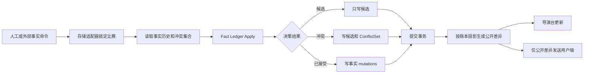

# 球球事实账本重放与冲突边界方案

## 文档状态

- 状态：待产品确认，尚未进入代码实施
- 日期：2026-07-20
- 前置方案：`operator-live-director-redesign-plan.md`
- 本阶段范围：事实重放、公开比分派生、候选事实隔离、跨来源冲突、确认/撤销/更正/调和
- 本阶段不处理：多导演时钟同步、PostgreSQL 首次建钟并发、全事件参与人领域校验、球球话术人味

## 1. 结论

当前问题不是“撤销进球时少减了一分”，而是同一个 `MatchEvent.Score` 同时承担了三种互相冲突的职责：

1. 数据源声称当时比分是多少。
2. 后端判断新事件是否合理时使用的基准。
3. 客户端最终展示的公开比分。

当前快照直接采用最后一条活动事件携带的绝对比分。因此早期进球被撤销后，只要后面还有一条普通射门记录着旧比分，旧比分就会被重新写回。候选事实也会进入内部快照，污染下一条事件的校验基准。

冲突处理还有第二个职责混淆：新来源与已确认事实冲突时，系统把原已确认事实也降级为 `conflict` 并撤出公开状态。结果是“新消息还没确认”被错误地解释为“用户已经看到的旧事实立刻失效”。

解决方案是新增一个深模块：**事实账本模块（Fact Ledger）**。

它统一负责：

- 从不可变事实历史重建公开状态。
- 计算每条公开事实对比分的真实贡献。
- 保证候选和冲突事实不参与公开投影。
- 对创建、确认、撤销、更正和调和命令给出原子决策。
- 让内存仓库与 PostgreSQL 通过同一个模块获得完全相同的结果。

核心原则：

> 事件携带的比分只能作为来源证据，公开比分只能由已接受事实重放产生。

## 2. 已确认根因

### 2.1 最后一条事件覆盖公开比分

`buildSnapshot()` 顺序扫描事件，并执行：

```go
snap.Score = ev.Score
```

这意味着普通射门、黄牌、VAR 检查等非计分事件也拥有改写最终比分的能力。

错误场景：

```text
10:00 主队进球       1-0
11:00 主队射门       1-0
12:00 撤销 10:00 进球

当前结果：1-0，因为 11:00 射门重新带回旧比分
正确结果：0-0，因为射门不产生比分贡献
```

### 2.2 候选事实参与内部校验

创建新事件时，内存仓库和 PostgreSQL 都可能使用包含 `provisional` 事实的内部快照作为比分基准。

错误场景：

```text
公开比分                0-0
外部候选：主队进球      声称 1-0
导演随后记录一次射门    正确应携带 0-0

当前校验可能要求射门携带 1-0
```

候选事实没有公开权，就不能成为后续事实的权威基准。

### 2.3 新冲突会撤销旧公开事实

当前跨来源冲突逻辑会同时把新事件和原已确认事件改成 `conflict`，并清空原事实的 `public_at`。

错误场景：

```text
导演已确认：西班牙进球，公开比分 1-0
外部源晚到：德国进球，声称 0-1

当前结果：原 1-0 立即退出公开状态
正确结果：用户继续看到最后已接受的 1-0；新消息进入冲突队列，等待导演选择
```

冲突是对“新候选能否被接受”的判断，不是自动撤销既有公开事实的命令。

### 2.4 内存与 PostgreSQL 重复实现领域规则

创建、冲突、确认、撤销、调和和快照生成分别在内存仓库与 PostgreSQL 中实现。两个适配器都在承担领域决策，导致修复必须复制，测试也容易只覆盖其中一条路径。

## 3. 领域语言

### 3.1 事实记录（Fact Record）

某个来源对赛场发生事项的一次记录。记录不可物理覆盖，后续更正通过新版本或关联事实表达。

### 3.2 已接受事实（Accepted Fact）

状态为 `confirmed` 或 `reconciled`、记录状态为 `active`、公开性为 `public` 的事实。只有已接受事实参与公开投影。

### 3.3 候选事实（Candidate Fact）

状态为 `provisional` 或 `conflict` 的事实。它可以出现在导演台，但不能改变用户端比分、事件轮播或球球主动互动。

### 3.4 事实投影（Fact Projection）

由事实账本按确定性规则重建出的结果，包括公开比分、公开事件、关键事件、最近状态和完整性状态。投影不是新的事实来源。

### 3.5 冲突集合（Conflict Set）

描述两条或多条互斥事实之间的关系。冲突集合有独立状态，不再借用某条旧事实的公开状态表达。

## 4. 目标模块与 seam

### 4.1 模块位置

阶段 A 先把 seam 放在 `matchstate` 包内部：

```text
backend/internal/matchstate/fact_ledger.go
```

这样可以直接复用现有事实类型，避免为了目录独立制造 Go 包循环或重复 DTO。类型所有权完成迁移后，再评估是否抽成 `backend/internal/factledger` 独立包。

事实账本是纯进程内模块，不访问数据库、不发布 WebSocket、不调用 LLM。它接受完整历史和命令，返回需要持久化的决策与公开投影。

### 4.2 外部 Interface

```go
type FactLedgerEngine struct{}

func (FactLedgerEngine) Apply(input FactLedgerApplyInput) (FactLedgerApplyResult, error)
func (FactLedgerEngine) Project(input FactLedgerProjectInput) (FactLedgerProjection, error)
```

`Apply` 处理所有事实写命令：

- `create`
- `confirm`
- `revoke`
- `correct`
- `reconcile`
- `reject_conflict`

`Project` 只从已有历史重建结果，用于读路径、启动恢复、迁移核对和测试。

### 4.3 Apply 输入与输出

```go
type ApplyInput struct {
    MatchID      string
    History      History
    Command      Command
    MatchConfig  matchstate.MatchConfig
    MatchClock   matchstate.MatchClock
    Now          time.Time
}

type ApplyResult struct {
    Mutations        []FactMutation
    ConflictMutation *ConflictMutation
    Projection       Projection
    PublicDeliveries []ProjectedEvent
}
```

存储适配器只负责：

1. 在事务中锁定比赛。
2. 读取事实历史与冲突集合。
3. 调用 `Engine.Apply()`。
4. 持久化返回的 mutations。
5. 提交事务后发送 `PublicDeliveries`。

内存仓库与 PostgreSQL 不再自己决定哪些事实公开、比分是多少、冲突时撤销谁。

## 5. 事实状态与公开权

| 事实状态 | 导演台可见 | 用户端可见 | 参与比分投影 | 可以转移到 |
|---|---:|---:|---:|---|
| `provisional` | 是 | 否 | 否 | `confirmed`、`conflict`、`revoked` |
| `confirmed` | 是 | 是 | 是 | `revoked`、新版本更正 |
| `conflict` | 是 | 否 | 否 | `reconciled`、`revoked` |
| `reconciled` | 是 | 是 | 是 | `revoked`、新版本更正 |
| `revoked` | 是，历史态 | 否 | 否 | 无 |

重要变化：

- 新冲突出现时，既有 `confirmed/reconciled` 事实保持原状态和公开权。
- 只有导演明确选择新的冲突事实后，原事实才在同一事务中转为 `revoked`。
- `MatchIntegrity=conflict` 表示存在未解决争议，不表示最后已接受事实失效。

## 6. 比分重放规则

### 6.1 权威顺序

投影按 `recorded_sequence` 重放，而不是按比赛分钟排序。

原因：比分更正、VAR 取消和人工调和表达的是“系统在何时接受了这个事实命令”。比赛分钟用于展示和事件关系，不能代替事实提交顺序。

数据库新增单调递增的 `recorded_sequence`。旧数据按 `created_at, id` 回填确定顺序。

### 6.2 计分贡献

| 事件类型 | 投影动作 |
|---|---|
| `goal` | 对所属球队 `+1` |
| `goal_cancelled` | 取消被引用原进球的一次贡献；不能重复取消 |
| `score_correction` | 设置一个新的绝对比分检查点 |
| 其他事件 | 不改变比分 |

事件中来源上报的 `Score` 不再直接写入公开快照。

### 6.3 更正与撤销

- 更正只让同一事实的最新活动版本参与投影。
- 撤销任何历史事实后，从账本起点重新投影；不要求先修改所有后续普通事件。
- 更正早期进球归属后，后续事件自动获得新的有效比分上下文。
- 最新活动的 `score_correction` 是比分检查点：检查点之前的事实仍保留在时间线，但不再直接改变检查点之后的当前比分。
- 撤销或更正检查点之前的事实会改变历史投影与审计结果，但当前比分仍以检查点为基准。
- 撤销比分更正后，系统重新使用其之前和之后仍有效的计分事实重建比分。

### 6.4 进球取消

`goal_cancelled` 通过 `revisionOf` 引用原进球：

- 原进球仍保留在事实时间线中。
- 取消事实单独保留发生时间、原因和来源。
- 投影把原进球贡献标记为已中和，而不是机械地对当前比分减一。
- 同一进球最多有一个活动的取消事实。
- 如果原进球后来被撤销，取消事实不再产生额外负分。
- 如果被取消进球早于最新活动的比分检查点，系统拒绝直接创建 `goal_cancelled`，要求导演发布新的 `score_correction`，避免检查点已经包含改判结果时再次扣分。

### 6.5 比分更正

`score_correction` 定义为“从本次事实提交开始采用的绝对比分检查点”，不是改写整场历史。

检查点把此前所有计分贡献折叠成一个新的权威基准；只有检查点之后的进球、进球取消和新比分更正继续改变当前比分。

示例：

```text
进球 A                     1-0
比分更正                   0-0
进球 B                     1-0
撤销比分更正               2-0（A、B 都重新参与）
```

## 7. 冲突边界

### 7.1 新冲突进入系统

当新来源与已接受事实在事件类型、阶段和时间窗口内互斥：

1. 新事实保存为 `conflict`。
2. 原已接受事实保持 `confirmed/reconciled`。
3. 创建或复用一个 `ConflictSet`。
4. 比赛完整性状态变成 `conflict`。
5. 公开比分与用户端事件不变。
6. 只向导演台推送冲突候选，不向用户端发布比赛事实。

### 7.2 导演选择原事实

执行 `reject_conflict`：

- 新候选转为 `revoked`。
- 原事实保持已接受。
- 冲突集合标记已解决，记录操作者和原因。
- 如果该比赛没有其他开放冲突，完整性恢复 `ok`。
- 公开投影不变化，因此不触发用户端比分更新或球球主动话术。

### 7.3 导演选择新事实

执行 `reconcile`，在同一事务中：

- 新事实转为 `reconciled`。
- 与其互斥的原已接受事实转为 `revoked`。
- 冲突集合记录被选择的 `factId`、操作者、理由和时间。
- 事实账本重新投影。
- 只发布投影差异；用户不会短暂看到“无比分”或两个事实同时生效。

### 7.4 用户端与球球的表现

推荐产品策略：

- 用户端继续展示最后已接受比分，不显示“导演台”“信号源冲突”等内部术语。
- 如果用户主动问到争议事件，球球可以说“我这边还没完全跟上，等一下确认”，不能顺着任一新候选编造。
- 调和完成后，如果结论改变了用户已看到的事实，球球通过正常赛场语言跟进，例如“刚才那球改判了”。
- 只保留原结论时，不额外打断用户。

## 8. 数据模型

### 8.1 事件顺序

为 `match_events` 新增：

```sql
recorded_sequence BIGSERIAL NOT NULL
```

并建立：

```sql
CREATE INDEX idx_match_events_replay
ON match_events(match_id, recorded_sequence);
```

### 8.2 冲突集合

新增：

```text
fact_conflicts
  id
  match_id
  status              open / resolved
  chosen_fact_id
  reason
  detected_at
  resolved_at
  resolved_by

fact_conflict_members
  conflict_id
  fact_id
  role                accepted / candidate
```

冲突关系不塞进 `Evidence` JSON，避免查询、唯一约束和事务调和依赖非结构化字段。

### 8.3 上报比分与有效比分

本阶段保留现有 `score_home/score_away` 数据列，但将其定义为“来源上报比分”。

- 写入接口继续兼容当前 `score` 字段。
- 领域命令内部命名为 `ReportedScore`。
- 公开响应中的 `score` 来自投影后的 `EffectiveScoreAfter`。
- 导演台审计详情同时展示“来源上报比分”和“生效后比分”。

后续稳定版本可以再做物理列重命名，本阶段不进行高风险列替换。

## 9. 写入流程



## 10. 读路径

所有公开读路径必须来自同一次 `Project()`：

- `/api/matches/{id}/state`
- 用户 WebSocket 首次快照
- 公共事件列表
- 球球对话上下文
- 主动互动判断

导演台事件列表额外读取候选和冲突集合，但顶部公开比分仍使用同一公开投影。

禁止以下调用继续存在：

- 直接取最后一条 `event.Score` 作为比赛比分。
- 使用包含候选的快照校验新事实。
- 内存仓库和 PostgreSQL 各自实现冲突状态迁移。

## 11. 兼容与迁移

### 11.1 历史顺序回填

按每场比赛的 `created_at, id` 顺序回填 `recorded_sequence`，并执行一次离线投影审计：

- 对比旧快照与新投影。
- 输出比分不同的比赛清单。
- 不自动覆盖生产数据。

### 11.2 已存在冲突恢复

现有系统可能已经把原确认事实降级为 `conflict`。迁移时使用 `fact_revisions` 恢复：

1. 查找冲突前最后一个 `confirmed/reconciled` 修订。
2. 将它标记为冲突集合中的 `accepted` 成员，并恢复公开权。
3. 后到来源作为 `candidate`。
4. 无法从历史判断的比赛保持人工待处理，不自动猜测。

### 11.3 API 兼容

- 创建事件仍接受当前 payload。
- `score` 输入继续作为来源断言。
- 公共输出 `score` 保持原字段名，但值由投影生成。
- 新增可选 `reportedScore` 供导演台审计。
- 新增 `conflictId` 和 `conflictsWith` 仅出现在导演权限响应。

## 12. 实施阶段

### 阶段 A：建立纯投影模块

- 新增 `matchstate.FactLedgerEngine.Project()`，后续随类型所有权迁移再抽出独立包。
- 用当前事件历史重建公开比分和公共事件。
- Store 与 PostgreSQL 同时接入只读影子投影。
- 记录旧快照与新投影差异，不改变线上返回。

退出条件：同一历史在内存与 PostgreSQL 得到完全一致的投影。

实施状态（2026-07-20）：**已完成**。纯投影、`recorded_sequence` 迁移、完整公共事件影子审计、非法取消边界和跨适配器一致性测试均已落地；线上公共读路径仍保持旧实现，阶段 B 尚未开始。

### 阶段 B：公开读路径切换

- `/state`、WebSocket 初始快照、球球上下文改用新投影。
- 新事件校验基准改为公开投影。
- 候选事实彻底退出比分和后续事实校验。
- 删除 `buildSnapshot()` 对绝对事件比分的覆盖逻辑。

退出条件：撤销任意历史计分事实都能正确重建当前比分。

实施状态（2026-07-20）：**已完成**。公共快照、公共事件、WebSocket、球球上下文和写入校验基准已切换到事实账本投影；`FACT_LEDGER_PUBLIC_READS=false` 可回退旧公共投影。

### 阶段 C：冲突集合与原子调和

- 新增冲突表和写入流程。
- 新冲突不再修改原已接受事实。
- 导演台接入“保留原事实 / 采用新事实”。
- 调和通过单事务切换公开权并发布一次投影差异。

退出条件：开放冲突期间用户端状态稳定，调和后只出现一个确定结果。

实施状态（2026-07-20）：**已完成**。已新增 `fact_conflicts` / `fact_conflict_members` 正式模型；冲突创建、成员写入、事实切换、完整性恢复和 outbox 信号位于同一事务。导演台通过 `POST /api/matches/{matchId}/conflicts/{conflictId}/resolve` 明确选择“保留原事实 / 采用新事实”，运营事件响应包含冲突集合，公共响应不暴露内部争议。内存与 PostgreSQL 均覆盖多组开放冲突隔离、两种选择、幂等响应和重启恢复；并发事件 ID 已改为随机 ID，事务内读取统一使用同一数据库事务。

### 阶段 D：统一写命令

- 创建、确认、撤销、更正、调和全部进入 `Engine.Apply()`。
- 删除 Store 与 PostgreSQL 内重复的领域分支。
- 移除“后续事件存在时禁止更正早期计分事实”的临时限制。
- 清理旧冲突修订逻辑。

退出条件：两个存储适配器只负责事务和持久化，所有领域测试通过事实账本 Interface。

### 阶段 E：生产迁移与观察

- 对现有比赛运行影子投影审计。
- 修复或人工确认无法自动恢复的历史冲突。
- 灰度切换公开投影。
- 保留旧投影指标一个发布周期，支持只读回退。

## 13. 验收测试矩阵

### 13.1 比分重放

1. `进球 -> 射门 -> 撤销进球`，最终比分 `0-0`。
2. `进球 A -> 进球 B -> 撤销 A`，最终只保留 B 的贡献。
3. `进球 -> 黄牌 -> 更正进球归属`，后续黄牌不阻止更正，比分正确换队。
4. `进球 -> VAR 检查 -> 进球取消`，比分回退，三条事实都保留。
5. 同一进球重复取消被拒绝。
6. 撤销原进球后，已有取消事实不会产生负分。
7. 检查点之后不能直接取消检查点之前的进球，必须使用新比分更正。
8. `比分更正 -> 进球 -> 撤销比分更正`，按检查点规则重新投影。

### 13.2 候选边界

1. 候选进球不改公开比分。
2. 候选进球后发布普通射门，校验基准仍是公开比分。
3. 确认候选时使用确认瞬间的公开投影重新校验。
4. 过时候选不能静默覆盖新公开状态。

### 13.3 冲突边界

1. 已确认主队进球后收到客队冲突进球，公开比分保持原值。
2. 冲突期间原事实仍在公共事件列表。
3. 选择原事实时用户端无额外事件和比分抖动。
4. 选择新事实时，原事实撤销、新事实公开和比分变化在一个事务中完成。
5. 断线客户端重连后只收到最终公开投影，不重放候选。
6. 多个开放冲突分别解决，不按模糊时间窗口误撤销其他事实。

### 13.4 适配器一致性

同一组命令表驱动测试必须同时运行在：

- 内存存储适配器。
- PostgreSQL 存储适配器。

测试只断言 `Engine` Interface 的结果和公共仓库行为，不分别复制领域预期。

### 13.5 双端端到端

- 导演台产生候选，用户端无变化。
- 外部源产生冲突，用户端保持最后已接受事实。
- 导演调和后，用户端比分、事件卡片、球球互动和日志一致更新。
- 用户领先直播时，待确认观察与最终事实仍只跟进对应用户。

## 14. 观察指标

- `fact_projection_mismatch_total`：影子投影与旧快照不一致次数。
- `fact_projection_duration_ms`：单场投影耗时。
- `open_fact_conflicts`：开放冲突数。
- `fact_conflict_resolution_seconds`：冲突解决耗时。
- `candidate_public_leak_total`：候选进入公共投影次数，必须恒为 0。
- `score_replay_error_total`：投影出现负分、重复取消或关系断裂次数。
- `public_projection_version`：客户端和服务端投影版本，用于排查不同步。

## 15. 风险与回退

### 15.1 主要风险

- 历史事件中的绝对比分可能掩盖缺失进球事实，新投影会暴露数据缺口。
- 当前已存在的冲突可能无法全部自动判断原已接受事实。
- 公共事件响应中的历史 `score` 语义变化需要客户端同步验证。
- 全量重放虽然事件量不大，仍需验证 90 分钟高频数据下的耗时。

### 15.2 回退策略

- 阶段 A 只影子计算，无线上行为变化。
- 阶段 B 通过功能开关选择旧/新公共投影。
- 冲突表是新增结构，回退不删除原事件和修订历史。
- 禁止通过回写旧绝对比分进行回退，避免制造第二套事实。

## 16. 需要确认的产品决策

本方案给出以下推荐默认值：

1. **开放冲突期间是否保持最后已接受比分？** 推荐：保持。
2. **用户端是否展示“数据冲突”技术状态？** 推荐：不展示内部术语；球球只在相关追问中自然表达尚未确认。
3. **比分更正是历史改写还是时间点检查点？** 推荐：时间点检查点，保留完整审计。
4. **采用新冲突事实后，原事实如何处理？** 推荐：原子转为 `revoked`，新事实转为 `reconciled`。
5. **是否允许更正早期计分事实，即使之后已有普通事件？** 推荐：允许，由账本完整重放保证后续状态正确。

以上五项确认后再进入阶段 A，不在确认前修改现有事实写入逻辑。
