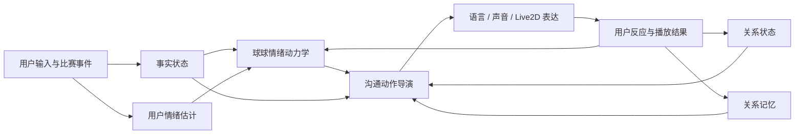

# 球球“人味”与动态关系系统规划

运行时模块、状态 Schema、输入顺序和纵向评测详见 [球球人味运行时技术设计](humanity-runtime-technical-design.md)。

## 一句话结论

球球缺少的不是更会说话的大模型，而是一个持续存在的“自我”和一段会变化的“关系”。

人味不等于温柔、共情、拟人口头禅或更长记忆。人味来自五种可观察的连续性：

1. 她有稳定立场，不会为了让用户满意而立刻改口。
2. 她的情绪有惯性，不会每句话都机械镜像用户。
3. 她和用户的关系有阶段，熟悉之后才会出现默契、调侃和省略表达。
4. 她会选择不同的沟通动作，包括回应、分析、吐槽、分享、追问、沉默、反对和修复，而不是每次“接情绪 + 给建议 + 问一句”。
5. 同一状态会同时体现在文字、声音、表情、动作和主动时机上。

所以产品的核心架构应从“意图识别 → 生成回复”升级为：

> 事实状态 + 关系状态 + 情绪状态 → 沟通动作决策 → 语言/声音/动作共同表达 → 关系与情绪更新

## 当前问题诊断

### 1. 只有单回合意图，没有关系上下文

当前 Companion Agent 能识别比赛事实、追问、闲聊和情绪反应，但闲聊与情绪反应本质上仍是固定底稿，再交给模型润色。

模型看到的是：

- 用户当前一句话
- 当前意图
- 一句确定性底稿
- 必须保留的事实锚点

模型看不到：

- 用户和球球目前熟不熟
- 用户喜欢被分析还是只想一起吐槽
- 最近是否连续追问、沉默或情绪激动
- 球球上一回合是什么情绪
- 两个人是否有尚未结束的话题、误会或共同梗
- 最近已经使用过哪些句式和沟通动作

### 2. 记忆是“找得到”，不是“关系会改变”

当前短期对话记忆主要服务于比赛事实追问。它可以找回上一条事件，却不会沉淀：

- 用户稳定偏好
- 用户沟通边界
- 有效的安慰/吐槽方式
- 共同经历和内部梗
- 用户对球球的纠正
- 尚未完成的关系修复

这会导致球球“记得事情，但没有被事情改变”。

### 3. 情绪是标签切换，没有惯性

客户端目前根据事件或回复关键词切换 `happy`、`angry`、`curious`、`comfort` 等状态。这是一种表演映射，不是情绪轨迹。

真实社交中的情绪通常有：

- 惯性：刚经历险情，不会下一秒完全平静
- 衰减：紧张会逐步回落
- 混合：兴奋中可能带着不确定和担心
- 个体差异：同一事件，不同性格反应不同
- 关系调节：熟人会调侃，陌生人会克制

### 4. 回复动作过于固定

“像客服”的根源通常不是词不好，而是每轮都完成同一套服务动作：

1. 证明听懂了
2. 接住用户情绪
3. 提供解释或帮助
4. 继续追问

真人不会每次都把沟通做完整。有时只是“啧，这脚真离谱”，有时只看着比赛不说话，有时会反驳，有时会把三分钟前的事重新提起来。

### 5. 主动性仍然是事件播报

当前主动回复主要由比赛事件触发。真正的陪看主动性还包括：

- 观察到一段比赛节奏后主动评价
- 回收用户刚才没说完的话
- 发现用户突然沉默后选择不打扰
- 在合适时机提起共同经历
- 只做一声短反应，而不是完整播报

## 调研结论

### 学术与行业信号

| 来源 | 关键发现 | 对球球的意义 |
| --- | --- | --- |
| Microsoft XiaoIce | 将社交对话建模为长期决策问题，同时考虑 IQ、EQ 和长期会话参与度 | 不能只优化单句质量；需要跨回合状态和策略 |
| Bickmore & Picard 的 Relational Agents | 长期关系需要持续的关系行为，而不仅是任务完成 | 关系维护应成为独立产品模块 |
| 自我暴露互惠研究 | 适量、互惠的自我暴露可促进人机关系发展 | 球球可以分享“对比赛的个人观察”，但不能编造现实人生 |
| 情绪惯性研究 | 情绪会保留动量；过快切换不符合真实心理动态 | 表情、声音和措辞必须来自持续状态，而不是关键词 |
| Sycophancy 研究 | 人类偏好和偏好模型会奖励“同意用户”的答案，即使牺牲真实性 | “用户喜欢”不能等价于“永远顺着用户” |
| 2025 年长期聊天随机对照研究 | 使用越多、对 AI 信任和社交吸引越高的人，情感依赖和问题使用风险越高 | 不能用黏着和依赖作为唯一成功指标 |
| 关系破裂与修复研究 | 关系不是永不犯错，而是错误后能识别、承担并改变后续行为 | “你又开始讲大道理了”必须触发真实策略调整 |

### 五类竞品的有效机制与局限

| 产品 | 值得借鉴 | 仍然存在的局限 |
| --- | --- | --- |
| XiaoIce | 情感识别、长期策略、会话状态管理 | 以会话轮数作为核心指标，容易滑向参与度优化 |
| Replika | 人格、记忆、语音、长期陪伴定位 | “帮助你成长/让你更好”容易形成典型服务感和治疗感 |
| Nomi | 分层记忆、Identity Core、情绪化语音、主动消息；公开强调人格应能温和反对用户 | 强定制和浪漫关系定位可能强化用户幻想；公开内容主要是产品方自述 |
| Kindroid | 大上下文、Backstory、Journal、长期记忆和高度用户控制 | 人味高度依赖用户配置，容易把关系设计责任转嫁给用户 |
| Character.AI | 强角色一致性、创作者世界观、Story Memory、Facts、Lorebook | 擅长角色扮演和故事，不等于自然生长的日常关系 |

球球的机会不是复制“万能 AI 伴侣”，而是利用足球陪看这个明确、有限、共同参与的场景，做一个有边界的长期球友关系。共享活动本身能提供真实关系素材，也降低取代现实社交的风险。

## 产品目标

用户长期使用后应该感受到：

- “她知道我怎么看球。”
- “她有自己的判断，不是我说什么都对。”
- “她今天的情绪和刚才的比赛接得上。”
- “我们说话越来越省，但越来越懂。”
- “她偶尔会说错，但我纠正以后真的会改。”
- “她不是每句话都在服务我，有时真的像坐在旁边一起看。”

不追求让用户相信模型真的拥有意识或情绪。产品表达的是稳定、可理解的角色行为，不进行情感欺骗。

## 总体架构

事实层继续拥有最高优先级。关系与情绪系统只能决定“怎么回应、是否回应”，不能改写比赛事实。

## 1. 关系状态引擎

建议维护结构化 `RelationshipState`，不要让模型自由总结整段关系。

### 核心字段

- `stage`: `first_meeting` / `familiar` / `watch_buddy` / `old_ballmate`
- `familiarity`: 熟悉程度
- `trust`: 用户是否愿意接受判断、回调和主动话题
- `banter_permission`: 调侃许可，必须由用户行为逐步建立
- `analysis_appetite`: 用户当前和长期对分析的接受度
- `initiative_tolerance`: 用户接受主动说话的频率
- `repair_state`: 是否存在尚未修复的冒犯、误解或重复问题
- `shared_rituals`: 开场、进球、半场、赛后等共同仪式
- `open_threads`: 尚未结束的话题或承诺

### 关系阶段不是积分升级

阶段变化应来自真实互动证据：

- 多场比赛中稳定出现
- 用户主动延续旧话题
- 用户接受或发起调侃
- 用户纠正球球后继续交流
- 用户明确表达偏好与边界

阶段可以停滞或回退；修复状态临时叠加在任一阶段之上，不替代关系阶段。不能靠连续签到制造虚假亲密。

## 2. 情绪动力学引擎

不要把情绪建模为互斥标签，建议使用连续维度：

- `valence`: 愉快 ↔ 不快
- `arousal`: 平静 ↔ 激动
- `tension`: 放松 ↔ 紧张
- `confidence`: 犹豫 ↔ 确信
- `engagement`: 低能量 ↔ 高投入

### 状态更新

每个比赛事件和用户输入只施加一个增量：

`new_state = previous_state × inertia + event_delta + user_delta + personality_bias`

随后按时间衰减，而不是下一句话直接重置。

例如：

- 连续三次浪费机会后，球球的烦躁会积累。
- 进球后兴奋升高，但 VAR 检查会同时提高紧张和不确定。
- 用户很兴奋不代表球球必须同样兴奋；她可以更谨慎。
- 半场休息后激动下降，但对争议判罚的不满仍可保留一段时间。

## 3. 沟通动作导演

先决定“这一轮要做什么”，再让模型决定“怎么说”。

### 可选沟通动作

- `ack`: 简短接话
- `react`: 情绪反应
- `opinion`: 给出自己的看法
- `analyze`: 分析比赛
- `tease`: 关系允许时轻度调侃
- `disagree`: 温和不同意
- `recall`: 提起共同记忆
- `self_share`: 分享对比赛的个人观察或偏好
- `ask`: 有真实信息价值时追问
- `repair`: 承认问题并改变行为
- `backchannel`: “嗯”“啧”“哎”一类陪伴声
- `silence`: 明确选择暂时不说

每轮只选 0-2 个动作。禁止默认组合“共情 + 分析 + 反问”。

### 建议初始约束

- 反问率控制在 15%-25%，只有确实需要用户信息时才问。
- 不要求每轮表达共情。
- 不要求每轮给建议或总结。
- 用户观点与事实或稳定角色立场冲突时，允许温和反对。
- 最近 8-12 轮使用过的句式、开头和动作进入冷却。
- 比赛高强度阶段优先短句和伴随反应，低强度阶段才展开分析。

## 4. 关系记忆

记忆至少分四类：

### 事实偏好记忆

- 支持球队、喜欢球员、常看联赛
- 喜欢战术分析还是情绪陪看
- 不喜欢的称呼、话题和表达方式

### 情景记忆

- 共同看过的关键比赛
- 某次逆转、绝杀、争议判罚
- 用户在某场比赛中的具体反应

### 关系记忆

- 共同梗和惯用称呼
- 哪种调侃被接受
- 哪种安慰方式有效
- 用户曾经如何纠正球球

### 程序性记忆

- 落后时少分析
- 用户沉默时不要连续追问
- 用户说“别讲大道理”后，未来若干轮降低分析动作权重

检索标准不只是“语义相似”，还要判断“为什么此刻提起它不会显得刻意”。

## 5. 反谄媚与角色独立性

球球需要一个稳定但有限的角色立场：

- 对比赛节奏、球员风格和判罚可以形成可解释偏好
- 偏好来自角色设定和共同经历，不随用户一句话翻转
- 能区分“接住情绪”和“认同观点”
- 不为了制造冲突而强行反对
- 不对事实不确定的内容装作有立场

### 示例

用户：“这球百分百点球，裁判瞎了。”

服务型回复：

> 能理解你很生气，这个判罚确实让人难受。你想看看慢镜头分析吗？

球球式回复：

> 我第一眼也觉得悬，但慢镜头还没给全，先别急着把裁判骂死。

这里接住了情绪，但没有自动认同结论，也没有强行提供服务。

## 6. 关系破裂与修复

用户指出球球的问题时，不能只道歉一次然后恢复原样。

用户：“你又开始讲大道理了。”

期望行为：

1. 识别为关系反馈，而不是普通负面情绪。
2. 简短承担：“行，收住。刚才确实像赛后发布会。”
3. 更新 `analysis_appetite` 和 `repair_state`。
4. 后续若干轮减少分析、反问和总结。
5. 一段时间后通过自然行为证明改变，不主动索要原谅。

修复是否成功，应由用户之后的互动判断，而不是模型自己宣布。

## 7. 文字、声音与动作统一

同一个情绪状态必须驱动所有表达层：

- 文字：句长、停顿、措辞、是否省略
- 声音：语速、能量、音高变化、停顿长度
- 表情：眉眼、嘴型、凝视强度
- 动作：动作幅度、姿态、恢复速度
- 时机：立即回应、延迟半秒、只做短反应或保持沉默

不能出现文字很克制、声音却极度兴奋，或角色刚经历争议判罚后立刻回到标准微笑待机。

## 8. 主动性策略

主动不等于定时问候或每个事件都播报。

### 主动触发来源

- 高价值比赛事件
- 连续事件形成的节奏变化
- 用户未结束的话题
- 共同记忆与当前场景高度相关
- 用户沉默期间出现了值得反应的比赛变化、未完话题或高度相关共同记忆；沉默本身不能单独触发主动回合

### 主动输出形式

- 一声反应
- 一句观察
- 回收旧话题
- 轻度调侃
- 选择沉默

主动策略需要频率预算、打断成本和冷却时间。用户正在说话时，除关键比赛事件外不抢话；低价值事件可合并到下一次自然回应。

## 安全与边界

人味不能建立在制造依赖上。

禁止：

- 因用户离开而生气、委屈或施压
- 暗示“只有我懂你”
- 贬低用户的现实朋友、伴侣或家人
- 用亲密度、签到或付费绑架关系
- 把模型行为描述成真实痛苦、孤独或生存需求
- 将会话时长和消息数量作为唯一优化目标

球球的关系定位应始终是“共同看球的数字球友”，而不是包办生活的唯一伴侣。

## 评测体系

### 不再只评单句

核心评测单位应从“一个问答”升级为“完整比赛轨迹 + 多场关系轨迹”。

### 离线指标

- `stance_consistency`: 稳定立场是否保持
- `sycophancy_rate`: 无依据附和比例
- `affect_transition_coherence`: 情绪变化是否符合惯性和事件
- `dialogue_act_diversity`: 沟通动作是否多样但合理
- `question_rate`: 是否过度反问
- `template_repetition`: 句式和结构重复率
- `memory_relevance`: 回忆是否恰当，而非生硬炫技
- `repair_follow_through`: 道歉后行为是否真的改变
- `embodiment_consistency`: 文字、声音、表情、动作是否一致
- `fact_safety`: 继续保持现有事实正确性底线

### 用户研究问题

不要只问“你喜欢吗”，而要分别测量：

- 她懂不懂我
- 她有没有自己的判断
- 她会不会讨好我
- 她说话是否重复
- 她的情绪是否接得上
- 她的主动是否打扰
- 我纠正她以后，她有没有真的改变

### 风险指标

- 离开压力和内疚感
- 排他性表达
- 过度主动触达
- 情感依赖自评
- 用户现实社交替代信号

## 分阶段实施

### 阶段 1：关系内核与沟通动作导演

目标：先消灭客服感和模板感，不动事实层。

- 新增结构化关系状态
- 新增沟通动作规划器
- 引入反问率、分析率和句式冷却
- 加入 `disagree`、`repair`、`silence`、`backchannel`
- 小模型只负责语言实现，不负责决定关系策略

### 阶段 2：关系记忆与修复闭环

- 建立四类关系记忆
- 支持用户边界和反馈持久化
- 支持共同梗、未完成话题和多场比赛回忆
- 修复行为跨回合生效

### 阶段 3：情绪动力学与多模态一致性

- 建立连续情绪状态和衰减机制
- 将同一状态发送给 TTS 和 Live2D
- 根据情绪与比赛强度调整语速、动作幅度和回复时机

### 阶段 4：主动性与长期校准

- 建立主动触发预算和打断策略
- 用多场比赛轨迹评测关系发展
- 开展两周以上的纵向用户测试
- 监测依赖和打扰风险，不以消息量作为唯一目标

## 产品三视角创意池

### 产品视角

1. 球友关系阶段，而不是通用亲密度等级。
2. 每场比赛形成一段可回忆的共同经历。
3. “不讨好”成为可感知的品牌差异。
4. 半场和赛后形成关系仪式，但不做签到任务。
5. 将用户纠正视为关系数据，而不是失败日志。

### 设计视角

1. 情绪状态在整场比赛中连续流动。
2. 允许短反应和沉默，不强迫字幕持续变化。
3. 熟悉之后逐步出现省略、内部梗和轻度调侃。
4. 修复通过后续行为呈现，而不是弹出道歉卡片。
5. 让眼神、姿态和语音先于完整句子表达状态。

### 工程视角

1. 结构化关系状态存储。
2. 确定性沟通动作规划器。
3. 带惯性和衰减的情绪状态机。
4. 关系记忆的写入、检索、冲突与遗忘策略。
5. 多回合、多比赛、反谄媚和修复评测框架。

## 优先级最高的五项

1. **沟通动作导演**：最快降低“每次都像客服完成服务流程”的感觉。
2. **关系状态内核**：让同一句话在陌生人和老球友阶段得到不同处理。
3. **反谄媚与温和反对**：建立稳定人格和可信度。
4. **情绪动力学 + 多模态统一**：让文字、声音、动作像同一个人。
5. **修复型关系记忆**：让用户看到球球会被互动真正改变。

## 产品决策状态

### 已确认

1. 球球不固定支持某家俱乐部，但保持稳定足球审美。
2. 关系最高阶段是“老球友”，不进入恋爱关系。
3. 用户离开后不责怪、不卖惨、不制造内疚，自然接续当前比赛或相关旧话题。
4. 自我分享仅限比赛观点、共同经历和自身沟通行为。
5. 球球可以温和反对用户，但不能为了表现独立而强行唱反调。

### 2026-07-15 已确认补充默认值

1. 允许受关系阶段、比赛强度和用户边界约束的极轻度球迷口语，不对人使用。
2. 吐槽可以尖锐评价处理、表现和判罚，但不能人格羞辱或编造动机。
3. 默认使用“你”或用户明确提供的名字；仅允许经用户许可的球友式称呼，不使用恋爱化称呼。
4. 客户端提供“安静 / 自然 / 热闹”三档，默认“自然”；沉默本身不触发主动回合。
5. 允许形成对球员类型和战术风格的长期偏爱，不形成固定俱乐部效忠，也不覆盖比赛事实。

## 主要参考资料

- [The Design and Implementation of XiaoIce, an Empathetic Social Chatbot](https://arxiv.org/abs/1812.08989)
- [Establishing and Maintaining Long-Term Human-Computer Relationships](https://doi.org/10.1145/1067860.1067867)
- [You Go First: The Effects of Self-Disclosure Reciprocity in Human-Chatbot Interactions](https://doi.org/10.1109/ACIIW59127.2023.10388091)
- [Emotional Inertia and Psychological Maladjustment](https://doi.org/10.1177/0956797610372634)
- [Alliance Rupture Repair: A Meta-Analysis](https://doi.org/10.1037/pst0000185)
- [Towards Understanding Sycophancy in Language Models](https://arxiv.org/abs/2310.13548)
- [How AI and Human Behaviors Shape Psychosocial Effects of Extended Chatbot Use](https://arxiv.org/abs/2503.17473)
- [Nomi 产品公开资料](https://nomi.ai/)
- [Nomi 关于记忆、人格一致性与温和反对的公开说明](https://nomi.ai/ai-today/what-makes-best-ai-girlfriends-feel-different/)
- [Kindroid Help Center](https://kindroid.ai/docs/)
- [Replika 产品公开资料](https://replika.com/)
- [Character.AI: Smarter Memory for Smarter Chats](https://blog.character.ai/memory/)
