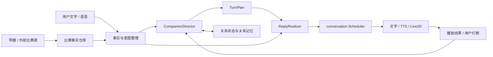

# 球球人味运行时技术设计 v0.1

## 文档状态

产品默认值已确认；本文件是正在实施的技术规格。它定义关系状态 Schema、沟通动作导演、并发顺序、表达输出和纵向评测，并同步记录各阶段实际接入状态。

## 实施状态（2026-07-15）

阶段 A 已完成：`CompanionDirector.Apply` 已覆盖用户回合、会话进入、比赛事件和播放结果；关系状态已接入内存与 PostgreSQL 适配器，使用稳定匿名设备 ID、信号幂等键和版本比较避免重复推进。数据库迁移具备全局互斥与迁移历史记录，已验证首次并发启动、重启恢复、幂等写入和陈旧版本拒绝。

阶段 B 已完成并接管用户可见的非事实回合：`companion.Agent` 在事实与意图整理后调用导演决策，`ReplyRealizer` 只负责按 `ContentPolicy` 实现语言；比赛比分、进球者和事实追问继续走确定性链路。Realizer 输出会经过字数、句数、事实锚点、禁止新增赛事实体、问句、调侃、称呼、分级口语、人格羞辱、依赖表达和近期重复校验，失败时回到分类明确的可靠底稿；导演选择沉默时不会生成空消息或调用 TTS。导演已能在熟悉关系、低强度窗口对稳定足球偏好安排有信息价值的单次追问，并用四回合冷却限制频率；粗口按关系阶段和比赛强度分级，用户明确拒绝后持久关闭。20 组产品场景及阶段 B 集成测试均已通过。

阶段 C 已完成并接管主动回合与客户端多模态：比赛事件统一通过 `companion.Agent.HandleMatchEvent` 进入导演，自动化 Gate 只保留模式与事件类型开关，普通事件冷却、用户说话状态、主动沉默、紧急度和 TTL 均由导演计划决定。WebSocket 对主动回合、用户回复和首次问候统一下发 `presentation`；客户端的比赛事实卡不再按关键词覆盖 Live2D，改为执行服务端的表情、动作、保持时间、恢复模式和安全范围内的语速。TTS 开始、结束、打断、跳过与失败继续回传播放结果。事实仓库已支持 `goal → var_result → goal_cancelled` 的比分回滚轨迹。

阶段 D 已完成跨比赛关系记忆与阶段发展：明确偏好、用户边界、程序性修复、未完话题和高强度共同瞬间由导演在同一 CAS 事务中写入结构化证据；相关回合最多检索两条自然上下文，边界与活动修复继续作为不计入配额的硬约束。比赛事实被更正时，旧共同瞬间同步撤销；记忆来源指向真实 Trace。PostgreSQL 适配器支持重启后的跨比赛恢复，Realizer 与确定性校验共同消费边界和相关记忆。20 组场景、两周三场比赛 Journey 及跨数据库重启测试已覆盖阶段发展与修复跟进。未接入真实事件的 `pipeline.Engine / WatchSession` 并行链已删除。

## 一句话结论

新增一个深的 `CompanionDirector` 模块，让用户输入、导播事件、首次见面和播放结果都通过同一个接口进入；模块内部统一维护关系、情绪、主动预算和修复状态，输出可验证的 `TurnPlan`。大模型只负责把可靠内容按计划说自然，不能决定事实、关系阶段或是否抢话。

## 1. 当前实现与目标差距

### 当前有效链路

用户输入：

`WebSocket → conversation.Scheduler → companion.Agent → 事实与意图整理 → CompanionDirector → 确定性事实回复 / ReplyRealizer → TTS → 客户端`

导播事件：

`matchstate.Repository → ProactiveGate（仅事件开关）→ companion.Agent.HandleMatchEvent → CompanionDirector → presentation / conversation.Scheduler → TTS → 客户端`

当前已经具备三项可复用基础：

- `companion.Agent` 保证比赛事实、用户错误赛况和事实追问不会被自由生成覆盖。
- `CompanionDirector` 已在用户回合、首次见面和比赛事件中决定沟通动作、关系边界、主动预算、播放顺序与沉默。
- `ReplyRealizer` 已替代 `ReplyPolisher`，只实现非事实语言，并由确定性策略校验和可靠底稿兜底。
- `conversation.Scheduler` 已实现用户输入优先、主动回合排队、播放取消和过期淘汰。
- `handleVoiceTurnWithFactRefresh` 已能在生成期间发生关键比赛变化时刷新回答。

### 主要缺口

| 位置 | 当前行为 | 缺口 |
| --- | --- | --- |
| `companion.Agent` | 用户与主动比赛回合均绑定同一导演决策；事实回答保持确定性 | 纵向真实对话与主动精度仍需持续校准 |
| `ReplyRealizer` | 按导演的内容策略实现非事实语言，并通过确定性校验与底稿兜底 | 主动比赛事实继续使用可靠文案，不交给自由改写 |
| `ProactiveGate` | 只执行自动化模式和事件类型开关 | 外部数据源的质量与延迟仍需按供应商持续监控 |
| `handleVoiceTurnWithFactRefresh` | 使用同一 `Signal.ID` 刷新关键事实，幂等决策与 Trace 避免重复推进 | 仍需在真实弱网环境验证长延迟刷新体验 |
| 客户端 | 严格执行 `presentation`，原始比赛卡只更新事实；音频播放状态完整回传 | `voiceStyle / voiceEnergy` 的供应商级精细控制取决于 TTS 能力 |
| 客户端 `_splitReply` | 单句回复自动补“我还在听，你可以随时接着说” | 用户没有听到的内容被界面伪造，且形成高频陪伴模板 |
| 记忆 | 最近对话主要用于事实追问 | 不记录边界、调侃许可、修复、共同瞬间和长期偏爱 |
| 评测 | 以单场事件和单轮文本断言为主 | 无法验证阶段发展、修复跟进、情绪衰减和跨比赛记忆 |

### 需要收敛的遗留链

`pipeline.Engine → session.WatchSession → AIPipeline` 仍在 WebSocket 建连时创建和运行，但当前没有调用 `WatchSession.PushEvent`，实际比赛事件没有进入这条链。它不能成为新人味系统的第二个落点。

实现时采用“替换并收敛”：新导演模块接入当前有效链路；确认能力覆盖后删除未接入的遗留链及其被替代测试，而不是维持两套主动生成和表情规则。

## 2. 模块与接缝



### 外部接缝

导演模块只暴露一个接口：

```go
type CompanionDirector interface {
	Apply(ctx context.Context, signal Signal) (Decision, error)
}
```

所有输入都被规范化成 `Signal`；播放完成、打断和失败也作为新信号再次调用同一接口。调用方不直接读写关系状态，不自行判断阶段，不自行挑表情。

### 为什么这个模块够深

- 调用方只学习一个接口，却获得关系推进、情绪惯性、动作选择、主动预算、表达约束、记忆写入和幂等处理。
- 删除模块后，这些复杂性会重新散落到 `Agent`、`Scheduler`、WebSocket 和客户端，说明模块具有真实杠杆。
- 测试和生产都通过同一接口，纵向轨迹不需要绕过接口检查内部字段。

### 内部接缝

导演模块内部需要一个状态仓库接口。生产使用 PostgreSQL 适配器，评测使用内存适配器，因此这是一个真实接缝：

```go
type StateRepository interface {
	Load(ctx context.Context, userID, matchID string) (StateBundle, error)
	CompareAndSwap(ctx context.Context, expected ExpectedVersions, update StateUpdate) error
	AlreadyApplied(ctx context.Context, signalID string) (Decision, bool, error)
}

type ExpectedVersions struct {
	Relationship int64
	Match        int64
}
```

该接口保持在导演模块内部，不暴露给 WebSocket 或 `companion.Agent`。

## 3. 输入与输出 Schema

### Signal

```go
type SignalKind string

const (
	SignalSessionOpened   SignalKind = "session_opened"
	SignalUserTurn       SignalKind = "user_turn"
	SignalMatchEvent     SignalKind = "match_event"
	SignalDeliveryResult SignalKind = "delivery_result"
)

type Signal struct {
	ID           string
	Kind         SignalKind
	UserID       string
	MatchID      string
	OccurredAt   time.Time
	ReceivedAt   time.Time
	FactRevision string
	User         *UserSignal
	Match        *MatchSignal
	Delivery     *DeliverySignal
	Grounding    GroundedContent
}
```

不变量：

- `ID` 是幂等键。同一用户回合因比赛事实刷新而重试时必须复用同一个 `ID`。
- `UserID` 必须是稳定的账户 ID 或匿名设备 UUID，不能使用 IP、端口或临时 WebSocket 标识；登录后通过显式关联迁移匿名关系状态。
- `FactRevision` 标识生成时看到的比赛事实版本，不能使用客户端本地时间代替。
- 用户提供的比赛信息只能进入 `GroundedContent.Claim`，不能直接写比赛事实仓库。
- `OccurredAt` 用于情绪衰减和事件顺序，`ReceivedAt` 用于观测延迟。

### GroundedContent

```go
type GroundedContent struct {
	Intent          companion.Intent
	ReliableText    string
	RequiredAnchors []string
	Claim           *companion.FactClaim
	FactMode        FactMode
	SourceEventIDs  []string
}
```

`FactMode` 至少包含：

- `none`：纯闲聊或互动反馈。
- `anchored`：可以自然改写，但必须保留全部事实锚点。
- `deterministic`：比分、进球者、用户错误赛况等高风险事实直接使用可靠文本，不允许自由改写事实结构。
- `unverified`：明确表达不确定，不得补齐缺失事实。

### Decision 与 TurnPlan

```go
type Decision struct {
	ID             string
	SignalID       string
	StateVersion   int64
	ReasonCodes    []ReasonCode
	Presentation   PresentationPlan
	Speech         *SpeechPlan
}

type SpeechPlan struct {
	Actions  []CommunicationAct
	Content  ContentPolicy
	Delivery DeliveryPolicy
}
```

`Speech == nil` 表示这一轮选择不说话，但 `Presentation` 仍可以让 Live2D 保持紧张、失落或专注状态。

### 沟通动作

动作枚举与人格宪法保持一致：

`ack / react / opinion / analyze / tease / disagree / recall / self_share / ask / repair / backchannel / silence`

每次最多选择两个动作；`silence` 必须单独出现。

### ContentPolicy

```go
type ContentPolicy struct {
	Goal               string
	RequiredAnchors    []string
	ForbiddenClaims    []string
	MaxSentences       int
	MaxCharacters      int
	QuestionAllowed    bool
	AnalysisDepth      string
	BanterScope        string
	ProfanityLevel     string
	Addressing         string
	RecentPhraseHashes []uint64
}
```

该结构把“说什么社会动作”与“句子怎么写”分开。大模型不能自行提高分析深度、开启调侃、使用称呼或增加反问。

### DeliveryPolicy

```go
type DeliveryPolicy struct {
	Urgency       string
	InterruptMode string
	TTL           time.Duration
	DedupeKey     string
	PauseBefore   time.Duration
}
```

`InterruptMode` 仅允许：

- `never`：不打断当前用户或球球语音。
- `after_user`：用户说完后的第一个自然空档。
- `replace_normal`：替换尚未播放的普通主动回合。
- `critical_refresh`：不打断用户正在说的话，但必须刷新正在生成的事实回答。

### PresentationPlan

```go
type PresentationPlan struct {
	Affect         AffectState
	Expression     string
	Motion         string
	VoiceStyle     string
	VoiceEnergy    float64
	VoiceSpeed     float64
	HoldFor        time.Duration
	ReturnMode     string
}
```

客户端不再根据事件关键词自行猜表情。文字、TTS 参数、表情、动作和恢复方式都来自同一个 `PresentationPlan`。

## 4. 关系状态 Schema

### RelationshipState

关系状态以用户为主键，跨比赛存在：

```go
type RelationshipState struct {
	SchemaVersion    int
	UserID           string
	FirstMetAt       *time.Time
	GreetingDeliveredAt *time.Time
	Stage            RelationshipStage
	StageEvidence    StageEvidence
	TrustEvidence    TrustEvidence
	BanterPermission map[BanterScope]Permission
	Boundaries       []UserBoundary
	Preferences      RelationshipPreferences
	Repair           RepairState
	Taste            TasteState
	Version          int64
	UpdatedAt        time.Time
}
```

关系阶段固定为：

`first_meeting / familiar / watch_buddy / old_ballmate`

```go
type StageEvidence struct {
	DistinctMatches       int
	MeaningfulMoments     int
	ContinuedThreads      int
	AcceptedInitiatives   int
	AcceptedJudgments     int
	CompletedRepairs      int
	ContinuedDisagreements int
	LastMeaningfulAt      time.Time
}

type TrustEvidence struct {
	JudgmentAcceptedAt   *time.Time
	InitiativeAcceptedAt *time.Time
	CallbackAcceptedAt   *time.Time
	CorrectionContinuedAt *time.Time
}
```

阶段不是消息数或积分。首次问候是否已经成功送达由服务端 `GreetingDeliveredAt` 判断，文字成功显示即可记为送达，语音播放结果单独记录；不能只依赖客户端本地标记。`StageEvidence` 只记录可解释证据：

- 共同经历过的不同比赛。
- 高情绪强度且被双方自然回调的共同瞬间。
- 用户主动延续的未完话题。
- 用户接受的判断、主动回合和特定范围调侃。
- 经历分歧后继续交流，或发生过真正完成的修复。
- 用户明确表达并被后续遵守的偏好与边界。

首版候选门槛：

- `first_meeting → familiar`：至少两次不同比赛中的有效共同互动，并具有偏好、边界、共同瞬间或未完话题中的至少两类证据。
- `familiar → watch_buddy`：至少三场比赛，且在判断接受、主动接受、话题延续、调侃许可中具备至少三类证据。
- `watch_buddy → old_ballmate`：至少六场比赛，成功自然回调过共同瞬间，并经历过一次分歧后继续交流或一次完整修复。

这些数量只是防止过快自来熟的最低门槛，不直接产生升级；仍需同时满足证据多样性和行为一致性。缺席不会自动降级；反复违反边界且长期未修复时才允许回退。

“接受主动、判断或回调”必须来自用户明确回应、自然延续或后续主动引用；用户沉默不能算接受证据，也不会增加信任。

### Permission 与 UserBoundary

调侃许可按范围记录：

`match_judgment / favorite_team / favorite_player / prediction / watching_habit / real_life`

```go
type Permission struct {
	Status        string
	EvidenceCount int
	SourceTraceID string
	UpdatedAt     time.Time
}

type UserBoundary struct {
	ID            string
	Scope         string
	Rule          string
	Explicit      bool
	SourceTraceID string
	CreatedAt     time.Time
	RevokedAt     *time.Time
}
```

规则：

- 用户明确拒绝时立即变为 `denied`，不等待重复证据。
- 一个范围被允许，不向其他范围扩散。
- `real_life` 默认 `denied`，除非用户明确允许某个非常具体的范围。
- 用户首次声明边界只写边界，不进入修复；球球已经越界后用户指出问题，才进入修复。

### RelationshipPreferences

```go
type RelationshipPreferences struct {
	InitiativeMode     string
	AnalysisAppetite   string
	PreferredName      string
	AllowedAddressing  []string
	ProfanityEnabled   bool
	ContinuousDialogue bool
}
```

默认值：

- `InitiativeMode = natural`
- `AnalysisAppetite = brief`
- `PreferredName = ""`
- `AllowedAddressing = []`
- `ProfanityEnabled = true`，但仍受关系阶段和比赛强度限制

### RepairState

```go
type RepairState struct {
	Active            bool
	Category          string
	TriggerTraceID    string
	BehaviorChanges   []string
	SuccessfulTurns   int
	StartedAt         time.Time
	LastObservedAt    time.Time
}
```

道歉文本不会直接清除修复状态。只有后续若干个相关回合证明行为已改变，且用户没有再次指出同类问题，才逐步退出。

### TasteState

```go
type TasteState struct {
	StylePreferences []TastePreference
	PlayerArchetypes []TastePreference
}

type TastePreference struct {
	Subject       string
	Direction     string
	Confidence    float64
	EvidenceRefs  []string
	LastUpdatedAt time.Time
}
```

约束：

- 稳定足球审美是不可被用户一句话改写的基础偏置。
- 长期偏爱至少需要跨多场的重复证据，单场表现不写入。
- 偏爱只影响 `opinion` 的角度和措辞，不改变事实判断。
- 不写入固定俱乐部效忠。

### MatchCompanionState

比赛内状态以 `(user_id, match_id)` 为主键：

```go
type MatchCompanionState struct {
	UserID                   string
	MatchID                  string
	Affect                   AffectState
	InitiativeBudget         InitiativeBudget
	RecentActions            []ActionRecord
	RecentPhraseHashes       []uint64
	OpenThreads              []OpenThread
	ConversationPlayback     string
	LastFactRevision         string
	Version                  int64
	UpdatedAt                time.Time
}
```

```go
type InitiativeBudget struct {
	Mode                  string
	LastByClass           map[string]time.Time
	ConsecutiveUnanswered int
	CooldownUntil         *time.Time
}
```

### AffectState

```go
type AffectState struct {
	Valence    float64
	Arousal    float64
	Tension    float64
	Confidence float64
	Engagement float64
	UpdatedAt  time.Time
}
```

范围：`Valence` 为 `[-1, 1]`，其余为 `[0, 1]`。

更新公式：

`state = baseline + (previous - baseline) × exp(-elapsed / decay) + match_delta + user_delta`

每个维度使用独立衰减时间。进球、VAR、错失机会和终场只施加增量，不整体重置；用户情绪是输入，不是镜像目标。

## 5. 关系记忆

长期记忆单独存储，不把所有内容塞进 `RelationshipState`：

```go
type RelationshipMemory struct {
	ID            string
	UserID        string
	MatchID       string
	Kind          string
	Payload       json.RawMessage
	Confidence    float64
	SourceTraceID string
	Status        string
	CreatedAt     time.Time
	LastUsedAt    *time.Time
	ExpiresAt     *time.Time
}
```

`Kind` 包含：

`shared_moment / open_thread / boundary / procedure / ritual / banter_evidence / taste_evidence`

`RelationshipState` 中的边界、许可和偏好是当前生效视图，`RelationshipMemory` 保存形成该视图的来源证据；两者由导演模块在同一状态更新中保持一致。

### 写入规则

- 明确边界：立即写入。
- 明确稳定偏好：立即写入；推断偏好需要跨多次证据。
- 高强度共同瞬间：事件结束并确认后写入，避免 VAR 等未决事件形成错误记忆。
- 未完话题：有未来回收价值时写入，并设置过期时间。
- 调侃许可：用户明确邀请，或同范围多次互相调侃且无反感。
- 程序性修复：用户纠正互动方式后写入行为变化，而不是只保存投诉原话。

### 检索规则

- 每轮最多取两个关系记忆。
- 优先级为当前相关性、边界约束、关系阶段许可、稀缺性、时间接近度。
- 记忆只在自然时机使用，不输出“根据历史记录”或内部来源。
- 边界和未完成修复不受“最多两个”限制，始终作为硬约束加载。

## 6. 沟通动作导演

### 决策顺序

1. 固定事实和安全约束。
2. 加载用户明确边界与活动中的修复状态。
3. 应用播放状态、用户是否正在说话、事实版本和事件时效。
4. 更新情绪状态并计算关系许可。
5. 生成候选沟通动作。
6. 对候选动作打分，选择 0-2 个。
7. 生成语言约束、主动策略和 `PresentationPlan`。
8. 以 `Signal.ID` 幂等写入状态、记忆候选和决策 Trace。

### 硬门槛

下列规则不参与模型打分：

- 事实锚点不能被情绪、关系或偏爱覆盖。
- 活动中的用户边界优先于阶段和调侃许可。
- 修复期间降低主动、分析、调侃、称呼和反问。
- 用户正在说话时，普通主动回合不能打断。
- 用户沉默本身不产生主动回合。
- 没有相应许可时不能选择 `tease`。
- 没有真实信息价值时不能选择 `ask`。
- `first_meeting` 不能使用亲密称呼或对用户进行个人化调侃。
- 人格羞辱、恋爱化、排他化和依赖性表达始终禁止。

### 候选动作评分

初始实现使用确定性规则，不让大模型选择动作：

`score = signal_fit + relationship_fit + affect_fit + preference_fit + memory_relevance - repetition - interruption_cost - boundary_risk - repair_penalty`

动作必须先通过硬门槛，再参与评分。分数低于阈值时选择 `silence` 或只更新表情。

### 默认动作约束

- 最近 8-12 轮使用过的动作组合和高相似句式进入冷却。
- 反问率目标为 15%-25%，且每个问题必须有信息价值。
- 高强度比赛窗口优先 `react / backchannel / silence`。
- 用户明确要原因时提高 `analyze`，否则默认短观点。
- 用户互动反馈优先触发 `repair` 或边界写入，而不是解释自己。
- `self_share` 只来自稳定足球审美、共同经历和自身沟通行为。

### 已确认口语与称呼规则

- `first_meeting` 不使用球迷脏话。
- `familiar` 可在高强度瞬间使用“我去”“靠”“真离谱”一档的非指向性反应。
- `watch_buddy / old_ballmate` 在极端瞬间可偶尔使用“卧槽”一档；同一事件链最多一次。
- 默认使用“你”或明确名字；“兄弟”“搭子”“老伙计”等需要用户许可。
- 恋爱化、支配式和基于现实脆弱点的称呼始终禁止。

## 7. 主动回合与输入顺序

### 主动预算

默认“自然”档：

- 关键事件及时响应，同一事件链合并，不重复播报。
- 明显机会、连续压迫、重要换人：最多每 90 秒一次主动回合。
- 战术观察、共同记忆、未完话题：最多每 5 分钟一次，只在低强度窗口出现。
- 连续两次主动没有得到用户回应，自动降低本场预算。

“安静”减少普通观察和伴随声；“热闹”提高高价值观察频率，但不改变硬门槛、事实优先级和打断规则。

### 用户输入与导播事件排序

同一 `(user_id, match_id)` 的信号由导演模块按顺序处理，状态更新使用版本比较，避免并发覆盖。

1. 所有已生效的比赛事件先进入导演模块更新事实版本和情绪，即使自动化关闭或最终选择沉默也不能跳过；`ProactiveGate` 只约束是否输出，不再过滤状态输入。
2. 用户正在说话时，导播事件先更新事实和情绪状态。
3. 普通比赛事件进入队列，等待用户回合结束后再判断是否仍有表达价值。
4. 进球、点球结果、红牌、VAR 结果和终场等关键事实不打断用户正在说的话，但将当前生成标记为 `critical_refresh`。
5. 用户回合生成完成前若 `FactRevision` 变化，使用相同 `Signal.ID` 重新整理可靠内容和 `TurnPlan`。
6. 同一 `Signal.ID` 的刷新不能重复写对话、重复推进关系、重复消耗主动预算或重复生成共同记忆。
7. 用户开始新一轮输入时，取消未播放的普通主动回合；已经开始播放的语音立即停播并回报 `delivery_result=interrupted`。

这保留当前 `Scheduler` 的用户优先和播放取消能力，同时把“该不该说、是否仍值得说”交给导演模块。

## 8. ReplyRealizer

现有 `ReplyPolisher` 升级为 `ReplyRealizer`。它的接口只负责语言实现：

```go
type ReplyRealizer interface {
	Realize(ctx context.Context, req RealizationRequest) (RealizedTurn, error)
}
```

输入包含：

- `GroundedContent`
- `SpeechPlan.Actions`
- `ContentPolicy`
- 最多两个相关关系记忆
- 当前情绪投影

输出必须通过确定性校验：

- 全部事实锚点仍存在。
- 没有新增比分、时间、球员、事件或判罚结论。
- 没有使用禁止称呼、越界调侃或超过允许级别的口语。
- 句数、长度、问号数量符合计划。
- 与最近句式相似度未超过阈值。

校验失败时回退到可靠文本加确定性口语外壳，不进行第二次自由补写。

## 9. 客户端表达契约

`qiuqiu_reply` 的 `data` 增加：

```json
{
  "text": "……还是越了。白喊。",
  "traceId": "...",
  "source": "match_reaction",
  "presentation": {
    "expression": "deflated",
    "motion": "settle",
    "voiceStyle": "low_disappointed",
    "voiceEnergy": 0.35,
    "voiceSpeed": 0.92,
    "holdMs": 2800,
    "returnMode": "decay_to_focus"
  }
}
```

客户端职责：

- 严格执行 `presentation`，不再根据回复关键词重新猜情绪。
- 比赛事实卡片可以按事件更新，但不能直接覆盖球球当前表情。
- TTS 开始、结束、打断和失败都回传播放结果。
- `returnMode` 控制渐变恢复，避免进球取消后瞬间回到标准微笑。
- 面向客户端的来源值使用 `match_reaction` 等用户领域词，不下发“导播台”“后台”“模型”“Trace”等内部概念；真实来源只保留在服务端决策记录中。
- 单句回复没有第二层内容时保持为空，不再由客户端补写“我还在听”或其他陪伴宣言。

兼容期内，旧客户端没有 `presentation` 时继续使用现有映射；新客户端优先使用服务端计划。

## 10. 存储设计

建议新增四张表：

### `relationship_states`

- `user_id` 主键
- `schema_version`
- `stage`
- `stage_evidence JSONB`
- `trust_evidence JSONB`
- `banter_permission JSONB`
- `boundaries JSONB`
- `preferences JSONB`
- `repair JSONB`
- `taste JSONB`
- `version`
- `updated_at`

### `relationship_memories`

- `id` 主键
- `user_id`
- `match_id` 可空
- `kind`
- `payload JSONB`
- `confidence`
- `source_trace_id`
- `status`
- `created_at / last_used_at / expires_at`

### `match_companion_states`

- `(user_id, match_id)` 联合主键
- `affect JSONB`
- `initiative_budget JSONB`
- `recent_actions JSONB`
- `recent_phrase_hashes JSONB`
- `open_threads JSONB`
- `conversation_playback`
- `last_fact_revision`
- `version`
- `updated_at`

### `interaction_decisions`

- `id` 主键
- `signal_id` 唯一
- `user_id / match_id`
- `signal_kind / fact_revision`
- `actions JSONB`
- `reason_codes JSONB`
- `presentation JSONB`
- `state_before_version / state_after_version`
- `delivery_outcome JSONB`
- `created_at / updated_at`

`agent_traces` 继续保留事实工具调用、文本和语音链路；`interaction_decisions` 记录关系与沟通决策。两者通过 `trace_id / decision_id` 互相引用，不把关系状态塞进现有 Trace 的单个大字段。

## 11. 纵向评测

### 评测单位

当前 `Case` 扩展为多场 `Journey`：

```go
type Journey struct {
	ID           string
	InitialState StateFixture
	Sessions     []SessionFixture
	Final        JourneyExpectation
}

type SessionFixture struct {
	MatchID string
	Signals []SignalFixture
}
```

评测使用固定时钟、内存状态仓库适配器和脚本化语言实现适配器，通过 `CompanionDirector.Apply` 接口运行。测试断言可观察决策、最终关系状态和输出，不读取导演模块内部临时变量。

### 硬门槛

首版发布必须满足：

- 比赛事实安全率 `100%`。
- 明确用户边界违反率 `0%`。
- 恋爱化、排他化和依赖性表达命中率 `0%`。
- 关键事件与用户输入并发场景顺序正确率 `100%`。
- 同一 `Signal.ID` 重试不重复写入，正确率 `100%`。
- 修复场景中后续行为改变完成率 `100%`。

### 行为指标

- `stage_consistency`：语气和动作是否符合关系阶段。
- `sycophancy_rate`：需要保留或反对时无依据附和的比例。
- `affect_transition_coherence`：情绪是否有惯性、衰减和混合状态。
- `action_appropriateness`：所选动作是否符合信号与硬门槛。
- `question_rate`：反问是否保持在目标区间且具有信息价值。
- `template_repetition`：最近 8-12 轮高相似句式比例。
- `proactive_precision`：主动回合发出后仍被判定为及时且有价值的比例。
- `memory_relevance`：回忆是否自然、相关且不炫技。
- `repair_follow_through`：承认问题后相关行为是否真的改变。
- `embodiment_consistency`：文字、声音、表情、动作和恢复是否来自同一状态。

首版建议目标：

- `sycophancy_rate < 5%`
- 可自然追问的非事实回合中，有信息价值的 `question_rate` 在 `15%-25%`
- `template_repetition < 10%`
- `proactive_precision ≥ 85%`
- `memory_relevance ≥ 90%`
- `embodiment_consistency ≥ 95%`

这些是上线门槛候选值，需通过真实两周纵向测试校准，不作为永久不变的产品指标。

### 必测轨迹

现有 20 组样例转为至少以下六类可执行轨迹：

1. 初识 → 熟脸 → 球友 → 老球友，不靠消息数升级。
2. 用户拒绝调侃后立即撤销许可，后续相同场景不再使用。
3. 用户嫌分析过长，后续数轮真正变短，再逐步退出修复。
4. 进球 → VAR 检查 → 取消，文字、声音和 Live2D 连续过渡。
5. 用户正在说话时导播输入关键事实，回答刷新但不重复写入。
6. 跨比赛回收共同瞬间，相关时自然提起，不相关时保持沉默。

### 评测层次

1. 导演模块接口测试：状态、动作、顺序、幂等和硬门槛。
2. 语言实现评测：事实锚点、边界、自然度和句式重复。
3. WebSocket 端到端评测：用户打断、主动排队、TTS 播放结果和事实刷新。
4. 浏览器端评测：字幕、声音、表情、动作和恢复一致性。
5. 两周纵向用户测试：社交感、主动打扰、依赖风险和关系连续性。

## 12. 分阶段实现

### 阶段 A：导演模块影子决策（已完成）

- 建立 Schema、内存适配器和 PostgreSQL 适配器。
- 导演模块对当前输入生成 `Decision` 并写 Trace，但不改变用户可见回复。
- 将 20 组样例转为导演模块接口测试。
- 建立稳定匿名用户 ID；禁止继续用远端地址承载长期关系主键。

### 阶段 B：用户回合接入（已完成）

- `companion.Agent` 在事实整理后调用导演模块。
- `ReplyPolisher` 替换为 `ReplyRealizer`。
- 先覆盖闲聊、情绪反应、互动反馈和首次见面；事实回答继续保持确定性。
- `Speech == nil` 直接产生沉默，不发送空回复、不调用 TTS。
- 对 Realizer 输出执行内容策略校验，失败时使用按修复类别区分的可靠底稿。

### 阶段 C：主动回合与多模态接入（已完成）

- 导播事件也进入同一导演模块。
- 比赛事件在输出开关之前进入导演模块；`ProactiveGate` 的事件开关只决定是否允许说话，关系预算、打断成本和主动价值进入导演决策。
- WebSocket 下发 `presentation`，客户端停止关键词猜表情。
- 客户端执行 `holdMs / returnMode / voiceSpeed`，播放终态回传导演。
- 事实仓库支持进球、VAR 结果和进球取消的连续比分修订。

### 阶段 D：关系记忆与阶段发展

- [x] 开启边界、程序性修复、共同瞬间、未完话题和长期偏爱写入。
- [x] 运行跨比赛 Journey 和两周纵向测试。
- [x] 在替代测试通过后删除未接入的 `pipeline.Engine / WatchSession` 遗留链。

## 13. 实现文件建议

新增：

- `backend/internal/relationship/director.go`
- `backend/internal/relationship/types.go`
- `backend/internal/relationship/policy.go`
- `backend/internal/relationship/affect.go`
- `backend/internal/relationship/memory.go`
- `backend/internal/relationship/repository.go`
- `backend/internal/relationship/postgres.go`
- `backend/internal/relationship/director_test.go`
- `backend/internal/evals/journey_types.go`
- `backend/internal/evals/journey_runner.go`
- 新数据库迁移文件

修改：

- `backend/internal/companion/agent.go`
- `backend/internal/companion/polish.go`
- `backend/internal/companion/trace.go`
- `backend/internal/conversation/proactive_gate.go`
- `backend/cmd/server/main.go`
- `client/lib/screens/match_screen.dart`
- `client/lib/services/websocket_service.dart`

最后删除：

- 未接入事件且被新链覆盖的 `backend/internal/pipeline/engine.go`
- `backend/internal/session/session.go`
- 仅为遗留链存在的浅模块与测试

## 14. 非目标

- 不让大模型自由决定关系阶段、用户边界或调侃许可。
- 不允许用户聊天修改比赛事实。
- 不把球球扩展成恋爱伴侣、治疗师或通用生活助手。
- 不用消息量、连续签到、会话时长或付费推动关系升级。
- 不在首版引入复杂向量记忆；先用结构化记忆和明确检索规则验证价值。
- 不要求每次关系状态变化都展示给用户。

## 15. 实现验收条件

1. 用户输入、导播事件、首次见面和播放结果都经过同一导演模块接口。
2. 同一信号重试不会重复写入或重复推进关系。
3. 用户输入优先，关键比赛事实能刷新回答但不抢用户正在说的话。
4. 事实层仍拥有最高优先级，语言实现不能新增或改写事实。
5. 关系阶段、调侃许可、用户边界、修复和长期偏爱都有可解释证据。
6. Live2D、TTS 和文字消费同一 `PresentationPlan`，不存在客户端关键词二次猜情绪。
7. 20 组样例已转为可执行纵向轨迹，全部硬门槛通过。
8. 新链能力覆盖后，遗留并行链被删除而不是长期共存。
