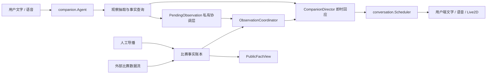

# 球球直播延迟下的事实协调方案 v0.1

## 文档状态

- 状态：本地生产形态已实施，待真实比赛灰度校准
- 更新日期：2026-07-17
- 范围：用户观看直播时，用户输入领先于导播台或外部数据流的事实协调
- 关联模块：`companion.Agent`、`CompanionDirector`、`matchstate`、`datasource.Manager`、`conversation.Scheduler`

当前实现已经能阻止没有比赛证据的指代式认同：例如空比赛中用户说“刚刚那个球真漂亮吧”，球球不会继续附和，而会把这句话记录为 `event_reference=unverified`。但当前实现仍是一次性判断，没有保存短期用户观察，也不能在事实稍后到达时自然接回用户。这份方案定义下一阶段的完整产品与技术闭环。

## 一句话结论

**情绪可以立即接住，事实暂时悬置，用户观察不能改写公共比赛状态；导播或数据流稍后到达时，再把同一观察调和为确认、撤销或超时。**

## 1. 问题

直播陪看存在三个不同的“现在”：

1. 用户直播画面的现在。
2. 导播人工录入或外部比赛数据源的现在。
3. 球球公开事实视图的现在。

三者通常相差 3-15 秒，人工导播、弱网或供应商故障时会更长。现有二元处理会制造两个相反问题：

- 球球直接附和用户，会把尚未发生或不存在的事件说成事实。
- 球球立即否定用户，会在数据只是慢半拍时显得嘴硬、不在场、缺乏共同观看感。

这不是放宽事实安全的问题，而是需要把“用户正在经历什么”和“系统已经确认什么”分开建模。

## 2. 产品原则

### 2.1 三层真相

| 层级 | 含义 | 可影响用户私聊 | 可改变公共比分 | 可触发确定性主动播报 |
|---|---|---:|---:|---:|
| 用户现场观察 | 用户说自己刚刚看到了什么 | 是 | 否 | 否 |
| 候选比赛事实 | 导播或外部来源已录入，但尚未公开确认 | 是，只能表达不确定 | 否 | 否 |
| 公开比赛事实 | `confirmed/reconciled` 且未撤销 | 是 | 是 | 是 |

### 2.2 三条硬规则

1. 对情绪可以先接，对事实不能抢答。
2. 用户输入只形成该用户私有的短期观察，永远不能直接写入事实账本。
3. 没有证据时不附和；数据稍后到达时也不把用户当成说错了。

### 2.3 非目标

- 不让用户聊天成为比赛数据源。
- 不把用户观察展示给导播台作为待处理比赛事件。
- 不为了等待数据而让用户回合卡住 10 秒以上。
- 不向用户暴露“导播台”“API-Sports”“候选事实”等企业内部术语。
- 不承诺直播画面与所有外部数据源零延迟同步。

## 3. 用户体验策略

### 3.1 初次回应必须立即发生

球球不等待同步窗口结束才回复。它应在正常对话时延内先完成两件事：

1. 接住用户的情绪强度。
2. 明确自己还没有足够事实，不补齐进球者、比分或判罚结果。

推荐话术：

| 场景 | 推荐表达 | 禁止表达 |
|---|---|---|
| 用户说“刚刚那个球真漂亮吧” | “听你这语气这下挺炸，我这边慢半拍。是进了，还是一脚特别漂亮的射门？” | “确实漂亮，这脚球太漂亮了。” |
| 用户说“萨拉赫进了！” | “我这边还没跟上，先不把它算进比分。你看到是怎么打进去的？” | “对，萨拉赫又进了！” |
| 用户问“进了吗？” | “我这边还没确认到，先不算进。” | “没进。” |
| 数据源处于错误或长时间无更新 | “我这边这下没跟上，先别急着下结论。” | “数据源异常，请等待导播确认。” |
| 赛前或已经终场后出现明显不可能事件 | “现在还没开场，这条不能算。” | 模糊地说“可能吧”。 |

反问不是必选项。用户已经明确描述球员、球队或事件时，不应为了采集信息机械追问。

### 3.2 事实稍后到达

| 后续结果 | 球球行为 |
|---|---|
| 已确认进球 | “跟上了，确实是萨拉赫，刚才那脚推得真稳。” |
| 只确认射门未进 | “跟上了，原来是那脚射门，确实挺漂亮，但没算进。” |
| VAR 取消 | “结果出来了，没算。刚才那一下是真把人骗到了。” |
| 出现冲突 | “这下还对不上，我先不报死，等结果。” |
| 同步窗口结束仍无信息 | 不重复打扰；下一次相关追问继续保持不确定 |

后续确认必须像同一段对话的延续，不能重新播报成一件与用户无关的新事件。

## 4. 领域模型

### 4.1 新增概念：PendingObservation

`PendingObservation` 是用户私有、短生命周期的现场观察。它不是比赛事实，也不是导播候选事件。

建议状态：

```text
pending_sync
    │
    ├──► corroborating ──► confirmed
    │          │
    │          ├────────► contradicted
    │          └────────► conflict
    │
    ├───────────────────► expired
    └───────────────────► superseded
```

- `pending_sync`：用户观察已记录，尚无可匹配候选。
- `corroborating`：出现可能匹配的 `provisional` 事实，但还不能确定。
- `confirmed`：匹配到公开事实。
- `contradicted`：匹配事实明确否定了用户观察，例如射门未进或进球被取消。
- `conflict`：多个候选互相矛盾，不能选择。
- `expired`：对话跟进窗口结束，仍未获得足够证据。
- `superseded`：同一用户的新观察替代旧观察。

这些状态不扩展现有比赛事实状态机。`provisional/confirmed/revoked/conflict/reconciled` 仍只属于比赛事实账本。

### 4.2 建议数据合同

```go
type ObservationInput struct {
    SignalID      string
    TraceID       string
    UserID        string
    MatchID       string
    Kind          string
    EventType     string
    ClaimedTeam   string
    ClaimedPlayer string
    ClaimedScore  *matchstate.Score
    Certainty     string
    ReceivedAt    time.Time
}

type PendingObservation struct {
    ID                  string
    SignalID            string
    TraceID             string
    UserID              string
    MatchID             string
    Kind                string
    EventType           string
    ClaimedTeam         string
    ClaimedPlayer       string
    ClaimedScore        *matchstate.Score
    Certainty           string
    Status              ObservationStatus
    CandidateFactID     string
    ResolvedFactID      string
    ResolvedRevision    int
    ReceivedAt          time.Time
    FollowUpDeadline    time.Time
    ReconcileUntil      time.Time
    ResolvedAt          *time.Time
    ResolutionReason    string
}

type ObservationResolution struct {
    ObservationID   string
    UserID           string
    MatchID          string
    Status           ObservationStatus
    FactID           string
    FactRevision     int
    ReliableText     string
    DeliveryKey      string
    FollowUpDeadline time.Time
}
```

约束：

- 不重复保存用户原文，使用 `TraceID` 关联现有 Trace。
- `(user_id, match_id, signal_id)` 唯一，保证同一用户回合刷新时幂等。
- `PendingObservation` 必须参与用户删除和保留期清理。
- 公共比赛 API、比分计算和主动比赛事件不得读取该表。

### 4.3 建议内部接口

```go
type ObservationCoordinator interface {
    Record(context.Context, ObservationInput) (PendingObservation, error)
    OnFactChanged(context.Context, matchstate.MatchEvent) ([]ObservationResolution, error)
    Expire(context.Context, time.Time) ([]ObservationResolution, error)
}
```

`companion.Agent` 负责抽取观察和生成第一句可靠回复；`ObservationCoordinator` 负责异步调和；`CompanionDirector` 继续决定是否说、何时说和使用什么表达状态。

## 5. 目标架构



现有模块保持职责不变：

| 模块 | 当前职责 | 本方案新增职责 |
|---|---|---|
| `matchstate` | 事实账本、公开视图、修订、撤销、调和 | 发布所有事实状态变化给协调器 |
| `datasource.Manager` | 数据源轮询、游标、延迟和错误状态 | 提供来源新鲜度快照 |
| `companion.Agent` | 意图、事实验证、可靠回复 | 从用户语言抽取短期现场观察 |
| `CompanionDirector` | 沟通动作、关系、表达与主动策略 | 消费观察状态，选择保留、跟进、修正或沉默 |
| `conversation.Scheduler` | 用户优先、主动排队、去重、播放结束 | 按观察调和结果安排 `critical_refresh/after_user` |

## 6. 来源新鲜度与同步窗口

### 6.1 来源健康分级

现有 `SourceStatus` 已提供 `State`、`LastPollAt`、`LastEventAt`、`LatencyMS`、`Error` 和 `Reconnects`。建议派生：

| 状态 | 判断 | 产品含义 |
|---|---|---|
| `fresh` | 来源运行中，最近轮询未超出动态阈值 | 可能只是常规传播延迟 |
| `degraded` | 轮询超时、重连或延迟显著升高 | 球球应更保守，不做快速否定 |
| `unknown` | 人工源或没有可测心跳 | 使用默认同步窗口 |
| `offline` | 来源停止或持续错误 | 只保留用户观察，不承诺很快确认 |

动态新鲜度阈值建议：

```text
freshness_threshold = clamp(2 × poll_interval + p95_source_latency, 6s, 20s)
```

在没有足够生产样本前，使用 12 秒默认值。

### 6.2 两个时间窗口

不能只设置一个“等待超时”：

| 事件类型 | 跟进价值窗口 | 后台调和保留期 |
|---|---:|---:|
| 进球、点球结果、红牌 | 15 秒 | 60 秒 |
| VAR 结果、进球取消 | 45 秒 | 120 秒 |
| 射门、扑救、黄牌、换人 | 10 秒 | 45 秒 |

- 跟进价值窗口决定是否主动补一句。
- 后台调和保留期决定是否继续关联事实，用于下一轮对话和 Trace。
- 第一条用户回复不等待这些窗口，仍按正常响应 SLA 返回。

来源为 `degraded/offline` 时，可以延长后台调和保留期，但不能无限延长主动跟进窗口。

## 7. 观察与事实的匹配

匹配只在同一 `match_id` 内进行，并同时考虑：

1. 事件类型是否兼容。
2. 用户提到的球队、球员和比分是否一致。
3. 用户消息接收时间与事实 `occurred_at/recorded_at` 是否接近。
4. 比赛时钟是否接近。
5. 同一窗口内是否存在多个互斥候选。

推荐规则：

- 明确球员或球队完全匹配，可自动调和。
- “那个球”“这一下”等泛指只在窗口内存在唯一高价值候选时自动匹配。
- 同时存在两个可能事件时保持 `conflict`，不猜。
- `provisional` 只能推进到 `corroborating`；只有公开事实才能推进到 `confirmed`。
- `revoked`、进球取消或比分回滚可推进到 `contradicted`。

首版使用确定性评分，不让大模型决定是否匹配：

```text
match_score = event_type + player + team + score_delta + clock_distance + receive_distance - ambiguity
```

- `>= 0.80`：自动匹配。
- `0.50-0.79`：保持等待，必要时只问一个有信息价值的问题。
- `< 0.50`：不匹配。

阈值需要通过真实延迟样本校准，但任何阈值都不能允许用户观察写入公共事实。

## 8. 并发、排序与去重

### 8.1 用户输入领先事实

1. 用户回合优先进入 `Scheduler`。
2. `Agent` 使用当前 `PublicFactView` 生成即时保留式回应。
3. 同时写入 `PendingObservation`。
4. 用户回合继续播放，不等待来源。

### 8.2 事实在生成期间到达

1. 事实先更新事实版本与导演状态。
2. 若当前回复尚未生成完成，使用同一个 `SignalID` 和新 `FactRevision` 做 `critical_refresh`。
3. 刷新不能重复写对话、推进关系或消耗主动预算。

### 8.3 事实在回复后到达

1. 协调器生成 `ObservationResolution`。
2. 关键事实使用 `after_user`，不打断用户正在说的话。
3. 用户已经开始新话题且跟进价值窗口已过时，选择沉默，只更新观察状态。
4. 后续用户再次提到该事件时，读取已调和结果。

### 8.4 去重键

建议调和跟进使用：

```text
observationDeliveryKey = observationId:factRevision:resolutionStatus
```

它与现有 `deliveryKey = eventId:factRevision:factStatus` 分工：

- 事实 `deliveryKey` 防止同一比赛事件重复展示。
- 观察 `observationDeliveryKey` 防止同一用户观察被重复确认或重复纠正。

同一个事实可以解决多个用户的私有观察，但每个用户最多收到一次对应跟进。

## 9. 导播台与数据源

### 9.1 导播台不显示用户观察

用户观察不是运营事实，默认不进入导播工作队列。这样可以避免恶作剧、错误输入和大量用户噪声干扰导播。

导播台只需要新增来源健康信息：

- 当前来源状态。
- 最近轮询时间。
- 最近事件时间。
- 当前延迟和近 5 分钟 P95。
- 重连次数和最后错误。
- “用户可能领先系统”的提示，不展示用户原文。

### 9.2 人工导播模式

人工模式无法可靠测量“现场发生到录入”的延迟。建议在比赛配置中增加预期人工延迟档位：

- 快速：5-10 秒。
- 正常：10-20 秒。
- 保守：20-40 秒。

该配置只影响用户观察保留期，不降低事实确认标准。

## 10. 存储、隐私与安全

建议新增 `pending_match_observations`：

| 字段 | 说明 |
|---|---|
| `id` | 观察 ID |
| `signal_id` | 用户回合幂等 ID |
| `trace_id` | 原始 Trace 引用 |
| `user_id`、`match_id` | 私有隔离边界 |
| `kind`、`event_type` | 结构化观察类型 |
| `claimed_team/player/score` | 可选结构化内容 |
| `certainty`、`status` | 不确定性与调和状态 |
| `candidate_fact_id` | 当前候选事实 |
| `resolved_fact_id/revision` | 最终公开事实版本 |
| `received_at` | 用户观察到达时间 |
| `follow_up_deadline` | 主动跟进截止时间 |
| `reconcile_until` | 后台调和截止时间 |
| `resolved_at`、`resolution_reason` | 调和结果 |

索引与约束：

- 唯一索引：`(user_id, match_id, signal_id)`。
- 待处理索引：`(match_id, status, reconcile_until)`。
- 用户删除锁和现有 Trace、关系数据使用同一个用户 advisory lock。
- `reconcile_until` 到期后立即停止参与匹配；10 分钟内硬删除结构化观察。
- 用户原文仍只存在现有 Trace 保留策略中，不在观察表重复保存。

滥用防护：

- 每个 `(user_id, match_id)` 最多保留 5 条未解决观察。
- 同一用户的语义重复观察合并，不触发更多跟进。
- 用户观察不触发导播告警，也不影响来源置信度。

## 11. 观测指标

必须区分“系统尚未同步”和“用户确实说错”：

| 指标 | 目标 |
|---|---:|
| `observation_resolution_latency_ms` P50/P95 | 按来源分别统计 |
| `pending_observation_confirm_rate` | 监控，不设固定上线值 |
| `pending_observation_expire_rate` | 持续下降 |
| `false_affirm_rate` | 0% |
| `false_deny_before_late_confirm_rate` | < 1% |
| `duplicate_resolution_reply_rate` | 0% |
| `late_confirmation_follow_up_precision` | >= 90% |
| `ambiguous_auto_match_rate` | 0% |

Trace 至少记录：

- 初始观察 ID 和状态。
- 当时的来源新鲜度。
- 匹配候选及分数。
- 最终事实 ID、修订和调和结果。
- 是否发出后续跟进、选择沉默或被用户新回合取消。

## 12. 验收场景

| 场景 | 必须结果 |
|---|---|
| 用户领先数据 8 秒说“萨拉赫进了” | 立即保留式回应；确认后自然跟进；比分只在公开事实确认后改变 |
| 用户说“刚刚那个球真漂亮吧”，当前无事件 | 不附和，不新增进球事实，写入 `pending_sync` |
| 用户说完后出现唯一匹配进球 | 同一观察推进到 `confirmed`，只跟进一次 |
| 用户说进球，后续只是射门 | 推进到 `contradicted`，说明没算进，不责怪用户 |
| 进球后被 VAR 取消 | 先确认再修正，文字、语音、Live2D 连续变化，不重复庆祝 |
| 同一时间出现两个候选事件 | 保持 `conflict`，不自动选择 |
| 外部来源断线 | 不快速否定用户；来源恢复后仍可在保留期内调和 |
| 用户连续发送相同观察 | 合并为一条，不重复回复和写入 |
| 用户正在说话时事实到达 | 更新事实状态，但不抢话；使用 `critical_refresh/after_user` |
| 用户删除数据时仍有待处理观察 | 删除等待在途调和，清除观察，迟到任务不得回写 |
| 服务重启 | 未过期观察继续调和，不重复跟进 |
| 赛前声称进球 | 使用比赛阶段直接否定，不创建长时间等待 |

## 13. 分阶段实施

### 阶段 0：冻结合同与评测

- 定义 `PendingObservation`、`ObservationResolution` 和状态转换。
- 把上表 12 个场景写成单元、PostgreSQL、WebSocket 和浏览器评测。
- 收集当前来源延迟 P50/P95，校准默认窗口。

### 阶段 1：单进程协调闭环

- `companion.Agent` 记录结构化观察。
- 内存 `ObservationCoordinator` 消费事实状态变化。
- 完成即时保留式回应、确认跟进和撤销修正。
- 复用现有 `Scheduler` 和 `SignalID` 幂等能力。

### 阶段 2：持久化与重启恢复

- 增加 `pending_match_observations` 迁移和 PostgreSQL Repository。
- 接入用户删除锁、过期清理和服务重启恢复。
- 增加 `observationDeliveryKey` 和调和 Outbox。

### 阶段 3：来源健康与导播可见性

- 把 `SourceStatus` 派生为 `fresh/degraded/unknown/offline`。
- 导播台增加来源延迟、P95、重连和最后事件时间。
- 人工模式增加预期延迟档位。

### 阶段 4：灰度与话术校准

- 先对演示比赛启用 feature flag。
- 对照观察错误附和率、提前否定率和主动跟进精度。
- 基于真实比赛校准时间窗口、匹配阈值和话术，不降低事实安全门槛。

## 14. 回滚

建议 feature flag：`PENDING_OBSERVATION_COORDINATION`。

关闭后：

- 保留当前 `event_reference=unverified` 的安全回复。
- 停止新增观察和异步跟进。
- 不删除未过期数据，后台只执行清理。
- 事实账本、公开比分和已有导播链路不受影响。

## 15. 已确认与待校准

### 已确认默认决策

1. 用户观察不进入事实账本。
2. 第一条回复立即返回，不阻塞等待数据。
3. `provisional` 只能表示“正在对上”，不能产生确定性比分或庆祝。
4. 公开事实确认后才允许确定性跟进。
5. 关键跟进不打断用户正在说的话。
6. 用户可见话术不暴露企业导播和数据供应商。

### 待生产样本校准

1. 各来源和事件类型的同步窗口。
2. 观察匹配分数与自动匹配阈值。
3. 用户切换话题后，迟到确认是否仍值得主动跟进。
4. 人工导播模式的预期延迟档位。

## 16. 实施状态（2026-07-17）

本方案的本地生产形态闭环已经实现：

- 用户观察以私有 `PendingObservation` 保存，不进入公共事实账本或比分。
- 单进程与 PostgreSQL 协调器均支持确认、撤销、冲突、过期和服务重启恢复。
- 比赛事实由服务端事件出口直接触发调和，不依赖某个 WebSocket 客户端保持在线。
- PostgreSQL Outbox 先完成观察调和，再分发在线比赛事件；失败保留重试语义。
- 对应用户的确认或纠正使用独立投递键，用户说话时排队，收到 `reply_displayed` 后不再重投。
- VAR 撤销建立新的 45 秒纠正窗口；演示重置、隐私导出和删除均覆盖观察数据。
- `PENDING_OBSERVATION_COORDINATION` 默认开启，并可通过环境变量整体关闭新增观察和异步跟进。

本地验收结果：

- `go test ./... -count=1` 通过。
- `go vet ./...` 通过。
- 真实 Docker PostgreSQL 的恢复、稳定解析、隐私导出与删除集成测试通过。
- Playwright 端到端评测 23 项通过，2 项需要外部语音运行时的既有用例按环境跳过，无失败。

仍需使用真实比赛样本完成阶段 4 的窗口、阈值和话术校准；该项不影响当前事实隔离、幂等投递与重连恢复能力。

## 相关文档

- [球球核心可信链改造方案](security-facts-privacy-idempotency-plan.md)
- [球球人味运行时技术设计](humanity-runtime-technical-design.md)
- [Companion Agent Boundaries and Evals](companion-agent-boundaries-and-evals.md)
- [阶段 5 端到端验证报告](phase5-validation-report.md)
