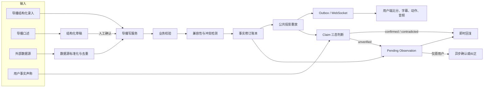
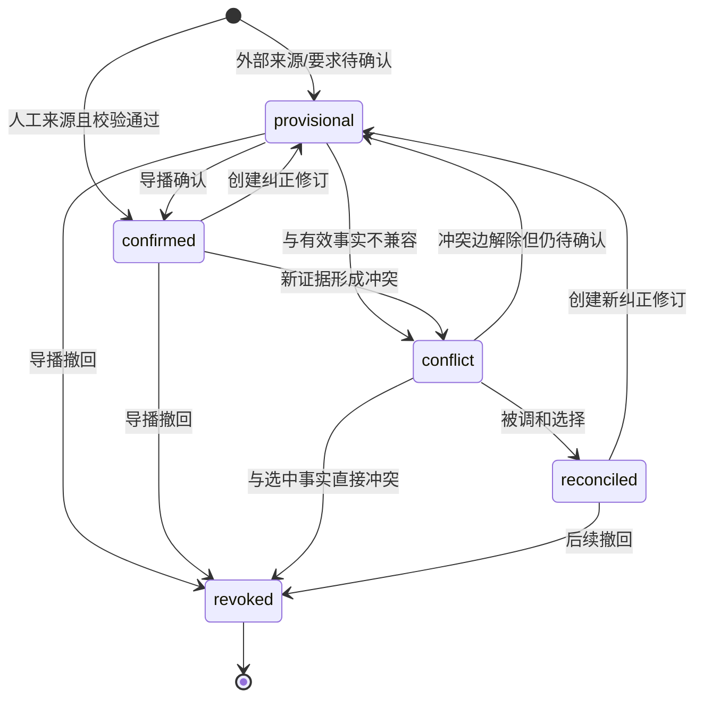
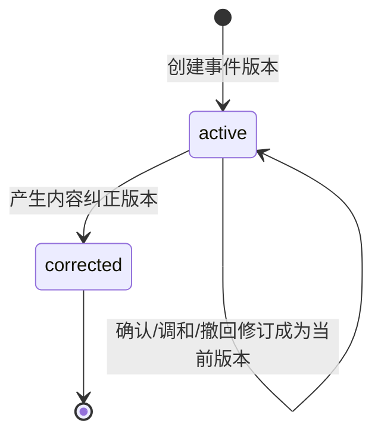
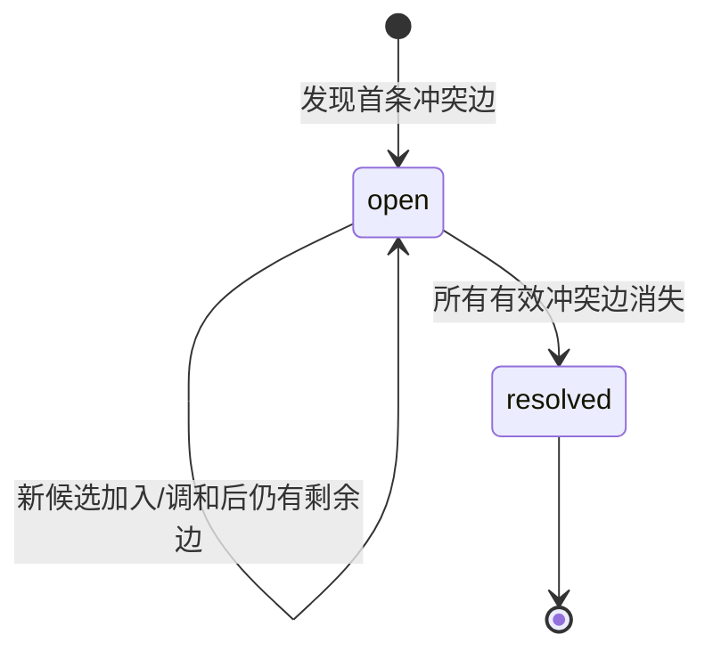
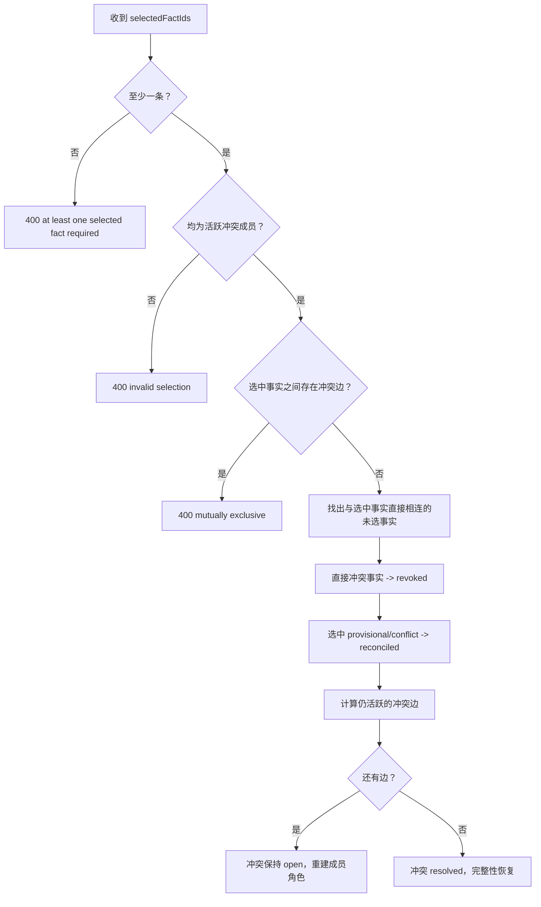
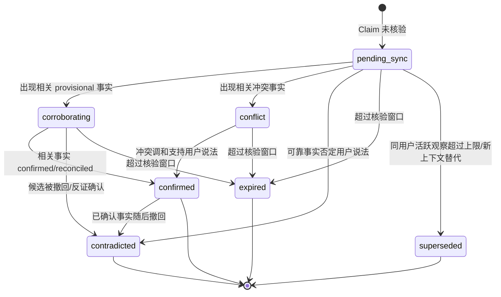
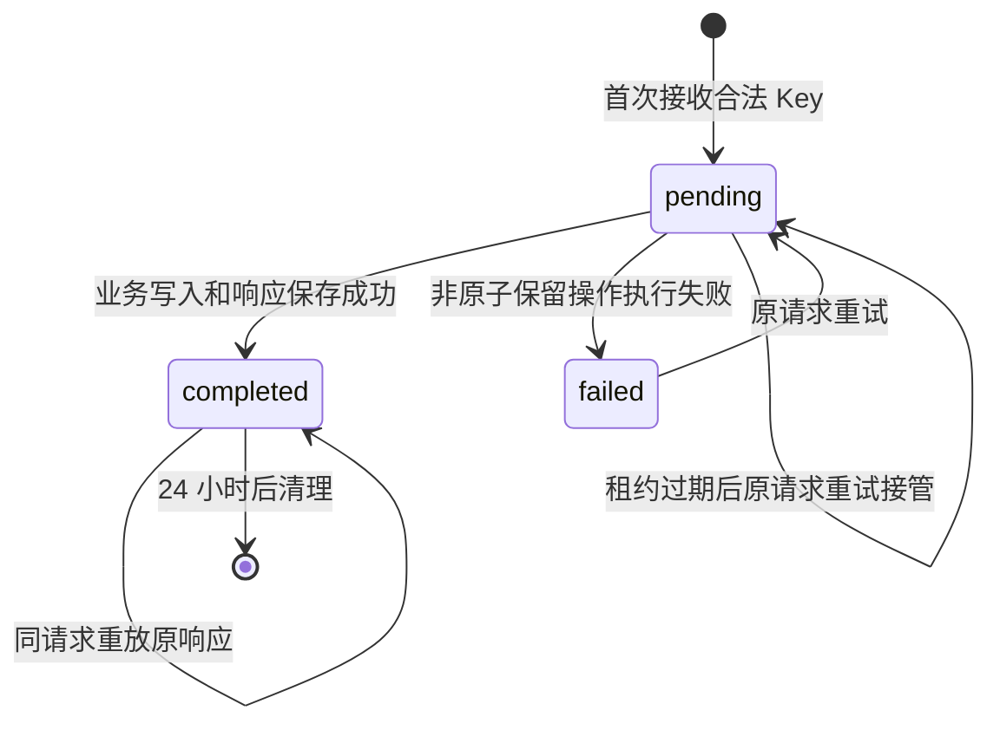
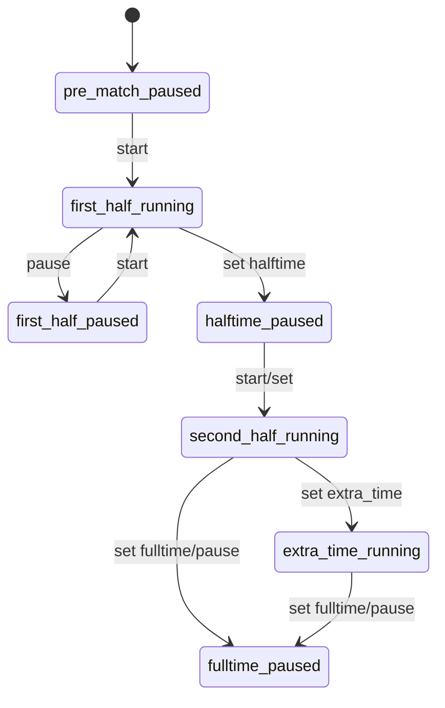
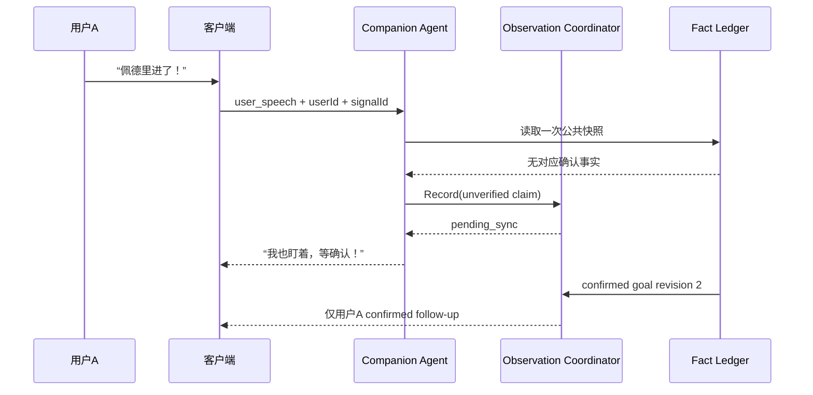

# 比赛事实与纠错系统场景流程与状态规范

> 文档类型：用户场景、业务流程与状态规范 / Workflow Input  
> 版本：v1.0  
> 产品负责人（PM）：林若安  
> 内部编制日期：2026-04-25  
> 上游依据：《球球 AI 足球数字球友 PRD》《01-比赛事实与纠错系统业务规则说明》  
> 时间口径：内部项目日期统一相对实际节点前移 3 个月。

## 1. 文档目的

本文把业务规则转换为可设计、可开发、可验收的场景链路和状态机。每个场景都包含参与角色、前置条件、主流程、替代流程、异常处理、用户可见结果和验收点。页面字段与 API 结构不在本文重复定义，统一引用《03-比赛事实领域模型数据字典与接口契约》。

## 2. 参与角色与系统泳道

| 泳道 | 核心责任 | 不能做的事 |
|---|---|---|
| 用户 | 看比赛、提出事实问题、表达自己看到的事件 | 修改公共事实 |
| 球球客户端 | 展示比分、字幕、动作和音频；上报交付状态 | 自行判断事实真假 |
| Companion Agent | 分类意图、读取事实、验证 Claim、生成受控表达 | 写入、确认、撤回事实 |
| Observation Coordinator | 保存私有观察、匹配后续事实、生成单用户跟进 | 将观察升级为公共事实 |
| 企业导播台 | 录入、修正、确认、撤回和调和事实 | 绕过鉴权、幂等与校验 |
| 数据源接入层 | 标准化外部事件、来源去重、发起候选事实 | 直接绕过事实账本发布 |
| Match State / Fact Ledger | 保存不可变修订、检测冲突、重放公共状态 | 生成自然语言观点 |
| Operator Write / Outbox | 幂等收敛、事务提交、可靠投递 | 决定事实内容是否正确 |

## 3. 总体流程



## 4. 状态模型总览

| 状态机 | 主对象 | 初始状态 | 终态/稳定态 |
|---|---|---|---|
| SM-01 事实生命周期 | Fact Revision | `provisional` 或 `confirmed` | `confirmed`、`reconciled`、`revoked` |
| SM-02 事件版本生命周期 | Match Event Revision | `active` | 内容纠正后原版本 `corrected`；事实状态修订可保持 `active` |
| SM-03 冲突生命周期 | Fact Conflict | `open` | `resolved`，也可因剩余边继续 `open` |
| SM-04 用户观察生命周期 | Pending Observation | `pending_sync` | `confirmed`、`contradicted`、`expired`、`superseded` |
| SM-05 幂等请求生命周期 | Idempotency Record | `pending` | `completed`、`failed`、过期删除 |
| SM-06 比赛时钟生命周期 | Match Clock | `pre_match / paused` | `fulltime / paused` |
| SM-07 客户端交付生命周期 | Delivery | received | displayed/played/failed/interrupted/retracted |

## 5. SM-01 事实生命周期



### 5.1 状态进入与退出规则

| 当前状态 | 触发 | 目标状态 | 写入要求 | 公共影响 |
|---|---|---|---|---|
| - | 创建外部候选 | `provisional` | 来源标识、证据、置信度 | 无 |
| - | 导播创建且确认 | `confirmed` | 运营身份、幂等键、校验通过 | 重放后可公开 |
| `provisional` | confirm | `confirmed` | 新修订、确认人 | 重放后可公开 |
| `provisional/confirmed` | 检测不兼容 | `conflict` | 冲突成员与边 | 候选不公开，保留已有公开事实 |
| `conflict` | 被兼容选择 | `reconciled` | 调和原因、操作人 | 重放后公开 |
| 任意非 revoked | revoke | `revoked` | 新修订、操作人 | 立即从公共投影移除 |
| `confirmed/reconciled` | correct | 新 `provisional/confirmed` 修订 | `revisionOf`、纠正原因 | 旧修订退出，新修订按状态决定 |

### 5.2 禁止转移

- `revoked → confirmed/reconciled`：禁止，必须创建新修订。
- `conflict → confirmed`：禁止直接确认，必须经过调和或解除冲突。
- 原地修改 `factRevision` 或 `factStatus`：禁止。
- 同一 `factId` 同时存在两个活跃公开修订：禁止。

## 6. SM-02 事件版本生命周期

事实状态描述可信程度，事件业务状态描述该版本是否仍是当前版本，两者必须同时判断。



公开资格判断：

```text
isPublicFact =
  status == active
  AND visibility == public
  AND factStatus IN (confirmed, reconciled)
```

## 7. SM-03 冲突生命周期



### 7.1 冲突选择算法



### 7.2 冲突完整性状态

| 条件 | `snapshot.integrity.status` | 用户端行为 | 导播端行为 |
|---|---|---|---|
| 无开放冲突且投影成功 | `ok` | 正常展示和确定性问答 | 无冲突提示 |
| 存在开放冲突 | `conflict` | 保留最近可靠结果，争议内容降级表达 | 显示候选、成员、边和处理入口 |
| 账本投影失败 | `conflict` | 不展示猜测事件，提示数据待确认 | 展示投影错误并阻断继续发布 |

## 8. SM-04 用户观察生命周期



### 8.1 观察作用域和去重

| 维度 | 规则 |
|---|---|
| 强作用域 | `userId + matchId + signalId` |
| 语义复用 | 同用户、同比赛、同类 Claim 的等价活跃观察复用 |
| 活跃上限 | 每用户每比赛最多 5 条，超出时最旧一条 `superseded` |
| 跟进期限 | 由 `FollowUpDeadline` 控制，过期不再用户可见投递 |
| 调和期限 | 由 `ReconcileUntil` 控制事实匹配窗口 |
| 交付去重 | `observationId:factRevision:resolutionStatus` |

### 8.2 用户可见文案边界

| 状态 | 可用表达方向 | 禁止表达 |
|---|---|---|
| `pending_sync` | “我也盯着，等确认” | “确定进了”或“绝对没进” |
| `corroborating` | “数据开始有记录了，我再等一下” | 把 provisional 当最终结论 |
| `conflict` | “现在数据有点打架，先别急着定” | 自行选择任一候选 |
| `confirmed` | “确认了，确实是……” | 暴露内部冲突证据 |
| `contradicted` | “刚确认，这球被取消/记录不是这样” | 嘲讽用户看错 |
| `expired/superseded` | 通常不主动发消息 | 迟到打断当前对话 |

## 9. SM-05 幂等请求生命周期



### 9.1 请求分支

| 条件 | HTTP | 是否执行业务回调 | 响应要求 |
|---|---:|:---:|---|
| 缺少 Key | 400 | 否 | `Idempotency-Key is required` |
| Key 超过 200 字符 | 400 | 否 | key is too long |
| 新 Key | 业务状态码 | 是 | 保存规范化请求指纹与响应 |
| 同 Key 同请求已完成 | 原状态码 | 否 | 原 Body + `Idempotency-Replayed: true` |
| 同 Key 不同请求 | 409 | 否 | idempotency conflict |
| 同请求仍在执行 | 409 | 否 | operation still in progress |

## 10. SM-06 比赛时钟生命周期



所有状态变更都要求 `expectedVersion == current.version`。`set` 用于设置阶段或绝对秒数，`adjust` 用于正负秒校准；两者均不能超出 0-21600 秒。

## 11. 关键端到端场景

### SC-01 导播创建并发布确认进球

**参与者**：导播、导播台、Operator Write、Match State、Fact Ledger、Outbox、客户端。  
**前置条件**：比赛已配置；当前阶段不是 `pre_match`；球员属于目标球队；导播已登录。

**主流程**：

1. 导播选择“进球”，填写阶段、发生时间、球队、进球者、助攻者和描述。
2. 前端生成本次操作唯一 `Idempotency-Key`，提交 `POST /events`。
3. 服务验证运营身份、Key、JSON 和事件字段。
4. 事实层创建 `factId`、`eventId`、`factRevision=1` 和记录顺序。
5. 若无跨源冲突，事实进入 `confirmed/active/public`。
6. 账本按顺序重放，目标球队比分 +1。
7. 事件、修订、幂等记录和 Outbox 原子提交。
8. 用户端收到新事实，以 `eventId:revision:status` 去重，展示字幕并调度动作/音频。

**替代流程**：

- 若导播明确选择“待确认”，事实进入 `provisional`，不改变公共比分。
- 若同一请求重试，返回原响应，不新增进球。
- 若与其他来源冲突，候选进入 `conflict`，已有公共比分保持不变。

**验收**：一次合法进球只贡献 1 分；用户 Agent 可以在随后问答中引用该事实。

### SC-02 外部数据源提交候选进球

1. 数据源接入层标准化提供商事件和 `providerEventId`。
2. 来源游标/唯一标识先过滤重复事件。
3. 事件按策略创建为 `provisional`。
4. 事实层校验球队、球员、阶段和预期比分贡献。
5. 若与现有事实兼容，等待确认；若不兼容，创建冲突图。
6. 导播在时间线确认或在冲突页调和。

**验收**：单一外部候选不得在未确认时改变公共比分。

### SC-03 导播纠正已发布事件

**前置条件**：目标事件存在且为当前活跃修订。

1. 导播打开事件详情，查看当前事实和完整修订历史。
2. 修改类型、球队、球员、发生时间或描述，并填写纠正原因。
3. 前端用新幂等键调用 `POST /events/{eventId}/correct`。
4. 服务阻止对关系型事件 `goal_cancelled/var_result` 的直接纠正。
5. 事实层检查纠正是否改变计分贡献；如有更晚活跃事件，要求先处理后续链路。
6. 原版本退出活跃状态，新版本沿用 `factId`，`factRevision + 1`。
7. 新版本按请求状态进入 provisional 或 confirmed，账本重放公共视图。

**异常**：缺少 `evidence.correctionReason` 返回 400；目标不存在返回 404。

### SC-04 撤回已发布进球

1. 导播在事件详情点击“撤回”，确认影响提示。
2. 提交 `POST /facts/{factId}/revoke`，携带新幂等键。
3. 事实层创建 `revoked` 新修订。
4. 公共账本重新重放，撤回进球不再贡献比分。
5. Outbox/事件观察者发布事实变更和 `match_fact_retracted`；当前撤回消息使用 `data.eventId + data.factId`。
6. 客户端清理该事实链未播放音频、未执行动作、事件轮播和主动反应。
7. 若原用户观察曾因该事实确认，协调器生成 `contradicted` 跟进，仅发给原用户。

**验收**：旧进球庆祝音频在撤回后不能继续播放；历史修订仍可审计。

### SC-05 VAR 取消进球

1. 导播先发布 `var_check`，不改变比分。
2. 裁判结论为取消进球时，创建 `goal_cancelled`，`revisionOf` 指向原公开进球。
3. 账本定位被引用进球并减去其贡献。
4. 原进球事实历史保留，取消事件作为独立事实公开。

**异常**：引用未知进球、重复取消或取消检查点前进球，返回 400。

### SC-06 绝对比分校正

适用于历史数据缺失、接入中断后恢复等无法逐条重建的情况。

1. 导播选择“比分校正”，输入新的主客队绝对比分和原因。
2. 系统验证比分非负。
3. 创建 `score_correction` 公开事实。
4. 账本将其作为检查点覆盖此前累计值；此前活跃进球贡献标记为已被检查点吸收。
5. 检查点之后的新进球继续相对增减。

**验收**：后续取消只能作用于检查点之后可定位的公开进球。

### SC-07 多源冲突产生

1. 当前已有人工确认的主队进球 A，公开比分为 1-0。
2. 外部数据源提交同一时间窗口内的客队进球 B，并与 A 不兼容。
3. 系统不撤回 A，B 标记 `conflict`。
4. 创建冲突 C：成员 A=`accepted`、B=`candidate`，边 A-B 记录原因。
5. `snapshot.integrity=conflict`。
6. 普通用户仍看到 1-0，但相关问答采用不确定表达。
7. 导播端出现待处理冲突和候选证据。

### SC-08 选择多个兼容事实完成调和

1. 冲突集合包含 A、B、C，其中 A-B 有边，B-C 有边，A-C 无边。
2. 导播选择 A 和 C，填写“以回放与主数据源为准”。
3. 服务验证 A、C 均为活跃成员，且二者无直接冲突边。
4. B 因与选中事实直接冲突而撤回。
5. 若 A/C 是 provisional 或 conflict，则转为 reconciled。
6. 无剩余边，冲突转为 resolved，完整性恢复 ok。

**验收**：系统不能因为 B、C 同属冲突集合而错误撤回 C。

### SC-09 用户比数据源先看到进球，随后确认



**验收**：公共比分只因确认事实变化；用户 B 不收到用户 A 的跟进。

### SC-10 用户领先现场，随后被否定

1. 用户说“进了”，系统创建 `pending_sync` 并保留式回应。
2. 后续出现 `goal_cancelled`、明确 `var_result` 或可靠非进球事实。
3. 观察转为 `contradicted`。
4. 仅向原用户发送温和纠正；不创建共同瞬间。

### SC-11 已确认观察随后因事实撤回而反转

1. 观察先因事实修订 2 转为 `confirmed`，交付键为 `observationId:2:confirmed`。
2. 事实随后产生修订 3 `revoked`。
3. 协调器将观察结果更新为 `contradicted`，新交付键为 `observationId:3:contradicted`。
4. 客户端将其视为新结果正常展示。

### SC-12 导播重复点击与网络重试

1. 前端为一次“发布进球”生成 Key K。
2. 用户双击或首个响应超时，前端用同一 K 重发完全相同请求。
3. 服务发现 K 已完成，返回第一次的事件与快照。
4. 响应头包含 `Idempotency-Replayed: true`。

**禁止**：重试时重新生成 Key；这会失去服务端去重能力。

### SC-13 同幂等键请求冲突

1. Key K 已用于创建进球 A。
2. 客户端错误地用 K 创建射门 B，或改变请求 Body。
3. 请求指纹不同，服务返回 409。
4. 不执行 B，不覆盖 A 的响应。

### SC-14 导播口述生成草稿并发布

1. 导播说“24 分钟佩德里进球，法比安助攻”。
2. 草稿接口返回转写和结构化字段，不创建事实。
3. 导播核对阶段、时间、球队、进球者和助攻者。
4. 确认发布使用新的幂等键。
5. 发布接口重新构建草稿、转事件并执行完整事实写链。

**验收**：关闭确认弹窗不会留下事实；无 ASR 配置时给出服务不可用，不猜测。

### SC-15 时钟并发更新

1. 导播甲和乙同时读取时钟版本 5。
2. 甲提交 `pause(expectedVersion=5)`，成功后版本变 6。
3. 乙提交 `adjust(expectedVersion=5)`，返回 409。
4. 乙刷新版本 6 后重新确认操作。

### SC-16 晚录历史事件

1. 当前比赛时钟为 63:20。
2. 导播补录发生于 59:10 的射门。
3. 事件 `clock=59:10`，当前 `MatchClock` 仍继续从 63:20 运行。
4. 事件按记录顺序写入，但展示发生时间为 59:10。

### SC-17 断线重连后的观察跟进

1. 用户有未完成观察后断线。
2. 事实确认并生成待交付 Resolution。
3. 用户在 `FollowUpDeadline` 前重新连接并完成身份恢复。
4. 系统查询本人、本人比赛的未交付 Resolution。
5. 客户端按 DeliveryKey 去重展示，并回写已交付。

**已知边界**：事实事件本身尚无持久化客户端 ACK/重放游标，不能把观察恢复能力误写为所有 WebSocket 消息均 exactly-once。

## 12. 页面状态要求

### 12.1 用户端

| 页面区域 | 正常 | 冲突 | 撤回 | 断线/恢复 |
|---|---|---|---|---|
| 比分卡 | 公开账本比分 | 保留最近已接受比分，弱提示待确认 | 立即回退到重放结果 | 重连后以 HTTP/WS 最新快照校准 |
| 事件轮播 | 公开有效事件 | 不加入冲突候选 | 移除被撤回事实链 | 对相同 DeliveryKey 去重 |
| 字幕 | 确定性事实文本 | 不确定表达 | 更正字幕优先展示 | 文本不依赖音频成功 |
| Live2D | 根据事实动作合同表演 | 不触发争议庆祝 | 清理未执行动作/主动反应 | 恢复后不重播已消费键 |
| 音频 | 元数据与二进制配对 | 不朗读未经确认事实 | 清理未播放音频 | 自动播放失败保留待播 |

### 12.2 导播台

| 页面 | 必备状态 | 核心操作 |
|---|---|---|
| 直播控制 | 当前比分、时钟版本、阶段、自动化状态 | 快捷录入、时钟、草稿 |
| 事件时间线 | 事实状态、修订号、来源、公开性 | 详情、纠正、确认、撤回 |
| 冲突处理 | open/resolved、成员角色、冲突边 | 多选兼容事实、填写原因、提交调和 |
| 数据源 | 运行/暂停/接管、最后游标、错误 | 启动、停止、人工接管 |
| Agent Trace | Claim、使用事实 ID、回复、投递结果 | 追溯用户为什么收到该表达 |

## 13. 异常处理矩阵

| 异常编号 | 场景 | HTTP/状态 | 用户端 | 导播端 |
|---|---|---|---|---|
| EX-01 | 未授权写事实 | 401 | 无变化 | 提示重新登录/令牌失效 |
| EX-02 | 缺失幂等键 | 400 | 无变化 | 阻止提交并生成 Key 后重试 |
| EX-03 | 幂等键冲突 | 409 | 无变化 | 提示该 Key 已用于其他请求，不自动换 Key 重放旧操作 |
| EX-04 | 时钟版本冲突 | 409 | 保持最新时钟 | 刷新最新版本并让用户确认 |
| EX-05 | 不支持事件类型 | 400 | 无变化 | 高亮事件类型错误 |
| EX-06 | 球员不属于球队 | 400 | 无变化 | 回到参与者选择 |
| EX-07 | 纠正缺少原因 | 400 | 无变化 | 原因字段必填提示 |
| EX-08 | 冲突选择互斥事实 | 400 | 保持旧公开结果 | 高亮冲突边，不关闭弹窗 |
| EX-09 | 投影产生负比分/历史不完整 | integrity conflict | 不展示猜测结果 | 阻断发布，进入账本修复 |
| EX-10 | ASR 未配置 | 503 | 不涉及 | 允许切换手动录入 |
| EX-11 | 草稿无法形成合法事件 | 422 | 不涉及 | 保留转写，要求人工补齐 |
| EX-12 | TTS 失败 | 交付 failed | 字幕照常显示 | Trace 可见失败原因 |
| EX-13 | 观察过期 | expired | 不发送迟到跟进 | Trace/审计可见 |

## 14. 验收场景组合

### 14.1 事实完整生命周期

```text
provisional(revision 1, not public)
→ confirmed(revision 2, public)
→ revoked(revision 3, not public)
→ corrected provisional(revision 4, not public)
→ confirmed(revision 5, public latest only)
```

断言：公共列表中任何时刻最多出现该 `factId` 的一个有效版本；revision 1-4 均可在修订历史查看。

### 14.2 用户领先现场完整链路

```text
用户A：“佩德里进了”
→ Claim=unverified
→ Observation=pending_sync
→ 保留式即时回应
→ 公开事实 confirmed
→ 仅用户A收到 confirmed 跟进
→ 事实 revoked
→ 仅用户A收到 contradicted 跟进
```

断言：用户 B 无跟进；公共比分只由 confirmed/reconciled 事实变化。

### 14.3 冲突图完整链路

```text
有效事实 A、C
→ 候选 B 与 A、C 分别存在冲突边
→ integrity=conflict，A/C 继续公开
→ 选择 A、C
→ B revoked；A/C 保留或 reconciled
→ 冲突 resolved；integrity=ok
```

### 14.4 幂等与 Outbox 完整链路

```text
首次写入 K
→ idempotency pending
→ event + revision + outbox + idempotency completed 同事务提交
→ 投递失败进入 Outbox 重试
→ 相同 K 返回原响应
→ 客户端按 deliveryKey 去重
```

## 15. 当前验证证据与残余风险

| 范围 | 当前证据 | 结论 |
|---|---|---|
| 事实生命周期 | Playwright `fact-lifecycle.spec.mjs` | 通过 |
| 用户会话隔离 | `session-isolation-e2e.mjs` | 通过 |
| 客户端投递去重 | `client-delivery-dedupe.spec.mjs` | 通过 |
| 幂等并发、重放和租约 | operatorwrite 单元/PG 测试 | 通过 |
| Outbox 失败重试 | matchstate PostgreSQL 测试 | 通过 |
| 服务重启恢复 | Docker E2E | 通过 |
| 真实浏览器自动播放 | PR 级评测有环境跳过 | 灰度前继续补实机证据 |
| WebSocket 持久化 ACK/游标 | 尚未完整实现 | 生产灰度风险 |
| 部分非事务外部副作用 | 存在跨崩溃重复窗口 | 需单独定义恢复语义 |

## 16. 场景来源追溯

| 场景 | 对应业务规则 | 主要实现/测试来源 |
|---|---|---|
| SC-01/02 | BR-05 至 BR-25、BR-50 至 BR-62 | `matchstate/store.go`、`main.go`、`match_api_test.go` |
| SC-03/04 | BR-35 至 BR-41 | `store.go`、`fact-lifecycle.spec.mjs` |
| SC-05/06 | BR-18 至 BR-21 | `fact_ledger.go`、`fact_ledger_test.go` |
| SC-07/08 | BR-22 至 BR-34 | `conflict_resolution.go`、冲突 API/PG 测试 |
| SC-09 至 SC-11 | BR-42 至 BR-49 | `observation/coordinator.go` 及集成测试 |
| SC-12/13 | BR-50 至 BR-56 | `operatorwrite/service.go` 及 PG 测试 |
| SC-14 | BR-69 至 BR-72 | `directordraft`、`match_api_test.go` |
| SC-15/16 | BR-57、BR-64 至 BR-68 | `matchstate/clock.go`、时钟 API 测试 |
| SC-17 | BR-47 至 BR-49、BR-63 | observation PostgreSQL 测试、Phase 5 验证报告 |
