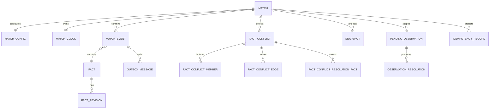

# 比赛事实领域模型、数据字典与接口契约

> 文档类型：领域模型 / 数据字典 / API Reference Input  
> 版本：v1.0  
> 产品负责人（PM）：林若安  
> 内部编制日期：2026-04-25  
> 适用实现：Go Backend、PostgreSQL 16、Flutter/Web 客户端、企业导播台  
> 时间口径：内部项目日期统一相对实际节点前移 3 个月。

## 1. 文档目的

本文给出比赛事实与纠错系统的稳定术语、领域对象、字段定义、约束、数据库映射、HTTP 合同、WebSocket 合同和错误码。业务取舍以《01-比赛事实与纠错系统业务规则说明》为准，状态与场景以《02-比赛事实与纠错系统场景流程与状态规范》为准。

文档同时标识“当前实现字段”和“设计层要求”。当前实现字段与仓库代码一致；设计层要求用于页面、埋点或灰度补齐，不应被误写为已经上线。

## 2. 领域关系图



## 3. 枚举字典

### 3.1 FactStatus

| 值 | 中文 | 公开资格 | 说明 |
|---|---|:---:|---|
| `provisional` | 待确认 | 否 | 候选事实 |
| `confirmed` | 已确认 | 是 | 还需 `active/public` |
| `conflict` | 冲突中 | 否 | 等待调和 |
| `reconciled` | 已调和 | 是 | 还需 `active/public` |
| `revoked` | 已撤回 | 否 | 终止修订，不物理删除 |

### 3.2 ConflictStatus

| 值 | 含义 |
|---|---|
| `open` | 仍有活跃冲突边 |
| `resolved` | 已无活跃冲突边 |

### 3.3 ConflictMemberRole

| 值 | 含义 |
|---|---|
| `accepted` | 冲突发生前已进入公共投影或继续有效的事实 |
| `candidate` | 新提交、等待取舍的事实 |

### 3.4 ObservationStatus

| 值 | 含义 | 是否允许待投递跟进 |
|---|---|:---:|
| `pending_sync` | 等待事实同步 | 否，先即时回应 |
| `corroborating` | 已出现支持候选但未最终确认 | 可选，默认不打断 |
| `conflict` | 相关事实存在冲突 | 可选不确定提示 |
| `confirmed` | 公开事实支持用户观察 | 是 |
| `contradicted` | 可靠事实否定或撤回观察 | 是 |
| `expired` | 超过调和窗口 | 否 |
| `superseded` | 被新观察或上限策略替代 | 否 |

### 3.5 MatchIntegrityStatus

| 值 | 含义 |
|---|---|
| `ok` | 公共投影可用且无开放冲突 |
| `conflict` | 存在开放冲突或投影不可用 |

### 3.6 EventBusinessStatus 与 Visibility

| 字段 | 值 | 说明 |
|---|---|---|
| `status` | `active` | 当前有效版本 |
| `status` | `corrected` | 内容纠正后原事件版本，不进入公开投影 |
| `visibility` | `public` | 满足事实状态条件后可公开 |
| `visibility` | `private`/非 `public` | 不进入公共投影；当前测试与实现使用 `private` 表示候选私有可见性 |

### 3.7 EventType

| 值 | 中文 | 是否关键事件 | 是否改变比分 | 关键字段 |
|---|---|:---:|:---:|---|
| `kickoff` | 开球 | 否 | 否 | period、clock |
| `goal` | 进球 | 是 | 对应球队 +1 | teamId、player/participants |
| `shot` | 射门 | 否 | 否 | teamId、player |
| `big_chance` | 绝佳机会 | 否 | 否 | teamId、player |
| `save` | 扑救 | 否 | 否 | teamId、player |
| `miss` | 射失 | 否 | 否 | teamId、player |
| `foul` | 犯规 | 否 | 否 | teamId、player |
| `yellow_card` | 黄牌 | 否 | 否 | teamId、player |
| `red_card` | 红牌 | 是 | 否 | teamId、player |
| `var_check` | VAR 检查 | 是 | 否 | description |
| `var_result` | VAR 结果 | 是 | 否 | result/evidence，关系型事件 |
| `goal_cancelled` | 进球取消 | 是 | 中和被引用进球 | revisionOf |
| `score_correction` | 比分校正 | 是 | 设置绝对检查点 | score、reason |
| `penalty` | 点球 | 是 | 否 | teamId、player |
| `penalty_awarded` | 判罚点球 | 是 | 否 | teamId |
| `substitution` | 换人 | 否 | 否 | participant roles `on/off` |
| `injury` | 伤病 | 否 | 否 | teamId、player |
| `tactical_shift` | 战术调整 | 否 | 否 | description |
| `pressure` | 压迫/攻势 | 否 | 否 | intensity、teamId |
| `halftime` | 半场结束 | 是 | 否 | period |
| `fulltime` | 全场结束 | 是 | 否 | period |
| `match_end` | 比赛结束 | 是 | 否 | period |
| `operator_note` | 导播备注 | 否 | 否 | description；不可自动主动播报 |

### 3.8 Period

`pre_match`、`first_half`、`halftime`、`second_half`、`extra_time`、`fulltime`。

## 4. 对象：Score

| 字段 | 类型 | 必填 | 默认 | 约束 | 说明 |
|---|---|:---:|---|---|---|
| `home` | integer | 是 | 0 | >= 0 | 主队比分 |
| `away` | integer | 是 | 0 | >= 0 | 客队比分 |

## 5. 对象：Participant

| 字段 | 类型 | 必填 | 约束 | 示例 |
|---|---|:---:|---|---|
| `role` | string | 是 | 事件类型支持的角色 | `scorer`、`assist`、`on`、`off` |
| `name` | string | 是 | 非空；球员应在对应球队阵容 | `佩德里` |
| `teamId` | string | 否 | `home/away` | `home` |
| `teamName` | string | 否 | 与比赛配置一致 | `西班牙` |

## 6. 对象：MatchEvent

### 6.1 标识与来源字段

| 字段 | 类型 | 请求 | 响应 | 约束/生成规则 |
|---|---|:---:|:---:|---|
| `id` | string | 否 | 是 | 服务生成的事件版本 ID |
| `matchId` | string | 路径 | 是 | 由路径写入，不信任 Body 覆盖 |
| `factId` | string | 否 | 是 | 首次创建生成；修订沿用 |
| `factRevision` | integer | 否 | 是 | 从 1 递增 |
| `revisionOf` | string | 条件 | 是 | 纠正/关系事件引用的事件或事实 ID |
| `recordedSequence` | int64 | 否 | 是 | 每场单调递增、正数、唯一 |
| `source` | string | 否 | 是 | `operator/provider/api-sports/system` 等 |
| `providerName` | string | 否 | 是 | 外部提供商名称 |
| `providerEventId` | string | 外部源条件必填 | 是 | 用于来源级去重 |
| `operatorId` | string | 否 | 导播视图 | 从运营身份注入，不能信任 Body |

### 6.2 比赛语义字段

| 字段 | 类型 | 必填 | 约束 | 说明 |
|---|---|:---:|---|---|
| `period` | string | 是 | Period 枚举 | 事件发生阶段 |
| `clock` | string | 是 | `MM:SS` 语义；与当前 MatchClock 分离 | 事件发生时间 |
| `eventType` | string | 是 | 23 类枚举 | 事件类型 |
| `teamId` | string | 条件 | `home/away` | 事件归属球队 |
| `teamName` | string | 否 | 与配置一致 | 展示名称 |
| `playerName` | string | 否 | 属于对应球队阵容 | 兼容单球员字段 |
| `participants` | array<Participant> | 否 | 角色与事件类型匹配 | 多参与者标准字段 |
| `description` | string | 是 | 去空格后非空 | 导播和用户可读描述 |
| `intensity` | integer | 否 | 业务归一化 | 情绪温度输入 |
| `sentiment` | string | 否 | 受控枚举/文本 | 表现语义 |
| `tags` | array<string> | 否 | 去重 | 检索与运营标签 |
| `recommendedAction` | string | 否 | 受客户端动作合同约束 | 建议 Live2D 动作 |
| `proactiveText` | string | 否 | 不得新增事实 | 主动播报底稿 |

### 6.3 比分与事实字段

| 字段 | 类型 | 请求 | 响应 | 规则 |
|---|---|:---:|:---:|---|
| `score` | Score | 是/默认 | 是 | 投影返回时为该事件重放后的有效比分 |
| `reportedScore` | Score? | 否 | 导播视图 | 来源原始声称，仅用于审计 |
| `effectiveScoreAfter` | Score? | 否 | 导播视图 | 服务计算值，客户端输入不得覆盖 |
| `confirmed` | boolean | 可选 | 是 | 兼容字段，最终以 factStatus 为准 |
| `factStatus` | FactStatus | 可选策略 | 是 | 事实生命周期状态 |
| `status` | string | 否 | 是 | 当前事件版本是否 active |
| `visibility` | string | 可选策略 | 是 | `public` 或非公开值（当前使用 `private`） |
| `confidence` | number | 否 | 是 | 0-1 的来源置信度语义 |
| `evidence` | object | 条件 | 导播视图 | 来源证据；纠正必须含 correctionReason |
| `confirmedBy` | string | 否 | 导播视图 | 确认/调和操作人 |
| `publicAt` | RFC3339 string | 否 | 是 | 首次公开时间 |
| `createdAt` | RFC3339 string | 否 | 是 | 版本创建时间 |
| `updatedAt` | RFC3339 string | 否 | 是 | 版本更新时间 |

### 6.4 示例：创建确认进球

```json
{
  "source": "operator",
  "period": "first_half",
  "clock": "24:13",
  "eventType": "goal",
  "teamId": "home",
  "teamName": "西班牙",
  "playerName": "佩德里",
  "participants": [
    {"role": "scorer", "name": "佩德里", "teamId": "home"},
    {"role": "assist", "name": "法比安", "teamId": "home"}
  ],
  "score": {"home": 1, "away": 0},
  "intensity": 5,
  "description": "佩德里破门，法比安送出助攻",
  "visibility": "public",
  "confirmed": true
}
```

## 7. 对象：FactRevision

| 字段 | 类型 | 约束 | 说明 |
|---|---|---|---|
| `factId` | string | 非空 | 稳定事实 ID |
| `revision` | integer | >=1，单 fact 递增 | 修订号 |
| `matchId` | string | 非空 | 所属比赛 |
| `eventId` | string | 可空 | 对应事件版本 |
| `status` | FactStatus | 枚举 | 修订状态 |
| `sourceType` | string | 非空 | 来源类别 |
| `sourceEventId` | string | 可空 | 提供商原始 ID |
| `confidence` | number | 0-1 语义 | 来源置信度 |
| `evidence` | object | 可空 | 证据与修正原因 |
| `confirmedBy` | string | 条件 | 确认/撤回/调和人 |
| `revisionOf` | string | 条件 | 上一修订或引用对象 |
| `occurredAt` | string | 可空 | 事实发生时间 |
| `recordedAt` | string | 非空 | 系统记录时间 |
| `publicAt` | string | 可空 | 进入公开投影时间 |

## 8. 对象：FactConflict

### 8.1 FactConflict

| 字段 | 类型 | 说明 |
|---|---|---|
| `id` | string | 冲突 ID |
| `matchId` | string | 比赛 ID |
| `status` | `open/resolved` | 冲突状态 |
| `chosenFactId` | string? | 兼容旧单选接口 |
| `selectedFactIds` | array<string> | 最终或当前选择集合 |
| `reason` | string | 调和原因 |
| `detectedAt` | RFC3339 | 发现时间 |
| `resolvedAt` | RFC3339? | 解决时间 |
| `resolvedBy` | string? | 操作人 |
| `members` | array<FactConflictMember> | 成员 |
| `edges` | array<FactConflictEdge> | 互斥边 |

### 8.2 FactConflictMember

| 字段 | 类型 | 约束 |
|---|---|---|
| `factId` | string | 必须是冲突内唯一成员 |
| `role` | string | `accepted/candidate` |

### 8.3 FactConflictEdge

| 字段 | 类型 | 约束 |
|---|---|---|
| `leftFactId` | string | 与 right 不同，均为成员 |
| `rightFactId` | string | 存储时规范化顺序以防重复 |
| `reason` | string | 可空，描述互斥原因 |

### 8.4 冲突解决请求

```json
{
  "selectedFactIds": ["fact_a", "fact_c"],
  "reason": "以导播回放和主数据源为准"
}
```

兼容旧请求：

```json
{
  "chosenFactId": "fact_a",
  "reason": "保留人工记录"
}
```

服务会把旧单选转换为“所选事实 + 与其没有直接冲突的已接受事实”，新设计和新 UI 一律使用 `selectedFactIds`。

## 9. 对象：Snapshot

| 字段 | 类型 | 普通用户可见 | 说明 |
|---|---|:---:|---|
| `matchId` | string | 是 | 比赛 ID |
| `homeTeam` / `awayTeam` | string | 是 | 队伍名 |
| `competition` | string | 是 | 赛事名 |
| `score` | Score | 是 | 账本重放比分 |
| `period` | string | 是 | 当前阶段 |
| `clock` | string | 是 | 当前显示时钟 |
| `matchClock` | MatchClock | 是，必要裁剪 | 独立时钟对象 |
| `momentum` | string | 是 | 由最近有效事件推导 |
| `emotionalTemperature` | integer | 是 | 表现输入 |
| `recentEvents` | array<MatchEvent> | 是 | 最多 5 条公开事件 |
| `keyEvents` | array<MatchEvent> | 是 | 最多 8 条公开关键事件 |
| `lastUpdatedAt` | RFC3339 | 是 | 投影更新时间 |
| `lastRecommendedAction` | string | 是 | 最近动作建议 |
| `lastPublicDescription` | string | 是 | 最近公开描述 |
| `integrity` | MatchIntegrity | 裁剪后 | 完整性状态 |

### 9.1 MatchIntegrity

| 字段 | 类型 | 普通用户 | 导播 |
|---|---|---|---|
| `status` | string | 当前公共 HTTP 清空 | 可见 |
| `reason` | string | 隐藏 | 完整可见 |
| `detectedAt` | string | 隐藏 | 可见 |

## 10. 对象：PendingObservation 与 Resolution

### 10.1 PendingObservation

| 字段 | 类型 | 说明 |
|---|---|---|
| `id` | string | 由作用域稳定生成 |
| `signalId` | string | 用户回合/信号幂等标识 |
| `traceId` | string | Agent Trace 关联 |
| `userId` | string | 私有作用域 |
| `matchId` | string | 比赛作用域 |
| `kind` | string | Claim 类别 |
| `eventType` | string? | 声称事件类型 |
| `claimedTeam` | string? | 声称球队 |
| `claimedPlayer` | string? | 声称球员 |
| `claimedScore` | Score? | 声称比分 |
| `certainty` | string? | 用户表达确定度 |
| `status` | ObservationStatus | 当前状态 |
| `candidateFactId` | string? | 匹配中的候选事实 |
| `resolvedFactId` | string? | 最终事实 |
| `resolvedRevision` | integer | 最终修订 |
| `receivedAt` | timestamp | 接收时间 |
| `followUpDeadline` | timestamp | 用户可见跟进截止 |
| `reconcileUntil` | timestamp | 事实匹配截止 |
| `resolvedAt` | timestamp? | 完成时间 |
| `resolutionReason` | string? | 状态原因 |

### 10.2 Observation Resolution

| 字段 | 类型 | 说明 |
|---|---|---|
| `observationId` | string | 观察 ID |
| `userId` | string | 只能投递给此用户 |
| `matchId` | string | 比赛 ID |
| `status` | `confirmed/contradicted/...` | 结果 |
| `factId` | string? | 匹配事实 |
| `factRevision` | integer | 匹配修订 |
| `reliableText` | string? | 受控跟进底稿 |
| `deliveryKey` | string | `observationId:revision:status` |
| `followUpDeadline` | timestamp | 超过后不投递 |

## 11. 对象：MatchClock 与 ClockCommand

### 11.1 MatchClock

| 字段 | 类型 | 约束 |
|---|---|---|
| `matchId` | string | 非空 |
| `period` | string | Period 枚举，默认 `pre_match` |
| `elapsedSeconds` | integer | 0-21600 |
| `running` | boolean | 是否运行 |
| `anchorAt` | timestamp? | 运行时的时间锚点 |
| `source` | string | 默认 `system/operator` |
| `version` | int64 | 每次有效更新 +1 |
| `updatedAt` | timestamp | 更新时间 |

### 11.2 ClockCommand

| 字段 | 类型 | 必填 | 约束 |
|---|---|:---:|---|
| `action` | string | 是 | `start/pause/set/adjust` |
| `period` | string | 条件 | set/start 可用 |
| `elapsedSeconds` | integer? | 条件 | set 可用，0-21600 |
| `deltaSeconds` | integer? | adjust 必填 | 调整后仍在范围内 |
| `expectedVersion` | int64 | 是 | 必须等于当前版本 |
| `source` | string | 否 | 服务覆盖为 operator |

## 12. 对象：IdempotencyRecord

| 字段 | 类型 | 约束/说明 |
|---|---|---|
| `match_id` | text | 与 key 组成业务主键 |
| `idempotency_key` | text | 1-200 字符 |
| `payload_hash` | text | method + path + canonical JSON 的 SHA-256 |
| `operation` | text | `events.create` 等稳定操作名 |
| `status` | text | `pending/completed/failed` |
| `response` | json/bytes | completed 时保存完整 JSON Body |
| `status_code` | integer | 首次响应 HTTP 状态 |
| `result_event_id` | text? | 如响应中包含 event.id |
| `last_error` | text | 失败摘要，最多 2000 字符语义 |
| `created_at/updated_at` | timestamp | 审计时间 |
| `expires_at` | timestamp | 默认创建后 24 小时 |

## 13. 对象：OutboxMessage

| 字段 | 类型 | 说明 |
|---|---|---|
| `id` | string/bigint | 消息 ID |
| `matchId` | string | 分区与路由 |
| `aggregateType` | string | `match_event/fact/...` |
| `aggregateId` | string | 事件或事实 ID |
| `eventType` | string | 对外消息类型 |
| `payload` | json | 投递内容 |
| `status` | string | pending/processing/delivered/failed 语义 |
| `attempts` | integer | 重试次数 |
| `availableAt` | timestamp | 下次可重试时间 |
| `createdAt/deliveredAt` | timestamp | 审计时间 |

Outbox 要求与事实事件、事实修订和幂等完成记录同事务提交。具体表字段以当前迁移为准，本文重点约束业务语义。

## 14. PostgreSQL 表与索引映射

| 表 | 目的 | 关键约束/索引 |
|---|---|---|
| `match_events` | 事件版本和当前事实字段 | `match_id + recorded_sequence` 索引；顺序唯一 |
| `fact_revisions` | 不可变修订历史 | `fact_id + revision` 唯一语义 |
| `fact_conflicts` | 冲突头 | status 仅 open/resolved；按比赛状态和时间索引 |
| `fact_conflict_members` | 冲突成员 | `(conflict_id, fact_id)` 主键；role 约束 |
| `fact_conflict_edges` | 事实互斥边 | 两端均外键到同一冲突成员；边唯一 |
| `fact_conflict_resolution_facts` | 多选调和审计 | `(conflict_id, fact_id)` 主键；记录 reason/resolved_by |
| `pending_observations` | 私有用户观察 | 按 user/match/status/期限查询 |
| `observation_resolutions` | 待交付跟进 | delivery_key 唯一语义 |
| `idempotency_records` | 导播写去重与响应重放 | match + key 唯一；expires_at 清理 |
| `outbox_messages` | 事务后可靠投递 | status + available_at 调度 |

## 15. HTTP 通用合同

### 15.1 基础约定

- Base URL：`/api`。
- 比赛资源：`/api/matches/{matchId}`。
- 请求与响应编码：`application/json; charset=utf-8`。
- 单个导播 JSON Body 最大 1 MiB。
- 普通读请求使用会话身份或公开裁剪视图；导播写请求使用运营身份。
- 所有导播写请求必须带 `Idempotency-Key`。

### 15.2 鉴权

| 身份 | 读取 public state/events | 读取冲突/修订 | 写事实 |
|---|:---:|:---:|:---:|
| 无运营令牌/普通会话 | 是，裁剪 | 否 | 否 |
| 有效运营令牌 | 是，审计视图 | 是 | 是 |

### 15.3 通用错误

| HTTP | 场景 |
|---:|---|
| 400 | JSON 无效、字段校验失败、缺幂等键、非法状态转移、互斥选择 |
| 401 | 运营身份缺失或无效 |
| 404 | 事实、事件或冲突不存在 |
| 409 | 事实冲突、幂等键冲突/处理中、时钟版本冲突 |
| 422 | 语音草稿能转写但无法形成合法事件 |
| 500 | 非预期内部错误 |
| 503 | 语音草稿/外部能力未配置或不可用 |

## 16. API：公共状态与事件

### API-01 `GET /api/matches/{matchId}/state`

**权限**：普通用户可读；运营身份获得完整性信息。普通 HTTP 视图当前返回空 `integrity`，下例为运营/内部视图。  
**响应 200**：

```json
{
  "snapshot": {
    "matchId": "demo-spain-germany",
    "homeTeam": "西班牙",
    "awayTeam": "德国",
    "score": {"home": 1, "away": 0},
    "period": "first_half",
    "clock": "24:13",
    "recentEvents": [],
    "keyEvents": [],
    "integrity": {"status": "ok"}
  }
}
```

### API-02 `GET /api/matches/{matchId}/events`

**普通视图**：仅 `PublicEvents`。  
**运营视图**：审计事件 + `conflicts`。

```json
{
  "events": [],
  "conflicts": []
}
```

## 17. API：事件创建与纠正

### API-03 `POST /api/matches/{matchId}/events`

**权限**：运营。  
**Header**：`Idempotency-Key: event-create-<uuid>`。  
**请求**：MatchEvent 创建字段。  
**成功**：201。

```json
{
  "event": {"id": "event_1", "factId": "fact_1", "factRevision": 1, "factStatus": "confirmed"},
  "snapshot": {"score": {"home": 1, "away": 0}}
}
```

### API-04 `POST /api/matches/{matchId}/events/{eventId}/correct`

**权限**：运营。  
**Header**：新幂等键。  
**强制字段**：`evidence.correctionReason`。

```json
{
  "period": "first_half",
  "clock": "24:13",
  "eventType": "shot",
  "teamId": "home",
  "score": {"home": 0, "away": 0},
  "description": "复核后改为射门中柱",
  "evidence": {"correctionReason": "回放确认皮球未整体越过门线"}
}
```

**成功**：200，返回 `event` 和重放后的 `snapshot`。

## 18. API：事实状态操作

所有接口均要求运营身份与 `Idempotency-Key`，Body 可为空对象。

| 编号 | 方法与路径 | 操作 | 成功 |
|---|---|---|---:|
| API-05 | `POST /api/matches/{matchId}/facts/{factId}/confirm` | 创建 confirmed 新修订 | 200 |
| API-06 | `POST /api/matches/{matchId}/facts/{factId}/revoke` | 创建 revoked 新修订 | 200 |
| API-07 | `POST /api/matches/{matchId}/facts/{factId}/reconcile` | 创建 reconciled 新修订 | 200 |

### API-05 `POST /api/matches/{matchId}/facts/{factId}/confirm`

仅允许 `provisional` 事实确认；开放冲突必须先走冲突解决。成功后 `factRevision + 1`，当前实现可沿用原 `eventId`，公共账本重新投影。

### API-06 `POST /api/matches/{matchId}/facts/{factId}/revoke`

将当前活跃事实推进为 `revoked` 修订。成功后该事实不再公开，并由事件观察者生成撤回消息；若目标不存在返回 404，非法转移返回 400。

### API-07 `POST /api/matches/{matchId}/facts/{factId}/reconcile`

用于单事实兼容接口或内部调和路径。开放图冲突优先使用 API-09，以免单事实操作丢失多选结果。成功后返回变更事件和最新 Snapshot。

成功响应：

```json
{
  "event": {
    "id": "event_1",
    "factId": "fact_1",
    "factRevision": 2,
    "factStatus": "confirmed"
  },
  "snapshot": {}
}
```

### API-08 `GET /api/matches/{matchId}/facts/{factId}/revisions`

**权限**：运营。  
**成功**：200。

```json
{
  "revisions": [
    {"factId": "fact_1", "revision": 1, "status": "provisional"},
    {"factId": "fact_1", "revision": 2, "status": "confirmed"}
  ]
}
```

## 19. API：冲突解决

### API-09 `POST /api/matches/{matchId}/conflicts/{conflictId}/resolve`

**权限**：运营。  
**Header**：`Idempotency-Key`。  
**推荐请求**：

```json
{
  "selectedFactIds": ["fact_a", "fact_c"],
  "reason": "以导播回放和主数据源为准"
}
```

**成功 200**：

```json
{
  "conflict": {
    "id": "conflict_1",
    "status": "resolved",
    "selectedFactIds": ["fact_a", "fact_c"]
  },
  "event": {},
  "events": [],
  "snapshot": {"integrity": {"status": "ok"}}
}
```

**400 条件**：未选择事实、事实不属于冲突、事实非活跃、选中事实之间存在冲突边、冲突已解决。  
**404**：冲突不存在。  
**409**：底层并发/业务冲突。

## 20. API：比赛时钟

### API-10 `GET /api/matches/{matchId}/clock`

返回当前 `clock` 和公开 `snapshot`。

### API-11 `PATCH /api/matches/{matchId}/clock`

**权限**：运营。  
**Header**：`Idempotency-Key`。  
**示例**：

```json
{
  "action": "adjust",
  "deltaSeconds": 10,
  "expectedVersion": 5
}
```

成功 200；版本过期 409；字段非法 400。

## 21. API：导播语音草稿

### API-12 `POST /api/matches/{matchId}/drafts/voice`

**目的**：转写或解析为草稿，不创建事实。  
**权限/Header**：运营 + 幂等键。  
**请求示例**：

```json
{
  "text": "德国换人，菲尔克鲁格换下哈弗茨"
}
```

成功 200 返回转写/草稿结果；无输入 400；未配置 503；上游失败 502 语义。

### API-13 `POST /api/matches/{matchId}/drafts/voice/publish`

**目的**：重新构建草稿并在完整校验后创建事实。  
**请求示例**：

```json
{
  "text": "德国换人，菲尔克鲁格换下哈弗茨",
  "occurredPeriod": "second_half",
  "occurredSeconds": 3960,
  "capturedClockVersion": 1
}
```

成功 201；草稿无法形成事件 422；其他错误同草稿接口。

## 22. 幂等 Header 合同

### 22.1 首次请求

```http
POST /api/matches/demo/events HTTP/1.1
Authorization: Bearer <operator-token>
Idempotency-Key: demo-goal-20260425-001
Content-Type: application/json
```

### 22.2 重放响应

```http
HTTP/1.1 201 Created
Idempotency-Replayed: true
Content-Type: application/json; charset=utf-8
```

### 22.3 客户端生成规范

- 一次用户意图生成一个 Key。
- 超时、断网、5xx 后重试同一意图时复用原 Key 和原 Body。
- 用户修改任何业务字段后视为新意图，生成新 Key。
- 409 幂等冲突时不得自动换 Key 偷偷执行；必须让导播确认。

## 23. WebSocket 事实消息合同

### 23.1 事实事件

消息至少包含：

```json
{
  "type": "match_event",
  "event": {
    "id": "event_1",
    "factId": "fact_1",
    "factRevision": 2,
    "factStatus": "confirmed"
  },
  "deliveryKey": "event_1:2:confirmed"
}
```

### 23.2 事实撤回

```json
{
  "type": "match_fact_retracted",
  "data": {
    "eventId": "event_1",
    "factId": "fact_1"
  }
}
```

这是当前已实现载荷。客户端处理：清理同 `factId` 的未播放音频、未执行动作、轮播项和当前主动反应，然后用最新快照校准。建议后续增加 `factRevision`、`factStatus` 和 `deliveryKey`，但不得把建议字段当作当前合同。

### 23.3 用户观察跟进

```json
{
  "type": "companion_follow_up",
  "userId": "user_a",
  "matchId": "demo",
  "observationId": "obs_1",
  "status": "confirmed",
  "factId": "fact_1",
  "factRevision": 2,
  "deliveryKey": "obs_1:2:confirmed",
  "text": "确认了，确实是佩德里的进球。"
}
```

服务端必须在连接身份层过滤 `userId`，客户端字段不能作为授权依据。

## 24. Agent 只读工具合同

| 工具 | 输入 | 输出 | 事实边界 |
|---|---|---|---|
| `match.read_snapshot` | matchId | Snapshot | 只读公开投影 |
| `match.search_events` | matchId、type、time、team、limit | 有效事件 | 不返回候选给确定性回答 |
| `match.get_player_timeline` | matchId、player | 球员有效事件 | 无记录时明确无记录 |
| `match.verify_user_claim` | Claim + snapshot | confirmed/contradicted/unverified | 不写公共事实 |

`operator.create_event`、`operator.correct_event`、`facts.confirm`、`facts.revoke`、`conflicts.resolve` 不得出现在用户 Agent 工具集中。

## 25. 数据安全与可见性

| 数据 | 普通用户 | 原用户 | 导播 | Agent |
|---|---|---|---|---|
| 公开事实 | 读 | 读 | 读写 | 只读 |
| 候选事实 | 不可见 | 不可见 | 可见 | 只获得不确定性 |
| 冲突边与原因 | 不可见 | 不可见 | 可见 | 不可见明细 |
| Pending Observation | 不可见 | 本人上下文可用 | 原则上不展示私人原文 | 当前用户范围 |
| 修订操作人 | 不可见 | 不可见 | 可见 | 不需要 |
| 幂等记录 | 不可见 | 不可见 | 运维/审计 | 不可见 |

## 26. 数据保留和审计

- 事实修订和冲突解决记录属于审计数据，不随普通页面删除而物理覆盖。
- 幂等记录默认 24 小时后可清理。
- 用户观察遵循用户隐私删除和 tombstone 规则；删除后迟到写入不得恢复。
- 公共事实的 `confirmedBy/resolvedBy` 只在运营审计视图使用。
- 所有时间统一存 UTC RFC3339/RFC3339Nano，页面按用户或运营时区展示。

## 27. 接口验收断言

| 编号 | 断言 |
|---|---|
| AC-API-01 | 公共 `GET /events` 不返回 provisional/conflict/revoked 候选 |
| AC-API-02 | 运营 `GET /events` 返回审计事件和 conflicts 数组 |
| AC-API-03 | 写请求缺少 Key 返回 400 且事件数不变 |
| AC-API-04 | 同 Key 同 Body 返回原状态码、原 Body 和重放 Header |
| AC-API-05 | 同 Key 不同 Body 返回 409 |
| AC-API-06 | 纠正缺少 correctionReason 返回 400 |
| AC-API-07 | 事实确认、撤回、调和返回新修订和最新快照 |
| AC-API-08 | 互斥 selectedFactIds 返回 400，冲突仍 open |
| AC-API-09 | 过期时钟版本返回 409，version 不变 |
| AC-API-10 | 当前撤回消息携带正确 eventId/factId；增强版再校验 revision/status/deliveryKey |
| AC-API-11 | 观察跟进只能进入匹配服务端身份的连接 |
| AC-API-12 | 口述草稿接口不创建 match_event |

## 28. 设计层待补字段

以下是为了生产运营建议补齐的设计字段，不得写成当前已实现：

| 字段/能力 | 所属对象 | 用途 | 当前状态 |
|---|---|---|---|
| `snapshotVersion` | Snapshot | 客户端快照并发和重放游标 | 待补 |
| `clientAckCursor` | Delivery Session | 持久化 ACK 和断线续传 | 待补 |
| `conflictSeverity` | FactConflict | 冲突队列排序 | 可由规则派生，未稳定 |
| `resolutionNoteTemplate` | Conflict UI | 标准化运营原因 | 待产品配置 |
| `projectionErrorCode` | MatchIntegrity | 区分顺序缺失、负比分、引用错误 | 当前多为 reason 文本 |
| `sourceFreshnessMs` | Candidate Fact | 数据源新鲜度展示 | 部分来源具备，未统一 |

## 29. 来源追溯

| 合同范围 | 实现来源 |
|---|---|
| MatchEvent、FactRevision、Conflict、Snapshot | `backend/internal/matchstate/store.go` |
| 公开资格和账本重放 | `backend/internal/matchstate/fact_ledger.go` |
| 冲突多选规则 | `backend/internal/matchstate/conflict_resolution.go` |
| Pending Observation/Resolution | `backend/internal/observation/coordinator.go` |
| 幂等 Key、指纹和 TTL | `backend/internal/operatorwrite/service.go` |
| HTTP 路由与状态码 | `backend/cmd/server/main.go`、`operator_write_api.go` |
| MatchClock/ClockCommand | `backend/internal/matchstate/clock.go` |
| 数据库结构 | `backend/migrations/020-028*.sql` 等相关迁移 |
| 客户端去重与撤回 | `client/lib/services/websocket_service.dart`、`client/lib/screens/match_screen.dart` |
