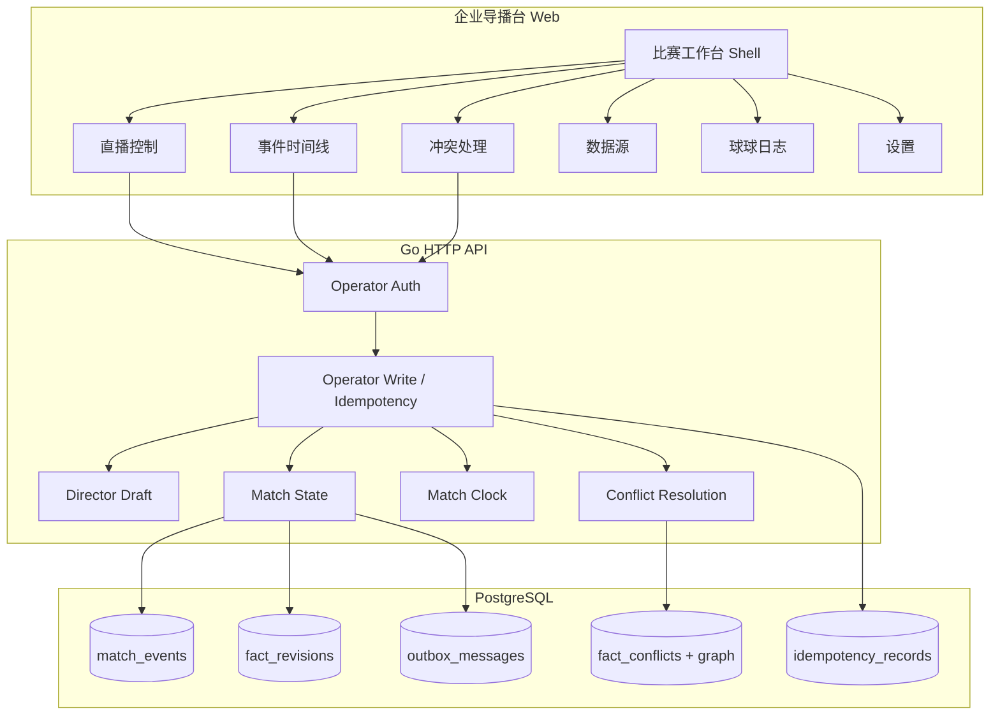
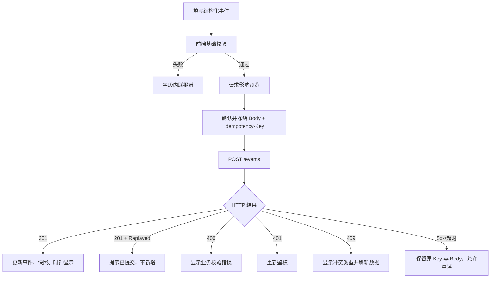
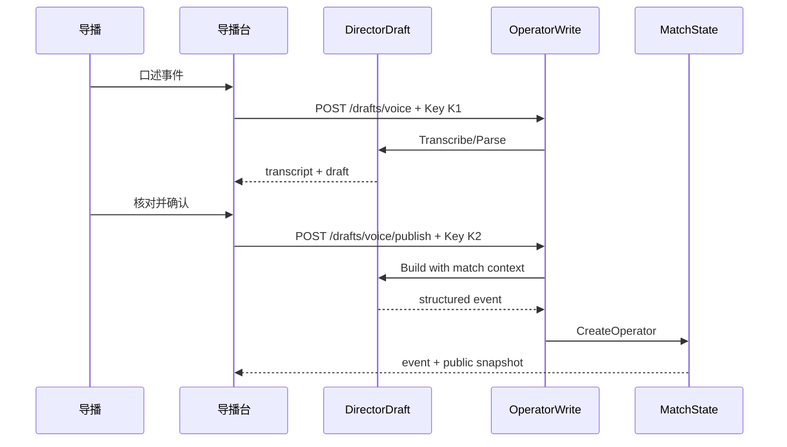
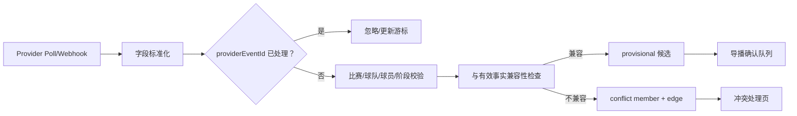
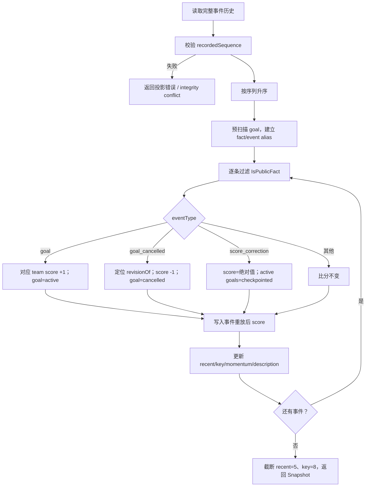
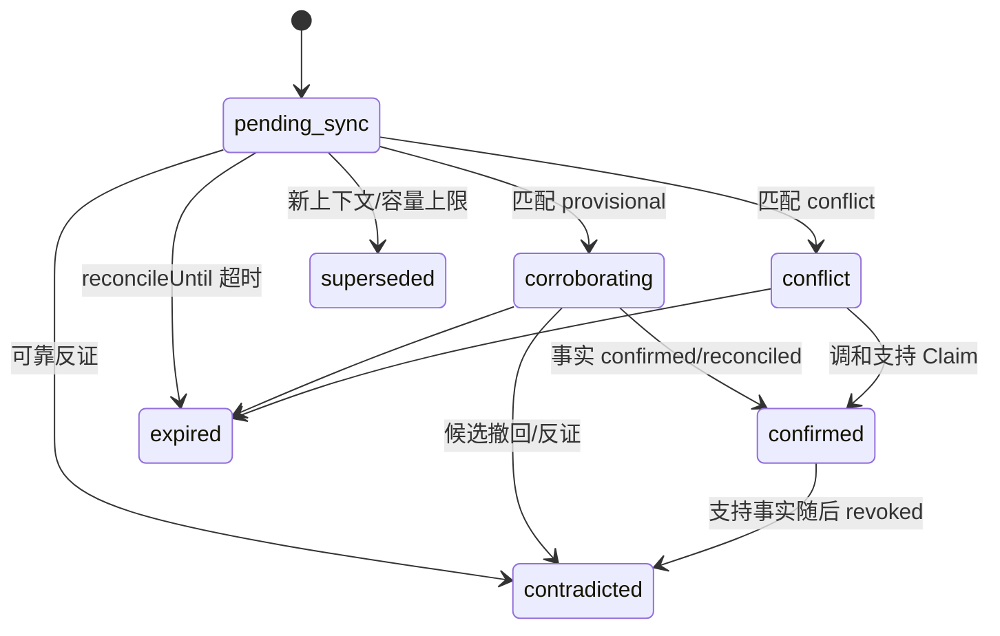
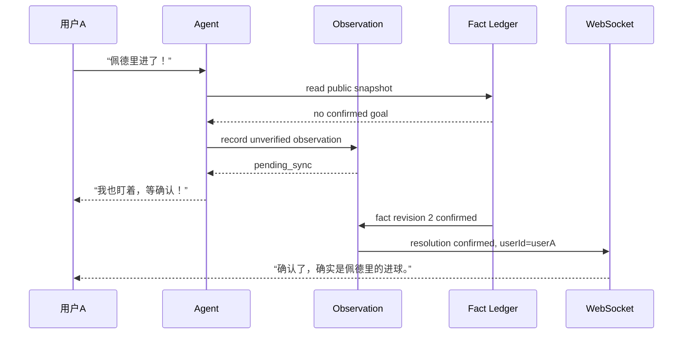
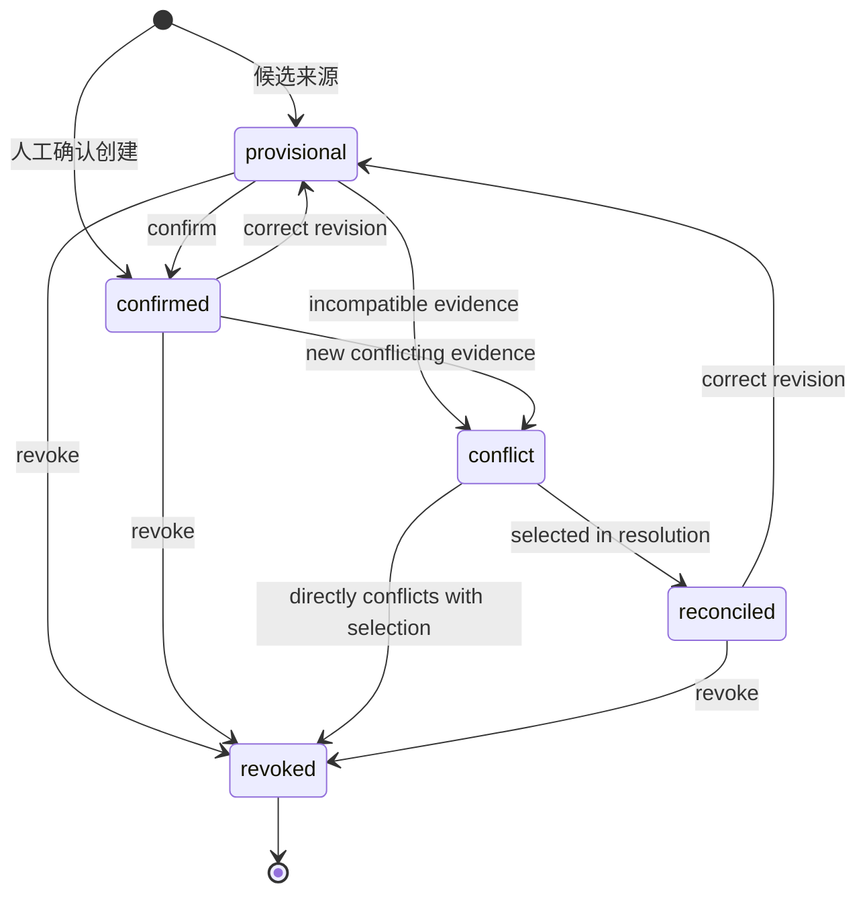
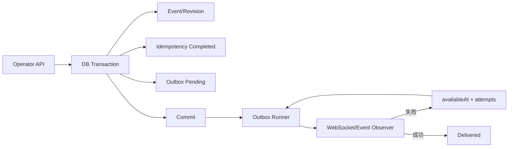
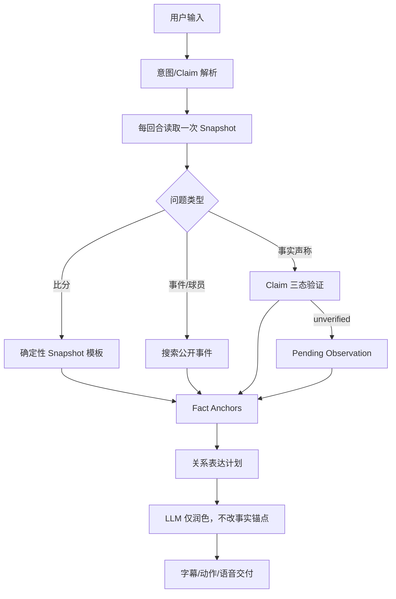

# 25. 比赛事实与纠错系统设计

> 版本：v1.0  
> 产品负责人（PM）：林若安  
> 内部编制日期：2026-04-25  
> 适用版本：球球 v0.1.0.0 已有能力与 v0.2.0 当前目标  
> 时间口径：本文内部项目日期均相对实际项目节点前移 3 个月；外部赛事、政策和第三方发布日期不平移。  
> 输入资料：[业务规则说明](01-比赛事实与纠错系统业务规则说明.md)、[场景流程与状态规范](02-比赛事实与纠错系统场景流程与状态规范.md)、[领域模型与接口契约](03-比赛事实领域模型数据字典与接口契约.md)。

## 一、系统定位与设计目标

### 1.1 系统定位

比赛事实与纠错系统是球球 AI 足球数字球友的可信事实中枢。它接收企业导播、外部结构化数据源和系统修订产生的比赛事件，把每次事实变化保存为不可变修订，再通过顺序重放生成面向所有用户的公共比分、事件列表和完整性状态。

系统同时负责把用户领先直播数据的现场观察与公共事实隔离。用户说“进了”时，球球可以立即接住情绪并创建私有待核验观察，但不能因此改变所有人的比分。只有经确认或人工调和的公开事实才能进入公共投影（BR-01、BR-04、BR-11、SC-09）。

系统不是单纯的赛事 CRUD，也不是比分字段的最后写入者。它需要解决五类并发问题：

1. 导播快速录入与重复点击。
2. 外部数据延迟、重复和乱序。
3. 多来源事实互相冲突。
4. 已发布事实被纠正、VAR 取消或撤回。
5. 事实变化已经触发字幕、语音和 Live2D 后的客户端清理。

### 1.2 设计目标

| 编号 | 设计目标 | 功能结果 | 关键依据 |
|---|---|---|---|
| D-G01 | 建立公共事实唯一来源 | 用户端、Agent 和导播审计均从同一事实账本派生 | G-01、BR-14 |
| D-G02 | 兼顾现场感与准确性 | 用户领先数据时先回应、后核验，不污染公共状态 | G-02、SM-04 |
| D-G03 | 事实全生命周期可逆 | 支持确认、纠正、撤回、冲突和调和 | SM-01、SC-03 至 SC-08 |
| D-G04 | 公共比分可重放 | 任意时点都能由历史修订重新得到一致结果 | BR-14 至 BR-21 |
| D-G05 | 导播写入可安全重试 | 双击、超时和并发不会生成重复事实 | BR-50 至 BR-57 |
| D-G06 | 客户端表现与事实同步 | 新修订正常投递，撤回清理未完成表现 | BR-58 至 BR-63 |
| D-G07 | 每条结果可解释 | 可追溯来源、事实 ID、修订、操作人和调和原因 | DD-04、BR-34 |
| D-G08 | 当前能力不被过度承诺 | 清晰区分已实现、验收缺口和待补能力 | Phase 5 验证报告 |

### 1.3 核心指标

| 指标 | 目标 | 计算口径 | 事故阈值 |
|---|---:|---|---:|
| 公共比分直接受用户文本影响次数 | 0 | 用户输入后无导播/来源事实仍发生比分变化 | >0 即事故 |
| 事实问答账本一致率 | 100% | Agent 回答事实锚点与当时公开投影一致 | <100% 红线 |
| 冲突期间确定性选边率 | 0 | integrity=conflict 时对争议事实给确定结论 | >0 红线 |
| 幂等重复写入率 | 0 | 同一 Key 同一请求产生额外 event/fact | >0 红线 |
| 撤回后残留交付率 | 0 | 被撤回事实仍继续播音/动作/轮播 | >0 红线 |
| 冲突可追溯率 | 100% | resolved 冲突有 selectedFactIds、reason、operator、time | <100% 阻断发布 |
| 投影完整性错误可见率 | 100% | 投影失败进入 integrity conflict 且导播可定位 | <100% 阻断发布 |

### 1.4 当前项目状态

状态说明：✅ 已实现并有自动化证据；🔄 已有基础、当前继续完善；⚠️ 可用但存在真实环境或生产边界；❌ 尚未实现。

| 能力 | 状态 | 当前证据 | 本设计处理方式 |
|---|:---:|---|---|
| 事实创建、确认、纠正、撤回 | ✅ | Go 单测、API 测试、Playwright 生命周期 | 作为正式能力设计 |
| recordedSequence 账本重放 | ✅ | FactLedgerEngine 和测试 | 作为公共读路径基线 |
| 冲突成员、冲突边、多选调和 | ✅ | 内存/PG 实现与 API 测试 | 采用图模型设计 |
| 用户 Pending Observation | ✅ | 内存/PG 协调器与双用户测试 | 作为私有现场领先链路 |
| 导播幂等与 Outbox | ✅ | operatorwrite/PG/重启测试 | 所有导播写统一接入 |
| 客户端 DeliveryKey 去重 | ✅ | Flutter/Playwright 测试 | 使用事件+修订+状态键 |
| 事实撤回清理 | 🔄 | 后端消息和客户端代码已有在研变更 | 按 v0.2.0 目标完整定义 |
| 真实浏览器 ASR/TTS | ⚠️ | 自动化通过，自动播放有环境跳过 | 不影响文字事实闭环 |
| 持久化客户端 ACK/重放游标 | ❌ | Phase 5 明确为灰度门槛 | 单列待补，不宣称 exactly-once |

### 1.5 核心设计原则

1. **事实正确性优先于表达自然度**：语言可以降级，事实不能猜测。
2. **公开事实优先于单一来源**：来源提交的是证据，不是最终公共结果。
3. **用户观察私有化**：用户领先现场只影响当前用户的跟进链。
4. **所有变化留修订**：纠正和撤回不物理覆盖历史。
5. **比分由动作重放**：进球、取消和比分检查点决定比分，不信任最后写入的绝对值。
6. **冲突以边表达**：同属一个冲突集合不代表所有事实互斥。
7. **导播操作默认可重试**：服务端幂等是事实安全边界，不依赖前端按钮状态。
8. **文字交付独立于语音**：TTS 或自动播放失败不能阻断事实更正。

### 1.6 不在范围内的功能

| 功能 | 是否纳入 | 说明 |
|---|:---:|---|
| 赛程搜索与 Web Search | 否 | 只在 Agent 架构中说明不可覆盖当前事实 |
| 用户提醒创建/取消 | 否 | 当前尚未实现，不属于比赛事实生命周期 |
| 关系记忆与长期共同瞬间 | 部分 | 仅定义事实确认前不得写入记忆 |
| Live2D 模型制作与动作美术 | 否 | 只定义事实交付和撤回合同 |
| 第三方赛事供应商选型 | 否 | 仅定义结构化接入和候选事实边界 |
| 完整隐私删除系统 | 否 | 只定义用户观察受隐私生命周期约束 |
| 生产级消息 exactly-once | 否 | 当前没有持久化客户端 ACK/游标 |

## 二、比赛事实工作台架构（企业导播台 SPA）

### 2.1 整体架构

企业导播台是比赛事实的唯一人工写入口。用户侧球球界面只读公共投影，不能通过隐藏按钮、Agent 工具或客户端参数获得写权限（BR-01 至 BR-03）。



### 2.2 顶层页面结构

| 页面 | 一级目标 | 关键对象 | 主要动作 | 只读/写 |
|---|---|---|---|---|
| 赛前设置 | 建立比赛上下文 | MatchConfig、阵容、Automation | 保存配置 | 写 |
| 直播控制 | 3 秒内发布结构化事件 | MatchEvent、MatchClock | 快捷事件、口述草稿、时钟 | 写 |
| 事件时间线 | 查看事实链与修订 | Event、FactRevision | 筛选、详情、纠正、确认、撤回 | 读写 |
| 冲突处理 | 恢复公共事实一致性 | Conflict、Member、Edge | 多选兼容事实、填写原因、调和 | 读写 |
| 数据源 | 控制外部输入 | Provider、Cursor、Status | 启动、停止、接管 | 读写 |
| 球球日志 | 解释用户收到的结果 | Agent Trace、Fact IDs、Delivery | 查询、回放、对照 | 只读 |
| 设置 | 运营与安全配置 | Token、Automation、Demo | 配置 | 读写 |

### 2.3 全局顶栏

顶栏始终展示：

| 区域 | 字段 | 行为 |
|---|---|---|
| 比赛选择 | matchId、赛事、主客队 | 切换比赛前检查未提交表单 |
| 比分 | 公共 Snapshot.score | 只读，不直接编辑；比分校正走事件流程 |
| 阶段/时钟 | period、clock、running、version | 点击打开时钟面板 |
| 完整性 | integrity.status | conflict 时红色入口跳冲突页 |
| 数据源 | active/paused/takeover | 显示最后更新时间与错误 |
| 连接 | HTTP/WS 状态 | 断线时禁止新写，允许查看缓存并提示刷新 |
| 运营身份 | operator subject | 所有写入从服务端身份注入 |

### 2.4 直播控制布局

```text
┌──────────────────────────────────────────────────────────────┐
│ 比赛：西班牙 vs 德国  1-0  24:13 ▶  完整性：正常          │
├───────────────────────┬──────────────────────────────────────┤
│ 快捷事件              │ 结构化事件表单                       │
│ [进球] [射门] [红牌]  │ 阶段 / 发生时间 / 球队 / 球员        │
│ [VAR] [取消进球]      │ 参与者 / 描述 / 强度 / 发布状态       │
│ [换人] [伤病] [...]   │ [预览影响] [确认发布]                 │
├───────────────────────┼──────────────────────────────────────┤
│ 口述事件              │ 时钟控制                              │
│ [按住说话] 转写草稿   │ [开始] [暂停] [校时] version=12      │
├───────────────────────┴──────────────────────────────────────┤
│ 最近 5 条公开事件 / 待确认候选 / 开放冲突提醒                │
└──────────────────────────────────────────────────────────────┘
```

### 2.5 页面公共状态

| 状态 | 触发 | 页面行为 |
|---|---|---|
| `loading` | 首次读取 config/state/events/clock | 骨架屏，写按钮禁用 |
| `ready` | 数据加载完成且 integrity ok | 正常录入 |
| `integrity_conflict` | 开放冲突或投影失败 | 顶栏红色提示；争议类型写入需二次确认 |
| `submitting` | 写请求进行中 | 本操作按钮锁定，重试复用同 Key |
| `replayed` | 服务返回幂等重放 | 显示“已提交，无需重复操作” |
| `stale_clock` | PATCH 时钟 409 | 刷新当前时钟，要求重新确认 |
| `offline` | API/WS 不可用 | 禁止新写，不在本地排队伪造成功 |
| `unauthorized` | 401 | 清除运营态并跳转重新鉴权 |

### 2.6 弹窗与抽屉系统

| 组件 | 入口 | 关键内容 | 提交结果 |
|---|---|---|---|
| 事件预览弹窗 | 发布前 | 结构化字段、预期比分影响、事实状态 | 创建事实 |
| 事件详情抽屉 | 时间线点击 | 当前版本、来源、证据、修订历史 | 可发起纠正/撤回 |
| 纠正弹窗 | 详情抽屉 | 原值/新值对照、纠正原因 | 创建新修订 |
| 撤回确认弹窗 | 详情抽屉 | 比分与客户端表现影响 | 创建 revoked 修订 |
| 冲突处理抽屉 | 冲突列表 | 成员、边、证据、多选结果 | 调和冲突 |
| 时钟校准弹窗 | 顶栏/直播控制 | action、period、seconds、version | 更新 MatchClock |
| 口述草稿弹窗 | 按住说话 | 转写、结构化字段、不确定项 | 确认后发布 |

### 2.7 可用性约束

- 发布按钮必须在事件类型、阶段、时间和描述通过前端基础校验后启用。
- 前端校验只改善体验，服务端必须重复校验，不能把前端当安全边界。
- 所有事实写按钮显示操作影响：“将公开”“仅待确认”“将回退比分”“将产生冲突”。
- 纠正、撤回和冲突调和属于高影响操作，必须展示最终差异，不使用单击即执行。
- 请求进行中保留本次幂等键；用户主动修改字段后生成新键。
- 发生 409 不自动吞掉，必须区分幂等冲突、时钟版本冲突和事实业务冲突。

## 三、四种事实输入模式详细设计

### Mode 1：结构化人工录入

#### 3.1.1 适用场景

用于导播在直播过程中快速创建进球、射门、红牌、VAR、换人、伤病和比赛阶段事件。人工来源默认可信度高，但仍必须经过阵容、阶段、比分贡献和跨源冲突校验（BR-05 至 BR-10、SC-01）。

#### 3.1.2 表单字段

| 字段 | 控件 | 必填 | 默认 | 联动规则 |
|---|---|:---:|---|---|
| eventType | 快捷按钮/下拉 | 是 | 上次为空 | 影响参与者、比分、关键事件和描述模板 |
| period | 下拉 | 是 | 当前 MatchClock.period | 可手工改为历史阶段 |
| clock | 时间输入 | 是 | 当前显示时钟 | 晚录不修改当前时钟 |
| teamId | 主/客队单选 | 条件 | 无 | 过滤球员列表 |
| playerName | 球员搜索 | 条件 | 无 | 必须在对应阵容 |
| participants | 角色化球员选择 | 条件 | [] | goal 支持 scorer/assist；substitution 支持 on/off |
| score | 比分预览 | 条件 | 公共快照计算 | 普通事件只读，score_correction 可编辑 |
| description | 文本 | 是 | 类型模板 | 非空，可人工修改 |
| intensity | 1-5 | 否 | 类型默认 | 影响表现，不影响事实真假 |
| factStatus | 发布策略 | 否 | confirmed | 可选择 provisional |
| evidence | 结构化证据 | 否 | {} | 来源链接、回放备注等 |

#### 3.1.3 请求结构

```json
{
  "source": "operator",
  "period": "first_half",
  "clock": "24:13",
  "eventType": "goal",
  "teamId": "home",
  "teamName": "西班牙",
  "playerName": "佩德里",
  "participants": [
    {"role": "scorer", "name": "佩德里", "teamId": "home"},
    {"role": "assist", "name": "法比安", "teamId": "home"}
  ],
  "score": {"home": 1, "away": 0},
  "intensity": 5,
  "confirmed": true,
  "visibility": "public",
  "description": "佩德里破门，法比安送出助攻"
}
```

Header：

```http
Authorization: Bearer <operator-token>
Idempotency-Key: event-create-7e65b52a
Content-Type: application/json
```

#### 3.1.4 提交流程



#### 3.1.5 事件类型联动

| 事件 | 表单变化 | 账本变化 |
|---|---|---|
| goal | 要求球队；推荐 scorer；可填 assist | 对应球队 +1 |
| goal_cancelled | 要求选择可取消公开进球 | 中和引用进球 |
| score_correction | 开放绝对比分和原因 | 建立检查点 |
| substitution | 要求 on/off 两个角色 | 不改比分，校验阵容 |
| var_check | 弱化球员必填，强调描述 | 不改比分，关键事件 |
| var_result | 要求结论和关联事实 | 不直接改比分，关系型事实 |
| yellow/red_card | 要求球队与球员 | 不改比分，红牌为关键事件 |
| halftime/fulltime | 阶段选择受限 | 不改比分，可联动时钟操作 |
| operator_note | 仅描述和标签 | 非关键，不进入自动主动策略 |

#### 3.1.6 完整事件类型映射

| 分组 | 事件类型 | 主要表单/处理 |
|---|---|---|
| 比赛阶段 | `kickoff` | 阶段与时间；不改比分 |
| 比赛阶段 | `halftime`、`fulltime`、`match_end` | 关键事件，可联动时钟但不由事件隐式改时钟 |
| 得分 | `goal` | 球队、进球者、助攻者；对应球队 +1 |
| 进攻 | `shot`、`big_chance`、`miss` | 球队/球员/描述；比分不变 |
| 定位球 | `penalty`、`penalty_awarded` | 球队/球员/判罚描述；本身不直接加分 |
| 防守 | `save` | 球队/门将；比分不变 |
| 纪律 | `foul`、`yellow_card`、`red_card` | 球队/球员；红牌是关键事件 |
| VAR | `var_check`、`var_result` | 关联事实与结论；关系型结果撤回后重建 |
| 纠错 | `goal_cancelled` | 选择并引用已公开进球，中和其贡献 |
| 纠错 | `score_correction` | 输入绝对比分和原因，建立检查点 |
| 人员 | `substitution` | `on/off` 参与者和阵容校验 |
| 人员 | `injury` | 球队、球员和描述 |
| 态势 | `tactical_shift`、`pressure` | 描述、球队、强度；不改比分 |
| 运营 | `operator_note` | 只记运营备注，不加入自动主动播报 |

#### 3.1.7 成功反馈

- Toast 显示“事件已发布”或“候选事实已保存”。
- 时间线定位到新 `eventId`，高亮 `factStatus` 和 revision。
- 比分卡只使用响应 `snapshot.score`，不在前端自己 +1。
- 若响应包含 conflict，顶栏完整性立刻切换并打开冲突入口。
- 若服务返回幂等重放，显示原事件 ID，避免运营再次重建。

### Mode 2：导播口述草稿

#### 3.2.1 设计定位

口述模式用于降低直播高压下的录入成本，但 ASR 和结构化抽取都不是事实来源。它们只生成草稿，必须由导播确认后重新走事实写链（BR-69 至 BR-72、SC-14）。

#### 3.2.2 两阶段接口

| 阶段 | 接口 | 是否创建事实 | 幂等操作名 |
|---|---|:---:|---|
| 转写/草稿 | `POST /drafts/voice` | 否 | `drafts.voice` |
| 确认发布 | `POST /drafts/voice/publish` | 是 | `drafts.voice.publish` |

#### 3.2.3 草稿请求

```json
{
  "text": "24 分钟佩德里进球，法比安助攻",
  "occurredPeriod": "first_half",
  "occurredSeconds": 1453,
  "capturedClockVersion": 12
}
```

允许输入文本或音频；无输入返回 400，ASR 未配置返回 503，上游转写失败返回网关错误语义。

#### 3.2.4 草稿展示

| 区块 | 内容 | 导播动作 |
|---|---|---|
| 原始转写 | 完整 transcript | 可编辑文本并重新解析 |
| 事件类型 | goal | 必须确认 |
| 发生时刻 | first_half / 24:13 | 与当前时钟对照 |
| 球队 | 西班牙/home | 修改后刷新球员候选 |
| 参与者 | scorer=佩德里；assist=法比安 | 补齐或纠错 |
| 描述 | 自动生成底稿 | 可修改 |
| 不确定项 | 低置信字段列表 | 未清空前禁止发布 |
| 时钟快照 | capturedClockVersion=12 | 若当前版本变化提示重新核对时间 |

#### 3.2.5 发布流程



#### 3.2.6 时钟变化处理

- 草稿保存 `capturedClockVersion`，用于提示“草稿生成后时钟已变化”。
- 发生时间来自口述或人工确认，不把发布瞬间的当前时钟强行覆盖。
- 时钟版本变化不一定阻断历史事件发布，但必须让导播确认差异。
- 口述“刚才进球”无法确定时间时，草稿标记不确定，不能直接猜为当前秒数。

### Mode 3：外部数据源候选事实

#### 3.3.1 设计定位

外部数据源提供结构化证据，不能绕过事实校验成为最终公共状态。接入层负责供应商字段标准化、来源去重、游标和接管；事实层负责业务合法性、兼容性和公开资格（BR-22 至 BR-28、SC-02）。

#### 3.3.2 标准化输入

```json
{
  "source": "api-sports",
  "providerName": "API-Sports",
  "providerEventId": "fixture-123:event-456",
  "period": "first_half",
  "clock": "24:10",
  "eventType": "goal",
  "teamId": "home",
  "playerName": "Pedri",
  "score": {"home": 1, "away": 0},
  "confidence": 0.96,
  "evidence": {
    "fixtureId": 123,
    "providerUpdatedAt": "2026-04-25T12:24:18Z"
  }
}
```

#### 3.3.3 来源处理流程



#### 3.3.4 数据源页面字段

| 字段 | 说明 |
|---|---|
| sourceId/provider | 数据源身份 |
| status | active/paused/error/takeover |
| lastCursor | 最近成功处理游标 |
| lastEventAt | 最近来源事件时间 |
| freshness | 当前新鲜度，设计层建议统一为毫秒 |
| error | 最近错误摘要 |
| pendingCandidates | 待确认候选数 |
| openConflicts | 由该来源触发的开放冲突数 |

#### 3.3.5 人工接管

- 人工接管暂停来源对公共事实链的自动推进，但已保存候选和冲突不删除。
- 接管不允许把已有 provisional 批量改为 confirmed。
- 恢复来源前显示游标和时间差，避免重放大量重复事件。
- 来源状态变化属于导播写操作，仍要求运营身份和幂等键；其跨崩溃副作用语义是当前残余风险之一。

### Mode 4：时间线纠正、确认与撤回

#### 3.4.1 设计定位

时间线模式处理已经进入系统的事实。它不是通用编辑器：确认改变事实可信状态；纠正创建内容新版本；撤回创建终止修订；三者都保留完整历史（BR-35 至 BR-41）。

#### 3.4.2 时间线卡片

| 区域 | 字段 |
|---|---|
| 主信息 | clock、eventType、description、team/player |
| 状态 | factStatus、visibility、active/corrected |
| 来源 | source、providerName/operatorId、confidence |
| 标识 | eventId、factId、factRevision、recordedSequence |
| 比分 | reportedScore、effective score、当前投影 score |
| 操作 | 查看修订、确认、纠正、撤回、跳转冲突 |

#### 3.4.3 确认

适用：`provisional` 且不存在未解决冲突的事实。

```http
POST /api/matches/{matchId}/facts/{factId}/confirm
Idempotency-Key: fact-confirm-<uuid>
```

成功后创建新 `confirmed` 修订，并返回最新公共快照。前端不能只把标签改绿，必须使用响应事件和快照替换本地状态。

#### 3.4.4 纠正

```json
{
  "period": "first_half",
  "clock": "24:13",
  "eventType": "shot",
  "teamId": "home",
  "score": {"home": 0, "away": 0},
  "description": "复核后改为射门中柱",
  "evidence": {
    "correctionReason": "回放确认皮球未整体越过门线"
  }
}
```

纠正约束：

1. `correctionReason` 必填。
2. `goal_cancelled`、`var_result` 不能直接纠正，应撤回并重建。
3. 若改变早期事件的计分贡献，必须先处理其后的活跃事件。
4. 新版本沿用 `factId`，revision 递增，旧版本退出 active。
5. 新版本是 provisional 还是 confirmed 由发布策略决定。

#### 3.4.5 撤回

撤回弹窗展示：

- 当前事实和 revision。
- 是否正在公共投影中。
- 撤回后的预计比分。
- 将被清理的客户端字幕、动作、音频和主动反应。
- 可能被反转的用户观察数量（只显示数量，不展示私人原文）。

确认后调用 `POST /facts/{factId}/revoke`。成功响应必须同时驱动时间线刷新、比分校准和撤回消息处理（SC-04、SC-11）。

## 四、公共事实账本与比分重放

### 4.1 设计定位

公共事实账本把不可变事件历史转换为当前公共读模型。它解决“事实被撤回或纠正后，比分如何回到正确结果”的问题。公共比分不能依赖最后一条事件的 `score` 字段，因为最后事件可能是黄牌、历史补录或被撤回版本（BR-14、DD-02）。

### 4.2 输入与输出

| 类型 | 内容 |
|---|---|
| 输入 | matchId、完整 MatchEvent 历史、MatchConfig、MatchClock、当前时间 |
| 排序 | recordedSequence 升序；完整历史必须全部有序列或全部无序列 |
| 过滤 | 只处理 active + public + confirmed/reconciled |
| 输出 | Snapshot、PublicEvents |
| 审计 | 与旧投影比较 score、recentEvents、keyEvents、teams、publicEvents |

### 4.3 公开事实判断

```text
IsPublicFact(event) =
  event.status == "active"
  && event.visibility == "public"
  && event.factStatus in ["confirmed", "reconciled"]
```

`confirmed` 兼容布尔字段不单独决定公开性。页面、Agent 和客户端都不得自行降低该判断条件。

### 4.4 recordedSequence 规则

| 规则 | 错误结果 |
|---|---|
| 序列必须为正数 | 无序列事件按兼容路径处理；新数据必须生成 |
| 同一比赛不得重复 | 投影失败，integrity conflict |
| 一旦部分事件有序列，完整历史必须都有 | 投影失败，不能混合排序 |
| 重放只使用记录顺序 | 事件发生 clock 仅用于展示，不替代记录顺序 |

选择记录顺序而不是 `createdAt`/`clock` 的原因：修订、晚录和数据恢复时，业务写入的因果顺序比墙上时间或比赛分钟更稳定。

### 4.5 计分状态

内部为每个进球维护投影状态：

| 状态 | 含义 |
|---|---|
| pending | 找到将参与公开投影的进球，尚未重放到位置 |
| active | 已为对应球队贡献 +1 |
| cancelled | 已被 goal_cancelled 中和 |
| checkpointed | 已被 score_correction 检查点吸收 |
| revoked | 该事实链最新有效结果为撤回 |
| unavailable | 从未成为可用公开进球 |

### 4.6 重放算法



### 4.7 goal 规则

- 必须存在可作为稳定身份的 `factId` 或 `eventId`。
- 同一进球不能有多个活跃公开修订。
- `teamId` 必须为 `home` 或 `away`。
- 每个公开进球严格贡献 1 分，不使用请求中的差值推断多分。
- 进球事件响应中的 `score` 应是重放后的有效比分。

### 4.8 goal_cancelled 规则

`goal_cancelled.revisionOf` 必须引用可定位的公开进球别名。

| 被引用进球状态 | 处理 |
|---|---|
| active | 对原球队 -1，标记 cancelled |
| revoked | 不重复减分，允许保留取消事实语义 |
| unavailable | 400/投影错误：从未公开 |
| checkpointed | 错误：已早于最新比分检查点 |
| pending | 错误：取消发生在进球之前 |
| 已 cancelled | 错误：重复取消 |

### 4.9 score_correction 规则

- 只用于无法可靠逐条重建的历史修复，不作为日常进球录入捷径。
- 主客队绝对比分均不得为负。
- 写入后覆盖当前累计比分。
- 当前 active 进球转为 checkpointed，防止后续再取消检查点前贡献。
- 检查点后的新进球继续相对累加。

### 4.10 投影失败策略

若序列重复、引用未知、出现负比分或同一进球多活跃版本：

1. 不返回猜测公共事件。
2. 基于空事件生成安全快照。
3. `snapshot.integrity.status=conflict`。
4. `reason=public projection unavailable` 或内部具体错误。
5. 普通用户只获得裁剪后的不确定状态。
6. 导播台展示投影错误并引导修复账本。

### 4.11 影子审计与回退

当前实现保留旧投影和新账本投影的比较能力：

| 比较字段 | 用途 |
|---|---|
| score | 检查计分差异 |
| recent_events | 检查公开过滤和顺序 |
| key_events | 检查关键事件分类 |
| teams | 检查队名投影 |
| public_events | 检查完整公开集合 |

影子审计只记录差异，不直接修改用户结果。紧急配置可切回旧读路径，但新设计默认使用账本投影。若新投影本身失败，优先进入安全冲突状态，不静默使用可能错误的旧比分（BR-16、BR-17）。

## 五、事实冲突图与调和系统

### 5.1 为什么使用冲突图

一个冲突集合可能包含多条事实，其中只有部分事实互斥。例如两个已确认的主队进球 A、C 与一个“同一时段客队进球”候选 B 分别冲突，但 A 和 C 可以同时成立。若采用“整组只选一条”，会错误撤回合法事实（BR-25、DD-03、SC-08）。

### 5.2 数据结构

```text
FactConflict
├── members
│   ├── fact_a (accepted)
│   ├── fact_b (candidate)
│   └── fact_c (accepted)
└── edges
    ├── fact_a <-> fact_b
    └── fact_b <-> fact_c

兼容集合：{fact_a, fact_c}
```

### 5.3 冲突检测结果

| 对象 | 写入 |
|---|---|
| 候选事件 | factStatus=conflict、非公开 |
| 已接受事件 | 保持原公共状态，不因新候选撤回 |
| FactConflict | status=open、detectedAt |
| Members | accepted/candidate 角色 |
| Edges | 具体不兼容关系和原因 |
| MatchIntegrity | status=conflict、内部原因 |

### 5.4 冲突处理页面

```text
┌────────────────────────────────────────────────────────────┐
│ 冲突 #conflict_12  发现于 24:16  状态：待处理             │
├────────────────────────┬───────────────────────────────────┤
│ 事实候选                │ 冲突关系图                        │
│ ☑ A 人工：主队进球      │ A ───── B ───── C                 │
│ ☐ B API：客队进球       │ A 与 C 无直接冲突                 │
│ ☑ C 人工：主队另一进球  │                                   │
├────────────────────────┴───────────────────────────────────┤
│ 选择结果：保留 A、C；撤回 B                               │
│ 调和原因：[以导播回放和主数据源为准________________]       │
│ [取消] [确认调和]                                          │
└────────────────────────────────────────────────────────────┘
```

### 5.5 候选卡片字段

| 分组 | 字段 |
|---|---|
| 身份 | factId、eventId、revision、member role |
| 内容 | eventType、clock、team、player、participants、description |
| 来源 | source、providerName、providerEventId、operatorId |
| 可信信息 | confidence、evidence、recordedAt、publicAt |
| 状态 | factStatus、active、visibility |
| 关系 | 与哪些事实有冲突边、edge reason |

### 5.6 解决请求

```json
{
  "selectedFactIds": ["fact_a", "fact_c"],
  "reason": "以导播回放和主数据源为准"
}
```

新 UI 不使用 `chosenFactId`。服务保留旧字段仅用于兼容已有客户端，并自动加入与单选事实不冲突的 accepted 事实。

### 5.7 校验顺序

1. 冲突必须为 open。
2. `selectedFactIds` 去空、去重、排序后至少一条。
3. 每个被选事实必须属于冲突且仍为 active。
4. 任意两个被选事实之间不能有直接冲突边。
5. 找出所有与被选事实直接相连的事实作为撤回候选。
6. 被选的 provisional/conflict 事实进入 reconciled。
7. 只撤回直接冲突事实。
8. 重新计算活跃事实间剩余边。
9. 无剩余边则 resolved；否则保持 open 并重建成员角色。

### 5.8 状态转换表

| 事实情况 | 调和后动作 |
|---|---|
| selected + conflict/provisional | 新修订 reconciled |
| selected + confirmed/reconciled | 保持有效，可记录选择审计 |
| unselected + 与 selected 有直接边 | 新修订 revoked |
| unselected + 无剩余冲突边 | 从 conflict 释放为待确认或原有效语义 |
| unselected + 仍在剩余边中 | 保持 conflict |

### 5.9 部分解决

若调和后仍存在冲突边：

- `FactConflict.status` 继续为 open。
- `RemainingEdges` 只保留两端都活跃的边。
- 成员角色根据调和后是否公开重新计算。
- `MatchIntegrity` 继续 conflict。
- 页面提示“已处理部分冲突，仍有 N 条关系待解决”。

### 5.10 原子性

冲突解决属于原子导播操作。以下内容必须同事务成功或全部失败：

1. 选中事实的新 reconciled 修订。
2. 被排除事实的新 revoked 修订。
3. 冲突状态、成员和剩余边。
4. `fact_conflict_resolution_facts` 审计记录。
5. 最新公共快照可重放性。
6. 幂等完成响应。
7. Outbox 消息。

### 5.11 冲突期间用户体验

- 用户端继续显示最后已接受的公开比分，不把候选直接混入。
- 对争议问题，Agent 使用 `unverified` 模式：“现在数据有点打架，我再确认一下。”
- 对不受冲突影响的事实仍可正常回答。
- 普通用户看不到候选来源、运营身份和边原因。
- 冲突解决后，客户端只消费新修订和新快照，不需要理解冲突算法。

## 六、用户领先现场观察协调

### 6.1 设计定位

用户观察系统解决直播画面领先官方数据的问题。它允许球球表现得“在现场”，但不让用户口述成为公共事实。Pending Observation 是用户私有的核验任务，不是低质量 MatchEvent（BR-42 至 BR-49、DD-01）。

### 6.2 Claim 三态入口

| 状态 | 条件 | 即时回复 | 是否创建观察 |
|---|---|---|:---:|
| confirmed | 用户说法匹配公开事实 | 自然确认 | 否 |
| contradicted | 内部一致公开事实明确否定 | 温和纠正 | 否 |
| unverified | 数据缺失、延迟或冲突 | 保留式回应 | 是 |

若 `snapshot.integrity=conflict`，相关 Claim 不得判为强 `contradicted`，至少降为 unverified。

### 6.3 Record 输入

```json
{
  "signalId": "turn_userA_1001",
  "traceId": "trace_889",
  "userId": "user_a",
  "matchId": "spain-germany",
  "kind": "match_fact_claim",
  "eventType": "goal",
  "claimedTeam": "home",
  "claimedPlayer": "佩德里",
  "claimedScore": {"home": 1, "away": 0},
  "certainty": "assertive",
  "receivedAt": "2026-04-25T12:24:10Z"
}
```

### 6.4 作用域与容量

| 规则 | 设计 |
|---|---|
| 唯一作用域 | userId + matchId + signalId |
| 语义复用 | 同用户同比赛等价活跃观察返回已有对象 |
| 活跃状态 | pending_sync/corroborating/conflict |
| 活跃上限 | 每用户每比赛 5 条 |
| 超限处理 | 最旧观察 superseded，reason=pending observation limit exceeded |
| 身份来源 | 服务端会话身份，不信任消息中的任意 userId |

### 6.5 状态机



### 6.6 事实匹配

协调器只关注 `provisional`、`confirmed`、`reconciled`、`revoked` 变化。匹配维度包括：

- matchId 必须一致。
- 事件类型或可解释关系一致。
- 声称球队与事实球队一致。
- 声称球员与事件参与者一致。
- 声称比分与公开重放结果一致。
- 事实发生时间位于观察的调和窗口内。

### 6.7 即时回复与异步跟进分离



即时回复由当前 Agent 回合交付；异步跟进由 Resolution 驱动。二者使用不同 DeliveryKey，不相互覆盖。

### 6.8 Resolution 结构

```json
{
  "observationId": "obs_1",
  "userId": "user_a",
  "matchId": "spain-germany",
  "status": "confirmed",
  "factId": "fact_goal_1",
  "factRevision": 2,
  "reliableText": "确认了，确实是佩德里的进球。",
  "deliveryKey": "obs_1:2:confirmed",
  "followUpDeadline": "2026-04-25T12:25:10Z"
}
```

### 6.9 已确认后反转

事实修订 2 支持观察后，用户收到 `obs_1:2:confirmed`。如果事实修订 3 被撤回，协调器生成 `obs_1:3:contradicted`。新键保证纠正可以正常投递，且不会被先前确认去重（SC-11）。

### 6.10 过期、抑制与恢复

| 情况 | 处理 |
|---|---|
| 超过 reconcileUntil | 状态 expired，不再匹配迟到事实 |
| 超过 followUpDeadline | 可保留审计，不做用户可见投递 |
| 用户开始新一轮发言 | 可抑制旧跟进，避免打断当前上下文 |
| 同类新观察替代 | 旧观察 superseded |
| 用户断线 | Resolution 持久化等待恢复 |
| 用户重连 | 只查询本人、本人比赛、未过期未交付结果 |

### 6.11 隐私边界

- 导播冲突页不展示用户观察原文。
- Observation 按用户身份存储和读取。
- 用户删除数据后，观察、Resolution 和关联 Trace 按隐私流程处理。
- 删除 tombstone 建立后，迟到异步写不得恢复观察。
- 观察确认前不得进入长期关系记忆或共同瞬间。

## 七、事实生命周期与修订历史

### 7.1 总状态机



### 7.2 事实身份与版本

| 标识 | 生命周期 | 用途 |
|---|---|---|
| factId | 跨修订稳定 | 表示同一事实链 |
| eventId | 内容纠正时创建新 ID；事实状态修订可沿用 | 客户端和审计定位事件对象 |
| factRevision | 单 fact 从 1 递增 | 确认变化顺序 |
| revisionOf | 指向前一版本或关系事实 | 构建修订/引用链 |
| recordedSequence | 每场全局递增 | 账本因果重放 |

### 7.3 完整生命周期示例

```text
revision 1: provisional / active / operator-only
→ revision 2: confirmed / active / public
→ revision 3: revoked / active / non-public
→ revision 4: corrected provisional / active / non-public
→ revision 5: confirmed / active / public
```

每产生新 revision 都追加 FactRevision 历史。内容纠正会把原事件标为 `corrected` 并创建新 eventId；确认、撤回和调和在当前实现中可沿用 active eventId，仅递增 factRevision。公共视图在 revision 2 显示事实，在 revision 3 移除，在 revision 5 重新显示最新有效结果。

### 7.4 修订历史页面

| 列 | 说明 |
|---|---|
| revision | 修订号 |
| status | provisional/confirmed/conflict/reconciled/revoked |
| eventId | 具体事件版本 |
| source | 来源类型和来源事件 ID |
| change | 相比上一版的字段差异 |
| evidence | 纠正原因或来源证据 |
| operator | confirmedBy/操作人 |
| recordedAt/publicAt | 记录和公开时间 |

### 7.5 修订差异

前端对以下字段生成差异视图：

- eventType。
- period/clock。
- teamId/teamName。
- playerName/participants。
- description。
- score contribution。
- factStatus/visibility。
- evidence.correctionReason。

### 7.6 禁止行为

- 不允许删除历史 revision。
- 不允许直接编辑历史 revision。
- 不允许把 revoked revision 改回 confirmed。
- 不允许一个 factId 同时有多个 active public revision。
- 不允许只更新前端标签而不创建服务端修订。
- 不允许纠正关系型事件破坏 `revisionOf` 链。

### 7.7 发布后行为

| 状态变化 | 公共快照 | 客户端 | Agent | Observation |
|---|---|---|---|---|
| provisional → confirmed | 重放加入 | 新事件投递 | 可确定性引用 | 可能 confirmed |
| confirmed → revoked | 重放移除/回退 | retraction 清理 | 不再引用 | 可能 contradicted |
| conflict → reconciled | 重放加入 | 新修订投递 | 恢复确定性 | 匹配结果更新 |
| correction new provisional | 旧版本移除，新版不公开 | 旧表现按事实链处理 | 暂不确定 | 等待后续确认 |
| correction new confirmed | 使用最新版本重放 | 新 revision 正常投递 | 引用最新内容 | 重新匹配 |

## 八、领域模型与数据结构

### 8.1 模型分层

| 层 | 对象 | 责任 |
|---|---|---|
| 配置层 | MatchConfig、Player、AutomationPolicy | 定义球队、阵容、赛事和自动化边界 |
| 事实写模型 | MatchEvent、FactRevision | 保存事件版本和事实修订 |
| 冲突模型 | FactConflict、Member、Edge、ResolutionFact | 表达不兼容关系和调和审计 |
| 公共读模型 | Snapshot、PublicEvents、MatchIntegrity | 为用户端和 Agent 提供稳定读结果 |
| 用户观察模型 | PendingObservation、Resolution | 保存私有领先现场核验链 |
| 可靠性模型 | IdempotencyRecord、OutboxMessage | 收敛重复写入和可靠投递 |
| 时钟模型 | MatchClock、ClockCommand | 管理当前比赛阶段和时间 |

### 8.2 MatchEvent 数据模型

```go
type MatchEvent struct {
    ID                  string
    MatchID             string
    Source              string
    ProviderName        string
    ProviderEventID     string
    OperatorID          string
    Period              string
    Clock               string
    EventType           string
    TeamID              string
    TeamName            string
    PlayerName          string
    Participants        []Participant
    Score               Score
    ReportedScore       *Score
    EffectiveScoreAfter *Score
    Intensity           int
    Confirmed           bool
    Description         string
    Visibility          string
    Status              string
    FactID              string
    FactRevision        int
    FactStatus          FactStatus
    Confidence          float64
    Evidence            map[string]any
    ConfirmedBy         string
    PublicAt            string
    RecordedSequence    int64
}
```

### 8.3 MatchEvent 字段分组

| 分组 | 字段 | 写入方 | 普通用户可见 |
|---|---|---|:---:|
| 稳定身份 | matchId、factId | 服务端 | factId 可按需 |
| 版本身份 | id、factRevision、revisionOf、recordedSequence | 服务端 | 部分 |
| 来源审计 | source、providerName、providerEventId、operatorId | 接入层/服务端 | 否 |
| 发生语义 | period、clock、eventType、team、player、participants | 导播/来源 | 是 |
| 表现语义 | intensity、sentiment、description、proactiveText、action | 导播/策略 | 是 |
| 比分审计 | score、reportedScore、effectiveScoreAfter | 服务计算为主 | 有效 score |
| 事实状态 | factStatus、status、visibility、confidence、evidence | 事实层 | 裁剪 |
| 时间 | createdAt、updatedAt、publicAt | 服务端 | 部分 |

### 8.4 FactRevision 数据模型

| 字段 | 类型 | 必填 | 说明 |
|---|---|:---:|---|
| factId | string | 是 | 稳定事实身份 |
| revision | int | 是 | 递增修订号 |
| matchId | string | 是 | 比赛作用域 |
| eventId | string | 条件 | 对应事件版本 |
| status | FactStatus | 是 | 修订状态 |
| sourceType | string | 是 | 来源类别 |
| sourceEventId | string | 否 | 提供商原始 ID |
| confidence | float | 否 | 0-1 语义 |
| evidence | object | 否 | 来源、回放和纠正原因 |
| confirmedBy | string | 条件 | 操作人 |
| revisionOf | string | 条件 | 上一版本或关系引用 |
| occurredAt | string | 否 | 事实发生时间 |
| recordedAt | string | 是 | 系统记录时间 |
| publicAt | string | 否 | 公开时间 |

### 8.5 Snapshot 数据模型

```json
{
  "matchId": "spain-germany",
  "homeTeam": "西班牙",
  "awayTeam": "德国",
  "competition": "演示赛",
  "score": {"home": 1, "away": 0},
  "period": "first_half",
  "clock": "24:13",
  "matchClock": {
    "elapsedSeconds": 1453,
    "running": true,
    "version": 12
  },
  "momentum": "home",
  "emotionalTemperature": 5,
  "recentEvents": [],
  "keyEvents": [],
  "lastUpdatedAt": "2026-04-25T12:24:13Z",
  "integrity": {"status": "ok"}
}
```

### 8.6 Snapshot 截断规则

| 集合 | 上限 | 顺序 | 过滤 |
|---|---:|---|---|
| recentEvents | 5 | 最新在前 | 仅公开有效事实 |
| keyEvents | 8 | 最新在前 | 关键事件且公开有效 |
| PublicEvents API | 无固定 UI 上限 | 最新在前 | 仅公开有效；运营视图附审计 |

### 8.7 Conflict 数据模型

```json
{
  "id": "conflict_12",
  "matchId": "spain-germany",
  "status": "open",
  "selectedFactIds": [],
  "reason": "",
  "detectedAt": "2026-04-25T12:24:16Z",
  "members": [
    {"factId": "fact_a", "role": "accepted"},
    {"factId": "fact_b", "role": "candidate"},
    {"factId": "fact_c", "role": "accepted"}
  ],
  "edges": [
    {"leftFactId": "fact_a", "rightFactId": "fact_b", "reason": "same_window_score_conflict"},
    {"leftFactId": "fact_b", "rightFactId": "fact_c", "reason": "same_window_score_conflict"}
  ]
}
```

### 8.8 PendingObservation 数据模型

| 字段 | 作用 | 用户可见 |
|---|---|:---:|
| id/signalId/traceId | 幂等和追溯 | 否 |
| userId/matchId | 私有作用域 | 否 |
| kind/eventType | Claim 类型 | 间接 |
| claimedTeam/player/score | 用户声称结构 | 仅本人上下文 |
| certainty | 表达确定度 | 否 |
| status | 核验状态 | 可转为自然文案 |
| candidateFactId/resolvedFactId | 事实关联 | 否 |
| resolvedRevision | 结果修订 | 否 |
| receivedAt/deadlines | 时间窗口 | 否 |
| resolutionReason | 状态原因 | 运营审计，不直接暴露 |

### 8.9 DeliveryKey

事实投递键：

```text
eventId:factRevision:factStatus
```

观察结果投递键：

```text
observationId:factRevision:resolutionStatus
```

键包含 revision 和 status，原因是同一事实可能先 confirmed 后 revoked，同一观察也可能先 confirmed 后 contradicted。只按 factId 或 observationId 去重会吞掉合法更正（BR-58 至 BR-60）。

## 九、数据库与持久化设计

### 9.1 核心表

| 表 | 主数据 | 关键关系 |
|---|---|---|
| matches | 比赛身份 | 其他表通过 match_id 关联 |
| match_events | 事件版本 | fact_id、revision、recorded_sequence |
| fact_revisions | 事实修订历史 | fact_id + revision |
| fact_conflicts | 冲突头 | match_id、status |
| fact_conflict_members | 冲突成员 | conflict_id + fact_id |
| fact_conflict_edges | 冲突边 | 两端均外键到同冲突成员 |
| fact_conflict_resolution_facts | 多选调和记录 | conflict_id + fact_id、reason、resolved_by |
| pending_observations | 用户观察 | user_id + match_id + status + deadline |
| observation_resolutions | 待交付结果 | delivery_key 去重 |
| idempotency_records | 导播写请求状态 | match_id + key |
| outbox_messages | 事务后投递 | aggregate + status + available_at |

### 9.2 recordedSequence 迁移

事实账本迁移为已有事件补齐每场记录顺序，并建立：

```sql
CREATE INDEX IF NOT EXISTS idx_match_events_match_recorded_sequence
  ON match_events(match_id, recorded_sequence);
```

设计要求是在数据库写入路径为同一比赛分配单调递增序列，避免应用重启或并发写入产生重复。

### 9.3 冲突图表

```sql
CREATE TABLE fact_conflict_edges (
  conflict_id TEXT NOT NULL,
  left_fact_id TEXT NOT NULL,
  right_fact_id TEXT NOT NULL,
  reason TEXT NOT NULL DEFAULT '',
  PRIMARY KEY (conflict_id, left_fact_id, right_fact_id),
  CHECK (left_fact_id <> right_fact_id)
);
```

两端事实必须已经是相同 conflict 的 member。写入时按字典序规范化左右顺序，避免 A-B 与 B-A 重复。

### 9.4 多选调和审计

`fact_conflict_resolution_facts` 为每条被选择事实保存：

| 字段 | 说明 |
|---|---|
| conflict_id | 冲突 ID |
| fact_id | 被选择事实 |
| selected_at | 选择时间 |
| reason | 本次调和原因 |
| resolved_by | 运营身份 |

旧版本只有 `chosen_fact_id` 时，迁移将其回填为单条 resolution fact；多选后不能再用单字段表达完整结果。

### 9.5 幂等记录

| 状态 | 数据要求 | 恢复行为 |
|---|---|---|
| pending | payloadHash、operation、expiresAt | 原子操作持事务锁；保留操作受 2 分钟租约保护 |
| completed | response、statusCode、resultEventId | 同请求直接重放 |
| failed | lastError、updatedAt | 原请求可在规则允许时重试 |

清理按 expires_at 每批有限数量执行，避免请求路径执行无界删除。

### 9.6 事务边界

事实类原子操作：

```text
BEGIN
  advisory lock(matchId + idempotencyKey)
  reserve/validate idempotency record
  insert/update match event revision
  insert fact revision
  update conflict graph if needed
  insert outbox message
  project/read latest snapshot
  complete idempotency response
COMMIT
```

任何一步失败都回滚，不留下“事实成功但幂等未完成”或“事实成功但无 Outbox”的中间状态（BR-56）。

### 9.7 索引建议

| 查询 | 索引 |
|---|---|
| 每场顺序重放 | match_events(match_id, recorded_sequence) |
| 查某事实修订 | fact_revisions(fact_id, revision desc) |
| 查开放冲突 | fact_conflicts(match_id, status, detected_at desc) |
| 反查事实所在冲突 | fact_conflict_members(fact_id, conflict_id) |
| 查观察超时 | pending_observations(status, reconcile_until) |
| 恢复用户跟进 | resolution(user_id, match_id, delivered_at, deadline) |
| 幂等过期清理 | idempotency_records(expires_at) |
| Outbox 拉取 | outbox(status, available_at) |

### 9.8 数据保留

- FactRevision、冲突解决和关键运营审计长期保留，具体周期由合规策略另定。
- IdempotencyRecord 默认 24 小时。
- Observation 跟随用户隐私保留策略，并受删除 tombstone 阻止迟到写。
- Outbox 成功记录可按运营周期归档，不能在消息未确认投递前清理。
- 所有服务端时间保存 UTC，导播台只负责本地化显示。

## 十、HTTP API 设计

### 10.1 API 清单

| 编号 | 方法 | 路径 | 权限 | 幂等键 | 用途 |
|---|---|---|---|:---:|---|
| API-01 | GET | `/matches/{id}/state` | 公共/运营 | 否 | 公开快照 |
| API-02 | GET | `/matches/{id}/events` | 公共/运营 | 否 | 公共事件或审计事件+冲突 |
| API-03 | POST | `/matches/{id}/events` | 运营 | 是 | 创建事件事实 |
| API-04 | POST | `/matches/{id}/events/{eventId}/correct` | 运营 | 是 | 创建纠正修订 |
| API-05 | POST | `/matches/{id}/facts/{factId}/confirm` | 运营 | 是 | 确认候选 |
| API-06 | POST | `/matches/{id}/facts/{factId}/revoke` | 运营 | 是 | 撤回事实 |
| API-07 | POST | `/matches/{id}/facts/{factId}/reconcile` | 运营 | 是 | 单事实调和 |
| API-08 | GET | `/matches/{id}/facts/{factId}/revisions` | 运营 | 否 | 修订历史 |
| API-09 | POST | `/matches/{id}/conflicts/{conflictId}/resolve` | 运营 | 是 | 多选冲突调和 |
| API-10 | GET | `/matches/{id}/clock` | 公共/运营 | 否 | 当前时钟 |
| API-11 | PATCH | `/matches/{id}/clock` | 运营 | 是 | 更新时钟 |
| API-12 | POST | `/matches/{id}/drafts/voice` | 运营 | 是 | 口述草稿 |
| API-13 | POST | `/matches/{id}/drafts/voice/publish` | 运营 | 是 | 草稿确认发布 |

实际完整路径均以 `/api` 为前缀。

### 10.2 公共与运营视图

`GET /state`：

- 公共用户获得裁剪 Snapshot。
- 运营用户获得完整 integrity 原因。

`GET /events`：

- 公共用户只获得 PublicEvents。
- 运营用户获得事实审计时间线和 `conflicts` 数组。
- 空集合返回 `[]`，不返回 `null`。

### 10.3 创建事件响应

```json
{
  "event": {
    "id": "event_100",
    "factId": "fact_50",
    "factRevision": 1,
    "factStatus": "confirmed",
    "recordedSequence": 77,
    "effectiveScoreAfter": {"home": 1, "away": 0}
  },
  "snapshot": {
    "score": {"home": 1, "away": 0},
    "integrity": {"status": "ok"}
  }
}
```

成功状态为 201。前端必须以响应 snapshot 为准，不用本地表单 score 覆盖。

### 10.4 事实状态接口

确认、撤回和调和接口 Body 可以为空对象，但必须包含独立 Key。操作人从认证 Claims 注入。

```http
POST /api/matches/spain-germany/facts/fact_50/revoke
Authorization: Bearer <operator-token>
Idempotency-Key: revoke-fact-50-001
Content-Type: application/json

{}
```

### 10.5 冲突解决响应

```json
{
  "conflict": {
    "id": "conflict_12",
    "status": "resolved",
    "selectedFactIds": ["fact_a", "fact_c"],
    "reason": "以导播回放和主数据源为准",
    "resolvedBy": "operator_zhang",
    "resolvedAt": "2026-04-25T12:25:30Z"
  },
  "event": {},
  "events": [
    {"factId": "fact_b", "factStatus": "revoked"}
  ],
  "snapshot": {
    "score": {"home": 2, "away": 0},
    "integrity": {"status": "ok"}
  }
}
```

`event` 保留兼容主事件，`events` 承载多事实状态变化。新前端应优先处理 `events`。

### 10.6 请求 Body 规范化

幂等指纹计算：

```text
SHA256(
  UPPER(method) + "\n" +
  trimmed(path) + "\n" +
  canonicalJson(body)
)
```

JSON 键顺序和空白差异在规范化后不应产生不同指纹；业务值变化必须产生不同指纹。

### 10.7 HTTP 状态语义

| 状态 | 语义 | 前端动作 |
|---:|---|---|
| 200 | 读取/状态操作/冲突解决成功 | 刷新响应对象 |
| 201 | 事实创建或草稿发布成功 | 定位新事件 |
| 400 | 请求或业务校验失败 | 显示可修复字段，不自动重试 |
| 401 | 运营身份无效 | 重新鉴权 |
| 404 | 目标不存在 | 刷新列表，提示已变化 |
| 409 | 幂等、时钟或事实冲突 | 按错误类别显示，不盲目换 Key |
| 422 | 草稿无法形成事件 | 保留转写，要求补齐 |
| 500 | 内部错误 | 保留原 Key 和 Body，可人工重试 |
| 503 | 能力未配置/不可用 | 切手动路径 |

### 10.8 安全边界

- Body 的 `operatorId` 被忽略，由服务端认证 Claims 写入。
- 普通用户令牌不能复用为运营令牌。
- 用户 Agent 无任何写事实接口工具。
- 服务端限制导播 JSON Body 1 MiB。
- 生产环境不接受开发默认令牌。
- 公共视图裁剪内部冲突原因和操作人。

## 十一、幂等写入与 Outbox 可靠性

### 11.1 幂等设计目标

前端禁用按钮只能减少双击，无法处理超时重试、代理重放、移动网络切换和并发客户端。事实安全必须由服务端 `Idempotency-Key` 保证（DD-05、SC-12、SC-13）。

### 11.2 Key 规则

| 规则 | 值 |
|---|---|
| 必填 | 所有导播写操作 |
| 最大长度 | 200 字符 |
| 作用域 | matchId + key |
| 默认 TTL | 24 小时 |
| 相同请求 | 重放原状态码和 Body |
| 不同请求 | 409 |
| 响应 Header | `Idempotency-Replayed: true` |

### 11.3 操作名

| 操作 | operation |
|---|---|
| 创建事件 | events.create |
| 纠正事件 | events.correct |
| 确认事实 | facts.confirm |
| 撤回事实 | facts.revoke |
| 调和事实 | facts.reconcile |
| 解决冲突 | conflicts.resolve |
| 更新时钟 | match.clock |
| 生成草稿 | drafts.voice |
| 发布草稿 | drafts.voice.publish |
| 保存配置/自动化 | config.set / automation.set |

### 11.4 原子操作与保留操作

事实创建、纠正、确认、撤回、调和和冲突解决设置 `Atomic=true`，业务操作在同一数据库事务内执行。配置、自动化、时钟或涉及外部副作用的操作可能采用保留记录 + 租约方式，其跨崩溃语义需要单独验证。

### 11.5 PostgreSQL 并发控制

```text
pg_advisory_xact_lock(hash(matchId + key))
```

相同比赛和 Key 的请求串行进入临界区：

1. 清理少量过期记录。
2. 查询现有记录。
3. 验证 payloadHash 和 operation。
4. completed 则重放。
5. pending 则返回 in progress，或租约过期接管。
6. 无记录则插入 pending。
7. 执行业务回调。
8. 保存合法 JSON 响应和状态码。

### 11.6 Outbox 模式

Outbox 是“先把要发送的消息和业务事实一起提交，再由后台投递”的模式，用于避免数据库成功但用户端完全收不到事件。



### 11.7 能力边界

Outbox 保证服务端事实提交后消息不会因进程瞬时失败而永久丢失，但当前客户端没有持久化 ACK 和会话重放游标，因此不能承诺端到端 exactly-once。当前策略是服务端至少一次投递 + 客户端 DeliveryKey 去重（BR-63）。

## 十二、客户端投递与事实撤回

### 12.1 用户端消费顺序

1. 收到 match event 元数据。
2. 计算或读取 DeliveryKey。
3. 判断是否已经展示、播音或执行动作。
4. 更新公开事件轮播和快照。
5. 生成字幕。
6. 调度 Live2D 动作。
7. 配对 TTS 元数据与二进制音频。
8. 上报 displayed/played/failed/interrupted。

### 12.2 去重维度

| 消费项 | 去重键 | 重复时行为 |
|---|---|---|
| 事件轮播 | deliveryKey | 不重复插入 |
| 字幕 | deliveryKey/traceId | 不重复展示 |
| Live2D 动作 | deliveryKey | 不重复执行 |
| TTS 播放 | deliveryKey | 消费重复帧但不重复播放 |
| Observation 跟进 | observation deliveryKey | 不重复跟进 |

### 12.3 为什么不能只按 eventId 去重

内容纠正通常拥有新 eventId，但确认、撤回和调和可以沿用同一 eventId，因此 revision/status 是去重合同不可缺少的部分。确认与撤回代表相反业务结果，必须允许后一结果穿过去重层（DD-06）。

### 12.4 撤回消息

当前已实现载荷：

```json
{
  "type": "match_fact_retracted",
  "data": {
    "eventId": "event_100",
    "factId": "fact_50"
  }
}
```

增强建议是在 `data` 中补充 `factRevision`、`factStatus` 和 `deliveryKey`，用于跨连接更精确地审计与去重；在增强落地前，客户端以 `factId` 清理事实链。

### 12.5 撤回清理清单

| 客户端对象 | 清理动作 |
|---|---|
| 未播放音频队列 | 删除同 factId 的待播放项 |
| 当前播放音频 | 若内容属于撤回事实，按策略中断并切更正字幕 |
| 未执行 Live2D 动作 | 取消对应庆祝/情绪动作 |
| 当前主动反应 | 停止与撤回事实绑定的反应 |
| 事件轮播 | 移除旧公开事件，允许显示取消/更正事实 |
| 字幕 | 不删除用户已读历史，但置换当前错误主动字幕 |
| 比分卡 | 使用最新公共 Snapshot 校准 |

### 12.6 音频失败降级

- 字幕必须先于或独立于音频可见。
- 浏览器自动播放阻止时保留待播内容，但事实撤回仍可清理。
- TTS 失败不无限重试，不阻塞事实更正文字。
- 音频元数据与二进制帧按到达顺序配对；重复帧仍要被消费以保持协议同步。

### 12.7 断线恢复

当前能力：

- 重连后重新读取最新公共 Snapshot 和 PublicEvents。
- Observation Resolution 可在期限内按用户恢复。
- 客户端已消费 DeliveryKey 可在会话内去重。

待补能力：

- 服务端持久化客户端 ACK。
- 每连接/设备持久化消息游标。
- 明确历史窗口和重放上限。
- 跨设备已播放语音是否共享 ACK 的产品决策。

## 十三、Agent 工具集成

### 13.1 工具清单

| 工具 | 输入 | 输出 | 是否写公共事实 |
|---|---|---|:---:|
| match.read_snapshot | matchId | 比分、阶段、时钟、完整性 | 否 |
| match.search_events | matchId、类型、时间、球队、limit | 有效公开事件 | 否 |
| match.get_player_timeline | matchId、player | 球员公开事件 | 否 |
| match.verify_user_claim | Claim + Snapshot | confirmed/contradicted/unverified | 否 |
| conversation.read_recent | userId、matchId、limit | 最近对话 | 否 |
| conversation.append_turn | trace、role、text | 写入会话 | 否，非事实 |
| relationship.apply | signal + fact anchors | 关系决策 | 否 |
| trace.write_decision | trace | 审计结果 | 否 |
| response.emit_companion_reply | text/action/voice | 投递结果 | 否 |

### 13.2 禁止工具

以下工具不得下放给用户 Agent：

- operator.create_event。
- operator.correct_event。
- facts.confirm。
- facts.revoke。
- facts.reconcile。
- conflicts.resolve。
- match.clock.write。

即使 LLM 认为用户“非常确定”，也不能绕过该边界（BR-01、PRD 核心红线）。

### 13.3 工具选择

| 用户问题 | 必选 | 禁止替代 |
|---|---|---|
| “现在几比几” | match.read_snapshot | 对话记忆、Web Search、LLM 常识 |
| “刚才谁进的” | match.search_events | 模型猜测 |
| “佩德里进球了吗” | player timeline / search events | 向量相似检索 |
| “已经 2-0 了” | verify_user_claim | 直接写 score |
| “这球进了” | verify_user_claim + pending observation | 创建 MatchEvent |
| “谁助攻”省略追问 | recent conversation + facts | 只读上一轮模型文本 |

### 13.4 事实回答计划



### 13.5 完整性冲突下的回答

| 问题 | 可用回答 | 禁止回答 |
|---|---|---|
| 当前比分无争议部分 | “目前公开记录还是 1-0，但刚才那条数据还在核对。” | “肯定 2-0。” |
| 冲突球员 | “进球者现在有冲突，等确认。” | 根据置信度选一个名字 |
| 用户声称 | “我也看到了这个可能，先等确认。” | “你错了，系统没记录。” |

### 13.6 Trace 记录

每个事实相关回合至少记录：

| 字段 | 用途 |
|---|---|
| traceId/userId/matchId | 会话定位 |
| intent/claim | 任务和三态结果 |
| snapshot integrity/version | 回答时事实环境 |
| tool calls | 读取了哪些工具 |
| factIds/revisions | 事实锚点 |
| observationId | 未核验时关联 |
| reply/action/voice plan | 最终表达 |
| delivery result | displayed/played/failed |
| reason | 为什么选择当前模式 |

## 十四、比赛时钟与事件时间

### 14.1 两类时间

| 时间 | 对象 | 用途 |
|---|---|---|
| 当前比赛时钟 | MatchClock | 顶栏、比赛阶段、当前显示 |
| 事件发生时间 | MatchEvent.period + clock | 描述事件实际发生位置 |

晚录 59:10 的事件时，当前时钟可以已经 63:20。创建事件不能反向修改当前时钟（BR-64、SC-16）。

### 14.2 ClockCommand

```json
{
  "action": "adjust",
  "deltaSeconds": 10,
  "expectedVersion": 12
}
```

| action | 必要字段 | 结果 |
|---|---|---|
| start | 可选 period/elapsed | 开始运行；pre_match 默认 first_half |
| pause | 无 | 固化当前 elapsed，清 anchor |
| set | period 或 elapsedSeconds | 设置绝对状态 |
| adjust | deltaSeconds | 在当前值上正负调整 |

### 14.3 并发控制

每次更新要求 `expectedVersion == current.version`。成功后 version +1。旧版本返回 409，前端刷新最新时钟并要求导播重新确认，不能自动把旧操作应用到新状态（BR-57、SC-15）。

### 14.4 范围

- period 仅允许 pre_match、first_half、halftime、second_half、extra_time、fulltime。
- elapsedSeconds 在 0-21600。
- 运行时通过 anchorAt 和当前 UTC 计算显示秒数。
- 显示格式 `MM:SS`，超过 99 分钟仍使用总分钟语义。

## 十五、测试、验收与发布门槛

### 15.1 当前自动化证据

| 验收范围 | 测试/报告 | 当前结果 |
|---|---|---|
| Go 业务与 API | `go test ./...` | 通过 |
| 静态检查 | `go vet ./...` | 通过 |
| Flutter 客户端 | `flutter test` | 25 项通过（报告时点） |
| 事实生命周期 | `tests/evals/fact-lifecycle.spec.mjs` | 通过 |
| 客户端投递去重 | `client-delivery-dedupe.spec.mjs` | 通过 |
| 双会话隔离 | `session-isolation-e2e.mjs` | 通过 |
| 幂等并发/重放/租约 | operatorwrite 单元与 PG 集成 | 通过 |
| Outbox 失败重试 | matchstate PG 测试 | 通过 |
| Docker 重启恢复 | `docker-restart-e2e.mjs` | 通过 |
| PR 浏览器评测 | `run.mjs --tier pr` | 19 项通过，1 项自动播放按环境跳过 |

### 15.2 核心验收用例

| 编号 | 用例 | 关键断言 |
|---|---|---|
| AC-01 | provisional 创建 | 公共 score/events 不变 |
| AC-02 | confirm | revision +1，公共 score 正确 |
| AC-03 | revoke | score 回退，旧事件不公开，retraction 到达 |
| AC-04 | correct then confirm | 只公开最新修订 |
| AC-05 | goal_cancelled | 只中和引用进球，不产生负分 |
| AC-06 | score_correction | 建检查点，后续进球继续累加 |
| AC-07 | 多选冲突 | 兼容事实共存，只撤销直接冲突事实 |
| AC-08 | 冲突部分解决 | 剩余边存在时 conflict 继续 open |
| AC-09 | 用户领先确认 | 只向原用户跟进，公共状态由事实改变 |
| AC-10 | 用户领先反转 | 新 revision 产生 contradicted 跟进 |
| AC-11 | 幂等重放 | 同 Key 同请求无新增事件，返回原响应 |
| AC-12 | 幂等冲突 | 同 Key 不同请求 409 |
| AC-13 | 时钟并发 | 旧 expectedVersion 409 |
| AC-14 | 草稿关闭 | 未发布不产生事实 |
| AC-15 | 撤回客户端清理 | 音频、动作、轮播和主动反应无残留 |

### 15.3 发布前命令

```powershell
go test ./...
go vet ./...
flutter test
node scripts/evals/run.mjs --tier release
```

PostgreSQL 核心集成：

```powershell
go test ./internal/matchstate ./internal/companion ./internal/privacy ./internal/relationship ./internal/operatorwrite -run Postgres -count=1
```

### 15.4 生产灰度门槛

1. PR、发布级和 PostgreSQL 集成测试全部通过。
2. 真实浏览器和至少两类移动设备完成撤回音频/动作验收。
3. 明确客户端 ACK、游标和断线重放方案，或书面接受当前窗口风险。
4. 明确配置、自动化、数据源接管等非事务副作用的崩溃恢复语义。
5. 监控事实状态转换、投影错误、开放冲突、幂等冲突和 Outbox 重试。
6. 未授权导播写入和用户文本改比分指标保持为 0。

### 15.5 监控指标

| 指标 | 维度 | 告警 |
|---|---|---|
| fact_transition_total | from/to/source/match | 非法转移立即告警 |
| projection_error_total | errorCode/match | >0 告警 |
| open_conflict_count | match/age | 超过运营 SLA 告警 |
| idempotency_replay_total | operation | 观察重试规模 |
| idempotency_conflict_total | operation/client | 异常上升告警 |
| outbox_retry_total | messageType/attempt | 连续失败告警 |
| retraction_cleanup_failed | platform/deliveryType | >0 红线 |
| observation_followup_total | status/userScope | 跨用户投递 >0 红线 |

### 15.6 里程碑（内部日期）

| 节点 | 日期 | 内容 | 状态 |
|---|---|---|:---:|
| 可信事实基础 | 2026-04-15 | 事实生命周期、用户隔离、幂等基线 | ✅ |
| 用户领先观察 | 2026-04-17 | Pending Observation 与异步跟进 | ✅ |
| 公共事实账本 | 2026-04-20 | 重放、回退开关、投影审计 | ✅ |
| 冲突图强化 | 2026-04-21 | 多选兼容事实与审计 | ✅ |
| v0.2 事实撤回体验 | 2026-04-23 至 2026-04-30 | 客户端字幕、音频、动作清理 | 🔄 |
| 真实用户灰度 | 2026-05 至 2026-06 | 完成生产门槛后启动 | ❌ |

## 十六、设计决策、约束与错误处理

### 16.1 关键设计决策

| 决策 | 选择 | 放弃 | 原因 |
|---|---|---|---|
| D-01 | 用户观察与公共事实分离 | 用户文本直接入事件 | 兼顾及时回应和公共正确性 |
| D-02 | recordedSequence 重放 | 取最后事件 score | 支持撤回、修订、晚录和恢复 |
| D-03 | 冲突图和兼容集合 | 整组二选一 | 不误伤可以同时成立的事实 |
| D-04 | 不可变修订 | 原地覆盖/删除 | 审计、事故复盘和重放 |
| D-05 | 服务端幂等 | 仅前端禁用按钮 | 覆盖网络和并发故障 |
| D-06 | Outbox + 客户端去重 | 数据库提交后直接尽力广播 | 降低消息丢失，允许安全重试 |
| D-07 | 冲突保留最后接受结果 | 冲突即清空比分 | 用户仍获得最近可靠状态 |
| D-08 | 口述先草稿后确认 | ASR 直接发布 | 降低语音误识别事故 |
| D-09 | 当前时钟与事件时刻分离 | 晚录修改当前时钟 | 保持直播控制稳定 |
| D-10 | LLM 只润色 Fact Anchors | 模型自由事实表达 | 保证事实可追溯 |

### 16.2 业务约束

- 用户和用户 Agent 永远没有事实写权限。
- 冲突期间不对争议内容做确定性表达。
- 赛前阶段不能创建进球。
- 球员必须属于配置球队；换人符合阵容状态。
- 纠正必须有原因；关系型事件撤回后重建。
- revoked 不可恢复，只能新建修订。
- 公共读路径只使用 confirmed/reconciled + active/public。
- 所有导播写必须有运营身份和 Idempotency-Key。

### 16.3 技术约束

- Go 进程内服务 + PostgreSQL 16 为当前主实现。
- 单个导播 JSON Body 最大 1 MiB。
- 幂等 Key 最大 200 字符，默认 TTL 24 小时。
- MatchClock 最大 21600 秒。
- Snapshot recentEvents 最多 5，keyEvents 最多 8。
- 用户每场最多 5 条活跃 Pending Observation。
- 客户端目前没有持久化 ACK/全量重放游标。
- 自动播放受浏览器策略影响，必须保留文字闭环。

### 16.4 错误处理总表

| 错误 | HTTP/状态 | 服务端处理 | 导播端处理 | 用户端影响 |
|---|---:|---|---|---|
| invalid json | 400 | 不执行业务 | 保留表单，提示格式 | 无 |
| missing Idempotency-Key | 400 | 不创建记录/事实 | 生成 Key 后重新提交 | 无 |
| key too long | 400 | 拒绝 | 重新生成短 Key | 无 |
| same key different payload | 409 | 不执行第二请求 | 显示 Key 冲突，人工确认 | 无 |
| operation in progress | 409 | 保持 pending | 稍后用原 Key/Body 重试 | 无 |
| unauthorized | 401 | 不执行业务 | 重新鉴权 | 无 |
| unsupported eventType | 400 | 不写事件 | 修正类型 | 无 |
| invalid period | 400 | 不写事件 | 修正阶段 | 无 |
| player/team mismatch | 400 | 不写事件 | 重选球队/球员 | 无 |
| pre-match goal | 400 | 不写事件 | 先更新阶段或修正事件 | 无 |
| correction reason missing | 400 | 不创建修订 | 补原因 | 无 |
| relation event corrected | 400 | 不创建修订 | 改为撤回并重建 | 无 |
| event/fact not found | 404 | 不写 | 刷新时间线 | 无 |
| fact business conflict | 409 | 创建/保持冲突语义 | 进入冲突页 | 保留最后可靠结果 |
| mutually exclusive selection | 400 | 冲突保持 open | 高亮冲突边 | 无变化 |
| conflict already resolved | 400/409 | 不重复调和 | 刷新冲突详情 | 使用最新快照 |
| duplicate recordedSequence | integrity conflict | 安全投影 | 阻断发布、修复账本 | 不展示猜测事件 |
| incomplete sequence history | integrity conflict | 安全投影 | 执行数据修复 | 不确定提示 |
| unknown goal cancellation | 400/投影错误 | 不减分 | 重新选择引用进球 | 保持旧比分 |
| duplicate goal cancellation | 400/投影错误 | 不重复减分 | 检查事件链 | 保持旧比分 |
| negative score | 400/投影错误 | 阻断 | 修复历史 | 不展示错误比分 |
| stale clock version | 409 | 时钟不变 | 刷新并重新确认 | 继续显示最新时钟 |
| ASR not configured | 503 | 不生成草稿 | 切手动录入 | 无 |
| invalid transcript | 400 | 不生成事实 | 编辑转写 | 无 |
| draft cannot form event | 422 | 不创建事实 | 补齐字段 | 无 |
| Outbox delivery failure | 内部 retry | 记录 attempts/availableAt | 日志可见 | 可能延迟，客户端去重 |
| TTS failure | delivery failed | Trace 记录 | 日志可见 | 字幕正常 |
| autoplay blocked | playback blocked | 保留待播 | 日志可见 | 用户交互后解锁 |
| observation expired | expired | 不再匹配/投递 | Trace 可查 | 不打断用户 |
| observation cross-user attempt | 拒绝/过滤 | 服务端身份隔离 | 安全告警 | 不泄露 |

### 16.5 投影错误恢复步骤

1. 导播台停止争议类型的继续录入。
2. 查看内部 integrity reason 和投影审计差异。
3. 检查 recordedSequence 是否缺失或重复。
4. 检查 goal_cancelled 的 revisionOf 是否可定位。
5. 检查同一 factId 是否有多个 active public revision。
6. 检查 score_correction 前后取消关系。
7. 使用纠正、撤回或数据修复迁移恢复历史，不直接改用户快照。
8. 重新运行账本投影和相关 PostgreSQL 测试。
9. integrity 恢复 ok 后再恢复外部数据源。

### 16.6 幂等故障恢复

| 记录状态 | 操作 |
|---|---|
| completed | 返回存储响应，不再执行 |
| pending 且租约有效 | 返回 409 in progress |
| pending 且租约过期 | 原请求可接管重试 |
| failed | 记录 lastError，原请求按操作语义重试 |
| completed 但客户端超时 | 客户端用原 Key 重试并获得原响应 |

### 16.7 撤回事故检查

若撤回后用户仍听到进球音频：

1. 检查 revoked revision 是否已进入 Outbox。
2. 检查客户端是否收到 `match_fact_retracted`。
3. 对比 retraction factId 与音频队列绑定 factId。
4. 检查音频是否只按 traceId 而未按事实链清理。
5. 检查当前播放中断回执和 Trace。
6. 用固定 DeliveryKey 场景复现，禁止仅靠延迟规避。

### 16.8 残余风险

| 风险 | 影响 | 当前缓解 | 后续动作 |
|---|---|---|---|
| 无持久化客户端 ACK/游标 | 断线窗口可能漏消息或重放范围不明 | 重连读最新 Snapshot、DeliveryKey 去重 | 设计 ACK 和重放协议 |
| 非事务外部副作用 | 崩溃后配置/数据源操作可能重复 | 幂等保留记录和租约 | 为每类副作用定义恢复语义 |
| 浏览器自动播放限制 | 语音可能不播放 | 字幕独立、用户交互解锁 | 实机灰度验证 |
| 外部来源覆盖不足 | 候选事实时效和准确度有限 | 人工导播接管、明确来源 | 真实密钥和赛事覆盖验收 |
| 冲突运营积压 | 长时间保持不确定表达 | 导播队列和完整性告警 | 定义冲突处理 SLA |

### 16.9 最终验收清单

- [ ] 用户文本和 LLM 无公共事实写路径。
- [ ] 三层真相在页面、数据和 Agent 中保持分离。
- [ ] confirmed/reconciled + active/public 是唯一公开资格。
- [ ] 比分按 recordedSequence 和计分动作重放。
- [ ] goal_cancelled 和 score_correction 边界全部测试。
- [ ] 冲突支持多选兼容事实，只撤销直接冲突节点。
- [ ] 纠正、撤回和调和均产生不可变修订。
- [ ] 所有导播写接口要求运营身份和幂等键。
- [ ] 同 Key 同请求重放，同 Key 不同请求 409。
- [ ] 事件、修订、幂等完成记录和 Outbox 事务一致。
- [ ] 用户观察只向原用户跟进，断线恢复受期限控制。
- [ ] 客户端按 eventId:revision:status 去重。
- [ ] 撤回清理未播放音频、未执行动作、轮播和主动反应。
- [ ] 文字事实闭环不依赖 TTS 成功。
- [ ] 时钟版本冲突和晚录事件时间分离。
- [ ] 当前实现、验证缺口和待补能力没有混写。

### 16.10 来源追溯总表

| 本文章节 | 业务规则 | 场景/状态 | 接口/数据 | 代码证据 |
|---|---|---|---|---|
| 一、定位目标 | G-01 至 G-06、BR-01 至 BR-04 | - | - | PRD、Phase 5 报告 |
| 二、工作台 | BR-02、BR-50 至 BR-72 | SC-01 至 SC-16 | API-03 至 API-13 | main.go、operator 页面测试 |
| 三、输入模式 | BR-05 至 BR-10、BR-69 至 BR-72 | SC-01/02/14 | MatchEvent、Draft API | store/directordraft |
| 四、账本 | BR-14 至 BR-21 | SM-01、SC-04/05/06 | Snapshot、recordedSequence | fact_ledger.go |
| 五、冲突图 | BR-22 至 BR-34 | SM-03、SC-07/08 | Conflict/Member/Edge、API-09 | conflict_resolution.go |
| 六、用户观察 | BR-42 至 BR-49 | SM-04、SC-09 至 SC-11/17 | PendingObservation/Resolution | observation/coordinator.go |
| 七、生命周期 | BR-11 至 BR-13、BR-35 至 BR-41 | SM-01/02 | FactRevision、API-05 至 API-08 | store.go、生命周期测试 |
| 八/九、模型存储 | 全部相关规则 | 全部相关状态 | 数据字典 3-14 章 | structs、migrations |
| 十、API | BR-01 至 BR-72 | SC-01 至 SC-17 | API-01 至 API-13 | main.go、match_api_test.go |
| 十一、可靠性 | BR-50 至 BR-57 | SM-05、SC-12/13 | Idempotency/Outbox | operatorwrite、PG 测试 |
| 十二、客户端 | BR-58 至 BR-63 | SM-07、SC-04/11/17 | WS 合同 | Flutter/Playwright |
| 十三、Agent | BR-01、BR-26 至 BR-28、BR-42 | SC-09/10 | 只读工具 | companion 代码和 Trace 测试 |
| 十四、时钟 | BR-57、BR-64 至 BR-68 | SM-06、SC-15/16 | API-10/11 | clock.go |
| 十五/十六、验收错误 | 所有红线 | 完整场景组合 | 错误码/待补字段 | Phase 5 报告及测试 |
