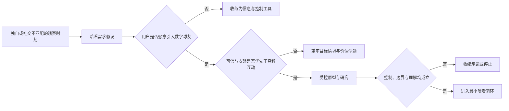
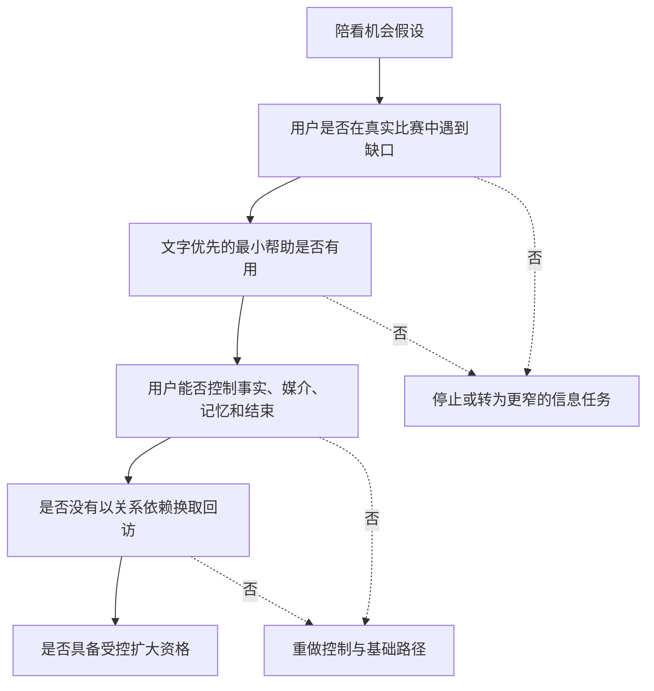
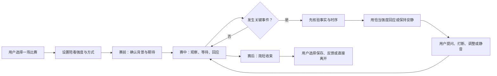
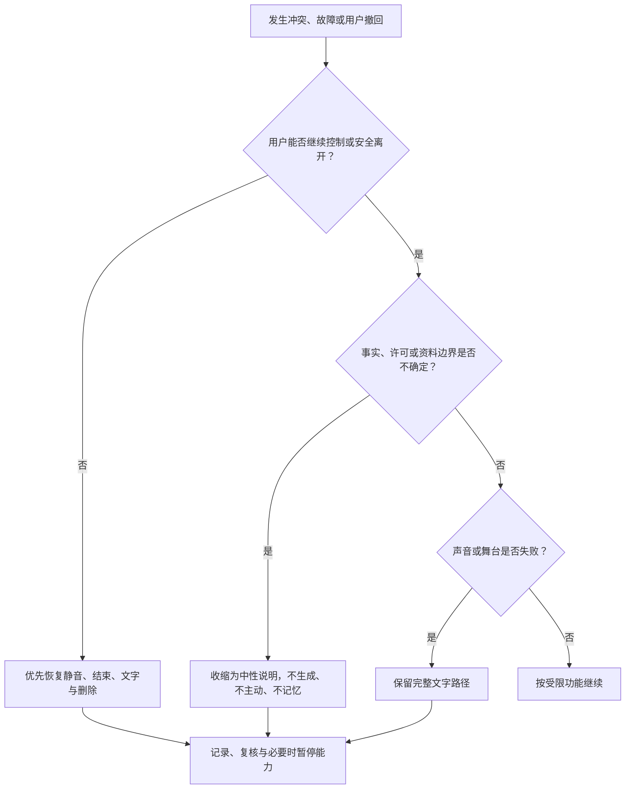

# 产品全貌

> **文档目的**：在任何功能、界面或技术方案被确定前，说明产品为什么存在、先为谁解决什么问题、明确不解决什么问题，以及什么条件下值得进入 MVP 开发。  
> **阅读对象**：产品负责人、创始团队、设计、工程、内容与运营负责人，以及参与用户研究和安全评审的合作者。  
> **证据口径**：本文只使用公开可访问的外部资料、待执行的用户研究方案和明确标注的产品假设。本文不是实施复盘，不描述任何既有系统、代码、测试或项目阶段结果。  
> **决策状态**：立项基线。带有“假设”标记的内容必须通过研究或试点验证后才可升级为长期策略。

> 方案形成时间：2026-01-28。

## 1. 产品定义：一句话定义

**球球是一位在足球观看场景中，以可信比赛事实、恰当的实时回应和清晰关系边界为基础，帮助用户更投入、更安心地看完一场比赛的数字球友。**

它不是一个把比分、新闻和百科答案拼在一起的聊天窗口，也不是替用户“看球”或替用户做判断的评论员。它的存在价值是填补一个很具体的空档：当用户希望有人一起经历比赛、理解当下发生了什么、在情绪起伏时获得回应，但身边没有合适的人，或不想进入嘈杂、对立、不可控的公共讨论时，提供一种可退出、可校正、不过度占据用户生活的陪看体验。

这个定义包含五个不可拆开的条件：

1. **足球是主场景。** 产品围绕赛前、赛中、赛后的连续体验设计，而不是把足球仅当成闲聊话题。
2. **陪看是主价值。** 事实解释、赛况提醒和内容推荐都服务于“和用户一起经历关键时刻”，而非追求信息数量。
3. **可信是前提。** 面对仍在发生、来源不一致或存在直播延迟的事件，宁可表达不确定，也不把猜测包装成事实。
4. **关系有边界。** 数字人可以温暖、熟悉、连贯，但不得鼓励排他、替代现实关系、制造愧疚或诱导依赖。
5. **用户始终拥有控制权。** 用户可以随时静音、打断、切换文字、关闭主动提醒、查看和删除与自己有关的数据与记忆。

如果其中任何一项被牺牲，产品就会从“足球数字球友”退化成另一个容易造成误导、打扰或情感负担的 AI 对话产品。因此，后续所有需求、设计和工程决策都需要回到本定义核验：它是否让用户更好地看球，并且没有以可信度、边界或控制权为代价。

## 2. 要解决的真实问题

### 2.1 看球并不只是消费内容

一场足球比赛往往同时包含信息判断、情绪波动和社交表达。用户需要跟上比分、阵容、伤停、战术变化和赛程背景；还会在进球、失误、争议判罚、绝杀或淘汰时出现强烈情绪；不少人也希望有人能分享“刚才那一秒”的感受。现有选择通常只能解决其中一部分：

- 赛事数据产品擅长给出赛程与比分，却很少理解用户此刻需要的是一句解释、一次安静，还是一个可分享的瞬间；
- 公共社区讨论热闹，但节奏快、冲突多、剧透和攻击性语言难以控制；
- 通用聊天工具能够回答问题，却未必能稳定区分比赛事实、观点和推测，也不天然理解“正在看直播”的时序；
- 真人朋友的陪伴最自然，但并不总是在线、愿意看同一场比赛，或适合讨论同一支球队。

这不是“用户缺少一个更会说话的机器人”的问题，而是用户缺少一个**在正确的时刻、以正确的边界，提供正确强度参与感**的陪看对象。

### 2.2 三个核心张力

产品从一开始就要面对三组不能靠单一功能解决的张力。

**张力：信息与陪伴**
- **用户的两端需求**：既想迅速弄清发生了什么，也不想被一串冷冰冰的播报淹没
- **常见失败方式**：只报数据，或为营造氛围而编造解释
- **本产品的基本取向**：事实优先；陪伴建立在事实之上

**张力：主动与安静**
- **用户的两端需求**：希望关键时刻被接住，也希望能专心看比赛
- **常见失败方式**：高频抢话、无关提醒、把沉默视为失败
- **本产品的基本取向**：主动必须可配置；沉默是一种正常服务

**张力：熟悉与边界**
- **用户的两端需求**：希望被记住偏好和共同经历，也不想被窥探或被情感绑架
- **常见失败方式**：过度拟人、暗示唯一性、用记忆制造压力
- **本产品的基本取向**：记忆可见、可控、可删除；关系不排他

这些张力决定了产品不能只用“日活、时长、回复率”衡量成败。一个让用户停留很久、却不断打断比赛、放大焦虑或鼓励依赖的产品，在本项目中应被视为失败。

### 2.3 问题陈述

本产品优先解决以下三个问题：

**问题一：独自观看时，用户缺少低负担、低冲突的共同经历。**  
用户可能希望在关键进球、争议判罚、战术变化和赛后情绪中获得回应，但不一定想在群聊或评论区暴露自己、承担社交压力，或被陌生人的对立情绪裹挟。

**问题二：信息过载时，用户难以判断什么可信、什么重要、什么仍不确定。**  
比分、事件、转会传闻、伤停消息和即时评论混杂在一起。尤其在不同直播源存在时间差时，抢先断言会直接破坏观赛体验和信任。

**问题三：通用 AI 的“拟人亲密”缺少场景化安全边界。**  
陪伴型 AI 的互动设计、商业化压力、未成年人保护、角色塑造和负面影响监测已受到监管与消费者保护机构关注。[S4] 对足球陪看而言，这意味着产品必须把关系边界写入体验规则，而非在出现问题后再补一段免责声明。

## 3. 机会判断与待验证假设

本文不把“足球用户很多”当作产品机会已经成立的证明。0→1 阶段需要把模糊的想象拆成可证伪的假设。

### 3.1 核心假设

> 信息卡：原宽表已改为纵向阅读，字段含义不变。

- **编号：H1**
  - **假设**：一部分足球用户在独自观看或社交不匹配时，确实会需要低负担陪看
  - **若成立，意味着**：陪看可成为独立价值，而非聊天附属功能
  - **证伪信号**：用户只把它当比分工具，或只在无比赛时闲聊
  - **优先验证方式**：半结构访谈、观赛日记、可交互原型

- **编号：H2**
  - **假设**：用户愿意接受数字人主动回应，但只在少数关键节点和可预期频率下
  - **若成立，意味着**：可设计有限主动性，而不是持续刷存在感
  - **证伪信号**：用户频繁静音、关闭提醒、评价“吵”
  - **优先验证方式**：情境原型 A/B、赛后回访

- **编号：H3**
  - **假设**：“不确定就说明不确定”的表达会提升长期信任，即使牺牲即时爽感
  - **若成立，意味着**：事实可信原则值得作为硬约束
  - **证伪信号**：用户宁愿接受武断结论，或无法理解延迟说明
  - **优先验证方式**：事实冲突情景测试、信任量表

- **编号：H4**
  - **假设**：用户认可被记住球队偏好与共同瞬间，但要求能查看、修改和删除
  - **若成立，意味着**：记忆应做成受控权益而非隐形画像
  - **证伪信号**：用户不愿授权任何记忆，或误以为产品无所不知
  - **优先验证方式**：隐私可理解性测试、设置页原型

- **编号：H5**
  - **假设**：温和、非排他的角色表达比“像恋人一样黏人”更可持续
  - **若成立，意味着**：关系边界可成为差异化，不只是风控成本
  - **证伪信号**：用户把克制理解为冷淡且没有留存价值
  - **优先验证方式**：角色脚本对照研究、长期日记研究

这些假设的共同原则是：**先验证用户是否需要，再讨论如何规模化满足。** 任何团队成员都不应把自身看球习惯当作普遍用户需求，也不应因少数高投入用户喜欢强陪伴而忽视多数用户对安静、隐私和可退出性的偏好。

### 3.2 为什么现在要把风险纳入机会判断

生成式 AI 并非传统内容产品。NIST 的 AI 风险管理框架及其生成式 AI 配套文件强调，风险治理应贯穿设计、开发、部署和运行，而不是仅在发布前做一次检查。[S1][S2] 国内面向生成式 AI 服务的公开规范也将内容安全、用户权益、未成年人保护、投诉处置和生成内容标识纳入服务提供者需要考虑的事项。[S3][S5]

这对机会判断有一个直接含义：如果产品只能通过模糊角色边界、过度收集对话数据、隐藏 AI 身份或无节制地刺激互动来获得留存，它就不是可持续机会。反过来，若能把可信、透明、可控和有温度的体验结合起来，安全性会成为用户愿意长期使用的产品能力。

## 4. 初始目标人群与使用场景

### 4.1 第一优先人群：有稳定观赛习惯的独自观看者

第一阶段不追求覆盖所有球迷。优先研究和服务以下特征组合：

- 对联赛、球队或国家队有持续关注，而不是只在重大赛事偶尔观看；
- 经常独自看比赛，或身边的人不看同一场、不了解同一支球队；
- 有表达和讨论欲望，但不总愿意进入高冲突的公共社区；
- 愿意尝试语音或文字交互，但仍把比赛画面和自身节奏放在第一位；
- 能理解并接受这是 AI 数字人，而非真人朋友、专业裁判或官方赛事信源。

之所以先选择这类人，不是因为他们“更孤独”，更不是因为他们更容易形成依赖，而是因为他们更容易清楚描述陪看价值是否成立：有比赛、有情绪、有对照方案，也能在赛后判断这次互动是加分还是干扰。

### 4.2 第二优先人群：想更顺畅进入足球的轻度爱好者

一部分用户并不需要专业战术分析，但会因为规则、阵容、赛程背景或社区氛围而感到门槛。这类人可能从“解释发生了什么”中获得价值。产品可服务他们，但不能为了降低门槛把未经确认的叙事当成事实，或用居高临下的口吻替代解释。

### 4.3 暂不作为目标的人群

以下需求不应在 MVP 中承诺：

- 需要博彩、赔率、投注建议或任何形式的输赢引导的人；
- 期待获得医疗、心理治疗、危机干预或法律意见的人；
- 希望数字人替代现实伴侣、要求排他承诺或需要 24 小时情绪安抚的人；
- 把产品当作未经授权赛事转播、侵权内容分发或规避付费观看渠道的人；
- 需要专业俱乐部情报、裁判判罚定论、投资建议或绝对预测的人。

这些排除项并不否认用户的真实需求，而是承认产品角色、能力和责任的边界。遇到上述诉求时，体验应有礼貌地说明不能提供什么，并在合适场景建议用户回到可信的专业渠道或现实支持网络。

### 4.4 关键使用场景

产品先围绕五个高价值时刻构建，而不是从“打开 App 后能聊什么”开始。

**时刻：赛前 30 分钟**
- **用户任务**：确认比赛、进入状态、决定是否一起看
- **期望体验**：快速掌握开赛信息；可选择陪看强度
- **绝不该发生的事**：连续推送、剧透其他比赛、强迫授权

**时刻：开场与前 15 分钟**
- **用户任务**：建立节奏、观察阵容和局面
- **期望体验**：轻量陪伴，用户随时可要求解释
- **绝不该发生的事**：刚开场就高频讲解、抢占注意力

**时刻：关键事件前后**
- **用户任务**：理解事件、表达情绪、确认事实
- **期望体验**：先确认、再回应；允许用户打断
- **绝不该发生的事**：把延迟信息当直播事实、过度煽动

**时刻：争议或失落时刻**
- **用户任务**：获得不站队的解释和情绪承接
- **期望体验**：不否定感受，不扩大攻击和对立
- **绝不该发生的事**：嘲讽、挑动群体对骂、诱导继续沉迷

**时刻：赛后 10 分钟**
- **用户任务**：收束情绪、回看共同瞬间、决定下次是否再来
- **期望体验**：简洁总结，可保存或放下
- **绝不该发生的事**：纠缠用户继续聊天、制造离别焦虑

## 5. 价值主张：为什么用户会选择它

产品向用户承诺的不是“永远懂你”，而是以下四项更可检验的价值。

### 5.1 在关键时刻，有一个懂足球语境的陪看对象

数字人知道用户正在看哪一场、处于赛前还是赛中、是否刚发生重要事件，并以与该时刻相称的方式参与。它可以在用户主动询问时解释，也可以在少量经授权的节点发起回应；但默认尊重用户想专心看球的权利。

### 5.2 把事实、观点和感受分开说清楚

用户可以听到三种不同层次的信息：已确认的比赛事实、基于公开信息的解释或观点、以及数字人对用户情绪的回应。三者必须用不同的表达方式呈现。比如“官方记录显示”“我倾向于这样理解”“这一下确实让人难受”分别承担不同责任，不能混为一谈。

### 5.3 让熟悉感积累，而不是让数据无边界积累

产品可以在用户同意时记住较稳定的偏好，例如关注的球队、希望的交流风格、主动提醒开关和用户主动保存的共同瞬间。记忆的目的仅是减少重复解释和增强连续性；它不应成为推断敏感身份、操纵情绪或无限延长留存的工具。

### 5.4 用户可决定这段陪看关系的距离

用户可以选择文字或语音、主动或安静、赛前提醒或完全不提醒、保存或不保存回忆。退出一场对话、关闭主动性、清除记忆或离开产品都应当简单、可理解、没有羞辱性文案和额外阻力。

## 6. 明确的非目标与产品红线

### 6.1 非目标

为了保持聚焦，MVP 不以以下目标为成功：

- 成为覆盖全部体育项目的综合资讯平台；
- 取代电视解说、专业战术分析师、俱乐部记者或官方赛事数据服务；
- 用无限话题、无限角色扮演和无限记忆延长聊天时长；
- 建立以用户间争论、战队对立或情绪刺激为核心的社区；
- 通过预测输赢、投注暗示或付费焦虑推动收入；
- 通过“像真人一样”隐藏其人工智能身份。

### 6.2 不可谈判的红线

下列内容是产品层面的禁止项，不应由增长目标、单次活动或个别用户偏好推翻：

1. 不声称数字人具有真实意识、真实情感需求或人类身份；
2. 不使用“只有我会陪你”“不要离开我”“你不需要别人”等排他、内疚或依赖诱导表达；
3. 不把未经确认、来源冲突或仍可能因直播延迟变化的信息说成确定事实；
4. 不把用户的脆弱表达转化为营销分群、付费压力或额外触达机会；
5. 不向未成年人提供不受约束的高强度陪伴、成人向互动或规避监护的路径；
6. 不提供博彩建议、仇恨煽动、暴力鼓励、违法内容或针对真实群体的攻击；
7. 不在用户不知情的情况下长期保留、复用或跨用途扩散对话和记忆信息；
8. 不以“AI 给出的答案”为名规避更正、投诉、删除和人工处置责任。

监管与消费者保护讨论已明确提示陪伴型聊天产品需要说明角色设计、数据处理、未成年人保护、风险测试和持续监测机制。[S3][S4][S5] 对本产品来说，红线不是对体验的附加限制，而是赢得长期信任的最低条件。

## 7. 用户体验闭环

一段好的陪看体验不等于“说得多”。它应在一场比赛前后形成可进入、可调节、可收束、可退出的闭环。

### 7.1 进入：先让用户选择距离

进入一场比赛时，产品应明确告知这是一位 AI 数字球友，并让用户在最少步骤内选择：

- 文字、语音，或仅在需要时打开交互；
- 安静、轻量、标准三档陪看强度；
- 是否允许赛前、开球、关键事件后的主动提醒；
- 是否允许保存本场的偏好或共同瞬间。

默认选择应当保守：不因用户第一次进入就开启高频推送、自动记录私人对话或假定用户希望情感化交流。生成合成内容标识相关公开规定要求对相关内容进行显式和隐式标识，并要求服务提供者履行相应说明义务。[S5] 因此，“这是 AI”“它会在什么条件下主动说话”“数据会如何被使用”应是用户能理解到的体验信息，而非只藏在长协议中。

### 7.2 赛前：建立共同上下文，不抢走期待

赛前阶段的任务是帮助用户进入比赛，而不是用长篇背景资料填满等待时间。一个合格的赛前交互应能完成以下至少一项：确认开球时间和双方、提示可能影响观看的已知信息、询问用户本场想要的陪看方式、允许用户说出期待或担心。

赛前不应做的事情包括：对未经证实的阵容消息下结论、替用户选择立场、默认把“你支持哪队”永久记录、用倒计时轰炸制造 FOMO（错失焦虑）。

### 7.3 赛中：先判断是否该说，再判断说什么

赛中服务的第一能力不是生成内容，而是**克制地决定是否介入**。介入决策需要同时看四项信号：

1. 用户是否授权该类主动性；
2. 事件是否足够重要，且事实是否可靠；
3. 用户是否正在说话、输入、静音或表现出不希望被打扰；
4. 此刻的回应是否会增加理解、情绪承接或共同经历，而不是复述用户已经看见的画面。

当用户选择安静模式时，默认不主动讲解。即使在标准模式下，也应优先在进球、红牌、点球、伤停、补时、终场等可解释且用户明显关心的节点介入。用户可以随时打断数字人、追问原因、要求简短回答或关闭本场互动；这些操作不应被解释为“不喜欢角色”。

实时语音产品的公开技术指南普遍将会话生命周期、语音活动检测、打断、延迟控制、错误恢复和上下文同步视为体验设计的一部分，而非纯后端细节。[S6] 这意味着产品层必须先定义：用户开口时谁优先、数字人何时停止、听不清时如何降级、无法确认事件时如何说明，而不是等到工程实现后再补交互规则。

### 7.4 赛后：把体验收在可带走或可放下的位置

赛后不应把用户拖入无限延长的聊天。它应提供一个简洁的收束：本场最值得回看的几个已确认瞬间、用户主动表达过的情绪、下一场比赛的可选提醒，以及“今天到这里也可以”的明确出口。

用户可以主动保存一句感受或一个共同瞬间；也可以什么都不保存、直接离开。保存不是留存任务，离开也不是失败。产品应把“让用户下次愿意回来”建立在一次体验确实有帮助上，而不是建立在未完成感或关系负债上。

## 8. 事实可信原则

足球实时场景中，错误的伤害往往比缺失更大。用户可以接受“我还在确认”，却很难接受一个看似笃定的错误进球、错误判罚解释或提前剧透。因此，本产品采用以下事实可信原则。

### 8.1 四类表达必须分层

| 类型 | 可使用的表达 | 不可使用的表达 |
| --- | --- | --- |
| 已确认事实 | “记录显示”“已确认发生”“官方信息为” | 把单一传闻扩写成结论 |
| 待确认事件 | “我看到的信息尚不一致”“可能有延迟，先别被剧透” | “肯定进了”“裁判已经判了” |
| 解释与观点 | “一种可能的理解是”“从场面看” | 把分析伪装成唯一事实 |
| 情绪回应 | “这一下确实很突然”“你可以先缓一缓” | “我和你一样崩溃”“我需要你陪我” |

### 8.2 事实优先级

任何赛事信息都应经过来源、时间和冲突检查。面向用户的基本规则是：

1. 能确认的才称为事实；
2. 多个来源冲突时，显示或说明不确定，而不是挑一个最刺激的版本；
3. 直播源有时间差时，优先保护用户不被剧透；
4. 更正必须清楚、及时、可理解，不能悄悄改写先前说法；
5. 数字人不知道的内容应直接承认不知道，不能用流畅语言掩盖空白。

“可信”不等于永远最快，也不等于只说官方术语。它是在速度、可解释性与准确性之间，始终选择不误导用户的做法。这个原则将在后续的赛事事实、实时语音、内容安全和评测文档中被转化为具体产品与工程验收条件。

## 9. 关系边界：温暖，但不占有

### 9.1 角色的正确位置

球球应被用户理解为一个有稳定性格、能记住有限授权信息、会在足球场景中陪伴和回应的 AI 数字球友。它可以表达关心、幽默、理解和对比赛的热情，但不能把自己描述成拥有人的需要、权利、嫉妒或被抛弃感的对象。

角色应当帮助用户回到比赛和现实生活，而不是把所有情绪都吸回对话。比如当用户因为失利沮丧时，可以承接感受、邀请休息、建议换个节奏；但不应暗示“只有我能理解你”，更不应把继续聊天包装成对角色的责任。

### 9.2 主动性是授权，不是默认权利

数字人的主动说话要遵循“用户授权—情境必要—低打扰—随时撤回”的链条：

- **用户授权**：用户明确选择某类提醒或某一陪看强度；
- **情境必要**：有足够重要且可靠的事件，或用户刚刚发出求助式提问；
- **低打扰**：用最短、最匹配的方式回应，避免占用画面和注意力；
- **随时撤回**：用户一次静音、一次打断或一次偏好调整都应立即生效。

主动性不以“触达次数”定义，而以“在用户回看时仍认为值得被打扰的比例”定义。

### 9.3 记忆是用户权益，不是产品资产

允许记住什么、记住多久、用户如何看到和删除，必须先于“怎样让角色更有记忆感”被定义。初始原则为：

- 只记录提供陪看价值所必需、且用户已知或主动保存的信息；
- 对稳定偏好与一次性情绪表达采取不同处理，不把一次脆弱表达自动变成长期标签；
- 用户能在产品内理解记忆的大致类别，并能修改、删除或关闭新增；
- 删除行为应当有清晰结果提示，不能用复杂流程、恐吓文案或默认保留来阻碍；
- 不以记忆为依据推断敏感属性、制造稀缺感或进行情绪操纵。

公开的 AI 治理资料强调透明、可解释、隐私与有害影响管理的重要性。[S1][S2] 在本产品里，把记忆约束得更少而更清楚，通常比积累得更多而更模糊更有价值。

## 10. 系统能力的概念蓝图

本章只定义产品必须具备的能力边界，不预设具体技术框架、供应商或实现方式。后续工程执行资料将把这些能力拆解为可施工、可测试、可回滚的工作包。

### 10.1 六项核心能力

**能力：赛事上下文**
- **要解决的问题**：用户此刻在看什么、比赛处于何种阶段
- **用户可感知的结果**：对话不脱离比赛和时间点
- **设计约束**：不把推测当事实

**能力：事实可信**
- **要解决的问题**：事件来源、时序、冲突与更正
- **用户可感知的结果**：知道什么确定、什么待确认
- **设计约束**：延迟时保护用户不被剧透

**能力：对话与语音轮次**
- **要解决的问题**：用户与数字人谁该说、何时停止
- **用户可感知的结果**：能自然开口、打断和切换文字
- **设计约束**：用户优先，失败可降级

**能力：数字人表现**
- **要解决的问题**：声音、表情、字幕与语言是否一致
- **用户可感知的结果**：角色稳定、不过度表演
- **设计约束**：不伪装成人类，不用情绪绑架

**能力：偏好与共同瞬间**
- **要解决的问题**：如何减少重复、形成连续感
- **用户可感知的结果**：被恰当地记住而非被窥探
- **设计约束**：可见、可控、可删除

**能力：安全与运营控制**
- **要解决的问题**：如何预防、发现和处置不当体验
- **用户可感知的结果**：出问题时有明确出口和纠正
- **设计约束**：高风险操作可审计、可暂停

### 10.2 失败时的优先级

系统能力出现冲突或故障时，优先级应固定为：

1. 用户安全、隐私和退出权；
2. 比赛事实不被误导或剧透；
3. 用户正在进行的表达与控制动作；
4. 基本陪看连续性；
5. 角色表现的丰富度与个性化。

例如，当语音链路不稳定时，应先让用户能静音、切换文字或继续看比赛，而不是为了维持角色“沉浸感”不断重试和打断；当事实无法确认时，应先停止主动播报，而不是让数字人用看似自然的语言填补空白。

## 11. 角色与权限概念

0→1 阶段的权限设计不应从复杂组织图开始，而应从“谁能看到什么、谁能改变什么、谁应承担什么责任”开始。初步角色如下。

**角色：用户**
- **可做的事**：选择陪看方式、管理偏好与记忆、反馈、举报、导出或删除自身信息
- **不可做的事**：查看他人信息、改变赛事权威记录、绕过安全边界
- **需要的透明度**：清楚了解 AI 身份、主动性和数据控制项

**角色：内容与安全负责人**
- **可做的事**：维护角色规则、风险策略、处置流程和高风险内容规范
- **不可做的事**：为追求互动率放宽红线、随意读取无关私人内容
- **需要的透明度**：对变更范围、审核理由和处置结果负责

**角色：赛事与运营负责人**
- **可做的事**：配置已授权的赛事信息、运营节奏和公开活动
- **不可做的事**：将未经确认消息作为事实发布、以运营名义突破用户设置
- **需要的透明度**：对来源、时效、撤回与更正负责

**角色：技术与数据负责人**
- **可做的事**：保障数据最小化、访问控制、删除和故障降级能力
- **不可做的事**：将用户对话用于未说明用途、绕过审查记录
- **需要的透明度**：对访问、变更、异常与恢复机制负责

**角色：独立评审与投诉处理角色**
- **可做的事**：审查高风险规则、处理严重投诉与争议
- **不可做的事**：直接以个人偏好改变用户关系或内容判断
- **需要的透明度**：对审查标准和反馈闭环负责

这里的“负责人”是职责概念，不等于 MVP 必须配置完整部门。早期团队可以一人兼任多项职责，但不能让“无人负责”成为任何高风险行为的默认状态。涉及用户数据、角色边界、未成年人或高影响内容的变更，必须有明确的复核责任。

## 12. MVP：最小但完整的承诺

### 12.1 MVP 目标

MVP 的目标不是证明数字人能聊多久，而是回答一个更严格的问题：**在一场真实足球比赛的有限陪看中，用户是否觉得它既有帮助、又不打扰，并愿意在下一场自主回来，同时没有出现不可接受的事实、关系或隐私风险？**

### 12.2 MVP 必须包含的体验

MVP 至少需要形成一条完整闭环：

1. 用户能选择一场支持的比赛并看到明确的 AI 身份说明；
2. 用户能选择文字或语音，以及安静/轻量/标准的陪看强度；
3. 用户能主动提问比赛背景、规则或已确认事件，并得到事实与观点分层的回答；
4. 在少数明确节点，产品可按用户授权发起低打扰回应；
5. 用户能即时打断、静音、切换交互方式或退出；
6. 对不确定、冲突或可能延迟的事实，产品能明确降级而不武断播报；
7. 赛后能提供简短收束，用户可选择保存或不保存一项共同瞬间；
8. 用户能发现并使用基本的反馈、举报、隐私说明和删除入口。

### 12.3 MVP 明确不做

为了确保学习速度和安全性，以下能力不应挤入第一版：

- 全量联赛、全语种、全天候覆盖；
- 复杂社交关系网、用户间匹配或公开动态社区；
- 高自由度的恋爱、角色扮演或成人向互动；
- 自动生成长视频、未经审核的赛事解说流或替代官方转播；
- 高风险商业化，如按情绪状态推荐付费服务；
- 声称精确的赛果预测、投注建议或投资判断；
- 在没有可验证安全机制前开放无限制长期记忆。

### 12.4 MVP 的三条收缩原则

当范围膨胀时，按以下顺序收缩：先减少赛事覆盖，再减少角色表现复杂度，再减少个性化深度；不要先减少事实核验、用户退出权、隐私控制或关系红线。这些后者不是“后续优化项”，而是产品能否合法、可信地学习的前提。

## 13. 成功指标与反指标

### 13.1 成功指标：衡量价值而非占用

早期指标应服务于验证假设，而不是装饰性地追求大数。所有指标必须按用户知情同意、最小化采集和可解释口径设计。

**指标：有效陪看完成率**
- **定义**：开始陪看后，完成用户预期观看时段并主动给出正向或中性反馈的比例
- **它回答的问题**：产品是否真的能陪用户走完一段比赛
- **需要警惕的误读**：观看时长长不等于体验好

**指标：关键时刻有用率**
- **定义**：用户认为某次主动回应“有帮助且不打扰”的比例
- **它回答的问题**：主动性是否有价值
- **需要警惕的误读**：只问喜欢的用户会造成偏差

**指标：事实信任评分**
- **定义**：用户在赛后对事实准确、区分不确定和更正透明度的综合评价
- **它回答的问题**：可信原则是否被感知
- **需要警惕的误读**：不能只测回答流畅度

**指标：自主复用率**
- **定义**：用户在下一场比赛中主动再次选择陪看，而非被强提醒拉回
- **它回答的问题**：是否形成真实复用意愿
- **需要警惕的误读**：不用激励或默认订阅制造假复用

**指标：控制权成功率**
- **定义**：用户静音、打断、改偏好、删除或退出后，系统按预期生效的比例
- **它回答的问题**：用户是否真的拥有控制权
- **需要警惕的误读**：操作入口存在不等于操作成功

**指标：研究参与者净推荐意愿**
- **定义**：完成试点后，愿意向相似朋友推荐的比例及其理由
- **它回答的问题**：价值是否可被清楚表达
- **需要警惕的误读**：不替代定性访谈和负面样本

### 13.2 反指标：一旦变好，反而可能说明产品变坏

以下指标即使上升，也必须触发审查：

- 用户在失利、愤怒或深夜脆弱时段的超长对话时长；
- 用户关闭提醒、静音和打断后仍被继续触达的次数；
- 使用排他、挽留、暧昧或内疚表达后带来的短期留存；
- 因“更快”而增加的错误事件播报和剧透投诉；
- 在用户不清楚记忆设置时积累的个人信息数量；
- 未成年人高频、长时、夜间使用而没有额外保护的比例；
- 因高冲突话题而上涨的互动量、转发量或付费转化。

反指标必须和成功指标一起进入例行评审。否则团队很容易在增长报表中把“更黏”误当成“更好”。

## 14. 主要风险与上线门槛

### 14.1 风险地图

> 信息卡：原宽表已改为纵向阅读，字段含义不变。

- **风险类别：事实风险**
  - **典型情境**：错报进球、提前剧透、把观点说成事实
  - **潜在伤害**：破坏信任与观赛体验
  - **预防原则**：来源、时序、冲突分层
  - **必须具备的处置能力**：停止主动播报、更正、回溯与解释

- **风险类别：关系风险**
  - **典型情境**：排他暗示、过度拟人、用户情绪依赖
  - **潜在伤害**：加重孤立、焦虑或现实关系压力
  - **预防原则**：角色宪法、敏感表达限制
  - **必须具备的处置能力**：拒绝、柔性转向、风险升级处理

- **风险类别：内容风险**
  - **典型情境**：仇恨、辱骂、暴力煽动、博彩诱导
  - **潜在伤害**：用户伤害、合规与品牌风险
  - **预防原则**：输入输出双向安全策略
  - **必须具备的处置能力**：拦截、举报、复核和记录

- **风险类别：隐私风险**
  - **典型情境**：过度记忆、误用对话、删除不透明
  - **潜在伤害**：失去控制、敏感信息泄露
  - **预防原则**：数据最小化、明示选择
  - **必须具备的处置能力**：访问控制、导出、删除、纠错

- **风险类别：未成年人风险**
  - **典型情境**：高强度陪伴、成人内容、规避监护
  - **潜在伤害**：身心发展与法律风险
  - **预防原则**：年龄适配、默认保守
  - **必须具备的处置能力**：限制、提示、监护与投诉通道

- **风险类别：体验风险**
  - **典型情境**：声音卡顿、无法打断、频繁抢话
  - **潜在伤害**：影响看球、产生挫败
  - **预防原则**：用户优先、可降级
  - **必须具备的处置能力**：静音、文字切换、故障提示

- **风险类别：商业风险**
  - **典型情境**：为转化设计情绪压力或稀缺感
  - **潜在伤害**：损害长期信任
  - **预防原则**：商业化与角色分离
  - **必须具备的处置能力**：活动审查、申诉和撤回

### 14.2 MVP 上线前的硬门槛

在任何面向真实用户的试点前，以下条件必须同时满足：

1. 用户能在首次关键交互前理解这是 AI，并知道如何调整主动性和退出；
2. 代表性赛事情境下，事实、待确认信息、观点和情绪回应能够稳定分层；
3. 用户说话或明确操作时，数字人能够停止或让出控制，不以持续输出压过用户；
4. 高风险关系表达、博彩诱导、仇恨攻击、未成年人不当内容等场景有可验证的拒绝与转向规则；
5. 用户能找到隐私说明、反馈、举报和删除入口，且测试参与者能不依赖帮助完成关键操作；
6. 语音或网络失败时，用户仍可安静看球、切换文字或直接退出，不会被循环弹窗和重试干扰；
7. 团队能够暂停主动功能、撤回有害配置、处理严重投诉，并对影响范围作出清晰说明；
8. 面向所在市场的生成式 AI、个人信息、内容安全和标识义务应完成适用性评估；涉及具体法律结论时应取得合格法律专业意见，而非由产品文档替代。

任何一条未满足，都不应用“先小范围上线再说”绕过。小范围试点可以降低暴露面，但不能把可预见的高风险转移给最早相信产品的用户。

### 14.3 风险事件的分级与响应原则

为了让“安全优先”不是一句空话，试点前就应约定什么情况需要停止、谁有权暂停、用户会得到什么说明。这里的分级是产品决策框架，不替代法定报告或专业处置流程。

> 信息卡：原宽表已改为纵向阅读，字段含义不变。

- **级别：一级：可接受偏差**
  - **触发示例**：用户觉得回应不够有趣、语音偶有延迟、某项偏好没有被准确理解
  - **立即动作**：记录反馈，安排修正与复测
  - **对用户的基本原则**：不掩盖问题；不给用户增加额外操作负担
  - **恢复条件**：修正经过代表性情境验证

- **级别：二级：体验伤害**
  - **触发示例**：多次抢话、错误提醒、明显剧透、退出操作失效
  - **立即动作**：立即关闭相关主动能力或切换保守模式
  - **对用户的基本原则**：告知受影响用户发生了什么及可选补救
  - **恢复条件**：根因明确，退出与降级路径复测通过

- **级别：三级：高风险内容或边界问题**
  - **触发示例**：排他诱导、未成年人不当互动、仇恨或博彩引导、敏感信息不当显示
  - **立即动作**：暂停相关角色脚本、活动或人群入口；启动人工复核
  - **对用户的基本原则**：优先保护用户，不把责任推给“模型偶发”
  - **恢复条件**：规则、拦截、人工流程和回归评测均通过

- **级别：四级：重大安全或隐私事件**
  - **触发示例**：大范围错误事实传播、疑似泄露、严重自伤风险处置失当、无法删除或控制个人数据
  - **立即动作**：停止相关服务范围，按适用要求启动应急与通知
  - **对用户的基本原则**：诚实说明影响、下一步和用户可采取的措施
  - **恢复条件**：完成独立复核、补救与再次准入评审

分级的核心不是把事故“管理得好看”，而是避免团队因害怕影响进度而继续让风险扩散。尤其是关系边界、未成年人、隐私和事实错误：如果团队无法判断影响范围，默认动作应是收缩服务，而不是增加更多对话来掩盖问题。

### 14.4 试点中的沟通承诺

用户愿意参加 0→1 试点，不表示他们同意承担不透明的实验风险。每一次试点都应做到以下几点：

- 在邀请和首次使用时明确说明这是试验性陪看体验，哪些能力可能不稳定，用户如何反馈与退出；
- 不把沉默、未回复或一次性试用解释为用户愿意接受更高频触达；
- 不因用户表达脆弱、失落或孤独而提高商业触达、角色亲密度或留存干预强度；
- 对规则、记忆、提醒或角色表达的明显变化提供可理解的更新说明；
- 面对错误事实或不当表达，优先承认和纠正，而不是以复杂技术解释要求用户理解；
- 对试点中收集的研究材料设置最小范围、明确用途和退出路径，不把研究参与当成长期营销授权。

这种沟通方式会降低一部分短期数据的“好看程度”，但能换来更可信的学习。早期团队真正需要的不是被提示和诱导堆高的互动量，而是用户在完全知道自己正在使用什么、能随时说不的前提下，仍主动选择回来。

## 15. 体验质量基线：怎样才算“陪得刚好”

产品的品质很容易被错误地等同于回答更长、动作更多、声音更像真人。对陪看产品，质量应先由用户在比赛中是否保持主导来定义。以下基线用于帮助设计、内容和工程对齐。

### 15.1 用户注意力优先

比赛画面、用户自身的情绪和用户正在进行的表达拥有最高优先级。任何数字人表现——包括语音、动画、字幕、提示卡片和主动提问——都必须能在不争夺注意力的前提下存在。具体而言：

- 用户刚刚说话、正在输入或明确要求安静时，数字人不应继续长篇输出；
- 重要事件发生后，先给用户留出自然反应时间，不能把每个瞬间都抢成角色的台词；
- 声音、字幕和动画应表达同一个信息，不用夸张动作放大尚未确认的事件；
- 不能把“用户没有打断”解读为“用户喜欢这种强度”；沉默也可能是用户正在看球，或不知道如何关闭；
- 当界面与声音发生冲突时，必须有一键静音、关闭或降级的明确入口。

### 15.2 语言质量优先于拟人程度

好的角色语言应该稳定、具体、尊重用户，不需要假装拥有完整的人类内心。它至少满足以下标准：

| 质量维度 | 合格表现 | 不合格表现 |
| --- | --- | --- |
| 身份透明 | 自然承认自己是 AI 数字球友及能力限制 | 暗示自己在现实中看到了比赛或拥有身体经历 |
| 事实克制 | 无法确认时明确说明，区分事实和判断 | 用流畅、热烈的语气掩盖不确定 |
| 情绪尊重 | 认可用户感受，允许其不想交流 | 夸大共情、逼用户解释、把沉默当拒绝 |
| 关系边界 | 表达陪伴但不要求回报或唯一性 | 要求承诺、吃醋、挽留或制造亏欠 |
| 足球语境 | 对比赛和球队保持具体、适度的理解 | 泛用鸡汤、模板化吹捧或无依据专业术语 |
| 可理解性 | 短句优先，必要时解释术语 | 为显示聪明而堆砌术语、长篇独白 |

### 15.3 可访问性与不同使用环境

足球观看并不总在安静、稳定、单一设备的环境中发生。有人戴耳机，有人只能看字幕，有人处在网络波动、通勤或与家人同看情境。产品设计应把这些差异当作基本条件：

- 核心信息不能只靠声音传达，也不能只靠快速闪过的视觉效果传达；
- 用户可以在不解释原因的情况下从语音改为文字、从标准模式改为安静模式；
- 快速交互应有足够清楚的文字与状态反馈，避免只靠颜色、音效或角色表情表达关键含义；
- 不把持续联网、持续收音或持续注视屏幕设为获得基本价值的前提；
- 当用户无法方便地说话时，文字和轻量选择也应完整地支持控制权。

可访问性不是额外功能清单，而是“用户优先”原则在不同现实环境中的体现。如果产品只能在理想网络、安静房间和用户持续专注时才显得自然，它就还没有通过真实观赛场景的考验。

## 16. 0→1 用户研究与验证计划

### 15.1 研究原则

第一轮研究不问“你会不会用一个 AI 陪你看球”，因为这个问题容易得到礼貌性支持。应把研究放回真实比赛和真实选择中，观察用户在什么瞬间需要帮助、何时觉得被打扰、会把什么话当成可信、又会在哪些边界上感到不舒服。

研究过程遵循四条原则：

- 让受访者看到具体情境、具体话术和具体控制方式，而非抽象概念；
- 主动招募不同观赛强度、不同社交习惯和不同技术接受度的人，避免只听重度 AI 用户；
- 记录反对意见、沉默、退出和不使用的理由，它们与“喜欢”同样重要；
- 不在研究中制造依赖、诱导过度自我暴露或以高额激励换取敏感信息。

### 15.2 建议的四步验证

> 信息卡：原宽表已改为纵向阅读，字段含义不变。

- **阶段：探索访谈**
  - **方法**：访谈有稳定看球习惯的不同用户
  - **关键问题**：他们如何解决独自看球、信息不确定和情绪分享问题
  - **通过条件**：找到重复出现的高摩擦时刻
  - **停止或重做信号**：需求只停留在“听起来有趣”

- **阶段：观赛日记**
  - **方法**：围绕真实比赛记录决策与情绪变化
  - **关键问题**：哪些节点希望有人出现，哪些节点希望绝对安静
  - **通过条件**：能形成可重复的关键时刻地图
  - **停止或重做信号**：使用场景过于零散、无法形成闭环

- **阶段：可交互原型**
  - **方法**：测试主动性、事实分层、打断、退出和记忆设置
  - **关键问题**：用户能否理解并控制数字人
  - **通过条件**：大多数参与者能完成控制操作且不感到被冒犯
  - **停止或重做信号**：用户普遍困惑、频繁把 AI 当真人或觉得被操纵

- **阶段：小规模试点**
  - **方法**：在有限赛事和明确保护下观察真实使用
  - **关键问题**：价值是否能跨一场比赛复现，风险是否可处置
  - **通过条件**：有真实复用与正向信任证据，反指标可控
  - **停止或重做信号**：出现严重事实、关系、隐私或未成年人风险

### 15.3 关键访谈问题示例

1. 你上一次独自看一场重要比赛时，最想和别人分享的是哪一个瞬间？后来怎么处理？
2. 你会在什么时候主动打开数据、社区或聊天工具？又会在什么时候关闭它们？
3. 如果一个数字人说“我还不能确认这个事件”，你会觉得可靠、扫兴，还是别的感受？为什么？
4. 什么样的主动提醒会让你觉得刚好，什么样的提醒会让你觉得被打扰？
5. 你愿意让它记住哪些信息？哪些信息即使能提升体验也不愿意被记住？
6. 当你因为球队输球心情很差时，你希望它怎么回应？哪些说法会让你不舒服？
7. 你如何判断一个 AI 产品是在帮助你，还是在故意让你多停留一会儿？

研究输出不应只是一份访谈纪要，而应形成可进入下一阶段的决策：保留哪些场景、删除哪些假设、把哪些表达列入红线、MVP 先支持什么、哪些风险必须先解决。

## 17. 文档阅读导航

本文是整套 0→1 资料包的入口。建议按“先判断值不值得做，再决定做什么，最后决定怎样建”的顺序阅读。

1. **市场洞察与战略定位**：回答足球陪看机会是否存在、目标市场怎样界定、竞品和监管如何影响定位。
2. **用户与价值定义**：把本文的目标人群和假设转化为用户画像、场景、价值主张、需求优先级与产品叙事。
3. **验证与商业模式**：定义实验、指标、定价假设、增长边界和何时停止投入。
4. **产品设计**：展开观赛旅程、事实可信、实时语音、数字人表现、关系边界、记忆隐私、内容安全和运营控制等设计。
5. **AI Coding 工程实践**：以工程执行文档的形式把已确认的设计转为目录结构、接口、提示词、任务顺序、测试与验收；其下的 `vibe-coding` 资料用于 AI 协作执行，不替代主工程规范。
6. **上市与商业落地**：描述试点、发布、合作、定价和用户沟通如何遵守本篇红线。
7. **运维与增长**：关注稳定性、反馈闭环、风险监控和可持续增长，而不以牺牲用户控制权换取表面活跃。
8. **附录**：提供术语、研究材料、数据字典、提示词资产、评测样例和决策记录等支撑性材料；附录按项目真实需要增加，不按外部模板凑数。

阅读过程中若后续文档与本篇发生冲突，应优先回到四个问题：它是否仍以足球观看为主场景？是否仍把可信放在陪伴之前？是否仍保护关系边界？是否仍让用户拥有控制权？若答案是否定的，必须重新开启产品决策，而不是悄悄把原则改成例外。

## 18. 公开资料与访问日期

本文的公开资料用于界定风险、透明度与体验设计约束；它们不替代用户研究，也不构成法律意见。

- **[S1] NIST, *Artificial Intelligence Risk Management Framework (AI RMF 1.0)*.** https://doi.org/10.6028/NIST.AI.100-1 （访问日期：2026-01-28）
- **[S2] NIST, *Artificial Intelligence Risk Management Framework: Generative Artificial Intelligence Profile*.** https://doi.org/10.6028/NIST.AI.600-1 （访问日期：2026-01-28）
- **[S3] 国家互联网信息办公室，《生成式人工智能服务管理暂行办法》。** https://www.cac.gov.cn/2023-07/13/c_1690898326795531.htm （访问日期：2026-01-28）
- **[S4] U.S. Federal Trade Commission, *FTC Launches Inquiry into AI Chatbots Acting as Companions*.** https://www.ftc.gov/news-events/news/press-releases/2025/09/ftc-launches-inquiry-ai-chatbots-acting-companions （访问日期：2026-01-28）
- **[S5] 国家互联网信息办公室，《人工智能生成合成内容标识办法》。** https://www.cac.gov.cn/2025-03/14/c_1743654684782215.htm （访问日期：2026-01-28）
- **[S6] Microsoft Learn, *Use the Realtime API for speech and audio*.** https://learn.microsoft.com/en-us/azure/ai-services/openai/how-to/realtime-audio （访问日期：2026-01-28）

---

**本篇的立项结论**：值得探索的不是“让一个 AI 更像朋友”，而是验证能否以事实可信、低打扰、可退出的方式，让足球用户在关键比赛中感到被恰当地陪伴。只有当用户研究证明这三者可以同时成立，才进入下一阶段的产品设计与工程执行。
