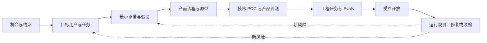
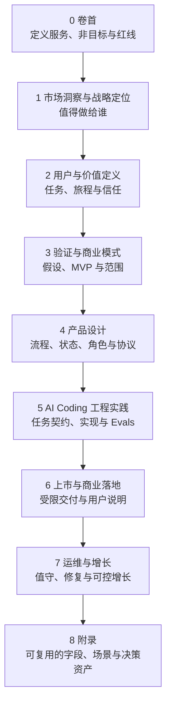
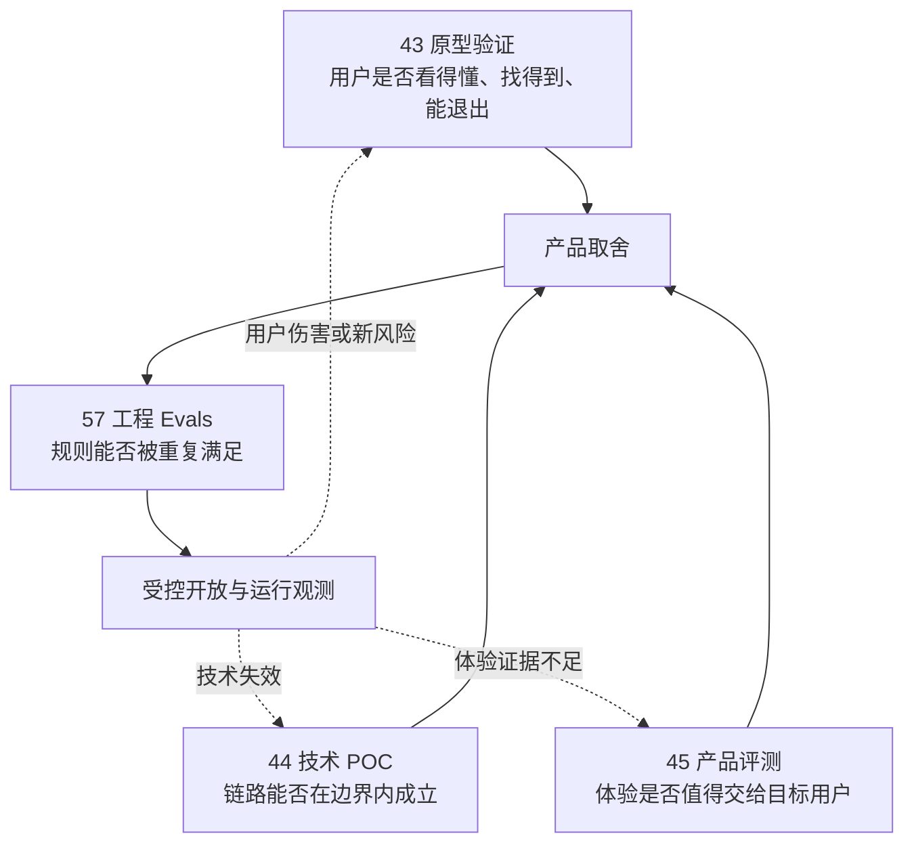
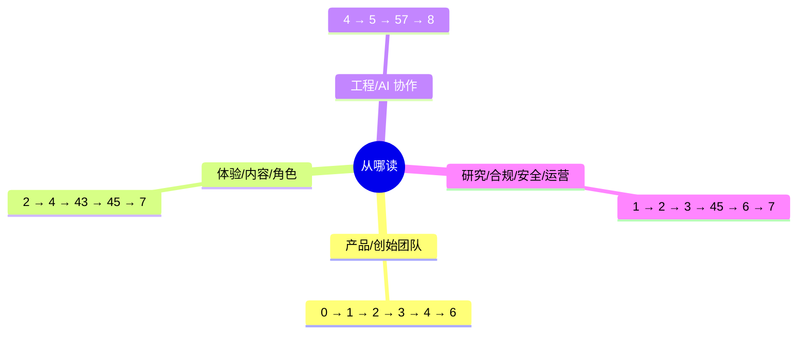
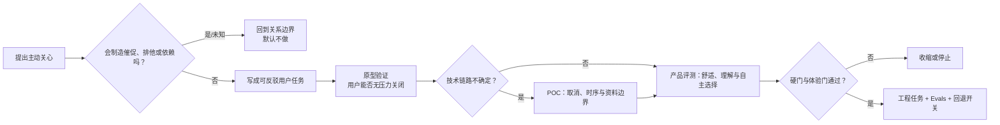
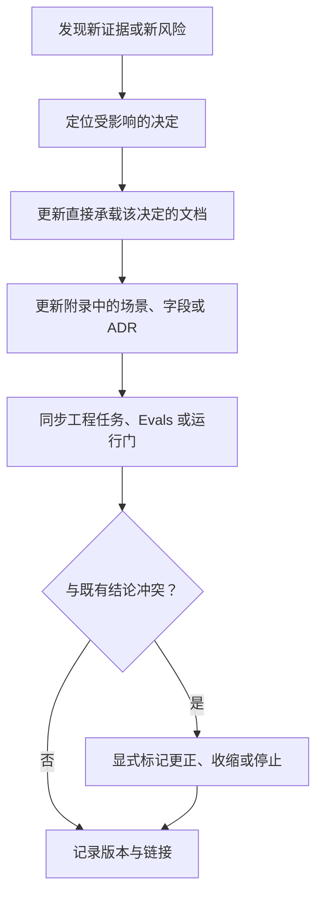

# 球球产品资料包

> 这是足球陪看数字人「球球」的产品资料全集（版本 2.0）：从市场洞察、用户价值、产品设计到上市与运维的完整叙事。各篇以现行产品为准维护，架构决策另见仓库 docs/adr/。

## 概念速查：你想了解的主题在哪一篇

同一主题常在多篇文章中出现。想快速定位，先查下表找到承载该主题的篇目，再按篇内目录跳到对应小节。

| 概念 | 在哪一篇读 |
| --- | --- |
| 产品红线与非目标 | [产品全貌](0.卷首/00-产品全貌.md) |
| 商业化红线 | [我们如何思考收费：商业模式假设、权益边界与定价研究计划](3.验证与商业模式/18-商业模式与定价假设.md) |
| 关系边界与信任成长 | [关系边界与信任契约](2.用户与价值定义/11-关系边界与信任契约.md)、[关系阶段与信任成长设计](4.产品设计/29-关系阶段与信任成长设计.md) |
| 什么时候该开口（"该不该说"） | [主动发言、主动沉默与话痨控制设计](4.产品设计/31-主动发言、主动沉默与话痨控制设计.md) |
| 说话强度三档（安静／刚好／热闹） | [偏好、设置与无障碍设计](4.产品设计/35-偏好、设置与无障碍设计.md) |
| 沉默的语义 | [主动发言、主动沉默与话痨控制设计](4.产品设计/31-主动发言、主动沉默与话痨控制设计.md) |
| 共同记忆与偏好召回 | [共同记忆与偏好召回设计](4.产品设计/30-共同记忆与偏好召回设计.md) |
| 记忆的查询与删除 | [隐私、记忆删除与数据生命周期设计](4.产品设计/38-隐私、记忆删除与数据生命周期设计.md) |
| 比赛事实与四类表达 | [比赛事实与公开比分设计](4.产品设计/23-比赛事实与公开比分设计.md)、[产品全貌](0.卷首/00-产品全貌.md) |
| 干预分级与人工接管 | [内容安全、依赖风险与人工干预设计](4.产品设计/36-内容安全、依赖风险与人工干预设计.md)、[导播台与运营配置设计](4.产品设计/39-实战导演台与运营配置设计.md) |
| 指标体系 | [北极星指标与指标体系](3.验证与商业模式/16-北极星指标与指标体系.md) |
| 需求假设与验证计划 | [我们如何验证球球的需求：假设登记册与验证计划](3.验证与商业模式/13-需求假设与验证计划.md) |
| MVP 范围与验证闸门 | [MVP 范围与验证闸门](3.验证与商业模式/14-MVP范围与验证闸门.md) |
| 语音降级体验 | [语音打断、重连与降级体验设计](4.产品设计/26-语音打断、重连与降级体验设计.md) |
| 赛后收束与召回 | [赛后跟进、通知与跨比赛回收设计](4.产品设计/40-赛后跟进、通知与跨比赛回收设计.md) |
| 入口最小披露 | [上市准备与合规材料](6.上市与商业落地/59-上市准备与合规材料.md) |
| 领域术语 | [领域术语：指向统一语言与领域补充](8.附录/附录A-领域术语与统一语言.md) |

## 1. 这套资料包解决什么问题

它不是把项目拆成一堆"要写的文档"，而是把一个能力从问题、证据、取舍一路带到可回退的施工与受控开放。每个阶段都必须回答一个问题、留下一个可审阅的决定，并说明什么情况下要停。

贯穿全程只守五条原则：

- **先证伪再投入**：先问为什么不该做、什么会伤害用户，而不是先扩展功能清单。
- **事实与表达分开**：比赛事实、用户观察、角色表达和运营指令不能互相越权。
- **用户控制优先**：安静档等客户端控制、严格保护、干预级别、暂停与删除压过生成、播放、缓存和重试。
- **多媒介等价**：语音、舞台和动效可以成为主要体验出口；事实、控制、错误和退出必须始终清楚可达，关键任务至少保留文字或结构化等价路径。
- **范围小于结论**：每个结论都写明人群、场景、媒介和证据等级；未知就保留未知。

## 2. 九阶段怎么读

- **卷首**：固化一句话定义、非目标、最低边界和待验证命题。
- **市场与战略**：判断观看行为、竞争、监管、市场规模和定位是否足以进入研究；不把"大市场"当立项理由。
- **用户与价值**：把人群、观看进度、用户任务、关系边界与退出路径写成可研究的问题。
- **验证与商业**：排出假设优先级，明确 MVP 不做什么，以及价格、获客和风险要怎样被证伪。
- **产品设计**：把一场陪看的进入、状态、控制、表达、结束和资料权利组织成完整体验。
- **工程实践**：工程实践卷（本项目的工程方法与建设过程记录，即期重写）。
- **上市与运维**：定义何时可以受控开放、怎样说明限制、谁值守以及出现风险如何停止。
- **附录**：沉淀场景卡、状态机、字段、协议、提示词与架构决策记录，供后续复用而非替代决策。

### 产品设计的分层阅读路径

进入"4.产品设计"时，先阅读 [技术约束与选型原则](4.产品设计/20A-技术约束与选型原则.md)，再阅读 [产品设计总览](4.产品设计/20-产品设计总览.md)，随后按任务域阅读 21–46。推荐顺序为：`20A → 20 → 21–24 → 25–27 → 28–32 → 33–35 → 36–40 → 33A → 41–42 → 43–44 → 45–46`。`20A` 负责前置技术边界，`20` 负责产品命题与统一控制模型，后续文档负责各能力域的详细设计。其中《原型验证设计》为历史存档（Stitch 原型阶段已被真实端走查取代）；《关键技术 POC 与方案选型》可与工程实践卷的 POC 篇目互为参照。

## 3. 四类验证不能混写

这四篇都可能提到同一条能力，但问的是不同问题，产物不能互相替代。

- **原型验证**留下的是页面、流程、误解与退出观察；它不证明技术链路或用户价值已经成立。
- **技术 POC**留下的是受限输入下的可行性、失败收缩和候选方案；它不证明体验值得扩大。
- **产品评测**留下的是产品范围、硬门、受控研究和体验决定；它不替代可重复的工程断言。
- **工程 Evals**留下的是黄金集、判定器、回归和 CI 门；它不能把绿灯解释成用户喜欢或市场成立。

## 4. 按角色选择阅读路径

各路径的关键篇目（按现行标题）：

- **产品/创始团队**：卷首[产品全貌](0.卷首/00-产品全貌.md) → 市场洞察与战略定位（01–06，含[产品愿景与阶段路线图](1.市场洞察与战略定位/06-产品愿景与阶段路线图.md)）→ 用户与价值定义 → 验证与商业模式 → 产品设计 → 上市与商业落地。
- **体验/内容/角色**：用户与价值定义（含[观赛旅程与用户情境](2.用户与价值定义/08-用户画像与观赛旅程.md)）→ 产品设计 → 43（历史存档）→ [产品评测体系设计](4.产品设计/45-产品评测体系设计.md) → 运维与增长。
- **工程/AI 协作**：产品设计 → 工程实践卷（历史篇目）→ [Evals 评测、黄金集与自动回归](5.AI%20Coding工程实践/57-Evals评测、黄金集与自动回归.md) → 附录；上线值守与发布门禁见卷 7[生产运维与发布门禁](7.运维与增长/61-生产运维与赛事值守.md)。
- **研究/合规/安全/运营**：市场洞察 → 用户与价值 → 验证与商业模式 → [产品评测体系设计](4.产品设计/45-产品评测体系设计.md) → 上市与商业落地 → 运维与增长。

如果只需处理一个新需求，先看它影响哪一种边界：用户任务、比赛事实、用户控制、关系表达、资料权利还是工程可靠性。然后只打开相应阶段的材料，不以"补文档"为目标。

## 5. 一条新需求怎样变成可交付决定

以"为提高留存，增加主动关心"为例：它不能直接进入需求池，而要先经过边界、研究、原型和工程四次不同的审视。

交付时至少应有五件东西：问题与非目标、可反驳假设、用户可见失败路径、证据与范围、下一步的保留/收缩/停止决定。没有这些，就不是可交付决定。

## 6. 更新、冲突与审阅规则

- 证据冲突时，不静默覆盖旧结论；标明哪个范围失效、谁需要复审、相关能力是否先关闭。
- 产品决定优先于表现层便利；用户控制与资料权利优先于增长与自动化；硬门优先于平均分。
- 所有提示词、协议和测试资产都必须回链到一个用户承诺或风险场景，不能成为孤立的工程产物。
- 架构决策记录见 [`docs/adr/`](../adr/)；《架构决策：方法论与决策对照》（[8.附录/附录J](8.附录/附录J-架构决策记录.md)）提供方法论与决策对照。

## 7. 质量标准

全套资料按以下标准维护，读者也可以据此判断某篇是否可信：

- **能力宣称以现行产品为准**：每篇描述的能力状态与产品实际一致；未实现的想法只能以计划或设想的身份出现，不写成现状。
- **重要判断可追溯**：关键结论能回溯到依据——用户观察、实验、评测或线上数据，读者能查到"这个主张凭什么成立、哪个评测会抓住它失效"。
- **用户控制与红线全库一致**：安静档等客户端控制、干预分级、暂停与删除路径在所有篇目中口径一致；任何篇目不得为表现层便利放宽红线。
- **失败路径与回退是产品实质**：每个高风险能力都写明失败时的表现与收缩方式；每个工程承诺有可运行的 Evals 与回退开关，而不是只有绿灯结论。

当任一条不满足，回到对应篇目补齐证据与范围，而不是继续增加表现层细节。

---

版本 2.0（2026-09-20）
