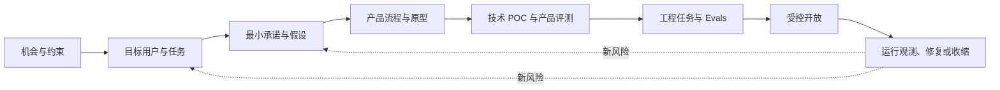
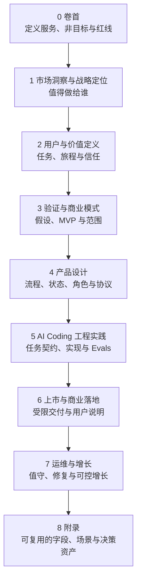
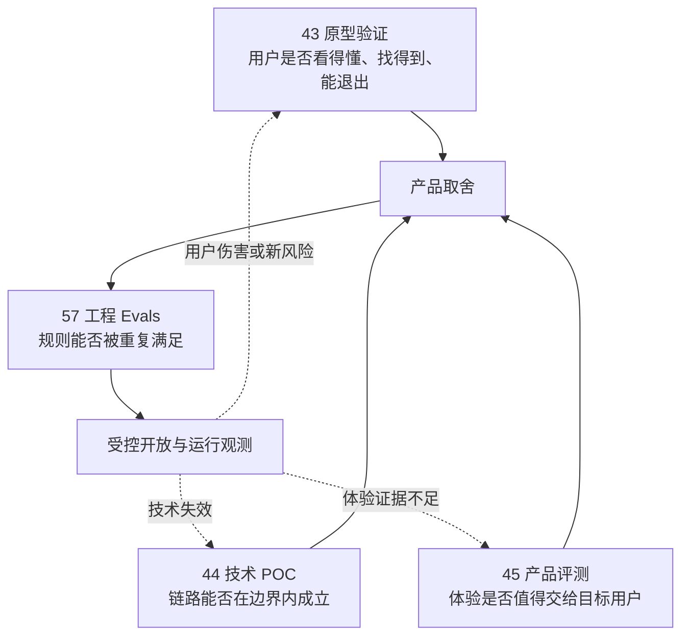
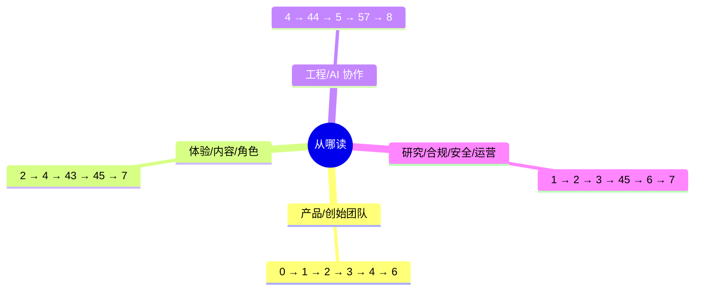
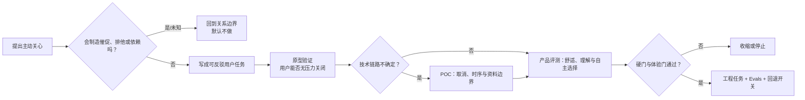
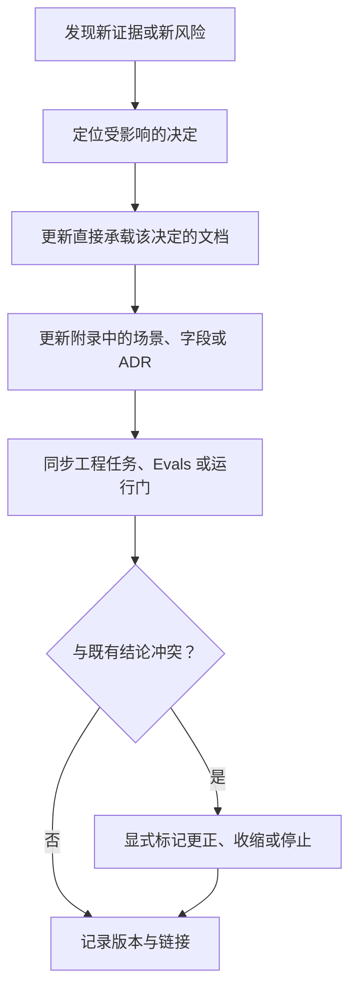

# 从 0 到 1资料包索引与使用说明

> 文档类型：资料包入口与决策导航  
> 适用阶段：从机会判断到受控开放的首轮建设  
> 决策状态：首轮工作地图。每篇材料只能支持其写明范围内的决定，不能把设计假设、合成演练或工程结果包装成真实市场结论。  
> 公开资料访问日：2026-01-28。

## 1. 这套资料包解决什么问题

它不是把项目拆成一堆“要写的文档”，而是把一个能力从问题、证据、取舍一路带到可回退的施工与受控开放。每个阶段都必须回答一个问题、留下一个可审阅的决定，并说明什么情况下要停。

贯穿全程只守五条原则：

- **先证伪再投入**：先问为什么不该做、什么会伤害用户，而不是先扩展功能清单。
- **事实与表达分开**：比赛事实、用户观察、角色表达和运营指令不能互相越权。
- **用户控制优先**：静音、严格保护、退出、暂停与删除压过生成、播放、缓存和重试。
- **多媒介等价**：语音、舞台和动效可以成为主要体验出口；事实、控制、错误和退出必须始终清楚可达，关键任务至少保留文字或结构化等价路径。
- **范围小于结论**：每个结论都写明人群、场景、媒介和证据等级；未知就保留未知。

## 2. 九阶段怎么读

- **卷首**：冻结一句话定义、非目标、最低边界和待验证命题。
- **市场与战略**：判断观看行为、竞争、监管、市场规模和定位是否足以进入研究；不把“大市场”当立项理由。
- **用户与价值**：把人群、观看进度、用户任务、离开权和关系边界写成可研究的问题。
- **验证与商业**：排出假设优先级，明确 MVP 不做什么，以及价格、获客和风险要怎样被证伪。
- **产品设计**：把一场陪看的进入、状态、控制、表达、结束和资料权利组织成完整体验。
- **工程实践**：把已批准的决定转为任务合同、提示词、接口、测试、回退和可审阅改动。
- **上市与运维**：定义何时可以受控开放、怎样说明限制、谁值守以及出现风险如何停止。
- **附录**：沉淀场景卡、状态机、字段、协议、提示词和 ADR，供后续复用而非替代决策。

### 产品设计的分层阅读路径

进入“4.产品设计”时，先阅读 `20A-技术约束与选型原则.md`，再阅读 `20-产品设计总览.md`，随后按任务域阅读 `21–46`。推荐顺序为：`20A → 20 → 21–24 → 25–27 → 28–32 → 33–35 → 36–40 → 33A → 41–42 → 43–44 → 45–46`。`20A` 负责前置技术边界，`20` 负责产品命题与统一控制模型，后续文档负责各能力域的详细设计。

## 3. 四类验证不能混写

这四篇都可能提到同一条能力，但问的是不同问题，产物不能互相替代。

- **原型验证**留下的是页面、流程、误解与退出观察；它不证明技术链路或用户价值已经成立。
- **技术 POC**留下的是受限输入下的可行性、失败收缩和候选方案；它不证明体验值得扩大。
- **产品评测**留下的是产品范围、硬门、受控研究和体验决定；它不替代可重复的工程断言。
- **工程 Evals**留下的是黄金集、判定器、回归和 CI 门；它不能把绿灯解释成用户喜欢或市场成立。

## 4. 按角色选择阅读路径

如果只需处理一个新需求，先看它影响哪一种边界：用户任务、比赛事实、用户控制、关系表达、资料权利还是工程可靠性。然后只打开相应阶段的材料，不以“补文档”为目标。

## 5. 一条新需求怎样变成可交付决定

以“为提高留存，增加主动关心”为例：它不能直接进入需求池，而要先经过边界、研究、原型和工程四次不同的审视。

交付时至少应有五件东西：问题与非目标、可反驳假设、用户可见失败路径、证据与范围、下一步的保留/收缩/停止决定。没有这些，就不是可交付决定。

## 6. 更新、冲突与审阅规则

- 证据冲突时，不静默覆盖旧结论；标明哪个范围失效、谁需要复审、相关能力是否先关闭。
- 产品决定优先于表现层便利；用户控制与资料权利优先于增长与自动化；硬门优先于平均分。
- 所有提示词、协议和测试资产都必须回链到一个用户承诺或风险场景，不能成为孤立的工程产物。

## 7. 资料包验收

验收的重点不是文档数量，而是：读者能否追溯“为什么做、替谁做、出了问题怎么办、谁能决定停”。当任一答案缺失，就回到对应阶段补决策，而不是继续增加表现层细节。
