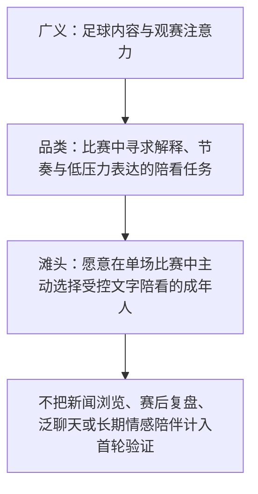
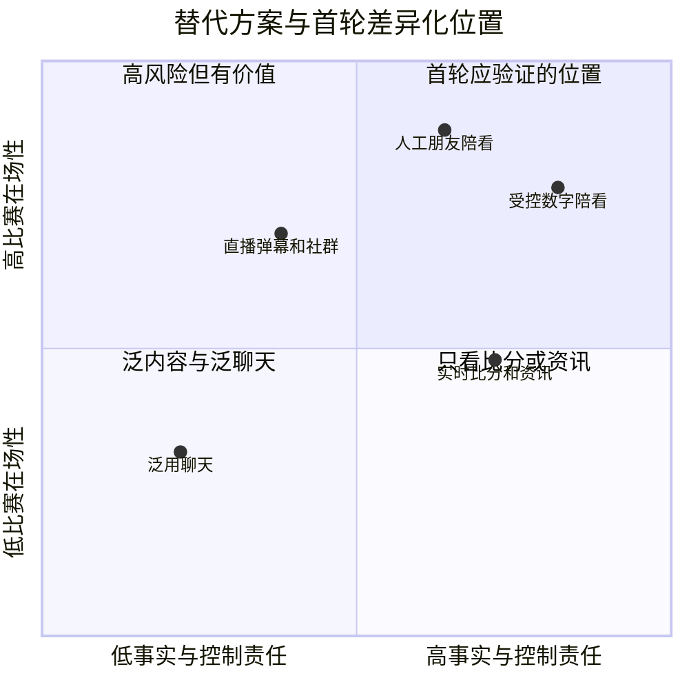
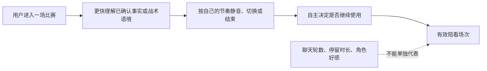
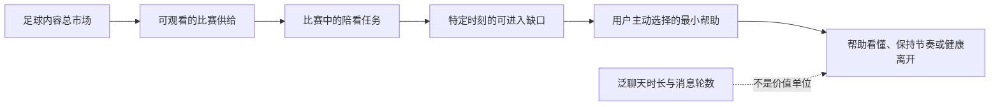
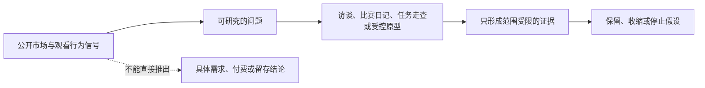

# 足球陪看市场与观看行为洞察

> 文档类型：0→1 立项研究与决策输入  
> 适用阶段：发现问题 → 选择滩头场景 → 定义首轮验证  
> 版本：0.1（待研究证伪）  
> 研究信息截止：2026-01-28  
> 证据规则：本文不把“足球受欢迎”当作“产品必然有人用”。公开资料只用于提出待验证的市场信号；涉及目标用户、付费意愿、留存和市场规模的结论，均须经本项目研究后才可成立。

---

## 1. 本文要解决的立项问题

“有人看球”不是一个足以立项的需求。“可以和 AI 聊天”也不是一个足以立项的产品理由。本次探索要回答的是更窄、更可行动的问题：

> 在一场实时足球比赛的前、中、后，是否存在一类用户，在特定的高情绪与高信息不确定时刻，愿意持续使用一个**有事实边界、理解观赛上下文、能以声音和形象同场陪伴**的数字角色？

这个问题拆成八个必须分别成立的判断：

1. **情境是否高频且足够痛。** 用户是否真的会在观赛中感到“想找人一起看/问一句/分享一句”，而不是事后回忆中觉得这很美好。
2. **当前替代品是否不够好。** 转播、解说、群聊、短视频、社媒、搜索和朋友，是否已以更低成本满足了这些时刻。
3. **数字角色是否比通用聊天更合适。** 用户要的是一个可被记住的“球友”，还是一次性的赛事问答工具。
4. **事实可信是否构成基本门槛。** 一次错报比分、越位、换人或比赛状态，会不会立刻毁掉信任。
5. **实时性是否值得工程成本。** 用户真正需要的是秒级互动，还是允许数十秒延迟的赛后内容。
6. **关系感是否提高留存而非制造风险。** 陪伴、记忆和主动性是否让用户愿意回来，同时不把产品推向情感替代、排他依赖或过度打扰。
7. **首个细分人群是否足够集中。** 不能从“所有球迷”开始；必须找到一个语言、赛事、设备、时间和需求相近的可触达群体。
8. **价值是否能转成可持续模型。** 即使用户喜欢，也要检验直播日使用、非比赛日回访、付费或合作价值能否覆盖服务成本和运营成本。

本文不输出“市场已经成立”的结论。本文输出的是：市场定义、问题树、细分方法、首选滩头假设、研究设计、证伪门槛，以及这些发现将如何约束后续产品设计。

---

## 2. 市场口径：我们研究的不是“足球”，而是“比赛中的陪看任务”

### 2.1 三层市场口径

为了避免把内容消费规模误当成陪看产品需求，本项目采用三层口径。

**口径：足球内容注意力市场**
- **定义**：用户为比赛直播、集锦、新闻、数据、社区讨论投入的时间与注意力
- **可观察信号**：赛事传播、转播收视、平台讨论、搜索热度
- **不能直接推出什么**：不能推出用户愿意使用陪伴产品，更不能推出付费

**口径：实时观赛协同市场**
- **定义**：用户在看比赛的同时，进行聊天、查证、吐槽、预测、分享、找解释的行为
- **可观察信号**：第二屏使用、群聊活跃、即时搜索、社媒发帖、弹幕与直播间互动
- **不能直接推出什么**：不能推出用户需要一个独立数字角色

**口径：有边界数字陪看市场**
- **定义**：用户愿意让一个持续存在的数字角色，在固定赛事时段提供可信互动、表达陪伴并记住有限偏好的行为
- **可观察信号**：主动进入会话、连续场次回访、允许有限记忆、对事实错误敏感、愿为体验投入资源
- **不能直接推出什么**：不能靠宏观报告估算，必须靠原型与队列验证

立项从第三层开始验证，但需要前两层解释“行为土壤”是否存在。所谓“市场规模”，在没有真实留存与转化数据前只能写成参数模型，而不是一个看似精确的金额或用户数。

### 2.2 产品类别定义

拟议产品不是以下任何一种的替代品：

- **不是赛事直播平台。** 不采购、分发或承诺转播权；用户必须在合法渠道观看比赛。
- **不是比分提醒器。** 比分、赛程和事件是互动可信度的基础设施，不是全部价值。
- **不是战术百科。** 可以解释，但不以“比所有解说更专业”为竞争前提。
- **不是社交网络。** 不要求用户建群、发帖、维护人设或处理陌生人关系。
- **不是心理咨询、恋爱对象或情感替代。** 角色可温暖、有连续性，但不能承诺排他、占有、无条件依赖或替代现实支持。
- **不是博彩、荐彩或收益承诺工具。** 预测可作为娱乐表达，但不得引导下注、暗示稳赚或利用用户情绪促成交易。

更准确的类别是：

> 一个围绕合法观赛场景运行的、以比赛事实为边界的实时数字陪看服务。它帮助用户更自在地经历比赛，而非取代比赛、朋友或现实关系。

### 2.3 单位价值不是“聊天轮数”

通用 AI 产品常把问题数、回答数或会话时长视为使用强度。对陪看产品，这些指标可能反而意味着体验失败：如果用户必须不断追问比分，或者角色在整场比赛里说个不停，观赛会被打断。

本项目的价值单位应定义为：

> **关键时刻的恰当介入。** 用户在需要时得到可信、合拍、可停止的支持；在不需要时，产品能安静地把注意力还给比赛。

因此，研究要记录“没有说话但用户觉得舒服”的时刻，也要记录“回答正确但插话不合时宜”的时刻。前者可能是价值，后者可能是流失原因。

---

## 3. 已知外部信号与可推导边界

以下资料可作为研究起点。它们的作用是限定问题、发现风险和设计样本，而不是为拟议产品背书。

### 3.1 公开信号表

> 信息卡：原宽表已改为纵向阅读，字段含义不变。

- **信号：足球大型赛事具备跨地区的大规模注意力**
  - **公开资料能支持的事实**：FIFA 对卡塔尔世界杯传播表现的公开说明表明，顶级赛事能够形成极高的全球触达与讨论规模
  - **对本项目的启示**：赛事日能形成注意力峰值，适合研究“同一时间发生同一件事”的陪看需求
  - **不能据此作出的结论**：不能据此判断中国市场、具体联赛或任何单一用户群的实际需求

- **信号：体育迷的内容接触正在跨屏、跨平台**
  - **公开资料能支持的事实**：Ofcom 的《Media Nations》持续追踪电视、视频、线上平台与受众行为变化；其价值在于说明媒介使用日益碎片化，而非给出本产品的需求数字
  - **对本项目的启示**：研究必须记录用户同时看什么、在哪个设备上看、何时切屏、何时打开聊天或搜索
  - **不能据此作出的结论**：不能简单推出“第二屏越多，数字陪看越受欢迎”

- **信号：体育粉丝关系包含身份、社群与参与，而不仅是内容接收**
  - **公开资料能支持的事实**：Nielsen 关于 fandom 的公开研究将粉丝行为放在内容、社交、创作与品牌互动的组合中讨论
  - **对本项目的启示**：不能只把用户当作“需要赛事信息的人”；应研究身份表达、共同经历和社交压力
  - **不能据此作出的结论**：不能把粉丝身份误读为愿意与 AI 建立持续关系

- **信号：流媒体与社交参与改变了体育消费链条**
  - **公开资料能支持的事实**：Deloitte 对体育媒体与粉丝参与的行业观察强调直播、数字分发、互动和商业模式的相互影响
  - **对本项目的启示**：产品体验需要与用户已有的直播/社媒习惯共存，而不是要求他们改变主要观看渠道
  - **不能据此作出的结论**：不能把行业趋势当作个体使用意愿

- **信号：生成式 AI 面向公众提供服务须承担内容与用户保护义务**
  - **公开资料能支持的事实**：中国《生成式人工智能服务管理暂行办法》对服务提供者提出内容安全、投诉处理、未成年人保护等要求
  - **对本项目的启示**：风险、标识、申诉、未成年人和数据边界必须在立项期进入需求，而不是上线前补丁
  - **不能据此作出的结论**：不能把合规要求当作差异化卖点，也不能用“AI 能做”替代产品价值

- **信号：伴随生成内容与虚拟场景，透明标识成为产品条件**
  - **公开资料能支持的事实**：《人工智能生成合成内容标识办法》规定了相应标识与服务管理要求
  - **对本项目的启示**：声音、形象、文本与虚拟呈现需要清晰告知其 AI 属性；设计上应避免让用户误认真人服务
  - **不能据此作出的结论**：不能仅依靠一段用户协议完成风险控制

- **信号：AI 风险需要覆盖设计、部署与使用过程**
  - **公开资料能支持的事实**：NIST AI RMF 及其 Generative AI Profile 提供了风险识别、衡量、治理和管理的框架
  - **对本项目的启示**：研究要把不当依赖、事实错误、隐私、偏见、操纵性设计和失效恢复作为可测量风险
  - **不能据此作出的结论**：不能用“有风险清单”替代真实的测试和运营责任

### 3.2 公开来源清单

- **S1. FIFA，*FIFA World Cup Qatar 2022 engaged five billion fans*。确认大型赛事的注意力峰值，不用于估算目标市场。访问日：2026-01-28** [链接](https://www.fifa.com/fifaplus/en/articles/fifa-world-cup-qatar-2022-engaged-five-billion-fans)
- **S2. Ofcom，*Media Nations 2024*。作为跨屏媒体行为背景，不外推至中国样本。访问日：2026-01-28** [链接](https://www.ofcom.org.uk/research-and-data/tv-radio-and-on-demand/media-nations-and-regions/media-nations-2024)
- **S3. Nielsen，*The Future of Fandom Is Here*。作为“粉丝参与不止观看”的问题线索。访问日：2026-01-28** [链接](https://www.fifa.com/fifaplus/en/articles/fifa-world-cup-qatar-2022-engaged-five-billion-fans)
- **S4. Deloitte，*Sports media and entertainment*。作为体育媒体、数字分发和商业模式的行业背景。访问日：2026-01-28** [链接](https://www.fifa.com/fifaplus/en/articles/fifa-world-cup-qatar-2022-engaged-five-billion-fans)
- **S5. 国家互联网信息办公室，*生成式人工智能服务管理暂行办法*。定义面向公众服务的立项约束。访问日：2026-01-28** [链接](https://www.cac.gov.cn/2023-07/13/c_1690898326795531.htm)
- **S6. 国家互联网信息办公室，*人工智能生成合成内容标识办法*。定义 AI 生成内容的透明标识要求。访问日：2026-01-28** [链接](https://www.cac.gov.cn/2025-03/14/c_1743654684782215.htm)
- **S7. NIST，*AI Risk Management Framework*。用于风险治理与测量。访问日：2026-01-28** [链接](https://www.nist.gov/itl/ai-risk-management-framework)
- **S8. NIST，*Artificial Intelligence Risk Management Framework: Generative Artificial Intelligence Profile*。将通用风险框架具体化到生成式 AI。访问日：2026-01-28** [链接](https://www.nist.gov/publications/artificial-intelligence-risk-management-framework-generative-artificial-intelligence)
- **时段.** 用户主任务 | 情绪与信息状态 | 产品可以研究的机会 | 最容易犯的错
- **---.** ---|---|---|---
- **赛前数日.** 决定看不看、跟谁看、在哪里看 | 期待低到中等，信息需求分散 | 赛程提醒、轻量预热、建立下次同看的预期 | 过早高频通知，把普通比赛也当大事
- **开球前.** 进入观赛状态、确认关键背景 | 期待升高，碎片信息需求强 | 一句话背景、阵容变化、用户可选的陪看模式 | 用长篇前瞻阻塞用户打开直播
- **平稳比赛段.** 看比赛本身 | 注意力集中，容忍打扰最低 | 默认安静；仅在用户主动提问时回应 | 为证明“智能”而持续解说
- **关键事件.** 理解发生了什么、表达情绪 | 高唤醒、高不确定、时间窗口短 | 先给可核验事实，再给短表达；允许立即打断 | 把推测说成事实、在庆祝/懊恼时说教
- **中场.** 补信息、消化上半场、预测 | 注意力暂时释放 | 简短回顾、用户可选择的讨论深度 | 生成冗长战术报告，错过下半场
- **终场后.** 宣泄、寻找共识、解释结果 | 情绪仍高，观点表达意愿高 | 回顾共同瞬间、区分事实与观点、留一个可离开的结束 | 强行拉长对话或诱导情绪依赖
- **非比赛日.** 维持兴趣或等待下一场 | 注意力低且易被打扰 | 低频、可关闭的赛程或回忆触达 | 把陪看做成全天候陪聊
- **场景.** 用户想取得的进步 | 功能性任务 | 情绪性任务 | 社会性任务 | 成功信号
- **---.** ---|---|---|---|---
- **第一次认真看一场重要比赛.** 当我担心自己看不懂时，我想快速补上必要背景，而不显得很外行 | 明白关键规则、人物与比分状态 | 降低焦虑与被排除感 | 能自然加入朋友对话 | 少问重复问题，愿意继续看完
- **一个人看主队关键战.** 当情绪突然很强时，我想有人能理解当下，而不要求我社交或评判我 | 获得事实确认与短回应 | 被陪着但不被黏住 | 保留独处自主性 | 事件后愿意继续观看而非离开
- **转播信息混乱或延迟.** 当我对事件真假不确定时，我想有一个可靠入口区分已确认与待确认 | 查询比分、事件、状态、来源 | 降低焦躁与误判 | 不在群里传播错误信息 | 用户能复述“已确认/待确认”的差别
- **看球但周围人不懂.** 当我想分享一个瞬间时，我想即时表达，而不必刷屏或强迫朋友回应 | 用一句话、一段语音或表情完成分享 | 情绪有出口 | 不打扰现实朋友 | 使用后回到比赛而非陷入聊天
- **连续关注一支球队.** 当我再次打开比赛时，我想不用重新介绍自己，却仍保有边界 | 记住有限偏好、上次话题与观看习惯 | 感到被认得，而非被监控 | 能随时更改或删除记忆 | 用户能解释、控制和撤回记忆
- **赛后想消化输赢.** 当比赛结束后，我想把情绪和事实分开整理，再决定是否继续讨论 | 回顾关键事件、保存回忆或查看后续赛程 | 完成情绪收束 | 可选择分享或独处 | 对话有自然结束，不制造依赖
- **根因.** 观察到的表象 | 可能的非产品解法 | 产品可尝试的最小解法 | 立项前必须验证
- **---.** ---|---|---|---
- **信息分散.** 用户在直播、搜索、社媒间来回切换 | 更好的转播、专业解说、官方 App | 一个明确的事实入口与短解释 | 用户是否真会在关键时刻打开另一个入口
- **一人观看.** 用户发消息没人回或忍住不说 | 约朋友、加入群聊、看主播 | 低压力的单人陪看互动 | 用户缺的是“人”，还是只是内容不够好
- **不敢提问.** 初级用户静默、事后再搜索 | 朋友教学、长视频、图文百科 | 不评判、可随时打断的一句话解释 | 用户是否愿意对数字角色暴露无知
- **情绪无人承接.** 进球或失球后立即刷社媒 | 弹幕、群聊、短视频、现实朋友 | 克制的情境化回应 | 回应是否被认为真诚，还是显得机械
- **偏好无法延续.** 每次对话从“你支持谁”开始 | 登录、关注、收藏 | 用户控制的最小记忆 | 记忆是否提高回访，是否引发监控感
- **事实不可信.** 用户转而查多个来源 | 官方数据、转播、搜索 | 状态区分与不确定性表达 | 用户能否理解“未确认”，并因此更信任
- **轴.** 低端 | 高端 | 为什么重要
- **---.** ---|---|---
- **赛事重要性.** 随手看、可随时退出 | 主队/国家队/淘汰赛，结果高度在意 | 决定情绪峰值与实时性价值
- **陪看缺口.** 身边有合拍同看者 | 独看、群聊不适配、时差或环境限制 | 决定“陪伴”是否是增量价值
- **理解压力.** 熟悉规则、阵容与联赛背景 | 害怕看不懂、难以问人 | 决定解释和事实入口是否必要
- **关系容忍度.** 只需要一次性工具 | 愿意形成有限连续习惯，但要求控制感 | 决定记忆、主动性和长期留存是否成立
- **细分.** 描述 | 主要任务 | 当前替代方案 | 预期价值 | 主要风险
- **---.** ---|---|---|---|---
- **A. 独看主队关键战的稳定球迷.** 熟悉球队、在重要场次常独自观看 | 共情、确认事实、短分享 | 朋友私聊、球迷群、解说、社媒 | 情绪峰值强，连续场次可验证 | 他们可能已有成熟社群，并不需要新入口
- **B. 想融入但经验不足的轻度观众.** 因朋友、伴侣或大赛开始看球 | 快速理解、避免尴尬、跟上讨论 | 搜索、短视频、朋友解释 | 解释价值可能清晰，学习曲线可测 | 只在大赛期使用，长期留存低
- **C. 时差/作息受限的异步观众.** 看回放、延迟直播或碎片集锦 | 不被剧透、快速补脉络、回顾 | 集锦、新闻、数据 App | 对“陪看”的实时要求低，适合研究回顾 | 与核心实时价值不一致，容易把产品带偏
- **D. 高参与战术/数据型球迷.** 常看多场、主动研究阵容与战术 | 深度分析、观点碰撞、数据验证 | 媒体、播客、社区、数据平台 | 愿意表达且反馈质量高 | 对事实与专业度要求极高，首版成本过高
- **E. 以社交为主的赛事观众.** 看球是聚会、话题或内容参与 | 增加气氛、轻互动、分享素材 | 朋友、直播间、弹幕、短视频 | 传播潜力可能高 | 需求受活动驱动，个体陪看未必必要
- **维度.** 定义 | 访谈/观察证据 | 反证信号
- **---.** ---|---|---
- **赛事触发频次.** 用户一年中有多少次愿意认真看完整比赛 | 过去三个月观看记录、日历、平台使用痕迹 | 只在单一大赛偶发，平时几乎不看
- **痛点尖锐度.** 痛点发生时是否影响继续观看、理解或情绪 | 具体事件复盘、切屏、退出、发消息等行为 | 用户称“麻烦”但从未采取动作
- **替代不足度.** 现有方案的时间、社交、信任或注意力成本 | 描述“当时为什么不用群聊/搜索/朋友” | 用户对现有方案满意且切换成本低
- **即时介入价值.** 晚几十秒是否仍有用 | 关键事件时间线、回放反应 | 用户更愿意赛后再看，实时不重要
- **连续关系意愿.** 用户是否希望下次不用重新介绍背景 | 愿意设置、查看、修改有限偏好 | 用户只想匿名一次性使用
- **可安全服务度.** 产品能否在不误导、不操纵和不越界下提供价值 | 对角色边界、通知、记忆和错误的偏好 | 用户唯一看重的是越界承诺、博彩或情感替代
- **场景.** 需求信号 | 可验证性 | 安全复杂度 | 建议动作
- **---.** ---|---|---|---
- **独看主队关键战，关键事件后想确认并说一句.** 强情绪、短时间窗口、社交缺口可能明显 | 高：可做赛事日观察和 Wizard-of-Oz 测试 | 中：需控制角色主动性与事实可信度 | **优先研究**
- **新手与朋友同看，想迅速看懂.** 理解压力可见 | 高：可在任务测试中观察 | 低到中：避免居高临下与幻觉 | **优先研究**
- **赛后复盘与共同回忆.** 有连续性可能 | 中：需跨场次追踪 | 中：记忆、情绪边界与删除控制 | 第二阶段
- **深度战术陪聊.** 目标人群表达强 | 中：价值易被专业工具替代 | 高：事实准确度与专业门槛高 | 延后验证
- **全天候泛陪伴.** 看似时长高 | 低：容易混淆真实动机 | 很高：依赖和边界风险 | 明确不做
- **替代方案.** 用户雇佣它做什么 | 优点 | 典型摩擦 | 拟议产品必须优于它的地方 | 不应试图取代的地方
- **---.** ---|---|---|---|---
- **电视/流媒体转播与解说.** 看比赛、获得主叙事 | 权威画面、天然同步、低学习成本 | 个性化不足、不能问问题 | 在不干扰画面的情况下补足个人化、可问可停的互动 | 不争夺主屏与转播权
- **官方赛事 App/数据服务.** 查赛程、比分、阵容、事件 | 数据结构清晰、来源感强 | 可能缺情绪与解释，切换成本高 | 用明确来源和状态降低查询摩擦 | 不假装比官方更权威
- **搜索/百科/短视频.** 查规则、背景和回放 | 信息丰富、按需获取 | 需要自己组织问题，可能剧透或过时 | 提供短、与当前时刻相关的解释 | 不建设无边界知识库
- **朋友私聊/球迷群.** 一起庆祝、吐槽和讨论 | 真人共情、已有关系 | 时差、噪声、社交压力、无人回应 | 给独看者低压力出口，且不要求维系社交 | 不替代朋友或模仿真人关系
- **直播间/弹幕/社媒.** 感受集体氛围、找观点 | 热闹、内容量大、即时 | 噪声、攻击、剧透、注意力消耗 | 提供更安静、可控、个体化的空间 | 不以“更热闹”竞争
- **通用聊天机器人.** 问问题、生成观点、陪聊 | 熟悉、开放、通用性强 | 赛事状态易错、没有节奏、关系边界模糊 | 围绕比赛事实、时机、角色边界优化 | 不和通用聊天的开放范围竞争
- **线下同看.** 共享情绪与仪式感 | 真实陪伴、强记忆 | 地点、时间、成本、社交门槛 | 在无法同看的时候提供轻量替代 | 不声称等同于真人同看
- **标准.** 解释 | 候选 1 | 候选 2 | 候选 3
- **---.** ---|---|---|---
- **问题是否在真实比赛中反复出现.** 不看宣称，看近三个月行为 | 待验证 | 待验证 | 待验证
- **关键时刻是否清晰.** 能否设计低摩擦原型 | 较清晰 | 较清晰 | 中等
- **替代方案是否存在明显空档.** 是否不是“已有工具的差一点版本” | 待验证 | 待验证 | 待验证
- **是否可在合法、低风险边界内服务.** 不依赖转播、博彩或越界关系 | 较可控 | 较可控 | 较可控
- **是否可能形成跨场次回访.** 不只是一场活动 | 可能较高 | 未知 | 中等
- **是否易于招募并观察.** 能否在赛事日完成真实研究 | 待验证 | 较易 | 较易
- **阶段.** 目的 | 方法与样本 | 主要产出 | 不应得出的结论
- **---.** ---|---|---|---
- **P0 桌面与招募校准.** 确认赛事、渠道、语言与招募可行性 | 公开资料梳理；10 名筛选访谈；赛事日历整理 | 招募画像、术语表、研究日历、风险清单 | 不得得出市场规模或产品偏好
- **P1 深度行为访谈.** 找到重复问题与替代方案 | 24 名半结构访谈，候选 1/2 各 10–12 名，保留少量反例 | 任务地图、问题证据、细分修订、原型假设 | 不得以访谈中的“愿意试试”证明留存
- **P2 赛事日情境研究.** 验证关键时刻与打扰阈值 | 12–16 名参与者，至少两场不同重要性比赛；观察、屏幕/时间线自述、赛后复盘 | 触发时刻库、沉默规则、替代行为、风险事件 | 不得以一次高峰体验证明付费
- **P3 受控原型试验.** 验证最小价值闭环 | 20–30 名，分任务版本；可使用 Wizard-of-Oz 以验证体验而非先建全栈 | 使用率、回访意愿、错误容忍、价值语言 | 不得以研究员陪同的数据估算自然留存
- **项目.** 候选 1：独看关键战 | 候选 2：理解压力型观众 | 共同排除/保护条件
- **---.** ---|---|---
- **近三个月行为.** 至少完整观看过若干场自己在意的比赛，其中有独看经历 | 至少看过一场重要比赛，且曾因规则/背景不懂而求助或回避表达 | 不招募无法理解研究同意、无法安全参与实时观察的对象
- **设备与场景.** 有惯用合法观看渠道，能在私密环境参与 | 同上；可包含与朋友一起看但有困惑的场景 | 不要求提供账号、聊天记录或转播内容
- **异质性.** 覆盖不同联赛偏好、不同独看原因、不同社交习惯 | 覆盖不同入坑路径、不同知识基础 | 年龄、性别、地区仅作为覆盖维度，不作为需求替代变量
- **风险筛查.** 记录但不以脆弱状态作为招募卖点 | 记录但不以脆弱状态作为招募卖点 | 对未成年人、强烈情绪困扰、依赖倾向采取额外保护与退出机制
- **字段.** 记录方式 | 用途
- **---.** ---|---
- **比赛时刻与事件类型.** 参与者标注或公开赛况时间线 | 判断触发是否真的发生在关键时刻
- **用户原始动作.** 打开/关闭/提问/忽略/转向替代方案 | 区分真实行为与口头偏好
- **用户注意力状态.** 赛后自述“专注、分心、想表达、不想被打扰” | 定义沉默与打断策略
- **系统行为.** 被动响应/主动提示/不发言，及其时长 | 比较时机与长度
- **事实状态.** 已确认、待确认、冲突、无法判断 | 评估可信边界是否被理解
- **主观结果.** 有帮助、无感、烦、可信、不可信、像人/不像人 | 形成体验语言，不替代行为指标
- **风险事件.** 误导、冒犯、依赖暗示、隐私不适、过度打扰 | 作为停止/修订条件，而非可接受代价
- **编号.** 假设 | 为什么重要 | 最小验证 | 通过信号 | 证伪或停止信号
- **---.** ---|---|---|---|---
- **H1.** 重要比赛中，独看用户存在可重复的“想说一句但没人可说”时刻 | 陪伴是否有增量价值 | P1 回溯 + P2 赛事观察 | 多名参与者在未提示下描述同类时刻并采取动作 | 主要依靠现有群聊且满意，或根本不想互动
- **H2.** 轻度观众愿意在比赛中提问，但不希望被长篇教学 | 解释层是否必要 | 任务原型：一句解释 vs 长解释 | 短解释后能继续看，主观不尴尬 | 用户更愿意赛后查资料，实时解释无用
- **H3.** 明确标示不确定性的回答会提高信任，而非被视为“没用” | 事实边界是核心差异 | 冲突信息情境测试 | 用户能区分状态，仍愿继续使用 | 用户只要肯定答案，且不接受不确定性
- **H4.** 用户愿意让服务记住有限观赛偏好，但要求透明和可控 | 连续体验是否成立 | 记忆卡片测试 + 跨场次原型 | 用户主动选择可记住项，并能解释用途 | 大多数用户拒绝任何记忆或感到被监视
- **H5.** 默认安静、用户可打断的角色比高频主动角色更受欢迎 | 数字角色是否不打扰 | 同场景 A/B 时机测试 | 安静模式不降低关键价值，负面打扰更少 | 用户持续要求高频播报，且不影响沉浸
- **H6.** 首轮价值可在合法观看渠道外独立成立 | 避免依赖转播权 | 不展示转播内容的原型试验 | 用户仍能完成关键任务 | 用户必须在同一视频层叠加内容才愿意使用
- **H7.** 用户会因下一场比赛的具体任务回访，而非只因新鲜感 | 留存基础 | 两至三场跨赛事跟踪 | 用户自主再次进入并说出具体原因 | 只在研究提醒后使用，赛后无再访
- **H8.** 边界设计能避免把关系感转成依赖或排他 | 是否可安全上线 | 安全情境评测 + 用户反应 | 用户理解角色是工具化陪看，不感到被操控 | 出现排他暗示、情绪绑架或用户明显不适
- **层级.** 先看什么 | 为什么 | 不该用什么替代
- **---.** ---|---|---
- **问题存在.** 关键时刻的自发求助/表达行为、替代方案摩擦 | 证明真实任务 | 下载量、点赞、问卷好评
- **价值交付.** 任务完成、回到比赛、信任和打扰评分 | 证明体验有帮助 | 总聊天轮数、总停留时长
- **初步留存.** 下一场自主进入、跨赛事再访、主动设置偏好 | 证明不是一次性新奇 | 研究提醒后的打开率
- **商业化.** 对不同价值包的选择、取消原因、服务成本 | 判断是否有可持续路径 | 先设价格再用“愿意付费”问卷证明
- **风险可控.** 事实错误率、越界触发、删除完成、投诉和不适事件 | 判断能否对公众提供 | 把低投诉等同于低风险
- **原则.** 行为要求 | 反例
- **---.** ---|---
- **比赛优先.** 默认把用户注意力还给转播；任何互动都应可打断、可关闭 | 为了提高时长而不断插话
- **事实先于文采.** 先区分已确认、待确认、无法判断，再表达观点或情绪 | 以自信口吻补全未知事件
- **温度不等于拟人欺骗.** 可以有角色、声音与表演，但始终清楚是 AI | 暗示真人在场、假装拥有主观经历
- **连续性必须可控.** 记忆项可见、可编辑、可删除；用户不设也可使用 | 默默积累个人偏好以制造“懂你”
- **主动性是授权，不是默认.** 通知和主动表达按赛事、时段、强度分级，并可随时撤销 | 把沉默解释为应加强提醒
- **安全是产品能力.** 面对攻击、博彩、依赖、未成年人和隐私请求，给出一致且可理解的边界 | 把风险处置交给模糊的“模型自觉”
- **层.** 指标示例 | 解释 | 防止的误判
- **---.** ---|---|---
- **触发.** 合格关键时刻数、用户主动调用率、默认沉默占比 | 是否抓到真实时刻 | 把所有事件都当触发
- **价值.** 任务完成自评、回到比赛率、关键回应接受率 | 是否让观看更自在 | 用聊天长度替代帮助程度
- **信任.** 用户对事实状态理解、纠错后继续使用意愿、不确定性可接受度 | 是否建立可持续信任 | 用“回答流畅”掩盖错误
- **关系边界.** 记忆授权率、编辑/删除成功率、过度主动关闭率 | 连续性是否可控 | 用记忆数量衡量亲密度
- **留存.** 下一场自主进入、同类赛事再访、取消/沉默原因 | 是否形成行为习惯 | 用运营召回后的打开代替自然留存
- **安全.** 事实严重错误、越界表达、投诉、未成年人保护事件、隐私删除 SLA | 是否具备公开服务资格 | 仅统计严重事故，忽略轻微不适
- **风险.** 最早出现在哪个阶段 | 早期信号 | 立项期缓解 | 停止/升级条件
- **---.** ---|---|---|---
- **需求是“新奇”而非重复问题.** 访谈、原型 | 用户说好玩但说不出下次何时用 | 跨两到三场比赛追踪，优先观察自主进入 | 无自主再访则不扩功能
- **产品打扰比赛.** 赛事日测试 | 用户频繁静音、跳过、关掉或抱怨 | 默认沉默、简短回应、随时打断 | 打扰在关键人群中持续出现则重做时机策略
- **赛事事实错误或延迟.** 原型、灰度前评测 | 用户交叉核验、纠错、失去信任 | 来源分级、状态可见、宁缺毋滥 | 出现严重误导时停止相应场景
- **数字角色越界或诱发依赖.** 概念测试、长期跟踪 | 排他语言、情绪绑架、不愿离开 | 明确角色边界、避免拟人欺骗、提供退出与支持路径 | 出现明确伤害信号则人工升级并暂停相关设计
- **隐私与记忆不透明.** 访谈、可用性测试 | 用户不知道记录了什么，或不敢设置偏好 | 最小收集、可见记忆、可删可导出 | 无法解释/删除则不引入连续记忆
- **未成年人风险.** 招募、开放前 | 未成年人把角色作为唯一支持来源或接触不适内容 | 年龄适配、保护性默认、升级机制 | 无法满足保护要求则不向该群体开放
- **转播权/内容边界不清.** 概念和原型 | 用户期待看直播、回放或受保护内容 | 明示合法观看渠道、避免分发受限内容 | 价值只能依赖受限内容则改变方向
- **团队把宏观热度当产品需求.** 立项汇报 | 只有行业报告，没有行为证据 | 设证据等级和否决门槛 | 不满足行为门槛不得进入规模投入
- **结论.** 条件 | 后续动作
- **---.** ---|---
- **进入 MVP 定义.** 至少一个细分在任务、替代不足、关键时刻价值与安全边界上均获得正证据 | 编写产品范围、用户旅程和验收标准；不立即扩展人群
- **缩窄后再测.** 问题存在，但时机、角色、事实或连续性中有一项不成立 | 删除不成立部分，重做小原型，不增加功能数量
- **停止或转向.** 需求主要被现有替代品满足，或价值依赖不可接受风险 | 记录反证，停止把资源投入同一假设；可转研究相邻问题

真正高质量的 0→1 研究，允许第三种结论发生。比起把一个模糊产品做得越来越完整，尽早证伪错误问题更有价值。

---

## 18. 本文的输出物与下一篇输入

本文结束时应形成以下可复用资产：

- 一份按赛事时段记录的观赛行为时间线模板；
- 一份以任务和替代方案为中心的访谈编码表；
- 候选细分 A/B 的招募标准与反例样本要求；
- H1–H8 的假设登记册、通过条件与否决权；
- 一个不含虚构数字的市场参数表；
- 一套将“事实可信、克制主动、可控连续性”写入后续体验与工程验收的原则。

下一阶段的用户与价值定义文档，应基于 P1/P2 得到的真实原话、行为时间线和反例，选择一个明确的用户—场景—任务组合。若研究尚未完成，则后续所有“用户画像”“价值主张”“商业模式”都必须标注为假设，不得用本篇的框架替代证据。
