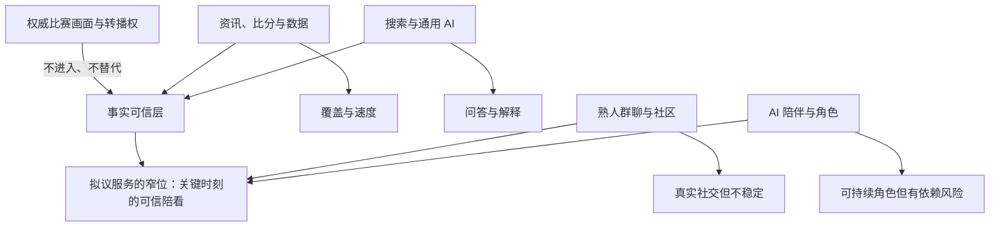
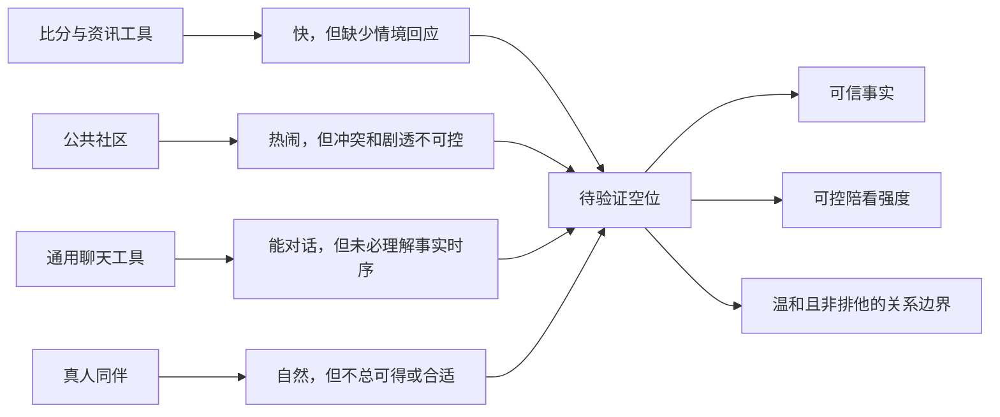
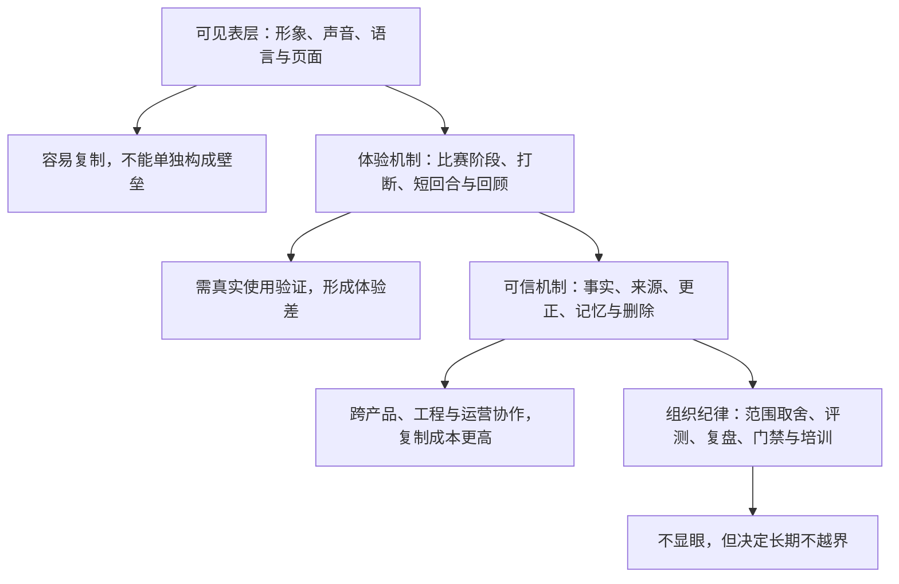
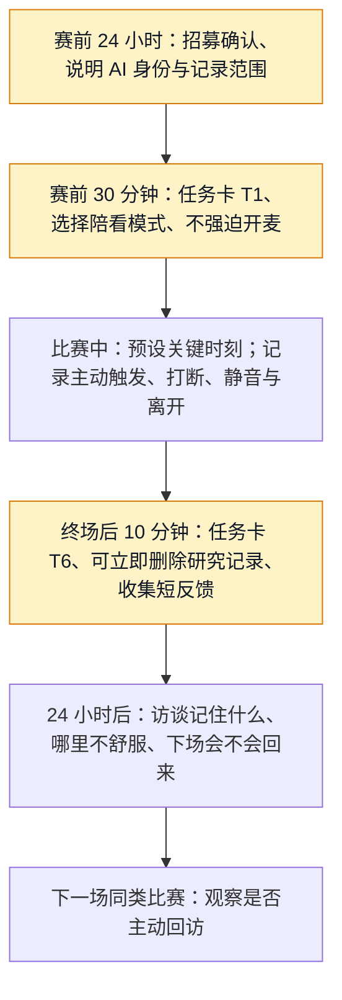

# 竞品格局与差异化机会

> 文档阶段：0→1，立项与首个可验证版本之前  
> 文档性质：市场与产品决策输入，不是竞品功能清单，也不是融资宣传材料  
> 版本：0.1（待走查、访谈与原型实验验证）  
> 研究信息截止：2026-01-28  
> 证据规则：本文只把公开产品页面、公开帮助中心、公开定价页、公开监管资料和后续拟执行的竞品走查作为依据。未亲自走查的体验结论明确标为假设；价格受地区、税费、平台活动与版本影响，必须在购买页再次核验。

---

## 1. 这篇文档要帮助团队作什么决定

一个“能和用户聊足球的数字人”表面上很容易被归进 AI、体育资讯或虚拟人赛道，实际上它会同时与一组完全不同的替代品竞争：用户可以看转播、刷比分、在群里喊一句、搜网页、打开通用 AI，或者干脆什么都不做。若只把同样使用大模型的应用称为竞品，团队会高估技术新颖性；若只把体育 App 称为竞品，团队又会低估陪伴、信任和互动节奏的难度。

本篇要回答的不是“谁的功能更多”，而是以下七个决策问题：

1. 用户在一场比赛的不同阶段，实际上雇佣了哪些替代品来完成任务？
2. 其中哪些替代品已经足够好，不值得正面硬碰；哪些任务仍有明显空位？
3. 一个数字角色若进入这个场景，必须在哪些方面明显更好，才配得上一次下载、一次麦克风授权和一次回访？
4. 哪些差异属于可被复制的界面包装，哪些差异只能靠长期产品机制、数据治理和运营纪律积累？
5. 首版应该主动放弃哪些看似吸引人的能力，避免把自己做成“又一个比分 App”“又一个通用聊天框”或“披着球衣的情感陪伴 App”？
6. 如何用小样本走查、可控原型和真实比赛日实验，而不是凭创始团队偏好，验证差异化是否成立？
7. 当竞品快速模仿时，产品怎样仍然守住用户信任和可持续的经营边界？

本文的结论先写在前面：**首个机会不在于取代直播、资讯、社群或通用 AI，而在于在合法观赛过程中的少数关键时刻，提供“可信、合拍、可停止”的在场感。** 这是一条很窄的命题。它要求产品在事实正确、介入时机、角色边界、声音与形象的一致性上都不失手，而不要求它覆盖所有比赛、所有球迷和所有聊天需求。

---

## 2. 竞争的正确单位：不是 App，而是用户任务

### 2.1 不要从“应用类别”开始

用户不会在开赛前郑重比较“体育媒体”和“AI 陪伴产品”。真实过程通常更短：看到赛程时想知道几点开球；争议判罚后想确认发生了什么；主队丢球时想吐槽；看完球后不想独自消化情绪；第二天想知道错过的细节。每一个瞬间都可能由不同工具接管。

因此，本项目使用“任务竞争”而非“品类竞争”的口径。竞争单位是一项用户愿意花注意力完成的工作，而不是一个下载量相近的产品。

> 信息卡：原宽表已改为纵向阅读，字段含义不变。

- **比赛阶段：赛前数小时至开赛前**
  - **用户要完成的任务**：确认赛程、阵容、看点与观看渠道
  - **最常见替代品**：搜索、体育资讯 App、球迷群、直播平台
  - **用户付出的成本**：信息分散、内容同质、通知噪声
  - **拟议服务必须证明的额外价值**：用少量可靠信息把“我要不要看、怎么看、值得关注什么”讲明白，不制造焦虑

- **比赛阶段：开场至平稳比赛段**
  - **用户要完成的任务**：获得陪看感，又不被打断
  - **最常见替代品**：与朋友同看、群聊、弹幕、背景解说
  - **用户付出的成本**：朋友未必在线；群聊过吵；弹幕失控
  - **拟议服务必须证明的额外价值**：只在用户允许或确有价值时说话，沉默也要让人舒服

- **比赛阶段：进球、红牌、点球、伤停等高情绪时刻**
  - **用户要完成的任务**：立刻确认事实、表达情绪、理解影响
  - **最常见替代品**：转播解说、比分 App 推送、群聊、社媒
  - **用户付出的成本**：消息快但常缺语境；讨论快但易失真
  - **拟议服务必须证明的额外价值**：在不抢转播节奏的前提下，给出可追溯事实与恰当回应

- **比赛阶段：争议、规则或战术困惑**
  - **用户要完成的任务**：问一个具体问题并拿到可信解释
  - **最常见替代品**：搜索、百科、通用 AI、懂球好友
  - **用户付出的成本**：搜索成本高；通用 AI 未必知道实时上下文
  - **拟议服务必须证明的额外价值**：承认不确定性，区分已确认事实、推断与观点，必要时建议回看官方信息

- **比赛阶段：情绪低谷或胜利后**
  - **用户要完成的任务**：找到可表达但不被操纵的出口
  - **最常见替代品**：熟人、社媒、短视频、通用陪伴 AI
  - **用户付出的成本**：熟人并非总可得；公开表达有社交压力
  - **拟议服务必须证明的额外价值**：温和回应、不过度拟亲密、不要求用户继续留在会话里

- **比赛阶段：赛后数分钟至次日**
  - **用户要完成的任务**：回顾、补课、保存共同瞬间、决定是否继续关注
  - **最常见替代品**：集锦、新闻、播客、社媒讨论
  - **用户付出的成本**：信息过量，难以对应自己的观看经历
  - **拟议服务必须证明的额外价值**：把用户选择保存的少量瞬间组织成可删除、可解释的回顾，而非无限累积画像

### 2.2 六类竞争者，而非一张“竞品 Logo 墙”

为让比较有行动意义，第一轮研究把替代品分成六类。每一类都满足某个任务，也都有它不适合承担的部分。

1. **转播、短视频与官方赛事渠道。** 它们拥有最强的比赛画面、叙事权和部分权威信息。任何陪看产品都不应冒充、复刻或承诺提供其拥有的内容与权利。
2. **体育资讯、比分与数据产品。** 例如 FotMob、Sofascore、懂球帝等，能以极低摩擦提供赛程、比分、数据、新闻、阵容和社区内容。它们是事实基础设施与注意力入口，也是最难在“覆盖广度”上超越的对象。
3. **熟人群聊、球迷社区与社交平台。** 它们提供真实的人际共鸣、身份表达和热点速度，但也带来噪声、冲突、剧透、陌生人压力与信息失真。
4. **通用搜索与通用 AI。** 搜索、问答产品和通用对话助手擅长一次性知识获取与开放式问题，但通常不天然拥有合法实时数据、比赛上下文、对话节奏或角色边界。
5. **通用 AI 陪伴/角色产品。** Replika、Character.AI 等产品证明了用户会为持续角色、对话与某些高级功能付费；它们同时提醒我们，长期角色关系、未成年人、情感依赖和商业化引导会带来高风险。
6. **博彩、预测、游戏化与幻想体育产品。** 它们利用比赛的不确定性、即时反馈和激励驱动高频互动。拟议服务不以投注、荐彩、赔率、收益承诺或“提高胜率”为价值主张，因而必须主动保持距离，不能把情绪高点转化为刺激交易的按钮。

### 2.3 竞争边界图

图中的中间位置不是“把四类产品功能相加”。如果产品试图同时成为数据平台、社交网络、百科、直播间和恋爱型角色，它会得到最复杂的成本结构与最模糊的承诺。第一版必须把位置压缩为：**用户已经在合法渠道看球；服务只围绕有限的赛事上下文，替用户减少不确定、孤独和打断，而不是接管注意力。**

---

## 3. 比较方法：先建立可复查的走查，而不是凭印象打分

### 3.1 公开资料与走查证据分层

竞品材料经常混合了营销文案、媒体转述、老版本截图与个人体验。为避免把“听说有”写成“稳定提供”，本项目将证据分成四级：

**级别：A 级：公开产品声明**
- **可接受材料**：官方网站、官方帮助中心、官方定价页、官方应用商店页、公开条款
- **可以得出的结论**：产品公开宣称提供某功能、某方案或某条价格
- **不能得出的结论**：不能证明该功能在每个地区、设备和账户都可用

**级别：B 级：可复现走查**
- **可接受材料**：记录日期、地区、设备、账号状态、操作步骤、截图/录屏的内部走查
- **可以得出的结论**：某一条件下的实际路径、权限、打扰频率、错误提示和付费墙
- **不能得出的结论**：不能外推到所有用户，不能代替长期留存结论

**级别：C 级：用户研究**
- **可接受材料**：已同意的访谈、日记研究、可用性测试、问卷开放题
- **可以得出的结论**：目标人群对任务与替代品的真实叙述、可观察障碍
- **不能得出的结论**：不能用小样本直接估计整体市场规模

**级别：D 级：待验证假设**
- **可接受材料**：团队推断、竞品评论线索、行业常识
- **可以得出的结论**：用于设计实验与优先级
- **不能得出的结论**：不能写进对外结论，不能当成立项事实

本篇写到的 FotMob、懂球帝、Replika、Character.AI 和 ChatGPT，只使用 A 级公开页面说明其公开定位或公开价格。关于“体验是否打扰”“回应是否温暖”“用户是否信任”等判断，一律留给 B、C 级研究，不把公开文案当体验事实。

### 3.2 统一任务卡：所有走查都按同一场比赛完成

第一轮走查不建议让研究员随意浏览首页。应选一场合法可观看、赛前信息丰富、预计有较高讨论度的比赛，并让每个竞品在同一组任务卡下接受观察。示例任务如下：

**编号：T1**
- **情境与任务**：我临时想看一场比赛，三分钟内要知道时间、对阵、可观看渠道和最值得关注的一件事
- **记录问题**：首次入口是否直接；信息是否清楚区分事实与观点；是否强迫注册
- **通过不等于什么**：信息多不等于用户更愿意长期使用

**编号：T2**
- **情境与任务**：开赛后我只想安静观看，不希望应用频繁打扰
- **记录问题**：默认通知、自动播放、弹窗、首屏干扰、关闭路径是什么
- **通过不等于什么**：“可关闭”不等于默认体验合适

**编号：T3**
- **情境与任务**：出现争议判罚，我想知道已确认的事件与仍不确定的部分
- **记录问题**：是否有来源、时间戳、状态、纠错机制；是否把推断说成事实
- **通过不等于什么**：回答快不等于回答可信

**编号：T4**
- **情境与任务**：主队丢球后，我只想说一句失望，不想被教育、被推销或被迫继续聊
- **记录问题**：系统是否尊重短回应、是否制造依赖/愧疚、是否诱导付费
- **通过不等于什么**：语言热情不等于情绪支持安全

**编号：T5**
- **情境与任务**：我离开二十分钟后回来，想快速恢复上下文
- **记录问题**：是否有简洁回顾；是否误把旧状态当新状态；是否允许跳过
- **通过不等于什么**：有记忆不等于记忆恰当

**编号：T6**
- **情境与任务**：赛后我想保存一个瞬间，但不想让产品无限记住我的情绪与偏好
- **记录问题**：保存前是否解释范围；能否查看、编辑、删除；默认保留是什么
- **通过不等于什么**：有删除入口不等于用户真正理解数据用途

**编号：T7**
- **情境与任务**：我只使用文字或拒绝麦克风
- **记录问题**：产品是否仍完整可用；是否用降级设计惩罚用户
- **通过不等于什么**：有语音功能不等于语音是首版必需

**编号：T8**
- **情境与任务**：账户属于年龄未知用户
- **记录问题**：年龄门槛、角色表达、付费、推送和敏感话题策略如何变化
- **通过不等于什么**：生日输入不等于已完成保护

研究员须按同一模板记录：访问时间、所在地区、设备与系统版本、是否登录、是否付费、网络状态、任务成功时间、失败点、截图编号、原文案、推断与待确认问题。没有这些元数据的“竞品体验感受”不得进入决策会。

### 3.3 评分维度：不以功能数量胜负

每项任务可在 1 至 5 分上评分，但分数只用于组织讨论，不用于宣称市场排名。评分需至少两名研究员独立完成，分歧保留而非强行平均。

> 信息卡：原宽表已改为纵向阅读，字段含义不变。

- **维度：事实可信**
  - **1 分意味着**：无来源、时态混乱或明显误导
  - **3 分意味着**：基本正确但状态与来源不清
  - **5 分意味着**：可理解地说明事实、时间、来源和不确定性
  - **对拟议服务的含义**：这是入场券，不能靠人格魅力补救

- **维度：上下文恢复**
  - **1 分意味着**：用户需从头找信息
  - **3 分意味着**：有事件列表但不理解“我错过了什么”
  - **5 分意味着**：能用极短回顾恢复比赛与对话上下文
  - **对拟议服务的含义**：适合衡量回归用户价值

- **维度：介入合拍**
  - **1 分意味着**：默认打扰、抢占注意力
  - **3 分意味着**：用户手动触发时可用
  - **5 分意味着**：能尊重沉默、主动权和观赛节奏
  - **对拟议服务的含义**：是陪看区别于信息工具的核心

- **维度：解释质量**
  - **1 分意味着**：只给结论或自信胡说
  - **3 分意味着**：回答基本有用但不标不确定性
  - **5 分意味着**：解释深浅可控，事实、推断、观点分层
  - **对拟议服务的含义**：不能把“会说”误判为“可信”

- **维度：关系边界**
  - **1 分意味着**：拟人化越界、诱导依赖或不透明
  - **3 分意味着**：有简单免责声明
  - **5 分意味着**：身份透明、表达温暖、退出自由、无排他暗示
  - **对拟议服务的含义**：陪伴产品的安全底线

- **维度：数据可控**
  - **1 分意味着**：不说明采集或只给笼统条款
  - **3 分意味着**：有隐私页但路径复杂
  - **5 分意味着**：用户能理解、选择、查看和删除重要数据
  - **对拟议服务的含义**：决定语音与记忆是否值得授权

- **维度：价格透明**
  - **1 分意味着**：价格、试用、续费难找
  - **3 分意味着**：能找到价格但条件分散
  - **5 分意味着**：价格、周期、权益、自动续费与取消路径清晰
  - **对拟议服务的含义**：影响付费信任，不等于定价高低

---

## 4. 公开可核验样本：它们公开承诺了什么，尚未证明什么

### 4.1 体育信息与球迷入口

> 信息卡：原宽表已改为纵向阅读，字段含义不变。

- **样本：FotMob**
  - **公开可核验的定位或功能**：官网将自己定位为足球比赛日 App，公开说明提供实时比分、赛程、积分榜、比赛数据与个性化新闻，覆盖 500 余个足球联赛
  - **公开定价/商业线索**：官网可进入 Premium 入口；网页端不承诺统一的全球价格。具体订阅金额须在目标地区的 iOS/Android 购买页按日期记录
  - **对本项目的竞争启示**：用户对“快速知道比赛发生了什么”的期待已很高。首版不应把比分列表和联赛覆盖当作主要卖点
  - **证据状态**：A 级，见 [S1]

- **样本：Sofascore**
  - **公开可核验的定位或功能**：官网与产品页公开强调多运动实时比分、赛事详情、统计、赛程、提醒等能力
  - **公开定价/商业线索**：服务以免费使用和广告/平台内商业化为主的公开印象广泛存在；具体付费权益与地区价格不得在未走查前写死
  - **对本项目的竞争启示**：数据广度、速度和页面密度是成熟产品优势。拟议服务需要把数据压缩成用户当下真正需要的解释，而不是堆更多指标
  - **证据状态**：A 级功能待目标地区走查，见 [S2]

- **样本：懂球帝**
  - **公开可核验的定位或功能**：首页公开定位为足球资讯、赛事直播、比赛数据与专家预测的一站式平台
  - **公开定价/商业线索**：公开页面与客户端可能包含会员、广告、内容及其他商业化入口；价格、权益和地区适用性需逐项走查
  - **对本项目的竞争启示**：中文球迷已有“新闻+数据+讨论”的熟悉入口。新产品不应要求用户迁移全部信息习惯，而要嵌入其观赛前后的小缺口
  - **证据状态**：A 级，见 [S3]

- **样本：OneFootball**
  - **公开可核验的定位或功能**：官方产品页面公开提供足球新闻、实时比分、赛程、视频及部分地区的观看/转播相关服务
  - **公开定价/商业线索**：观看权益、地区和收费因版权而异，不能把某一市场的可看内容写成普遍供给
  - **对本项目的竞争启示**：版权与地区限制决定了陪看服务必须把“合法观看渠道”留给拥有权利的一方，不能以内容供给承诺拉新
  - **证据状态**：A 级，见 [S4]

这里的重点不是判断谁“最好”，而是承认成熟体育信息产品已经把“快、全、可查”做成用户习惯。若服务在事实层的错误率更高、打开速度更慢或要用户重复输入比赛信息，就没有资格要求用户再多开一个入口。

### 4.2 通用 AI 与角色陪伴样本

> 信息卡：原宽表已改为纵向阅读，字段含义不变。

- **样本：ChatGPT**
  - **公开可核验的定位或功能**：OpenAI 的公开页面将其作为通用 AI 助手，面向问答、写作、分析等任务提供多档计划
  - **公开定价/商业线索**：OpenAI 定价页公开列出 ChatGPT Free 与 Plus 等计划；Plus 长期公开标价为每月 20 美元，功能与地区以结算页为准
  - **可借鉴的命题**：用户已形成“有问题就问 AI”的行为，说明开放问答门槛低
  - **必须避免的误读**：通用问答不等于比赛事实可信，更不等于合适的实时陪看节奏
  - **证据状态**：A 级，见 [S5]

- **样本：Replika**
  - **公开可核验的定位或功能**：官方首页明确把产品定位为 AI friend，强调聊天、反思、成长和建立有意义的连接
  - **公开定价/商业线索**：官方帮助中心/购买页提供订阅说明；具体套餐、货币、税费和试用随平台变化，必须按目标地区截图存档
  - **可借鉴的命题**：持续角色、记忆感与低压力私密对话可能产生回访
  - **必须避免的误读**：不能把“有意义连接”简化成提高停留时长，更不能复制排他、恋爱或退出愧疚式话术
  - **证据状态**：A 级定位，价格待购买页复核，见 [S6]

- **样本：Character.AI**
  - **公开可核验的定位或功能**：官方页面提供与角色对话、创建角色等能力；官方发布的 c.ai+ 说明公开过订阅层级
  - **公开定价/商业线索**：官方公告曾公开 c.ai+ 为每月 9.99 美元；任何实际价格仍以目标地区购买页、税费和当期权益为准
  - **可借鉴的命题**：角色可降低用户面对空白输入框的压力，并提供不同人格入口
  - **必须避免的误读**：“可创建无限角色”与“持续可靠的足球陪看角色”是两种不同问题，前者也会放大治理成本
  - **证据状态**：A 级，见 [S7]

定价信息的正确用法是比较**价值交换结构**，而不是把美元标价直接换算成人民币后定价。通用 AI 的订阅费包含广泛生产力任务；陪伴产品的订阅费可能包含角色、形象或关系权益；足球陪看服务则必须先回答用户愿意为何付费：是少广告、可控的实时陪看、深度回顾、特定赛事包、还是某种会员身份。若不能清楚回答，先做付费墙只会损害信任。

### 4.3 公开定价核验的操作规范

价格最容易在竞品研究中失真。任何进入正式决策表的价格，必须同时记录下列字段：

| 字段 | 必填原因 |
|---|---|
| 产品名、版本号与购买入口 URL | 同一品牌的 Web、iOS、Android 方案可能不同 |
| 访问日期与时区 | 折扣、活动、涨价和试用常随时间变化 |
| 国家/地区、货币与税费显示方式 | 不能把美国未税价格当作中国价格，也不能忽略应用商店地区差异 |
| 月付、年付、一次性付费、试用与自动续费说明 | 用户真实承担的是整个续费路径，而非一个大号数字 |
| 免费层能力、付费后增加的能力、限制条件 | 只有“价格”无法判断用户买到什么 |
| 取消方式、退款规则与失败提示 | 这是订阅信任的一部分 |
| 截图/录屏编号与操作人 | 让后续复查者能确认不是二手转述 |

在上述字段不完整前，表格应写“未核验”，而不是用搜索摘要、媒体报道或个人记忆补一个看似准确的金额。

---

## 5. 从替代品反推用户空位

### 5.1 已被做得很好的工作，不应作为首版战场

以下任务已有强替代品。首版如果把大量资源投入这些方向，只有在明显优于成熟产品时才有意义，而这种可能性通常很低。

**已成熟任务：全联赛赛程、比分、积分榜和球员数据库**
- **谁已擅长**：体育资讯/数据产品
- **为什么不应硬碰**：数据覆盖、速度、版权、纠错与多年用户习惯形成规模优势
- **正确的协作姿势**：只取满足互动所需的最小、合规事实范围；外部链接或提示用户回到权威渠道

**已成熟任务：比赛画面、权威解说与集锦**
- **谁已擅长**：转播方、版权方、官方赛事方
- **为什么不应硬碰**：权利与制作成本决定这不是 0→1 团队的可行战场
- **正确的协作姿势**：不播放、录制、转播或暗示拥有比赛内容；围绕用户已在观看的合法来源提供辅助

**已成熟任务：大规模公共讨论与热点传播**
- **谁已擅长**：社交平台、社区、群聊
- **为什么不应硬碰**：网络效应和内容治理成本极高，陌生人社交也会改变产品风险等级
- **正确的协作姿势**：不把“建群、发帖、排行榜”当作留存捷径；先完成一对一、低压体验

**已成熟任务：开放世界问答、写作和泛知识**
- **谁已擅长**：搜索与通用 AI
- **为什么不应硬碰**：泛化能力、模型投入与用户心智均不占优势
- **正确的协作姿势**：只回答与当前赛事、用户明确偏好和陪看任务直接相关的问题；不确定时收窄或承认不知道

### 5.2 仍可能有空位的六个任务

下面六项不是既定需求，只是比“再做一个比分 App”更值得验证的假设。

#### 空位一：无需组织社交的共同观看感

许多用户想与人一起看球，并不等于他们想在公开社区发言、维护群聊或打扰熟人。真正的空位可能是：用户不需要解释自己、不需要等朋友在线、不必承受陌生人攻击，却在关键时刻感到有人“跟得上”。

这一命题的反面同样成立：有些用户会把 AI 陪看视为多余，宁愿安静看球或与真实朋友交流。因此研究不能只问“你会不会用”，而要观察用户在何时主动打开、何时主动关闭，以及关闭后是否感到轻松还是被打扰。

#### 空位二：把事实、解释和情绪反应放在同一个短回合

比分产品很快，聊天产品很能说，熟人很有情绪，但三者很少在同一个回合中满足用户。例如点球判罚后，用户可能同时需要“裁判现在的决定是什么”“这会如何影响比赛”“我真受不了”。服务若能先给事实边界，再按用户选择解释或回应情绪，可能减少跨应用切换。

难点在于顺序。若先共情再说错事实，用户会失去信任；若只报数据，产品又没有陪看价值；若每次都长篇分析，则会错过比赛。这个空位只能靠秒级至十几秒级的可用性实验验证，不能靠用户口头偏好验证。

#### 空位三：把“主动说话”变成可被拒绝的服务，而不是打扰

大多数产品都能推送消息，极少产品能准确决定什么时候不说话。对于观赛场景，沉默不是失败，而可能是对注意力最好的尊重。服务应把“何时主动、说什么、何时停止”视为一个独立产品能力。

首版不应宣称“懂你”；更可验证的目标是让用户明确设置三种模式，例如安静、仅关键事实、可对话，并在每种模式下观察打扰率、关闭率和赛后满意度。没有用户授权的主动性不构成差异化，只构成通知风险。

#### 空位四：为短暂共历保留用户可控的回忆

用户可能想记住“那场逆转时我说过的一句话”，但不一定想让产品永久保存整段情绪与全部聊天记录。成熟 AI 陪伴产品的“记忆”概念需要被拆小：什么值得保存、谁决定保存、保存后有什么用、如何修正、何时到期、如何删除。

这也可能完全不是首版需求。若用户只想看完即走，记忆会增加解释负担与隐私疑虑。实验应先测试“用户主动点选保存一个瞬间”的意愿，而非默认长期收集。

#### 空位五：在不确定时仍值得信任

体育事实天然会经历“直播画面看到了”“数据源报了”“裁判复核中”“官方确认”“后来修订”的过程。常见替代品有时以速度优先，通用 AI 则可能把不完整信息填成完整叙述。服务若能把“已确认”“待确认”“这是我的解释”分清，并在更正时可见地修订，可能建立更慢但更稳的信任。

这里的风险是把谨慎做成迟钝。用户不会因为产品诚实就愿意等待很久。因此首版需要限定支持的赛事和事实范围，宁可回答“我还不能确认”，也不承诺全量、全时区、全联赛即时覆盖。

#### 空位六：一段无需表演的安全退出

陪伴类产品常把“继续聊”当作成功，容易忽略用户想安静离开、想回到比赛、想删除记录或不想接收提醒的权利。若服务能自然地说“先看球吧，需要时叫我”，并让退出、关麦、清除和关闭提醒都很轻，可能比更黏人的设计更值得信任。

这个差异在短期指标上可能显得吃亏，因为它降低了会话时长。但若产品定位是长期、可持续的数字球友，用户的控制感应当优先于单场停留时长。

---

## 6. 差异化命题：不是“更像人”，而是“更适合在这时出现”

### 6.1 候选定位

首个版本的工作定位可写为：

> 为独自或低社交压力观看足球比赛的人，提供一个明确披露为 AI、以比赛事实为边界、只在合适时刻介入的数字球友。它不替代转播、朋友、社区或专业分析，而帮助用户在关键时刻更从容地确认、理解、表达和回到比赛。

这句话有五个不可拆开的条件。

| 条件 | 它排除了什么 | 它要求团队做什么 |
|---|---|---|
| 明确披露为 AI | 用暧昧拟人化制造信任、假装真人在线 | 首屏、声音、形象、付费与分享内容一致标识 AI 属性 |
| 以比赛事实为边界 | 泛娱乐聊天、无根据的评论、借热点延伸到高风险建议 | 设计事实状态、来源、时效和“不知道”的表达 |
| 合适时刻介入 | 以更多消息、更长对话冒充陪伴 | 把沉默、打断、模式和停止能力做成核心交互 |
| 数字球友而非专家替身 | 争夺专业解说、数据终端或心理咨询的位置 | 将解释深度交给用户选择，不作医疗、博彩或确定性预测承诺 |
| 帮用户回到比赛 | 把注意力留在应用内作为唯一目标 | 所有回应默认短、可跳过、可停止，不制造退出压力 |

### 6.2 四层差异化，而不是一个虚拟形象

虚拟形象、音色和提示词很容易被视觉模仿。可持续差异必须分层建立：

首版不应把第一层包装当作核心竞争力。角色有辨识度当然重要，但用户不会因为一个漂亮形象而容忍错报进球、抢话、忘记关闭麦克风、诱导依赖或删不掉记录。真正需要验证的是第二、三层是否能让用户在真实比赛中感到“它比打开群聊或通用 AI 更省心”。

### 6.3 差异化承诺的可检验表述

营销语言容易写成“最懂球迷的陪伴”。这种说法无法验证，也会诱导团队过度承诺。应改写成下列可观测承诺：

| 模糊说法 | 可检验表述 | 首轮证据 |
|---|---|---|
| 懂球迷 | 用户能在开赛后 30 秒内选择安静、关键事实或可对话模式，并在赛后说明该模式是否符合预期 | 可用性测试、赛后访谈、模式切换日志 |
| 懂比赛 | 在限定赛事和事件类型内，回答明确区分已确认事实、待确认状态和解释性观点 | 标注集评测、人工复核、错误更正演练 |
| 像朋友 | 用户把角色描述为“合拍但不越界”，而不是“黏人”“假”“让我内疚” | 访谈原话、负面反馈分类、退出情境测试 |
| 有记忆 | 用户主动选择保存的回忆，在下一场比赛中带来可感知价值；用户也能轻易查看、修正或删除 | 纵向日记研究、删除成功率、回访对照 |
| 不打扰 | 用户认为关键时刻提醒有用，且能够在一次操作内降低或停止主动触达 | 通知关闭率、打扰投诉率、任务完成率 |

---

## 7. 战略取舍：第一版必须故意不做什么

### 7.1 首个滩头场景

建议把首版研究限定在一个明确而非宏大的场景：**已能通过合法渠道观看一场重点足球比赛、倾向独自或低压力观看、愿意偶尔用文字或语音说一句的成年用户。** 这一选择不是因为其他用户不重要，而是因为它同时缩小了赛事范围、语言范围、时区范围、数据复杂度、角色表达边界和研究样本。

首版的最小体验不以“聊得久”为目标，而以三段旅程为目标：

1. **赛前 90 分钟至开场。** 用户快速知道这场比赛的基本信息，选择陪看模式，并理解服务是 AI、能做什么、不能做什么。
2. **比赛中的有限关键时刻。** 用户可以主动问、表达或让服务在已授权模式下做极短介入；服务能被立刻打断或静音。
3. **终场后 10 分钟。** 用户得到可跳过的事实回顾，可选择保存一个瞬间或直接离开；不强迫复盘、不借情绪诱导订阅。

### 7.2 明确的非目标

| 非目标 | 为什么现在不做 | 重新评估条件 |
|---|---|---|
| 直播画面、剪辑、赛事转播或盗播聚合 | 涉及权利、平台与合规风险，且会模糊陪看服务边界 | 在拥有明确授权和独立业务论证前，不进入路线图 |
| 全联赛、全语言、全时区即时覆盖 | 会迫使事实、运营和客服质量平均下降 | 先在单一赛事范围内达到事实与体验门槛，再逐步扩展 |
| 公共广场、陌生人匹配、弹幕房或粉丝排行榜 | 网络效应尚未成立，内容治理与人身攻击风险会成倍增加 | 一对一体验稳定、治理团队与规则成熟后单独立项 |
| 博彩、赔率、荐彩、收益预测和导流 | 会改变用户动机，也增加高情绪时刻的伤害与监管风险 | 本定位下不重新评估；需要独立业务和合规决策 |
| 恋爱、排他、拟家庭成员或心理治疗角色 | 与足球陪看核心价值无关，且容易造成依赖、误导与脆弱用户风险 | 不作为产品路径；如遇高风险表达，采用安全退出与现实支持引导 |
| 默认长期保存语音或完整对话 | 价值尚未证明，隐私成本和解释义务已存在 | 仅在用户明确选择、用途可解释、删除可验证时评估有限记忆 |

### 7.3 先文字还是先语音

语音与数字人形象是差异的一部分，但不应成为掩盖价值不清的昂贵装饰。推荐采用“**同一任务，双通道验证**”的策略：首批研究同时提供文字和受控语音原型，比较用户在关键时刻的选择、打断、误解与满意度；如果文字已经无法满足“少打字、不中断观看”的任务，再把低延迟语音列为 MVP 硬需求。

这不是退回纯文本聊天。它的意思是：在进入实时音频、唤醒、合成音色和数字人表演的大规模工程投入前，先验证用户是否真的需要有人开口，以及哪一类时刻值得开口。语音的评价标准应是“更自然地回到比赛”，不是“听起来像真人”。

### 7.4 先订阅还是先证明价值

在没有连续比赛日留存和明确价值单位之前，不建议把“会员订阅”当成首版成败标准。更稳妥的顺序是：

1. 先验证用户是否主动在第二场比赛再次进入；
2. 再验证他们是否愿意为可理解的额外价值做小额、可取消的承诺；
3. 最后才比较订阅、赛事包、合作权益或其他模式的单位经济。

早期可测试的付费问题应具体到价值交换，例如“如果关键时刻语音陪看稳定、无广告且你能控制记忆与提醒，你愿意为一个月的重点赛事支付吗？”而不是问“你愿意为 AI 付费吗？”后者几乎无法指导定价、权益与体验设计。

---

## 8. 可复制性与脆弱点：不夸大护城河，也不低估进入门槛

### 8.1 容易被复制的部分

| 容易复制的元素 | 为什么脆弱 | 应如何处理 |
|---|---|---|
| 足球主题头像、Live2D 表情、拟人语气 | 视觉资产与基础提示词可以被快速仿制 | 把它们当品牌识别，不把它们当唯一价值主张 |
| “给我赛前预测/赛后总结”的单轮问答 | 通用 AI 和资讯产品都能提供相近输出 | 只把单轮问答作为进入体验，不以其衡量留存 |
| 简单的比分提醒和进球祝贺 | 成熟 App 已具备通知基础设施 | 只有在用户主动选择、结合当前模式时才做，避免通知竞赛 |
| 泛化的“我会一直陪着你”话术 | 既容易复制又容易越界 | 直接禁止，不把情感强度当转化手段 |

### 8.2 较难复制、但尚未证明可积累的部分

**候选能力：关键时刻介入策略**
- **为什么可能形成差异**：需要长期理解不同用户对沉默、短回应、解释深度的偏好
- **成立前提**：用户有清晰模式选择，且系统能尊重关闭与打断
- **失败信号**：用户普遍关闭主动功能，或觉得所有提示都一样

**候选能力：事实状态与可见更正**
- **为什么可能形成差异**：需要数据、产品文案、运营和评测共同维护同一套准确性纪律
- **成立前提**：限定赛事范围；来源、时效、修订机制明确
- **失败信号**：高频错误、无法说明不确定性、纠错无感知

**候选能力：可控的共同瞬间**
- **为什么可能形成差异**：不是收集越多越好，而是知道何时让用户选择留下什么
- **成立前提**：明确用途、短路径查看/删除、下一次确有价值
- **失败信号**：用户不愿保存，或保存后感到被窥探

**候选能力：安全而不冷漠的角色边界**
- **为什么可能形成差异**：需要角色写作、风险分类、评测和客服升级共同完成
- **成立前提**：温暖表达不以排他、恋爱、愧疚和操纵为代价
- **失败信号**：用户反馈“像客服”“像恋人”两极化，均说明边界失衡

**候选能力：比赛日复盘组织能力**
- **为什么可能形成差异**：需要每场真实使用后的问题分类、策略调整与发布门禁
- **成立前提**：团队愿意为小范围、慢扩张付出运营成本
- **失败信号**：为追求覆盖盲目扩赛，质量持续下滑

### 8.3 最大脆弱点不是模型，而是信任断裂

这类服务有四个容易造成一次性流失的断裂点：

1. **错报关键事实。** 一次自信地说错进球、红牌、比分或裁判决定，可能比十次正确回答更有记忆点。
2. **在错误时机出现。** 用户正在看点球、与家人看球、或只是想安静时，角色突然说话会被视为打扰而非陪伴。
3. **把温暖做成越界。** 暗示排他、恋爱、替代现实关系，或用“不要离开我”挽留用户，会让产品失去正当性。
4. **让用户觉得数据不可控。** 一旦用户不知道语音是否保存、记忆如何生成、删除是否有效，就很难再取得麦克风或长期关系的信任。

这四项都不能通过“模型更强”自动解决。它们要求产品范围、交互、数据策略、评测和运营协同。反过来说，若团队能在首版证明这四项稳定，哪怕功能少，也比功能丰富但不可预测更有机会形成口碑。

---

## 9. 首轮验证实验：把差异化变成可被推翻的假设

### 9.1 需要被验证的假设清单

> 信息卡：原宽表已改为纵向阅读，字段含义不变。

- **编号：H1**
  - **假设**：目标用户在真实比赛中存在“想有人同看但不想进群”的具体时刻
  - **最小实验**：赛前访谈 + 一场比赛的日记研究，记录每次想交流/查询/沉默的瞬间
  - **成功信号**：多名用户在相似关键时刻主动描述低社交压力需求
  - **证伪信号**：用户主要需求已被熟人、群聊或转播满足，且不愿增加新入口
  - **下一步**：收窄人群或停止陪看命题

- **编号：H2**
  - **假设**：事实边界 + 短情绪回应比单纯事实或泛聊天更有价值
  - **最小实验**：三个可交互原型：数据卡、通用聊天、事实分层数字球友
  - **成功信号**：用户更愿意在下一场比赛再次选择第三种，且能说明原因
  - **证伪信号**：用户认为第三种更慢、更假或更打扰
  - **下一步**：改写节奏，或退回单一工具价值

- **编号：H3**
  - **假设**：用户愿意主动选择陪看模式，而不是希望系统替他猜
  - **最小实验**：首次进入提供安静/关键事实/可对话三种模式，赛中允许一键切换
  - **成功信号**：选择分布清晰、切换路径被使用、赛后感受更好
  - **证伪信号**：用户看不懂模式差异，或任何模式都被关闭
  - **下一步**：简化为更少模式或仅被动触发

- **编号：H4**
  - **假设**：“可打断的短语音”在部分关键时刻优于文字
  - **最小实验**：同一脚本的文字与语音 A/B，观察恢复注意力、打断次数与主观负担
  - **成功信号**：语音在特定任务中更快且不增加打扰感
  - **证伪信号**：用户因延迟、声音、公开场景或尴尬而回避语音
  - **下一步**：先以文字为主，推迟语音投入

- **编号：H5**
  - **假设**：用户愿意保存少量共同瞬间，但不愿默认长期记忆
  - **最小实验**：赛后提供“保存/不保存/稍后决定”选择，并解释用途与删除
  - **成功信号**：用户主动保存且能理解用途；删除测试顺利
  - **证伪信号**：保存率低、解释后仍不信任、删除找不到
  - **下一步**：首版不做长期记忆，仅做临时回顾

- **编号：H6**
  - **假设**：用户会为清楚、可控的高级陪看权益付费
  - **最小实验**：在已获得体验价值的测试用户中展示假设性权益包和真实可取消意向
  - **成功信号**：用户能复述愿付费的具体权益，而非只说“便宜就行”
  - **证伪信号**：用户无法区分免费/付费价值，或认为陪看本应免费
  - **下一步**：暂缓订阅，探索合作或免费验证

### 9.2 研究样本与招募纪律

首轮不追求统计代表性，而追求足够快地发现错误假设。建议至少覆盖四类成年受访者：高频联赛观众、赛会制大赛观众、独自观看者、以群聊为主的观看者。每一类要同时包含愿意尝试新工具和明确排斥 AI 的人，后者通常更能暴露产品语言和边界问题。

招募筛选不应问“你喜欢数字人吗”，这会吸引过度正向样本。更好的筛选问题包括：过去一个月看过几场完整比赛；通常在哪里看；比赛中是否查过信息或发过消息；是否使用过体育 App、通用 AI 或语音助手；在什么场合不能开声音；是否愿意在研究中安装非公开原型。所有涉及语音、记录和情绪主题的研究，都要先提供清晰说明、允许跳题、允许中止，并避免把受访者的低落情绪当作产品机会。

### 9.3 比赛日研究流程

### 9.4 决策门槛：允许停止，而不是为项目找理由

立项团队在研究开始前应约定以下门槛。数值是首轮讨论用的初始阈值，须根据样本规模和研究条件调整；它们的意义是让“继续、收窄、暂停”有预先承诺，而不是事后解释。

| 决策问题 | 建议门槛 | 不达标时的动作 |
|---|---|---|
| 有没有独立于熟人群聊的真实任务 | 至少半数完成完整比赛日研究的目标用户，能给出一个具体且重复出现的“我会在这时打开它”的时刻 | 回到用户问题，不进入功能扩张 |
| 事实与节奏能否构成最小信任 | 关键事实评测无高严重度错误；多数用户认为介入没有抢走比赛注意力 | 缩小赛事/事件范围，先修可信与静默策略 |
| 数字角色是否增加价值而非尴尬 | 多数受试者能清楚说出它相比数据卡或通用聊天的差别，并愿意二次尝试 | 移除过度表演，重做角色与交互定位 |
| 语音是否值得成本 | 在明确任务中，语音优于文字的比例足以覆盖延迟、权限与隐私带来的负担 | 以文字 MVP 验证其他假设，不把语音当首发门槛 |
| 记忆是否值得收集 | 用户主动保存、理解用途且能完成删除的比例达到事先阈值 | 暂不保留长期记忆，只做即时回顾 |
| 付费是否有清楚对象 | 用户能说出愿为哪项具体权益付费，且不会把付费理解为“获得更多情感承诺” | 不上订阅或重做权益包 |

---

## 10. 风险与反制：竞争策略不能以伤害换留存

**风险：为了“陪伴感”越界**
- **容易出现的错误竞争动作**：用恋爱、排他、嫉妒、愧疚或永远在线承诺提高回合数
- **产品反制原则**：角色始终明确为 AI；温暖但不占有；鼓励回到比赛与现实支持
- **需要验证的证据**：红队对话集、未成年人情境测试、投诉分类

**风险：为了“实时”错报事实**
- **容易出现的错误竞争动作**：把未确认数据、传闻或模型猜测包装成确定结论
- **产品反制原则**：事实、待确认与观点分层；宁可承认不知道
- **需要验证的证据**：事件级准确性评测、更正演练、来源审查

**风险：为了“活跃”过度打扰**
- **容易出现的错误竞争动作**：默认开语音、密集推送、比赛高潮连发消息
- **产品反制原则**：用户模式优先；一键静音；主动提醒默认克制
- **需要验证的证据**：关闭率、打扰反馈、赛后注意力访谈

**风险：为了“个性化”过度收集**
- **容易出现的错误竞争动作**：默认保存完整语音、情绪、偏好并无限期使用
- **产品反制原则**：最小收集、用途拆分、用户选择保存、可见删除
- **需要验证的证据**：用户理解测试、删除演练、权限拒绝后可用性

**风险：为了“变现”利用情绪**
- **容易出现的错误竞争动作**：在失利、愤怒或孤独时推会员、预测或外部交易
- **产品反制原则**：付费与高情绪时刻隔离；不做博彩或收益暗示
- **需要验证的证据**：付费页可用性测试、情绪情境审查

**风险：为了“覆盖”牺牲质量**
- **容易出现的错误竞争动作**：一次扩到所有比赛、所有语言、所有功能
- **产品反制原则**：每次扩展前证明现有范围的可信和运营能力
- **需要验证的证据**：赛事范围门禁、错误率与客服压力

**风险：为了“像真人”弱化披露**
- **容易出现的错误竞争动作**：让用户误以为有人工解说、真人朋友或官方关系
- **产品反制原则**：多触点明确 AI 身份、能力与局限
- **需要验证的证据**：首次使用理解测试、商店物料一致性检查

陪伴型 AI 的风险不是抽象的品牌问题。美国联邦贸易委员会在 2025 年针对扮演陪伴角色的聊天机器人启动调查，公开关注商业化如何影响互动设计、角色设计和审批、上线前后对负面影响的测试与监控、未成年人保护、数据处理与披露等问题。[S8] 这不是对本项目适用性的法律结论，却足以说明：把“角色关系”和“商业目标”放在同一个产品里时，不能只测转化率和留存，必须同时测伤害、误解和退出自由。

NIST 的 AI 风险管理框架及其生成式 AI Profile 也强调，风险治理应贯穿设计、开发、使用和评测，而非在模型选型结束后才出现。[S9][S10] 因而本项目的竞品策略不应是“做得比同行更黏”，而应是“在用户最敏感的时刻，做得比同行更可解释、更可控、更值得信任”。

---

## 11. 立项结论与后续输出

### 11.1 当前可作出的结论

在尚未完成目标地区走查和用户实验之前，可以较有把握地作出三项方向性判断：

1. **市场不是空白。** 足球用户已经有极成熟的比分、资讯、直播、社交、搜索和 AI 替代品；这说明用户任务真实存在，也说明新服务不能靠“能聊天”取得位置。
2. **空位不在功能总量。** 最有希望的机会是把事实可信、合拍介入、低压力表达与可控退出组合在一个极窄的比赛日体验中。这个组合目前仍只是待验证的命题。
3. **边界本身是竞争策略。** 不碰转播、博彩、公共社交网络、恋爱型关系和默认无限记忆，不是保守的删减，而是让用户、平台和团队能理解服务到底承诺什么的前提。

### 11.2 在进入产品设计前必须补齐的四份输入

本篇不能单独指导开发。进入下一阶段前，至少需要补齐以下材料：

| 输入 | 要回答的具体问题 | 产出形式 |
|---|---|---|
| 竞品走查记录 | 目标地区、目标设备与目标账户下，替代品实际如何完成 T1–T8？ | 带元数据的走查表、截图/录屏、差异清单 |
| 用户任务研究 | 哪一类人在哪一场比赛的哪个时刻愿意尝试？哪些替代品已足够好？ | 访谈纪要、日记研究、任务地图、反例集合 |
| 原型对照实验 | 事实卡、通用聊天、数字球友在可信、打扰、价值上的差异是什么？ | 原型脚本、评测表、回放与赛后访谈 |
| 商业与风险假设 | 用户可能为何付费？什么绝不能被作为付费权益或增长手段？ | 权益假设、价格走查表、风险登记与停止条件 |

只有在这些输入清楚后，产品设计才应开始讨论角色的外观、声音、记忆机制、实时交互和运营工具。否则团队很可能先为一个漂亮数字人搭建复杂系统，最后才发现用户只需要一个更好的比分提醒，或根本不希望陌生服务在看球时开口。

---

## 12. 公开来源与访问记录

以下链接用于复查公开陈述与监管背景。链接可访问不代表其功能、价格或适用地区永久不变；所有涉及购买、权限、订阅与地区内容的结论均应在具体研究当天重新核验。

> 信息卡：原宽表已改为纵向阅读，字段含义不变。

- **编号：S1**
  - **来源**：FotMob
  - **公开用途**：实时比分、赛程、数据、个性化新闻与联赛覆盖的公开产品说明
  - **URL**：https://www.fotmob.com/
  - **访问日期**：2026-01-28

- **编号：S2**
  - **来源**：Sofascore
  - **公开用途**：实时比分、赛事统计、赛程与提醒等公开产品入口
  - **URL**：https://www.sofascore.com/
  - **访问日期**：2026-01-28

- **编号：S3**
  - **来源**：懂球帝
  - **公开用途**：足球资讯、赛事直播、比赛数据与专家预测的公开定位
  - **URL**：https://www.dongqiudi.com/
  - **访问日期**：2026-01-28

- **编号：S4**
  - **来源**：OneFootball
  - **公开用途**：新闻、实时比分、赛程、视频及地区化观看服务的公开入口
  - **URL**：https://onefootball.com/
  - **访问日期**：2026-01-28

- **编号：S5**
  - **来源**：OpenAI
  - **公开用途**：ChatGPT 公开计划与定价入口
  - **URL**：https://openai.com/chatgpt/pricing/
  - **访问日期**：2026-01-28

- **编号：S6**
  - **来源**：Replika
  - **公开用途**：AI friend 的公开产品定位
  - **URL**：https://www.replika.com/
  - **访问日期**：2026-01-28

- **编号：S7**
  - **来源**：Character.AI
  - **公开用途**：c.ai+ 的公开发布说明与订阅价格历史信息
  - **URL**：https://blog.character.ai/
  - **访问日期**：2026-01-28

- **编号：S8**
  - **来源**：U.S. Federal Trade Commission
  - **公开用途**：对陪伴型 AI 聊天机器人调查所关注的设计、未成年人、商业化、数据与监控问题
  - **URL**：https://www.ftc.gov/news-events/news/press-releases/2025/09/ftc-launches-inquiry-ai-chatbots-acting-companions
  - **访问日期**：2026-01-28

- **编号：S9**
  - **来源**：NIST
  - **公开用途**：AI Risk Management Framework 公开框架
  - **URL**：https://www.nist.gov/itl/ai-risk-management-framework
  - **访问日期**：2026-01-28

- **编号：S10**
  - **来源**：NIST
  - **公开用途**：Generative AI Profile 公开资料
  - **URL**：https://www.nist.gov/publications/artificial-intelligence-risk-management-framework-generative-artificial-intelligence
  - **访问日期**：2026-01-28

- **编号：S11**
  - **来源**：国家互联网信息办公室
  - **公开用途**：《生成式人工智能服务管理暂行办法》
  - **URL**：https://www.cac.gov.cn/2023-07/13/c_1690898326795531.htm
  - **访问日期**：2026-01-28

- **编号：S12**
  - **来源**：国家互联网信息办公室
  - **公开用途**：《人工智能生成合成内容标识办法》
  - **URL**：https://www.cac.gov.cn/2025-03/14/c_1743654684782215.htm
  - **访问日期**：2026-01-28

- **编号：S13**
  - **来源**：Apple
  - **公开用途**：App Review Guidelines，作为应用审核与用户数据/订阅研究入口
  - **URL**：https://developer.apple.com/app-store/review/guidelines/
  - **访问日期**：2026-01-28

- **编号：S14**
  - **来源**：Google Play
  - **公开用途**：Developer Policy Center，作为数据、订阅与儿童政策研究入口
  - **URL**：https://play.google.com/about/developer-content-policy/
  - **访问日期**：2026-01-28

> 研究使用提醒：S1–S7 是公开产品信息，不能替代真实体验走查；S8–S14 是外部治理与平台背景，不能替代适用地区的正式法律意见。任何把这份文档转成产品承诺、支付设计、数据政策、赛事数据接入或公开上线计划的动作，都必须在相应专题文档中重新确认范围、责任人与验收条件。
