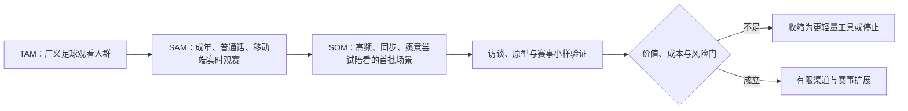
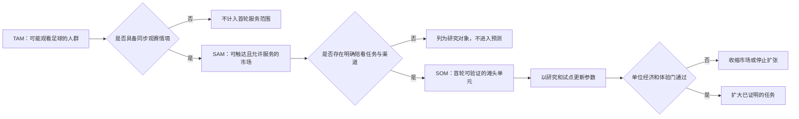
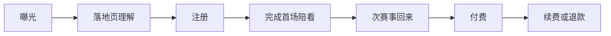
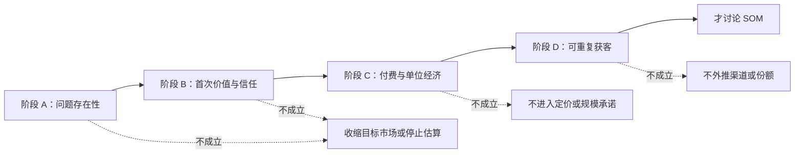

# 目标市场与市场规模估算

> 文档类型：立项决策稿  
> 所属阶段：市场洞察与战略定位  
> 使用时点：确定首个市场、首个场景和首期资金/人力投入之前  
> 更新规则：本文不是市场预测报告。除明确标注为公开事实的内容外，所有数值均为待验证的立项假设；不得把它们写入融资材料、对外宣传或经营预算的既定收入。

> 方案形成时间：2026-01-28。



## 先给结论：先验证一小块“高频、同步、愿意开口”的市场

本项目不应把“所有足球迷”“所有体育用户”或“所有 AI 陪伴用户”当成首期市场。这三个口径看似很大，却混入了大量只看赛果、偶尔刷集锦、只愿免费使用，或对陌生数字人开口说话没有兴趣的人。它们会让 TAM 漂亮，却不能指导产品优先级、获客渠道或成本上限。

首期应定义为：**在中国大陆、以普通话进行交流、已成年、会在比赛进行时或赛后短时间内持续关注足球，并愿意使用手机上的实时陪看服务的用户。** 这不是对所有人的永久排除，而是为了在产品尚未证明“陪看是否比独自看球更有价值”之前，把需求、内容、渠道和风险收敛到可以验证的范围。

立项阶段只需要回答五个问题：

1. 有多少人会在“比赛正在发生”这个窗口里产生足够强的陪看需求？
2. 这些人愿不愿意把语音或文字交给一个有明确边界的数字人，而不是只看资讯、群聊或直播弹幕？
3. 哪些赛事、时段、地域和分发渠道能以可控成本触达他们？
4. 当实时语音、模型调用和内容审核都产生可变成本时，单个付费用户是否还能留下足够贡献毛利？
5. 哪个结果应让团队加码，哪个结果应让团队停止或改做轻量工具？

本文用 TAM、SAM、SOM 三层口径回答“市场可能有多大”，但把它们视为假设校准器，而非结论。真正的首个交付物不是一个大数字，而是一张能被每轮访谈、赛事试运行和小流量实验推翻或修正的参数表。

---

## 1. 这份估算要支持什么决策

市场规模估算常见的失败方式有两种：一种是用宏大的体育产业数字证明“值得做”；另一种是直接拿下载量、社媒播放量或直播间人数乘一个付费率。前者无法告诉团队先做什么，后者把注意力误当成付费意愿。

本估算只服务于下列决策，其他问题不应借它强行得出答案。

| 决策 | 本文要给出的输入 | 不由本文决定的事项 |
|---|---|---|
| 先做谁 | 可被服务的高频观赛人群及其时刻 | 具体人设、对话文案和页面视觉 |
| 先覆盖什么 | 赛事/时段/语言/地域的约束清单 | 某一场比赛是否值得做运营活动 |
| 先从哪里获客 | 可验证渠道的到达成本和转化漏斗 | 某条短视频或投放素材的创意好坏 |
| 定价与免费额度 | 用户价值、可变服务成本、留存共同决定的价格区间 | 一次促销的具体折扣 |
| 是否继续投入 | 有条件的增长门槛与停止门槛 | 团队成员个人偏好 |

因此，文中的市场不是“足球产业”本身，也不是赛事版权、俱乐部赞助、广告或线下票务的总和。市场单位定义为：**一个符合服务边界的用户，在一年内为实时足球陪看服务可支付的净收入机会。** 若未来增加 B 端导播工具、品牌赞助、赛事数据服务或硬件，这些应另建商业模型，不能在本版本中叠加进来。

### 1.1 需要先排除的伪市场

下列人群可以关注，但不得直接进入首期 TAM：

- 只在大赛期间看几场、平时没有观赛习惯的人；
- 只需要比分、赛程、战报或集锦的人；
- 只想和真人球迷在群里聊天、并不接受数字人陪看的用户；
- 未达到服务最低年龄或不适合被主动陪伴式产品触达的人；
- 需要完整比赛直播、解说转播或未经授权的赛事数据再分发的人；
- 只因抽奖、联名或短期热点注册、却从未进入真实陪看场景的人。

排除并不等于这些人没有价值，而是避免把“可曝光的人”写成“可留存、可付费的人”。首期资源稀缺时，真正重要的是找出一群会在重复赛事中反复回来、能描述自己为何需要陪看、并愿意为体验改善付费的人。

---

## 2. 市场口径：先把 TAM、SAM、SOM 说清楚

### 2.1 TAM：理论上可付费的直接需求池

本文的 TAM（Total Addressable Market）定义为：在目标地域与语言范围内，符合年龄与使用边界、具有高频足球观赛兴趣，并在假定价格下可能订阅实时陪看服务的**年化直接收入机会**。

它不是所有体育内容消费，也不是所有足球相关广告预算。其公式为：

```text
TAM 年化收入 = H × P × A

H：满足“高频观赛 + 实时陪看可能性”的目标用户人数
P：其中愿意为该类服务付费的比例
A：单个付费用户的年化实现收入
```

这个定义刻意保守：先把“是否会用”“是否会付费”两个不确定因素放进公式，而不是默认每个足球迷都会订阅。若前期只提供免费体验，则 TAM 仍可用于比较方向，但不能视为收入。

### 2.2 SAM：在首期约束下真实可服务的需求池

SAM（Serviceable Available Market）是在 TAM 之中，产品在首期可以合法、稳定、以可接受体验服务到的部分。它必须受到四类实际约束：

1. **地域与语言。** 首期只处理中国大陆普通话用户，其他语言、跨境支付、当地内容规则和客服能力均不在本期假设内。
2. **赛事与时间。** 不是每一场足球比赛都适合实时陪看。深夜、时差、赛程临时变化、数据延迟和高并发峰值都会影响可服务性。
3. **渠道与终端。** 用户必须能从首期支持的应用商店、网页入口、社群或合作渠道完成发现、注册和支付；不可达渠道不应算进 SAM。
4. **服务边界。** 产品只提供陪看、互动、情绪支持和公开信息理解，不提供比赛画面、未经授权的直播音视频或可替代持牌转播的服务。

公式如下：

```text
SAM 年化收入 = H × S × P × A

S：在赛事、地域、渠道、终端和合规条件下可被持续服务的比例
```

S 不应是一个拍脑袋的“全国覆盖率”。它必须由赛历、目标渠道可触达性、支付路径、服务时间、模型能力和内容治理能力共同验证。

### 2.3 SOM：一个明确期限内可以赢得的份额

SOM（Serviceable Obtainable Market）不是“市场份额想象”，而是团队在指定时间内、用指定预算和渠道，能获得并留住的付费用户数量。为了防止把获客当作自然发生，本文将 SOM 单独写成：

```text
SOM 年化收入 = H × S × O × A

O：在目标期限内可获得并保留的付费用户比例
```

其中 O 已经包含了发现、注册、完成首场陪看、试用转付费、续费和流失后的净结果，不能再与 P 简单相乘。首期建议把期限统一为“启动后的二十四个月”；若改用六个月或十二个月，必须重算而不能横向比较。

### 2.4 三个口径最容易被混淆的地方

| 错误写法 | 为什么错误 | 正确处理 |
|---|---|---|
| 用全国足球爱好者人数当 TAM | 其中包含不看直播、未成年、无支付意愿、无实时需求的人 | 先用行为筛选，再对付费意愿设参数 |
| 用一次赛事峰值在线人数当 SAM | 峰值不等于可重复服务，也没有体现渠道和版权边界 | 按可覆盖赛事窗口、可用终端和稳定供给筛选 |
| 把下载量当 SOM | 下载没有证明首场价值、留存或付费 | 以留存的付费人数和净收入计算 |
| 把广告、硬件、B 端收入加入首期 TAM | 收入机制、买方和销售周期不同 | 分别建立新市场模型 |
| 用竞品融资额反推市场空间 | 融资包含团队、时点、资本市场等因素 | 只把竞品当作需求和替代方案的观察对象 |

---

## 3. 首期目标市场的边界

### 3.1 地域：先限定为中国大陆，不把“中文互联网”混为一谈

首期地域设为中国大陆，是一个运营与研究边界，不是文化判断。这样做的原因是：支付习惯、应用分发、个人信息处理、生成式人工智能内容标识、投诉处理、客服时间和赛事信息来源都需要统一。跨境市场即使使用中文，也会带来独立的税务、支付、隐私、内容与支持成本。

中国大陆互联网用户规模很大这一事实只能说明具备触达基础，不能直接说明数字陪看需求存在。中国互联网络信息中心持续发布的互联网发展统计报告可作为宏观数字基础；具体项目仍需通过一手调研确认足球相关行为与付费意愿。公开来源见文末“外部来源与使用方式”。

### 3.2 年龄：首期以成年用户为设计和投放基线

陪伴式、可长期互动的数字人产品不能把未成年人当作可顺带覆盖的人群。生成式人工智能服务的公开监管要求已明确提出防范未成年人过度依赖或沉迷等风险；这意味着年龄策略不是注册页的一行文案，而会影响主动触达、使用时长、支付、申诉与人工介入方式。[来源 4]

因此首期模型中的 H 默认只计算达到服务最低年龄的用户。任何想扩大年龄覆盖的提案，都需要独立完成：年龄核验方案、监护人机制、内容策略、时长限制、风险评测和法律评审。没有完成这些前置条件时，不可为了扩大市场数字而把未成年人加入 TAM。

### 3.3 赛事：按“重复观赛窗口”而不是按赛事名划分

用户需要的不是某个联赛的标签，而是在比赛前、中、后出现的连续情绪与信息需求。首期应以赛事窗口分类：

- **赛前窗口：** 开赛前的期待、信息确认、阵容变化、独自等待；
- **赛中窗口：** 进球、争议判罚、落后、换人、伤停、长时间僵持等高情绪时刻；
- **赛后窗口：** 情绪收束、观点复盘、共同记忆、下一场提醒；
- **非赛日窗口：** 赛程关注、转会讨论、伤病消息和个人偏好整理。

赛中窗口最能体现实时陪看的差异，也最贵、最容易受延迟和峰值影响。赛前与赛后窗口的即时性较弱，却有助于验证用户是否把产品视为持续关系而不是一次性玩具。模型必须分别记录各窗口的使用频率、成本和付费贡献，不能把所有活跃合在一起。

### 3.4 用户分层：不要只按年龄、性别或城市分层

首期可用“观赛任务”划分市场，而不是先用人口属性划分：

**分层：独自沉浸型**
- **典型任务**：想在关键时刻有人回应，但不想进陌生群聊
- **选择产品的潜在理由**：低社交压力、即时回应、可控陪伴
- **首期优先级**：高

**分层：需要理解型**
- **典型任务**：看得投入，却担心自己看不懂或错过信息
- **选择产品的潜在理由**：用可追溯的解释降低理解门槛
- **首期优先级**：高

**分层：情绪共鸣型**
- **典型任务**：需要分享兴奋、失落或争议感受
- **选择产品的潜在理由**：被理解、被接住，而不是被说教
- **首期优先级**：高，但需严格边界

**分层：信息效率型**
- **典型任务**：只要赛程、比分、摘要和提醒
- **选择产品的潜在理由**：工具效率
- **首期优先级**：中；可能更适合轻量功能

**分层：社群表达型**
- **典型任务**：想与真人球迷建立关系和身份
- **选择产品的潜在理由**：社群归属、创作与讨论
- **首期优先级**：中；数字人不是唯一替代品

**分层：泛娱乐尝鲜型**
- **典型任务**：因热点或数字人新鲜感试用
- **选择产品的潜在理由**：好奇
- **首期优先级**：低；不应用来证明留存

这是一张待检验的假设分层表。每位受访者应被问到“上一次独自看球时发生了什么”“你现在怎么解决”“什么时刻会愿意开口”“什么行为会让你退出”，而不是只问“会不会使用 AI 陪看”。后者容易得到礼貌性的肯定，却不能预测复用。

---

## 4. 外部事实、待验证假设与研究纪律

### 4.1 公开来源只提供边界，不替代用户研究

下表列出立项阶段可使用的公开资料。它们用于建立制度、技术和宏观背景；除非在本文中明确摘录并标注来源，不可据此虚构具体市场数值。

> 信息卡：原宽表已改为纵向阅读，字段含义不变。

- **编号：1**
  - **公开来源**：[中国互联网络信息中心：统计报告入口](https://www.cnnic.net.cn/n4/2024/0322/c88-10964.html)
  - **本文允许使用的结论**：可作为中国互联网接入、移动使用、网络视听等宏观数据的原始出处
  - **不允许推出的结论**：不能直接推出足球迷人数或数字人付费率
  - **访问日**：2026-01-28

- **编号：2**
  - **公开来源**：[FIFA：Football Landscape](https://www.fifa.com/technical)
  - **本文允许使用的结论**：足球拥有跨地域、跨赛事周期的长期参与基础
  - **不允许推出的结论**：不能推出某个中国细分服务的需求或收入
  - **访问日**：2026-01-28

- **编号：3**
  - **公开来源**：[FIFA：2022 世界杯全球受众报告](https://www.fifa.com/fifaplus/en/articles/fifa-world-cup-qatar-2022-engaged-five-billion-fans)
  - **本文允许使用的结论**：大型赛事会产生异常的注意力峰值，峰值与常态应分开测量
  - **不允许推出的结论**：不能把全球赛事触达量套成国内可付费市场
  - **访问日**：2026-01-28

- **编号：4**
  - **公开来源**：[国家互联网信息办公室：生成式人工智能服务管理暂行办法](https://www.cac.gov.cn/2023-07/13/c_1690898326795531.htm)
  - **本文允许使用的结论**：面向公众提供生成式人工智能服务需纳入安全、投诉、未成年人等治理考虑
  - **不允许推出的结论**：不能把合规要求当作需求规模的证据
  - **访问日**：2026-01-28

- **编号：5**
  - **公开来源**：[国家互联网信息办公室：人工智能生成合成内容标识办法](https://www.cac.gov.cn/2025-03/14/c_1743654684782215.htm)
  - **本文允许使用的结论**：数字人、合成音频和相关内容应在产品、协议与分发准备中考虑标识义务
  - **不允许推出的结论**：不能以“有标识”替代用户信任验证
  - **访问日**：2026-01-28

- **编号：6**
  - **公开来源**：[NIST：生成式 AI 风险管理框架配置文件](https://www.nist.gov/publications/artificial-intelligence-risk-management-framework-generative-artificial-intelligence)
  - **本文允许使用的结论**：生成式 AI 的风险控制应贯穿设计、开发、评测与运营
  - **不允许推出的结论**：不直接适用于某项中国法规的合规判断
  - **访问日**：2026-01-28

- **编号：7**
  - **公开来源**：[FTC：对陪伴型聊天机器人的调查公告](https://www.ftc.gov/news-events/news/press-releases/2025/09/ftc-launches-inquiry-ai-chatbots-acting-companions)
  - **本文允许使用的结论**：陪伴型产品应把角色设计、数据处理、未成年人、负面影响监测与商业化激励纳入治理
  - **不允许推出的结论**：不能据此推导中国市场的监管结论
  - **访问日**：2026-01-28

- **编号：8**
  - **公开来源**：[Apple App Review Guidelines](https://developer.apple.com/app-store/review/guidelines/)
  - **本文允许使用的结论**：移动分发需要考虑隐私、订阅、用户生成内容和安全规则
  - **不允许推出的结论**：不能假定任何应用必然获批或自然获得流量
  - **访问日**：2026-01-28

### 4.2 一手研究要回答的不是“市场大不大”，而是参数是否成立

每一个参数都应该有最小研究方案。下表中的样本量、周期和阈值均为**立项假设**，用于控制研究质量，不是公开统计事实。

> 信息卡：原宽表已改为纵向阅读，字段含义不变。

- **参数：高频观赛比例 H**
  - **需要验证的行为**：一个月内观看或跟随比赛的频率、同步性、赛事类型
  - **建议方法**：筛选问卷 + 赛后回访
  - **立项假设的最小证据**：假设：完成 60 份有效筛选、24 份深访、3 个赛事观察窗口
  - **会改变什么决策**：目标人群规模与赛事优先级

- **参数：陪看需求强度**
  - **需要验证的行为**：独自看球的不满、现有替代方案、愿意开口的时刻
  - **建议方法**：情境访谈 + 日记研究
  - **立项假设的最小证据**：假设：至少一半高频受访者能讲出具体重复情境
  - **会改变什么决策**：是否做实时陪看而非资讯工具

- **参数：付费率 P**
  - **需要验证的行为**：愿意为哪些价值付费、价格锚点、免费额度影响
  - **建议方法**：概念测试 + 价格敏感度访谈 + 小额预售
  - **立项假设的最小证据**：假设：用实际支付或可撤销预授权代替口头意愿
  - **会改变什么决策**：订阅、按场、权益包的选择

- **参数：年化收入 A**
  - **需要验证的行为**：月付、赛季包、按场包的实际回收
  - **建议方法**：价格页实验 + 留存观察
  - **立项假设的最小证据**：假设：至少覆盖连续两个赛事窗口
  - **会改变什么决策**：是否具备订阅模型条件

- **参数：可服务比例 S**
  - **需要验证的行为**：渠道能否触达、赛事能否稳定支持、用户能否完成支付
  - **建议方法**：小流量渠道实验 + 端到端演练
  - **立项假设的最小证据**：假设：每个渠道单独计算漏斗
  - **会改变什么决策**：渠道组合与首发范围

- **参数：可获得比例 O**
  - **需要验证的行为**：获客后是否能完成首场价值并持续付费
  - **建议方法**：队列观察
  - **立项假设的最小证据**：假设：观察周期覆盖一个完整赛程节奏
  - **会改变什么决策**：是否扩大投放与团队规模

### 4.3 研究招募与样本偏差

只从朋友、足球群管理员或 AI 从业者中找用户会严重高估理解力与尝鲜意愿。招募要刻意包含：独自观赛者、轻社交观赛者、只看强队的人、跟随本土赛事的人、深夜观赛者、只愿文字互动者以及明确拒绝数字人陪伴的人。

拒绝者不是失败样本，而是边界样本。若拒绝者普遍认为“这像是替代真人”“会打扰我看比赛”“它说错比赛事实就不可信”“我不愿让它记住我”，这些都会直接影响产品范围、隐私策略、默认主动性和可接受的市场大小。

研究记录应区分三类证据：

- **陈述证据：** 用户说自己喜欢或愿意付费，可信度最低；
- **行为证据：** 用户在真实比赛窗口主动打开、持续使用、再次回来；
- **交易证据：** 用户在理解权益和退出方式后实际支付或明确拒付。

市场模型应优先使用后两类证据修正参数。陈述证据只能用于形成假设。

---

## 5. 假设驱动的 TAM / SAM / SOM 情景模型



### 5.1 参数字典

以下所有带数字的值都是**立项假设**，无公开来源，不代表事实或承诺。设置它们的目的，是让团队知道数据回收后应替换哪里，而不是在没有数据时假装精确。

> 信息卡：原宽表已改为纵向阅读，字段含义不变。

- **参数：H**
  - **含义**：高概率需要实时足球陪看的成年用户数
  - **保守情景（假设）**：480 万
  - **基准情景（假设）**：800 万
  - **进取情景（假设）**：1,500 万
  - **首要验证方式**：行为筛选、赛事窗口研究、样本外推审查

- **参数：S**
  - **含义**：可在首期地域、赛事、渠道和终端限制下稳定服务的比例
  - **保守情景（假设）**：45%
  - **基准情景（假设）**：55%
  - **进取情景（假设）**：65%
  - **首要验证方式**：赛历、渠道漏斗、终端可用性与运营能力演练

- **参数：P**
  - **含义**：服务范围内用户对年化陪看权益的付费比例
  - **保守情景（假设）**：2.5%
  - **基准情景（假设）**：5%
  - **进取情景（假设）**：7%
  - **首要验证方式**：实付实验、价格敏感度与续费观察

- **参数：A**
  - **含义**：单个付费用户的年化实现收入
  - **保守情景（假设）**：180 元
  - **基准情景（假设）**：228 元
  - **进取情景（假设）**：288 元
  - **首要验证方式**：价格页、退款、续费和组合购买数据

- **参数：O**
  - **含义**：启动后 24 个月内获得并留住的付费用户比例，占可服务高频人群
  - **保守情景（假设）**：0.3%
  - **基准情景（假设）**：0.8%
  - **进取情景（假设）**：1.5%
  - **首要验证方式**：分渠道队列、留存、自然增长与付费净留存

参数 H 最大、最危险。它不是“全部球迷数”，而是严格筛过“高频、同步、成年、可使用数字陪看”的人群。若只对广义足球兴趣做问卷，H 很可能被高估。P 与 O 也必须分开：P 描述长期服务范围内的可付费倾向，O 描述团队实际在两年内能取得的结果。

### 5.2 情景计算

计算过程全部公开，便于复算。

```text
TAM = H × P × A
SAM = H × S × P × A
SOM（24 个月） = H × S × O × A
```

> 信息卡：原宽表已改为纵向阅读，字段含义不变。

- **情景：保守**
  - **TAM 年化直接收入机会（假设计算）**：2,160 万元
  - **SAM 年化直接收入机会（假设计算）**：972 万元
  - **24 个月 SOM 年化收入（假设计算）**：116.64 万元
  - **对应付费用户数（假设）**：6,480 人

- **情景：基准**
  - **TAM 年化直接收入机会（假设计算）**：9,120 万元
  - **SAM 年化直接收入机会（假设计算）**：5,016 万元
  - **24 个月 SOM 年化收入（假设计算）**：802.56 万元
  - **对应付费用户数（假设）**：35,200 人

- **情景：进取**
  - **TAM 年化直接收入机会（假设计算）**：30,240 万元
  - **SAM 年化直接收入机会（假设计算）**：19,656 万元
  - **24 个月 SOM 年化收入（假设计算）**：4,212 万元
  - **对应付费用户数（假设）**：146,250 人

计算示例（均为基准情景假设）：

```text
TAM = 8,000,000 × 5% × 228 元 = 91,200,000 元
SAM = 8,000,000 × 55% × 5% × 228 元 = 50,160,000 元
SOM = 8,000,000 × 55% × 0.8% × 228 元 = 8,025,600 元
```

这张表的价值不在于“基准为多少万元”，而在于发现杠杆在哪里：若 A 提高却导致 P、O 或留存下降，总收入未必增加；若赛程和渠道导致 S 很低，先做更多功能也无法扩大 SAM；若 O 低于保守情景，则问题可能是需求、首次价值、获客成本或信任，而不是 TAM 不够大。

### 5.3 不能只看收入：还要算可同时在线的服务能力

实时陪看具有强烈的赛事峰值。即使两个产品年收入相同，集中在少数焦点赛事的产品，也会面对更高的语音并发、模型调用、内容审核和客服压力。因此规模模型必须追加容量参数：

```text
峰值并发会话 = 活跃付费用户 × 同场参与率 × 同时在线比例
峰值分钟成本 = 峰值并发会话 × 单会话分钟成本
赛事单位贡献 = 该赛事归因收入 − 推广成本 − 服务可变成本 − 处理与支持成本
```

首期不应把“支持任意热门比赛”的承诺写进市场口径。更安全的做法是选定少量赛事窗口，提前公布服务时间与功能范围，并在每场后复盘峰值。若在小规模下就无法稳定控制延迟、事实可靠性或单位成本，扩大用户只会放大负面体验。

### 5.4 价格不是独立参数

年化实现收入 A 必须来自用户可感知的权益，而不是来自模型成本倒推。候选方案可同时测试：

> 信息卡：原宽表已改为纵向阅读，字段含义不变。

- **方案：免费基础 + 订阅**
  - **用户购买的是什么**：更长陪看、记忆、赛后复盘或个性化权益
  - **优点**：有利于降低首次尝试门槛
  - **主要风险**：免费用户服务成本可能失控
  - **应验证的问题**：用户是否能理解并愿意为权益升级

- **方案：按场权益包**
  - **用户购买的是什么**：某场或某个赛事窗口的实时陪看
  - **优点**：与强情境匹配，价格更具体
  - **主要风险**：可能只在大赛发生，留存弱
  - **应验证的问题**：是否会在第二场主动购买

- **方案：赛季包**
  - **用户购买的是什么**：一段连续赛程的陪看与复盘
  - **优点**：有利于建立习惯和收入可预测性
  - **主要风险**：新产品信任不足时成交困难
  - **应验证的问题**：用户是否愿意在首场前预付

- **方案：品牌/合作补贴**
  - **用户购买的是什么**：免费或低价使用由合作方承担部分成本
  - **优点**：可降低用户支付阻力
  - **主要风险**：容易扭曲陪伴体验和中立性
  - **应验证的问题**：补贴是否改变角色表达或用户信任

首期原则是：任何商业化都不得驱动角色制造焦虑、诱导延长对话、暗示排他关系或把脆弱情绪转成购买压力。伴随关系的产品一旦让用户感觉“它为了卖会员而黏住我”，短期转化可能上升，长期 O 与品牌信任会下降。

---

## 6. 单位经济：市场够大也不等于值得扩张

### 6.1 先把每一位付费用户的贡献写成公式

对于有语音、生成式文本、可能还有合成音频和人工审核的产品，收入不能直接当作毛利。建议使用以下定义：

```text
首年贡献毛利 = 首年实收收入
              − 支付渠道费
              − 模型与语音可变成本
              − 赛事峰值弹性资源成本
              − 人工审核与客服的可归因成本
              − 退款、拒付与优惠补贴

获客回收期（月） = 渠道获客成本 ÷ 月度贡献毛利
```

平台服务费、模型报价、语音时长和审核人力都可能变化，故不应在立项前把某家供应商报价写成永久事实。每个采购、计费或性能实验结束后应更新参数表，并保留版本号。

### 6.2 单位经济的三种假设场景

下表所有金额、月数和比例均为**立项假设**，专门用于说明需要测量哪些变量。它不是成本承诺，也不代表任何供应商的公开报价。

> 信息卡：原宽表已改为纵向阅读，字段含义不变。

- **参数：首年实收收入**
  - **保守（假设）**：180 元
  - **基准（假设）**：228 元
  - **进取（假设）**：288 元
  - **为什么要测**：价格、续费、退款与权益组合共同决定

- **参数：支付与退款损耗**
  - **保守（假设）**：18 元
  - **基准（假设）**：23 元
  - **进取（假设）**：29 元
  - **为什么要测**：不同渠道、优惠和退款政策差异大

- **参数：模型/语音/资源可变成本**
  - **保守（假设）**：96 元
  - **基准（假设）**：78 元
  - **进取（假设）**：72 元
  - **为什么要测**：使用时长、峰值、模型选择和降级策略影响极大

- **参数：人工审核与支持可归因成本**
  - **保守（假设）**：28 元
  - **基准（假设）**：22 元
  - **进取（假设）**：18 元
  - **为什么要测**：风险事件、投诉量与运营策略影响

- **参数：首年贡献毛利**
  - **保守（假设）**：38 元
  - **基准（假设）**：105 元
  - **进取（假设）**：169 元
  - **为什么要测**：用于决定可承受 CAC，而非用于对外宣传

- **参数：渠道获客成本 CAC**
  - **保守（假设）**：72 元
  - **基准（假设）**：65 元
  - **进取（假设）**：55 元
  - **为什么要测**：需按渠道和队列真实归因

- **参数：首年净贡献**
  - **保守（假设）**：-34 元
  - **基准（假设）**：40 元
  - **进取（假设）**：114 元
  - **为什么要测**：决定是否扩大该渠道

这里有一个重要提醒：基准情景即使为正，也不代表业务健康。它没有包含固定研发、人力、品牌、法务、基础设施与管理费用。要进入扩大投放阶段，至少应看到不同赛事、不同渠道、不同使用强度下的贡献结构稳定，而不是靠少数轻度用户把平均成本压低。

### 6.3 使用时长越高不一定越好

普通内容产品可能把时长看作核心成功指标，但实时数字陪看不能这样做。极长的连续对话可能意味着用户获得价值，也可能意味着产品没有帮助用户回到比赛、没有提供收束，甚至形成不健康依赖；同时它会提高可变成本。

因此建议把时长拆成：

- 与比赛关键时刻相关的有效互动时长；
- 用户主动结束后再次回来的比例；
- 用户是否认为产品打扰观看；
- 结束对话后情绪是否更稳定；
- 单位有效互动的成本；
- 主动降级、静默或转文字是否仍能保持满意度。

市场规模模型中的 A 只有在这些体验指标不被牺牲时才成立。若要靠无限语音或情绪绑架才能提升 A，应将该收入视为不可接受而不是可扩张机会。

---

## 7. 赛事、地域与渠道约束如何改变 SAM

### 7.1 赛事约束：产品不能以转播替代品的姿态进入市场

本产品的价值是陪看与理解，不是提供赛事画面或重新分发受权利保护的内容。任何涉及比赛片段、音视频、即时数据、队徽、球员肖像、解说音频或赛事名称的功能，都应在进入开发排期前完成权利来源与使用范围审查。市场模型中不能把“吸引用户的直播内容”当作默认可用资产。

在没有明确授权的情况下，首期可验证的价值包括：用户主动输入的感受、公开可验证的赛事信息的谨慎解释、赛前赛后交流、用户个人偏好和不依赖转播素材的互动。对“实时事实”应建立来源、延迟和不确定性表达规则；若无法确认，就应说不知道或提示用户核对，而不是为了陪聊连续生成。

### 7.2 地域约束：渠道可达不等于用户可服务

即使用户身处目标地域，也可能因为终端性能、网络条件、支付可用性、语音权限、使用场景或无障碍需求而无法获得完整体验。SAM 的 S 至少应拆为下式，而不是单一比例：

```text
S = 赛事可用率 × 渠道可达率 × 注册完成率 × 首场激活率 × 服务合规通过率
```

这里的乘法只是建模结构，具体数值必须由各环节数据填充。若其中任何一项很低，团队应优先修复该约束，而不是用更大的人群基数掩盖漏斗断点。

### 7.3 渠道约束：把“发现”与“信任”分开

候选渠道可以包括内容平台、足球社群、朋友推荐、应用商店搜索、赛事相关合作和自有内容，但每种渠道带来的用户意图不同。短视频热点可能带来大量尝鲜者；熟人推荐可能带来较少但更愿意在真实比赛中开口的用户；应用商店搜索则可能被“比分/直播/资讯”需求截流。

对每个渠道分别记录：



不得将一个渠道的低价注册成本用于证明另一个渠道也可规模化。更不能只因某渠道能带来点击，就让产品角色承诺无法交付的亲密感来换转化。

### 7.4 首发渠道的选择原则

首期渠道应优先满足四件事：

1. 用户能明确理解这是数字人陪看，而非赛事直播、真人客服或博彩建议；
2. 可以测到从内容看到长期留存的完整链路；
3. 可以把高风险人群、投诉和不适配用户及时排除或支持；
4. 流量成本、审核压力和服务峰值不会超过团队处理能力。

不能满足以上条件的“大流量”渠道，只能用于品牌观察，不应直接成为收入规模假设。

---

## 8. 从市场假设到试验：分阶段缩小不确定性

### 8.1 阶段 A：问题存在性，不做规模承诺

目标是验证“独自看球时的陪看问题是否真实、重复且足够痛”。方法包括情境深访、观赛日记和对现有替代方案的观察。此阶段不应展示复杂数字人能力，避免受访者只评价新奇感。

**进入下一阶段的条件（均为立项假设）：** 在 24 位符合筛选条件的深访对象中，至少 12 位能描述近三个月内重复发生的具体情境；至少 8 位愿意在真实赛事窗口尝试一个边界明确的陪看原型；拒绝者的理由能够归纳为少数可解决或可接受的模式。

**停止或转向的条件（均为立项假设）：** 受访者普遍只需要比分、资讯或真人社群；对数字人陪看的接受度只停留在“好玩一下”；或关键需求必须依赖无法取得的转播/版权资产。出现任一情形时，应考虑将产品收缩为赛后复盘、球迷工具或 B 端能力，而不是继续扩张陪伴叙事。

### 8.2 阶段 B：首次价值与信任，不急于定价

目标是验证用户会不会在真实比赛中使用，并在下一场比赛主动回来。实验应覆盖赛前、赛中、赛后，不要只在演示环境里看满意度。重点观察：用户何时开口、何时希望安静、对事实不确定性的容忍度、对主动提醒的接受度，以及是否认为角色越界。

**进入下一阶段的条件（均为立项假设）：** 在至少 3 个预先定义的赛事窗口中，完成首场体验的用户中有不低于 30% 在另一场赛事窗口主动返回；出现事实错误、打扰观看、过度主动或边界不适的反馈均能被记录、解释和处理。

**停止或转向的条件（均为立项假设）：** 回访主要来自工作人员提醒而非用户主动；用户只在新鲜期互动；或每次高峰都出现无法接受的延迟、错误与投诉。此时应先修复体验或选择低实时场景，不应继续买量。

### 8.3 阶段 C：付费与单位经济，不把意愿当收入

目标是确认用户愿意为具体权益支付，并确认用户使用越多不会导致单位经济越差。实验必须给出清晰价格、权益、退款条件和数据处理说明。付费转化只能以实际订单、退款和续费观察为准。

**进入扩大验证的条件（均为立项假设）：** 至少两个不同渠道、两个不同赛事窗口的付费队列都呈现正向首年净贡献；付费不是依赖误导、压力式促销或不健康的情感暗示获得；退款、投诉和安全事件处于事先定义的可处理范围内。

**停止或转向的条件（均为立项假设）：** 只有极低使用量才有正贡献；提高价格就显著降低次赛事回访；或高价值用户的成本、投诉与依赖风险同步上升。出现这些现象，应先重构权益与成本结构，或改用更轻的按场模式。

### 8.4 阶段 D：可重复获客，才讨论 SOM



目标是证明 O 可以在不牺牲信任与产品边界的前提下逐步提升。此时才比较不同渠道的 CAC、付费留存和自然增长。若渠道带来的用户与核心人群不匹配，即使注册量更大也不能计入可扩张 SOM。

建议建立“赛事—渠道—用户分层—成本—结果”五维看板。每次扩大前必须能够回答：本轮新增用户来自哪里、为何会留、为何会付、服务成本是多少、是否出现新的关系或安全风险。答不上来时，暂停扩大。

---

## 9. 决策门槛与停止门槛

市场估算最终必须能产生决策。以下门槛均为**团队在立项阶段可调整的假设**，不代表行业基准；任何修改都应记录原因和新旧版本。

**决策点：需求问题**
- **加码信号（假设）**：高频受访者能讲出重复且具体的独自观赛情境
- **暂停/转向信号（假设）**：需求只指向资讯、比分或真人社群
- **应采取的动作**：调整问题定义，不做陪伴承诺

**决策点：数字人接受度**
- **加码信号（假设）**：用户愿在真实窗口主动互动，且认可边界
- **暂停/转向信号（假设）**：把它视为玩具、骚扰或真人替代品
- **应采取的动作**：降低角色侵入性，重做价值表达

**决策点：赛事范围**
- **加码信号（假设）**：少量窗口已能重复带来回访
- **暂停/转向信号（假设）**：只有单场热点有效，常态赛事无回访
- **应采取的动作**：缩小赛事承诺或转做赛后功能

**决策点：付费**
- **加码信号（假设）**：明确权益下出现实际支付与可接受退款
- **暂停/转向信号（假设）**：只有口头愿意、或付费导致信任下降
- **应采取的动作**：重做权益/价格，不扩大投放

**决策点：单位经济**
- **加码信号（假设）**：多个队列首年贡献为正且成本可解释
- **暂停/转向信号（假设）**：高使用越亏损、或只靠低使用掩盖成本
- **应采取的动作**：先优化模型、语音和服务边界

**决策点：安全与合规**
- **加码信号（假设）**：用户理解数字人身份、数据处理和求助边界
- **暂停/转向信号（假设）**：频繁出现依赖、误导、未成年人或投诉问题
- **应采取的动作**：暂停增长，先完善治理与支持

特别要把“市场大”与“应该继续”分开。即使 TAM 的进取情景很大，只要第一批真实用户不愿回到第二场比赛、无法以健康方式付费，或服务成本不可控，项目就不具备可扩张基础。反过来，若初期 TAM 看起来有限，但某个细分人群有高频回访、明确价值和健康单位经济，反而值得深挖。

---

## 10. 研究更新机制：让这份文档随证据变小或变大

### 10.1 参数版本管理

每次更新只改参数，不改历史。建议维护下表，并在每个版本中注明证据类型：

> 信息卡：原宽表已改为纵向阅读，字段含义不变。

- **参数：H**
  - **当前值**：待调研
  - **证据类型**：空值/假设
  - **样本/周期**：尚未开始
  - **置信度**：低
  - **下次复核触发条件**：完成行为筛选与样本外推审查后

- **参数：S**
  - **当前值**：待调研
  - **证据类型**：空值/假设
  - **样本/周期**：尚未开始
  - **置信度**：低
  - **下次复核触发条件**：完成首批赛事、渠道和终端演练后

- **参数：P**
  - **当前值**：待调研
  - **证据类型**：空值/假设
  - **样本/周期**：尚未开始
  - **置信度**：低
  - **下次复核触发条件**：有实际支付、退款和复购记录后

- **参数：A**
  - **当前值**：待调研
  - **证据类型**：空值/假设
  - **样本/周期**：尚未开始
  - **置信度**：低
  - **下次复核触发条件**：覆盖完整付费周期后

- **参数：O**
  - **当前值**：待调研
  - **证据类型**：空值/假设
  - **样本/周期**：尚未开始
  - **置信度**：低
  - **下次复核触发条件**：至少覆盖一个可重复赛程节奏后

“待调研”不是空白工作，而是诚实地承认目前不知道。任何把低置信度参数写成精确整数、且没有来源和访问日的行为，都应在评审中被退回。

### 10.2 更新节奏

- **每个赛事窗口后：** 更新使用窗口、峰值、成本、事实可信度、投诉与次场回访；
- **每两周：** 审阅访谈、日记和渠道漏斗，更新 H、S 的假设区间；
- **每月：** 复核价格、退款、服务可变成本和渠道 CAC，更新 P、A 与贡献毛利；
- **每个赛程阶段结束后：** 重新计算 SOM，并决定扩大、保持、缩小或停止；
- **规则、平台或供应商发生变化时：** 立即复核地域、年龄、标识、分发与成本假设。

### 10.3 如何处理相互矛盾的证据

如果问卷显示兴趣很高、真实赛事却没有回访，应优先相信行为；如果某渠道付费高、但退款和投诉也高，应拆解用户来源与激励，而不是直接扩量；如果高频用户最喜欢长语音、但成本和依赖风险上升，应寻找能保留价值的短互动、字幕或静默设计，而不是只靠限额粗暴切断。

高质量市场研究的标志不是所有数字都上涨，而是团队能明确说出：哪一个假设被推翻了、为什么推翻、因此下一步不做什么。

---

## 11. 风险清单与保护原则

| 风险 | 会如何污染市场判断 | 预防动作 |
|---|---|---|
| 把大赛热度当常态 | H、P 被一次性注意力显著抬高 | 常态赛程与大赛分开建模，至少比较多个窗口 |
| 把注册当需求 | O 被虚高，后续留存断崖 | 以完成首场、次赛事回访和实际支付为主指标 |
| 用虚构亲密感促付费 | 短期 P 变高，长期信任与安全风险恶化 | 商业化与角色边界分离，禁止情绪施压话术 |
| 忽略语音和模型可变成本 | A 看起来成立，贡献毛利实际为负 | 按用户分层、赛事峰值和互动方式计成本 |
| 依赖未经确认的赛事资产 | S 被错误放大，产品无法按承诺服务 | 先审查权利来源；不确定即不纳入首期范围 |
| 未成年人或高脆弱用户被卷入 | 市场扩大建立在不可接受风险上 | 年龄策略、风险识别、限制与人工支持前置 |
| 公共资料被过度外推 | 用宏观互联网规模替代真实用户行为 | 所有外推写出抽样、区间、假设和反证条件 |

保护原则只有一句：**宁愿在立项阶段把 SAM 算小，也不要靠未验证需求、不可控成本或不健康关系把 SOM 算大。**

---

## 12. 立项评审清单

在决定进入原型开发或扩大验证前，评审人应能对以下问题回答“是”：

- [ ] 市场单位是实时陪看服务的直接收入机会，而不是广义体育产业数字；
- [ ] H、S、P、A、O 的定义、来源、置信度和更新时间均可查；
- [ ] 所有未验证数字都明确标为假设，所有公开数字都有原始 URL 和访问日；
- [ ] TAM、SAM、SOM 没有混入转播、版权、广告、B 端或硬件等不同商业模式；
- [ ] 首期地域、语言、年龄、赛事、渠道与终端边界清楚；
- [ ] 研究计划包含拒绝者、真实赛事窗口和实际支付，而不只有意向问卷；
- [ ] 单位经济已计入语音/模型、峰值资源、审核、支持、退款和渠道成本；
- [ ] 商业化不会依赖诱导依赖、情绪绑架或混淆数字人身份；
- [ ] 已定义继续、暂停、转向和停止的证据门槛；
- [ ] 团队愿意在新证据出现时降低市场数字，而不是只寻找支持自己的材料。

---

## 外部来源与使用方式

1. 中国互联网络信息中心，《统计报告下载》：<https://www.cnnic.net.cn/n4/2024/0322/c88-10964.html>，访问日：2026-01-28。用于获取宏观互联网、移动互联网与网络视听的原始统计口径；不用于直接推导足球陪看付费市场。
2. FIFA，*Football Development / Football Landscape*：<https://www.fifa.com/technical>，访问日：2026-01-28。用于理解足球参与和赛事生态的长期背景；不用于国内细分市场外推。
3. FIFA，*5 billion engaged with FIFA World Cup Qatar 2022*：<https://www.fifa.com/fifaplus/en/articles/fifa-world-cup-qatar-2022-engaged-five-billion-fans>，访问日：2026-01-28。用于提醒大型赛事存在注意力峰值；不用于估算中国用户或收入。
4. 国家互联网信息办公室，《生成式人工智能服务管理暂行办法》：<https://www.cac.gov.cn/2023-07/13/c_1690898326795531.htm>，访问日：2026-01-28。用于确立面向公众的生成式 AI 服务须考虑安全、投诉和未成年人保护等边界。
5. 国家互联网信息办公室，《人工智能生成合成内容标识办法》：<https://www.cac.gov.cn/2025-03/14/c_1743654684782215.htm>，访问日：2026-01-28。用于把合成内容标识纳入数字人产品与分发准备。
6. National Institute of Standards and Technology, *Artificial Intelligence Risk Management Framework: Generative Artificial Intelligence Profile*：<https://www.nist.gov/publications/artificial-intelligence-risk-management-framework-generative-artificial-intelligence>，访问日：2026-01-28。用于构建全生命周期的风险、测量和监测意识；不作为中国法律意见。
7. Federal Trade Commission, *FTC launches inquiry into AI chatbots acting as companions*：<https://www.ftc.gov/news-events/news/press-releases/2025/09/ftc-launches-inquiry-ai-chatbots-acting-companions>，访问日：2026-01-28。用于识别陪伴型产品在角色、商业化、数据、未成年人和负面影响监测上的研究问题；不作为中国监管结论。
8. Apple, *App Review Guidelines*：<https://developer.apple.com/app-store/review/guidelines/>，访问日：2026-01-28。用于了解移动端分发、隐私、订阅和安全的公开规则；具体上架结论仍需以提交时规则和审核结果为准。
