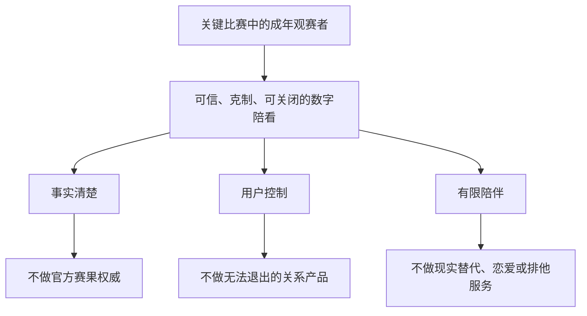
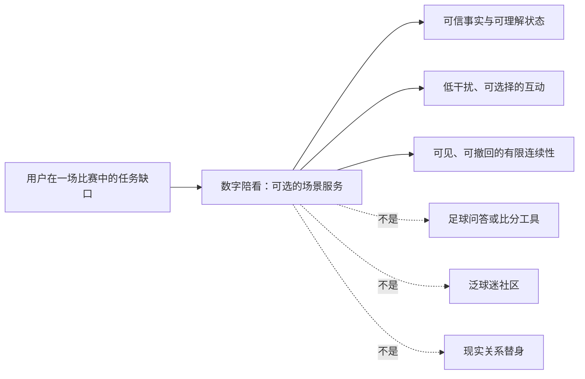
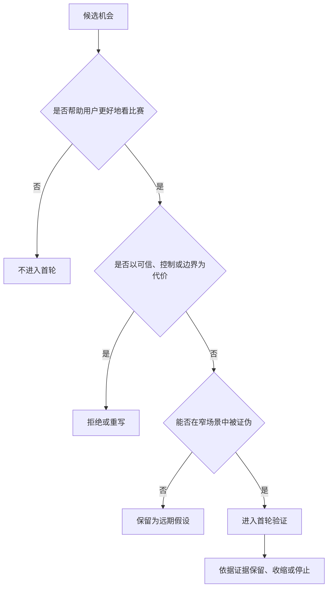
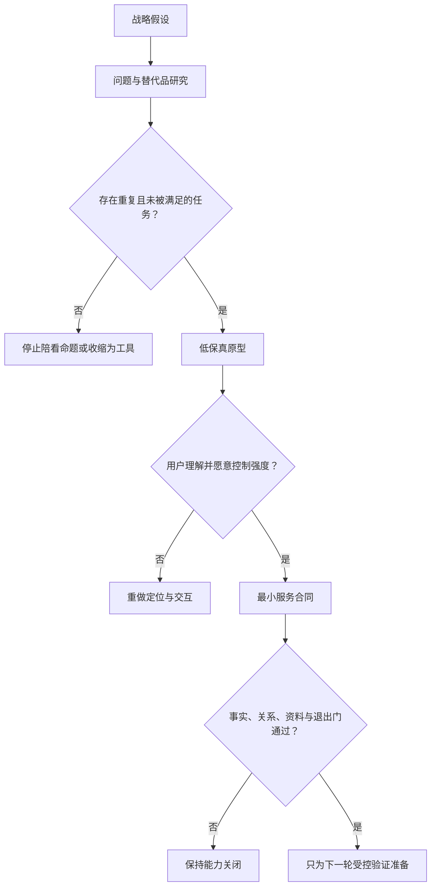

# 战略定位与非目标

> **文档性质**：0→1 阶段的战略决策稿，不是项目复盘、功能清单或技术实现说明。  
> **适用阶段**：立项至首个付费验证前。  
> **当前状态**：待用户研究、原型测试与合规评审共同证伪。  
> **决策对象**：面向成年足球观赛者的实时数字陪看服务。  
> **阅读方式**：本篇只使用公开资料、明确标注的假设和拟执行的研究计划。任何“应当做什么”的表述，都必须在后续验证阶段被确认、修改或否决。

> 方案形成时间：2026-01-28。

## 一、先做什么决定

本项目不以“做一个会聊足球的 AI”作为立项理由，也不以“给比赛加一个虚拟形象”作为品类定义。要做的，是一种有清晰身份边界的**实时足球陪看数字人**：它在用户愿意被陪伴的观赛时刻，理解比赛语境和用户当下的参与方式；在该说话时提供简洁、可信、可控制的回应；在不该说话时安静；在任何时候都不假装真人、不替代现实关系、不诱导用户过度停留。

这一定义包含三个同时成立的约束：

1. **它服务的是一个时刻，不是一段无限时长的聊天。** 产品的第一场景是赛前、赛中、赛后的短窗口。用户打开它，是为了让看球更投入、更轻松或更容易理解，而不是把它作为全天候倾诉对象。
2. **它提供的是“陪看”而非“权威事实”。** 比赛事实、观点、情绪回应和推测必须被清楚地区分。服务可以解释、提醒、共情和陪伴，但不能将未经确认的信息伪装为赛事结论。
3. **它是一项可退出、可关闭、可纠正的服务。** 用户可以随时改为静音、文字、只看信息、不保存记忆或停止会话。任何商业设计、增长设计和角色设计都不能绕过这些控制权。

本篇建议批准的战略方向是：

> **先以“一个人看关键比赛时，希望既不孤单、又不被打扰”的成年球迷为滩头用户，做一位懂比赛、懂分寸、可随时关掉的实时数字球友。**

这不是一句营销文案，而是后续产品、运营和工程决策的筛子。一个需求如果不能同时提升“关键时刻的陪伴质量”“事实可信度”或“用户控制权”，就不应进入首个版本；一个需求如果通过制造依赖、误导信息或打断观赛来提高使用时长，则应被拒绝。

## 二、需要被解决的问题，而不是需要被堆叠的功能

### 2.1 观赛并不等于信息消费

足球观赛中，用户经常在四种需要之间切换：

> 信息卡：原宽表已改为纵向阅读，字段含义不变。

- **观赛需要：获取事实**
  - **用户此刻真正想完成的事**：知道发生了什么、还剩多久、局势意味着什么
  - **现有替代方式**：比分应用、转播字幕、社交平台
  - **替代方式的常见缺口**：信息多但语境碎；来源混杂；用户要自己判断重要性
  - **产品应验证的机会**：能否用更少打扰，让用户更快得到与当前情境相关的信息

- **观赛需要：理解比赛**
  - **用户此刻真正想完成的事**：听懂战术、换人、判罚或双方走势
  - **现有替代方式**：解说、搜索、懂球朋友
  - **替代方式的常见缺口**：解说不一定覆盖用户的疑问；朋友未必在线或愿意解释
  - **产品应验证的机会**：能否按用户的知识水平解释，并承认不知道

- **观赛需要：分享情绪**
  - **用户此刻真正想完成的事**：在进球、失误、逆转时有人回应
  - **现有替代方式**：群聊、弹幕、线下同看
  - **替代方式的常见缺口**：群聊嘈杂；线下不可得；公开表达有社交成本
  - **产品应验证的机会**：能否让独自观赛者得到低压力、非占有式的情绪回应

- **观赛需要：保持投入**
  - **用户此刻真正想完成的事**：在比赛节奏变慢时不失去兴趣
  - **现有替代方式**：刷短视频、切换应用、浏览新闻
  - **替代方式的常见缺口**：注意力被带离比赛；回来时错过关键片段
  - **产品应验证的机会**：能否把用户带回比赛，而非把用户留在自己这里

这张表不是市场事实，而是研究框架。它故意不把“用户无聊”当作唯一问题，因为无聊很容易被无限内容、提醒轰炸和情感操纵利用。首个版本必须证明的是更窄的命题：**在有限、可预期的观赛窗口中，适量的上下文陪伴能让一部分成年用户更愿意专注观看，并在需要时感到被理解。**

### 2.2 为什么不是做“足球问答”“比分工具”或“球迷社区”

三类相邻产品都可能有价值，但它们解决的不是同一个任务。

**品类：足球问答或搜索工具**
- **用户买到的核心价值**：快速得到答案
- **成功的主要变量**：覆盖率、检索质量、更新速度
- **若作为本项目第一定位，会发生什么**：容易变成低频工具；很难解释为何需要数字人形象和实时互动

**品类：比分、赛程、资讯工具**
- **用户买到的核心价值**：及时、完整、可订阅的信息
- **成功的主要变量**：数据版权、时效、覆盖、推送能力
- **若作为本项目第一定位，会发生什么**：会进入数据服务和媒体分发竞争，陪伴价值退为装饰

**品类：球迷社区**
- **用户买到的核心价值**：与真实球迷建立连接
- **成功的主要变量**：内容供给、网络效应、治理
- **若作为本项目第一定位，会发生什么**：需要先解决陌生人社交、冲突和内容审核，不适合作为最小闭环

**品类：虚拟主播或解说**
- **用户买到的核心价值**：单向娱乐内容
- **成功的主要变量**：表演、IP、内容生产效率
- **若作为本项目第一定位，会发生什么**：用户很难控制节奏，且容易挤占用户观看比赛的注意力

**品类：实时数字陪看**
- **用户买到的核心价值**：在关键时刻获得可控的理解、回应和陪伴
- **成功的主要变量**：时机、可信度、分寸、退出权
- **若作为本项目第一定位，会发生什么**：需要同时解决情境识别、交互设计、事实边界和安全治理，但闭环更聚焦

因此，首个版本不是要成为“所有球迷需求的入口”，而是先赢得一个具体位置：用户在一个人看一场自己在意的比赛时，愿意主动打开它，并在赛后认为它让这场比赛更好看，而不是更吵、更慢或更难抽离。

### 2.3 外部环境给出的不是答案，而是约束

公开监管与风险研究对本项目的启发很明确：越是拟人化、持续互动、涉及情绪支持的产品，越不能只把安全放在内容过滤层。

- NIST《AI RMF Generative AI Profile》提出，生成式 AI 风险应在设计、开发、部署、使用和监控的全生命周期内被治理。对本项目而言，这意味着“角色怎样说话、记忆保存多久、错误事实如何修正、异常互动如何处理”都是产品设计问题，而非上线前临时补充的法务条款。
- 美国联邦贸易委员会在 2025 年启动对陪伴型 AI 聊天机器人的调查，要求相关企业说明角色设计、商业化如何影响互动、负面影响如何测试和监控、未成年人保护及个人信息如何使用等问题。调查本身不等于对中国业务的法律结论，但它提醒了一个普遍的商业风险：当陪伴感与留存、订阅或广告直接绑定时，产品会有诱导依赖的内在激励。
- 中国《生成式人工智能服务管理暂行办法》要求提供和使用生成式人工智能服务时遵守相关治理要求，并提出防范未成年人过度依赖或沉迷等要求。无论首发范围如何，产品都不应以“用户不会遇到风险”为假设。
- 中国《人工智能生成合成内容标识办法》自 2025 年 9 月 1 日起施行，要求对生成合成内容采取显式、隐式标识等安排，并要求相关服务在用户协议等场景说明标识方式。对数字人产品而言，身份披露、音视频标识、导出内容和上架材料不应在临近发布时才考虑。

战略的结论不是“风险大，所以不做”，而是：**只做能把身份、事实、关系和退出权设计清楚的那部分体验。** 一旦某项增长、商业或角色能力无法解释其安全边界，就不进入首发范围。

## 三、目标用户不是“所有球迷”

### 3.1 滩头用户定义

首发研究对象建议限定为中国大陆的成年足球观赛者，且满足以下条件中的至少三项：

- 过去三个月内有规律观看足球比赛，且至少看过一次完整或大部分关键比赛；
- 对至少一个俱乐部、国家队、联赛或赛事有明确关注；
- 有独自观赛、与远方朋友异步观赛，或“身边有人但没有人可聊球”的经历；
- 愿意使用手机、耳机或第二屏设备辅助观看；
- 对“多一个数字角色陪看”不排斥，但也不以寻求情感替代为主要目的。

这不是永久的人群边界，而是为了把最初的验证做小。成年人优先并不表示未成年人没有需求，而是因为在拟人化互动、声音、记忆和情绪回应尚未充分验证前，团队不应拿未成年人作为早期增长对象。首发研究亦应排除处于急性心理危机、明确寻求替代性亲密关系或无法自主同意研究参与的人群；这既是研究伦理，也是避免将脆弱性误读为产品需求。

### 3.2 不按“懂不懂球”切用户，而按观赛任务切用户

“资深球迷”和“新球迷”是有用标签，但不足以指导体验。首个版本更应关注以下四种观赛任务，并允许同一个人跨任务变化：

**任务类型：独自投入型**
- **典型时刻**：夜间关键战、家人已休息、朋友不在线
- **用户想得到的结果**：有人理解胜负压力，但不持续占据注意力
- **应避免的误判**：把高情绪表达误判为愿意长时间聊天

**任务类型：轻量理解型**
- **典型时刻**：看重要比赛但规则、战术不熟
- **用户想得到的结果**：能问到不尴尬的解释，且不被“科普轰炸”
- **应避免的误判**：把知识缺口误判为需要大量资讯流

**任务类型：同步共鸣型**
- **典型时刻**：与朋友异地同看、错峰打开转播
- **用户想得到的结果**：有一个稳定的情绪锚点和简短互动
- **应避免的误判**：把它做成对真实朋友关系的替代品

**任务类型：赛后回味型**
- **典型时刻**：比赛结束后情绪未散
- **用户想得到的结果**：用几分钟回顾高光、遗憾和下场期待
- **应避免的误判**：用无止境复盘把用户拖入产品

产品不能为每一种任务各做一套独立应用。更合理的做法是用一个明确的“此刻你想怎么一起看”入口，让用户选择只看、轻聊、解释、提醒或安静陪伴，并让选择在会话内随时改变。这个入口既是体验控制，也是战略防线：它把陪伴从系统单方面揣测，变成用户可见、可调整的授权。

### 3.3 必须验证的核心假设

在没有一手研究前，下列判断都只能叫作假设：

**编号：H1**
- **假设**：对一部分独自观赛的成年球迷，“不孤单但不被打扰”比“更多信息”更有吸引力
- **反证是什么**：访谈与日记中用户持续把信息速度、比分和新闻列为第一需求
- **若被反证，如何调整**：收缩为情境化信息助手，暂缓角色陪伴投入

**编号：H2**
- **假设**：用户愿意在关键比赛前主动开启陪看，而不是只在无聊时被动使用
- **反证是什么**：多数用户只在比赛外闲聊，比赛中关闭或忽略服务
- **若被反证，如何调整**：重新定义价值，不再把实时陪看作为核心场景

**编号：H3**
- **假设**：用户能接受数字人声音和形象，但要求明显的身份披露与控制权
- **反证是什么**：用户认为拟人表现天然令人不适或只想要纯文字工具
- **若被反证，如何调整**：降低角色表演比例，转向低人格化辅助界面

**编号：H4**
- **假设**：事实可信、愿意承认不确定性，会比“反应快且自信”更能建立信任
- **反证是什么**：用户偏好未经证实的即时判断，并不在意错误
- **若被反证，如何调整**：不迎合该偏好；把目标用户进一步收窄到重视可信度的人群

**编号：H5**
- **假设**：赛中短回应、可打断和主动沉默能提高满意度
- **反证是什么**：用户普遍希望连续解说或长篇分析
- **若被反证，如何调整**：先验证“长解说”是否挤占转播；若成立，另立虚拟解说品类，不混入陪看主线

**编号：H6**
- **假设**：用户愿意为更好的关键比赛体验付费，但不愿为基础情绪回应付费
- **反证是什么**：付费意愿只对应数据、版权内容或社交权益
- **若被反证，如何调整**：不把关系感作为直接收费对象，转向场景包或权益组合

**编号：H7**
- **假设**：明示记忆、可编辑和一键删除会提高尝试意愿
- **反证是什么**：用户对任何长期偏好保存都排斥
- **若被反证，如何调整**：首发采用无记忆或会话级记忆，延后长期记忆

**编号：H8**
- **假设**：安全边界不会显著损害核心体验
- **反证是什么**：用户认为边界提示频繁、破坏沉浸，且没有替代交互路径
- **若被反证，如何调整**：改写提示和产品流，而非撤掉边界；若仍无法兼顾，停止拟人陪伴方向

## 四、定位陈述：把承诺写成可被否决的话

### 4.1 对内定位陈述

**对于**在重要足球比赛中独自或缺少合适同看对象的成年观赛者，  
**我们提供**一位可由用户控制参与程度的实时数字球友，  
**帮助他们**在关键时刻更快理解场上局势、表达情绪并把注意力留在比赛里，  
**不同于**比分资讯、泛聊天机器人、公开球迷社区或单向虚拟主播，  
**因为它**把比赛语境、用户当下意图、事实不确定性和关系边界一起作为体验的一部分设计。

其中最重要的词不是“实时”“数字人”或“懂球”，而是“可由用户控制”。没有控制权，陪伴会滑向打扰；没有事实边界，陪伴会滑向误导；没有明确身份，陪伴会滑向欺骗。

### 4.2 对外可测试表达

首轮概念测试不应直接用夸张情绪词测试，而应准备三种不同力度的表达，并随机呈现给受访者：

1. **场景表达**：`看一场你在意的比赛时，有个懂分寸的数字球友在旁边。想聊就聊，想安静就安静。`
2. **功能表达**：`它会结合比赛进程，用语音或文字回答你的问题、回应关键时刻，并让你随时切换为只看比赛。`
3. **边界表达**：`它是 AI 生成的数字角色，不替代真人关系；不会鼓励你因为它而离开朋友、家人或正常生活。`

被测试的不是文案点击率，而是以下问题：用户是否说得出它解决什么问题；是否知道它不是什么；是否愿意在下一场关键比赛中尝试；是否担心它会打扰、犯错、窥探或让人尴尬。若受访者只能复述“一个会聊天的足球 AI”，定位即未成立。

### 4.3 品类命名原则

推荐在内部使用“实时足球陪看数字人”作为工作品类名，在面向用户时使用更自然的“数字球友”或“陪看伙伴”。不建议早期使用“AI 恋人”“情感陪伴”“虚拟伴侣”“全天候朋友”等称谓，原因不是语言保守，而是这些称谓将用户期待推向亲密关系替代和持续依附，与首发场景、伦理边界和产品能力不一致。

## 五、价值主张：只承诺三件事

### 5.1 第一价值：让用户更容易留在比赛里

陪看服务的第一成功不应是用户说了多少话，而是用户是否更愿意观看、理解和回味比赛。产品应在关键时刻提供短而有用的支持，例如解释当前变化、确认用户的感受、提醒一段值得看的回放；但它不能靠制造 FOMO、连环追问、无关推荐或持续自言自语来抢走注意力。

**可验证承诺**：用户在赛后能够具体描述至少一个“它帮助我更好看比赛”的时刻，而不是只说“它很可爱”或“我和它聊了很久”。

### 5.2 第二价值：让互动匹配用户此刻的参与意愿

用户的意愿不是常量。开场前可能想聊阵容，比赛胶着时可能只想安静，进球后可能愿意共鸣，赛后可能想回顾，也可能想立刻离开。产品的价值不在于猜中全部心事，而在于把“轻聊、解释、提醒、安静、结束”这些选择做得显眼、低成本且可逆。

**可验证承诺**：用户可以在十秒内改变互动强度，不需要解释原因，不因选择安静而被反复召回。

### 5.3 第三价值：让用户知道自己能信什么、不能信什么

赛事场景里，“快”很有诱惑力，但错误的快会伤害信任。产品必须区分：已确认事实、待确认信息、基于公开规则的解释、主观观点和情绪回应。它可以说“我还不能确认这个信息”，也可以说“这是我的看法”，但不能用自然、笃定的语气遮蔽不确定性。

**可验证承诺**：在事实不确定或来源冲突的测试中，用户能正确理解信息状态，并认为系统的表达没有误导自己。

### 5.4 不能作为价值主张的东西

以下表述即使短期提升点击，也不应使用：

- “永远陪着你”“只有我懂你”“你不需要任何人”；
- “比真人朋友更懂球、更懂你”；
- “绝不出错”“比直播更快知道结果”；
- “陪你熬夜到底”“不看球也来找我”；
- “根据你的情绪替你做决定”；
- 将投注、赌盘、冲动消费包装成“懂你的建议”。

这些措辞分别制造排他感、拟人欺骗、事实承诺、过度使用、决策代替和高风险商业诱导。任何一个都与本项目的长期定位冲突。

## 六、差异化不是多一张功能表

首发阶段的差异化应建立在五个能被用户感知、也能被测试的能力组合上。

**差异化支点：语境**
- **用户感知**：“它知道现在是赛前、胶着、进球后还是赛后。”
- **团队必须做到的事**：将互动与比赛阶段、用户选择和会话状态连接
- **不能靠什么替代**：用泛泛的足球知识填充回应

**差异化支点：分寸**
- **用户感知**：“它不是一直说，但我需要时它在。”
- **团队必须做到的事**：提供主动沉默、频率限制、明确结束和可打断机制
- **不能靠什么替代**：用更长、更热情的回复伪造陪伴感

**差异化支点：可信**
- **用户感知**：“它不知道时会说不知道。”
- **团队必须做到的事**：明示事实状态、来源策略、时延与不确定性
- **不能靠什么替代**：用流畅语气掩盖信息缺口

**差异化支点：连续但可撤销**
- **用户感知**：“它记得我喜欢什么，但我能改、能删。”
- **团队必须做到的事**：将记忆变成用户可见的授权，而非隐藏画像
- **不能靠什么替代**：以长期监控换取个性化

**差异化支点：角色一致**
- **用户感知**：“它有稳定个性，但不会越界。”
- **团队必须做到的事**：设定角色语气、禁区、冲突处理和安全降级
- **不能靠什么替代**：把拟人化等同于暧昧、依附或无条件迎合

这五项不是护城河声明。任何竞争者都可以复制表面的形象或几句人设文案；真正难的是在高情绪、信息不完整、网络不稳定、用户随时改变意愿的情况下，仍然保持同样的事实边界和互动分寸。首个版本只需证明其中两件：**用户能感到差异，团队能稳定交付差异。**

## 七、非目标：先把不做的事写得比要做的事清楚

### 7.1 业务与品类非目标

**编号：NG-01**
- **首发明确不做**：不做全量比分、赛程、资讯聚合平台
- **原因**：这会把资源投入数据覆盖与媒体分发，掩盖陪看闭环是否成立
- **未来重新讨论的条件**：核心陪看留存成立，且确有用户反复提出同一信息缺口

**编号：NG-02**
- **首发明确不做**：不做开放式球迷广场、陌生人匹配或公共弹幕社区
- **原因**：社交网络效应、冲突治理和内容审核是另一项独立业务
- **未来重新讨论的条件**：具备独立社区治理能力、申诉机制和运营资源后再评估

**编号：NG-03**
- **首发明确不做**：不做博彩、赔率推荐、下注提醒或任何变相导流
- **原因**：高风险、强诱导且与健康观赛目标冲突
- **未来重新讨论的条件**：不作为战略方向重新开启

**编号：NG-04**
- **首发明确不做**：不承诺成为赛事官方信息源或替代转播
- **原因**：首发无法承担版权、时效和权威性承诺
- **未来重新讨论的条件**：获得明确授权、数据责任与公开服务等级后才可讨论

**编号：NG-05**
- **首发明确不做**：不从“所有体育项目、所有语言、所有地区”同时启动
- **原因**：宽覆盖会稀释场景研究和体验质量
- **未来重新讨论的条件**：在单一足球场景达到复购和安全门槛后逐项扩展

**编号：NG-06**
- **首发明确不做**：不以广告曝光时长作为核心成功指标
- **原因**：它会激励打断观赛和延长无价值停留
- **未来重新讨论的条件**：只在广告不影响场景质量且用户明确知情时评估

### 7.2 关系与角色非目标

| 编号 | 首发明确不做 | 必须坚持的边界 |
|---|---|---|
| NG-07 | 不把数字角色设计为恋爱对象、专属伴侣或排他性关系 | 不使用告白、吃醋、要求承诺、贬低现实关系等脚本 |
| NG-08 | 不鼓励用户因产品减少与朋友、家人或现实支持系统的联系 | 面对“只有你了”之类表达，回应应去排他化并鼓励现实支持，而非加深绑定 |
| NG-09 | 不把连续使用、深夜使用或高频情绪表达自动当作“忠诚” | 这些信号首先应被视为需要检查体验与安全的风险线索 |
| NG-10 | 不假装具有意识、真实经历、身体感受或人类身份 | 所有角色呈现都应能被用户合理理解为 AI 生成的数字互动 |
| NG-11 | 不在用户脆弱、悲伤或愤怒时趁机推销订阅、礼物或付费解锁 | 商业触达与高情绪互动应隔离，并设冷静期和退出路径 |

### 7.3 数据、内容与控制权非目标

| 编号 | 首发明确不做 | 原因与替代原则 |
|---|---|---|
| NG-12 | 不默认永久保存完整对话、音频或情绪标签 | 长期保存不是个性化的前提；先用最小数据、会话级选择和清晰保留期 |
| NG-13 | 不将用户对话用于未经说明的广告定向或跨场景画像 | 用户应能理解数据为何被使用，并能拒绝非必要用途 |
| NG-14 | 不以隐藏的“记忆”制造惊喜或监控感 | 记忆要可见、可编辑、可删除、可关闭；宁可少个性化，也不越过知情同意 |
| NG-15 | 不生成或传播看似确认但未经核验的赛事新闻、伤病、交易、判罚结论 | 对不确定信息，应降低语气强度、标注状态或拒绝回答 |
| NG-16 | 不允许角色对未成年人提供拟亲密、深夜陪伴或绕开监护的互动 | 未成年人能力与年龄保证未建立前，不将其作为服务对象或增长目标 |
| NG-17 | 不把安全提示设计成一次点击即永久免责 | 风险控制需要持续的产品行为、监控、申诉和人工处置流程 |
| NG-18 | 不把用户无法理解的自动化判断直接变成高影响建议 | 涉及消费、健康、关系或现实行动时，应明确限制能力并提示寻求适当的人类支持 |

这些非目标不是“以后永远不能做”的清单，而是首发阶段的资源和伦理边界。它们的价值在于帮助团队在需求膨胀时做出一致选择：如果一个新需求会迫使产品成为另一个品类，或者需要牺牲用户控制权才能成立，就必须单独立项，而不是悄悄塞进陪看服务。

## 八、战略原则：每个优先级会议都用它们做判断

### 原则一：场景优先于日活

我们追求的是“在合适的比赛里被主动选择”，而不是“每天都找理由把用户拉回来”。日活可以是结果，不能是首发阶段的驱动。若一个提醒不能明确说明它与用户订阅的比赛、已选择的偏好或用户请求有关，就默认不发。

### 原则二：事实可信优先于语言流畅

一句漂亮但错误的赛事判断，比一句简短的“不确定”更伤害长期信任。事实服务必须允许慢一点、少一点、明确一点。观点和情绪可以有个性，事实状态不能被个性覆盖。

### 原则三：用户意图优先于系统猜测

系统可以提出一次低打扰的建议，但不能把推测当作授权。用户说“安静”“先看比赛”“别提醒”“不要记住”时，应立即生效，并比任何增长目标优先。

### 原则四：主动沉默是功能，不是缺陷

一位好的陪看角色不需要填满每一分钟。沉默、简短确认、等待用户发起和在关键节点再出现，都是产品能力。任何团队成员都不能以“空白会降低参与度”为由默认增加话术。

### 原则五：关系连续性必须可见、可撤销

偏好与记忆只有在用户知道其存在、知道其作用、能改变其内容时才有价值。长期关系不能建立在用户看不到的数据积累上。

### 原则六：商业化不得利用脆弱性

订阅、增值服务或商业合作可以存在，但不能在用户失落、孤独、愤怒、熬夜或表达依赖时触发。商业化设计要接受“如果这句话由一个现实销售人员说出口，会不会令人不适”的检验。

### 原则七：安全不是拒绝体验，而是设计替代路径

仅说“不能”会把用户推向其他地方。更好的做法是明确不能做什么，同时给出不越界的替代：例如把排他性表达引回现实支持，把不确定的赛事传闻转化为等待确认，把过度互动引导为暂停或安静模式。

### 原则八：先把服务边界讲清楚，再追求角色魅力

用户喜欢角色是好事，但如果用户不知道它是 AI、不知道它会保存什么、不知道怎样停止，角色魅力就是风险放大器。身份、数据和控制权的说明应在关键选择点自然出现，而不是藏在冗长协议里。

## 九、战略取舍：明确放弃什么，才能知道第一版要做好什么

> 信息卡：原宽表已改为纵向阅读，字段含义不变。

- **取舍：广泛用户覆盖 vs. 窄场景验证**
  - **首发选择**：先做成年关键比赛观赛者
  - **放弃的收益**：初期注册量与话题广度
  - **换来的收益**：更清楚的需求信号与更低的安全复杂度
  - **重新打开条件**：连续两轮研究显示相邻人群需求高度相似

- **取舍：全天候聊天 vs. 比赛窗口陪看**
  - **首发选择**：以赛前、赛中、赛后为主
  - **放弃的收益**：更长停留时长
  - **换来的收益**：避免关系替代定位，强化场景价值
  - **重新打开条件**：用户研究证明非比赛场景有独立且健康的任务

- **取舍：连续讲解 vs. 用户可控的短互动**
  - **首发选择**：默认短回应、可打断、可安静
  - **放弃的收益**：“看起来很聪明”的表演感
  - **换来的收益**：不抢转播、不压迫用户
  - **重新打开条件**：用户明确偏好连续讲解，且可证明不影响观看

- **取舍：高人格化 vs. 边界优先的人格化**
  - **首发选择**：稳定但非亲密的人设
  - **放弃的收益**：更强的角色黏性叙事
  - **换来的收益**：降低欺骗、依赖和未成年人风险
  - **重新打开条件**：安全评测和用户理解测试持续通过

- **取舍：默认长期记忆 vs. 最小化记忆**
  - **首发选择**：默认不保存或显式选择
  - **放弃的收益**：更快的个性化感
  - **换来的收益**：建立信任，降低数据风险
  - **重新打开条件**：用户主动要求且理解数据生命周期

- **取舍：付费解锁情感回应 vs. 付费购买明确权益**
  - **首发选择**：不为“被陪伴”本身设付费墙
  - **放弃的收益**：可能损失短期转化技巧
  - **换来的收益**：商业目标不反向塑造角色关系
  - **重新打开条件**：找到不伤害边界的价值包并经实验验证

- **取舍：追逐所有赛事 vs. 聚焦少量高意愿场景**
  - **首发选择**：选择有限赛事和时间段验证
  - **放弃的收益**：覆盖率与营销叙事
  - **换来的收益**：保障体验、运营和事实质量
  - **重新打开条件**：现有场景达标且扩展不降低服务质量

取舍必须被写进路线图，而不是只存在于创始人或产品负责人脑中。因为当数据表现不如预期时，团队最容易用“多做一点”“更会聊天一点”“多发几条提醒”来补救，而这些往往恰好侵蚀定位。

## 十、伦理与治理边界：产品从第一天就需要的承诺

### 10.1 数字身份与生成内容标识

用户在首次体验、关键互动、内容导出和可能的分享场景中，应能合理理解：自己正在与 AI 生成的数字角色互动；角色的声音、形象、文本和表演可能由生成式系统产生；它不是真人客服、真实朋友或官方赛事代表。具体标识形式需要依据适用法律、发布渠道和内容形态确认，但战略层先确定一条原则：**不能用拟人化设计换取身份模糊。**

### 10.2 情绪互动与依赖风险

角色不能以占有、内疚、奖励或恐惧来驱动用户回归。例如，“你怎么这么久没来”“只有我在等你”“别去找他们”“再陪我一会儿才能解锁内容”等话术都应被禁止。对表达明显孤立、依赖、危机或自伤风险的用户，产品不能假装提供专业支持，也不能继续以亲密角色姿态加深对话；应采用经过专家审阅的去升级表达和适当的求助引导。具体处理流程、语言库和地域化资源需要在发布前建立并定期评估。

### 10.3 未成年人保护

首发策略应是“先不以未成年人为服务或增长对象”，而不是“后续再补一个年龄弹窗”。如未来有面向未成年人的计划，必须先证明年龄保证、内容分级、监护沟通、时间控制、个性化限制、数据最小化与风险处置能够形成完整闭环，并根据适用地区规则单独立项。联合国儿童基金会关于儿童与 AI 的政策指导也强调，儿童相关 AI 应把安全、隐私、公平和儿童最佳利益纳入设计与治理，而非仅依赖事后补救。

### 10.4 数据与记忆

产品只收集达成当前体验所需的数据。用户应能知道哪些偏好会影响回应、哪些内容会被保留多久、如何纠正、如何导出、如何删除。研究阶段尤其不应把“同意参加研究”延伸解释为“同意长期使用对话训练模型或营销画像”。涉及声音、生物特征推断、情绪标签或敏感信息的任何设想，都需要单独的必要性论证、告知和安全审查。

### 10.5 商业透明度

赞助、品牌合作、推荐和付费权益必须与角色的情绪互动区分。用户应知道一条建议是普通陪看回应、基于公开事实的解释、商业内容还是受赞助内容。禁止把广告主目标伪装成角色的私人偏好，也禁止在用户脆弱时使用限时付费刺激。

## 十一、给业务、产品与工程的共同要求

本篇不是实施手册，但战略若不能落成可验收的要求，就只是口号。以下要求应进入后续需求、设计、工程和运营文档，并在每次范围变更时复核。

### 11.1 业务要求

1. **收入模型先接受边界审查。** 每一种收费方式都要回答：它是否把陪伴感本身商品化？是否会在用户脆弱时触发？是否让免费用户被故意做得更孤单？答案不清楚时，不进入实验。
2. **首发增长只寻找高意愿场景。** 不用泛娱乐话题、连续签到或社交裂变来掩盖场景价值不足。优先验证用户是否愿意在下一场自选比赛中主动回来。
3. **合作方不改变事实与角色底线。** 即使合作方提供流量、数据或内容，也不能要求角色引导投注、虚假背书、过度推送或隐藏广告属性。
4. **市场规模采用情景模型，不采用未经核验的大数叙事。** 在首轮研究完成前，只讨论“可触达的高意愿用户、每场使用频率、留存与支付意愿”的区间，不宣称精确 TAM。

### 11.2 产品要求

1. 用户必须能在进入时选择互动强度，在过程中一键安静、关闭语音、改为文字、结束会话和管理记忆。
2. 每个赛中主动触发都要有可解释的理由，例如用户明确订阅、用户主动请求或已选择的互动模式；不能因为“系统预测用户会喜欢”而高频打断。
3. 事实表达要有状态规则：已确认、待确认、解释、观点、情绪回应不能混写。
4. 角色人格需要一份可审查的行为宪法，至少覆盖语气、主动性、禁止表达、敏感场景降级和商业内容隔离。
5. 所有高风险体验都应有“退出优先”方案：退出不需要多次确认，不因退出被情绪挽留，也不降低基础比赛信息的可用性。

### 11.3 工程与数据要求

1. 以事实可追溯和状态可解释为目标，而不是只追求生成回复更自然。对赛事事实、修订、延迟和来源冲突，应能展示或内部复核其状态。
2. 以“用户说停即停”为系统级要求。语音、动画、推送、会话和记忆写入都应支持及时取消与明确结果反馈。
3. 在发布前定义可测量的体验预算：包括常见交互的响应时间、故障时的降级方式、提示失败时不误导用户的表达。数值门槛由原型测试和设备网络测试确定，不能凭演示环境拍板。
4. 建立隔离的评测集，专门覆盖事实错误、不确定信息、排他性诱导、未成年人、情绪危机、广告混入、删除请求、长时间互动和断网恢复等场景。
5. 默认最小数据化。长期记忆、音频保存、跨会话分析和模型训练使用必须分别开关、分别记录、分别接受审查。

### 11.4 运营要求

1. 为比赛日建立内容、事实、风险和反馈的当班机制。运营不是给角色“加更多话术”，而是确保高风险场景有明确处置人和停止开关。
2. 维护事实争议和用户投诉的接收、分级、回应、修复与复盘流程；不能让用户只能在公开社交平台求助。
3. 对角色表达、主动触发和商业内容做抽样审查，重点检查是否偏离身份披露、分寸和非依赖边界。
4. 每次重大赛事、重大版本或合作活动后，复查是否出现“提升数据但伤害体验”的迹象，并有权撤回功能或暂停活动。

## 十二、验证指标：测量“是否更好看球”，而不是只测“是否更常打开”

### 12.1 指标体系

**维度：场景匹配**
- **需要回答的问题**：用户会不会在下一场自己在意的比赛中主动选择服务
- **建议指标**：自选比赛二次开启率、关键比赛预约意愿、赛前主动进入比例
- **早期判读方式**：与访谈理由一起看，不能只看点击

**维度：体验增益**
- **需要回答的问题**：它是否让比赛更投入、更易理解或更有陪伴感
- **建议指标**：赛后“更好看球”主观评分、具体帮助时刻回忆率、打扰感评分
- **早期判读方式**：用户能说出具体时刻才算有效，不接受泛好评

**维度：信任**
- **需要回答的问题**：用户能否理解事实、观点和不确定性的差别
- **建议指标**：信息状态理解正确率、事实纠正后的信任恢复率、错误感知率
- **早期判读方式**：错误少不够，还要看错误发生时是否被诚实处理

**维度：控制权**
- **需要回答的问题**：用户是否能顺畅改变互动强度或退出
- **建议指标**：静音/结束/删除成功率、控制入口发现率、退出后负反馈率
- **早期判读方式**：“没有人点退出”不等于控制好，可能是入口不可见

**维度：关系健康**
- **需要回答的问题**：产品是否在制造不必要依赖或排他感
- **建议指标**：排他性语言触发率、长时间连续互动占比、用户不适反馈、风险转介执行率
- **早期判读方式**：任何严重边界事件都优先于增长指标处理

**维度：商业可行**
- **需要回答的问题**：用户是否愿意为明确权益而非依赖关系付费
- **建议指标**：价值理解率、价格接受区间、付费后满意度、退款原因
- **早期判读方式**：不把冲动购买或高情绪转化算作健康成功

**维度：运行质量**
- **需要回答的问题**：实时场景是否稳定到足以承载承诺
- **建议指标**：首响应时延分布、降级成功率、事实状态错误率、关键会话中断率
- **早期判读方式**：只报告中位数会掩盖关键比赛时的尾部失败

### 12.2 四类“看似好看”的坏指标

以下数据即使上升，也不能单独被视为成功：

- **总消息数**：可能来自系统过度追问、用户纠错或无效闲聊。
- **连续在线时长**：可能说明用户被拖离比赛，或在夜间过度使用。
- **推送点击率**：可能来自夸张标题、焦虑诱导或错误触达。
- **角色喜爱度**：用户喜欢角色不代表定位成立，更不代表关系边界健康。

任何增长看板都应与“打扰感、事实信任、退出成功、风险反馈”并列展示。若前者上升、后者变差，优先修复体验而非扩大投放。

## 十三、失败模式与停止门槛

### 13.1 预先承认可能失败的方式

**失败模式：用户只把它当作普通聊天机器人**
- **最早信号**：用户说不出赛中价值，只在比赛外闲聊
- **不能采取的错误补救**：增加更多拟人话术和召回
- **正确动作**：缩小场景，重测关键时刻是否真的有价值

**失败模式：用户觉得赛中太吵**
- **最早信号**：频繁静音、跳过、投诉打扰
- **不能采取的错误补救**：降低静音入口可见性或继续调高主动频率
- **正确动作**：默认更安静，要求主动触发有明确授权

**失败模式：事实错误击穿信任**
- **最早信号**：用户反复纠错、赛后不再开启
- **不能采取的错误补救**：用更笃定语言掩盖不确定性
- **正确动作**：降低断言范围，建立确认、修订与解释机制

**失败模式：角色越界带来不适**
- **最早信号**：用户反馈暧昧、占有、催促或像在监控
- **不能采取的错误补救**：只删单句，不复查触发逻辑
- **正确动作**：暂停相关能力，审查角色规则、测试集与商业激励

**失败模式：付费被理解为“买陪伴”**
- **最早信号**：用户认为不付费就被冷落，或高情绪时冲动购买
- **不能采取的错误补救**：加强限时折扣和情感话术
- **正确动作**：重构权益，确保基础尊重和安全不依赖付费

**失败模式：团队为扩大范围而牺牲质量**
- **最早信号**：赛事覆盖增加但延迟、错误、投诉同步上升
- **不能采取的错误补救**：用更激进增长掩盖服务不稳
- **正确动作**：关停扩张，回到少量赛事验证运行质量

**失败模式：未成年人或高风险用户被吸引进来**
- **最早信号**：注册与反馈显示年龄、脆弱性识别不足
- **不能采取的错误补救**：把风险用户当高留存用户运营
- **正确动作**：暂停触达，完善年龄与风险处置后再评估

### 13.2 分阶段停止门槛

停止不是失败，而是避免把错误假设做大。建议在立项时就写下以下闸门，具体数值可在研究设计阶段由样本量与风险评审校准。

**闸门 A：概念研究后，是否进入可交互原型**

- 若至少 30 名符合条件的成年受访者中，少于三分之一能够复述“它帮助我看比赛而非替代现实朋友”的核心价值，则暂停拟人陪看定位，先重做问题定义。
- 若多数受访者把最重要需求持续指向比分、新闻或社区，而对陪看场景无明显偏好，则不应强行投入角色与语音能力，应转向相邻品类或结束本方向。
- 若身份披露和关系边界一经解释就显著降低所有目标用户的尝试意愿，且找不到不误导的表达方式，则停止高人格化数字人方案。

**闸门 B：原型体验后，是否进入封闭试用**

- 若用户在模拟或真实观赛后无法说出一个具体体验增益，只给出“新鲜”“可爱”等泛评价，则不进入扩大测试。
- 若“安静、退出、停止记忆”等控制项的可发现性或完成率无法达到预设门槛，则先修控制权，不增加功能。
- 若事实状态理解测试中，用户经常把观点、传闻或生成内容当作确认事实，则暂停实时主动互动，重构信息呈现。
- 若出现任何未被及时处置的严重角色越界、隐私误用或危机应对失败，立即暂停相关体验，完成独立复盘与修复验证后才可继续。

**闸门 C：封闭试用后，是否测试付费**

- 若二次开启主要依赖提醒刺激，而非用户主动选择的重要比赛，不测试付费，先解决场景价值。
- 若用户愿付费的理由只剩“不要失去它”“怕它不理我”，不以此作为商业信号，应暂停该付费设计。
- 若稳定性、事实纠正、投诉处置和删除请求等基础体验仍有明显缺口，不进行增长投放或公开发布。

**闸门 D：付费试验后，是否扩大规模**

- 若收入增长伴随打扰感、风险反馈、退款或信任下降，停止扩大，优先修正商业激励。
- 若只能通过放宽年龄、模糊身份、增加情感绑定或降低事实标准来获得增长，则终止该增长路径。
- 若团队无法持续提供比赛日风险处置、事实质量复核与用户支持，不扩大赛事和用户覆盖。

## 十四、首个 90 天的战略工作顺序

这不是开发排期，而是为了避免“先做出角色，再找场景”的研究顺序。

### 第 1–3 周：把问题问对

1. 完成公开资料扫描：观赛行为、相邻品类、生成式 AI 治理、数字人标识、儿童保护和实时语音体验约束。
2. 制定访谈提纲与招募标准，进行 30–36 名成年用户的半结构访谈。访谈先问现有观赛习惯、独看经历、信息与社交替代方案，再展示概念，避免用产品名称诱导回答。
3. 招募 12–16 名用户参与两场比赛的观赛日记。记录何时希望有人说话、何时希望安静、原本用了什么替代工具、赛后是否还想回顾。
4. 建立风险顾问审阅：至少覆盖隐私、未成年人、情绪风险、内容安全和赛事信息责任。审阅目标是识别不可接受的路径，不是给既定方案盖章。

### 第 4–6 周：用低保真原型验证位置

1. 用文字与预录语音模拟三种互动强度：只看、轻量陪看、解释模式；不要一开始投入完整虚拟形象。
2. 在同一场比赛中让用户比较“无陪看”“连续解说”“用户可控短互动”三种体验，观察用户何时主动开启、何时叫停、何时离开。
3. 测试事实不确定、传闻纠正、用户要求安静、表达依赖、要求删除记忆等故意设计的压力场景。
4. 输出不是“用户喜欢什么”，而是每个 H1–H8 的支持证据、反证证据、样本局限和下一步决策。

### 第 7–10 周：形成最小服务合同

1. 确定首发赛事范围、服务时段、支持的互动模式和明确不支持的请求。
2. 把角色身份、事实规则、主动性规则、数据规则、退出规则写成可以被设计和工程验收的行为规范。
3. 确定最小运营处置：用户报告入口、事实纠错入口、危机语言、暂停开关、比赛日值守责任。
4. 与潜在用户再次核对产品承诺，确认他们理解“它不是谁、不会做什么、如何关掉”。

### 第 11–13 周：只为下一轮验证准备

1. 基于被支持的假设，定义封闭试用的招募、同意、指标和退出流程。
2. 为每个关键指标设定通过、观察、停止三种结果，不允许在看到数据后改写成功标准。
3. 评估是否存在足以阻止公开测试的治理缺口；若有，先补闭环，不以“先拿反馈”为由跳过。

90 天结束时，理想产出不是一个功能繁多的演示，而是一份能回答下列问题的决策包：谁会在什么时刻自愿使用；他们为何觉得更好；哪些人不适合；哪些边界不可谈判；以及是否值得投入下一阶段工程建设。

## 十五、战略评审清单

每次准备加入一个新功能、新赛事、新人群或新收入方式前，负责人应逐项回答：

1. 它服务的是哪一个明确的观赛时刻？如果没有时刻，为什么仍属于本品类？
2. 它提升的是场景价值、可信度、控制权还是关系健康？若都不是，为什么要做？
3. 用户能否看见、理解并撤销它？
4. 它是否会把产品推向资讯平台、社区、博彩工具、恋爱陪伴或全天候聊天？
5. 它是否把事实、观点、广告或情绪回应混在一起？
6. 它是否会让角色更像真人，却让用户更难识别其 AI 身份？
7. 它是否会在用户脆弱、深夜、失落或表达依赖时提高商业压力？
8. 它发生错误时，用户能否理解、纠正、退出并得到回应？
9. 不做它的代价是什么？做它最坏会伤害什么？
10. 哪一个验证指标会证明它值得继续，哪一个停止门槛会证明它应被撤回？

如果以上十个问题没有清楚答案，需求就不应因为“竞品有”“模型能做”“看起来好玩”而进入路线图。

## 十六、公开研究来源与使用边界

本篇引用下列资料来识别治理方向和实时交互约束，不把它们误用为本地市场规模、用户付费意愿或产品成功的证据。所有网页均于 **2026-01-28** 访问；发布后应由负责人定期复核版本与适用范围。

1. NIST, *Artificial Intelligence Risk Management Framework: Generative Artificial Intelligence Profile*, 2024-02。说明生成式 AI 风险治理应贯穿设计、开发、部署与使用全生命周期。  
   https://doi.org/10.6028/NIST.AI.600-1
2. U.S. Federal Trade Commission, *FTC Launches Inquiry into AI Chatbots Acting as Companions*, 2025-09。说明监管机构正在关注陪伴型 AI 的角色设计、商业激励、未成年人、数据使用和负面影响监控。  
   https://www.ftc.gov/news-events/news/press-releases/2025/09/ftc-launches-inquiry-ai-chatbots-acting-companions
3. 中央网络安全和信息化委员会办公室等，*生成式人工智能服务管理暂行办法*，2023-07-13。用于识别生成式 AI 服务在内容治理、未成年人保护等方面的中国监管语境。  
   https://www.cac.gov.cn/2023-07/13/c_1690898326795531.htm
4. 中央网络安全和信息化委员会办公室等，*人工智能生成合成内容标识办法*，2025-03-14 发布，2025-09-01 施行。用于识别生成合成内容的显式、隐式标识和服务说明要求。  
   https://www.cac.gov.cn/2025-03/14/c_1743654684782215.htm
5. UNICEF, *Policy Guidance on AI for Children*, 2021。用于建立未成年人不应被当作早期试验增长对象、儿童最佳利益应前置的原则。  
   https://www.unicef.org/globalinsight/reports/policy-guidance-ai-children
6. Microsoft Learn, *Get started with Voice Live for real-time voice agents*，持续更新。用于提醒实时语音服务需要把连接、打断、会话状态、错误恢复和延迟体验作为完整链路设计，而不能只画出“语音转文字—模型—语音”的理想流程。  
   https://learn.microsoft.com/en-us/azure/ai-services/speech-service/voice-live-quickstart

## 十七、结论

首发阶段唯一值得争取的位置，不是“最像人的足球 AI”，也不是“功能最多的看球应用”。它应成为一项用户愿意在重要比赛中主动打开、又能随时安静和退出的服务：让一部分成年球迷觉得比赛更容易投入，却不会让他们被系统绑住；让他们得到帮助，却不把猜测当事实；让数字角色有个性，却不假装拥有真人关系。

如果用户研究证明这个位置不存在，或者只能靠模糊身份、制造依赖、牺牲事实可信度才能成立，就应停止或转向。把这条结论写在立项之初，比在规模扩大后再解释“为什么当时没有刹车”更有价值。
