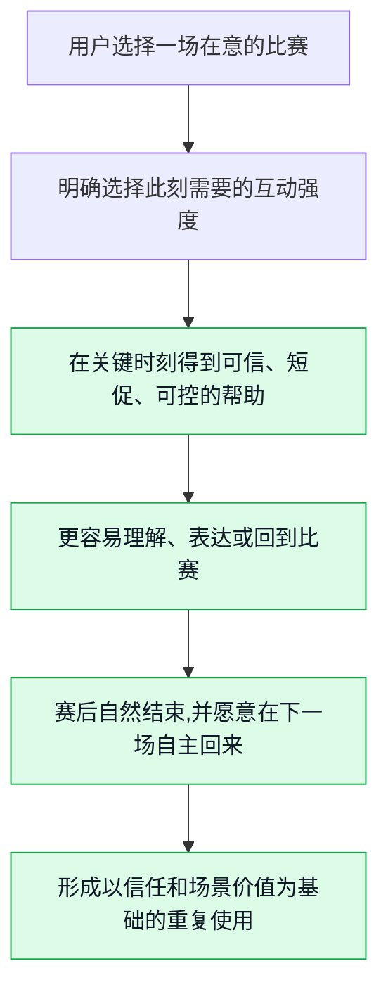
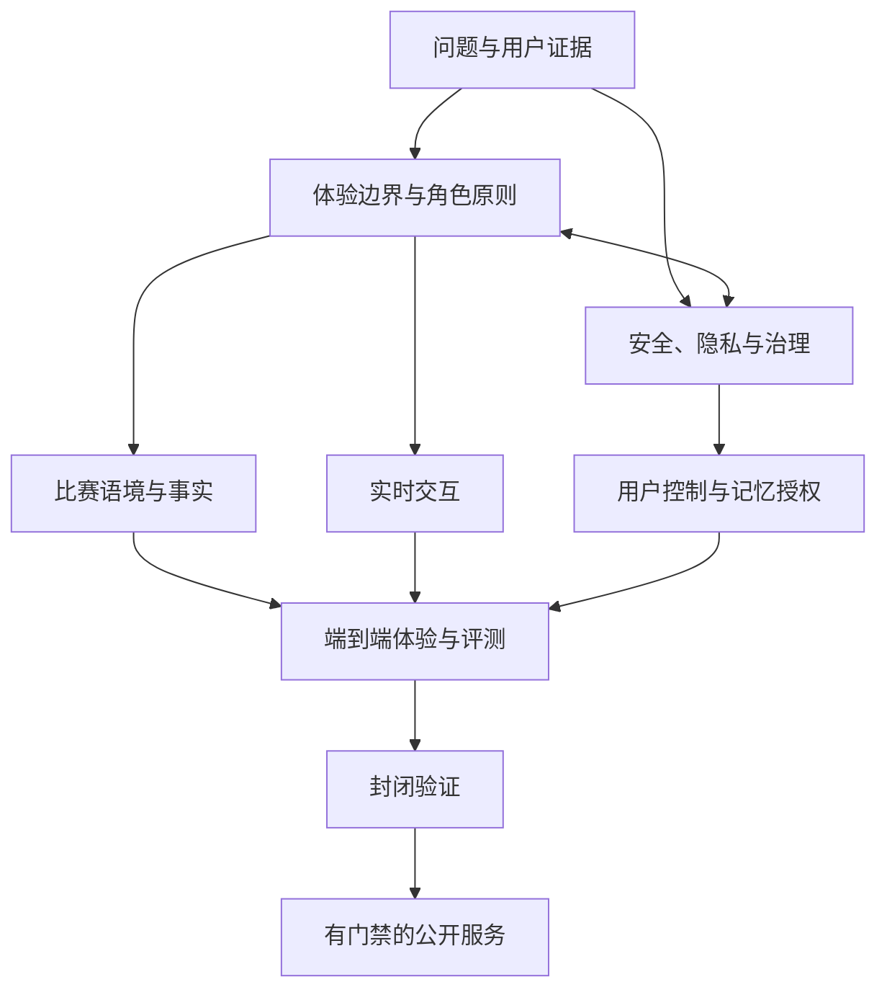
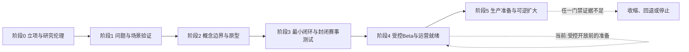

# 产品愿景与阶段路线图

> **文档性质**:市场/战略卷第 6 篇——0→1 阶段的产品愿景与推进路线,不是功能说明书或项目复盘。
> **版本**:2.0（2026-09-20）；对应球球 VERSION 0.2.0.0。
> **决策对象**:面向成年足球观赛者的实时数字陪看服务;它面向用户的位置是**数字球友(Digital Ballmate)**。
> **核心原则**:推进按"风险是否已经被降低"衡量,不按"已经做了多少功能"衡量;工程验收通过不等于风险已经被降低。

---

## 1. 愿景:我们要抵达什么未来

本项目要探索的不是一个"更会聊天的足球 AI",也不是在比分、赛程或直播流旁边放置一个会说话的形象。它要验证的是一种更窄、更可被否决的服务:在用户主动选择的关键观赛时刻,一位明确为 AI 的数字球友,能以可信、克制、可中断的方式帮助用户理解比赛、承接短暂情绪,并把注意力留在比赛及真实生活中。

用一句可以被后续工作推翻的话描述,愿景是:

> **让独自观看重要足球比赛的成年用户,在不被打扰、不被误导、也不被关系绑架的前提下,拥有一位懂比赛、懂分寸、随时可以安静或离开的数字球友。**

这句话包含四个缺一不可的承诺。

**承诺:关键时刻**
- **用户最终应感到什么**:"它在我需要时出现,不占据整场比赛。"
- **我们不能偷换成什么**:用持续推送、连环追问和长对话提高时长。
- **验证方式**:赛事日观察、赛后回访、主动关闭原因分析,将在受控使用中验证。

**承诺:懂比赛**
- **用户最终应感到什么**:"它能解释我眼前发生的事,也会承认不知道。"
- **我们不能偷换成什么**:用流畅口吻掩盖不确定、猜测或延迟。
- **验证方式**:事实状态理解测试与错误纠正演练;事实状态的工程底座已建成(见 §5、§6),用户面理解测试将在受控开放前完成。

**承诺:懂分寸**
- **用户最终应感到什么**:"我可以选择轻聊、提问、安静或结束。"
- **我们不能偷换成什么**:把热情、黏性和拟人化当成陪伴质量。
- **验证方式**:互动强度切换测试;角色越界语料的对抗测试已纳入边界评测集(boundary 评测)。

**承诺:可离开**
- **用户最终应感到什么**:"它不是我的替代关系,关闭后不会追着我。"
- **我们不能偷换成什么**:用排他语言、愧疚感或稀缺感换留存。
- **验证方式**:退出路径测试与长期使用回访,将在受控使用中验证。

因此,首发版本的终点不应是"有一个完整的数字人产品",而应是一个更严格的状态:一小群明确的成年用户,愿意在下一场自己在意的比赛中**自主**再次打开服务;他们说得出它在哪个时刻帮到了自己;他们知道它是什么、会记录什么、不能保证什么;同时,没有证据显示服务通过打扰比赛、模糊事实或诱导依赖换取了使用。

如果这四个条件无法同时成立,项目应缩小、转向或停止,而不是以增加功能掩盖问题。

---

## 2. 目标画面:写成用户的一场比赛

愿景必须落在可观察的行为上。以下场景是用来约束研究、设计和工程取舍的**目标画面**,不是对当前已实现体验的完整描述;已建成的能力见 §6,阶段规划见 §7。

### 2.1 赛前:用户决定"要不要让它参与"

一位成年用户在开赛前打开服务。页面首先说明这是 AI 数字角色,而不是真人、官方裁判或权威赛事源。用户看见清晰且不打扰的选择:`只看要点`、`有问题再问`、`轻量陪看`、`这场安静`。如果选择陪看,用户还能设定语音、文字、提醒频率、是否保存本场偏好,以及何时自动结束。

这里真正要解决的不是"让用户尽可能多授权",而是让用户在十秒内完成一次知情且可撤销的选择。若用户不想说话、不愿保存偏好或只想看比赛,产品仍须成立。把沉默视作失败,会迫使系统把每一次安静都当成需要被填补的空白,最终反而损害观赛。

### 2.2 赛中:服务围绕比赛而不是围绕自己组织互动

比赛进行时,数字球友不承担替代解说、抢先播报或持续表演的职责。它的机会来自三个被用户允许的时刻:用户明确提问;比赛出现可解释的显著变化;用户此前选择了有限的提醒或回应。它应优先使用短回应,并保留可见的信息状态,例如"已确认""仍待确认""这是基于规则的解释"或"这是我的看法"。

用户若说"安静一点"、摘下耳机、切换为只看,系统应立即让位。用户若打断回答,也不需要解释或道歉。服务在这里的成熟标志不是"总能接住话",而是"知道何时不该接"。

### 2.3 赛后:帮助收束,而不是制造无尽停留

赛后收束有三条原则:**自然结束是产品质量的一部分;保存对象、用途、期限与删除入口必须说清楚;不以"再聊五分钟"作留存策略。** 完整展开见《产品全貌》"用户体验闭环"一节。

### 2.4 目标状态的反面

关键回合持续插话、把未确认信息说成确定事实、诱导"错过回应"、暗示比现实关系更懂用户、把基础情绪回应做成付费墙、保存不透明、用"陪伴感"包装过度使用——这些是目标状态的反面画面,完整清单见《产品全貌》"明确的非目标与产品红线"。愿景的价值正体现在这些拒绝上:任一画面成为常态,产品就从"帮助用户看球"转为利用用户的注意力、情绪或信息不对称。

---

## 3. 机会选择:为何只从这个问题开始

### 3.1 先选择场景,再选择人群,再选择能力

0→1 最容易犯的错,是先拥有一堆能力,再为每项能力寻找用途,把项目推向没有主任务的功能集合。本项目反向选择:先从"用户独自观看一场在意的比赛"的有限时段入手,再确认哪些成年用户真正存在这个问题,最后决定值得建设哪些能力。选择这个切口的五个理由:

1. **时刻天然有限**:赛事有明确的赛前、赛中、赛后边界,把陪伴从全天候承诺缩小为可观察的使用窗口。
2. **替代品真实存在**:直播解说、比分应用、群聊、朋友、社区、搜索。若不能比某一种替代方式更好,问题会很快暴露。
3. **价值可以被描述**:用户能在赛后回忆"哪个时刻帮助了我",把主观陪伴感转化为可访谈、可测试的证据。
4. **风险可以被前置**:事实错误、打扰、角色越界、隐私和依赖风险都能在封闭场景中测试。
5. **规模扩张有天然约束**:先把一个用户—赛事—任务闭环做对,比早期追求覆盖更重要。

这不是宣称足球是唯一垂类。它只是第一个能同时检验价值、信任、边界和工程可行性的试验场;若这条路径无法成立,不应靠扩大赛事或用户来"稀释"失败。

### 3.2 机会筛选标准

每个候选方向用同一张筛选表,不由个人偏好或模型能力决定:

| 筛选维度 | 必须回答的问题 | 高分证据 | 一票否决信号 |
|---|---|---|---|
| 问题强度 | 用户是否在比赛发生时主动寻找替代方案? | 行为日记、真实转播记录、反复出现的具体情境 | 只有抽象好奇,说不出上次何时发生 |
| 替代缺口 | 现有工具为何没有解决? | 用户能清楚指出群聊、解说、资讯的不足 | 所有需求已被单一替代品低成本满足 |
| 付出意愿 | 用户是否愿意给出时间、注意力、授权或金钱? | 主动预约、赛前开启、连续参与或真实付费测试 | 只愿在访谈中说"会用" |
| 信任可建 | 用户能否理解信息边界并接受不确定性? | 能区分事实、解释和观点,遇纠错仍愿继续测试 | 期待绝对正确、绝对即时且不接受说明 |
| 风险可控 | 是否能在首发范围内控制伤害? | 清晰的年龄、隐私、退出和人工处理路径 | 价值依赖模糊身份、强依赖或不可解释的数据实践 |
| 供给可行 | 体验是否依赖无法稳定获取的内容、版权或人工? | 关键输入的来源、时效和责任已被验证 | 没有受限内容或人工高成本即无法提供价值 |

候选方向分三类:**进入验证**(问题强度、替代缺口、风险可控均有正向证据)、**保留观察**(问题存在但价值或边界不清)、**明确拒绝**(价值主要来自排他陪伴、刺激时长、虚构确定性或受限内容分发)。资源只投第一类;第三类记录为非目标,防止它在增长压力下重新出现(非目标清单见《产品全貌》)。这张筛选表将随首批用户研究启用;在获得真实行为证据之前,它约束的是我们的取舍,不构成已通过的筛选结论。

### 3.3 起始用户的选择原则

早期研究对象优先是能独立同意参与的成年观赛者,以行为条件组合招募,不以年龄、性别、城市或消费能力做单一切分:

- 近期确实观看过完整或大部分足球比赛;
- 对至少一场赛事、球队或球员存在真实关注;
- 有过独自观看、异地同看、想问问题但不想在公开群聊发言的时刻;
- 愿意在比赛前后接受短访谈或记录观察;
- 能接受测试 AI 数字角色,但不以寻找替代性亲密关系为主要目的。

研究应主动招募反例:认为"看球就该安静"的用户、只相信官方事实源的用户、讨厌拟人角色的用户、强依赖群聊的用户、愿意看球但从不使用第二屏工具的用户。反例不是阻碍,而是帮助团队确认产品边界的必要样本。

---

## 4. 战略叙事:从"陪伴"到"更好的观看"

### 4.1 战略的因果链

产品不应把"更长的聊天"误当作"更好的陪伴"。战略因果链:

若某环节被替换为"用户被提醒拉回""角色不断追问""用户舍不得离开",说明增长机制已脱离价值机制。所有能力、指标和商业化试验都应能在这条因果链上找到位置;找不到位置的能力即使可做,也不应优先。

### 4.2 三个必须同时成立的产品论点

**论点一:观看体验可以因"恰当参与"而改善。** 我们不假设用户需要更多内容,而假设他们在少数时刻需要更合适的支持:一个简短解释、一次不过度的情绪回应、一个可选提醒、或一次安静。必须通过真实赛事观察证明,不能只靠态度问卷。

**论点二:可信度来自清楚的边界,而不只来自模型能力。** 系统应把"已确认事实""待确认信息""基于公开规则的解释""个人化观点""情绪回应"分开呈现,并让用户知道数据延迟和可用范围。若体验需要假装无所不知才能显得有价值,方向本身有问题。

**论点三:陪伴必须可控、非排他且可结束。** 拟人形象、声音和记忆会放大用户对关系的感受,也放大过度依赖、情绪操控和隐私误解的风险。自主开关、主动沉默、边界表达、记忆授权、删除和升级路径必须视为核心体验,而不是合规附录。

三个论点的工程面支撑现状见 §5 与 §6;用户面验证按 §7 的阶段推进。

### 4.3 战略取舍

六项战略取舍(先成年用户、先关键比赛、先可控短互动、先事实透明、先少量场景、基础安全免费默认)及各自的"为什么/放弃什么/何时重估"详见《战略定位与非目标》。其中"延后商业化"与当前状态一致:商业模式尚未启动,这是既定取舍,不是搁置。

---

## 5. 能力域依赖

愿景由一组相互制约的能力域构成,任何一域缺失都会让其他投入失去意义。

### 5.1 七个能力域

- **用户问题证据** —— 问题定义目前以工作假设形式维护,登记于《需求假设与验证计划》;首批用户研究(行为访谈、赛事日观察、反例招募)将把假设替换为行为证据。原则:没有问题证据时,停止泛化功能,回到问题研究。
- **角色与边界** —— 角色边界已以内容护栏与边界评测集的形态落地,越界语料有可回归的对抗测试;危机升级规则与用户面 AI 身份说明列入受控开放前的准备清单(§7)。原则:边界能力不足时,降低拟人化,先做非人格化交互。
- **事实可信** —— 事实状态治理已建成:信息按"已确认/待确认/基于规则的解释/个人观点"分级管理,后端与导播台可核查;"已确认/待确认"的用户侧呈现将随受控开放提供。原则:事实治理不足时,只做解释与观点,不宣称实时事实。
- **实时交互** —— 语音是本产品的初始交互形态,不是附加增强:ASR/TTS 链路、语音活动检测与打断、连续对话开关、Live2D 形象与表演映射已建成。主动沉默(用户主动选择的安静)是产品的一等状态,而非失败。原则:延迟预算不达标时,先退回文字或异步,不强推语音。
- **用户控制与记忆** —— 记忆经由独立的记忆接缝（Memobase）接入:自动记忆默认开启,用户可随时查看与控制自己的记忆画像。现行约束是"记忆默认开、事后可控、删除路径必须可演练";全流程删除演练列入开放前准备(§7)。
- **评测与运营** —— 评测集(100 例,含边界语料)与导播台的角色权限体系已建成,阶段端到端报告形成可回归的验收证据;值守、投诉处理与事件复盘机制将随受控开放建立。原则:在此类机制建立之前,不扩大用户范围。
- **商业模式** —— 尚未启动收费,与《战略定位与非目标》的延后取舍一致:先证明付费不改变关系设计,再谈定价。

### 5.2 依赖关系的硬规则

以下五条规则约束能力建设与投入顺序:

1. **没有问题证据,不建设复杂能力。** 用户面扩张以问题验证结论为前提。
2. **没有边界设计,不启动高拟人化测试。** 护栏与边界评测先行;Live2D 表演的引入使这条规则更紧要。
3. **没有事实治理,不承诺赛事权威性。** 事实状态分级是承诺任何实时能力的前置条件。
4. **没有退出和删除,不引入连续性。** 记忆的引入以"查看—改正—删除"全流程可演练为边界。
5. **没有评测和人工处置,不扩大人群。** 这是当前生效中最硬的一条:值守与复盘机制建立之前,不扩大用户范围。

---

## 6. 建设里程碑

核心系统按以下顺序建成;截至本文对应版本(VERSION 0.2.0.0),以下能力均已交付并通过评测与端到端验收。

1. **边界与事实先行。** 内容护栏与编译期安全策略最先固化为系统行为,事实状态分级紧随其后。护栏与事实分级先于体验表演成为"不可妥协层",角色边界以边界评测的形式获得可回归验证。
2. **语音与形象表演是一等公民。** ASR/TTS 链路、语音活动检测与打断、连续对话开关,以及 Live2D 形象与表演映射构成实时交互的主体。语音与形象表演自始就是初始交互形态,而非在文字闭环之上的后期增强。
3. **记忆以独立接缝接入。** 记忆能力经由独立的记忆接缝（Memobase）接入:自动记忆默认开启,用户可事后查看与控制——记忆始终是用户权益,不是产品资产。
4. **运营台与评测同步建设。** 导播台具备角色权限体系;评测集覆盖 100 例(含边界语料);各阶段端到端报告在案。三者共同构成当前的工程验收证据。

这四层合起来,构成受控开放之前的完整技术底座;它之上还缺什么,见 §7 的阶段规划。

---

## 7. 六阶段路线图与当前位置

六个阶段与各自的门禁构成推进框架;门禁定义见《MVP 范围与验证闸门》,本篇只标注各阶段状态。阶段是证据阶段,不是排期。

> **当前位置(2026-09-20,VERSION 0.2.0.0)**:核心系统建设完成,当前处于**受控开放前的准备阶段**。客户端、导播台与评测体系已交付(§6);用户验证与开放准备两线并行推进,在受控开放前汇合。因此各阶段状态并非严格线性:工程闭环先行建成,问题验证与运营准备并行补齐。

### 阶段 0:立项准备与研究伦理校准 —— 状态:进行中

把问题、研究范围和不可碰的边界写清楚,确保我们不会在第一轮访谈中就把自己的愿望灌输给用户。本阶段四项成果:

| 成果 | 内容 |
|---|---|
| 问题假设清单 | 每项假设有反证条件、负责人和决策后果(工程面版本已建立,见《需求假设与验证计划》,将随用户研究扩展) |
| 招募与同意流程 | 成年人优先、退出权、记录范围和处理方式明确 |
| 风险清单 | 覆盖事实、隐私、角色、未成年人、过度使用、版权与运营 |
| 研究脚本 | 问过去行为和具体赛事,不诱导想象未来 |

以上将在首批用户研究开始前完成。

### 阶段 1:问题与场景验证 —— 状态:进行中

确认存在足够具体、足够重复、替代方式未解决的观赛任务。研究方式:深度访谈、赛事日微日记、转播前后短访、替代方案地图、概念卡排序;同时按 §3.3 主动招募反例。本阶段四项产出:

| 产出 | 通过门槛 |
|---|---|
| 用户—场景—任务选择 | 用户能说出频率、触发时刻和替代缺口 |
| 替代方案地图 | 存在无法由单一替代品低成本解决的缺口 |
| 反例库 | 反例能明确边界而非被忽略 |
| 风险初筛 | 用户能理解并接受基本身份和控制方式 |

进入下一阶段的门槛:只保留一个主任务和一个辅助任务;若写不出"用户在何时、为完成什么而打开",不进入原型。

### 阶段 2:概念、边界与交互原型验证 —— 状态:进行中

验证概念、边界与交互是否被用户正确理解。五个验证对象:

- **首次说明**:用户能否正确理解这是 AI 数字角色,不是真人或权威赛事源;
- **互动模式**:强度切换是否真实可用、可理解(现网为全局三档:安静/刚好/热闹;"仅关键事实"档将结合用户验证决定);
- **事实表达**:用户能否区分"已确认/待确认/解释/观点";
- **角色边界**:角色是否会被理解为恋人、唯一朋友或权威;
- **结束方式**:自然结束是否成立、是否受愧疚感干扰。

其中互动强度切换、角色边界、可打断与主动沉默已建成工程载体(§6)并纳入边界评测回归;首次说明与事实表达的用户面验证将随后开展(准备清单见阶段 4)。两条测试设计原则保留:人工模拟测试必须说明是模拟,不得伪装成自动化能力;任何一项验证不过,先回到概念和流程修正,而非叠加功能。

### 阶段 3:最小闭环与封闭赛事测试 —— 状态:进行中(工程闭环已完成)

赛前选择互动强度(全局三档:安静/刚好/热闹)、赛中立即静音或结束、对话可被打断、信息状态管理,已构成最小工程闭环,由评测集与阶段端到端报告验收。已具备的能力:

- 赛前选择互动强度(全局三档:安静/刚好/热闹);
- 赛中立即静音或结束(主动沉默、连续对话开关、语音打断);
- 事实信息状态管理(后端与导播台可核查);
- 语音链路的失败降级路径;
- 数据仅服务于已说明目的(记忆事后可控);
- 每轮验收的端到端报告与评测回归。

本阶段接下来补上真实赛事的**封闭用户测试**:观察记录、异常报告、暂停与复盘通道随测试一并启用。本阶段不以规模为目标。

### 阶段 4:受控 Beta 与运营就绪 —— 状态:进行中(当前阶段)

本阶段重点是重复运行能力,而非铺开内容。核心系统已建成(§6);受控开放前,我们将完成以下准备:

- **AI 身份首次说明(首发承诺)**:用户首次进入服务时,以显著、可理解的方式说明这是 AI 数字角色,不是真人、官方裁判或权威赛事源(相关合规要求见《宏观环境与监管约束》)。
- **用户侧信息状态呈现**:"已确认/待确认/解释/观点"在对话界面上可见。
- **赛后收束回顾**:每场比赛以自然收束结束,保存对象、用途、期限与删除入口向用户说清。
- **运行时暂停能力**:护栏之外的新伤害模式必须能在运行中被即时暂停,而不只依赖重新构建与重新评测。
- **危机升级规则**:识别急性危机与脆弱用户信号,按预案降级为人工支持或外部资源指引。
- **值守与事件复盘机制**:响应时限、事件分级、复盘与公告。
- **删除全流程演练**:"查看—改正—删除"可被独立验证。
- **商业化约束**:受控开放阶段不启动收费,按《战略定位与非目标》的延后取舍执行。

本阶段的原则保留:任何一项能力只能依赖个别人手工盯住时,不具备扩大用户范围的条件。

### 阶段 5:生产准备与可逆扩大 —— 状态:规划中

形成可对真实用户负责的服务。扩大遵循可逆原则:每次只改变一个主要变量(赛事类型/互动模式/用户类),观察后再决定保留、回退或修订;不同时扩大人群、提升主动性、引入付费和增加长期记忆。生产门禁的含义:**不是"没有任何负面反馈",而是我们能够发现、解释、修复和必要时停止。** 前提:阶段 1-2 用户验证完成、阶段 4 用户面运行稳定,以及运行时暂停能力补齐。

---

## 8. 指标与反指标(名录)

完整定义见《北极星指标与指标体系》。要点:指标分四层——问题价值、观看质量、信任与控制、健康增长;每项正向指标必须配一个反指标;北极星候选为"被用户确认'有帮助且不打扰'的关键观赛时刻比例";禁止单用时长、消息数、语音分钟数或订阅转化解释成功。第一批真实数据自受控开放起采集;在此之前,指标体系约束的是设计与评测的取向。

---

## 9. 风险停止条件:何时不应该继续

停止条件是本篇的承重结构。下表信号出现时,默认动作是暂停相关能力、保护用户、复盘证据,而不是优化转化文案。

| 风险类别 | 停止或升级信号 | 立即动作 | 恢复条件 |
|---|---|---|---|
| 需求不存在 | 用户不能描述重复问题,或真实赛事中不愿主动使用 | 停止扩功能与投放,返回问题研究 | 找到新场景并通过独立验证 |
| 观看被打扰 | 关键用户反复表示回应妨碍看球,静音/退出成为常态 | 默认降到更安静档,暂停主动介入 | 时机和控制机制经新一轮测试改善 |
| 事实误导 | 未确认信息被当作事实,或纠错无法被用户看到 | 停止相关事实表达,人工复核事件 | 来源、状态和纠错链路完成演练 |
| 关系越界 | 角色表达排他、诱导依附、情绪绑架或贬低现实关系 | 下线相关策略,保留审计记录并人工处理 | 角色规则、评测集和升级流程通过复核 |
| 脆弱用户风险 | 急性危机、未成年人不适配、现实生活受损信号 | 停止对相关用户的自动互动,按预案提供人工支持或外部资源指引 | 保护机制、招募限制和培训完成 |
| 隐私不可控 | 用户无法理解、导出、纠正或删除其数据 | 停止新增收集与长期记忆,优先修复权利路径 | 全流程可被独立演练和验证 |
| 商业激励冲突 | 订阅、推送、文案或任务设计鼓励过度使用 | 暂停商业试验,进行治理审查 | 证明收入指标不依赖伤害性机制 |
| 运营不可承受 | 严重反馈无人处理、事件无负责人或复盘失效 | 限制用户范围或暂停开放 | 值守、响应和复盘责任重新建立 |

停止不是失败的同义词。能及时停止一条伤害性路径,恰恰说明治理在发挥作用;真正的失败是明知信号出现仍把它当作"成长的代价"。

---

## 10. 路线图治理:如何防止它变成愿望清单

### 10.1 阶段评审

每阶段结束应召开短而严格的阶段评审:原始假设与反证条件、支持/反对/不确定证据、样本局限、风险与近失事件、被明确拒绝的做法、下一阶段唯一主任务建议、四态结论(继续/缩小后继续/回退研究/停止转向)。不设"原则上通过"状态;用户面证据自受控开放起进入评审材料。

变更治理由架构决策记录(ADR)与规格评审流程承担:高风险变更必须重新评审后才能实施,如导播台重写与旧导播页退役所记录的权限与变更控制决策。

### 10.2 决策权与否决权

| 决策领域 | 必须负责的问题 | 至少参与的角色 | 否决条件 |
|---|---|---|---|
| 用户价值 | 需求是否真实、是否值得继续 | 产品、研究、业务负责人 | 没有行为证据不得进入开发扩张 |
| 角色与体验 | 是否清晰、可控、不越界 | 产品、内容/设计、治理 | 角色需要排他或操控才"有吸引力" |
| 事实与数据 | 是否可解释、可纠正、边界明确 | 数据/产品、运营、治理 | 不能说明来源和延迟却声称确定 |
| 隐私与用户权利 | 收集是否必要、删除是否可执行 | 隐私/安全、产品、工程 | 用户无法行使基本控制权 |
| 运营与事件 | 出事后谁响应、谁暂停、谁复盘 | 运营、客服、治理、业务负责人 | 没有值守和升级路径却扩大用户 |
| 商业化 | 收入是否扭曲陪伴关系 | 商业、产品、治理 | 机制奖励过度使用或脆弱性利用 |

否决权必须连接真实的暂停流程;只写在文档里的否决权不是治理能力。

### 10.3 变更控制

以下为高风险变更,必须重新研究和门禁,不作为普通运营配置发布:提升拟人化/亲密化/主动性;新增长期记忆、跨场景画像或更宽数据用途;面向未成年人或降低年龄限制;新增付费墙、连续订阅、召回和奖励;变更事实来源、延迟表达或纠错规则;增加语音、形象、视频等生成合成呈现;新增影响用户情绪、健康、消费或人际关系的建议能力。每项变更回答:改变了谁的预期?新增什么风险?用户如何知情并重新选择?如何回退?无答案不排期。

商业化试验同样受三条红线约束:基本的情绪安抚、危机表达与退出控制不进入付费墙;不利用角色关系、孤独感或稀缺感促成付费;不以降低免费体验、增加打扰或削弱事实透明制造升级压力。

---

## 11. 公开研究与合规约束

公开规范提供必须正视的风险问题与责任方向,不构成对本地业务的直接法律结论,也不能替代面向实际发布地区、业务模式与用户群体的专业审查。

| 公开来源 | 对路线图的可用启发 | 应落到哪个阶段 | 不能被误读为 |
|---|---|---|---|
| NIST《AI RMF: Generative AI Profile》 | 风险管理覆盖设计到监控;治理、映射、测量、管理贯穿周期 | 阶段 0 起,贯穿所有门禁 | 填一张风险表就完成治理 |
| 美国 FTC 对陪伴型 AI 的调查说明 | 角色设计、商业激励、未成年人、负面影响测试是核心问题 | 阶段 0、2、4、5 | 对中国业务的直接法律结论,或"尚在调查可忽略" |
| 《生成式人工智能服务管理暂行办法》 | 服务治理、不良信息处置、未成年人沉迷防范 | 阶段 0、4、5 | 合规责任可完全外包给内容过滤 |
| 《人工智能生成合成内容标识办法》 | 文本、音频、视频、虚拟场景需纳入标识安排 | 阶段 4、5 | 角落写一句"AI 生成"即解决知情问题 |
| 英国 ICO 关于 AI 与数据保护的指南 | 数据保护从设计开始;能说明目的、风险和控制 | 阶段 0、2、4、5 | 英国指南等同本地全部合规要求 |

---

## 12. 本文的决策输出

1. 采用"实时足球陪看数字人"作为工作定义,面向用户强调数字球友、身份清楚和可控参与;
2. 以"让用户更好地观看一场比赛"而不是"让用户聊得更久"为最高层价值方向;
3. 首批用户研究范围:成年、关键赛事、独自或低社交压力观赛者,主动纳入反例样本;
4. 以阶段 0-5 的门禁管理投入(定义见《MVP 范围与验证闸门》);任何阶段允许缩小、回退或停止;
5. 角色边界、事实可信、退出路径、隐私控制、未成年人保护和运营暂停能力为生产前提;
6. 语音与 Live2D 表演是产品的初始交互形态;记忆默认开启、事后可控,删除路径必须可演练;
7. 所有指标同时报告正向与反指标,禁止单用时长、消息数或订阅转化解释成功(见《北极星指标与指标体系》);
8. 提高拟人化、主动性、数据连续性、付费压力或用户范围的变更须重新评审,由架构决策记录(ADR)与规格评审流程承担。

**下一步**:两线并行,在受控开放前汇合——(a)用户验证:完成问题与场景验证,以及 AI 身份说明与事实状态的用户理解测试;(b)开放准备:补齐运行时暂停能力、危机升级规则、赛后收束、用户侧信息状态呈现与值守复盘机制(见 §7 阶段 4 准备清单)。

---

## 参考资料

以下资料用于形成风险与治理问题的研究框架,均为公开来源。除明确法律文本外,本文不将任何来源解释为对特定业务的法律意见。

1. National Institute of Standards and Technology, *Artificial Intelligence Risk Management Framework: Generative Artificial Intelligence Profile (NIST AI 600-1)*,2024。
   <https://www.nist.gov/publications/artificial-intelligence-risk-management-framework-generative-artificial-intelligence>
2. U.S. Federal Trade Commission, *FTC Launches Inquiry into AI Chatbots Acting as Companions*,2025-09。
   <https://www.ftc.gov/news-events/news/press-releases/2025/09/ftc-launches-inquiry-ai-chatbots-acting-companions>
3. 国家互联网信息办公室等,《生成式人工智能服务管理暂行办法》,2023-07-13。
   <https://www.cac.gov.cn/2023-07/13/c_1690898326795531.htm>
4. 国家互联网信息办公室等,《人工智能生成合成内容标识办法》,2025-03-14。
   <https://www.cac.gov.cn/2025-03/14/c_1743654684782215.htm>
5. Information Commissioner's Office, *Artificial intelligence and data protection*。
   <https://ico.org.uk/for-organisations/uk-gdpr-guidance-and-resources/artificial-intelligence/>

---

版本 2.0（2026-09-20）
