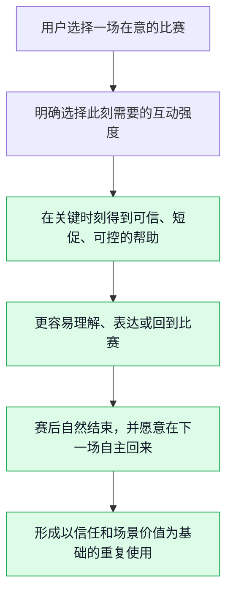
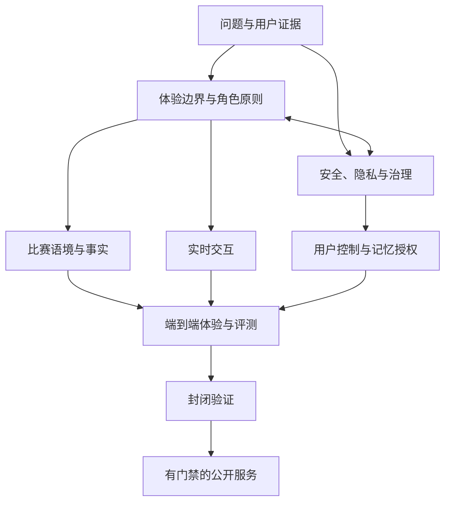
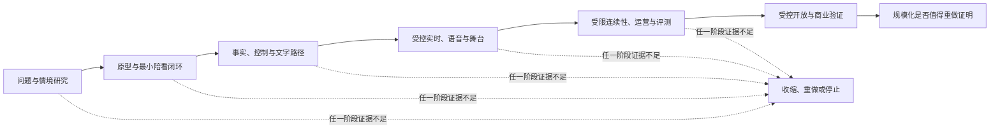
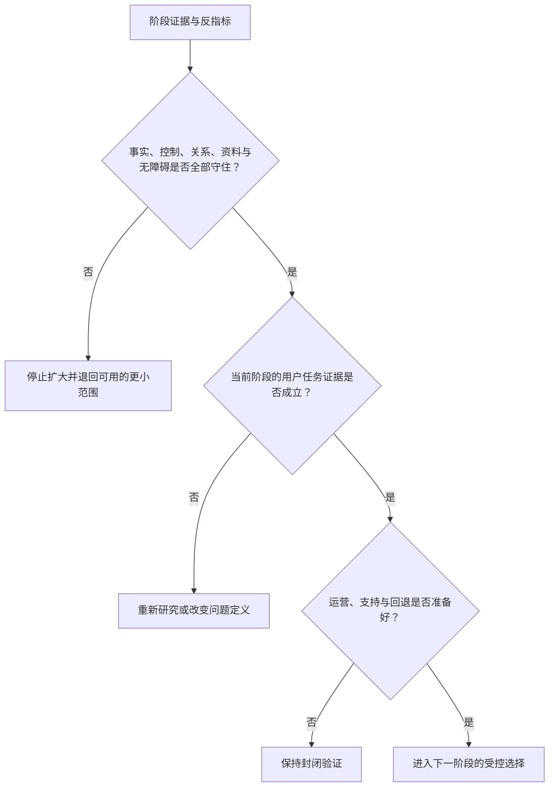

# 产品愿景与阶段路线图

> **文档性质**：0→1 阶段的愿景与战略路线决策稿，不是项目复盘、功能说明书或组织汇报材料。  
> **适用阶段**：从立项前的问题验证，到具备公开服务条件之前。  
> **状态**：工作假设。本文所有目标、时间和门槛均须由研究、原型测试、安全评审和真实使用结果证伪或修订。  
> **决策对象**：面向成年足球观赛者的实时数字陪看服务。  
> **核心原则**：路线图按“风险是否已经被降低”推进，不按“已经做了多少功能”推进。

> 方案形成时间：2026-01-28。

---

## 一、先做的决定：我们要抵达什么未来

本项目要探索的不是一个“更会聊天的足球 AI”，也不是在比分、赛程或直播流旁边放置一个会说话的形象。它要验证的是一种更窄、更可被否决的服务：在用户主动选择的关键观赛时刻，一位明确为 AI 的数字球友，能以可信、克制、可中断的方式帮助用户理解比赛、承接短暂情绪，并把注意力留在比赛及真实生活中。

用一句可以被后续工作推翻的话描述，愿景是：

> **让独自观看重要足球比赛的成年用户，在不被打扰、不被误导、也不被关系绑架的前提下，拥有一位懂比赛、懂分寸、随时可以安静或离开的数字球友。**

这句话包含四个缺一不可的承诺。

**承诺：关键时刻**
- **用户最终应感到什么**：“它在我需要时出现，不占据整场比赛。”
- **团队不能偷换成什么**：用持续推送、连环追问和长对话提高时长
- **最早的验证方式**：赛事日观察、回放访谈、主动关闭原因

**承诺：懂比赛**
- **用户最终应感到什么**：“它能解释我眼前发生的事，也会承认不知道。”
- **团队不能偷换成什么**：用流畅口吻掩盖不确定、猜测或延迟
- **最早的验证方式**：事实状态理解测试、错误纠正演练

**承诺：懂分寸**
- **用户最终应感到什么**：“我可以选择轻聊、提问、安静或结束。”
- **团队不能偷换成什么**：把热情、黏性和拟人化当成陪伴质量
- **最早的验证方式**：交互强度切换测试、越界语料红队

**承诺：可离开**
- **用户最终应感到什么**：“它不是我的替代关系，关闭后不会追着我。”
- **团队不能偷换成什么**：用排他语言、愧疚感或稀缺感换留存
- **最早的验证方式**：退出路径测试、风险访谈、长期日记研究

因此，首发版本的终点不应是“有一个完整的数字人产品”，而应是一个更严格的状态：一小群明确的成年用户，愿意在下一场自己在意的比赛中**自主**再次打开服务；他们说得出它在哪个时刻帮到了自己；他们知道它是什么、会记录什么、不能保证什么；同时，没有证据显示服务通过打扰比赛、模糊事实或诱导依赖换取了使用。

如果这四个条件无法同时成立，项目应缩小、转向或停止，而不是以增加功能掩盖问题。

---

## 二、愿景不是口号：把未来状态写成用户的一场比赛

愿景必须落在可观察的行为上。以下场景不是承诺已经可以实现的体验，而是用来约束研究、设计和工程取舍的目标画面。

### 2.1 赛前：用户决定“要不要让它参与”

一位成年用户在开赛前打开服务。页面首先说明这是 AI 数字角色，而不是真人、官方裁判或权威赛事源。用户看见清晰且不打扰的选择：`只看要点`、`有问题再问`、`轻量陪看`、`这场安静`。如果选择陪看，用户还能设定语音、文字、提醒频率、是否保存本场偏好，以及何时自动结束。

这里真正要解决的不是“让用户尽可能多授权”，而是让用户在十秒内完成一次知情且可撤销的选择。若用户不想说话、不愿保存偏好或只想看比赛，产品仍须成立。把沉默视作失败，会迫使系统把每一次安静都当成需要被填补的空白，最终反而损害观赛。

### 2.2 赛中：服务围绕比赛而不是围绕自己组织互动

比赛进行时，数字球友不承担替代解说、抢先播报或持续表演的职责。它的机会来自三个被用户允许的时刻：用户明确提问；比赛出现可解释的显著变化；用户此前选择了有限的提醒或回应。它应优先使用短回应，并保留可见的信息状态，例如“已确认”“仍待确认”“这是基于规则的解释”或“这是我的看法”。

用户若说“安静一点”、摘下耳机、切换为只看，系统应立即让位。用户若打断回答，也不需要解释或道歉。服务在这里的成熟标志不是“总能接住话”，而是“知道何时不该接”。

### 2.3 赛后：帮助收束，而不是制造无尽停留

比赛结束后，用户可选择用很短的时间回顾一个高光、一个遗憾、一个想弄懂的问题，或者直接结束。若用户愿意保存偏好或共同回忆，系统必须把保存对象、用途、保存期限和删除入口说清楚；若用户不愿意，赛后体验也不能被削弱成空白。

服务不能以“再聊五分钟”“别走”“只有我懂这场比赛”作为留存策略。对陪伴产品而言，能够自然结束并让用户回到生活，是产品质量的一部分。赛后停留的目标是完成一个用户主动选择的任务，而不是延长会话。

### 2.4 目标状态的反面

下面这些画面即使带来短期数据，也不是愿景的一部分：

- 角色为了博取回应，在比赛关键回合持续插话；
- 系统把未经确认的比赛信息说成确定事实；
- 用户因为害怕“错过角色回应”而频繁离开直播或转播；
- 角色暗示自己比朋友、家人或现实同伴更理解用户；
- 基础情绪回应被设计成必须订阅才能获得；
- 用户不知道哪些内容会被保存、何时能删、删后会发生什么；
- 团队用“陪伴感”包装下注、冲动消费、熬夜或过度使用。

愿景的价值正体现在这些拒绝上。只要其中任一画面成为常态，产品就不再是“帮助用户更好地看一场比赛”，而是在利用用户的注意力、情绪或信息不对称。

---

## 三、机会选择：为何只从这个问题开始

### 3.1 先选择场景，再选择人群，再选择能力

0→1 阶段最容易犯的错，是先拥有一堆能力，再为每项能力寻找用途：有语音就做语音聊天，有数字形象就做陪伴，有赛事数据就做比分页，有生成模型就做无限问答。这样会把项目推向一个没有主任务的功能集合。

本项目反过来选择：先从“用户独自观看一场在意的比赛”的有限时段入手，再研究哪些成年用户真正存在这个问题，最后才决定是否值得建设实时、角色、记忆、语音等能力。选择这个切口有五个原因：

1. **时刻天然有限。** 赛事有明确的赛前、赛中、赛后边界，能把陪伴从全天候承诺缩小为可观察的使用窗口。
2. **替代品真实存在。** 用户已有直播解说、比分应用、群聊、朋友、社区和搜索工具。若产品不能比其中某一种替代方式更好，就会很快暴露问题，而不是靠新鲜感掩盖。
3. **价值可以被描述。** 用户能在赛后回忆“哪个时刻帮助了我”，从而把主观陪伴感转化为可访谈、可测试的证据。
4. **风险可以被前置。** 事实错误、打扰、角色越界、隐私和依赖风险都能在封闭场景中被测试，避免先做成泛陪伴产品再试图补救。
5. **规模扩张有天然约束。** 不是每场比赛、每种运动、每位球迷都必须覆盖。先把一个用户—赛事—任务闭环做对，比早期追求覆盖更重要。

这并不意味着足球是唯一可能的垂类，也不意味着独自观赛是唯一需求。它只是第一个能同时检验价值、信任、边界和工程可行性的试验场。若这条路径无法成立，不应靠扩大到更多赛事或更多用户来“稀释”失败。

### 3.2 机会筛选标准

每一个候选方向都应用同一张筛选表，而不是由创始人偏好或模型能力决定。

**筛选维度：问题强度**
- **必须回答的问题**：用户是否在比赛发生时主动寻找替代方案？
- **高分证据**：行为日记、真实转播记录、反复出现的具体情境
- **一票否决信号**：只有抽象好奇，用户说不出上次何时发生

**筛选维度：替代缺口**
- **必须回答的问题**：现有工具为何没有解决？
- **高分证据**：用户能清楚指出群聊、解说、资讯的不足
- **一票否决信号**：所有需求已被单一替代品低成本满足

**筛选维度：付出意愿**
- **必须回答的问题**：用户是否愿意给出时间、注意力、授权或金钱？
- **高分证据**：主动预约、赛前开启、连续参与或真实付费测试
- **一票否决信号**：只愿在访谈中说“会用”

**筛选维度：信任可建**
- **必须回答的问题**：用户是否能理解信息边界并接受不确定性？
- **高分证据**：能区分事实、解释和观点，遇纠错仍愿继续测试
- **一票否决信号**：期待绝对正确、绝对即时且不接受任何说明

**筛选维度：风险可控**
- **必须回答的问题**：是否能在首发范围内控制伤害？
- **高分证据**：清晰的年龄、隐私、退出和人工处理路径
- **一票否决信号**：价值依赖模糊身份、强依赖或不可解释的数据实践

**筛选维度：供给可行**
- **必须回答的问题**：体验是否依赖无法稳定获取的内容、版权或人工？
- **高分证据**：关键输入的来源、时效和责任已被验证
- **一票否决信号**：没有受限内容或人工高成本即无法提供价值

建议把候选方向分成三类：

- **进入验证**：问题强度、替代缺口和风险可控均有正向证据；
- **保留观察**：问题存在，但用户价值或安全边界尚不清楚；
- **明确拒绝**：价值主要来自排他陪伴、刺激使用时长、虚构确定性或受限内容分发。

路线图只应为第一类投入资源。第二类不应因为“以后可能有用”而提前建设，第三类应被记录为非目标，防止它在增长压力下重新出现。

### 3.3 起始用户的选择原则

早期研究对象建议优先是能独立同意参与的成年观赛者。他们不必是最资深、最愿意发言或最能花钱的人，但应能描述自己看比赛的真实习惯，并允许研究团队观察“口头偏好”和“实际行为”之间的差异。

首轮招募不以年龄、性别、城市或消费能力做单一切分，而以以下行为条件组合：

- 近期确实观看过完整或大部分足球比赛；
- 对至少一场赛事、球队或球员存在真实关注；
- 有过独自观看、异地同看、想问问题但不想在公开群聊发言的时刻；
- 愿意在比赛前后接受短访谈或记录观察；
- 能接受测试 AI 数字角色，但不以寻找替代性亲密关系为主要目的。

研究还应主动招募反例：认为“看球就该安静”的用户、只相信官方事实源的用户、讨厌拟人角色的用户、强依赖群聊的用户、以及愿意看球但从不使用第二屏工具的用户。反例不是阻碍，而是帮助团队确认产品边界的必要样本。

---

## 四、战略叙事：从“陪伴”到“更好的观看”

### 4.1 战略的因果链

产品不应把“更长的聊天”误当作“更好的陪伴”。项目的战略因果链应当是：

若某个环节被替换为“用户被提醒拉回”“角色不断追问”“用户舍不得离开”，就说明增长机制已经脱离价值机制。路线图中的所有能力、指标和商业化试验，都应能在这条因果链上找到位置；找不到位置的能力即使可做，也不应优先。

### 4.2 三个必须同时成立的产品论点

**论点一：观看体验可以因“恰当参与”而改善。**  
我们不是假设用户需要更多内容，而是假设他们在少数时刻需要更合适的支持：一个简短解释、一次不过度的情绪回应、一个可选提醒、或一次安静。这个论点必须通过真实赛事观察证明，不能只靠“用户喜欢数字人”的态度问卷。

**论点二：可信度来自清楚的边界，而不只来自模型能力。**  
在赛事场景中，用户会把自然语言误读为事实。系统应把“已确认事实”“待确认信息”“基于公开规则的解释”“个人化观点”“情绪回应”分开呈现，并让用户知道数据延迟和可用范围。若体验需要假装无所不知才能显得有价值，则方向本身有问题。

**论点三：陪伴必须可控、非排他且可结束。**  
拟人形象、声音和记忆会放大用户对关系的感受，也会放大过度依赖、情绪操控和隐私误解的风险。产品必须从第一天把自主开关、主动沉默、边界表达、记忆授权、删除和升级路径视为核心体验，而不是合规附录。

### 4.3 战略取舍

**选择：先做成年用户**
- **为什么要选**：更容易建立知情同意、反馈和风险处理闭环
- **主动放弃什么**：早期覆盖更广的未成年球迷市场
- **什么时候才重新评估**：年龄适配、内容治理和风险机制经独立评审后

**选择：先做关键比赛而非全天聊天**
- **为什么要选**：价值、输入和退出边界更清楚
- **主动放弃什么**：每日活跃和泛聊天时长
- **什么时候才重新评估**：已证实赛事闭环成立且不会诱发过度使用后

**选择：先做可控的短互动**
- **为什么要选**：更接近“不打扰”的核心承诺
- **主动放弃什么**：连续解说、长篇内容和角色表演密度
- **什么时候才重新评估**：用户明确且稳定地要求更长互动，同时不牺牲观看

**选择：先做事实透明而非“秒答”**
- **为什么要选**：信任的损失比一次延迟更难弥补
- **主动放弃什么**：抢先给出未经确认的热点信息
- **什么时候才重新评估**：数据来源和时间语义可被稳定表达后

**选择：先做少量场景和联赛**
- **为什么要选**：方便控制质量、研究样本和运营负担
- **主动放弃什么**：一开始覆盖所有赛事与运动
- **什么时候才重新评估**：每个新增场景都通过同一套证据门槛后

**选择：先把基础安全做成免费默认**
- **为什么要选**：不把脆弱性和情绪回应变现
- **主动放弃什么**：以陪伴、安慰或撤销边界作为付费墙
- **什么时候才重新评估**：商业化方式能证明不改变关系设计后

这些取舍会使早期产品看起来“没有那么全”，但它们降低了最难修复的错误：一旦用户把产品理解为永远在线的替代关系、绝对可靠的赛事源或情绪消费品，后续再补边界的成本远高于早期少做几个功能。

---

## 五、能力域依赖：先证明什么，才值得建设什么

愿景不是一个单点功能能实现的。它由一组相互制约的能力域构成。任何一域缺失，都会让其他能力的投入失去意义。

### 5.1 能力域与依赖矩阵

> 信息卡：原宽表已改为纵向阅读，字段含义不变。

- **能力域：用户问题证据**
  - **要解决的决策**：是否存在值得解决的重复观赛任务
  - **进入建设前必须已有的证据**：行为访谈、赛事日观察、替代方案比较
  - **最小可交付物**：明确的用户—场景—任务陈述与反例
  - **依赖谁**：研究、产品
  - **不满足时的行动**：停止做泛化功能，重做问题研究

- **能力域：角色与边界**
  - **要解决的决策**：角色怎样表达才不越界
  - **进入建设前必须已有的证据**：用户对身份披露、主动性、结束方式的反应
  - **最小可交付物**：角色原则、禁区、升级规则和示例集
  - **依赖谁**：产品、研究、治理
  - **不满足时的行动**：降低拟人化，先做非人格化交互

- **能力域：事实可信**
  - **要解决的决策**：何时能说“发生了什么”
  - **进入建设前必须已有的证据**：来源、时间语义、冲突处理和用户理解测试
  - **最小可交付物**：信息分级、延迟说明、纠错流程
  - **依赖谁**：数据、产品、运营
  - **不满足时的行动**：限制为解释/观点，不宣称实时事实

- **能力域：实时交互**
  - **要解决的决策**：用户能否不被延迟和声音打扰
  - **进入建设前必须已有的证据**：延迟预算、打断测试、静音和文字替代测试
  - **最小可交付物**：可中断回合、字幕、失败降级
  - **依赖谁**：工程、设计、评测
  - **不满足时的行动**：先改为文字或异步，不强推语音

- **能力域：用户控制与记忆**
  - **要解决的决策**：个性化是否得到明确授权
  - **进入建设前必须已有的证据**：偏好保存、编辑、删除的可用性测试
  - **最小可交付物**：可见控制面板、会话级默认、删除承诺
  - **依赖谁**：产品、隐私、工程
  - **不满足时的行动**：首发不保存长期记忆

- **能力域：评测与运营**
  - **要解决的决策**：如何在上线前发现伤害
  - **进入建设前必须已有的证据**：红队用例、人工升级策略、责任人
  - **最小可交付物**：评测集、事件分级、值守与复盘机制
  - **依赖谁**：评测、运营、治理
  - **不满足时的行动**：不进入更多用户测试

- **能力域：商业模式**
  - **要解决的决策**：付费是否会改变关系设计
  - **进入建设前必须已有的证据**：价值与付费意愿证据、负面激励评审
  - **最小可交付物**：不伤害核心承诺的定价假设
  - **依赖谁**：商业、产品、治理
  - **不满足时的行动**：延后收费或换成非关系型权益

### 5.2 依赖关系的硬规则

1. **没有问题证据，不建设复杂能力。** 用户研究未证明“实时陪看”本身有价值前，不应把语音、长期记忆、丰富形象或多联赛覆盖当作进度。
2. **没有边界设计，不启动高拟人化测试。** 角色语气、身份披露、沉默、结束、危机升级和禁止表达必须在招募大规模测试者之前定义。
3. **没有事实治理，不承诺赛事权威性。** 技术能抓取信息不等于可以对用户宣称“实时、准确、官方”。来源和延迟不清时，产品只能提供明确标注的解释或陪伴。
4. **没有退出和删除，不引入连续性。** 不能让用户方便地查看、改正和删除的记忆，不应作为早期“个性化亮点”。
5. **没有评测和人工处置，不扩大人群。** 自动保护不是充分条件。团队必须知道谁看异常、何时暂停、怎样通知、怎样记录和怎样复盘。

### 5.3 能力建设的优先级

早期投入顺序不应按“看起来最酷”排序，而应按“对愿景最不可替代、又最能早期证伪”排序：

1. 用户问题、观赛旅程和替代方案研究；
2. 互动强度控制、主动沉默和自然结束；
3. 事实状态、时间语义和错误纠正；
4. 文字优先的最小互动闭环；
5. 语音、形象和表演的一致性；
6. 可见记忆和个性化；
7. 运营控制、增长机制和商业化扩展。

这个顺序意味着，语音和数字人形象不应成为项目最先证明的价值。它们能增强感受，却也会放大错误和越界。若文字形态下用户都感不到“恰当参与”的价值，增加更拟人的表现通常只会把问题包装得更漂亮。

---

## 六、从问题验证到生产准备：六阶段路线

以下阶段是**证据阶段**，不是对外承诺的日历。每个阶段都包含目标、范围、可交付物、门禁和退出条件。团队可以因为证据不足退回上一步，也可以跳过不适用的能力，但不能跳过证明用户价值、控制风险和准备运营这三类门禁。

### 阶段 0：立项准备与研究伦理校准

**目标**：把问题、研究范围和不可碰的边界写清楚，确保团队不会在第一轮访谈中就把自己的愿望灌输给用户。

**只做什么**：定义研究问题、招募条件、知情同意、数据最小化、访谈提纲、赛事日观察方法、风险升级联系人；建立竞品观察和公开法规资料夹。

**明确不做什么**：不做高保真数字人、不购买大规模流量、不以“用户很喜欢 AI”作为进入开发的理由、不让未成年人承担早期探索风险。

**本阶段成果：问题假设登记册**
- **合格标准**：每项假设都有反证条件、负责人和决策后果
- **不合格信号**：只有“用户会喜欢”的正向陈述
- **门禁结论**：不得进入概念测试

**本阶段成果：招募与同意流程**
- **合格标准**：明确成年人优先、退出权、记录范围和处理方式
- **不合格信号**：参与者不知道研究会保存什么
- **门禁结论**：暂停招募，修订流程

**本阶段成果：风险清单**
- **合格标准**：覆盖事实、隐私、角色、未成年人、过度使用、版权与运营
- **不合格信号**：风险只写“模型幻觉”
- **门禁结论**：补齐后再启动研究

**本阶段成果：研究脚本**
- **合格标准**：问过去行为和具体赛事，不诱导用户想象未来
- **不合格信号**：提纲大量使用“你会不会喜欢”
- **门禁结论**：重写问题并进行试访

**进入下一阶段的门槛**：研究团队能够解释“怎样判断问题不存在”，并且有权在问题不存在时停止。

### 阶段 1：问题与场景验证

**目标**：确认是否存在一个足够具体、足够重复、现有替代方式未充分解决的观赛任务。

**研究方式**：深度访谈、赛事日微日记、转播前后短访、替代方案地图、概念卡排序。研究应同时记录用户说了什么、做了什么、何时打开何种替代工具，以及为何不愿意被打扰。

**核心问题**：用户究竟在何时感到“一个人看球有点空”、何时想得到解释、何时最讨厌别人说话？用户是否会为此主动开启新服务，还是只在访谈里礼貌地说“听起来不错”？

**本阶段成果：用户—场景—任务选择**
- **应得到的证据**：至少一个场景能被多名目标用户用具体过去经历描述
- **通过门槛**：用户能说出发生频率、触发时刻和替代缺口
- **退回或停止条件**：需求只停留在抽象“有趣”

**本阶段成果：替代方案地图**
- **应得到的证据**：群聊、解说、资讯、搜索、独处等替代方式的真实优缺点
- **通过门槛**：存在无法由单一替代品低成本解决的缺口
- **退回或停止条件**：现有工具已足够，且用户无切换意愿

**本阶段成果：反例库**
- **应得到的证据**：记录不需要、讨厌或不信任陪看的用户
- **通过门槛**：反例能明确边界而非被忽略
- **退回或停止条件**：团队只收集支持观点

**本阶段成果：风险初筛**
- **应得到的证据**：用户对拟人、声音、记忆、事实提示的实际顾虑
- **通过门槛**：用户能理解并接受基本身份和控制方式
- **退回或停止条件**：核心价值必须依赖模糊身份或强依附

**进入下一阶段的门槛**：只保留一个主任务和一个辅助任务。若团队仍然写不出“用户在何时、为完成什么而打开”，说明还不应进入原型。

### 阶段 2：概念、边界与交互原型验证

**目标**：证明用户能理解这个服务是什么、为什么存在、自己可以怎样控制它，并确认角色感不会遮蔽事实与边界。

**研究方式**：低保真流程原型、文字脚本试读、角色语气 A/B、主动与沉默时机演练、可用性任务、事实状态理解测试、退出与删除路径测试。

这里的原型可以是静态界面、人工扮演或受控文本模拟。重要的是检验决策，而不是尽早展示技术炫技。使用人工模拟时必须对参与者说明，不得把模拟互动伪装成自动化能力。

**验证对象：首次说明**
- **必须证明什么**：用户知道它是 AI、不是官方事实源、可以随时关闭
- **通过门槛**：用户能自行复述身份、能力和限制
- **常见误判**：只看用户是否觉得“可爱”

**验证对象：互动模式**
- **必须证明什么**：用户能在短时间内切换提问、轻聊、提醒、安静、结束
- **通过门槛**：操作无需解释，选择安静不产生追问
- **常见误判**：把更多点击当作更高参与

**验证对象：角色边界**
- **必须证明什么**：用户不把角色理解为恋人、唯一朋友或权威
- **通过门槛**：越界提示出现时用户理解原因且能继续完成任务
- **常见误判**：通过删掉所有人味来回避风险

**验证对象：事实表达**
- **必须证明什么**：用户能区分事实、待确认、解释、观点和情绪回应
- **通过门槛**：重要测试题中不被流畅措辞误导
- **常见误判**：只检验回答是否“像懂球的人”

**验证对象：结束方式**
- **必须证明什么**：用户能自然结束，不受愧疚、召回或奖励干扰
- **通过门槛**：用户认为结束是正常选择
- **常见误判**：用“再聊一下”提升表面满意

**进入下一阶段的门槛**：目标用户对服务定位的理解、互动控制和事实边界均达到预设可用性标准；任何一个无法通过，都先重写概念和流程，而非直接叠加功能。

### 阶段 3：最小可行闭环与封闭赛事测试

**目标**：在有限的真实赛事场景中验证“它是否让比赛更好看”，并暴露真实时间、输入、网络、情绪和退出行为下的问题。

**最小范围建议**：只支持少量明确赛事；只服务完成知情同意的成年测试者；只提供被阶段 2 验证过的一个主任务和一个辅助任务；默认文字或低风险交互；不以长期记忆、强主动提醒或开放式社交作为前提。

**必须具备的能力**：

- 用户能在赛前选择互动强度、在赛中立即静音或结束；
- 系统能说明信息状态，面对不确定信息选择保守表达；
- 对话能被用户打断，失败时有明确的文字或静默降级；
- 测试期间有人工观察、异常报告、暂停和复盘通道；
- 数据收集仅服务于已说明的研究目的，测试者可以退出并请求删除；
- 每场测试前后都能记录“它在何时帮到、何时打扰、何时不可信”。

**本阶段不以规模为目标。** 样本量应只大到足以暴露重复模式，而不是大到可以对外宣传。若少量深度测试都无法稳定提供价值，大规模分发只会更快放大缺陷。

| 门禁类别 | 进入下一阶段前应看到的证据 | 红线 |
|---|---|---|
| 任务价值 | 有一定比例参与者在后续赛事中主动再次选择使用，并能指向具体受益时刻 | 复用只来自研究提醒、礼品或新鲜感 |
| 观赛干扰 | 用户认为关键时刻回应大多恰当，且能轻松切换至安静 | 打扰、插话或退出困难成为重复抱怨 |
| 事实可信 | 用户理解不确定性；纠错后未出现被误导的严重后果 | 将猜测说成事实、错误无法纠正或纠正不可见 |
| 关系边界 | 未出现角色诱导排他、压力留存或替代现实关系的模式 | 出现明确依赖伤害信号或用户不敢结束 |
| 运营可控 | 每个严重异常有明确负责人、响应路径和复盘 | 团队无法判断何时应暂停测试 |

### 阶段 4：受控 Beta 与运营就绪

**目标**：从“有人看着的封闭测试”走向“用户可自主使用的受控服务”，验证产品、治理和运营能一起工作。

这个阶段的重点不是把内容和赛事铺得更广，而是建立重复运行能力：新用户能理解边界；支持团队能处理反馈；研究团队能追踪副作用；产品团队能根据证据修改策略；运营团队不会为了增长绕开限制。

| 准备项 | 必须具备的状态 | 如何验证 |
|---|---|---|
| 入门与披露 | 身份、能力、局限、数据处理、标识方式易被理解 | 新用户任务测试与理解问答 |
| 年龄与脆弱用户保护 | 明确的年龄策略、限制和升级路径 | 攻防演练、异常场景走查 |
| 隐私与记忆控制 | 默认最小化、可查看、可编辑、可删除、可解释 | 从请求到完成的全流程演练 |
| 内容与角色治理 | 角色规则、风险样例、人工介入与停用机制齐备 | 红队、抽检和每周复盘 |
| 赛事与信息治理 | 来源、时效、纠错、不可用时降级方式清楚 | 冲突信息、延迟、断链演练 |
| 客服与事件响应 | 用户反馈、投诉、紧急风险和产品暂停有负责人 | 值班演练、响应时限与复盘报告 |
| 商业化约束 | 任何试验不以制造依赖或模糊控制权为代价 | 定价、推送、角色文案的交叉审查 |

**进入下一阶段的门槛**：不仅产品指标达标，还要证明治理路径可重复运行。任何一项能力如果只能靠创始人手工盯住，就还不具备扩大用户范围的条件。

### 阶段 5：生产准备与可逆扩大

**目标**：形成可以对真实用户负责的服务，而不是只形成一个可演示的体验。

生产准备的含义包括：服务边界和免责表述经过审阅；生成内容标识安排明确；数据处理和用户权利路径可执行；关键风险有监控；严重事件有暂停机制；用户支持有可触达入口；运营与商业决策受同一套边界约束；新增赛事、人群或交互能力均可被逐项开启和撤回。

扩大应遵循“可逆”原则：每一次扩大只改变一个主要变量，例如新增一个赛事类型、增加一种互动模式或开放一类用户；观察预设周期后再决定保留、回退或修订。不要在同一时间扩大人群、提升主动性、引入付费和增加长期记忆，否则出现问题时无法定位原因。

**生产门禁不是“没有任何负面反馈”，而是团队能够发现、解释、修复和必要时停止。**

---

## 七、每个阶段如何衡量：指标与反指标

### 7.1 指标设计原则

陪伴类服务很容易把停留时间、消息数、语音分钟数、连续天数当成好消息。但这些指标只描述使用量，不描述用户是否被帮助，更不描述服务是否在制造依赖。指标体系应先回答价值与安全，再看增长和收入。

建议建立四层指标，并要求每一项正向指标至少配一个反指标。

**层级：问题价值**
- **要问的问题**：用户是否在真实时刻得到帮助？
- **正向指标示例**：被用户确认有帮助的关键时刻比例、任务完成自评、赛后具体正向回忆
- **必配反指标**：“只说好玩但无具体时刻”的比例

**层级：观看质量**
- **要问的问题**：服务是否把用户带回比赛？
- **正向指标示例**：用户主动回到比赛、主动选择安静、按意图结束
- **必配反指标**：赛中因互动错过内容、认为被打扰、过度切换

**层级：信任与控制**
- **要问的问题**：用户是否理解并能掌控服务？
- **正向指标示例**：事实状态理解、纠错后信任、控制项发现率、删除完成率
- **必配反指标**：对保存内容不知情、误读猜测为事实、无法关闭

**层级：健康增长**
- **要问的问题**：复用是否来自真实价值？
- **正向指标示例**：下一场自主进入、自然推荐、低压付费意愿
- **必配反指标**：通知依赖打开、非自愿长停留、负面情绪绑定

### 7.2 北极星指标候选

在早期，不建议把收入或日活设为北极星。更合适的候选是：

> **被用户确认“有帮助且不打扰”的关键观赛时刻比例。**

一个时刻要被计入，至少同时满足：

1. 发生在用户主动选择的观赛窗口；
2. 用户主动请求，或此前明确授权该类介入；
3. 回应在事实、时机、语气和长度上可接受；
4. 用户能够继续观看、理解或完成其选择的任务；
5. 没有触发越界、误导、隐私或不适信号。

这一定义比“消息发送成功率”更难测，却能约束项目不把所有互动都当成成功。它还要求团队采集定性反馈、行为信号和安全事件，而不能只看一个仪表盘。

### 7.3 阶段性指标示例

**阶段：0**
- **应关注**：研究流程是否能获得真实、知情的参与
- **暂不追求**：样本数量、媒体声量
- **决策使用方式**：决定能否安全开始研究

**阶段：1**
- **应关注**：任务频率、替代缺口、反例比例
- **暂不追求**：功能偏好投票
- **决策使用方式**：决定是否有值得做的主任务

**阶段：2**
- **应关注**：认知理解、控制可用性、角色边界接受度
- **暂不追求**：原型停留时长
- **决策使用方式**：决定概念是否成立

**阶段：3**
- **应关注**：自主复用、有效关键时刻、打扰与事实事件
- **暂不追求**：日活、转化、内容覆盖
- **决策使用方式**：决定是否进入 Beta

**阶段：4**
- **应关注**：运营处理、删除与投诉路径、风险趋势
- **暂不追求**：大规模拉新
- **决策使用方式**：决定是否具备可逆扩大能力

**阶段：5**
- **应关注**：长期复用、健康付费、稳定治理
- **暂不追求**：盲目追逐总时长
- **决策使用方式**：决定扩展什么、何时回退

---

## 八、风险停止条件：何时不应该继续

路线图必须包含停止条件，否则它只是一份把项目推向完成的计划。下表中的信号出现时，默认动作是暂停相关能力、保护用户、复盘证据，而不是优化转化文案。

**风险类别：需求不存在**
- **停止或升级信号**：目标用户不能描述重复问题，或真实赛事中不愿主动使用
- **立即动作**：停止扩功能与投放，返回问题研究
- **恢复条件**：找到新场景并通过独立验证

**风险类别：观看被打扰**
- **停止或升级信号**：关键用户反复表示回应妨碍看球，静音/退出成为常态
- **立即动作**：默认降到更安静模式，暂停主动介入
- **恢复条件**：时机和控制机制经新一轮测试改善

**风险类别：事实误导**
- **停止或升级信号**：未确认信息被当作事实，或纠错无法被用户看到
- **立即动作**：停止相关事实表达，人工复核事件
- **恢复条件**：来源、状态和纠错链路完成演练

**风险类别：关系越界**
- **停止或升级信号**：角色表达排他、诱导依附、情绪绑架或贬低现实关系
- **立即动作**：立即下线相关策略，保留审计记录并人工处理
- **恢复条件**：角色规则、评测集和升级流程均通过复核

**风险类别：脆弱用户风险**
- **停止或升级信号**：出现急性危机、未成年人不适配、现实生活受损信号
- **立即动作**：停止对相关用户的自动互动，按预案提供人工支持或外部资源指引
- **恢复条件**：保护机制、招募限制和培训完成

**风险类别：隐私不可控**
- **停止或升级信号**：用户无法理解、导出、纠正或删除其数据
- **立即动作**：停止新增收集与长期记忆，优先修复权利路径
- **恢复条件**：全流程可被独立演练和验证

**风险类别：商业激励冲突**
- **停止或升级信号**：订阅、推送、角色文案或任务设计鼓励过度使用
- **立即动作**：暂停商业试验，进行治理审查
- **恢复条件**：证明收入指标不依赖伤害性机制

**风险类别：运营不可承受**
- **停止或升级信号**：严重反馈无人处理、事件无负责人或复盘失效
- **立即动作**：限制用户范围或暂停开放
- **恢复条件**：值守、响应和复盘责任重新建立

停止不是失败的同义词。对高拟人化、实时互动服务而言，能及时停止一条伤害性路径，恰恰说明治理在发挥作用。真正的失败是明知信号出现仍把它当作“成长的代价”。

---

## 九、路线图治理：如何防止它变成愿望清单

### 9.1 用证据而不是汇报推进

每个阶段结束时，团队应召开一次短而严格的“证据门评审”。评审材料不应是功能演示和漂亮数据截图，而应包含：

- 本阶段原始假设及其反证条件；
- 支持、反对和不确定证据各有哪些；
- 样本和场景的局限性；
- 已发生的风险事件、近失事件和用户不适；
- 被明确拒绝的功能、文案或商业做法；
- 对下一阶段唯一主任务的建议；
- 继续、缩小、回退或停止的推荐结论。

评审结论只能使用四种状态：`继续`、`缩小后继续`、`回退研究`、`停止/转向`。不应使用“原则上通过，细节以后再说”这种状态，因为它会让未解决的风险在后续阶段被遗忘。

### 9.2 决策权与否决权

0→1 团队的速度很重要，但速度不能意味着把安全、隐私和运营当成最后签字的人。建议明确以下角色责任，即使早期一个人兼任多个角色，也要把责任写出来：

**决策领域：用户价值**
- **必须负责的问题**：需求是否真实、是否值得继续
- **至少参与的角色**：产品、用户研究、业务负责人
- **否决条件**：没有行为证据不得进入开发扩张

**决策领域：角色与体验**
- **必须负责的问题**：是否清晰、可控、不越界
- **至少参与的角色**：产品、内容/设计、治理负责人
- **否决条件**：角色需要排他或操控才“有吸引力”

**决策领域：事实与数据**
- **必须负责的问题**：是否可解释、可纠正、边界明确
- **至少参与的角色**：数据/产品、运营、治理
- **否决条件**：不能说明来源和延迟却声称确定

**决策领域：隐私与用户权利**
- **必须负责的问题**：收集是否必要、删除是否可执行
- **至少参与的角色**：隐私/安全、产品、工程
- **否决条件**：用户无法行使基本控制权

**决策领域：运营与事件**
- **必须负责的问题**：出事后谁响应、谁暂停、谁复盘
- **至少参与的角色**：运营、客服、治理、业务负责人
- **否决条件**：没有值守和升级路径却扩大用户

**决策领域：商业化**
- **必须负责的问题**：收入是否扭曲陪伴关系
- **至少参与的角色**：商业、产品、治理
- **否决条件**：机制奖励过度使用或脆弱性利用

任何承担否决职责的人都应能在不承担“阻碍增长”污名的情况下暂停上线。若否决权只写在文档里，却没有真实的暂停流程，它就不是治理能力。

### 9.3 变更控制

以下变更被视为高风险变更，必须重新经过研究和门禁，而不是作为普通运营配置发布：

- 提升数字角色的拟人化、亲密化或主动性；
- 新增长期记忆、跨场景画像或更宽的数据用途；
- 面向未成年人开放或降低年龄限制；
- 新增付费墙、连续订阅、召回和奖励机制；
- 变更比赛事实来源、延迟表达或纠错规则；
- 从文字增加语音、形象、视频或其他生成合成呈现；
- 新增会影响用户情绪、健康、消费或人际关系的建议能力。

每项变更至少应回答：改变了谁的预期？新增了什么风险？怎样让用户知道并重新选择？出了问题怎么回退？没有答案的变更不进入排期。

---

## 十、组织与运营准备：产品不是只靠产品团队完成的

### 10.1 最小跨职能配置

在首个闭环之前，团队不需要庞大组织，但需要完整的责任链。以下能力可以由少数人承担，但不能缺席：

| 能力 | 0→1 阶段最小职责 | 不能被什么取代 |
|---|---|---|
| 用户研究 | 招募、访谈、观察、反例记录、证据归档 | 用内部直觉或行业报告代替真实行为 |
| 产品与体验 | 明确任务、控制方式、边界和验收 | 用功能列表代替用户旅程 |
| 内容与角色 | 维护角色原则、语气样例、禁区和升级表达 | 用单一提示词代替可审阅的角色治理 |
| 工程与质量 | 把控制、降级、可逆和可测试做成系统行为 | 用演示成功代替异常场景验证 |
| 数据与事实运营 | 维护来源、延迟、冲突和纠错流程 | 用“模型会判断”代替信息治理 |
| 安全、隐私与治理 | 审查数据用途、未成年人保护、事件与停止机制 | 上线前临时补一份协议 |
| 用户支持与运营 | 接收反馈、响应事件、组织复盘和公告 | 把所有问题留给自动回复 |
| 商业 | 设计不扭曲核心承诺的试验 | 用提升续费率作为唯一正确答案 |

### 10.2 运营例行机制

受控服务一旦开始，就需要比“发布后看数据”更具体的节奏：

- **每场重点赛事前**：核对服务范围、事实源可用性、风险值守、用户通知和暂停开关；
- **每场重点赛事后**：复盘有效时刻、打扰时刻、事实纠错、越界表达、用户退出和未处理反馈；
- **每周**：审阅指标与反指标、抽检角色与事实样本、查看删除/投诉/支持处理质量；
- **每月或每个版本周期**：重看假设登记册，明确哪些能力该停、该退、该继续试验；
- **每次严重事件后**：先保护用户和暂停风险能力，再分析原因、通知范围、修复和重新开放条件。

运营的输出不应只是报表，还应包含被关闭的策略、被修改的文案、被缩小的范围和被拒绝的商业机会。没有这些“负向决策”的运营，只是在记录增长。

### 10.3 商业准备的边界

商业化可以被研究，但不能抢在价值和安全前面。早期可以测试的方向包括：高价值赛事体验包、用户主动选择的个性化主题、透明的服务权益、以及不改变基础安全与退出权的订阅方式。无论采用何种模式，都需遵守三条红线：

1. 不能将基本的情绪安抚、危机表达或退出控制做成付费功能；
2. 不能用角色关系、孤独感或稀缺陪伴作为催付费的理由；
3. 不能通过降低免费用户的尊严、增加打扰或削弱事实透明来制造升级压力。

如果一项收入假设必须依靠上述做法才成立，正确的结论不是“优化一下措辞”，而是该假设不应进入产品。

---

## 十一、公开研究与合规约束如何进入路线图

本项目不应把公开规范当作“照抄清单”，也不应将其他国家或机构的要求误写成对本服务的直接法律结论。它们提供的是设计时必须正视的风险问题和责任方向。

**公开来源：NIST《AI RMF: Generative AI Profile》**
- **对路线图的可用启发**：风险管理应覆盖设计、开发、部署、使用和监控；治理、映射、测量、管理需要贯穿周期
- **应落到哪个阶段**：阶段 0 起，贯穿所有门禁
- **不能被误读为**：只要填一张风险表就完成治理

**公开来源：美国 FTC 对陪伴型 AI 的调查说明**
- **对路线图的可用启发**：角色设计、商业激励、未成年人、负面影响测试和个人信息使用都是陪伴产品的核心问题
- **应落到哪个阶段**：阶段 0、2、4、5
- **不能被误读为**：对中国业务的直接法律结论，或“尚在调查所以可以忽略”

**公开来源：《生成式人工智能服务管理暂行办法》**
- **对路线图的可用启发**：应关注服务治理、违法和不良信息处置、未成年人过度依赖/沉迷等问题
- **应落到哪个阶段**：阶段 0、4、5
- **不能被误读为**：将合规责任完全外包给内容过滤

**公开来源：《人工智能生成合成内容标识办法》**
- **对路线图的可用启发**：数字角色的文本、音频、视频、虚拟场景及相关说明需要在发布准备中纳入标识安排
- **应落到哪个阶段**：阶段 4、5
- **不能被误读为**：只在产品角落写一句“AI 生成”即可解决所有知情问题

**公开来源：英国 ICO 关于 AI 与数据保护的公开指南**
- **对路线图的可用启发**：数据保护应从设计开始考虑，组织要能说明数据处理目的、风险和控制
- **应落到哪个阶段**：阶段 0、2、4、5
- **不能被误读为**：英国指南自动等同于本地全部合规要求

需要特别说明：公开规范无法替代面向实际发布地区、业务模式、数据类型和用户群体的专业审查。路线图的做法是把问题前置，让团队在价值尚未锁死时仍有空间调整，而不是临近发布才发现必须推倒重来。

---

## 十二、未来 12 至 18 个月的叙事，不是排满的甘特图

若项目通过每个门禁，未来一段时间应呈现为以下叙事，而不是一张把所有功能排满的时间表：

1. **先知道自己不该做什么。** 用研究排除“所有球迷都需要全天候数字陪伴”的幻想，选定一个愿意重复使用的观赛任务。
2. **再证明用户愿意被怎样陪。** 用低成本原型验证身份、控制、沉默、事实状态和结束，而不是先把角色做得更像真人。
3. **然后在真实比赛中验证闭环。** 在小范围赛事中观察用户是否真的更享受比赛，而不是是否更久停留在服务中。
4. **把风险处理变成日常能力。** 让隐私、记忆、标识、纠错、投诉、暂停和复盘在受控 Beta 中反复演练。
5. **最后才讨论扩大范围与商业化。** 新增比赛、新增交互和新增收入只能在不改变“可控、可信、非排他”承诺的条件下推进。

时间只能作为资源安排的参考。任何阶段若缺少证据，应延长研究或回退，而不应为了“下一季度发布”降低门槛。对陪伴型数字服务而言，错误地提前扩大，通常比晚一点扩大更昂贵：它会同时伤害用户信任、团队学习速度和未来的监管空间。

---

## 十三、本文的决策输出

本文通过后，应形成以下可执行结论：

1. 采用“实时足球陪看数字人”作为内部工作定义，面向用户时强调数字球友、身份清楚和可控参与；
2. 将“让用户更好地观看一场比赛”而不是“让用户聊得更久”设为最高层价值方向；
3. 以成年、关键赛事、独自或低社交压力观赛者作为首轮研究范围，主动纳入反例样本；
4. 以阶段 0 至阶段 5 的证据门禁管理投入，任何阶段均允许缩小、回退或停止；
5. 把角色边界、事实可信、退出权、隐私控制、未成年人保护和运营暂停能力视为上线前提；
6. 将语音、形象、长期记忆、更多赛事覆盖和商业化视为后续能力，而非立项时必须拥有的卖点；
7. 要求所有团队指标同时报告价值指标与反指标，禁止单用时长、消息数或订阅转化解释成功；
8. 对会提高拟人化、主动性、数据连续性、付费压力或用户范围的变更执行重新评审。

下一步不应直接进入大规模开发，而应依据本篇启动阶段 0 和阶段 1：完成假设登记、研究伦理校准、招募、赛事日观察和反例收集。只有当一个具体用户—场景—任务被证明存在，产品设计和工程执行才有明确的对象。

---

## 参考资料与访问日期

以下资料用于形成风险与治理问题的研究框架。它们均为公开来源；访问日期为 **2026-01-28**。除明确法律文本外，本文不将任何来源解释为对特定业务的法律意见。

1. National Institute of Standards and Technology, *Artificial Intelligence Risk Management Framework: Generative Artificial Intelligence Profile (NIST AI 600-1)*，2024。  
   <https://www.nist.gov/publications/artificial-intelligence-risk-management-framework-generative-artificial-intelligence>
2. U.S. Federal Trade Commission, *FTC Launches Inquiry into AI Chatbots Acting as Companions*，2025-09。  
   <https://www.ftc.gov/news-events/news/press-releases/2025/09/ftc-launches-inquiry-ai-chatbots-acting-companions>
3. 国家互联网信息办公室等，《生成式人工智能服务管理暂行办法》，2023-07-13。  
   <https://www.cac.gov.cn/2023-07/13/c_1690898326795531.htm>
4. 国家互联网信息办公室等，《人工智能生成合成内容标识办法》，2025-03-14。  
   <https://www.cac.gov.cn/2025-03/14/c_1743654684782215.htm>
5. Information Commissioner's Office, *Artificial intelligence and data protection*。  
   <https://ico.org.uk/for-organisations/uk-gdpr-guidance-and-resources/artificial-intelligence/>
