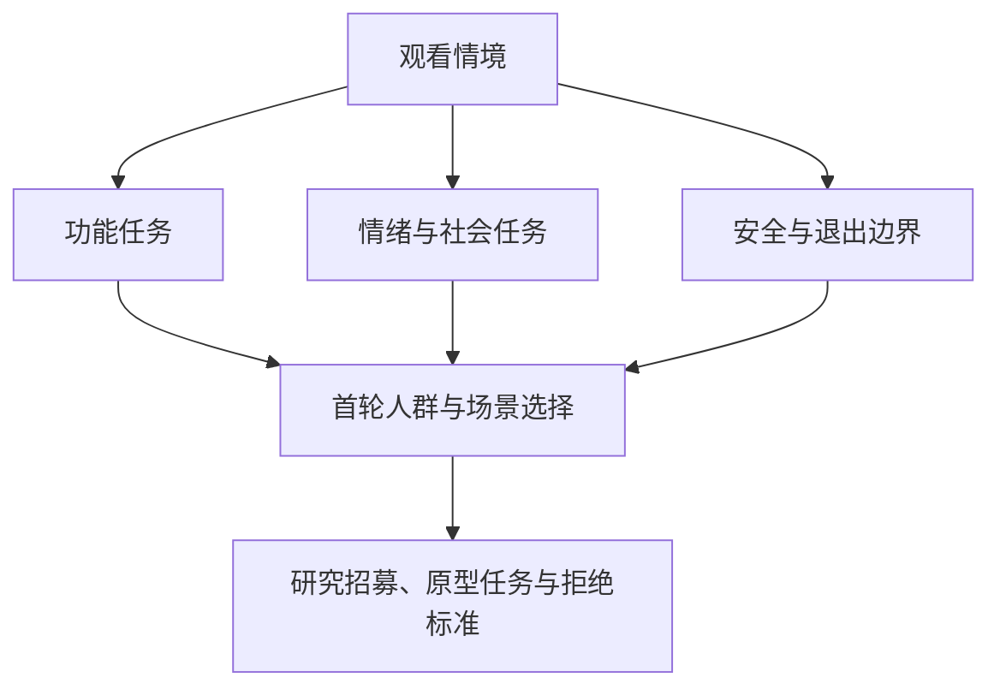
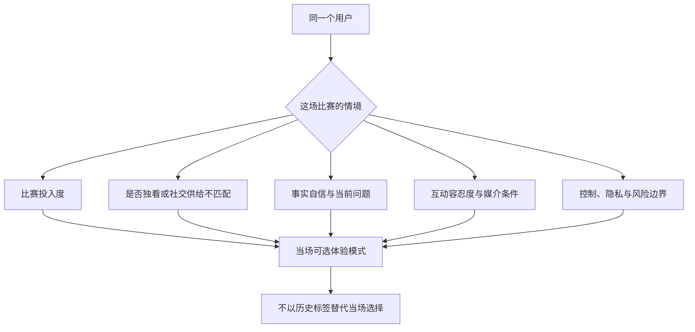
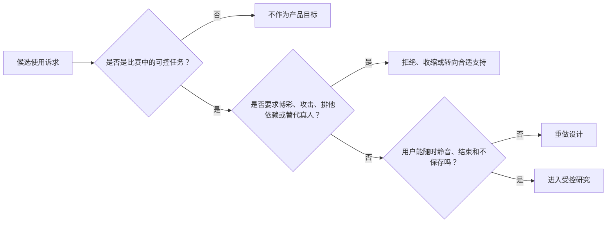
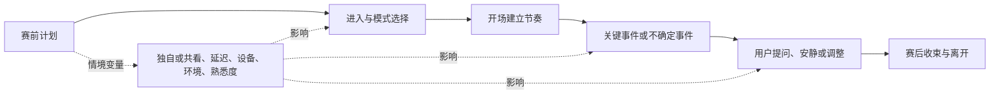

# 核心用户分层与使用情境

> **文档类型**：0→1 用户研究与价值定义基线  
> **适用阶段**：问题探索 → 滩头用户选择 → MVP 范围确定  
> **决策状态**：待验证。本文所有人群规模、偏好、留存和付费相关表述均为研究假设，不构成既成事实。  
> **研究信息截止**：2026-01-28  
> **证据口径**：仅使用公开外部资料、拟执行的用户研究与明确标注的假设。本文不引用既有阶段材料，也不把事后结果写成事前结论。

---

## 1. 这篇文档要作出的决定

“足球迷”不是一个可用于设计、招募或验证的用户定义。它同时混入了偶尔看大赛的人、每周稳定追赛的人、为支持一支球队而看球的人、只看集锦的人、需要专业分析的人、想聊天的人，以及根本不希望在比赛中被打扰的人。把这些人放在同一个画像里，最后通常会得到一个什么都能做、却不知道该在什么时候安静的产品。

本篇要回答五个前置问题：

1. 第一批应该为哪一类人解决哪一种重复出现的观赛任务？
2. 什么变量真正区分“需要数字陪看”与“只需要比分或资讯”的用户？
3. 一场比赛的赛前、赛中、赛后，用户的功能任务、情绪任务和安全边界如何变化？
4. 哪些人不应成为首批目标，即使他们看起来很活跃或更容易贡献时长？
5. 如何用招募、访谈、观赛日记和原型测试，把这些判断证实或推翻？

本文的产出不是一组可用于广告投放的空泛标签，而是一套可执行的选择：**首批滩头人群、使用情境地图、待验证 JTBD、研究样本、拒绝标准，以及从研究结果导出的产品约束。**

### 1.1 本轮的核心判断

本项目的初始假设是：最值得先研究的不是“最孤独的人”，也不是“最懂球的人”，而是**有稳定观赛习惯、经常在社交供给不匹配时独自看完整比赛、既希望共享关键时刻又不愿承受公共社区噪声的成年球迷**。

这个定义有意把“独自观看”与“孤独”分开。有人独看是因为比赛开得晚、支持的球队小众、朋友的阵营不同、工作日程错开，或只是更喜欢安静。把用户需求心理化、病理化，既会误判产品机会，也会把不健康的关系预设带进设计。首批研究需要验证的是：在这些明确情境里，用户是否愿意让一个数字角色以可控的方式参与比赛，而不是验证他们是否愿意被长期陪伴。

### 1.2 不在本文中决定的事

本文不会预先决定角色的性别、声音、外形、定价、联赛授权、赛事数据供应商或完整功能清单。这些事项要分别由角色设计、商业模式、合规和工程方案处理。用户分层只为它们提供约束：谁在什么情境下需要什么、绝对不愿接受什么、何时应当停止服务。

---

## 2. 分层原则：先按情境与任务分，再用人口属性校验

### 2.1 不把“年龄、性别、城市”当成需求本身

人口统计数据可以帮助安排招募配额、识别可及性差异和检查偏见，却不能单独解释陪看需求。两个同样 28 岁、支持同一支球队的人，可能一个每周固定与朋友线下看球，另一个因时区和作息长期独看；前者对数字陪看几乎没有兴趣，后者可能只想在争议判罚时问一句“刚刚为什么吹掉”。

因此，本项目按以下顺序分层：

1. **观赛行为**：看哪些赛事、频率如何、是否会看完整场、主要通过什么渠道观看。
2. **情境供给**：看球时是否有合适的人一起看，现有群聊、社区、解说和搜索是否足够。
3. **待完成任务**：用户是在确认事实、理解局面、分享情绪、维持仪式感，还是仅需要赛程提醒。
4. **互动偏好**：愿意听语音、看字幕、主动提问，还是只接受极少量提示；何种节奏被认为打扰。
5. **风险与边界**：是否可能把数字角色误认成真人、是否出现依赖性表达、是否为未成年人、是否涉及博彩或过度消费。
6. **人口属性与设备条件**：年龄段、地区、语言、无障碍需求、终端和网络，用于检查方案是否只适配少数人。

这是一种“行为优先、情境优先、边界优先”的分层方式。它不会假装消除人口差异，而是避免把人口标签误当因果解释。

### 2.2 一个用户可以属于多个层，不把人钉死在画像里

用户不是稳定不变的单一类型。同一个人看国家队淘汰赛时可能需要高强度共同经历；看普通联赛时只想安静接收一次开赛提示；与朋友同看时甚至完全不需要服务。分层的单位应是“人 × 比赛 × 情境”，而不是给用户贴一个永久标签。

这意味着研究和后续体验都要问两个问题：

- **这场比赛对你意味着什么？** 决赛、德比、主队保级、朋友相约、随手打开，情绪投入完全不同。
- **你现在希望我怎么参与？** 解释、轻陪、关键时刻提醒、仅文字，还是不说话。

当服务无法判断时，应优先让用户选择，而不是用历史偏好推断更亲密、更主动的互动。记忆可以减少重复设置，不能取消用户在每场比赛中的重新决定权。

### 2.3 用“替代品缺口”辨别真实机会

用户说“有个人陪我看挺好”不等于存在产品缺口。研究必须追问：他现在会怎样解决？为什么不满意？换成数字角色会失去什么？

**现有替代品：真人朋友或家人**
- **它解决得好的任务**：自然情绪共享、共同回忆、互相理解
- **它留下的缺口**：不一定同场、同队、同时间在线；也可能不愿打扰对方
- **对数字陪看的启示**：不应与真人关系竞争；应以低压力、可退出补足空档

**现有替代品：群聊、球迷群、评论区**
- **它解决得好的任务**：热闹、即时吐槽、多观点
- **它留下的缺口**：噪声、攻击、剧透、社交压力、阵营冲突
- **对数字陪看的启示**：价值不是“更热闹”，而是可控、无须表演的同场感

**现有替代品：转播与专业解说**
- **它解决得好的任务**：比赛画面、基础事实、专业解释
- **它留下的缺口**：无法回应个人问题或情绪；风格不可配置
- **对数字陪看的启示**：不重复播报，不假装取代专业解说

**现有替代品：数据、比分、新闻应用**
- **它解决得好的任务**：快速查赛程、事件和数据
- **它留下的缺口**：事务性强，缺乏情境判断和陪伴感
- **对数字陪看的启示**：事实必须可靠，但事实本身不是差异化终点

**现有替代品：通用聊天工具**
- **它解决得好的任务**：灵活问答、语言表达
- **它留下的缺口**：不一定理解实时状态、赛事时序或边界
- **对数字陪看的启示**：需要证明场景化可信和恰当时机，而非比拼闲聊长度

**现有替代品：短视频、集锦、社媒**
- **它解决得好的任务**：赛后回顾、情绪宣泄、观点消费
- **它留下的缺口**：碎片化、剧透、难以同步正在发生的比赛
- **对数字陪看的启示**：不在赛中把用户拉去消费无关内容

如果访谈发现目标用户对上述替代品已经满意，或他们只想要比分卡片，那么应放弃“数字陪看”假设，而不是用更强的人设或更多提醒强行制造需求。

---

## 3. 分层变量：决定体验的不是“爱不爱球”，而是八组条件

### 3.1 八组核心变量

> 信息卡：原宽表已改为纵向阅读，字段含义不变。

- **变量：观赛稳定度**
  - **要观察的问题**：一个月内看了多少场；是否按赛程提前安排
  - **高值表现**：有固定联赛/球队，常看完整场
  - **低值表现**：只在热点赛事或赛后看集锦
  - **设计上的含义**：高稳定度更适合研究连续回访；不代表更适合高频打扰

- **变量：比赛投入度**
  - **要观察的问题**：这场比赛对身份、情绪和时间安排的重要性
  - **高值表现**：德比、淘汰赛、主队关键战
  - **低值表现**：随机打开、背景播放
  - **设计上的含义**：投入度决定是否值得介入，不决定是否可越界

- **变量：社交供给匹配度**
  - **要观察的问题**：是否有想一起看且节奏相近的人
  - **高值表现**：有意愿但因时间/队伍/地点不匹配而缺席
  - **低值表现**：已有稳定同看伙伴
  - **设计上的含义**：缺口来自不匹配，不等同于缺朋友

- **变量：信息自信度**
  - **要观察的问题**：能否理解规则、阵容、事件和背景
  - **高值表现**：能自己判断并愿意讨论
  - **低值表现**：常被术语、规则或信息冲突卡住
  - **设计上的含义**：低自信需要解释，高自信也可能需要查证；都不应被居高临下对待

- **变量：互动容忍度**
  - **要观察的问题**：能接受多频繁、多长的声音或文字介入
  - **高值表现**：愿意在关键段落对话
  - **低值表现**：希望近乎全程安静
  - **设计上的含义**：默认应低干扰；不能用“活跃”替代“满意”

- **变量：表达目的**
  - **要观察的问题**：想确认、学习、吐槽、分享还是整理情绪
  - **高值表现**：有明确“刚才我想说一句”的时刻
  - **低值表现**：只希望被动接收赛况
  - **设计上的含义**：决定角色使用问句、回应、沉默还是摘要

- **变量：控制与隐私偏好**
  - **要观察的问题**：是否愿意授予记忆、通知、声音和数据权限
  - **高值表现**：愿意保存有限偏好且要求可管理
  - **低值表现**：不愿保存或只接受临时会话
  - **设计上的含义**：数据最小化、可见可删是基本选项，不是高级功能

- **变量：风险敏感度**
  - **要观察的问题**：对依赖、未成年、冲动消费、博彩、冲突内容的暴露
  - **高值表现**：明确担心被打扰或情绪绑架
  - **低值表现**：可能要求角色排他、持续黏连或提供投注建议
  - **设计上的含义**：风险优先级高于转化优先级；必要时应拒绝或转介

### 3.2 三种变量不能混为一谈

研究时尤其要避免三种错误推论：

- **高时长 ≠ 高价值。** 用户打开很久可能是忘了关、被动播放，或在情绪低落时反复寻求安抚。必须结合赛后感受、退出意愿和干扰感判断。
- **高互动 ≠ 高信任。** 连续追问可能代表事实表达不清、延迟过长或用户不信答案。信任应通过来源透明、错误修复意愿和下一次是否还愿意询问来测量。
- **独看 ≠ 需要亲密关系。** 很多人只需要一句恰当解释或一个无压力的共鸣。产品不得把“没有一起看的人”翻译成“应该被绑定的用户”。

### 3.3 用户状态变量：每一场比赛都可能重置

在正式交互前，至少允许用户设置或快速表达以下状态：

| 状态 | 可选值示例 | 影响的体验决定 |
| --- | --- | --- |
| 同看方式 | 独看 / 和朋友看 / 公共场所 / 后台听 | 是否主动说话、提示是否只显示文字 |
| 希望强度 | 安静陪看 / 关键时刻 / 有问题再说 / 赛后再聊 | 主动性上限和默认频道 |
| 知识深度 | 新手解释 / 简洁提示 / 深度讨论 | 术语解释和分析颗粒度 |
| 剧透容忍 | 仅当前画面 / 允许已确认赛事事件 / 赛后全量 | 事实推送与延迟策略 |
| 情绪意图 | 想庆祝 / 想冷静 / 不想被劝 / 只想听 | 角色语言与是否提出追问 |
| 记忆授权 | 本场临时 / 记住球队偏好 / 不保存 | 数据保留范围和复盘方式 |

这些状态应该由用户掌握，并且能在比赛中随时改变。它们不是通过情绪推断或后台画像自动得出的“真实需求”。

---

## 4. 候选用户层：六类人，而不是一个“大球迷”

以下六类是研究样本假设，不是发布时对用户展示的标签。首轮要通过访谈和真实观赛记录验证它们是否具有可重复的任务差异。

### 4.1 A 类：稳定追赛的独看球迷（首选滩头候选）

**定义假设**：过去四周至少观看四场完整或大部分完整的足球比赛；有一支持续关注的球队或一个稳定联赛；约半数重要比赛独自观看；偶尔想说、想问、想庆祝，但没有合适或低压力的同看对象。

**典型情境**：工作日晚场，用户准备好零食和直播，却发现朋友不看这场或群聊已经过于嘈杂。开场前他想确认首发；比赛中对一个判罚有疑问；进球时想分享，却不想把手机交给陌生评论区；赛后想简单回顾但不想被长篇热评淹没。

**待完成任务（JTBD）**：

> 当我独自看一场真正关心的比赛，并在关键时刻缺少合适的交流对象时，我希望能获得少量可信、同频、不会给我社交负担的回应，从而既能沉浸在比赛中，也不觉得那些时刻无人可分享。

**可能获得的价值**：低摩擦进入、关键时刻的确认、与支持对象相关的轻量共鸣、对复杂情境的简洁解释，以及可由自己关闭的赛后收束。

**最强拒绝信号**：认为角色“抢戏”“像客服”“比评论区更吵”；一旦事实错报就不再使用；认为角色刻意装熟或要求持续陪伴。

**必须验证的问题**：他们真的愿意打开一个独立服务，还是只希望已有聊天工具增加一项功能？他们希望的是声音、字幕还是赛后摘要？当真人朋友在线时，服务是否自动失去价值？

### 4.2 B 类：社交供给不匹配的共同体验寻求者

**定义假设**：对比赛的投入不一定高，但常遇到“身边有人、却没有人愿意或适合一起看同一场”的情况，包括时区、工作、队伍对立、家庭作息或不希望打扰熟人的原因。

**典型情境**：异地生活、夜间观看、所在社交圈不关心足球，或用户支持的小众球队没有固定讨论群。用户不一定想深聊战术，只希望某个进球、逆转或遗憾被看见。

**待完成任务（JTBD）**：

> 当我想把比赛中的高情绪时刻分享出去、又不想临时打扰朋友或进入陌生人争吵时，我希望有一个不会评判、不会把我拉入社交义务的对象回应我，从而保留共同经历感而不增加人际负担。

**价值与风险并存**：这一类最容易理解陪看价值，也最容易被错误地设计成“用产品替代现实关系”。研究必须确认他们把服务当作场景工具，而不是全天候情感支点。任何要求“只和我看”“你不能离开”“你比朋友重要”的表达，都不能被迎合。

### 4.3 C 类：希望看懂比赛的轻度进入者

**定义假设**：会因朋友、家庭、赛事热点或某支球队而看球，但规则、位置、阵容、赛程和战术语言带来门槛；他们不希望因提问而被嘲笑或被灌输。

**典型情境**：一场淘汰赛、德比或朋友相约观看。用户看得投入，却不知道为什么进球被取消、换人意味着什么、伤停补时如何计算，或为什么评论区反应激烈。

**待完成任务（JTBD）**：

> 当我对正在发生的比赛感到好奇却不懂专业术语时，我希望得到和此刻画面相关、没有优越感、能随时停止的解释，从而继续享受比赛而不是因不懂而退出。

**产品约束**：解释必须区分已确认事实、常见规则与不确定推测；不能把复杂足球话题简化为伪确定结论；也不能为了提高互动而不停教学。

### 4.4 D 类：事实敏感的深度关注者

**定义假设**：有较高信息自信度，重视阵容、数据、赛程、规则和来源；他们可能不需要陪伴，但很可能在事实冲突或直播延迟时迅速发现错误。

**典型情境**：用户同时看直播、数据页和社媒，对事件时序、伤停、越位或换人信息高度敏感。他们愿意测试可信度，却不会因“可爱人设”容忍错误。

**待完成任务（JTBD）**：

> 当不同来源对比赛事件说法不一致时，我希望能快速看到什么已确认、什么仍待确认以及为什么存在时差，从而自己判断而不是被自信但错误的说法带偏。

**研究角色**：这一类可作为事实可信度的压力测试样本，而不是首轮陪看留存的唯一来源。若只迎合这一类，产品会退化成信息面板；若忽略这一类，产品无法建立信任底座。

### 4.5 E 类：碎片化追热点的偶发观看者（观察，不作为首批承诺）

**定义假设**：主要在大赛、热门对决或社媒事件后进入；很少看完整比赛；常通过集锦、话题和朋友聊天了解足球。

这类用户数量可能大，但需求未必稳定。他们可能需要“快速不丢脸地进入话题”的解释，却不一定愿意在赛中建立持续互动。首轮只把他们作为对照样本：若他们对产品反应强，也要先判断是一次性新鲜感还是可复用场景。

### 4.6 F 类：强对抗、博彩导向或关系替代寻求者（明确排除）

以下诉求不能作为增长或留存目标：

- 希望获得盘口、赔率、下注时机、保本策略或任何投注引导；
- 希望角色替自己攻击其他球队、球迷、裁判、运动员或群体；
- 要求角色承诺排他、恋爱、嫉妒、全天候待命，或把它设置成替代亲友的对象；
- 在明显危机或极端情绪状态下，把数字角色当作专业医疗、心理、法律或紧急支持渠道；
- 试图索取未经授权的直播内容、盗播链接、个人信息或规避平台限制的方法。

排除不意味着忽视。产品需要清晰、温和、不过度拟人的拒绝方式；对紧急风险和未成年人还需要单独的升级、保护和支持信息机制。任何因拒绝而下降的互动指标，都不应被当作需要“优化”的流失。

---

## 5. 使用情境地图：按比赛节奏设计，而不是按页面菜单设计

### 5.1 一场比赛的七段旅程

> 信息卡：原宽表已改为纵向阅读，字段含义不变。

- **阶段：赛前计划**
  - **用户所处情境**：看到赛程、决定是否观看
  - **首要任务**：确认时间、渠道、重要性与陪看方式
  - **可能情绪**：期待、犹豫、忙碌
  - **可接受的服务**：一次可配置提醒、首发/背景的简洁入口
  - **应避免的服务**：连续催促、暗示“不来我会失望”

- **阶段：入场建立**
  - **用户所处情境**：打开直播前后
  - **首要任务**：设定互动强度、确认当前比赛和偏好
  - **可能情绪**：仪式感、专注
  - **可接受的服务**：明确 AI 身份、说明事实状态、快速选择安静程度
  - **应避免的服务**：长自我介绍、要求深度授权

- **阶段：平稳推进**
  - **用户所处情境**：比赛没有关键事件
  - **首要任务**：专心观看，偶尔确认规则或数据
  - **可能情绪**：平静、投入、走神
  - **可接受的服务**：默认安静；用户主动提问时短答
  - **应避免的服务**：为刷存在感的闲聊、复述画面

- **阶段：关键事件**
  - **用户所处情境**：进球、红牌、点球、伤病、争议判罚
  - **首要任务**：及时确认发生了什么，表达或消化情绪
  - **可能情绪**：兴奋、焦虑、愤怒、困惑
  - **可接受的服务**：先给确认状态，再给一句匹配回应；允许用户追问
  - **应避免的服务**：抢在画面前剧透、把推测说成事实、夸张煽动

- **阶段：信息冲突**
  - **用户所处情境**：直播、数据、社媒说法不一致
  - **首要任务**：分辨已知、未知与延迟
  - **可能情绪**：怀疑、烦躁
  - **可接受的服务**：清楚标明来源和待确认状态；承认不知道
  - **应避免的服务**：自信编造、把谣言当快讯

- **阶段：赛后收束**
  - **用户所处情境**：终场后几分钟至一天
  - **首要任务**：回顾、庆祝、遗憾、决定是否继续关注
  - **可能情绪**：释放、失落、满足
  - **可接受的服务**：可选的短复盘、共同瞬间保存、下场提醒选择
  - **应避免的服务**：强迫复盘、利用失落推销订阅

- **阶段：非赛日回访**
  - **用户所处情境**：无比赛或赛事间隔
  - **首要任务**：查看赛程、回忆、做轻量准备
  - **可能情绪**：期待、平常
  - **可接受的服务**：由用户发起的低频服务
  - **应避免的服务**：以情感话术制造无比赛日黏连

### 5.2 关键情境的“参与强度”规则

数字角色不应把每一个事件当作开口机会。可将参与强度分成四级，用户可随时切换：

**等级：0：完全安静**
- **行为定义**：不主动发声；只保留用户主动提问入口
- **适用人群/时刻**：与朋友同看、专注观看、公共环境
- **安全限制**：不以沉默判为流失，不做唤回追问

**等级：1：关键事实**
- **行为定义**：仅在用户授权且高置信关键事件时给出极短提示
- **适用人群/时刻**：事实敏感、想跟上比赛的用户
- **安全限制**：先确认后提示；不得抢先于用户选择的剧透边界

**等级：2：轻陪看**
- **行为定义**：在少量关键时刻提供简短情绪回应或解释
- **适用人群/时刻**：独看球迷、轻度进入者
- **安全限制**：每个时段设上限；用户一次拒绝后立即降低强度

**等级：3：用户发起对话**
- **行为定义**：由用户主动开启较长讨论
- **适用人群/时刻**：想问规则、回顾、表达情绪
- **安全限制**：仍不鼓励排他或无限时陪伴；需要可中断和可转文字

默认值应由首次使用情境决定，并在新比赛时再次确认，而不是把一次高互动永久固化为更高主动性。

### 5.3 情境失配的典型失败

**用户真实状态：用户在认真看画面**
- **错误介入**：长段解释、连续语音
- **为什么伤害体验**：夺走注意力，声音比价值更突出
- **研究中的识别信号**：用户说“别说了”“看不过来”，或直接静音

**用户真实状态：用户刚经历失利**
- **错误介入**：立即乐观鼓励或推销下一场
- **为什么伤害体验**：否认情绪，用脆弱时刻换转化
- **研究中的识别信号**：用户沉默、反感、删除或表达被冒犯

**用户真实状态：用户不懂判罚**
- **错误介入**：用术语堆砌或断言争议结论
- **为什么伤害体验**：增加羞耻感和错误信息
- **研究中的识别信号**：用户重复问、转去搜索、认为“听不懂”

**用户真实状态：用户与朋友同看**
- **错误介入**：角色抢话、要求回应
- **为什么伤害体验**：让数字服务与现实社交竞争
- **研究中的识别信号**：用户关闭服务或觉得尴尬

**用户真实状态：用户不愿保存记忆**
- **错误介入**：反复建议“记住我”
- **为什么伤害体验**：侵蚀控制权和信任
- **研究中的识别信号**：用户拒绝权限、担心被跟踪

---

## 6. JTBD 与用户任务：从“功能愿望”回到进展

### 6.1 五组核心工作

**工作类型：进入比赛**
- **Job story**：当我决定看一场比赛时，我想用很短时间确认它为什么值得看、何时开始以及如何设置陪看强度，从而不在开场前被信息和设置拖住
- **成功结果**：用户在一分钟内完成选择并进入观看
- **失败结果**：设置流程像问卷，用户还没看球就退出

**工作类型：跟上事实**
- **Job story**：当场上发生我没看清或不同来源说法不一的事件时，我想知道哪些内容已确认、哪些仍不确定，从而不把传闻或延迟当成比赛事实
- **成功结果**：用户理解状态、能自行判断是否继续追问
- **失败结果**：产品抢答、错报、掩盖不确定性

**工作类型：看懂局面**
- **Job story**：当我不理解规则、阵容或战术变化时，我想得到与眼前画面匹配的简洁解释，从而继续投入而不感到被轻视
- **成功结果**：解释可选择深度，用户不需离开观看场景
- **失败结果**：用百科式长文打断比赛或装作绝对专家

**工作类型：共享瞬间**
- **Job story**：当我在进球、逆转、争议或遗憾中想表达时，我想获得一句不要求我继续社交的回应，从而让情绪被承接但不被操纵
- **成功结果**：用户感觉被理解，并能自然回到比赛
- **失败结果**：角色过度煽情、强迫互动、贬低其他人

**工作类型：安全退出**
- **Job story**：当我不想继续互动、发现服务不准确或不愿被记住时，我想能立刻静音、纠正、关闭和删除，从而保留控制感
- **成功结果**：退出不带惩罚；用户能理解数据和记忆边界
- **失败结果**：产品劝留、羞辱、隐性保留、反复召回

### 6.2 功能任务、情绪任务、社会任务与安全任务

用户研究不能只问“你想要什么功能”。每个需求至少要拆成四层：

**层次：功能任务**
- **用户真正要完成的事**：看赛程、确认事件、理解规则、切换模式
- **示例提问**：“刚才你最想知道的事实是什么？”
- **对产品的要求**：准确、快速、可解释

**层次：情绪任务**
- **用户真正要完成的事**：庆祝、消化失落、降低焦虑、保持投入
- **示例提问**：“那一刻你希望别人怎么回应？”
- **对产品的要求**：温和、克制、不替用户定义感受

**层次：社会任务**
- **用户真正要完成的事**：不显得外行、维持与球队/朋友的连接、避免冲突
- **示例提问**：“你为什么没有去群里说？”
- **对产品的要求**：不制造表演压力，不放大阵营攻击

**层次：安全任务**
- **用户真正要完成的事**：保留距离、避免剧透、控制数据与提醒、随时退出
- **示例提问**：“什么会让你立刻关闭？”
- **对产品的要求**：默认低侵入、明确权限、可撤销

若功能任务已经被现有工具充分满足，而情绪或社会任务又不愿交给数字角色，则不应硬凑功能组合。反之，若用户强烈需要情绪回应但无法接受角色边界，也不能把高风险关系需求解释成产品机会。

### 6.3 需求强度评分：用于研究优先级，不用于给人打分

为比较不同情境的研究价值，可在访谈和日记中为每个“人 × 比赛 × 时刻”记录一个需求强度分数。它不是算法人格分，也不应用来自动推断用户情绪。

\[
N = 0.25F + 0.20U + 0.20G + 0.15A + 0.10C - 0.10R
\]

其中各项均按 1–5 分由研究者结合原始记录编码，并保留原因：

- **F（Frequency，频率）**：该情境在一个赛季中是否会重复出现；
- **U（Urgency，紧迫性）**：错过当下是否会失去价值；
- **G（Gap，替代缺口）**：现有朋友、转播、数据和社区是否无法低成本满足；
- **A（Attention fit，注意力适配）**：服务能否在不夺走比赛注意力的前提下介入；
- **C（Control fit，控制适配）**：用户是否能清楚设置、拒绝、纠正和退出；
- **R（Risk，风险暴露）**：是否涉及未成年人、依赖表达、过度激动、博彩、隐私或错误事实的高后果场景。

评分的作用是让团队比较“赛中争议判罚解释”和“非赛日主动闲聊”是否都值得优先做。任何风险高、控制适配差的情境，即使互动量预期高，也不能因分数好看进入 MVP。

---

## 7. 滩头选择：从所有球迷收缩到一个可验证单元

### 7.1 候选滩头比较

> 信息卡：原宽表已改为纵向阅读，字段含义不变。

- **候选人群：稳定追赛的独看成年球迷**
  - **情境清晰度**：高
  - **重复频率**：高
  - **替代品缺口**：中到高
  - **风险可控性**：中到高
  - **研究可招募性**：高
  - **首轮判断**：**首选**

- **候选人群：社交供给不匹配者**
  - **情境清晰度**：高
  - **重复频率**：中
  - **替代品缺口**：高
  - **风险可控性**：中，需严格边界
  - **研究可招募性**：中
  - **首轮判断**：与首选交叉招募

- **候选人群：轻度进入者**
  - **情境清晰度**：中
  - **重复频率**：中到低
  - **替代品缺口**：中
  - **风险可控性**：高
  - **研究可招募性**：高
  - **首轮判断**：第二阶段验证

- **候选人群：事实敏感深度关注者**
  - **情境清晰度**：高
  - **重复频率**：高
  - **替代品缺口**：中
  - **风险可控性**：高
  - **研究可招募性**：中
  - **首轮判断**：作为可信度压力样本

- **候选人群：大赛偶发观众**
  - **情境清晰度**：中
  - **重复频率**：低
  - **替代品缺口**：未知
  - **风险可控性**：高
  - **研究可招募性**：高
  - **首轮判断**：对照样本，不作为留存承诺

- **候选人群：强关系替代/博彩导向者**
  - **情境清晰度**：表面高
  - **重复频率**：未知
  - **替代品缺口**：不适用
  - **风险可控性**：低
  - **研究可招募性**：不应以增长为目标
  - **首轮判断**：排除

### 7.2 首选滩头的工作定义

首批研究暂定招募“稳定追赛的独看成年球迷”，同时确保其中一部分属于社交供给不匹配者。为了让样本可执行，而非停留在描述，设定以下入选条件：

- 年满当地适用的成年年龄；
- 过去四周至少观看 4 场足球比赛，其中至少 2 场观看超过 60 分钟；
- 对至少一个球队、联赛或国家队有连续关注，而不只观看一次热点赛事；
- 在过去四周至少 2 次重要比赛中主要独看，或因同看者不匹配而放弃交流；
- 能描述一次“想问、想分享或想确认，但没有满意渠道”的具体时刻；
- 知道拟议服务是 AI 数字角色，并愿意就语音/文字/图形角色的体验进行原型研究；
- 不把博彩建议、恋爱承诺、紧急心理支持或盗播内容作为参与目的。

这不是对价值的预判，而是为了先选到能给出高质量比较的人。研究中应同时招募“有稳定同看伙伴的人”作反例，防止团队把自己的滩头假设误当普遍规律。

### 7.3 成立门槛与退出条件

不因用户“说喜欢”就进入开发。至少满足以下门槛，才可将该滩头推进到可交互 MVP：

1. 在至少 24 名合格访谈对象中，超过一半能自发描述过去一个月内至少两次具体的陪看或事实确认缺口；
2. 在观赛日记或情境原型中，超过一半的首选样本愿意在第二场比赛再次选择服务，且主要原因不是新鲜感；
3. “安静陪看/关键时刻模式”被评价为比连续对话更舒服，且用户能理解和改变强度；
4. 事实冲突场景中，用户更信任明确说明不确定的表达，而非更快但武断的答案；
5. 没有出现无法通过设计与运营缓解的高频误认真人、排他依赖、剧透伤害或隐私误解。

若前三项不成立，说明问题可能更适合由赛事工具、社区功能或现有聊天渠道解决；应暂停数字陪看方向，不以强化人设、增加通知或拉长对话来挽救数据。

---

## 8. 招募与筛选：用具体行为找样本，而不是寻找“寂寞用户”

### 8.1 招募渠道与偏差控制

可从球迷社群、赛事内容创作者受众、线下观赛活动、朋友转介、职业与兴趣社群等渠道招募，但不能只在单一强队粉丝群、AI 爱好者群或付费用户群中找人。每个渠道会带来不同偏差：

**渠道：球迷社群**
- **优势**：能快速找到稳定追赛者
- **主要偏差**：高表达、强阵营、社区耐受度较高
- **控制方式**：补充不常发言者和不同球队样本

**渠道：线下观赛场所**
- **优势**：能观察共同观看与独看对照
- **主要偏差**：用户可能社交供给充足
- **控制方式**：作为反例样本，不只招募常客

**渠道：内容创作者受众**
- **优势**：可触达轻度与热点用户
- **主要偏差**：对创作者和内容消费依赖更强
- **控制方式**：问清其是否看完整比赛、是否已有替代品

**渠道：熟人转介**
- **优势**：信任较高、回访方便
- **主要偏差**：年龄、地区、兴趣相似
- **控制方式**：设置明确配额，避免滚雪球同质化

**渠道：普通社交平台招募**
- **优势**：覆盖面广
- **主要偏差**：自选参与、可能只为激励
- **控制方式**：用具体行为题和回访筛选

招募文案不使用“孤独”“陪伴缺失”“找一个永远懂你的人”等暗示性语言。建议使用中性表述：邀请有真实观赛经历的成年用户，分享赛前、赛中、赛后的信息、交流和体验偏好；研究对象为明确标识的 AI 数字陪看概念。

### 8.2 建议样本配额

探索期建议至少招募 30 名深访参与者，完成 24 名有效访谈；另招募 12 名进行两到三场比赛的日记研究，其中可与深访重叠。配额是保证差异被看见，不是统计代表性声称。

| 维度 | 最低配额建议 | 原因 |
| --- | --- | --- |
| 稳定追赛独看者 | 12 名 | 验证首选滩头的核心情境 |
| 有稳定同看伙伴的对照组 | 6 名 | 检验“独看”是否真是关键变量 |
| 轻度进入者 | 4 名 | 判断解释型价值是否独立成立 |
| 事实敏感深度关注者 | 4 名 | 测试可信度、延迟和不确定表达 |
| 不同观看设备与网络条件 | 每类至少 4 名 | 检验声音、字幕和实时交互是否可用 |
| 不同性别、年龄、城市/时区与生活状态 | 交叉配额，不设单一刻板比例 | 防止单一圈层的表达被当作普遍需求 |

若研究涉及未成年人，应先完成独立的年龄适当性、监护同意、内容保护和数据处理设计；在这些条件明确前，本轮探索仅招募成年人。

### 8.3 筛选问卷核心题

筛选题应以最近四周的具体行为为主，避免“你喜欢足球吗”这类自我认同题。

1. 请列出过去四周你看过的足球比赛（可写赛事类型、是否看完、观看方式）。
2. 最近一场你真正关心的比赛是什么？赛前为什么决定看？
3. 当时谁和你一起看？若独看，是主动选择还是缺少合适同看者？
4. 比赛中你是否查看过比分、阵容、规则解释、群聊、评论区或社交平台？请说具体时刻。
5. 有没有一个瞬间你想分享、吐槽或提问，但没有做？为什么？
6. 你通常愿意在看比赛时听到声音提醒吗？什么情形会让你立刻关闭？
7. 你能否接受一位明确标识为 AI 的数字角色在比赛中提供文字或声音互动？什么条件下可以，什么条件下不可以？
8. 对保存球队偏好、互动方式或共同瞬间，你的接受边界是什么？
9. 你是否主要为了博彩、投资、盗播资源、情感替代或专业危机支持而寻找此类服务？若是，不进入本轮样本。

筛选时不应因为受访者“很想要一个恋人型 AI”而优先录取。那是风险信号，需要按研究伦理和安全流程处理，不是产品需求优先级。

---

## 9. 研究设计：先听真实比赛，再测试概念，最后验证重复选择

### 9.1 三阶段研究路径

> 信息卡：原宽表已改为纵向阅读，字段含义不变。

- **阶段：发现**
  - **目标**：还原真实观赛与替代行为
  - **方法**：60–90 分钟半结构访谈、时间线回放
  - **样本**：24 名有效样本
  - **主要产出**：情境地图、任务语言、拒绝信号、初始分层
  - **不能得出的结论**：不能证明留存或付费

- **阶段：情境验证**
  - **目标**：比较不同参与强度与表达方式
  - **方法**：关键事件脚本、纸面/交互原型、可信度冲突测试
  - **样本**：18–24 名，含对照
  - **主要产出**：模式偏好、可理解性、事实与边界问题
  - **不能得出的结论**：不能证明真实比赛中的持续价值

- **阶段：真实重复**
  - **目标**：观察真实赛事中的选择与反感
  - **方法**：两到三场比赛日记、赛后短访谈
  - **样本**：12–16 名
  - **主要产出**：复用率、干扰时刻、退出原因、情境差异
  - **不能得出的结论**：样本小，不能做市场规模宣称

所有阶段都应把“没有使用”“关闭服务”“选择安静”“宁愿找朋友”视为有价值的结果。研究者不得将其引导成“你是不是还没习惯”。

### 9.2 访谈结构与关键问题

**第一段：真实回忆，不先介绍概念。**

- 请按时间顺序讲最近一场你看得比较投入的比赛：从知道赛程到赛后结束。
- 哪些时刻你拿起了手机？每次是为了什么？
- 你当时和谁交流、在哪里交流？为什么选那里或不选那里？
- 有什么信息让你不确定？你如何决定信谁？

**第二段：还原情绪和边界。**

- 那场比赛中最想有人回应的时刻是什么？你希望听到什么，又绝不想听到什么？
- 对你来说，“陪看”最舒服和最不舒服的样子分别是什么？
- 什么会让一个数字角色显得真诚，什么会让它显得装熟、吵或冒犯？
- 如果它记住了你的球队、互动偏好或某个共同瞬间，你希望怎样看见、改掉或删除？

**第三段：替代品与付出。**

- 你现在会怎么解决这些需求？哪里已足够，哪里不够？
- 如果使用这个服务需要占一部分注意力、允许少量数据保存或支付费用，你愿意交换什么？哪些条件绝不接受？
- 当朋友在场、比赛不重要或你心情很差时，它应该怎样退后？

**第四段：情境原型和反例。**

- 对同一关键事件展示“安静”“只给事实”“轻回应”“连续闲聊”四种脚本，请用户比较。
- 对同一事实冲突展示“快速断言”和“说明待确认”两种表达，询问信任、焦虑和继续使用意愿。
- 展示一句排他、内疚或过度亲密的话，让用户解释为什么不舒服或为什么会受吸引；这不是为了寻找更强话术，而是为了确定禁止边界。

### 9.3 比赛日记模板

日记不要求用户在比赛中写长文。每场只记录六个时间点：赛前、开场后、第一次关键事件、一次不确定或困惑、终场、赛后第二天。每个时间点用 1–2 分钟回答：

- 我在做什么，周围有没有人？
- 我最需要什么：事实、解释、表达、安静，还是没有需要？
- 我会不会主动打开服务？若不会，为什么？
- 这次回应是加分、中性还是打扰？具体原因是什么？
- 我是否觉得它知道得太多、说得太多、太像人或不够可信？
- 我希望下场比赛保留、改变或删除什么设置？

研究人员应取得明确同意后再收集日记；不得要求用户提供聊天隐私、直播画面、社群记录或可识别第三人的信息。

---

## 10. 假设、证伪标准与决策门

> 信息卡：原宽表已改为纵向阅读，字段含义不变。

- **编号：U1**
  - **待验证假设**：稳定独看者存在重复的、可描述的陪看缺口
  - **主要方法**：深访、日记
  - **支持信号**：多名用户自发描述相似情境，且替代品不完全满足
  - **证伪或暂停信号**：多数只要比分或已有朋友/群聊足够
  - **影响的下一步**：缩小为信息工具，或停止陪看方向

- **编号：U2**
  - **待验证假设**：关键时刻轻介入优于连续陪聊
  - **主要方法**：脚本对照、日记
  - **支持信号**：用户主动选择低干扰模式并在第二场复用
  - **证伪或暂停信号**：用户更偏好完全无介入或持续闲聊两极化严重
  - **影响的下一步**：重做交互模式或重新分层

- **编号：U3**
  - **待验证假设**：事实透明比武断抢答更能建立长期信任
  - **主要方法**：冲突情境测试
  - **支持信号**：用户能理解待确认状态，愿意继续使用
  - **证伪或暂停信号**：用户只追求速度且无法接受不确定性
  - **影响的下一步**：评估是否不适合赛中场景

- **编号：U4**
  - **待验证假设**：受控记忆提高便利而不会显著降低控制感
  - **主要方法**：权限原型、可理解性测试
  - **支持信号**：用户能清楚说出保存范围、主动修改/删除
  - **证伪或暂停信号**：大量用户误解或拒绝任何保存
  - **影响的下一步**：采用临时会话，延后记忆功能

- **编号：U5**
  - **待验证假设**：温暖但非排他的角色能形成足够价值
  - **主要方法**：角色脚本测试、复访
  - **支持信号**：用户觉得自然、有边界，愿意下场再用
  - **证伪或暂停信号**：用户只对越界亲密表达有兴趣
  - **影响的下一步**：不以高风险互动换留存，重新评估需求

- **编号：U6**
  - **待验证假设**：轻度进入者需要的是解释而非长期陪伴
  - **主要方法**：访谈、原型
  - **支持信号**：对上下文解释评价高，对记忆/主动性兴趣低
  - **证伪或暂停信号**：解释需求弱或被转播/搜索完全满足
  - **影响的下一步**：将其作为次级功能而非人群主线

决策门应在每个阶段结束后召开，不允许用“再多做一点功能看看”绕过证伪结果。记录必须包含原始引语、反例、样本构成和研究限制，避免只摘取支持产品的片段。

---

## 11. 从用户研究导出的 MVP 约束

在 U1–U6 尚未验证前，MVP 的范围应服从以下约束，而不是堆叠看起来完整的功能：

### 11.1 必须优先验证的能力

1. **场景进入与强度选择**：用户能在数十秒内选择这场比赛希望的参与方式，并能随时转为安静。
2. **关键事件中的事实边界**：能以用户可理解的方式区分确认、待确认和不提供判断，且不越过剧透设置。
3. **短而恰当的互动**：声音、字幕或文字不会与画面争夺注意力；用户可以打断或不回应。
4. **最小化的偏好控制**：球队、表达深度、提醒和记忆各自独立授权，且可以查看、修改、删除。
5. **安全退出与拒绝**：对于博彩、仇恨、排他依赖、危机支持和侵权内容，提供明确的边界和合适的下一步。

### 11.2 暂缓承诺的能力

- 复杂的长期关系等级、连续签到、情绪打卡或以每日回访为目标的机制；
- 大规模公共社交、陌生人匹配、阵营对战、排行榜和煽动式互动；
- 以“预测准确率”驱动的赛果、投注或收益功能；
- 需要大量个人数据才能工作、但用户无法清楚理解其用途的个性化；
- 试图覆盖所有联赛、所有语言、所有设备和所有赛事时段的广泛承诺。

暂缓不是否定未来可能性，而是拒绝在尚未证明核心任务成立时，把复杂度、风险和成本提前带入产品。

### 11.3 体验文案的边界示例

| 场景 | 可以表达 | 不可以表达 |
| --- | --- | --- |
| 用户开启陪看 | “这场想让我安静陪着、只报关键事实，还是有问题再说？” | “终于等到你了，今天只能陪我看。” |
| 事实待确认 | “我先不把这件事当作确定消息，等画面/可靠来源确认后再告诉你。” | “绝对是这样，别看别的。” |
| 用户失利后沉默 | “这场确实不好受。要不要我先安静一会儿，或等你想聊再说？” | “别难过，你还有我，朋友不会懂你。” |
| 用户关闭互动 | “好的，我会安静。你随时可以再叫我。” | “你为什么不理我？我会一直等你。” |
| 博彩请求 | “我不能提供下注建议或保证结果；如果你愿意，可以只聊已确认的比赛信息。” | “这一球很稳，可以考虑加注。” |

这些例子不是最终话术库，但它们把“角色温度”和“关系边界”变成可评审、可测试的产品条件。

---

## 12. 指标：衡量是否帮助看球，而不是是否占据时间

### 12.1 研究阶段指标

**指标：具体缺口率**
- **定义**：能描述近期具体情境且现有替代品不满意的样本比例
- **为什么重要**：判断问题是否真实而非概念好听
- **误用风险**：不应把单次抱怨当高需求

**指标：第二场主动选择率**
- **定义**：日记研究中用户是否在下一场主动选择服务
- **为什么重要**：初步区分新鲜感和可重复价值
- **误用风险**：小样本不代表市场留存

**指标：安静模式满意率**
- **定义**：用户选择低干扰模式后仍认为体验有价值的比例
- **为什么重要**：验证“沉默也能服务”的假设
- **误用风险**：不应逼用户选互动来提高该指标

**指标：事实可理解性**
- **定义**：用户能否复述确认/待确认/未知之间的差别
- **为什么重要**：可信设计是否真正被理解
- **误用风险**：不能只测是否看见标签

**指标：控制感评分**
- **定义**：用户是否知道如何静音、退出、改偏好、删记忆
- **为什么重要**：陪伴产品的安全底座
- **误用风险**：不能用复杂设置换取表面合规

**指标：负面影响信号**
- **定义**：被打扰、被剧透、被操纵、被误导、误认真人、依赖性表达的报告
- **为什么重要**：判断是否应暂停或重设计
- **误用风险**：不能因样本小而忽略严重个案

### 12.2 试点阶段的护栏指标

一旦进入真实试点，所有增长指标都必须与护栏并列呈现：

- 用户主动降低互动强度、静音或关闭的比例及其原因；
- 因事实错误、剧透、错误语气而触发的纠正和投诉；
- 对 AI 身份、记忆保存、删除和提醒设置的理解与成功完成率；
- 拒绝博彩、仇恨、依赖和危机类请求后，是否仍保持尊重与安全；
- 用户是否把服务描述为“帮助我看球”，而不是“让我离不开它”；
- 未成年人、脆弱状态和异常高频使用相关的风险信号及处置时效。

不把“单场对话轮数”“连续在线时长”“深夜召回成功率”“用户因关闭提醒而流失”单独作为优化目标。它们最多是诊断变量，且必须与打扰、依赖和控制感一起解释。

---

## 13. 风险登记与研究伦理

### 13.1 用户研究的风险清单

**风险：将独看等同于孤独**
- **可能表现**：招募/访谈把用户推向脆弱叙事
- **预防措施**：使用中性语言，问具体情境而非人格缺陷
- **触发后的处理原则**：记录研究偏差，修改脚本，不把脆弱表达用于转化

**风险：诱发依赖或排他期待**
- **可能表现**：原型文案把角色塑造成唯一支持
- **预防措施**：禁止恋爱、内疚、占有和全天候承诺脚本
- **触发后的处理原则**：立即停止该表达测试，提供清晰边界

**风险：事实错误带来误导**
- **可能表现**：参与者把示例当真实赛况或专业建议
- **预防措施**：明确标注情境材料，区分事实和假设
- **触发后的处理原则**：及时纠正，记录可理解性问题

**风险：剧透伤害**
- **可能表现**：测试材料早于用户观看进度
- **预防措施**：先确认进度与剧透偏好，使用非实时回放材料
- **触发后的处理原则**：允许跳过，不将不适解释为低参与

**风险：隐私过收集**
- **可能表现**：收集群聊、直播、第三方身份或敏感对话
- **预防措施**：数据最小化、去标识化、明确同意
- **触发后的处理原则**：删除不必要材料，说明处理方式

**风险：未成年人或危机情境**
- **可能表现**：参与者不适合进入成人原型或表达即时风险
- **预防措施**：年龄筛选、研究者培训、明确不提供专业支持
- **触发后的处理原则**：依预先制定的安全流程终止研究并提供适当信息

**风险：博彩和仇恨内容**
- **可能表现**：用户尝试把研究转为荐彩或攻击
- **预防措施**：访谈边界、主持人中断规则
- **触发后的处理原则**：不讨论或强化相关内容，必要时停止参与

### 13.2 外部治理为什么进入用户定义阶段

NIST 的 AI 风险管理框架以及其生成式 AI 配套文件强调，风险识别、衡量、治理和管理应贯穿 AI 系统生命周期，而不是只由工程或法务在发布前检查。[S5][S6] 美国 FTC 对陪伴型 AI 的调查重点也包括角色设计、商业化如何影响互动、未成年人风险、数据处理和上线后的负面影响监测。[S7] 国内公开规范则对生成式人工智能服务的内容安全、用户权益、未成年人保护和生成合成内容标识提出要求。[S8][S9]

对本项目而言，这些不是抽象合规条目。它们直接影响“谁可以被招募”“什么表达不可测试”“哪些成功指标不能采用”“怎样解释 AI 身份”和“什么时候应让产品退后”。如果没有这些约束，用户分层很容易滑向寻找最容易被留住的人，而不是寻找最能从服务中获得健康价值的人。

---

## 14. 本篇的决策结论与下一步输入

### 14.1 暂定结论

1. 以“稳定追赛的独看成年球迷”为首选研究滩头，以“社交供给不匹配”作为解释其需求缺口的关键变量，而不是将用户定义为孤独或缺少现实关系。
2. 以“关键时刻的恰当介入”定义价值单位；默认低干扰，允许沉默，反对用聊天长度替代价值。
3. 同时研究事实确认、解释、共享瞬间和安全退出四类任务；任何单一功能都不足以证明陪看价值。
4. 把轻度进入者和事实敏感者作为重要对照样本，防止产品只服务于一种高表达群体。
5. 将博彩导向、仇恨攻击、关系替代、紧急专业支持和侵权内容需求明确排除，不以它们的互动潜力定义机会。
6. 在完成访谈、情境原型和多场日记研究前，不声称用户规模、付费意愿、留存或市场规模已经成立。

### 14.2 对后续文档的输入

| 后续工作 | 本文提供的输入 | 必须继续回答的问题 |
| --- | --- | --- |
| 价值主张 | 首选滩头、核心工作、替代品缺口 | 用户愿意以什么语言描述价值，哪些承诺最可信 |
| 观赛旅程设计 | 七段情境、参与强度、失配案例 | 每个时刻的界面、声音、字幕和退出机制如何实现 |
| 角色与关系边界 | 可接受与禁止表达、控制原则 | 角色人格、语气和修复机制如何被评审和持续校准 |
| 事实可信设计 | 事实敏感样本与冲突任务 | 来源、时序、延迟、错误更正和剧透设置如何定义 |
| 隐私与记忆设计 | 授权状态、可见可改可删的要求 | 数据最小化、保留期限、访问与删除体验如何落地 |
| MVP 验证计划 | 假设、门槛、退出条件、研究样本 | 原型范围、试点规模、实验伦理和停机条件 |

### 14.3 进入下一阶段前的检查清单

- [ ] 已完成至少 24 名有效深度访谈，并保留支持与反驳假设的原始材料；
- [ ] 已覆盖首选滩头、稳定同看对照、轻度进入者和事实敏感者；
- [ ] 已完成至少 12 名用户的两到三场真实观赛日记或等效情境观察；
- [ ] 已验证用户能理解 AI 身份、主动性设置、剧透边界和记忆控制；
- [ ] 已记录并评审所有事实错误、打扰、剧透、依赖表达和隐私担忧；
- [ ] 已根据证伪结果明确继续、缩小、转向或停止的决定；
- [ ] 未把互动时长、情绪脆弱或高风险诉求当作增长优势。

---

## 15. 公开研究与规范来源

以下来源用于限定研究问题和风险边界，不用于替代本项目的用户证据。所有链接访问于 **2026-01-28**。

- **S3. Nielsen，*The Future of Fandom Is Here*。作为粉丝参与包含内容、社交与身份表达的研究线索** [链接](https://www.fifa.com/fifaplus/en/articles/fifa-world-cup-qatar-2022-engaged-five-billion-fans)
- **S4. Deloitte，*Sports media and entertainment*。用于识别体育媒体与互动行为的行业背景** [链接](https://www.fifa.com/fifaplus/en/articles/fifa-world-cup-qatar-2022-engaged-five-billion-fans)
- **S5. NIST，*AI Risk Management Framework*。用于风险治理、测量与全生命周期思路** [链接](https://www.nist.gov/itl/ai-risk-management-framework)
- **S6. NIST，*Artificial Intelligence Risk Management Framework: Generative Artificial Intelligence Profile*。用于生成式 AI 的风险分类与治理输入** [链接](https://www.nist.gov/publications/artificial-intelligence-risk-management-framework-generative-artificial-intelligence)
- **S7. U.S. Federal Trade Commission，*FTC launches inquiry into AI chatbots acting as companions*。用于陪伴型 AI 的角色、商业化、未成年人、数据与负面影响监测问题** [链接](https://www.ftc.gov/news-events/news/press-releases/2025/09/ftc-launches-inquiry-ai-chatbots-acting-companions)
