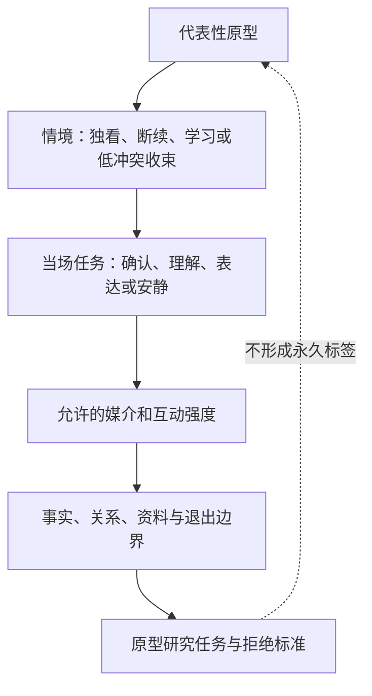
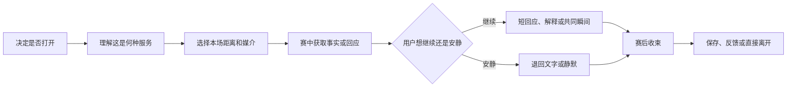
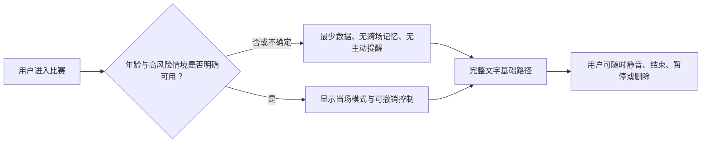

# 观赛旅程与用户情境

> **文档性质**：用户与价值定义资料——观赛旅程与情境设计  
> **所属**：球球全套资料，卷 2「用户与价值定义」第 8 篇  

在功能和话术定型之前，我们要先回答一个问题：谁会在什么样的观看情境里需要一位数字球友（Digital Ballmate）？他们想完成什么，又不愿被打扰到什么程度？本篇把这些判断整理成一段可研究、可设计、可检验的观赛旅程。

先说清一个用词：本文的"画像"指观赛情境与人群研究，是设计开始之前的研究工具；产品内用户可查看、可管理的记忆画像见偏好设置，两者不是一回事。画像也不是用姓名、年龄、职业和消费力拼成的"角色卡"，而是围绕可观察情境、待完成任务、可承受风险建立的决策工具。

还有一个原则贯穿全篇：本文写的是设计前的判断与待验证的假设，不把假设写成已被证明的用户事实。文末列出的均为公开可查的资料；我们自己的结论，要等研究做完才会下。

## 1. 先回答什么问题

"足球用户"不是一个足够可用的用户定义。有人一周看多场完整比赛，有人只在国家队大赛或主队关键战出现；有人需要战术解释，有人只想在进球后有人能理解；有人喜欢群聊的热闹，有人正是为了躲开群聊的剧透、争吵和压力。若只按年龄、性别、城市或"重度/轻度球迷"分层，我们仍然不知道应该在比赛第 17 分钟说什么、什么时候闭嘴、事实还不确定时如何回应，以及用户为什么会在下一场比赛再回来。

所以，本篇先回答五个问题：

1. 优先服务哪几类观看情境，而不是笼统服务所有球迷；
2. 用户在赛前、赛中、赛后分别想完成什么任务，情绪会怎样变化；
3. 数字球友应在哪些时刻主动出现，哪些时刻必须退后；
4. 不同能力、注意力、隐私偏好和年龄阶段的用户，如何保有同等控制权；
5. 哪些研究结果会推翻产品假设，让我们停下来。

这五个答案共同构成体验范围。一个功能若不能改善某个具体任务、不能降低某个明确的失败点，或者会损害用户的控制权，就不应因为"看起来很聪明"而进入首版。

## 2. 情境设计：七个变量，而不是一张标签

### 2.1 从人口属性转向情境、任务与边界

我们采用"情境—任务—代价"的画像方法，而不是"人口标签—功能列表"。同一位用户可以在不同比赛中呈现完全不同的状态：周中独自看海外联赛时需要低负担的回应，周末和朋友聚会时只需要安静的信息辅助，主队被淘汰后则只想暂时离开任何对话。因此，画像不应把人锁死成一个永久身份。

我们用七个变量记录每一次观赛，而不是先给人贴标签：

| 变量 | 我们记录什么 | 为什么影响设计 | 我们不做的推断 |
| --- | --- | --- | --- |
| 比赛重要度 | 主队、淘汰赛、德比、普通联赛、补看 | 决定情绪波动、允许的打扰强度和赛后需求 | 重要比赛不等于用户想多说话 |
| 观看方式 | 独自、同住者、线下聚会、群聊并行、公共场所 | 决定声音是否可用、是否怕剧透、社交负担大小 | 独自观看不等于孤独或缺少现实关系 |
| 观看节奏 | 直播、延迟直播、集锦、文字跟踪、断续观看 | 决定事实时序、提醒许可和恢复上下文的方式 | 看集锦的人不一定需要实时陪伴 |
| 足球熟悉度 | 对阵容规则、球队历史、战术语言、赛事制度的自信程度 | 决定解释的粒度与提问方式 | 不熟悉不代表"新手"或不热爱足球 |
| 情绪目标 | 共鸣、理解、庆祝、安静、情绪收束、表达观点 | 决定回应语气与主动沉默策略 | 强烈情绪不等于需要安慰或劝导 |
| 控制偏好 | 文字/语音、提醒频率、记忆许可、分享意愿 | 决定个性化的权限边界 | 一次授权不等于永久授权 |
| 风险情境 | 未成年、深夜独处、失利后强烈低落、被骚扰经历、无障碍需要 | 决定保护门槛、转介与退出路径设计 | 风险提示不应把用户污名化 |

这套框架的好处是：同一位用户可以被理解为"在某场重要直播中、独自观看、对判罚规则不自信、希望安静档陪看、拒绝保存记忆"的情境组合。我们据此设计的是一段服务，而不是对一个群体的刻板印象。

### 2.2 先写下假设，再去找答案

在访谈开始之前，我们先公开写下假设，避免研究过程只听见支持产品的声音。比如我们假设：一部分独自观看者需要的是"可随时退出的共同经历"，而非持续聊天；观看重要比赛时，用户更在意事实可信与时序正确，而不是更快的拟人回应；用户愿意让产品记住有限的观看偏好，但要求能看见、修正和删除。每一个假设都配有证伪信号——一旦出现，就触发范围、表达或优先级的调整。完整的假设、方法与判定标准由《需求假设与验证计划》统一维护；研究执行之前，本文不预设任何结论。

### 2.3 研究伦理是设计的一部分

研究不应借"陪伴"之名索取超过问题所需的私人信息：只收集解释观看情境所必需的资料，不询问与研究无关的家庭状况、健康信息或账号内容。每位参与者都应清楚知道研究目的、记录方式、是否录音、何时删除原始材料、可以跳过哪些问题、可以随时退出且不损失补偿。未成年人、近期情绪危机者的参与需要独立的保护流程与退出路径；这些流程准备好之前，不进入样本。陪伴型 AI 的角色设计、数据处理与未成年人风险已是监管关注点（见文末参考资料），它们不是后置的法务勾选项，而是研究设计的一部分。

## 3. 公开资料怎么用

公开资料不能替代目标用户研究。它们在我们这里只发挥三类作用：提供研究方法（如 Nielsen Norman Group 的旅程图方法、GOV.UK 服务手册的用户研究流程）、定义最低体验标准（如 W3C WCAG 2.2 的无障碍基线）、提醒陪伴型互动的风险边界（如美国 FTC 对陪伴型 AI 的调查、国内《生成式人工智能服务管理暂行办法》）。它们不能证明"用户一定需要数字球友"，也不能证明某一类用户一定愿意付费；链接见文末。

## 4. 四个代表性原型：不是人物设定，而是优先验证的情境组合

以下四个原型是研究样本的覆盖框架，不是"用户卡通形象"，也不是对真实人群的最终分层。每一个都包含进入情境、待办任务、最小价值与拒绝信号。若研究发现它们并不成立，应合并、拆分或撤销，而不是为了让文档好看而保留。

### 4.1 原型 A：独自投入的重要比赛观看者

**进入情境。** 用户正在观看自己关心球队的关键直播，身边没有合适的同看对象，或不想进入充满刷屏、对立和剧透的群聊。比赛对他有情绪重量，但他并不一定希望被安慰，也可能只想有人"在场"。

**要完成的任务。** 在不离开直播画面的前提下确认关键事件是否可信；在进球、红牌、争议判罚或最后时刻有人能理解此刻的重要性；在情绪过强时不被过度追问；赛后可选择简短回顾或直接结束。

**最小价值主张。** "你不用解释自己为什么在意；当你愿意说时，有一个不抢戏、不会剧透、不会把情绪变成负担的陪看对象。"

**关键设计约束。** 默认低频，而不是以沉默换取更多消息；事实与感受分开表达，先说明"该事件仍待确认"，再询问是否需要解释；用户明确沉默、关闭声音或连续忽略后，降低主动性而非升级提醒；赛后不得利用失利或孤独暗示"只有我懂你""别离开我"。

**拒绝信号。** 用户多次表示"不要说话""我只想看球"、只使用比分摘要、在关键时刻被打断后立刻退出。若此类信号在目标情境中普遍出现，首版应退回"可信的安静信息助手"，而不是继续强化陪伴话术。

### 4.2 原型 B：断续观看、需要快速接回上下文的人

**进入情境。** 用户因通勤、家务、工作消息或网络条件无法完整连续观看。回来时最怕错过决定性变化，也不想被一长串资讯或无关聊天淹没。

**要完成的任务。** 在 10–20 秒内知道离开期间发生了什么、哪些事件已确认、对支持球队意味着什么；继续观看后不被反复提示已看过的信息；必要时以文字而非声音完成交互。

**最小价值主张。** "你离开过，但不必从头补课；回来时只拿到足够接上比赛的可靠信息。"

**关键设计约束。** "离开期间摘要"以时间、事件状态和观看进度组织，而不是角色长篇独白；用户可选择"只要比分""关键事件""带一句解释"三种粒度；对延迟直播、集锦或尚未授权的提醒，默认不推送；不把短暂离开理解成冷落，不以拟人语气追问去向。

**拒绝信号。** 用户每次回来仍需自行查其他平台；摘要含有超出自己观看进度的内容；语音播报干扰公共场所；角色询问"你去哪了"引发反感。

### 4.3 原型 C：想理解比赛、但不想被教训的成长型观看者

**进入情境。** 用户对球队或大赛有真实兴趣，却对越位、换人、阵型或赛制缺少把握。公共讨论中常见的嘲讽、术语堆砌和站队压力，让提问的成本变高。

**要完成的任务。** 在疑惑出现的当下得到一句能帮助继续看下去的解释；按自己的节奏追问；区分规则、事实、分析和观点；不因为"不懂"而被评价。

**最小价值主张。** "问题可以很基础，答案也可以很短；你决定要不要继续往下看。"

**关键设计约束。** 所有解释提供分层入口：一句话、展开解释、相关背景；避免"你应该知道""这都不懂"等评价性语言；事实尚未确认时先说明不确定，不用自信语气给出规则结论；不以答题、打卡、积分或羞耻感强迫学习。

**拒绝信号。** 用户认为解释太长、太专业或太幼稚；每次遇到疑问仍转去搜索；回答混淆事实与观点；产品一再主动"科普"导致用户关闭。

### 4.4 原型 D：需要低冲突表达与赛后收束的情绪型观看者

**进入情境。** 用户在进球、失误、争议、逆转或失利后出现明显的兴奋、愤怒、遗憾或空落感。可能想说一句话，但不愿被公共讨论放大、被嘲讽、被引战，或被要求立刻"理性一点"。

**要完成的任务。** 用自己的方式表达此刻情绪；知道对方理解比赛背景；决定是继续讨论、查看确认事实、转为安静，还是结束本次体验。

**最小价值主张。** "你可以表达，也可以不表达；产品不替你定义感受，更不会把你的情绪当作提高停留和付费的工具。"

**关键设计约束。** 用短句确认感受和选择权，而不是诊断用户心理状态；不在高情绪时推付费、诱导分享或要求承诺关系；遇到自伤、他伤或明显危机表述时，停止角色化安慰，转入明确、尊重、可退出的安全提示；赛后"共同瞬间"的保存单独询问，默认不把情绪性内容沉淀为长期记忆。

**拒绝信号。** 用户觉得被分析、被劝导或被角色抢走了情绪；赛后提示让人更难抽离；任何"专属""唯一""别走"的表达被感受为操控。出现这些信号时，必须收紧角色主动性和关系表述，而不是优化文案让它更会劝。

## 5. 全程观赛旅程：从决定打开到愿意再回来

整篇的框架可以画成一张图：每一个代表性原型都落到具体情境、当场任务、允许的媒介与强度，再到事实、关系、资料与退出边界，最后回到研究任务与拒绝标准——而不是形成永久标签。

旅程图不是把页面串起来，而是把用户目标、情绪、触点、服务承诺与失败方式放到同一条时间线上。我们把一场观看拆成赛前、赛中、赛后三段；每一段都允许用户不使用产品，而且"退出得体"与"使用顺畅"同样是体验目标。

### 5.1 赛前：决定是否让它进入今天的观看

赛前的关键不是让用户完成尽可能多的设置，而是让用户在低认知负担下建立控制感：今天看哪场、怎么看、要多安静、什么能被记住、什么绝不触碰。

- **开赛前 24 小时至开赛前。** 用户在决定是否看、是否关心这场，情绪是期待或平静。我们只提供可选的赛程卡与提醒设置，把比赛时间、来源状态和提醒选项讲清楚；所有提醒默认可关闭，不用"你不来我会等"制造关系化催促。
- **开赛前 30 分钟。** 用户进入情境、了解阵容或背景，可能紧张。我们提供简短的赛前页和文字提问入口，让用户选择：只要信息、轻陪伴，还是要解释。我们的设计目标是把这一步做成开赛前的三张可逆模式卡——选错可改、跳过即进入观看；当前版本中，陪看强度在偏好设置里选择。
- **开赛前 10 分钟。** 用户在调整观看环境，可能在公共场所或与人同看。我们提供音量、文字、字幕与主动性控制，让用户一眼知道当前处于安静、刚好还是热闹哪一档。模式常驻可见、一键切换是我们的设计目标——它需要把调档从偏好设置页带到观赛界面上，已列入阶段规划（见文末）；在现网，打断、静音与退出路径随时可用，调档则需要进入偏好设置。
- **开球瞬间。** 用户的任务是把注意力交给比赛。我们只在被要求时确认"已进入本场"，默认一句以内或完全安静；角色不抢开场、不做长篇介绍、不遮挡直播。

**赛前最低成功标准。** 新用户在不注册复杂资料、不观看教程、不回答私密问题的前提下，应能在两分钟内完成：选择一场比赛、选择文字或语音、选择安静/刚好/热闹档、找到关闭与退出入口。做不到，说明产品把自己的设定需求放在了用户的观看需求之前。

### 5.2 赛中：在关键时刻有用，在其余时间不抢镜

赛中是价值与风险最密集的阶段。用户的注意力主要属于比赛，我们只能借用很有限的一部分。"说得更多"不等于"陪得更好"；一次可被原谅的沉默，往往比一次不可原谅的打断更重要。

| 场景 | 用户此刻需要 | 我们的做法 | 我们不做的事 |
| --- | --- | --- | --- |
| 普通比赛进行 | 专心看，偶尔确认状态 | 保持安静，只保留提问入口；用户可随时恢复安静，无需解释 | 不填充聊天、不催互动、不生成未经请求的"实时感想" |
| 进球、红牌、点球等关键事件 | 共鸣、确认、简短背景 | 先给不剧透的事件状态，再给一个可点开的回应；将事件标记为已确认/待确认是我们的设计目标 | 不抢在用户画面前报结果，不长篇解析；误触发时承认并停止，不用玩笑淡化 |
| 争议判罚或信息冲突 | 分清"发生了什么"与"谁怎么看" | 提供"目前可确认的部分"和"可能仍会变化的部分"，时间与来源可见 | 不把推测说成裁判结论、不煽动情绪；后续变化时清晰修正，不掩盖先前的表达 |
| 用户提问规则或战术 | 快速理解、不被打断 | 先给一句话答案，允许展开；用户说"简短"就立即收束 | 不自动上课、不假设用户的知识水平 |
| 用户表达兴奋或愤怒 | 被接住、保有决定权 | 短回应加选择："想聊一句、看事实、还是安静？" | 不做心理诊断、不夸张同化、不引导攻击他人 |
| 用户被打断后返回 | 接回上下文 | 由用户选择摘要粒度，摘要可关闭、可标记已知 | 不追问去向、不播放大段回顾、不跨越用户的观看进度 |
| 直播延迟或观看方式不明 | 防剧透、保持信任 | 设计目标是先询问或让用户设定提醒边界；不确定进度时不主动披露结果 | 不默认推送关键赛况；一旦造成剧透，给出明确补救与关闭选项 |

赛中每一次主动发言，都要通过和《产品全貌》赛中闭环同一套介入判断——此刻是否重要、用户是否允许这种媒介和频率、信息是否可信且不剧透、这句话是否给用户留下退出空间；任一条不通过，就默认保持主动沉默或等待提问。完整的介入决策规则在产品设计卷《主动发言、主动沉默与话痨控制设计》中统一维护，此处不再展开。

### 5.3 赛后：让体验完整结束，而不是把用户留在产品里

赛后有三种同样合法的结果：用户想快速知道结论并离开；愿意回看关键节点；想表达或收束情绪。我们不能把第三种假定为默认，更不能把"继续聊"设计成唯一的退出路径。

- **终场后 0–2 分钟。** 用户在消化结果，可能兴奋、失望或麻木。我们的设计目标是给出三个选择："先安静""看确认摘要""说一句"，不立刻弹出长复盘、付费推荐或分享要求。用户能按自己的节奏选择或直接离开，就是成功。
- **终场后 2–20 分钟。** 用户想回看关键事实、理解影响。我们的设计目标是给出三到五条可核验的事件与可选解释；把观点包装成定论、用激将话术延长停留都是禁区。成功的标志是用户能区分事实、解释和个人感受。
- **终场后当日。** 用户决定是否保存一个共同瞬间、调整下一场偏好。保存必须有明确预览与单独许可；默认永久保存情绪内容、暗示"我们的回忆不能丢"是不可以做的。用户知道保存了什么、为什么、如何删除，就是成功。
- **次日及以后。** 用户决定是否再来、是否调整服务强度。提醒只在明确授权后发送；不因为用户没回来而催促、指责或制造亏欠。回归应出于下一场的真实需要，而不是压力。

## 6. 后台的承诺：前台每句话背后是什么

用户看到的每一句回应，都依赖一组后台规则：事实状态、观看进度、用户许可、无障碍偏好、风险边界和恢复路径。把这些责任写清楚，才能避免设计稿很温暖、实际服务却在错误时机打扰用户。几条最重要的规则：

- **赛前**：默认最小打扰；不把注册当准入条件；误开提醒可一键回退。
- **赛中**：事实优先；观看进度不明不剧透；拒绝即降频；误提示、剧透或语气不当时，承认、停止、纠正。
- **赛后**：不把情绪转成留存压力；默认不保存敏感表达；用户不愿继续时可立即结束，不触发追问。

表达本身分为四层，不能混在一起：**事实层**（比分、时间、事件状态、来源不一致）必须可修正，不能被角色口吻掩盖；**解释层**（规则、战术、赛制和背景）必须让用户控制深度，并标明哪些是解释、哪些是观点；**情绪层**（承认可能的感受、提供选择、允许安静）不诊断、不承诺替代现实支持；**关系层**（记住明确授权且确有价值的偏好）始终允许修改和删除，绝不用专属或愧疚语言换取停留。混层的典型错误是：把猜测包装成"我懂所以我知道"，把共鸣说成"只有我会陪你"，把数据记忆说成"为了我们的关系不能删"。宁可显得克制，也不让层级模糊。

## 7. 关键时刻与主动沉默

不是所有进球、弹幕、停顿或用户沉默都是关键时刻。关键时刻应满足"用户收益明显大于注意力成本"，并且可由用户提前控制。我们对候选时刻的默认策略：

| 候选时刻 | 首版默认策略 |
| --- | --- |
| 用户主动提问 | 必须响应，先短后长 |
| 明确且已确认的重大事件 | 仅在观看进度允许且用户开启时轻提示 |
| 长时间无互动 | 默认不介入 |
| 用户强烈情绪表达 | 短回应加选择；必要时转安全流程 |
| 终场 | 提供三选一，不自动展开 |
| 下一场开赛提醒 | 仅在明确授权后发送 |

**主动沉默是和主动发言同等正当的设计状态。** 设计评审不应只展示"会说什么"，还应展示"为什么此刻不说"。每一种主动触发都要配一个默认沉默条件：观看进度不明、用户选择了安静档、用户正在使用其他音频、相邻事件过密、用户刚表达不需要互动、事实尚未确认、或风险判断不足。把主动沉默写成流程，才能防止产品迭代中为了提高互动数据不断突破边界。

## 8. 无障碍、媒介与权限：控制权不能只属于方便使用的人

实时陪看若只按"戴耳机、视力正常、网络稳定、能持续盯屏、愿意开口说话"的理想条件设计，会天然排除大量真实观看情境。无障碍不是赛后补一页设置，而是每个旅程步骤的等价路径；W3C 的 WCAG 2.2 提供了可感知、可操作、可理解、稳健的公共基线，具体适配还要通过目标用户测试确认。

### 8.1 媒介等价原则

| 用户条件或情境 | 必须提供的等价路径 | 不能接受的替代方案 |
| --- | --- | --- |
| 不便听声音、处于公共场所、使用静音 | 文字实时内容、可读字幕、非声音确认 | 用"请打开声音"阻断核心服务 |
| 不便持续看屏、视觉疲劳或屏幕很小 | 可控语音、简短结构化摘要、可调节播放/停顿 | 把关键信息只放在颜色或小动效里 |
| 对动态效果敏感或注意力易被打断 | 减少动效、关闭自动播放、稳定布局 | 用闪烁、震动或跳动头像传递唯一信息 |
| 运动操作不便 | 足够大的可触达控件、明确焦点、键盘和替代输入 | 把静音/退出藏在长按、滑动或精细手势中 |
| 阅读速度、语言或术语理解差异 | 短句、分层解释、清晰状态标签、可回看文字 | 只提供长篇口语化独白或术语堆砌 |
| 网络或设备条件不稳定 | 文字降级、可恢复会话、明确离线/延迟状态 | 静默失败、反复要求重试、丢失用户控制设置 |

### 8.2 权限与记忆

权限设计的原则一句话就够：授权不是一个总开关——比赛提醒、主动陪看、语音与字幕、偏好与记忆、分享与社交各自独立呈现，用日常语言解释后果，且随时可撤回；记忆可查、可改、可删是已经做到的基本能力，不是高级功能。完整的权限分层清单与验收标准（用户应能不查帮助文档就回答"我现在允许什么、它何时发生、如何立即停止、停止后还保留什么"）在《产品全貌》中统一维护，此处不另立副本。

### 8.3 年龄与脆弱情境的额外边界

陪伴型交互对未成年人和情绪脆弱的用户需要更高的谨慎。在年龄识别、监护安排、内容分级、举报与人工响应流程准备好之前，我们不把未成年人作为主动增长对象，也不使用深夜陪伴、连续陪聊、亲密承诺或关系等级激励作为留存机制。对疑似危机表达，目标不是让角色"更会安慰"，而是避免错误承诺和操控性互动：停止角色扮演，不把用户留在对话中，提供清晰的求助与退出路径，人工处置与当地适用规则作为单独议题处理。我们不提供医疗或心理干预建议，也不把任何产品功能描述为替代现实支持。

## 9. 成功标准：衡量"恰当"，而不是只衡量"更久"

总对话轮数、平均停留时长或提醒点击率，都可能因为打扰、争议、情绪依赖或糟糕的退出设计而虚高。我们把成功标准拆成六组，每轮原型之后同时查看：

| 维度 | 我们看什么 | 红线 |
| --- | --- | --- |
| 任务价值 | "我在需要时得到帮助"评分；关键事件解释与赛后摘要完成率 | 为完成任务被迫多轮聊天、必须开语音 |
| 控制感 | 能否独立切换档位、静音、退出、修改权限；设置理解正确率 | 静音后仍被打扰；退出需要解释或多步确认 |
| 可信度 | 事实/观点区分正确率；纠正后信任恢复率 | 剧透、抢先断言、错误后不透明修正 |
| 陪伴恰当性 | "被支持但未被打扰"评分；主动介入接受率；安静档满意度 | 用户感觉被监视、被催促、被关系话术绑住 |
| 无障碍与包容 | 关键任务在文字/语音/辅助输入下的完成率 | 关键功能只能通过单一感官或精细操作完成 |
| 安全与边界 | 越界表达发现率；风险提示可理解率；投诉与删除请求处理体验 | 排他、恋爱化、愧疚施压、情绪化催付费任一出现 |

**首版通过的必要条件。** 在目标情境的可用性测试中，参与者应能完成六个任务：进入一场比赛、选择安静档文字模式、提一个规则问题、关闭主动回应、查看赛后确认摘要、结束并撤销一个记忆许可；并且不把产品的温暖表达理解成承诺长期陪伴或要求保持关系。任何涉及剧透、未经允许的声音播放、拒绝后继续打扰或排他性语言的高严重度问题，都应阻止进入更大范围试点。

## 10. 研究与验证计划：让结论逐级变硬

研究分三轮推进，每轮都有明确的停止门槛，完整计划由《需求假设与验证计划》统一维护。第一轮探索情境：通过访谈和观赛日记还原真实观看行为与失败点；若多数参与者无法描述"低负担陪看"与现有资讯、群聊的明确差别，就收缩定位，先验证信息价值，不强行推进高拟人角色。第二轮验证原型：用可点击原型测试模式选择、争议事件、打断与静音、赛后选择是否被理解——测的是分寸，不是角色是否讨喜；若有人把产品语言理解成"会一直等我""比现实朋友更可靠""我离开会让它失望"，按高严重度关系边界问题处理。第三轮小范围比赛试点：只有真实比赛能暴露直播延迟、注意力竞争、临时离开、情绪峰值和赛后抽离；试点观察的是服务在压力下是否仍尊重控制权，而不是快速放大用户量。

需要强调：截至本篇写作，上述研究尚未执行，本文不含任何已完成研究的结论；小样本偏好也不外推为市场结论——本表述与《产品全貌》产品现状口径一致。

## 11. 设计取舍：有意不做什么

清楚的非目标能保护体验，也能防止后续为了数据增长逐步偏离初衷。

| 不做的方向 | 为什么不做 | 若出现相邻需求，如何回应 |
| --- | --- | --- |
| 24 小时泛陪聊 | 会把足球场景稀释为无边界情感服务，风险和成本显著上升 | 保留与比赛直接相关的赛前、赛中、赛后窗口；其他需求转向明确资源或结束体验 |
| 用"亲密度等级"驱动留存 | 容易把关系设计成打卡、亏欠和排他竞争 | 只让用户管理有实际服务价值的偏好，不展示关系分数或承诺 |
| 未授权的实时推送 | 直播延迟、公共场所和不同观看进度下极易剧透 | 将提醒做成明确许可、可选择比赛和时间的功能 |
| 把观点当事实播报 | 会迅速损害可信度，并在争议场景放大冲突 | 明确标注事实、解释、来源状态和不确定性 |
| 只优化拟人形象与声音 | 容易掩盖真正的时序、无障碍和退出问题 | 先验证文字与安静档路径；形象与语音只能增强，不得成为唯一入口 |
| 在失利或深夜高情绪时促销 | 将脆弱情绪商品化，破坏长期信任 | 商业化触点与情绪高峰隔离，所有付费沟通可拒绝且不影响退出 |

## 12. 风险登记

完整的风险登记与应对原则（剧透、打扰、事实幻觉、情感操控、隐私越界、无障碍排除、研究样本偏差等每一类的早期信号、预防性设计与事后处理）在《产品全貌》中统一维护，此处不另立副本，只保留一条总原则：任何一条安全、隐私或边界红线被突破，正确的动作都是暂停相关体验、修复机制并重新测试，而不是用"用户还挺喜欢"抵消高严重度风险。

## 13. 首版体验范围与进入下一阶段的门槛

首版不是把四个原型全部做满，而是验证一个最小闭环：**一名成年用户在一场明确选择的比赛中，能以自己选择的媒介和强度获得可信、可拒绝的陪看；在关键时刻可以提问或转为安静；终场后能选择摘要或体面地离开。**

先聚焦：一种主观看情境（独自或低社交压力下的成人观看）；一种默认交互（文字优先、默认安静档、用户主动提问优先）；三类关键服务（确认状态的赛事信息、分层解释、可拒绝的简短共鸣）；三个控制动作（静音/切换档位、结束本场、查看并撤销记忆许可）；一条安全底线（不做排他、恋爱化、愧疚式关系表达，不以情绪高峰促成付费或分享）。

在扩大场景、加入更强拟人表现、开放语音主动介入或引入商业化之前，这些问题必须得到肯定回答：用户能否说出这项服务与比分工具、群聊、通用聊天工具的区别；是否感到"被支持但不被占用"，并能毫不费力地让产品安静；是否理解事实何时已确认、何时仍不确定，且未遭遇剧透；文字、安静档和辅助使用路径是否完成核心任务；是否把记忆理解为可控服务而不是亲密承诺；风险、投诉、退出和数据处理的责任是否已在试点前明确。任何一项答案是否定，下一阶段的正确动作是缩小范围、补研究或重做关键交互，而不是增加更多内容、角色设定或增长手段。

## 14. 结论：用户价值是一段被尊重的观看时间

这份旅程与情境设计不承诺"每个球迷都会喜欢数字陪看"。它要求我们先找到一小群在特定时刻确实需要这种服务的人，再用研究证明：产品的存在让他们更投入比赛、更容易理解发生了什么、更能按自己的意愿表达或退出，而没有夺走注意力、制造剧透、放大依赖或索取不必要的数据。

因此，真正需要被设计的不是一个永远在线、永远热情的角色，而是一段有开始、有克制、有事实边界、也有体面退出的服务。它的价值不在于让我们感觉"认识用户"，而在于每次要新增一句话、一次提醒、一项记忆或一个付费触点时，都能回答：它服务的是哪种情境下的哪项任务？用户能否拒绝？如果失败，伤害是什么？如何验证？

只有这些问题持续被回答，数字球友才可能成为用户愿意带进比赛的一部分，而不是比赛之外又一个需要管理的负担。

## 15. 阶段规划

以下是本篇涉及的、尚未兑现为现网体验的事项。我们把它们写出来，是因为可信首先来自不装作已经做到。

| 事项 | 说明 |
| --- | --- |
| 按场选模式 | 把安静/刚好/热闹三档做成开赛前的可逆模式卡：选错可改、跳过即进入观看；当前版本在偏好设置中选择，按场选择列入阶段规划 |
| 模式常驻可见、一键切换 | 让当前档位常驻显示在观赛界面并可一键切换，不再需要进入设置页；打断、静音与退出路径在现网已随时可用 |
| 关键事件状态标记 | 在关键事件中将事实标记为已确认/待确认，供用户核对，是本篇的设计目标 |
| 提醒边界询问 | 直播延迟或观看方式不明时，先询问或让用户设定提醒边界，是本篇的设计目标 |
| 赛后收束回顾 | 终场后给出"先安静""看确认摘要""说一句"三选一，以及三到五条可核验事件回顾，是本篇的设计目标 |

## 16. 参考资料

以下链接仅作为公开研究与设计基线，访问于 2026 年；涉及法律、未成年人、隐私或安全评估时，仍应在目标市场由具备资格的专业人士独立审查。

- **Nielsen Norman Group，Journey Mapping 101**：https://www.nngroup.com/articles/journey-mapping-101/ 。旅程图的连续服务视角与触点/情绪/问题记录方法。
- **GOV.UK Service Manual，User research**：https://www.gov.uk/service-manual/user-research 。持续研究、真实用户验证与研究迭代的流程基线。
- **W3C，Web Content Accessibility Guidelines (WCAG) 2.2**：https://www.w3.org/TR/WCAG22/ 。文字替代、可操作性、可理解性和减少动态干扰的无障碍基线。
- **U.S. Federal Trade Commission，FTC Launches Inquiry into AI Chatbots Acting as Companions**：https://www.ftc.gov/news-events/news/press-releases/2025/09/ftc-launches-inquiry-ai-chatbots-acting-companions 。陪伴型 AI 在角色、商业化、未成年人、数据和负面影响监测方面的治理问题。
- **国家互联网信息办公室，《生成式人工智能服务管理暂行办法》**：https://www.cac.gov.cn/2023-07/13/c_1690898326795531.htm 。面向公众提供生成式 AI 服务时需前置考虑的内容安全、未成年人保护、投诉和标识要求。

---

版本 2.0（2026-09-20）
