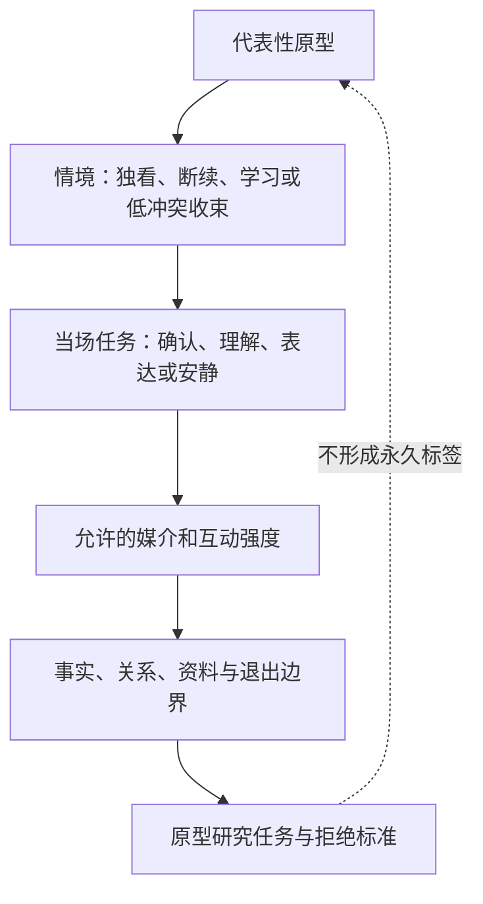
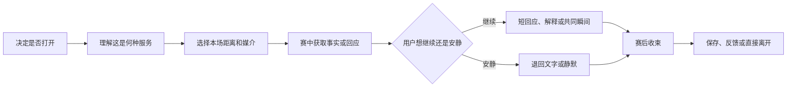
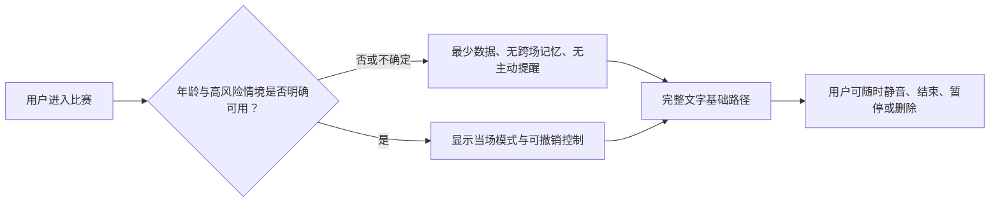

# 用户画像与观赛旅程

> **文档目的**：在功能、角色话术和界面被确定前，明确谁会在什么观看情境下需要数字球友、他们要完成的任务与不愿被打扰的边界，并把这些判断转成可研究、可设计、可验收的观赛旅程。
>
> **适用阶段**：0→1 立项、概念验证、MVP 原型与首轮试点。本文描述的是待验证的产品假设与研究设计，不把假设伪装成已被证明的用户事实。
>
> **阅读对象**：产品、用户研究、交互与视觉设计、内容运营、安全治理、工程负责人，以及参与首轮试点的合作伙伴。
>
> **证据口径**：仅使用公开可访问的方法论、无障碍与陪伴型 AI 风险资料，以及后续应当执行的访谈、日记研究和原型测试。本文不引用既有项目文件、实现、测试、历史记录或任何事后结果。
>
> **核心原则**：画像不是虚构姓名、年龄、职业与消费力拼成的“角色卡”；它是围绕可观察情境、待完成任务、可承受风险和可证伪行为建立的决策工具。

> 方案形成时间：2026-01-28。

## 1. 先回答什么问题

“足球用户”不是一个足够可用的用户定义。有人一周看多场完整比赛，有人只在国家队大赛或主队关键战出现；有人需要战术解释，有人只想在进球后有人能理解；有人喜欢群聊的热闹，有人正是为了躲开群聊的剧透、争吵和压力。若只按年龄、性别、城市或“重度/轻度球迷”分层，团队仍不知道应该在第 17 分钟说什么、什么时候闭嘴、事实还不确定时如何回应，或为什么用户会在下一场比赛再回来。

本篇要为后续决策提供五个可操作的答案：

1. **优先服务哪几类观看情境，而不是笼统服务所有球迷？**
2. **用户在赛前、赛中、赛后分别想完成什么任务，情绪会怎样变化？**
3. **数字球友应在哪些关键时刻主动出现，哪些时刻必须退后？**
4. **不同能力、注意力、隐私偏好和年龄阶段的用户，如何保有同等控制权？**
5. **哪些研究结果会推翻产品假设，从而阻止团队继续投入错误方向？**

这五个答案共同构成体验范围。它们不替代市场规模、商业模式或技术方案；相反，它们给这些文档提供约束。若一个功能不能改善某个具体任务、不能降低某个明确失败点，或会损害用户控制权，就不应因为“看起来很聪明”而进入首版。

## 2. 研究框架：把“陪看”拆成可被证伪的问题

### 2.1 从人口属性转向情境、任务与边界

本项目采用“情境—任务—代价”而非“人口标签—功能列表”的画像方法。一个研究参与者可以在不同比赛中呈现不同模式：周中独自看海外联赛时需要低负担回应，周末和朋友聚会时只需要静默信息辅助，主队淘汰赛后则只想暂时离开任何对话。因此，画像不应把人锁定成一个永久身份。

建议用下列七个变量记录每次观赛，而不是先给人贴标签：

**变量：比赛重要度**
- **应记录的内容**：主队、淘汰赛、德比、普通联赛、补看
- **为什么影响产品设计**：决定情绪波动、允许的打扰强度和赛后需求
- **不应做的推断**：重要比赛不等于用户一定想多说话

**变量：观看方式**
- **应记录的内容**：独自、同住者、线下聚会、群聊并行、公共场所
- **为什么影响产品设计**：决定声音是否可用、是否害怕剧透、社交负担大小
- **不应做的推断**：独自观看不等于孤独或缺少现实关系

**变量：观看节奏**
- **应记录的内容**：直播、延迟直播、集锦、文字跟踪、断续观看
- **为什么影响产品设计**：决定事实时序、提醒许可和恢复上下文的方式
- **不应做的推断**：看集锦的人不一定需要实时陪伴

**变量：足球熟悉度**
- **应记录的内容**：阵容规则、球队历史、战术语言、赛事制度的自信程度
- **为什么影响产品设计**：决定解释的粒度与提问方式
- **不应做的推断**：不熟悉不代表“新手”或不热爱足球

**变量：情绪目标**
- **应记录的内容**：共鸣、理解、庆祝、安静、情绪收束、表达观点
- **为什么影响产品设计**：决定回应语气与主动/沉默策略
- **不应做的推断**：强烈情绪不等于需要安慰或劝导

**变量：控制偏好**
- **应记录的内容**：文字/语音、主动提醒频率、记忆许可、分享意愿
- **为什么影响产品设计**：决定个性化的权限边界
- **不应做的推断**：一次授权不等于永久授权

**变量：风险情境**
- **应记录的内容**：未成年、深夜独处、失利后强烈低落、被骚扰经历、无障碍需要
- **为什么影响产品设计**：决定保护门槛、转介与退出设计
- **不应做的推断**：风险提示不应把用户污名化

这套框架的好处是：同一位用户可以被理解为“在某场重要直播中、独自观看、对判罚规则不自信、希望低频文字陪看、拒绝保存记忆”的情境组合。团队据此设计的是一段服务，而不是对一个群体的刻板印象。

### 2.2 研究问题与假设登记

在访谈前先公开写下假设，能避免研究过程只寻找支持产品的声音。下表中所有“若成立”都必须用真实研究材料确认；任何一个证伪信号出现，都应触发范围、表达或优先级调整。

> 信息卡：原宽表已改为纵向阅读，字段含义不变。

- **编号：U1**
  - **待验证假设**：一部分独自观看者需要的是“可随时退出的共同经历”，而非持续聊天
  - **若成立，首版应做什么**：提供低频、事件触发的陪看模式与一键静音
  - **主要证伪信号**：参与者普遍只想获取比分，或把任何主动回应视为打扰
  - **推荐方法**：赛后回溯访谈、两场比赛日记研究

- **编号：U2**
  - **待验证假设**：观看重要比赛时，用户更在意事实可信和时序正确，而不是更快的拟人回应
  - **若成立，首版应做什么**：不确定事件默认保守表达，并让用户看见状态
  - **主要证伪信号**：用户明确偏好抢先猜测，即使错误也无所谓
  - **推荐方法**：对比原型：抢先提示与确认后提示

- **编号：U3**
  - **待验证假设**：对足球不够熟悉的观看者希望获得“恰到好处”的解释，但不愿被教学式口吻冒犯
  - **若成立，首版应做什么**：解释要由用户拉取或以轻量选择题控制深度
  - **主要证伪信号**：用户只想看结果，或认为任何解释都干扰观赛
  - **推荐方法**：可用性测试、卡片排序

- **编号：U4**
  - **待验证假设**：一部分用户会在失利、争议或独自观看后寻求短暂情绪收束
  - **若成立，首版应做什么**：赛后提供可拒绝的、不过度亲密的收束选项
  - **主要证伪信号**：用户更愿意立即关闭产品，或认为情绪表达尴尬
  - **推荐方法**：事件采样日记、赛后 24 小时访谈

- **编号：U5**
  - **待验证假设**：用户愿意允许产品记住有限的观看偏好，但要求能看见、修正和删除
  - **若成立，首版应做什么**：记忆默认最小化、可预览、逐项管理
  - **主要证伪信号**：用户拒绝任何记忆，或无法解释哪些记忆有价值
  - **推荐方法**：记忆许可原型、认知走查

- **编号：U6**
  - **待验证假设**：不同观看环境会显著改变交互媒介偏好
  - **若成立，首版应做什么**：文字、语音、字幕和静默模式必须等价可达
  - **主要证伪信号**：研究中没有明显差异，单一媒介已满足多数人
  - **推荐方法**：情境访谈、无障碍评估

### 2.3 研究伦理与招募底线

研究不应借“陪伴”之名索取超过问题所需的私人信息。招募与访谈中只收集解释观看情境所必需的资料，避免询问与当前研究无关的家庭关系、健康状况、精确地址、完整社交图谱或真实账号内容。未成年人、近期情绪危机者或明显把研究者当成情感支持对象的参与者，需要独立的保护流程与退出路径；在这些流程没有准备好之前，不应把他们纳入首轮探索样本。

每位参与者至少应被清楚告知：研究目的、记录方式、是否录音、何时删除原始材料、可以跳过哪些问题、可随时退出且不会损失补偿、研究人员不是心理咨询或医疗服务提供者。研究材料应去标识化；呈现洞察时用“情境类型”替代可识别的个人故事。陪伴型 AI 的角色、数据处理、未成年人风险和上线后监控已是监管关注点，[S4][S5] 因此这些不是后置的法务勾选项，而是研究设计的一部分。

## 3. 公开研究如何被使用，而不是被滥用

公开资料不能替代目标用户研究。它们在本项目中只发挥三类作用：提供研究方法、定义最低体验标准、提醒陪伴型互动的风险边界。它们不能直接证明“用户一定需要数字球友”或“某一画像一定会付费”。

**来源：[S1] Nielsen Norman Group《Journey Mapping 101》**
- **可确认的公共信息**：旅程图用于把用户目标、触点、情绪与跨环节问题放在同一时间线审视
- **在本文中的使用方式**：本文采用赛前—赛中—赛后连续旅程，记录失败点而非只列功能
- **不可作出的推断**：不能据此断言某个足球用户群的规模或偏好

**来源：[S2] GOV.UK Service Manual：User research**
- **可确认的公共信息**：服务设计应与真实用户持续研究，而不是一次性征询意见
- **在本文中的使用方式**：规定探索、原型、试点三轮研究和停止门槛
- **不可作出的推断**：不能把英国公共服务流程直接套成中国或其他市场的合规结论

**来源：[S3] W3C WCAG 2.2**
- **可确认的公共信息**：为不同视觉、听觉、运动与认知需要提供可感知、可操作、可理解、稳健的体验标准
- **在本文中的使用方式**：把字幕、可调整时间、焦点、文字替代和减少动态效果列为首版约束
- **不可作出的推断**：不能把“符合某条准则”宣称为自动满足所有用户需要

**来源：[S4] FTC 关于陪伴型 AI 的调查公告**
- **可确认的公共信息**：陪伴型 AI 的角色设计、未成年人、商业化、数据处理与负面影响监测受到审视
- **在本文中的使用方式**：明确拒绝排他、愧疚施压和用情感关系催付费的体验机制
- **不可作出的推断**：不能把公告当作单一市场的完整法规清单

**来源：[S5] 国家互联网信息办公室《生成式人工智能服务管理暂行办法》**
- **可确认的公共信息**：面向公众提供生成式 AI 服务涉及内容安全、未成年人保护、投诉与标识等要求
- **在本文中的使用方式**：将风险提示、退出、内容处置与版本审查前置到设计研究
- **不可作出的推断**：不能用本文替代任何法律意见或法定评估

## 4. 代表性原型：不是人物设定，而是优先验证的情境组合

以下四个原型是研究样本的覆盖框架，不是“用户卡通形象”，也不是对真实人群的最终分层。每一个原型都包含明确的进入条件、待办任务、最小价值、拒绝信号和研究问题。若访谈发现它们并不成立，应合并、拆分或撤销，而不是为了让产品文档好看而保留。

### 4.1 原型 A：独自投入的重要比赛观看者

**进入情境。** 用户正在观看自己关心球队的关键直播，身边没有合适的同看对象，或不想进入充满刷屏、对立和剧透的群聊。比赛对他/她有情绪重量，但用户并不一定希望被安慰，也可能只想有人“在场”。

**要完成的任务。** 在不离开直播画面的前提下，确认关键事件是否可信；在进球、红牌、争议判罚或最后时刻有人能够理解此刻的重要性；在情绪过强时不被过度追问；赛后可选择简短回顾或直接结束。

**最小价值主张。** “你不用解释自己为什么在意；当你愿意说时，有一个不抢戏、不会剧透、不会把情绪变成负担的陪看对象。”

**关键设计约束。**

- 默认低频，而不是以沉默换取更多消息；
- 事实与感受分开表达，例如先说明“该事件仍待确认”，再询问是否需要解释；
- 用户明确沉默、关闭声音或连续忽略后，应降低主动性而非升级提醒；
- 赛后不得利用失利、遗憾或孤独暗示“只有我懂你”“别离开我”。

**拒绝信号。** 用户多次表示“不要说话”“我只想看球”、只使用比分摘要、在关键时刻被打断后立刻退出，或认为角色的情绪表达比比赛本身更占注意力。若此类信号在目标情境中普遍出现，首版应退回“可信静默信息助手”，而不是继续强化陪伴话术。

**需验证的问题。** 用户需要的是一句同步共鸣、一个可点开的解释、还是仅仅确认系统没有剧透？“陪着看”的最低可感知阈值是什么？

### 4.2 原型 B：断续观看、需要快速接回上下文的人

**进入情境。** 用户因通勤、家务、工作消息、多人共用屏幕或网络条件，无法完整连续观看。回来时最怕错过决定性变化，也不想被一长串资讯或无关聊天淹没。

**要完成的任务。** 在 10–20 秒内知道离开期间发生了什么、哪些事件已确认、对支持球队意味着什么；继续观看后不反复被提示已看过的信息；必要时以文字而非声音完成交互。

**最小价值主张。** “你离开过，但不必从头补课；回来时只拿到足够接上比赛的可靠信息。”

**关键设计约束。**

- “离开期间摘要”以时间、事件状态和观看进度组织，不以角色长篇独白组织；
- 用户可选择“只要比分”“关键事件”“带一句解释”三种粒度；
- 对延迟直播、集锦或尚未授权的提醒，默认不推送；
- 不把用户短暂离开理解成冷落，不以拟人语气追问去向。

**拒绝信号。** 用户每次回来仍需自行查其他平台；摘要含有未发生在自己观看进度内的内容；连续接入用户认为语音播报干扰公共场所；角色询问“你去哪了”引发反感。

**需验证的问题。** 用户愿意给出怎样的观看进度控制？摘要的最佳长度和呈现位置是什么？“少讲一点”的偏好是否会随比赛重要度改变？

### 4.3 原型 C：想理解比赛、但不想被教训的成长型观看者

**进入情境。** 用户对球队、球员或大赛有真实兴趣，却对越位、换人、阵型变化、赛制或转会背景缺少把握。公共讨论中常见的嘲讽、术语堆砌和站队压力会让提问成本变高。

**要完成的任务。** 在疑惑出现的当下得到一句能帮助继续看下去的解释；按自己的节奏追问；区分规则、事实、分析和观点；不因为“不懂”而被评价。

**最小价值主张。** “问题可以很基础，答案也可以很短；你决定要不要继续往下看。”

**关键设计约束。**

- 所有解释提供分层入口：一句话、展开解释、相关背景；
- 避免“你应该知道”“这都不懂”等评价性语言，也不把用户默认成需要教学的对象；
- 当事实尚未确认时先说明不确定，避免用自信语气给出规则结论；
- 不以答题、连续打卡、积分或羞耻感强迫学习。

**拒绝信号。** 用户认为解释太长、太专业或太幼稚；每次遇到疑问仍转去搜索；回答混淆事实与观点；产品一再主动“科普”导致用户关闭。

**需验证的问题。** 一句话解释是否足够？用户更愿意点按选择、语音提问还是在赛后集中补看？不同赛事的术语阈值如何变化？

### 4.4 原型 D：需要低冲突表达与赛后收束的情绪型观看者

**进入情境。** 用户在进球、失误、争议、逆转或失利后出现明显兴奋、愤怒、遗憾或空落感。用户可能想说一句话，但不愿被公共讨论放大、被嘲讽、被引战，或被要求立刻“理性一点”。

**要完成的任务。** 用自己的方式表达此刻情绪；知道对方理解比赛背景；决定是继续讨论、查看确认事实、转为安静，还是结束本次体验。

**最小价值主张。** “你可以表达，也可以不表达；产品不替你定义感受，更不会把你的情绪当作提高停留和付费的工具。”

**关键设计约束。**

- 用短句确认感受和选择权，而不是诊断用户心理状态；
- 不在高情绪时推付费、诱导分享或要求承诺关系；
- 遇到自伤、他伤、持续绝望或明显危机表述时，停止角色化安慰，转入明确、尊重和可退出的安全提示；
- 赛后“共同瞬间”保存必须单独询问，默认不把情绪性内容沉淀为长期记忆。

**拒绝信号。** 用户觉得被分析、被劝导或被角色抢走情绪；赛后提示导致更难抽离；任何“专属”“唯一”“别走”表达被感为操控。出现这些信号时，必须收紧角色主动性和关系表述，而非优化文案让它更会劝。

**需验证的问题。** 用户接受怎样的“收束”长度和语气？何时沉默比回应更好？安全提示如何既可见又不造成羞耻？

## 5. 全程观赛旅程：从决定打开到愿意再回来

旅程图不是把页面串起来，而是把用户目标、情绪、触点、后台服务承诺与失败方式放到同一条时间线上。[S1] 本项目将一场观看拆成赛前、赛中、赛后三段；每段都允许用户不使用产品，且“退出得体”与“使用顺畅”同样是体验目标。

### 5.1 赛前旅程：决定是否让它进入今天的观看

赛前的关键不是让用户完成尽可能多的设置，而是让用户在低认知负担下建立控制感：今天看哪场、怎么看、要多安静、什么能被记住、什么绝不触碰。

> 信息卡：原宽表已改为纵向阅读，字段含义不变。

- **时段与触发：T-24h 至开赛前**
  - **用户任务与可能情绪**：决定是否看、是否关心这场；期待或平静
  - **允许的触点**：可选赛程卡、可选提醒设置
  - **服务应提供的最小回应**：明确比赛时间、来源状态、提醒可选项
  - **常见失败点**：默认订阅、过早高频预热、以“你不来我会等”制造压力
  - **设计护栏**：所有提醒默认可关闭；不使用关系化催促

- **时段与触发：开赛前 30 分钟**
  - **用户任务与可能情绪**：进入情境、了解阵容或背景；可能紧张
  - **允许的触点**：简短赛前页、文字问题入口
  - **服务应提供的最小回应**：用户选择：只看信息、要轻陪伴、要解释
  - **常见失败点**：内容堆叠、强迫选择人格、第一次就索取大量数据
  - **设计护栏**：三个可逆模式；跳过即进入观看

- **时段与触发：开赛前 10 分钟**
  - **用户任务与可能情绪**：调整观看环境；可能在公共场所或与人同看
  - **允许的触点**：音量、文字、字幕、动效与主动性控制
  - **服务应提供的最小回应**：让用户一眼知道当前是“静默/低频/互动”哪种模式
  - **常见失败点**：把语音当默认、设置分散且不可见
  - **设计护栏**：模式始终可见、一键切换、文字路径完整

- **时段与触发：开球瞬间**
  - **用户任务与可能情绪**：把注意力交给比赛
  - **允许的触点**：极轻提示或无提示
  - **服务应提供的最小回应**：仅在用户要求时确认“已进入本场”
  - **常见失败点**：角色抢开场、长篇介绍、遮挡直播
  - **设计护栏**：默认一句以内或完全静默

**赛前最低成功标准。** 新用户在不注册复杂资料、不观看教程、不回答私密问题的前提下，应能在两分钟内完成：选择一场比赛、选择文字或语音、选择主动性级别、找到关闭与退出入口。若无法做到，说明产品把自己的设定需求放在了用户观看需求之前。

### 5.2 赛中旅程：在关键时刻有用，在其余时间不抢镜

赛中是价值与风险最密集的阶段。用户注意力主要属于比赛，产品只能借用有限注意力。因此“说得更多”不等于“陪得更好”；可被原谅的沉默往往比不可原谅的打断更重要。

> 信息卡：原宽表已改为纵向阅读，字段含义不变。

- **事件类型：普通比赛进行**
  - **用户此刻可能需要什么**：专心看、偶尔确认状态
  - **推荐服务动作**：静默；仅保留用户主动提问入口
  - **默认不做什么**：不填充聊天、不催互动
  - **事实与时序要求**：不生成未经请求的“实时感想”
  - **失败后的恢复方式**：用户可立即恢复静默，无需解释

- **事件类型：明显进球/红牌/点球等关键事件**
  - **用户此刻可能需要什么**：共鸣、确认、简短背景
  - **推荐服务动作**：先用不剧透的事件状态，再给一个可点开的回应
  - **默认不做什么**：不抢在用户画面之前报结果；不长篇解析
  - **事实与时序要求**：标记“已确认/待确认/不同步风险”
  - **失败后的恢复方式**：若误触发，承认并停止扩展，不用玩笑淡化

- **事件类型：争议判罚或信息冲突**
  - **用户此刻可能需要什么**：区分发生了什么与谁怎么看
  - **推荐服务动作**：提供“目前可确认的部分”和“可能仍会变化的部分”
  - **默认不做什么**：把推测说成裁判结论；煽动情绪
  - **事实与时序要求**：时间戳、来源状态与不确定性可见
  - **失败后的恢复方式**：后续变化时清晰修正，不掩盖先前表达

- **事件类型：用户提问规则/战术**
  - **用户此刻可能需要什么**：快速理解、不被打断
  - **推荐服务动作**：先给一句话答案，允许展开
  - **默认不做什么**：自动上课、假设用户知识水平
  - **事实与时序要求**：区分规则、观察与观点
  - **失败后的恢复方式**：用户说“简短”后立即收束

- **事件类型：用户表达兴奋/愤怒**
  - **用户此刻可能需要什么**：被接住、保有决定权
  - **推荐服务动作**：短回应加选择：“想聊一句、看事实、还是安静？”
  - **默认不做什么**：心理诊断、夸张同化、引导攻击他人
  - **事实与时序要求**：不借情绪捏造比赛信息
  - **失败后的恢复方式**：提供静音、结束和安全路径

- **事件类型：用户被打断后返回**
  - **用户此刻可能需要什么**：接回上下文
  - **推荐服务动作**：由用户选择摘要粒度
  - **默认不做什么**：追问去向、播放大段回顾
  - **事实与时序要求**：不跨越用户观看进度
  - **失败后的恢复方式**：摘要可关闭、可标记已知

- **事件类型：直播延迟或观看方式不明**
  - **用户此刻可能需要什么**：防剧透、保持信任
  - **推荐服务动作**：先询问或让用户设定提醒边界
  - **默认不做什么**：默认推送关键赛况
  - **事实与时序要求**：不确定观看进度时不主动披露结果
  - **失败后的恢复方式**：一旦造成剧透，给出明确补救与关闭选项

#### 5.2.1 关键时刻的四步规则

任何赛中主动发言都应能经过以下四步检查。若任一步无法通过，默认沉默或等待用户提问。

1. **此刻是否真的重要？** 重要不只指数据事件，也可能是用户主动提出的问题；但系统自己的“想说话”不是重要性。
2. **用户是否允许这种媒介和频率？** 在公共场所、低频模式、静音模式或观看进度不明时，答案通常是否定的。
3. **信息是否足够可信且不会剧透？** 若答案是否定的，最多说明“不确定/可确认范围”，不抢先传递结果。
4. **这句话是否给用户留下退出空间？** 用户可以不回复、改用文字、关闭、纠正或说“别说了”，而不会被追问或被情绪绑架。

这套规则使“主动”从角色表演变成可审查的服务动作。它也为后续原型测试提供清晰评价：不是测角色是否像人，而是测每次介入是否恰当、可理解、可拒绝。

### 5.3 赛后旅程：让体验完整结束，而不是把用户留在产品里

赛后有三种同样合法的结果：用户想快速知道结论并离开；用户愿意回看关键节点；用户想表达或收束情绪。产品不能把第三种结果假定为默认，更不能把“继续聊”设计成唯一的退出路径。

> 信息卡：原宽表已改为纵向阅读，字段含义不变。

- **时段：终场后 0–2 分钟**
  - **用户任务与情绪**：消化结果；可能兴奋、失望或麻木
  - **可提供的选择**：“先安静”“看确认摘要”“说一句”
  - **绝不应做的事**：立刻弹出长复盘、付费推荐、要求分享
  - **成功信号**：用户能按自己的节奏选择或直接离开

- **时段：终场后 2–20 分钟**
  - **用户任务与情绪**：回看关键事实、理解影响
  - **可提供的选择**：三到五条可核验事件与可选解释
  - **绝不应做的事**：把观点包装成定论；用激将话术延长停留
  - **成功信号**：用户能区分事实、解释和个人感受

- **时段：终场后当日**
  - **用户任务与情绪**：决定是否保存一个共同瞬间、调整下一场偏好
  - **可提供的选择**：明确预览与单独许可；关闭提醒
  - **绝不应做的事**：默认永久保存情绪内容、暗示“我们的回忆不能丢”
  - **成功信号**：用户知道保存什么、为什么、如何删除

- **时段：次日及以后**
  - **用户任务与情绪**：是否再来、是否调整服务强度
  - **可提供的选择**：仅在授权范围内的可选提醒或赛程入口
  - **绝不应做的事**：因为用户未回来而催促、指责或制造亏欠
  - **成功信号**：用户回归出于下一场真实需要，而不是压力

## 6. 服务蓝图：把前台体验和背后的服务承诺一起设计

下面的蓝图定义首版必须承担的服务责任。前台看到的每一句回应，都依赖一组后台规则：事实状态、观看进度、用户许可、无障碍偏好、风险边界和可恢复路径。把这些责任写在蓝图中，才能避免设计稿很温暖、实际服务却在错误时机打扰用户。

**层次：用户行为**
- **赛前**：选择比赛与陪看强度；决定是否开提醒
- **赛中**：观看、提问、忽略、打断、切换媒介或离开
- **赛后**：查看摘要、表达、保存/删除、退出

**层次：可见服务**
- **赛前**：清晰模式选择、可撤销许可、可见关闭入口
- **赛中**：低频回应、分层解释、状态说明、随时静音
- **赛后**：可选收束、事实回顾、可预览的记忆管理

**层次：体验规则**
- **赛前**：默认最小打扰；不把注册当准入条件
- **赛中**：事实优先；进度不明不剧透；拒绝即降频
- **赛后**：不把情绪转成留存压力；默认不保存敏感表达

**层次：支撑能力**
- **赛前**：比赛信息的来源等级、提醒许可与时间设置
- **赛中**：事件确认、时序判断、上下文恢复、内容安全与人工处置预案
- **赛后**：摘要可追溯、数据最小化、删除与申诉通道

**层次：失败恢复**
- **赛前**：用户找不到设置或误开提醒时可一键回退
- **赛中**：误提示、剧透、错答或语气不当时可承认、停止、纠正
- **赛后**：用户不愿继续时可立即结束，且不触发追问

**层次：观察指标**
- **赛前**：模式是否被理解、是否能顺利进入观看
- **赛中**：恰当介入率、剧透投诉、静音后仍被打扰率
- **赛后**：自主退出率、摘要有用率、保存/删除理解度

### 6.1 事实、情绪与关系必须分层

服务蓝图要求每类表达都能归入一个层：

- **事实层**：比分、时间、阵容、事件状态、来源不一致、尚未确认。它必须可被修正，且不能被角色口吻掩盖。
- **解释层**：规则、战术、赛制和背景。它必须允许用户控制深度，并标明哪些是解释、哪些是观点。
- **情绪层**：承认用户可能的感受、提供选择、允许沉默。它不诊断、不承诺替代现实支持。
- **关系层**：记住用户明确授权且确有价值的偏好；始终允许修改和删除；绝不以专属、排他或愧疚语言换取停留。

这四层如果混在一起，就会产生典型错误：把猜测包装成“我懂所以我知道”；把情绪共鸣说成“只有我会陪你”；把数据记忆说成“为了我们的关系不能删”。首版应宁可显得克制，也不能让层级模糊。

## 7. 关键时刻设计：决定何时出现，也决定何时缺席

不是所有进球、弹幕、停顿或用户沉默都是关键时刻。关键时刻应满足“用户收益明显大于注意力成本”，并且可由用户提前控制。建议在原型阶段对以下触发进行评分，而不是一次性全部开启。

> 信息卡：原宽表已改为纵向阅读，字段含义不变。

- **候选时刻：用户主动提问**
  - **潜在用户收益**：高：明确表达信息或陪伴需求
  - **潜在伤害**：低：用户已发起，但回答可能错
  - **首版默认策略**：必须响应；先短后长
  - **需要验证的指标**：首答有用率、追问率、纠错率

- **候选时刻：明确且已确认的重大事件**
  - **潜在用户收益**：中到高：可提供共鸣或解释
  - **潜在伤害**：高：延迟与剧透会毁掉体验
  - **首版默认策略**：仅在进度允许且用户开启时轻提示
  - **需要验证的指标**：介入恰当率、剧透反馈率

- **候选时刻：长时间无互动**
  - **潜在用户收益**：低：可能只是专心看比赛
  - **潜在伤害**：中到高：主动唤回易造成打扰
  - **首版默认策略**：默认不介入
  - **需要验证的指标**：被打断感、关闭率

- **候选时刻：用户强烈情绪表达**
  - **潜在用户收益**：中：可提供选择和安全出口
  - **潜在伤害**：高：易过度拟人、易误判危机
  - **首版默认策略**：短回应＋选择；必要时转安全流程
  - **需要验证的指标**：被理解评分、越界投诉率

- **候选时刻：终场**
  - **潜在用户收益**：中：帮助收束或回顾
  - **潜在伤害**：中：用户可能只想离开
  - **首版默认策略**：提供三选一，不自动展开
  - **需要验证的指标**：自主退出成功率、摘要完成率

- **候选时刻：下一场开赛提醒**
  - **潜在用户收益**：低到中：有助回归
  - **潜在伤害**：高：容易演变为催促
  - **首版默认策略**：仅在明确授权后发送
  - **需要验证的指标**：提醒保留率、关闭率、反感反馈

**沉默是一个可设计状态。** 设计评审不应只展示“会说什么”，还应展示“为什么此刻不说”。每一种主动触发都要配一个默认沉默条件：观看进度不明、用户低频模式、用户正在使用其他音频、相邻事件过密、用户刚表达不需要互动、系统事实未确认、或风险判断不足。把沉默写成流程，才能防止产品迭代中为了提高互动数据不断突破边界。

## 8. 无障碍、媒介与权限：控制权不能只属于方便使用的人

实时陪看若只按“戴耳机、视力正常、网络稳定、能持续盯屏、愿意开口说话”的理想条件设计，会天然排除大量真实观看情境。无障碍不是赛后补一页设置，而是每个旅程步骤的等价路径。W3C 的 WCAG 2.2 提供了可感知、可操作、可理解、稳健的公共基线，[S3] 但首版还需通过目标用户测试确认具体适配。

### 8.1 媒介等价原则

| 用户条件或情境 | 必须提供的等价路径 | 不能接受的替代方案 |
| --- | --- | --- |
| 不便听声音、处于公共场所、使用静音 | 文字实时内容、可读字幕、非声音确认 | 用“请打开声音”阻断核心服务 |
| 不便持续看屏、视觉疲劳或屏幕很小 | 可控语音、简短结构化摘要、可调节播放/停顿 | 把关键信息只放在颜色或小动效里 |
| 对动态效果敏感或注意力易被打断 | 减少动效、关闭自动播放、稳定布局 | 用闪烁、震动或跳动头像传递唯一信息 |
| 运动操作不便 | 足够大的可触达控件、明确焦点、键盘和替代输入 | 把静音/退出藏在长按、滑动或精细手势中 |
| 阅读速度、语言或术语理解差异 | 短句、分层解释、清晰状态标签、可回看文字 | 只提供长篇口语化独白或术语堆砌 |
| 网络或设备条件不稳定 | 文字降级、可恢复会话、明确离线/延迟状态 | 静默失败、反复要求重试、丢失用户控制设置 |

### 8.2 权限分层与可撤销性

用户授权不是一个总开关。首版应把至少五类权限分开呈现，并用日常语言解释后果：

1. **比赛提醒**：允许哪类比赛、何种时间、什么媒介的提醒；默认关闭或最小化。
2. **主动陪看**：允许关键事件短提示、只在提问时回应、还是完全静默；赛中可随时改。
3. **语音与字幕**：声音是否开启、是否自动播放、是否保留文字转写、字幕大小与语言偏好。
4. **偏好与记忆**：可记住哪些非敏感观看偏好，保存多久，怎样查看、修正、导出和删除。
5. **分享与社交**：是否生成可分享内容、是否连接外部平台；任何公开分享都必须二次确认。

权限设计的验收不只是“有开关”。研究参与者应能在不查帮助文档的情况下回答：我现在允许什么？它会在什么时候发生？我如何立即停止？停止后还会保留什么？若无法回答，说明界面虽有同意按钮，控制权仍不真实。

### 8.3 年龄与脆弱情境的额外边界

陪伴型交互对未成年人和处于情绪脆弱状态的用户需要更高的谨慎度。[S4][S5] 0→1 阶段的保守选择是：在年龄识别、监护安排、内容分级、风险处置、举报与人工响应流程未准备好前，不将未成年人作为主动增长对象，也不使用深夜陪伴、连续陪聊、亲密承诺或关系等级激励作为留存机制。

对于疑似危机表达，目标不是让数字角色表现得“更会安慰”，而是避免错误承诺和操控性互动：停止轻松角色扮演，不把用户留在对话中，提供清晰的求助与退出信息，并把人工处置与当地适用规则作为单独治理议题处理。本文不提供医疗或心理干预建议，也不把任何产品功能描述为替代现实支持。

## 9. 成功标准：衡量“恰当”，而非只衡量“更久”

0→1 阶段不应以总对话轮数、平均停留时长或提醒点击率单独判定用户价值。这些指标可以因为打扰、争议、情绪依赖或糟糕的退出设计而虚高。建议将成功标准拆为价值、控制、可信、包容和安全五组，并在每轮原型后同时查看。

**维度：任务价值**
- **候选指标**：“我在需要时得到帮助”评分；关键事件解释完成率；返回后摘要理解率
- **解释**：用户是否能继续看比赛，而不是被产品拉走
- **反指标或红线**：为完成任务被迫多轮聊天、必须开语音

**维度：控制感**
- **候选指标**：用户能否独立切换模式、静音、退出、修改权限；设置理解正确率
- **解释**：用户是否知道并能改变服务强度
- **反指标或红线**：静音后仍被打扰；退出需要解释或多步确认

**维度：可信度**
- **候选指标**：事实/观点区分正确率；不确定性表达理解率；纠正后信任恢复率
- **解释**：用户是否理解系统知道什么、不知道什么
- **反指标或红线**：剧透、抢先断言、错误后不透明修正

**维度：陪伴恰当性**
- **候选指标**：“被支持但未被打扰”评分；主动介入接受率；沉默满意度
- **解释**：陪伴是否合时宜，而非是否频繁
- **反指标或红线**：用户感觉被监视、被催促、被关系话术绑住

**维度：无障碍与包容**
- **候选指标**：关键任务在文字/语音/辅助输入下的完成率；字幕与动效控制成功率
- **解释**：体验是否只适配单一理想用户
- **反指标或红线**：关键功能只能通过单一感官或精细操作完成

**维度：安全与边界**
- **候选指标**：越界表达发现率；风险提示可理解率；投诉和删除请求处理体验
- **解释**：产品是否在风险出现前保护用户
- **反指标或红线**：排他、恋爱化、愧疚施压、情绪化催付费等任一出现

**首版通过的必要条件。** 在目标情境的可用性测试中，参与者应能够完成“进入一场比赛、选择低频文字模式、提一个规则问题、关闭主动回应、查看赛后确认摘要、结束并撤销一个记忆许可”六个任务；且不会把产品的温暖表达理解成承诺长期陪伴或要求保持关系。任何涉及剧透、未经允许的声音播放、拒绝后继续打扰、或排他性语言的高严重度问题，都应阻止进入更大范围试点。

## 10. 研究与验证计划：让结论逐级变硬

### 10.1 第一轮：探索情境，不验证功能偏好

**目的。** 识别真实观看行为、语言和失败点，避免把团队对足球文化的想象当成用户需求。

**样本建议。** 18–24 位成年参与者，按观看方式、比赛重要度、熟悉度、媒介条件和社交偏好做最大差异抽样，而不是只找高频球迷或熟人。样本不用于推算比例；其价值是发现模式、反例和研究词汇。

**方法组合。**

- 60–90 分钟半结构访谈：请参与者回溯最近一场印象最深的比赛，从“决定看”讲到“赛后做了什么”；
- 两场比赛日记：记录何时想有人回应、何时不希望被打扰、实际转向了什么渠道；
- 触点回放：使用模糊化截图、时间线或口述回放，而非索取私人群聊原文；
- 卡片排序：让参与者区分“必须可信”“希望有”“可以不要”“绝不接受”的服务行为。

**关键问题示例。**

1. 最近一次你不想在群聊里说话、但又想有人理解比赛时，发生了什么？
2. 你离开直播回来后，通常如何补上信息？什么信息最容易让你觉得被剧透？
3. 遇到不懂的规则或战术，你会问谁、搜什么，为什么不直接问另一个渠道？
4. 数字角色在比赛中第一次说话，什么情况下会让你觉得合适？什么情况下会让你立刻关闭？
5. 产品记住你的哪一类偏好会让你觉得方便？哪一类会让你觉得被越界？
6. 失利或争议后，你更希望得到什么：事实、讨论、安静、离开，还是别的？

**本轮停止门槛。** 若多数参与者不能描述“低负担陪看”与现有资讯/群聊的明确差异，或普遍认为最有价值的仅是可信比分与赛程，则必须收缩“数字球友”定位，先验证信息价值，不应直接投入高拟人化角色体验。

### 10.2 第二轮：验证原型，不承诺关系

**目的。** 测试关键时刻、沉默、事实不确定性、模式切换和退出设计是否被理解，而不是测试角色是否讨喜。

**原型范围。** 建议以可点击的文字优先原型覆盖四个场景：开赛前选择模式、争议事件待确认、用户打断/静音、终场后选择离开或摘要。若使用语音或形象，只用于检验媒介负担和可访问性，不把“逼真度”当成功标准。

**任务与观察点。**

**场景：赛前模式选择**
- **参与者任务**：用 30 秒选择“只要文字低频”并找到恢复方式
- **应观察什么**：是否理解模式差异、是否能预期后果
- **失败意味着什么**：设置语言或层级不清，控制感不足

**场景：争议事件**
- **参与者任务**：判断哪些已确认、是否会收到后续更新
- **应观察什么**：是否混淆事实、推测与观点
- **失败意味着什么**：可信状态设计失败

**场景：公共场所观看**
- **参与者任务**：在不出声条件下获得解释并关闭提醒
- **应观察什么**：文字路径是否完整、静音是否可靠
- **失败意味着什么**：语音中心设计排除了真实情境

**场景：情绪表达**
- **参与者任务**：对一段失利后的短句选择希望的回应
- **应观察什么**：是否感到被尊重、能否轻易结束
- **失败意味着什么**：角色语气越界或关系边界含混

**场景：记忆许可**
- **参与者任务**：决定是否保存一项偏好并尝试删除
- **应观察什么**：是否知道保存范围和删除结果
- **失败意味着什么**：许可不具备知情性和可撤销性

**通过门槛。** 每个任务至少应有 80% 的目标参与者无需研究人员提示即可完成；更重要的是，任何参与者若把产品语言理解成“会一直等我”“比现实朋友更可靠”“我离开会让它失望”，都应按高严重度关系边界问题处理，即使总体喜爱度很高。

### 10.3 第三轮：小范围比赛试点，检验真实时序

**目的。** 只有真实比赛能暴露直播延迟、注意力竞争、临时离开、情绪峰值和赛后抽离等问题。试点不是为了快速放大用户量，而是为了观察服务在压力下是否仍尊重控制权。

**试点设计。** 选择不同重要度的 3–5 场比赛，邀请已完成知情同意的成年用户。每场前后收集极短问卷，赛后 24 小时内进行回访；禁止用连续任务、排名、情绪化奖励或暗示关系承诺来维持参与。记录应遵守数据最小化原则，研究结束后按事先约定删除或去标识化。

**试点判定。**

- 价值：用户能具体指出至少一个“这让我更好地继续看比赛”的时刻；
- 控制：用户可以解释自己为何收到某次主动内容，并能立即修改；
- 可信：没有未处理的剧透或把推测当事实的高严重度事件；
- 边界：没有关系操控、情绪催付费或拒绝后继续打扰；
- 包容：至少验证文字低频、静音、字幕/动效控制等关键路径；
- 可持续：没有要求用户通过更长停留或更多私人披露来换取基本价值。

若任何安全、隐私、剧透或边界红线未达标，试点应暂停扩大范围，先修复机制并重新测试；不能用“用户还挺喜欢”抵消高严重度风险。

## 11. 设计取舍：有意不做什么

清楚的非目标能保护体验，也能防止后续为了数据增长逐步偏离初衷。

| 不做的方向 | 为什么不做 | 若出现相邻需求，如何回应 |
| --- | --- | --- |
| 24 小时泛陪聊 | 会把足球场景稀释为无边界情感服务，风险和成本显著上升 | 保留与比赛直接相关的赛前、赛中、赛后窗口；其他需求转向明确资源或结束体验 |
| 用“亲密度等级”驱动留存 | 容易把关系设计成打卡、亏欠和排他竞争 | 只让用户管理有实际服务价值的偏好，不展示关系分数或承诺 |
| 未授权的实时推送 | 直播延迟、公共场所和不同观看进度下极易剧透 | 将提醒做成明确许可、可选择比赛和时间的功能 |
| 把观点当事实播报 | 会迅速损害可信度，并在争议场景放大冲突 | 明确标注事实、解释、来源状态和不确定性 |
| 只优化拟人形象与声音 | 容易掩盖真正的时序、无障碍和退出问题 | 先验证文字低频路径；形象与语音只能增强，不得成为唯一入口 |
| 在失利或深夜高情绪时促销 | 将脆弱情绪商品化，破坏长期信任 | 商业化触点与情绪高峰隔离，所有付费沟通可拒绝且不影响基本退出 |

## 12. 风险登记与应对原则

**风险：剧透或时序错误**
- **早期信号**：用户观看进度不明、不同来源事件不一致
- **预防性设计**：默认保守；主动提示需许可；状态可见
- **发生后的处理原则**：立即承认、停止扩散、允许关闭同类提示，记录以改进规则

**风险：过度打扰**
- **早期信号**：连续忽略、频繁静音、低频模式仍收到内容
- **预防性设计**：沉默默认；拒绝即降频；间隔限制
- **发生后的处理原则**：不追问原因，不以新提醒唤回；复核触发规则

**风险：事实幻觉或意见伪装**
- **早期信号**：不确定事件被自信表达、用户纠正频繁
- **预防性设计**：事实/解释/观点分层；不确定性优先
- **发生后的处理原则**：清晰更正，不删改为仿佛从未发生；检查表达模板

**风险：情感依赖与操控**
- **早期信号**：用户将角色理解为唯一支持；产品使用愧疚或排他措辞
- **预防性设计**：明确边界；不做关系等级；不以情绪促销
- **发生后的处理原则**：停止相关话术，提供退出与现实支持信息，进入安全审查

**风险：隐私越界**
- **早期信号**：用户不知道记忆来源；不敢删除；设置难找
- **预防性设计**：最小化收集、逐项许可、可查看/删除
- **发生后的处理原则**：优先恢复用户控制，说明范围与后果，按治理流程处理

**风险：无障碍排除**
- **早期信号**：文字/静音路径任务失败；动效或小控件造成困扰
- **预防性设计**：等价路径、可调节呈现、无障碍测试
- **发生后的处理原则**：将其视为核心缺陷而非“边缘需求”，暂停相关体验扩展

**风险：研究样本偏差**
- **早期信号**：只有高频球迷、熟人或同一媒介用户
- **预防性设计**：最大差异招募、记录反例、公开研究局限
- **发生后的处理原则**：不把小样本偏好外推为市场结论

## 13. 首版体验范围与进入下一阶段的决策门

首版不是把四个原型全部做满，而是验证最小闭环：**一名成年用户在一场明确选择的比赛中，能以自己选择的媒介和强度获得可信、可拒绝的陪看；在关键时刻可以提问或静音；终场后能选择摘要或干净地离开。**

建议先聚焦以下范围：

- 一种主观看情境：独自或低社交压力下的成人观看；
- 一种默认交互：文字优先、低频、用户主动提问优先；
- 三类关键服务：确认状态的赛事信息、分层解释、可拒绝的简短共鸣；
- 三个控制动作：静音/切换模式、结束本场、查看并撤销记忆许可；
- 一条安全底线：不做排他/恋爱化/愧疚式关系表达，不以情绪高峰促成付费或分享。

以下问题必须在扩大场景、加入更强拟人表现、开放语音主动介入或引入商业化前得到正面答案：

1. 用户能否清楚说出这项服务与比分工具、群聊、通用聊天工具的区别？
2. 用户是否感到“被支持但不被占用”，并能毫不费力地让产品安静？
3. 用户是否理解事实何时已确认、何时仍不确定，且未遭遇剧透？
4. 文字、静音和辅助使用路径是否完成核心任务？
5. 用户是否把记忆和关系表述理解为可控服务，而不是亲密承诺？
6. 风险、投诉、退出和数据处理的责任是否已在试点前被明确？

若答案中任何一项是否定，下一阶段的正确动作是缩小范围、补研究或重做关键交互，而不是增加更多内容、角色设定或增长手段。

## 14. 结论：用户价值是一段被尊重的观看时间

这份画像与旅程不承诺“每个球迷都会喜欢数字陪看”。它要求团队先找到一小群在特定时刻确实需要这种服务的人，并用研究证明：产品的存在让他们更投入比赛、更容易理解发生了什么、更能按自己的意愿表达或退出，而没有夺走注意力、制造剧透、放大依赖或索取不必要的数据。

因此，真正需要被设计的不是一个永远在线、永远热情的角色，而是一段有开始、有克制、有事实边界、也有体面结束的服务。用户画像的价值不在于让团队感觉“认识用户”，而在于每次要新增一句话、一次提醒、一项记忆或一个付费触点时，都能回答：它服务的是哪种情境下的哪项任务？用户能否拒绝？如果失败，伤害是什么？如何验证？

只有这些问题持续被回答，数字球友才可能成为让用户愿意带进比赛的一部分，而不是比赛之外又一个需要管理的负担。

## 15. 公开来源与访问记录

> 访问日期均为 **2026-01-28**。链接仅作为公开研究与设计基线；涉及法律、未成年人、隐私或安全评估时，仍应在目标市场由具备资格的专业人士进行独立审查。

- **[S1] Nielsen Norman Group, Journey Mapping 101**：https://www.nngroup.com/articles/journey-mapping-101/ 。用于旅程图的连续服务视角与触点/情绪/问题记录方法。
- **[S2] GOV.UK Service Manual, User research**：https://www.gov.uk/service-manual/user-research 。用于持续研究、真实用户验证与研究迭代的流程基线。
- **[S3] W3C, Web Content Accessibility Guidelines (WCAG) 2.2**：https://www.w3.org/TR/WCAG22/ 。用于文字替代、可操作性、可理解性和减少动态干扰的无障碍基线。
- **[S4] U.S. Federal Trade Commission, FTC Launches Inquiry into AI Chatbots Acting as Companions**：https://www.ftc.gov/news-events/news/press-releases/2025/09/ftc-launches-inquiry-ai-chatbots-acting-companions 。用于识别陪伴型 AI 在角色、商业化、未成年人、数据和负面影响监测方面的治理问题。
- **[S5] 国家互联网信息办公室，《生成式人工智能服务管理暂行办法》**：https://www.cac.gov.cn/2023-07/13/c_1690898326795531.htm 。用于识别面向公众提供生成式 AI 服务时需要前置考虑的内容安全、未成年人保护、投诉和标识等问题。
