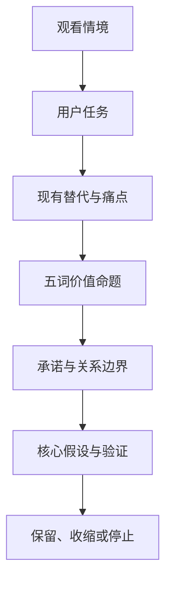
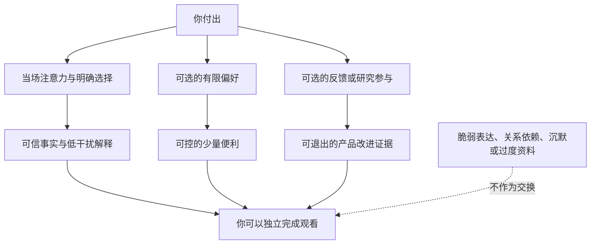

# 用户任务、痛点与价值主张

> **文档性质**：用户与价值卷第 3 篇——用 JTBD（待完成任务）框架回答一个前置问题：用户在一场比赛中真正想完成的是什么，我们因此承诺什么、拒绝什么。不是功能清单，也不是内部决策记录。  
> **核心原则**：陪看服务的价值来自恰当出现和允许缺席；一切以"更容易回到比赛"为中心，以"用户能控制"为底线。

## 1. 要做的不是"多一个聊天入口"

足球陪看产品的起点不应是"能否生成一段像球迷说的话"，而是一个更苛刻的问题：在一场你本来就能独自看完、在群聊里讨论、在信息流里刷到赛况的比赛中，为什么要让一位数字球友（Digital Ballmate）留在身边？如果答案只是"它能聊天"，产品会被免费的群聊、短视频、体育资讯和通用对话工具迅速替代；如果答案是"它在恰当的时刻帮我接回比赛、理解情绪、做出自己掌控的陪看体验"，才有值得验证的独立价值。

本篇把这个价值拆成可观察的用户任务（Jobs to Be Done，简称 JTBD），再为每一项任务拆出痛点机制、可承诺的服务与需要放弃的诱惑。它刻意不预设你会长期使用，也不预设你愿意为"陪伴"付费——那是要由研究回答的问题，不是可以宣告的结论。

### 1.1 本篇回答四个问题

1. 你在观赛中真正要完成的任务是什么，而不是你会如何描述某个功能？
2. 哪些痛点值得解决，哪些只是短暂新鲜感、技术炫技或可被现有方式轻松覆盖的问题？
3. 首版应该承诺什么、绝不承诺什么，才能形成清楚、可信、可退出的价值？
4. 用什么证据决定继续投入、改变方向或停止？

这里的"用户"不等于某一种年龄、性别、球队归属或足球知识水平。人口属性可以帮助招募，却不能替代任务：两个同样喜欢足球的人，可能一个只想安静看完比赛，另一个只在无人可聊、错过关键片段、情绪无人承接时需要外部帮助。按情境和任务定义服务对象，能减少"给所有球迷做一切"的错觉。

### 1.2 起点假设与非目标

我们的起点假设是：一部分成年足球观看者，在重要或高情绪波动的比赛中，存在"希望被及时接住、又不想被打扰或被迫社交"的任务；一个能把事实、解释、情绪回应和控制权分开的陪看服务，可能比单纯信息流或通用聊天更有价值。这是假设，不是用户事实——只有当它在真实观赛情境中被反复观察到，且用户在没有激励的情况下愿意再次选择时，才可以升级为产品判断。

首版不以"让用户尽可能久地停留""用亲密话术替代现实关系""以推送和情绪刺激制造陪伴感""承诺预测比赛结果"或"在核心任务成立前扩张角色、装扮与裂变"为成功标准；完整的非目标清单见《产品全貌》。这些边界不是后置的合规装饰，而是价值定义本身：公开的监管讨论——从美国 FTC 对陪伴型 AI 服务的问询，到国内生成式人工智能服务管理与内容标识规定——都把角色设计、负面影响、未成年人保护与数据使用列为需要主动说明的问题。

## 2. 先把未知说清楚

公开资料可以说明体育内容正在跨多种媒介分发、受众接触方式在变化（如 Ofcom《Media Nations 2024》与 DataReportal《Digital 2025 Global Overview Report》）、数字服务需要面对安全与数据治理要求；它不能直接证明某一位用户需要陪看，更不能证明其付费意愿。因此我们遵守三层证据规则：公开资料只用于提出值得研究的情境和必须设置的安全边界；定性研究只能得出任务语言、痛点机制与可用概念；只有行为实验——在真实或近真实情境中观察用户是否选择、完成、复用和退出——才能回答首版价值是否成立。

所有研究记录都分开写"原话或观察""研究者解释"与"尚未验证的推断"。你说过一句"一个人看球没意思"，我们只把它记录为原话——它不自动等于"需要数字陪伴"，也可能意味着需要朋友、线下观赛、更多背景信息，或只是那场比赛不够重要。研究者的工作是追问具体时刻、已有替代方式和结果，而不是把模糊表达翻译成预先准备好的功能需求。

## 3. 用户任务：你雇佣的不是功能，而是结果

JTBD 的表述采用"当……我想要……以便……"结构，聚焦触发情境、期望进展和完成标准，避免一开始就把答案锁定为语音、角色或某个界面。下表是我们优先验证的六项任务：

| 任务 | 当…… | 我想要……以便…… | 性质 | 完成信号 |
|---|---|---|---|---|
| J1 接回上下文 | 开赛后才进入、被事务打断或同时处理多块屏幕 | 在极短时间内接回比赛真正重要的上下文，不因错过片段而放弃、误判或焦虑追问 | 功能任务 | 能自己复述"发生了什么、接下来值得看什么" |
| J2 承接情绪 | 场上出现进球、争议、逆转、失误或判罚 | 有一个不抢戏、懂得事实边界的回应对象，让即时情绪被承接而不是独自消化或冲动输出 | 情绪任务 | 觉得"被接住"，但没有被推向更强烈的情绪 |
| J3 看懂比赛 | 看不懂一处战术、规则、换人或局势变化 | 获得匹配自己知识水平、可以继续追问的解释，继续投入观看而不是在信息流里迷失 | 学习任务 | 能回到比赛，且不觉得被教育或被羞辱 |
| J4 可控表达 | 想讨论比赛，但朋友不在线、群聊嘈杂或不愿公开表达 | 以可控的私密度表达看法、疑问和情绪，保留社交感而不承担群体压力 | 社会任务 | 自己决定何时开口、何时沉默、何时结束 |
| J5 收束体验 | 一场重要比赛结束，仍带着未消化的兴奋、失落或疑问 | 用简短、可结束的方式回顾发生过什么，把体验收为自己的记忆而不是被拉进无限互动 | 收束任务 | 获得结尾感，并能轻松离开 |
| J6 确认信任 | 担心赛况错误、剧透、夸张煽动或被过度了解 | 确认信息与互动都在自己能理解和控制的边界内，敢在不确定时使用 | 信任任务 | 知道信息状态，可关闭功能、可撤回选择 |

J1 至 J6 不是六个互不相干的功能，而是一段观赛进展：先把注意力放回比赛，再决定是否需要解释或表达，最后需要一个可关闭的结尾。顺序若被颠倒，代价清楚可见——把情绪互动放在事实之前，可能让你在错误信息上投入更多；把解释堆得过多，可能打断本来想安静看球的人；赛后不提供结束，短期互动数字即使上涨，也在损害信任。

### 3.1 同一任务的三道问题

以 J2 为例，表面任务是"我想说一句这球太可惜了"。功能层面，你需要的是一次低摩擦表达；情绪层面，需要的是感受被理解而非被评判；社会层面，需要的是不必暴露在陌生人、激烈球迷或熟人关系的目光下。只满足功能层面，产品会像记录工具；只追求情绪层面，容易变成煽动器；只模仿社交层面，又可能越过关系边界。

因此每项任务都要经过三道问题：

1. **结果问题**：你到底想推进什么？"恢复对比赛的把握"，不是"听到更多内容"。
2. **控制问题**：你能否决定出现方式、频率、信息深度和结束时点？不能控制的帮助会变成打扰。
3. **边界问题**：这一回应会不会把你推向错误事实、强烈情绪、过度依赖或不必要的数据暴露？

### 3.2 任务优先级不由"好玩"决定

我们按四个条件排序：任务在重要比赛中是否反复出现（发生强度）、现有替代方式在哪里不够（替代缺口）、未完成会损失什么（结果重要性）、能否在不越界的情况下提供帮助（安全可承受性）。按此排序，J1 接回上下文、J3 恰当解释和 J6 可控信任是首版必须先证明的底座任务；J2 情绪承接是差异化机会，但必须建立在三者的事实与控制基础之上；J4 与 J5 以低风险、短时、可退出的方式验证。角色装扮、长记忆、连续剧情、排行榜和高频召回，都不应抢在任务成立之前。

## 4. 痛点不是清单，而是发生机制

你不会因为"缺一个功能"而痛苦，而是在一串触发、障碍和后果中丢失观看体验。理解机制，才能避免用错误的方案缓解表面的症状。

### 4.1 P1：被打断后，信息很多却无法迅速重建意义

**触发**：你迟到进入、接电话、照看家人、切换工作消息，或同时观看多场比赛。  
**障碍**：信息流按发布时间排列，群聊掺杂玩笑和情绪，比分页只给结果，长解说又需要花时间消化。  
**后果**：你为了补课不断离开直播画面，越补越乱；或者干脆只看比分，失去观看过程。

真正要解决的不是"摘要字数不够"，而是"与缺口匹配"：只错过四分钟时，一段从开场重述到现在的长篇内容是负担；错过一次关键判罚时，只报比分又不足。我们追求的可验证价值是：让你在极短时间内取得**时间点、事件、影响、下一关注点**四项信息，并自己决定是否深入。所有接回信息都带清楚的时间和不确定性，不把推测说成结论；默认给最短可用的答案，更多背景由你主动展开；你说"我刚进来"时，服务先确认缺口的范围，而不是立刻开始讲述。

### 4.2 P2：情绪强烈，但公开表达的成本也高

**触发**：进球、失球、误判、逆转、德比冲突、主队失利。  
**障碍**：群聊可能太快、太吵、立场对立；朋友未必在线；公开平台的表达可能引来攻击或误解。  
**后果**：要么压抑表达，要么在冲动下发布后悔的内容；也可能不断刷新外部反馈，把注意力从比赛转移到争执。

这个痛点不等于"需要一个永远附和的人"。一味附和会放大偏见和愤怒，过度安慰又显得虚假。高质量的回应区分三件事：对事实的谨慎、对感受的承认、对行动的克制。争议判罚后，先承认"这一下确实会让人沮丧"，同时说明可确认的事实范围，不煽动攻击、阴谋论或对群体的贬损。

情绪回应不以升级情绪为目标：你可以只说一句就结束，可以静音、要求更短的回应，也可以明确说"不需要安慰"——这些控制是产品的实际能力。在高风险措辞出现时，系统优先降温、提示暂停和现实支持，而不是维持对话时长。美国 FTC 对陪伴型聊天服务的公开问询把角色设计与负面影响列为重点，说明这不是可忽略的边角问题。

### 4.3 P3：想理解比赛，却害怕被术语和优越感劝退

**触发**：刚入门、断续观看，或遇到复杂战术、规则、转播画面不清楚的时刻。  
**障碍**：传统内容常假定你已有背景；搜索结果碎片化；群聊提问可能被忽略或被嘲笑。  
**后果**：只记住比分，不理解转折；下次遇到同类情境仍无法判断；最终把"足球不适合我"归因给自己。

解决方式不是把每个词都解释一遍，而是提供**当下可用的最小解释**：发生了什么、为什么这一点重要、该看哪里。你可以选择三种深度——"只说结论""给一个原因""带我多看一点"；解释允许从一句话展开到示例，再回到直播，不占据观看注意力，也不假装自己是唯一的战术权威。系统不因为提问少就默认你懂；你随时可以说"太多了"或"换个说法"。

### 4.4 P4：社交替代很多，但都不完全适配观看时刻

可替代方式包括独自看、约朋友、群聊、直播评论区、体育社区、赛后播客、短视频、数据应用和通用对话工具。它们各自解决一部分问题：朋友最真实，群聊最热闹，资讯最快，社区观点最多，通用工具最灵活。陪看服务若只是复制其中之一，没有存在的理由。

真正的缺口是组合性的：朋友不一定在线；群聊不一定私密；资讯不一定理解你的缺口；评论区不一定安全；通用工具不一定知道比赛节奏，也不一定懂得何时闭嘴。要验证的不是"能否取代朋友"，而是在这些替代方式不合适时，能否提供一段有控制感、低负担的补位体验。因此我们不会把任何替代方式说成落后或不足——朋友、群聊、电视和资讯可以继续留在中心；产品成功的标志之一，是你完全可以不用它，而且不被惩罚。

### 4.5 P5：错误赛况、剧透和过度个性化会迅速击穿信任

**触发**：数据延迟、转播延迟、来源冲突、设备切换，或不希望知道另一场赛况。  
**障碍**：难以分辨信息来自哪里、何时发生、是否已确认；个性化服务可能为了显得贴心而猜得太多。  
**后果**：一次错误或剧透就足以让你关闭服务；更严重的是，不知道哪些选择被记录、能否撤回或删除。

信任不是"准确率高"这一个数字，而是由可理解的信息状态、及时承认不确定性、明确的控制权和可恢复的错误处理共同构成。赛况信息区分**已确认、待确认、观点**三种状态；剧透控制将以"进入体验前即可见、可修改"的方式提供（规划中）；记忆、通知和个性化都可以查看、关闭和撤回；出错时先纠正再解释，而不是用更长的对话掩盖。数据最小化与用户控制的研究问题，参照信息专员办公室（ICO）的公开人工智能与数据保护指引设计。

## 5. 价值主张：一段由你掌控的、可信的观赛陪伴

### 5.1 单句价值命题

> 在你想专心看球、又需要一点理解、回应或上下文的时刻，球球提供**基于清楚事实、可由你控制、主动沉默**的陪看，让你更容易回到比赛本身。

这句话刻意没有承诺"最懂你""永远陪你"或"替代朋友"：前两类承诺不可验证，还会把产品推向不恰当的关系期待；后者忽略了你已经拥有的现实社交资源。价值命题由五个不可拆分的词组成：

**基于清楚事实**——你分得清它说的是确认信息、观察还是推断。事件有时间、状态和来源说明，不确定会被说出。如果它让你反复怀疑、纠正，或因为剧透而离开，这一词就失败了。

**可由你控制**——你决定它是否出现、说多少、记住什么。一键静音、通知与记忆的控制清楚可见；解释深度的分档调节是我们的设计目标（尚待验证）。如果你为了躲开打扰而不得不完全关闭服务，这一词就失败了。

**主动沉默**（Chosen Silence）——它不把每个空白都填满。非关键时段少打扰，你的沉默不会被追问。感到被催促、被窥探或被抢走注意力，就是失败信号。

**帮你回到比赛**——所有帮助服务于观看，而不是把你留在别处。信息与解释短、可展开、可回到直播；如果你花在看服务上的时间超过了看比赛，这一词就失败了。

**可以结束**——你结束时不需要解释、告别或承担关系压力。结束入口显眼，赛后有收束而非无限延长；"离开会让它失望"的感受，是我们要消灭的失败信号。

### 5.2 价值层级：先有底座，才谈惊喜

价值不能按功能数量分层。底座不足时，任何人格化表达都会放大失望。我们使用四层结构：

1. **可用价值**：能在你需要的时刻接上比赛、说明基本事实、提供可理解的控制。这一层不成立，其他层无意义。
2. **认知价值**：让你更快理解局势、更少在信息源之间来回切换、更有信心继续观看。
3. **情绪价值**：在合适的时刻承认感受、提供低压表达空间，不把情绪推向更强烈的方向。
4. **信任价值**：你清楚它的能力与边界，知道可以不同意、关闭、纠正、删除和离开。

从你的感受看，第四层不是加分项，而是前三层得以存在的前提。美国心理学会与美国卫生总监关于孤独和社会连接的公开材料都提醒：孤独与连接是公共健康议题，技术服务不应把脆弱状态当成留存机会。在这类场景中，尊重退出权比设计更长的互动链路更有价值。

### 5.3 价值交换：你付出什么，得到什么

任何服务都不只提供好处，也会索取注意力、时间、数据和信任。首版的价值交换必须说清楚：

**注意力**——回报是更快接回比赛、减少无效搜索；我们不用弹窗、追问或夸张措辞夺走直播注意力，默认克制，频率与媒介由你决定。

**表达**——回报是简短、尊重、不过度评判的回应；脆弱表达不会被变成继续诱导的话题，一句话可以结束，风险时刻降温而非续聊。

**偏好**——回报是更符合自己节奏的帮助；我们说明数据用途，允许查看、修改、关闭与删除，不做隐蔽积累和难以理解的画像。

**信任**——回报是看到事实状态、能力边界和纠错方式；不用确定的语气包装不确定的信息，错误后可见地修正。

**可能的付费**——回报是节省认知负担、得到稳定可控的体验；付费只购买明确功能与服务质量，不购买情感绑定，也不存在"更亲密、更排他"的付费等级。

## 6. 替代方式与差异化边界

竞争不只来自同类应用，还来自你维持观看体验的所有方法。因此研究访谈先请你讲述自己真正怎么做，再讨论新方案：

| 替代方式 | 用户为何选择 | 擅长完成的任务 | 不应被贬低的价值 | 需要验证的缺口 |
|---|---|---|---|---|
| 独自观看 | 安静、完全自主、注意力集中 | 专心看完整场、避免干扰 | 安静本身是偏好，不是问题 | 仅在你主动需要时才有补位空间 |
| 熟人同看或群聊 | 真实关系、共同记忆、即时玩笑 | 情绪分享、立场表达、赛后回味 | 真实社交不可被替代 | 在线时间不一致、噪声、公开压力 |
| 资讯与比分应用 | 快、直接、可扫读 | 赛程、比分、基础事件 | 速度和简洁性很强 | 难以贴合缺失的上下文与解释深度 |
| 社区、评论区、短视频 | 观点多、情绪浓、易发现内容 | 赛后讨论、立场碰撞、娱乐 | 多元观点和热点发现 | 噪声、攻击、剧透和时序混乱 |
| 解说、播客、专业文章 | 专业解释与完整叙事 | 深度复盘、战术学习 | 专业性和可信赖作者 | 不一定能响应赛中的即时疑问 |
| 通用对话工具 | 随时可问、范围广 | 泛知识解释、文字整理 | 灵活、成本低 | 未必知道比赛上下文、事实时效与何时沉默 |

差异化不能写成"比朋友更懂你"或"比资讯更快"。可检验的表达是：**当你既不想失去自主观看，又确实有一个短而具体的上下文、理解或表达缺口时，它能否比在多个替代方式之间来回切换更省力，同时不夺走控制权。**

### 6.1 不成立时，让位

如果以下任一情况持续出现，我们不会用"教育市场"来解释它，而会调整或停止：

- 在关键比赛中，你始终优先选择朋友或群聊，且认为私密陪看没有额外价值；
- 体验只被当作第一次尝鲜，第二场比赛没有主动打开的意愿；
- 信息接回和解释的准确、时机或格式达不到期望，造成更多注意力切换；
- 角色回应被理解为虚假、冒犯、过于亲密或干扰；
- 制造差异化必须收集超出任务需要的个人信息，或必须增加难以退出的连续互动；
- 价值只能通过剧透、刺激性观点、情绪升级或强提醒才能表现出来。

有价值的决策不只定义应该做什么，也定义在什么证据出现时不再做什么。

## 7. 服务承诺与关系边界

我们对你的第一条承诺是本篇的骨架：**先帮你回到比赛**——内容、回应和界面都服务于观赛，不以占据你的注意力为目标。其余承诺——把事实与感受分开说、你决定它何时出现、不把沉默当作问题、不承诺排他亲密、出错时看得见地修正、你可以轻松结束——与《产品全貌》中"价值主张""关系边界"两节一一对应，完整表述见该文档。承诺要同时活在产品语言、商业化规则和验收标准里；只写在文档里而不进入体验细节，承诺就会变成口号。

关系边界同样有红线：我们不用排他、内疚或依赖表达换取互动，不在你失落、孤独或愤怒时用连续消息迫使我们留下，不把付费设计成更亲密、更难退出的关系等级，不假装拥有人的感受或未经证实的赛场信息——完整的不可谈判红线统一收在《产品全貌》红线一节，由内容策略与自动化评测守护。

## 8. 首版取舍：把"有用"做窄，把"可信"做深

首版不是完整数字人，也不是足球百科。它围绕一段可复现的路径设计：你进入一场正在进行或刚结束的重要比赛，选择需要的帮助深度，得到有限、清楚、可纠正的上下文或解释，在想表达时得到克制的回应，并且随时能恢复安静或结束。为此我们选择先验证关键时刻的上下文接回、三档解释深度、短回应与静默控制、事实状态与剧透控制；先面向成年人研究，先验证免费的核心价值，不让价格先于需求出现。相应地，我们主动放弃全量赛事百科、课程化的学习路径、知识排行榜、连续剧情、主动召回，以及任何以亲密内容或情绪绑定收费的设计；每项放弃都留有重新考虑的前提——例如你明确、反复、无压力地要求更连续的互动。完整的取舍逻辑与非目标清单见《战略定位与非目标》。

## 9. 核心假设

以下八条是我们正在验证的核心命题，而不是已证事实。每一条都写下了它可能失败的样子——失败不是污点，而是让位给朋友、群聊、资讯或安静观看的信号：

1. **缺口匹配的接回有价值**：错过片段的人需要的不是更长摘要，而是与缺口匹配的接回。
2. **三档解释深度优于统一长解释**：你能按需在"只说结论""给一个原因""带我多看一点"三档之间切换深度并回到观看。
3. **克制回应改善体验而不提升依赖**：短回应被偏好，且能自然结束。
4. **显式静默控制提高信任**：无需说明就能完成"减少打扰、避免剧透、结束陪看"。
5. **事实状态说明降低错误伤害**：你能区分已确认、待确认与观点，不把推断当结论。
6. **补位价值存在**：在朋友不在线或群聊不适配的具体情境中，你会主动选择补位方式。
7. **赛后短收束优于拉长互动**：简短回顾加一个出口，比持续追问留下更好的记忆与再次选择。
8. **付费指向明确结果，而非关系**：你愿意为清楚的服务结果付费，而不是为亲密表达或陪伴时长付费。

每条假设的验证方式、所需证据与优先级，统一登记在《需求假设与验证计划》；本篇不重复展开。所有验证材料经过伦理检查：不使用真实的脆弱披露作为刺激，不用虚构的感情承诺换取互动，不通过隐藏剧透制造紧迫感。

## 10. 我们如何验证

研究在接近真实观看节奏的条件下进行——只在会后问"你会不会用"，只能得到礼貌性的肯定。验证分四级推进，逐级增加真实度：

1. **回溯式深访**：围绕你最近两场印象最深的比赛还原情境——何时切换了设备或信息源、哪一分钟最想说话或最不希望被打扰、当时用了什么替代方式、哪里仍不够。禁止"会不会喜欢这个功能"式的引导提问。
2. **观赛日记**：连续两周记录自愿观看的比赛，只问四件事——为什么打开或没有打开、哪个时刻缺少上下文或表达空间、当时选了什么办法、帮助最晚何时出现仍有用。它把"我平时一个人看球"变成"下半场第六十分钟回家，先看比分又刷群聊，直到错过第二个进球才放弃追赶"这样的细节。
3. **情境原型比较**：围绕比赛片段比较"不提供帮助、只给简洁上下文、可控的上下文加短回应"三种条件。"没有使用""主动关闭""要求更安静"与"继续互动"同样有解释力，不会被当作失败。
4. **价值与付费探索**：只在核心任务被验证后讨论交换与价格，用价值排序卡和价格敏感度访谈测试明确的服务质量，禁止以"更亲密""更专属"测试付费。如果说不清购买的结果，只能说"角色挺可爱"，我们不会把它当成商业可行性的证据。

首轮只招募成年人；遇到明显的情绪危机或依赖表达，研究即停止追问并提供退出安排，脆弱披露不会被当作素材。未成年人相关判断以独立的儿童权益与适龄设计框架处理（参照 UNICEF 儿童 AI 政策指引），而不是把成人研究结果外推。

## 11. 衡量"更好地看球"，不衡量"更难离开"

在核心任务成立之前，消息数、连续互动时长、日打开次数或角色亲密度都不会被当作北极星指标。我们使用的候选北极星是**有效陪看场次**：同一场比赛中，你主动使用至少一项帮助、完成自己选择的任务，并在结束时仍认为控制权在自己手里。它的每一个"任务验证动作"——正确复述关键状态、解释后选择继续观看、主动切换为静默、成功避开剧透、赛后选择结束——都把价值与你的观赛进展绑在一起，而不是与内容消费绑在一起。

完整的指标树、各层指标定义，以及"打扰、信任、关系边界、情绪安全、数据控制、公平可及"六类反指标——任何一项升高都会触发定性回看并暂停扩张——统一见《北极星指标与指标体系》，其设计依据是风险治理与测量应贯穿产品生命周期（NIST 生成式 AI 风险管理框架的要求）。这里只强调最警惕的一种组合：互动时长上升，同时你更难退出、更多关闭提醒、更多表达依赖。它不会被解释为成功。

## 12. 验收与停止门槛

进入下一阶段前，我们检查的不是演示是否顺畅，而是门槛是否达到；核心价值门槛的具体数值与停止门槛的判定方式见《MVP 范围与验证闸门》。同一控制任务在文字、语音或字幕等不同媒介上不应出现无解释的完成差距，可及性参照 WCAG 2.2 检查。其中关系与信任门槛保留在本篇，因为它们是价值命题的一部分：

1. 不出现任何由体验直接诱发的排他、内疚、依赖或"必须留下"感受；一旦出现，相关表达立即下线并复核。
2. 高情绪片段中，短回应不得比无回应显著提高愤怒、焦虑或继续争执的倾向。
3. 所有参与者都能在不解释理由的情况下停止互动；研究者不得以"再试一次"施压。
4. 你能清楚说出服务不会替代朋友、专家、医疗或心理支持，并知道在不适时如何退出。
5. 任何商业化概念都不得通过更亲密、更排他、更难结束的关系语言获得优势。

当核心任务完成率持续偏低且替代方式明显更好、控制任务无法被大多数用户自主完成、事实误解反复出现，或付费意愿只能由亲密感与难以退出的机制驱动时，我们停止增加功能，回到问题研究。

## 13. 结论

这类服务的机会不在于替你制造更多对话，而在于尊重一段真实观看时间中的细小缺口：有人需要在错过片段后快速接回，有人需要一句不过分的回应，有人需要解释但不想被教导，也有人只需要知道自己随时可以让一切安静下来。

价值以"更容易看回比赛"为中心，以"我能控制它"为底线。先证明这一点，再讨论丰富人格、扩展场景或商业化，才能避免把依赖、噪声和注意力占用误当成陪伴。研究中的否定结果同样有价值——它会告诉我们应该让位给朋友、群聊、资讯或安静观看，而不是用更多功能掩盖不存在的需求。当不同角色在分歧中回到同一个问题——这项设计是否帮助你完成自己选择的观赛任务，是否保留了事实、控制和退出的权利——价值定义就完成了它的工作；如果不能，哪怕它很热闹，也不应进入首版。

## 14. 公开来源与使用边界

下列公开资料用于提出研究问题、界定风险边界和方法参考，不构成对用户偏好或商业结果的证明；资料访问于 2026 年 1 月。

1. Ofcom, *Media Nations 2024* —— 理解跨媒介视频与受众使用环境。<https://www.ofcom.org.uk/research-and-data/tv-radio-and-on-demand/media-nations-and-regions/media-nations-2024>
2. DataReportal, *Digital 2025 Global Overview Report* —— 数字媒介、社交平台与注意力环境的公开背景。<https://datareportal.com/reports/digital-2025-global-overview-report>
3. American Psychological Association, *Loneliness* —— 孤独与社会连接的公共健康参考。<https://www.apa.org/topics/loneliness>
4. U.S. Department of Health and Human Services, *Our Epidemic of Loneliness and Isolation* —— 技术服务不能替代现实支持的公共健康界定。<https://www.hhs.gov/sites/default/files/surgeon-general-social-connection-advisory.pdf>
5. U.S. Federal Trade Commission, *FTC Launches Inquiry into AI Chatbots Acting as Companions* —— 陪伴型服务的角色设计、负面影响、未成年人、数据与商业化审视。<https://www.ftc.gov/news-events/news/press-releases/2025/09/ftc-launches-inquiry-ai-chatbots-acting-companions>
6. NIST, *Artificial Intelligence Risk Management Framework: Generative Artificial Intelligence Profile* —— 风险管理、测量、治理与持续监测纳入产品验收。<https://www.nist.gov/publications/artificial-intelligence-risk-management-framework-generative-artificial-intelligence>
7. 国家互联网信息办公室等，《生成式人工智能服务管理暂行办法》—— 安全、未成年人与用户权益边界。<https://www.cac.gov.cn/2023-07/13/c_1690898326795531.htm>
8. 国家互联网信息办公室等，《人工智能生成合成内容标识办法》—— 生成内容标识、用户告知与服务责任。<https://www.cac.gov.cn/2025-03/14/c_1743654684782215.htm>
9. Information Commissioner's Office, *Guidance on AI and data protection* —— 数据最小化、透明和用户控制的研究问题设计。<https://ico.org.uk/for-organisations/uk-gdpr-guidance-and-resources/artificial-intelligence/>
10. W3C, *Web Content Accessibility Guidelines (WCAG) 2.2* —— 多媒介、字幕与控制可发现性的可及性参考。<https://www.w3.org/TR/WCAG22/>
11. UNICEF, *Policy Guidance on AI for Children* —— 未成年人参与、适龄设计与儿童权益。<https://www.unicef.org/globalinsight/reports/policy-guidance-ai-children>

---

版本 2.0（2026-09-20）
