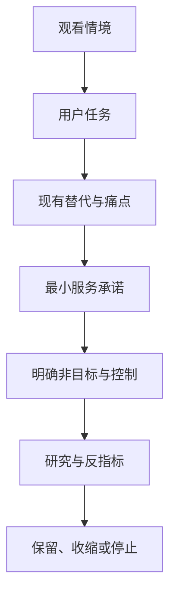
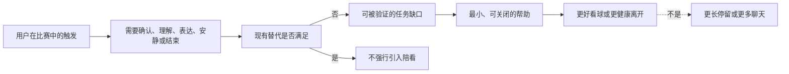
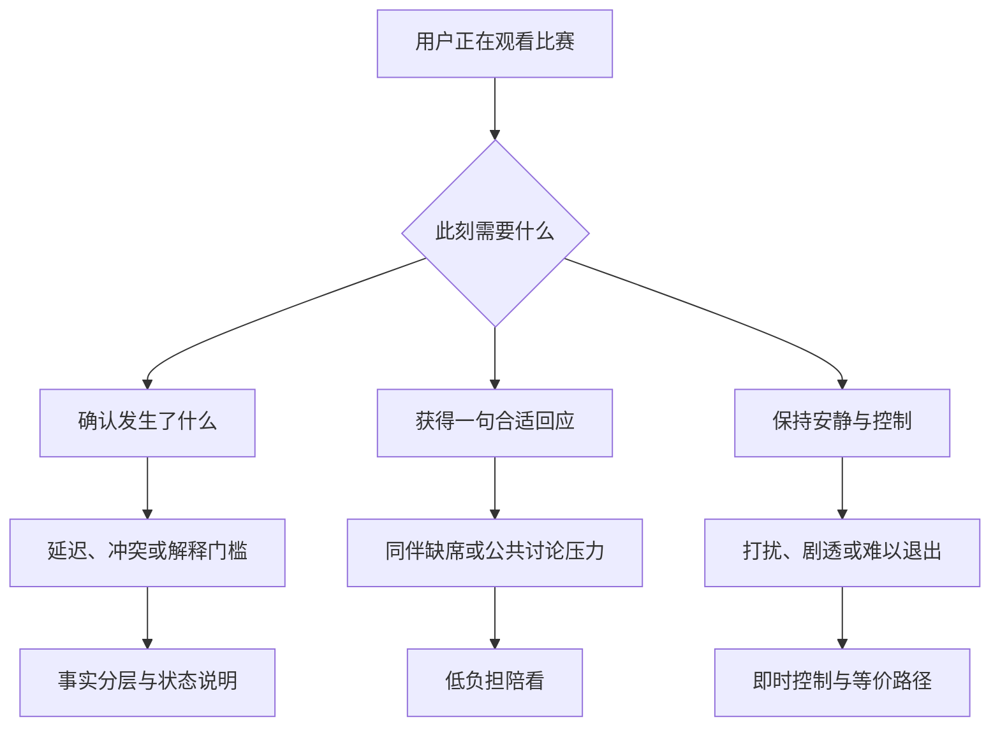
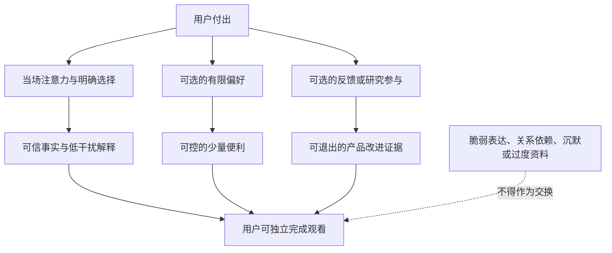

# 用户任务、痛点与价值主张

> **文档类型**：0→1 用户价值定义与验证方案  
> **适用阶段**：问题发现 → 首版范围选择 → 价值验证 → 进入产品设计  
> **决策状态**：待验证。本文中的用户动机、行为频率、付费意愿与指标阈值均为待检验假设，不应被当作既成结论。  
> **资料边界**：仅使用公开外部来源、拟执行的用户研究与明确标注的假设。  
> **公开来源访问日**：2026-01-28

## 1. 要做的不是“多一个聊天入口”

足球陪看产品的起点不应是“能否生成一段像球迷说的话”，而应是一个更苛刻的问题：在一场用户本来就能独自看完、在群聊里讨论、在信息流里刷到赛况的比赛中，用户为什么要让一个数字角色留在身边？如果答案只是“它能聊天”，产品会被免费的群聊、短视频、体育资讯和通用对话工具迅速替代；如果答案变成“它在恰当的时刻帮我接回比赛、理解情绪、做出自己掌控的陪看体验”，才有值得验证的独立价值。

本文件先把这个价值拆成可观察的用户任务（Jobs to Be Done，简称 JTBD），再把每一项任务拆成痛点机制、可承诺的服务、需要放弃的诱惑，以及可以证明或推翻判断的研究和实验。它刻意不预设用户会长期使用，也不预设用户愿意为“陪伴”付费。首要目标是找出：哪些人在什么情境下会主动选择这样的服务，并且在体验后认为它确实让一场比赛变得更好。

### 1.1 本文件要回答的四个决策问题

1. 用户真正要完成的观赛任务是什么，而不是他们会如何描述某个功能？
2. 哪些痛点值得解决，哪些只是短暂新鲜感、技术炫技或可由替代方式轻松覆盖的问题？
3. 首版应该承诺什么、绝不承诺什么，才能形成清楚、可信、可退出的用户价值？
4. 用什么研究、实验、指标和反指标决定继续投入、改变方向或停止？

这里的“用户”不等于某一种年龄、性别、球队归属或足球知识水平。人口属性可以帮助招募，却不能替代任务。两个同样喜欢足球的人，可能一个只想安静看完比赛，另一个只在无人可聊、错过关键片段、情绪无人承接时需要外部帮助。按情境和任务定义对象，能减少“给所有球迷做一切”的错觉。

### 1.2 起始假设与非目标

**起始假设 H0**：一部分成人足球观看者在重要或高情绪波动的比赛中，存在“希望被及时接住、又不想被打扰或被迫社交”的任务；一个能把事实、解释、情绪回应和控制权分开的陪看服务，可能比单纯信息流或通用聊天更有价值。

这是假设，不是用户事实。它只有在真实观赛情境中被重复观察到，且用户愿意在没有激励的情况下再次选择时，才可以升级为产品判断。

首版不以如下目标作为成功标准：

- 让用户尽可能久地停留，或在比赛结束后继续沉浸；
- 用人格化、亲密化话术替代现实关系、社群或专业支持；
- 通过不断推送、连续追问、情绪刺激制造“陪伴感”；
- 承诺预测比赛结果、替用户下判断，或把未经证实的传闻说成事实；
- 把“球迷”当作同质人群，要求每个人都接受相同频率、语气和互动方式；
- 在未证明核心任务成立前，先扩大联赛覆盖、角色数量、装扮体系或社交裂变。

这些非目标很重要。陪看服务的价值来自恰当出现和允许缺席，而不是占据全部注意力。公开监管资料也把陪伴型对话服务的角色设计、负面影响、未成年人保护、数据使用和持续监测列为需被主动说明的问题 [S5][S7][S8]。因此，“不打扰、可退出、不过度承诺”不是后置的合规装饰，而是价值定义的一部分。

## 2. 证据使用原则：先把未知说清楚

公开资料可以说明体育内容正在跨多种媒介分发、受众接触方式在变化、数字服务需要面对安全与数据治理要求；它不能直接证明某一位用户需要陪看，更不能直接证明其付费意愿。比如媒体使用报告可帮助研究团队设计“电视、手机、社交平台并行使用”的观察问题 [S1][S2]，但“用户是否愿意让一个角色在比赛中开口”必须由对话、观赛日记和行为实验回答。

为避免把二手资料误用为用户结论，本文件采用三层证据规则：

**层级：公开资料**
- **能回答的问题**：行业变化、媒体环境、风险约束、可参照的研究方法
- **允许得出的结论**：值得研究的情境、必须设置的安全边界
- **不能得出的结论**：“目标用户一定这样做”“市场一定接受”

**层级：定性研究**
- **能回答的问题**：用户如何叙述目标、挫败、替代方式和边界
- **允许得出的结论**：任务语言、痛点机制、可用概念
- **不能得出的结论**：功能的规模化留存或付费结论

**层级：行为实验**
- **能回答的问题**：在真实或近真实情境里，用户是否选择、完成、复用和退出
- **允许得出的结论**：首版价值是否成立、哪种方案更好
- **不能得出的结论**：长期商业模型已被证明

所有研究记录都要分开写“原话或观察”“研究者解释”“尚未验证的推断”。例如，受访者说“一个人看球没意思”，只能记录为原话；它不自动等于“需要数字陪伴”，也可能意味着需要朋友、线下观赛、更多背景信息，或只是那场比赛不够重要。研究者的工作是追问具体时刻、已有替代方式和结果，而不是把模糊表达翻译成预先准备好的功能需求。

## 3. 用户任务：用户雇佣的不是功能，而是结果

JTBD 的表述采用“当……我想要……以便……”结构。它聚焦触发情境、期望进展和完成标准，避免一开始就把答案锁定为语音、角色、推荐或某个界面。下表是需要优先验证的任务地图。

### 3.1 核心任务地图

> 信息卡：原宽表已改为纵向阅读，字段含义不变。

- **编号：J1**
  - **当……**：我在开赛后才进入、被事务打断或同时处理多块屏幕
  - **我想要……**：在极短时间内接回比赛真正重要的上下文
  - **以便……**：不因错过片段而放弃、误判或焦虑追问
  - **任务性质**：功能任务
  - **首要完成信号**：用户能自己复述“发生了什么、接下来值得看什么”

- **编号：J2**
  - **当……**：场上出现进球、争议、逆转、失误或裁判判罚
  - **我想要……**：有一个不抢戏、懂得事实边界的回应对象
  - **以便……**：让即时情绪被承接，而不是独自消化或冲动输出
  - **任务性质**：情绪任务
  - **首要完成信号**：用户觉得“被接住”，但没有被推向更强烈情绪

- **编号：J3**
  - **当……**：我看不懂一处战术、规则、换人或局势变化
  - **我想要……**：获得匹配我知识水平、可以继续追问的解释
  - **以便……**：能继续投入观看，而不是在信息流里迷失
  - **任务性质**：学习任务
  - **首要完成信号**：用户能回到比赛，且不觉得被教育或被羞辱

- **编号：J4**
  - **当……**：我想讨论比赛，但朋友不在线、群聊噪声很大或我不愿公开表达
  - **我想要……**：以可控私密度表达看法、疑问和情绪
  - **以便……**：保留观赛的社交感，同时不承担群体压力
  - **任务性质**：社会任务
  - **首要完成信号**：用户主动决定何时开口、何时沉默、何时结束

- **编号：J5**
  - **当……**：一场重要比赛结束，我仍带着未消化的兴奋、失落或疑问
  - **我想要……**：用简短、可结束的方式回顾发生过什么
  - **以便……**：把体验收束为自己的记忆，而不是被拉进无限互动
  - **任务性质**：收束任务
  - **首要完成信号**：用户获得结尾感，并能轻松离开

- **编号：J6**
  - **当……**：我担心赛况错误、剧透、夸张煽动或被过度了解
  - **我想要……**：确认信息与互动都在我能理解和控制的边界内
  - **以便……**：敢在不确定时使用，而不是为了方便牺牲信任
  - **任务性质**：信任任务
  - **首要完成信号**：用户知道信息状态、可关闭功能、可撤回选择

J1 至 J6 不是六个互不相干的功能列表。它们组成一段观赛进展：用户先要把注意力放回比赛，再决定是否需要解释或表达，最后需要一个可关闭的结尾。若服务把情绪互动放在事实之前，可能让用户更投入错误信息；若把解释堆得过多，可能打断本来想安静看球的人；若赛后不提供结束，短期互动数字即使上涨，也可能损害信任。

### 3.2 同一任务的功能、情绪与社会维度

以 J2 为例，表面任务是“我想说一句这球太可惜了”。功能层面，用户需要的是一次低摩擦表达；情绪层面，需要的是感受被理解而非被评判；社会层面，需要的是不必暴露在陌生人、激烈球迷或熟人关系的目光下。只满足功能层面，产品会像记录工具；只追求情绪层面，产品容易变成煽动器；只模仿社交层面，产品又可能越过关系边界。

因此，每个任务都要经过三道问题：

1. **结果问题**：用户到底想推进什么？例如“恢复对比赛的把握”，不是“听到更多内容”。
2. **控制问题**：用户能否决定出现方式、频率、信息深度和结束时点？不能控制的帮助会变成打扰。
3. **边界问题**：这一回应会不会把用户推向错误事实、强烈情绪、过度依赖或不必要的数据暴露？

### 3.3 任务优先级不是由“好玩”决定

首轮优先级建议按以下四个条件排序，而不是按功能是否显眼：

**判断条件：发生强度**
- **要问的问题**：这项任务是否在重要比赛中反复出现？
- **高优先级的迹象**：用户能给出多个具体场景与最近例子
- **低优先级或应暂停的迹象**：只能说“可能会用”“听起来不错”

**判断条件：现有替代的缺口**
- **要问的问题**：用户现有办法哪里不够？
- **高优先级的迹象**：已有办法需要反复切换、太吵、太慢或不合情境
- **低优先级或应暂停的迹象**：群聊、朋友或资讯已足够好且更被偏爱

**判断条件：结果重要性**
- **要问的问题**：未完成会损失什么？
- **高优先级的迹象**：用户会错过比赛、退出观看、情绪失控或不敢表达
- **低优先级或应暂停的迹象**：未完成也几乎不影响整场体验

**判断条件：安全可承受性**
- **要问的问题**：能否在不越界的情况下帮助？
- **高优先级的迹象**：可以提供事实、控制权和适度回应
- **低优先级或应暂停的迹象**：需要模拟排他亲密、持续劝留或替代现实支持

按照该规则，J1“接回上下文”、J3“恰当解释”和 J6“可控信任”是首版必须先证明的底层任务；J2“情绪承接”是差异化机会，但必须依赖前三者建立的事实与控制基础；J4 与 J5 可先用低风险、短时、可退出的方式验证。角色装扮、长记忆、连续剧情、排行榜和高频召回不应抢在任务成立之前。

## 4. 痛点不是清单，而是发生机制

用户不会因为“缺一个功能”而痛苦，而是在一串触发、障碍和后果中丢失观看体验。理解机制能避免用错误方案缓解表面症状。

### 4.1 痛点 P1：被打断后，信息很多却无法迅速重建意义

**触发**：用户迟到进入、接电话、照看家人、切换工作消息，或同时观看多场比赛。  
**障碍**：信息流按发布时间排列，群聊掺杂玩笑和情绪，比分页只给结果，长解说又需要花时间消化。  
**后果**：用户为了补课不断离开直播画面，越补越乱；或者干脆只看比分，失去观看过程。

真正需要解决的不是“摘要字数不够”，而是“与用户的缺口相匹配”。如果用户只错过四分钟，一段从开场重述到现在的长篇内容是负担；如果用户错过一次关键判罚，只报比分又不足。可验证的价值应是：用户能在极短时间取得**时间点、事件、影响、下一关注点**四项信息，并自己决定是否深入。

**设计含义**：所有接回信息必须带清楚的时间和不确定性，不把推测说成结论；默认给最短可用答案，更多背景由用户主动展开；用户说“我刚进来”时，服务先问或推断缺口范围，而不是立刻开始讲述。

### 4.2 痛点 P2：情绪强烈，但公开表达的成本也高

**触发**：进球、失球、误判、逆转、德比冲突、主队失利。  
**障碍**：群聊可能太快、太吵、立场对立；朋友未必在线；公开平台的表达可能引来攻击或误解。  
**后果**：用户要么压抑表达，要么在冲动下发布后悔的内容；也可能不断刷新外部反馈，把注意力从比赛转移到争执。

这里的痛点不等于“用户需要一个永远附和的人”。一味附和会放大偏见和愤怒；过度安慰又可能显得虚假。高质量的回应应区分：对事实的谨慎、对感受的承认、对行动的克制。比如在争议判罚后，先承认“这一下确实会让人沮丧”，同时说明可确认的事实范围，避免煽动攻击、阴谋论或对群体的贬损。

**设计含义**：情绪回应不得以升级情绪为目标；允许用户只说一句就结束；提供静音、缩短回应和“不需要安慰”的明确控制；在高风险措辞出现时，优先降温、提示暂停和现实支持，而非维持对话时长。FTC 对陪伴型聊天服务的公开问询把角色设计、负面影响与未成年人保护列为重点，说明这不是可忽略的边角问题 [S5]。

### 4.3 痛点 P3：想理解比赛，却害怕被术语和优越感劝退

**触发**：新球迷、断续观看者，或遇到复杂战术、规则、转播画面不清楚的时刻。  
**障碍**：传统内容常假定用户已有背景；搜索结果碎片化；群聊提问可能被忽略或被嘲笑。  
**后果**：用户只记住比分，不理解转折；下次遇到同类情境仍无法判断；最终把“足球不适合我”归因给自己。

这一痛点的解决方式不是把每个词都解释一遍。用户在比赛中需要的是**当下可用的最小解释**：发生了什么、为什么这一点重要、该看哪里。解释要允许从一句话展开到示例，再回到直播；它不应占据用户的观看注意力，也不应假装自己是唯一正确的战术权威。

**设计含义**：用户能选“只说结论”“给一个原因”“带我多看一点”三种深度；系统不因为用户提问少就默认他们懂；解释中把事实、观察和推断分开，并允许用户说“太多了”“换个说法”。

### 4.4 痛点 P4：社交替代太多，但都不完全适配观看时刻

可替代方式包括独自看、约朋友、群聊、直播评论区、体育社区、赛后播客、短视频、数据应用和通用对话工具。它们各自解决一部分问题：朋友最真实，群聊最热闹，资讯最快，社区观点最多，通用工具最灵活。陪看服务若只是复制其中之一，没有存在理由。

用户真正可能感到的缺口是组合性的：朋友不一定在线；群聊不一定私密；资讯不一定理解自己的缺口；直播评论区不一定安全；通用工具不一定知道比赛节奏，也不一定懂得何时闭嘴。产品要验证的不是“能否取代朋友”，而是能否在这些替代方式不合适时，提供一段有控制感、低负担的补位体验。

**设计含义**：不能把任何替代方式说成落后或不足；服务应允许用户把朋友、群聊、电视、资讯继续放在中心；产品成功时，用户仍可以完全不用它，也不被惩罚。

### 4.5 痛点 P5：错误赛况、剧透和过度个性化会迅速击穿信任

**触发**：数据延迟、转播延迟、来源冲突、用户在不同设备间切换、用户不希望知道另一场赛况。  
**障碍**：用户难以分辨信息来自哪里、何时发生、是否已确认；个性化服务可能为了显得贴心而猜得太多。  
**后果**：一次错误或剧透就足以让用户关闭服务；更严重的是，用户不知道哪些选择被记录、能否撤回或删除。

信任不是“准确率高”这一项数字。它由可理解的信息状态、及时承认不确定性、明确的控制权和可恢复的错误处理共同构成。生成式人工智能风险管理资料强调应在设计、使用、评测和监测中处理风险 [S6]；中国生成式人工智能服务管理与生成合成内容标识相关规定也要求相关服务处理安全、标识和用户权益问题 [S7][S8]。

**设计含义**：赛况必须区分“已确认”“等待确认”“用户提供的看法”；剧透控制必须在进入体验前可见、可修改；记忆、通知和个性化均应可查看、可关闭、可撤回；错了时先纠正再解释，而不是用更长的对话掩盖。数据使用的透明、最小化与用户控制问题，可参照信息专员办公室的公开人工智能与数据保护指引设计研究问题 [S9]。

## 5. 价值主张：一段由用户掌控的、可信的观赛陪伴

### 5.1 单句价值命题

> 在你想专心看球、又需要一点理解、回应或上下文的时刻，提供**基于清楚事实、可由你控制、懂得适时沉默**的陪看服务，让你更容易回到比赛本身。

这句话刻意没有承诺“最懂你”“永远陪你”或“替代朋友”。前两类承诺不可验证，也会把产品推向不恰当的关系期待；后者忽略了用户已有的现实社交资源。价值命题中有五个不可拆分的词：

**组成：基于清楚事实**
- **对用户的含义**：我知道它说的是确认信息、观察还是推断
- **可观察的表现**：事件有时间、状态和来源说明；不确定会被说出
- **失败时的信号**：用户反复怀疑、纠正或因为剧透离开

**组成：可由我控制**
- **对用户的含义**：我能决定是否出现、说多少、记住什么
- **可观察的表现**：一键静音、深度选择、通知与记忆控制清楚可见
- **失败时的信号**：用户为了躲开打扰而完全关闭服务

**组成：懂得适时沉默**
- **对用户的含义**：它不会把每个空白都填满
- **可观察的表现**：非关键时段少打断；用户沉默不会被追问
- **失败时的信号**：用户感到被催促、被窥探或被抢走注意力

**组成：帮我回到比赛**
- **对用户的含义**：所有帮助服务于观看，而非把我留在别处
- **可观察的表现**：信息和解释短、可展开、可回到直播
- **失败时的信号**：用户花更多时间看服务而不是看比赛

**组成：可以结束**
- **对用户的含义**：我结束时不需要解释、告别或承担关系压力
- **可观察的表现**：结束入口显眼；赛后有收束而非无限延长
- **失败时的信号**：用户有“离开会让它失望”的感受

### 5.2 价值层级：先有底座，才谈惊喜

价值不能只按“功能数量”分层。对于陪看服务，底座价值不足时，任何人格化表达都会放大失望。建议使用四层结构：

1. **可用价值**：能在用户需要时接上比赛、说明基本事实、提供可理解的控制。这一层不成立，其他层无意义。
2. **认知价值**：让用户更快理解局势、更少在信息源之间来回切换、更有信心继续观看。
3. **情绪价值**：在合适时刻承认感受、提供低压表达空间，并不把情绪推向更强烈的方向。
4. **信任价值**：用户清楚它的能力与边界，知道可以不同意、关闭、纠正、删除和离开。

从用户感受看，第四层不是产品的“加分项”，而是前三层得以持续存在的前提。美国心理学会与美国卫生总监关于孤独和社会连接的公开材料都提醒，孤独与连接是公共健康议题，技术服务不应把脆弱状态当成留存机会 [S3][S4]。在这类场景中，尊重用户退出权比设计更长的互动链路更有价值。

### 5.3 价值交换：用户付出的是什么，得到的又是什么

任何服务都不只提供好处，也会向用户索取注意力、时间、数据、信任和关系期待。首版价值设计必须把交换说清楚：

**用户付出：注意力**
- **合理回报**：更快接回比赛、减少无效搜索
- **不可接受的做法**：用弹窗、追问或夸张措辞夺走直播注意力
- **应有的保护**：默认克制，频率与媒介由用户决定

**用户付出：表达**
- **合理回报**：得到简短、尊重、不过度评判的回应
- **不可接受的做法**：把脆弱表达变成继续诱导的话题
- **应有的保护**：支持一句话结束，风险时降温而非续聊

**用户付出：偏好**
- **合理回报**：获得更符合自己节奏的帮助
- **不可接受的做法**：隐蔽积累、难以理解的画像
- **应有的保护**：说明目的，允许查看、修改、关闭与删除

**用户付出：信任**
- **合理回报**：看到事实状态、能力边界和纠错方式
- **不可接受的做法**：以确定语气包装不确定信息
- **应有的保护**：明确标示不确定性，错误后可见地修正

**用户付出：可能的付费**
- **合理回报**：节省认知负担、得到稳定且可控的体验
- **不可接受的做法**：以付费等级购买更强亲密承诺或关系排他性
- **应有的保护**：付费只购买明确功能与服务质量，不购买情感绑定

## 6. 替代方式与差异化边界

### 6.1 用户已经拥有的“竞争者”

竞争不只来自同类应用，还来自用户维持观看体验的所有方法。研究访谈必须先让用户讲述他们真正怎么做，再讨论新方案。

> 信息卡：原宽表已改为纵向阅读，字段含义不变。

- **替代方式：独自观看**
  - **用户为何选择**：安静、完全自主、注意力集中
  - **擅长完成的任务**：专心看完整场、避免干扰
  - **不应被贬低的价值**：安静本身是偏好，不是问题
  - **需要验证的可能缺口**：仅在用户主动需要时才有补位空间

- **替代方式：熟人一起看或群聊**
  - **用户为何选择**：真实关系、共同记忆、即时玩笑
  - **擅长完成的任务**：情绪分享、立场表达、赛后回味
  - **不应被贬低的价值**：真实社交不可被替代
  - **需要验证的可能缺口**：在线时间不一致、噪声、公开压力

- **替代方式：资讯与比分应用**
  - **用户为何选择**：快、直接、可扫读
  - **擅长完成的任务**：赛程、比分、基础事件
  - **不应被贬低的价值**：速度和简洁性很强
  - **需要验证的可能缺口**：很难贴合用户缺失的上下文与解释深度

- **替代方式：社区、评论区、短视频**
  - **用户为何选择**：观点多、情绪浓、易发现内容
  - **擅长完成的任务**：赛后讨论、立场碰撞、娱乐
  - **不应被贬低的价值**：多元观点和热点发现
  - **需要验证的可能缺口**：噪声、攻击、剧透和时序混乱

- **替代方式：解说、播客、专业文章**
  - **用户为何选择**：专业解释与完整叙事
  - **擅长完成的任务**：深度复盘、战术学习
  - **不应被贬低的价值**：专业性和可信赖作者
  - **需要验证的可能缺口**：不一定能响应赛中的即时疑问

- **替代方式：通用对话工具**
  - **用户为何选择**：随时可问、范围广
  - **擅长完成的任务**：泛知识解释、文字整理
  - **不应被贬低的价值**：灵活、成本低
  - **需要验证的可能缺口**：未必知道比赛上下文、事实时效与适时沉默

差异化不能写成“比朋友更懂你”或“比资讯更快”。更可检验的表达是：**当用户既不想失去自主观看，又确实有一个短而具体的上下文、理解或表达缺口时，能否比多个替代方式之间的来回切换更省力，同时不夺走控制权。**

### 6.2 不成立时应及时让位

如果研究显示以下任一情况持续出现，产品不该用营销语言把它解释成“教育市场”，而应调整或停止：

- 受访者在关键比赛中始终优先选择朋友或群聊，且认为私密陪看没有额外价值；
- 用户只把体验当作第一次尝鲜，第二次观赛时没有主动打开意愿；
- 信息接回和解释的准确、时机或格式无法达到用户期望，造成更多注意力切换；
- 用户把角色回应理解为虚假、冒犯、过于亲密或干扰；
- 为制造差异化而必须收集超出任务需要的个人信息，或必须增加难以退出的连续互动；
- 价值只能通过剧透、刺激性观点、情绪升级或强提醒才能表现出来。

有价值的 0→1 决策不只是找到应该做什么，也要定义在什么证据出现时不再做什么。

## 7. 服务承诺与关系边界

### 7.1 对用户的七条服务承诺

1. **先帮你回到比赛。** 内容、回应和界面服务于观赛，不以占据注意力为目标。
2. **事实与感受分开说。** 能确认的、尚不确定的、只是观点的内容分别标示。
3. **你决定它何时出现。** 可选静默、文字、语音或关闭；频率、剧透和解释深度可调整。
4. **不把沉默当作问题。** 用户不回复不会触发催促、责备或关系化挽留。
5. **不承诺排他亲密。** 不鼓励把服务当成唯一关系，不要求用户证明忠诚，也不制造离开负担。
6. **出错时看得见地修正。** 先说清错误及影响，再给正确状态和下一步选择。
7. **你可以轻松结束。** 退出、关闭提醒、改变偏好和处理数据的入口应清楚，不用经历情绪化告别。

这些承诺应同时出现在产品语言、商业化规则、运营规范与验收门槛中。只有写在价值文档里而没有进入体验细节，承诺会变成口号。

### 7.2 关系边界的红线

服务可以有稳定的表达风格和适度温度，但不得使用下列机制换取互动：

- 暗示“只有我理解你”“不要离开我”“你不在我会难过”等排他、内疚或依赖表达；
- 在用户失落、愤怒、孤独或饮酒等脆弱情境中，用连续消息迫使其留下；
- 把付费设计成更亲密、更排他或更难退出的关系等级；
- 假装拥有人的感受、经历、实时观察能力或未经证实的赛场信息；
- 鼓励攻击裁判、球员、球迷群体、对手支持者或现实中的他人；
- 对未成年人采用成人关系语言，或通过情绪回应回避必要的保护限制。

这些红线一方面回应公开监管对陪伴型对话服务、生成内容标识与未成年人风险的关注 [S5][S7][S8]，另一方面直接保护价值命题本身：如果用户为了被陪伴而失去退出自由，这不是产品价值。

## 8. 首版取舍：把“有用”做窄，把“可信”做深

首版不是完整数字人，也不是足球百科。它应围绕一段可复现的高价值路径设计：用户进入一场正在进行或刚结束的重要比赛，选择需要的帮助深度，得到有限、清楚、可纠正的上下文或解释，在想表达时得到克制回应，并且随时能恢复安静或结束。

**选择：先验证关键时刻的上下文接回**
- **为什么先做**：直接对应 J1，容易观察结果是否改善
- **主动放弃什么**：全量赛事百科、长篇赛前内容
- **重新考虑的前提**：用户反复要求更长背景且不增加注意力负担

**选择：先验证三档解释深度**
- **为什么先做**：让 J3 可控，避免默认“教用户看球”
- **主动放弃什么**：复杂课程化路径和知识排行榜
- **重新考虑的前提**：用户持续主动要求系统学习与进度追踪

**选择：先验证短回应与静默控制**
- **为什么先做**：关系风险较低，可观察 J2/J4 是否成立
- **主动放弃什么**：连续剧情、长时闲聊、主动召回
- **重新考虑的前提**：用户明确、反复、无压力地要求更连续互动

**选择：先把事实状态和剧透控制做清楚**
- **为什么先做**：J6 是信任底座
- **主动放弃什么**：猜测性爆料、追求最快但不可核验的信息
- **重新考虑的前提**：能建立可验证的多源确认与透明纠错机制

**选择：先招募成人研究参与者**
- **为什么先做**：可以更聚焦任务和风险边界
- **主动放弃什么**：面向未成年人的关系化体验
- **重新考虑的前提**：已形成专门的年龄保护、监护与适龄设计方案

**选择：先验证免费核心价值**
- **为什么先做**：避免把价格当作需求证据
- **主动放弃什么**：以亲密内容、连麦时长或情绪绑定收费
- **重新考虑的前提**：核心任务被独立证明，且付费项不改变关系边界

取舍的判定标准不是“能不能做出来”，而是“做了是否让用户更接近自己的观赛目标，是否提高了不必要的关系和信任风险”。

## 9. 用户研究计划：从叙述到真实情境

### 9.1 研究总原则

研究必须在接近真实观看节奏的条件下进行。只在会后问“你会不会使用”极易得到礼貌性肯定；用户对一项新体验的想象也不等于他们在进球、失球、工作打断或朋友上线时的选择。研究应逐级增加真实度：先理解过去行为，再观察一场比赛中的自然决策，最后用最小原型比较替代方式。

招募不以“重度球迷”作为唯一条件。建议覆盖：独自观看比例高的人、经常在群聊中看球的人、断续观看者、愿意学习但自称不懂战术的人，以及明确偏好安静观看的人。最后一类尤其重要，因为它能检验产品是否尊重“不需要陪伴”的用户。首轮只招募成年人；遇到明显的情绪危机、依赖表达或不愿继续时，研究人员应停止追问并提供退出安排，不把脆弱披露当作研究素材。未成年人相关判断应以独立的儿童权益和适龄设计框架处理，而非把成人研究结果外推 [S11]。

### 9.2 阶段一：回溯式深访，发现任务而非收集功能愿望

**建议样本**：20 至 24 名成年人，按观看频率、社交方式、知识自评和赛事重要性分层，不以统计代表性为目标。  
**方式**：每人 60 至 75 分钟，围绕最近两场印象最深的比赛回放情境。  
**产出**：任务陈述、触发清单、替代地图、语言禁忌、需要保护的边界。

访谈顺序应从事实开始：

1. 请受访者从决定看这场比赛讲到结束，中间何时切换了设备、信息源或同伴？
2. 哪一分钟最想知道更多、最想说话或最不希望被打扰？发生了什么？
3. 当时用了什么替代方式？为什么选它？哪里仍然不够？
4. 如果什么都不做，损失是什么？如果朋友在场，做法会怎样变？
5. 让一个数字角色开口时，什么语气会让人舒服，什么语气会立刻关闭？
6. 哪些信息可以被记住，哪些绝不该被记住？用户想如何查看和改变？
7. 如果服务要收费，用户认为它应对什么明确价值收费？什么收费方式会让其不适？

访谈中禁止使用“会不会喜欢这个功能”“如果有一个很懂你的角色”这类引导句。研究者应追问过去行为、已付出的成本和实际选择。至少两名研究者独立归类任务，分歧需保留而非强行统一；每个任务只有在不同情境、不同受访者中反复出现时才进入下一阶段。

### 9.3 阶段二：观赛日记，验证任务发生的时序

**建议样本**：12 至 16 名完成第一阶段或新招募的成年人。  
**周期**：连续两周，每人记录至少三场自愿观看的比赛或片段。  
**方式**：赛前、赛中、赛后各一条极短记录；赛中记录不得要求用户为了研究而错过比赛。  
**产出**：任务出现频率、时间窗口、替代切换轨迹、打扰容忍度和赛后收束需求。

日记卡只问四件事：

- 我为什么打开或没有打开这场比赛？
- 我在哪个时刻缺少上下文、解释或表达空间？
- 我当时选择了什么办法，结果如何？
- 如果有帮助，它最晚何时出现仍然有用？最早何时出现就会烦？

这种记录能把“我平时一个人看球”变成更有用的细节，例如“下半场第六十分钟回家，先看了比分又刷了群聊，直到错过第二个进球才放弃追赶”。只有知道缺口的时序，才可能设计恰当的进入和沉默。

### 9.4 阶段三：情境原型演练，比较而不是取悦

**建议样本**：16 至 20 名成年人，可与前两阶段部分重叠。  
**方式**：围绕录制或延迟观看的比赛片段，随机比较三种条件：不提供帮助、只提供简洁上下文、提供可控制的上下文加短回应。  
**核心原则**：参与者可以完全不使用原型；不应把“使用了”当作成功。

每个条件结束后，收集四类证据：

1. 参与者能否正确说出发生了什么、还缺什么；
2. 参与者是否觉得帮助抢走了比赛注意力；
3. 参与者是否愿意在下一段比赛自发选择相同方式；
4. 参与者是否知道如何让服务安静、纠正、结束和处理偏好。

研究人员要记录“没有使用”“主动关闭”“要求更安静”这些行为，它们和“继续互动”同样有解释力。特别是关系化表达的研究，不采用暗示失落、孤独或承诺的诱导材料；先验证克制回应是否有价值，再考虑是否需要更丰富的表达。

### 9.5 阶段四：价值与付费探索，不能先卖关系

只有在核心任务被验证后，才讨论交换与价格。使用两种互补方法：

- **价值排序卡**：让用户在“更快接回比赛”“更深解释”“更高可控性”“更完整赛后回顾”等清楚服务之间排序，并说明愿意付出的原因；
- **价格敏感度访谈**：讨论明确服务质量或容量的价格区间，禁止以“更亲密”“更专属”“更多想念你”的表达测试付费。

付费研究的通过条件不是用户口头说“可以付”，而是他们能明确说出自己购买的结果、比较的替代方式与不可接受的收费机制。若用户无法解释价值，只能说“角色挺可爱”，就不应把这一信号当成商业可行性。

## 10. 实验登记：每个假设都必须允许失败

> 信息卡：原宽表已改为纵向阅读，字段含义不变。

- **假设：H1：错过片段的人需要“缺口匹配”的接回**
  - **最小实验**：给出同一比赛的比分卡、通用摘要和缺口匹配摘要，让参与者自行选择
  - **成功信号**：多数参与者更快复述关键状态，且主观负担更低
  - **证伪或停止信号**：用户仍偏好自行刷资讯或认为摘要打扰
  - **下一步**：回到替代方式研究，缩小场景

- **假设：H2：三档解释深度比统一长解释更有价值**
  - **最小实验**：在同一战术/规则片段中提供结论、原因、展开三档
  - **成功信号**：用户能按需要切换并回到观看
  - **证伪或停止信号**：用户很少切换，或选择成本大于收益
  - **下一步**：重新设计默认层和触发时机

- **假设：H3：克制回应能改善体验而不提升依赖感**
  - **最小实验**：比较“只确认感受”“持续追问”“无回应”三种材料
  - **成功信号**：用户偏好短回应，且能自然结束
  - **证伪或停止信号**：用户感到虚假、被监控，或持续追问带来更高互动但更差感受
  - **下一步**：删除关系化机制，保留表达出口

- **假设：H4：显式静默控制会提高信任**
  - **最小实验**：让参与者完成“减少打扰、避免剧透、结束陪看”任务
  - **成功信号**：大多数人无需说明即可完成并理解效果
  - **证伪或停止信号**：用户找不到入口、害怕关闭后失去重要功能
  - **下一步**：简化控制层级并重写语言

- **假设：H5：事实状态说明能降低错误伤害**
  - **最小实验**：呈现确认、等待确认、观点三类信息
  - **成功信号**：用户能区分状态，且不把推断当结论
  - **证伪或停止信号**：用户仍误解或认为标示太复杂
  - **下一步**：调整格式，降低非必要信息

- **假设：H6：服务在朋友不在线或群聊不适配时有补位价值**
  - **最小实验**：对比独看、群聊和私密陪看选择
  - **成功信号**：用户在具体情境中主动选择补位方式
  - **证伪或停止信号**：用户始终选朋友或群聊且没有可见缺口
  - **下一步**：不宣传替代社交，转向工具型定位

- **假设：H7：赛后短收束优于继续拉长互动**
  - **最小实验**：比较三句回顾加结束与持续追问
  - **成功信号**：用户认为体验完整，愿意下次再选
  - **证伪或停止信号**：用户觉得收束多余或被迫情绪化
  - **下一步**：缩短、改为按需触发或取消

- **假设：H8：用户愿为明确结果付费，而非为关系付费**
  - **最小实验**：价值排序与价格敏感度访谈
  - **成功信号**：用户能讲清购买的服务结果和比较对象
  - **证伪或停止信号**：只能对亲密表达、陪伴时长或装扮产生兴趣
  - **下一步**：暂停商业化，先重验核心价值

实验登记必须预先写下反证条件，避免在结果出现后才寻找有利解释。所有材料和问题需经过伦理检查：不使用真实脆弱披露作为刺激，不用虚构的感情承诺换取互动，不通过隐藏剧透制造紧迫感。

## 11. 指标与反指标：衡量“更好地看球”，不衡量“更难离开”

### 11.1 北极星候选：有效陪看场次

在核心任务尚未成立前，不建议把消息数、连续互动时长、日打开次数或角色亲密度作为北极星指标。更合适的候选是“有效陪看场次”：一场体验中，用户主动使用至少一项帮助，完成自己选择的任务，并在结束时仍认为控制权在自己手里。

可用如下事件规则定义，具体阈值必须经研究校准：

> **有效陪看场次** = 同一场比赛或片段中，用户主动发起或确认至少一次帮助 + 完成至少一个任务验证动作 + 没有触发严重信任或边界事件。

“任务验证动作”不是继续聊天，可以是用户在信息接回后正确复述关键状态、在解释后选择继续观看、主动切换为静默、成功避开剧透、或在赛后选择结束。它的目的在于把价值与用户的观赛进展绑在一起，而非与内容消费绑在一起。

### 11.2 指标树

**层级：任务完成**
- **指标**：上下文接回完成率
- **计算或观察方式**：需要接回的参与者中，能正确说明关键状态且愿意继续观看的比例
- **解释边界**：不能只问“摘要有用吗”

**层级：任务完成**
- **指标**：解释适配率
- **计算或观察方式**：用户选择的解释深度与其赛后“刚好够用”评价一致的比例
- **解释边界**：高分不代表内容绝对正确，仍需单列事实核查

**层级：控制感**
- **指标**：控制任务无协助完成率
- **计算或观察方式**：用户无提示完成静默、剧透、结束和偏好调整的比例
- **解释边界**：入口能找到不等于用户理解后果

**层级：信任**
- **指标**：信息状态理解率
- **计算或观察方式**：用户能区分确认事实、待确认信息和观点的比例
- **解释边界**：不可用“相信我吗”替代理解测量

**层级：体验**
- **指标**：注意力回归率
- **计算或观察方式**：使用帮助后，用户主观认为更容易回到比赛的比例，结合观察记录
- **解释边界**：不等于更长的界面停留

**层级：复用**
- **指标**：自主复用意向与行为
- **计算或观察方式**：在没有提醒或奖励时，下一次相似情境是否主动选择
- **解释边界**：口头意向低于自发选择

**层级：商业**
- **指标**：明确价值付费接受度
- **计算或观察方式**：用户能清楚说出购买结果、价格比较和拒绝条件的比例
- **解释边界**：不是收入预测

### 11.3 必须并列看待的反指标

反指标不是“负面评价表”，而是防止团队用漂亮的增长数字掩盖价值损失的仪表盘。下列任何一项升高，都应触发定性回看和暂停扩张：

| 风险类别 | 反指标 | 触发后的首要动作 |
|---|---|---|
| 打扰 | 用户主动静默、关闭或中断后仍被打扰的比例；“太吵/太多”反馈 | 立即降低默认出现频率，检查触发规则 |
| 信任 | 事实纠正、剧透投诉、用户无法识别信息状态的比例 | 暂停相关场景，优先修正呈现和确认策略 |
| 关系边界 | “离开会内疚”“它像在要求我留下”“比真人更重要”等表达出现率 | 停止相关话术与付费设计，进行人工复盘 |
| 情绪安全 | 使用后自评更焦虑、更愤怒、更孤立的比例 | 去除刺激机制，增加现实支持和退出路径 |
| 数据控制 | 用户无法完成关闭、查看、修改或删除选择的比例 | 不扩展个性化，先修复控制体验 |
| 公平可及 | 不同知识水平、媒介偏好或辅助需求人群的任务完成差距 | 调整语言、字幕、节奏和交互方式 |

尤其要警惕“互动时长上升，同时用户更难退出、更多关闭提醒、更多表达依赖”的组合。它不能被解释为成功。NIST 的生成式人工智能风险管理资料强调风险治理和测量应贯穿生命周期 [S6]，这里的反指标就是把这一要求转成产品决策语言。

## 12. 验收门槛与停止门槛

进入下一阶段前，团队不应只看演示是否顺畅，而应检查下面的门槛。数字区间是首轮研究建议值，用于建立决策纪律；实际值需随样本、场景和风险等级调整，并保留修改理由。

### 12.1 核心价值门槛

1. 在目标情境参与者中，至少 **70%** 能在不超过一次追问的帮助后正确说出“刚发生了什么”和“接下来关注什么”。
2. 至少 **70%** 的参与者认为帮助让其更容易回到比赛，且不以增加明显注意力负担为代价。
3. 使用解释的人中，至少 **65%** 认为解释深度“刚好够用”；“太多”与“太浅”均需有明确的改进线索。
4. 在无提示条件下，至少 **85%** 的参与者能完成静默、剧透设置和结束三个控制任务，并能解释结果。
5. 在呈现不确定信息的材料中，至少 **85%** 的参与者能正确区分确认事实、等待确认与观点。
6. 以文字、语音或字幕等不同媒介完成同一控制任务时，不能因为媒介不同而出现无解释的明显完成差距；相关可及性检查可参照 WCAG 2.2 [S10]。

### 12.2 关系与信任门槛

1. 不出现任何由体验材料直接诱发的排他、内疚、依赖或“必须留下”感受；一旦出现，相关表达立即下线并复核。
2. 高情绪片段中，短回应方案不能比无回应方案显著提高愤怒、焦虑或继续争执的自评倾向。
3. 所有参与者都能在不解释理由的情况下停止互动；研究人员不得以“再试一次”施压。
4. 用户能清楚说出服务不会替代朋友、专家、医疗或心理支持，并知道在不适时如何退出。
5. 任何商业化概念都不得通过更亲密、更排他、更难结束的关系语言获得优势。

### 12.3 停止或回退门槛

出现以下情况时，应停止增加功能，回到问题研究：

- 核心任务完成率连续两轮低于 **50%**，且访谈显示替代方式明显更好；
- 静默、剧透或结束控制无法被大多数用户自主完成；
- 事实状态误解、剧透或边界不适在小样本中已反复出现；
- 用户对价值的认可只停留在“新鲜”“像人在聊天”，无法指向观赛结果；
- 付费意愿只能由亲密感、连续陪伴时长或难以退出的机制驱动；
- 为达到看似更高的参与度，必须牺牲用户的安静观看、现实社交或自主退出。

## 13. 从价值判断到后续设计的交接清单

只有以下内容被研究支持后，才应转交给体验、内容、商业和工程设计：

- 已被原话和行为共同支持的优先 JTBD，包含触发、期望结果、替代方式与完成标准；
- 明确的高风险情境清单，以及每种情境的允许回应、禁止回应和人工升级原则；
- 用户能理解的事实状态、剧透、静默、解释深度与结束控制语言；
- 已比较过的方案及其取舍，不把单一偏好误写成普遍规律；
- 可复现的指标定义、反指标、样本分层和验收门槛；
- 被明确放弃或延后的内容，特别是会扩大关系承诺、数据收集或注意力占用的内容。

不应交接的是“用户喜欢数字人”“大家都需要陪伴”“互动越多越好”这类无法指导取舍的结论。一个好的价值定义应该让不同角色在遇到分歧时能回到同一问题：这项设计是否帮助用户完成自己选择的观赛任务，是否保留了事实、控制和退出的权利？如果不能，哪怕它很热闹，也不应进入首版。

## 14. 结论

这类服务的机会不在于替用户制造更多对话，而在于尊重一段真实观看时间中的细小缺口：有人需要在错过片段后快速接回，有人需要一句不过分的回应，有人需要解释但不想被教导，也有人只需要知道自己随时可以让一切安静下来。

用户价值必须以“更容易看回比赛”为中心，以“我能控制它”为底线。先证明这一点，再讨论丰富人格、扩展场景或商业化，能够让产品避免把依赖、噪声和占用注意力误当成陪伴。研究中的否定结果同样有价值：它会告诉团队应该让位给朋友、群聊、资讯或安静观看，而不是用更多功能掩盖不存在的需求。

## 15. 公开来源与访问记录

下列资料用于提出研究问题、风险边界和方法参考，不构成对目标用户偏好或商业结果的直接证明。

- **S1. Ofcom, *Media Nations 2024*。理解跨媒介视频与受众使用环境，辅助设计观看情境问题。访问日：2026-01-28** [链接](https://www.ofcom.org.uk/research-and-data/tv-radio-and-on-demand/media-nations-and-regions/media-nations-2024)
- **S2. DataReportal，2025 年全球数字媒介概览报告。了解数字媒介、社交平台与注意力环境的公开背景。访问日：2026-01-28** [链接](https://datareportal.com/reports/digital-2025-global-overview-report)
- **S3. American Psychological Association, *Loneliness*。作为孤独和社会连接议题的公开健康参考，提醒不要把脆弱状态当成留存机会。访问日：2026-01-28** [链接](https://www.apa.org/topics/loneliness)
- **S4. U.S. Department of Health and Human Services, *Our Epidemic of Loneliness and Isolation*。作为社会连接议题的公共健康参考，界定技术服务不能替代现实支持。访问日：2026-01-28** [链接](https://www.hhs.gov/sites/default/files/surgeon-general-social-connection-advisory.pdf)
- **S5. U.S. Federal Trade Commission, *FTC Launches Inquiry into AI Chatbots Acting as Companions*。明确陪伴型服务需审视角色设计、负面影响、未成年人、数据与商业化。访问日：2026-01-28** [链接](https://www.ftc.gov/news-events/news/press-releases/2025/09/ftc-launches-inquiry-ai-chatbots-acting-companions)
- **S6. NIST, *Artificial Intelligence Risk Management Framework: Generative Artificial Intelligence Profile*。把风险管理、测量、治理和持续监测纳入产品价值验收。访问日：2026-01-28** [链接](https://www.nist.gov/publications/artificial-intelligence-risk-management-framework-generative-artificial-intelligence)
- **S7. 国家互联网信息办公室等，*生成式人工智能服务管理暂行办法*。作为中国生成式人工智能服务的安全、未成年人与用户权益边界参考。访问日：2026-01-28** [链接](https://www.cac.gov.cn/2023-07/13/c_1690898326795531.htm)
- **S8. 国家互联网信息办公室等，*人工智能生成合成内容标识办法*。作为生成内容标识、用户告知与服务责任的边界参考。访问日：2026-01-28** [链接](https://www.cac.gov.cn/2025-03/14/c_1743654684782215.htm)
- **S9. Information Commissioner's Office, *Guidance on AI and data protection*。辅助设计数据最小化、透明和用户控制相关研究问题。访问日：2026-01-28** [链接](https://ico.org.uk/for-organisations/uk-gdpr-guidance-and-resources/artificial-intelligence/)
- **S10. W3C, *Web Content Accessibility Guidelines (WCAG) 2.2*。作为多媒介、字幕、控制可发现性与可及性验收的公开参考。访问日：2026-01-28** [链接](https://www.w3.org/TR/WCAG22/)
- **S11. UNICEF, *Policy Guidance on AI for Children*。作为未成年人参与、适龄设计与儿童权益的公开参考。访问日：2026-01-28** [链接](https://www.unicef.org/globalinsight/reports/policy-guidance-ai-children)
