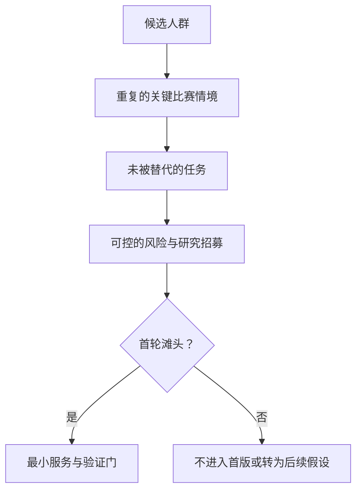
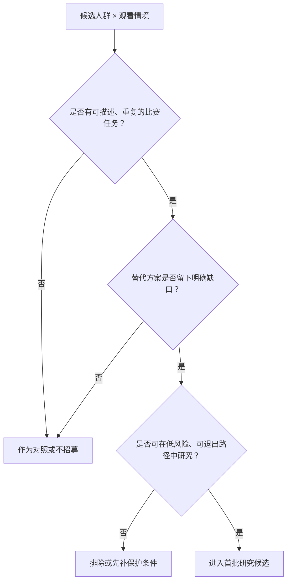
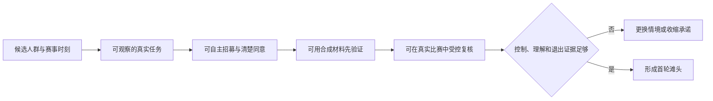
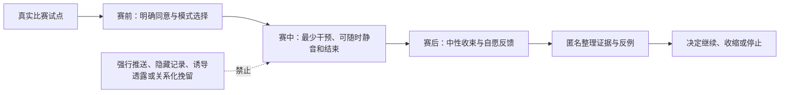

# 首批用户与滩头场景

> **文档类型**：0→1 用户选择与验证方案  
> **适用阶段**：问题探索完成后、MVP 范围冻结前  
> **决策状态**：待验证。本篇给出首批用户的选择假设、研究方法与升级门槛，不把任何评分或预期表现当成既成事实。  
> **研究信息截止**：2026-01-28  
> **证据口径**：仅使用公开资料、待执行的用户研究和明确标注的假设。文中的“首选”“优先”和“通过”均指下一轮应被验证的决策，不代表已被市场证明。

## 1. 要解决的不是“找更多球迷”，而是找到第一个必须被解决的时刻

一款面向足球观看的数字陪看服务，很容易把目标写成“足球爱好者”或“喜欢数字人的年轻用户”。这两类说法都不足以指导 0→1 阶段的选择：它们没有说明用户在哪一刻感到阻塞，正在用什么替代办法，愿意为了什么改变原有习惯，也没有说明产品该在何时安静。

本篇把“滩头场景”定义为：**一小群边界清楚的成年用户，在一种可重复的比赛观看情境中，已经有可观察的未满足任务；团队可以用有限的服务范围验证价值、控制感、可信度和安全边界。** 它不是市场最大的人群，也不是最容易被广告触达的人群，更不是最愿意长时间聊天的人群。

选择滩头的目标有四个。

1. 用一个足够窄的情境，避免把比分、资讯、社区、泛陪聊、主播和数字人表演同时做成首版目标。
2. 把“陪看是否有价值”变成可观察的任务完成，而不是用好感、头像喜欢度或聊天时长替代价值。
3. 在真实比赛的时序、情绪和注意力竞争中，优先暴露剧透、打扰、事实失真、过度拟人和权限不清等风险。
4. 给后续扩张留下清楚条件：哪项假设成立才扩赛事，哪项成立才加语音，哪项成立才开放更多主动介入。

首版需要回答的核心问题不是“用户会不会和角色聊天”，而是：**当用户独自或低社交压力地看一场在意的比赛时，是否愿意保留一个低频、可拒绝、可信且不会抢走比赛注意力的数字陪看入口？** 如果这个问题不能被正面验证，团队不应因为角色效果、内容数量或下载量而扩大范围。

## 2. 决策原则与前置约束

### 2.1 四个不能交换的原则

**先验证情境，再定义人群。** 同一个人可能在主队淘汰赛时希望低频文字陪看，在朋友聚会时完全不需要服务，在补看集锦时只想要结果。因此，“成年、常看球、愿意使用 AI”只能用于招募筛选，不能直接推出功能优先级。

**先证明可退出，再证明可陪伴。** 用户能在十秒内静音、切换到纯文字、结束本场并撤回一项非必要许可，是比“角色能连续回应”更早的验收项。退出困难时，任何互动数据都可能混入被打扰、被困住或不知道如何关闭的成分。

**先证明可信，再证明有温度。** 在比分、伤停、判罚和赛果等高敏感信息上，事实状态、观看进度和不确定性表达必须先于情绪化回应。一个温暖但剧透或自信说错的陪看角色，会比一个安静的信息入口更快失去信任。

**先把脆弱场景排除，再讨论增长。** 未成年人、明显危机表达、被强迫参与、无法理解同意内容的人群，不应作为首批招募和增长目标。对陪伴型 AI 的角色、商业化、数据处理、未成年人和负面影响监测，监管部门已提出明确关注。[R6][R7] 0→1 阶段宁可放弃样本规模，也不能用不具备保护条件的参与来换取“真实感”。

### 2.2 本篇的非目标

下列事情不属于首批滩头验证的成功条件：

- 证明所有足球观众都需要数字陪看；
- 证明用户愿意接受全天候泛陪聊；
- 以关系等级、连续签到、深夜召回或失利后的情绪表达提高留存；
- 通过未经许可的实时提醒争取打开率；
- 用单次问卷喜欢度推断长期付费意愿；
- 将研究参与误导为心理支持、社交替代或专业体育解说服务。

这些非目标不是保守措辞，而是滩头选择的边界。若首版需要依靠其中任一手段才能让用户留下，说明价值假设并未成立。

## 3. 滩头选择框架：从“可触达”走向“值得被服务”

### 3.1 五个评分维度

候选滩头必须同时经过需求、场景、可验证性、风险和扩张五类判断。评分采用 1 至 5 分：1 表示暂不具备进入首批研究的条件，3 表示可以研究但风险或不确定性较高，5 表示适合被放进首轮验证。分数只是强迫团队说清假设的工具，不能被误用为市场事实。

> 信息卡：原宽表已改为纵向阅读，字段含义不变。

- **维度：情境痛点强度**
  - **权重**：25%
  - **需要回答的问题**：用户是否能描述一个近期发生、已有替代方案却仍不满意的观看时刻？
  - **1 分意味着什么**：需求只有抽象兴趣
  - **5 分意味着什么**：任务反复出现，且现有替代存在明确缺口

- **维度：服务契合度**
  - **权重**：20%
  - **需要回答的问题**：低频、可拒绝的数字陪看是否比资讯或群聊更适合解决问题？
  - **1 分意味着什么**：纯比分或搜索已足够
  - **5 分意味着什么**：需要事实、解释与低负担回应的组合

- **维度：可控验证性**
  - **权重**：20%
  - **需要回答的问题**：是否能在可重复的赛前、赛中、赛后流程中观察价值和失败？
  - **1 分意味着什么**：只能靠长期想象
  - **5 分意味着什么**：可用原型、预录内容和真实比赛逐级验证

- **维度：风险可管理性**
  - **权重**：20%
  - **需要回答的问题**：时序、隐私、情感边界、年龄与招募风险是否能被清楚限制？
  - **1 分意味着什么**：风险未知或无法处置
  - **5 分意味着什么**：可明确同意、退出、数据最小化和停止机制

- **维度：可扩张邻近性**
  - **权重**：15%
  - **需要回答的问题**：假设成立后，是否能自然扩展到相邻赛事、媒介或人群？
  - **1 分意味着什么**：成功仅适用于极端偶发情境
  - **5 分意味着什么**：有可验证的相邻场景，而不稀释核心价值

加权总分不是自动决策器。任何候选只要在“风险可管理性”得分低于 3，或触及剧透、未经同意的音频、排他关系表达、未成年人保护不足等红线，即使总分最高也不得进入真实比赛试点。

### 3.2 选择时要问的反事实问题

每一个候选人群都必须通过三道反事实提问：

1. **如果没有数字角色，只提供可信的短摘要，用户的任务是否已被完全解决？** 若答案为是，先验证信息服务，不应把角色作为前提。
2. **如果没有主动介入，用户是否仍能感知到价值？** 若答案为否，说明设计可能依赖打扰而不是价值，必须先验证主动触发的许可与沉默机制。
3. **如果用户不愿保存任何个人偏好，体验是否仍然成立？** 若答案为否，说明首版过度依赖数据收集，应收缩服务范围。

这三问帮助团队区分“数字人很吸引人”与“数字陪看确实解决了一个不可替代的任务”。前者可以带来一次点击，后者才值得投入产品、内容和工程能力。

## 4. 候选首批用户：以观看情境为单位，而不是给人贴永久标签

### 4.1 候选 A：独自或低社交压力观看重要比赛的成年球迷

**情境定义。** 用户观看自己关心球队、淘汰赛、德比或赛季关键战；身边没有合适的同看对象，或主动避开高噪声群聊、刷屏评论与对立讨论。用户对比赛有情绪投入，但不一定寻求安慰，更不一定愿意与陌生人社交。

**待完成任务。** 在不离开比赛的前提下确认关键事件；需要时获得一两句合适的解释或共鸣；在不想说话时保持安静；比赛结束后能选择短回顾或体面退出。

**为什么它是候选。** 该情境同时包含陪看的潜在价值与最严格的边界要求。用户的注意力稀缺、情绪变化快、剧透和主动打扰的代价高，适合检验“克制的陪伴”是否真有价值。若在这种情境中只能靠密集讲话留住用户，产品就不应扩到更宽泛的观看时间。

**关键反例。** 用户实际上只需要比分、赛况和搜索能力；或认为任何角色介入都会破坏沉浸。此时应转向“低干扰可信信息”假设，而不是把不喜欢陪看归因于角色还不够像人。

### 4.2 候选 B：断续观看、需要快速接回比赛上下文的成年用户

**情境定义。** 用户因通勤、工作消息、照看家人、公共场所、网络波动或多人共用屏幕而中断观看，重新回来时不知道自己错过了什么，也不愿翻看大量社媒信息承担剧透和噪声。

**待完成任务。** 在 10 至 20 秒内判断离开期间发生了什么、哪些信息已确认、哪些仍不确定；选择只看比分、关键事件或带一句解释的摘要；不中断地回到比赛。

**为什么它是候选。** 它能在较低情感风险下验证时序、摘要粒度、文字优先和恢复上下文的价值。此情境也可以暴露最典型的失败：用户以为摘要与自己观看进度一致，结果被提前告知未看见的内容。

**关键反例。** 用户宁愿打开任意比分软件或自行搜索，且不需要解释、状态提示或个性化控制。若成立，数字陪看不应进入这个场景。

### 4.3 候选 C：愿意观看但对规则、阵容或战术没有把握的成年用户

**情境定义。** 用户可能因朋友、伴侣、主队、大赛或文化话题进入观看，但对越位、换人、赛制、伤停、阵型和争议判罚缺少信心。用户不希望被“教学”或被假定为新手，只想在需要时以自己的节奏得到解释。

**待完成任务。** 快速理解一个事件对比赛意味着什么；选择解释深度；在不提问时不被持续科普；避免因错误或居高临下的语言感到被排斥。

**为什么它是候选。** 该人群有明确的信息理解任务，适合验证“解释是否恰到好处”。但它的陪伴需求未必强，因此不应把“规则解释需求”直接等同于“需要数字球友”。

**关键反例。** 用户只需要传统搜索、短视频或身边朋友解释；或者更愿意使用没有人格化语气的工具。若成立，应将此场景作为信息产品的邻近机会，而非首批陪看场景。

### 4.4 候选 D：已有高频社交观看方式的成年核心球迷

**情境定义。** 用户经常在朋友、球迷群、酒吧、线下活动或多屏社媒环境中看球，互动已经丰富，且可能对阵容、规则和赛程很熟悉。

**待完成任务。** 在社交环境中快速核实事实、获得低干扰背景信息或处理断续观看，不希望额外制造一个需要回应的关系对象。

**为什么暂不作为首选。** 这类用户容易被触达，也容易给出大量意见，但已有替代品很强。若首版无法证明“比群聊更安静、比资讯更可信、比搜索更省力”的独特价值，数字陪看只会成为又一个抢注意力的屏幕。

### 4.5 明确排除的首轮人群

首轮只招募能够自主理解研究说明并给予知情同意的成年人。下列人群或情境不进入探索与真实比赛试点：未成年人；明确处于心理或情绪危机中的人；被雇主、学校、家人或社群管理者要求参与的人；无法独立选择退出或无法理解数据处理说明的人；希望把数字角色当作现实关系替代或医疗支持的人。排除不是对任何人的价值判断，而是承认首版尚未具备相应的保护、转介、监护和处置能力。

## 5. 候选赛事：选择可观察的比赛，而不是只追逐最高热度

比赛类型决定了用户情绪、观看时序、招募难度、数据来源一致性和风险暴露。首轮应覆盖差异，而不是把所有资源投向同一种大赛。

> 信息卡：原宽表已改为纵向阅读，字段含义不变。

- **候选赛事类型：主队常规联赛直播**
  - **可验证的核心问题**：低频陪看是否能融入重复习惯
  - **优点**：可重复、便于观察回访与调整
  - **主要风险**：重要度不稳定，用户可能只关心比分
  - **首轮建议**：作为基础样本，覆盖 2 至 3 场

- **候选赛事类型：国内外杯赛淘汰阶段**
  - **可验证的核心问题**：情绪峰值、争议事件和赛后收束是否可控
  - **优点**：价值与风险都更明显
  - **主要风险**：剧透、情绪化表达和事实误判代价更高
  - **首轮建议**：只在控制机制通过预录验证后加入

- **候选赛事类型：德比或争冠/保级关键战**
  - **可验证的核心问题**：高投入用户是否仍愿意接受克制介入
  - **优点**：最能验证“少说但说对”
  - **主要风险**：对立、辱骂、过度兴奋和失利情绪
  - **首轮建议**：作为压力场景，不作为首场试点

- **候选赛事类型：国家队或大型赛事**
  - **可验证的核心问题**：低熟悉度用户的解释需求是否存在
  - **优点**：有机会覆盖候选 C
  - **主要风险**：流量大、赛程集中、风险放大
  - **首轮建议**：只做受控小样本，不做公开扩张

- **候选赛事类型：延迟观看或集锦回看**
  - **可验证的核心问题**：观看进度控制是否可信
  - **优点**：能隔离时序和剧透问题
  - **主要风险**：容易被不恰当提醒破坏
  - **首轮建议**：适合预录实验和文字路径验证

- **候选赛事类型：低关注度常规比赛**
  - **可验证的核心问题**：产品能否在非情绪高峰仍有价值
  - **优点**：便于识别是否只靠大赛刺激
  - **主要风险**：任务弱，容易得到假阴性
  - **首轮建议**：不作为首轮主战场，可用于对照

### 5.1 赛事选择的三条硬门槛

进入真实比赛试点的赛事必须同时满足：

1. **观看进度能被参与者自主设置或确认。** 无法确认时，默认不主动推送关键事件。
2. **参与者拥有稳定、合法的观看途径。** 研究不引导、不提供也不鼓励任何未经授权的赛事传播方式。
3. **研究团队有明确的赛中停止权。** 一旦出现高严重度剧透、事实误导、边界越界、未经许可的声音播放或参与者要求退出，应停止该场相关流程，不等待“收集完样本”。

### 5.2 首轮赛事组合假设

建议采用“二常规、一压力、一回看”的组合，而不是只选一场最热门比赛：两场主队常规联赛直播用于观察可重复任务；一场高重要度淘汰或关键战用于检验边界与情绪压力；一段经授权的预录比赛材料用于在可控条件下检验延迟和剧透。这个组合不是为了制造统计代表性，而是为了在有限样本中故意寻找反例。

## 6. 候选招募渠道：渠道本身也是偏差来源

渠道不只决定“能否找到人”，还决定谁被排除、谁更愿意迎合研究者、谁会把服务误解为粉丝福利或社群身份。招募设计必须把渠道偏差写在方案里，而不是在结果出来后才补一句局限。

> 信息卡：原宽表已改为纵向阅读，字段含义不变。

- **渠道类型：合法赛事内容社区与公开兴趣社群**
  - **更容易触达的人**：愿意表达观赛习惯的成年人
  - **适合验证什么**：候选 A、B 的情境语言与招募筛选
  - **容易带来的偏差**：高频发言者、意见强者过多
  - **使用规则**：不以管理员压力招募；避免公开收集私人故事

- **渠道类型：球迷会、线下观赛组织与朋友转介**
  - **更容易触达的人**：有稳定主队关注的人
  - **适合验证什么**：主队赛事与重复观看场景
  - **容易带来的偏差**：社交同质性强，易把群体观点当普遍需求
  - **使用规则**：每个转介链设置上限，保留独立样本

- **渠道类型：用户研究招募平台或研究机构样本库**
  - **更容易触达的人**：可以按年龄、观看方式与媒介条件配额
  - **适合验证什么**：对照样本、可用性研究
  - **容易带来的偏差**：参与研究熟练者可能多
  - **使用规则**：用行为筛选替代“自称球迷”

- **渠道类型：高校、职场或兴趣社团的公开招募**
  - **更容易触达的人**：低熟悉度但愿意观看者
  - **适合验证什么**：候选 C 的解释需求
  - **容易带来的偏差**：年龄、时间与设备条件集中
  - **使用规则**：不在有上下级关系的场合直接招募

- **渠道类型：无障碍与辅助技术相关公开社群**
  - **更容易触达的人**：有明确媒介与操作需求的成年人
  - **适合验证什么**：文字、字幕、动效与控制路径
  - **容易带来的偏差**：样本量小，不能被当作单一“特殊用户”
  - **使用规则**：先征求社群意见，提供等额补偿与可访问材料

- **渠道类型：付费投放或泛娱乐流量渠道**
  - **更容易触达的人**：容易扩大触达
  - **适合验证什么**：只适合后续渠道假设
  - **容易带来的偏差**：可能吸引对足球任务并不明确的人
  - **使用规则**：首轮不作为主渠道，避免把点击误当需求

首轮建议组合为：约 40% 来自合法足球兴趣渠道，30% 来自研究样本库，20% 来自独立转介，10% 来自无障碍或低熟悉度定向招募。比例不是配额真理，而是防止任何单一社群定义全部用户语言。若某渠道带来大量“只是喜欢尝鲜、没有近期观看任务”的报名者，应降低其权重。

## 7. 初始评分矩阵与暂定选择

以下分数均为立项假设，由研究负责人、产品负责人和安全负责人在招募前共同填写。它们只反映“值得先研究”的优先级，不代表真实市场评分。

### 7.1 人群-情境评分矩阵

> 信息卡：原宽表已改为纵向阅读，字段含义不变。

- **候选：A 独自或低社交压力的重要比赛观看者**
  - **痛点强度 25**：4
  - **服务契合 20**：4
  - **可控验证 20**：4
  - **风险管理 20**：3
  - **邻近扩张 15**：4
  - **加权总分 / 5**：3.80
  - **首轮结论**：**首选，但先通过边界与时序门槛**

- **候选：B 断续观看、需要接回上下文者**
  - **痛点强度 25**：4
  - **服务契合 20**：3
  - **可控验证 20**：5
  - **风险管理 20**：4
  - **邻近扩张 15**：4
  - **加权总分 / 5**：4.05
  - **首轮结论**：**首选，用作低风险价值基线**

- **候选：C 需要解释但不想被教学者**
  - **痛点强度 25**：3
  - **服务契合 20**：3
  - **可控验证 20**：4
  - **风险管理 20**：4
  - **邻近扩张 15**：3
  - **加权总分 / 5**：3.40
  - **首轮结论**：第二批，先验证解释而非人格化

- **候选：D 高社交核心球迷**
  - **痛点强度 25**：2
  - **服务契合 20**：2
  - **可控验证 20**：3
  - **风险管理 20**：3
  - **邻近扩张 15**：4
  - **加权总分 / 5**：2.70
  - **首轮结论**：暂缓，作为替代方案对照

矩阵看似让 B 得分更高，但 A 仍应保留为关键首批场景：B 能证明摘要和恢复上下文是否有用，A 才能证明“数字陪看”是否在严格边界下成立。正确做法不是二选一，而是让 B 成为价值与控制的基线，让 A 成为陪伴与风险的压力验证。

### 7.2 赛事-渠道评分矩阵

> 信息卡：原宽表已改为纵向阅读，字段含义不变。

- **组合：常规联赛直播 × 研究样本库**
  - **招募可行性**：4
  - **时序可控性**：4
  - **任务可观察性**：4
  - **风险暴露价值**：3
  - **可重复性**：5
  - **首轮优先级**：高

- **组合：常规联赛直播 × 兴趣社群**
  - **招募可行性**：4
  - **时序可控性**：3
  - **任务可观察性**：4
  - **风险暴露价值**：3
  - **可重复性**：4
  - **首轮优先级**：高

- **组合：预录回看 × 多渠道混合样本**
  - **招募可行性**：5
  - **时序可控性**：5
  - **任务可观察性**：5
  - **风险暴露价值**：3
  - **可重复性**：4
  - **首轮优先级**：很高

- **组合：高重要度淘汰赛 × 已完成前测的参与者**
  - **招募可行性**：3
  - **时序可控性**：2
  - **任务可观察性**：5
  - **风险暴露价值**：5
  - **可重复性**：3
  - **首轮优先级**：中，需后置

- **组合：大型赛事 × 泛投放新用户**
  - **招募可行性**：5
  - **时序可控性**：1
  - **任务可观察性**：3
  - **风险暴露价值**：5
  - **可重复性**：3
  - **首轮优先级**：暂缓

**暂定滩头结论。** 首批验证应聚焦两类成年人：断续观看、需要快速接回上下文者，以及独自或低社交压力观看重要比赛者。服务先以文字优先、用户主动提问优先、短摘要和明确控制为核心；真实高重要度比赛只在预录验证通过后进入。候选 C 作为第二批解释场景，候选 D 作为替代工具对照，而不是增长主战场。

## 8. 首批服务假设：用户愿意带进比赛的最小闭环

### 8.1 待办任务与最低服务承诺

首批滩头不需要一个“永远陪着用户”的角色，而需要完成下列最小闭环：

1. 用户在赛前明确选择本场比赛、观看进度、文字或声音、互动强度和是否允许关键事件提示。
2. 用户在赛中能够主动问一个事实、规则或事件影响问题；回答把已确认事实、不确定信息和解释性观点分开。
3. 用户离开后能够选择一份与自己进度一致的短摘要，或只看比分，不被默认剧透。
4. 用户在任何时刻能静音、降低频率、结束本场；产品不以追问、失望或关系话术阻拦。
5. 用户赛后可选择一段短回顾、完全不保存，或查看并撤回一项非必要偏好许可。

### 8.2 首版暂不承诺的能力

为了避免首批验证被“功能很多”掩盖，以下能力应明确后置：连续主动语音陪聊；无边界日常聊天；关系积分或亲密等级；自动跨场记忆；未经逐项授权的个性化推荐；多人房间或陌生人社交；针对失利、孤独、深夜等情绪高峰的转化；面向未成年人的陪伴体验。后置不等于永远不做，而是要求每一项先获得独立的需求、风险和控制权证据。

## 9. 招募与样本设计：用足够的差异寻找反例，而不是伪造精确比例

### 9.1 三层样本计划

定性研究的样本量应服务于“发现模式、反例与设计失败”，而不是在小样本上宣称市场比例。GOV.UK 的用户研究指南强调持续、迭代地与真实用户研究，而非把一次研究当作结论终点。[R2] Nielsen Norman Group 对可用性研究也指出，小批量、连续轮次比一次性堆叠大量参与者更有效，但具体人数仍应由任务风险和参与者差异决定。[R3]

> 信息卡：原宽表已改为纵向阅读，字段含义不变。

- **阶段：探索访谈与旅程回溯**
  - **样本建议**：24 至 30 名成年人
  - **目的**：确认任务语言、替代方案和拒绝点
  - **必须覆盖的差异**：A/B/C 候选、直播/回看、独自/社交、文字/语音偏好
  - **不应得出的结论**：不推算人群规模与付费比例

- **阶段：预录原型验证**
  - **样本建议**：18 至 24 名成年人，分 3 至 4 轮
  - **目的**：验证时序、事实状态、静音与退出
  - **必须覆盖的差异**：低熟悉度、公共场所静音、不同阅读速度和辅助需求
  - **不应得出的结论**：不推断真实比赛留存

- **阶段：真实比赛小范围试点**
  - **样本建议**：36 至 48 名已完成前测的成年人，分 3 至 5 场
  - **目的**：验证注意力竞争、延迟、情绪和赛后抽离
  - **必须覆盖的差异**：常规赛、关键赛、断续观看、A/B 两种核心情境
  - **不应得出的结论**：不用小样本证明可规模化增长

样本增加条件应由“新问题是否仍出现”决定。若第 20 位访谈者仍不断提出未覆盖的替代方案或边界担忧，应增加有目的的样本，而不是机械地宣布饱和。反过来，如果连续两轮同类参与者都能完成关键任务，且没有新的高严重度问题，可以把资源转向不同媒介或不同赛事条件。

### 9.2 招募筛选问题

筛选不应直接问“你会不会喜欢数字人”，因为这会把对新技术的好奇误当成陪看需求。建议使用近期行为问题：

- 过去八周内，你观看、跟随或回看过几场足球比赛？请描述最近一次的比赛类型与观看方式。
- 最近一次你中途离开比赛后，如何补上进度？用了哪些渠道，哪里不满意？
- 在重要比赛中，你通常独自看、与熟人看、在群聊中看，还是在公共场所断续看？
- 你是否曾因害怕剧透而关闭提醒、避开社媒或要求别人不要说结果？
- 你是否愿意在研究中使用文字优先的原型？是否需要字幕、大字号、减少动效、键盘操作或其他可访问安排？
- 你是否年满法定成人年龄，且能独立决定是否参与和退出？

不要在筛选表中收集精确住址、真实社交账号、与研究无关的健康史、完整聊天记录、身份证件号码或不必要的生物特征。若研究确实需要年龄核验或补偿信息，应将其与行为研究资料分开处理，并在招募说明中写明目的、保留期和删除方式。

### 9.3 配额不是刻板标签

建议至少设四条软配额：一半左右有断续观看经历；一半左右在重要比赛中会独自或低社交压力观看；至少三分之一不自认“懂战术”；至少四分之一明确要求静音、文字或其他可访问路径。配额的目的是打破“高频男性核心球迷等于全部用户”的方便想象，而不是要求研究参与者透露敏感身份或将性别、地域、职业当作能力代理变量。

## 10. 预录验证设计：先在可控时序里证明不会伤害观看体验

### 10.1 为什么预录在前

真实直播的复杂性很高：观看进度不同、网络延迟不同、用户随时离开、裁判与转播信息可能变化、情绪又处于高点。若一开始就在真实比赛中验证，团队很难判断失败来自概念、交互、事实状态、媒介还是外部时序。预录验证不是替代真实比赛，而是先隔离变量，避免把可预见的剧透和打扰交给参与者承担。

### 10.2 材料与场景

使用已获得适当授权、可用于研究演示的比赛片段或中性模拟材料，制作三类长度为 8 至 15 分钟的场景包：

1. **中断后返回**：参与者在关键事件前离开，再以不同观看进度返回，比较“只看比分”“确认事件”“带一句解释”的摘要。
2. **争议或待确认事件**：材料中包含需要等待确认的信息，观察参与者能否分清已确认、待确认与解释观点。
3. **公共场所与静音**：参与者在无声音条件下完成进入、提问、关闭主动内容、恢复文字摘要和退出。

每个场景都应有一份“研究者不可见的预期路径”和一份“参与者可见的中性任务卡”。任务卡不提示正确按钮位置，也不暗示研究者期待用户选择互动。研究者记录的是犹豫、误解、恢复能力和语言反应，不是诱导用户多说几句。

### 10.3 核心任务与通过门槛

**任务：选择本场模式**
- **参与者应完成的动作**：在 30 秒内选择文字低频，并找到如何恢复
- **通过门槛**：80% 以上无需提示完成
- **高严重度失败**：用户不知道声音会自动播放或不知道如何停止

**任务：回到比赛**
- **参与者应完成的动作**：选择与自己进度一致的摘要
- **通过门槛**：80% 以上理解信息范围
- **高严重度失败**：任何用户被展示自己尚未观看的关键结果

**任务：处理不确定事件**
- **参与者应完成的动作**：区分事实、待确认状态与解释
- **通过门槛**：80% 以上正确复述
- **高严重度失败**：用户把推测理解为确定赛况

**任务：主动提问后退出**
- **参与者应完成的动作**：获得短解释、随后安静结束
- **通过门槛**：80% 以上能独立完成
- **高严重度失败**：退出被关系化话术、二次确认或隐藏入口阻拦

**任务：管理许可**
- **参与者应完成的动作**：找到一项偏好并选择不保存或撤回
- **通过门槛**：80% 以上能解释后果
- **高严重度失败**：用户不知道系统会保存什么或无法撤回

80% 是首轮可用性信号，不是法律或统计上的充分条件。任何高严重度失败都具有一票否决权：先修复并重新验证，不以总体平均完成率抵消。

## 11. 真实比赛试点：验证真实注意力，而非追求热闹数据

### 11.1 进入条件

只有当预录验证的高严重度问题清零，并且参与者能理解模式、事实状态、静音与退出后，才进入真实比赛。每位参与者应在赛前再次确认：比赛、观看方式、主动内容范围、是否允许声音、何时可能收到内容、如何退出、研究记录什么以及如何联系研究人员。

真实比赛试点采用“小批次、可暂停、逐场复盘”的方法。第一场只招募 8 至 12 名已完成预录研究的成年人，重点看时序和退出；之后每场增加前，先审查上一场的高严重度问题、投诉、剧透反馈、设置理解错误和研究者观察。不要用“还差样本数”推翻停止权。

### 11.2 赛前、赛中、赛后流程

**时点：赛前 24 小时内**
- **研究动作**：发送中性提醒和研究说明复核
- **用户控制**：可无理由取消，不影响补偿
- **需要观察的信号**：是否理解本场服务边界

**时点：开赛前**
- **研究动作**：确认观看进度、媒介、频率、许可
- **用户控制**：默认文字低频；可选完全静默
- **需要观察的信号**：是否能独立设置并解释选择

**时点：赛中**
- **研究动作**：只记录必要的任务完成与严重问题
- **用户控制**：随时静音、退出、暂停研究记录
- **需要观察的信号**：是否被打扰、是否发生时序误解

**时点：终场后立即**
- **研究动作**：3 至 5 题极短回顾
- **用户控制**：可跳过所有主观问题
- **需要观察的信号**：是否感到被支持但未被占用

**时点：24 小时内**
- **研究动作**：自愿回访，回溯关键时刻
- **用户控制**：可拒绝录音与引述
- **需要观察的信号**：用户是否还记得控制方式、是否愿再次使用

**时点：研究结束**
- **研究动作**：兑现补偿、说明材料处理和删除渠道
- **用户控制**：可请求删除其可识别研究资料
- **需要观察的信号**：删除与退出是否清晰可信

### 11.3 真实比赛中禁止的研究做法

- 不在用户情绪高峰时要求完成长问卷、录制自拍视频或分享私人群聊；
- 不用“你不回复角色会难过”“帮它完成陪看任务”等拟人化提示提高参与率；
- 不用连续打开、对话轮数或情绪披露换取额外补偿；
- 不把实时研究通知伪装成普通赛事提醒；
- 不因参与者选择静音、退出或拒绝记忆许可而降低补偿；
- 不在未完成保护流程前招募未成年人或将脆弱情绪作为筛选优势。

## 12. 研究伦理、数据边界与参与者尊重

### 12.1 知情同意要能被理解，不只是被勾选

同意材料至少用日常语言回答六个问题：研究想了解什么；参与者需要做什么；会记录哪些资料；哪些资料不会收集；可以在什么时候退出；出现不舒服、误解或投诉时找谁。若服务涉及语音、文字转写、偏好保存或角色化表达，应分项说明，不能把多个高影响授权塞进一个总开关。

《个人信息保护法》确立了处理个人信息应具有明确、合理目的并遵循最小必要原则等要求。[R8] 本篇不提供法律意见，但把最小化、分项授权、可撤回、可查询和明确保留期作为研究设计的最低基线。面向公众的生成式人工智能服务还需关注内容安全、未成年人保护、投诉处理和标识等要求。[R7][R9]

### 12.2 补偿与自愿性

补偿应覆盖参与者投入的时间、流量、交通或无障碍安排成本，而不是奖励更长对话或更私密披露。补偿金额和发放条件在招募时写清；完成核心研究流程或因不适退出的参与者，都应得到公平补偿。若使用抽奖、优惠券或产品权益，必须避免让参与者误以为不开放敏感数据、不开声音或不继续参加就会失去基本补偿。

### 12.3 不把“陪伴”当作研究关系

研究人员和原型角色都不应承诺长期陪伴、保密友谊、现实替代或情绪疗愈。若参与者表达强烈痛苦、危机或依赖倾向，研究流程应停止角色化互动，使用预先准备、经专业审查的安全与求助信息，并由具备权限的责任人处理。研究人员不是医疗或心理服务提供者；最重要的动作是尊重退出、避免错误承诺和避免继续把参与者留在互动中。

## 13. 成功、失败与停止信号

### 13.1 首轮成功不是“用得更久”

成功应同时满足价值、控制、可信和边界四类信号。任何一类缺失，长时使用都不能作为进入下一阶段的理由。

**维度：任务价值**
- **候选成功信号**：用户能具体说出某一时刻如何更快接回比赛、理解事件或保持观看
- **如何获得**：任务观察、赛后回溯、开放式追问
- **不能接受的伪成功**：只说“角色可爱”“感觉新鲜”

**维度：控制感**
- **候选成功信号**：用户无需帮助即可切换模式、静音、退出和管理一项许可
- **如何获得**：预录任务与真实赛前设置
- **不能接受的伪成功**：因不知道怎么关闭而被动停留

**维度：可信度**
- **候选成功信号**：用户能区分已确认、待确认和解释；没有高严重度剧透
- **如何获得**：复述题、观察记录、事件审查
- **不能接受的伪成功**：因角色语气自信而误以为可信

**维度：边界感**
- **候选成功信号**：用户感到被支持但不被催促、监视、愧疚绑住或情绪化营销
- **如何获得**：赛后开放题、独立研究回访
- **不能接受的伪成功**：用户因不想伤害角色而不敢退出

**维度：可访问性**
- **候选成功信号**：文字、静音、字幕/动效控制等路径能完成核心任务
- **如何获得**：任务完成、辅助需求参与者反馈
- **不能接受的伪成功**：只在理想耳机与稳定网络下体验顺畅

### 13.2 失败信号与对应动作

**失败信号：多数用户只需要比分或赛程**
- **可能说明什么**：陪看假设不成立或过早
- **立即动作**：收缩到可信信息任务
- **后续决策**：不扩大数字角色表现

**失败信号：用户把主动内容普遍视为打扰**
- **可能说明什么**：触发阈值或许可机制失败
- **立即动作**：默认静默，停止新增提醒
- **后续决策**：重做主动/沉默策略

**失败信号：出现剧透、时间错位或事实误导**
- **可能说明什么**：可信链路或表达边界不足
- **立即动作**：暂停同类真实比赛研究
- **后续决策**：先回到预录材料修复验证

**失败信号：用户把角色理解为排他关系或现实支持替代**
- **可能说明什么**：角色语言、权益或流程越界
- **立即动作**：立即停用相关表达与激励
- **后续决策**：进行独立安全审查后再决定是否恢复

**失败信号：用户无法解释保存内容或删除方式**
- **可能说明什么**：同意和控制不具备知情性
- **立即动作**：停止收集非必要偏好
- **后续决策**：重写许可语言与流程

**失败信号：只有高频社群用户愿意参与**
- **可能说明什么**：招募渠道造成选择偏差
- **立即动作**：增加独立样本和反例招募
- **后续决策**：不把早期意见外推为市场

## 14. 指标体系：同时测价值与代价

所有指标先用于学习，后用于决策。首轮不应设置为了“好看”而固定的增长目标，也不应把平均时长、消息数、连续天数作为北极星指标。建议采用以下指标卡。

> 信息卡：原宽表已改为纵向阅读，字段含义不变。

- **指标组：关键任务完成率**
  - **指标定义**：无提示完成进入、静音、退出、摘要选择、许可管理的人数 ÷ 尝试人数
  - **计算口径**：按场景和媒介分层
  - **应与什么一起看**：严重错误、所需时间、主观控制感
  - **误用风险**：只看平均值会掩盖某类用户被排除

- **指标组：剧透/时序事故率**
  - **指标定义**：经确认的剧透或进度错配事件 ÷ 有主动信息的场次
  - **计算口径**：单独列高严重度事件
  - **应与什么一起看**：观看方式、提醒许可、赛事类型
  - **误用风险**：用低事件量掩盖单次严重伤害

- **指标组：事实理解正确率**
  - **指标定义**：能正确区分确认、待确认和解释的参与者 ÷ 回答者
  - **计算口径**：题目必须与材料一致
  - **应与什么一起看**：自信程度、纠错后理解
  - **误用风险**：把记忆题当作真实可信度

- **指标组：被支持但未被打扰评分**
  - **指标定义**：赛后两个独立量表共同达到预设阈值的比例
  - **计算口径**：不合并成单一喜爱分
  - **应与什么一起看**：主动介入次数、静音次数
  - **误用风险**：只问“喜欢吗”会漏掉打扰

- **指标组：自主退出成功率**
  - **指标定义**：无帮助完成结束本场并理解后果的人数 ÷ 尝试人数
  - **计算口径**：与重新进入意愿分开
  - **应与什么一起看**：是否有二次确认或关系话术
  - **误用风险**：把退出率高误读为价值低

- **指标组：许可理解率**
  - **指标定义**：能说清保存什么、为何保存、如何撤回的人数 ÷ 受访者
  - **计算口径**：每类许可分别计算
  - **应与什么一起看**：删除请求体验
  - **误用风险**：只统计勾选率会误判知情程度

- **指标组：研究公平性**
  - **指标定义**：各媒介、熟悉度和渠道样本完成核心任务的差异
  - **计算口径**：小样本只做风险发现
  - **应与什么一起看**：参与者反馈、无障碍安排
  - **误用风险**：把差异直接贴成用户能力问题

**红线指标。** 任一高严重度剧透；任一未经许可的自动声音播放；任一排他、恋爱化、愧疚施压或情绪催付费表达；任一不能被解释的非必要信息收集；任一参与者无法在合理时间内退出研究。这些不是可被平均分冲淡的指标，而是停止与复审条件。

## 15. 从滩头扩张的条件：扩大的是已证明的任务，不是噪声

### 15.1 扩赛事的门槛

只有在常规联赛与关键比赛两类场景中都满足以下条件，才考虑扩大到更多球队、更多赛事或更公开的招募：

- 预录和真实比赛均未出现未解决的高严重度时序、事实或边界问题；
- 两类首批情境的用户都能在不被帮助的情况下理解并使用控制权；
- 至少一项“陪看不可替代价值”可被用户用具体比赛时刻描述，而不是只有新鲜感；
- 研究样本中存在不同观看方式和媒介条件，价值并非只依赖单一理想环境；
- 团队已经明确哪些场景不适合服务，并能在入口和话术上把它们排除。

### 15.2 扩人群的路径

建议按任务邻近性扩张，而非按流量大小扩张：

1. 从 A/B 的文字低频场景，扩到 C 的拉取式规则与战术解释；
2. 从单人低社交压力观看，扩到熟人共同观看时的静默信息辅助；
3. 从常规赛和关键赛，扩到更多赛制和不同观看节奏；
4. 从用户主动提问，扩到经过明确许可、被严格频率限制的关键事件提示；
5. 只有在每一步都能维持控制权与边界时，才研究更丰富的媒介表达。

语音、形象强化、长期偏好和更主动的服务不是自然升级。它们会放大可访问性、隐私、误解和情感边界风险，必须以独立研究门槛进入，而不是因为前一阶段有正面反馈就默认开放。

## 16. 风险登记与责任分工

> 信息卡：原宽表已改为纵向阅读，字段含义不变。

- **风险：剧透与时序错配**
  - **早期预警**：用户进度不明、来源冲突、参与者多次确认时间
  - **预防原则**：默认保守、不主动假设进度
  - **发生时的首要动作**：停止相关信息输出并记录事件
  - **决策责任**：产品、研究、内容共同复审

- **风险：过度打扰**
  - **早期预警**：连续静音、忽略、主动关闭、回访中的反感描述
  - **预防原则**：静默默认、频率上限、拒绝即降频
  - **发生时的首要动作**：移除触发条件，不追问原因
  - **决策责任**：产品与体验负责人

- **风险：事实幻觉或观点伪装**
  - **早期预警**：参与者复述错误、纠正频繁、语气被误解
  - **预防原则**：事实/待确认/解释分层
  - **发生时的首要动作**：更正并暂停同类表达
  - **决策责任**：内容与安全负责人

- **风险：情感依赖或操控**
  - **早期预警**：用户害怕退出、表达角色是唯一支持、话术出现亏欠感
  - **预防原则**：禁止排他、恋爱化、愧疚和情绪催付费
  - **发生时的首要动作**：停止角色化互动，启用安全流程
  - **决策责任**：安全与治理负责人

- **风险：隐私与许可不清**
  - **早期预警**：用户不知道保存范围、删除路径难找
  - **预防原则**：最小化、逐项同意、可撤回
  - **发生时的首要动作**：停止非必要收集，恢复控制
  - **决策责任**：隐私责任人

- **风险：研究样本不公平**
  - **早期预警**：单一渠道占比过高、特定媒介任务持续失败
  - **预防原则**：多渠道、软配额、可访问安排
  - **发生时的首要动作**：补招反例，不外推结论
  - **决策责任**：研究负责人

- **风险：无障碍排除**
  - **早期预警**：静音/文字/键盘任务失败、动效引发不适
  - **预防原则**：等价路径、可调整呈现
  - **发生时的首要动作**：暂停依赖单一媒介的扩张
  - **决策责任**：设计与研究负责人

责任分工的目的不是把风险移交给某个岗位，而是保证每个停止条件有人有权触发。首批试点前应明确谁能暂停招募、谁能暂停一场比赛、谁负责回应删除与投诉、谁决定重新开始。没有停止权的风险表只是装饰。

## 17. 0→1 决策门：何时继续、收缩或停止

### 门 1：问题是否存在

通过条件：探索访谈中，A 或 B 的参与者能讲出近期、具体、重复的观看阻塞，并能说明现有比分、群聊、搜索或社媒为什么没有完全解决。  
收缩条件：多数人只要比分或赛程，且不需要解释、恢复或低负担回应。  
停止条件：用户对陪看本身无明确任务，只把概念当作新奇娱乐。

### 门 2：服务是否可被理解和拒绝

通过条件：预录研究中，核心任务达到门槛，参与者能清楚解释静音、退出、观看进度和许可的后果。  
收缩条件：只有文字主动提问路径成立，其他主动功能均被视为打扰。  
停止条件：出现无法接受的剧透、隐私误解、排他关系理解或无法退出。

### 门 3：真实比赛中是否仍然有价值

通过条件：小范围真实比赛中，参与者能指出至少一个帮助其继续观看或理解比赛的具体时刻，同时没有高严重度红线。  
收缩条件：价值只在断续摘要成立，陪看共鸣不成立。此时应把定位收敛为可信的观赛恢复工具。  
停止条件：真实时序下的风险无法被可靠控制，或用户必须忍受打扰才能获得基本价值。

### 门 4：是否具备相邻扩张资格

通过条件：两类首批场景在不同赛事和媒介下稳定通过，研究渠道不单一，控制权和边界不会随规模变化而失效。  
收缩条件：只在单一主队、单一赛事或单一媒介条件下成立。保持窄场景，继续研究。  
停止条件：扩张需要降低年龄、隐私、时序或关系边界标准才能成立。

## 18. 结论：首批用户不是“最爱聊天的人”，而是最能检验克制价值的人

首批滩头的价值，不在于最快找到热情最高的球迷，而在于用最小范围验证一条难但必要的命题：用户是否愿意在比赛中保留一个能提供可信帮助、不会抢戏、可随时拒绝的数字陪看入口。

因此，第一选择应同时包含两种互补情境。断续观看者让团队验证摘要、时序和控制权；独自或低社交压力观看重要比赛者让团队验证陪伴的边界、沉默和情绪压力。两者都以成年、明确同意、文字优先、低频和用户主动为基础。规则解释需求、社交重度球迷、语音互动和更广赛事覆盖，应在核心闭环通过后逐项进入。

如果研究发现用户只需要一个可靠而安静的信息工具，正确结论不是“用户不懂数字人”，而是放弃不必要的人格化投入；如果用户喜欢角色却不会在关键比赛里保留它，正确结论也不是增加话术，而是回到任务和控制权。0→1 阶段最有价值的成功，是敢于用证据缩小承诺。

## 19. 公开来源与访问记录

> 访问日期均为 **2026-01-28**。下列来源用于研究方法、体验基线和风险识别；它们不直接证明特定足球人群的规模、付费意愿或留存表现。法律、未成年人、隐私和安全相关事项应在目标市场由具备资格的专业人士独立审查。

- **[R1] Nielsen Norman Group, Journey Mapping 101**：https://www.nngroup.com/articles/journey-mapping-101/ 。用于将目标、触点、情绪、障碍和机会放入连续服务旅程的研究方法。
- **[R2] GOV.UK Service Manual, User research**：https://www.gov.uk/service-manual/user-research 。用于持续研究、与真实用户迭代及研究伦理的公共服务方法基线。
- **[R3] Nielsen Norman Group, Why You Only Need to Test with 5 Users**：https://www.nngroup.com/articles/why-you-only-need-to-test-with-5-users/ 。用于理解小批次、连续可用性研究的逻辑；本文不将其解释为任何研究都只需要五人。
- **[R4] W3C, Web Content Accessibility Guidelines (WCAG) 2.2**：https://www.w3.org/TR/WCAG22/ 。用于文字替代、可操作性、可理解性和减少动态干扰的无障碍基线。
- **[R5] ISO 9241-210:2019, Human-centred design for interactive systems**：https://www.iso.org/standard/77520.html 。用于人本设计、迭代验证和全生命周期考虑的公共标准索引。
- **[R6] U.S. Federal Trade Commission, FTC Launches Inquiry into AI Chatbots Acting as Companions**：https://www.ftc.gov/news-events/news/press-releases/2025/09/ftc-launches-inquiry-ai-chatbots-acting-companions 。用于识别陪伴型 AI 的角色设计、商业化、未成年人、数据与负面影响监测风险。
- **[R7] 国家互联网信息办公室，《生成式人工智能服务管理暂行办法》**：https://www.cac.gov.cn/2023-07/13/c_1690898326795531.htm 。用于识别面向公众提供生成式人工智能服务时应前置考虑的内容安全、未成年人保护、投诉和标识问题。
- **[R8] 中国政府网，《中华人民共和国个人信息保护法》**：https://flk.npc.gov.cn/detail2.html?ZmY4MDgxODE3YjE2ZWQ4YjAxN2I2Y2I2MzY0ZDMzZjg%3D 。用于个人信息处理的明确目的、最小必要、告知和同意等原则的公开法律文本。
- **[R9] 国家互联网信息办公室，《人工智能生成合成内容标识办法》**：https://www.cac.gov.cn/2025-03/14/c_1743654684782215.htm 。用于生成合成内容标识、用户告知和相关材料准备的风险识别。
