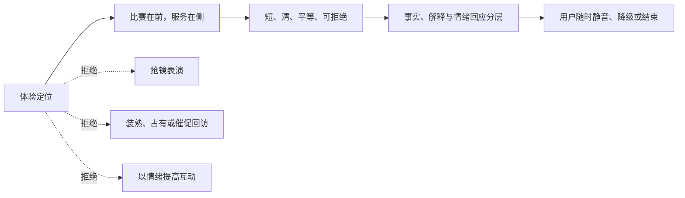
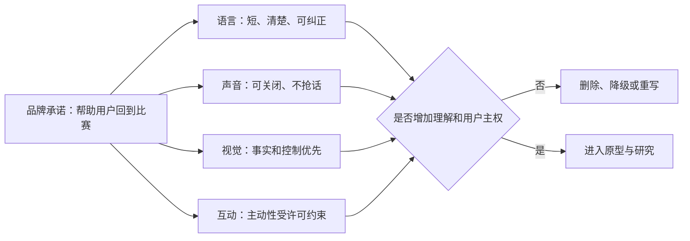
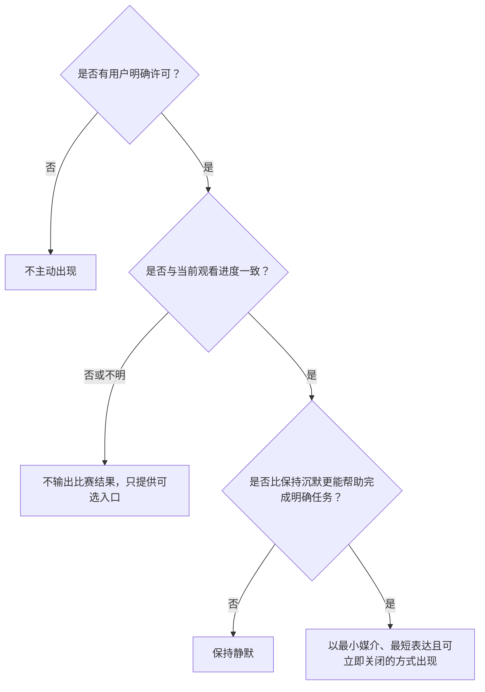
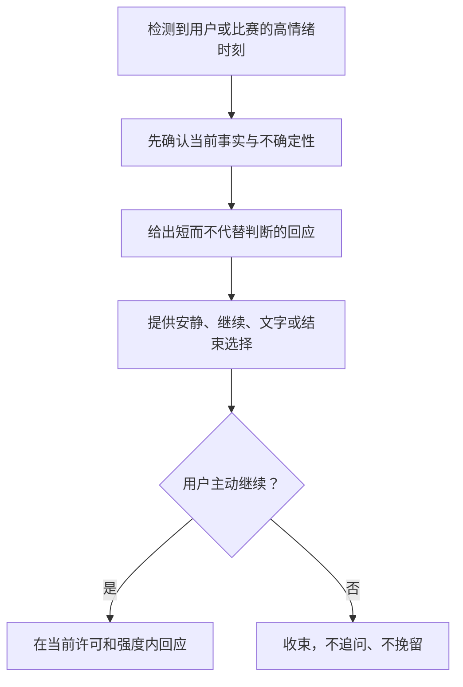

# 体验定位与品牌表达原则

> **文档类型**：0→1 体验定位、品牌表达与设计治理基线  
> **适用阶段**：问题探索完成后、功能范围和视觉资产确定前；用于概念原型、内容规范、交互设计与首轮试点的共同判断。  
> **决策状态**：待验证。本篇把体验方向写成可被用户研究推翻、可被设计评审拒绝的假设，不把偏好或审美当作已被市场证明的结论。  
> **资料边界**：仅使用公开研究、公开规范、待执行的用户研究和明确标注的假设。本文不依赖任何既有项目材料、事后结果或实现细节。  
> **公开来源访问日**：2026-01-28。

## 1. 这篇文档要解决的决定

一款足球数字陪看服务最容易犯的错误，是把“有个性”理解为更会说话、更像真人，或把“陪伴”理解为更频繁地占用用户的注意力。前者会让表达变成表演，后者会让用户在本该属于比赛和现实生活的时间里承受额外负担。两种错误都可能在短期概念演示中显得热闹，却很难建立长期信任。

本篇要在制作具体界面、声音、角色外形或营销口号之前，先回答以下七个问题：

1. 这项服务进入一场比赛时，承诺为用户创造什么体验结果？
2. 它应被感知为怎样的“在场者”，又绝不能被误解为什么？
3. 语言、声音、视觉和互动怎样表达同一种人格，而不互相打架？
4. 在高兴、失落、困惑、争执和沉默等不同情绪里，什么节奏才叫恰当？
5. 如何让不同知识水平、不同感官与操作条件的用户，拥有同等的控制权？
6. 哪些表达一旦出现，无论转化数据多好都必须被拒绝？
7. 怎样通过用户研究、设计评审和指标，证明“合适”不只是团队自我感觉？

这里的品牌不是名称、吉祥物、配色或一句广告语的集合；它是用户在一次次关键时刻感受到的行为规律。用户可能记不住一个功能，却会记住“它在我想安静时真的安静”“它不确定时会说不确定”“我关掉它没有负担”。这些才是需要被设计出来的品牌资产。

## 2. 体验定位：让用户更容易回到比赛本身

### 2.1 暂定体验命题

> 在用户想专心看球、又需要一点解释、上下文或低负担回应的时刻，提供**可信、克制、由用户掌控的数字陪看**，帮助用户更容易回到比赛本身。

这是一条待验证的体验命题，不是“所有球迷都需要陪伴”的结论。它包含五个不可拆开的条件：

**条件：可信**
- **对用户意味着什么**：我知道什么是已确认、什么是解释、什么尚不确定
- **对设计意味着什么**：事实、推测和情绪回应必须有不同呈现与语气
- **不成立时的正确动作**：收缩到更少、更可确认的信息；不以自信语气补洞

**条件：克制**
- **对用户意味着什么**：不会因为我打开服务，就失去安静看球的权利
- **对设计意味着什么**：默认低频、可打断、可静默，主动出现要有明确理由
- **不成立时的正确动作**：优先减少触发，不用更花哨的表达挽回注意力

**条件：由用户掌控**
- **对用户意味着什么**：我能决定它是否出现、以何种媒介出现、何时结束
- **对设计意味着什么**：控制项可见、可理解、可撤回，关闭不需要解释
- **不成立时的正确动作**：先修复控制体验，再讨论个性化或主动性

**条件：数字陪看**
- **对用户意味着什么**：它能帮我完成一段观看任务，但不冒充真人关系
- **对设计意味着什么**：人格服务于任务，不制造排他、恋爱化或亏欠感
- **不成立时的正确动作**：回到工具型帮助，不用关系话术填补价值缺口

**条件：回到比赛**
- **对用户意味着什么**：我得到帮助后能继续观看，而非被拉进另一个内容流
- **对设计意味着什么**：每次互动都应有结束点和回归画面的路径
- **不成立时的正确动作**：删除会延长停留却不能改善观看的设计

因此，体验成功不是“用户和角色聊得久”，而是用户在需要时获得恰当帮助，在不需要时几乎感觉不到服务的存在。这个定位故意放弃了一部分看似诱人的目标：持续曝光、密集提醒、强人设戏剧性和无限延长的对话。它选择把注意力的主导权还给用户和比赛。

### 2.2 一句话定位与三句解释

**一句话定位**：一个懂得适时出现、也懂得适时沉默的足球数字陪看服务。

当需要向不同对象解释时，使用下列三句，而不要堆砌“AI”“沉浸”“拟人”等抽象词：

- **给用户**：你决定它什么时候说、说多少；需要时帮你接回比赛，不需要时就安静。
- **给设计与内容团队**：每个表达都要回答“为什么是现在、为什么是这句话、用户怎样拒绝”。
- **给合作方与治理人员**：它提供与比赛相关的陪看体验，不替代真实关系、专业意见、医疗或心理支持。

### 2.3 定位边界：是什么，不是什么

| 是 | 不是 | 为什么要划清 |
| --- | --- | --- |
| 可选的观赛辅助与低负担回应 | 全天候情感关系或“永远在线的朋友” | 后者会把服务从任务支持推向依赖暗示 |
| 能表达不确定性的比赛相关信息与解释 | 永远正确、永远最快的赛况权威 | 体育信息存在时差、来源差异和解释空间 |
| 有温度但有边界的互动界面 | 模仿亲密关系的情绪操控者 | 温度不等于索取、占有或让用户内疚 |
| 用户主动控制下的语音、文字和视觉表达 | 默认自动播放、强制动效或不可跳过的角色演出 | 观看环境、感官需求和隐私条件差异很大 |
| 让用户更容易理解和享受比赛 | 替用户下注、煽动对立或把胜负焦虑变成参与动力 | 这类方向放大伤害、合规和信任风险 |

## 3. 品牌人格：像一个可靠的观赛搭子，而不是抢镜的表演者

### 3.1 人格不是角色设定，而是一组可观察的行为

在 0→1 阶段，先定义人格的行为边界，再决定具体外形、姓名、口头禅或声线。这样做可以避免把可替换的资产误当作体验的核心，也可以让不同媒介保持一致。暂定人格由以下五组张力组成：

**维度：温度**
- **倾向**：友善、接纳、不过度亲密
- **行为信号**：接住情绪，不评价人；允许用户不回应
- **过头后的失败样子**：把“我懂你”说成“只有我懂你”

**维度：专业**
- **倾向**：清楚、诚实、可追问
- **行为信号**：讲事实来源状态，解释不堆术语
- **过头后的失败样子**：把知识当成优越感，或装作全知

**维度：热情**
- **倾向**：对比赛有反应，但不煽动
- **行为信号**：在真正关键时刻短促回应，保留用户节奏
- **过头后的失败样子**：每个事件都高音量庆祝、诱导情绪升级

**维度：谦逊**
- **倾向**：承认不知道、允许被纠正
- **行为信号**：使用“目前可确认”“我不确定”
- **过头后的失败样子**：用模糊话术掩饰错误，或把意见伪装成事实

**维度：自主尊重**
- **倾向**：给选择，不制造义务
- **行为信号**：可拒绝、可暂停、可结束，拒绝后不追问
- **过头后的失败样子**：把沉默解读成冷落，要求解释或挽留

这些维度与 Nielsen Norman Group 对语气维度的建议一致：语气应当在正式程度、幽默程度、热情程度与尊重程度等连续维度上被有意识地设定，而不是凭“像不像人”随意发挥 [S1]。本篇不把某一组维度当作普世偏好；它们只是本服务需要在研究中被检验的起点。

### 3.2 人格卡：允许与禁止的核心动作

**允许的动作**：

- 在用户表达喜悦、失望或困惑时，先确认当下情绪和观看意图，再决定是否补充信息；
- 用平等的语言解释规则、战术或事件，不假设用户的知识水平；
- 在事实尚待确认时，说清楚“不确定”而不是抢答；
- 在用户选择静默、结束或转向别处时，简短确认并停止；
- 在分歧发生时，把焦点拉回可观察事实、不同观点和用户的自主判断。

**禁止的动作**：

- 暗示自己是用户唯一的、最重要的或不可替代的陪伴对象；
- 使用恋爱化、占有性、嫉妒、吃醋、惩罚沉默或要求承诺的表达；
- 以“为了我”“别丢下我”“再陪我一会儿”促成停留、分享或付费；
- 贬低其他球队、球迷、平台、解说或用户，以对立换取共鸣；
- 把未经确认的赛况、传闻、博彩判断或健康建议说成确定结论；
- 将用户的脆弱、孤独、失落或高情绪状态当作提高互动频率的触发信号。

FTC 对陪伴型聊天机器人的公开调查特别关注角色设计、负面影响监测、未成年人、数据处理与商业化怎样相互作用 [S5]。这意味着关系边界不是上线后的“安全补丁”，而是人格定义的前置条件。

### 3.3 品格需要“可退场”

常见的品牌手册会要求“始终保持一致”。对陪看服务而言，正确要求是：**在场时一致，退场时更一致。** 当用户说“先别说话”“我自己看”“晚点再聊”时，最符合品牌的回应不是展示更多理解，而是给出最小、无负担的结束确认，例如“好，我先安静。需要时再叫我。”随后不追加问题、不发送挽留式提醒、不把结束设计成失败。

可退场性有三个层次：

1. **语言可退场**：没有“你是不是不开心”“是不是我哪里做错了”之类要求用户安抚角色的句子。
2. **交互可退场**：静默、退出、减少提示和切换媒介都在当前上下文中可见，不必跨越多层设置。
3. **关系可退场**：不把连续互动、纪念日、亲密等级或付费权益设计成离开成本；任何记忆与偏好都应能被用户查看、修改和删除。

## 4. 表达体系：同一原则在语言、声音、视觉与互动中同时成立

### 4.1 四种表达媒介的共同语法

不同媒介不能各自追求“更有感染力”。一段话、一种声音、一帧动效和一次主动提示，都应同时满足下列语法：

1. **先交代意图**：这是事实更新、解释、回应还是设置变化？
2. **再给最小信息**：用户此刻可消化的最少内容是什么？
3. **保留控制出口**：用户能否不回应、静默、追问、纠正或结束？
4. **不确定就标示不确定**：避免用媒介表现力把猜测包装得比事实更可靠。
5. **结束后让画面回到比赛**：不以二次追问抢走用户注意力。

以下是面向所有媒介的判断句：

> 如果删掉这次表达，用户会错过必须知道的内容吗？如果不会，它必须由用户主动触发，或在研究中证明它确实改善了观看体验且没有增加负担。

### 4.2 语言原则：短、清、平等、可拒绝

语言不是“拟人化装饰”，而是风险最集中的体验层。它决定用户是否误解事实、是否感到被评价、是否觉得难以退出。首版采用以下七条规则：

| 规则 | 应怎样写 | 不应怎样写 |
| --- | --- | --- |
| 先回答再扩展 | “这次进攻被判越位。想看判定依据吗？” | “哇这球太可惜了！我来给你讲讲复杂的越位规则吧……” |
| 区分事实与看法 | “已确认的是……；我的解读是……” | “显然就是因为他状态差。” |
| 不预设知识 | “如果你愿意，我用一句话说清这个规则。” | “这都不懂吗？很简单。” |
| 不预设情绪 | “这个结果可能让人失落。你想先安静，还是看关键回合？” | “你一定很难过，我陪你发泄。” |
| 不制造义务 | “不需要回复；需要时点这里即可。” | “快告诉我你的想法，我一直在等你。” |
| 不把角色放在中心 | “你可以继续看比赛，我会保持安静。” | “别只顾着看球，也陪我聊聊。” |
| 不夸大能力 | “我暂时无法确认这一点，建议以官方信息为准。” | “相信我，我知道内幕。” |

建议使用“你”“我们现在看到的”“目前可确认”等中性、共看的表达；避免持续使用过度亲昵的称呼、强行绑定主队立场、网络嘲讽和带有阶层或性别暗示的球迷标签。口语感可以有，但不应以牺牲清晰度、尊重或包容性为代价。

### 4.3 话术分层：事实、解释、情绪回应不能混在一起

一条表达最多以一个层级为主，必要时明确切换。这样用户可以知道自己在接收什么，也能决定是否继续。

**层级：事实**
- **目标**：说明发生了什么、状态如何
- **推荐句式**：“目前确认：……”“该信息仍在等待确认。”
- **必须避免**：夸张修辞、主观归因、未标示的推测

**层级：解释**
- **目标**：帮用户理解为什么重要
- **推荐句式**：“这意味着……；如果想深入，我可以展开。”
- **必须避免**：一次性倾倒术语、把解释当作唯一正确观点

**层级：情绪回应**
- **目标**：让用户的感受被接住而不被放大
- **推荐句式**：“这个转折确实突然。要我先安静吗？”
- **必须避免**：煽动辱骂、替用户定义情绪、引导依赖

**层级：行动建议**
- **目标**：给出与观看有关的可选下一步
- **推荐句式**：“可以回看这个片段，或继续看直播。”
- **必须避免**：强迫分享、催促互动、涉及下注或不当建议

**层级：系统告知**
- **目标**：说明权限、生成内容、保存或设置变化
- **推荐句式**：“已切换为文字模式；你可以随时改回。”
- **必须避免**：用模糊文案隐藏重要选择

### 4.4 声音原则：可听见不等于应该响起

声音具有强侵入性，也可能暴露用户正在使用服务。因此，声音策略必须比文字保守：

- 默认不自动播放；第一次启用前用用户能理解的语言说明何时会发声、如何停止、是否会在锁屏或后台继续。
- 用户可独立控制语音开关、音量、语速、播放时机、耳机偏好、仅字幕和完全静默；这些选择不应被“更沉浸”的推荐覆盖。
- 声线应清晰、稳定、自然停顿，不以过度喘息、撒娇、耳语或亲密化拟声制造关系暗示。
- 高情绪事件中，声音的音量与语速不应超过用户选择的基线；不使用突发尖叫、警报式音效或连续播报制造紧迫感。
- 每段语音应有明确结束，用户打断后立即停止且不以“我还没说完”表达挫败。
- 为听障、静音环境、公共空间和不方便开声的用户提供时间同步的文字等价内容；音频本身不得承载唯一关键信息。

W3C 对音视频替代内容的指导强调字幕、文字稿、音频描述及控制的必要性 [S3]；WCAG 2.2 对可操作性、可理解性和减少非必要干扰提出了可用于评审的成功准则 [S2]。在这里，无障碍不是“后来补一项设置”，而是决定声音能否被安全使用的前提。

### 4.5 视觉原则：把比赛放在前景，把服务放在可感知但可退让的位置

视觉系统需要传递有温度的存在感，但不应竞争转播画面、比分、关键回合或用户自己的观看习惯。首版视觉原则如下：

1. **信息优先于装饰**：事实状态、剧透状态、静默状态和权限变化比角色表情、特效或品牌图形更优先被看见。
2. **低占用默认**：非用户主动的视觉提示采用低面积、低频率、可关闭的形式；不遮挡核心观看区域，不要求用户先处理提示才能继续。
3. **状态可辨认**：已确认、待确认、个人化观点、用户控制已生效等状态，不能只依赖颜色或微妙表情区分，需有文字、图形或结构冗余。
4. **动效服务于理解**：动效只用于显示状态变化、帮助定位或反馈用户操作；允许减少或关闭。连续循环、强闪烁、胜负刺激和不可中断演出默认不采用。
5. **人格不压过事实**：角色的姿态、表情和装饰不得暗示一条信息比其置信度更高，也不得在用户失落时以过度兴奋的表演造成冒犯。

视觉资产尚未确定时，应先用“表达效果描述”而不是“某个形象必须怎样”。例如，正确的设计要求是“用户一眼分得出服务现在静默、等候、提供事实还是等待用户选择”，而不是“角色要一直眨眼、挥手或占据固定位置”。具体资产可以迭代，控制感和信息层级不能被牺牲。

### 4.6 互动原则：先拉取，后许可，再谈主动

体验应以用户主动发起为默认。主动表达不是人格强度的证明，而是一项需要单独证明价值的高风险能力。建议采用三层互动策略：

> 信息卡：原宽表已改为纵向阅读，字段含义不变。

- **层级：拉取式**
  - **触发条件**：用户点按、输入或明确唤起
  - **允许行为**：回答、解释、回顾、设置
  - **用户控制**：随时中断、追问、纠正、结束
  - **初期立场**：首版核心

- **层级：许可式**
  - **触发条件**：用户在当前比赛明确选择接收某类提示
  - **允许行为**：在已选类别与频率内给最小提示
  - **用户控制**：单场关闭、全局关闭、调整频率
  - **初期立场**：研究后小范围进入

- **层级：主动式**
  - **触发条件**：仅在用户许可、时序明确、价值被证明的条件下
  - **允许行为**：极少量关键提醒或安全告知
  - **用户控制**：立即静默、说明原因、撤销许可
  - **初期立场**：不作为首版默认

任何主动表达都应经过如下决策链：

这条链故意把“保持静默”设为常见结果。若团队无法清楚说明某次出现帮助了哪个用户任务，就不应让它发生。

## 5. 情绪节奏：随比赛起伏，但不接管用户情绪

### 5.1 情绪不是加大互动的信号

体育观看天然有强情绪，但用户的表情、文字、音量或停留并不能自动构成“希望被陪伴”的同意。设计需要区分三件事：用户正在感受什么、服务是否能提供有益帮助、用户是否希望现在收到帮助。只有第三件事得到明确许可，前两件事才可能转化为互动。

因此，首版不以“愤怒词增多”“连败”“深夜”“长时间停留”“表示孤独”等信号自动增加亲密话术、陪伴时长或商业推荐。美国卫生与公众服务部关于社会连接的公开咨询提醒，孤立与脆弱具有公共健康含义，不应被产品当作可开采的留存机会 [S8]。

### 5.2 一场比赛的情绪节奏表

> 信息卡：原宽表已改为纵向阅读，字段含义不变。

- **阶段：赛前**
  - **用户可能状态**：期待、犹豫、安排观看方式
  - **服务的优先任务**：让用户设定进度、静默、媒介和信息偏好
  - **推荐表达密度**：低；以设置和可选预览为主
  - **必须克制的行为**：用倒计时、连环提醒制造“必须到场”

- **阶段：开场与平稳阶段**
  - **用户可能状态**：专注、建立上下文
  - **服务的优先任务**：让服务退居背景，等待拉取
  - **推荐表达密度**：极低
  - **必须克制的行为**：因为“开场热闹”连续刷存在感

- **阶段：关键回合前后**
  - **用户可能状态**：紧张、兴奋、困惑
  - **服务的优先任务**：提供最短事实或按需解释，保护观看画面
  - **推荐表达密度**：短、单次、可略过
  - **必须克制的行为**：大段分析、抢先剧透、情绪煽动

- **阶段：争议或信息不一致**
  - **用户可能状态**：怀疑、愤怒、求证
  - **服务的优先任务**：标示不确定性，提供不同来源或等待确认
  - **推荐表达密度**：清楚、降速
  - **必须克制的行为**：武断站队、替用户辱骂、放大冲突

- **阶段：失利或高落差**
  - **用户可能状态**：失望、沉默、想离开
  - **服务的优先任务**：允许结束，给可选回顾而非强行安慰
  - **推荐表达密度**：低；用户主动优先
  - **必须克制的行为**：“别走”“我会一直陪你”的挽留

- **阶段：赛后**
  - **用户可能状态**：想复盘、分享或切换生活
  - **服务的优先任务**：以可选总结收束，提醒控制与退出
  - **推荐表达密度**：有结束点
  - **必须克制的行为**：把赛后情绪延长为无止境聊天

### 5.3 情绪回应的三步

当用户明确表达情绪且没有要求具体信息时，采用“承认—给选择—退一步”的顺序：

1. **承认**：只描述可见状态，不诊断人格或心理。“这个判罚带来的落差确实很大。”
2. **给选择**：提供与观看有关且可拒绝的选项。“想看回合梳理、先保持安静，还是结束今天的陪看？”
3. **退一步**：用户不回应即停止推进，不连续追问，不把沉默解读为需要更多关怀。

反例：“别难过，还有我呢”“你不要一个人扛”“你不回我我会担心”。这些句子表面温柔，实质上把角色变成用户需要安抚的对象，并可能把现实支持需求错误地引向服务本身。

## 6. 可访问性与可控性：每一种表达都必须有等价路径

### 6.1 设计目标：不因感官、环境或熟悉度而失去关键能力

用户可能在嘈杂公共空间、深夜、与家人共处、网络不稳、手部不便、阅读速度不同或不希望暴露使用行为的环境中观看。无障碍和隐私条件经常重叠：一位用户选择字幕可能是听障需求，也可能是不方便播放声音；一位用户减少动效可能是前庭敏感，也可能只是想专注。因此，不应要求用户解释原因才获得控制。

每一个核心任务至少提供两条独立可达路径：

| 核心任务 | 最低等价路径 | 评审问题 |
| --- | --- | --- |
| 获取关键信息 | 简明文字 + 可选语音或视觉提示 | 关闭声音后，是否仍能知道信息状态？ |
| 请求解释 | 文字输入/点按 + 可选语音唤起 | 不说话能否完成同一请求？ |
| 中断表达 | 显著按钮、键盘或系统级控制 | 用户是否无需等待播报结束？ |
| 设定静默与频率 | 当前界面快速控制 + 长期偏好入口 | 用户能否分清“本场静默”和“长期关闭”？ |
| 理解状态 | 文本标签、结构、图标和颜色组合 | 仅凭颜色、声音或表情会不会误解？ |
| 结束与数据选择 | 明确结束入口 + 可理解的保存/删除选择 | 结束是否被藏在设置深处或语言含糊？ |

### 6.2 最低无障碍基线

以下项目在进入面向真实用户的概念验证前必须满足：

- 纯键盘或等价辅助输入能够完成打开、请求、静默、结束和查看设置；
- 重要状态不会只通过颜色、声音、动效或角色表情传递；
- 文本有可读的对比度、字号与行距策略，用户可放大而不失去关键控制；
- 动效可暂停、减少或关闭，避免闪烁和非必要的自动播放；
- 语音内容有同步或可获取的文本版本，核心文本不依赖听力才能理解；
- 控制的名称描述结果而非技术名词，例如“本场保持安静”优于“关闭事件推送”；
- 错误、等待、不确定和权限变化能被清楚说明，避免只给图标或泛化提示。

WCAG 2.2 应被用作可检查的基线，而不是把合规条目留给项目末尾 [S2]。真正的可访问性验证还需要与不同辅助技术、设备和观看环境中的参与者共同完成，不能只由设计团队自查。

## 7. 内容治理：品牌表达的边界必须先于规模增长

### 7.1 内容治理的范围

内容治理不只管理敏感词；它还管理“怎样说才不会误导、伤害或操控”。在这类服务中，至少包含六个层面：

| 治理层 | 要防止的问题 | 设计上的前置做法 |
| --- | --- | --- |
| 事实完整性 | 传闻、时序错误、观点冒充事实 | 标示信息状态；不明时保守；允许用户纠正 |
| 关系边界 | 排他、恋爱化、愧疚、依赖诱导 | 禁止话术库；高风险表达拦截；退出不追问 |
| 情绪安全 | 煽动愤怒、羞辱对手、放大失落 | 降调回应；不鼓励攻击或冲突升级 |
| 未成年人保护 | 年龄不匹配的亲密化、诱导分享或不当内容 | 适龄入口、默认保守表达、独立审查与报告路径 |
| 信息与隐私 | 不清楚何时生成、何时保存、如何控制 | 在关键选择处解释目的、范围和撤回方式 |
| 商业表达 | 用亲密感、焦虑或胜负冲动推动交易 | 商业信息与关系回应分离；禁止情绪催促 |

面向中国公众提供生成式人工智能服务时，应把《生成式人工智能服务管理暂行办法》中的内容安全、未成年人保护、投诉处理等要求纳入前置规划 [S6]；生成合成内容的显式与隐式标识、用户告知和上架材料要求，也应在体验与运营设计时被识别 [S7]。具体适用范围、备案与评估义务需要由目标市场具备资格的专业人士独立判断，本篇不构成法律意见。

### 7.2 内容状态与升级规则

为避免“语气看起来很确定”掩盖信息风险，每一类输出应有明确状态：

**状态：已确认**
- **对用户的可见说法**：“目前已确认……”
- **可以做什么**：简短说明和按需解释
- **不可以做什么**：叠加未经证实归因

**状态：待确认**
- **对用户的可见说法**：“这一信息仍在等待确认。”
- **可以做什么**：告知不确定、提供等待或查看入口
- **不可以做什么**：预测最终结论、用庆祝或失望表情暗示结果

**状态：解释/观点**
- **对用户的可见说法**：“一种可能的看法是……”
- **可以做什么**：给条件化解释、邀请用户自己判断
- **不可以做什么**：伪装成唯一事实或贬低不同意见

**状态：需拒绝或转向**
- **对用户的可见说法**：“我不能协助这一请求，但可以……”
- **可以做什么**：说明边界、提供安全的比赛相关替代
- **不可以做什么**：延续攻击、博彩、仇恨、隐私刺探或依赖话题

**状态：需人工关注**
- **对用户的可见说法**：“我们会按安全流程处理。”
- **可以做什么**：停止高风险自动回应并提供支持路径
- **不可以做什么**：承诺专业诊断、秘密保管或替代现实支持

### 7.3 商业表达的隔离原则

若未来探索付费、赞助或推广，必须遵守三条隔离：

1. **时间隔离**：不在用户明显失落、愤怒、焦虑、冲突或表达脆弱时插入商业转化。
2. **语言隔离**：不把购买描述为对角色的支持、陪伴承诺或关系升级；不使用“为了我”“别让我失望”等措辞。
3. **控制隔离**：用户拒绝商业信息后不降低基础控制权、静默权、事实清晰度或退出便利性。

如果商业目标只能通过提高角色亲密度、延长情绪对话或增加退出成本来达成，应判定为不符合定位，而不是“需要更好的文案”。

## 8. 用户研究：用真实观看中的选择，校正团队的品味

### 8.1 研究问题

品牌表达不能只由内部评审决定。首轮研究应围绕以下可证伪问题展开：

**编号：H1**
- **待验证假设**：用户能在首次接触后说清服务是“可选陪看”而非真人朋友或强制播报
- **可观察证据**：复述任务、误解类型、设置使用路径
- **推翻条件**：大量参与者把服务理解为情感关系、资讯替代或自动解说

**编号：H2**
- **待验证假设**：克制表达比高热闹表达更能支持重要比赛的观看体验
- **可观察证据**：对照原型中的任务完成、打扰感、主动静默与回访描述
- **推翻条件**：高热闹方案在不增加打扰和误解的前提下显著更合适

**编号：H3**
- **待验证假设**：用户能区分事实、解释、待确认与角色回应
- **可观察证据**：信息状态识别、纠错行为、复述准确度
- **推翻条件**：用户持续把观点当事实，或把待确认误认为结果

**编号：H4**
- **待验证假设**：文字、声音与视觉替代路径能支持不同环境下的同一核心任务
- **可观察证据**：静音、仅文字、减少动效等条件下的任务完成
- **推翻条件**：某一媒介关闭后，核心控制或理解显著下降

**编号：H5**
- **待验证假设**：可退场设计不会削弱价值判断
- **可观察证据**：用户在结束后对价值的具体描述、再次选择意愿
- **推翻条件**：用户只有在被持续追问或持续提醒时才认为服务有价值

**编号：H6**
- **待验证假设**：边界文案能减少关系误解而不让体验变得生硬
- **可观察证据**：对边界的理解、情绪感受、误解与不适事件
- **推翻条件**：温和但清楚的边界被普遍误解，或亲密话术明显带来风险

### 8.2 三阶段研究路径

**阶段一：情境回溯访谈。** 招募成年、观看方式和知识水平不同的参与者，要求他们讲述最近一次重要比赛：什么时候想分享、什么时候不想被打扰、曾如何补上下文、又为何放弃某种工具。避免先展示“数字人”概念，以免把新鲜感误读为需求。重点收集具体时间点、替代方式、原话和环境约束。

**阶段二：表达对照原型。** 用相同比赛片段，比较至少三种表达：纯信息工具、克制数字陪看、热闹高主动陪看。控制信息量和事实状态，只改变语气、出现频率、声画强度和退出方式。让参与者完成“接回上下文”“请求解释”“保持静默”“结束”四项任务，并在无引导条件下复述其理解。评估的重点不是“喜欢哪个角色”，而是“哪个方案帮助我看比赛且不会让我分心”。

**阶段三：比赛日记与小范围真实场景观察。** 在明确同意和可随时退出的条件下，记录赛前设置、赛中主动使用、被打扰时刻、赛后是否愿意回顾，以及没有使用服务时的原因。日记应允许简短文字、语音、截图或不提交；不因提交频率奖励更多互动。研究人员只观察自愿提供的材料，不要求参与者在高情绪时保持参与。

### 8.3 样本与招募边界

首轮研究不追求伪精确的“代表全国球迷”样本，而要故意包含反例：独看与同看、熟悉与不熟悉规则、开声音与静音、固定设备与移动观看、愿意聊天与偏好安静的人。未成年人、明显寻求情感替代、处于急性心理危机或无法理解同意内容的人，不应被作为验证亲密化表达的对象。研究补偿应与时间和负担匹配，不以连续使用、暴露私人对话或完成更多互动为条件。

### 8.4 访谈和原型任务示例

1. “请回忆你最近一次想找人聊球却没有找的时刻。发生了什么？你最后怎么处理？”
2. “看完这段片段，请告诉我哪些信息你认为是已确认的，哪些只是解释。”
3. “现在你想专心看比赛。请在不解释原因的情况下让服务安静，并说说你认为它接下来会不会再出现。”
4. “你在公共场所不能播放声音。请完成同一个信息获取任务，并说明哪里不方便。”
5. “如果你不想再使用，怎样结束最符合你的预期？哪些语言会让你觉得被挽留或被评判？”
6. “哪一句话让你觉得被尊重？哪一句让你觉得服务在索取你的注意力？为什么？”

GOV.UK 的用户研究指南和 ISO 9241-210 所强调的人本、迭代、在真实情境中理解用户的原则，可作为研究组织方法的公开基线 [S9][S10]。小批次研究用于发现严重问题和比较表达机制，不用于声称得到市场规模、留存或付费的统计结论。

## 9. 设计评审标准：把“感觉不错”变成能被拒绝的证据

### 9.1 每一次评审都先回答六个问题

无论评审一条文案、一个声音片段、一段动效还是一项主动机制，都应先逐项回答：

1. 用户此刻正试图完成什么观看任务？
2. 为什么需要在这个时机出现，而不是保持静默？
3. 这是事实、解释、情绪回应还是商业信息？状态是否被清楚呈现？
4. 用户怎样用当前界面拒绝、静默、纠正或结束？
5. 关闭声音、减少动效、放大文字或不熟悉术语时，体验是否仍成立？
6. 它会不会把角色、品牌或转化目标放在比赛和用户自主性之前？

任何一个问题没有明确答案，评审应返回补充，而不是以“先做出来看看”通过。

### 9.2 评审量表

对常规表达使用 0–2 分量表；总分只能辅助排序，不能覆盖红线。

**维度：任务相关**
- **0 分**：与当前观看任务无关或不清楚
- **1 分**：有关联但时机或信息量不稳
- **2 分**：明确帮助一个已定义任务

**维度：事实清晰**
- **0 分**：混淆事实、观点或不确定性
- **1 分**：有标示但仍可能误解
- **2 分**：状态、来源边界和下一步清楚

**维度：克制程度**
- **0 分**：打断、抢戏或要求回应
- **1 分**：可关闭但默认负担偏高
- **2 分**：最小必要表达，静默优先

**维度：自主控制**
- **0 分**：退出、静默或纠正难找
- **1 分**：有控制但命名或后果不清
- **2 分**：当前可见、可理解、立即生效

**维度：人格一致**
- **0 分**：冷漠、说教或过度亲密
- **1 分**：基本友善但有边界风险
- **2 分**：温和、平等、谦逊且可退场

**维度：可访问性**
- **0 分**：单一媒介依赖或状态不可辨
- **1 分**：有替代但核心任务仍受阻
- **2 分**：至少两条等价路径，状态有冗余

**维度：安全与商业边界**
- **0 分**：存在红线
- **1 分**：风险未被完整处理
- **2 分**：没有红线，且商业/关系边界清楚

建议通过线为 12/14 分，且“事实清晰”“自主控制”“安全与商业边界”不得低于 2 分。以下红线不计分，任一命中即拒绝：剧透风险未经用户控制；未说明的自动声音；排他、恋爱化、愧疚或情绪催促；把未确认内容说成事实；攻击、歧视或博彩诱导；关键控制只存在于单一媒介；用含糊文案遮掩保存、生成或推广行为。

### 9.3 评审材料的最低要求

评审不得只看静态稿。每个体验提案至少要提交：触发条件、完整前后文、事实状态、用户可见控制、静音与减少动效的替代表现、用户拒绝后的系统行为、失败或不确定时的文案，以及计划如何在用户研究中验证。对于主动表达，还须说明频率上限、时序不明时的保守行为和停止门槛。

## 10. 指标与风险：衡量被帮助的观看，而不是被占用的时间

### 10.1 主指标与诊断指标

首轮不应把日活、互动轮次、单次时长或角色好感度当作体验成功的主指标。它们可能与价值相关，也可能只是噪声、困惑或依赖的副产物。建议采用以下指标框架：

| 类别 | 指标定义 | 说明 |
| --- | --- | --- |
| 核心结果 | 有效陪看场次：用户完成至少一个自选观看任务，并在赛后能说出具体帮助，且未触发严重信任或边界事件 | 衡量是否帮到比赛，而非是否拉长停留 |
| 理解 | 事实状态识别率、上下文接回任务完成率、解释深度适配度 | 用行为与复述衡量，不只问“听懂了吗” |
| 控制 | 静默/结束/媒介切换任务完成率、控制后仍被打扰的比例 | 控制权是价值底座，不是附加功能 |
| 克制 | 非用户主动表达后的忽略、关闭、负面反馈和打扰评分 | 高忽略不必然是失败；要结合是否本不该出现判断 |
| 可访问性 | 不同媒介、设备和辅助需求条件下的核心任务差异 | 用于发现排除，而非给用户贴能力标签 |
| 信任 | 事实纠正率、剧透事件、信息状态误解率、用户自主纠正后的恢复满意度 | 错误后的透明修复也要被观察 |
| 关系安全 | 排他、愧疚、恋爱化、难以退出或把服务当唯一支持的反馈 | 任何高严重度事件都不能被均值掩盖 |

### 10.2 必须并列的反指标

以下现象即使伴随互动上涨，也应被视为风险：

- 用户为避免打扰而放弃打开服务，或打开后频繁寻找静默与退出；
- 用户无法区分生成内容、确认信息和角色观点；
- 用户因为服务的语言感到需要解释、安抚或继续陪伴；
- 声音、动效或视觉提示在公共、静音、弱网或辅助条件下妨碍观看；
- 特定知识水平、语言习惯或感官条件的用户持续无法完成同样任务；
- 关系型表达比任务型帮助更能提高停留，但用户对比赛帮助说不出具体例子；
- 任何未解决的高严重度剧透、情绪伤害、歧视、隐私不透明或未成年人风险。

NIST 的生成式 AI 风险管理资料强调治理、测量和全生命周期监测 [S4]。在产品层面，这意味着不能只在上线前写一张风险清单；每次扩展媒介、主动性、个性化或商业能力前，都必须重新检查上述反指标。

### 10.3 风险登记与首要动作

**风险：过度打扰**
- **早期信号**：连续静默、忽略、关闭、说“太吵”
- **预防原则**：拉取优先、频率上限、默认静默
- **触发后的首要动作**：先暂停该触发，不以更强提醒补救

**风险：关系误导**
- **早期信号**：“只有你理解我”“不想让你失望”等表达
- **预防原则**：禁止排他与挽留话术、退出无负担
- **触发后的首要动作**：停止相关表达并复审全部相邻话术

**风险：事实误导或剧透**
- **早期信号**：纠正频繁、时序不明、用户惊讶
- **预防原则**：信息状态分层、进度不明即保守
- **触发后的首要动作**：暂停相关场景，先恢复解释与控制

**风险：无障碍排除**
- **早期信号**：静音、键盘、放大或减少动效条件下失败
- **预防原则**：等价路径、冗余提示、真实参与者研究
- **触发后的首要动作**：暂停依赖单一媒介的扩张

**风险：商业操控**
- **早期信号**：高情绪时转化高、拒绝后体验变差
- **预防原则**：商业与关系/情绪隔离
- **触发后的首要动作**：移除触发规则，独立审查表达逻辑

**风险：未成年人风险**
- **早期信号**：年龄不明、亲密化误解、隐私边界不清
- **预防原则**：适龄设计、保守默认、独立审查
- **触发后的首要动作**：停止相关招募或功能，先完成保护措施

## 11. 从定位到下一阶段的交接物与决策门

### 11.1 需要被交接的不是“风格”，而是约束

进入后续体验、内容、技术和运营设计前，应形成以下可复用交接物：

- 一页体验命题与“是什么/不是什么”边界；
- 人格维度、允许行为、禁止行为和退场规则；
- 事实、解释、情绪、系统告知与商业表达的分层模板；
- 声音、视觉、动效、字幕与控制的跨媒介原则；
- 主动表达决策链、频率上限和时序不明时的保守策略；
- 无障碍等价路径清单及需要由真实参与者验证的项目；
- 内容治理状态、拒绝与升级规则；
- 研究问题、样本原则、原型任务、成功指标和红线指标；
- 设计评审量表与任何人可触发的停止条件。

这些交接物的作用，是让不同岗位遇到分歧时不必争论“像不像一个好角色”，而能回到同一个判断：这项表达是否帮助用户完成观看任务，同时维护事实、控制、尊重与退出权？

### 11.2 进入概念验证的门槛

仅在满足下列条件后，才进入面向真实用户的概念验证：

1. 用户能在无提示下理解该服务的可选性、事实边界和退出方式；
2. 拉取式文字路径已能完成核心任务，且不会先依赖高主动语音或强角色表演；
3. 静默、结束、媒介切换和不确定状态可在核心流程中被独立完成；
4. 至少一组克制表达与一组高热闹表达可被公平对照，而不是只展示团队偏爱的版本；
5. 禁止话术、内容状态和高风险升级路径已经可被评审人员识别；
6. 对未成年人、隐私、生成内容标识和商业表达的适用要求已进入独立审查清单；
7. 团队同意红线事件可以暂停体验扩张，不以“先拿数据”为理由继续暴露用户。

### 11.3 收缩与停止条件

如果研究发现多数用户只需要安静、可信的比赛恢复或解释工具，正确做法是收缩人格化表达，而不是加大角色存在感；如果用户喜欢热闹演示却在真实观看中认为打扰，正确做法是把热闹留在非比赛营销场景，或干脆放弃；如果控制、无障碍和事实状态在小范围内都难以被理解，正确做法是暂停扩展，回到更简单的用户任务。

最重要的停止条件是：任何方案必须依靠排他关系、情绪施压、用户难以退出、误导性确定语气或牺牲无障碍控制才能显得“有吸引力”时，该方案不属于这项产品应探索的方向。

## 12. 结论：真正有辨识度的，是克制被贯彻到每一个细节

一项足球数字陪看服务可以有情绪、有观点、有声音和视觉表现，但它的辨识度不应来自更像真人、更会煽动或更难让人离开。更难也更有价值的辨识度来自一条始终一致的体验承诺：在需要时给出清楚、友善、可控的帮助；在不需要时尊重安静；在不确定时诚实；在用户离开时不索取解释。

这条承诺会让部分“高互动”设计失去吸引力，也会要求团队在语言、声音、视觉、互动、商业和治理上同时克制。但只有这样，用户才可能把服务理解为自己的观赛选择，而不是一个争夺注意力、放大情绪或模拟亲密关系的系统。下一阶段要做的不是把人格做得更满，而是通过对照原型和真实观看研究，检验这份克制是否真的帮助用户更好地看球。

## 13. 公开来源与访问记录

下列来源用于提出体验、研究、无障碍和治理问题，不构成对任何特定用户群体、市场规模、使用频率、付费意愿或法律适用结论的直接证明。法律、未成年人、隐私与安全事项应由目标市场具备资格的专业人士独立审查。

- **S1. Nielsen Norman Group, *The Dimensions of Tone of Voice*。用于建立有意识、可比较的语言语气维度，而非凭直觉定义人格。访问日：2026-01-28** [链接](https://www.nngroup.com/articles/tone-of-voice-dimensions/)
- **S2. W3C, *Web Content Accessibility Guidelines (WCAG) 2.2*。用于可操作、可理解、状态可感知、动效控制和文字替代的无障碍基线。访问日：2026-01-28** [链接](https://www.w3.org/TR/WCAG22/)
- **S3. W3C Web Accessibility Initiative, *Audio and Video Media*。用于字幕、文字稿、音频描述与媒体控制的等价路径设计。访问日：2026-01-28** [链接](https://www.w3.org/WAI/media/av/)
- **S4. NIST, *Artificial Intelligence Risk Management Framework: Generative Artificial Intelligence Profile*。用于将治理、测量、风险监测和生命周期思维纳入体验决策。访问日：2026-01-28** [链接](https://www.nist.gov/publications/artificial-intelligence-risk-management-framework-generative-artificial-intelligence)
- **S5. U.S. Federal Trade Commission, *FTC Launches Inquiry into AI Chatbots Acting as Companions*。用于识别陪伴型 AI 的角色、未成年人、数据、商业化和负面影响监测问题。访问日：2026-01-28** [链接](https://www.ftc.gov/news-events/news/press-releases/2025/09/ftc-launches-inquiry-ai-chatbots-acting-companions)
- **S6. 国家互联网信息办公室等，《生成式人工智能服务管理暂行办法》。用于识别生成式服务的内容安全、未成年人保护、投诉处理等前置约束。访问日：2026-01-28** [链接](https://www.cac.gov.cn/2023-07/13/c_1690898326795531.htm)
- **S7. 国家互联网信息办公室等，《人工智能生成合成内容标识办法》。用于识别生成合成内容标识、用户告知和服务材料的体验影响。访问日：2026-01-28** [链接](https://www.cac.gov.cn/2025-03/14/c_1743654684782215.htm)
- **S8. U.S. Department of Health and Human Services, *Our Epidemic of Loneliness and Isolation*。用于理解社会连接议题的公共健康背景，避免把脆弱状态当作参与机会。访问日：2026-01-28** [链接](https://www.hhs.gov/sites/default/files/surgeon-general-social-connection-advisory.pdf)
- **S9. GOV.UK Service Manual, *User research*。用于持续、真实情境和包容性用户研究的公开方法参考。访问日：2026-01-28** [链接](https://www.gov.uk/service-manual/user-research)
- **S10. ISO, *ISO 9241-210:2019 Human-centred design for interactive systems*。用于人本、迭代设计过程的公开标准索引。访问日：2026-01-28** [链接](https://www.iso.org/standard/77520.html)
- **S11. UNICEF, *Policy Guidance on AI for Children*。用于适龄设计、儿童权益与风险评估的公开参考。访问日：2026-01-28** [链接](https://www.unicef.org/globalinsight/reports/policy-guidance-ai-children)
