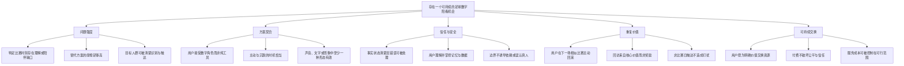
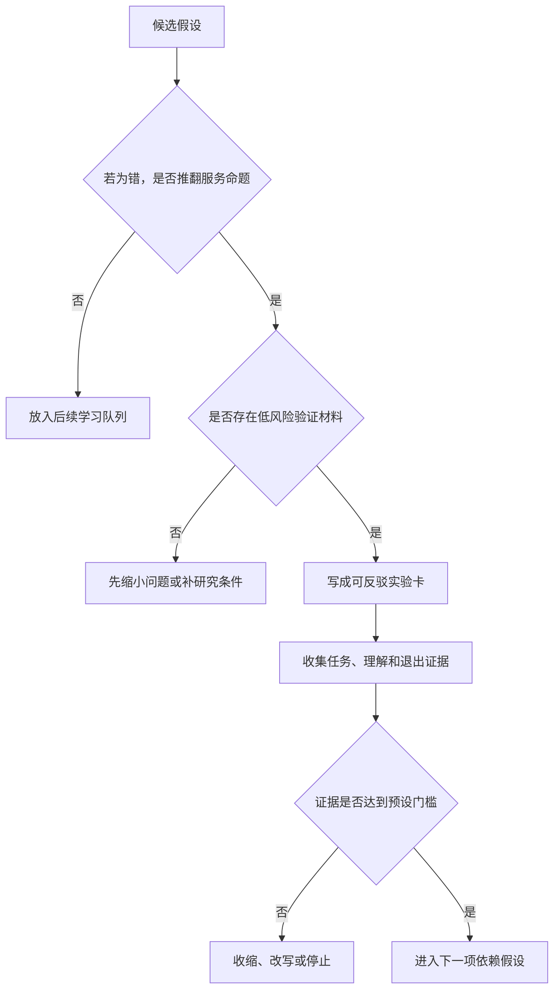
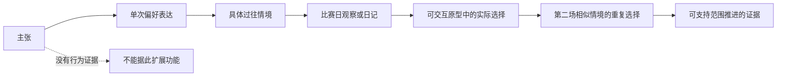
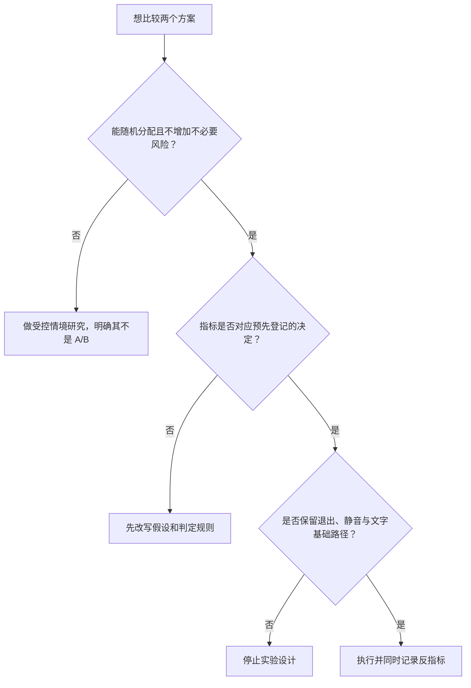

# 需求假设与验证计划

> 文档类型：0→1 需求发现与立项验证计划  
> 适用阶段：提出机会 → 验证问题 → 选择最小可用体验 → 决定是否进入建设  
> 版本：0.1（所有结论均待验证）  
> 研究信息截止：2026-01-28  
> 使用原则：把“足球很受欢迎”“用户说愿意用”“演示看起来不错”与“存在可持续需求”严格区分。任何假设未达到规定证据等级，不得被写成事实、承诺或规模预测。

---

## 1. 要验证的不是功能，而是一个值得被解决的问题

拟议服务是一种围绕合法观赛场景运行的实时数字陪看体验：用户在赛前、赛中或赛后，可选择让一个明确标识为 AI 的数字角色提供有限的赛事解释、事实澄清、情绪回应和连续性陪伴。它不提供赛事转播、不替代现实关系、不提供博彩建议，也不应把用户留在对话里当作目标。

在投入大规模建设前，团队必须回答五个依次收紧的问题：

1. **问题存在吗？** 在哪些比赛、哪些用户、哪些时刻，独自观赛、信息不确定或缺少合适交流对象，真的造成了可感知的损失？
2. **替代方案不够好吗？** 直播解说、搜索、赛事 App、群聊、朋友、社交平台和安静独处分别解决了什么，又在哪些时刻失败？
3. **这种形式值得被选吗？** 用户需要的是即时信息、一个可说话的角色、一个可随时静音的伙伴，还是仅需一个更好的赛后内容工具？
4. **价值能否重复出现？** 用户是否会在不同场次、不同情绪下主动回来，而不是只在新鲜感或研究奖励存在时试一次？
5. **价值能否安全且可持续地交付？** 事实错误、打扰、隐私不安、未成年人风险、情感依赖风险和成本结构，是否会抵消原本的体验价值？

这五个问题的顺序不能颠倒。第一轮不争论头像、音色、动效或复杂角色设定，也不把“能实现”当成“值得实现”。若问题和重复价值未被证明，任何再精致的互动都只是高成本演示。

### 1.1 本计划的决定范围

本计划只为下列立项决定提供证据：

| 决定 | 可以做出的结论 | 不可以做出的结论 |
|---|---|---|
| 是否继续问题发现 | 是否存在值得深入研究的具体用户情境 | 不等于已证明大规模市场或付费 |
| 选择首个场景 | 哪一类赛事、用户和时刻适合做第一轮体验 | 不等于其他人群永远没有需求 |
| 选择最小体验 | 首轮只保留哪些能力，哪些能力不做 | 不等于产品长期形态已锁定 |
| 是否投入建设 | 是否值得进入有限范围的体验建设与评估 | 不等于已经可以面向公众扩张 |
| 是否尝试商业化 | 是否有足够信号去验证一种不伤害体验的付费方式 | 不等于商业模式已成立 |

### 1.2 研究立场：行为优先、情境优先、反证优先

本项目不用“你会不会使用”作为核心证据。用户在非比赛时、面对抽象概念时，很容易给出礼貌而乐观的回答；真正有价值的是他们在真实情境中已经做过什么、愿意付出什么，以及在试用后是否自发回来。

研究也不从“所有球迷”开始。一个人在独自看主队淘汰赛、第一次尝试看重要比赛、与朋友同看、通勤时看文字直播，所需的帮助可能完全不同。把这些人混在一起，会得到平均化但不可执行的结论。

最后，研究必须主动寻找反证。每个实验卡都要写明什么结果会推翻原判断，什么结果只意味着“还不够确定”，什么结果会要求停止。没有失败标准的实验不是实验，只是为既定方案收集支持材料。

---

## 2. 服务边界与首轮学习目标

### 2.1 先定义不做什么

边界是需求验证的一部分。若不先限定，参与者会把“什么都能聊、总会陪着我”的想象投射到服务上，研究到的是幻想，不是可交付价值。

首轮探索不包含：

- 赛事直播、盗播入口、转播替代或对未获授权内容的再分发；
- 博彩推荐、赔率引导、收益暗示、为投注行为提供情绪刺激；
- 恋爱承诺、排他表达、索取情感承诺、鼓励用户疏远现实支持；
- 心理诊断、危机干预承诺、医疗或法律建议；
- 通过持续推送、故意延迟结束、制造内疚等手段拉长停留；
- 默认保存与观赛目的无关的敏感个人信息；
- 以“像真人”为卖点而弱化 AI 身份、能力边界或人工参与边界。

这些边界不是降低体验，而是使研究对象可被清楚理解：我们验证的是“恰当出现的数字球友是否有价值”，不是“无限制的陪聊是否能吸引注意力”。

### 2.2 首轮学习问题

第一轮只需要学习四件事：

1. 用户愿不愿意在一场真实比赛里主动把它打开；
2. 用户最愿意在哪些时刻让它介入，以及何时希望它完全安静；
3. 可信的事实表达、可中断性和边界说明是否足以建立最低信任；
4. 体验结束后，用户是否愿意在下一场同类比赛中再次选择它。

因此，首轮体验应保持克制：一场可选的陪看会话、少量清楚标识的能力、可随时关闭的语音或文字、可理解的事实状态、自然结束而不是留存钩子。研究对象越简单，越容易判断用户是在为核心价值回来，还是被功能噪声吸引。

---

## 3. 假设树：从需求到持续使用的因果链

### 3.1 总体假设树



假设树的作用是防止“局部成功”被误读为“整体成立”。例如，用户在访谈中喜欢角色外观，只支持 `C1` 的很弱信号，既不证明 `B1` 的问题存在，也不证明 `E1` 的重复价值。反过来，若用户在真实比赛中一次都不主动进入，即使主观评分不错，也必须优先回到问题和触达条件，而不是继续优化外观。

### 3.2 关键假设登记册

下表中的“通过”均指达到后文规定的最低证据，而非永久成立。每项假设都应有负责人、证据链接、复核日期和下一步决定；这些记录在研究工作区维护，不应把未经验证的数字直接写进对外材料。

> 信息卡：原宽表已改为纵向阅读，字段含义不变。

- **编号：H1**
  - **假设**：部分成年球迷在重要比赛的关键时刻，确实存在“想马上确认或说一句”的未满足需求
  - **若为假会发生什么**：服务没有高价值进入点，只会变成可有可无聊天
  - **首选验证方式**：情境访谈 + 实况观察 + 赛后回放访谈
  - **最低证据等级**：E3
  - **优先级**：P0

- **编号：H2**
  - **假设**：该需求集中于可定义的首批用户，而非平均分布在所有观众中
  - **若为假会发生什么**：获客、设计和研究样本都会发散
  - **首选验证方式**：分层招募 + 行为日志日记研究
  - **最低证据等级**：E3
  - **优先级**：P0

- **编号：H3**
  - **假设**：直播、搜索、群聊等替代方案在部分时刻有可描述的摩擦
  - **若为假会发生什么**：不需要新服务，应转向现有工具整合或停止
  - **首选验证方式**：替代品地图 + 任务回放
  - **最低证据等级**：E3
  - **优先级**：P0

- **编号：H4**
  - **假设**：用户愿意把一个明确为 AI 的数字角色作为可选陪看入口
  - **若为假会发生什么**：角色化形式不匹配，应退回工具型体验
  - **首选验证方式**：低保真情境原型对比
  - **最低证据等级**：E2 后进入 E3
  - **优先级**：P0

- **编号：H5**
  - **假设**：“安静优先、用户可打断”的交互比持续播报更受欢迎
  - **若为假会发生什么**：主动性策略会直接破坏观赛沉浸
  - **首选验证方式**：事件触发原型 + 观察
  - **最低证据等级**：E3
  - **优先级**：P0

- **编号：H6**
  - **假设**：清晰区分已确认、待确认和观点，能提高用户信任
  - **若为假会发生什么**：事实呈现方式不足以建立使用基础
  - **首选验证方式**：情境卡排序 + 错误恢复演练
  - **最低证据等级**：E2 后进入 E3
  - **优先级**：P0

- **编号：H7**
  - **假设**：用户能够理解并控制有限记忆，而不因被记录而不安
  - **若为假会发生什么**：连续性价值会与隐私顾虑相冲突
  - **首选验证方式**：可理解性访谈 + 控制台原型任务
  - **最低证据等级**：E2
  - **优先级**：P0

- **编号：H8**
  - **假设**：明确的边界与 AI 标识不会显著降低愿意尝试的程度
  - **若为假会发生什么**：透明表达需要调整语言与时机，但不能取消
  - **首选验证方式**：版本化说明页 + 理解复述
  - **最低证据等级**：E2
  - **优先级**：P0

- **编号：H9**
  - **假设**：用户会在第二场相似比赛中主动回到服务
  - **若为假会发生什么**：价值可能只是首用新鲜感
  - **首选验证方式**：两至三场观察窗口
  - **最低证据等级**：E4
  - **优先级**：P0

- **编号：H10**
  - **假设**：赛后共同回顾比全天候闲聊更能形成健康的连续性
  - **若为假会发生什么**：关系设计可能偏离观赛主任务
  - **首选验证方式**：两种结束方式对比
  - **最低证据等级**：E3
  - **优先级**：P1

- **编号：H11**
  - **假设**：低频、可预测的赛程触达能促成回访而不造成打扰
  - **若为假会发生什么**：触达可能伤害信任与长期留存
  - **首选验证方式**：许可式提醒实验
  - **最低证据等级**：E4
  - **优先级**：P1

- **编号：H12**
  - **假设**：用户愿为清晰、非操纵性的附加价值进行资源交换
  - **若为假会发生什么**：商业化需要改为合作或暂缓
  - **首选验证方式**：价格敏感度访谈 + 资源承诺实验
  - **最低证据等级**：E4
  - **优先级**：P1

- **编号：H13**
  - **假设**：对新手的解释需求和资深球迷的共同观看需求可以由同一首轮体验承载
  - **若为假会发生什么**：首轮范围需进一步收窄
  - **首选验证方式**：分组可用性研究
  - **最低证据等级**：E3
  - **优先级**：P1

- **编号：H14**
  - **假设**：人工支持、申诉和退出路径足以覆盖首轮可预见风险
  - **若为假会发生什么**：风险成本过高，不能开放更大样本
  - **首选验证方式**：事件演练 + 风险评审
  - **最低证据等级**：E2
  - **优先级**：P0

- **编号：H15**
  - **假设**：在重要赛事之外，用户仍能理解服务的存在理由
  - **若为假会发生什么**：机会可能是低频事件产品，需要重估模型
  - **首选验证方式**：非赛事日概念访谈
  - **最低证据等级**：E2
  - **优先级**：P2

### 3.3 为什么 H1、H5、H6、H9 是首批 P0

H1 决定有没有问题，H5 决定服务会不会打扰比赛，H6 决定用户敢不敢相信它，H9 决定价值是不是一次性新鲜感。任何一项失败，都不该用更多功能掩盖：

- H1 失败：停止“陪看”叙事，转去研究更窄的信息工具需求，或结束该机会；
- H5 失败：先把主动性压到最低，重新验证用户主动调用的价值，不做更强干预；
- H6 失败：不进入更广泛试用，先重做事实状态、错误表达和纠错流程；
- H9 失败：不谈增长或付费，先检查首用价值是否只来自新奇、招募偏差或奖励。

---

## 4. 假设优先级：用风险而不是偏好排序



### 4.1 评分公式

每项假设按下列四个维度评分，每项 1–5 分：

- **影响度 I：** 如果为假，对机会是否构成致命影响；
- **不确定度 U：** 团队有多少直接行为证据，而非观点或类比；
- **不可逆成本 R：** 若先投入后发现为假，损失的时间、品牌信任、合规风险有多大；
- **学习时效 T：** 是否必须在下一阶段之前知道答案。

优先级分数为：`P = I × U × R × T`。分数不是精确科学，它的价值是强迫团队解释：为什么这个未知比另一个未知更值得先花时间。评分后的假设按三个队列处理：

**队列：P0：致命未知**
- **判定**：高影响、高不确定或高风险，且需要在建设前回答
- **行动**：在首个研究周期安排直接行为证据
- **不允许做什么**：不以“以后再看”推迟

**队列：P1：重要未知**
- **判定**：影响明显，但可在最小体验成形后验证
- **行动**：与 P0 通过后并行研究
- **不允许做什么**：不抢占 P0 的样本和注意力

**队列：P2：优化未知**
- **判定**：影响有限，或已有可逆默认方案
- **行动**：记录并延后
- **不允许做什么**：不为了好奇心扩大范围

### 4.2 反直觉规则

1. **最喜欢的功能不自动优先。** 团队对角色表现、个性化、长记忆的兴趣越高，越要先验证它们是否必要。
2. **最容易量化的指标不自动优先。** 点击量比信任更容易得到，但不代表它比信任更重要。
3. **最低成本的实验不自动优先。** 一个很便宜但无法推翻假设的问卷，比一次真实情境观察更浪费时间。
4. **合规与安全假设不排在体验之后。** 当风险会影响招募资格、表达边界和数据处理时，它必须与核心需求同一周期验证。
5. **无法写出失败条件的假设不能进入队列。** 这往往说明假设太模糊，应先改写为可观察行为。

---

## 5. 证据等级：什么证据足以推动下一步

### 5.1 证据阶梯

> 信息卡：原宽表已改为纵向阅读，字段含义不变。

- **等级：E0**
  - **证据类型**：团队猜想
  - **例子**：“我们觉得球迷会喜欢有角色感的陪伴”
  - **能支持什么**：提出研究问题
  - **不能支持什么**：任何产品或商业决定

- **等级：E1**
  - **证据类型**：二手信号
  - **例子**：行业报告、公开讨论、竞品评论、监管文件
  - **能支持什么**：界定机会、风险和样本语言
  - **不能支持什么**：目标用户真的会使用

- **等级：E2**
  - **证据类型**：受访者理解与意向
  - **例子**：访谈复述、情境原型反馈、优先级排序
  - **能支持什么**：发现语言、误解、可用性障碍
  - **不能支持什么**：真实行为、留存、付费

- **等级：E3**
  - **证据类型**：受控情境中的观察行为
  - **例子**：在观看或回放中主动调用、拒绝打扰、完成任务
  - **能支持什么**：验证情境与交互是否成立
  - **不能支持什么**：长期回访或规模化需求

- **等级：E4**
  - **证据类型**：有代价的重复选择
  - **例子**：跨场次主动回来、选择留下联系方式、同意有限提醒、愿意支付或放弃替代品
  - **能支持什么**：验证重复价值和交换意愿
  - **不能支持什么**：长期单位经济性

- **等级：E5**
  - **证据类型**：无激励的持续自然行为
  - **例子**：自然队列在多轮赛事后持续使用且风险指标稳定
  - **能支持什么**：支持更广泛投入与优化
  - **不能支持什么**：永久稳定、所有人群可复制

原则是“证据与决定匹配”：选择访谈问题可以用 E1–E2；决定是否做一段可体验流程至少需要 E3；讨论付费至少需要 E4；讨论扩张必须有 E5 和安全证据。严禁用 E2 的喜欢程度替代 E4 的再次选择。

### 5.2 证据质量检查



每条证据入库前都要回答：

- 参与者是否属于明确的目标情境，还是只是喜欢足球的人；
- 行为发生在真实比赛、可信回放还是脱离语境的展示中；
- 参与者是否因奖励、与研究人员的关系或想配合而改变行为；
- 研究材料是否暗示了“正确答案”；
- 是否记录了拒绝、沉默、提前退出和负面反应；
- 相同结论是否在不同用户、不同场次或不同研究方法中出现；
- 是否存在与结论相反的案例，团队如何解释它。

没有反例的研究通常不是“结论特别一致”，而是招募、提问或记录方式出了问题。

---

## 6. 定性研究：先理解真实情境，再决定做什么

### 6.1 招募原则与分层

首轮招募只面向成年参与者。原因不是成年人没有风险，而是未成年人参与、监护人同意、依赖风险和数据治理会显著改变研究设计；在核心问题未得到初步证明前，不应把这些复杂性转嫁给更脆弱的人群。

样本按“观赛情境”分层，而非只按年龄或性别分层。建议建立以下招募格：

**分层：独自看主队关键战的深度球迷**
- **入选条件**：近三个月持续关注一支球队，重要比赛多为独自观看
- **要学什么**：情绪峰值、替代品、是否需要陪伴
- **首轮建议人数**：8–10

**分层：想看但不够熟练的观众**
- **入选条件**：有兴趣但常因规则、背景或社交压力放弃深入观看
- **要学什么**：解释需求、羞耻感、理解门槛
- **首轮建议人数**：8–10

**分层：有群聊或同看习惯的球迷**
- **入选条件**：看球时常与朋友或社群互动
- **要学什么**：数字角色与真实社交的边界
- **首轮建议人数**：6–8

**分层：主要使用赛事数据或短视频的轻度观众**
- **入选条件**：关注比赛结果但少完整观看
- **要学什么**：是否存在可进入的场景，还是应排除
- **首轮建议人数**：6–8

首轮约 28–36 人不是一个承诺的“统计代表性样本”，而是为了覆盖关键情境、找到反例，并在每一层出现稳定模式前持续招募。若前 8–10 人已出现强烈矛盾或无法解释的分歧，应暂停扩样，修正问题和原型后再继续。

招募问卷必须避免“你想不想与 AI 看球”这类诱导题。应先问过去的实际行为：看过哪些比赛、在哪里看、是否独自观看、关键时刻通常做什么、最近一次因看不懂或无人分享而离开/转去别处的经历。服务概念在筛选完成后才揭示。

### 6.2 第一类研究：回溯式情境访谈

**目的：** 找到真实的高价值时刻和替代品摩擦，避免从解决方案开始。

**方法：** 每位参与者 60–75 分钟。要求提前选择最近一场记得清楚的比赛，并带来可公开查看的赛程、笔记或个人回忆线索。研究员按时间线询问，而不是问观点：

1. 你何时决定看这场？在哪里、和谁、用什么设备？
2. 开球前做了什么准备？有没有找阵容、预测、群聊或赛程信息？
3. 找一个最紧张、最开心、最困惑的瞬间。发生了什么？你先做了什么？
4. 你当时向谁求助、在哪儿搜索、为什么没有做别的？
5. 如果没有采取行动，阻力是什么：来不及、怕打扰、找不到、觉得没必要，还是根本不需要？
6. 终场后做了什么？这件事在第二天还影响你吗？

**输出：** 每次访谈生成一条“时刻卡”，包含触发事件、用户任务、当时替代品、情绪强度、注意力预算、原话、观察者解释和待验证假设。研究员必须把“用户说想要”与“用户当时做过”分栏记录。

**失败信号：** 参与者的困扰只在访谈中出现，回忆中没有任何实际补救动作；或他们的首选替代品已足够好且使用成本极低。此时不应把沉默解释成机会。

### 6.3 第二类研究：比赛日影子观察与日记研究

**目的：** 验证访谈中的回忆是否与比赛中的实际行为一致，识别注意力最敏感的时段。

**方法：** 招募 12–16 名完成访谈的参与者，在两场自行选择的比赛中记录简短日记。日记不要求录制转播画面，不收集与研究无关的聊天内容。参与者在赛前、上半场、中场、下半场、终场后各回答不超过三个短问题，并可在关键时刻点按“想问”“想说”“不想被打扰”“已经靠别的方式解决”。

**观察重点：**

- 用户是否在研究提示之外主动记录一个时刻；
- “想说”与“愿意被打断”是否同时出现；
- 用户实际选择搜索、群聊、关闭屏幕或保持安静的比例；
- 赛后是否还记得那个时刻，以及是否愿意再次使用任何辅助；
- 同一人两场比赛的需求是否稳定，还是完全取决于赛事重要性与同看对象。

**输出：** 事件时间线、替代品切换图、干扰敏感区间、可进入时刻初步清单。研究团队要把“不需要帮助”的数据当作一等结果，因为默认安静可能比更多介入更有价值。

### 6.4 第三类研究：低保真概念与交互原型比较

**目的：** 不在大规模建设前，比较三种可能的价值形态：工具型事实入口、可选数字角色、赛后共同回顾。

**原型约束：** 所有版本都必须清楚写明“AI 数字角色”“不替代直播和现实关系”“可随时关闭”。版本之间只改变一个关键变量，不能同时换文案、表现形式和事实呈现，否则无法解释差异。

> 信息卡：原宽表已改为纵向阅读，字段含义不变。

- **原型：A：事实入口**
  - **研究的问题**：用户是否只需要一个快速、可信的解释入口
  - **关键任务**：在争议事件后分辨已确认、待确认和观点
  - **通过迹象**：用户能正确复述状态并迅速回到比赛
  - **风险迹象**：用户仍去搜索，或把表达理解为确定事实

- **原型：B：可选角色陪看**
  - **研究的问题**：角色是否增加温度而不增加打扰
  - **关键任务**：选择“安静/只回应/适度提示”，再临时打断
  - **通过迹象**：用户理解控制权，并在合适时刻主动调用
  - **风险迹象**：用户不知道它何时会说话，或觉得被盯着

- **原型：C：赛后回顾**
  - **研究的问题**：连续性是否更适合在终场后建立
  - **关键任务**：回顾一件共同经历并选择是否保留
  - **通过迹象**：用户愿意保存明确、有限的记忆
  - **风险迹象**：用户觉得矫情、侵入或被迫延续对话

每次原型研究至少包含一次“反向任务”：请参与者关掉主动提醒、删除一条记忆、指出一条信息是否尚未确认、结束对话。用户只有能独立完成这些动作，控制权才不是停留在说明文字里。

### 6.5 定性分析规则

分析不以“高频词云”取代判断。采用以下步骤：

1. 先逐个记录事实，不急于归类；
2. 用任务、触发、替代品、情绪、注意力、行为、后果六个标签编码；
3. 至少两名研究人员独立标记一部分材料，再讨论分歧；
4. 将证据按用户层、比赛重要性和同看方式切片，寻找反例；
5. 输出“保留、待验证、否决”三类设计机会，不输出未经观察支撑的功能愿望清单；
6. 用参与者原话校验团队解释，但不得把一句漂亮原话升格为结论。

---

## 7. 定量与行为研究：从偏好走向选择

### 7.1 定量研究的前提

定量研究只有在定性研究已明确人群、场景、用语和风险后才开始。没有清楚的假设，问卷只会产生很多比例，不能提供决定。特别是“愿意付费”“愿意每天使用”“愿意被陪伴”这类问题，必须用后续行为验证。

定量研究分为三个层次：

**层次：描述性**
- **目的**：测量已发现情境在目标人群中的分布
- **合适方法**：明确定义的筛选问卷、行为回忆题
- **不应得出的结论**：不等于预测真实采用

**层次：选择性**
- **目的**：比较两个清晰价值主张或控制方式
- **合适方法**：随机展示、任务选择、预约/候补意愿
- **不应得出的结论**：不等于长期留存

**层次：行为性**
- **目的**：观察用户在真实或高保真场景中的进入、退出、回访
- **合适方法**：限额邀请、许可式提醒、跨场次使用
- **不应得出的结论**：不等于规模化单位经济

### 7.2 描述性问卷设计

问卷的目的不是“证明市场很大”，而是检验定性发现是否只属于极少数人。题目必须围绕最近行为，并给出不使用的选项。

建议模块：

- 最近 30 天看过哪些比赛，以及完整观看、片段观看、文字跟进的频次；
- 最近一次重要比赛中，是否发生过查证、求解释、发消息、关闭讨论或独自消化情绪；
- 每种替代方案的使用时机和满意度，不要求参与者先评价新概念；
- 对“默认安静”“只在我问时回应”“关键事件轻提示”三种控制方式的理解和选择；
- 对 AI 标识、语音互动、有限偏好记忆、提醒许可的理解与担忧；
- 自主退出、删除记忆、不接收提醒等反向选项是否易被找到。

禁止使用“你是否需要一个陪你看球的 AI”作为单选题。它把陌生概念、社会期待和营销话术混在一起，无法解释用户到底愿意为什么而选择。

### 7.3 行为性小规模实验

进入行为性研究前，必须满足：H1、H5、H6、H7、H8 已达到最低门槛；研究材料已通过风险审阅；参与者知道自己在体验研究性服务而非稳定公众服务。

首轮采用小样本、分批、可暂停的方式。每批完成后先复核安全、事实理解、被打扰感和退出路径，再决定是否进入下一批。研究过程中不得为追求数据量而扩大招募。

建议观察的行为事件：

| 事件 | 定义 | 说明 |
|---|---|---|
| 主动进入 | 用户在比赛前或比赛中自行选择打开体验 | 比被动点开更接近真实兴趣 |
| 首次有价值行动 | 用户完成一次提问、选择模式、确认事实或表达分享，并在赛后认为有帮助 | 不能仅以打开页面算成功 |
| 主动静音或关闭 | 用户选择减少介入或结束会话 | 既可能是健康控制，也可能是打扰；需结合原因判断 |
| 事实理解 | 用户能区分已确认、待确认和观点，并正确说明下一步 | 是信任门槛，不是互动次数 |
| 自主回访 | 下一场相似比赛中无需研究员提醒而再次选择进入 | 是重复价值的核心信号 |
| 许可式回访 | 用户先明确选择接收提醒，收到后决定进入或忽略 | 用于评估触达是否有价值而不骚扰 |
| 风险事件 | 误认真人、过度依赖表达、强烈不适、隐私困惑、攻击性内容等 | 任何一例都必须有复盘，不按比例稀释 |

### 7.4 不做“虚假的 A/B”



样本很小、用户差异很大时，把两个版本的几个点击差异称为“胜出”是伪精确。首轮版本对比的目的，是发现大方向是否明显错误：例如用户是否普遍无法理解主动提示的控制权、是否普遍偏好事实入口而排斥角色表达。若差异不明确，应记录不确定性、补充定性观察或延长窗口，而不是选一个看似更高的百分比。

进入真正的随机对照前，必须预先写明：假设、主指标、最小实际差异、样本来源、排除条件、何时停止、如何处理多次比较。研究结束后不得临时挑选最漂亮的指标当结论。

---

## 8. 实验卡：每一次学习都要能被复核

### 8.1 通用实验卡模板

每个实验开始前填写以下模板。填写不完整，不能招募或上线研究材料。

```markdown
## 实验卡 [编号]：[一句话名称]

### 决策
- 这次结果将决定什么？
- 不决定什么？

### 假设
- 如果 [明确用户] 在 [明确情境] 遇到 [明确任务]，
  那么他们会 [可观察行为]，因为 [待验证原因]。
- 反假设是什么？

### 证据与未知
- 已有证据等级：E?
- 最大替代解释：
- 本次目标证据等级：E?

### 研究设计
- 方法与对照：
- 招募条件与排除条件：
- 样本上限、暂停条件与退出机制：
- 研究材料：
- 需要向参与者说明的限制：

### 指标与判定
- 主行为指标：
- 质量与安全护栏：
- 通过条件：
- 失败条件：
- 不确定条件与下一步：

### 风险与伦理
- 可能伤害：
- 降低伤害的措施：
- 异常升级负责人和响应时限：

### 结果记录
- 实际样本与偏差：
- 支持假设的证据：
- 反证与意外：
- 决定：保留 / 修改 / 暂停 / 停止
- 复核日期：
```

### 8.2 实验卡 A：关键时刻是否存在可进入需求

| 字段 | 内容 |
|---|---|
| 决策 | 是否选择“重要比赛中的关键时刻”作为首个进入点 |
| 假设 | 若独自观看重要比赛的成年球迷在发生争议、进球、判罚或突发变化时感到不确定或想分享，他们会在不被提醒的情况下主动寻求某种即时支持 |
| 反假设 | 用户即使有情绪或疑问，也更愿意保持安静、使用已有渠道或等赛后处理 |
| 方法 | 访谈后进行两场比赛日记，记录真实行为；不展示解决方案以免诱导 |
| 主指标 | 目标时刻中，参与者自行采取某种补救或分享动作的比例和具体方式 |
| 通过条件 | 至少两个用户层中，出现可重复、可描述且与替代品摩擦相连的时刻；并非只来自单一极端比赛 |
| 失败条件 | 多数参与者没有实际缺口，或已有替代品在速度、信任和情绪表达上均充分满足 |
| 不确定条件 | 有需求但时机高度分散，无法形成明确首轮场景；需收窄到某类赛事或任务 |
| 风险控制 | 不收集转播内容；不要求参与者在情绪高峰进行长填写；可跳过任何问题 |

### 8.3 实验卡 B：主动性应被压到什么程度

| 字段 | 内容 |
|---|---|
| 决策 | 首轮是否只提供“用户发起”，或允许极少量可撤销提示 |
| 假设 | 当用户可以在开始前选择安静等级、在任何时候一键打断时，少量与关键事件相关的提示不会显著损害沉浸感 |
| 反假设 | 即使可关闭，任何主动介入都会被视为打扰；或用户不理解控制设置 |
| 方法 | 同一任务下比较“仅回应”“可选轻提示”“默认安静”三种模式；观察完成任务和退出动作 |
| 主指标 | 用户是否能正确预测角色何时可能说话，并在需要时成功改变模式 |
| 质量护栏 | 用户主观被打扰感、提前关闭、错过比赛片段、无法找到静音按钮 |
| 通过条件 | 用户理解控制权；主动模式不比默认安静造成明显更多的负面观察；有明确的用户偏好场景 |
| 失败条件 | 用户普遍不知道它为何发言，或主动介入让用户失去比赛注意力 |
| 决定规则 | 失败即默认回退为用户发起，不用“更聪明的判断”掩盖控制问题 |

### 8.4 实验卡 C：重复价值与健康退出

| 字段 | 内容 |
|---|---|
| 决策 | 是否进入跨场次的有限体验研究 |
| 假设 | 若首轮体验在一个关键时刻提供了可信且不打扰的帮助，用户会在下一场相似比赛中自主选择再次进入；赛后可自然结束，不需要情绪牵引 |
| 反假设 | 用户评价良好但不会回来；或回访只在研究员强提醒、奖励或好奇心存在时发生 |
| 方法 | 在两至三场相似比赛观察窗口内，只允许用户选择是否再次进入；最后一场不发送提示，观察自然回访 |
| 主指标 | 无提醒自主回访；回访后的首次有价值行动；用户主动结束后对体验的解释 |
| 安全护栏 | 用户是否把角色描述为唯一支持、是否因结束感到内疚、是否难以关闭或删除记忆 |
| 通过条件 | 出现跨场次自主选择，且用户能清楚说出回来的具体价值，不以“它一直陪我”这种无边界表述为唯一原因 |
| 失败条件 | 回访接近零、回访仅由强提醒驱动，或出现无法接受的依赖/不适信号 |

---

## 9. 样本、同意与研究伦理

### 9.1 最小化原则

研究只收集回答假设所需的信息：观赛习惯、研究任务中的选择、与服务有关的反馈、主动提供的背景。研究不需要完整通讯录、私密群聊、转播音视频、无关位置轨迹，也不需要参与者提供真实身份给数字角色。

数据最小化不只是隐私要求，也是研究质量要求。收得越多，参与者越会自我审查，研究越容易从“真实观赛”变成“被观察下的表演”。

### 9.2 知情同意要说明什么

每位参与者在进入研究前应以易懂语言确认：

- 这是研究性体验，目标是学习，不承诺稳定可用或持续提供；
- 角色、声音、文字和形象是 AI 生成或驱动的，不能被误认为真人朋友、专业顾问或紧急支持渠道；
- 研究会记录哪些信息、为什么记录、谁可以查看、保存多久、如何删除；
- 参与者可以跳过问题、暂停、退出和要求删除研究材料，不影响应得补偿；
- 不应在体验中披露不必要的敏感个人信息、他人隐私、投注账户信息或违法内容；
- 如果遇到不适、误导、隐私疑虑或边界问题，如何快速联系人工支持并获得回应；
- 研究不面向未成年人。若发现参与者不符合年龄条件，应停止收集并按预先说明处理材料。

同意不是一次勾选。涉及语音、有限记忆、赛程提醒和跨场次观察时，应在相应功能出现前再次询问，并提供“不启用但仍可继续其他研究任务”的选择。

### 9.3 情感依赖与操纵风险

陪看产品的风险不只来自有害内容，也来自交互目标被误设为“尽量让用户舍不得离开”。首轮研究要把以下行为视为红线：

- 角色暗示自己比现实朋友更了解用户，或要求用户优先选择它；
- 用内疚、失落、嫉妒或危机表达阻止用户结束；
- 在用户表达孤独、强烈失落或现实支持缺失时，把自己塑造成唯一解决方案；
- 用付费、连续签到或高频提醒绑定陪伴关系；
- 把“记得你”说成无边界监控，或让用户不知道如何修改和删除。

研究中一旦出现参与者明显误解角色属性、过度投射关系或感到难以退出，应立即停止该会话的推进，采用中性语言澄清边界，记录为风险事件，并在继续任何相关研究前复核设计。不得把这类信号解释为“用户粘性很高”。

### 9.4 研究补偿与样本偏差

补偿应补偿时间和参与成本，不应与积极评价、使用时长、连续回访或付费选择挂钩。否则团队会误把被激励的动作当作产品价值。

同时记录样本偏差：由足球社群招募可能高估热情；由科技产品社群招募可能高估 AI 接受度；由熟人招募可能高估礼貌评价。每一轮研究报告都应写明来源、筛选条件、未覆盖人群和可能偏差，而不是把有限样本包装成普遍用户。

---

## 10. 成功、失败与停止/转向门槛

### 10.1 三类结论，而不是非黑即白

| 结论 | 含义 | 下一步 |
|---|---|---|
| 通过 | 达到预先设定的行为与安全门槛，且不存在无法解释的反证 | 进入下一证据等级，但不扩大结论 |
| 待澄清 | 有正向信号，但样本、场景或替代解释不足 | 修改一个关键变量，补充针对性研究 |
| 未通过 | 未达到门槛、出现关键负面信号，或价值被替代品充分覆盖 | 停止该方向，回到问题定义或转向 |

“待澄清”不是默认安全区。相同假设最多经历两次有明确新信息的待澄清轮次；若第三次仍无法达到标准，应视为未通过，防止团队无限延长学习来逃避选择。

### 10.2 关键门槛

以下数字是首轮研究的**候选门槛**，用于迫使团队在开始前表态。它们必须随样本、赛事类型与风险资料更新；不能被当作行业基准或市场预测。

**门槛：问题强度**
- **候选通过条件**：至少两个目标用户层出现重复的真实关键时刻，且能说明现有替代品的具体摩擦
- **候选失败条件**：大多数关键时刻没有实际补救行为，或替代品已经足够
- **说明**：关注行为模式，不以“喜欢概念”判断

**门槛：交互控制**
- **候选通过条件**：参与者能独立找到并使用安静、打断、结束等控制；大多数能预测角色行为
- **候选失败条件**：频繁误解何时会发言，或因打扰提前离开
- **说明**：控制失败优先于内容优化

**门槛：事实信任**
- **候选通过条件**：参与者能清楚区分确认、待确认与观点；错误情境下知道如何处理
- **候选失败条件**：用户把不确定表达理解成确定事实，或错误后不愿再使用
- **说明**：一次严重误导可触发立即暂停

**门槛：记忆与隐私**
- **候选通过条件**：参与者能说出记住了什么、为何记、如何关闭或删除
- **候选失败条件**：用户不知道被记录什么，或认为控制入口难以找到
- **说明**：不以“用户没问”视为理解

**门槛：自主回访**
- **候选通过条件**：在无提醒场次中，目标用户中出现足够的主动回访信号，并能说出具体回访理由
- **候选失败条件**：回访仅出现在奖励、研究员提醒或新奇展示后
- **说明**：具体比例需在首批数据后预注册

**门槛：风险**
- **候选通过条件**：没有未被处理的高严重度风险事件；中低风险有明确修复和复验
- **候选失败条件**：出现边界、隐私、误认或不适问题而无法快速修复
- **说明**：风险不是可用增长抵消的指标

**门槛：资源交换**
- **候选通过条件**：用户愿意为一项清晰、可退出的额外价值做小而真实的承诺
- **候选失败条件**：只接受模糊免费承诺，拒绝任何有代价选择
- **说明**：先验证价值交换，再设计价格

### 10.3 停止条件

出现下列任一情况，应立即停止相关研究材料的继续使用，优先处理参与者和风险，不等待“更多数据”：

1. 用户误把 AI 当作真人、官方赛事信息源或紧急支持渠道，而材料无法立即澄清；
2. 出现鼓励排他、依赖、博彩、仇恨、骚扰或其他越界表达；
3. 事实状态在关键时刻会被误解为确定结论，且无法通过表达与流程消除；
4. 参与者无法找到退出、静音、删除或求助路径；
5. 数据收集超出已同意范围，或研究团队无法说明某项信息为何必要；
6. 研究补偿、提醒或话术明显改变了自然行为，导致结果不可解释；
7. 核心问题被证实已由现有替代品以更低摩擦充分满足。

### 10.4 转向规则

转向不是失败的修辞，而是根据证据缩小主张：

- 若用户只在争议事件需要帮助，转向“可信事实澄清”，不强加陪伴关系；
- 若用户喜欢赛后回顾、排斥赛中插话，转向“共同回顾与下次赛程”，不做实时主动干预；
- 若新手需要解释、资深用户不需要，优先为新手做低打扰理解支持，不把资深球迷当作默认样本；
- 若角色化本身造成不安，转向明确工具型界面；
- 若回访不成立但单场价值明确，按低频赛事工具重新评估，不用高频留存目标扭曲体验；
- 若任何方向必须依赖不透明数据、操纵性提醒或模糊身份才能成立，则停止而非“优化转化”。

---

## 11. 指标体系：衡量有帮助，而不是衡量被占用

### 11.1 北极星候选与反指标

在产品尚未被证明前，不应宣布唯一北极星指标。首轮采用一个候选结果指标与四组护栏：

> **候选结果指标：在一场目标比赛中，完成至少一次用户认可的关键时刻帮助，并在不被强制延长互动的情况下自然回到观赛或结束体验的参与者比例。**

这个定义故意不把聊天轮数、停留分钟数、消息条数设为成功，因为这些数字可能来自打扰、困惑或依赖。

**指标层：结果**
- **指标**：有价值关键时刻完成率
- **定义**：参与者对一次具体帮助确认“有用且不打扰”，并能说明原因
- **需要警惕的误读**：不能把研究员提示后的礼貌好评算入

**指标层：行为**
- **指标**：自主进入率
- **定义**：符合条件者在无强提醒下主动进入的比例
- **需要警惕的误读**：打开不代表获得价值

**指标层：行为**
- **指标**：自主回访率
- **定义**：在下一场相似情境中未被强提醒而再次选择进入的比例
- **需要警惕的误读**：回访受赛事情绪与样本偏差影响

**指标层：质量**
- **指标**：事实状态理解率
- **定义**：参与者能正确分辨确认、待确认和观点的比例
- **需要警惕的误读**：只会复述文字不代表在紧张时能理解

**指标层：质量**
- **指标**：控制成功率
- **定义**：用户能完成静音、打断、结束、删除等反向任务的比例
- **需要警惕的误读**：找到按钮不代表理解后果

**指标层：体验**
- **指标**：被打扰事件率
- **定义**：单场中被用户明确标记为不合时宜的介入次数
- **需要警惕的误读**：低互动不一定代表低打扰，需结合访谈

**指标层：安全**
- **指标**：边界风险率
- **定义**：每百次研究会话中，误认、依赖、隐私困惑等风险事件数
- **需要警惕的误读**：低样本中的零不代表不存在风险

**指标层：安全**
- **指标**：退出清晰度
- **定义**：用户能说明如何停止、撤回许可和获取帮助的比例
- **需要警惕的误读**：不应只测“是否看过说明”

**指标层：交换**
- **指标**：真实承诺率
- **定义**：用户为明确额外价值做出的可撤销小承诺比例
- **需要警惕的误读**：不能由虚构付费意向替代

### 11.2 指标记录原则

1. 先记录分母，再看分子。只展示成功案例会制造幻觉。
2. 每项增长指标旁必须有体验与安全护栏。若自主进入上升但被打扰或风险事件同步上升，不能宣布成功。
3. 分层查看。新手、深度球迷、独自观看、同看用户不能混成一个平均数。
4. 记录“无动作”。没有提问、没有回访、主动关闭、拒绝记忆都是有价值数据。
5. 研究阶段的指标只用于学习，不作为个人绩效排名或对外宣传材料。

### 11.3 指标计算示例

为避免口径漂移，首次使用指标前写明：

```text
自主回访率 = 在预定义的下一场相似比赛中，未收到强提醒且主动进入的合格参与者数
           ÷ 在该比赛前仍可参与、已明确同意观察且确有观赛计划的合格参与者数

有价值关键时刻完成率 = 至少完成一次“事实/理解/表达”任务，
且参与者在即时回顾中确认“有用且没有妨碍观看”的会话数
                     ÷ 进入会话总数

边界风险率 = 被记录并经研究负责人复核的边界风险事件数
           ÷ 研究会话总数 × 100
```

分母、排除条件和“相似比赛”的定义必须在研究开始前写入实验卡。例如，参与者临时没有观看下一场比赛，不应被算成没有回访；但收到多次催促后进入，也不应被算成自主回访。

---

## 12. 研究节奏与决策节奏

### 12.1 八周发现节奏

时间表不是为了追赶一个发布日期，而是保证每一轮都有明确输入和输出。若 P0 风险未通过，后续周次自动暂停。

**周次：第 1 周**
- **主要活动**：明确假设、招募条件、同意文本、风险响应；完成访谈提纲演练
- **产出**：假设登记册、实验卡、招募问卷、风险表
- **决策门**：无法写出失败条件的假设不得招募

**周次：第 2–3 周**
- **主要活动**：回溯式情境访谈，持续更新时刻卡与替代品地图
- **产出**：高价值时刻、反例、首批用户层假设
- **决策门**：H1/H2/H3 初判

**周次：第 4 周**
- **主要活动**：比赛日记研究与观察，验证真实行为
- **产出**：事件时间线、干扰敏感图、研究样本偏差说明
- **决策门**：是否形成明确首个场景

**周次：第 5 周**
- **主要活动**：低保真原型比较，重点验证控制、事实和边界理解
- **产出**：原型问题清单、可用性问题、风险记录
- **决策门**：H4/H5/H6/H7/H8 初判

**周次：第 6 周**
- **主要活动**：修订单一最小体验，完成风险演练
- **产出**：可体验范围、停止条件、升级路径
- **决策门**：是否允许有限行为性研究

**周次：第 7–8 周**
- **主要活动**：小批跨场次研究，观察自然回访与健康结束
- **产出**：回访与风险证据、转向建议
- **决策门**：H9 初判，决定继续/修改/停止

### 12.2 每轮结束必须回答的六个问题

1. 这轮原本试图推翻哪项假设？
2. 我们看到了什么行为，而不只是听到了什么意见？
3. 最强反证是什么？它来自哪个用户层和哪个情境？
4. 哪些结论因样本偏差、赛事特殊性或研究干预而不能外推？
5. 是否出现任何需要暂停的安全或边界事件？
6. 下一轮只改变什么？若一次改变多个变量，就无法知道学到了什么。

会议纪要应以“决定、依据、未解决问题、下一步负责人与截止时间”记录。不要把会议名称、长篇讨论或个人立场当成产出；真正重要的是下一次研究开始前，假设是否更清楚、范围是否更小、失败条件是否更严格。

---

## 13. 商业化假设：先验证价值交换，后验证定价

### 13.1 不把陪伴感变成付费压力

商业化的首要约束是：用户不应因为害怕失去关系、被角色暗示失望，或因为关键事实被锁住而付费。若价值交换必须依赖这类压力，说明模式与产品边界冲突。

首轮只研究三类可能交换，不做大规模收款：

**方向：清晰增强体验**
- **用户可能交换的价值**：更丰富但非必要的赛后回顾、个人可控的资料整理、明确的额外陪看模式
- **首轮验证方式**：用具体权益卡让用户做可撤销预约或小额承诺
- **需避免的做法**：把基础事实、退出或安全能力设为付费项

**方向：合作型价值**
- **用户可能交换的价值**：与合法内容、场地、社群或会员权益的组合价值
- **首轮验证方式**：访谈合作使用场景，验证用户是否觉得自然
- **需避免的做法**：因合作而模糊广告、数据流向或角色立场

**方向：低频单场价值**
- **用户可能交换的价值**：对特定重大赛事提供明确、一次性的增强服务
- **首轮验证方式**：比较单场选择与连续订阅的理解
- **需避免的做法**：用紧张赛事制造 FOMO 或限时情绪催促

### 13.2 资源交换实验的规则

1. 先让用户复述他们得到什么、失去什么、如何取消；
2. 所有价值卡都要有“不选择任何付费项”的同等显眼选项；
3. 不在输球、情绪激动、孤独表达或深夜时刻展示交易请求；
4. 不以角色关系或记忆作为稀缺筹码；
5. 记录用户拒绝的原因，拒绝不是失败数据；
6. 在研究阶段，任何承诺必须可撤销，且不能影响用户获得已同意的补偿。

若用户只在模糊描述下表示“可能会付”，但面对具体权益、价格、取消方式和替代方案不愿作任何真实选择，则假设不成立。团队应回到价值而非继续优化支付话术。

---

## 14. 风险登记与应对

> 信息卡：原宽表已改为纵向阅读，字段含义不变。

- **风险：把宏观热度误作需求**
  - **早期信号**：报告和社媒讨论很多，但访谈无具体痛点
  - **预防措施**：用近期行为题和真实比赛观察
  - **触发后行动**：停止规模叙事，回到时刻研究
  - **负责人角色**：研究负责人

- **风险：招募到“AI 爱好者”而非目标用户**
  - **早期信号**：参与者更多谈技术新鲜感而非观赛任务
  - **预防措施**：用观赛行为筛选，分渠道招募
  - **触发后行动**：补充非技术社群样本
  - **负责人角色**：招募负责人

- **风险：研究员诱导正面反馈**
  - **早期信号**：问题以“是否喜欢”开头，参与者频繁迎合
  - **预防措施**：先问过去行为，后展示概念；加入反向任务
  - **触发后行动**：复写提纲，必要时废弃受污染材料
  - **负责人角色**：研究负责人

- **风险：主动介入打断观赛**
  - **早期信号**：提前关闭、频繁静音、错过事件
  - **预防措施**：默认安静、明显控制、限频
  - **触发后行动**：立即降级为用户发起
  - **负责人角色**：体验负责人

- **风险：事实误导**
  - **早期信号**：用户无法区分确认与推测
  - **预防措施**：状态分层、来源提示、错误演练
  - **触发后行动**：暂停该表达方式并复验
  - **负责人角色**：事实治理负责人

- **风险：情感依赖或角色误认**
  - **早期信号**：用户说“只有它懂我”、以为是真人
  - **预防措施**：显著 AI 标识、禁止排他语言、人工升级路径
  - **触发后行动**：中止会话推进并复盘
  - **负责人角色**：安全负责人

- **风险：隐私不安或不理解记忆**
  - **早期信号**：用户说不清记录内容和删除方式
  - **预防措施**：最小收集、分步同意、反向任务
  - **触发后行动**：停止相关收集，重写说明和交互
  - **负责人角色**：隐私负责人

- **风险：过早追求留存**
  - **早期信号**：用提醒、奖励、连续天数拉长行为
  - **预防措施**：以有价值关键时刻和健康退出为主指标
  - **触发后行动**：取消操纵性机制，重新比较自然回访
  - **负责人角色**：产品负责人

- **风险：把小样本噪声当结论**
  - **早期信号**：不同场次和用户差异很大仍强行选版本
  - **预防措施**：预注册门槛，记录不确定性
  - **触发后行动**：补充方法或延后决定
  - **负责人角色**：决策负责人

风险登记应与假设登记并列维护。需求被验证，不代表风险自动降低；有时更强的需求恰恰意味着更强的依赖、隐私或操纵风险，需要更严格的边界。

---

## 15. 可交付物与进入下一阶段的条件

完成本计划后，应该得到一组可用于下一阶段设计的、可追问的资产，而不是一份“市场很好”的汇报：

1. 按用户层和赛事时段组织的关键时刻地图；
2. 替代品地图，清楚写出哪些摩擦值得解决、哪些不值得介入；
3. 经证据等级标注的假设登记册，包含反证；
4. 第一轮最小体验范围和明确不做清单；
5. 主动性、事实状态、角色边界、记忆控制的可用性发现；
6. 风险登记、同意文本、退出与升级流程；
7. 指标字典、样本偏差说明、实验卡和决定记录；
8. 一份明确的“继续、修改、停止或转向”建议。

只有同时满足下列条件，才允许进入有限范围的体验建设：

- P0 假设至少获得 E3 证据，且关键反证已被记录和解释；
- 目标用户、目标比赛情境和首个用户任务可以用一句具体的话描述；
- 最小体验不依赖越界陪伴、模糊身份或过度数据收集；
- 用户能独立理解事实不确定性，并找到静音、退出和删除控制；
- 风险事件有明确的暂停、人工响应和复验机制；
- 团队预先接受：若跨场次自主回访或安全门槛不成立，就停止或转向，而不是加大提醒和功能复杂度。

如果这些条件不能满足，最诚实的决定是继续研究或停止。延后建设不是拖延，而是在避免把一个未经证明、可能伤害用户的猜测固化成产品。

---

## 16. 外部研究参考

以下资料用于界定研究方法、风险和监管边界。它们不构成目标市场、用户需求、留存率或付费率的直接证明；所有用户层面的结论仍须通过本计划中的一手研究验证。

- **R1. NIST，*Artificial Intelligence Risk Management Framework: Generative Artificial Intelligence Profile*。将治理、映射、衡量与管理纳入生成式 AI 全生命周期。访问日：2026-01-28** [链接](https://www.nist.gov/publications/artificial-intelligence-risk-management-framework-generative-artificial-intelligence)
- **R2. NIST，*AI Risk Management Framework*。用于风险识别、沟通与持续管理。访问日：2026-01-28** [链接](https://www.nist.gov/itl/ai-risk-management-framework)
