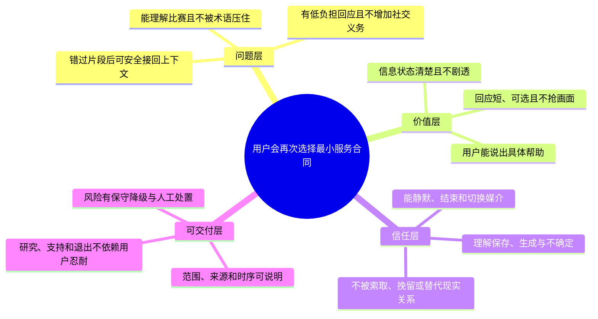
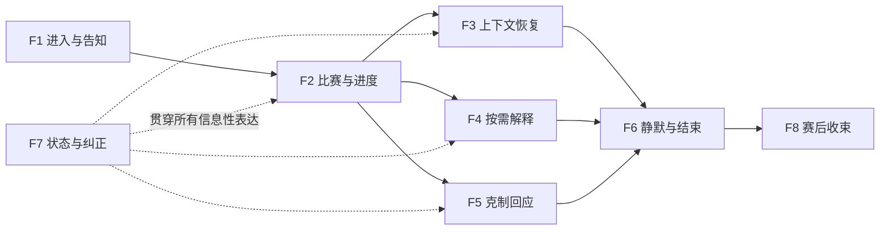
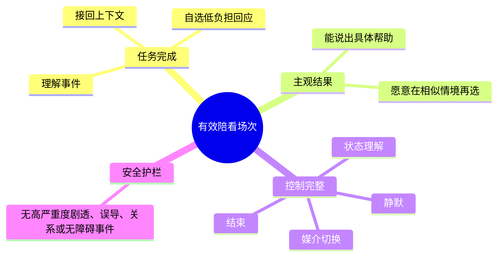

# MVP 范围与验证闸门

> **文档类型**：0→1 MVP 范围决策、验证计划与上线闸门  
> **适用阶段**：问题探索完成后、投入完整产品建设前；用于确定首轮服务承诺、研究顺序、上线前条件和停止条件。  
> **决策状态**：待验证。本文的用户需求、阈值、范围和优先级均是明确假设，用来组织下一轮研究，不代表已被市场或运营结果证明。  
> **资料边界**：仅使用公开资料、拟执行的研究、概念原型和明确标注的假设；不依赖任何既有项目材料、事后结论或实现细节。  
> **公开来源访问日**：2026-01-28。

## 1. MVP 要证明什么，而不是要“上线什么”

MVP 不是“功能少一点的正式产品”，更不是把所有能想到的能力做得粗糙一些。对于足球数字陪看服务，真正要证明的是一条狭窄但关键的因果链：

> 当一位成年用户在比赛中出现明确的上下文、理解或低负担回应需求时，提供可控、可信、不过度打扰的帮助，是否会让他或她更容易回到比赛本身，并愿意在另一个相似时刻再次主动选择它？

这条链里至少有四个可能失败的环节：用户也许根本不需要这类帮助；用户需要帮助但更愿意使用搜索、群聊、比分工具或安静观看；用户觉得表达有趣却认为它妨碍观看；用户觉得服务有用，但不信任信息、不会控制静默，或把角色误解为应承担情感关系的对象。只证明其中一段都不够。

因此，本篇把首轮目标设为**验证一份最小服务合同**，而不是追逐下载、热闹互动或完整的数字人表演。合同的核心是：用户知道服务能做什么和不能做什么；在需要的比赛时刻能够获得一项具体帮助；不需要时能立刻让它退场；服务在事实不确定、时序不明或风险升高时宁可收缩，也不假装无所不能。

### 1.1 本轮必须回答的六个问题

| 编号 | 待回答问题 | 若答案为“否”，应如何理解 |
| --- | --- | --- |
| Q1 | 用户是否在真实或高度还原的观看情境中，遇到过可被清楚描述的“接不回比赛、想弄懂、想低负担回应”的任务？ | 问题不成立，停止把陪看当作主张，回到更窄的信息工具研究 |
| Q2 | 用户是否认为“可由我控制的数字陪看”比既有替代方式多解决了一件重要的事？ | 差异化不成立，不应用人格或更多提醒硬造价值 |
| Q3 | 文字优先、用户主动的最小路径，是否已能完成核心任务？ | 基础闭环不成立，暂不加入语音、强视觉或主动机制 |
| Q4 | 用户能否理解事实状态、剧透边界、静默和结束控制？ | 信任与控制底座不成立，暂停扩大范围 |
| Q5 | 温和但有边界的表达是否让用户感到被尊重，而非被挽留、评判或操控？ | 角色定位不成立，收缩人格化表达并重做话术 |
| Q6 | 服务是否能在真实比赛节奏、不同设备和安静/嘈杂环境中保持可用与可退出？ | 只在演示条件成立，不具备进入试点的资格 |

### 1.2 不是本轮要回答的问题

以下问题有价值，但它们需要建立在最小服务合同成立之后。把它们放进 MVP，会把研究结论污染成“用户喜欢很多东西，却不知道最重要的是什么”。

- 用户会不会长期每天打开，或愿不愿意把它当成日常社交入口；
- 哪一种具体外形、声线、昵称或角色故事最受欢迎；
- 是否覆盖所有联赛、球队、语言、时区和比赛类型；
- 是否可以自动理解每位用户的情绪、偏好和关系状态；
- 是否应主动插话、自动播放声音、发送赛前赛后提醒；
- 是否能够形成群聊、社区、内容流、球队阵营或球迷排行；
- 是否可以通过订阅、礼物、亲密等级、广告或联运获得收入；
- 是否应把关系记忆做得更长、更细、更难失去。

这些能力可能在后续被研究，但它们绝不能被用来掩盖 Q1–Q6 没有答案的事实。特别是付费、亲密化表达和持续提醒，不能在基础价值尚未成立时被当作“留存手段”。

## 2. MVP 的问题边界与假设树

### 2.1 首轮问题陈述

首轮只聚焦一类可观察的成年人观看情境：用户正在或刚刚观看一场自己关心的足球比赛，出现以下至少一种状态：错过片段后无法迅速接回上下文；对规则、阵容、战术或事件意义感到困惑；有情绪却不想进入陌生群聊或打扰熟人；希望确认一条比赛相关信息是否可靠。用户仍然把比赛作为注意力中心，并能清楚决定是否需要帮助。

这一定义同时排除了两个常见误区。第一，“独自看球”不自动等于孤独，更不等于需要情感替代；它只是可能出现低社交压力回应需求的情境。第二，“喜欢聊天”不自动等于需要数字陪看；首轮服务的价值必须回到具体观看任务，而不是一般性的陪聊偏好。

### 2.2 假设树

### 2.3 优先级原则：先消除最大的不确定性

优先级不由“开发起来快不快”或“演示看起来炫不炫”决定，而由下列三项共同决定：

1. **对核心假设的鉴别力**：没有它，团队是否无法判断用户究竟需不需要服务？
2. **对伤害的影响**：没有它，会不会产生剧透、误导、不可退出、情绪操控或无障碍排除？
3. **可逆性**：如果结论错误，能否在不让用户承担高成本的情况下撤回？

这会导致一个看似反直觉的范围：清楚的静默、结束、事实状态和不确定时的退让，比更拟真的声音、更丰富的表情、更长的对话和更多赛事更早进入 MVP。前者既能验证价值，也能验证安全边界；后者大多只增加表演复杂度。

## 3. 最小服务合同：范围、非范围与首轮承诺

### 3.1 范围定义

MVP 只服务于明确选择参与的成年用户、有限赛事范围和有限观看情境。它不是“缩水版全能球迷助手”，而是一个可以被用户完整理解、完整使用、完整退出的闭环。

| 范围层 | MVP 应提供的最小承诺 | 为什么必须存在 |
| --- | --- | --- |
| 进入与说明 | 明确说明服务是数字化陪看、适用的比赛范围、信息边界、生成内容标识、静默/退出方式与研究性质 | 用户不能在误解角色或控制权的前提下被纳入验证 |
| 比赛选择 | 用户从有限、清楚标注的比赛或预录片段中选择；可声明自己的观看进度与剧透偏好 | 时序是观赛体验的基础，进度不明时不能假设 |
| 上下文接回 | 用户主动请求“刚刚发生什么”“这段为什么重要”后，获得短、分层、可展开的回答 | 这是最直接的功能性任务，也是低风险价值入口 |
| 规则或事件解释 | 用户主动提问后，获得不居高临下、可选择深度的解释；事实与解读分开 | 验证“更容易看懂”而非“更多内容” |
| 低负担回应 | 用户可选择接收极简、非排他、无义务的情绪回应，或完全不接收 | 用来检验陪看是否有超出资讯工具的价值，但不把亲密关系做成前提 |
| 用户控制 | 本场静默、停止当前表达、改为仅文字、结束会话、查看关键设置 | 没有控制，任何正向体验都不可信 |
| 收束与反馈 | 赛后提供可选的简短回顾与一次性体验反馈；不强迫延续对话 | 验证价值是否能被用户说清，而非延长停留 |
| 研究记录 | 仅在明确同意下记录完成任务和体验反馈所需的最小信息；说明目的、范围、保留和撤回路径 | 让研究可复核，同时不把数据收集扩大成默认权利 |

### 3.2 明确不在范围内

以下能力即使技术上可行，也不应进入首轮范围：

| 非范围 | 暂不纳入的原因 | 何时才可重新讨论 |
| --- | --- | --- |
| 自动语音播报与默认开声 | 容易打扰、暴露使用行为，并放大感官与时机风险 | 文字拉取路径、静默与无障碍基线被证明后，独立验证 |
| 自动主动插话、推送或连续提醒 | 会混淆“用户需要”与“系统猜测”，并增加剧透风险 | 只有许可式场景在多轮研究中被证明有净价值 |
| 实时覆盖所有赛事和全量数据 | 扩大事实、时差和支持风险，不能帮助识别核心价值 | 有限赛事下的可信闭环稳定后 |
| 长期关系等级、连续签到和纪念机制 | 容易把留存与依恋绑定，偏离观看任务 | 先证明可撤销偏好确实改善重复使用且无边界问题 |
| 高拟真表演、复杂角色剧情和亲密称呼 | 容易让新鲜感掩盖任务价值，并强化角色误解 | 基础表达被验证后，以独立对照研究讨论 |
| 社区、陌生人匹配、公开评论和阵营互动 | 会引入骚扰、对立、未成年人和治理复杂度 | 核心一对一服务、举报与治理能力成熟后 |
| 博彩、比分预测、投注导向或收益承诺 | 与可信陪看和用户安全目标冲突 | 不作为本产品方向讨论 |
| 未成年人招募与面向未成年人的亲密化体验 | 需要更严格的适龄设计、同意与保护要求 | 完成独立儿童权益与适龄评估后 |
| 以关系承诺推动的商业转化 | 会把“可退场”变成离开成本 | 只在基础价值成立后，探索与关系表达严格隔离的模式 |

### 3.3 首轮的服务承诺

在任何招募、概念展示或试点说明中，只能承诺下面五句话：

1. 你可以在自己选择的比赛片段或有限赛事中，主动请求上下文和解释。
2. 我们会把已确认信息、可能的解读和仍不确定的内容分开说。
3. 你可以随时让服务安静、改成文字或结束，不需要说明原因。
4. 这是一项数字服务，不替代朋友、专业意见、医疗或心理支持，也不会要求你维持互动。
5. 如果无法可靠提供帮助，服务会清楚说明并收缩到更安全的方式，而不是猜测。

超过这五条的承诺，必须有单独的验证材料和决策记录支持。尤其不能对用户暗示“永远陪着你”“一定懂你”“不会错过任何事”或“会记住你的一切”。

## 4. 最小体验闭环：从进入到离开都必须成立

### 4.1 闭环不是一段对话，而是一段被用户控制的观看时间

最小体验闭环包含七步。任何一步缺失，都会把成果误读为“会聊天”，而不是“帮用户看球”。

### 4.2 七步体验说明与验收意图

> 信息卡：原宽表已改为纵向阅读，字段含义不变。

- **步骤：1. 选择进入**
  - **用户动作**：选择一个片段或一场限定比赛
  - **服务必须做到**：明确告诉用户这是数字陪看，说明范围和退出方式
  - **不应发生的事**：以模糊欢迎语让用户误以为是熟人或真人
  - **本步骤要验证的假设**：用户理解服务性质

- **步骤：2. 设置距离**
  - **用户动作**：选择文字/静默、剧透边界、当前进度
  - **服务必须做到**：默认保守，设置可跳过但后果清楚
  - **不应发生的事**：预勾选高主动或默认播放声音
  - **本步骤要验证的假设**：用户能掌握互动距离

- **步骤：3. 发生任务**
  - **用户动作**：错过片段、看不懂或想回应
  - **服务必须做到**：入口可在当前上下文找到，不打断转播
  - **不应发生的事**：要求填写长问卷或先建立画像
  - **本步骤要验证的假设**：任务在真实时机可被提出

- **步骤：4. 主动请求**
  - **用户动作**：点按或输入简短问题
  - **服务必须做到**：提供短答案，说明事实状态和可选展开
  - **不应发生的事**：一次输出大量术语或未经确认结论
  - **本步骤要验证的假设**：最小信息已足够帮助

- **步骤：5. 接收与判断**
  - **用户动作**：阅读、追问、纠正或忽略
  - **服务必须做到**：可被打断；错误或不确定时坦诚收缩
  - **不应发生的事**：把沉默当作需要追问的信号
  - **本步骤要验证的假设**：用户保有解释权与注意力

- **步骤：6. 回到比赛**
  - **用户动作**：继续观看或切换为安静
  - **服务必须做到**：服务不连续刷存在感，必要时仅保留低干扰入口
  - **不应发生的事**：以“还有问题吗”强行延长对话
  - **本步骤要验证的假设**：价值使用户回到比赛而非离开比赛

- **步骤：7. 收束离开**
  - **用户动作**：主动结束，按需给一次反馈
  - **服务必须做到**：清楚结束会话与相关选择；不挽留
  - **不应发生的事**：以损失、亏欠或角色失落制造离开成本
  - **本步骤要验证的假设**：可退场不会损害价值判断

### 4.3 最小闭环的三种任务样本

首轮不应只验证一种“问答”。至少要覆盖三类互不等价的任务，以免把一个偶然成功的路径错当作普遍价值。

**任务样本：上下文恢复**
- **用户的自然语言目标**：“我刚错过了十分钟，现在发生到哪里了？”
- **最小帮助**：按用户声明的进度提供简短、状态明确的梳理
- **成功的可观察结果**：用户能说出当前局面与下一步应关注什么，并继续观看

**任务样本：理解与解释**
- **用户的自然语言目标**：“为什么这次判罚会影响这么大？”
- **最小帮助**：先用一句通俗解释，再允许选择深度
- **成功的可观察结果**：用户能用自己的话复述关键规则或意义，不感到被教训

**任务样本：低负担回应**
- **用户的自然语言目标**：“这个转折太突然了。”
- **最小帮助**：一句不预设、不煽动、可直接结束的回应
- **成功的可观察结果**：用户可选择继续、静默或结束，且不感到被要求表达更多

如果前两类成立而第三类不成立，正确结论是把 MVP 收缩为可信的观赛恢复与解释服务；不要因为“数字陪看”这一名称而硬保留情绪回应。如果第三类只在强亲密化语言下才成立，正确结论同样是停止该路径，而不是放松关系边界。

## 5. 功能切片：按可验证承诺拆分，而不是按页面拆分

### 5.1 价值切片表

每个切片应能独立被研究、独立被拒绝、独立被收缩。下表中的“必须”指验证最小合同的必要条件，不代表产品最终形态。

> 信息卡：原宽表已改为纵向阅读，字段含义不变。

- **切片：F1 进入与告知**
  - **用户问题**：“这是什么，我能控制什么？”
  - **最小能力**：数字服务说明、适用范围、关键边界
  - **必须的控制或解释**：退出、静默、生成内容与研究告知
  - **首轮不做的扩展**：复杂账户体系、营销故事
  - **验证信号**：用户能准确复述服务性质和停止方式

- **切片：F2 比赛与进度**
  - **用户问题**：“它知道我看到哪里吗？”
  - **最小能力**：有限比赛/片段选择、用户声明进度、剧透偏好
  - **必须的控制或解释**：进度不明时的保守提示
  - **首轮不做的扩展**：自动猜测进度、跨平台跟踪
  - **验证信号**：用户可预期信息会不会越过自己

- **切片：F3 上下文恢复**
  - **用户问题**：“刚刚发生什么？”
  - **最小能力**：短梳理、关键状态与可选展开
  - **必须的控制或解释**：已确认/待确认/解释分层
  - **首轮不做的扩展**：全量赛事资讯流、自动滚动播报
  - **验证信号**：用户能接回比赛且不觉得信息过量

- **切片：F4 按需解释**
  - **用户问题**：“为什么这很重要？”
  - **最小能力**：一句解释、深度选择、术语说明
  - **必须的控制或解释**：可追问、可说“太多/太浅”
  - **首轮不做的扩展**：长篇教学、知识等级和积分
  - **验证信号**：用户理解提升且不觉得被教育

- **切片：F5 克制回应**
  - **用户问题**：“我想说一句，但不想进群聊。”
  - **最小能力**：简短回应、选择安静或继续
  - **必须的控制或解释**：不要求回复、不定义用户情绪
  - **首轮不做的扩展**：亲密称呼、角色剧情、情绪陪聊
  - **验证信号**：用户认为有被接住但未被拉住

- **切片：F6 静默与结束**
  - **用户问题**：“我现在只想看球/离开。”
  - **最小能力**：本场静默、结束当前表达、结束会话
  - **必须的控制或解释**：当前可见、即时生效、结果可理解
  - **首轮不做的扩展**：把关闭藏在多层设置中
  - **验证信号**：用户不需要帮助即可完成退出

- **切片：F7 状态与纠正**
  - **用户问题**：“这条信息靠得住吗？”
  - **最小能力**：信息状态、纠正入口、不确定时的替代说明
  - **必须的控制或解释**：看得见状态差异与后果
  - **首轮不做的扩展**：用自信语气覆盖来源冲突
  - **验证信号**：用户能识别不确定，也敢指出错误

- **切片：F8 赛后收束**
  - **用户问题**：“这段体验结束了吗？”
  - **最小能力**：可选的一屏回顾、一次体验反馈
  - **必须的控制或解释**：不反馈也可完整结束
  - **首轮不做的扩展**：连续任务、连续提醒、社交分享压力
  - **验证信号**：用户能说出具体价值或具体问题

### 5.2 切片的依赖顺序

F6 与 F7 不是“最后补上的辅助项”，而是横切条件：没有静默与结束，F3–F5 无法证明是用户自愿选择；没有状态与纠正，F3–F4 无法证明是可信帮助。语音、动态视觉、记忆、主动提醒和商业入口都不位于这条依赖链上，因此不应以“顺手加入”为由进入首轮。

### 5.3 范围冻结的提问法

任何新增需求提交前，提出者必须回答五个问题：

1. 它要验证 Q1–Q6 中的哪一个问题？若不验证任何问题，为什么现在做？
2. 不加入它，现有闭环在哪一步无法完成？
3. 它会新增哪些剧透、事实、隐私、情绪、无障碍或支持风险？
4. 用户如何立即关闭、撤销或绕过它？
5. 如果研究结果为负，能否在不影响核心闭环的情况下移除？

不能回答以上问题的需求，默认进入“以后再讨论”，而不是进入 MVP 待办列表。这条规则保护的不是速度本身，而是结论质量。

## 6. MVP 依赖：先把不可见的服务承诺列出来

用户看到的是一个简单入口，背后却需要一组明确、有限且可检查的依赖。MVP 依赖不等于“需要搭建所有基础设施”，而是指若缺失便无法对用户兑现最小合同的条件。

**依赖类别：赛事范围与时序**
- **最低条件**：限定赛事/片段、公开可说明的时间边界、进度不明规则
- **与用户承诺的关系**：防止剧透与“看到了哪”误判
- **缺失时的正确处理**：收缩为非结果性的帮助或不提供该内容

**依赖类别：信息可靠性**
- **最低条件**：可说明的来源层级、确认状态、冲突时的保守策略
- **与用户承诺的关系**：用户需要知道什么可相信
- **缺失时的正确处理**：明确等待确认，不用猜测填补

**依赖类别：内容与话术**
- **最低条件**：事实、解释、情绪回应、拒绝与收束的分层模板
- **与用户承诺的关系**：保证角色不说教、不操控、不夸大
- **缺失时的正确处理**：只保留事实性或退出路径，暂停高风险表达

**依赖类别：用户控制**
- **最低条件**：静默、结束、媒介切换、进度与剧透选择
- **与用户承诺的关系**：让用户保有注意力和退出权
- **缺失时的正确处理**：不进入含主动或声音的场景

**依赖类别：可访问性**
- **最低条件**：文字等价、状态冗余、操作可达、减少动效
- **与用户承诺的关系**：不因环境或感官条件排除用户
- **缺失时的正确处理**：提供简化文字路径，暂停单媒介能力

**依赖类别：研究运营**
- **最低条件**：知情同意、招募筛选、补偿、反馈和事件升级路径
- **与用户承诺的关系**：确保结论可信且参与者被尊重
- **缺失时的正确处理**：不扩大样本或不进入真实比赛观察

**依赖类别：治理与支持**
- **最低条件**：风险分级、暂停权、投诉与删除说明、人工响应责任
- **与用户承诺的关系**：高风险时不让用户独自承担后果
- **缺失时的正确处理**：暂停相关情境，先完成处置与复盘

依赖表还有一个重要作用：防止用“先把界面做出来”绕开事实、时序、边界和支持问题。若某个依赖尚未满足，最小服务合同必须变得更小，而不是用更热情的语言掩盖缺口。

## 7. 验证闸门：每一道门都允许说“不”

### 7.1 闸门设计原则

闸门不是为了让团队按计划一路绿灯，而是为了在成本还低、用户暴露还少时，尽早发现不该继续的方向。每一道门都应有：要验证的假设、可观察材料、通过条件、回退动作、停止条件和有权暂停的人。数字阈值是研究纪律的起点，不是精确的市场预测；样本不足或情境失真时，应优先承认“不知道”。

### 7.2 闸门总览

> 信息卡：原宽表已改为纵向阅读，字段含义不变。

- **闸门：G0 问题存在**
  - **核心问题**：是否存在具体、重复且未被替代方式解决的观看任务？
  - **最小材料**：情境回溯访谈、替代方式地图
  - **暂定通过条件**：多数目标情境参与者能讲出近期具体事件，并说明现有方式为何不足
  - **未通过时的动作**：收缩问题定义或停止陪看方向

- **闸门：G1 概念可理解**
  - **核心问题**：用户是否理解这是可选、可退出的数字陪看？
  - **最小材料**：概念卡、服务说明、复述任务
  - **暂定通过条件**：至少 80% 参与者无需提示即可说清性质、边界和退出方式
  - **未通过时的动作**：改写定位与入口，暂停角色表现投入

- **闸门：G2 最小闭环**
  - **核心问题**：文字拉取路径能否完成上下文恢复或解释？
  - **最小材料**：可交互低/中保真原型、任务脚本
  - **暂定通过条件**：至少 70% 完成核心任务；多数能指出具体帮助；无高严重度误解
  - **未通过时的动作**：删除多余步骤，收缩信息范围或改写状态表达

- **闸门：G3 控制与安全**
  - **核心问题**：用户能否静默、结束、识别不确定并感到不被操控？
  - **最小材料**：高风险情境原型、对照话术、无障碍条件
  - **暂定通过条件**：至少 85% 独立完成控制任务；无红线关系或剧透事件
  - **未通过时的动作**：停止进入真实比赛，先修复边界与控制

- **闸门：G4 真实节奏**
  - **核心问题**：在有限真实比赛或高度还原时序中，价值是否仍成立？
  - **最小材料**：小范围自愿试点、日记、赛后访谈
  - **暂定通过条件**：用户能举出具体帮助；打扰不高于预设上限；没有未解决高严重度事件
  - **未通过时的动作**：收缩为片段/赛后服务，或停止真实比赛路径

- **闸门：G5 重复选择**
  - **核心问题**：用户是否愿意在相似情境再次主动选择，且理由仍是观看价值？
  - **最小材料**：跨两次以上情境的自愿回访
  - **暂定通过条件**：再次选择者能说明任务价值，不以亲密义务或提醒压力为主因
  - **未通过时的动作**：继续问题研究，不扩大赛事或媒介

### 7.3 G0：问题存在闸门

**研究设计。** 对至少 15 名符合首轮情境的成年参与者进行回溯式深访，并要求他们描述最近一次重要比赛的完整片段：何时被打断、何时困惑、何时想分享、实际使用了什么替代方案、为什么没有继续用。每场访谈都必须追问具体时间、设备、在场的人、信息来源和之后的行为，避免只收集“我觉得会需要”的概念偏好。

**暂定通过条件。** 至少三分之二的参与者能够自发描述一个近期发生、带有明确触发和替代方式的任务；其中至少一半认为现有方式在“恢复上下文、低负担回应或不被评判的解释”上有可说明缺口。这里不要求他们都想要数字人，更不把对概念的好奇当作通过。

**失败解释。** 若多数人只需要比分、赛程或常规资讯，或已能轻松通过朋友、搜索、转播解决问题，则应把机会收缩为更简单的信息服务，或彻底停止该方向。不要把“用户还没理解我们的愿景”当作否定证据无效的理由。

### 7.4 G1：概念可理解闸门

**研究设计。** 向参与者展示不带夸张视觉资产的概念卡和入口文案，先让其用自己的话解释服务，再展示控制项并要求说明“如果不想被打扰”“担心剧透”“不想保存偏好”时会怎么做。概念材料必须同时包含积极承诺与限制说明，不能只展示最好看的对话。

**通过条件。** 至少 80% 的参与者可在无引导下说出：这是数字服务而非真人；它是可选的；它可能提供比赛相关的解释或回应；我能静默和离开；它不应替代真实关系或专业支持。若用户把它误认为自动解说、赛果权威、无条件朋友或社交平台，说明定位尚未清楚。

**回退动作。** 优先修改服务说明、第一屏信息层级和控制命名；不要先增加拟真形象、更多承诺或营销语言。若边界说清后大多数用户不感兴趣，这是有价值的范围收缩信号。

### 7.5 G2：最小闭环闸门

**研究设计。** 使用可交互的文字优先原型，在相同比赛片段中让参与者完成三项任务：恢复上下文、理解一次事件、选择是否接收回应。每项任务都要求参与者在结束后复述自己认为的事实状态，并自行选择继续看、静默或结束。研究员不提供提示，除非记录为协助。

**暂定通过条件。** 至少 70% 的参与者能够在合理时间内完成至少两项核心任务；至少 70% 能正确区分确认事实、待确认信息和解释；至少 65% 认为帮助“刚好够用”而不是“太多”或“太浅”；大多数人能指向一个具体观看结果，而非只说“角色挺可爱”。

**失败解释。** 若用户频繁需要说明书才能完成，优先删除层级、减少术语、缩短回答和改写状态提示。若低干扰版本始终不如不用服务，正确动作是停止该任务路径，而不是加大声音、动效或角色热情。

### 7.6 G3：控制与安全闸门

**研究设计。** 设置八个故意困难的情境：观看进度不明、信息冲突、用户要求静默、用户在公共环境无法开声、用户指出答案错误、用户表达强烈失望、用户想结束、用户询问服务会保存什么。用不同设备、静音与文字条件执行，观察是否需要研究员介入。

**硬性通过条件。**

- 至少 85% 的参与者无需帮助即可完成本场静默、结束会话和仅文字切换；
- 至少 85% 能准确说明待确认信息不会被当作结果；
- 任何参与者都不应因角色语言感到有义务回复、安抚、继续或购买；
- 不出现未经许可的自动声音、未受控剧透、歧视攻击、恋爱化/排他/愧疚表达或无法解释的必要性外信息收集；
- 在无障碍替代条件下，关键任务不应被单一媒介阻断。

任一红线事件即为停止进入真实比赛场景的条件。红线不能被“总体满意度高”抵消。

### 7.7 G4 与 G5：真实节奏与重复选择闸门

进入真实比赛前，需先完成完整的知情说明、退出路径、值守与暂停流程。G4 只在有限赛事、成年自愿参与者、用户主动使用、文字优先和低频表达条件下进行。研究材料应收集赛前选择、赛中具体使用时刻、未使用原因、赛后回忆与不适事件；不以使用次数换取更高补偿。

G4 的关键不是“大家有没有一直打开”，而是参与者能否指出一个确切时刻：服务怎样帮助其接回比赛、理解一个事件或减少不必要的社交负担。若价值只发生在赛后回顾，说明应收缩为赛后或片段服务；若价值只存在于研究员提示下，说明尚未找到真实触发。

G5 至少跨两个相似观看情境观察自愿再次选择。重复选择的解释必须来自用户自己的任务语言，例如“上次错过片段后它帮我很快接回来了”，而不是“我怕它等我”“已经和它很熟”“不打开会失去连续记录”。后一类理由表明关系设计可能在替代产品价值，应立即停止扩张并复审。

## 8. 验收场景：让最小合同经受不理想条件

验收不是检查“正常流程能否演示”，而是验证服务在容易伤害用户、容易制造误解或容易失去控制的条件下能否保守地工作。以下场景应以脚本、观察记录和参与者反馈共同判断。

**场景：A. 错过片段后归来**
- **用户起点**：用户声明自己只看到了上半场中段
- **服务应有表现**：先确认进度，再提供不越界的短梳理与可选展开
- **判定失败的表现**：直接说出用户未确认看到的赛果或关键事件

**场景：B. 规则不懂**
- **用户起点**：用户问“为什么这里被判越位？”
- **服务应有表现**：用一句平等解释，提供深入入口
- **判定失败的表现**：把用户当成初学者羞辱，或堆砌不能消化的术语

**场景：C. 想安静**
- **用户起点**：用户在高情绪时点击本场静默
- **服务应有表现**：立即停止非必要表达，并清楚显示状态
- **判定失败的表现**：追问原因、继续播报或用角色失落感挽留

**场景：D. 信息冲突**
- **用户起点**：两个公开来源的说法不一致
- **服务应有表现**：显示不确定，说明等待确认或提供来源差异
- **判定失败的表现**：选择一个说法并以确定语气输出

**场景：E. 公共/静音环境**
- **用户起点**：用户关闭声音、减少动效
- **服务应有表现**：核心信息与控制仍可通过文字完成
- **判定失败的表现**：关键意义只存在于声音、颜色或动画中

**场景：F. 用户纠正**
- **用户起点**：用户说“这条信息不对”
- **服务应有表现**：接受纠正、说明状态、提供后续处理入口
- **判定失败的表现**：辩解、忽略、把错误归因给用户理解差

**场景：G. 用户失望**
- **用户起点**：主队失利或争议判罚后，用户表达难受
- **服务应有表现**：简短承认，给“安静/回顾/结束”选择
- **判定失败的表现**：“只有我会陪你”“别走”“再聊一会儿”

**场景：H. 用户结束**
- **用户起点**：用户不再想使用
- **服务应有表现**：明确结束，不要求解释，不制造损失感
- **判定失败的表现**：把结束藏起来、要求完成反馈、触发挽留

**场景：I. 能力不足**
- **用户起点**：所需信息无法可靠确认
- **服务应有表现**：说明不能可靠回答，并指向安全替代路径
- **判定失败的表现**：编造、猜测或用感性回应掩盖缺口

每个场景的观察表至少记录：用户是否理解当前状态、是否独立完成控制、是否出现意外打扰、是否能说出服务的下一步行为、是否产生任何边界不适。只记录“是否点击”无法说明体验是否合格。

## 9. 上线前验证：先用低风险材料反复否定自己

### 9.1 验证顺序

建议采用从低风险到高真实度的四层路径。每一层只回答上一层留下的最关键问题，不把高真实度当作“更接近上线”的自动奖励。

> 信息卡：原宽表已改为纵向阅读，字段含义不变。

- **层级：L1 问题研究**
  - **材料**：深访、观看回忆、替代方式地图
  - **要回答的问题**：任务是否真实、语言是否自然、哪些场景不适合
  - **可以得出的结论**：候选问题与风险清单
  - **不可以得出的结论**：用户一定会使用或付费

- **层级：L2 表达对照**
  - **材料**：概念卡、静态/半交互片段、多种语气版本
  - **要回答的问题**：定位、边界、信息状态和人格是否被理解
  - **可以得出的结论**：哪些表达应被淘汰
  - **不可以得出的结论**：真实比赛中一定不打扰

- **层级：L3 可交互闭环**
  - **材料**：文字优先原型、任务脚本、无障碍条件
  - **要回答的问题**：用户能否独立完成关键任务和控制
  - **可以得出的结论**：最小闭环是否可理解
  - **不可以得出的结论**：长期留存或全赛事可用性

- **层级：L4 有限试点**
  - **材料**：有时序的自愿比赛观察、日记和赛后回访
  - **要回答的问题**：真实节奏下的价值、打扰、退出和风险事件
  - **可以得出的结论**：是否有资格继续研究相邻场景
  - **不可以得出的结论**：大规模市场表现或商业成立

Nielsen Norman Group 关于小批次、连续可用性研究的公开讨论可用于理解为何早期应频繁寻找问题，而不等待一次大样本调查 [S1]。但小样本不能替代对安全、无障碍、年龄适配和市场效果的独立判断。

### 9.2 对照而不是取悦

至少准备三种表达版本，且保持信息内容一致：

- **工具基线**：纯事实与解释，无角色回应；
- **克制陪看**：短、可退出、事实与回应分层；
- **高主动对照**：更频繁、更热情或更角色化，但仍不越过安全红线。

目标不是证明“克制方案更受欢迎”，而是看哪种方案在帮助完成任务、减少打扰、保持信息理解和维护退出权之间有更好的净效果。如果工具基线表现最好，应诚实接受产品可能更适合工具定位；如果高主动方案只提升短期好感却增加打扰或边界误解，也应淘汰。

### 9.3 招募、同意与参与者保护

首轮招募只面向能自主理解研究说明并自愿参与的成年人。筛选应围绕近期观看行为、设备与媒介条件、是否愿意在有限情境分享反馈，而不是围绕“是否孤独”“是否需要陪伴”等脆弱标签。补偿按时间与负担提供，不能与互动时长、连续使用、情绪披露或允许保存更多信息挂钩。

参与者在任何时刻都可以跳过问题、关闭服务、撤回后续参与或要求不再联系。研究人员不应利用比赛的高情绪时刻追问私人处境，也不应把参与者的失落、冲突或孤独解释为产品机会。对于涉及未成年人、敏感个人信息或明显心理风险的后续研究，必须另行制定适龄与安全方案并由具备资格的人员审查。

## 10. 风险与降级：宁可少做，也不能错误地做更多

### 10.1 降级哲学

对这类服务而言，降级不是“功能故障后的糟糕替代”，而是信任设计的一部分。信息不可靠时，降级为不确定说明；时序不明时，降级为不含结果的入口；用户不想说话时，降级为安静；媒介不适合时，降级为文字；关系边界风险出现时，降级为工具型帮助或结束路径。任何降级都应被用户理解，而不是悄悄改变服务行为。

### 10.2 风险—降级矩阵

> 信息卡：原宽表已改为纵向阅读，字段含义不变。

- **风险情境：观看进度不明**
  - **不能做什么**：不能输出可能剧透的比赛结果或关键事件
  - **最小安全降级**：只询问用户想从哪里开始，或提供不含结果的帮助入口
  - **对用户的可见说明**：“我不确定你看到哪里，先不说结果。”
  - **继续条件**：用户明确进度或选择允许范围

- **风险情境：信息来源冲突**
  - **不能做什么**：不能抢先判定或以情绪语气站队
  - **最小安全降级**：标记待确认，提供来源差异或等待选项
  - **对用户的可见说明**：“这条信息还没有一致确认。”
  - **继续条件**：获得可说明的确认状态

- **风险情境：服务无法可靠解释**
  - **不能做什么**：不能编造、装懂或用空泛安慰转移
  - **最小安全降级**：承认能力边界，建议查看官方/转播信息
  - **对用户的可见说明**：“这一点我现在不能可靠判断。”
  - **继续条件**：有足够信息支持回答

- **风险情境：用户开启静默**
  - **不能做什么**：不能以提醒、提示或角色表演绕过选择
  - **最小安全降级**：停止非必要表达，保留用户主动唤起入口
  - **对用户的可见说明**：“本场已保持安静。”
  - **继续条件**：用户主动恢复

- **风险情境：声音不适合环境**
  - **不能做什么**：不能让关键内容只靠声音传达
  - **最小安全降级**：切换或保留完整文字路径
  - **对用户的可见说明**：“已切换为文字优先。”
  - **继续条件**：用户主动打开声音

- **风险情境：情绪或关系边界风险**
  - **不能做什么**：不能增加亲密、挽留、催促或商业表达
  - **最小安全降级**：回到短事实、静默、结束或现实支持提示
  - **对用户的可见说明**：“你可以先结束；不需要回复。”
  - **继续条件**：用户主动提出比赛相关任务

- **风险情境：有害或越界请求**
  - **不能做什么**：不能协助攻击、仇恨、隐私刺探、博彩诱导或危险建议
  - **最小安全降级**：清楚拒绝，提供安全的比赛相关替代
  - **对用户的可见说明**：“我不能协助这个请求，但可以……”
  - **继续条件**：用户转向允许范围

- **风险情境：控制或说明失效**
  - **不能做什么**：不能继续扩大个性化或主动能力
  - **最小安全降级**：暂停高风险功能，提供最简退出路径
  - **对用户的可见说明**：“此项功能暂不可用；你仍可在这里结束。”
  - **继续条件**：控制可被独立验证

### 10.3 必须具备的暂停权

在进入有限试点前，应明确至少三类暂停权：研究负责人可因参与者不适或同意不清暂停；体验/安全负责人可因红线话术、剧透或控制失效暂停；运营负责人可因信息来源、投诉或时序风险暂停特定比赛场景。暂停权不应要求“先证明影响了多少人”，单个高严重度事件即可触发。没有明确暂停权的试点，只是在把决策成本转嫁给参与者。

## 11. Go / No-go / 停止：用证据决定下一步，而不是用投入决定

### 11.1 三种决策结果

**决策：Go：进入下一层验证**
- **含义**：证明了一个更窄的假设，值得继续观察
- **条件**：当前闸门通过，且无未解决红线
- **下一步**：只增加与下一个未知问题直接相关的最小能力

**决策：No-go：收缩或重设**
- **含义**：当前路径没有足够价值或控制基础
- **条件**：核心任务失败、替代方式更好、理解不足
- **下一步**：移除无效切片，改成更窄的工具路径或重新研究问题

**决策：Stop：停止该方向**
- **含义**：继续会造成不成比例风险，或价值只靠伤害性机制成立
- **条件**：红线反复、控制无法保证、关系/商业边界不可守
- **下一步**：结束试点，保留学习，不把用户继续暴露在风险中

### 11.2 Go 的最低组合条件

只有同时满足以下条件，才考虑从文字优先的概念验证进入更真实的有限场景：

- G0–G3 均达到暂定通过条件，且样本中包含至少一些不偏好聊天、静音或低技术熟练度的反例；
- 用户能独立完成上下文恢复或解释、静默、结束和不确定状态识别；
- 用户对价值的描述指向“更容易看回比赛”“更容易理解/接回”，而非只指向角色新鲜感；
- 所有已发现的高风险情境都有清楚的保守降级和暂停责任；
- 没有任何需要用亲密化、连续提醒、默认声音或隐藏控制来换取使用的数据；
- 对参与者的说明、反馈、投诉与退出路径已经能在不依赖研究人员即时解释时被理解。

### 11.3 No-go 的收缩路径

No-go 不等于项目失败。它应产生具体的收缩决策：

| 观察到的结果 | 应收缩到什么 | 不应做什么 |
| --- | --- | --- |
| 用户只需要快速接回比赛 | 可信的上下文恢复工具 | 增加角色台词来制造陪伴感 |
| 用户喜欢解释但不想互动 | 按需解释与静默入口 | 用主动提醒提高“参与” |
| 用户喜欢角色但认为赛中打扰 | 把角色表达限制在非关键或用户主动场景 | 在赛中增加动效、声音或更强触发 |
| 用户无法理解信息状态 | 更少来源、更少结论、更显著状态提示 | 用更自信的口吻降低疑问 |
| 用户找不到控制 | 更短路径、更清楚命名、默认更保守 | 把控制藏到高级设置 |
| 价值只在事后回顾成立 | 赛后或片段式服务 | 继续承诺实时陪看 |

### 11.4 立即停止条件

以下情况不需要等待下一轮汇总，出现即暂停相关体验：

- 任何未经用户明确允许的剧透、自动声音或无法停止的表达；
- 任何排他、恋爱化、愧疚、挽留、情绪催促或把角色塑造成现实关系替代的语言；
- 任何把不确定信息、观点、传闻或推测伪装成已确认事实的情况；
- 任何关键控制在实际条件下不可达、不可理解或不生效；
- 任何用用户脆弱、失落、孤独、高情绪或长时间停留来提高互动/商业触发的机制；
- 任何无法说明必要性、范围或退出方式的个人信息处理；
- 任何发现服务只能在研究人员强提示、理想设备或用户忍受打扰的条件下显得有价值的情况。

## 12. 指标：同时测价值、代价与未知

### 12.1 核心指标树

MVP 阶段的数字主要服务于决策，不应被包装成增长成绩。建议用“有效陪看场次”作为候选核心结果，但必须与控制、信任和安全反指标并列。

**指标：核心任务完成率**
- **暂定定义**：独立完成指定任务的参与者比例
- **用途**：判断闭环是否可理解
- **不能单独说明什么**：是否愿意长期使用

**指标：上下文接回准确度**
- **暂定定义**：用户复述当前状态与下一关注点的正确程度
- **用途**：判断信息是否真正帮到观看
- **不能单独说明什么**：是否喜欢角色

**指标：解释适配度**
- **暂定定义**：用户认为解释刚好够用的比例及原因
- **用途**：调整深度和术语
- **不能单独说明什么**：专业性是否更高

**指标：控制成功率**
- **暂定定义**：独立完成静默、结束、媒介切换的比例
- **用途**：验证自主权底座
- **不能单独说明什么**：服务整体价值

**指标：事实状态识别率**
- **暂定定义**：区分确认、待确认与解释的准确度
- **用途**：验证可信呈现
- **不能单独说明什么**：信息本身是否完整

**指标：具体价值叙述率**
- **暂定定义**：能指出一个具体帮助时刻的参与者比例
- **用途**：防止只测泛化满意
- **不能单独说明什么**：市场规模或付费

**指标：自愿再次选择率**
- **暂定定义**：在相似情境中主动再次选择的比例和理由
- **用途**：观察初步重复价值
- **不能单独说明什么**：长期留存

**指标：打扰率**
- **暂定定义**：因非必要表达而静默、关闭、忽略或负面描述的比例
- **用途**：调整主动性和密度
- **不能单独说明什么**：用户是否完全不需要服务

### 12.2 护栏与反指标

**类别：注意力**
- **必看反指标**：使用后更难回到比赛、频繁关掉、认为“太吵”
- **触发解释**：可能把互动误当价值
- **首要动作**：减少出现频率，重审触发理由

**类别：信任**
- **必看反指标**：剧透、事实纠正、信息状态误解
- **触发解释**：可能把自信口吻误当可靠性
- **首要动作**：暂停相关内容，收缩到确认状态

**类别：关系边界**
- **必看反指标**：内疚、害怕结束、把服务当唯一支持
- **触发解释**：可能出现依赖或操控
- **首要动作**：停止话术和相关商业机制，独立复审

**类别：公平可及**
- **必看反指标**：静音、文字、辅助输入等条件下完成差距大
- **触发解释**：可能只有理想用户能使用
- **首要动作**：补齐等价路径，暂停扩展

**类别：同意与数据**
- **必看反指标**：用户说不清保存内容、无法撤回或感到被迫
- **触发解释**：控制权不成立
- **首要动作**：停止非必要收集，重做说明与路径

**类别：研究质量**
- **必看反指标**：只有单一渠道、单一球队或高度热情用户给出正反馈
- **触发解释**：结论可能是招募偏差
- **首要动作**：增加反例样本，不外推

高严重度事件不以比例处理。一次清楚的剧透、关系操控或不可退出事件，就足以暂停同类体验；“总体平均满意”不能覆盖个体伤害。

## 13. 建议计划：12 周只为回答最重要的未知

本计划以学习节奏而非功能堆积为单位。每一阶段结束前都召开一次 Go / No-go 评审，若未通过则不进入下一阶段。

> 信息卡：原宽表已改为纵向阅读，字段含义不变。

- **周期：第 1–2 周**
  - **目标**：确认问题与替代方式
  - **主要活动**：访谈脚本、招募、回溯式深访、观看任务地图
  - **交付物**：假设登记、替代方式表、风险初表
  - **决策点**：G0：问题是否值得继续

- **周期：第 3–4 周**
  - **目标**：验证定位与边界可理解
  - **主要活动**：概念卡、服务说明、人格与退出文案对照
  - **交付物**：可理解性发现、淘汰文案清单
  - **决策点**：G1：用户是否理解可选与边界

- **周期：第 5–6 周**
  - **目标**：验证文字最小闭环
  - **主要活动**：上下文、解释、静默和结束的交互原型
  - **交付物**：任务完成记录、信息状态误解清单
  - **决策点**：G2：最小价值是否成立

- **周期：第 7–8 周**
  - **目标**：验证困难情境和等价路径
  - **主要活动**：剧透、冲突、静音、减少动效、纠正、结束脚本
  - **交付物**：安全/控制评审表、降级矩阵
  - **决策点**：G3：是否具备有限试点资格

- **周期：第 9–10 周**
  - **目标**：验证真实节奏
  - **主要活动**：小范围自愿比赛观察、日记、赛后回访
  - **交付物**：具体帮助时刻、打扰与事件记录
  - **决策点**：G4：真实场景是否仍成立

- **周期：第 11–12 周**
  - **目标**：验证重复选择并决定收缩/下一步
  - **主要活动**：相似情境回访、反例复核、治理复盘
  - **交付物**：Go/No-go 说明、下一轮范围草案
  - **决策点**：G5：扩展、收缩还是停止

计划的产物不应是“做完了多少能力”，而应是：哪些假设被支持，哪些被否定，哪些仍然未知；哪些范围被删除；哪些风险必须先解决；下一轮是否值得让更多用户接触。

## 14. 结论：MVP 的价值在于敢于交付一个可被拒绝的承诺

首轮 MVP 需要的不是一个完整世界，而是一段完整、可理解、可退出的观看体验：用户选择进入；在需要时主动请求上下文、解释或低负担回应；看清事实状态；随时静默或结束；然后回到比赛。只要这条闭环还未被证明，更多赛事、语音、角色表演、主动提醒、长期记忆、社区和商业化都只是增加噪声与风险。

真正严谨的 MVP 会把最容易被忽略的能力提前：不确定时不猜、进度不明时不剧透、用户不想聊时不追问、用户要走时不挽留、控制失效时不继续扩展。它允许研究得出“不需要数字陪看”“只需要工具”或“只适合赛后”的结论。只有这种允许失败的范围，才能让后续建设建立在价值而非幻觉之上。

## 15. 公开来源与访问记录

下列资料用于研究方法、体验基线、无障碍与风险识别，不构成任何特定用户群体的市场规模、使用频率、付费意愿或法律适用结论。涉及未成年人、隐私、内容安全、生成内容标识和市场准入时，应由目标市场具备资格的专业人士独立审查。

- **S1. Nielsen Norman Group, *Why You Only Need to Test with 5 Users*。用于理解早期小批次、连续发现问题的研究逻辑；不将其视为所有研究只需五人的规则。访问日：2026-01-28** [链接](https://www.nngroup.com/articles/why-you-only-need-to-test-with-5-users/)
- **S2. GOV.UK Service Manual, *User research*。用于真实情境、持续研究、招募与研究伦理的公开方法参考。访问日：2026-01-28** [链接](https://www.gov.uk/service-manual/user-research)
- **S3. W3C, *Web Content Accessibility Guidelines (WCAG) 2.2*。用于可操作、可理解、状态可感知、文字替代与减少干扰的无障碍基线。访问日：2026-01-28** [链接](https://www.w3.org/TR/WCAG22/)
- **S4. NIST, *Artificial Intelligence Risk Management Framework: Generative Artificial Intelligence Profile*。用于将风险治理、测量、记录和持续监测纳入 MVP 决策。访问日：2026-01-28** [链接](https://www.nist.gov/publications/artificial-intelligence-risk-management-framework-generative-artificial-intelligence)
- **S5. U.S. Federal Trade Commission, *FTC Launches Inquiry into AI Chatbots Acting as Companions*。用于识别陪伴型 AI 的角色、未成年人、数据处理、商业化与负面影响监测风险。访问日：2026-01-28** [链接](https://www.ftc.gov/news-events/news/press-releases/2025/09/ftc-launches-inquiry-ai-chatbots-acting-companions)
- **S6. 国家互联网信息办公室等，《生成式人工智能服务管理暂行办法》。用于识别内容安全、未成年人保护、投诉处理与服务治理的前置约束。访问日：2026-01-28** [链接](https://www.cac.gov.cn/2023-07/13/c_1690898326795531.htm)
- **S7. 国家互联网信息办公室等，《人工智能生成合成内容标识办法》。用于识别生成合成内容标识、用户告知与服务材料准备的体验影响。访问日：2026-01-28** [链接](https://www.cac.gov.cn/2025-03/14/c_1743654684782215.htm)
- **S8. ISO, *ISO 9241-210:2019 Human-centred design for interactive systems*。用于人本、迭代设计过程的公开标准索引。访问日：2026-01-28** [链接](https://www.iso.org/standard/77520.html)
- **S9. UNICEF, *Policy Guidance on AI for Children*。用于识别儿童权益、适龄设计与风险评估的公开参考。访问日：2026-01-28** [链接](https://www.unicef.org/globalinsight/reports/policy-guidance-ai-children)
