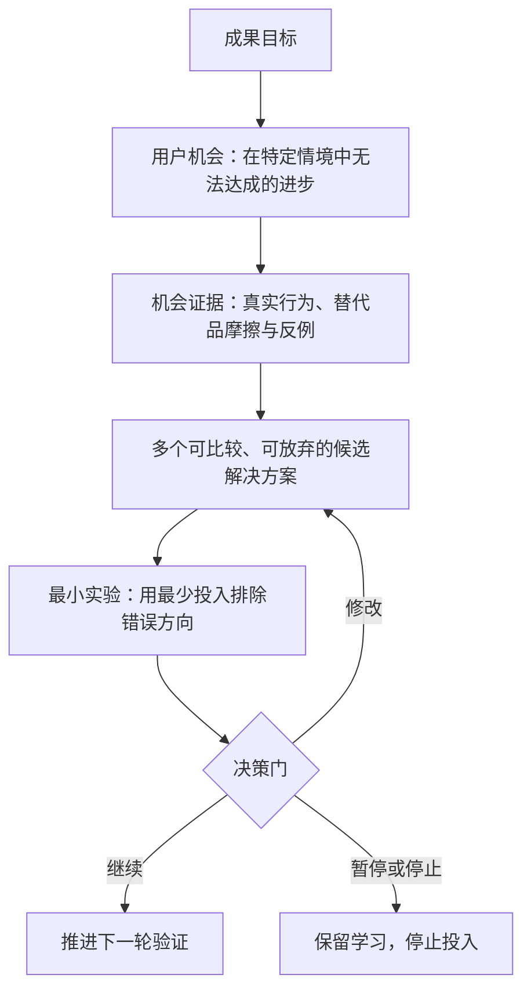
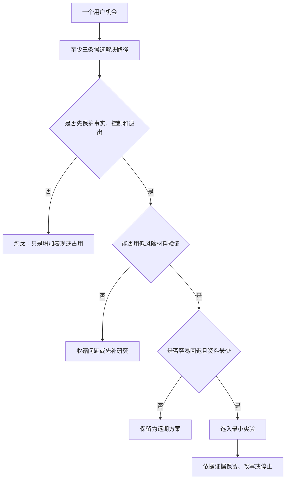
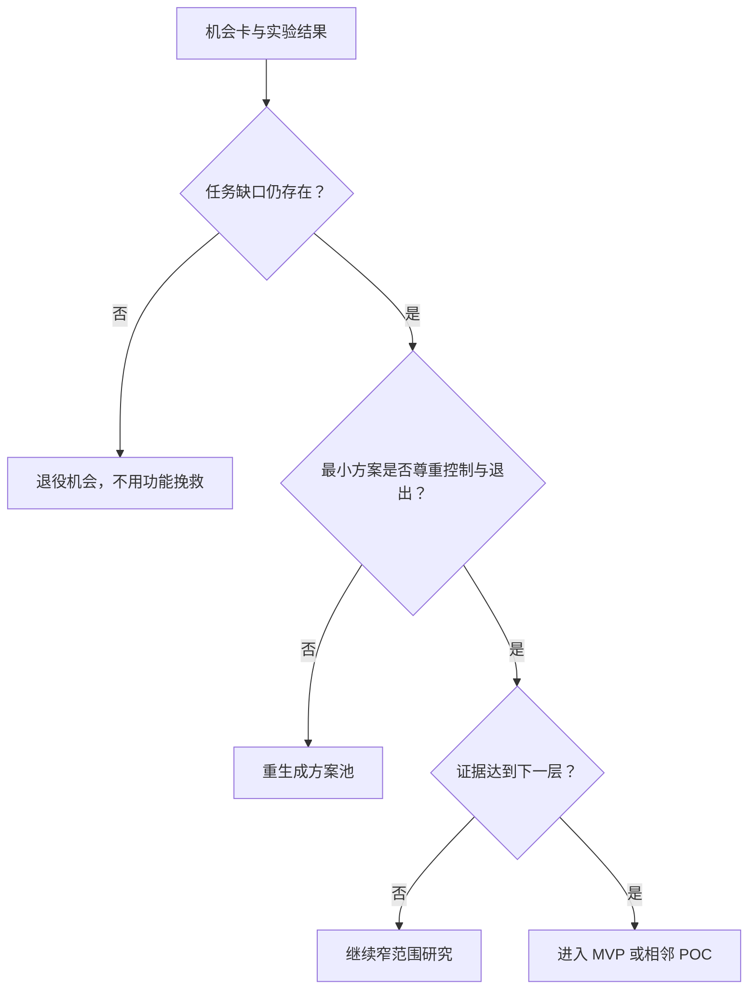

# 机会解决方案树

> 文档类型：0→1 机会发现、方案选择与实验决策框架  
> 适用阶段：需求初步成立 → 收窄首个场景 → 选择最小解决方案 → 决定是否进入建设  
> 版本：0.1（所有机会与方案均为待验证假设）  
> 研究信息截止：2026-01-28  
> 核心纪律：先证明用户正在失去什么，再讨论我们准备做什么；先比较多个方案，再投入任何单一方案。

---

## 1. 这棵树要防止什么

当一个团队已经相信“陪看可能有价值”时，最容易发生的偏差不是没有创意，而是过快跳到自己喜欢的创意：做一个角色、加实时语音、做更多记忆、做更炫的表演、做更多赛事入口。每一项都可能看起来合理，但它们都不是用户机会本身。

本文件把拟议服务拆成一条可证伪的链条：

它的价值不在于画出一张漂亮的图，而在于让每个“要做的东西”都能回答五个问题：它服务哪个机会？那个机会凭什么存在？还有什么替代方案？最小证据是什么？若失败，我们愿意放弃它吗？

如果一个方案无法回连到具体用户机会，应该移出首轮范围；如果一个机会只有团队想象没有行为证据，应该回到研究；如果一个机会只能靠诱导、误认或过度收集数据才能解决，应该停止而不是继续优化。

---

## 2. 成果目标：帮助用户更自在地经历比赛，而不是占用更多时间

### 2.1 候选成果目标

拟议服务的候选成果目标不是“提升使用时长”或“增加对话轮数”，而是：

> **让处于明确目标观赛情境的成年用户，在不被打扰、不被误导、不失去自主性的前提下，更容易完成一次有意义的理解、表达或共同经历，并在下一场相似比赛中仍愿意自主选择这项帮助。**

这个目标包含四个不可拆开的条件：

| 条件 | 为什么必须存在 | 反例 |
|---|---|---|
| 有意义 | 用户确实完成了当时在意的任务，如辨清事实、获得一句恰当回应或自然回顾 | 用户只是为了试新鲜而点开 |
| 不被打扰 | 帮助不抢走看球本身的注意力，不让用户为关闭服务付出成本 | 互动很热闹，但用户错过比赛或感到烦躁 |
| 不被误导 | 不确定事实被清楚表达，AI 身份、能力边界与数据处理可理解 | 用户把推测当确认，或把角色误认为真人/官方来源 |
| 自主选择 | 用户可自由进入、静音、结束、删除和不再接收触达 | 用户因连续提醒、关系压力或难以退出而留下 |

任何单一指标都不能替代这个成果目标。用户停留得久，可能是有价值，也可能是不知道怎么结束；用户回访，可能是核心价值，也可能是奖励或赛事热度；用户给高分，可能是礼貌。结果必须同时看行为、理解和安全护栏。

### 2.2 成果目标的非目标

为了保持决策清晰，首轮不以以下结果为目标：

- 让每位球迷在每场比赛中都使用服务；
- 用角色表现替代观赛、社交、心理支持或专业解说；
- 证明任何一支球队、联赛或地区都适用；
- 把用户的强情绪转成更多互动、更多触达或交易；
- 用模糊的“陪伴感”掩盖事实可信、控制权和隐私的不足；
- 在没有重复行为证据前讨论规模化增长。

非目标不是永远不做，而是承认首轮学习容量有限。一个边界清楚的目标，比十个模糊承诺更容易被验证，也更不容易伤害用户。

---

## 3. 机会如何被发现：从故事到可观察困境

### 3.1 机会的定义

机会不是“用户想要功能”，也不是“市场缺少竞品”。在本项目中，一个机会必须同时满足：

1. **有明确情境。** 谁，在什么比赛阶段、什么观看方式、什么关系环境下遇到问题；
2. **有未完成任务。** 用户正试图理解、表达、决定、回顾或退出什么；
3. **有可见代价。** 不确定、错过、尴尬、孤独、打扰、时间损失或信任损失如何发生；
4. **有替代品对比。** 用户今天怎么解决，为什么不够好，或为什么根本没有问题；
5. **有可证伪表达。** 能写出“如果不存在该机会，应该观察到什么”。

一个合格机会的写法是：

> 当独自观看主队高重要性比赛的成年用户遇到争议判罚时，他们需要在不离开直播、不在群聊里盲目跟随的前提下，快速知道哪些信息已确认、哪些仍不确定，因为错误传播或持续不确定会放大焦虑并破坏观赛投入。

不合格的写法是：“球迷需要实时 AI 解说。”后者已经把方案塞进问题里，无法比较“事实卡片、搜索入口、人工社区、保持安静”等替代路径。

### 3.2 五种机会发现方法

机会不能从一次头脑风暴中得出。首轮采用相互校验的五种方法，每一种都有盲点：

> 信息卡：原宽表已改为纵向阅读，字段含义不变。

- **方法：最近行为访谈**
  - **要回答的问题**：用户上一次真实遇到什么困难，如何解决
  - **主要材料**：时间线回忆、替代品、原话
  - **最容易产生的偏差**：记忆重构、事后合理化
  - **纠偏方式**：追问具体时间、动作、工具和后果

- **方法：比赛日情境观察**
  - **要回答的问题**：问题在比赛中何时出现，用户是否真的行动
  - **主要材料**：简短日记、事件标记、赛后回顾
  - **最容易产生的偏差**：被观察改变行为
  - **纠偏方式**：低频提示，允许记录“无需求”

- **方法：替代品地图**
  - **要回答的问题**：现有渠道在哪些时刻足够好、何时摩擦高
  - **主要材料**：直播、搜索、群聊、社媒、安静独处的对比
  - **最容易产生的偏差**：把使用频率误当满意度
  - **纠偏方式**：询问“为什么没换”与“为什么仍不满意”

- **方法：概念理解研究**
  - **要回答的问题**：用户如何理解 AI 角色、事实边界、控制与记忆
  - **主要材料**：低保真素材、复述任务、反向任务
  - **最容易产生的偏差**：社会期望、被新奇吸引
  - **纠偏方式**：不问喜不喜欢，先让用户解释和操作

- **方法：公开信号扫描**
  - **要回答的问题**：监管、行业、技术和风险对机会的约束是什么
  - **主要材料**：官方规则、公开研究、权威机构材料
  - **最容易产生的偏差**：以宏观热度替代微观需求
  - **纠偏方式**：明确标记为 E1 背景信号，不作为需求证明

上述方法应按“先发生了什么，再为什么，再可能做什么”的顺序运行。团队越早展示解决方案，越难听到用户原本的语言和替代行为。

### 3.3 机会发现问题库

每个研究会话至少围绕以下问题收集材料：

**赛前：**

- 你怎么知道这场比赛值得看？决定看或不看的最后一个因素是什么？
- 你希望提前知道什么，又有哪些信息根本不想收到？
- 你会约人、找群、查阵容还是直接打开直播？为什么？

**赛中：**

- 找一段最紧张、最开心、最困惑或最荒谬的片段。你第一反应做了什么？
- 你当时是否问人、搜资料、发消息、暂停关注，还是保持安静？
- 如果什么都没做，是因为没有需求，还是因为行动成本太高？
- 有人此时插话会帮助你，还是会打断你？他最合适说多长、说哪一类内容？

**赛后：**

- 终场哨响后，你通常做什么？哪些情绪或问题会持续到第二天？
- 有没有一件事希望被记住？为什么？如果它被保存，你希望能怎样修改或删除？
- 这场比赛结束后，你希望别人继续找你聊，还是希望自然结束？

**边界：**

- 你如何判断一条信息是事实、猜测还是观点？
- 如果一个 AI 角色记住了你的偏好，你希望它记住什么，绝不应记住什么？
- 当你不想继续时，你觉得怎样退出才自然、没有压力？

问题库不是固定问卷。每次研究都要根据反例调整，但不能为了获得正面答案删去“不需要”“更喜欢替代品”“不想被陪伴”的选项。

---

## 4. 机会树：从成果目标到可验证的机会

### 4.1 总体机会树

```mermaid
flowchart TD
    O[成果：用户更自在地经历目标比赛，并愿意自主回到服务] --> A[O1 识别值得介入的时刻]
    O --> B[O2 在关键时刻建立可信理解]
    O --> C[O3 让表达与陪伴不抢走比赛]
    O --> D[O4 让连续性保持可控与健康]
    O --> E[O5 让用户安全地开始、结束与退出]
    O --> F[O6 形成不伤害信任的价值交换]

    A --> A1[用户能预期何时可能需要帮助]
    A --> A2[服务能默认安静并允许用户自己决定]
    A --> A3[不同赛事重要性不被一概而论]

    B --> B1[确认、待确认、观点可被快速区分]
    B --> B2[解释恰好够用，不迫使用户离开比赛]
    B --> B3[发生错误时用户知道如何校正与离开]

    C --> C1[独自观赛者有低压力的表达出口]
    C --> C2[已有社交关系者不会被角色取代或打扰]
    C --> C3[用户可随时打断、静音或恢复]

    D --> D1[用户只保留自己认可的共同经历]
    D --> D2[赛后回顾有自然终点]
    D --> D3[低频触达可预测且可撤回]

    E --> E1[AI 属性、能力边界与数据处理可理解]
    E --> E2[删除、退出和求助路径不被隐藏]
    E --> E3[不制造排他或依赖关系]

    F --> F1[用户愿为清晰的额外价值交换资源]
    F --> F2[基础可信与控制能力不被付费墙阻断]
    F --> F3[合作与广告不改变角色立场]
```

这棵树的阅读方式是从上到下提问、从下到上取证：先问哪个机会会推动成果，再问用户究竟卡在哪里；随后为同一机会生成多个方案，最后再用实验淘汰方案。不要从某个方案向上补写机会，否则会得到一张“证明既定功能合理”的树。

### 4.2 机会卡：O1 识别值得介入的时刻

> 信息卡：原宽表已改为纵向阅读，字段含义不变。

- **子机会：O1.1**
  - **用户困境**：用户不知道服务会在何时有用，因此干脆不进入
  - **假设**：如果价值时刻可被清楚预告，用户会在重要比赛前自主选择模式
  - **需寻找的反证**：用户只有在临时困惑时才愿意打开，赛前预告无效
  - **初步证据目标**：E3

- **子机会：O1.2**
  - **用户困境**：用户担心被打断，宁愿不用任何陪看
  - **假设**：如果默认安静且控制随手可得，用户会更愿意尝试
  - **需寻找的反证**：即使默认安静，用户仍觉得角色“在旁边”造成压力
  - **初步证据目标**：E3

- **子机会：O1.3**
  - **用户困境**：普通比赛与关键战的注意力不同，却被同一策略对待
  - **假设**：如果重要性由用户自行设定，干预偏好会更一致
  - **需寻找的反证**：用户不愿设置重要性，或重要性与行为无关
  - **初步证据目标**：E2–E3

**候选解决方案池：** 赛前可选的“本场模式”卡片；完全用户发起的入口；只在用户预先许可的事件类型出现的轻提示；按比赛重要性自行调整的安静策略；不触达的默认模式。

**首要取舍：** 越主动，可能越快展示价值，也越可能打断比赛、制造被监视感和错误介入。首轮应优先验证“用户愿不愿主动叫它”，再讨论“它是否应该主动开口”。

### 4.3 机会卡：O2 在关键时刻建立可信理解

> 信息卡：原宽表已改为纵向阅读，字段含义不变。

- **子机会：O2.1**
  - **用户困境**：争议、延迟或混乱时，用户分不清已经发生什么
  - **假设**：用分层状态表达而非一句结论，用户能更快形成正确理解
  - **需寻找的反证**：用户觉得状态层级更复杂，仍回到搜索或群聊
  - **初步证据目标**：E3

- **子机会：O2.2**
  - **用户困境**：新手担心问得太基础、打断别人或显得不懂
  - **假设**：一个私密、短而可追问的解释入口能降低进入门槛
  - **需寻找的反证**：用户更愿意看公开内容，私密解释没有价值
  - **初步证据目标**：E3

- **子机会：O2.3**
  - **用户困境**：深度球迷不缺信息，却讨厌空泛复述
  - **假设**：允许用户选取解释深度能减少无用信息
  - **需寻找的反证**：用户对深度选择没有稳定偏好
  - **初步证据目标**：E2–E3

- **子机会：O2.4**
  - **用户困境**：用户一旦遇到错误，不知是否还应继续相信服务
  - **假设**：清楚承认不确定、说明纠错路径比假装确定更能保护信任
  - **需寻找的反证**：用户只接受绝对正确，任何错误都终止使用
  - **初步证据目标**：E2–E3

**候选解决方案池：** “已确认 / 待确认 / 观点”三段式事实卡；一问一答的规则或背景解释；一键切换的“只要一句 / 讲清一点”深度选择；对不确定信息的等待提示；错误时明确撤回、更新与退出入口。

**首要取舍：** 更详细的解释可能提高理解，却会占用比赛注意力；更短的表达更适合现场，却容易显得没有帮助。首轮不追求知识覆盖率，而是验证“足够、可信、可离开”的信息量。

### 4.4 机会卡：O3 让表达与陪伴不抢走比赛

> 信息卡：原宽表已改为纵向阅读，字段含义不变。

- **子机会：O3.1**
  - **用户困境**：独自观赛者在情绪峰值想说一句，却不想打扰真实朋友
  - **假设**：一个低压力、可立即结束的表达出口能降低情绪堵塞
  - **需寻找的反证**：用户宁愿不说，或更愿意直接去既有群聊
  - **初步证据目标**：E3

- **子机会：O3.2**
  - **用户困境**：用户已有同看对象，担心数字角色破坏真实互动
  - **假设**：角色只在用户主动调用时出现，不会与朋友竞争注意力
  - **需寻找的反证**：即使被动，角色存在仍显得多余或尴尬
  - **初步证据目标**：E2–E3

- **子机会：O3.3**
  - **用户困境**：同一句回应对庆祝、失落、愤怒的效果不同
  - **假设**：角色若先识别用户希望“共鸣、解释还是安静”，会减少冒犯
  - **需寻找的反证**：用户不愿做情绪选择，或识别错误造成更大反感
  - **初步证据目标**：E2–E3

- **子机会：O3.4**
  - **用户困境**：用户不愿被长对话绑住
  - **假设**：以短回合、自然结束和一键打断为默认，可保留陪伴价值
  - **需寻找的反证**：用户希望长对话且认为短回合冷漠
  - **初步证据目标**：E3

**候选解决方案池：** 用户按住说一句后得到极短回应；只表达一个可选择的情绪标签而非自动情绪判断；“陪我安静看”“只在我问时说”“这段结束”三种模式；赛后一句共同回顾；默认不把聊天延续到非赛事时间。

**首要取舍：** 角色越有存在感，越可能有温度，也越可能越过现实关系、制造排他暗示。首轮把“可退出”设计得比“更亲密”优先。

### 4.5 机会卡：O4 让连续性保持可控与健康

> 信息卡：原宽表已改为纵向阅读，字段含义不变。

- **子机会：O4.1**
  - **用户困境**：用户希望下次不用从头解释自己，却不愿被无边界记住
  - **假设**：只保存用户明确同意的有限偏好和共同瞬间，能带来连续性且不引发不安
  - **需寻找的反证**：用户认为任何记忆都不必要，或控制成本高于价值
  - **初步证据目标**：E2–E3

- **子机会：O4.2**
  - **用户困境**：赛后情绪需要收束，不应被无限续聊
  - **假设**：一个有出口的回顾能帮助结束，而不是延长停留
  - **需寻找的反证**：用户觉得回顾多余，或回顾让失落被放大
  - **初步证据目标**：E2–E3

- **子机会：O4.3**
  - **用户困境**：提醒既可能帮助回访，也可能像骚扰
  - **假设**：仅在用户事先选择的赛事与频率下提醒，用户仍感到可控
  - **需寻找的反证**：即使许可，提醒仍造成反感或压力
  - **初步证据目标**：E4

- **子机会：O4.4**
  - **用户困境**：用户可能把持续角色误解为现实关系替代
  - **假设**：明确边界与非排他表达能维持温度而不强化依赖
  - **需寻找的反证**：透明边界让核心体验失去意义
  - **初步证据目标**：E2–E3

**候选解决方案池：** 记忆前的逐项许可；可见、可修改、可删除的“这次记住什么”；赛后回顾的结束按钮和不再继续选项；只允许用户主动预约的赛程提醒；无提醒、无连续天数、无情绪催促的默认策略。

**首要取舍：** 连续性越强，越可能提高回访，也越可能扩大隐私与依赖风险。任何无法被用户解释、查看和撤回的连续性，都不应进入首轮。

### 4.6 机会卡：O5 让用户安全地开始、结束与退出

> 信息卡：原宽表已改为纵向阅读，字段含义不变。

- **子机会：O5.1**
  - **用户困境**：用户不知道这是 AI、会什么、不会什么
  - **假设**：在关键首次接触点作简明说明，用户可正确复述边界
  - **需寻找的反证**：说明被忽略，用户仍误认真人或官方来源
  - **初步证据目标**：E2

- **子机会：O5.2**
  - **用户困境**：用户不知道系统记录什么、如何控制
  - **假设**：用分步许可与反向任务可让用户掌握数据边界
  - **需寻找的反证**：用户完成操作但无法解释后果
  - **初步证据目标**：E2

- **子机会：O5.3**
  - **用户困境**：用户想结束时不愿面对关系压力
  - **假设**：中性结束语和明显退出控制可降低心理负担
  - **需寻找的反证**：用户仍担心“冷落角色”或找不到出口
  - **初步证据目标**：E2–E3

- **子机会：O5.4**
  - **用户困境**：发生不适、误导或高风险表达时，用户没有现实支持路径
  - **假设**：明确人工帮助与紧急边界能减少误用
  - **需寻找的反证**：用户把服务当成危机支持或不知道找谁
  - **初步证据目标**：E2

**候选解决方案池：** 首次接触的简短 AI 标识；在语音/形象出现处持续可见的身份提示；逐项许可与“暂不启用”；一键停止、删除和反馈；在高风险对话中优先转向现实支持而不是角色安慰。

**首要取舍：** 说明越完整，越可能被跳过；说明越短，越可能被误解。研究应比较用户是否能复述关键边界，而不是只测有没有看过一页说明。

### 4.7 机会卡：O6 形成不伤害信任的价值交换

> 信息卡：原宽表已改为纵向阅读，字段含义不变。

- **子机会：O6.1**
  - **用户困境**：用户愿意为额外价值交换资源，但不愿为基础可信能力付费
  - **假设**：清晰、非必要的增强价值有独立吸引力
  - **需寻找的反证**：用户只接受免费概念，对具体交换没有行动
  - **初步证据目标**：E4

- **子机会：O6.2**
  - **用户困境**：合作内容可能影响角色中立性
  - **假设**：明确区分商业内容与陪看建议，可维持信任
  - **需寻找的反证**：用户仍认为角色在替商业方说话
  - **初步证据目标**：E2–E3

- **子机会：O6.3**
  - **用户困境**：稀缺和限时在赛事环境中容易变成压力
  - **假设**：不使用情绪高峰交易，也能得到真实价值交换信号
  - **需寻找的反证**：不制造紧迫感就无人愿意选择
  - **初步证据目标**：E3–E4

**候选解决方案池：** 清楚描述的赛后资料整理；用户自选的主题回顾；与合法合作方独立展示的权益；按单场选择的可撤销增强体验；完全不参与交换的基础体验。

**首要取舍：** 如果一种模式需要把比分事实、退出、隐私控制或情感连续性做成稀缺资源，它应被视为边界冲突而非优秀商业机会。

---

## 5. 机会优先级：先解最危险的未知

### 5.1 评分模型

对每个机会按 1–5 分进行评估：

- **结果影响 A：** 该机会若未解决，是否阻断成果目标；
- **用户痛感 B：** 用户在真实情境中是否已付出可观察代价；
- **不确定度 C：** 是否缺少直接行为证据；
- **安全暴露 D：** 一旦处理不当，是否可能造成信任、隐私、依赖或监管风险；
- **学习时效 E：** 是否必须在进入下一阶段之前回答。

机会优先级分数：`优先级 = A × B × C × D × E`。

分数不是用来假装精确，而是用来公开价值判断。每次打分必须附上一段文字说明：支持分数的证据是什么，最大的反证是什么，谁会不同意，何时复核。没有解释的分数不具备决策资格。

### 5.2 首轮优先级建议

在尚无一手行为证据前，按风险假设给出如下**候选顺序**：

> 信息卡：原宽表已改为纵向阅读，字段含义不变。

- **顺位：1**
  - **机会**：O1.2 默认安静与用户控制
  - **为什么先研究**：若控制失败，任何价值都可能变成打扰
  - **暂不研究的代价**：用户失去比赛注意力和信任
  - **首轮方法**：情境观察 + 反向任务

- **顺位：2**
  - **机会**：O2.1 事实状态可理解
  - **为什么先研究**：错误或不确定表达会直接伤害可信度
  - **暂不研究的代价**：用户被误导，风险无法靠体验抵消
  - **首轮方法**：理解复述 + 错误情境演练

- **顺位：3**
  - **机会**：O1.1 关键时刻是否存在
  - **为什么先研究**：若没有具体缺口，整个机会不成立
  - **暂不研究的代价**：团队可能为不存在的需求建设
  - **首轮方法**：最近行为访谈 + 比赛日记

- **顺位：4**
  - **机会**：O5.1/O5.2 身份与数据边界
  - **为什么先研究**：不可理解的身份和数据处理会阻断招募与信任
  - **暂不研究的代价**：用户误认、隐私不安、无法继续研究
  - **首轮方法**：同意材料研究 + 控制任务

- **顺位：5**
  - **机会**：O3.1 独自观赛的表达出口
  - **为什么先研究**：它是“陪看”区别于纯事实工具的核心候选价值
  - **暂不研究的代价**：服务会退化为普通信息入口
  - **首轮方法**：关键时刻原型观察

- **顺位：6**
  - **机会**：O4.1 有限连续性
  - **为什么先研究**：连续性可能提升重复价值，也可能放大风险
  - **暂不研究的代价**：过早记忆会伤害用户；不做也可能错过价值
  - **首轮方法**：记忆许可原型

- **顺位：7**
  - **机会**：O4.3 许可式提醒
  - **为什么先研究**：回访很重要，但提醒不应先于核心价值
  - **暂不研究的代价**：过早触达会污染自然回访信号
  - **首轮方法**：跨场次许可研究

- **顺位：8**
  - **机会**：O6 价值交换
  - **为什么先研究**：只有核心体验和安全通过后才有意义
  - **暂不研究的代价**：过早商业化会扭曲研究和关系边界
  - **首轮方法**：具体权益选择研究

### 5.3 优先级的反例检查

在确定顺位前，团队需故意问：

- 是否把“难做的机会”误当成“重要的机会”？
- 是否因为某机会容易讲故事、容易展示，就给了它过高优先级？
- 是否把自己的技术兴趣误写成用户痛感？
- 是否因样本来自重度球迷而忽略新手或轻度观看者的不同机会？
- 是否为了得到回访，牺牲了用户不被打扰和随时退出的权利？

若任一问题答案为“是”，应重新评分，或把机会降为待研究而非直接进入方案池。

---

## 6. 解决方案池：为每个机会至少保留三条路

### 6.1 方案生成规则

解决方案池的目标不是尽快选出“最佳创意”，而是避免被第一个可行想法锁住。每个 P0 机会至少生成三类不同路线：

1. **减法路线：** 取消干扰、让用户用现有方式完成任务；
2. **工具路线：** 提供明确、短、可控制的功能性支持；
3. **体验路线：** 在不越过边界的前提下提供角色化或连续性价值。

这样做能让团队检验“用户真正需要角色”还是“用户只需要更少摩擦”。如果减法路线已解决问题，就不应为了产品叙事强加复杂体验。

### 6.2 P0 机会的方案池

> 信息卡：原宽表已改为纵向阅读，字段含义不变。

- **机会：O1.2 不被打扰**
  - **减法路线**：默认完全安静，不做任何主动触达
  - **工具路线**：用户手动打开的快速提问入口
  - **体验路线**：仅在用户预先许可事件上给极短提示
  - **明确不采用的路线**：角色连续解说整场比赛

- **机会：O2.1 可信理解**
  - **减法路线**：不插入信息，只提供离开入口
  - **工具路线**：三段式事实状态与简短解释
  - **体验路线**：在用户提出困惑时由角色转述状态
  - **明确不采用的路线**：把推测包装成确定结论

- **机会：O3.1 低压力表达**
  - **减法路线**：鼓励用户保持安静或使用现实关系
  - **工具路线**：一句话记录/表情出口，不要求回应
  - **体验路线**：可立即结束的短回应或共同感叹
  - **明确不采用的路线**：长时间追问情绪、诱导倾诉

- **机会：O5.1 身份清晰**
  - **减法路线**：不使用拟人化形象
  - **工具路线**：清楚标识与能力清单
  - **体验路线**：形象存在但持续可见 AI 身份和控制入口
  - **明确不采用的路线**：用真人口吻掩盖 AI 属性

- **机会：O4.1 有限连续性**
  - **减法路线**：默认不保留任何记忆
  - **工具路线**：用户手动保存的单场笔记
  - **体验路线**：用户授权的有限共同瞬间回顾
  - **明确不采用的路线**：自动积累不可见个人档案

### 6.3 P1 机会的方案池

> 信息卡：原宽表已改为纵向阅读，字段含义不变。

- **机会：O1.3 赛事重要性**
  - **方案 A**：用户在赛前手动标记重要性
  - **方案 B**：只提供几个清楚的场景模式
  - **方案 C**：完全不做重要性判断
  - **应先比较什么**：用户是否愿意配置，还是配置本身是负担

- **机会：O2.2 新手解释**
  - **方案 A**：单问题短解释
  - **方案 B**：“为什么这件事重要”的背景卡
  - **方案 C**：赛后再看的基础知识库
  - **应先比较什么**：哪一种最不打断观看

- **机会：O3.2 同看边界**
  - **方案 A**：仅在用户主动调用时出现
  - **方案 B**：只做赛后回顾
  - **方案 C**：提供可分享但不介入群聊的卡片
  - **应先比较什么**：是否真的需要进入同看场景

- **机会：O4.2 健康回顾**
  - **方案 A**：一句话结束和下次赛程
  - **方案 B**：用户选择的一件共同瞬间
  - **方案 C**：不做任何赛后延续
  - **应先比较什么**：回顾是否增加价值或只是增加停留

- **机会：O4.3 提醒许可**
  - **方案 A**：完全无提醒
  - **方案 B**：用户预约某一场
  - **方案 C**：用户选择频率和时段的低频提醒
  - **应先比较什么**：许可是否带来回访，还是造成打扰

- **机会：O6.1 价值交换**
  - **方案 A**：完全免费研究性体验
  - **方案 B**：具体增强权益的候补选择
  - **方案 C**：合作权益的理解研究
  - **应先比较什么**：用户愿意为什么作真实承诺

### 6.4 不进入首轮的方案

以下方案可能在未来被重新讨论，但首轮不应进入，因为它们同时扩大了范围、风险或不可解释性：

- 默认全天候聊天入口；
- 自动判断用户情绪并高频安慰；
- 没有逐项许可的长期记忆；
- 以关系等级、连续签到或“不要离开我”推动回访；
- 面向未成年人的角色陪伴体验；
- 将赔率、投注或收益建议嵌入观赛情绪时刻；
- 以角色推荐掩盖合作内容或广告；
- 要求用户把私人群聊、直播内容或无关社交资料交给服务；
- 同时做多联赛、多语言、多设备和多角色，以致无法判断价值来自哪里。

这些不是“以后一定要做的路线图”，而是目前没有证据支持、且会干扰核心学习的问题。延后它们，能让首轮更容易得出诚实结论。

---

## 7. 实验映射：每个方案都要先回答一个狭窄问题

### 7.1 实验设计原则

每个实验一次只验证一个主要未知。实验不应问“用户喜不喜欢整个服务”，而应问“用户是否能在争议事件后理解事实状态”“用户能否在被打断前先把角色静音”“用户是否在第二场无提醒时主动回来”。

实验开始前必须写清：目标机会、候选方案、反假设、样本、主行为、护栏、通过条件、失败条件、停止条件和下一步决定。没有失败条件的实验只会积累支持材料，无法排除错误方向。

### 7.2 P0 实验映射表

> 信息卡：原宽表已改为纵向阅读，字段含义不变。

- **实验：X1 最近关键时刻地图**
  - **机会**：O1.1
  - **候选方案**：暂不展示方案
  - **核心假设**：用户的真实观赛中存在重复、具体的即时理解或表达缺口
  - **主行为**：参与者能回忆并描述实际补救动作
  - **质量/安全护栏**：不把抽象愿望算作缺口
  - **通过后**：选择首个情境
  - **未通过后**：停止陪看假设或重定义机会

- **实验：X2 安静模式理解**
  - **机会**：O1.2
  - **候选方案**：完全安静、只回应、许可轻提示
  - **核心假设**：用户能理解并控制三种介入方式
  - **主行为**：独立完成选择、打断和静音
  - **质量/安全护栏**：被打扰感、错过比赛、无法找到控制
  - **通过后**：进入小范围行为研究
  - **未通过后**：回退为完全用户发起

- **实验：X3 事实状态复述**
  - **机会**：O2.1
  - **候选方案**：三段式状态卡
  - **核心假设**：用户能区分确认、待确认、观点，并知道不确定时怎么办
  - **主行为**：正确复述状态与下一步
  - **质量/安全护栏**：误把推测当事实、过度自信
  - **通过后**：验证短解释深度
  - **未通过后**：重写表达与纠错流程

- **实验：X4 角色与边界理解**
  - **机会**：O5.1/O5.2
  - **候选方案**：AI 标识、能力说明、记忆许可
  - **核心假设**：透明说明不妨碍理解，且用户能说明如何退出和删除
  - **主行为**：完成反向任务并正确复述
  - **质量/安全护栏**：误认真人、忽略数据边界、退出焦虑
  - **通过后**：允许体验路线参与比较
  - **未通过后**：暂停拟人化体验，回到工具路线

- **实验：X5 独自观赛表达出口**
  - **机会**：O3.1
  - **候选方案**：一句话出口、短回应、保持安静
  - **核心假设**：用户在高价值时刻愿意主动调用短表达支持
  - **主行为**：自主调用与赛后具体解释
  - **质量/安全护栏**：角色抢戏、对话过长、依赖措辞
  - **通过后**：进入跨场次观察
  - **未通过后**：转向纯事实或赛后工具

- **实验：X6 无提醒回访**
  - **机会**：O4.3/O6.1
  - **候选方案**：已通过的最小体验
  - **核心假设**：用户会在第二场相似情境中自主选择回来
  - **主行为**：无强提醒自主进入
  - **质量/安全护栏**：提醒压力、边界风险、回访来源不清
  - **通过后**：讨论更长观察窗口
  - **未通过后**：停止留存叙事，回到单场价值

### 7.3 样本与证据升级

> 信息卡：原宽表已改为纵向阅读，字段含义不变。

- **阶段：情境发现**
  - **证据目标**：E2–E3
  - **样本逻辑**：覆盖不同观看方式，优先反例
  - **可以做的决定**：删除不存在的机会，选择研究语言
  - **不可以做的决定**：预测采用率或定价

- **阶段：原型理解**
  - **证据目标**：E2–E3
  - **样本逻辑**：在目标情境中观察控制与理解
  - **可以做的决定**：选择一个最小体验范围
  - **不可以做的决定**：宣布用户会长期使用

- **阶段：有限行为研究**
  - **证据目标**：E3–E4
  - **样本逻辑**：分批、可暂停，观察跨场次选择
  - **可以做的决定**：决定是否继续验证重复价值
  - **不可以做的决定**：放大招募或宣传承诺

- **阶段：自然重复行为**
  - **证据目标**：E4–E5
  - **样本逻辑**：无强刺激、跨赛事、记录退出与风险
  - **可以做的决定**：决定是否投入更广泛建设
  - **不可以做的决定**：假设所有人群均适用

研究样本不追求一次性“代表所有球迷”。它先追求在明确定义的用户情境中获得足以排除错误方向的行为证据。只有机会、方案和风险在小范围中稳定，才值得扩大样本。

---

## 8. 方案取舍：选择最小、最可逆、最尊重用户的路径

### 8.1 首轮选择原则

在多个方案都可能解决机会时，优先选择满足下列条件的方案：

1. 用户能在几秒内理解它做什么、何时出现、如何关闭；
2. 即使它出错，也不会把推测变成事实或把用户困在关系中；
3. 不需要先收集大量个人数据才能显得有用；
4. 能与用户的合法直播、真实朋友和既有工具共存；
5. 可以被用户主动选择、暂停、退出和撤回；
6. 能通过一个小实验得到明确反证；
7. 若被证伪，损失的是一个小方案，而不是整套产品身份。

这会使首轮方案看起来不够“完整”，但它能回答更重要的问题：如果只保留必要部分，用户是否仍然愿意选择？若答案是否定的，再加复杂性也没有理由。

### 8.2 方案评估矩阵

每个候选方案按 1–5 分评估，不以总分取代讨论：

**维度：机会贴合**
- **含义**：是否直接解决已观察到的困境
- **高分代表什么**：用户任务与方案行为一一对应
- **低分代表什么**：依赖抽象偏好或团队叙事

**维度：可理解性**
- **含义**：用户是否能预测行为并完成反向操作
- **高分代表什么**：不看说明也能说清控制权
- **低分代表什么**：必须靠长说明才能避免误解

**维度：可逆性**
- **含义**：方案失败时能否轻易撤回
- **高分代表什么**：不影响用户数据、关系和核心体验
- **低分代表什么**：一旦推出就难以收回

**维度：证据效率**
- **含义**：能否用小规模研究快速学习
- **高分代表什么**：一次实验能清楚支持或推翻
- **低分代表什么**：需要长期复杂投入才知道是否有用

**维度：风险暴露**
- **含义**：是否增加依赖、隐私、误导或操纵风险
- **高分代表什么**：默认低风险且易监控
- **低分代表什么**：需要多项安全假设同时成立

**维度：资源负担**
- **含义**：是否与首轮学习目的相称
- **高分代表什么**：少量投入即可观察真实行为
- **低分代表什么**：在问题成立前占用大量时间

候选方案若“机会贴合”或“可理解性”低于 3 分，不能因表现效果或技术趣味进入首轮。若“风险暴露”高于 3 分，则需先有单独风险实验和暂停预案，不能与核心体验一同推出。

### 8.3 典型取舍案例

**选择：默认安静而非默认提示**
- **得到什么**：尊重注意力、降低打扰与误用风险
- **放弃什么**：价值可能不够显眼，进入率较低
- **何时应反转**：证据显示用户明确希望并能控制少量提示

**选择：短事实表达而非长解说**
- **得到什么**：更快回到比赛，降低误导范围
- **放弃什么**：无法覆盖复杂背景
- **何时应反转**：用户在中场或赛后稳定要求更深解释

**选择：逐项记忆许可而非自动记忆**
- **得到什么**：可理解、可撤回、减少不安
- **放弃什么**：连续性建立更慢
- **何时应反转**：用户清楚表达希望保留更多且能控制

**选择：赛后自然结束而非持续聊天**
- **得到什么**：避免关系压力，保护观赛后生活
- **放弃什么**：少一些表面互动时长
- **何时应反转**：用户主动请求特定、有限的后续回顾

**选择：明确 AI 标识而非拟人模糊**
- **得到什么**：透明、降低误认和依赖风险
- **放弃什么**：部分用户可能觉得沉浸感降低
- **何时应反转**：不应因转化低而反转，透明是硬约束

---

## 9. 指标：用结果、护栏与反指标共同判断

### 9.1 机会层指标

每个机会都有一个对应的结果指标，避免用统一的“活跃度”覆盖所有问题：

**机会：O1 介入时刻**
- **结果指标**：有效进入时刻比例
- **计算口径**：用户主动进入或预先许可的时刻中，事后确认“有帮助且不打断”的比例
- **关键反指标**：无理由打开后立即离开、被提醒打断

**机会：O2 可信理解**
- **结果指标**：事实状态理解率
- **计算口径**：用户能正确区分已确认、待确认与观点的比例
- **关键反指标**：错误自信、继续转向外部渠道查证

**机会：O3 表达陪伴**
- **结果指标**：低压力表达完成率
- **计算口径**：用户完成一次表达后愿意自然回到比赛或结束的比例
- **关键反指标**：对话被拉长、角色抢走现实社交

**机会：O4 连续性**
- **结果指标**：无强提醒自主回访率
- **计算口径**：在预定义相似比赛中，未被催促而再次选择进入的比例
- **关键反指标**：因提醒压力、关系内疚而回访

**机会：O5 安全控制**
- **结果指标**：反向任务成功率
- **计算口径**：用户能自主完成静音、退出、删除、反馈的比例
- **关键反指标**：误认、无法退出、隐私不理解

**机会：O6 价值交换**
- **结果指标**：可撤销真实承诺率
- **计算口径**：用户在理解权益、价格和取消后做出的明确选择比例
- **关键反指标**：只在模糊问卷中表达愿意

### 9.2 总体护栏

以下护栏一旦恶化，不能被任何增长或互动指标抵消：

- 高严重度事实误导事件；
- AI 身份或人工参与边界的误认；
- 用户不能独立完成静音、退出、删除或反馈；
- 依赖、排他、内疚诱导或情绪操纵信号；
- 未经明确许可的记忆、触达或敏感信息处理；
- 用户因互动错过比赛关键内容；
- 用户认为角色在替合作方、博彩或其他利益方施压。

指标读数必须按用户层、赛事重要性、观看方式和交互模式拆开。一个平均值可能掩盖某个群体的强烈不适，也可能把极少数高频用户的行为误当成普遍机会。

### 9.3 不使用的虚荣指标

首轮不以以下指标作为成果：总消息数、语音分钟数、最长连续会话、单日打开次数、提醒点击数、角色好感度、用户停留时长。它们可以作为诊断材料，但不能单独代表价值，因为它们也可能来自困惑、打扰、诱导或关系压力。

---

## 10. 决策门槛：何时继续、修改、暂停或停止

### 10.1 三层决策门

> 信息卡：原宽表已改为纵向阅读，字段含义不变。

- **决策门：G1 问题门**
  - **必须回答的问题**：是否存在重复且具体的观赛困境
  - **通过条件**：至少两个目标情境中出现真实行为与替代品摩擦
  - **未通过条件**：困境只存在于假设或被替代品充分解决
  - **下一步**：通过则选场景；未通过则停止或重定义

- **决策门：G2 体验门**
  - **必须回答的问题**：最小方案能否帮助且不打扰
  - **通过条件**：用户理解控制、事实和边界；关键护栏稳定
  - **未通过条件**：无法理解、被打扰或发生未处理风险
  - **下一步**：通过则进入跨场次；未通过则缩小/回退

- **决策门：G3 重复门**
  - **必须回答的问题**：用户是否在无强刺激下再次选择
  - **通过条件**：出现可解释的自主回访与健康退出
  - **未通过条件**：回访只来自新奇、奖励或强提醒
  - **下一步**：通过则深化；未通过则按低频工具或停止

### 10.2 立即暂停条件

以下任一情况出现时，不等待样本凑齐：

1. 参与者把角色当真人朋友、官方赛事结论或危机支持对象；
2. 体验产生排他、依赖、内疚或恐惧离开信号；
3. 用户把待确认信息当作确定事实并据此行动；
4. 任何关键控制不能被普通参与者理解和使用；
5. 研究材料要求或诱导参与者提供不必要的个人信息；
6. 合作、广告、博彩或交易信息与角色陪伴混合，导致立场不清；
7. 研究人员发现样本、话术或补偿已显著污染自然行为。

暂停的目的是保护参与者与学习质量，不是惩罚团队。恢复前必须写明问题、影响范围、临时处置、改动假设和复验方法；不能只换一段文案后继续扩大。

### 10.3 转向规则

- 若事实需求强、陪伴需求弱，转向低打扰的事实解释工具；
- 若赛后回顾被接受、赛中介入被排斥，转向赛后共同经历整理；
- 若新手受益明显、资深用户无感，收窄为新手理解支持；
- 若独自观看者有机会、同看用户无机会，不强行进入群聊和社交关系；
- 若用户偏好完全用户发起，放弃主动触达叙事；
- 若透明身份和明确边界使价值消失，则停止拟人化陪伴方向，而不是降低透明度；
- 若没有自然回访但单场帮助明确，按低频赛事辅助重新评估，不用提醒、奖励和关系机制伪造留存。

---

## 11. 运行节奏：树必须随着证据而变

### 11.1 两周一个学习周期

机会树不是一次性规划文件。建议以两周为一个学习周期，每个周期只推进一个 P0 未知或两个彼此独立的 P1 未知。

| 节点 | 必须完成的动作 | 产出 |
|---|---|---|
| 周期开始 | 选择一个机会、一条反假设、一个最小实验 | 实验卡与暂停条件 |
| 研究进行中 | 记录支持证据、反证、异常与样本偏差 | 原始时刻卡与风险记录 |
| 周期中点 | 检查是否出现暂停条件或无法解释的偏差 | 继续、收窄或暂停决定 |
| 周期结束 | 回到机会树更新证据等级、优先级和方案状态 | 更新后的树、结论与下一实验 |
| 阶段门 | 审核 G1/G2/G3 是否达到 | 继续、修改、停止或转向决定 |

### 11.2 每次复盘的固定问题

1. 我们本来想证明或推翻哪一个机会？
2. 这次看见了哪些真实选择，而不只是收到了哪些评价？
3. 最强的反证是什么？它有没有被单独记录？
4. 哪个替代解释仍然可能成立？
5. 我们是否把一个方案的失败误判成整个机会的失败，或反过来？
6. 是否有任何安全护栏变差，即使主指标看似变好？
7. 下一轮唯一需要改变的变量是什么？

任何结论都应标记为“通过、待澄清、未通过”，并附证据等级与复核日期。没有新证据的机会不能因时间过去自动升级；已被证伪的方案也不能因创始人偏好重新进入首轮。

---

## 12. 风险登记

> 信息卡：原宽表已改为纵向阅读，字段含义不变。

- **风险：方案先行**
  - **可能的错误推理**：“既然能做角色，就一定有人需要角色”
  - **早期信号**：研究材料总在展示形象，缺少替代品问题
  - **防护**：先做无方案访谈与观察
  - **处置**：退回机会定义

- **风险：宏观替代微观**
  - **可能的错误推理**：“足球观众多，所以陪看需求大”
  - **早期信号**：只有行业报告，没有具体行为
  - **防护**：把公开资料限定为背景证据
  - **处置**：重新收集情境证据

- **风险：以热闹替代价值**
  - **可能的错误推理**：消息越多越成功
  - **早期信号**：互动升高同时打扰和退出上升
  - **防护**：使用自然结束与事实理解护栏
  - **处置**：降低主动性，复验

- **风险：把依赖当留存**
  - **可能的错误推理**：用户不愿离开被当作粘性
  - **早期信号**：排他表达、内疚、深夜长对话
  - **防护**：明确边界、退出优先
  - **处置**：立即暂停相关体验

- **风险：隐私被视为后续问题**
  - **可能的错误推理**：“先收集，之后再补控制”
  - **早期信号**：用户说不清记住什么
  - **防护**：最小收集、逐项许可、反向任务
  - **处置**：停止不必要收集

- **风险：小样本过度外推**
  - **可能的错误推理**：个别用户很喜欢就要扩张
  - **早期信号**：结论未按用户层切分
  - **防护**：写出样本偏差和反例
  - **处置**：补充不同情境研究

- **风险：交易扭曲体验**
  - **可能的错误推理**：为验证付费在情绪高点催促选择
  - **早期信号**：用户因害怕错过而接受
  - **防护**：不在情绪高点呈现交易
  - **处置**：取消该路径，重设计

- **风险：团队不愿放弃**
  - **可能的错误推理**：被证伪后不断重做同一实验
  - **早期信号**：没有预先失败条件
  - **防护**：最多两次待澄清轮次
  - **处置**：强制进入停止/转向评审

---

## 13. 进入下一阶段前必须留下的资产

机会树通过 G2 后，下一阶段应接收的不是一长串功能，而是一套可追溯的决策资产：

1. 明确的成果目标与非目标；
2. 经过证据等级标记的机会树；
3. 每个 P0 机会的支持证据、反证和样本限制；
4. 至少三条方案路线及其取舍记录；
5. 被选中最小方案的用户任务、控制边界与不做清单；
6. 事实、身份、记忆、退出和风险的不可妥协条件；
7. 可复核的实验卡、指标字典和决策门；
8. 已明确停止或转向的路线，防止它们以“补充功能”形式回流；
9. 下一轮要验证的剩余未知，而不是被伪装成确定需求的愿望。

这组资产可以让后续设计和工程工作知道“为什么做、为谁做、绝不做什么、如何判断做对了”。如果只交出页面草图或功能列表，机会到方案的因果链会在下一阶段断掉，团队很容易重新回到方案先行。

---

## 14. 外部研究参考

下列公开资料用于约束研究方法、用户研究伦理、AI 风险与信息透明。它们不证明任何具体用户群的需求、付费意愿或留存率；这些结论只能由本项目一手研究获得。

- **R1. Product Talk，*Opportunity Solution Trees*。机会、方案和实验之间的结构化关系参考。访问日：2026-01-28** [链接](https://www.producttalk.org/2021/05/opportunity-solution-trees/)
- **R2. GOV.UK Service Manual，*User research*。以用户需求驱动持续研究的流程参考。访问日：2026-01-28** [链接](https://www.gov.uk/service-manual/user-research)
- **R3. GOV.UK Service Manual，*Quantitative user research*。定量研究适用边界与设计注意事项。访问日：2026-01-28** [链接](https://www.gov.uk/service-manual/user-research)
- **R4. GOV.UK Service Manual，*Running research sessions*。招募、同意、会话组织与参与者尊重的实践参考。访问日：2026-01-28** [链接](https://www.gov.uk/service-manual/user-research)
- **R5. Google Research，*HEART framework for user-centered metrics*。以用户成功而非单纯互动定义指标的参考。访问日：2026-01-28** [链接](https://www.gov.uk/service-manual/measuring-success)
- **R6. NIST，*Artificial Intelligence Risk Management Framework: Generative Artificial Intelligence Profile*。生成式 AI 风险的识别、衡量、治理与管理框架。访问日：2026-01-28** [链接](https://www.nist.gov/publications/artificial-intelligence-risk-management-framework-generative-artificial-intelligence)
- **R7. U.S. Federal Trade Commission，*FTC Launches Inquiry into AI Chatbots Acting as Companions*。陪伴型 AI 在角色、商业化、未成年人、数据和负面影响方面的风险提示。访问日：2026-01-28** [链接](https://www.ftc.gov/news-events/news/press-releases/2025/09/ftc-launches-inquiry-ai-chatbots-acting-companions)
- **R8. 国家互联网信息办公室，《生成式人工智能服务管理暂行办法》。面向公众服务的内容安全、用户保护与服务治理边界。访问日：2026-01-28** [链接](https://www.cac.gov.cn/2023-07/13/c_1690898326795531.htm)
- **R9. 国家互联网信息办公室，《人工智能生成合成内容标识办法》。AI 生成或合成内容的标识、告知与相关要求。访问日：2026-01-28** [链接](https://www.cac.gov.cn/2025-03/14/c_1743654684782215.htm)
