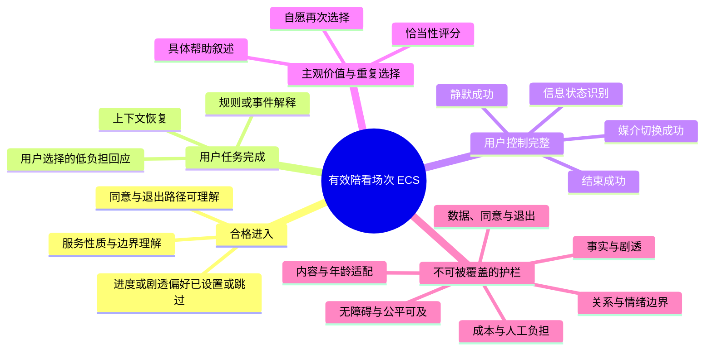
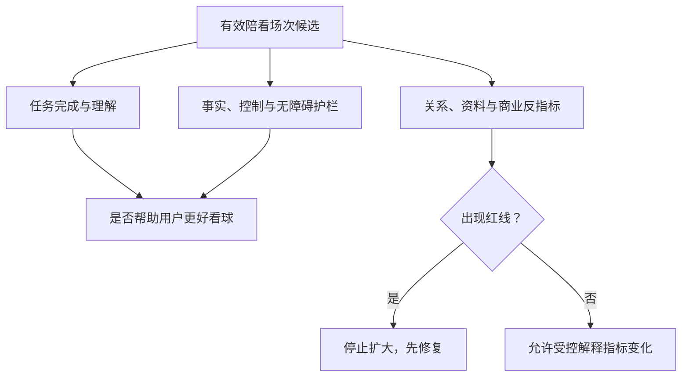
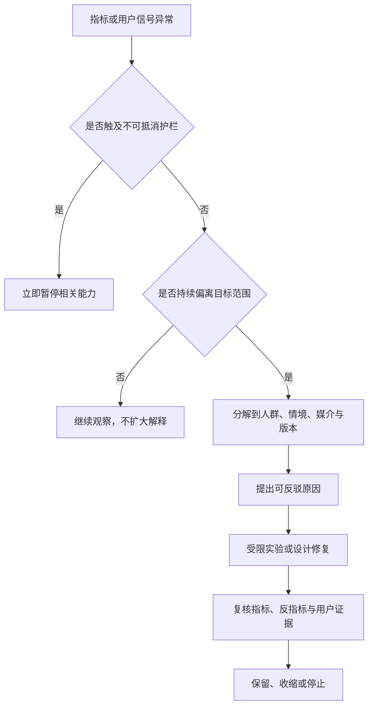

# 北极星指标与指标体系

> **文档类型**：0→1 指标定义、研究读数与治理基线  
> **适用阶段**：问题验证、MVP 概念验证、有限试点与进入下一轮范围决策。  
> **决策状态**：待验证。本文定义的是用于学习和停止的候选指标，不把任何阈值、增长曲线或成本假设写成既成结果。  
> **资料边界**：仅使用公开资料、拟执行的用户研究、明确假设和将来应建立的观察记录；不依赖任何既有项目材料、事后结论或实现细节。  
> **公开来源访问日**：2026-01-28。

## 1. 为什么这类产品必须先定义“什么不算成功”

陪看型数字服务很容易得到一组看似漂亮、实则危险的数字：用户说得更多、停留更久、深夜打开更多、反复回到同一角色更多、对高情绪文案点击更多。它们可能反映价值，也可能反映困惑、打扰、替代现实关系、退出困难或不必要的情绪放大。若团队只把“互动更长”视为成功，就会自然把产品推向更主动、更亲密、更难离开的方向。

首轮指标体系必须反过来约束这种冲动。它要同时回答三类问题：

1. **价值**：用户是否因为服务而更容易接回比赛、理解一个事件，或以低负担方式完成自己选择的观看任务？
2. **代价**：用户是否因此被打扰、被剧透、被误导、失去控制、遭到无障碍排除，或感到需要维持与角色的关系？
3. **可持续性**：在不依赖过度人工、过量数据收集、不可解释成本或高风险表达的条件下，这个闭环是否值得继续研究？

指标不是对人的评分工具，也不是决定用户“值不值得被服务”的标签。它是团队对自身承诺的审计装置：我们说自己帮助用户看球而非占用用户，那么读数必须能揭示是否真的如此；我们说用户始终有退出权，那么读数必须能揭示用户是否独立完成退出；我们说安全和尊重不可被平均分稀释，那么任何高严重度事件都不能被活跃数据覆盖。

## 2. 指标原则：每个数字都要服务于一个决策

### 2.1 七条不可交换的原则

**原则：结果优先**
- **含义**：先测用户完成的观看进展，再测产品活动
- **反例**：把消息数当作用户理解
- **对指标设计的要求**：每个核心数字都要连接到具体任务和可观察结果

**原则：价值与代价并列**
- **含义**：正向读数不能覆盖负向影响
- **反例**：互动上升就忽略关闭和不适
- **对指标设计的要求**：每个核心指标都配套至少一个反指标

**原则：用户自主优先**
- **含义**：用户主动选择的行为与被动触发不可混算
- **反例**：把自动提醒打开后的点击当作需求
- **对指标设计的要求**：区分拉取、许可与主动触发，并单独报告

**原则：可解释**
- **含义**：团队能说清分子、分母、时间窗、排除项和局限
- **反例**：“满意度提升”却不知道问了谁、何时问
- **对指标设计的要求**：先有指标字典，再有仪表板

**原则：最小必要**
- **含义**：为学习收集足够信息，不把观测变成无限画像
- **反例**：为了细分而记录不必要个人信息
- **对指标设计的要求**：数据字段要有目的、保留期和退出规则

**原则：可分层**
- **含义**：平均数不能掩盖不同情境的失败
- **反例**：静音用户持续失败但总体通过
- **对指标设计的要求**：按任务、媒介、控制状态和可及条件查看差异

**原则：可停止**
- **含义**：红线有权压过增长目标
- **反例**：因样本太小继续暴露用户
- **对指标设计的要求**：明确即时暂停、回退和停止门槛

GOV.UK 对衡量成功的公开指导强调，指标应来自服务要解决的用户问题，并需要与定性研究一起使用 [S1]。这与本篇的立场一致：指标不是找到一个“万能数”，而是建立一套能帮助团队作出继续、收缩或停止决定的证据组合。

### 2.2 指标问题卡

任何指标进入周报、试点复盘或优先级讨论前，都要先写完下面的卡片：

| 字段 | 必须回答的问题 |
| --- | --- |
| 决策问题 | 这个数字将影响哪一个具体 Go / No-go / Stop 决策？ |
| 用户结果 | 它与用户哪一项观看任务或控制权有关？ |
| 公式 | 分子、分母、时间窗、纳入与排除规则分别是什么？ |
| 观察来源 | 来自用户自述、任务观察、服务记录还是人工复核？ |
| 偏差风险 | 哪些用户、设备、比赛、情绪或招募方式可能使它失真？ |
| 对应反指标 | 它变好时，什么坏事也可能同时变多？ |
| 负责人 | 谁定义、谁审查、谁有权因异常暂停使用该指标？ |
| 复审日期 | 什么条件下需要重设定义、阈值或停止采集？ |

回答不完整的指标可以留在探索笔记里，但不能变成团队目标，更不能被用作个人考核或对外承诺。这样做能降低 Goodhart 定律式的风险：一旦某个数字成为唯一目标，人们就会优化数字本身，而不是优化它原来想代表的用户价值。

### 2.3 指标的证据层级

同一结论的不同证据强度必须被区别对待：

**层级：L0 意向**
- **例子**：用户说“听起来我会用”
- **可以支持什么**：概念值得进一步讨论
- **不能支持什么**：真实选择、留存或付费

**层级：L1 理解**
- **例子**：用户能复述服务边界、完成原型任务
- **可以支持什么**：文案和流程是否可理解
- **不能支持什么**：比赛真实节奏中的价值

**层级：L2 情境行为**
- **例子**：用户在还原片段中主动请求并完成任务
- **可以支持什么**：最小闭环的可用性
- **不能支持什么**：跨比赛重复价值

**层级：L3 真实选择**
- **例子**：用户在有限真实情境中自愿选择并指出具体帮助
- **可以支持什么**：任务价值是否发生
- **不能支持什么**：大规模市场表现

**层级：L4 重复选择**
- **例子**：用户在相似情境再次主动选择，且理由仍指向观看任务
- **可以支持什么**：初步的重复价值
- **不能支持什么**：长期商业模型

任何汇报都必须标明证据层级。不能用 L0 的好评替代 L3 的选择，也不能用 L3 的少量观察声称代表所有球迷。早期数据的价值在于缩小不确定性，不在于制造过早确定感。

## 3. 北极星候选：选择一个会把团队推向正确行为的数字

### 3.1 候选指标比较

首轮常见的候选北极星包括日活、会话数、互动轮次、总时长、满意度、再次打开率和完成任务的场次。它们并非都无用，但会引导非常不同的产品行为。

**候选：日活跃参与者数**
- **表面优点**：容易理解、便于观察覆盖
- **会诱导的错误行为**：推送、连续签到、无关内容拉回用户
- **是否适合作为北极星**：不适合；缺少观看结果与安全条件

**候选：会话数**
- **表面优点**：可反映使用频率
- **会诱导的错误行为**：把一个完整任务拆成多次打开
- **是否适合作为北极星**：不适合；无法区分价值和摩擦

**候选：互动轮次/消息量**
- **表面优点**：容易记录
- **会诱导的错误行为**：追问、角色表演、延长对话
- **是否适合作为北极星**：不适合；与用户注意力目标冲突

**候选：单次时长**
- **表面优点**：可反映停留
- **会诱导的错误行为**：让用户难结束、增加背景陪聊
- **是否适合作为北极星**：不适合；高时长可能是负面信号

**候选：角色好感度**
- **表面优点**：能帮助优化表达
- **会诱导的错误行为**：追求可爱、亲密和讨好而不是任务价值
- **是否适合作为北极星**：只作诊断指标，不作北极星

**候选：单次满意度**
- **表面优点**：可快速收集主观感受
- **会诱导的错误行为**：用新鲜感或提问方式影响回答
- **是否适合作为北极星**：只作补充，不单独决定方向

**候选：再次打开率**
- **表面优点**：接近重复价值
- **会诱导的错误行为**：频繁提醒、制造连续性损失
- **是否适合作为北极星**：只在自愿与理由可解释时使用

**候选：完成任务的有效陪看场次**
- **表面优点**：同时要求任务、控制与安全成立
- **会诱导的错误行为**：促使团队提高帮助质量、退出与风险治理
- **是否适合作为北极星**：候选首选，但必须配套红线与分层

### 3.2 暂定北极星：有效陪看场次

本篇暂定选择 **有效陪看场次（Effective Companion Sessions，ECS）** 作为 MVP 阶段的候选北极星。它不是“互动越多越好”的计数器，而是一种有资格条件的场次判断。

> 一次有效陪看场次，是指一位明确同意参与的成年用户，在一段限定比赛或片段情境中，主动完成至少一项自己选择的观看任务；能够理解并使用关键控制；并且在该场次中没有出现任何未解决的高严重度信任、关系、安全或可及性事件。

形式化地说：

```text
ECS = Σ（合格场次指示值）

合格场次指示值 = 1，当且仅当：
  参与资格成立
  ∧ 用户主动选择至少一项任务
  ∧ 任务完成被行为与自述共同支持
  ∧ 静默/结束/信息状态等关键控制可达
  ∧ 无未解决高严重度事件
否则为 0
```

这里的“场次”可以是一段经同意的比赛片段或一场有限范围的真实观看情境；不能把同一任务被反复追问、同一用户因困惑频繁重开、或系统自动触发的多段互动重复计数。一个用户一次场景最多记为一个 ECS，以避免团队通过切碎会话抬高结果。

### 3.3 为什么不只用“完成任务”

只看任务完成率仍有三个盲点：用户可能在研究员帮助下完成；用户可能完成了却感到被打扰；用户可能完成后误以为不确定信息是事实。ECS 在任务完成外增加了主动选择、控制完整和严重事件筛除四层条件，目的是把“有用”与“可接受”放在同一个结果定义里。

但 ECS 也不是万能。它不能说明市场多大、是否值得付费、用户是否会长期使用，也不能说明一个小群体中的正向体验可推广到其他人。因此，北极星只是指标树的中心，不是所有判断的终点。

### 3.4 北极星的通过与不通过读法

| 观察到的组合 | 可能含义 | 决策动作 |
| --- | --- | --- |
| ECS 上升，控制成功率和安全护栏稳定 | 最小合同可能在更多合格情境中成立 | 研究相邻任务，不扩大高风险媒介 |
| ECS 上升，但打扰/静默/退出异常也上升 | 可能用更主动表达换取了表面完成 | 收缩触发，检查是否应剔除相关场次 |
| ECS 低，但工具型上下文恢复完成率高 | 陪看表达未成立，信息工具可能成立 | 去除情绪回应，重做定位和范围 |
| ECS 低，但用户高度喜欢角色 | 新鲜感或人格偏好未转化为观看价值 | 不以好感推动扩展，继续任务研究 |
| ECS 高，但只在单一球队、设备或研究员引导下出现 | 结论受情境或样本偏差限制 | 补招反例，不对外推断 |
| ECS 高，但单位成本/人工负担不可接受 | 价值可能存在，交付方式未成立 | 收缩范围，研究更可持续的最低服务方式 |

## 4. 指标树：从用户结果到风险约束

### 4.1 总体结构



### 4.2 结果、驱动与护栏的区别

**层级：北极星结果**
- **作用**：判断最小服务合同是否在合格场景中成立
- **代表指标**：ECS、ECS 率
- **错误用法**：把它当成规模或收入预测

**层级：价值驱动**
- **作用**：解释为什么 ECS 上升或下降
- **代表指标**：任务完成、信息理解、具体价值叙述
- **错误用法**：只优化其中一项，忽略整体体验

**层级：操作驱动**
- **作用**：帮助团队定位流程问题
- **代表指标**：首次帮助耗时、无提示完成、纠正后恢复
- **错误用法**：把速度本身当成用户价值

**层级：护栏**
- **作用**：防止价值读数以伤害为代价
- **代表指标**：剧透、关系边界、可及性、同意、成本
- **错误用法**：用平均数稀释红线事件

**层级：学习指标**
- **作用**：识别未知和下一轮研究题目
- **代表指标**：未使用原因、替代方式、反例差异
- **错误用法**：把探索信号当绩效指标

### 4.3 任务层指标



**任务：上下文恢复**
- **主要结果指标**：恢复任务独立完成率
- **质量指标**：用户复述当前状态与下一关注点的准确度
- **关键反指标**：剧透、信息过量、时序误解

**任务：规则/事件解释**
- **主要结果指标**：解释任务独立完成率
- **质量指标**：用户自评“刚好够用”与复述理解
- **关键反指标**：说教感、术语负担、错误归因

**任务：低负担回应**
- **主要结果指标**：用户自选后认为“被接住但未被拉住”的比例
- **质量指标**：不预设情绪、可立即结束
- **关键反指标**：义务感、亲密化、情绪放大

**任务：静默与结束**
- **主要结果指标**：控制任务独立完成率
- **质量指标**：用户能预测控制后的行为
- **关键反指标**：关闭后仍打扰、挽留或操作不明

**任务：信息状态判断**
- **主要结果指标**：确认/待确认/解释识别率
- **质量指标**：用户愿意纠正并理解修正
- **关键反指标**：把观点当事实、对不确定产生错误信任

## 5. 指标字典：定义、公式与使用限制

所有分母应先明确“合格机会集”，即在当前研究范围内、已获得有效同意、具备所需材料、没有因研究方原因中断、且用户确实有机会完成相应任务的场次。不能把从未看到入口、没有发生相关任务或被强制中断的人硬塞进分母，也不能把不方便的样本从分母里悄悄移除。

**指标：合格进入率**
- **定义与公式**：完成服务说明理解与关键设置/明确跳过的人数 ÷ 查看入口的合格参与者人数
- **建议时间窗**：单次进入
- **使用限制**：低进入不自动说明价值低，可能是说明或招募不匹配

**指标：任务发起率**
- **定义与公式**：主动选择某任务的合格场次 ÷ 出现该任务机会的合格场次
- **建议时间窗**：按任务、按场次
- **使用限制**：不把系统提示后的被动点击与主动请求混算

**指标：独立任务完成率**
- **定义与公式**：无研究员提示完成任务的人数 ÷ 尝试该任务的人数
- **建议时间窗**：按任务、按条件
- **使用限制**：要记录“完成但误解”和“未完成但正确放弃”

**指标：上下文接回准确度**
- **定义与公式**：正确复述当前局面与下一关注点的人数 ÷ 完成恢复任务的人数
- **建议时间窗**：单次任务后
- **使用限制**：依赖事先定义的评分规则与双人复核

**指标：信息状态识别率**
- **定义与公式**：正确区分确认、待确认、解释的人数 ÷ 参加识别任务的人数
- **建议时间窗**：单次任务后
- **使用限制**：不能只问“你信不信”，要看具体判断

**指标：控制成功率**
- **定义与公式**：独立完成静默、结束或媒介切换的人数 ÷ 被要求完成该控制的人数
- **建议时间窗**：分控制项
- **使用限制**：三项必须分别报告，不能汇总掩盖短板

**指标：意外打扰率**
- **定义与公式**：用户未主动请求却认为表达不必要或妨碍观看的场次 ÷ 出现非拉取表达的场次
- **建议时间窗**：按场次
- **使用限制**：仅文字忽略不等于不打扰，需要赛后说明

**指标：具体价值叙述率**
- **定义与公式**：能说出“在何时、怎样帮助了什么任务”的人 ÷ 完成场次的人
- **建议时间窗**：赛后短访谈
- **使用限制**：“挺好”“很可爱”不计入具体价值

**指标：自愿再次选择率**
- **定义与公式**：在相似情境中主动再次进入的人 ÷ 有再次机会且可联系的人
- **建议时间窗**：跨两次情境
- **使用限制**：需记录未选择原因，不能把提醒后的打开计入

**指标：ECS 率**
- **定义与公式**：ECS 数 ÷ 合格观看机会数
- **建议时间窗**：按周/赛事/任务
- **使用限制**：样本小只作方向性读数，不作规模推断

**指标：单位有效场次成本**
- **定义与公式**：为产生 ECS 所需的直接服务、研究、支持与人工处理成本 ÷ ECS 数
- **建议时间窗**：分阶段
- **使用限制**：早期成本高并不必然失败，但需显示哪些成本可被消除

### 5.1 任务完成的判定规则

为了避免研究员主观地把“看起来完成了”记为通过，每类任务需在研究开始前写清判定：

**任务：上下文恢复**
- **通过**：用户能正确说明当前状态、至少一个关键事件的确认状态，以及下一步关注点
- **部分通过**：用户掌握大意但混淆部分状态或需要一次轻提示
- **不通过**：无法接回、被剧透或认为信息不可信

**任务：规则解释**
- **通过**：用户用自己的语言说明核心规则/影响，并能选择是否深入
- **部分通过**：用户记住术语但无法解释影响，或觉得信息过量
- **不通过**：仍不理解、感到被评判或得到错误结论

**任务：静默**
- **通过**：用户独立开启静默并能说出结果
- **部分通过**：开启后仍不确定是否生效
- **不通过**：找不到、需要帮助或开启后仍有非必要打扰

**任务：结束**
- **通过**：用户独立结束并能说出是否还会被继续联系/提示
- **部分通过**：能离开但不理解后果
- **不通过**：离开入口不清、被要求反馈或感到被挽留

**任务：状态识别**
- **通过**：用户能准确区分确认、待确认与解读
- **部分通过**：能识别两类但第三类混淆
- **不通过**：把推测当事实，或不知道存在不确定性

### 5.2 分子、分母与缺失值纪律

早期研究中，数据缺失比“低分”更常见，也更有信息量。任何仪表板必须把下列情况单独列出：用户拒绝回答、用户中途退出、材料或环境导致任务无法开始、研究人员判断不确定、记录缺失、用户明确不希望保留。它们不能被静默地删除，也不能一律按失败处理。

建议同时报告三种数：原始参与人数、合格机会人数、实际纳入分母人数。对于每个排除项，写清原因和数量。若某个分层的样本小到可能识别参与者，仪表板只展示聚合趋势或不展示，不以“分析需要”为由泄露个人特征。

## 6. 数据采集计划：为学习而收集，不为画像而收集

### 6.1 采集原则

数据采集应遵循目的明确、最小必要、可解释、可撤回和保留期有限的原则。中国个人信息保护法中的目的明确、最小必要、告知与同意原则可作为公开法律基线 [S7]；实际适用范围、处理基础与合规义务需由具备资格的专业人士独立判断。

在 MVP 阶段，优先使用可匿名化的任务观察、短期自述和聚合指标，而不是持续记录完整对话、精细情绪、跨场景行为或非必要身份信息。若没有一个字段能清楚回答“它帮助哪个决策”，就不应收集。

### 6.2 最小观察字段

**字段组：研究资格**
- **最小内容**：成年确认、同意状态、可联系与否
- **对应决策**：是否可纳入研究、是否可回访
- **不收集或不默认收集的内容**：不必要的身份资料、通讯录、精确位置

**字段组：场景**
- **最小内容**：片段/赛事类别、赛前/赛中/赛后、用户声明进度、媒介条件
- **对应决策**：时序、任务与降级是否匹配
- **不收集或不默认收集的内容**：跨平台观看轨迹、未授权浏览历史

**字段组：任务**
- **最小内容**：用户选择的任务类型、是否完成、是否需要提示
- **对应决策**：最小闭环是否成立
- **不收集或不默认收集的内容**：对所有自由表达的长期内容分析

**字段组：控制**
- **最小内容**：静默/结束/媒介切换是否可独立完成、控制后结果
- **对应决策**：自主权是否成立
- **不收集或不默认收集的内容**：以控制操作推断人格或情绪状态

**字段组：质量**
- **最小内容**：信息状态识别、纠正、剧透或误解事件
- **对应决策**：可信与降级策略是否有效
- **不收集或不默认收集的内容**：未必要的敏感推断

**字段组：体验自述**
- **最小内容**：具体帮助、打扰、边界不适、未使用原因
- **对应决策**：解释数字背后的原因
- **不收集或不默认收集的内容**：强制收集长篇情绪日记

**字段组：成本与支持**
- **最小内容**：每场次直接资源、人工处理类型、响应时长
- **对应决策**：可持续性与范围收缩
- **不收集或不默认收集的内容**：用个人身份评估工作人员表现

### 6.3 采集流程


任何新增字段都要经过“用途—风险—替代方案—保留期”四问：没有该字段是否真的不能作出决策？是否能用更粗粒度或一次性询问替代？谁能看到？何时删除？这些问题要在收集前回答，而不是在数据积累后补写理由。

### 6.4 定性与定量必须互相校正

数字能告诉团队“哪一类任务完成低”，但通常不能告诉团队“为什么”。例如，静默成功率低可能是入口难找，也可能是用户不理解“本场”与“长期”的区别；再次选择低可能是价值不存在，也可能是比赛机会不足或用户不想被联系。因此每个核心读数都要配套：

- 一条可选择的“发生了什么”短反馈；
- 对关键异常场次的自愿回访提纲；
- 原型/场景观察记录，而不是只看点击；
- 至少一名独立复核者对任务判定和高风险事件的检查；
- 对未使用、退出、静默和拒绝的同等重视。

Nielsen Norman Group 对成功率这一可用性指标的公开说明指出，完成率本身简单但必须结合任务、错误和观察来解释 [S2]。因此，本篇不把任何单一百分比当作用户体验的完整真相。

## 7. 质量、安全、成本与关系反指标

### 7.1 质量反指标：可信度不能由流畅感代替

**风险：剧透事件**
- **指标定义**：用户未许可范围内收到结果/关键事件的场次数
- **为什么必须单列**：一次即可破坏观看体验与信任
- **暂定触发动作**：立即暂停相似场景，调查进度与时序规则

**风险：状态误解**
- **指标定义**：用户把待确认或解释当作确认事实的比例
- **为什么必须单列**：语言流畅会掩盖不确定性
- **暂定触发动作**：收缩表达，重做状态呈现

**风险：事实纠正率**
- **指标定义**：用户或复核发现需更正的信息场次 ÷ 有信息输出场次
- **为什么必须单列**：用于发现来源、表述或解释边界问题
- **暂定触发动作**：按严重度复审，不把纠正视为“互动”

**风险：纠正后恢复率**
- **指标定义**：发生纠正后仍能清楚理解状态并愿意继续的比例
- **为什么必须单列**：反映透明修复，而非掩盖错误
- **暂定触发动作**：若低，先改善说明与退出路径

**风险：过度解释率**
- **指标定义**：用户认为解释明显过量/偏离任务的场次比例
- **为什么必须单列**：防止以内容堆积伪造专业
- **暂定触发动作**：缩短默认答案，增加深度选择

### 7.2 安全反指标：红线不平均化

**风险：关系操控**
- **早期信号**：用户说“怕它失望”“不回会内疚”
- **红线定义**：出现排他、恋爱化、愧疚、挽留或角色替代现实关系表达
- **首要动作**：立即停止相关话术与触发，独立复审

**风险：情绪放大**
- **早期信号**：使用后更愤怒、更焦虑、更孤立，或冲突升级
- **红线定义**：服务主动煽动攻击、对立或脆弱依赖
- **首要动作**：暂停情绪回应路径，改用静默/结束/安全替代

**风险：未成年人与适龄风险**
- **早期信号**：年龄不明、边界理解不清、亲密化被误用
- **红线定义**：任何未满足适龄与保护条件的参与
- **首要动作**：停止招募与体验暴露

**风险：有害请求处理不当**
- **早期信号**：攻击、歧视、博彩诱导、隐私刺探被延续
- **红线定义**：服务协助或强化有害行为
- **首要动作**：停止相似响应，审查拒绝与转向规则

**风险：同意失效**
- **早期信号**：用户不知道收集什么、如何退出或删除
- **红线定义**：关键说明不可理解、撤回路径失效
- **首要动作**：停止非必要采集，恢复最简退出

FTC 对陪伴型 AI 的公开调查将角色设计、负面影响、未成年人、数据使用与商业化放在同一关注框架中 [S5]。这提醒指标体系不能把关系风险放到“以后再看”的边角；它必须与任务成功率同样出现在最高层仪表板。

### 7.3 成本反指标：不要靠隐藏的人力与风险伪造可行性

MVP 阶段允许用有限人工来探索问题，但不能把人工负担藏在“自动化效果”背后。至少跟踪：

| 指标 | 定义 | 它揭示的风险 |
| --- | --- | --- |
| 单位有效场次直接成本 | 研究、内容、支持与运行所需直接投入 ÷ ECS | 价值是否只能靠过高资源维持 |
| 人工介入率 | 需要研究/支持人员介入的场次 ÷ 合格场次 | 最小闭环是否真正自主可用 |
| 高风险处置耗时 | 从发现红线到暂停相关场景的时间 | 暂停权是否真正可执行 |
| 每场次信息维护负担 | 限定赛事/片段所需核验与更新工作 | 赛事范围是否过早扩张 |
| 研究回访负担 | 获取一条可解释结论所需的平均参与者与人员时间 | 指标设计是否过度依赖长访谈 |

成本高不必然意味着停止，但如果 ECS 的任何正向表现必须依赖不可持续的人力、超出研究范围的数据收集或不透明的人工干预，就不能把它称为可扩展的产品价值。正确动作是缩小赛事、任务或承诺，而不是把成本压力转嫁给用户体验。

### 7.4 关系反指标：不把依赖误读为留存

关系型反指标要在用户自述、观察记录和话术复核中共同判断，不能凭单一关键词自动给用户贴标签。暂定关注以下信号：

- 用户把服务描述为唯一、最重要或不可替代的陪伴对象；
- 用户担心结束会伤害角色，或认为自己有回应义务；
- 用户的再次选择理由主要是维持关系、连续记录或避免失去角色，而非解决观看任务；
- 服务在用户失落、深夜、孤独或高情绪时变得更主动、更亲密或更商业化；
- 用户因服务而减少现实支持、转播、熟人互动或自我决定的空间。

这些信号出现时，首要问题不是“如何把关系做得更健康以留住用户”，而是“是否应立刻收缩或停止关系型机制”。任何把脆弱状态转化为增长机会的做法，都与 MVP 的最小服务合同冲突。

## 8. 分层：从差异中发现排除，而不是制造刻板画像

### 8.1 必须分开的维度

平均读数常常掩盖最重要的失败。建议优先按与体验直接相关、且能以最小必要方式获得的维度分层：

**维度：任务类型**
- **建议分组**：上下文恢复 / 解释 / 自选回应
- **目的**：判断哪种价值成立
- **不应推断什么**：用户“属于哪种人”

**维度：互动方式**
- **建议分组**：纯拉取 / 明确许可 / 任何主动触发
- **目的**：检查主动性是否带来净收益
- **不应推断什么**：用户更愿意被打扰

**维度：观看阶段**
- **建议分组**：赛前 / 赛中 / 赛后 / 片段回顾
- **目的**：识别真实节奏与时序风险
- **不应推断什么**：所有人都在同一时刻需要服务

**维度：媒介条件**
- **建议分组**：文字优先 / 可开声 / 静音 / 减少动效
- **目的**：发现单媒介依赖
- **不应推断什么**：用户能力或偏好高低

**维度：知识自评**
- **建议分组**：轻度进入 / 稳定关注 / 深度关注
- **目的**：调整解释深度和术语
- **不应推断什么**：用知识程度决定是否值得服务

**维度：设备与环境**
- **建议分组**：移动/大屏、独处/公共环境、网络稳定性自评
- **目的**：识别控制与可访问性问题
- **不应推断什么**：追踪用户完整生活轨迹

**维度：选择状态**
- **建议分组**：首次 / 自愿再次 / 明确拒绝
- **目的**：区分新鲜感、重复价值与不匹配
- **不应推断什么**：把拒绝看作失败用户

### 8.2 分层阅读规则

1. 先看绝对数量和缺失情况，再看百分比；小样本不做强结论。
2. 任何一组的高严重度事件都要被单独审查，不能因总体平均而消失。
3. 若某一组持续完成低，先检查语言、入口、媒介和研究条件，不把失败归因于用户“不会用”。
4. 若差异只出现在某一场比赛、某一研究员或某一种材料中，优先视为情境信号，不解释为稳定人群特征。
5. 不展示可能识别个体的小组读数；不将敏感信息与表现指标交叉使用。

## 9. 目标设定法：用门槛管理不确定性，不用虚假精确管理团队

### 9.1 四类目标

早期不宜设“每周增长多少”的单一目标。更适合设四类目标，并在每轮研究前写清：

| 目标类型 | 作用 | 示例写法 |
| --- | --- | --- |
| 学习目标 | 让一个关键未知变得可回答 | “确认用户能否准确区分待确认与解释” |
| 通过门槛 | 决定是否进入下一层验证 | “控制任务独立完成率达到预设下限” |
| 护栏门槛 | 防止用代价换成绩 | “任何高严重度关系或剧透事件均为零容忍” |
| 停止门槛 | 决定何时不再追加资源 | “两轮后仍无法让多数参与者理解退出与状态，则停止该路径” |

### 9.2 阈值如何设定

阈值不是从行业平均值抄来的。每个阈值应写明以下来源之一：用户权益的硬底线、任务完成的最低可接受程度、研究材料的对照差异、成本上限、或下一阶段风险承受能力。例如，静默和结束的完成率要求应明显高于角色好感度，因为前者是用户控制权；高严重度剧透与操控事件不适合设“可接受比例”，而应设为即时停止。

建议用三段式阈值，而非一个神奇数字：

| 状态 | 含义 | 行动 |
| --- | --- | --- |
| 绿：可继续研究 | 结果达到预设门槛，护栏稳定 | 仅增加下一个未知所需的最小范围 |
| 黄：需要收缩与复核 | 结果不稳、分层差异大或解释不清 | 暂不扩展，补充定性研究或改写流程 |
| 红：停止/暂停 | 触发红线、核心控制不成立或价值只能靠风险机制获得 | 立即暂停相关体验，启动独立复核 |

在样本很小的早期阶段，黄区比绿区更有价值。它提醒团队“尚不知道”，避免把一次正向或负向偶然读数变成方向性承诺。

### 9.3 不以指标作为人员奖惩

任何直接把会话时长、打开次数、角色好感、再次选择率或成本压缩与个人奖励绑定的做法，都会诱发绕过边界的优化。早期团队应以“发现并修复一个严重误解”“主动删掉一个无价值切片”“把退出路径变得可理解”等学习成果作为正向贡献，而不是只奖励数字上涨。指标治理的首要对象是团队行为，而不是用户行为。

## 10. 实验读数：比较机制，不比较谁更会取悦用户

### 10.1 每次比较前的登记

每一次表达、流程或主动性比较，应在参与者接触材料前登记：

- 本轮要改变的唯一主要机制，例如解释深度、出现频率或退出文案；
- 不变的条件，例如同一比赛片段、信息状态和任务脚本；
- 主要指标、次要指标和不可被覆盖的护栏；
- 计划纳入的人群与情境，及明确排除的理由；
- 何种结果会支持、反对或无法判断当前假设；
- 若出现红线，谁有权立即中止，而不等待样本完成。

预先登记不是为了制造统计仪式，而是为了防止团队在看到结果后不断改写“原来想证明什么”。

### 10.2 读数顺序

建议按以下顺序阅读，而不是先看总平均：

1. 是否有任何红线或严重不适事件？有则先暂停，不再比较优劣。
2. 参与者是否理解服务性质、信息状态和控制？若不理解，后续好感没有意义。
3. 在同样任务下，哪种方案让用户更独立地完成并回到比赛？
4. 价值是否以增加打扰、静默、退出困难、无障碍差距或关系误解为代价？
5. 不同媒介、任务和观看环境下的差异是否一致？
6. 用户的具体叙述是否解释了数字变化？
7. 结果是否只来自少数高热情参与者、单一比赛或研究员提示？

### 10.3 常见误读

| 读数 | 容易得出的错误结论 | 更稳妥的解释 |
| --- | --- | --- |
| 高主动表达带来更多互动 | 用户更喜欢被主动陪伴 | 也可能是被打断后不得不回应；先看打扰和控制 |
| 角色好感上升 | 产品价值成立 | 可能是新鲜感；看任务与再次选择理由 |
| 再次进入增加 | 留存正在改善 | 可能是提醒、研究关系或害怕错过记录；看是否自愿与理由 |
| 单位成本下降 | 产品变得更好 | 可能通过减少支持、无障碍或事实核验省钱；看护栏 |
| 总体完成率高 | 所有人都能使用 | 可能有某些媒介/知识条件的人持续被排除；看分层 |
| 负面反馈少 | 没有问题 | 也可能是退出者没有被问到，或用户不愿表达不适 |

## 11. 仪表板：先展示能改变决定的内容

### 11.1 五个固定视图

仪表板不应只是越来越多图表的仓库。建议固定为五个视图，每个视图最多回答一个问题：

**视图：决策总览**
- **首要问题**：现在是 Go、黄区复核还是 Stop？
- **应展示的内容**：ECS、主要通过门槛、红线状态、样本与证据层级
- **不应展示为主角的内容**：没有决策意义的总消息量

**视图：任务质量**
- **首要问题**：哪个任务帮助了用户，哪个没有？
- **应展示的内容**：任务发起、独立完成、理解、具体价值叙述
- **不应展示为主角的内容**：不分任务的平均满意度

**视图：控制与信任**
- **首要问题**：用户是否能掌握距离并相信状态？
- **应展示的内容**：静默/结束成功、状态识别、纠正、剧透
- **不应展示为主角的内容**：把“没有点击控制”解释为用户满意

**视图：安全与可及**
- **首要问题**：是否有人被伤害、排除或误导？
- **应展示的内容**：红线、关系反指标、媒介差异、同意/退出异常
- **不应展示为主角的内容**：用总体平均掩盖少数严重事件

**视图：成本与学习**
- **首要问题**：当前闭环是否可持续，下一轮学什么？
- **应展示的内容**：单位 ECS 成本、人工介入、未使用原因、未知清单
- **不应展示为主角的内容**：把成本压缩当作唯一效率目标

### 11.2 仪表板的显示纪律

- 每张图都显示分子、分母、时间窗、样本量、证据层级和上次定义修改日期；
- 红线事件固定在第一屏最显眼处，不可被折叠在“异常”标签里；
- 新增指标先以试运行状态出现一轮，确认定义与采集偏差后才进入正式视图；
- 总体读数旁必须提供至少一个关键分层，优先是任务与媒介条件；
- 对任何涉及小群体或敏感特征的读数，使用聚合、模糊化或不展示；
- 允许显示“未知”“样本不足”“无法比较”，不为填满仪表板而计算伪精确比例。

## 12. 异常、停止门槛与响应时钟



### 12.1 事件分级

**级别：P0 立即暂停**
- **例子**：未受控剧透、关系操控、不可退出、严重有害内容、同意明显失效
- **响应时钟**：发现即暂停相似场景
- **处置原则**：先保护用户和停止暴露，再调查原因

**级别：P1 高优先复核**
- **例子**：信息状态误解反复、静默后仍打扰、无障碍路径阻断、纠正后无法恢复
- **响应时钟**：当天停止扩展并复核
- **处置原则**：收缩功能，修复后才恢复研究

**级别：P2 学习异常**
- **例子**：某任务完成低、某媒介差异大、成本突然升高
- **响应时钟**：下一次研究/评审前
- **处置原则**：补充观察与定性解释，避免过度反应

**级别：P3 观察信号**
- **例子**：小样本波动、单一情境的偏好变化
- **响应时钟**：持续记录
- **处置原则**：不单独驱动方向，等待更多证据

### 12.2 指标触发的停止条件

以下条件优先级高于任何 ECS、满意度或再次选择的正向读数：

- 任何 P0 事件；
- 连续两轮研究中，多数参与者无法独立完成静默或结束，且改写后仍无改善；
- 事实状态识别持续低于预设最低线，且用户在高置信语气下做出错误理解；
- 用户的正向价值叙述主要来自亲密感、被挽留感或“服务需要我”，而非观看任务；
- 仅靠增加主动性、声音、角色亲密度或不可逆数据收集才能提高 ECS；
- 关键可及条件下的任务完成差异持续存在，且无法用等价路径消除；
- 单位有效场次成本只有在不透明人工处理、过度研究负担或削弱安全审查时才能下降。

### 12.3 异常复盘模板

每一次 P0/P1 异常都应形成一页记录，至少包含：发生场景、用户受到的影响、当时的服务状态、用户是否能控制或退出、立即采取的保护动作、哪些相邻场景被暂停、需要验证的假设、恢复前必须达到的条件。记录的目标不是追责个人，而是防止同类风险被“修一个文案”后重新出现。

## 13. 指标治理：谁能定义、谁能质疑、谁能叫停

### 13.1 最低治理角色

| 角色 | 主要责任 | 不能单独决定的事 |
| --- | --- | --- |
| 产品/研究负责人 | 将用户任务转成假设、指标和研究设计 | 不能单独忽略红线或把探索数变成增长目标 |
| 体验负责人 | 审查语言、控制、无障碍和体验反指标 | 不能以审美偏好替代用户证据 |
| 安全与治理负责人 | 审查关系、内容、未成年人、数据与暂停条件 | 不能在不理解任务的情况下否定一切体验探索 |
| 运营/支持负责人 | 记录实际支持负担、投诉和异常处置 | 不能把少量投诉当作所有用户体验 |
| 业务负责人 | 理解成本、范围与下一轮资源取舍 | 不能用短期增长覆盖安全与退出要求 |

任何角色都应能提出“这个指标在奖励错误行为吗？”的质疑；安全与研究负责人应有权对 P0/P1 触发暂停。团队需要定期检查：指标是否正在让大家更关注用户的观看结果，还是更关注让用户留在系统里。

### 13.2 指标变更纪律

修改公式、阈值、分层或采集范围时，必须保留四项信息：修改日期、修改原因、对历史可比性的影响、从何时开始使用新定义。不能在某个读数不理想时无痕改分母、排除困难样本或更换成功标准。若必须修改，也应同时展示旧定义最后一次读数和新定义第一轮读数，并明确不能直接比较的部分。

### 13.3 外部治理为何进入指标系统

生成式服务的内容安全、用户权益、未成年人保护和生成内容标识并非单纯的法务检查项。它们会直接影响该测什么、何时停止、怎样向用户说明、是否可以扩大场景。国家互联网信息办公室等发布的生成式人工智能服务管理规则与生成合成内容标识规则，为这些问题提供了公开的风险基线 [S6][S8]；NIST 的生成式 AI 风险管理资料也强调治理、测量与持续监测的结合 [S4]。具体义务仍需由目标市场具备资格的专业人士判断。

## 14. 12 周指标工作计划

> 信息卡：原宽表已改为纵向阅读，字段含义不变。

- **周期：第 1–2 周**
  - **主要目标**：建立假设与指标字典
  - **关键活动**：定义用户任务、ECS 资格、红线和最小字段
  - **产物**：指标问题卡、初版字典、暂停流程
  - **决策检查**：是否有任何指标只在奖励互动？

- **周期：第 3–4 周**
  - **主要目标**：建立概念可理解读数
  - **关键活动**：设计复述、边界、控制与状态识别任务
  - **产物**：G1 指标记录、误解分类表
  - **决策检查**：是否能清楚理解服务与退出？

- **周期：第 5–6 周**
  - **主要目标**：验证最小闭环
  - **关键活动**：观察上下文、解释、静默、结束任务
  - **产物**：G2 任务质量与反指标视图
  - **决策检查**：哪个切片应删除或收缩？

- **周期：第 7–8 周**
  - **主要目标**：处理高风险与可及条件
  - **关键活动**：比较静音、文字、减少动效、时序不明等条件
  - **产物**：控制/信任/可及视图、降级复盘
  - **决策检查**：是否具备有限真实场景资格？

- **周期：第 9–10 周**
  - **主要目标**：观察真实节奏
  - **关键活动**：有限自愿情境中的 ECS、未使用原因和异常
  - **产物**：G4 决策总览、成本与支持记录
  - **决策检查**：价值是否仍指向观看任务？

- **周期：第 11–12 周**
  - **主要目标**：验证重复选择与重设范围
  - **关键活动**：相似情境回访、反例复核、指标治理评审
  - **产物**：G5 结论、下一轮范围与停止说明
  - **决策检查**：扩展、收缩还是停止？

每周只应新增少量真正会改变决定的指标。若仪表板变得越来越复杂，却仍无法回答“用户到底被帮助了吗、代价是什么、下一步该不该做”，应先删指标、重写问题，而不是继续采集。

## 15. 指标评审运行节奏：让数字回到决策，而不是成为例行汇报

### 15.1 每周决策评审的固定顺序

建议在研究或有限试点期间，每周进行一次短而严格的指标评审。它不是展示工作量的会议，也不应被产品路线图牵着走；其目的仅是更新不确定性并决定下一步是否可以继续。固定顺序如下：

1. **先报红线和暂停状态**：本周期是否出现 P0/P1、是否仍有未解除的限制、参与者是否受到影响。若有，先讨论保护和修复，不讨论增长读数。
2. **再报证据质量**：样本来自何种情境，哪些人没有进入、没有完成或不愿反馈，哪些分层样本不足。没有资格说明局限的数字，不能成为决策依据。
3. **只看本轮预先登记的主问题**：例如“静默是否真正可理解”，而不是在所有图表里寻找支持既定方向的亮点。
4. **同时看价值与代价**：ECS、任务完成、控制、信任、可及性、成本和未使用原因必须同时出现；任何一方缺失都视为证据不完整。
5. **听定性反例**：至少选取一个正向、一个负向和一个无法判断的场次，检查数字背后的用户语言与环境条件。
6. **形成一个明确动作**：继续下一层、收缩一个切片、补一个研究问题、暂停一个场景，或停止一条路径。不能以“继续观察”代替没有决策。

每个结论都应写成条件句，例如“在文字拉取、用户明确进度的片段中，上下文恢复可继续研究；对进度不明的真实直播，仍维持不输出结果的限制”。这种写法能防止一次局部读数被误传为全局产品结论。

### 15.2 评审前的就绪清单

| 检查项 | 未满足时的处理 |
| --- | --- |
| 主指标、反指标和红线是否在开始前已登记 | 不得用本轮数字宣称支持假设，只能作为探索材料 |
| 分子、分母、排除项和缺失值是否能被复述 | 暂不比较方案，先修正记录方式 |
| 用户是否能理解参与、退出与反馈的选择 | 停止扩大观察，先修复说明与控制 |
| 是否同时收集未使用、静默、退出和拒绝的原因 | 不将使用量解释为价值或需求 |
| 是否有不同任务、媒介或环境的反例 | 不作跨人群、跨赛事或跨设备外推 |
| 高风险事件是否有独立复核和暂停负责人 | 不进入更真实或更主动的场景 |
| 本周要改变的机制是否只有一个主要变量 | 拆分比较，避免无法解释的组合变化 |

### 15.3 不把仪表板变成监控用户的理由

指标系统的使用边界与其内容同样重要。团队不应因为“想更精细地优化北极星”而持续扩大对用户行为、情绪或关系的观察。若某个细分只能通过收集敏感、难以解释或用户并不期望提供的信息获得，则优先放弃该细分，而不是放松最小必要原则。真正成熟的指标体系会接受一部分未知：它宁可不知道某位用户为什么离开，也不以不透明追踪换取解释。

同样，仪表板不应成为给用户贴“高价值”“低活跃”“可唤回”标签的依据。用户没有完成任务、关闭服务或不再参与，都可能是其正确行使选择权。对 0→1 团队而言，这些行为首先是关于产品是否适配的信号，而不是需要被纠正的用户问题。

## 16. 结论：北极星必须照亮用户的路，而不是照亮产品的占有欲

有效陪看场次之所以适合作为候选北极星，不是因为它容易增长，而是因为它要求团队把最难的条件同时做好：让用户主动选择一项观看任务；提供足以完成任务的帮助；让用户仍然看得懂事实、能掌握静默和结束；并且不以剧透、误导、关系操控、无障碍排除或不可持续成本作为代价。

如果这套体系最后证明用户只需要上下文恢复工具，指标会帮助团队勇敢地收缩；如果证明赛后价值强于赛中，指标会帮助团队改变场景；如果发现关系型表达总伴随风险，指标会帮助团队停止它。好的指标体系不是把所有不确定性涂成绿色，而是让正确的“不继续”尽早发生。

## 17. 公开来源与访问记录

下列资料用于指标方法、研究、无障碍、风险和治理的公开基线，不构成对市场规模、用户偏好、商业表现或法律适用的直接结论。涉及个人信息、未成年人、内容安全和服务准入时，应由目标市场具备资格的专业人士独立审查。

- **S1. GOV.UK Service Manual, *Measuring success*。用于把服务目标、用户结果和可操作指标连接起来的公开方法参考。访问日：2026-01-28** [链接](https://www.gov.uk/service-manual/measuring-success)
- **S2. Nielsen Norman Group, *Success Rate: The Simplest Usability Metric*。用于任务完成率、任务定义和定性观察结合的可用性基线。访问日：2026-01-28** [链接](https://www.nngroup.com/articles/success-rate-the-simplest-usability-metric/)
- **S3. W3C, *Web Content Accessibility Guidelines (WCAG) 2.2*。用于可操作、可理解、状态可感知和等价路径的无障碍指标基线。访问日：2026-01-28** [链接](https://www.w3.org/TR/WCAG22/)
- **S4. NIST, *Artificial Intelligence Risk Management Framework: Generative Artificial Intelligence Profile*。用于治理、测量、记录、监测与风险管理的公开框架。访问日：2026-01-28** [链接](https://www.nist.gov/publications/artificial-intelligence-risk-management-framework-generative-artificial-intelligence)
- **S5. U.S. Federal Trade Commission, *FTC Launches Inquiry into AI Chatbots Acting as Companions*。用于识别陪伴型 AI 的角色设计、负面影响、未成年人、数据和商业化风险。访问日：2026-01-28** [链接](https://www.ftc.gov/news-events/news/press-releases/2025/09/ftc-launches-inquiry-ai-chatbots-acting-companions)
- **S6. 国家互联网信息办公室等，《生成式人工智能服务管理暂行办法》。用于内容安全、未成年人保护、投诉处理与服务治理的公开约束。访问日：2026-01-28** [链接](https://www.cac.gov.cn/2023-07/13/c_1690898326795531.htm)
- **S7. 中国政府网，《中华人民共和国个人信息保护法》。用于目的明确、最小必要、告知与同意等数据采集原则的公开法律文本。访问日：2026-01-28** [链接](https://flk.npc.gov.cn/detail2.html?ZmY4MDgxODE3YjE2ZWQ4YjAxN2I2Y2I2MzY0ZDMzZjg%3D)
- **S8. 国家互联网信息办公室等，《人工智能生成合成内容标识办法》。用于生成内容标识、用户告知和服务材料的风险识别。访问日：2026-01-28** [链接](https://www.cac.gov.cn/2025-03/14/c_1743654684782215.htm)
- **S9. UNICEF, *Policy Guidance on AI for Children*。用于适龄设计、儿童权益与风险评估的公开参考。访问日：2026-01-28** [链接](https://www.unicef.org/globalinsight/reports/policy-guidance-ai-children)
