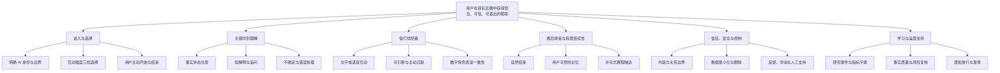
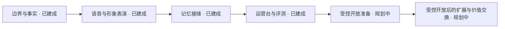

# 功能优先级与版本规划

> **这份文档写给谁**：想了解球球按什么顺序建设能力、如何决定版本取舍的读者，研究产品规划方法的课程学员，以及与我们合作的伙伴。
> **文档类型与所属**：0→1 阶段的功能优先级、能力切片与版本放行纪律，属《球球全套资料》第三卷"验证与商业模式"。
> **它是什么**：我们把"产品"拆成可独立验证的责任的方法，以及实际采用的建设顺序与版本放行规则。全套资料中，验证什么由[《需求假设与验证计划》](13-需求假设与验证计划.md)回答，按什么闸门放行由[《MVP 范围与验证闸门》](14-MVP范围与验证闸门.md)回答；本篇回答第三个问题——按什么顺序建设。
> **先说清楚一件事**：文中"已建成"指系统工程验收通过，不等于用户价值已被验证——所有验证闸门仍在等待真实用户回答；标为"规划中"的部分是真实的未完成项，以规划语气呈现，不写成既成事实。

---

## 1. 为什么优先级不能从"最想做什么"开始

实时足球数字陪看很容易在早期变成一个功能聚合体：赛程、比分、资讯、角色、语音、形象、记忆、提醒、社区、付费、预测都看似相关。问题是，这种相关性不足以决定先后顺序。用户可能只在一个时刻需要短而可信的帮助；也可能根本不愿被角色主动介入。若我们先建设一整套能力，后来才发现核心需求并不存在，损失的不只是时间，还包括对用户注意力、情绪和信任的试探成本。

优先级应从三个问题开始：

1. **为了让用户达成候选成果，哪一项能力是不可替代的？**
2. **哪一个未知若为假，会使后续投入失去意义或带来不可接受风险？**
3. **能否用更小、更可逆、更尊重用户的切片先得到答案？**

因此，本篇不把"用户想要很多东西"翻译成路线图，而是把能力分成四类：

| 类别 | 含义 | 应如何对待 |
|---|---|---|
| 成果必需能力 | 没有它，用户无法完成首个被验证的关键任务 | 放入最小体验，但仍要保持范围最小 |
| 信任与安全能力 | 没有它，体验即使有用也不应提供 | 作为放行门，而不是可选增强项 |
| 待验证差异化能力 | 可能是数字人产品的核心区别，但尚未证明必要 | 用独立实验验证，不默认大规模建设 |
| 增长或规模能力 | 可能提升触达、效率或商业化，但不证明核心价值 | 在重复价值与风险稳定前延后 |

这个分类最重要的结论是：**事实可信、AI 身份透明、退出路径、数据边界和边界风险处理，不与"角色更生动""声音更自然"竞争排期。前者是进入体验的条件，后者是需要证据的候选差异化。**

---

## 2. 优先级原则：每一项能力都要通过七个问题

### 2.1 七条排序原则

1. **用户成果先于内部产出。** 不问"能否尽快上线某项能力"，而问"它是否让用户在某个明确时刻更容易完成理解、表达、共同经历或自然退出"。
2. **风险先于炫技。** 高风险未知，如事实误导、主动打扰、角色依赖、隐私不理解，必须在任何大范围体验之前得到处理。
3. **可逆先于不可逆。** 首轮优先选择可关闭、可删除、可降级、可用人工研究方式验证的能力，推迟难以收回的数据和关系机制。
4. **一个版本只验证一条主链。** 如果同一版本同时增加赛事范围、声音形态、角色个性、记忆、提醒和商业化，结果无法解释。
5. **默认克制，用户授权后再增加。** 对主动发言、语音播报、记忆保存、赛程提醒和跨场次关系，都采用默认少、明确选择、可随时撤回的原则。
6. **先证明重复价值，再讨论规模。** 下载、注册、角色好感、一次性试用和对话时长都不能替代无强刺激的跨场次回访。
7. **把"不做"写成产品能力。** 用户相信服务的一部分原因，来自它不会抢比赛、不会假装真人、不会用情绪施压，也不会把基础可信能力变成付费障碍。

### 2.2 每个候选功能的七问

任何新增能力进入版本规划前，提出者必须写清：

| 问题 | 合格答案的特征 | 不合格答案的特征 |
|---|---|---|
| 服务哪个用户任务？ | 说明用户、比赛情境、触发和可观察后果 | "大家都会喜欢""竞品都有" |
| 已有机会证据是什么？ | 行为、替代品摩擦、反例和证据等级 | 只引用行业热度或个人偏好 |
| 不做它时，用户有什么替代路径？ | 具体说明直播、搜索、群聊、安静独处等 | 假设没有替代品 |
| 最小可验证切片是什么？ | 可在一个场景中观察到通过/失败 | 一开始就要求完整多端、多赛事、多角色 |
| 用户如何控制、撤回或退出？ | 控制入口清楚，退出路径可完成 | "以后再加设置" |
| 最坏伤害是什么？ | 明确误导、打扰、隐私、依赖、商业压力等 | 只写"体验不好" |
| 失败后怎么处理？ | 能暂停、降级、删除或转向 | 只能继续投入来挽回成本 |

如果七问中任何一问没有答案，候选功能只能停留在方案池，不能获得版本编号。

---

## 3. 能力地图：把"产品"拆成可独立验证的责任

### 3.1 总体能力地图



能力地图不是组织架构，也不是一次性范围。它帮助我们看见依赖关系：例如"角色表演"不能脱离"可打断与主动沉默"；"记忆"不能脱离"查看、修改、删除"；"赛程提醒"不能脱离"用户主动选择、低频和撤回"；"事实表达"不能脱离"确认等级与错误处理"。

### 3.2 能力分层表

下表把每个能力域标为两态：**已建成**（系统工程验收通过）或**规划中**（真实的未完成项）。已建成不等于已被用户验证。

- **能力域：AI 身份与边界说明**
  - **用户可见价值**：知道自己在和什么互动、能期待什么、不能期待什么
  - **建设状态**：规划中
  - **说明**：边界能力已以内容护栏与边界评测集的形态建成；面向用户的首次说明（这是 AI 数字角色，不是真人、官方裁判或权威赛事源）列入受控开放准备，并须通过闸门验证——用户是否真正理解，而不是只点击同意。

- **能力域：互动强度选择**
  - **用户可见价值**：决定这场比赛的陪伴是安静、刚好还是热闹
  - **建设状态**：已建成
  - **说明**：全局三档（安静/刚好/热闹）可切换；安静档即主动沉默——用户主动选择的安静是一项被设计、被衡量的能力，不是功能缺失。用户是否愿意配置、能否预测行为，待用户研究回答。

- **能力域：用户主动进入与结束**
  - **用户可见价值**：只在需要时开始，想走时能自然离开
  - **建设状态**：已建成
  - **说明**：入口在需要时可达，结束不设压力；退出路径能否被用户独立找到并完成，是首轮研究的核心观察项。

- **能力域：事实状态分层**
  - **用户可见价值**：区分已确认、待确认与解释，知道不确定时该信到什么程度
  - **建设状态**：已建成（治理与核查）；用户侧呈现规划中
  - **说明**：信息按"已确认/待确认/基于规则的解释/个人观点"分级管理，后端与导播台可核查；在对话界面上让用户看见这套状态，列入受控开放准备。

- **能力域：短解释**
  - **用户可见价值**：少量背景或规则帮助，一句话能接回比赛
  - **建设状态**：已建成
  - **说明**：解释深度按需展开；用户要一句话还是更深解释，由闸门研究回答。

- **能力域：文字互动**
  - **用户可见价值**：提供最直接的表达与回应通路
  - **建设状态**：已建成
  - **说明**：短、可中断；文字链路同时承担语音失败时的降级路径。

- **能力域：语音互动**
  - **用户可见价值**：更自然的同场感和低手部负担
  - **建设状态**：已建成（一等公民）
  - **说明**：ASR/TTS 链路、语音活动检测与打断、连续对话开关随首个可运行版本交付；语音不是文字闭环之上的后期增强。它是否真比文字更有价值、是否增加打扰，仍是以对照研究验证的候选差异化。

- **能力域：数字角色呈现（Live2D）**
  - **用户可见价值**：提供角色感、情绪节奏和可感知的陪伴
  - **建设状态**：已建成（一等公民）
  - **说明**：Live2D 形象与表演映射已建成，表演状态与内容状态的一致性纳入边界评测回归；是否增加温度而不造成误认，待真实用户回答。

- **能力域：可打断、静音与恢复**
  - **用户可见价值**：保持用户对注意力的主权
  - **建设状态**：已建成
  - **说明**：说话即可打断，主动沉默随时可用；用户能否在需要时成功控制，是控制与安全闸门的直接观察项。

- **能力域：赛后收束**
  - **用户可见价值**：把共同经历自然结束，而不是无尽停留
  - **建设状态**：规划中
  - **说明**：赛后收束回顾（保存对象、用途、期限与删除入口向用户说清）列入受控开放准备。

- **能力域：有限记忆**
  - **用户可见价值**：下次不用重述偏好或共同瞬间
  - **建设状态**：已建成
  - **说明**：记忆经独立的记忆接缝接入，自动记忆默认开启，用户可随时查看、修改与删除——控制点在事后治理。连续性收益能否超过隐私顾虑仍待验证；全流程删除演练列入开放准备。

- **能力域：许可式提醒**
  - **用户可见价值**：在自选比赛前被轻触达
  - **建设状态**：规划中
  - **说明**：在出现无强刺激的自主回访基线之前不引入——先提醒会污染回访判断并造成压力。

- **能力域：价值交换**
  - **用户可见价值**：验证明确的增强价值是否值得资源交换
  - **建设状态**：规划中
  - **说明**：受控开放阶段不启动收费；先证明付费不改变关系设计，再讨论定价。

- **能力域：风险反馈与人工支持**
  - **用户可见价值**：在误导、不适、边界问题时有真实出口
  - **建设状态**：规划中
  - **说明**：值守与事件复盘机制（响应时限、事件分级、复盘）随受控开放建立；在此类机制能独立运转之前，不扩大用户范围。

- **能力域：研究与质量复核**
  - **用户可见价值**：记录结果、反例和风险，避免盲目扩展
  - **建设状态**：已建成；值守与复盘规划中
  - **说明**：评测集（含边界语料）与阶段端到端报告已形成可回归的验收证据；运行中的值守与事件复盘机制列入开放准备。

### 3.3 不能被拆散的"安全包"

有些能力看似属于不同页面或不同专业领域，但必须作为一个完整包进入任何面向真实参与者的体验：

```text
AI 身份清晰
  + 能力与非能力边界
  + 用户主动开始
  + 随时静音/结束
  + 数据最小化与逐项许可
  + 删除/撤回路径
  + 风险反馈与人工响应
= 最低信任包
```

没有这个包，任何"先验证核心体验、以后补治理"的说法都不成立。治理不是完工后的装饰，而是用户能否安全参与研究的前提。

---

## 4. 评估模型：用证据、风险和可逆性共同打分

### 4.1 六维评估

每个候选能力采用 1–5 分的六维评估，并写出支撑与反证。数字的作用是暴露判断差异，不是生成自动路线图。

**维度：用户成果贴合 U**
- **要问的问题**：它是否直接帮助一个已观察到的用户任务
- **高分含义**：能回连到具体时刻和行为
- **低分含义**：只是"可能好玩"

**维度：证据成熟度 E**
- **要问的问题**：证据从假设走到何种等级
- **高分含义**：有真实情境行为与反例
- **低分含义**：只有公开资料或主观意向

**维度：风险降低 R**
- **要问的问题**：它是否消除高严重度误导、打扰、隐私或依赖风险
- **高分含义**：是放行条件或强护栏
- **低分含义**：与风险无关甚至增加风险

**维度：学习效率 L**
- **要问的问题**：是否能用小切片快速得到清晰结论
- **高分含义**：一个实验可支持或推翻
- **低分含义**：需要大量前置投入才可观察

**维度：可逆性 V**
- **要问的问题**：失败后能否轻易关闭、删除、降级
- **高分含义**：不留长期影响与数据负担
- **低分含义**：会锁定关系、数据或用户预期

**维度：依赖准备度 D**
- **要问的问题**：它依赖的前提是否已经成立
- **高分含义**：前置能力与责任均可用
- **低分含义**：需要多个未验证能力同时成功

候选优先级可使用以下辅助公式：

`优先级候选分 = (U × 2 + R × 2 + L + V + D) × E`

公式故意把用户成果和风险降低权重放大，把证据成熟度作为乘数。一个证据为零的"未来大功能"不应因为想象价值高就排到最前。反过来，一个风险放行能力即使不制造显眼互动，也应优先完成。

### 4.2 评估后的四个桶

| 桶 | 条件 | 处理方式 |
|---|---|---|
| 放行必需 | 风险降低高，或没有它无法让参与者安全体验 | 与最小体验同时出现，不允许延后 |
| MVP 候选 | 贴合高、可切片、能在一场比赛中验证 | 只保留完成一个用户任务的最小形态 |
| 后续验证 | 价值可能高但证据不足、依赖未就绪或风险需要额外研究 | 制定独立实验，不占用 MVP 主链 |
| 明确延后/拒绝 | 以操纵、过度收集、拟人误认或范围膨胀为前提 | 写明拒绝原因，避免回流 |

### 4.3 评分记录与两处修正：不把数字当结论

下面是规划期评分记录的节选，以及它没有预见、由实际建设修正的两处判断。

- **候选能力：内容护栏与角色边界**
  - **U**：4 / **E**：2 / **R**：5 / **L**：4 / **V**：5 / **D**：5
  - **归类**：放行必需
  - **结果**：最先固化为系统行为，边界评测集提供可回归验证

- **候选能力：事实状态分层**
  - **U**：5 / **E**：2 / **R**：5 / **L**：4 / **V**：4 / **D**：3
  - **归类**：放行必需
  - **结果**：治理与核查已建成；用户侧呈现列入开放准备

- **候选能力：语音与角色表演层**
  - **U**：3 / **E**：1 / **R**：2 / **L**：3 / **V**：4 / **D**：2
  - **归类**：后续验证
  - **修正**：实际建设把它调整为初始交互形态——延迟预算与表演一致性必须与事实链路在工程早期共同打磨，后置会留下难以回补的架构债。它因此是一等公民，而不是文字闭环之上的后期增强；其增量价值仍按 RH4 以对照研究验证

- **候选能力：自动长期记忆**
  - **U**：2 / **E**：1 / **R**：1 / **L**：2 / **V**：1 / **D**：1
  - **归类**：延后/拒绝
  - **修正**：以记忆接缝形态落地——自动记忆默认开启，但控制点放在事后治理（查看、修改、删除），把原评分针对的风险（未经许可的积累）转化为可演练的反向任务。两种形态的信任效果差异仍待用户研究验证

- **候选能力：默认赛事提醒**
  - **U**：2 / **E**：1 / **R**：2 / **L**：3 / **V**：4 / **D**：2
  - **归类**：延后
  - **结果**：维持延后，仍为规划中

- **候选能力：连续签到或关系等级**
  - **U**：1 / **E**：0 / **R**：1 / **L**：2 / **V**：2 / **D**：3
  - **归类**：拒绝
  - **结果**：维持拒绝——把依赖和留存混为一谈，与成果目标冲突

上述分数不是既定事实。研究完成后应更新 E 与 U，并重新讨论路线。任何分数变化都需附新增行为证据，而不是因为某项能力"快做完了"。

---

## 5. 版本划分：从已交付的首个可运行版本到受控开放

### 5.1 版本不是发布时间表

这里的版本表示"可回答哪一个问题"的能力组合，而不是日历上的承诺。每个版本只在前一阶段的通过门成立后出现；如果前一阶段未通过，后续版本自动冻结，而不是为了赶时间照常推进。

实际建设按以下顺序完成；前四层已随首个可运行版本交付，后两步是规划中的下一步版本线：



每个版本是否进入下一步，依据[《MVP 范围与验证闸门》](14-MVP范围与验证闸门.md)定义的验证闸门（G0–G5）及其候选通过条件；闸门的定义与阈值不在本篇重复，本篇只回答建设顺序。

### 5.2 已交付：首个可运行版本的能力与边界

已建成的版本首先是一个研究载体：它让后续的行为性研究有可体验的东西，但它不回答"用户是否真的需要"——那要由闸门之后的真实用户来回答。在这个前提下，原版本线中的文字主链与记忆接缝已随首个可运行版本一起交付；表达层不是"部分落地"的增强，而是作为一等公民同期建成。

按建设顺序，已交付的四层是：

1. **边界与事实先行。** 内容护栏与编译期安全策略最先固化为系统行为，事实状态分级（已确认/待确认/基于规则的解释/个人观点）紧随其后，后端与导播台可核查；角色边界以边界评测集的形式获得可回归验证。
2. **语音与形象表演是一等公民。** ASR/TTS 链路、语音活动检测与打断、连续对话开关，以及 Live2D 形象与表演映射构成实时交互的主体；语音链路保留失败降级路径，用户可随时回到文字。互动强度全局三档（安静/刚好/热闹）可切换，安静档即主动沉默。
3. **记忆以独立接缝接入。** 自动记忆默认开启，用户可事后查看、修改与删除——记忆始终是用户权益，不是产品资产；全流程删除演练列入开放准备。
4. **运营台与评测同步建设。** 导播台具备角色权限体系；评测集覆盖 100 例（含边界语料）；各阶段端到端报告在案，构成当前的工程验收证据。

从用户进入、看到边界与控制、主动请求、获得分层的最小帮助、随时打断或静音，到中性收束——这条七步闭环的设计契约与验收意图，逐条说明见[《MVP 范围与验证闸门》](14-MVP范围与验证闸门.md)。

**已交付版本明确不包含**（作为长期边界，而非待办）：

- 自动主动发言（主动提示的引入以用户授权与预算约束为前提）；
- 默认赛程提醒；
- 多角色、多联赛、多语言同时覆盖；
- 连续签到、关系等级等把留存与依恋绑定的机制；
- 博彩、荐彩、情绪化交易或合作内容混入陪看回应；
- 不可打断的常开播报，或把高拟真形象当作"必须存在"的前提。

### 5.3 规划中：受控开放准备

下一步版本线是受控开放前的准备。核心系统已建成，但以下用户面与运营面的能力尚未实现，是真实的待办：

- **AI 身份首次说明**：用户首次进入服务时，以显著、可理解的方式说明这是 AI 数字角色，不是真人、官方裁判或权威赛事源；
- **用户侧信息状态呈现**："已确认/待确认/解释/观点"在对话界面上可见；
- **赛后收束回顾**：每场比赛以自然收束结束，保存对象、用途、期限与删除入口向用户说清；
- **值守与事件复盘机制**：响应时限、事件分级、运行时暂停、危机升级规则与复盘。

同一准备清单还包括删除全流程演练——"查看—改正—删除"可被独立验证。这一阶段的原则是：任何一项能力只能依赖个别人手工盯住时，不具备扩大用户范围的条件。

### 5.4 规划中：受控开放之后的扩展与价值交换

在核心价值、重复使用和安全护栏均经真实用户验证之后，才会研究是否存在一种清楚、可退出、不改变角色立场的扩展或价值交换：

- 在已验证的单一用户层之外，逐一扩展到相邻观赛情境；
- 为不同理解深度提供自选模式，而不是强行做全人群；
- 提供不影响基础事实、控制和安全的可选增强价值；
- 研究明确标识、与角色回应分离的合作权益；
- 增加运营与质量复核能力，以维持事实、边界和响应质量。

**不做**：用付费限制删除、退出路径、事实说明或安全反馈；在情绪高峰制造交易紧迫感；让合作方决定角色的事实判断或情感回应；为了覆盖更多赛事而降低事实与边界质量。

这一阶段不是"规模化必然阶段"。如果重复选择闸门显示没有健康的自主回访，最合理的选择可能是保持低频单场工具、转向其他机会，或停止。

---

## 6. 依赖关系与纵向切片

### 6.1 先做贯通路径，后补横向深度

首轮应优先完成从"用户选择开始"到"得到帮助"再到"自然结束"的纵向切片，而不是先把任一横向能力做到很深。一个能完整走通但覆盖很窄的路径，比一个拥有许多半成品模块的体验更能验证价值。这条纵向切片已随首个可运行版本贯通。


如果这条路径没有价值，增加更多球队资料、更多角色动作、更长语音、更丰富数据面板都不会改变根本判断。

### 6.2 依赖矩阵

**能力：主动提示（主动发言）**
- **建设状态**：规划中
- **依赖的前置能力**：互动强度三档、事实状态、限频、主动沉默和用户理解
- **为什么不能跳过**：不可预测的主动性会直接打扰比赛
- **若前置不稳的处理**：保持用户发起

**能力：短语音回应**
- **建设状态**：已建成
- **依赖的前置能力**：内容边界、可打断、音量控制与失败降级
- **为什么不能跳过**：用户需要能知道说了什么、随时停止
- **若前置不稳的处理**：退回文字回应

**能力：数字角色表演**
- **建设状态**：已建成
- **依赖的前置能力**：身份透明、状态一致、用户控制
- **为什么不能跳过**：形象若遮蔽身份或行为不一致，会放大误认
- **若前置不稳的处理**：使用低保真或无形象对照

**能力：有限记忆**
- **建设状态**：已建成
- **依赖的前置能力**：查看/修改/删除可用、逐项可控、删除演练
- **为什么不能跳过**：不可治理的记忆没有存在理由
- **若前置不稳的处理**：默认不保存

**能力：赛事提醒**
- **建设状态**：规划中
- **依赖的前置能力**：自主回访基线、赛事选择、撤回许可
- **为什么不能跳过**：先提醒会污染回访判断并造成压力
- **若前置不稳的处理**：无提醒或用户手动预约

**能力：商业化扩展**
- **建设状态**：规划中（受控开放阶段不启动收费）
- **依赖的前置能力**：基础体验、公平访问、角色中立、退出路径
- **为什么不能跳过**：交易若先于信任，容易伤害体验
- **若前置不稳的处理**：仅做权益理解研究

**能力：人群/赛事扩展**
- **建设状态**：规划中
- **依赖的前置能力**：一个清楚的滩头场景、事实质量、风险稳定
- **为什么不能跳过**：同时扩展会掩盖问题来源
- **若前置不稳的处理**：一次只扩一个变量

### 6.3 切片拒绝清单

下列"看似完整"的切片不应被采用：

- 只有赛程与资讯，没有关键时刻任务、控制和退出路径；
- 只有角色形象与声音，没有事实状态和用户主权；
- 只有聊天入口，没有比赛情境和替代品对比；
- 只有回访提醒，没有被验证的单场价值；
- 只有记忆和关系描述，没有查看、修改和删除路径；
- 只有互动指标，没有误导、打扰、依赖和隐私护栏；
- 先覆盖很多人群，再寻找谁真正需要它。

---

## 7. 路线假设与实验门槛

### 7.1 路线假设登记

以下是本篇维护的七条路线假设。它们是候选条件，不是结论；假设的登记、证据等级与判定规则见[《需求假设与验证计划》](13-需求假设与验证计划.md)。

- **编号：RH1**
  - **路线假设**：用户主动进入的短文字帮助足以验证核心问题
  - **需要的最小证据**：目标用户在真实或高保真情境中主动调用并说明具体价值
  - **失败意味着什么**：核心机会或入口不成立
  - **首选实验**：关键时刻任务观察

- **编号：RH2**
  - **路线假设**：事实状态分层能提高理解而不增加认知负担
  - **需要的最小证据**：用户能正确复述已确认/待确认/观点
  - **失败意味着什么**：需简化表达或放弃实时事实入口
  - **首选实验**：理解复述与错误情境

- **编号：RH3**
  - **路线假设**：主动沉默加用户控制比默认主动介入更适合作为起点
  - **需要的最小证据**：用户能预测行为并完成静音/打断/结束
  - **失败意味着什么**：需要重新研究介入时机
  - **首选实验**：模式比较研究

- **编号：RH4**
  - **路线假设**：语音和角色呈现能在核心价值已成立后提供增量
  - **需要的最小证据**：与相同文字任务对比，有额外价值且无护栏恶化
  - **失败意味着什么**：角色化只是新奇或风险来源
  - **首选实验**：对照式情境研究

- **编号：RH5**
  - **路线假设**：用户可控的记忆（默认开启、事后可治理）能带来连续性而不增加不安
  - **需要的最小证据**：用户知道保存内容、能撤回且愿意跨场次使用
  - **失败意味着什么**：连续性应保持无记忆或单场化
  - **首选实验**：记忆许可与反向任务

- **编号：RH6**
  - **路线假设**：许可式触达能帮助回访且不造成压力
  - **需要的最小证据**：用户自选触达后仍觉得可控，且出现无强提醒回访
  - **失败意味着什么**：提醒不应成为主要机制
  - **首选实验**：跨场次观察

- **编号：RH7**
  - **路线假设**：清晰的增强价值可以形成健康交换
  - **需要的最小证据**：用户理解权益和退出方式后作可撤销真实选择
  - **失败意味着什么**：商业假设不成立或应换方向
  - **首选实验**：具体权益选择研究

### 7.2 门槛在哪里

各验证闸门（G0–G5）的定义、候选通过条件与未通过时的动作，统一维护在[《MVP 范围与验证闸门》](14-MVP范围与验证闸门.md)，本篇不另设一套门槛数值；RH1–RH7 的判定按该篇与《需求假设与验证计划》的证据规则执行。所有阈值都是进入研究前的候选约定，不构成市场预测，也不得在结果出现后为迎合预期临时放宽。

### 7.3 版本释放规则

1. 一次只跨过一个门，不在同一批参与者上同时验证多个高风险新能力；
2. 任何风险门失败都优先于价值门，即使使用意愿看起来上升；
3. 若两个连续周期只有"待澄清"而没有新增信息，强制进入停止或转向讨论；
4. 版本通过后仍保留上一版本的低风险降级路径；
5. 未完成反向任务的能力不得被视为"已交付"，例如用户不能删除，就不算具备记忆能力。

---

## 8. 验收方式：验证用户结果，而不是完成清单

### 8.1 体验验收清单

服务在进入任何有限真实比赛研究前，应由不熟悉方案的目标用户完成以下任务：

| 任务 | 用户应该能做到 | 失败说明 |
|---|---|---|
| 识别服务属性 | 说清这是 AI 数字角色，不是官方赛事、真人朋友或紧急支持 | 身份表达不够清楚 |
| 选择互动强度 | 在开始前选择安静/刚好/热闹，并预测差异 | 主动性不可理解 |
| 理解信息 | 区分已确认、待确认和观点，并知道不确定时不该做什么 | 事实表达有误导风险 |
| 获得帮助 | 在一个关键时刻主动提问或表达，并获得短而相关的回应 | 用户任务未被解决 |
| 夺回注意力 | 在回应中静音、打断或结束，之后继续看比赛 | 控制权不足 |
| 退出与撤回 | 结束会话、拒绝保存或删除已授权内容 | 用户主权只是说明文字 |
| 反馈风险 | 找到不适、错误或边界问题的反馈入口 | 人工支持与暂停机制不可达 |

验收应记录完成方式、犹豫、误解和负面感受。任务"最终完成"不意味着体验合格；若用户需要研究员提示、反复寻找或感到尴尬，仍应作为失败或待修复结果。

### 8.2 成果验收清单

在一场目标比赛后，至少回答：

- 用户当时真正想完成什么任务？
- 这项帮助是否比用户原本的替代品更省力、更可信或更合拍？
- 用户有没有因为服务错过、分心或误解比赛？
- 用户是否知道它为什么说、什么时候不说、怎样让它停止？
- 结束后是否存在被拖延、被内疚或被关系绑定的感觉？
- 如果下一场相似比赛出现，用户是否愿意自主再选一次，理由是什么？

若无法回答这些问题，就不应把"MVP 已完成"当作里程碑。完成的是用户成果和安全边界，而不是界面数量。

---

## 9. 风险、反指标与拒绝的捷径

### 9.1 反指标

下列结果即使短期上升，也不能被解释为成功：

| 反指标 | 为什么危险 | 应采取的行动 |
|---|---|---|
| 对话轮数明显增加 | 可能来自不懂、被追问、角色不让结束 | 检查自然结束和被打扰感 |
| 语音分钟数增加 | 可能抢走比赛注意力或难以打断 | 检查主动沉默、打断和错过关键事件 |
| 提醒点击率增加 | 可能来自焦虑、限时压力或重复触达 | 检查是否为用户自选、是否造成反感 |
| 记忆保存量增加 | 可能来自默认勾选或用户不理解 | 检查事后治理与删除理解 |
| 停留时间增加 | 可能来自退出困难或依赖性互动 | 检查结束质量、内疚与关系边界 |
| 付费意向增加 | 可能来自模糊描述、情绪高峰或害怕失去关系 | 检查具体权益、取消和替代品理解 |
| 角色好感度增加 | 可能与用户成果无关，甚至掩盖误认 | 检查事实信任、控制和安全护栏 |

### 9.2 主要风险与版本防护

**风险：事实误导**
- **出现位置**：关键时刻表达（已交付链路）
- **防护能力**：状态分层、短表达、纠错与退出路径
- **放行条件**：用户能理解不确定性

**风险：主动打扰**
- **出现位置**：主动提示与互动强度提升（规划中）
- **防护能力**：默认主动沉默、用户授权、限频、静音打断
- **放行条件**：用户能预测并控制行为

**风险：AI 误认**
- **出现位置**：角色表演（已交付）与身份首次说明（规划中）
- **防护能力**：持续可见身份、能力边界、复述检查
- **放行条件**：不熟悉的用户不再误认

**风险：情感依赖**
- **出现位置**：连续性与记忆（部分已交付）
- **防护能力**：非排他语言、自然结束、主动沉默、人工升级
- **放行条件**：无未处理依赖或退出压力信号

**风险：隐私不安**
- **出现位置**：记忆（已交付）与许可式触达（规划中）
- **防护能力**：最小收集、事后治理（查看/修改/删除）、逐项许可
- **放行条件**：用户可解释与完成反向操作

**风险：商业影响中立性**
- **出现位置**：价值交换（规划中）
- **防护能力**：明确区分商业内容与陪看回应
- **放行条件**：用户理解角色不替商业方发言

**风险：范围失控**
- **出现位置**：全阶段
- **防护能力**：单一主假设、版本不做清单、冻结规则
- **放行条件**：每个新能力有替代或延后决定

### 9.3 被拒绝的捷径

以下做法可能使数字显得更好，但与长期成果冲突，因此不作为版本策略：

- 先用高频提醒把用户拉回，再判断是否有自然回访；
- 先默认记录更多偏好，之后再让用户整理；
- 用角色语言制造"只有我懂你"的感觉以提高留存；
- 用长语音、自动播报或动画填满安静时间以展示能力；
- 在输赢、孤独或紧张等高情绪时刻展示交易请求；
- 让用户为了得到事实、退出、删除或风险反馈而付费；
- 只看积极用户案例，把沉默、关闭和拒绝排除在分析之外；
- 因为某项能力已经投入很多，就不允许它被证伪。

---

## 10. 变更治理：证据改变范围，而不是偏好改变范围

### 10.1 变更分类

在版本进行中，新增请求必须先分类，避免把所有想法都塞进最近版本：

| 类型 | 例子 | 处理规则 |
|---|---|---|
| 安全修复 | 用户无法退出、事实被误解、身份表达不清 | 可立即插入，暂停相关放行直到复验 |
| 证据驱动的范围缩减 | 研究表明主动提示被打扰 | 立即删除/降级，不等下一版本 |
| 已验证机会的最小补足 | 用户能明确指出关键任务缺一个控制 | 仅在不改变主假设时加入 |
| 新机会 | 新的联赛、人群、社交场景、商业方向 | 写入机会树，排到后续研究，不插队 |
| 方案偏好 | "更好看""竞品有""可以顺手做" | 进入方案池，除非有新证据不得进版本 |
| 范围膨胀 | 多角色、默认记忆、全天聊天、自动交易 | 默认拒绝，需通过独立风险与机会门 |

### 10.2 变更请求模板

每个变更只需一页，但必须回答：

```text
变更名称：
关联的用户机会：
新增的用户成果：
已有证据等级与反证：
替代方案：
最小切片：
对事实、注意力、隐私、依赖和商业中立性的影响：
需要重新验证的门槛：
不做时的代价：
决定：本版本 / 后续研究 / 拒绝
复核日期与责任角色：
```

模板的目的不是增加文书，而是让"现在就加"变成一个可讨论、可拒绝的决定。若无法说明关联机会和验收门槛，说明它还不是版本工作。

### 10.3 版本冻结规则

进入一轮真实情境研究后，除安全修复外，冻结主路径。原因是用户行为已经很复杂：比赛重要性、同看关系、情绪状态、赛事内容都在变化；同时改动产品能力会使结果无法解释。

研究周期结束后再开放变更窗口，按以下顺序处理：先风险修复，后证据驱动的范围缩减，再考虑最小补足，最后才是新机会。任何新增能力都不能因为"很快就能做"而越过这一顺序。

---

## 11. 路线运行节奏

### 11.1 建议的阶段节奏

阶段是学习节奏，不是排期；各阶段的当前位置与状态见[《产品愿景与阶段路线图》](../1.市场洞察与战略定位/06-产品愿景与阶段路线图.md)——工程闭环已交付，问题验证与开放准备正在并行补齐。

**阶段：发现**
- **核心工作**：找到具体机会、替代品和反例
- **主要产出**：机会树、时刻卡、风险初表
- **允许的决定**：选一个目标情境或停止

**阶段：原型**
- **核心工作**：验证理解、控制、事实和边界
- **主要产出**：原型发现、反向任务结果
- **允许的决定**：选 MVP 垂直切片或回退

**阶段：MVP**
- **核心工作**：在一场目标比赛中验证最小帮助
- **主要产出**：成果、质量、风险和退出记录
- **允许的决定**：进入/不进入表达层扩展

**阶段：表达层验证**
- **核心工作**：比较文字与可选语音/角色的增量
- **主要产出**：增量价值与风险对照
- **允许的决定**：保留、收窄或删除表达层

**阶段：连续性**
- **核心工作**：验证可控记忆、自然回访与低频触达
- **主要产出**：自主回访、控制和不适记录
- **允许的决定**：进入受控扩展或保持单场

**阶段：扩展**
- **核心工作**：一次扩一类人群、场景或交换方式
- **主要产出**：新机会证据与风险复核
- **允许的决定**：增长、转向或停止

### 11.2 周期复盘的固定输出

每个周期结束，必须更新：

1. 哪一条路线假设被支持、待澄清或推翻；
2. 哪个能力从"候选"升为"放行必需"，或被移出范围；
3. 哪项护栏出现了恶化，即使主行为表现不错；
4. 哪种用户、比赛或观看方式不适用；
5. 下个周期唯一要学习的主问题；
6. 是否触发停止、转向或降级路径。

这使路线图始终是"证据的函数"，而不是"已经写出来所以必须实现"的清单。

---

## 12. 公开研究参考

下列来源用于形成用户研究、度量、AI 风险和陪伴型服务边界的工作方法。它们不构成任何具体人群需求、留存率或付费率的证明，所有用户层结论都需要本项目的一手研究和明确假设来支持。

- **R1. Product Talk，*Opportunity Solution Trees*。机会、方案、实验和成果之间的结构化关系参考。访问日：2026-01-28** [链接](https://www.producttalk.org/2021/05/opportunity-solution-trees/)
- **R2. GOV.UK Service Manual，*User research*。连续用户研究与以需求驱动范围选择的参考。访问日：2026-01-28** [链接](https://www.gov.uk/service-manual/user-research)
- **R3. GOV.UK Service Manual，*Quantitative user research*。在何时适合用定量研究、何时不应过度推断的参考。访问日：2026-01-28** [链接](https://www.gov.uk/service-manual/user-research)
- **R4. GOV.UK Service Manual，*Measuring success*。以用户成功、采用和任务结果建立度量的参考。访问日：2026-01-28** [链接](https://www.gov.uk/service-manual/measuring-success)
- **R5. NIST，*Artificial Intelligence Risk Management Framework: Generative Artificial Intelligence Profile*。生成式 AI 在设计、部署和使用中的风险治理框架。访问日：2026-01-28** [链接](https://www.nist.gov/publications/artificial-intelligence-risk-management-framework-generative-artificial-intelligence)
- **R6. U.S. Federal Trade Commission，*FTC Launches Inquiry into AI Chatbots Acting as Companions*。陪伴型 AI 的角色设计、商业化、数据、未成年人和负面影响风险提示。访问日：2026-01-28** [链接](https://www.ftc.gov/news-events/news/press-releases/2025/09/ftc-launches-inquiry-ai-chatbots-acting-companions)
- **R7. 国家互联网信息办公室，《生成式人工智能服务管理暂行办法》。面向公众服务的内容安全、用户保护与服务治理边界。访问日：2026-01-28** [链接](https://www.cac.gov.cn/2023-07/13/c_1690898326795531.htm)
- **R8. 国家互联网信息办公室，《人工智能生成合成内容标识办法》。AI 生成或合成内容的标识、告知与相关要求。访问日：2026-01-28** [链接](https://www.cac.gov.cn/2025-03/14/c_1743654684782215.htm)

---

版本 2.0（2026-09-20）
