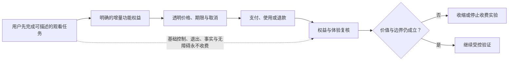
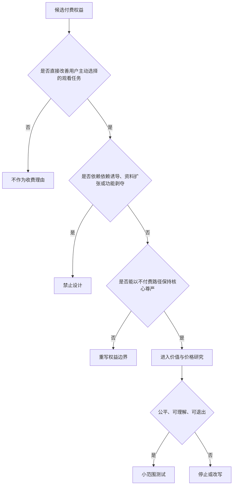
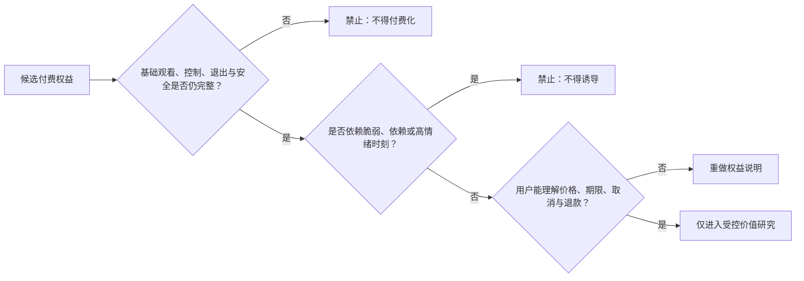

# 商业模式与定价假设

> **文档类型**：0→1 商业模式、定价研究与用户权益边界  
> **适用阶段**：核心体验获得初步验证后、任何真实收费或合作推广前；用于决定可以探索的价值交换、绝不出售的权益，以及何时应停止商业化实验。  
> **决策状态**：待验证。本文中的价格、转化、成本、渠道和单位经济均为研究假设或计算框架，不代表已被用户、市场或经营结果证明。  
> **资料边界**：仅使用公开资料、拟执行的研究和明确假设；不依赖任何既有项目材料、事后结论或实现细节。  
> **公开来源访问日**：2026-01-28。



## 1. 先回答一个比“怎么收费”更重要的问题：用户在为什么付费

足球数字陪看服务的商业化风险，不在于用户是否愿意花钱，而在于团队会不会把“陪伴”误当作可被无限提价的情感关系。若产品通过更亲密的称呼、更难离开的连续机制、更焦虑的比赛时刻或更脆弱的用户状态来提升转化，它即使短期收入增长，也是在用用户的自主性换取收入。这既不符合可信陪看的价值主张，也会带来长期信任、治理和合规风险。

因此，首轮商业化要验证的不是“用户愿意为一个角色付多少钱”，而是下面这条更窄的命题：

> 当一位成年用户已经在明确、可控、可退出的观赛情境中获得可描述的功能价值时，他或她是否愿意为一项**额外、清楚、可比较、不会影响基础控制权的功能权益**支付透明价格？

这个命题包含四个限制：

1. **付费发生在价值之后**：没有完成过明确观看任务的用户，不应被以关系或焦虑推进到购买。
2. **付费购买的是功能，不是感情**：用户购买的是更清楚的报告、更多可选的历史整理、跨场景的便捷或明确的服务范围，而不是角色更爱自己、回复更亲密或更难离开。
3. **基础权益不被绑架**：静默、退出、纠正、事实状态、无障碍、隐私选择、投诉和安全拒绝永远不应成为付费墙后的权益。
4. **拒绝不损失尊严**：用户不购买、取消、退款或选择免费路径后，不能受到降低控制、增加打扰、被区别对待或被角色化挽留。

商业模式的正确作用，是让一项已经被证明有用的服务获得可持续资源，而不是制造不存在的价值或把用户留在服务里。若首轮研究发现用户只需要免费、低频、可信的工具帮助，正确结论可能是暂不收费、改换成本结构，或停止该方向，而不是寻找更强的心理触发。

## 2. 价值与付费的关系：先证明增量，后讨论价格

### 2.1 三层价值交换

商业化前必须把用户得到的价值拆成三层，防止把底层权利当作“会员福利”。

**价值层：基础安全与控制**
- **用户应得到什么**：服务性质说明、事实状态、不确定提示、静默、结束、无障碍替代、数据选择、投诉与风险拒绝
- **是否可以收费**：**绝不收费**
- **原因**：这些是使用服务的前提和用户权益，不是可售权益

**价值层：核心任务价值**
- **用户应得到什么**：在限定范围内主动请求上下文恢复、规则/事件解释、低负担回应
- **是否可以收费**：首轮原则上保留可用免费路径
- **原因**：若核心任务完全被锁住，就无法判断用户是在为价值付费还是被限制逼付费

**价值层：可选增量功能**
- **用户应得到什么**：经过验证的赛后结构化回顾、跨场次整理、用户主动设置的便捷偏好、明确范围内的内容包
- **是否可以收费**：**可研究**
- **原因**：必须能说清与基础路径相比多解决了什么具体任务

付费功能的判断句应当是：“即使用户永远不购买，他或她也能安全、完整地使用基础服务；购买后只获得自己主动选择的额外便利或深度。”如果不能满足这句话，该功能不应进入定价研究。

### 2.2 用户愿意付费的四种合理原因

首轮研究只承认以下四种合理的付费理由，并要求用户用自己的话说明：

**合理理由：节省时间**
- **例子**：赛后用清楚结构快速回顾几场自己关心的比赛
- **需要验证的用户结果**：用户更快获得可用梳理，且不必重新搜索
- **不能被伪装成这一理由的行为**：用强提醒制造“怕错过”

**合理理由：获得已验证的深度**
- **例子**：用户主动选择更细的规则、战术或历史脉络解释
- **需要验证的用户结果**：用户确实理解更多，并能随时停止
- **不能被伪装成这一理由的行为**：用晦涩术语把基础信息人为变难

**合理理由：提升可控便利**
- **例子**：用户主动保存自己的低干扰偏好、常用设置或有限回顾入口
- **需要验证的用户结果**：用户更少重复设置、更少被打扰
- **不能被伪装成这一理由的行为**：把静默或退出等基础控制设为付费

**合理理由：获得透明的内容范围**
- **例子**：用户选择明确标注的专题、档案或赛事整理服务
- **需要验证的用户结果**：用户知道包含什么、何时结束、能否取消
- **不能被伪装成这一理由的行为**：用模糊的“专属陪伴”承诺替代范围说明

不合理的付费理由包括：“角色会更在乎我”“不付费就会失去关系连续性”“为了不让它失望”“别人都在拥有更亲密的版本”“今天这场很难过，需要立刻升级”。这些动机可能会出现，但它们是风险信号，不是商业机会。

### 2.3 价值先于支付的证据链

在向用户展示任何价格之前，至少要获得下列证据链中的前两层：


若价值链断在“免费最小路径已帮助完成任务”之前，任何付费意向都只能被视为对概念、新鲜感、礼貌或研究关系的反应。若断在“明确的增量需求”之前，价格研究应暂停，因为团队还不知道要卖什么。

## 3. 候选商业模式：按用户权益与风险筛选，而不是按收入想象力排序

### 3.1 候选模式总览

> 信息卡：原宽表已改为纵向阅读，字段含义不变。

- **模式：单次功能包**
  - **用户购买的对象**：一次明确的赛后回顾、专题整理或限期内容包
  - **潜在优点**：价格与价值边界清楚，取消负担低
  - **主要风险**：易被设计成比赛高情绪时的冲动购买
  - **首轮态度**：可在价值验证后研究

- **模式：月度工具会员**
  - **用户购买的对象**：一组稳定、可列举的便捷与深度功能
  - **潜在优点**：便于覆盖持续服务成本，用户容易比较
  - **主要风险**：易把连续订阅与连续关系混淆
  - **首轮态度**：可作为后续候选，需严格权益边界

- **模式：赛季/赛事内容包**
  - **用户购买的对象**：明确赛事范围内的整理、档案或分析内容
  - **潜在优点**：服务范围、开始和结束时间可说明
  - **主要风险**：容易夸大“全程陪伴”承诺或暗示必看
  - **首轮态度**：可研究，但先从非关键实时场景开始

- **模式：赞助/品牌合作**
  - **用户购买的对象**：独立标识的、与主服务分离的推广内容
  - **潜在优点**：可能降低用户直接支付压力
  - **主要风险**：广告影响事实、角色语气与信任
  - **首轮态度**：暂不作为 MVP 收入来源

- **模式：B 端授权/合作服务**
  - **用户购买的对象**：为合作方提供明确工具或内容能力
  - **潜在优点**：可能有较高客单与稳定合同
  - **主要风险**：合作方目标可能推动过度采集、强转化或内容失真
  - **首轮态度**：仅在用户权益可被写入合同后研究

- **模式：礼物、亲密等级、角色装扮付费**
  - **用户购买的对象**：角色关系、情绪反馈、身份表现
  - **潜在优点**：看似高互动和高毛利
  - **主要风险**：直接把情感依恋与消费绑定
  - **首轮态度**：明确排除

- **模式：广告解锁基础控制/去广告赎回**
  - **用户购买的对象**：安静、退出、无障碍或隐私权
  - **潜在优点**：短期可能提高收入
  - **主要风险**：把用户权益变成交易筹码
  - **首轮态度**：明确排除

- **模式：博彩、预测、胜负刺激变现**
  - **用户购买的对象**：比赛结果、风险偏好或下注冲动
  - **潜在优点**：看似与体育强相关
  - **主要风险**：损害可信定位并带来重大风险
  - **首轮态度**：明确排除

### 3.2 暂定优先顺序

首轮不应急于收费。推荐的顺序是：先验证免费最小服务合同；再研究**单次、范围清楚、赛后或非高情绪时段的功能包**；只有当重复功能价值、取消理解和成本结构均被证明后，才研究月度工具会员。赞助、B 端合作、赛事内容包和更复杂的组合，应等待核心用户权益、事实边界和服务质量稳定后再讨论。

这个顺序的原因并非“单次包一定更赚钱”，而是其研究可逆性更强：用户不需要承诺长期关系，团队也较容易观察其是否真的为一项具体功能付费。月度会员会放大自动续费、连续性损失、权益不清和使用不足的风险，因此不应成为最早的实验入口。

### 3.3 模式选择评分卡

每一种候选模式在进入研究前，使用 0–2 分评分卡。总分只用于排序，不可覆盖红线。

**维度：功能清晰**
- **0 分**：用户说不清买到什么
- **1 分**：能说出大致价值但边界模糊
- **2 分**：功能、范围、持续时间和限制可被复述

**维度：任务增量**
- **0 分**：与免费路径没有区别
- **1 分**：有便利但用户结果不清
- **2 分**：明确减少时间/认知负担或增加自选深度

**维度：取消可逆**
- **0 分**：取消困难或损失基础权益
- **1 分**：可取消但后果不够清楚
- **2 分**：一步可理解取消，不损失控制或基础任务

**维度：关系隔离**
- **0 分**：需要亲密话术或连续性压力
- **1 分**：有潜在关系误解
- **2 分**：不依赖角色感情、义务或独占感

**维度：情绪安全**
- **0 分**：在高情绪时推动交易
- **1 分**：时机控制不明确
- **2 分**：明确避开失落、冲突、深夜脆弱等高风险时刻

**维度：信息透明**
- **0 分**：价格、税费、自动续期或内容范围模糊
- **1 分**：有说明但层级不清
- **2 分**：关键条件在购买前显著可见、可理解

**维度：成本可控**
- **0 分**：必须依赖不透明人工或过度数据
- **1 分**：成本模型未完整
- **2 分**：单位服务输入和支持负担可说明

任何候选若在“关系隔离”“情绪安全”或“信息透明”得 0 分，则无需计算总分，直接淘汰。其余候选建议达到 11/14 分才进入概念研究。

## 4. 定价假设：价格是要研究的输入，不是团队想要的结果

### 4.1 定价原则

定价不是在用户最投入、最焦虑或最想分享时寻找其最大可承受金额。首轮遵循六条原则：

1. **按功能边界定价，不按关系深度定价**：价格与具体内容、时长、使用范围或便捷功能对应。
2. **先展示全价与全部条件**：不以小字隐藏服务期、续期、税费、退款或内容限制。
3. **不以倒计时、虚假稀缺或情绪文案催促**：比赛本身已有紧张感，服务不额外制造紧迫。
4. **用户可比较**：免费路径、单次包和会员各解决什么、缺少什么，应在同一页面清楚比较。
5. **取消先于购买**：在购买前就能理解如何取消、何时生效、取消后保留什么。
6. **价格调整可预期**：不对已购买用户突然改变核心权益、用损失威胁续费，或以不透明分层制造歧视。

FTC 关于暗黑模式的公开报告提醒，在线服务中被设计成误导、强迫、掩盖或增加取消难度的选择架构会伤害消费者 [S1]。这类风险在陪伴型服务中更敏感，因为角色语言与比赛情绪可能进一步放大压力。

### 4.2 暂定价格卡：只用于研究，不是公开报价

在未完成价值与成本验证前，价格卡只应作为研究材料，并明确标记“假设示例，不构成销售”。以下人民币区间的目的，是帮助比较用户对功能边界和支付方式的反应；它们不代表最终价格。

> 信息卡：原宽表已改为纵向阅读，字段含义不变。

- **假设包：P0 免费基础路径**
  - **暂定权益描述**：限定范围内的主动上下文恢复、解释、控制和退出
  - **假设价格带**：0 元
  - **研究问题**：用户是否能先获得核心任务价值？
  - **必须排除的权益**：不以功能缺失制造无法使用

- **假设包：P1 单次赛后整理包**
  - **暂定权益描述**：一场或一组明确比赛的结构化赛后回顾、可选深度解释与有限保存期
  - **假设价格带**：5–9 元/次
  - **研究问题**：用户是否为节省回顾时间与自选深度付费？
  - **必须排除的权益**：角色亲密回复、基础纠错、静默/退出

- **假设包：P2 月度工具会员**
  - **暂定权益描述**：明确数量的赛后整理、个人主动设置快捷方式、可解释的内容档案范围
  - **假设价格带**：18–28 元/30 天
  - **研究问题**：用户是否愿意为重复出现的功能便利付费？
  - **必须排除的权益**：基础比赛信息、关系连续性、隐私控制

- **假设包：P3 赛事主题包**
  - **暂定权益描述**：预先声明赛事范围、内容类型、开始结束日期的专题整理
  - **假设价格带**：28–48 元/主题期
  - **研究问题**：用户是否为明确内容范围而非“全程陪伴”付费？
  - **必须排除的权益**：保证赛果、优先情感回应、主队优待

价格带应通过“低、中、高”三个版本与相同权益描述比较，观察用户是否能解释价值、是否觉得公平、是否在不同情绪状态下改变理由，而不是只问“愿意付多少钱”。若用户只能说“因为我喜欢这个角色所以愿意买”，该回应不计作功能付费意向。

### 4.3 不做免费试用陷阱

免费体验可以用于让用户理解功能，但不得采用默认续费、要求难以取消的支付授权、在结束前突然提示损失、或用角色化语言催促转正的方式。若未来研究免费体验，应采用以下最小规则：期限、包含内容、到期后的行为和是否需要任何行动都在开始前写清；到期后默认回到安全可用的免费路径；用户拒绝或不续费时不丢失基础控制、不会被增加提醒，也不会被角色表达为“离开”。

## 5. 权益边界：哪些能卖，哪些永远不能卖



### 5.1 永不付费化的用户权益

以下能力是服务合同的一部分，必须对所有用户保持可用，即使用户从未付费、刚取消或处于任何计划外状态：

- 清楚知道服务是数字生成或合成内容、知道信息的确认状态和能力边界；
- 静默、停止当前表达、结束会话、减少动效、仅文字等控制；
- 查看、修改、撤回与删除个人选择所必需的入口；
- 纠正错误、报告剧透/有害内容、获得安全拒绝与投诉处理；
- 不被排他、恋爱化、愧疚、挽留、情绪催促或商业诱导；
- 不被因为未付费而降低事实清晰度、无障碍替代或退出便利性；
- 不被广告、合作内容或付费推荐伪装成事实、角色观点或必要提示。

把这些内容藏进“高级版”会直接破坏用户自主性，也会使收入数据无法解释：用户究竟是在购买功能，还是在赎回本应拥有的权利？

### 5.2 可研究但必须有限的增量权益

只有在用户任务与成本都被研究支持时，才可探索下列类型：

**权益类型：赛后结构化回顾**
- **可接受的边界**：范围、保留期、信息深度明确，用户主动打开
- **用户可见说明**：“包含哪些比赛、保留多久、不能做什么”
- **不得演变成**：用赛后失落延长无止境的情绪陪聊

**权益类型：深度解释档案**
- **可接受的边界**：以规则、战术、历史脉络等可核查内容为中心
- **用户可见说明**：“这是补充解释，不代表唯一观点”
- **不得演变成**：用术语制造基础信息缺失

**权益类型：便捷设置**
- **可接受的边界**：用户主动保存低打扰、文字优先、常用赛事等选择
- **用户可见说明**：“你可以随时改或删除这些选择”
- **不得演变成**：以记忆连续性制造离开损失

**权益类型：专题内容包**
- **可接受的边界**：主题、有效期、更新节奏和边界预先声明
- **用户可见说明**：“这是内容范围，不是全程陪伴承诺”
- **不得演变成**：暗示不购买会错过关系或被角色遗忘

**权益类型：透明合作内容**
- **可接受的边界**：与主服务、事实和角色表达清楚分离
- **用户可见说明**：“这是推广/合作信息，可关闭”
- **不得演变成**：伪装成建议、情绪回应或比赛事实

### 5.3 绝对禁止的商业设计



- 付费解锁角色更亲密、更专属、更依赖用户的表达；
- 以关系等级、连续对话、回应速度、情绪安抚或“只属于你”作为商品；
- 在失利、争议、深夜孤独、用户表达脆弱或高情绪时发送购买刺激；
- 使用倒计时、限量、任务链、连续签到、损失提示来制造非必要付费压力；
- 将用户的非购买、取消或长时间未打开，反馈给角色并让角色表现失望；
- 因用户未付费而减少静默、结束、纠错、无障碍、隐私和安全支持；
- 按用户推断的情绪脆弱性、关系依恋或不可解释特征实行差异价格；
- 将用户的对话、偏好或情绪数据作为不可见交易品，或用其交换更亲密的表现。

## 6. 成本与单位经济：不能靠隐藏成本或风险补贴价格

### 6.1 单位经济的目的

单位经济并不是要求 MVP 立刻盈利，而是要求团队知道：每一笔潜在收入覆盖了哪些真实投入，哪些成本会随场次增加，哪些成本来自应当保留的安全与支持能力，哪些则是范围过大造成的浪费。若不先拆成本，很容易把“低价高增长”建立在未计入事实核验、无障碍、用户支持、内容治理或退款负担的幻想上。

### 6.2 基础公式

令：

```text
净收入（NR） = 标示价格（P） - 支付渠道费用（F） - 税费与不可避免的退款准备（T）

单次可变成本（VC） = 内容/信息维护（Ci）
                + 交互与媒介交付（Cd）
                + 用户支持与退款处理（Cs）
                + 内容治理与风险处置（Cg）
                + 必要的数据保护与合规操作（Cp）

单次贡献（CM） = NR - VC

单位有效陪看成本（CECS） = 为合格场次投入的直接成本 ÷ 有效陪看场次（ECS）

贡献覆盖率 = 累计 CM ÷ 分摊后的固定研究、设计、运营与治理投入
```

这些变量应按功能包、赛事范围和用户支持条件分别计算，不能把免费核心服务、付费增量服务和合作推广混成一个平均数。早期仍可出现负贡献，但团队必须说明负数来自学习投入、服务范围过大、用户支持尚未收敛，还是商业模式本身没有足够增量价值。

### 6.3 成本分类与不可削减项

**成本类别：赛事与内容维护**
- **例子**：限定范围内的事实状态、解释材料、时序核对
- **是否可通过范围收缩降低**：可以；先减少赛事/场景范围
- **是否可以为了提价而牺牲**：不可以牺牲可信边界

**成本类别：交互与媒介交付**
- **例子**：文字、声音、视觉等服务交付
- **是否可通过范围收缩降低**：可以；默认文字优先、按需开启
- **是否可以为了提价而牺牲**：不可以牺牲用户控制与可访问性

**成本类别：用户支持**
- **例子**：取消、退款、纠错、投诉和使用说明
- **是否可通过范围收缩降低**：可以；优化清楚度与自助路径
- **是否可以为了提价而牺牲**：不可以把取消变难或降低响应

**成本类别：治理与风险处置**
- **例子**：内容审核、异常暂停、适龄和隐私评审
- **是否可通过范围收缩降低**：可以；先缩小高风险能力
- **是否可以为了提价而牺牲**：不可以视为“非核心成本”删除

**成本类别：支付与税费**
- **例子**：渠道、发票/收据、退款准备
- **是否可通过范围收缩降低**：部分可通过模式选择降低
- **是否可以为了提价而牺牲**：不可以隐藏在价格说明之外

**成本类别：研究与学习**
- **例子**：招募、访谈、原型、复核与记录
- **是否可通过范围收缩降低**：可以随不确定性减少而收敛
- **是否可以为了提价而牺牲**：不可以用更少研究掩盖风险

核心原则是：如果一个价格只能通过削弱事实清晰、退出便利、用户支持、可访问性或治理来成立，那么不是“成本高”，而是该价格或模式不成立。

### 6.4 暂定单位经济情景

下表不填真实数字，而用情景问题替代虚假的财务预测：

**情景：A：单次包有功能价值**
- **关键假设**：用户完成免费路径后，愿为明确赛后回顾付一次透明价格
- **需要观察的读数**：功能价值叙述、购买后满意、退款、取消理解、CM
- **可能的结论**：若价值清楚且成本可控，可继续研究单次模型

**情景：B：会员有重复便利价值**
- **关键假设**：同一用户在多场景重复遇到相同增量需求
- **需要观察的读数**：自愿续期理由、未使用原因、权益理解、CM
- **可能的结论**：若理由是便利而非关系，可小范围比较

**情景：C：用户只要免费核心**
- **关键假设**：用户认可帮助但不觉得增量功能值得支付
- **需要观察的读数**：免费路径价值、替代方式、成本
- **可能的结论**：应调整成本/合作假设，而非逼迫转化

**情景：D：收入靠高情绪转化**
- **关键假设**：高情绪时购买明显多，但用户理由含依赖/焦虑
- **需要观察的读数**：情绪与购买时机、关系反指标、退款
- **可能的结论**：立即停止该触发，判定为不合格收入

**情景：E：成本被人工掩盖**
- **关键假设**：表面低价但每场需要高密度人工处理
- **需要观察的读数**：人工介入率、支持负担、服务质量差异
- **可能的结论**：收缩范围或停止，不把它当可规模模式

## 7. 伦理与反依赖约束：收入不能从用户的退出困难里产生

### 7.1 商业化的九条红线

1. 不以角色的爱、失望、孤独、等待或专属感推动购买。
2. 不在用户明显失落、焦虑、冲突、深夜脆弱或表达孤独时进行个性化商业触发。
3. 不以连续天数、亲密等级、不可恢复记忆或“再不购买就失去”制造损失厌恶。
4. 不把更快、更温柔或更亲密的回应速度设为付费差异。
5. 不因取消、退款或拒绝购买而改变角色对用户的尊重、事实质量或基础控制。
6. 不用推断出的情绪、依赖、关系强度或其他敏感特征决定价格、折扣或推送。
7. 不把广告、赞助、联盟链接或合作推荐伪装成角色真心建议。
8. 不向未完成适龄审查的人群试探关系型付费、盲盒式权益或高压力订阅。
9. 不把“用户愿意花更多”当作合理定价的充分理由；必须说明对应的功能增量和用户结果。

### 7.2 高风险商业时机清单

| 时机 | 为什么高风险 | 默认动作 |
| --- | --- | --- |
| 主队刚失利、争议判罚或用户表达愤怒 | 情绪强、决策冲动高，可能把购买当作安慰或补偿 | 不展示商业信息，只提供静默/结束/中性回顾选择 |
| 用户说“只有你理解我”“别离开” | 可能出现关系依赖或角色误解 | 停止任何转化，回到边界说明与可退出路径 |
| 深夜、连续使用很久、用户未主动请求 | 注意力与自控可能下降 | 不增加提醒、优惠或自动续期提示 |
| 用户刚取消、退款或选择免费 | 用户正在行使选择权 | 确认选择，不挽留、不降权、不追问 |
| 未完成服务说明或控制任务 | 用户还无法理解交易后果 | 不允许进入付款流程 |
| 信息状态冲突或服务能力不足 | 信任已受影响 | 先修复、说明或收缩，不出现推广 |

### 7.3 商业表达与角色表达的隔离

商业信息应有独立的视觉、语言和入口：清楚标注推广/合作/收费；由中性服务文案说明价格和权益；用户可直接关闭；不由角色以“我想要”“为了我们”“我给你准备了”这类第一人称情感语言代言。角色可以在用户主动询问时中性地说明“这里有一个可选功能包”，但不得把选择转化为关系评价。

美国联邦贸易委员会对在线广告与披露的公开材料强调，重要商业信息需要清楚、显著而不误导 [S2]。对本服务而言，“清楚”不仅是把“推广”两个字放上去，还包括让用户不会把合作推荐误认为比赛事实、不会把购买误认为维护关系的必要条件。

## 8. 定价研究：研究真实价值判断，不诱导用户掏钱

### 8.1 研究问题

**编号：R1**
- **问题**：用户是否能清楚说出免费路径解决了什么？
- **需要的证据**：任务后具体价值叙述、未使用原因
- **不能用来回答的问题**：最终价格

**编号：R2**
- **问题**：用户是否能说出一个未被免费路径满足的增量任务？
- **需要的证据**：对替代方式、时间/理解负担的描述
- **不能用来回答的问题**：用户对角色的好感

**编号：R3**
- **问题**：用户是否理解不同权益包、价格、期限、取消和退款？
- **需要的证据**：无提示复述、比较任务、取消任务
- **不能用来回答的问题**：真实需求规模

**编号：R4**
- **问题**：用户是否认为价格与功能边界公平？
- **需要的证据**：价格卡排序、理由、反例访谈
- **不能用来回答的问题**：最大可榨取金额

**编号：R5**
- **问题**：用户的支付意向是否稳定地指向功能价值？
- **需要的证据**：跨情境重复访谈、非高情绪时的选择
- **不能用来回答的问题**：由比赛高潮产生的冲动

**编号：R6**
- **问题**：购买后是否仍保有控制与退出，而不产生关系压力？
- **需要的证据**：购买/不购买对照中的控制任务、边界自述
- **不能用来回答的问题**：长期商业模型

### 8.2 四阶段研究路径

**阶段一：历史行为访谈。** 不先展示价格，询问参与者过去为哪些体育内容、效率工具、知识服务或便利功能付过钱；当时解决了什么、可替代方式是什么、什么时候后悔、如何取消。重点不是收集“会不会买”的承诺，而是理解真实支付时的价值、信任和后悔机制。

**阶段二：权益可理解研究。** 向用户展示免费路径与一到两个假设包，要求其无提示复述：哪些永远免费、付费多了什么、何时到期、怎样取消、取消后还有什么。若用户认为“不付费就不能静默/不能被尊重/角色会忘记我”，说明权益边界失败，不能进入价格讨论。

**阶段三：价格卡对照。** 在非高情绪的回顾情境中，对同一权益包展示低、中、高三个价格带，随机改变展示顺序，询问选择、拒绝和理由。重点观察功能理解、价格公平感、替代方式和“我不会买”的原因。拒绝理由与愿意理由同等重要。

**阶段四：有限真实交易验证。** 只有在免费价值、权益理解、取消理解、风险审查和退款支持都通过后，才可让少量成年自愿参与者做真实、可退款、非自动续期的购买选择。研究材料必须明确这是一项有限验证；不使用情绪触发、默认勾选、倒计时或角色推动。任何退款、后悔、误解或边界不适都应进入最高优先级复盘。

### 8.3 价格敏感性不等于价格歧视

可以研究不同用户对功能价值的理解差异，但不能基于隐私推断、情绪脆弱、依赖信号、深夜行为、非购买历史或不可解释画像给出个性化高压价格。首轮应采用公开、可比较、同一权益同一价格的价格卡；若未来需要地区、渠道或合作差异，也必须提前说明差异依据，不得让用户猜测为什么自己更贵。

### 8.4 研究中的保护措施

- 所有价格材料标记为研究假设，除进入第四阶段外不收款；
- 研究员不得在用户失落、争执或表达孤独时提出支付问题；
- 参与者可跳过任何与消费能力、支付偏好有关的问题；
- 补偿与是否表达购买意向、是否购买或是否分享财务信息无关；
- 研究记录不将“愿意付费”解释为“更高价值用户”；
- 若出现“我怕角色不理我”“不买会失去关系”的表述，立即停止该段商业访谈并记录边界风险；
- 真实收费前必须给出取消、退款、客服和投诉的可独立理解说明。

## 9. 商业指标：衡量公平的价值交换，而不是最大化转化

### 9.1 主指标与辅助指标

商业阶段的候选主指标不应是总收入，而是**合格自愿付费选择数**：用户在完成过相关免费价值、理解权益与取消、未处于高风险情绪时段、且没有关系边界异常的条件下，主动选择一项功能包的次数。即使这个数字上升，也必须与退款、取消理解、功能使用和安全反指标一起阅读。

```text
合格自愿付费选择 =
已完成相关免费任务价值
∧ 正确理解权益、价格、期限和取消
∧ 不是由高情绪/关系触发引导
∧ 用户主动确认选择
∧ 购买后基础控制与退出保持完整
```

**指标：权益理解率**
- **暂定公式**：能正确复述权益/价格/期限/取消的人数 ÷ 查看价格卡的人数
- **用途**：判断是否能进入真实交易
- **不可单独解释为**：用户一定愿意买

**指标：合格意向率**
- **暂定公式**：在满足价值与理解条件后表达愿意考虑的人数 ÷ 合格研究参与者人数
- **用途**：评估研究方向
- **不可单独解释为**：真实转化或市场规模

**指标：合格自愿付费选择数**
- **暂定公式**：满足上述资格的真实选择次数
- **用途**：观察公平交换是否存在
- **不可单独解释为**：收入增长质量

**指标：功能使用兑现率**
- **暂定公式**：购买后实际使用所购功能的人数 ÷ 购买者人数
- **用途**：检查是否卖了用户真正需要的东西
- **不可单独解释为**：长期满意

**指标：退款/后悔率**
- **暂定公式**：主动退款、表示误解或后悔的人数 ÷ 购买者人数
- **用途**：检查权益与价格清晰度
- **不可单独解释为**：单纯“价格太高”

**指标：取消理解成功率**
- **暂定公式**：用户独立完成取消并说清后果的人数 ÷ 尝试取消的人数
- **用途**：检查可逆性
- **不可单独解释为**：用户会不会再买

**指标：单位贡献**
- **暂定公式**：单次贡献 CM 的分布
- **用途**：判断模式的成本结构
- **不可单独解释为**：用户价值或安全

**指标：非购买后公平体验率**
- **暂定公式**：未购买/已取消用户仍能完成基础控制和任务的人数比例
- **用途**：防止付费墙伤害权益
- **不可单独解释为**：收入潜力

### 9.2 必须与收入并列的反指标

| 类别 | 反指标 | 触发后的动作 |
| --- | --- | --- |
| 关系 | 购买理由包含害怕失去角色、维持亲密、被挽留或角色需要我 | 立即停止相关表达和报价场景 |
| 情绪 | 高情绪、失利、深夜或脆弱表达附近的购买比例异常 | 停止该时机的商业展示，改为全局冷静期 |
| 理解 | 用户不能说清价格、自动续期、取消、退款或免费/付费边界 | 暂停交易，重做权益与说明 |
| 公平 | 未付费用户的静默、退出、事实清晰或无障碍成功率下降 | 移除付费墙，恢复基础权益 |
| 信任 | 用户把合作推荐、角色建议或推广当作客观事实 | 暂停合作表达，增强标识与隔离 |
| 支持 | 退款、投诉、人工解释、取消困难显著上升 | 收缩包结构或停止收费路径 |
| 成本 | 收入增长同时人工审核/支持负担超出可说明范围 | 不扩大售卖，先收缩范围或调整交付 |

### 9.3 购买后体验也要被验证

商业化研究最容易停在“愿意付款”这一刻。但用户体验真正的判断发生在购买后：是否得到预期功能、是否知道服务何时结束、是否仍能安静看球、是否能够轻松取消、是否感觉关系被改变、是否后悔或感到被误导。因此，购买后 24 小时和一个相关观看场景后，都应提供可跳过的中性反馈入口，重点问“你买到的是否和理解的一样”“是否影响了控制/退出”“若不买是否仍会得到尊重”。不要用角色口吻追问满意度。

## 10. Go / No-go / 停止门槛

### 10.1 进入价格研究的前置条件

在任何价格卡或真实交易研究前，必须同时满足：

- 免费最小服务路径已在目标情境中证明至少一项具体任务价值；
- 用户能独立完成静默、结束、信息状态识别和关键无障碍替代；
- 角色表达、事实状态和用户权益边界已通过高风险场景复核；
- 所有候选权益能被清楚写成功能、范围、期限、取消和不包含什么；
- 用户研究、退款、支持、投诉与暂停责任已经明确；
- 没有任何需要通过自动续期、默认勾选、强提醒或情绪触发才会成立的收入假设。

### 10.2 暂定 Go 条件

下列数字仅作为研究起点，应随样本、风险和场景更新，但更新理由必须留档：

| 条件 | 暂定要求 | 为什么重要 |
| --- | --- | --- |
| 权益理解 | 至少 85% 的合格参与者无提示复述权益、价格、期限与取消后果 | 不理解的购买不是有效选择 |
| 基础权益完整 | 100% 的研究材料中，未购买/已取消路径仍保留静默、结束、事实状态与无障碍控制 | 权益不能以平均分交易 |
| 价值关联 | 至少 60% 的有意向参与者能将理由指向明确增量功能，而非角色关系 | 证明付费对象是功能 |
| 取消可逆 | 至少 90% 的尝试者可独立完成取消并说清之后保留什么 | 防止续费和退出陷阱 |
| 风险红线 | 关系操控、情绪催促、虚假稀缺、未说明续期、事实/推广混淆均为零容忍 | 信任和安全不可被转化覆盖 |
| 成本可解释 | 每个包的净收入、可变成本、支持与治理投入均可说明 | 防止用遗漏成本宣称可持续 |

满足条件不意味着可大规模售卖，只表示值得用更小、可退款、非自动续期的真实选择继续研究。

### 10.3 No-go 的收缩路径

| 发现 | 正确收缩 | 不应采取的补救 |
| --- | --- | --- |
| 用户认可免费帮助但没有增量需求 | 维持免费核心，研究成本或合作而非加价 | 把基础功能锁起来强造需求 |
| 用户不理解会员与单次包区别 | 只保留一个边界最清楚的单次包 | 加更多层级、昵称和复杂折扣 |
| 用户愿为赛后整理付费但不愿订阅 | 优先研究单次/主题包 | 用自动续期或连续损失逼订阅 |
| 用户喜欢角色却不愿为功能付费 | 分离角色好感与商业判断 | 把亲密功能做成付费诱饵 |
| 退款集中在权益误解 | 重写说明、降低复杂度、扩大退款保护 | 把退款流程变难或归责用户 |
| 成本只有在减少支持/治理后才下降 | 缩小服务范围或停止 | 静默削减安全和用户权益 |

### 10.4 立即停止条件

出现以下任一情况，立即停止相关定价、推广或合作场景，不等待研究周期结束：

- 角色语言、界面或服务流程让用户觉得购买是在维系关系、避免角色受伤或获得独占感；
- 在用户明显脆弱、高情绪、失利、深夜或表达孤独时进行个性化转化；
- 取消、退款、自动续期、价格、税费、内容范围或合作身份被误解、隐藏或难以完成；
- 未付费用户因此失去静默、结束、纠错、事实状态、无障碍或数据控制；
- 任何商业信息被用户误认为比赛事实、必要系统信息或角色的无利益建议；
- 单位经济只能通过过度收集、不可解释差异价格、削弱风险处置或忽略用户支持来成立；
- 任何未完成适龄保护条件的人群被纳入关系型或压力型付费研究。

## 11. 运营与合规前置：收费前先把退路修好

### 11.1 运营准备清单

在对任何真实用户收费前，至少应具备下列能力。它们不是“规模化后再补”的后台事项，而是用户能否作出有效选择的一部分。

| 领域 | 上线前最低问题 | 通过标准 |
| --- | --- | --- |
| 价格说明 | 用户能否在付款前看到完整价格、范围、期限、包含/不包含项？ | 无提示复述正确，且信息不依赖小字或跳转 |
| 取消与退款 | 用户能否不解释理由就取消、申请退款并理解结果？ | 当前流程可独立完成，支持路径清楚 |
| 客户支持 | 有误解、重复扣费、权益未兑现或内容问题时，用户找谁？ | 联系入口、响应承诺和升级责任可见 |
| 商业标识 | 推广、合作、赞助与服务事实是否可一眼区分？ | 标识显著，角色不伪装商业意图 |
| 数据选择 | 支付与功能所需数据是否最小、目的是否明确、是否可撤回？ | 用户知道收集什么、为何收集、如何管理 |
| 适龄与脆弱场景 | 谁不应看到或购买哪些内容？ | 招募、入口、保护与暂停规则明确 |
| 风险处置 | 发现情绪操控、取消困难或误导时，谁能立刻叫停？ | 暂停权不依赖收入负责人批准 |

### 11.2 公开规则如何影响产品设计

面向公众提供生成式服务时，内容安全、用户投诉、未成年人保护和服务治理需要在商业流程前被考虑 [S6]。生成合成内容标识规则也会影响入口告知、角色呈现、商业材料与上架准备 [S8]。个人信息处理中的目的明确、最小必要与告知同意原则，意味着支付与个性化不能成为无限扩张数据的理由 [S7]。这些公开规则不替代法律意见，但足以说明：价格页、续期、角色文案、数据说明和客服流程共同构成产品，而不是独立的“商业部门事务”。

### 11.3 合作与赞助的额外约束

如果未来探索合作收入，合同与体验必须同时写入四项保护：合作方不能决定比赛事实表述或角色关系话术；商业内容不能以用户情绪、脆弱或关系推断为定向条件；合作展示不能妨碍静默、退出、无障碍或基础任务；用户能清楚识别并关闭非必要推广。若合作方要求更高曝光、更多数据或更强情绪触发，正确的商业决定是拒绝合作，而不是让产品为合同让路。

## 12. 建议的 10 周研究计划

**周期：第 1–2 周**
- **要回答的问题**：免费路径是否已有具体价值？
- **主要活动**：回顾用户任务、未使用原因与替代方式，不展示价格
- **决策产物**：是否值得研究任何增量权益

**周期：第 3–4 周**
- **要回答的问题**：哪个增量需求真实且可描述？
- **主要活动**：功能包概念访谈、权益边界复述、反例收集
- **决策产物**：仅保留一到两个功能清晰的候选包

**周期：第 5 周**
- **要回答的问题**：用户能否理解免费/付费、期限和取消？
- **主要活动**：中性价格卡、取消任务、非购买路径评审
- **决策产物**：是否可进入价格区间比较

**周期：第 6–7 周**
- **要回答的问题**：哪个价格带与权益边界被认为公平？
- **主要活动**：低/中/高价格卡对照、历史支付访谈
- **决策产物**：价格假设与拒绝原因，不作真实售卖

**周期：第 8 周**
- **要回答的问题**：是否存在情绪、关系或商业标识风险？
- **主要活动**：高风险时机走查、角色/商业隔离评审
- **决策产物**：停止清单、改写方案与暂停责任

**周期：第 9–10 周**
- **要回答的问题**：是否可做有限真实选择？
- **主要活动**：退款、支持、同意、取消和成本情景预演
- **决策产物**：Go / No-go / Stop 决定与下一轮范围

计划中最重要的产出不是“找到最高价格”，而是找到一个用户能理解、能拒绝、能取消、不会伤害基础权益的最小价值交换。若没有这个产出，商业化应继续停留在研究阶段。

## 13. 商业化评审运行机制：每一笔收入都要能解释其来源

### 13.1 每周商业化评审的固定问题

在价格卡、权益包或真实交易研究期间，建议设置独立于增长讨论的短评审。评审不以“本周多卖了多少”开场，而按下列顺序提问：

1. 本周期是否发生任何关系操控、情绪催促、权益误解、取消困难或商业标识混淆？若有，是否已暂停相邻场景？
2. 购买或意向是否建立在已验证的免费价值之后？用户能否明确说出购买的是哪项增量功能？
3. 未购买、已取消和退款用户的基础控制、事实清晰与服务尊重是否保持不变？
4. 用户是否能无提示复述价格、期限、包含内容、不包含内容、取消与退款后果？
5. 本周的收入、意向或单位成本变化，是由功能价值、样本差异、赛事时机、研究员解释，还是由不应使用的压力机制造成？
6. 是否有任何权益只因为“看起来容易卖”就准备进入范围，却不能回答它服务于哪一个用户任务？

所有答案都应写成条件句，而不是愿景句。例如：“仅在用户完成赛后梳理任务且能清楚复述取消后果的条件下，单次包可继续研究”；“在失利场景中，所有报价入口继续保持关闭”。条件句能让团队在未来复制正确范围，而不是复制一次偶然转化。

### 13.2 发起权益变更的最小材料

任何新增价格、折扣、权益、合作入口或续期规则，都必须提交一页变更说明，至少包含：

| 字段 | 要回答的问题 |
| --- | --- |
| 用户任务 | 它在免费路径之外新增解决了什么具体问题？ |
| 权益边界 | 用户购买后得到什么、不得到什么，期限如何、怎样取消？ |
| 价格依据 | 这是研究区间、成本情景还是已验证价格？哪些仍未知？ |
| 关系与情绪检查 | 是否会在任何脆弱或高情绪时机出现？角色是否参与表达？ |
| 基础权益检查 | 未购买、取消、退款后，哪些控制和帮助保持不变？ |
| 数据与合作检查 | 是否引入新数据、新合作方或新的商业标识风险？ |
| 成功与反指标 | 除收入外，怎样判断理解、后悔、退款、关系边界和公平？ |
| 停止条件 | 出现什么情况后必须立即下线或回退？谁有暂停权？ |

没有这张说明的商业需求不应进入研发、运营或采购排期。它的作用不是增加流程，而是让用户权益、成本和风险在“功能已经做了”之前被看见。

### 13.3 给团队的反操控提醒

当团队听到“只加一句更温柔的引导”“把取消藏深一点减少流失”“在关键比赛结束时弹一下优惠”“让角色说自己会想念用户”之类建议时，正确的默认答案应是暂停并审查，而不是先小范围尝试。商业化中的小范围伤害仍然是伤害，尤其当用户还不知道自己正被研究。真正能持续的收入，不需要依赖用户在脆弱时作出更难撤销的选择。

## 14. 结论：可持续收入必须建立在用户随时可以不付费的自由上

对足球数字陪看服务而言，最健康的商业模式不要求用户证明忠诚，也不要求角色变得更像需要被照顾的对象。它要求团队先证明免费路径确实帮助用户看球，再找出一个独立、明确、可比较的增量功能；让用户在冷静、理解全部条件的状态下自由选择；并确保不买、取消或退款后，用户仍拥有同样的基本尊重、控制和安全。

商业化可以为更可靠的内容、支持与治理提供资源，但它不能成为削减这些能力的理由。若收入只在用户难以退出、情绪被放大、关系被误导或数据被过度利用时才成立，那么正确结论不是“转化技巧还不够”，而是这条收入路径不应该存在。

## 15. 公开来源与访问记录

下列资料用于商业透明度、用户权益、生成式服务治理、无障碍和陪伴型 AI 风险的公开基线，不构成法律、税务、金融或经营建议。具体价格、退款、自动续期、广告、支付、个人信息、未成年人和市场准入要求，需在目标市场由具备资格的专业人士独立审查。

- **S1. U.S. Federal Trade Commission, *Bringing Dark Patterns to Light*。用于识别误导、强迫、隐藏和取消困难等在线商业设计风险。访问日：2026-01-28** [链接](https://www.ftc.gov/reports/bringing-dark-patterns-light)
- **S2. U.S. Federal Trade Commission, *Advertising and Marketing on the Internet: Rules of the Road*。用于商业披露、推广标识与不误导表达的公开参考。访问日：2026-01-28** [链接](https://www.ftc.gov/business-guidance/resources/advertising-marketing-internet-rules-road)
- **S3. U.S. Federal Trade Commission, *FTC Launches Inquiry into AI Chatbots Acting as Companions*。用于识别角色设计、商业化、未成年人、数据与负面影响监测的陪伴型 AI 风险。访问日：2026-01-28** [链接](https://www.ftc.gov/news-events/news/press-releases/2025/09/ftc-launches-inquiry-ai-chatbots-acting-companions)
- **S4. NIST, *Artificial Intelligence Risk Management Framework: Generative Artificial Intelligence Profile*。用于把治理、测量、风险处置与持续监测纳入商业决策。访问日：2026-01-28** [链接](https://www.nist.gov/publications/artificial-intelligence-risk-management-framework-generative-artificial-intelligence)
- **S5. W3C, *Web Content Accessibility Guidelines (WCAG) 2.2*。用于确保价格、取消、控制与商业标识在不同使用条件下可感知、可操作和可理解。访问日：2026-01-28** [链接](https://www.w3.org/TR/WCAG22/)
- **S6. 国家互联网信息办公室等，《生成式人工智能服务管理暂行办法》。用于内容安全、未成年人保护、投诉和服务治理的公开约束。访问日：2026-01-28** [链接](https://www.cac.gov.cn/2023-07/13/c_1690898326795531.htm)
- **S7. 中国政府网，《中华人民共和国个人信息保护法》。用于目的明确、最小必要、告知与同意等数据处理原则的公开法律文本。访问日：2026-01-28** [链接](https://flk.npc.gov.cn/detail2.html?ZmY4MDgxODE3YjE2ZWQ4YjAxN2I2Y2I2MzY0ZDMzZjg%3D)
- **S8. 国家互联网信息办公室等，《人工智能生成合成内容标识办法》。用于生成合成内容标识、用户告知与服务材料的风险识别。访问日：2026-01-28** [链接](https://www.cac.gov.cn/2025-03/14/c_1743654684782215.htm)
- **S9. UNICEF, *Policy Guidance on AI for Children*。用于适龄设计、儿童权益与风险评估的公开参考。访问日：2026-01-28** [链接](https://www.unicef.org/globalinsight/reports/policy-guidance-ai-children)
