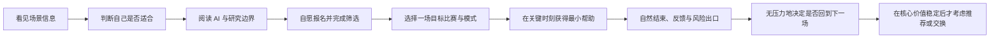
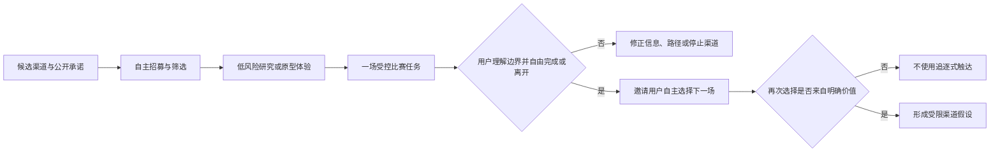
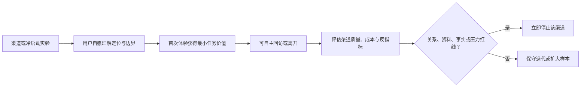

# GTM 策略与冷启动方案

> 文档类型：0→1 市场进入、首批体验与受控冷启动计划  
> 适用阶段：核心机会初判成立 → 获取首批合格参与者 → 验证价值与重复选择 → 决定是否扩展渠道  
> 版本：0.1（渠道、人群、成本和转化均为待验证假设）  
> 研究信息截止：2026-01-28  
> 核心原则：冷启动的第一目标不是最大化曝光，而是在一个真实、高频、可被尊重的观赛情境中，获得足以推翻或支持核心价值的高质量行为证据。

---

## 1. GTM 的任务：找到愿意参与，而不是制造被迫使用

对早期数字陪看服务而言，“用户获取”这个词很容易把团队带到错误方向：追求大流量、把赛事热点当作转化窗口、用情绪化内容催促注册、用高频提醒制造回访。这样可能快速得到点击，却无法判断用户是否真的需要服务，也会把陪伴关系从一开始就建立在压力和误导上。

首轮 GTM 应被理解为一套**受控市场进入与学习机制**，要完成以下四项任务：

1. 找到具有明确观赛情境的成年用户，而不是泛泛的“足球兴趣人群”；
2. 让他们在参与前理解服务是 AI、能做什么、不能做什么、如何退出；
3. 让首个体验发生在能验证核心用户任务的真实时刻，而不是脱离语境的展示；
4. 通过自主回访、具体反馈、拒绝与退出，判断是否值得扩大，而不是把研究奖励或营销刺激误当成需求。

因此，早期 GTM 成功的定义不是“曝光很高”，而是：

> 在一个边界明确的滩头场景中，用可解释、可退出、低操纵的方式，持续获得合格参与者；其中一部分人在没有强提醒的情况下完成有价值的比赛体验并自主选择下一步。

### 1.1 首轮 GTM 的非目标

为了保护学习质量和用户信任，首轮不以以下目标为导向：

- 在所有联赛、所有球队、所有地区同时获客；
- 以赛事争议、输赢情绪、孤独感或限时稀缺制造注册压力；
- 把联系人导入、社交裂变、连续签到或强提醒作为增长主引擎；
- 用模糊“真人陪看”“懂你的朋友”等话术弱化 AI 身份；
- 在核心价值尚未稳定前承诺长期服务、固定陪伴或广泛可用；
- 通过提供转播、盗播片段、博彩暗示或未经许可内容来吸引流量；
- 把参与者的私人群聊、观赛画面或敏感经历当作招募门票。

非目标并不等于放弃增长，而是把增长建立在被验证的用户成果上。若一个渠道只能靠不透明承诺或高压触达才有效，它不适合作为这类服务的起点。

---

## 2. 进入战略：先占一个观赛时刻，而不是先占一个大市场

### 2.1 选择滩头的原则

足球受众很大，不代表任何一类球迷都会接受数字陪看。第一批场景必须足够窄，才能区分“价值不成立”与“定位不清”。建议按以下五项筛选滩头：

**筛选维度：赛事共时性**
- **要问的问题**：用户是否在相近时间关注同一类重要比赛
- **合格信号**：能形成可比较的比赛日体验窗口
- **不合格信号**：用户观看高度分散，无法复盘同一时刻

**筛选维度：情境强度**
- **要问的问题**：是否存在真实的理解、表达或独自观看缺口
- **合格信号**：用户能描述最近行为和替代品摩擦
- **不合格信号**：只有抽象“可能会需要”

**筛选维度：可触达性**
- **要问的问题**：是否能以透明、许可的方式接触到符合条件的人
- **合格信号**：有高信任、小规模、可退出的招募渠道
- **不合格信号**：只能通过刷屏、买量或模糊承诺触达

**筛选维度：风险可控性**
- **要问的问题**：场景是否避免未成年人、博彩、强对立和高敏感数据
- **合格信号**：可以明确年龄、内容和退出边界
- **不合格信号**：必须依赖高风险人群或材料

**筛选维度：重复窗口**
- **要问的问题**：是否有下一场相似比赛用于观察自主回访
- **合格信号**：赛事节奏允许自然比较
- **不合格信号**：只有一次性、无法复现的事件

### 2.2 候选滩头假设

首轮不应把“所有中国球迷”或“所有喜欢 AI 的人”作为目标。可按以下假设开展研究，并由招募与行为结果决定是否保留：

> **候选滩头：** 习惯用中文关注重要足球比赛、在关键比赛中经常独自观看或缺少低压力交流对象的成年用户。他们不以博彩为主要观看动机，愿意在明确 AI 身份、可随时退出的前提下，参与一次受控的比赛陪看研究。

这个假设不是人口统计承诺，而是一个可被推翻的情境定义。它包含四个需要检验的前提：

1. “独自观看或交流缺口”确实与可观察的痛点相关；
2. 用户的主任务是理解、表达或同场感，而不是要更多资讯或投注建议；
3. 他们愿意在合法观赛之外额外选择一个辅助入口；
4. 他们在下一场相似比赛中可能再次出现，允许观察重复选择。

若其中任何前提不成立，应缩小、转向或停止。不能为了保持市场叙事而把筛选条件不断放宽。

### 2.3 区域与赛事策略

首轮选择一个可合法观看、赛程相对可预期、参与者关注度足够高的赛事类别即可。选择标准不是“观众最多”，而是“能否以少量真实场次获得可比较学习”。

| 赛事选择原则 | 原因 | 研究动作 |
|---|---|---|
| 选择用户已计划观看的比赛 | 避免为研究制造假需求 | 在招募中先问既有观看计划 |
| 选择至少有两到三次相似窗口的赛程 | 能区分一次性新奇和自主回访 | 预先登记可观察的后续窗口 |
| 避免以极端争议或高情绪比赛作为唯一依据 | 极端场景可能高估需求和风险 | 同时观察常规重要比赛 |
| 不把赛事内容当作获客资产 | 避免版权、误导和注意力劫持 | 只发布自主创作、事实性、非转播性材料 |
| 不以球队对立作为增长杠杆 | 降低攻击、仇恨与情绪操纵风险 | 文案不站队，不煽动比较或冲突 |

---

## 3. 定位与进入信息：让合适的人自己判断是否适合

### 3.1 首轮定位陈述

首轮对外表达应该足够具体、克制，并让不适合的人容易退出：

> 面向重要足球比赛的可选 AI 数字陪看研究。它在你需要时提供有限的事实澄清、简短解释或低压力回应；默认不打扰，可随时静音、结束或不保存。它不是直播、博彩建议、真人朋友或情感替代。

这段定位有意牺牲一部分“想象空间”，换取预期一致。早期最坏的情况不是有人不注册，而是不合适的人带着错误期待进入，然后把误认、不满或风险带入研究。

### 3.2 信息层级

**层级：第一眼**
- **用户需要知道什么**：这是什么、为谁而设、是否是 AI
- **推荐表达方式**：一句话清楚描述 + 明显 AI 标识
- **不应使用的表达**：“终于有人懂你”“永远陪你看球”

**层级：评估阶段**
- **用户需要知道什么**：能做什么、不会做什么、是否需要付费
- **推荐表达方式**：具体任务与边界列表
- **不应使用的表达**：模糊的“全能球迷伙伴”

**层级：报名阶段**
- **用户需要知道什么**：研究性质、适用人群、时间、退出和补偿
- **推荐表达方式**：透明筛选说明与同意摘要
- **不应使用的表达**：隐瞒研究目的或把研究说成正式服务

**层级：体验前**
- **用户需要知道什么**：数据、语音/形象、记忆、提醒的选择
- **推荐表达方式**：分步许可与可拒绝选项
- **不应使用的表达**：默认全选、长篇难懂条款

**层级：体验后**
- **用户需要知道什么**：如何结束、如何反馈、是否参与下一场
- **推荐表达方式**：中性总结与完全可选的后续邀请
- **不应使用的表达**：用角色失落、限时或稀缺催促继续

### 3.3 核心信息假设

> 信息卡：原宽表已改为纵向阅读，字段含义不变。

- **编号：M1**
  - **假设**：清晰标识 AI 和边界后，合格用户仍会愿意参与
  - **反假设**：透明说明显著降低理解或参与
  - **验证方式**：信息理解复述 + 报名行为观察
  - **决策影响**：若失败，调整表达清晰度，不降低透明度

- **编号：M2**
  - **假设**：“默认安静、只在需要时帮助”比“实时陪你看球”更能筛到合适用户
  - **反假设**：用户只对强陪伴承诺有兴趣
  - **验证方式**：两组等价文案对比
  - **决策影响**：决定首轮定位语言

- **编号：M3**
  - **假设**：具体场景描述比抽象角色描述带来更高质量报名
  - **反假设**：用户只因形象/新奇进入，后续价值弱
  - **验证方式**：报名来源与首场行为关联
  - **决策影响**：决定内容主线

- **编号：M4**
  - **假设**：说明退出、删除和不保存不会降低高质量参与
  - **反假设**：只有弱化控制才有转化
  - **验证方式**：报名后理解与退出行为观察
  - **决策影响**：控制为硬约束，不以转化换取

---

## 4. 用户旅程漏斗：从认识到自主回访

### 4.1 漏斗不是转化漏斗，而是预期与价值漏斗

早期漏斗的每一步都应允许用户“不要继续”。高质量的退出是成功，而不是漏损。只有用户经过明确选择后仍进入，后续行为才有解释价值。

### 4.2 漏斗阶段与指标

> 信息卡：原宽表已改为纵向阅读，字段含义不变。

- **阶段：认识**
  - **用户问题**：这和我有什么关系？
  - **团队责任**：用具体观赛情境而非夸张承诺解释
  - **主指标**：合格场景阅读完成率
  - **反指标**：纯猎奇点击、误认真人

- **阶段：自我筛选**
  - **用户问题**：我是适合的参与者吗？
  - **团队责任**：清楚写出成年、研究性质和不适用边界
  - **主指标**：合格报名比例
  - **反指标**：不合格人群被诱入

- **阶段：理解**
  - **用户问题**：它会做什么、不会做什么？
  - **团队责任**：要求复述核心边界，不只展示条款
  - **主指标**：AI/控制理解率
  - **反指标**：勾选后仍误解

- **阶段：选择**
  - **用户问题**：我想在哪一场、以什么方式尝试？
  - **团队责任**：让用户选择比赛与安静模式
  - **主指标**：自主选择会话比例
  - **反指标**：强迫安排、默认提醒

- **阶段：价值时刻**
  - **用户问题**：它是否真的帮到我？
  - **团队责任**：提供短、可信、可中断的帮助
  - **主指标**：有价值关键时刻完成率
  - **反指标**：时长/轮数虚高

- **阶段：收束**
  - **用户问题**：我能轻松结束和反馈吗？
  - **团队责任**：中性结束、退出、删除和人工支持
  - **主指标**：退出/反馈可完成率
  - **反指标**：退出困难、关系压力

- **阶段：自主回访**
  - **用户问题**：下一场我还会选择它吗？
  - **团队责任**：不催促，观察自然选择
  - **主指标**：无强提醒回访
  - **反指标**：奖励或提醒驱动的回访

- **阶段：推荐/交换**
  - **用户问题**：我是否愿意承担额外行动？
  - **团队责任**：只在价值稳定后研究
  - **主指标**：可撤销真实承诺
  - **反指标**：情绪化转发、关系绑架

### 4.3 漏斗质量比数量更重要

早期最有价值的漏斗数据通常不是顶部访问量，而是下列比率：

- **合格率：** 看到信息后，是否能自行判断不适合而退出；
- **理解率：** 报名者能否复述 AI、事实、数据和退出边界；
- **场景匹配率：** 参与者是否原本就计划看目标比赛；
- **价值完成率：** 进入后是否在一个真实时刻完成具体任务；
- **健康结束率：** 用户是否能轻松结束、拒绝保存、提出问题或不参与下一场；
- **自然回访率：** 在没有强提醒、奖励或社交压力下是否再次选择。

如果顶部很大、合格率和理解率很低，说明渠道或表达错误；如果首场进入很高、自然回访很低，说明核心价值未建立；如果回访很高但健康结束和边界护栏变差，说明增长可能来自不健康机制，必须暂停。

---

## 5. 首批体验设计：让市场进入本身成为研究

### 5.1 首批体验的最小承诺

首批参与者得到的不是“永远可用的数字球友”，而是一项范围明确的研究性体验：在一场自选的目标比赛中，可选择一个低打扰模式，在需要时获得有限帮助，并在结束后完全自由决定是否参与下一轮。

首批体验应包含：

- 清楚的 AI 身份、研究性质、适用范围和非适用范围；
- 只面向成年参与者的自我筛选与同意流程；
- 用户自己选择的目标比赛和安静模式；
- 一条可完成的核心帮助路径，如事实状态澄清、短解释或低压力表达；
- 始终可见的静音、打断、结束、反馈和不保存选项；
- 赛后中性收束，以及完全可选的下一场邀请；
- 不依赖转播内容、不提供博彩建议、不以情绪高点呈现交易。

### 5.2 首批体验的三种招募形态

> 信息卡：原宽表已改为纵向阅读，字段含义不变。

- **形态：研究邀请**
  - **用途**：向符合条件的人邀请一次体验与访谈
  - **优点**：学习深、可追问反例和边界理解
  - **主要风险**：样本小且可能不代表自然行为
  - **适用时机**：P0 与 V1 前期

- **形态：限额候补**
  - **用途**：让用户在理解范围后主动预约一个比赛窗口
  - **优点**：更接近自主选择
  - **主要风险**：文案可能制造稀缺压力
  - **适用时机**：V1 中期，需明确不保证名额

- **形态：合作社群报名**
  - **用途**：借助高信任社群触达已有观赛情境的人
  - **优点**：场景清楚、招募效率高
  - **主要风险**：群体从众、管理者影响、关系压力
  - **适用时机**：已验证基础边界后

首轮不使用大规模付费投放作为主渠道。买量能带来访问，但会放大不合格样本、猎奇流量和误解成本。只有当定位、筛选、首场价值和退出护栏稳定后，才值得用小额、可暂停的方式研究渠道可复制性。

### 5.3 首次体验后的关键问题

体验结束后，不问“你喜欢吗”，而问：

1. 你原本想完成什么？服务在哪一刻帮上或没帮上？
2. 你本来会用什么替代方式？这次为什么没有/仍然会使用它？
3. 哪一句话、哪个动作或哪个时机让你觉得被打扰、困惑或被理解？
4. 你是否知道它是 AI、它记住了什么、如何关闭或删除？
5. 下次相似比赛你会不会自己再打开？什么具体情况会让你不再打开？
6. 你会向什么样的人提起它？又绝不会向谁提起？为什么？

最后一题不是为了急于获得推荐，而是用来发现真实适配边界。用户说“我不会推荐给任何人”可能是正确结果：也许服务还不够有价值，也许它只适合特定私密情境，也许外部表达会造成误解。

---

## 6. 内容、社区与合作假设

### 6.1 内容策略：解释场景，不劫持赛事

早期内容的任务是帮助潜在参与者识别自己的观赛情境，并理解服务边界，不是抢占比赛讨论或制造对立。

**内容主题假设：**

**主题：一个人看重要比赛**
- **要验证的假设**：能触发有相同情境的人自我识别
- **可用内容形式**：真实任务描述、用户研究招募说明、可选报名
- **禁止做法**：把独处描述为缺陷或孤独焦虑

**主题：看不懂但想继续看**
- **要验证的假设**：新手会因低压力解释入口而愿意尝试
- **可用内容形式**：规则/背景的短示例、边界明确的体验说明
- **禁止做法**：贬低新手、夸大“秒变懂球”

**主题：争议时刻的信息不确定**
- **要验证的假设**：用户在意事实状态是否清楚
- **可用内容形式**：区分确认与待确认的示例
- **禁止做法**：借争议煽动情绪、发布未经证实消息

**主题：安静也是一种陪看**
- **要验证的假设**：用户可能更重视控制而非热闹
- **可用内容形式**：模式示例、如何静音/结束的说明
- **禁止做法**：把沉默当作功能不足

**主题：共同回顾的边界**
- **要验证的假设**：赛后收束是否有价值
- **可用内容形式**：一段可跳过的回顾示例
- **禁止做法**：用失落、怀念或关系承诺推动回访

内容发布前应回答：它是否让用户更容易判断适不适合？是否清楚说明 AI 属性？是否可能把赛事、输赢、孤独或对立变成压力？如果不能通过这三问，就不应发布。

### 6.2 社区策略：借信任，不借从众压力

候选社区包括球迷兴趣社群、线下观赛组织、校园或城市兴趣团体、足球内容创作者的读者群等。社区不是一个“流量池”，而是一个拥有自身规则和关系的环境。进入前必须尊重管理者和成员的选择。

**社区合作假设：高信任的小社群能提供更高情境匹配的报名**
- **验证方式**：由管理者自愿转发透明招募说明，成员完全自选
- **成功信号**：报名者的既有观看计划和问题更具体
- **风险信号**：成员觉得被营销、担心隐私或被要求参与

**社区合作假设：社群不会因数字角色而觉得真实互动被替代**
- **验证方式**：访谈成员和管理者，比较独看/同看边界
- **成功信号**：用户把体验视为私密辅助而非社交替身
- **风险信号**：角色被放入群聊中心、引发排斥或比较

**社区合作假设：管理者可帮助界定安全规则而非代替用户同意**
- **验证方式**：在合作前共同审阅招募语言与退出方式
- **成功信号**：规则清楚，用户仍可独立决定
- **风险信号**：管理者施压、代为同意、获得用户敏感资料

**社区准入规则：** 不要求成员转发、不按报名数量奖励管理者、不在群聊中自动加入角色、不收集群成员名单、不把群内讨论用于未同意的研究、不用球队输赢做拉新话术。

### 6.3 内容创作者合作假设

与足球内容创作者合作的价值不在“借粉丝”，而在其是否能准确说明一个具体观赛情境，并清楚披露合作关系。早期合作内容更适合作为研究招募或教育材料，而不是带货式推荐。

**假设：创作者的场景化讲述能带来更高质量报名**
- **可验证方式**：比较场景内容与泛角色内容的合格率、理解率和首场价值
- **必须披露**：合作关系、研究性质、AI 属性、非转播/非博彩边界
- **失败时怎么处理**：终止该内容形式，不把低质量访问继续导入

**假设：创作者不必扮演“代言人”也能建立信任**
- **可验证方式**：让其明确讲适用与不适用人群
- **必须披露**：其体验是否有限、观点是否个人
- **失败时怎么处理**：若受众误以为是长期背书，修正文案并暂停

**假设：合作内容不改变角色的中立事实表达**
- **可验证方式**：审阅内容与体验中商业信息的位置
- **必须披露**：商业内容与陪看回应的区隔
- **失败时怎么处理**：若用户感到角色为合作方说话，停止合作

### 6.4 场地与合法观赛合作假设

线下观赛场地、合法内容服务、球迷活动组织者等可能提供真实比赛情境，但首轮应把合作限定为“帮助合格用户发现研究”，而不是把数字角色强行塞入公共观看。

需要先验证：用户在公共同看场景中是否还有私密辅助需求；场地方是否能清楚说明数据和 AI 属性；角色的声音/形象是否会打扰现场；合作是否让用户误以为服务拥有转播或官方背书。若任何一个问题回答不清，优先选择独自观看者的自选体验。

---

## 7. 增长伦理：不把关系、情绪和数据当作获客燃料

### 7.1 五条不可妥协原则

1. **透明优先。** AI 属性、研究性质、合作关系、数据使用和任何价值交换均应在用户作出行动前清楚说明。
2. **自主优先。** 用户可以不报名、不保存、不提醒、不回访、不推荐；这些选择不应受到惩罚或关系压力。
3. **最小触达。** 触达只发生在用户明确许可的渠道、赛事和频率中；沉默和未响应应被视为有效偏好。
4. **不利用脆弱时刻。** 不在输球、争议、深夜孤独、强烈兴奋或失落时，用角色关系、限时优惠或恐惧错过推动注册和交易。
5. **不以数据换通行。** 不要求访问私人社交、无关个人资料或观赛内容，才能获得基础体验或参与研究。

### 7.2 禁止的增长机制

**机制：连续签到与关系等级**
- **看似带来的好处**：制造回访习惯
- **实际问题**：把依赖和使用混为一谈
- **替代方式**：用自选比赛窗口观察自然回访

**机制：角色催促“回来陪我”**
- **看似带来的好处**：提高短期打开
- **实际问题**：制造内疚、排他和误认
- **替代方式**：中性、一次性、可撤回的赛事提醒

**机制：输赢后的限时付费**
- **看似带来的好处**：提高冲动选择
- **实际问题**：利用情绪峰值，破坏中立性
- **替代方式**：在平静时段做明确权益理解

**机制：自动通讯录邀请**
- **看似带来的好处**：快速扩散
- **实际问题**：侵犯第三方隐私，制造社交压力
- **替代方式**：用户自愿分享透明说明页

**机制：以“真人”或“官方”暗示背书**
- **看似带来的好处**：降低解释成本
- **实际问题**：误导身份和责任边界
- **替代方式**：明显 AI 标识与合作披露

**机制：以争议内容引流**
- **看似带来的好处**：提升点击
- **实际问题**：放大错误、对立和情绪
- **替代方式**：用事实状态教育和场景说明

### 7.3 伦理审查问题

每个新增渠道、内容或激励开始前都要回答：

- 如果用户处于情绪低点，这个做法是否仍然公平？
- 用户能否在不损失基本体验的情况下拒绝？
- 用户是否知道为什么看到这条信息、谁从中获益？
- 是否需要用户提供超过研究所需的信息？
- 未成年人、博彩相关人群或容易把 AI 当真人的人，是否会被错误吸引？
- 若把话术中的“AI”删掉，用户会不会理解完全不同？如果会，说明透明度不足。

这些问题必须在内容发布前处理，而不是在投诉出现后补救。

---

## 8. 冷启动实验：验证渠道质量，而不是追逐渠道规模

### 8.1 渠道实验总表

> 信息卡：原宽表已改为纵向阅读，字段含义不变。

- **实验：C1 场景内容招募**
  - **渠道假设**：描述具体观赛困境的内容能带来高匹配报名
  - **最小动作**：发布两种等价、透明的场景说明
  - **主指标**：合格报名率、边界理解率
  - **护栏**：误认率、猎奇报名率、负面反馈
  - **通过/失败后的动作**：通过则迭代内容；失败则改定位，不加夸张承诺

- **实验：C2 高信任社群邀请**
  - **渠道假设**：小社群能提供较高质量的真实场景参与者
  - **最小动作**：经管理者同意转发可拒绝邀请
  - **主指标**：场景匹配率、首场价值完成率
  - **护栏**：从众压力、隐私担忧、社群反感
  - **通过/失败后的动作**：通过则限量扩展；失败则退出社群渠道

- **实验：C3 创作者情境讲述**
  - **渠道假设**：场景化合作能带来理解边界的用户
  - **最小动作**：一条明确披露的研究说明
  - **主指标**：报名后理解率、首次有价值行动
  - **护栏**：商业误解、低质量流量
  - **通过/失败后的动作**：通过则保留披露模板；失败则暂停合作

- **实验：C4 自选比赛预约**
  - **渠道假设**：用户愿为自己原本想看的比赛预约体验
  - **最小动作**：让合格用户选择一场未来比赛
  - **主指标**：预约兑现率、主动模式选择
  - **护栏**：稀缺压力、被动安排
  - **通过/失败后的动作**：通过则验证跨场次；失败则研究进入时机

- **实验：C5 无强提醒回访**
  - **渠道假设**：核心价值能带来自主下一场选择
  - **最小动作**：在预定义窗口不发送催促
  - **主指标**：自主回访率与回访理由
  - **护栏**：关系压力、提醒污染
  - **通过/失败后的动作**：通过则研究连续性；失败则回到单场价值

- **实验：C6 可撤销分享意愿**
  - **渠道假设**：价值稳定后，用户愿分享透明信息给合适的人
  - **最小动作**：提供不带奖励的说明页
  - **主指标**：有效自愿分享数、被推荐者匹配度
  - **护栏**：社交压力、误导传播
  - **通过/失败后的动作**：通过则研究推荐；失败则不做裂变

### 8.2 实验设计细则

**C1：场景内容招募。** 比较两种同样清楚的内容：一种从“独自看重要比赛时想确认或说一句”的真实任务出发，另一种从“AI 数字角色能做什么”出发。二者都必须写明研究性质和退出权。真正要比较的是哪种表达带来更高的场景匹配与理解，不是哪个标题点击更多。

**C2：高信任社群邀请。** 社群管理者只能转发，不得代替成员报名或获得成员选择结果。研究邀请必须允许成员完全忽略。若成员因“不给面子”而参与，实验数据没有意义。

**C3：创作者情境讲述。** 合作内容必须明确这是有限研究、创作者是否实际参与过、AI 身份与不适用边界。不能用创作者的情感信用替代产品证据，也不能暗示官方赛事或球队合作。

**C4：自选比赛预约。** 预约仅用于判断用户能否把体验放进已有观赛计划。每位用户都可以取消、换场或不参加；取消不应触发角色追问或重复催促。

**C5：无强提醒回访。** 不把短期提醒点击当作回访。核心观察是用户在下一场相似比赛中是否自己记得并愿意选择进入，以及他们能否说出具体原因。没有自主回访不必立刻判定失败，但不能被奖励、连续任务或关系话术遮掩。

**C6：可撤销分享意愿。** 在核心价值稳定前，不做奖励式裂变。若研究推荐，分享材料必须完整保留 AI 标识、研究边界和不适用人群，防止用户为了邀请朋友而夸大承诺。

### 8.3 实验样本与停止规则

每个渠道实验先采用小批量、可暂停的样本。样本上限应在实验开始前定义，并允许在出现风险时提前停止。首轮关注“是否出现有意义的方向性证据”，不把小样本的细微比例差异包装成渠道胜负。

以下情况要求立即停止该渠道或内容：

- 大量报名者不理解研究性质或 AI 属性；
- 渠道主要吸引未成年、博彩导向或不符合边界的人群；
- 社群成员感到被骚扰、被要求参与或被索取私人资料；
- 合作内容被误解为官方背书、转播入口或真人陪伴；
- 触达本身带来明显不适、对立、隐私担忧或情感压力；
- 渠道带来的用户在首场中持续与目标场景不匹配，说明招募语言错误。

---

## 9. 指标、成本与经济假设

### 9.1 指标分层

早期不应急于计算虚假的长期价值。先建立四层指标：

**层级：渠道质量**
- **指标**：合格报名率
- **定义**：通过自我筛选、满足成年与情境条件的人数 ÷ 看到邀请并完成基本信息的人数
- **为什么重要**：判断渠道是否带来对的人，而非大量点击

**层级：预期一致**
- **指标**：边界理解率
- **定义**：能正确复述 AI、研究性质、基本控制和退出方式的人数比例
- **为什么重要**：防止误认与后续风险

**层级：核心价值**
- **指标**：有价值关键时刻完成率
- **定义**：在一场目标比赛中完成具体任务，且认为有用又不打扰的会话比例
- **为什么重要**：判断进入后是否真的帮助用户

**层级：重复选择**
- **指标**：无强提醒自主回访率
- **定义**：在下一场预定义相似比赛中，未被催促而再次选择进入的合格用户比例
- **为什么重要**：检验新奇以外的价值

**层级：安全护栏**
- **指标**：风险事件率与解决时效
- **定义**：误认、打扰、隐私、依赖等事件及从发现到处理的时长
- **为什么重要**：增长不能抵消的底线

**层级：信任护栏**
- **指标**：健康结束率
- **定义**：用户能独立结束、拒绝后续、不保存或删除，而不感到压力的比例
- **为什么重要**：确认关系没有绑架用户

### 9.2 成本口径

首轮成本应按“学习单位”而非“下载量”核算：

| 成本项 | 口径 | 要问的问题 |
|---|---|---|
| 每位合格参与者成本 | 招募、筛选、同意、支持与补偿总成本 ÷ 合格参与者数 | 渠道是否值得继续，还是只带来无效流量？ |
| 每次有价值体验成本 | 首轮研究、服务支持、风险处置总成本 ÷ 有价值关键时刻完成数 | 核心价值是否需要不成比例的人力或资源？ |
| 每次自主回访成本 | 在不强刺激条件下，获得一次自主回访的相关成本 | 回访是否依赖昂贵或不健康的触达？ |
| 风险处置成本 | 风险预防、人工响应、复验与修复的资源 | 扩展前是否有足够能力保护用户？ |
| 合作渠道成本 | 合作内容、管理沟通、披露与支持成本 | 合作是否提高质量，还是只提高访问？ |

不在首轮使用“获客成本低于终身价值”的结论，因为还没有稳定留存、真实交易或可推广规模。更诚实的说法是：先判断某渠道能否以可接受的成本带来高理解、高匹配、低风险的参与者。

### 9.3 候选经济假设

| 假设 | 需要什么证据 | 不成立时的含义 |
|---|---|---|
| 高信任的小渠道比泛流量更有效 | 合格率、理解率、首场价值和风险记录同时更好 | 不应因曝光大而继续泛渠道 |
| 用户成果强时，后续招募更依赖场景口碑而非付费刺激 | 无奖励分享带来匹配参与者 | 价值尚不足，或表达方式不清 |
| 低频、明确的体验比全天候服务更可持续 | 单场价值与自然回访能成立，支持负担可控 | 需要重估服务模型，不可用高频留存掩盖 |
| 安全与人工支持成本是进入条件而非附加成本 | 风险事件可被及时发现和处理 | 不能扩大开放范围 |

---

## 10. Go / No-go 门槛

### 10.1 五个进入门

**门：G0 招募门**
- **要决定什么**：是否有一个透明、合格、低风险的首批进入渠道
- **Go 条件**：合格报名与边界理解稳定，参与者有真实观看计划
- **No-go / 暂停条件**：主要流量误解服务、情境不匹配或渠道产生压力

**门：G1 首场价值门**
- **要决定什么**：是否值得继续提供 MVP 体验
- **Go 条件**：用户在关键时刻获得具体帮助，且能解释增量价值
- **No-go / 暂停条件**：大多数只觉得新奇、被打扰或仍完全依赖替代品

**门：G2 信任门**
- **要决定什么**：是否可以进入更多场次观察
- **Go 条件**：事实、身份、控制、退出和反馈护栏稳定
- **No-go / 暂停条件**：存在未处理的误导、隐私、依赖或退出问题

**门：G3 重复门**
- **要决定什么**：是否有健康的自主回访
- **Go 条件**：下一场相似比赛出现无强刺激回访，理由具体
- **No-go / 暂停条件**：回访只由提醒、奖励、稀缺或关系压力驱动

**门：G4 扩展门**
- **要决定什么**：是否值得扩大一个渠道/人群/合作方向
- **Go 条件**：新渠道保持质量与护栏，支持成本可控
- **No-go / 暂停条件**：扩展降低匹配、理解或安全，或依赖不透明话术

### 10.2 立即停止条件

出现下列任一情况，停止相关渠道、内容或体验，优先处理用户影响：

1. 用户明显把服务当作真人朋友、官方赛事信息源、博彩工具或危机支持；
2. 招募或提醒引发排他、内疚、恐惧错过或其他情绪操纵信号；
3. 触达涉及未获同意的个人信息、私人社交关系或不必要的敏感资料；
4. 合作方、创作者或社群管理者无法清楚披露关系与边界；
5. 角色或内容在赛事对立、攻击、歧视、博彩导向中被用作扩散工具；
6. 参与者无法找到退出、删除、反馈或人工支持；
7. 核心价值只能靠降低透明度、加大提醒或增加关系压力才能维持。

停止不是“增长失败”，而是保护用户和避免把不健康机制固化为渠道策略。

---

## 11. 12 周冷启动节奏

12 周不是上线倒计时，而是一个允许多次暂停和缩小范围的学习窗口。任何门槛未通过，后续周次应冻结或改作修复研究。

**周次：第 1 周**
- **核心活动**：明确滩头假设、筛选条件、信息层级、同意与风险流程
- **主要产出**：招募说明、筛选问卷、风险登记
- **关键决定**：是否具备透明招募条件

**周次：第 2 周**
- **核心活动**：访谈潜在用户与社区管理者，修正场景语言
- **主要产出**：场景词汇、替代品与反例
- **关键决定**：保留/修改候选滩头

**周次：第 3 周**
- **核心活动**：C1 场景内容小规模招募
- **主要产出**：渠道质量和理解数据
- **关键决定**：选择一条首批内容主线

**周次：第 4 周**
- **核心活动**：小批研究邀请与首次体验准备
- **主要产出**：合格参与者队列、比赛窗口
- **关键决定**：G0 招募门

**周次：第 5–6 周**
- **核心活动**：首场目标比赛体验，重点观察价值、事实和退出
- **主要产出**：关键时刻记录、护栏与反馈
- **关键决定**：G1 首场价值门

**周次：第 7 周**
- **核心活动**：复盘定位、渠道和体验中的误解，先修复风险
- **主要产出**：修订信息与暂停清单
- **关键决定**：G2 信任门前复核

**周次：第 8 周**
- **核心活动**：C2 或 C3 的限量渠道对比
- **主要产出**：社群/合作质量与风险记录
- **关键决定**：是否保留第二渠道

**周次：第 9 周**
- **核心活动**：用户自选下一场，无强提醒观察
- **主要产出**：自主回访与健康结束数据
- **关键决定**：G3 重复门

**周次：第 10 周**
- **核心活动**：仅对通过者研究有限连续性或分享意愿
- **主要产出**：许可、控制与口碑假设
- **关键决定**：是否值得继续连续性研究

**周次：第 11 周**
- **核心活动**：汇总成本、支持负担、渠道质量和风险
- **主要产出**：决策材料与反例清单
- **关键决定**：是否具备扩展前提

**周次：第 12 周**
- **核心活动**：做 Go / 修改 / 停止决定，公开记录不做项
- **主要产出**：下一阶段范围或停止说明
- **关键决定**：G4 扩展门或停止

### 11.1 每周复盘问题

1. 本周带来的用户是否真的处于目标观赛情境？
2. 他们为什么进来、为什么离开、为什么没有回来？
3. 哪个渠道或话术制造了误解、压力或不适？
4. 核心价值是否比替代品更清楚，还是只是角色更有新鲜感？
5. 有哪些拒绝、沉默和负面反馈没有被平均数掩盖？
6. 哪项风险需要先修复，而不是继续增加参与者？
7. 下周唯一要验证的渠道或价值假设是什么？

---

## 12. 风险登记

**风险：泛流量污染研究**
- **触发信号**：点击多但合格率、理解率低
- **预防**：场景化筛选、透明边界、限额招募
- **处置**：停止扩大，重写定位

**风险：社群从众压力**
- **触发信号**：成员说“管理员让来的”或不知道可拒绝
- **预防**：管理者只转发，不代替报名
- **处置**：退出该社群，废弃受影响数据

**风险：创作者背书误解**
- **触发信号**：受众认为正式长期合作、官方服务或真人陪伴
- **预防**：明确披露与边界
- **处置**：立刻修正并暂停内容

**风险：赛事热点煽动**
- **触发信号**：内容依赖争议、对立、输赢羞辱
- **预防**：内容审阅，避免站队与挑衅
- **处置**：下线材料，复盘审核规则

**风险：未成年人或博彩导向人群进入**
- **触发信号**：筛选不清、对话出现高风险动机
- **预防**：成年自我筛选、非博彩定位
- **处置**：停止参与并完善筛选

**风险：隐私与数据不安**
- **触发信号**：用户不知道信息用途、害怕被记录
- **预防**：最小收集、分步许可、清晰删除
- **处置**：停止相关收集，重做解释

**风险：依赖性增长**
- **触发信号**：用户因角色内疚或害怕失去而回访
- **预防**：中性收束、禁用关系催促
- **处置**：立即暂停相关话术和路径

**风险：渠道单点依赖**
- **触发信号**：一个社群/创作者贡献绝大多数报名
- **预防**：小规模并行验证不同高信任渠道
- **处置**：不扩张，先增加独立渠道

**风险：成本失控**
- **触发信号**：每位合格参与者或风险处置成本持续上升
- **预防**：逐批放行、记录学习单位成本
- **处置**：缩小范围，停止低质量渠道

---

## 13. 公开研究参考

下列公开资料用于界定体育粉丝参与、用户研究、陪伴型 AI 风险、透明披露与生成式服务治理的工作边界。它们不证明目标用户会使用、会回访或会付费；所有市场进入结论必须以本计划中的一手研究和明确假设为准。

- **R1. Nielsen，*The Future of Fandom Is Here*。将粉丝行为视为内容、社交和参与组合的行业背景，不用于推断具体需求。访问日：2026-01-28** [链接](https://www.fifa.com/fifaplus/en/articles/fifa-world-cup-qatar-2022-engaged-five-billion-fans)
- **R2. Deloitte，*Sports media and entertainment*。体育内容、数字分发与粉丝参与变化的公开背景。访问日：2026-01-28** [链接](https://www.fifa.com/fifaplus/en/articles/fifa-world-cup-qatar-2022-engaged-five-billion-fans)
- **R3. GOV.UK Service Manual，*User research*。持续用户研究与以需求驱动服务设计的参考。访问日：2026-01-28** [链接](https://www.gov.uk/service-manual/user-research)
- **R4. Google Research，*HEART framework for user-centered metrics*。将用户成果、采用和任务成功转为指标时的参考。访问日：2026-01-28** [链接](https://www.gov.uk/service-manual/measuring-success)
- **R5. U.S. Federal Trade Commission，*FTC’s Endorsement Guides: What People Are Asking*。合作、推荐和披露透明度的公开参考。访问日：2026-01-28** [链接](https://www.ftc.gov/business-guidance/resources/ftcs-endorsement-guides-what-people-are-asking)
- **R6. U.S. Federal Trade Commission，*FTC Launches Inquiry into AI Chatbots Acting as Companions*。陪伴型 AI 的角色、商业化、数据、未成年人和负面影响风险提示。访问日：2026-01-28** [链接](https://www.ftc.gov/news-events/news/press-releases/2025/09/ftc-launches-inquiry-ai-chatbots-acting-companions)
- **R7. NIST，*Artificial Intelligence Risk Management Framework: Generative Artificial Intelligence Profile*。生成式 AI 风险在设计、部署和使用中的治理框架。访问日：2026-01-28** [链接](https://www.nist.gov/publications/artificial-intelligence-risk-management-framework-generative-artificial-intelligence)
- **R8. 国家互联网信息办公室，《生成式人工智能服务管理暂行办法》。面向公众服务的内容安全、用户保护与服务治理边界。访问日：2026-01-28** [链接](https://www.cac.gov.cn/2023-07/13/c_1690898326795531.htm)
- **R9. 国家互联网信息办公室，《人工智能生成合成内容标识办法》。AI 生成或合成内容的标识、告知与相关要求。访问日：2026-01-28** [链接](https://www.cac.gov.cn/2025-03/14/c_1743654684782215.htm)
