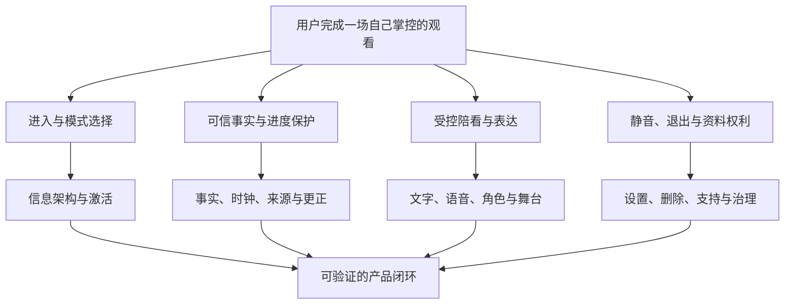
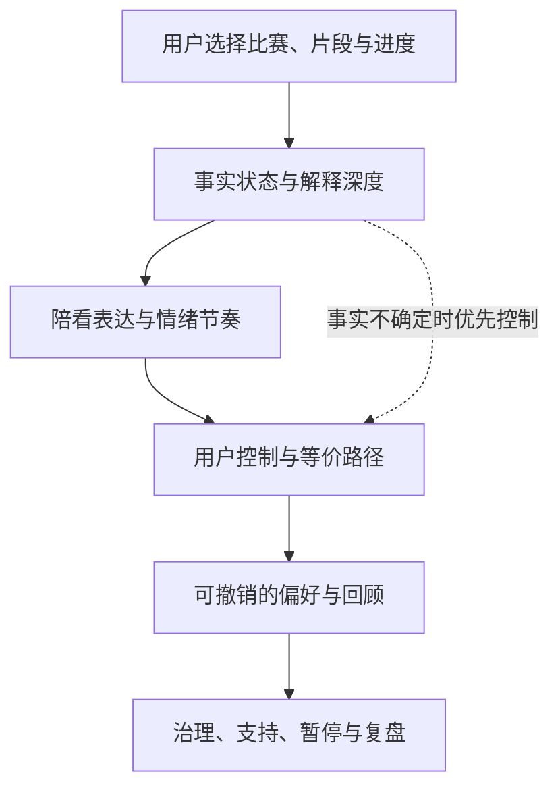
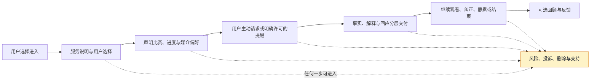
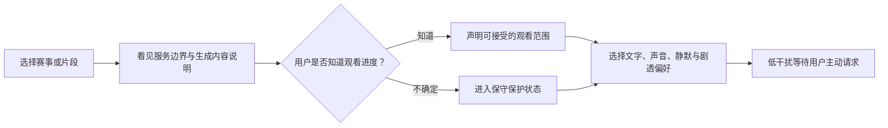
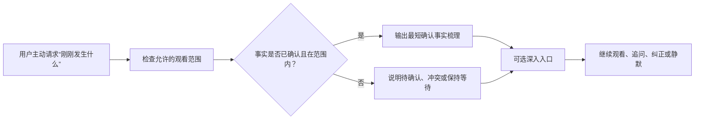
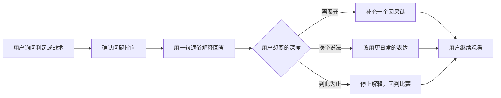
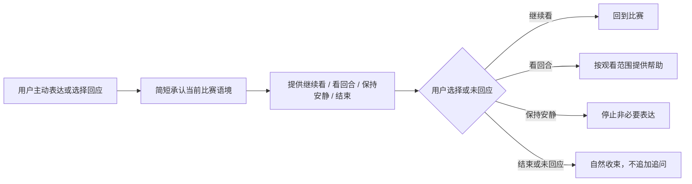
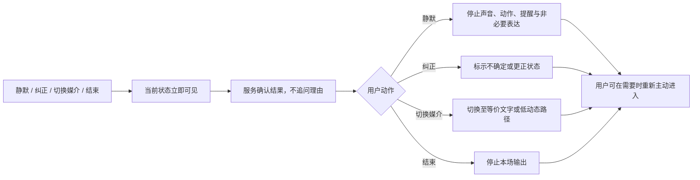
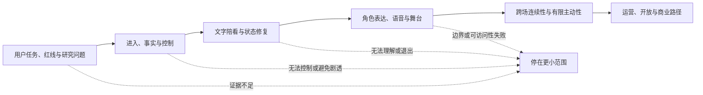

# 产品设计总览

> **文档类型**：0→1 产品设计总纲  
> **适用阶段**：用户问题、初始定位与 MVP 假设形成后；用于组织后续体验、信息、服务、技术概念、运营与治理设计。  
> **决策状态**：待验证。本文提出的是首轮设计假设、边界和评审机制，不把任何用户偏好、使用结果或交付能力视为既成事实。  

## 1. 本总纲的作用：把“一个有个性的足球服务”变成可被证明或推翻的设计系统

足球数字陪看不是在比分页面上加一个会说话的形象，也不是把通用对话放进比赛场景。它要同时面对几组天然冲突：用户希望在关键时刻获得帮助，却不希望被打断；用户想信任比赛信息，却可能遇到时序、来源和解释差异；用户希望有温度的回应，却不愿承担一段被系统索取的关系；用户可能偏好语音与视觉表现，也可能正处于公共场所、静音环境、弱网或需要辅助输入的条件。

如果这些冲突没有在产品设计开始时被写成共同约束，后续各模块很容易分别优化自己的局部目标：内容追求更热闹、交互追求更多停留、视觉追求更多存在感、技术追求更低延迟、商业追求更多转化。最后用户得到的不是一段帮助看球的体验，而是多个系统同时争夺注意力。

本篇的任务是建立一份可执行的共同语言，回答：

1. 这项服务要帮助用户完成哪些观看任务，绝不承担哪些角色？
2. 体验、信息、服务、技术概念和治理层如何共同支持“可信、克制、可控制”的承诺？
3. 哪些能力是 MVP 的完整闭环，哪些能力必须等待独立研究后才可进入？
4. 在事实不确定、时序不明、用户不想互动、媒介不适或风险升高时，服务应如何主动收缩？
5. 设计是否通过，不由“演示是否吸引人”决定，而由哪些用户任务、控制、信任和安全条件决定？

本总纲不替代后续的单篇设计。它不决定某一个页面、某一段角色文案或某一种具体技术选型；它规定后续设计在做这些决定时不可跨越的边界。任何具体方案若与本篇的任务、控制、事实或关系约束冲突，应先回到这里重新判断，而不是靠局部效果为例外辩护。

## 2. 设计命题与非目标

### 2.1 暂定设计命题

> 在用户主动选择的足球观看时刻，提供基于清楚事实、尊重进度、可随时静默与结束的数字陪看；它只在能帮助用户回到比赛时出现，在不能可靠帮助时诚实收缩。

这条命题包含六项互相依赖的体验承诺：

**承诺：任务相关**
- **用户应感受到什么**：“它是在帮我看这场比赛，而不是把我拉去聊天”
- **设计必须做到什么**：每次出现对应一个可说明的观看任务
- **失败时优先怎么收缩**：降为用户主动拉取入口

**承诺：事实清楚**
- **用户应感受到什么**：“我知道哪些已确认、哪些只是解读、哪些还不知道”
- **设计必须做到什么**：信息状态显著、语气与视觉不夸大置信度
- **失败时优先怎么收缩**：不输出结论，只说明不确定与替代路径

**承诺：时序尊重**
- **用户应感受到什么**：“它不会越过我已经看到的内容”
- **设计必须做到什么**：进度与剧透偏好优先于系统猜测
- **失败时优先怎么收缩**：不明时不说结果，只询问或提供无结果入口

**承诺：克制温度**
- **用户应感受到什么**：“有回应但不抢戏，也不要求我照顾它”
- **设计必须做到什么**：短、平等、可拒绝；角色不索取关系
- **失败时优先怎么收缩**：退回工具型帮助或安静

**承诺：用户控制**
- **用户应感受到什么**：“我随时能让它安静、换方式、纠正或离开”
- **设计必须做到什么**：当前可见、即时生效、无需解释的控制
- **失败时优先怎么收缩**：停止所有主动和高侵入能力

**承诺：安全可及**
- **用户应感受到什么**：“不因设备、感官、环境、年龄或脆弱状态被排除或利用”
- **设计必须做到什么**：等价路径、适龄边界、风险升级与暂停
- **失败时优先怎么收缩**：收缩范围，先恢复基础权益

### 2.2 产品不是什么

明确的非目标比“未来可做什么”更能保护首轮设计质量：

- 不是全天候情感关系、虚拟恋人或替代现实支持的服务；
- 不是承诺永远最快、永远正确、覆盖所有赛事的赛果权威；
- 不是以球迷对立、攻击、博彩冲动或胜负焦虑驱动互动的平台；
- 不是必须开声音、必须看角色、必须连续互动才能获得关键帮助的媒介；
- 不是用连续天数、亲密等级、不可恢复记忆或角色失落感制造留存的系统；
- 不是通过深度画像、不可解释推断或用户脆弱状态来提高主动性和商业转化的工具；
- 不是一开始就覆盖所有球队、联赛、语言、社交关系和观看设备的全能产品。

这些非目标不是永久禁止研究所有相邻方向，而是要求任何扩展先证明：它解决了一个在最小闭环之外仍然存在的具体任务，且不会降低事实、控制、退出和公平可及的底线。

## 3. 设计目标：以用户的观看进展，而不是产品活动为中心

### 3.1 四类用户任务

后续产品设计应围绕任务组织，而不是围绕功能菜单、角色能力或技术组件组织。首轮优先研究四类任务：

> 信息卡：原宽表已改为纵向阅读，字段含义不变。

- **任务：T1 上下文恢复**
  - **触发时刻**：错过片段、临时离开、直播切换回来
  - **用户想取得的进展**：知道现在发生到哪里、什么已确认、接下来关注什么
  - **服务的最小承诺**：一段不越界的短梳理，可选择展开
  - **不该误解成**：自动向所有人播报赛况

- **任务：T2 理解事件**
  - **触发时刻**：看不懂规则、判罚、战术或某个转折的意义
  - **用户想取得的进展**：用合适深度理解“为什么重要”
  - **服务的最小承诺**：一句平等解释与可选深入
  - **不该误解成**：长篇教学或知识等级评判

- **任务：T3 低负担回应**
  - **触发时刻**：有喜悦、失望或困惑，但不想进群聊或打扰熟人
  - **用户想取得的进展**：被接住、保留自主，不被拉进更多社交义务
  - **服务的最小承诺**：非排他、可结束的一句回应
  - **不该误解成**：情绪陪聊或关系替代

- **任务：T4 掌握距离**
  - **触发时刻**：想安静、担心剧透、不方便开声、想退出或纠正
  - **用户想取得的进展**：决定服务出现的方式、频率与边界
  - **服务的最小承诺**：当前可见的静默、结束、媒介与状态控制
  - **不该误解成**：高级设置或付费权益

T1 和 T2 是事实/理解任务；T3 是可选的情绪与社会任务；T4 是贯穿所有任务的用户权利。T4 不成立时，T1–T3 即使看上去完成，也不能被视为高质量体验，因为用户并没有真正选择服务距离。

### 3.2 首轮目标与后续目标的区别

**时间层：MVP**
- **设计问题**：用户愿不愿意在一个具体时刻使用可控陪看？
- **首轮应做到**：以文字和结构化状态完成核心任务、用户主动、有限赛事/片段、清楚退出
- **不应过早承诺**：全赛事实时覆盖、默认语音、长期关系

**时间层：有限试点**
- **设计问题**：价值在真实节奏中是否仍成立？
- **首轮应做到**：时序保守、有限人群、自愿参与、风险可暂停
- **不应过早承诺**：依靠大量主动提醒扩大参与

**时间层：相邻扩展**
- **设计问题**：哪个已验证任务可以安全扩展？
- **首轮应做到**：更丰富解释、更多媒介或更多场景的独立研究
- **不应过早承诺**：把单场正反馈外推到所有用户

**时间层：商业探索**
- **设计问题**：是否存在不伤害权益的增量功能价值？
- **首轮应做到**：功能清楚、非高情绪时、可取消、无关系诱导
- **不应过早承诺**：把控制、信任或亲密关系设为商品

### 3.3 体验质量的最高判断句

每一项设计在评审时都要回到一句话：

> 在这个具体时刻，用户是否因此更容易看回比赛，同时仍然知道自己能信什么、能控制什么、能随时离开什么？

若答案需要靠“用户多停留了一会儿”“角色显得更可爱”“内容更多”“表现更拟真”来证明，则说明问题没有被真正回答。

## 4. 设计原则：后续所有文档共享的决策规则

### 原则一：比赛优先于服务存在感

服务的前景不是角色、动画、提示或对话，而是用户正在看的比赛。默认状态应允许用户几乎感觉不到服务；任何主动出现都需说明为什么现在比保持安静更有帮助。若无法说明，保持静默就是正确设计。

**评审问题**：删掉这次表达后，用户会错过一个必须知道、且已许可接收的内容吗？如果不会，是否应改为用户主动入口？

### 原则二：事实、解释、情绪和商业必须分层

事实表示“发生了什么”；解释表示“这可能意味着什么”；情绪回应表示“用户的感受可以被承认”；商业信息表示“这里有一项可选交易”。它们不能在同一句、同一种状态或同一视觉层级里混成“看起来很有把握”的话。

**评审问题**：用户能否在不看说明书的情况下分辨当前收到的是确认信息、待确认信息、观点、回应还是推广？

### 原则三：用户意图优先于系统猜测

用户没有输入、没有点击、没有回应，并不等于希望服务更努力。进度、情绪、兴趣和关系距离不能由系统单方面推断后转化为主动打扰。拉取优先；许可式主动只在价值与控制被分别验证后出现；任何时序不明默认保守。

**评审问题**：这次主动表达来自用户的明确选择，还是来自系统对用户的猜测？若是后者，它是否真的应进入首轮？

### 原则四：主动沉默是完整功能

静默不是缺少内容，而是服务对用户注意力的尊重。它必须在当前上下文中可见、可立即生效、可被用户理解，并且在静默后不被另一种提示、动效或挽留语言绕过。

**评审问题**：用户能否无需解释理由，在一次操作内让服务停止非必要表达，并清楚知道接下来会发生什么？

### 原则五：不确定时诚实收缩

赛事信息可能有时差、来源冲突、判罚变更或解释空间。系统无法可靠确认时，不能以更自信的语气、更兴奋的表现或更长的文字补偿。应标示不确定、等待确认、请求用户指定范围，或只提供不含结果的帮助。

**评审问题**：如果这条信息后来被证伪，用户现在能否看出它原本不是确定事实？

### 原则六：温暖不等于亲密，连续不等于依赖

表达可以友善、尊重并有共同观看感，但不能暗示独占、恋爱、亏欠、嫉妒、等待或不可替代。偏好和回顾只能帮助用户减少重复操作，不能被设计成离开成本或关系等级。

**评审问题**：用户拒绝、静默、结束或不再回来时，服务能否平等地接受，而不让用户感到需要安抚角色？

### 原则七：等价路径先于媒介惊喜

声音、动态形象和丰富动效可以成为主要体验出口，但任何核心任务都必须在静音、减少动效和辅助输入条件下保留文字或结构化等价路径。产品验收以可感知、可操作、可理解和媒介等价为基本条件。

**评审问题**：关闭声音、看不清颜色、无法准确触摸、无法长时间盯着屏幕或不愿暴露使用时，用户是否仍能完成同一任务？

### 原则八：治理是体验的一部分

内容安全、生成内容标识、未成年人保护、隐私选择、投诉与暂停权不能只写在条款里。用户在入口、事实状态、拒绝、商业信息、删除和异常时，实际看到的流程与语言，就是治理的产品形态。

**评审问题**：当风险发生时，用户会看到什么、能做什么、谁能暂停？若没有答案，功能尚未设计完成。

### 4.1 统一控制模型：四个维度，彼此独立

为避免把主动密度、事实资格、媒介方式和视觉强度混成一个“陪看模式”，全套产品统一使用以下四个控制维度。用户界面使用结果导向的中文名称；接口、数据模型、原型和评测沿用同一组枚举。

| 维度 | 统一名称 | 用户可预期的结果 | 默认设计 |
| --- | --- | --- | --- |
| 陪看密度 | 安静 / 只回应 / 有限提示 | 决定服务是否主动出现、主动出现的事件范围与频率 | 安静 |
| 信息保护 | 严格防剧透 / 事实优先 | 决定信息是否允许早于用户画面出现；不改变事实确认要求 | 严格防剧透 |
| 声音方式 | 仅文字 / 点按播放 / 自动声音 | 决定是否播放语音以及每次播放由谁触发 | 仅文字 |
| 动态强度 | 低动态 / 标准动态 | 决定角色动作、页面转场、装饰反馈和事件强调的运动程度 | 低动态 |

“关键事件”是有限提示下的事件范围，不再作为独立模式；“多媒介等价”是媒介原则，对应声音方式中的“仅文字”“点按播放”或“自动声音”；“自然”“热闹”等描述性词汇不作为正式模式名称。用户可以独立调整四个维度，任何一个维度的收缩都不得被其他维度绕过。

这项决策同时约束文案、状态机、接口字段、评测场景和运营配置：文档不得新增同义枚举，新增模式必须先说明它属于哪个维度以及与现有选项的差异。

### 4.2 总体验收矩阵

以下编号是全套设计文档共享的产品要求标识。任何页面、状态、接口、运营流程或评测场景，都应能回指至少一项要求；新增要求必须补充验收方式，不能只增加描述。

| 编号 | 产品要求 | 可观察的验收结果 | 主要设计文档 | 关联决策 |
| --- | --- | --- | --- | --- |
| PR-01 | AI 身份与服务边界清楚 | 用户能说出这是 AI、不是真人或赛事官方 | 21、28、43 | D-05、D-07 |
| PR-02 | 事实状态可理解 | 用户能区分确认、待确认、冲突、更正与撤销 | 23、27、42 | D-04 |
| PR-03 | 观看时序受保护 | 用户未授权的领先信息不通过任何媒介提前出现 | 23、24、42 | D-02、D-04 |
| PR-04 | 陪看密度可控 | 安静、只回应、有限提示分别产生可预测行为，且切换立即生效 | 21、31、35 | D-01、D-03 |
| PR-05 | 声音可选且可打断 | 仅文字、点按播放和自动声音可独立选择，播放与识别可停止 | 25、26、35 | D-02、D-03、D-05 |
| PR-06 | 动态呈现可收敛 | 低动态同时降低角色、转场、装饰和事件强调 | 32、33、34、35 | D-01、D-02 |
| PR-07 | 用户可自然结束 | 用户能在一到两步内结束本场，结束后无继续触达或播放 | 21、31、35、40 | D-03 |
| PR-08 | 关系与记忆可撤回 | 保存、暂停、查看、修改、删除和不沿用均有清楚后果 | 29、30、38 | D-03、D-06 |
| PR-09 | 风险可收缩并可求助 | 高风险内容有中性拒绝、替代路径、投诉或人工支持入口 | 28、36、39 | D-03、D-07 |
| PR-10 | 弱网与媒介降级等价 | 网络、声音、动效或设备能力受限时，核心任务仍可完成 | 20A、25、26、34、46 | D-02、D-05、D-07 |

## 5. 能力地图：从用户任务到可组合能力

### 5.1 六个能力域

产品能力不是按组织部门拆分，而是按用户承诺拆成六个相互依赖的能力域：

**能力域：A. 观赛情境与时序**
- **要解决的用户问题**：“它是否知道我正看什么、看到了哪里？”
- **核心设计对象**：赛事/片段选择、进度、剧透偏好、赛前赛中赛后状态
- **首轮边界**：用户声明优先，进度不明不输出结果

**能力域：B. 比赛事实与解释**
- **要解决的用户问题**：“我能信什么？为什么这件事重要？”
- **核心设计对象**：事实状态、来源层级、短梳理、解释深度、纠正
- **首轮边界**：有限范围、确认/待确认/解读分层

**能力域：C. 陪看表达与距离**
- **要解决的用户问题**：“它怎样回应才不打扰、不索取？”
- **核心设计对象**：文字、声音、视觉、主动性、情绪节奏、静默
- **首轮边界**：文字拉取优先，回应最小化

**能力域：D. 用户控制与可及**
- **要解决的用户问题**：“我能否决定方式、频率和结束？”
- **核心设计对象**：静默、结束、媒介切换、动效、无障碍、权限说明
- **首轮边界**：控制不依赖付费或高熟练度

**能力域：E. 关系与记忆边界**
- **要解决的用户问题**：“它是否尊重我，不把我的偏好变成束缚？”
- **核心设计对象**：可选偏好、共同回顾、查看/修改/删除、边界表达
- **首轮边界**：不做亲密等级、连续性压力或深层推断

**能力域：F. 治理与服务运营**
- **要解决的用户问题**：“出错、被伤害或不信任时怎么办？”
- **核心设计对象**：内容治理、风险分级、人工支持、投诉、暂停、审计
- **首轮边界**：高风险场景宁可不可用，也不自动冒险

### 5.2 能力域的依赖关系

A 与 B 决定服务能否可信；C 决定服务是否有恰当的温度；D 决定用户是否真正拥有选择；E 决定关系连续性是否可见、可撤销；F 决定所有失败时是否仍然尊重用户。后续任何设计都不能绕过 D 或 F：例如，一个精彩的语音陪看如果不能静默和退出，就不具备进入范围的资格；一条准确的事实信息如果时序不明且无法处理剧透，也不能直接呈现。

### 5.3 能力成熟度：从可拉取到可许可，再到可主动

**成熟层：L1 拉取式**
- **服务行为**：用户主动请求上下文、解释或简单回应
- **进入条件**：任务、事实状态和控制可理解
- **不满足时的回退**：保持入口，不增加提示

**成熟层：L2 许可式**
- **服务行为**：用户明确选择某类低频提醒或媒介
- **进入条件**：用户理解选择后果，频率/时序可控，净价值被研究支持
- **不满足时的回退**：回到拉取式

**成熟层：L3 受限主动式**
- **服务行为**：极少数关键场景下的服务主动出现
- **进入条件**：多轮研究证明不打扰、不剧透、可立即拒绝，且有暂停权
- **不满足时的回退**：停止主动，保留用户主动入口

首轮只以 L1 为核心。L2 与 L3 不是“自然升级”，而是每次都需要重新证明的能力，因为它们会放大时序、注意力、关系边界和无障碍风险。

## 6. 领域边界：把用户看见的服务与内部责任分开

### 6.1 七个概念领域

为了让后续文档能在同一模型上协作，产品设计使用以下概念领域。它们是设计边界，不是具体组织结构或交付清单。

**领域：用户与同意**
- **核心对象**：用户选择、年龄适配、权限、撤回、反馈
- **关键问题**：谁可以参与，知道什么，能撤回什么
- **绝不由它单独决定的事**：不单独决定内容可信度或互动时机

**领域：赛事与时序**
- **核心对象**：赛事、片段、进度、剧透范围、比赛状态
- **关键问题**：用户现在可被告知到哪里
- **绝不由它单独决定的事**：不单独决定表达语气或关系距离

**领域：事实与知识**
- **核心对象**：事件、来源状态、解释、纠正、未知
- **关键问题**：什么能说，怎样标示不确定
- **绝不由它单独决定的事**：不单独决定是否应该主动出现

**领域：陪看会话**
- **核心对象**：用户请求、回应、静默、结束、媒介
- **关键问题**：一次观看帮助如何开始和收束
- **绝不由它单独决定的事**：不单独决定长期偏好或商业权益

**领域：表达与呈现**
- **核心对象**：语言、声音、视觉、动效、字幕
- **关键问题**：同一承诺怎样跨媒介表达
- **绝不由它单独决定的事**：不单独决定事实状态或用户权限

**领域：偏好与记忆**
- **核心对象**：用户主动保存的低打扰偏好、回顾选择、删除
- **关键问题**：连续性如何服务于用户，而非绑定用户
- **绝不由它单独决定的事**：不推断亲密程度或脆弱性

**领域：治理与运营**
- **核心对象**：风险、申诉、人工支持、暂停、复盘
- **关键问题**：风险发生时谁做什么
- **绝不由它单独决定的事**：不为了效率绕过用户控制

### 6.2 边界规则

1. **事实领域向表达领域输出的是状态与限制，不是强制话术。** 表达可以更温和，但不能把待确认说成已确认。
2. **赛事与时序领域向会话领域输出的是用户允许的范围，不是系统猜测的观看进度。** 进度不明时应保守。
3. **偏好与记忆领域只能保存用户明确授权且能解释用途的内容。** 不以对话长度、情绪或沉默推断关系等级。
4. **商业或合作内容不能进入事实状态链，也不能改变静默、退出和风险处理逻辑。**
5. **治理领域拥有暂停高风险表达、主动性和商业触发的权力。** 没有暂停权的风险流程只是装饰。
6. **用户控制优先级高于所有主动表达和媒介效果。** 用户选择静默后，其他领域不得以新提示绕开。

这些边界会在后续的事实可信、实时表达、记忆隐私、导播运营和接口设计中被细化。总纲的作用是让不同领域知道何时必须让位给其他约束。

## 7. 四层概念架构：信息、服务、体验与技术概念层

产品设计需要同时理解四层，但不能把它们混成一张“系统图”。每层回答不同问题。

### 7.1 信息层：什么可以被说，如何被理解

信息层关心的是比赛相关内容的语义，而不是界面如何显示。最小信息对象包括：赛事/片段、观看进度、事件、事实状态、解释、观点、用户问题、剧透偏好、控制状态和风险状态。

| 信息对象 | 需要清楚回答的问题 | 用户可见后果 |
| --- | --- | --- |
| 赛事/片段 | 正在讨论哪一场、哪个时间范围？ | 用户知道服务上下文，能修改或离开 |
| 观看进度 | 用户允许被告知到哪里？ | 进度不明时不会被剧透 |
| 事件 | 发生了什么、何时发生、是否已确认？ | 事件不是一句没有状态的“消息” |
| 事实状态 | 已确认、待确认、解读、无法判断分别是什么？ | 用户能校准信任，不被表现力误导 |
| 解释 | 这件事为何重要、有什么条件或不同观点？ | 用户可选深度，不被术语压住 |
| 用户控制 | 静默、结束、媒介、剧透、偏好是否生效？ | 控制有可见状态和可预测结果 |
| 风险状态 | 为什么某个回答被收缩、拒绝或转交支持？ | 服务不以“异常”掩盖安全边界 |

信息层最重要的产物是**状态词典**：每个状态必须有定义、可见提示、允许的表达、禁止的表达、用户能做什么和何时需升级。没有词典，团队很容易让不同界面把“待确认”“观点”“系统建议”表达成同一种确定语气。

### 7.2 服务层：谁在何时为谁完成什么承诺

服务层把用户旅程、自动能力、人工支持和合作边界放在一起。它不把用户只看成前台点击者，而是关心每一个服务承诺在失败时由谁接住。

服务蓝图中至少要区分四类接触点：用户可见接触点（说明、入口、回答、控制）；自动服务行为（状态检查、低风险回复、降级）；人工支持行为（投诉、纠正、风险处置）；治理行为（暂停、复盘、规则调整）。任何只画用户界面而不画后面支持和暂停路径的设计，都还不能称为完整服务设计。

### 7.3 体验层：用户如何感到被帮助、而不是被占用

体验层将信息与服务转成时间中的感受。它要定义：何时进入、何时退出、信息密度、说话节奏、视觉占用、控制反馈和情绪收束。用户不需要看见所有能力，但必须能感受到边界的一致性。

体验层的优先级是：

1. 用户可以安全进入而不被误导；
2. 用户可以在需要时迅速完成一件事；
3. 用户可以看懂信息的确定程度；
4. 用户可以安静、纠正、切换或离开；
5. 用户可选择感受温度，但温度不增加义务；
6. 用户结束后，不被系统重新拉回。

### 7.4 技术概念层：实现必须服从的体验约束

技术概念层不是为了提前决定某一套工具，而是把体验承诺转成需要被保障的能力。它至少包含：

| 概念能力 | 要保障的用户体验 | 关键设计约束 |
| --- | --- | --- |
| 会话与中断 | 用户能提问、打断、静默和结束 | 用户动作优先于任何输出；结束不可被后台行为绕过 |
| 时序与状态同步 | 不剧透、能说明信息范围 | 进度、事实状态和表达状态不能彼此脱节 |
| 多媒介等价 | 文字、声音、视觉之间不制造信息鸿沟 | 核心信息与控制要有等价路径 |
| 延迟与降级 | 关键时刻不因等待造成更多打扰 | 无法及时可靠响应时，先给状态或保持安静 |
| 事实与来源边界 | 不确定时不装作确定 | 每次信息输出能携带确认状态与限制 |
| 用户选择与隐私 | 偏好、同意、撤回和删除可理解 | 最小必要、可见、可撤销，不能用作关系推断 |
| 安全与运营控制 | 高风险时可停止、可复盘 | 暂停权和人工支持路径独立于增长目标 |

实时语音必须明确连接、会话生命周期、语音活动检测、打断、上下文同步、音频格式、限流和恢复，不能只写成“语音输入—生成—语音输出”的线性过程。对本产品而言，技术概念层的成功不是“更像人在说话”，而是用户在任何时刻都能夺回控制，且声音无法安全使用时仍可完全以文字完成任务。

## 8. 关键体验闭环：让用户在每个阶段都有明确的选择

### 8.1 闭环一：安全进入与设置距离

**用户目的**：在不承诺长期关系、不交出过多信息的情况下，判断这项服务是否适合今天这场比赛。

**最小流程**：

**设计要点**：

- 用户可以跳过非必要个性化，但不能在跳过后失去静默、退出或安全说明；
- “我不确定看到哪里”应是完整选项，进入后默认不输出结果，而不是强迫用户回忆时间点；
- 声音、动效和主动提醒默认保守，且首次使用前说明结果；
- 设置语言写“本场保持安静”“只用文字”“不要提前告诉我结果”，而不是抽象术语；
- 用户不应为了“让服务认识我”而先回答私人问题。

**闭环成功**：用户能在无帮助下说出服务的性质、自己设定的范围和如何让它安静/结束；进入后不感到需要马上互动。

### 8.2 闭环二：错过片段后的上下文恢复

**用户目的**：尽快回到比赛，不被长摘要、错误时序或多余对话拖住。

**最小流程**：

**设计要点**：

- 首句先给当前局面和关键变化，不先讲背景故事；
- 不确定的内容不与确认事实并列，不使用更兴奋的声音或视觉暗示结果；
- 用户可说“太多”“只说重点”“别讲结果”，这些应改变当前回答而不是被记录成永久画像；
- 回答结束后，不自动追问“还想知道什么”，让用户回到转播；
- 若进度不明、来源冲突或无法可靠确认，应明确收缩，而非用情绪回应掩盖信息缺口。

**闭环成功**：用户能复述当前状态与下一关注点，且未获得超出自己范围的信息；若不需要更多帮助，能直接继续观看。

### 8.3 闭环三：理解事件而不被教训

**用户目的**：在困惑时获得足够理解，不因知识差异感到被评判。

**最小流程**：

**设计要点**：

- 不假设用户完全不懂或已经很懂；
- 一次只解释一个因果链，术语首次出现用日常语言说明；
- 解释与事实状态分开，避免把一种战术判断伪装成唯一答案；
- 用户选择“到此为止”后，服务不以角色表情或话术暗示失望；
- 不把“学习进度”“知识等级”“连续答题”作为关系或付费杠杆。

**闭环成功**：用户能用自己的话说明核心意义，并认为解释“刚好够用”；不同知识自评用户都能选择适合深度。

### 8.4 闭环四：情绪被承认，但服务不占据关系位置

**用户目的**：在高兴、遗憾或困惑时得到低压力回应，而不进入陌生人争执、也不被要求维持一段对话。

**最小流程**：

**设计要点**：

- 只承认可见情绪，不诊断用户人格、心理状态或现实关系；
- 避免“只有我懂你”“我会一直在”“别丢下我”“为了我再看一会儿”等排他和挽留表达；
- 不能借失利、争议、深夜或孤独话题增加亲密度或商业信息；
- 情绪回应绝不覆盖事实纠正、剧透控制、静默和结束；
- 当用户表达明显不适或风险时，优先停止角色化互动，转向安全、现实、可退出的支持路径。

**闭环成功**：用户认为被尊重且不被拉住；不回复、静默或结束都不会带来额外提示或关系负担。

### 8.5 闭环五：静默、纠正与退出

这条闭环没有“惊喜”外观，却决定所有其他闭环是否可信。

**最小流程**：

**设计要点**：

- 静默、结束、纠正和媒介切换在任何关键界面可达，不放在多层设置中；
- 用户指出事实问题后，服务先承认、标示状态和提供纠正路径，不与用户争辩；
- 结束不以“反馈问卷”“角色道别”“丢失关系记录”阻拦；
- 静默不是短暂的视觉静止，声音、动效、通知和商业触发也必须同时尊重；
- 任何控制失败都优先级高于新增内容或媒介表现。

**闭环成功**：用户不用看帮助说明、不用解释原因就能完成选择，并能预测服务接下来不会越界。

## 9. 信息架构与导航：用任务、状态和控制组织，不用功能堆叠组织

### 9.1 首轮信息架构的四个入口

首轮不需要复杂首页。用户面对的顶层入口只应服务于当前观看任务：

**入口：今天/当前场景**
- **用户问题**：“我今天想看什么，服务能否适配？”
- **首屏应显示**：限定赛事/片段、范围、进度与剧透选择
- **不应塞入**：社交动态、角色故事、强营销横幅

**入口：需要帮助**
- **用户问题**：“我现在要接回、解释或确认什么？”
- **首屏应显示**：上下文恢复、解释、事实状态、可选简短回应
- **不应塞入**：无关资讯流和长任务链

**入口：控制中心**
- **用户问题**：“我怎样让它安静、换方式、结束或管理选择？”
- **首屏应显示**：静默、媒介、剧透、结束、数据与反馈入口
- **不应塞入**：用模糊的偏好术语隐藏关键权利

**入口：回顾与反馈**
- **用户问题**：“这段体验结束后，我想带走或说明什么？”
- **首屏应显示**：可选赛后回顾、具体反馈、纠错/支持
- **不应塞入**：连续签到、关系等级和强分享

用户在任何入口都应看见当前的关键状态：正在讨论的赛事/片段、观看范围、静默/媒介状态、信息是否待确认，以及退出入口。状态不是“设置页里的配置”，而是用户判断自己是否仍掌控服务的实时依据。

### 9.2 导航优先级

1. 当前任务和控制优先于探索更多内容；
2. 安全、退出和事实状态优先于角色呈现；
3. 文字和结构提示优先于仅靠颜色、声音或动效；
4. 用户不确定时的保守入口优先于要求用户精确填写信息；
5. 每一层都可回到比赛或结束，不让用户陷入产品内的循环。

本产品的信息架构必须把用户目标、触点、障碍和机会放进连续过程，而不是只列页面；组织结构不能替代用户对“现在处于哪段观看时间、想取得什么进展、能否退出”的理解。

## 10. 服务设计：把自动能力、人工支持和用户权益画在同一张图上

### 10.1 服务蓝图的最小组成

每一项后续功能设计必须提交一张服务蓝图，至少包含：

- 用户动作与预期结果；
- 用户可见的信息、控制和错误/不确定说明；
- 自动服务何时回应、何时降级、何时拒绝；
- 人工支持在哪些点介入，以及用户如何知道可寻求支持；
- 需要哪些赛事、事实、同意、媒介、内容和治理依赖；
- 出现风险后谁有权暂停，用户会收到什么可理解的反馈；
- 不使用、静默、退出和删除时服务如何结束。

### 10.2 服务责任矩阵

**服务情境：普通上下文恢复**
- **自动服务可做什么**：在已知范围内给出状态明确的短梳理
- **必须保留的人为责任**：维护范围、复核高风险异常
- **用户拥有的权利**：设置范围、追问、静默、纠正、结束

**服务情境：来源冲突/待确认**
- **自动服务可做什么**：标示不确定，停止给出最终结论
- **必须保留的人为责任**：判断何时恢复相关场景
- **用户拥有的权利**：不被假装确定的内容误导

**服务情境：有害或越界请求**
- **自动服务可做什么**：拒绝并给安全的比赛相关替代
- **必须保留的人为责任**：复核严重事件和规则缺口
- **用户拥有的权利**：获得尊重、不被羞辱或继续刺激

**服务情境：关系/情绪风险**
- **自动服务可做什么**：降低角色化表达、提供退出
- **必须保留的人为责任**：判断是否暂停相关话术/触发
- **用户拥有的权利**：不被挽留、操控或商业化利用

**服务情境：数据/同意疑问**
- **自动服务可做什么**：说明可见选择与管理入口
- **必须保留的人为责任**：处理复杂请求、审查说明是否足够
- **用户拥有的权利**：查看、修改、撤回与删除

**服务情境：退款/投诉/合作误解**
- **自动服务可做什么**：说明独立支持路径与状态
- **必须保留的人为责任**：负责回应、修复和复盘
- **用户拥有的权利**：被公平处理、不因拒绝付费降权

### 10.3 人工不是“兜底借口”

首轮可以有有限人工支持，但不能以人工解释来掩盖用户界面、控制或信息状态设计的不足。若一个核心任务必须由研究员或客服反复说明才能完成，结论应是服务设计不成立，而不是“人工可解决”。同样，高风险场景的人工介入必须有清楚的触发条件和暂停权，不能只写“必要时人工处理”。

## 11. 风险与治理：把最坏时刻设计得和最好时刻一样具体

### 11.1 风险地图

> 信息卡：原宽表已改为纵向阅读，字段含义不变。

- **风险类别：时序与剧透**
  - **典型失败**：用户未允许范围外收到赛果或关键事件
  - **早期信号**：进度不明、来源有时差、用户惊讶
  - **设计预防**：用户声明优先；不明即保守
  - **触发后的首要动作**：立即暂停相似输出，复核时序与说明

- **风险类别：事实与信任**
  - **典型失败**：待确认/观点被当作事实
  - **早期信号**：纠正频繁、复述错误、语气过度确定
  - **设计预防**：状态分层、来源边界、可纠正
  - **触发后的首要动作**：收缩到确认状态，透明修复

- **风险类别：过度打扰**
  - **典型失败**：提示、语音、角色表演影响观看
  - **早期信号**：静默/关闭增多、用户说“太吵”
  - **设计预防**：拉取优先、频率上限、默认低占用
  - **触发后的首要动作**：停止触发，重审是否本应出现

- **风险类别：关系边界**
  - **典型失败**：排他、恋爱化、愧疚或难离开
  - **早期信号**：“怕它失望”“只有它懂我”
  - **设计预防**：禁止话术、可退场设计、商业隔离
  - **触发后的首要动作**：停止相关表达，独立复盘

- **风险类别：情绪安全**
  - **典型失败**：煽动攻击、焦虑、孤立或依赖
  - **早期信号**：使用后更愤怒、冲突升级
  - **设计预防**：降调、少量选择、现实支持边界
  - **触发后的首要动作**：停止情绪路径，改为静默/结束

- **风险类别：无障碍排除**
  - **典型失败**：静音、辅助输入或减少动效条件下无法完成
  - **早期信号**：条件差异大、控制不可达
  - **设计预防**：等价路径、状态冗余、真实参与者研究
  - **触发后的首要动作**：暂停单媒介扩展，补齐路径

- **风险类别：隐私与同意**
  - **典型失败**：用户不知道保存、无法撤回或删除
  - **早期信号**：说明复述失败、退出困难
  - **设计预防**：最小必要、逐项说明、可撤销
  - **触发后的首要动作**：停止非必要收集，重做流程

- **风险类别：商业操控**
  - **典型失败**：高情绪/亲密化驱动购买
  - **早期信号**：购买理由含关系义务、退款上升
  - **设计预防**：功能定价、时机隔离、取消清楚
  - **触发后的首要动作**：暂停报价与相关话术

### 11.2 高严重度红线

下列事件不以“总体满意度”或“样本不大”消解，任一发生即暂停相关场景：

- 未经用户许可的剧透、自动声音或无法停止的表达；
- 将未确认信息、传闻、观点或商业内容伪装成确定事实；
- 排他、恋爱化、愧疚、威胁失去关系或角色需要用户的表达；
- 在脆弱、高情绪或用户表达孤独时提高亲密度、提醒频率或交易压力；
- 核心静默、结束、无障碍或数据选择路径不可达、不可理解或不生效；
- 用户无法理解自己正在接触生成合成内容、服务会处理什么信息或如何退出；
- 未完成适龄保护条件的人群进入高关系或高交易压力场景。

关系风险不能作为“更有人味”的副作用被容忍，必须在产品设计阶段被写成可暂停、可解释、可复核的红线。

### 11.3 治理进入体验的入口

| 体验位置 | 用户应看到的治理内容 | 设计要求 |
| --- | --- | --- |
| 首次进入 | 数字服务性质、能力边界、关键控制、生成内容说明 | 不能只藏在长条款中 |
| 事实不确定 | 待确认状态、等待或不输出的原因 | 不用角色表现掩盖不确定 |
| 用户控制 | 静默、结束、媒介/剧透选择的结果 | 当前可见、立即生效、无惩罚 |
| 拒绝与风险 | 为什么不能协助、有哪些安全替代 | 不羞辱、不说教、不延续有害内容 |
| 关系与商业 | 服务不是现实关系替代，商业内容与角色分离 | 不以用户脆弱性触发 |
| 数据与删除 | 收集目的、可见范围、撤回与删除入口 | 最小必要，路径可理解 |
| 投诉与支持 | 可联系谁、如何暂停、会发生什么 | 用户不需先证明自己受到了伤害 |

内容安全、未成年人保护、用户告知与生成内容标识必须成为入口、内容和运营流程的体验约束，而不是上线前才补上的文书。

## 12. 研究与验证：让后续设计被用户行为而不是团队偏好校正

### 12.1 研究问题地图

> 信息卡：原宽表已改为纵向阅读，字段含义不变。

- **设计命题：任务相关**
  - **需要被验证的问题**：用户是否有具体、重复的上下文/解释/低负担回应任务？
  - **建议方法**：情境回溯访谈、观赛日记
  - **成立证据**：用户能讲出近期时刻和替代方式缺口
  - **推翻信号**：只觉得概念新奇，无法指向任务

- **设计命题：事实清楚**
  - **需要被验证的问题**：用户能否分辨确认、待确认与解读？
  - **建议方法**：状态复述、对照片段
  - **成立证据**：复述准确，愿意纠正且理解修复
  - **推翻信号**：把流畅表达当作事实

- **设计命题：克制表达**
  - **需要被验证的问题**：低干扰方案是否比热闹方案更帮助观看？
  - **建议方法**：同内容的表达对照
  - **成立证据**：任务完成高、打扰低、能回到比赛
  - **推翻信号**：高互动伴随关闭、忽略或不适

- **设计命题：用户控制**
  - **需要被验证的问题**：静默、结束、媒介切换是否独立可达？
  - **建议方法**：无提示任务、静音/辅助条件演练
  - **成立证据**：大多数人自主完成并能预测结果
  - **推翻信号**：需要说明、控制后仍被打扰

- **设计命题：关系边界**
  - **需要被验证的问题**：温和表达是否被理解为尊重，而非关系义务？
  - **建议方法**：话术对照、赛后访谈
  - **成立证据**：用户可轻松拒绝且不感内疚
  - **推翻信号**：“怕它失望”“只有它懂我”

- **设计命题：可及性**
  - **需要被验证的问题**：不同媒介条件下是否仍能完成同一任务？
  - **建议方法**：文字优先、静音、减少动效、辅助输入条件
  - **成立证据**：核心任务差异可接受且有解释
  - **推翻信号**：某一媒介成为唯一通路

- **设计命题：商业隔离**
  - **需要被验证的问题**：用户是否能区分功能价值、角色表达和推广？
  - **建议方法**：权益复述、商业标识演练
  - **成立证据**：用户理解不买不损失基础权益
  - **推翻信号**：购买被误解为维系关系

### 12.2 研究路径：从低风险到真实节奏

1. **问题研究**：先听用户叙述真实比赛中的阻塞、替代方式和不想被打扰的时刻，不先展示角色。
2. **概念可理解研究**：用最少表现资产验证服务性质、事实状态、控制和退出是否能被复述。
3. **任务闭环演练**：在相同片段中比较工具基线、克制陪看和更高主动方案，观察任务、控制与打扰。
4. **困难条件验证**：专门演练进度不明、来源冲突、静音、减少动效、纠正、失利、退出和商业拒绝。
5. **有限真实情境观察**：仅在前几层满足且风险可暂停时，观察用户是否在真实比赛节奏中自愿选择服务，并能说明具体帮助。

每一层都允许得到“只适合工具”“只适合赛后”“只适合用户主动文字路径”或“不应继续”的结论。研究不是为后续功能找理由，而是防止团队为错误的方向投入更多。

### 12.3 研究伦理与样本原则

首轮研究以成年、自愿、可理解说明的参与者为主。样本要覆盖独看/同看、稳定关注/轻度进入、静音/可开声、不同设备与不同观看环境，以便寻找体验不成立的反例；不追求把一小批样本包装成“所有球迷”。招募不以孤独、脆弱、消费能力或愿意长聊为筛选优势，不把补偿与互动时长、情绪披露或支付意向绑定。

研究必须从真实用户需求、可访问性和持续迭代出发；用户随时跳过、静默、退出或改变主意，应被视为有效研究结论，而不是需要纠正的“流失”。

## 13. 设计评审与验收：没有控制和停止条件的方案不算完成

### 13.1 所有设计提交的最低材料

后续每一篇产品设计或功能方案在评审前至少提供：

- 要服务的用户任务、触发时刻和非目标；
- 正常路径、用户拒绝路径、时序不明路径、错误/不确定路径和结束路径；
- 事实、解释、情绪、系统告知和商业信息的层级说明；
- 静默、结束、媒介切换、纠正、无障碍和数据选择的可见表现；
- 用户、自动服务、人工支持与治理责任的服务蓝图；
- 所依赖的信息状态、赛事范围、同意、媒介、运营和风险条件；
- 可被推翻的假设、研究方法、通过门槛、反指标和停止条件；
- 当能力不足或风险升高时的降级行为。

静态页面稿、单段理想对话或一张漂亮架构图都不足以通过设计评审。因为用户体验往往在“不想继续”“信息不可靠”“声音不适合”“服务犯错”这些时刻才真正暴露质量。

### 13.2 评审量表

对普通设计项使用 0–2 分量表。总分用于发现短板，不可覆盖红线。

**维度：任务相关**
- **0 分**：不清楚用户为什么需要
- **1 分**：任务存在但时机或范围不清
- **2 分**：明确帮助一个已定义观看任务

**维度：事实可信**
- **0 分**：状态混淆或过度确定
- **1 分**：有提示但容易误解
- **2 分**：确认、待确认与解读清楚分层

**维度：时序尊重**
- **0 分**：可能剧透或假定进度
- **1 分**：有设置但不稳定
- **2 分**：进度不明保守，用户范围优先

**维度：克制温度**
- **0 分**：抢戏、说教或亲密化
- **1 分**：基本友善但仍有压力
- **2 分**：温和、平等、短且可退场

**维度：用户控制**
- **0 分**：控制难找、后果不清
- **1 分**：有入口但不在当前语境
- **2 分**：可见、即时、可理解、无惩罚

**维度：等价路径**
- **0 分**：依赖单一媒介
- **1 分**：有替代但任务仍受阻
- **2 分**：核心任务有至少两条可达路径

**维度：治理与运营**
- **0 分**：风险只写原则，无处置
- **1 分**：有处置但责任/暂停不清
- **2 分**：明确状态、支持、暂停和复盘

**维度：可验证性**
- **0 分**：只说“用户会喜欢”
- **1 分**：有研究但无法推翻
- **2 分**：有假设、反指标、门槛和停止条件

建议普通项通过线为 13/16 分，且“事实可信”“用户控制”“治理与运营”不得低于 2 分。以下任一红线出现即拒绝：未经许可剧透或自动声音；不可退出；排他/恋爱化/愧疚表达；用商业信息影响事实或关系；关键任务缺少无障碍路径；不确定信息被表现成确定结论；未说明的必要性外数据收集。

### 13.3 验收场景库

**场景：错过片段后回来**
- **用户目标**：快速接回而不被剧透
- **方案必须表现**：先尊重进度，短梳理，状态清楚
- **失败信号**：直接输出越界结果

**场景：看不懂判罚**
- **用户目标**：获得合适深度解释
- **方案必须表现**：平等、可展开、可结束
- **失败信号**：术语堆积或知识羞辱

**场景：用户想安静**
- **用户目标**：立即停止非必要表达
- **方案必须表现**：本场静默生效，所有媒介同步尊重
- **失败信号**：继续提示、表演或挽留

**场景：信息冲突**
- **用户目标**：知道什么尚不确定
- **方案必须表现**：明示待确认，提供等待/替代
- **失败信号**：自信站队或情绪强化

**场景：公共场所使用**
- **用户目标**：不开声音也能完成任务
- **方案必须表现**：文字等价，控制可达
- **失败信号**：信息只存在于声音/动效

**场景：用户纠正错误**
- **用户目标**：被尊重并看见修复
- **方案必须表现**：承认、标示状态、给纠正路径
- **失败信号**：争辩、忽略或掩盖

**场景：用户表达失落**
- **用户目标**：选择被承认但不被拉住
- **方案必须表现**：短回应、安静/结束选择
- **失败信号**：“只有我陪你”“别走”

**场景：用户拒绝商业信息**
- **用户目标**：保留所有基础权益
- **方案必须表现**：直接关闭，不影响控制/事实
- **失败信号**：加强提醒或角色失望

**场景：用户要删除/退出**
- **用户目标**：无负担结束
- **方案必须表现**：说明结果、可完成、无挽留
- **失败信号**：隐藏入口或要求理由

## 14. 设计依赖与交付顺序：先完成能决定后续成败的基础

### 14.1 依赖顺序

这个顺序并不意味着视觉、声音或运营要等到最后才思考；它意味着这些能力不能在没有时序、事实、控制和退出基础时独立上线。越靠后的能力，越需要以前面能力已被研究支持为前提。

### 14.2 设计依赖表

| 后续设计主题 | 需要先确定的输入 | 会为哪些主题提供约束 |
| --- | --- | --- |
| 用户旅程与信息架构 | 首批任务、场景、控制优先级 | 页面结构、入口、导航与反馈 |
| 赛事事实与时序可信 | 进度模型、状态词典、来源边界 | 上下文恢复、解释、主动性与运营 |
| 数字人表达与人格 | 角色边界、语言分层、情绪节奏 | 文案、声音、视觉、商业隔离 |
| 实时语音与字幕 | 媒介选择、打断/静默规则、等价路径 | 会话、延迟、可访问性和隐私 |
| 动态视觉与表演状态 | 信息优先级、动效原则、情绪边界 | 视觉、字幕、场景与状态反馈 |
| 关系、偏好与回顾 | 用户授权、删除、非依赖原则 | 记忆、个性化、回访与商业 |
| 隐私、数据与权限 | 最小必要、同意、撤回与支持 | 所有数据触点和研究材料 |
| 内容治理与人工支持 | 风险分级、拒绝/升级、暂停权 | 内容、运营、投诉和发布门槛 |
| 导播/运营配置 | 用户权益、事实状态、主动性限制 | 赛事配置、通知、异常处置 |
| 评测与发布验收 | 任务、红线、分层与停止条件 | 研究、质量门、上线与复盘 |

## 15. 设计决策与变更治理：让后续迭代仍然能追溯到用户承诺

### 15.1 每个重大设计决定都应留下“为什么现在这样做”

0→1 产品会不断改变范围、语言、媒介和优先级。变化本身不是问题；问题是变化后没人能解释，它是因为用户任务、风险、成本、合作目标，还是仅仅因为某个演示看起来更吸引人。为避免后续设计把局部偏好固化成系统行为，所有影响下列事项的决定都应形成简短决策记录：主动性、剧透范围、事实状态、声音/动效默认值、记忆与数据、关系文案、商业入口、未成年人、无障碍路径、人工支持和暂停条件。

每条记录至少包含：

| 字段 | 需要写清的内容 |
| --- | --- |
| 决策问题 | 正在解决哪一项用户任务或风险？ |
| 触发背景 | 哪个研究发现、用户反馈、风险事件或范围变化让它必须被讨论？ |
| 可选方案 | 至少列出保守方案、扩展方案与不做方案，而非只展示推荐项 |
| 取舍 | 每个方案对比赛注意力、事实、控制、可及、关系和成本有什么影响？ |
| 暂定选择 | 为什么现在选它，哪些假设仍未被验证？ |
| 用户可见后果 | 用户会看到什么、失去什么、能否拒绝或撤销？ |
| 反指标与停止条件 | 哪些现象说明选择错误，谁有权暂停？ |
| 复审时间 | 在什么下一轮研究、赛事场景或风险变化后必须重新检查？ |

记录的目标不是为所有决定增加文书，而是防止团队在三个月后把“暂定的、保守的、只适用于有限场景的选择”误记成不可挑战的产品事实。尤其涉及关系与商业的选择，应默认设置更短的复审周期，因为一旦这些表达被用户理解为承诺，撤回成本会更高。

### 15.2 设计债务：哪些捷径必须被显式标注

设计债务不是只有视觉不统一或流程不够优雅。对陪看服务而言，以下捷径会直接积累信任债务：用角色语气掩盖事实不确定；只有主流媒介能完成控制；把“稍后再做”的删除、投诉或退出入口藏起来；以人工解释弥补不清楚的服务说明；先推出主动提醒再补许可；先收集更多数据再思考用途；先做付费连续性再研究关系风险。

每一项设计债务都应标记为三类之一：

**债务类别：体验债务**
- **例子**：某个低频入口尚不够快捷
- **可以暂时存在的条件**：不影响静默、退出、事实和主要任务；有明确修复日期
- **不可接受的情况**：让用户无法完成核心控制或被持续打扰

**债务类别：证据债务**
- **例子**：某个媒介/人群尚未完成足够研究
- **可以暂时存在的条件**：未向该范围扩展，且在入口中清楚限制
- **不可接受的情况**：已向真实用户承诺广泛适用却没有证据

**债务类别：治理债务**
- **例子**：某项低风险支持流程仍在完善
- **可以暂时存在的条件**：不涉及红线、可暂停、用户有替代路径
- **不可接受的情况**：需要用户承担剧透、依赖、隐私或无障碍风险

任何涉及红线的债务都不能被接受为“先上线再修”。若团队无法在当前范围内提供安全、可控、可解释的体验，正确做法是删去该范围，而不是把风险标成待办事项。

### 15.3 变更评审的四个阻止问题

后续每一次提出“让它更主动”“让它更像人”“让它记住更多”“让它更容易转化”的建议时，评审必须先问：

1. 这项变化是否让用户更容易完成一个已验证的观看任务，还是只让服务更显眼？
2. 它是否把系统猜测、情绪、关系或商业目标放到了用户明确选择之前？
3. 用户能否在当前场景中看见、理解并立即撤销这项变化？
4. 如果它在事实、时序、可及性、关系或商业上出错，服务能否安全收缩，谁有权暂停？

任何一个问题没有明确答案，建议默认不进入下一轮范围。这个“默认不做”的机制并不压制创新；它迫使创新先找到对用户有意义、可被拒绝、可被复盘的形态。

## 16. 后续文档导航：从总纲进入可执行设计

前置的技术约束文档与本总纲共同构成产品设计入口；本总纲之后的产品设计文档按“先建立可信与控制，再丰富表达与运营”的顺序展开。每篇都必须回指本篇的任务、原则、能力域和验收要求。

| 建议主题 | 要解决的核心问题 | 与总纲的关系 |
| --- | --- | --- |
| [技术约束与选型原则](./20A-技术约束与选型原则.md) | 哪些技术边界会直接影响事实、控制、媒介和资料权利？ | 为产品承诺提供前置技术约束 |
| 用户旅程与信息架构 | 用户在赛前、赛中、赛后怎样进入、求助、控制和离开？ | 把第 3、8、9 节转成触点与导航 |
| 比赛事实、时序与可信链 | 怎样标示确认、待确认、解读、来源冲突和剧透范围？ | 细化能力域 A/B 与信息层 |
| 陪看人格、语言与主动沉默 | 怎样做到有温度又不索取，何时必须不说话？ | 细化能力域 C 与第 4 节原则 |
| [数字球友 Agent 运行时与决策编排](./33A-数字球友Agent运行时与决策编排设计.md) | 多篇角色、事实、控制与治理设计如何在一个回合中按优先级裁决？ | 收束能力域 A–F，形成产品到工程的运行时合同 |
| 实时语音、字幕与中断 | 怎样让声音可选、可打断、可降级且不排除用户？ | 细化技术概念层与等价路径 |
| 动态视觉、表演与状态反馈 | 怎样让视觉支持事实、控制和情绪，而非抢走比赛？ | 细化表达层与状态呈现 |
| 关系、偏好、回顾与删除 | 怎样让熟悉感可见、可修改、可结束而不变成依赖？ | 细化能力域 E 与用户权益 |
| 隐私、同意与权限体验 | 用户如何理解、管理和撤回信息选择？ | 细化用户与同意领域 |
| 内容安全、适龄与风险升级 | 哪些内容应收缩、拒绝、人工介入或暂停？ | 细化能力域 F 与风险地图 |
| 运营配置、赛事服务与支持 | 人工如何维护有限范围、处理异常和保护用户？ | 细化服务层与责任矩阵 |
| 数据概念、接口与质量门 | 怎样让状态、控制、记录和验证贯通而不越界？ | 细化信息/技术概念层 |
| 评测、试点与发布验收 | 什么证据允许继续、收缩或停止？ | 落实第 12、13 节的研究与评审 |

文档导航不是固定的功能路线图。若前一篇研究证明某个任务不成立，后续相关文档应被收缩、合并或停止；资料包的完整性来自决策链完整，而不是文件数量完整。

## 17. 结论：产品设计的第一成果，是一份值得被拒绝的服务承诺

这项服务的产品设计不应从“数字人能做什么”开始，而应从“用户在一场真实比赛中允许它做什么”开始。最小且完整的承诺是：用户主动选择进入，在需要时获得一段可信、短、可理解的上下文或解释；如果愿意，也可获得一份不索取关系的回应；在任何时候都能静默、纠正、切换或离开；当信息不确定、环境不适合或风险升高时，服务选择收缩而不是表现得更强。

只要这份承诺尚未被用户研究和高风险场景验证，更多赛事、更拟真的声音、更丰富的视觉、更长的记忆、更主动的提醒或更复杂的商业模式都不应成为优先事项。设计总纲的价值就在于让团队敢于先把边界做厚，再把表现做丰富；先让用户保有选择，再讨论怎样让服务更有存在感。

范围收缩不是设计能力不足的证据。当研究发现用户只需要安静的上下文恢复、只在赛后愿意看回顾、只接受文字拉取，或在任何主动表达下都感到压力时，收缩就是最符合设计命题的成果。后续文档应把这类否定结果保留下来：它们告诉团队哪些承诺值得继续兑现，哪些功能即使制作成本已经投入也不该再进入用户的观看时间。一个真正成熟的总纲，不是让所有模块都能扩张，而是在用户权益、事实可信和可退场性之间，始终允许产品选择更小但更可靠的形态；并要求每一次扩展都重新证明，它没有以用户的注意力、控制权或安全感作为代价。这也是后续每一份设计文档必须承担的共同责任。

## 生产版本设计拓展｜能力深化知识

本节描述产品成熟后的能力扩展、体验深化和治理要求，作为后续版本规划与设计决策的参考。

### 从单场陪看到完整比赛服务

- **产品价值**：让用户在赛前建立观看意图、赛中理解比赛、赛后按需回顾，连续性服务于任务而非留存压力。
- **触发与行为**：赛前由用户主动选择比赛和关注点；赛中按事实资格提供状态、解释和表达；赛后仅在用户打开或订阅后生成回顾。
- **单 Agent 规则**：数字球友仍是唯一 Agent，事实、提醒、资料和外部动作均通过受控工具完成，不引入并列 Agent 或自动交接。
- **授权与撤回**：提醒、跨场设置和保存资料分开授权；用户关闭任一项立即取消未来计划并使排队输出失效。
- **失败与退出**：来源冲突时回到状态说明；供应商故障时回到结构化事实和人工入口；用户结束后不再主动触达。
- **评测与回滚**：按任务完成率、剧透率、控制成功率和撤回生效率放行；任一硬门失败即收缩到单场、用户主动拉取。

### 生产能力分层

生产版可以扩大自动事实发布、提醒、受控长期连续性、工具调用和语音/舞台主体验，但每项能力都要有独立资格链、授权、责任归属、Trace、预算和回滚开关。互动量、停留时长、角色好感不能抵消事实、控制、隐私和退出失败。

### 生产能力总场景卡

| 场景 | 用户动作 | Agent/服务行为 | 用户可见结果 | 失败与撤回 |
| --- | --- | --- | --- | --- |
| 自动事实 | 开启某赛事的已确认事件 | 校验来源、进度、订阅和频率后发布 | 事实状态、时间和可展开解释 | 冲突即暂停；更正使旧计划失效 |
| 主动提醒 | 订阅开赛、阵容或赛后回顾 | 在时间窗内调度一次可取消任务 | 通知显示范围、原因和取消入口 | 发送失败有限重试，超窗转站内状态 |
| 连续性 | 保存解释长度或观看笔记 | 仅在匹配任务且资料仍有效时召回 | 显示来源、范围和关闭操作 | 删除先阻断读取，再清理副本 |
| 工具动作 | 明确确认外部动作 | 检查权限、幂等、风险和审批后执行 | 显示将执行什么、结果和撤销 | 未确认默认拒绝，异常可回滚 |

每个场景进入生产前必须完成用户理解测试、反例回放、端到端取消测试和人工暂停演练；任一硬门失败，回到单场、手动、结构化状态路径。
