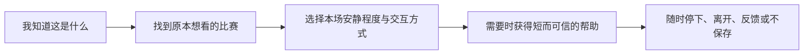
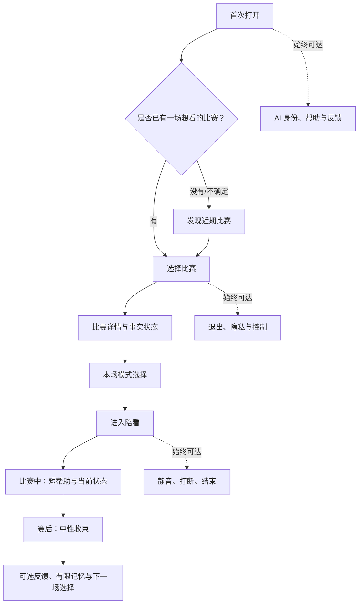
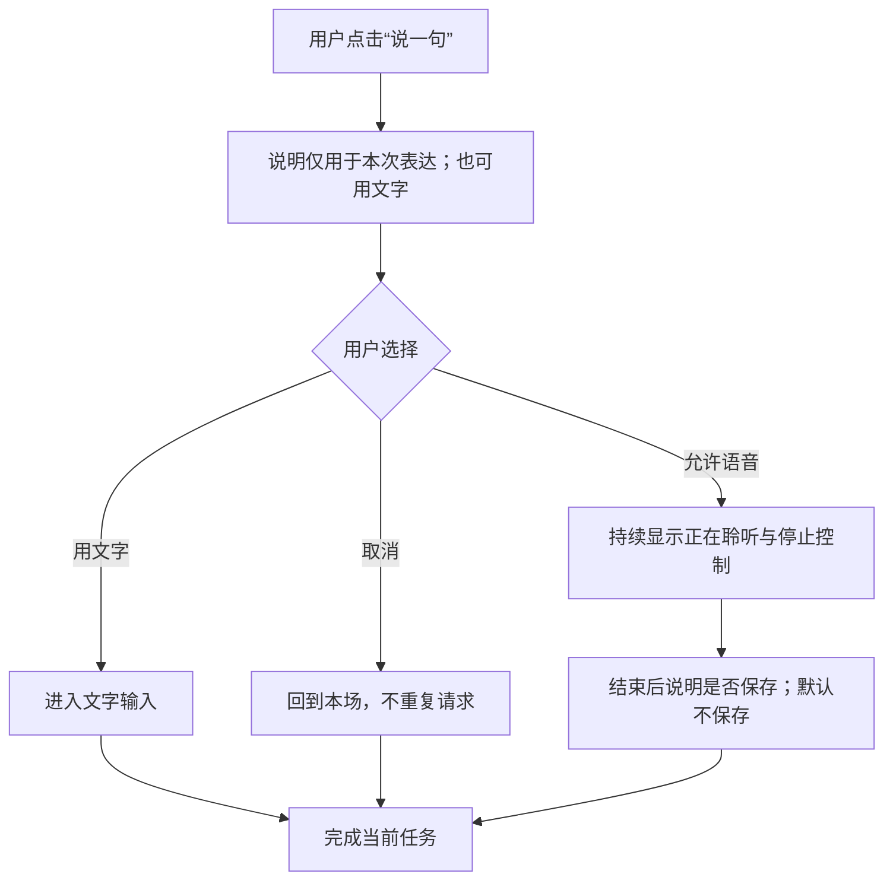
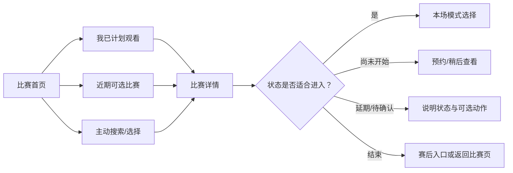

# 信息架构、激活与比赛进入设计

> 文档类型：0→1 产品信息架构与首轮体验设计  
> 适用阶段：明确首个用户任务 → 设计最小可理解体验 → 在真实比赛前验证进入与控制  
> 版本：0.1（结构、入口和权限均为待验证假设）  
> 研究信息截止：2026-01-28  
> 设计原则：用户不是来“逛一个数字人应用”的。他们是在准备看一场比赛、正在看一场比赛，或刚看完一场比赛。信息架构必须把注意力还给比赛，并让用户始终知道服务会做什么、不会做什么、怎样停下。

---

## 1. 设计要解决的核心问题

实时足球数字陪看服务的首个风险不在于用户找不到很多功能，而在于他们在关键时刻找错入口、误解状态、被权限打断，或进到会话后不知道怎样退出。传统内容产品可以把首页做成信息流；陪看产品不应如此。比赛中的注意力极其稀缺，任何多余导航、强制设置、长说明或默认主动性，都会把“帮助看球”变成“要求用户管理一个应用”。

本设计要回答六个问题：

1. 用户第一次打开时，能否在不阅读长篇介绍的情况下理解这是什么、适不适合自己？
2. 用户能否先选择一场自己原本就要看的比赛，而不是被服务推入不相关内容？
3. 用户能否在进入前清楚选择“安静、只回应、有限提示”等控制方式，并预期系统行为？
4. 用户在赛事延期、无赛程、信息待确认、网络异常、语音不可用时，是否仍能理解发生了什么和下一步？
5. 用户能否在任何时刻静音、打断、结束、拒绝记忆或离开，而不感到被关系或流程阻拦？
6. 视听、认知、运动和语言需求不同的用户，能否以同等尊严完成核心任务？

首轮的信息架构不是为了展示所有可能能力，而是为了让一个明确的用户在一个明确的比赛日完成这条主链：

如果主链不成立，增加更多赛程、资讯、角色衣服、社交和长期记忆都不会解决根本问题。

---

## 2. 信息架构方法：先按用户任务组织，再按能力命名

### 2.1 设计对象不是页面，而是情境与决策

本项目采用“情境任务架构”，不以内部能力名称组织导航。用户不需要理解“实时服务、关系模块、知识系统、设置中心”等分类；他们需要知道“下一场在哪儿”“这场我怎么陪看”“它现在会不会说话”“我能不能关掉”“它记住了什么”。

所有内容与功能先归入四个用户情境：

**情境：首次接触**
- **用户的首要任务**：判断是否适合、是否安全、是否值得开始
- **信息架构应优先呈现**：AI 属性、具体帮助、边界、退出权
- **不应优先呈现**：大量赛事资讯、复杂人格故事、权限墙

**情境：赛前准备**
- **用户的首要任务**：找到要看的比赛、决定本场模式
- **信息架构应优先呈现**：比赛时间、状态、重要信息、本场控制
- **不应优先呈现**：历史内容流、无关通知、要求填写个人档案

**情境：比赛进行**
- **用户的首要任务**：保持看球、在需要时快速获得帮助
- **信息架构应优先呈现**：当前会话状态、事实状态、静音/打断/结束
- **不应优先呈现**：深层设置、全局导航、持续弹窗

**情境：赛后收束**
- **用户的首要任务**：自然结束、处理有限选择、决定是否回来
- **信息架构应优先呈现**：结束、反馈、可选回顾、记忆/提醒控制
- **不应优先呈现**：强制分享、连续任务、关系化挽留

任何新的信息节点都必须说明它属于哪个情境、帮助哪个任务、为何此时出现。无法回答的节点不进入首轮导航。

### 2.2 内容盘点的三层模型

信息架构先盘点“用户需要理解的对象”，再决定它们在哪个界面出现：

**对象层：比赛层**
- **包含什么**：赛事、对阵、开球时间、状态、关键事件
- **用户需要知道什么**：这场能否看、何时开始、信息是否确认
- **首轮呈现原则**：时间和事实优先，不承诺转播或官方结论

**对象层：会话层**
- **包含什么**：本场模式、是否安静、是否可说话、会话状态
- **用户需要知道什么**：服务此刻会不会主动、我怎样控制
- **首轮呈现原则**：状态必须一直可见、可一键变更

**对象层：关系与数据层**
- **包含什么**：偏好、有限记忆、提醒许可、反馈与退出
- **用户需要知道什么**：保存了什么、为什么、怎样撤回
- **首轮呈现原则**：默认最少、逐项选择、可见可删除

这三层必须区分。把比赛状态和角色感受混在同一个位置，会让用户把观点误认为事实；把会话控制藏进“我的”页面，会让用户在比赛中失去主权；把记忆和提醒混在欢迎页，会让首次体验变成数据表单。

### 2.3 设计假设

**编号：IA1**
- **假设**：以“下一场比赛”和“本场模式”为首页主信息，比资讯流更能帮助目标用户进入
- **反假设**：用户其实想先浏览内容，比赛入口不重要
- **初步验证方式**：概念排序与任务走查

**编号：IA2**
- **假设**：用户能理解“安静 / 只回应 / 允许有限提示”三种模式，并预期差异
- **反假设**：模式名称过抽象，用户仍不知道会发生什么
- **初步验证方式**：情境卡选择与复述

**编号：IA3**
- **假设**：将事实状态、会话状态和记忆控制分开呈现，能降低误解
- **反假设**：用户觉得结构分散，仍无法判断信息含义
- **初步验证方式**：原型任务观察

**编号：IA4**
- **假设**：分步许可比首次集中索取权限带来更高理解和更少退出
- **反假设**：用户认为分步打断，集中一次更省事
- **初步验证方式**：许可时机比较

**编号：IA5**
- **假设**：比赛中极简导航、赛后恢复完整导航，能保护注意力
- **反假设**：用户需要随时访问大量功能
- **初步验证方式**：比赛态与非比赛态走查

**编号：IA6**
- **假设**：明确的空态和错误态会减少用户把信息缺失误读为服务失效或事实确定
- **反假设**：用户宁愿看到默认内容而不愿理解状态
- **初步验证方式**：异常情境原型研究

所有假设均应保留“用户不需要它”的结果。信息架构的成功有时是减少入口、减少说明、减少状态，而不是增加层级。

---

## 3. 总体结构：一条主路径，三个始终可达的控制点

### 3.1 首轮信息架构

结构中没有单独的“无限聊天”一级入口。陪看会话必须与一场比赛、一个用户主动选择的模式和一个可结束的情境相连。这样用户知道为什么此刻会出现角色，也更容易判断它是否帮助了自己。

### 3.2 一级导航

首轮一级导航应尽量少，建议只保留以下四个可理解区域：

**一级区域：比赛**
- **用户问题**：我想看哪一场？这场现在怎样？
- **包含内容**：近期/已选择比赛、时间、状态、关键事实
- **在比赛中是否常驻**：是，但只保留当前比赛快捷入口

**一级区域：本场陪看**
- **用户问题**：这场它会怎么陪？我怎样控制？
- **包含内容**：模式、会话状态、静音、打断、结束
- **在比赛中是否常驻**：是，优先级最高

**一级区域：我的控制**
- **用户问题**：它保存了什么、能否提醒、我怎样退出？
- **包含内容**：许可、记忆、提醒、删除、反馈
- **在比赛中是否常驻**：非比赛时完整可用；比赛中提供关键快捷项

**一级区域：帮助与边界**
- **用户问题**：这是什么、谁负责、遇到问题怎么办？
- **包含内容**：AI 标识、非能力、反馈、人工支持
- **在比赛中是否常驻**：始终可达，但不干扰主任务

“我的控制”不用“设置”这个含糊名字，是为了强调它不是给高级用户调参数，而是每个用户都拥有的主权。若产品将其折叠进深层菜单，首次使用者往往会以为没有控制权。

### 3.3 导航深度约束

- 从比赛首页到某一场比赛不超过两次明确选择；
- 从比赛中任意状态到静音、打断或结束不超过一次动作；
- 从任何保存/提醒选择到查看、修改或删除不超过两层；
- 从任何异常状态到“发生了什么”和“我能做什么”不超过一屏；
- 首轮不允许通过深层导航隐藏 AI 身份、数据用途或人工支持。

这些是待验证的设计约束，不是可用性定律。它们的作用是把“找得到”变为可以观察的任务，而不是依赖用户耐心。

---

## 4. 首启激活：在一分钟内完成理解和第一步选择

### 4.1 激活的定义

激活不等于注册完成、授权完成或看到角色。首轮把激活定义为：

> 用户能正确说明服务是 AI、能在何种比赛时刻提供何种有限帮助、怎样让它安静或结束，并已选择一场自己原本愿意观看的比赛或明确表示暂不适合。

这个定义允许“不激活”成为正确结果。若用户看完说明后发现自己没有计划看比赛、不喜欢 AI 陪看或不愿授权，应能轻松离开；这种清楚的拒绝比误导后的进入更有价值。

### 4.2 首启路径

> 信息卡：原宽表已改为纵向阅读，字段含义不变。

- **步骤：1. 一句话说明**
  - **用户看到什么**：“这是可选的 AI 足球陪看，不是直播、真人朋友或博彩建议”
  - **用户要做的事**：判断要不要继续
  - **设计理由**：先校准预期
  - **不应发生什么**：先展示角色、先要求注册

- **步骤：2. 场景选择**
  - **用户看到什么**：“我已有想看的比赛 / 我想看看近期比赛 / 我只是了解一下”
  - **用户要做的事**：选择自己的起点
  - **设计理由**：不把所有人推向同一路径
  - **不应发生什么**：强迫用户先填写球队、年龄、昵称

- **步骤：3. 核心边界**
  - **用户看到什么**：短说明：默认安静、可随时结束、事实会标状态
  - **用户要做的事**：用自己的话选择“我明白/再看看”
  - **设计理由**：以理解而非勾选作为门槛
  - **不应发生什么**：长篇法律文本取代可理解说明

- **步骤：4. 比赛选择**
  - **用户看到什么**：近期比赛及其时间、状态、信息来源提示
  - **用户要做的事**：选择一场或退出
  - **设计理由**：让激活锚定真实计划
  - **不应发生什么**：通过热门内容诱导选择无关比赛

- **步骤：5. 本场模式**
  - **用户看到什么**：安静、只回应、有限提示的具象说明
- **用户要做的事**：选择模式，默认安静
  - **设计理由**：提前建立控制预期
- **不应发生什么**：默认开启声音、提醒或记忆

- **步骤：6. 进入前确认**
  - **用户看到什么**：“这场会怎样帮助、怎样停下”
  - **用户要做的事**：自主进入或稍后再来
  - **设计理由**：减少比赛中惊讶
  - **不应发生什么**：把进入做成不可逆承诺

### 4.3 激活文案规则

激活语言应符合以下规则：

- 说“在你需要时”，不说“始终陪着你”；
- 说“AI 数字角色”，不说“真实球友”“懂你的朋友”；
- 说“可选择保存”，不说“我会记住你的一切”；
- 说“待确认”，不说“马上告诉你真相”；
- 说“你可以结束”，不说“别走”“下次一定要回来”；
- 说“体验研究/有限范围”时，要解释用户会得到什么、不会得到什么；
- 在用户可能做出数据、声音或提醒选择前，用短句说明用途和拒绝后的结果。

语言是交互的一部分。若控制权只能通过复杂说明才被理解，说明产品默认路径仍在误导用户。

### 4.4 激活的常见失败模式

**失败模式：角色先于用途**
- **用户感受**：“它很可爱，但我不知道能帮什么”
- **根因**：把形象当作价值说明
- **设计修复方向**：先呈现情境任务，再展示角色表达

**失败模式：赛程先于边界**
- **用户感受**：“我以为它能直接看直播/播报一切”
- **根因**：没有先校准服务属性
- **设计修复方向**：在选择比赛前明确非直播与事实边界

**失败模式：权限先于价值**
- **用户感受**：“刚打开就要麦克风和通知，为什么？”
- **根因**：因内部方便过早索取
- **设计修复方向**：将每项许可移到真实使用前

**失败模式：配置过多**
- **用户感受**：“我只想看球，却要设很多东西”
- **根因**：把长期个性化塞进首启
- **设计修复方向**：首轮只保留本场模式

**失败模式：没有退出**
- **用户感受**：“我不想继续，但不知道下一步”
- **根因**：把激活当作强制漏斗
- **设计修复方向**：在每屏提供中性离开与稍后再说

---

## 5. 权限与数据选择：按价值时刻逐项请求

### 5.1 权限设计原则

权限请求不应当作一次性弹窗任务，而是用户控制边界的一部分。首轮采用“必要性、时机、可拒绝、可解释、可撤回”五原则：

1. **必要性：** 若不需要就不请求；
2. **时机：** 在用户主动触发相应价值前请求，而不是首次打开时；
3. **可拒绝：** 拒绝后仍保留尽可能完整的基础体验；
4. **可解释：** 用用户任务解释，不以技术术语解释；
5. **可撤回：** 用户知道如何查看、修改和停止。

### 5.2 权限与数据分层

> 信息卡：原宽表已改为纵向阅读，字段含义不变。

- **类型：基础会话标识**
  - **可能用途**：保持用户本场选择和退出控制
  - **何时提出**：开始有限体验时
  - **拒绝后的体验**：允许以短会话或只浏览比赛
  - **首轮默认**：最小化

- **类型：麦克风**
  - **可能用途**：用户主动选择说一句时接收语音
  - **何时提出**：用户点击语音入口后
  - **拒绝后的体验**：始终可用文字或按钮表达
  - **首轮默认**：关闭

- **类型：通知**
  - **可能用途**：用户主动预约某场比赛时提醒
  - **何时提出**：用户明确选择赛事和时间后
  - **拒绝后的体验**：用户自行查看比赛，不影响核心体验
  - **首轮默认**：关闭

- **类型：有限记忆**
  - **可能用途**：记住用户明确同意的偏好或共同瞬间
  - **何时提出**：用户选择保存某项内容时
  - **拒绝后的体验**：不保存，下一场从默认开始
  - **首轮默认**：关闭

- **类型：无障碍偏好**
  - **可能用途**：字幕、文字优先、减少动效、对比度等
  - **何时提出**：可在首启简短选择，也可稍后调整
  - **拒绝后的体验**：使用安全默认值
  - **首轮默认**：用户可选

- **类型：诊断与研究反馈**
  - **可能用途**：了解异常、体验和风险
  - **何时提出**：参与研究前明确说明
  - **拒绝后的体验**：用户可选择不参与额外研究
  - **首轮默认**：最小化

首轮不请求通讯录、精确位置、相册、私人社交内容或与核心比赛任务无关的信息。若未来提出这些需求，必须先证明用户成果无法通过更少数据实现，并进行单独风险评估。

### 5.3 麦克风请求路径

语音的价值不是“更像人”，而是让用户在不方便输入时可以快速表达。用户必须先看见文字替代，再决定是否使用声音。

若用户拒绝麦克风，界面不得反复弹出请求、降低基础帮助质量或让角色表现出失望。拒绝是一种合法偏好，不是待修复的转化障碍。

### 5.4 通知请求路径

通知只在用户已经体验过核心价值，并主动表达“希望下次别错过某场”时才可出现。请求前需明确：哪场比赛、什么时候、会收到几次、怎样取消。不能用“允许通知，陪你不错过每一个瞬间”这类过度承诺。

候选通知类型按风险从低到高排列：

1. 用户预约的一场比赛前一次中性提醒；
2. 用户选择的赛程变更提醒；
3. 用户明确许可的有限赛后回顾提示；
4. 自动根据情绪或习惯猜测的主动召回。

首轮只研究前两类。第三类需要先验证赛后收束价值，第四类不进入范围。

### 5.5 权限理解验收

用户在作出选择后，应能回答：

- 这项选择会让服务多做什么？
- 我拒绝后还能做什么？
- 我在哪里能改回来？
- 这次选择是仅限本场，还是会影响下一场？

如果用户只能点对按钮、却说不清后果，权限流程仍不合格。

---

## 6. 比赛发现与选择：用户先选真实计划，再进入会话

### 6.1 比赛发现的任务

比赛发现不是体育资讯首页。它只帮助用户回答：我是否有一场原本想看的比赛？什么时候开始？这场现在是否适合进入陪看？信息是否足够确定？

因此，首轮比赛页优先级如下：

1. 用户已选择或已预约的比赛；
2. 时间临近、状态明确的近期比赛；
3. 用户可主动搜索或选择的有限赛事；
4. 少量必要背景；
5. 其余内容一律延后。

### 6.2 比赛卡的信息层级

**信息：对阵与赛事名称**
- **为什么需要**：让用户确认自己选对了比赛
- **呈现规则**：使用清楚、可读的文字
- **风险控制**：不依赖队徽颜色单独识别

**信息：开球时间与时区**
- **为什么需要**：防止用户因时间误解错过或过早进入
- **呈现规则**：明示本地时间和状态
- **风险控制**：时区不明时提示待确认

**信息：比赛状态**
- **为什么需要**：判断能否进入、是否已开始/延期/结束
- **呈现规则**：用文字状态，不仅靠颜色
- **风险控制**：未确认时不假装开赛

**信息：陪看可用性**
- **为什么需要**：告诉用户本场是否在有限范围内可体验
- **呈现规则**：清楚写“可进入/稍后/暂不可用”
- **风险控制**：不用模糊加载掩盖不可用

**信息：事实信息来源与时间**
- **为什么需要**：帮助用户理解信息边界
- **呈现规则**：轻量可展开，不妨碍选场
- **风险控制**：来源冲突时优先标待确认

**信息：合法观赛说明**
- **为什么需要**：说明服务不提供转播
- **呈现规则**：首次选择与帮助页可见
- **风险控制**：不暗示官方或直播入口

### 6.3 发现路径

首轮不把“推荐你可能喜欢的比赛”作为默认主入口。推荐需要用户历史、偏好推断和更复杂的透明度；在核心价值尚未证明前，用户主动选择比算法猜测更可靠。

### 6.4 比赛选择研究问题

- 用户是按球队、赛事、时间、朋友安排还是情绪重要性找比赛？
- 用户是否愿意在赛前显式标记“这场对我重要”，还是觉得这是额外负担？
- “可进入陪看”这一状态是否被理解为服务可用，而非比赛直播可看？
- 用户面对延期、取消、时区变化、信息待确认时，是否知道下一步？
- 用户会不会把大量赛程卡片当作资讯负担，从而错过真正要看的比赛？

研究结果可能支持比现在更少的比赛，而不是更多。首轮的正确答案可能是一条“我选择的下一场”，而不是覆盖全部足球赛程的数据库。

---

## 7. 进入体验：在开球前建立控制契约

### 7.1 进入前必须完成的四件事

用户点击“进入陪看”前，应在一屏或两屏内完成：

1. **确认比赛。** 用户知道自己进入的是哪一场、当前是什么状态；
2. **确认本场模式。** 用户理解角色会在什么条件下回应或保持安静；
3. **确认事实边界。** 用户知道信息可能有确认状态，不确定时会怎样显示；
4. **确认退出权。** 用户看见静音、结束和反馈入口，而不是进入后才寻找。

这四件事构成“控制契约”。没有它，用户无法判断意外发言是服务故障还是自己的选择，也无法区分事实表达与角色表达。

### 7.2 本场模式设计

> 信息卡：原宽表已改为纵向阅读，字段含义不变。

- **陪看密度：安静**
  - **用户承诺**：用户只想在需要时自己发起
  - **服务承诺**：默认不主动说话；提供明显入口
  - **适用假设**：用户的注意力优先
  - **首轮状态**：默认模式

- **陪看密度：只回应**
  - **用户承诺**：用户愿意提问或表达
  - **服务承诺**：收到用户动作后给短回应，可打断
  - **适用假设**：新手解释或独自表达需求
  - **首轮状态**：MVP 候选

- **陪看密度：有限提示**
  - **用户承诺**：用户预先同意某类关键状态可被轻触达
  - **服务承诺**：只在已说明的条件下提示，始终可关闭
  - **适用假设**：用户希望有限帮助且能预测时机
  - **首轮状态**：后续研究候选

正式枚举只使用“安静 / 只回应 / 有限提示”。名称旁必须有一条行为例子，例如：“安静：除非你点开或说话，不主动表达”；“有限提示：只在预先同意的已确认状态出现时给一条短提示”。

### 7.3 进入后的布局优先级

比赛中界面应按用户注意力而非视觉装饰排序：

1. 当前比赛与事实状态；
2. 当前会话模式与“正在做什么”；
3. 一条用户主动入口，例如提问、说一句或文字选择；
4. 静音、打断、结束；
5. 必要时才展开的更多背景、记忆和设置。

角色形象若存在，应服务于“当前状态可感知”，不能遮挡事实、控制或字幕。用户应能在不看形象的情况下完成全部核心任务；形象是可选表达层，不是唯一交互通路。

### 7.4 进入失败的保护动作

若用户在进入前后遇到状态不明、权限拒绝、网络不可用或比赛延期，界面应给出明确选择：

- “先用文字继续”；
- “保持安静，只看比赛信息”；
- “稍后再试”；
- “结束本场”；
- “反馈这个问题”。

不能把失败伪装成无限加载、自动重试或角色化道歉。用户最需要的是知道服务没有在暗中继续做什么，以及他们能否回到比赛。

---

## 8. 状态、空态与错误态：宁可说明不确定，也不制造假确定

### 8.1 设计原则

状态设计不是异常页面的补充，而是事实可信和用户主权的一部分。用户必须能区分：比赛没开始、比赛延期、信息待确认、服务暂不可用、我关闭了声音、我没有允许记忆、网络断开、会话已结束。这些状态若混在一起，用户会把系统沉默误解为失效，把数据缺失误解为结论，把自己关闭功能误解为被忽略。

### 8.2 状态矩阵

**情境：没有近期比赛**
- **用户应看到的事实**：“你还没有选择比赛；可以浏览近期赛事或稍后再来”
- **可做动作**：浏览、搜索、离开
- **禁止的误导**：用无关资讯填满页面，假装已有推荐

**情境：赛前很久**
- **用户应看到的事实**：比赛时间、本地时区、陪看是否可预约
- **可做动作**：预约或不做任何事
- **禁止的误导**：强迫设置提醒

**情境：即将开球**
- **用户应看到的事实**：状态、模式选择、进入条件
- **可做动作**：进入、保持安静、取消
- **禁止的误导**：把倒计时做成焦虑催促

**情境：比赛进行**
- **用户应看到的事实**：当前状态、会话模式、控制入口
- **可做动作**：主动询问、静音、结束
- **禁止的误导**：长篇自动解说遮挡比赛

**情境：事实待确认**
- **用户应看到的事实**：“这件事仍待确认；暂不作结论”
- **可做动作**：等待、查看状态、继续看球
- **禁止的误导**：用猜测或过期信息补空白

**情境：信息来源冲突**
- **用户应看到的事实**：“不同公开来源不一致；以待确认处理”
- **可做动作**：稍后查看、反馈
- **禁止的误导**：选择看似更吸引人的说法

**情境：比赛延期/取消**
- **用户应看到的事实**：明确延期/取消与信息时间
- **可做动作**：取消预约、改选其他比赛
- **禁止的误导**：仍按原时间发起会话或提醒

**情境：比赛结束**
- **用户应看到的事实**：已结束状态与中性收束
- **可做动作**：结束、可选回顾、返回比赛
- **禁止的误导**：强迫用户继续对话或立刻预约

**情境：网络不稳定**
- **用户应看到的事实**：“连接不稳定；文字/静音/结束仍可选”
- **可做动作**：重试、文字、结束
- **禁止的误导**：无提示地丢失用户动作

**情境：声音不可用**
- **用户应看到的事实**：“声音暂不可用；可用文字”
- **可做动作**：切换文字、稍后再试
- **禁止的误导**：反复索取权限或让用户以为被忽略

**情境：用户已静音**
- **用户应看到的事实**：“本场已静音，仍可随时改回”
- **可做动作**：恢复/保持静音
- **禁止的误导**：继续自动出声

**情境：用户拒绝记忆**
- **用户应看到的事实**：“这场不会新增保存内容”
- **可做动作**：继续体验、以后再选
- **禁止的误导**：反复展示保存请求

**情境：会话已结束**
- **用户应看到的事实**：“本场已结束，不会继续主动回应”
- **可做动作**：返回比赛、反馈、关闭
- **禁止的误导**：角色化挽留或后台继续触达

### 8.3 错误信息写法

错误信息必须包含三件事：发生了什么、对用户有什么影响、用户能做什么。避免使用“未知错误”“请稍后”“系统繁忙”而不解释是否影响事实、声音、保存或退出。

推荐句式：

> “这场比赛的状态信息暂时无法确认，所以现在不会给出判断。你可以继续安静看球、稍后刷新状态，或结束本场体验。”

这类表达承认限制，提供控制，不用角色化语言分散注意力。

---

## 9. 比赛态导航与赛后导航

### 9.1 比赛态：把导航降到最低

比赛进行中，用户主要看直播或其他合法观看渠道。应用必须承认自己处于“辅助位置”，而不是试图成为主屏。比赛态导航采用以下规则：

- 只保留当前比赛、当前模式、事实状态、提问入口和紧急控制；
- 任何深层页面都应以抽屉或临时层呈现，关闭后回到原比赛状态；
- 返回动作不应直接结束会话，除非用户明确选择；
- 结束动作必须明确且需要轻量确认，避免误触与退出困难；
- 不在关键事件后自动跳转到资讯、商品、社区或长回顾；
- 不让角色状态取代文字状态，听不见或不看形象的用户也能理解。

### 9.2 赛后：恢复选择，但不制造延续压力

比赛结束后，用户注意力释放，才可恢复完整导航。赛后页面的顺序应是：

1. 明确本场已结束；
2. 提供“结束并离开”的首要选项；
3. 提供可选的简短回顾或反馈；
4. 若用户已经理解并主动选择，才提供保存共同瞬间或预约下一场；
5. 返回比赛列表和“我的控制”。

任何“下次见”“别忘了我”“继续陪我聊”之类表达都不适合默认出现。用户不继续，不代表体验失败；自然结束是健康陪看的一部分。

### 9.3 退出路径

| 用户意图 | 正确出口 | 不应发生 |
|---|---|---|
| 只想暂时安静 | 静音/安静模式，保留用户主动入口 | 自动结束、丢失控制或再次主动出声 |
| 不想继续本场 | 明确结束本场，停止主动回应 | 角色追问原因、连续确认多次 |
| 不想保存 | 拒绝保存，继续基础体验 | 降低功能、反复劝说 |
| 不想再提醒 | 一次操作撤回未来触达 | 仍以其他名义推送 |
| 不想使用服务 | 退出或删除路径、反馈可选 | 以赠送、关系或恐惧阻拦 |

---

## 10. 无障碍与包容性：核心控制不能依赖单一感官或动作

### 10.1 设计目标

“数字人”常把视觉和声音当作体验中心，但信息可达性不能被牺牲。所有用户都应能辨认比赛状态、控制会话、理解事实不确定性、选择权限并退出。无障碍不是发布前的修补，而是首轮信息架构的正确性检查。

### 10.2 必备包容性设计

| 用户需求 | 设计要求 | 验收问题 |
|---|---|---|
| 听觉差异或不便听声音 | 所有语音都有同步文字；声音不是唯一状态提示 | 关闭声音后能否完成全部核心任务？ |
| 视觉差异或不便看细节 | 语义标签、可读层级、足够对比、状态不只靠颜色或表情 | 屏幕阅读与高对比下能否识别确认/待确认？ |
| 运动差异或临时不便操作 | 主要控制可触达、目标足够大、无需复杂手势 | 能否在少量动作中静音和结束？ |
| 认知负荷或赛事知识不足 | 短句、状态解释、可逐步展开、不强迫记忆术语 | 用户能否用自己的话解释此刻状态？ |
| 容易受动效刺激 | 减少动效选项、状态不依赖闪烁、声音可关 | 关闭动效后是否仍能理解会话状态？ |
| 语言与表达差异 | 避免俚语作为唯一说明；提供文字与选择式表达 | 用户能否不用语音完成表达与反馈？ |

### 10.3 数字角色的无障碍约束

- 角色表情不能是唯一的情绪、事实或连接状态信号；
- 角色发声前后要有文字与可预测状态，不能用突然音效吓到用户；
- 用户可选择“文字优先”或“减少角色表演”，且不丢失核心帮助；
- 不以视觉吸引力判断用户是否理解；理解应通过任务和复述确认；
- 开启无障碍模式时，不额外收集健康或障碍信息，除非用户主动选择并清楚知道用途。

---

## 11. 研究与原型验证计划

### 11.1 研究问题

首轮研究不问“界面好不好看”，而验证以下高风险未知：

1. 用户如何分类“找比赛、开始陪看、调整控制、查看事实、管理记忆、退出”这些任务？
2. 用户是否把“可进入陪看”误解为“可以看直播”或“有真人在等我”？
3. 用户能否在比赛前理解模式，在比赛中成功静音/打断，在赛后自然结束？
4. 用户是否知道拒绝麦克风、提醒、记忆后仍可获得什么？
5. 用户面对待确认、延期、网络不稳和声音不可用时，会作出什么判断？
6. 用户以不同感官和操作方式是否都能完成核心链路？

### 11.2 三轮原型研究

> 信息卡：原宽表已改为纵向阅读，字段含义不变。

- **轮次：R1 信息分类**
  - **方法**：开放/封闭卡片归类与导航走查
  - **参与者与材料**：不同观赛习惯的成年用户；功能卡、状态卡、控制卡
  - **关键输出**：用户的自然分类、歧义命名、深度限制
  - **通过依据**：大多数用户把核心任务放入相近位置，且能说明原因

- **轮次：R2 首启与比赛选择**
  - **方法**：可点击原型任务观察与复述
  - **参与者与材料**：独看深度球迷、新手、同看用户；赛程与权限情境
  - **关键输出**：激活理解、选场路径、权限时机问题
  - **通过依据**：用户可自主找到目标比赛、解释服务与模式

- **轮次：R3 异常与无障碍走查**
  - **方法**：比赛中状态演练、关闭声音/动效、屏幕阅读辅助观察
  - **参与者与材料**：有不同感官与操作偏好的成年用户；待确认、延期、断连等情境
  - **关键输出**：状态理解、控制成功、错误恢复与包容性问题
  - **通过依据**：核心任务不依赖单一感官，异常不引发事实误解

每轮先用小批量发现高风险问题，再修订一个变量后继续。不能在同一轮同时更换命名、导航、角色表现和权限逻辑，否则无法判断问题来自哪里。

### 11.3 关键任务脚本

研究参与者应完成以下任务，而不是听取产品讲解：

| 任务 | 成功表现 | 关键观察 |
|---|---|---|
| 找到原本计划观看的一场比赛 | 通过主动选择找到正确对阵和时间 | 是否被资讯、推荐或术语干扰 |
| 判断服务能否在本场使用 | 正确理解可用性不等于直播 | 是否误认官方/转播能力 |
| 选择安静模式 | 能预测角色会不会主动出声 | 是否需要研究员解释 |
| 在争议事件后理解状态 | 区分确认、待确认与观点 | 是否把不确定当作结论 |
| 使用语音但后来改回文字 | 看到用途、拒绝后仍能完成任务 | 是否感到被迫授权 |
| 在回应中打断和结束 | 一次动作完成并理解结果 | 是否觉得尴尬、难找或有关系压力 |
| 拒绝保存共同瞬间 | 能继续基本体验且知道没有新增保存 | 是否出现反复劝说 |
| 处理延期或断连 | 知道发生什么、可以选择什么 | 是否被无限加载或错误信息误导 |

### 11.4 样本与伦理

首轮仅招募成年人，并按观赛方式分层：独自观看关键战、想看但不够熟练、习惯同看或群聊、主要看赛后内容的轻度观众。目的不是做统计代表性，而是尽早发现不同情境的结构性差异和反例。

研究前需说明这是原型与体验研究，参与者可随时停止，不必提供私人聊天、直播画面或不必要的敏感资料。补偿只补偿时间，不与正面评价、完成授权、连续参与或回访绑定。若参与者表达强烈不适、真人误认或关系依赖信号，应停止相应研究流程并进入安全复核。

---

## 12. 指标、风险与验收门槛

### 12.1 候选指标

**指标：激活理解率**
- **定义**：用户能正确复述 AI 属性、用途、模式与退出的比例
- **用于判断什么**：首启是否建立正确预期
- **不应如何误读**：不是简单完成页面数

**指标：比赛发现成功率**
- **定义**：用户无需提示找到目标比赛并确认时间/状态的比例
- **用于判断什么**：信息架构是否贴合任务
- **不应如何误读**：不等于用户会长期使用

**指标：本场模式预测率**
- **定义**：用户能说明所选模式何时会/不会主动介入的比例
- **用于判断什么**：控制契约是否成立
- **不应如何误读**：不等于用户偏好某模式

**指标：权限后果理解率**
- **定义**：用户能说明允许/拒绝后会发生什么的比例
- **用于判断什么**：许可是否有知情基础
- **不应如何误读**：不等于授权率越高越好

**指标：关键控制成功率**
- **定义**：用户能静音、打断、结束、拒绝保存、反馈的比例
- **用于判断什么**：用户主权是否真实存在
- **不应如何误读**：完成但感到压力仍是问题

**指标：状态理解率**
- **定义**：用户正确区分待确认、延期、断连和结束的比例
- **用于判断什么**：事实与异常表达是否可信
- **不应如何误读**：不能只靠颜色或术语判断

**指标：健康结束率**
- **定义**：用户可不继续、不保存、不预约且不感到被阻拦的比例
- **用于判断什么**：关系边界与退出质量
- **不应如何误读**：不等于结束越快越好

**指标：无障碍任务等效率**
- **定义**：不同感官/操作条件下完成核心任务的差距
- **用于判断什么**：是否存在结构性排除
- **不应如何误读**：小样本不代表所有需求已覆盖

### 12.2 主要风险

**风险：用户误认服务属性**
- **早期信号**：认为能看直播、是官方或真人陪伴
- **设计防护**：首启边界、比赛卡说明、持续标识
- **触发后动作**：暂停相关文案/入口，修订后复核

**风险：权限成为强迫门槛**
- **早期信号**：用户为继续被迫允许麦克风/通知/记忆
- **设计防护**：文字替代、拒绝不降级、分步请求
- **触发后动作**：移除强制路径，重新观察

**风险：角色遮挡控制或事实**
- **早期信号**：用户看形象却找不到状态/静音
- **设计防护**：信息与控制优先、角色可降低
- **触发后动作**：降级表演层，先修复主链

**风险：状态不清导致事实误导**
- **早期信号**：用户把待确认当作确定、延期当作开赛
- **设计防护**：文字状态、时间标记、明确选择
- **触发后动作**：停止相关表达，采用待确认回退

**风险：比赛态导航过重**
- **早期信号**：用户在关键时刻迷路或错过比赛
- **设计防护**：极简常驻控制、深层信息后置
- **触发后动作**：删除非核心入口

**风险：无障碍只靠事后补救**
- **早期信号**：关闭声音/动效后无法完成任务
- **设计防护**：从原型开始做等效任务
- **触发后动作**：阻止放行，重做多通路

**风险：退出被关系化阻拦**
- **早期信号**：用户犹豫关闭、担心角色感受
- **设计防护**：中性结束、无挽留话术
- **触发后动作**：暂停相关表达与提醒

### 12.3 验收门槛

下列是首轮原型的候选放行门，需在研究开始前登记并随证据更新。它们不是行业基准，也不能在结果出来后为了通过而放宽。

| 门槛 | 必须满足的条件 | 未满足时的决定 |
|---|---|---|
| IA 门 | 目标用户能自主找到比赛、理解一级区域和本场入口；无结构性找错 | 重做命名或层级，不增加更多内容 |
| 激活门 | 用户能复述 AI 属性、非直播/非博彩边界、模式和退出 | 停止扩大入口，重写首启并复核 |
| 权限门 | 用户可拒绝每项非必要许可并仍完成核心任务；能解释后果 | 移除强迫请求，缩小数据范围 |
| 比赛门 | 用户能区分比赛状态与陪看可用性，了解延期/待确认时的下一步 | 修复状态语言和空态，暂不进入真实比赛 |
| 控制门 | 用户在一轮任务中能独立静音、打断、结束、拒绝保存和反馈 | 不允许进入有主动性、声音或记忆的范围 |
| 异常门 | 网络、声音、事实不确定等异常不会诱发误导或失去控制 | 先完成降级路径，再放行 |
| 无障碍门 | 关闭声音或减少动效后，核心任务仍能完成；状态不只靠颜色/表情 | 阻止放行，重做等效通路 |
| 边界门 | 用户离开时不感到关系压力，且知道如何求助/反馈 | 删除挽留与关系化表达，重新研究 |

---

## 生产版本设计拓展｜能力深化知识

本节描述产品成熟后的能力扩展、体验深化和治理要求，作为后续版本规划与设计决策的参考。

- 用户可在赛前一次性订阅某场提醒、赛前看点或阵容变化；每项订阅显示赛事范围、时间窗、媒介和取消入口。
- 订阅不等于允许所有主动表达。陪看密度、信息保护、声音方式和动态强度仍分别生效。
- 进入卡展示“本场将发生什么”和“不会发生什么”，用户可在确认前修改或跳过，不因跳过而失去基础观看。
- 身份不确定、共享设备或用户未满适用年龄时，默认只提供公开事实和手动进入，不自动触达或保存资料。
- 失败时保留手动查看、仅文字和结束路径；提醒发送失败不重试成高频骚扰。
- **验收与回滚**：以用户能否理解订阅边界、在十秒内取消、且取消后无迟到触达为准；出现误触达、剧透或无法取消时，立即关闭自动入口并回退到手动进入。

### 生产进入场景卡

1. **预约一场比赛**：用户选择赛事、提醒类型、时间窗和媒介；确认页逐项显示会收到什么、不会收到什么、何时到期及“现在不预约”入口。
2. **从提醒进入**：通知只携带用户允许的最小事实；进入后重新读取本场四维控制，不沿用通知生成时的旧声音或动态设置。
3. **共享设备进入**：检测到未确认身份或公共屏幕时，隐藏跨场资料和自动声音，只给公开事实、手动进入和结束。
4. **撤回预约**：用户在通知、比赛页或设置页任一位置取消，系统返回已取消状态并清除队列；用户无需解释原因。
5. **放行门**：测试用户能复述订阅范围、完成取消并识别 AI 身份；误触达、默认勾选或取消后仍出现内容即阻断。
### 生产能力执行卡

| 能力 | 触发与资格 | Agent/工具职责 | 用户可见结果 | 失败、撤回与放行 |
| --- | --- | --- | --- | --- |
| 赛前订阅 | 用户选择赛事、事件、时间窗和媒介并确认；身份和年龄状态允许 | Agent 只生成订阅说明，提醒工具校验范围、安静时段和取消句柄 | 确认页显示将收到什么、不会收到什么、何时到期 | 未确认不建立订阅；取消立即清除队列；取消后迟到触达即阻断 |
| 进入卡 | 用户点击比赛或通知；重新读取当前四维控制和事实版本 | Agent 解释本场边界，事实工具返回可见快照，呈现工具按控制版本渲染 | 用户看到本场状态、模式和手动进入/跳过入口 | 状态过期回到比赛列表或仅文字；切换控制使旧计划失效 |
| 共享设备进入 | 身份未确认、公共屏幕或设备能力不明 | 会话工具收缩资料范围，Agent 禁止跨场召回，媒介工具关闭自动声音 | 只显示公开事实、手动进入和结束 | 检查失败不自动触达、不保存；用户可继续或结束 |

每项能力放行前验证订阅理解、身份识别、取消收敛和无障碍进入；误触达、默认勾选或退出不可达时关闭自动入口并回退手动进入。
