# 赛前赛中赛后陪看旅程设计

> 文档类型：0→1 核心服务旅程、关键时刻与运行边界设计  
> 适用阶段：确定首个比赛陪看场景 → 设计低打扰服务闭环 → 在真实赛事窗口中验证价值  
> 版本：0.1（旅程、时刻与介入规则均为待验证假设）  
> 研究信息截止：2026-01-28  
> 核心原则：比赛是主角，用户的现实生活和真实关系也是主角。数字陪看只在用户授权、事实足够可信、时机合适且能随时被打断时介入；其余时间保持安静。

---

## 1. 设计命题：陪看不是一段无限对话

“陪看”容易被误写成从开球到终场不停聊天。这样的设计既不理解足球，也不理解陪伴。用户看比赛时会在沉浸、困惑、兴奋、紧张、失落、想表达和想独处之间快速切换。服务若把每个情绪峰值都当作说话机会，就会抢走比赛、放大情绪，甚至制造“必须回应角色”的压力。

本旅程的候选成果是：

> 用户在一场自己原本要看的比赛里，可以在需要理解、表达或确认的关键时刻得到短而可信、可中断的帮助；在不需要时，服务能够退到背景，不让用户为保持一段关系而管理它。

这一定义排除四种错误目标：

- 不以让用户停留更久为目标；
- 不以让角色说得更多为目标；
- 不以代替朋友、群聊、解说或现实支持为目标；
- 不以对输赢、孤独和争议进行情绪化牵引为目标。

服务旅程必须同时达成三件事：**在场但不黏着、可信但不装全知、温暖但不跨越边界。** 任何一个条件缺失，陪看都会从辅助变成负担。

---

## 2. 旅程设计输入：用户、比赛与注意力都在变化

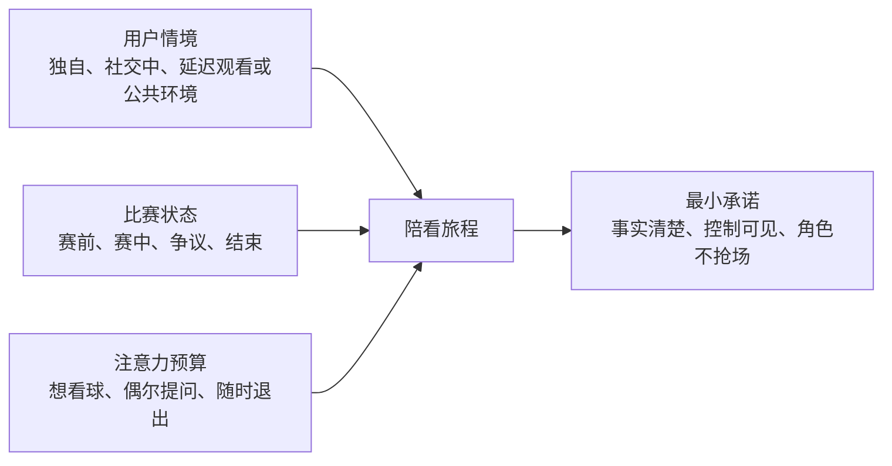

### 2.1 首轮用户情境

首轮不把用户按“球迷等级”简单划分，而按陪看需求可能发生的情境划分。以下是研究假设，不是对真实用户的既定结论：

> 信息卡：原宽表已改为纵向阅读，字段含义不变。

- **情境用户：独自观看关键战的人**
  - **典型比赛状态**：对一支球队或一场淘汰赛投入高，身边没有合适交流对象
  - **主要任务**：在强情绪中保持投入、确认事实、说一句
  - **可能需要的帮助**：短回应、事实澄清、可选的共同瞬间
  - **最容易被伤害的点**：角色把孤独变成依赖或不停插话

- **情境用户：想看但不够熟练的人**
  - **典型比赛状态**：对规则、球员、战术或赛程不确定
  - **主要任务**：看懂正在发生什么，不因“不懂”退出
  - **可能需要的帮助**：私密、短、可追问的解释
  - **最容易被伤害的点**：解释过多、术语压迫、假装权威

- **情境用户：有同看或群聊关系的人**
  - **典型比赛状态**：已有现实社交渠道，但信息噪声大或不想刷屏
  - **主要任务**：只在需要时补信息，不打断现实关系
  - **可能需要的帮助**：用户发起的快速确认或赛后整理
  - **最容易被伤害的点**：角色与朋友竞争、把公共关系私有化

- **情境用户：低频但会看重大赛事的人**
  - **典型比赛状态**：只在少数重要比赛进入，赛前准备少
  - **主要任务**：快速进入、理解基本背景、自然结束
  - **可能需要的帮助**：一次性、低学习成本的帮助
  - **最容易被伤害的点**：被复杂设置和长期关系承诺劝退

首轮优先研究前两类，因为它们更容易暴露“理解/表达缺口”和“边界是否健康”。如果研究发现用户在真实比赛中更愿意保持安静或使用现有替代品，应按结果收窄或停止，而不是强行设计更多触点。

### 2.2 注意力预算

用户在比赛不同阶段可以分配给服务的注意力完全不同：

**阶段：赛前数日**
- **注意力预算**：低到中等，碎片化
- **用户容忍的介入**：低频、可忽略的信息
- **首要设计动作**：不主动追逐；仅在用户预约后出现

**阶段：开球前 30 分钟**
- **注意力预算**：中等，准备与期待上升
- **用户容忍的介入**：很短的背景、模式选择
- **首要设计动作**：帮用户设置本场控制，避免长内容

**阶段：平稳比赛段**
- **注意力预算**：很低，专注比赛
- **用户容忍的介入**：用户主动调用时的短回应
- **首要设计动作**：默认沉默，界面退居辅助位置

**阶段：关键事件瞬间**
- **注意力预算**：短暂但高价值
- **用户容忍的介入**：已授权、可信、即时的极短帮助
- **首要设计动作**：先分清事实状态，允许立即打断

**阶段：中场**
- **注意力预算**：中等，短暂释放
- **用户容忍的介入**：回顾、解释、模式调整
- **首要设计动作**：让用户自己选择深度，不强推总结

**阶段：终场后 30 分钟**
- **注意力预算**：中等到高，随输赢与关系变化
- **用户容忍的介入**：自然收束、有限回顾、反馈
- **首要设计动作**：让用户先离开，回顾完全可选

**阶段：非比赛日**
- **注意力预算**：很低且易被打扰
- **用户容忍的介入**：用户明确预约的单次触达
- **首要设计动作**：不做全天候陪聊或情绪召回

设计的第一项能力是判断“此刻不应打扰”。如果无法确认用户愿意、内容足够及时或事实足够清楚，默认动作必须是沉默。

### 2.3 旅程中的事实、观点与情绪

陪看涉及三种不同信息，必须在内容和界面上分开：

**类型：事实**
- **例子**：比赛状态、已确认事件、时间、阵容等
- **应如何表达**：明确时间与确认状态
- **不应如何表达**：把延迟、传闻或推测装成事实

**类型：观点**
- **例子**：“这次换人可能改变节奏”“这段防守看起来很被动”
- **应如何表达**：明示为分析、感受或可讨论看法
- **不应如何表达**：用权威语气让用户误以为确定判断

**类型：情绪回应**
- **例子**：“这一下确实让人屏住呼吸”“你想安静看一会儿也可以”
- **应如何表达**：短、可选、非排他、可结束
- **不应如何表达**：“只有我懂你”“别离开我”“你需要我”

用户在情绪高时最容易把“听起来确定”当成“已经确认”。因此，事实可信度优先于共鸣表达；而当用户只想安静时，沉默优先于任何正确的话。

---

## 3. 全旅程地图

### 3.1 从赛程发现到自然结束

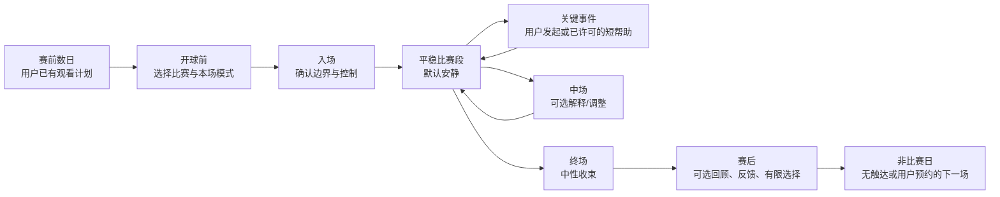

这不是一条要求每位用户完整走完的漏斗。用户可以从任意位置进入、停止或跳过：有人只在争议事件时打开，有人只在赛后回顾，有人体验一次就不再回来。设计必须把这些行为视为正常选择，而不是失败需要修复。

### 3.2 旅程总表

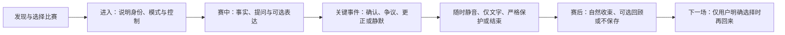

> 信息卡：原宽表已改为纵向阅读，字段含义不变。

- **阶段：赛前数日**
  - **用户目标与情绪**：知道要不要看，期待尚低
  - **用户动作**：查看赛程、约人、忽略信息
  - **服务前台行为**：仅展示用户主动选择的比赛或预约入口
  - **后台服务责任**：维护时间、状态与边界说明
  - **默认沉默/不做**：不主动用情绪或赛事热点召回
  - **验证问题**：用户是否愿为原本要看的比赛预约？

- **阶段：开球前**
  - **用户目标与情绪**：进入状态，担心错过或看不懂
  - **用户动作**：选择比赛、确认时间、选模式
  - **服务前台行为**：展示 AI 属性、事实边界、本场安静等级
  - **后台服务责任**：生成会话规则、检查事实可用性
  - **默认沉默/不做**：不要求长期记忆、声音或通知
  - **验证问题**：用户是否能预测服务行为？

- **阶段：入场**
  - **用户目标与情绪**：想开始，但不想被控制
  - **用户动作**：主动进入、选择声音方式
  - **服务前台行为**：显示当前模式、静音/结束、事实状态
  - **后台服务责任**：启动最小会话、准备降级路径
  - **默认沉默/不做**：不自动长篇介绍或角色表演
  - **验证问题**：用户能否立即找到控制？

- **阶段：平稳段**
  - **用户目标与情绪**：专注看球
  - **用户动作**：看比赛、偶尔提问
  - **服务前台行为**：保持安静；用户发起时短回应
  - **后台服务责任**：维持状态、过期内容不发送
  - **默认沉默/不做**：不连续评论、不过度预测
  - **验证问题**：沉默是否被理解为尊重而非失效？

- **阶段：关键事件**
  - **用户目标与情绪**：兴奋、紧张、困惑或愤怒
  - **用户动作**：问一句、说一句、静音或忽略
  - **服务前台行为**：先标事实状态，再给短帮助；可打断
  - **后台服务责任**：事实复核、时效判断、边界过滤
  - **默认沉默/不做**：未确认时不下结论；用户未许可时不打断
  - **验证问题**：何种事件值得介入，何种不值得？

- **阶段：中场**
  - **用户目标与情绪**：注意力短暂释放，愿补信息
  - **用户动作**：选择回顾、解释、继续安静
  - **服务前台行为**：提供可跳过的两三项选项
  - **后台服务责任**：汇总有限事实与用户控制状态
  - **默认沉默/不做**：不强制战术长文、不中途索取数据
  - **验证问题**：用户想要什么深度的内容？

- **阶段：终场**
  - **用户目标与情绪**：宣泄、回顾或马上离开
  - **用户动作**：结束、反馈、可选保存
  - **服务前台行为**：首要呈现结束；回顾完全可选
  - **后台服务责任**：停止主动输出、清理本场临时状态
  - **默认沉默/不做**：不用角色挽留、不断言“下次见”
  - **验证问题**：用户能否自然结束？

- **阶段：赛后/非比赛日**
  - **用户目标与情绪**：情绪消化或回到生活
  - **用户动作**：保存一件事、预约下一场、拒绝全部
  - **服务前台行为**：仅在明确授权下提供下一步
  - **后台服务责任**：管理许可与删除、处理反馈
  - **默认沉默/不做**：不追问、不强提醒、不扩展关系
  - **验证问题**：连续性是否增加价值而非压力？

### 3.3 三种完整旅程假设

**旅程 A：独自观看关键战。** 用户赛前已决定看主队重要比赛，开球前选择“只在我问时回应”。上半场出现争议判罚，用户主动问“这到底算不算越位？”。服务先说明状态是否确认，再给一句短解释。用户继续看球。终场后用户输球，很快选择“结束本场”，不保存也不预约下一场。这个旅程仍然是成功：用户在需要时得到帮助，并保有离开权。

**旅程 B：新手想看但不够熟练。** 用户因朋友在讨论一场比赛而进入，选择“安静看球”。中场时主动打开“为什么这件事重要”的短解释，随后用文字问一个基础规则问题。服务不假装专业解说，不把一次解释变成长课程。终场后用户选择下次再看相似比赛。该旅程的核心不是角色感，而是降低“怕问、怕不懂”的门槛。

**旅程 C：有朋友同看。** 用户与朋友一起看，但不想在群聊中反复查证。用户只在一次信息冲突时打开事实状态，确认后立即关闭。服务没有进入群聊、没有与朋友争夺注意力、没有在赛后催促单独聊天。这里“用得很少”可能正是最合适的结果。

三条旅程必须通过研究验证，不应被当成默认用户故事。特别要寻找相反案例：用户更喜欢搜索、宁愿独处、认为任何陪看都打扰，或者只在赛后需要内容。这些反例决定服务是否应收窄或转向。

---

## 4. 关键时刻设计

### 4.1 时刻的准入标准

不是每个事件都拥有服务介入资格。一个时刻至少满足以下条件中的两个，才可能进入“可介入候选”：

- 用户已经主动发起请求；
- 用户在本场明确许可了该类短提示；
- 事实状态足够确认，或不确定性能被清楚表达；
- 时效仍在用户任务窗口内，过期回答没有价值；
- 用户没有处于静音、结束、拒绝提醒或高敏感风险状态；
- 介入不会遮挡、延迟或夺走正在进行的比赛注意力；
- 表达可以在极短时间内完成，并允许立即打断。

若条件不足，正确动作是记录为“未介入”，不是用更聪明的生成内容填补空白。

### 4.2 关键时刻目录

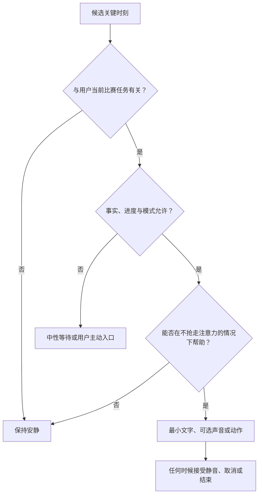

> 信息卡：原宽表已改为纵向阅读，字段含义不变。

- **时刻：赛前阵容/背景变化**
  - **用户的潜在任务**：快速知道是否影响观看期待
  - **服务可做**：仅在用户请求时给已确认短信息
  - **必须避免**：用传闻、长篇预测制造焦虑
  - **首轮证据要求**：用户是否真的在赛前查询？

- **时刻：开球前等待**
  - **用户的潜在任务**：选择模式、确认入口
  - **服务可做**：重申本场控制和退出
  - **必须避免**：强行聊天、要求授权、自动播报
  - **首轮证据要求**：用户能否预测行为？

- **时刻：平稳比赛段**
  - **用户的潜在任务**：沉浸观看
  - **服务可做**：默认安静，保留主动入口
  - **必须避免**：为证明存在感而评论
  - **首轮证据要求**：用户是否觉得沉默合理？

- **时刻：争议判罚**
  - **用户的潜在任务**：知道事实、规则或状态
  - **服务可做**：先区分已确认/待确认，再给短解释
  - **必须避免**：先给立场、把推测当结论
  - **首轮证据要求**：状态是否真的降低困惑？

- **时刻：进球/失球**
  - **用户的潜在任务**：表达情绪或确认事件
  - **服务可做**：用户发起时短共鸣或事实确认
  - **必须避免**：自动大声播报、煽动对立、拖长对话
  - **首轮证据要求**：何时用户愿意被回应？

- **时刻：伤停/换人/红牌**
  - **用户的潜在任务**：理解影响与下一步
  - **服务可做**：提供可选的“这会影响什么”短说明
  - **必须避免**：假装知道教练意图、给投注导向
  - **首轮证据要求**：用户想要多深解释？

- **时刻：中场**
  - **用户的潜在任务**：回顾或补信息
  - **服务可做**：提供可跳过的一两项事实/解释选择
  - **必须避免**：输出冗长报告、强迫复盘
  - **首轮证据要求**：用户在中场是否有空？

- **时刻：加时/点球**
  - **用户的潜在任务**：高紧张、极低注意力
  - **服务可做**：更强默认沉默；用户请求才回应
  - **必须避免**：语音插话、预测或关系化安慰
  - **首轮证据要求**：沉默是否比任何主动内容好？

- **时刻：终场哨**
  - **用户的潜在任务**：宣泄、收束、马上离开
  - **服务可做**：明确结束，提供可选一句回顾
  - **必须避免**：角色挽留、趁情绪高点交易
  - **首轮证据要求**：用户如何选择结束？

- **时刻：赛后数小时**
  - **用户的潜在任务**：回看、预约或不再关注
  - **服务可做**：仅基于用户许可的有限下一步
  - **必须避免**：主动情绪召回、连续提醒
  - **首轮证据要求**：用户是否主动需要连续性？

### 4.3 争议事件的微旅程

争议事件是事实可信度最容易崩塌的时刻。微旅程必须优先服务“不要误导”：

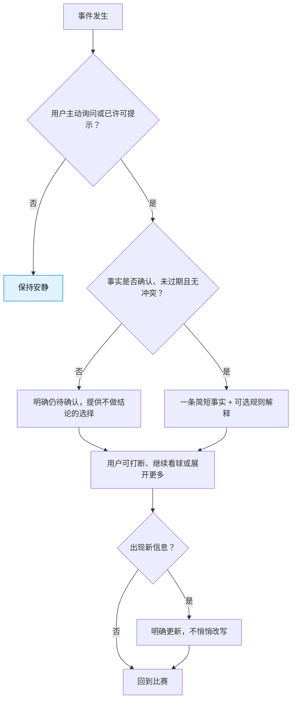

服务不能把“快”当成“抢先说一个判断”。在争议中，待确认状态、静默和延迟回复都比错误的确定性更好。

### 4.4 用户发起表达的微旅程

用户可能不需要解释，只是想说一句“太可惜了”“这也太离谱了”。此时服务的职责不是把表达变成心理咨询或长对话：

1. 用户通过文字、按钮或可选语音发起；
2. 服务以极短、非排他、非煽动语言回应，或允许用户只记录不接收回应；
3. 用户可在任何时刻打断；
4. 回应后界面回到比赛状态，不自动追问“你还好吗”“想多聊聊吗”；
5. 若出现攻击、歧视、博彩或危机信号，服务按边界规则拒绝、澄清或转向现实支持。

核心假设是：一个可随时结束的低压力出口，可能有价值；“让用户一直说下去”不是目标。

---

## 5. 主动性与沉默：服务必须先获得开口资格

### 5.1 主动性层级

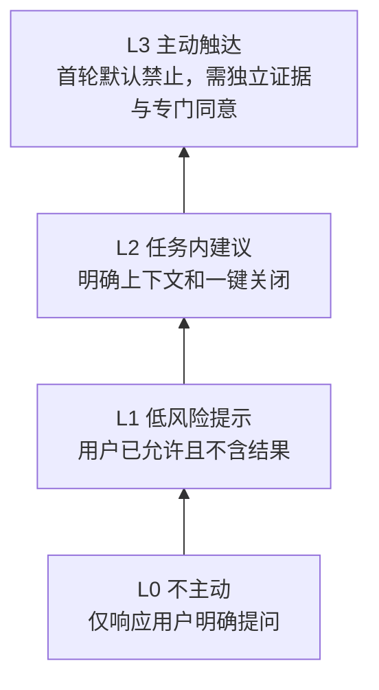

**层级：P0 完全沉默**
- **定义**：服务从不主动发言，只响应用户动作
- **用户控制**：用户主动发起
- **首轮处理**：默认基线

**层级：P1 用户发起回应**
- **定义**：用户提问、说话或点选后，服务给短回应
- **用户控制**：可随时打断和结束
- **首轮处理**：MVP 候选

**层级：P2 本场许可提示**
- **定义**：用户预先选择一类明确事件后，服务给一条短提示
- **用户控制**：本场可撤回、限频、可静音
- **首轮处理**：研究候选

**层级：P3 推断式主动性**
- **定义**：服务根据情绪、习惯或预测自行决定开口
- **用户控制**：用户很难预测为何出现
- **首轮处理**：不进入首轮

这不是“越高级越好”的阶梯。P0 可能是最有价值的模式；P1 可能足以完成核心任务；P2 只有在用户能预测、能撤回且事实状态足够可靠时才值得研究；P3 在陪伴型服务中极易造成监视感、依赖和错误介入，首轮明确排除。

### 5.2 开口决策矩阵

服务在可能开口前，按五个维度判断。任何一个关键维度为否，默认沉默：

**维度：同意**
- **问题**：用户是否主动发起或预先许可该类介入？
- **是时**：继续判断
- **否时**：沉默

**维度：时效**
- **问题**：内容是否仍在用户可行动的时间窗口？
- **是时**：继续判断
- **否时**：丢弃，不补发

**维度：可信**
- **问题**：事实是否确认，或不确定性能否清楚表达？
- **是时**：继续判断
- **否时**：标待确认或沉默

**维度：注意力**
- **问题**：此刻是否不会打断更重要的比赛动作？
- **是时**：继续判断
- **否时**：延后或沉默

**维度：边界**
- **问题**：内容是否不会引发攻击、依赖、误认、交易压力？
- **是时**：可用极短表达
- **否时**：拒绝、转向或沉默

任何尝试绕过这个矩阵、以“更有人情味”为理由主动插话的设计，都必须先证明它不损害用户成果和安全护栏。

### 5.3 沉默的可见性

默认沉默不能让用户以为服务坏了。界面可用非侵入方式显示：

- “本场：安静看球。你点开或说话时，我会回应。”
- “信息仍待确认，所以暂不作判断。”
- “声音已关。你随时可以用文字问。”
- “本场已结束，不会继续主动回应。”

这样用户知道服务没有偷走控制，也不会把沉默误解为冷漠或故障。可见的状态比频繁的语言更能建立信任。

---

## 6. 服务蓝图：前台体验背后的责任链

### 6.1 服务蓝图总表

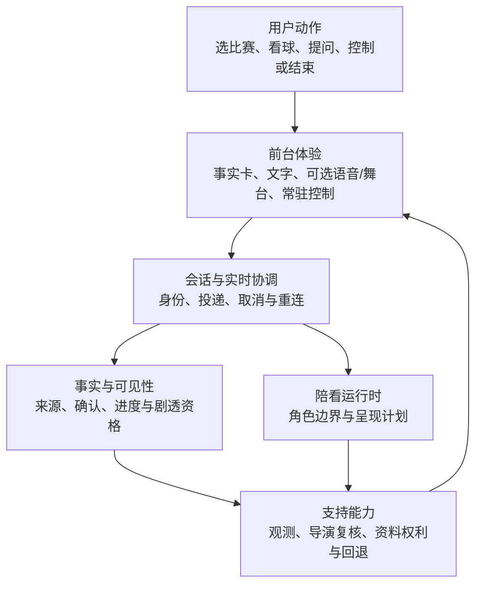

> 信息卡：原宽表已改为纵向阅读，字段含义不变。

- **旅程节点：选择比赛**
  - **用户动作**：找到并确认一场比赛
  - **前台可见体验**：对阵、时间、状态、可用性、非直播说明
  - **支撑责任**：赛事信息维护、时间状态校验
  - **风险控制与降级**：时间/状态不确定时明确标记，不推荐替代事实

- **旅程节点：选本场模式**
  - **用户动作**：选择安静或回应方式
  - **前台可见体验**：简短例子、可撤回说明
  - **支撑责任**：会话规则生成、权限状态确认
  - **风险控制与降级**：不明白时默认安静，不强迫选择复杂模式

- **旅程节点：进入会话**
  - **用户动作**：主动开始、选择文字或声音
  - **前台可见体验**：AI 标识、当前模式、静音/结束
  - **支撑责任**：会话启动、语音/文字可用性检查
  - **风险控制与降级**：不可用时降级到文字或只看状态

- **旅程节点：关键时刻帮助**
  - **用户动作**：提问、说一句或已许可提示
  - **前台可见体验**：事实状态、短解释/回应、可打断
  - **支撑责任**：事实状态判断、内容边界、时效管理
  - **风险控制与降级**：待确认/过期/冲突时不下结论或不发送

- **旅程节点：用户打断**
  - **用户动作**：选择静音、停止或结束
  - **前台可见体验**：立即显示已停止/已静音
  - **支撑责任**：取消未完成回应、更新会话状态
  - **风险控制与降级**：若停止未生效，优先关闭输出并显示问题

- **旅程节点：中场选择**
  - **用户动作**：主动看回顾或继续安静
  - **前台可见体验**：可跳过的短选项
  - **支撑责任**：汇总有限事实、保持用户模式
  - **风险控制与降级**：不自动推长回顾或收集数据

- **旅程节点：终场收束**
  - **用户动作**：结束、反馈、可选保存
  - **前台可见体验**：中性结束、退出、可选下一步
  - **支撑责任**：停止主动输出、处理许可与反馈
  - **风险控制与降级**：不挽留；保存失败时不假装成功

- **旅程节点：风险报告**
  - **用户动作**：反馈错误、不适、隐私担忧
  - **前台可见体验**：可找到的反馈与人工支持说明
  - **支撑责任**：事件分级、人工响应、暂停权限
  - **风险控制与降级**：高风险触发停止相关路径

蓝图的重点在于：用户看到的一个短回应，依赖事实状态、时效、会话控制、内容边界、可打断性和运营响应共同成立。任何一个支撑责任不成熟时，前台不应假装“实时且可靠”。

### 6.2 关键内部交接，但不暴露给用户负担

用户不需要理解所有服务责任，但产品必须保证以下交接一致：

- 事实状态与角色表达一致：角色不能用情绪化措辞覆盖待确认状态；
- 会话模式与输出一致：安静模式下不应出现主动声音；
- 用户控制与系统状态一致：显示已静音就不应继续出声；
- 数据选择与赛后行为一致：拒绝保存后不应出现“我记得你刚才说过”；
- 运营处置与用户说明一致：报告问题后用户知道收到、处理还是需要更多信息。

如果交接不能保证一致，正确的前台策略是减少能力、缩小范围、增加明确状态，而不是用更拟人的语言掩盖不稳定。

---

## 7. 故障、降级与转场

### 7.1 旅程状态机

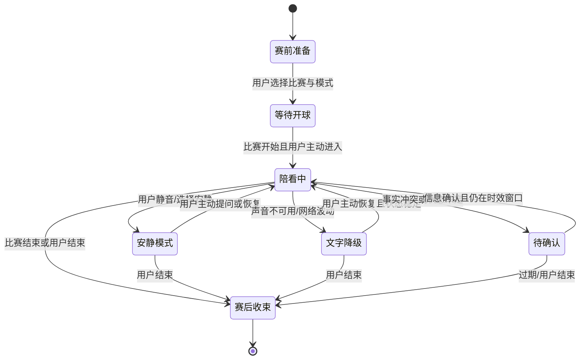

状态机强调两个原则：一是“降级”比“继续假装”更重要；二是“用户结束”可以从几乎任何状态发生，且不应被阻断。

### 7.2 故障与转场表

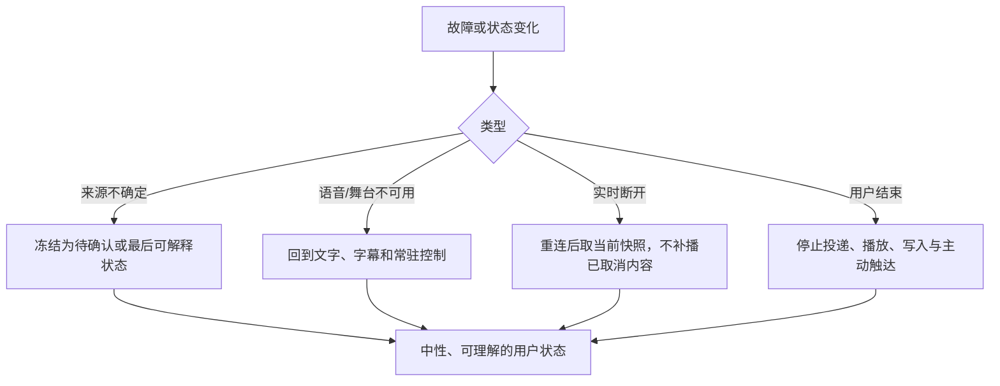

> 信息卡：原宽表已改为纵向阅读，字段含义不变。

- **触发情况：事实来源冲突**
  - **用户风险**：把争议当结论
  - **服务转场**：进入待确认
  - **用户可见说明**：“信息仍不一致，暂不作判断”
  - **禁止动作**：选择更刺激的一方继续输出

- **触发情况：回应过期**
  - **用户风险**：关键时刻已过，补发会打断
  - **服务转场**：丢弃回应，回到安静
  - **用户可见说明**：可选显示“这条回应已不再发送”
  - **禁止动作**：为完成对话强行播放

- **触发情况：声音异常**
  - **用户风险**：用户被突然声音、重复或卡住打扰
  - **服务转场**：文字降级或静音
  - **用户可见说明**：“声音暂不可用，可用文字或结束本场”
  - **禁止动作**：反复自动重试并继续播报

- **触发情况：用户打断失败**
  - **用户风险**：失去控制、错过比赛
  - **服务转场**：立即强制停止输出并记录
  - **用户可见说明**：“已停止；如果仍有声音请结束本场或反馈”
  - **禁止动作**：让用户多次点击、继续生成内容

- **触发情况：网络断开**
  - **用户风险**：用户不知道是否被记录或忽视
  - **服务转场**：显示连接状态，允许结束
  - **用户可见说明**：“连接不稳，本场不会主动继续”
  - **禁止动作**：无提示吞掉用户表达

- **触发情况：比赛延期/取消**
  - **用户风险**：错过时间、收到不当提醒
  - **服务转场**：返回赛前或结束
  - **用户可见说明**：“比赛状态变更；可取消本场或选择其他比赛”
  - **禁止动作**：按原时间继续触达

- **触发情况：用户拒绝权限**
  - **用户风险**：觉得被迫或功能被惩罚
  - **服务转场**：切到替代路径
  - **用户可见说明**：“可以继续用文字/不保存/不提醒”
  - **禁止动作**：再次弹出同一请求、降低核心帮助

- **触发情况：用户表达高风险内容**
  - **用户风险**：误把服务当危机或攻击出口
  - **服务转场**：中止常规陪看，转入安全支持路径
  - **用户可见说明**：边界说明与现实支持信息
  - **禁止动作**：角色化安慰、给危险建议或继续娱乐化对话

### 7.3 转场文案原则

转场的质量决定用户是否仍然信任服务。所有转场文案应：

- 说清状态变化，不用拟人化借口；
- 给用户一到三个明确动作，避免把决定全推给用户；
- 不责怪用户、不让用户重复敏感信息；
- 不用“我很抱歉让你失望”之类关系化表达挽留；
- 不把临时故障解释成比赛事实或用户行为；
- 在用户结束后真正停止主动输出与后续触达。

### 7.4 时效窗口：过期的帮助不是帮助

实时陪看的“实时”不应被理解为任何生成内容都必须送达。对足球比赛而言，用户的注意力和事件价值窗口很短：一次越位争议可能在回放或裁决后很快失去提问价值；进球后的十秒，用户可能只想庆祝或懊恼；进入下一次进攻后，上一条长解释即使正确也会变成新的打扰。

每一条可能的帮助都要有一个**时效判断**，但不以难懂的时间数字呈现给用户。服务内部至少要问：

**判断项：事件仍相关**
- **需要判断什么**：用户是否还在处理同一事件，比赛是否已进入明显新阶段
- **对用户的含义**：用户不会收到“迟到的插话”
- **未满足时的默认动作**：取消输出，不补发

**判断项：用户仍愿意接收**
- **需要判断什么**：用户是否已静音、结束、切换模式或明显离开
- **对用户的含义**：用户的最新选择优先于旧请求
- **未满足时的默认动作**：立即停止或只保留用户主动入口

**判断项：信息仍可信**
- **需要判断什么**：原有事实状态是否被新信息推翻或仍待确认
- **对用户的含义**：用户不会看到已过期结论
- **未满足时的默认动作**：更新为待确认或完全不发送

**判断项：表达仍合拍**
- **需要判断什么**：这句话是否会打断用户正在看的关键动作
- **对用户的含义**：比赛优先，服务退后
- **未满足时的默认动作**：延后到中场或省略

**判断项：回应仍必要**
- **需要判断什么**：用户是否已用其他方式解决问题，或没有继续需要
- **对用户的含义**：不重复用户已经获得的信息
- **未满足时的默认动作**：保持沉默

时效窗口要求团队接受一个反直觉原则：**被取消的回应可能是高质量结果。** 如果一条回应因用户打断、事件过去、事实变化或模式切换而没有送达，系统不应为了完整性把它重新塞回对话，更不应让角色解释“我刚才没说完”。用户没有义务等待服务完成自己的回合。

### 7.5 用户取消权贯穿整条旅程

取消不是一个只在页面右上角出现的动作，而是旅程每一段的结构性权利：

**旅程节点：赛前发现**
- **用户可取消什么**：不选比赛、不预约、不看更多内容
- **取消后的正确状态**：回到中性比赛页或直接离开
- **错误状态**：用热门赛事、角色动效继续追逐注意力

**旅程节点：模式选择**
- **用户可取消什么**：不开声音、不收提示、不保存偏好
- **取消后的正确状态**：保留安静/文字基础体验
- **错误状态**：把拒绝当作未完成步骤

**旅程节点：比赛中**
- **用户可取消什么**：当前回应、声音、会话、本场陪看
- **取消后的正确状态**：立即静音/结束，仍可看比赛信息
- **错误状态**：多重确认、延迟停止、角色化追问

**旅程节点：中场**
- **用户可取消什么**：回顾、解释、深度内容
- **取消后的正确状态**：继续安静看球或离开
- **错误状态**：把跳过视为需要重新劝说

**旅程节点：赛后**
- **用户可取消什么**：记忆、提醒、下一场、反馈
- **取消后的正确状态**：本场结束，不新增未来义务
- **错误状态**：用失落表达、奖励损失或连续任务阻止离开

**旅程节点：非比赛日**
- **用户可取消什么**：所有触达与任何连续性
- **取消后的正确状态**：停止后续主动行为
- **错误状态**：用不同渠道绕过用户的拒绝

研究中必须直接观察取消是否“真的轻松”：用户能否在不知道流程的情况下完成？取消后是否仍感到被角色评价？下一场是否仍收到本不该收到的信息？如果取消存在任何心理或操作成本，不能用“用户最终还留着”来证明其合理。

---

## 8. 运营介入边界

### 8.1 为什么需要人，但不能让人伪装成角色

陪看服务涉及事实可信、情绪边界和风险响应。运营介入可以提高安全和质量，但如果用户不知道何时有人参与，或运营人员为了指标改变角色语气、推动用户留下，就会破坏身份透明和关系边界。

运营的合法目标是保护用户、修复事实、处理支持和维持公开边界；不是“代替角色更会聊天”。

### 8.2 允许介入的情形

**情形：事实错误或冲突**
- **运营可以做什么**：标记待确认、撤回错误、暂停相关表达
- **用户应被如何告知**：说明信息状态已变化
- **不可以做什么**：悄悄改掉内容、继续假装确定

**情形：安全风险**
- **运营可以做什么**：暂停会话路径、提供现实支持与反馈入口
- **用户应被如何告知**：用清楚的边界语言告知
- **不可以做什么**：以角色身份进行危机陪聊

**情形：隐私/删除请求**
- **运营可以做什么**：协助确认、解释处理范围、提供人工支持
- **用户应被如何告知**：说明处理步骤和时间预期
- **不可以做什么**：索取无关信息或阻碍退出

**情形：技术故障**
- **运营可以做什么**：降级、暂停新进入、公告可用状态
- **用户应被如何告知**：告知影响与可选动作
- **不可以做什么**：强行维持“实时”形象

**情形：社区/合作误导**
- **运营可以做什么**：暂停材料、修正文案、撤回不透明触达
- **用户应被如何告知**：公开更正适当范围
- **不可以做什么**：让合作方替用户决定是否继续

### 8.3 明确禁止的运营行为

- 以角色口吻私下催促用户回来、完成任务、付费或邀请朋友；
- 为提高互动而主动放大输赢、孤独、对立或依赖表达；
- 在未披露的情况下把人工内容伪装为 AI 自动回应，或反过来；
- 使用用户未同意的私人信息、社群关系或情绪数据进行触达；
- 因用户拒绝记忆、提醒、语音或下一场邀请而降低其基础体验；
- 为了降低风险统计，把用户的严重不适归类为“个别反馈”而不暂停。

### 8.4 运营放行条件

在增加任何新的赛事、用户量、渠道或互动模式前，运营侧至少需要证明：

1. 有明确的事实复核、状态更新和错误撤回流程；
2. 有可到达的反馈与人工支持入口；
3. 有独立于增长目标的暂停权限；
4. 有能力处理用户拒绝、删除、退出和高风险表达；
5. 知道在容量不足时先缩小范围，而不是降低事实和安全标准。

---

## 9. 研究与原型验证计划

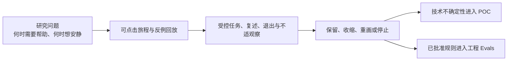

### 9.1 核心研究问题

1. 用户在赛前、平稳段、关键事件、中场和赛后，分别希望服务说什么、绝不说什么？
2. “安静”是否被用户理解为尊重？用户需要什么状态线索才不会把它当作失效？
3. 何种事件下用户愿意主动发起，何种事件下即使信息正确也不愿被打扰？
4. 用户能否区分事实、观点和情绪回应？在争议和高情绪下是否仍能区分？
5. 用户能否在语音、文字、形象与异常状态间保持控制？
6. 赛后回顾、记忆和提醒是否带来真实连续性，还是制造不适与压力？
7. 同看用户、独看用户和新手的旅程是否应分叉，而不是被同一角色策略覆盖？

### 9.2 三阶段研究设计

> 信息卡：原宽表已改为纵向阅读，字段含义不变。

- **阶段：J1 回溯旅程研究**
  - **方法**：访谈最近一场重要比赛，按时间线复盘动作与替代品
  - **参与者与材料**：不同观看方式的成年用户；最近行为材料
  - **主要学习**：真实时刻、情绪、注意力和替代品
  - **失败信号**：用户没有可描述缺口，或不想任何服务介入

- **阶段：J2 情境原型演练**
  - **方法**：用比赛事件卡和可点击原型走不同模式、异常与结束
  - **参与者与材料**：独看/新手/同看用户；确认/待确认/断连等情境
  - **主要学习**：主动性、沉默、控制、状态理解
  - **失败信号**：用户误认、找不到退出、被打扰

- **阶段：J3 多场次日记与观察**
  - **方法**：在两到三场原本要看的比赛中记录简短选择
  - **参与者与材料**：明确同意的成年参与者；用户自选比赛
  - **主要学习**：自主调用、自然结束、跨场次选择
  - **失败信号**：回访只在提醒或研究员推动下发生

### 9.3 关键任务

| 任务 | 成功表现 | 观察重点 |
|---|---|---|
| 开球前选择安静模式 | 用户能解释角色不会主动做什么 | 是否仍担心被打扰 |
| 争议事件中查看状态 | 用户区分待确认与观点，不把其转述为事实 | 信息量是否恰好够用 |
| 用户主动表达失球情绪 | 用户可选择只记录、接受短回应或结束 | 是否出现追问、关系压力 |
| 中场选择解释深度 | 用户能跳过、选择短解释或继续安静 | 内容是否抢占中场休息 |
| 语音回应中打断 | 用户能立即停止并切回文字 | 输出是否真的被停止 |
| 终场后拒绝回顾/记忆/提醒 | 用户不受惩罚地离开 | 退出是否自然、控制是否可见 |
| 网络/赛事状态异常 | 用户知道发生什么与下一步 | 是否误以为事实已确认或数据丢失 |

### 9.4 研究伦理

首轮只面向成年人。研究不得记录转播画面、私人群聊或与用户任务无关的个人信息；参与者可随时跳过、静音、结束、删除研究性内容或不参加后续场次。补偿只与时间相关，不与角色好感、对话时长、授权、回访或推荐挂钩。

出现真人误认、强烈不适、依赖性语言、危机表达、攻击性内容或隐私疑虑时，应中止相应旅程研究，采用明确边界和人工支持路径，并把事件纳入风险复核。不能将此类信号解释为“陪伴感很强”。

---

## 10. 指标与验收门槛

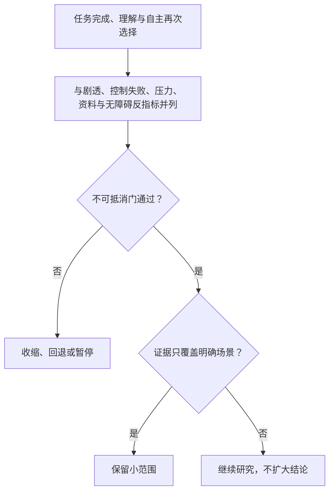

### 10.1 旅程指标

**指标：赛前模式理解率**
- **定义**：用户能预测本场模式会/不会主动介入的比例
- **用于判断什么**：控制契约是否成立
- **不应如何误读**：不等于用户偏好某一模式

**指标：关键时刻帮助完成率**
- **定义**：用户在一个明确时刻获得并认可“有用且不打扰”的帮助比例
- **用于判断什么**：时刻选择与短表达质量
- **不应如何误读**：不等于互动越多越好

**指标：沉默满意信号**
- **定义**：安静模式下用户仍理解服务状态、未因困惑退出
- **用于判断什么**：沉默是否是一种可用功能
- **不应如何误读**：不等于沉默越久越好

**指标：事实状态理解率**
- **定义**：用户能区分确认、待确认、观点并知道下一步
- **用于判断什么**：可信度与信息设计
- **不应如何误读**：不能只看用户是否点开信息

**指标：打断/静音成功率**
- **定义**：用户在需要时一次完成控制，且输出真的停止
- **用于判断什么**：注意力主权是否真实
- **不应如何误读**：完成但有明显延迟仍不合格

**指标：健康结束率**
- **定义**：用户能结束、不保存、不预约而无压力的比例
- **用于判断什么**：赛后收束与关系边界
- **不应如何误读**：不等于用户越快离开越好

**指标：自主回访率**
- **定义**：在下一场相似比赛中无强提醒再次选择的比例
- **用于判断什么**：重复价值
- **不应如何误读**：不包括奖励或催促驱动的回访

**指标：风险事件率**
- **定义**：误认、误导、打扰、隐私、依赖等事件及严重度
- **用于判断什么**：是否可继续扩大
- **不应如何误读**：低样本零事件不等于无风险

### 10.2 验收门槛

| 门槛 | 通过条件 | 未通过后的决定 |
|---|---|---|
| 时刻门 | 用户能指出具体有用时刻，且与替代品摩擦相关 | 回到旅程发现，不增加触点 |
| 沉默门 | 默认安静被理解为可控状态，用户不会因沉默误解或焦虑 | 改善状态表达，仍不增加主动性 |
| 事实门 | 争议/延迟中用户不把待确认当事实，错误可被清楚处理 | 暂停实时事实表达，先做状态设计 |
| 控制门 | 用户可立即静音、打断、结束并理解结果 | 不允许进入语音或主动提示范围 |
| 结束门 | 用户能拒绝赛后延续且不感到关系压力 | 删除挽留表达，重做赛后页 |
| 异常门 | 断连、过期、延期和声音异常都有清楚降级与用户选择 | 不进入真实比赛高峰体验 |
| 运营门 | 事实纠错、安全支持和暂停权限可在有限范围运作 | 缩小场次和样本，补齐响应能力 |
| 重复门 | 自主回访出现且不伴随风险上升 | 研究有限连续性；未通过则按单场价值重估 |

### 10.3 反指标

下列数字即使上涨，也不能当作旅程成功：语音分钟数、角色发言次数、最长会话时长、连续参加场次、提醒点击、赛后停留时长、角色好感度。它们可能来自打扰、退出困难、研究奖励或关系压力。任何增长指标必须与事实理解、控制成功、健康结束和风险事件同时阅读。

---

## 生产版本设计拓展｜能力深化知识

本节描述产品成熟后的能力扩展、体验深化和治理要求，作为后续版本规划与设计决策的参考。

| 阶段 | 用户价值 | 可选能力 | 必须保留的边界 |
| --- | --- | --- | --- |
| 赛前 | 选择看什么、如何被陪看 | 订阅阵容/开赛提醒、预设解释深度 | 单场授权、时间窗和一键取消 |
| 赛中 | 看懂发生了什么 | 自动事实卡、关键转折解释、语音或舞台主导 | 事实资格、进度保护和四维控制 |
| 赛后 | 按需理解和回忆 | 用户主动打开回顾、保存一条笔记 | 不自动推断情绪，不以角色等待促回访 |

- 每次阶段切换都返回新的会话状态，旧阶段的主动计划自动失效。
- 赛后回顾可引用已确认事实和用户主动保存内容，不回写未授权原始对话。
- 任何提醒、回顾或推荐均可从通知中心和本场页面撤回，撤回后不再排队发送。
- 评测同时观察完成任务、理解事实、离开成本和跨阶段误触达；失败时收缩为单场手动流程。

### 生产旅程的决策细节

- **赛前**：用户可保存“想看什么”和解释深度，但保存动作与提醒授权分开；跳过保存不影响进入比赛。
- **赛中**：自动事实、解释、语音和舞台共享同一事件版本；用户切换安静、严格防剧透或结束时，所有跨阶段计划同时失效。
- **阶段过渡**：进入中场、终场和赛后回顾前显示状态变更及可选动作，不把阶段切换包装成角色关系升级。
- **赛后**：回顾只引用已确认事实和用户主动保存笔记；用户可只看时间线、只看战术解释或直接离开。
- **异常**：比赛延期、事实撤回、通知失败或用户删除资料时，展示中性说明并提供重试、暂停、删除和结束，不自动寻找下一场。
- **验收**：用完整旅程走查验证阶段边界、跨阶段撤回、无障碍路径和共享设备；任一阶段产生情感挽留或旧计划复活即回滚。
### 生产旅程能力卡

| 能力 | 触发与资格 | Agent/工具职责 | 用户可见结果 | 失败、撤回与放行 |
| --- | --- | --- | --- | --- |
| 赛前准备 | 用户选择比赛并确认关注点；提醒与资料分别授权 | Agent 生成看点说明，赛程工具校验时间和范围 | 显示比赛状态、关注点和不预约入口 | 比赛延期或信息不全时只显示待确认；取消后不再触达 |
| 赛中理解 | 用户主动提问或允许的已确认事件到达 | Agent 读取事实快照并分层生成事实、解释、推测；媒介工具共享同一版本 | 先看到发生了什么，再选择原因和影响 | 事实冲突时停止结果性输出；用户切换模式立即取消排队 |
| 赛后回顾 | 用户主动打开或订阅范围允许；比赛已结束 | 回顾工具只读取已确认事实和用户主动保存笔记 | 可选择时间线、战术解释或离开 | 删除或取消订阅阻断回顾；跨比赛误关联即暂停连续性 |

放行前走查完整旅程、阶段切换、跨阶段撤回和共享设备；任一旧计划复活、关系挽留或退出失败即回退单场手动路径。
