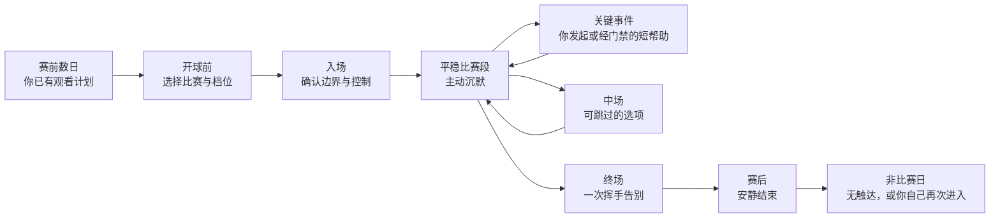
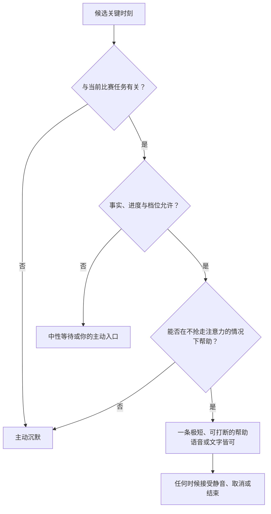
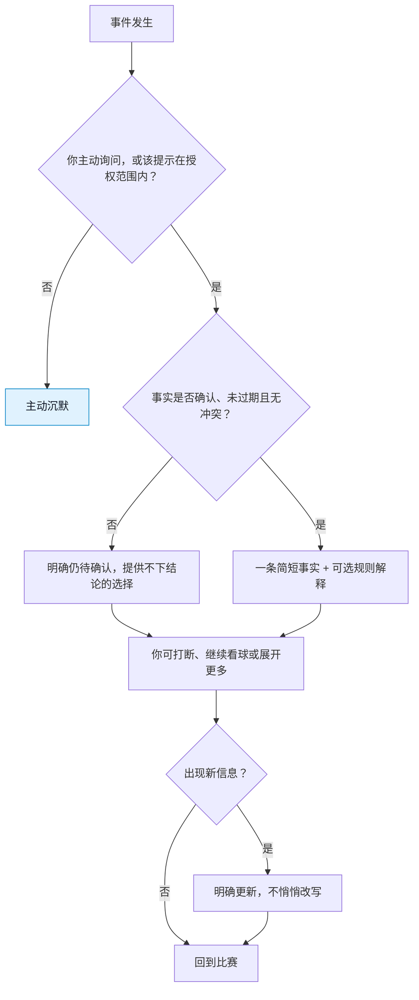
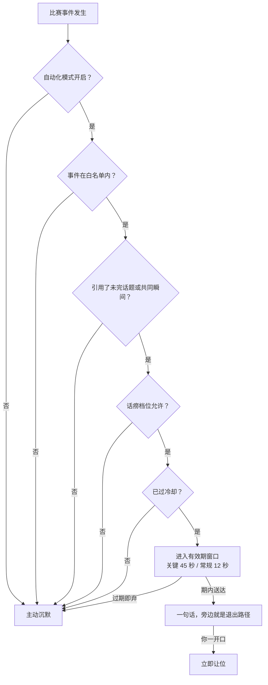
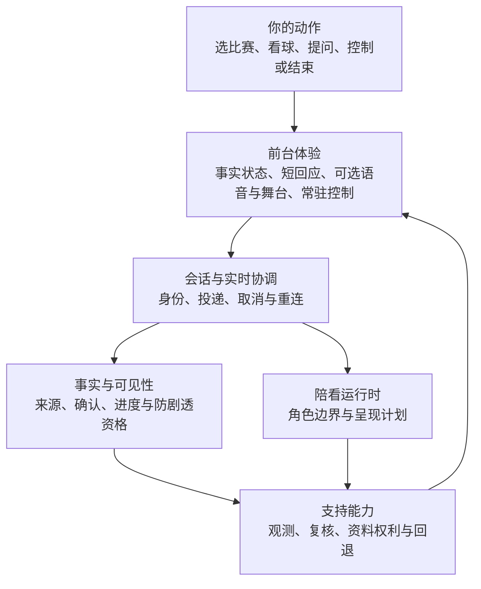
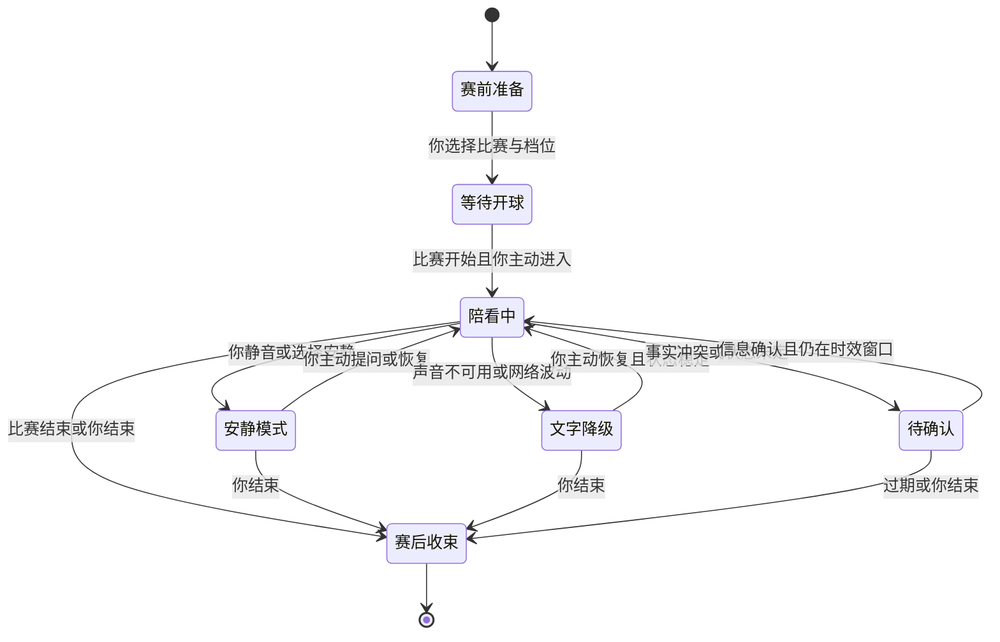
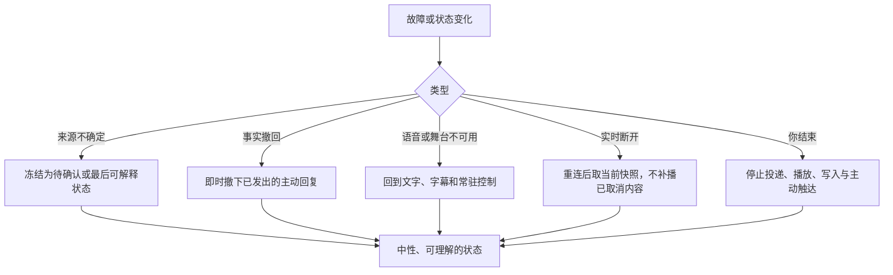
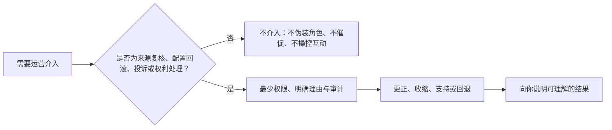
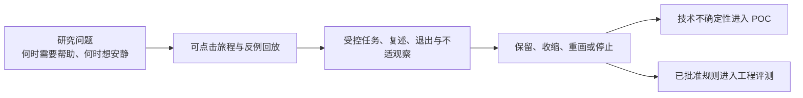
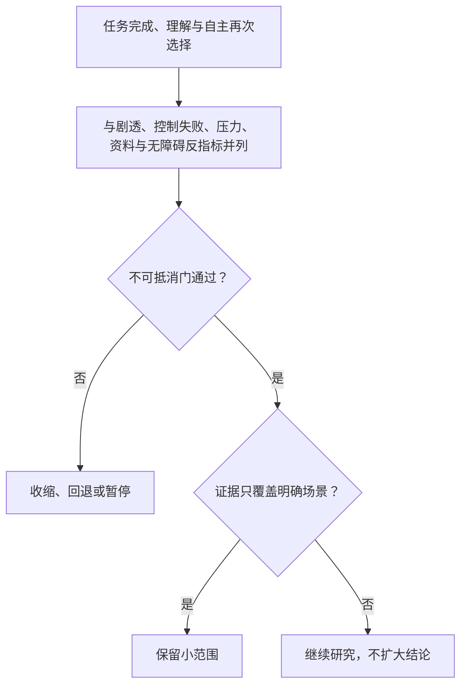

# 赛前赛中赛后陪看旅程设计

> 本文是"球球"产品设计系列的陪看旅程篇，写给想了解这场陪伴如何从赛程发现一路走到赛后收束的读者。球球是我们的足球陪看数字人，我们称它为**数字球友（Digital Ballmate）**——一位陪你看球、在需要时开口、在不需要时安静下来的伙伴。文中描述的行为均以现网实际运行为准；尚未上线的部分，统一归入文末"面向成熟阶段的能力深化（阶段规划）"，不以既有能力的口吻表述。
>
> 核心原则：比赛是主角，你的现实生活和真实关系也是主角。数字球友只在你授权、事实足够可信、时机合适且能随时被打断时介入；其余时间，主动沉默。

---

## 1. 设计命题：陪看不是一段无限对话

"陪看"很容易被做成从开球到终场不停聊天。这样的设计既不理解足球，也不理解陪伴。你看比赛时会在沉浸、困惑、兴奋、紧张、失落、想表达和想独处之间快速切换。服务若把每个情绪峰值都当作说话机会，就会抢走比赛、放大情绪，甚至制造"必须回应它"的压力。

我们希望这场陪伴达成的成果是：

> 你在一场自己本来就要看的比赛里，可以在需要理解、表达或确认的关键时刻得到短而可信、可中断的帮助；在不需要时，球球退到背景，不需要你为维持一段关系而管理它。

这一定义排除四种错误目标：

- 不以让你停留更久为目标；
- 不以让球球说得更多为目标；
- 不以代替朋友、群聊、解说或现实支持为目标；
- 不以对输赢、孤独和争议进行情绪化牵引为目标。

服务旅程必须同时达成三件事：**在场但不黏着、可信但不装全知、温暖但不跨越边界。** 任何一个条件缺失，陪看都会从辅助变成负担。

---

## 2. 旅程的输入：用户、比赛与注意力都在变化

### 2.1 四种观看情境

我们不把用户按"球迷等级"划分，而按陪看需求可能发生的情境划分。以下四种情境来自我们的情境假设（登记于《需求假设与验证计划》），待研究验证，描述的是情境，而不是给谁贴标签：

- **情境：独自观看关键战的人**
  - **典型状态**：对一支球队或一场淘汰赛投入很高，身边没有合适的交流对象
  - **主要任务**：在强情绪中保持投入、确认事实、说一句
  - **可能需要的帮助**：短回应、事实澄清、可选的共同瞬间
  - **最容易被伤害的点**：球球把孤独变成依赖，或不停插话

- **情境：想看但还不够熟练的人**
  - **典型状态**：对规则、球员、战术或赛程不确定
  - **主要任务**：看懂正在发生什么，不因"不懂"退出
  - **可能需要的帮助**：私密、短、可追问的解释
  - **最容易被伤害的点**：解释过多、术语压迫、假装权威

- **情境：有同看或群聊关系的人**
  - **典型状态**：已有现实社交渠道，但信息噪声大或不想刷屏
  - **主要任务**：只在需要时补信息，不打断现实关系
  - **可能需要的帮助**：你发起的快速确认
  - **最容易被伤害的点**：球球与朋友竞争注意力、把公共关系私有化

- **情境：低频但会看重大赛事的人**
  - **典型状态**：只在少数重要比赛进入，赛前准备少
  - **主要任务**：快速进入、理解基本背景、自然结束
  - **可能需要的帮助**：一次性、低学习成本的帮助
  - **最容易被伤害的点**：被复杂设置和长期关系承诺劝退

我们最先研究前两类情境，因为它们最容易暴露"理解与表达的缺口"以及"边界是否健康"。如果研究发现人们在真实比赛中更愿意保持安静或使用现有替代品，我们会按结果收窄或停止，而不是强行设计更多触点。

### 2.2 注意力预算

你在比赛不同阶段能分配给球球的注意力完全不同：

**阶段：赛前数日**
- **注意力预算**：低到中等，碎片化
- **你能容忍的介入**：低频、可忽略的信息
- **我们的设计动作**：不主动追逐；只在你主动进入时出现

**阶段：开球前 30 分钟**
- **注意力预算**：中等，准备与期待上升
- **你能容忍的介入**：很短的背景、档位与模式选择
- **我们的设计动作**：帮你设置本场控制，避免长内容

**阶段：平稳比赛段**
- **注意力预算**：很低，专注比赛
- **你能容忍的介入**：你主动调用时的短回应
- **我们的设计动作**：主动沉默，界面退居辅助位置

**阶段：关键事件瞬间**
- **注意力预算**：短暂但高价值
- **你能容忍的介入**：经门禁许可、可信、即时的极短帮助
- **我们的设计动作**：先分清事实状态，允许立即打断

**阶段：中场**
- **注意力预算**：中等，短暂释放
- **你能容忍的介入**：回顾、解释、模式调整
- **我们的设计动作**：由你选择深度，不强推总结

**阶段：终场前后**
- **注意力预算**：中等到高，随输赢变化
- **你能容忍的介入**：一次自然的收束
- **我们的设计动作**：一次挥手与一句告别，然后回到待机，把离开的主动权交还给你

**阶段：非比赛日**
- **注意力预算**：很低且易被打扰
- **你能容忍的介入**：几乎没有
- **我们的设计动作**：不做全天候陪聊或情绪召回

设计的第一项能力是判断"此刻不应打扰"。如果无法确认你愿意、内容足够及时或事实足够清楚，默认动作就是主动沉默。

### 2.3 旅程中的事实、观点与情绪

陪看涉及三种不同信息，我们在内容和界面上把它们分开：

**类型：事实**
- **例子**：比赛状态、已确认事件、时间、阵容等
- **我们如何表达**：明确时间与确认状态
- **我们不会怎样表达**：把延迟、传闻或推测装成事实

**类型：观点**
- **例子**："这次换人可能改变节奏""这段防守看起来很被动"
- **我们如何表达**：明示为分析、感受或可讨论的看法
- **我们不会怎样表达**：用权威语气让你误以为是确定判断

**类型：情绪回应**
- **例子**："这一下确实让人屏住呼吸""你想安静看一会儿也可以"
- **我们如何表达**：短、可选、非排他、可结束
- **我们不会怎样表达**："只有我懂你""别离开我""你需要我"

人在情绪高时最容易把"听起来确定"当成"已经确认"。因此，事实可信度优先于共鸣表达；而当你只想安静时，主动沉默优先于任何正确的话。

---

## 3. 全旅程地图

### 3.1 从赛程发现到自然结束

这不是一条要求每位用户完整走完的漏斗。你可以从任意位置进入、停止或跳过：有人只在争议事件时打开，有人看完就走，有人体验一次就不再回来。我们把这种行为视为正常选择，而不是需要修复的失败。

### 3.2 旅程总表

下面这张总表是整篇的骨架：每一列是一个旅程阶段，每一行是一类责任。其中"观察跟进"与"事实撤回"是两条纯后台的责任线——它们在你看不见的地方运行，我们在此一并说明。

| 责任维度 | 赛前数日 | 开球前 | 入场 | 平稳段 | 关键事件 | 中场 | 终场 | 赛后与非比赛日 |
| --- | --- | --- | --- | --- | --- | --- | --- | --- |
| **你的目标与情绪** | 知道要不要看，期待尚低 | 进入状态，怕错过或看不懂 | 想开始，但不想被控制 | 专注看球 | 兴奋、紧张、困惑或愤怒 | 注意力短暂释放 | 宣泄、回顾或马上离开 | 消化情绪或回到生活 |
| **你的动作** | 查赛程、约人、忽略 | 选比赛、选档位与方式 | 进入、选声音方式 | 看球、偶尔提问 | 问一句、说一句、静音 | 选回顾或继续安静 | 离开、反馈 | 离开即可，不做选择 |
| **球球的前台行为** | 只展示你主动选择的比赛 | 说明数字人身份（用户面身份说明属受控开放准备项，见阶段规划）、事实边界与本场档位 | 显示当前模式与静音、结束等退出路径 | 主动沉默；你发起时短回应 | 先标事实状态，再给短回应，可随时打断 | 提供可跳过的少数选项 | 一次挥手与一句告别，全场仅一次，随后回待机 | 不发起任何互动 |
| **我们的后台责任** | 维护赛程时间与状态 | 生成会话规则、检查事实可用性 | 启动最小会话、准备降级路径 | 维持状态，过期内容不发送 | 事实复核、时效判断、边界过滤 | 汇总有限事实与你的控制状态 | 停止主动输出、清理本场临时状态，赛后反思自动入队 | 赛后反思刷新画像并留审计，管理许可与删除 |
| **主动沉默（我们不做什么）** | 不用热点与情绪召回 | 不索取长期授权 | 不自动长篇介绍、不做角色表演 | 不连续评论、不过度预测 | 未确认不下结论 | 不强推长总结 | 不挽留、不假定"下次见" | 不追问、不提醒、不扩展关系 |
| **观察跟进（后台）** | — | — | — | 你的主张记为待确认观察，不当事实来源 | 事实确认后，只对主张者本人跟进 | 跟进同样有截止时间，过期不补 | — | 你离线期间确认的事实，重连后补一次跟进 |
| **事实撤回（后台）** | — | — | — | 撤下已发出的主动回复 | 即时撤下已发出的主动回复，按当前版本说明 | — | — | 撤回同样即时生效 |
| **我们仍在验证** | 你是否愿意为本来要看的比赛花时间 | 你能否预测球球的行为 | 你能否立刻找到控制 | 沉默是否被理解为尊重而非失效 | 何种事件值得开口，何种不值得 | 你想要什么深度的内容 | 你能否自然结束 | 连续性是否增加价值而非压力 |

总表之下的两条后台责任线，值得单独说清楚：

- **观察跟进**：比赛中你说一句"这球越位了吧"，它只是一句主张——用户的主张永远不会成为事实来源。我们会把它记作一条待确认的观察，安静等待可信来源；事实被确认或撤销之后，跟进只发给主张这件事的你本人，不做任何广播。跟进有截止时间，过期不补；你离线期间被确认的事实，重连后补一次。整个过程你无感，它只服务你一人。
- **事实撤回**：一条已经发出的主动回复，如果它依据的事实随后被撤回，会被即时撤下，并以当前事实版本为准给出最小说明——不悄悄改写，也不假装没说过。

### 3.3 三种真实的观看旅程

**独自观看关键战。** 你赛前已决定看主队的重要比赛，开球前把档位调到最安静。上半场出现争议判罚，你主动问"这到底算不算越位？"球球先说明这一状态是否已确认，再给一句短解释，你继续看球。终场哨响，球球挥手说了这一场唯一的一句告别，回到待机；你合掉页面离开就好——不做任何选择，服务就安静结束。这仍然是成功的旅程：你在需要时得到了帮助，并保有离开权。

**想看懂比赛的新朋友。** 你因为朋友在讨论一场比赛而进入，选择安静看球。中场时主动打开"为什么这件事重要"的短解释，随后用文字问了一个基础规则问题。球球不假装专业解说，也不把一次解释变成长课程。这场旅程的核心不是角色感，而是降低"怕问、怕不懂"的门槛。

**有朋友同看。** 你和朋友一起看，但不想在群聊里反复查证。你只在一次信息冲突时打开事实状态，确认后立即关闭。球球没有进入群聊、没有和朋友争夺注意力、也没有在赛后催你单独聊。在这里，"用得很少"可能正是最合适的结果。

这三种旅程会通过研究持续验证，我们同样在寻找相反的案例：有人更喜欢自己搜索、宁愿独处、认为任何陪看都打扰。这些反例决定我们是否应收窄或转向。

---

## 4. 关键时刻设计

### 4.1 时刻的准入标准

不是每个事件都有让球球开口的资格。一个时刻至少满足以下条件中的两个，才可能获得开口资格：

- 你已经主动发起请求；
- 该类短提示在你授权的范围内（你选定的提醒类别与档位）；
- 事实状态足够确认，或不确定性能被清楚表达；
- 时效仍在你的任务窗口内——在现网，这被锚定为明确的有效期（见 7.4），过期回答没有价值；
- 你没有处于静音、结束、拒绝提醒或高敏感风险状态；
- 介入不会遮挡、延迟或夺走正在进行的比赛注意力；
- 表达可以在极短时间内完成，并允许立即打断。

条件不足时，正确的动作是记录为"未介入"，而不是用更聪明的生成内容填补空白。

### 4.2 关键时刻目录

- **时刻：赛前阵容与背景变化**
  - **你的潜在任务**：快速知道它是否影响观看期待
  - **球球会做**：仅在你请求时给已确认的短信息
  - **必须避免**：用传闻、长篇预测制造焦虑
  - **我们持续观察**：你是否真的在赛前查询

- **时刻：开球前等待**
  - **你的潜在任务**：选档位、确认入口
  - **球球会做**：重申本场控制与退出路径
  - **必须避免**：强行聊天、索取授权、自动播报
  - **我们持续观察**：你能否预测球球的行为

- **时刻：平稳比赛段**
  - **你的潜在任务**：沉浸观看
  - **球球会做**：主动沉默，保留你随时开口的入口
  - **必须避免**：为证明存在感而评论
  - **我们持续观察**：沉默是否让你觉得合理

- **时刻：争议判罚**
  - **你的潜在任务**：知道事实、规则或状态
  - **球球会做**：先区分已确认与待确认，再给短解释
  - **必须避免**：先给立场、把推测当结论
  - **我们持续观察**：状态说明是否真的降低困惑

- **时刻：进球与失球**
  - **你的潜在任务**：表达情绪或确认事件
  - **球球会做**：经门禁的短提示，或你发起时的短共鸣
  - **必须避免**：自动大声播报、煽动对立、拖长对话
  - **我们持续观察**：何时你愿意被回应

- **时刻：伤停、换人与红牌**
  - **你的潜在任务**：理解影响与下一步
  - **球球会做**：提供可选的"这会影响什么"短说明
  - **必须避免**：假装知道教练意图、给投注导向
  - **我们持续观察**：你想要多深的解释

- **时刻：中场**
  - **你的潜在任务**：回顾或补信息
  - **球球会做**：提供可跳过的一两项事实与解释选择
  - **必须避免**：输出冗长报告、强迫复盘
  - **我们持续观察**：中场休息时你是否真的有空

- **时刻：加时与点球**
  - **你的潜在任务**：高紧张、极低注意力
  - **球球会做**：更深的主动沉默；你请求才回应
  - **必须避免**：语音插话、预测或关系化安慰
  - **我们持续观察**：沉默是否比任何主动内容都好

- **时刻：终场哨**
  - **你的潜在任务**：宣泄、收束、马上离开
  - **球球会做**：一次挥手与一句告别——全场仅此一次，随后回到待机（见 4.5）
  - **必须避免**：第二次告别、挽留、趁情绪高点推荐任何东西
  - **我们持续观察**：告别是否被感受为收束，而非打断

- **时刻：赛后数小时**
  - **你的潜在任务**：消化情绪，回到生活
  - **球球会做**：不发起任何互动；后台完成一场你看不见的赛后反思
  - **必须避免**：主动情绪召回、连续提醒
  - **我们持续观察**：你是否主动需要连续性

### 4.3 争议事件的微旅程

争议事件是事实可信度最容易崩塌的时刻。微旅程必须优先服务"不要误导"：

我们不能把"快"当成"抢先说一个判断"。在争议中，待确认状态、主动沉默和延迟回复，都比错误的确定性更好。

### 4.4 你发起表达的微旅程

有时你不需要解释，只是想说一句"太可惜了""这也太离谱了"。这时球球的职责不是把表达变成心理咨询或长对话：

1. 你通过语音、文字或按钮发起；
2. 球球以极短、非排他、非煽动的语言回应，或允许你只记录、不接收回应；
3. 你可以在任何时刻打断；
4. 回应后界面回到比赛状态，不自动追问"你还好吗""想多聊聊吗"；
5. 若出现攻击、歧视、博彩或危机信号，球球按边界规则拒绝、澄清或转向现实支持。

核心判断是：一个可随时结束的低压力出口，可能有价值；"让你一直说下去"不是目标。

### 4.5 完场收束：一次告别，然后回到待机

终场是整条旅程里最容易被做成"黏着"的时刻，我们在现网把它做成了一次干净的动作：

- **一次挥手，一句告别。** 比赛结束的那一刻，球球会做一个挥手告别的动作，说一句告别语。同一场比赛里，这句话只出现一次。说完，球球回到待机。
- **没有第二次。** 没有重复的告别，没有倒计时，没有挽留，也没有"再聊两句"的邀请。告别是一次完整、可预期、有终结感的动作——你随时离开，离开本身就是一个被尊重的选择，而不是一次需要向球球请示的中断。
- **看不见的收尾。** 告别之后还有一件事，你看不见：一次赛后反思会自动进入队列。它会刷新球球对你的画像，并留下审计记录。它不向你发起任何互动，也不打断你的离开；它的作用在下一场——球球对你的理解更贴合，而不是更纠缠。

收尾的深度藏在服务内部，而不是压在你的注意力上。

---

## 5. 主动性与主动沉默：开口必须先取得资格

### 5.1 陪看强度：只有三档，一套门禁

我们区分两件事：**用户侧的陪看档位**始终是安静、刚好、热闹三档，没有更多；而**球球的发言按三类来源分层**——被动响应、关键状态说明、白名单事件主动发言：

- **来源一：被动响应。** 你不问，它不说。这是球球的默认状态——主动沉默：保持状态可见，保留你随时开口的入口，不输出、不追问、不用表演元素代替说话。
- **来源二：关键状态说明。** 语音暂停、连接恢复、事实待确认这类服务状态变化时，一句最低必要的说明。即使你调到安静档，关键事实的通知仍然可达——安静档抑制的是主动，从不禁用关键信息。
- **来源三：白名单事件的主动发言。** 这是现网的常态路径：进球、红牌、点球、VAR 判罚这类白名单内的比赛事件发生时，球球可以主动说一句。它不是"更高级的主动"，而是一种受资格与频率约束的服务动作。

不存在第四类来源。基于情绪、停留时长、消费、连续使用或任何行为推断的"更聪明的主动"，不在我们的发言分层设计里——它们太容易被误读，我们宁可接受"不知道你是否需要安慰"的不确定，也不用推断填满空白。

第三类来源（白名单事件的主动发言）的每一次开口，都必须同时通过四重门禁，外加冷却与有效期：

1. **自动化模式处于开启状态**——这场比赛的自动化播报被关闭时，球球不会自己找话说；
2. **事件在白名单内**——不在白名单的事件，永远不会触发主动发言；
3. **存在非空引用**——每条主动发言必须引用一个明确的理由：一个未完话题，或一个共同瞬间。没有可引用的，就不开口，不无端攀谈；
4. **话痨档位不禁止**——安静、刚好、热闹三档，即改即生效。

四重门禁之外是两道时间约束：发言发出前要过冷却（常规主动发言之间有冷却，避免连发）；门禁全部通过后，发言还要在有效期内送达（关键事件 45 秒、常规事件 12 秒，见 7.4）。完整规则见《主动发言、主动沉默与话痨控制设计》。

### 5.2 开口之前：先问该不该，再问能不能

门禁回答的是"能不能说"。在此之前，我们先回答"该不该说"，用三个问题：

1. 如果这句不说，你会错过一个已明确要求的价值吗？
2. 你能否在当前界面清楚知道这句为什么出现，并立即关掉？
3. 这句是否会打断观看、增加关系压力，或把不确定包装成确定？

只要任一回答是否定或不确定，默认选择主动沉默。三问法的意义不是找理由通过，而是在无法证明价值时保留安静。

两补充原则同样有效。其一，**许可不可转换**：允许本场进球提示，不等于允许赛后回顾；愿意聊战术，不等于允许在失利后被主动安慰。其二，**信号冲突时你的即时指令优先**：你之前开启了进球提示，但本场说"先别说"——即时指令覆盖原设置。你的沉默、打断、关闭和离开，都被当作"少说一点"的有效信号，绝不解释为"需要更多陪伴"。

### 5.3 主动沉默的可见性

主动沉默不能让你以为球球坏了。界面用非侵入的方式显示状态：

- "本场：安静看球。你点开或说话时，我会回应。"
- "信息仍待确认，所以暂不作判断。"
- "声音已关。你随时可以用文字问。"
- "本场已结束，我不会继续主动回应。"

这样你能确认球球没有拿走控制，也不会把沉默误解为冷漠或故障。状态显示简洁、稳定、不人格化——没有眨眼、叹气或"我在等你"的暗示。可见的状态，比频繁的语言更能建立信任。

---

## 6. 服务蓝图：前台体验背后的责任链

### 6.1 服务蓝图总表

- **旅程节点：选择比赛**
  - **你的动作**：找到并确认一场比赛
  - **前台可见体验**：对阵、时间、状态、可用性、非直播说明
  - **支撑责任**：赛事信息维护、时间状态校验
  - **风险控制与降级**：时间或状态不确定时明确标记，不推荐替代事实

- **旅程节点：选本场档位**
  - **你的动作**：选择安静程度与回应方式
  - **前台可见体验**：简短例子、可撤回说明
  - **支撑责任**：会话规则生成、权限状态确认
  - **风险控制与降级**：你不明白时默认安静，不强迫选择复杂模式

- **旅程节点：进入会话**
  - **你的动作**：主动开始、选择声音或文字
  - **前台可见体验**：数字人身份标识（用户面身份说明属受控开放准备项，见阶段规划）、当前模式、静音与结束
  - **支撑责任**：会话启动、语音与文字可用性检查
  - **风险控制与降级**：不可用时降级到文字或只看状态

- **旅程节点：关键时刻帮助**
  - **你的动作**：提问、说一句，或收到经门禁的短提示
  - **前台可见体验**：事实状态、短解释或回应、可打断
  - **支撑责任**：事实状态判断、内容边界、时效管理
  - **风险控制与降级**：待确认、过期或冲突时不下结论、不发送

- **旅程节点：你打断**
  - **你的动作**：选择静音、停止或结束
  - **前台可见体验**：立即显示已停止或已静音
  - **支撑责任**：取消未完成回应、更新会话状态
  - **风险控制与降级**：若停止未生效，优先关闭输出并显示问题

- **旅程节点：中场选择**
  - **你的动作**：主动看回顾或继续安静
  - **前台可见体验**：可跳过的短选项
  - **支撑责任**：汇总有限事实、保持你的模式
  - **风险控制与降级**：不自动推长回顾或收集数据

- **旅程节点：终场收束**
  - **你的动作**：离开，或给一句反馈
  - **前台可见体验**：一次挥手与一句告别（全场仅一次），随后待机
  - **支撑责任**：停止主动输出、清理本场临时状态，赛后反思自动入队
  - **风险控制与降级**：不挽留；反思不产生任何你可见的打扰

- **旅程节点：风险报告**
  - **你的动作**：反馈错误、不适、隐私担忧
  - **前台可见体验**：找得到的反馈与人工支持说明
  - **支撑责任**：事件分级、人工响应、暂停权限
  - **风险控制与降级**：高风险触发停止相关路径

蓝图的重点在于：你看到的一个短回应，依赖事实状态、时效、会话控制、内容边界、可打断性和运营响应共同成立。任何一个支撑责任不成熟时，前台不应假装"实时且可靠"。

### 6.2 关键内部交接，但不成为你的负担

你不需要理解所有服务责任，但产品必须保证以下交接一致：

- 事实状态与角色表达一致：球球不能用情绪化措辞覆盖待确认状态；
- 会话模式与输出一致：安静模式下不出现主动声音；
- 用户控制与系统状态一致：显示已静音就不再出声；
- 事实撤回与已发出内容一致：事实撤回时，已发出的主动回复即时撤下；
- 数据选择与赛后行为一致：拒绝保存后不出现"我记得你刚才说过"；
- 运营处置与用户说明一致：报告问题后，你知道是已收到、处理中，还是需要更多信息。

如果交接不能保证一致，正确的前台策略是减少能力、缩小范围、增加明确状态，而不是用更拟人的语言掩盖不稳定。

---

## 7. 故障、降级与转场

### 7.1 旅程状态机

状态机强调两个原则：一是"降级"比"继续假装"更重要；二是"你结束"可以从几乎任何状态发生，且不应被阻断。

### 7.2 故障与转场

- **触发情况：事实来源冲突**
  - **你面临的风险**：把争议当结论
  - **服务转场**：进入待确认
  - **你看到的说明**："信息仍不一致，暂不作判断"
  - **禁止动作**：选择更刺激的一方继续输出

- **触发情况：事实撤回**
  - **你面临的风险**：依据旧事实的话还挂在屏幕上
  - **服务转场**：即时撤下已发出的主动回复，按当前版本说明
  - **你看到的说明**："这条信息已更正"
  - **禁止动作**：悄悄改写、假装没说过

- **触发情况：回应过期**
  - **你面临的风险**：关键时刻已过，补发会打断
  - **服务转场**：丢弃回应，回到安静
  - **你看到的说明**：可选显示"这条回应已不再发送"
  - **禁止动作**：为完成对话强行播放

- **触发情况：声音异常**
  - **你面临的风险**：被突然声音、重复或卡住打扰
  - **服务转场**：文字降级或静音
  - **你看到的说明**："声音暂不可用，可用文字或结束本场"
  - **禁止动作**：反复自动重试并继续播报

- **触发情况：打断失败**
  - **你面临的风险**：失去控制、错过比赛
  - **服务转场**：立即强制停止输出并记录
  - **你看到的说明**："已停止；如果仍有声音请结束本场或反馈"
  - **禁止动作**：让你多次点击、继续生成内容

- **触发情况：网络断开**
  - **你面临的风险**：不知道自己是否被记录或忽视
  - **服务转场**：显示连接状态，允许结束
  - **你看到的说明**："连接不稳，本场不会主动继续"
  - **禁止动作**：无提示吞掉你的表达

- **触发情况：比赛延期或取消**
  - **你面临的风险**：错过时间、收到不当提醒
  - **服务转场**：返回赛前或结束
  - **你看到的说明**："比赛状态变更；可取消本场或选择其他比赛"
  - **禁止动作**：按原时间继续触达

- **触发情况：你拒绝权限**
  - **你面临的风险**：觉得被迫，或功能被惩罚
  - **服务转场**：切到替代路径
  - **你看到的说明**："可以继续用文字、不保存、不提醒"
  - **禁止动作**：再次弹出同一请求、降低核心帮助

- **触发情况：表达高风险内容**
  - **你面临的风险**：误把服务当危机或攻击出口
  - **服务转场**：中止常规陪看，转入安全支持路径
  - **你看到的说明**：边界说明与现实支持信息
  - **禁止动作**：角色化安慰、给危险建议或继续娱乐化对话

### 7.3 转场文案原则

转场的质量决定你是否仍然信任服务。所有转场文案遵循：

- 说清状态变化，不用拟人化借口；
- 给出一到三个明确动作，避免把决定全推给你；
- 不责怪你、不让你重复敏感信息；
- 不用"我很抱歉让你失望"之类关系化表达挽留；
- 不把临时故障解释成比赛事实或你的行为；
- 在你结束后真正停止主动输出与后续触达。

### 7.4 时效窗口：过期的帮助不是帮助

实时陪看的"实时"，不应被理解为任何生成内容都必须送达。对足球比赛而言，你的注意力和事件价值窗口很短：一次越位争议可能在回放或裁决后很快失去提问价值；进球后的十秒，你可能只想庆祝或懊恼；进入下一次进攻后，上一条长解释即使正确也会变成新的打扰。

在现网，这条原则有两个明确的数值锚：**待发的主动发言，关键事件（进球、红牌、点球、VAR 判罚、中场与终场等）有效期为 45 秒，常规事件为 12 秒。过期即弃，不排队补发**——比赛翻页之后，迟到的插话只会成为打扰（时效机制的统一定义见《主动发言、主动沉默与话痨控制设计》）。这两个数字工作在后台——你永远不会看到一条倒计时，只会感觉到球球说得像"刚刚发生的事"，或者干脆没说。

在此之上，每一条可能的帮助还要通过一组时效判断：

**判断项：事件仍相关**
- **判断什么**：你是否还在处理同一事件，比赛是否已进入明显新阶段
- **对你的含义**：你不会收到"迟到的插话"
- **未满足时**：取消输出，不补发

**判断项：你仍愿意接收**
- **判断什么**：你是否已静音、结束、切换档位或明显离开
- **对你的含义**：你的最新选择优先于旧请求
- **未满足时**：立即停止，或只保留你的主动入口

**判断项：信息仍可信**
- **判断什么**：原有事实状态是否被新信息推翻或仍待确认
- **对你的含义**：你不会看到已过期的结论
- **未满足时**：更新为待确认，或完全不发送

**判断项：表达仍合拍**
- **判断什么**：这句话是否会打断你正在看的关键动作
- **对你的含义**：比赛优先，服务退后
- **未满足时**：延后到中场，或省略

**判断项：回应仍必要**
- **判断什么**：你是否已用其他方式解决问题
- **对你的含义**：不重复你已经获得的信息
- **未满足时**：保持主动沉默

时效窗口要求我们接受一个反直觉的原则：**被取消的回应可能是高质量结果。** 如果一条回应因你打断、事件过去、事实变化或档位切换而没有送达，系统不会为了完整性把它塞回对话，更不会让球球解释"我刚才没说完"。你没有义务等待服务完成它自己的回合。

### 7.5 取消权贯穿整条旅程

取消不是一个只在页面右上角出现的动作，而是旅程每一段的结构性权利：

**旅程节点：赛前发现**
- **你可取消什么**：不选比赛、不看更多内容
- **取消后的正确状态**：回到中性比赛页或直接离开
- **错误状态**：用热门赛事、角色动效继续追逐注意力

**旅程节点：档位选择**
- **你可取消什么**：不开声音、不收提示、不保存偏好
- **取消后的正确状态**：保留安静的陪看基础体验
- **错误状态**：把拒绝当作未完成步骤

**旅程节点：比赛中**
- **你可取消什么**：当前回应、声音、会话、本场陪看
- **取消后的正确状态**：立即静音或结束，仍可看比赛信息
- **错误状态**：多重确认、延迟停止、角色化追问

**旅程节点：中场**
- **你可取消什么**：回顾、解释、深度内容
- **取消后的正确状态**：继续安静看球或离开
- **错误状态**：把跳过视为需要重新劝说

**旅程节点：赛后**
- **你可取消什么**：任何赛后连续性与资料保留
- **取消后的正确状态**：本场结束，不新增未来义务
- **错误状态**：用失落表达、奖励损失或连续任务阻止离开

**旅程节点：非比赛日**
- **你可取消什么**：所有触达与任何连续性
- **取消后的正确状态**：停止后续主动行为
- **错误状态**：用不同渠道绕过你的拒绝

我们持续直接观察取消是否"真的轻松"：你能否不加说明就完成？取消后是否仍感到被角色评价？退出路径必须和开启路径一样好找——如果取消存在任何心理或操作成本，不能用"用户最终还留着"来证明其合理。

---

## 8. 运营介入边界

### 8.1 为什么需要人，但不能让人伪装成球球

陪看服务涉及事实可信、情绪边界和风险响应。运营介入可以提高安全和质量，但如果你不知道何时有人参与，或运营人员为了指标改变角色语气、推动你留下，就会破坏身份透明和关系边界。

运营的合法目标是保护你、修复事实、处理支持和维持公开边界；不是"代替球球更会聊天"。

### 8.2 允许介入的情形

**情形：事实错误或冲突**
- **运营可以做什么**：标记待确认、撤回错误并即时撤下已发出的主动回复、暂停相关表达
- **你如何被告知**：说明信息状态已变化
- **不可以做什么**：悄悄改掉内容、继续假装确定

**情形：安全风险**
- **运营可以做什么**：暂停会话路径、提供现实支持与反馈入口
- **你如何被告知**：用清楚的边界语言告知
- **不可以做什么**：以角色身份进行危机陪聊

**情形：隐私与删除请求**
- **运营可以做什么**：协助确认、解释处理范围、提供人工支持
- **你如何被告知**：说明处理步骤和时间预期
- **不可以做什么**：索取无关信息或阻碍退出

**情形：技术故障**
- **运营可以做什么**：降级、暂停新进入、公告可用状态
- **你如何被告知**：告知影响与可选动作
- **不可以做什么**：强行维持"实时"形象

**情形：社区或合作误导**
- **运营可以做什么**：暂停材料、修正文案、撤回不透明触达
- **你如何被告知**：公开更正适当范围
- **不可以做什么**：让合作方替你决定是否继续

### 8.3 明确禁止的运营行为

- 以角色口吻私下催促你回来、完成任务、付费或邀请朋友；
- 为提高互动而主动放大输赢、孤独、对立或依赖表达；
- 在未披露的情况下把人工内容伪装为 AI 自动回应，或反过来；
- 使用你未同意的私人信息、社群关系或情绪数据进行触达；
- 因你拒绝记忆、提醒、语音或后续邀请而降低你的基础体验；
- 为了降低风险统计，把你的严重不适归类为"个别反馈"而不暂停。

### 8.4 运营放行条件

在增加任何新的赛事、用户量、渠道或互动模式前，运营侧至少需要证明：

1. 有明确的事实复核、状态更新和错误撤回流程；
2. 有可到达的反馈与人工支持入口；
3. 有独立于增长目标的暂停权限；
4. 有能力处理用户拒绝、删除、退出和高风险表达；
5. 知道在容量不足时先缩小范围，而不是降低事实和安全标准。

---

## 9. 我们如何验证这条旅程

### 9.1 核心研究问题

1. 你在赛前、平稳段、关键事件、中场和赛后，分别希望球球说什么、绝不说什么？
2. "安静"是否被理解为尊重？你需要什么状态线索才不会把它当作失效？
3. 何种事件下你愿意主动发起，何种事件下即使信息正确也不愿被打扰？
4. 你能否区分事实、观点和情绪回应？在争议和高情绪下是否仍能区分？
5. 你能否在语音、文字、形象与异常状态间保持控制？
6. 赛后连续性是否带来真实价值，还是制造不适与压力？
7. 同看、独看和新手的旅程是否应分叉，而不是被同一套角色策略覆盖？

### 9.2 三种研究方法

- **方法：回溯旅程研究**
  - **怎么做**：访谈你最近一场重要比赛，按时间线复盘动作与替代品
  - **参与者与材料**：不同观看方式的成年用户；最近行为材料
  - **主要学习**：真实时刻、情绪、注意力和替代品
  - **失败信号**：用户描述不出任何缺口，或不想任何服务介入

- **方法：情境原型演练**
  - **怎么做**：用比赛事件卡和可点击原型走不同档位、异常与结束
  - **参与者与材料**：独看、新手、同看用户；确认、待确认、断连等情境
  - **主要学习**：主动性、主动沉默、控制、状态理解
  - **失败信号**：用户误认、找不到退出路径、被打扰

- **方法：多场次日记与观察**
  - **怎么做**：在两到三场用户本来要看的比赛中记录简短选择
  - **参与者与材料**：明确同意的成年参与者；用户自选比赛
  - **主要学习**：自主调用、自然结束、跨场次选择
  - **失败信号**：回访只在提醒或研究员推动下发生

### 9.3 关键任务

| 任务 | 成功表现 | 观察重点 |
|---|---|---|
| 开球前选择安静档 | 用户能解释球球不会主动做什么 | 是否仍担心被打扰 |
| 争议事件中查看状态 | 用户区分待确认与观点，不把其转述为事实 | 信息量是否恰好够用 |
| 用户主动表达失球情绪 | 用户可选择只记录、接受短回应或结束 | 是否出现追问、关系压力 |
| 中场选择解释深度 | 用户能跳过、选择短解释或继续安静 | 内容是否抢占中场休息 |
| 语音回应中打断 | 用户能立即停止并切回文字 | 输出是否真的被停止 |
| 终场告别后离开 | 告别只出现一次，随后待机，用户轻松离开 | 是否出现挽留感 |
| 赛后拒绝回顾与连续性 | 用户不受惩罚地离开 | 退出路径是否自然、控制是否可见 |
| 网络与赛事状态异常 | 用户知道发生什么与下一步 | 是否误以为事实已确认或数据丢失 |

### 9.4 研究伦理

研究只面向成年人。我们不得记录转播画面、私人群聊或与任务无关的个人信息；参与者可随时跳过、静音、结束、删除研究性内容或不参加后续场次。补偿只与时间相关，不与角色好感、对话时长、授权、回访或推荐挂钩。

出现真人误认、强烈不适、依赖性语言、危机表达、攻击性内容或隐私疑虑时，我们中止相应旅程研究，采用明确边界和人工支持路径，并把事件纳入风险复核。这类信号不会被解释为"陪伴感很强"。

---

## 10. 指标与验收门槛

### 10.1 旅程指标

**指标：赛前档位理解率**
- **定义**：用户能预测本场球球会与不会主动介入的比例
- **用于判断什么**：控制契约是否成立
- **不应误读为**：用户偏好某一档位

**指标：关键时刻帮助完成率**
- **定义**：用户在一个明确时刻获得并认可"有用且不打扰"的帮助比例
- **用于判断什么**：时刻选择与短表达质量
- **不应误读为**：互动越多越好

**指标：沉默满意信号**
- **定义**：安静档下用户仍理解服务状态、未因困惑退出
- **用于判断什么**：主动沉默是否是一种可用功能
- **不应误读为**：沉默越久越好

**指标：事实状态理解率**
- **定义**：用户能区分确认、待确认、观点并知道下一步
- **用于判断什么**：可信度与信息设计
- **不应误读为**：只看用户是否点开信息

**指标：打断与静音成功率**
- **定义**：用户在需要时一次完成控制，且输出真的停止
- **用于判断什么**：注意力主权是否真实
- **不应误读为**：完成但有明显延迟仍不合格

**指标：健康结束率**
- **定义**：用户能结束、不保存、不留连续性而无压力的比例
- **用于判断什么**：赛后收束与关系边界
- **不应误读为**：用户越快离开越好

**指标：自主回访率**
- **定义**：在下一场相似比赛中无强提醒再次选择的比例
- **用于判断什么**：重复价值
- **不应误读为**：包括奖励或催促驱动的回访

**指标：风险事件率**
- **定义**：误认、误导、打扰、隐私、依赖等事件及严重度
- **用于判断什么**：是否可继续扩大
- **不应误读为**：低样本零事件等于无风险

### 10.2 验收门槛

| 门槛 | 通过条件 | 未通过后的决定 |
|---|---|---|
| 时刻门 | 用户能指出具体有用时刻，且与替代品摩擦相关 | 回到旅程发现，不增加触点 |
| 沉默门 | 主动沉默被理解为可控状态，用户不因沉默误解或焦虑 | 改善状态表达，仍不增加主动性 |
| 事实门 | 争议与延迟中用户不把待确认当事实，错误可被清楚处理 | 暂停实时事实表达，先做状态设计 |
| 控制门 | 用户可立即静音、打断、结束并理解结果 | 收缩能力范围，暂不扩大语音与主动提示 |
| 结束门 | 用户能拒绝赛后延续且不感到关系压力 | 删除挽留表达，重做收束设计 |
| 异常门 | 断连、过期、撤回、延期和声音异常都有清楚降级与用户选择 | 不进入真实比赛高峰体验 |
| 运营门 | 事实纠错、安全支持和暂停权限可在有限范围运作 | 缩小场次和样本，补齐响应能力 |
| 重复门 | 自主回访出现且不伴随风险上升 | 研究有限连续性；未通过则按单场价值重估 |

### 10.3 反指标

下列数字即使上涨，也不能当作旅程成功：语音分钟数、角色发言次数、最长会话时长、连续参加场次、提醒点击、赛后停留时长、角色好感度。它们可能来自打扰、退出困难、研究奖励或关系压力。任何增长指标必须与事实理解、控制成功、健康结束和风险事件同时阅读。

---

## 面向成熟阶段的能力深化（阶段规划）

以上是现网的实际行为。产品成熟后，这条旅程还将在既有边界内深化。本节属于阶段规划，不以既有能力的口吻表述：

| 阶段 | 你的价值 | 规划中的可选能力 | 必须保留的边界 |
| --- | --- | --- | --- |
| 赛前 | 选择看什么、如何被陪看 | 订阅阵容与开赛提醒、预设解释深度 | 单场授权、时间窗和一键取消 |
| 赛中 | 看懂发生了什么 | 自动事实卡、关键转折解释、更完整的舞台呈现 | 事实资格、进度保护和随时可用的退出路径 |
| 赛后 | 按需理解和回忆 | 你主动打开的回顾、保存一条笔记 | 不自动推断情绪，不以角色等待促回访 |

规划中的几条决策原则：

- **赛前**：保存"想看什么"和解释深度的动作，与提醒授权分开；跳过保存不影响进入比赛。
- **赛中**：自动事实、解释、语音和舞台共享同一事件版本；你切换安静、严格防剧透或结束时，所有跨阶段计划同时失效。
- **阶段过渡**：进入中场、终场和赛后回顾前显示状态变更及可选动作，不把阶段切换包装成角色关系升级。
- **赛后**：回顾只引用已确认事实和你主动保存的笔记；你可以只看时间线、只看战术解释，或直接离开。
- **异常**：比赛延期、事实撤回、通知失败或删除资料时，展示中性说明并提供重试、暂停、删除和结束，不自动寻找下一场。
- **上线前检查**：以完整旅程走查验证阶段边界、跨阶段撤回、无障碍路径和共享设备；任一阶段产生情感挽留或旧计划复活，即回滚。

| 能力 | 触发与资格 | 职责划分 | 你能看到什么 | 失败、撤回与退出 |
| --- | --- | --- | --- | --- |
| 赛前准备 | 你选择比赛并确认关注点；提醒与资料分别授权 | 生成侧产出看点说明，赛程侧校验时间和范围 | 显示比赛状态、关注点和不预约的入口 | 比赛延期或信息不全时只显示待确认；取消后不再触达 |
| 赛中理解 | 你主动提问，或允许的已确认事件到达 | 生成侧读取事实快照并分层产出事实、解释、推测；媒介侧共享同一版本 | 先看到发生了什么，再选择原因和影响 | 事实冲突时停止结果性输出；切换档位立即取消排队 |
| 赛后回顾 | 你主动打开或订阅范围允许；比赛已结束 | 回顾侧只读取已确认事实和你主动保存的笔记 | 可选择时间线、战术解释，或直接离开 | 删除或取消订阅即阻断回顾；跨比赛误关联即暂停连续性 |

每一项能力进入现网前，都以触发原因可解释、取消即时收敛、无授权零触达为放行门；任一失败，先收缩为单场手动流程。

---

版本 2.0（2026-09-20）
