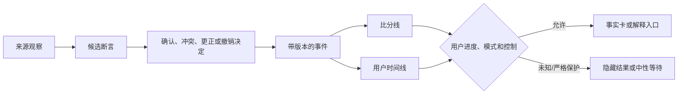
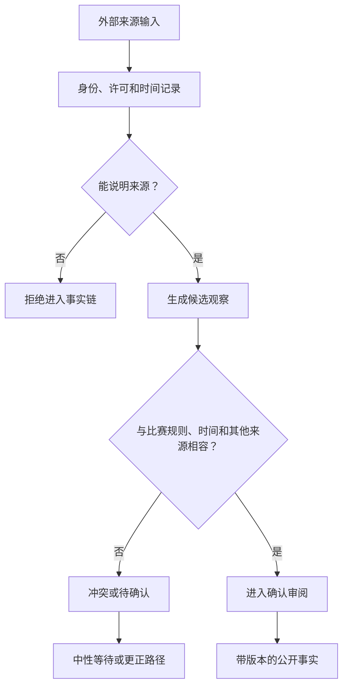
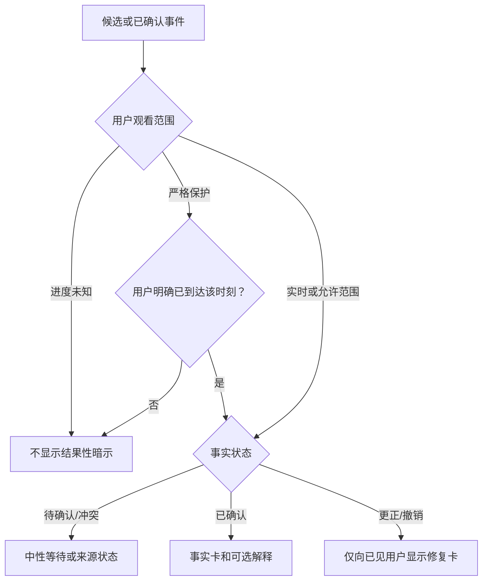
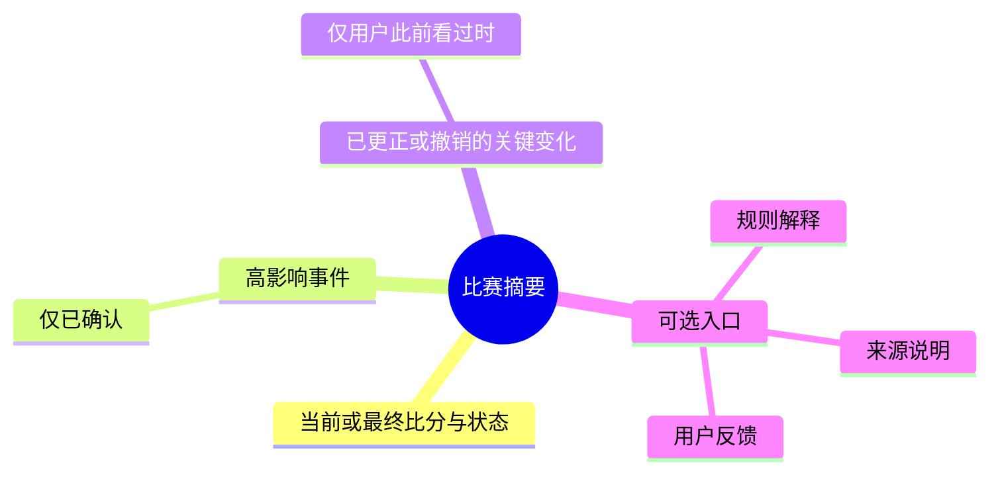
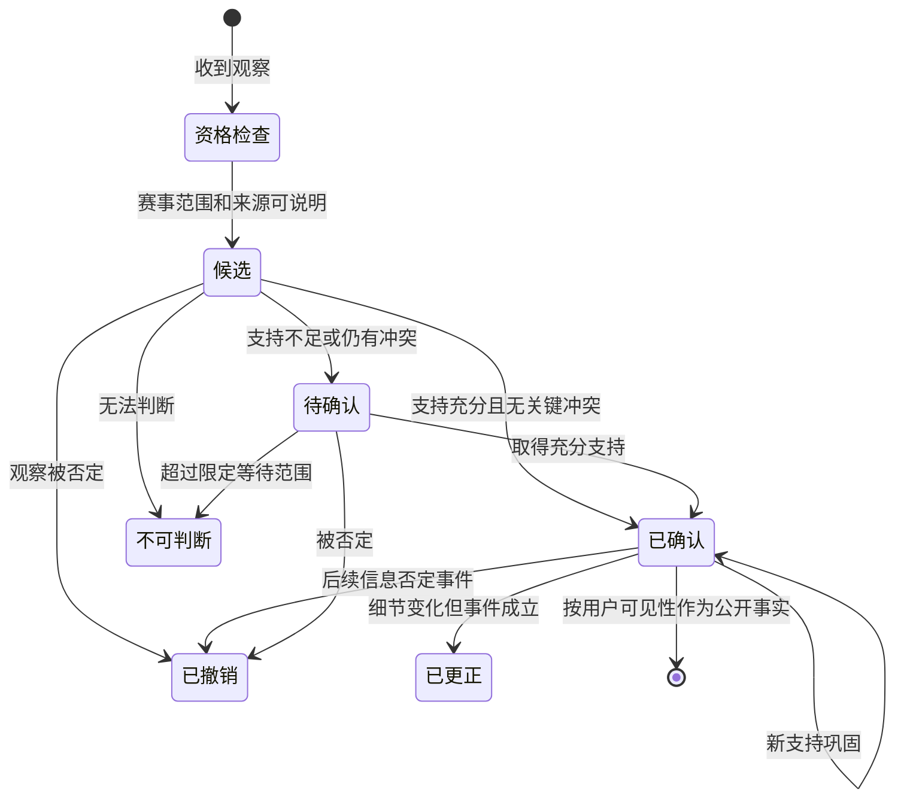

# 比赛事实与公开比分设计

> **文档类型**：0→1 比赛事实、公开比分、时序与可信呈现设计  
> **适用阶段**：MVP 产品设计、有限赛事范围确定、任何比赛信息或陪看表达进入用户场景前。  
> **决策状态**：待验证。本文定义的是事实处理、来源、状态、呈现和治理的设计假设，不把任何数据源、确认速度或用户理解结果视为既成事实。  

## 1. 为什么“比分”不是一个数字，而是一份面向用户的事实承诺

在足球观看中，比分看起来是最简单的信息：主队 2，比客队 1。但用户真正面对的不是一个静态数字，而是一连串时间敏感、可能被修订、可能因观看进度不同而不能被立即展示的判断：这个进球是否已成立？判罚是否改变？用户是否已经看到？不同来源为何不一致？服务是否应该现在说、稍后说，还是完全不说？

如果服务把比分当作“只要收到就立即展示”的消息，它会同时制造三类伤害：对还没有看到该时刻的用户构成剧透；把待确认、来源冲突或后续被撤销的事件伪装成事实；在更正时悄悄覆盖历史，让用户只感到“它刚刚说错了”而不知道发生了什么。对于陪看服务而言，事实错误不仅是信息质量问题，还会让角色的语气、情绪回应和用户关系一起失去可信度。

因此，本篇把公开比分设计为一份**可理解、可追溯、可更正、可撤销、受用户观看范围约束的事实承诺**。目标不是承诺永远最快，而是让用户知道：现在看到的是什么状态；为什么还不能确定；如果发生改变会怎样说明；服务什么时候选择沉默；以及用户如何纠正、隐藏或结束。

本篇要回答八个设计问题：

1. 什么是观察、什么是候选事实、什么可以对用户称为“已确认”？
2. 不同来源如何提供支持，而不被误解为绝对真相？
3. 比分、事件和解释应以怎样的层次向用户公开呈现？
4. 观看进度、剧透偏好和信息状态如何共同决定“能不能展示”？
5. 确认、更正、撤销、争议和不可用状态如何转换，用户会看到什么？
6. 用户、事实审核、内容支持和治理角色各自能做什么、不能做什么？
7. 如何通过研究证明用户真的理解不确定性与修复，而不是只觉得界面好看？
8. 哪些风险和验收条件决定服务应继续、收缩或暂停公开比分？

## 2. 设计目标、范围与非范围

### 2.1 五个设计目标

| 目标 | 用户应得到的结果 | 设计上的含义 |
| --- | --- | --- |
| 可校准信任 | 知道什么已确认、什么仍在等待、什么只是解读 | 事实状态不能被隐藏在文案或颜色细节中 |
| 时序尊重 | 不在用户未允许的范围内泄露结果 | 观看进度和剧透偏好优先于任何自动展示 |
| 可理解修复 | 信息改变时，知道改了什么、为何改、现在应信什么 | 更正/撤销不允许静默覆盖用户已看到的关键信息 |
| 最小打扰 | 比分和事件只在用户需要、允许或主动查看时出现 | 公开比分不是默认推送和情绪触发器 |
| 可审查边界 | 用户能报告问题，负责方能暂停范围，所有关键决定可被复核 | 事实处理不依赖单一不可解释判断 |

### 2.2 首轮范围

首轮只处理有限赛事或预先声明的比赛片段，并以用户主动查看或明确许可为主。范围内的公开事实包括：

- 赛事身份：对阵双方、赛事类别、开始状态、已结束/进行中/暂停等基础状态；
- 比分线：双方当前得分及其确认状态；
- 高影响事件：进球、点球、红黄牌、伤停、换人、比赛中断、结束和经确认的判罚变化；
- 用户主动询问时的事件简述和基础规则解释；
- 事实更正、撤销和待确认的说明；
- 用户设置的观看进度、剧透范围、事实展示与静默选择。

“高影响”不表示只关注戏剧性事件，而是指该事件会明显改变比分、用户对比赛状态的理解、后续解释或服务是否应沉默。事件范围应在服务开始前可说明，不能以“所有足球信息都可能有用”为由无限扩大。

### 2.3 明确不在范围内

| 非范围 | 为什么不进入首轮 |
| --- | --- |
| 覆盖所有联赛、球队、青年赛事和非正式比赛 | 范围扩大后，来源、时序、语言和支持质量无法被同一标准保障 |
| 承诺秒级、绝对实时或永不出错的比分 | 用户需要的是可信和可解释，不是无法兑现的速度口号 |
| 基于传闻、社交热度或未核实视频的即时赛果输出 | 会把观察误当事实，放大剧透与误导 |
| 预测赛果、投注建议、赔率导向或胜负刺激 | 与可信陪看、用户安全和情绪边界冲突 |
| 将主队偏好、角色喜好或商业合作写入事实判断 | 事实状态必须独立于立场、关系和收入 |
| 用更高音量、更强动效或更亲密话术放大比分变化 | 会把事实呈现变成注意力和情绪操控 |
| 将用户的观看进度、纠正或查询行为作为关系强度或消费能力推断 | 这些是当前服务控制，不是可开采的人格画像 |

## 3. 核心模型：观察不是事实，来源优先级不是绝对真相

### 3.1 四层事实模型

为防止“收到一条信息”直接变成“对用户说出一个结论”，将比赛信息分为四层：

**层级：观察（Observation）**
- **定义**：某个来源在某一时间声称或显示的内容
- **典型内容**：直播画面出现进球、某来源更新比分、用户报告事件
- **能否直接向用户呈现**：不能单独作为确定事实；可用于触发核查

**层级：断言（Claim）**
- **定义**：被结构化描述的候选事件或比分变化
- **典型内容**：“第 74 分钟主队进球，比分可能变为 2–1”
- **能否直接向用户呈现**：只可在明确“待确认”并满足剧透范围时有限呈现

**层级：决定（Decision）**
- **定义**：依据来源、规则、时间和冲突作出的状态判断
- **典型内容**：确认、维持待确认、争议、更正、撤销
- **能否直接向用户呈现**：决定后才产生对应的用户可见状态

**层级：公开事实（Public Fact）**
- **定义**：在用户允许的范围内、带状态和时间说明的可呈现内容
- **典型内容**：“已确认：主队 2–1；第 74 分钟事件已成立”
- **能否直接向用户呈现**：可以，但仍受用户进度、静默与媒介选择约束

这个模型的关键是：**公开事实不是数据源的原样复制，而是一次对用户承担后果的呈现决定。** 同一条观察，对已看直播的用户可成为待确认提示；对进度不明的用户则不应展示；对选择赛后回顾的用户可以被放入带更正历史的时间线。设计必须允许这些不同结果，而不是假设所有用户同时、以同一方式接收信息。

### 3.2 三个彼此独立的状态维度

一条信息是否“能显示”不能只看真伪。至少需要分别判断事实状态、用户可见性和表达状态：

**维度：事实状态**
- **要回答的问题**：目前对内容的确认程度如何？
- **典型值**：候选、待确认、已确认、争议、更正、已撤销、不可判断
- **不能被另一个维度替代的原因**：已确认不等于用户允许现在知道

**维度：用户可见性**
- **要回答的问题**：当前用户是否允许看到这个时间范围/内容强度？
- **典型值**：可展示、只展示无结果入口、延后展示、隐藏
- **不能被另一个维度替代的原因**：用户允许不等于内容已经确认

**维度：表达状态**
- **要回答的问题**：应以事实、解释、系统告知还是风险说明呈现？
- **典型值**：事实卡、待确认说明、更正通知、解释入口、静默
- **不能被另一个维度替代的原因**：同一事实在不同媒介/情境的表达强度不同

将三维状态混在一个“已读/未读”标签里，会产生典型错误：服务可能把待确认当作新闻推送；把用户静默误解为不需要事实状态；或把更正当作普通消息，导致用户不知道之前看到了什么。

### 3.3 事实对象与比分对象的关系

比分不是独立存在的字符串，而是由一组有状态的事件计算出的公开结果。为了让更正可理解，至少需要在概念上区分：

| 对象 | 说明 | 用户为什么会关心 |
| --- | --- | --- |
| 赛事（Match） | 某场比赛的身份、范围、开始/暂停/结束状态 | 知道正在讨论哪一场，避免跨场误解 |
| 时间点（Match Moment） | 比赛计时、补时、用户观看范围、信息更新时间 | 知道信息属于什么时候，避免时间错位 |
| 事件（Event） | 进球、判罚、换人等可被确认/撤销的单元 | 明白比分为什么变化，也能理解更正 |
| 比分线（Scoreline） | 在某个确认状态与时间点下的主客得分 | 快速掌握比赛局面，但不误以为永远不可变 |
| 解释（Explanation） | 与事件相关的规则、影响或多种观点 | 选择理解深度，而不把解读当事实 |
| 观察与来源（Observation/Source） | 谁在何时提供了何种支持 | 在冲突或更正时理解“为什么现在不能确定” |
| 决定记录（Decision Record） | 状态为何改变、影响哪些公开内容 | 支撑透明修复和运营复核 |

比分线应始终能回答三个用户问题：现在的比分是多少？这个比分处于什么确认状态？如果刚刚有变化，变化来自哪一类事件、是否仍可能被修订？不需要把所有底层观察展示给用户，但服务必须有能力用清楚、不过载的语言说明这些问题。

## 4. 来源与可信度：让“可靠”成为可解释的判断，而不是黑箱标签

### 4.1 来源分层的目的

来源分层不是给媒体、机构或个人贴永久“可信/不可信”标签，而是为不同类型的观察设定不同的确认、等待和用户呈现要求。来源可能延迟、误报、地区不同、语境不同或在某一类事件上更可靠；因此，来源优先级不能被用户理解为“只要来自高等级就永远正确”。

首轮可使用如下暂定来源层：

**层级：S0 赛事组织/官方裁定**
- **来源类型示例**：赛事组织者、裁判/比赛官方的公开确认
- **可作为什么依据**：对最终比赛状态、正式判罚和结果提供最高优先支持
- **默认限制**：仍可能有时间延迟，不能替代用户进度判断

**层级：S1 获授权或可追溯的比赛数据服务**
- **来源类型示例**：有明确覆盖范围、时间标记和纠错机制的数据提供方
- **可作为什么依据**：快速形成候选事件、辅助确认和时间线
- **默认限制**：不能单独承诺所有解释或最终裁定

**层级：S2 可信直播/编辑来源**
- **来源类型示例**：具有公开准确性与更正机制的直播报道
- **可作为什么依据**：补充现场观察、帮助发现来源冲突
- **默认限制**：可能受转播延迟、编辑节奏影响

**层级：S3 公开用户报告/社交观察**
- **来源类型示例**：用户转述、公开视频片段、社群消息
- **可作为什么依据**：仅作为发现线索或风险提示
- **默认限制**：不可直接生成公开比分/高影响事实

**层级：S4 无法说明来源的内容**
- **来源类型示例**：截图、转述、匿名消息、未标注内容
- **可作为什么依据**：原则上不纳入事实链
- **默认限制**：不以热度、转发或情绪替代证据

准确性、透明说明和及时修正必须被共同设计：来源分层不是把错误责任推给第三方，而是要求对用户公开的每一步都能说明自身的状态与限制。

### 4.2 可信度不是一个神秘总分

不建议向用户展示一个没有解释的“可信度 87 分”。这类单一分数会制造伪精确，也会让用户不知道该怎样行动。内部判断可使用多个维度，但用户可见层只需给出与决策有关的解释。

| 判断维度 | 要问的问题 | 对用户呈现的影响 |
| --- | --- | --- |
| 来源身份 | 谁提供了观察，身份是否可说明？ | 决定是否能进入候选、是否需更多支持 |
| 时间一致性 | 观察时间、比赛时间、用户进度是否相容？ | 不相容时不展示结果或标为待确认 |
| 多源一致 | 独立来源是否支持同一事件/比分？ | 冲突时保留争议/待确认，不抢先定论 |
| 规则一致 | 事件描述是否符合公开比赛规则和比赛状态？ | 不符合时需要进一步确认或拒绝输出 |
| 影响程度 | 事件是否改变比分、比赛状态或用户决策？ | 高影响事件采用更保守确认和更显著修复 |
| 纠错历史 | 来源是否能提供可追溯修正？ | 影响后续来源权重和运营复核，不公开羞辱来源 |

用户不需要看到复杂权重，但在关键场景中应看到足够的理由，例如“多个可说明来源尚未一致，因此先不把它当作比分变化”“该事件已由赛事公开信息确认”“先前显示的状态已被更正，下面说明变化”。

### 4.3 公开比赛规则与解释边界

比赛规则是解释事实的共同语言，但规则解释不等于替裁判作出裁定。服务可以说明“按通常规则，这类判定会考虑哪些条件”，但不能把不完整画面、来源争议或个人解读包装成最终裁定。

因此，规则解释必须标为解释层：它帮助用户理解“为什么一个事件可能重要”，但不替代事实状态。例如，“这类判定通常需要确认球员位置与参与进攻的条件；目前本场这一事件仍在等待确认”比“这肯定是越位”更符合可信设计。

## 5. 用户呈现：公开比分要清楚、克制并尊重观看范围

### 5.1 用户看到的不是“数据流”，而是四种信息卡

首轮公开比分应将信息压缩为四类用户可理解的呈现，而不是展示无限滚动的原始事件流：

**呈现类型：已确认比分卡**
- **适用状态**：用户允许范围内，比分/事件已确认
- **用户可见内容**：双方、比分、比赛时间、确认状态、可查看关键变化
- **不应出现**：未标示的推测、夸张情绪动画、无关推广

**呈现类型：待确认提示**
- **适用状态**：有高影响候选但尚未足以确认
- **用户可见内容**：“有一项比赛变化正在确认中”，可选择等待或不查看
- **不应出现**：直接说出可能结果、逼用户刷新、角色兴奋表演

**呈现类型：更正/撤销说明卡**
- **适用状态**：用户已看过的关键信息发生状态变化
- **用户可见内容**：原来显示什么、现在如何改变、为何状态调整、可查看简短说明
- **不应出现**：悄悄改数字、把用户记忆当错误

**呈现类型：进度保护入口**
- **适用状态**：用户进度不明或选择避免结果
- **用户可见内容**：“你还没选择观看范围；我先不显示结果”
- **不应出现**：为了促使用而泄露比分、把进度不明当异常

四类卡都应有明确的文字标签，不能只通过颜色、图标、声音或角色表情区分。对颜色敏感、静音、屏幕小、快速扫视或不熟悉服务的用户而言，状态文字是可信度的一部分。

### 5.2 已确认比分卡的最小内容

一张已确认比分卡最多回答四件事：

1. **是什么比赛**：对阵双方和范围，不让用户把多场比赛混淆；
2. **现在的公开比分**：主客顺序固定、得分清楚、状态可读；
3. **这一状态何时适用**：比赛时刻或最后更新的相对说明；
4. **它有多确定**：显式“已确认”标签，必要时提供“查看发生了什么”的用户主动入口。

示例文案应尽量中性：

> 已确认｜主队 2–1 客队｜第 74 分钟后  
> 想看比分变化的简短说明吗？

不宜使用“爆了！”“绝杀预警！”“你一定不敢信”“快来一起庆祝”等强情绪或强召回语言。比分卡的工作是让用户判断比赛状态，不是把用户重新拉回服务。

### 5.3 待确认不是“半剧透”

待确认提示的设计尤其容易出错。若提示写成“可能进球了，快来看看”，它已经泄露了高影响结果，也会制造不必要焦虑。正确的待确认提示应根据用户选择分级：

| 用户范围 | 待确认时的默认呈现 | 用户可选动作 |
| --- | --- | --- |
| 用户明确已看到当前直播 | 可显示“有一项高影响变化正在确认”，但不把候选结论写成比分 | 等待确认、查看来源状态、保持安静 |
| 用户选择只看赛后回顾 | 不在赛中推送，只在回顾中按最终状态组织 | 查看最终时间线或继续隐藏 |
| 用户进度不明 | 不显示任何结果性暗示 | 选择看到哪里、仅请求无结果解释、结束 |
| 用户开启本场静默 | 不主动显示，保留用户主动查看入口 | 继续静默或手动查看 |

“不知道”必须是完整的产品状态，而不是催促用户选择的漏洞。服务若无法知道用户看到哪里，应保守地保护用户，而不是用候选事件提高互动。

### 5.4 事件时间线：按意义展开，而不是按噪声堆叠

用户主动打开事件时间线时，应先显示有限的高影响事件、其状态与比分关系，再允许按需展开解释。每个事件最小包括：时间点、事件类型、影响、状态和更正标记。对有争议/撤销历史的事件，应让用户看到最终结论和简短修复说明，但避免把所有内部观察、来源争执或技术细节倾倒给用户。

建议的层级：

时间线不应成为情绪化资讯流、群体争吵入口或商业展示位。越接近事实层，越需要克制。

### 5.5 声音、视觉与无障碍要求

- 比分变化默认不自动播放声音；用户明确选择后，声音仍可被即时打断、静默和转为文字；
- “已确认”“待确认”“更正”“已撤销”不能只通过不同颜色、音调或角色表情传达；
- 动效只用于帮助识别状态改变，不使用强闪烁、不可中断庆祝或失败惩罚；
- 文本应能放大、重排并保持主客顺序、时间和状态的可读性；
- 用户在公共/静音环境中可完成查看、隐藏、纠正与结束；
- 任何与比分相关的营销、合作或角色表演都必须与事实卡清楚分离。

公开比分场景中，“看得见一个数字”远远不够；用户还要能理解数字的状态、控制其出现，并在不同媒介条件下完成同一任务。

## 6. 不确定、确认、更正与撤销：让修复成为可信体验的一部分

### 6.1 状态词典

**状态：观察到**
- **定义**：收到某来源的原始信息，尚未形成候选
- **可以对用户说什么**：通常不直接面向用户
- **不能对用户说什么**：“已经发生”“比分已变”

**状态：待确认**
- **定义**：有足够理由提醒正在核查，但不足以作为公开事实
- **可以对用户说什么**：“有一项变化正在确认；我先不把它当作结果”
- **不能对用户说什么**：候选比分、确定语气、庆祝/失望暗示

**状态：已确认**
- **定义**：在当前范围内有充分可说明支持，可作为公开事实
- **可以对用户说什么**：“已确认：……”
- **不能对用户说什么**：“永远不会改”或无条件权威承诺

**状态：有争议**
- **定义**：重要来源不一致，或规则/时序仍无法判断
- **可以对用户说什么**：“不同可说明来源尚未一致，因此暂不定论”
- **不能对用户说什么**：随机选择一边，或让角色站队

**状态：已更正**
- **定义**：先前公开内容需要调整，但事件本身仍成立为另一版本
- **可以对用户说什么**：“先前显示为……；现更正为……”
- **不能对用户说什么**：静默覆盖、暗示用户记错

**状态：已撤销**
- **定义**：先前候选/已确认内容不再应作为事实保留
- **可以对用户说什么**：“先前显示的变化已被撤销；当前比分为……”
- **不能对用户说什么**：保留旧结果继续影响摘要或情绪回应

**状态：不可判断**
- **定义**：在限定时间/范围内无法可靠判断
- **可以对用户说什么**：“我现在无法可靠确认这一点”
- **不能对用户说什么**：用模糊语言假装提供答案

**状态：不可用**
- **定义**：当前赛事/来源/服务条件不满足安全呈现
- **可以对用户说什么**：“本场暂不提供比分更新；你仍可使用控制与反馈入口”
- **不能对用户说什么**：悄悄降质或以错误内容填补

### 6.2 状态机

以下状态机描述的是高影响事件或比分变化的概念生命周期。它不允许从单一低层级观察直接跳到公开已确认，也不允许撤销后仍保留原事件对用户的自动影响。

每次状态变化都应记录“从什么状态到什么状态、基于何种可说明理由、影响了哪些公开内容、用户是否已经看到旧状态”。用户不必看到完整记录，但用户已见的关键信息发生变化时，必须收到可理解的修复。

### 6.3 确认策略：速度不是唯一目标

不同事件的确认要求应随影响程度提高：

**事件类型：普通低影响状态**
- **用户影响**：对比分与主要观看任务影响小
- **暂定确认要求**：可由可说明来源支持，仍保留待确认标记
- **默认用户呈现**：用户主动查看时显示状态

**事件类型：比分变化、红牌、比赛结束**
- **用户影响**：会改变用户对整场局面的理解
- **暂定确认要求**：需要更强支持或可说明的权威确认；冲突时等待
- **默认用户呈现**：进度允许时展示待确认/已确认，不自动情绪化提醒

**事件类型：判罚更改、进球取消、比赛中断**
- **用户影响**：易造成“先说后改”的信任损害
- **暂定确认要求**：明确记录前后状态，必要时延后公开结论
- **默认用户呈现**：更正/撤销卡，说明变化与当前结果

**事件类型：涉及伤病、个人身份或敏感信息**
- **用户影响**：可能有隐私、伤害与谣言风险
- **暂定确认要求**：只使用明确、必要、可公开的信息
- **默认用户呈现**：默认不扩展解释，不用作情绪或商业触发

确认策略的目标不是让所有事件越快越好，而是将高影响错误的概率与用户伤害降到可以接受的范围。无法满足确认要求时，服务应停在待确认、不可判断或不可用状态。

### 6.4 更正与撤销的用户体验

更正和撤销是最能建立或摧毁信任的时刻。用户若已经看过“主队 2–1”，后续比赛被判无效，直接把数字改回 1–1 会让用户怀疑自己是否看错。正确流程应是：

1. 标明这是对先前信息的调整，而不是一条普通新消息；
2. 用短句说明原来显示的状态、现在的状态和可说明原因；
3. 明确当前可相信的比分，不要求用户自己重新计算；
4. 如用户此前处于静默或进度保护，尊重其范围，不借更正越界推送；
5. 提供可选“查看简短说明/报告问题”，不强迫用户进入复杂细节；
6. 将已撤销事件从后续自动摘要、情绪回应和商业触发中排除。

示例：

> 更正｜先前显示的第 74 分钟比分变化未被最终确认，当前公开比分恢复为 1–1。  
> 你可以查看简短说明、继续保持安静，或结束本场查看。

这类表达承认服务有修复责任，但不把不确定性戏剧化，也不要求用户原谅服务。

## 7. 用户观看范围与公开比分：信息正确也可能是不该现在出现的信息

### 7.1 观看范围优先级

比分能否展示，要先判断用户的观看范围，而不是先判断服务掌握了什么。优先级如下：

1. 用户当前明确设置的剧透/进度选择；
2. 用户在当前会话中明确说过的观看位置；
3. 用户选择的赛后回顾、实时观看或不确定进度模式；
4. 服务可说明的时序信息；
5. 系统猜测。

系统猜测处于最后一位，且不能单独授权结果展示。用户从其他设备、线下转播、回放或延迟流中观看时，任何自动判断都可能失效。

### 7.2 四种观看模式

**模式：实时且已授权**
- **用户声明**：用户表示正在看且接受当前范围内结果
- **比分/事件默认行为**：可展示范围内的已确认状态；待确认保持克制
- **服务可做的帮助**：上下文、解释、用户主动查看时间线

**模式：延迟观看**
- **用户声明**：用户说明自己落后于直播或指定时间点
- **比分/事件默认行为**：不展示超出范围的比分/事件
- **服务可做的帮助**：无结果规则解释、设置调整、范围内回顾

**模式：赛后回顾**
- **用户声明**：用户选择看完整结果或复盘
- **比分/事件默认行为**：可按最终状态组织，并标示更正/撤销历史
- **服务可做的帮助**：结构化摘要、解释、关键事件回顾

**模式：进度不明**
- **用户声明**：用户不确定或未选择
- **比分/事件默认行为**：不显示结果性内容，不用候选事件暗示
- **服务可做的帮助**：帮助选择范围、提供不含结果的入口、安静

### 7.3 用户控制不能被“重要事件”越过

即使是比赛结束、点球、红牌或潜在绝杀，也不能自动突破用户的观看范围和静默选择。越重要的事件，越可能造成不可逆剧透；“这件事太重要了所以必须告诉用户”恰恰是需要被拒绝的产品冲动。

用户可主动升级范围，例如选择“告诉我当前比分”；也可随时收缩范围，例如“不要再告诉我结果”。这两类动作都应立即影响后续公开呈现，不要求解释理由，也不被用于评价用户忠诚度或关系距离。

## 8. 权限、运营与治理边界：谁可以改变事实，谁只能表达事实

### 8.1 角色与权限

| 角色 | 可以做什么 | 不可以做什么 |
| --- | --- | --- |
| 用户 | 设置观看范围、查看/隐藏公开比分、请求解释、静默、纠正、报告问题、结束 | 不能把个人偏好改写为公共事实 |
| 事实审核角色 | 查看可说明来源、提出确认/更正/撤销建议、记录理由 | 不能为了互动、主队立场或合作目标改变确认标准 |
| 事实决策角色 | 对高影响状态作出确认、维持争议、撤销或暂停范围决定 | 不能绕过用户进度、静默和公开说明 |
| 表达/内容角色 | 把已决定状态转成分层、克制、可访问的用户语言 | 不能把解释、情绪或商业内容写成事实 |
| 安全与治理角色 | 暂停高风险赛事/来源/表达，处理投诉与复盘 | 不能把风险当作普通体验偏好延后处理 |
| 合作/商业角色 | 提出明确标识的合作内容，遵守事实与关系隔离 | 不能影响比分、确认、剧透、纠正或用户控制 |

角色分离的目的不是增加层级，而是防止一个单点为了速度、叙事、品牌或收入同时控制“什么是真的”“怎么说”“何时推给谁”。事实判断、用户范围和商业目标必须相互制衡。

### 8.2 运营边界

首轮运营应遵守以下边界：

- 只为已声明的有限赛事/片段提供公开比分，超出范围明确标记为不可用；
- 高影响信息的确认、更正与撤销有清楚责任人和可暂停路径；
- 任何来源质量下降、时序持续冲突或剧透事件出现时，可快速暂停特定赛事或来源，而不影响用户的静默、退出、反馈与支持入口；
- 不通过运营配置增加角色亲密度、绕过用户静默、修改事实状态或插入未标识商业内容；
- 用户纠错和投诉被视为质量输入，不被视为“负面用户”标签；
- 对外合作不获得用户观看进度、事实纠正或关系边界数据的超出必要访问权。

### 8.3 决定记录与透明度

每一个高影响确认、更正或撤销都应有最小决定记录：赛事/事件范围、原状态、新状态、发生时间、决定时间、支持类型、冲突情况、用户可见影响、是否需要通知已见用户、是否暂停相邻范围。记录的目的不是制造冗长档案，而是让之后的复核能够回答“为什么当时这样说、后来为什么改变、哪些用户可能受到影响”。

面向用户的透明度则应保持最小必要：说明当前状态、发生了什么变化、影响是什么、可以怎么做。不要把来源供应细节、内部人员信息或复杂争议原样推给用户，避免将透明度变成认知负担。

### 8.4 公开透明度的边界：解释决定，不暴露无关细节

“公开比分”不等于把所有观察、讨论和来源细节全部公开。用户需要的是足以判断当前状态和作出下一步选择的信息；过多底层细节可能泄露不必要信息、让用户把未定内容当作更多证据，或在比赛过程中增加认知负担。因此，公开透明度应遵守“与用户后果相称”的原则。

**情境：已确认比分**
- **用户至少应知道**：比分、适用时间、已确认状态、可选事件说明
- **不需要默认展示**：所有原始观察、供应细节、低层级时间戳
- **为什么这样划分**：用户主要任务是判断局面，而非审阅全部证据

**情境：待确认/争议**
- **用户至少应知道**：当前不能定论、服务会如何处理、用户可选择什么
- **不需要默认展示**：每个相互矛盾的传闻、未经核实截图
- **为什么这样划分**：过度展示冲突会把候选信息变成半剧透

**情境：更正/撤销**
- **用户至少应知道**：原状态、现状态、对当前比分的影响、可说明原因类型
- **不需要默认展示**：个人责任、复杂处理记录、未公开来源
- **为什么这样划分**：用户需知道自己应更新什么理解，而非承受内部细节

**情境：不可用/已暂停**
- **用户至少应知道**：此范围当前无法可靠提供、仍可用的控制和反馈入口
- **不需要默认展示**：未经核实的故障推测、泛化承诺
- **为什么这样划分**：诚实收缩比给出模糊借口更能保护信任

**情境：用户纠错/投诉**
- **用户至少应知道**：已收到、目前状态、预期下一步和退出方式
- **不需要默认展示**：其他用户的反馈、任何可识别个人信息
- **为什么这样划分**：支持应尊重报告者和其他人的隐私

对来源的用户说明宜使用类别化语言，例如“赛事公开确认”“多个可说明来源仍未一致”“该内容暂无法可靠确认”。除非用户主动展开，不应把某个来源名称、链接或原始文字摆在比分主视图中；同时，也不能用“系统已验证”这类无法解释的模糊标签替代状态。透明度的目标是让用户能校准信任，不是让用户被迫成为事实审核者。

### 8.5 时间一致性：同一屏幕不能让事实互相打架

比分设计最隐蔽的失败，常常不是单条内容错误，而是同一屏幕里出现彼此矛盾的时间：顶部比分显示 2–1，下面摘要仍在说 1–1；事件卡标为待确认，角色却以庆祝姿态回应；用户已设置延迟观看，回顾入口却显示赛后最终结果。为避免这类错误，需要把时间一致性当作独立的设计约束。

每个用户可见事实至少携带三类时间：**比赛时间**（事件发生在比赛中的位置）、**信息决定时间**（何时被确认/更正/撤销）和**用户允许范围**（用户现在愿意看到到哪里）。这三者不能互相替代。比赛时间说明事件在何时发生；决定时间解释为什么状态改变；用户允许范围决定是否展示。

| 冲突类型 | 典型表现 | 首轮处理原则 |
| --- | --- | --- |
| 比赛时间冲突 | 两个事件先后顺序不一致，导致比分无法解释 | 暂不合成公开时间线，保留待确认或不可判断 |
| 决定时间冲突 | 旧摘要未随更正更新，用户看到前后矛盾 | 优先更正当前状态，并对已见用户提供修复说明 |
| 用户范围冲突 | 同一用户在延迟模式下从另一个入口看到最终比分 | 用户范围应覆盖所有结果性入口，无法保证则隐藏相关内容 |
| 表达时间冲突 | 事实卡已撤销，声音/视觉仍按旧状态演出 | 事实状态改变应优先中断相邻表达，必要时完全静默 |
| 跨赛事冲突 | 相似队名/赛事被混淆，用户得到错误比分 | 每个公开卡显著显示赛事身份和范围，不只显示球队简称 |

时间一致性要求后续的界面、声音、视觉、回顾、通知和运营配置共同遵守同一事实状态，而不是各自缓存一份“看起来差不多”的内容。若当前范围无法确保一致，正确降级是减少展示面、只提供用户主动入口或暂时不可用。

## 9. 研究与验证：先确认用户能理解状态，再扩大公开范围

### 9.1 研究假设

> 信息卡：原宽表已改为纵向阅读，字段含义不变。

- **编号：H1**
  - **待验证假设**：用户能区分已确认、待确认、更正与撤销
  - **观察方法**：无提示复述、状态分类任务
  - **支持证据**：大多数人准确说出当前可相信的内容
  - **推翻信号**：用户把待确认当作结果或把更正当成新事件

- **编号：H2**
  - **待验证假设**：进度保护比“重要事件提醒”更符合观看体验
  - **观察方法**：延迟/不明进度情境对照
  - **支持证据**：用户认为保守入口尊重自己且仍可求助
  - **推翻信号**：候选提示反复造成剧透或焦虑

- **编号：H3**
  - **待验证假设**：更正说明能恢复信任，而非加重困惑
  - **观察方法**：更正前后情境演练、赛后访谈
  - **支持证据**：用户知道改变了什么并能继续判断
  - **推翻信号**：用户觉得服务悄悄改口或不敢再相信

- **编号：H4**
  - **待验证假设**：事实卡与角色表达分层后，用户仍能快速理解比分
  - **观察方法**：纯工具/克制表现对照
  - **支持证据**：状态识别与任务完成不下降，打扰更低
  - **推翻信号**：角色表现掩盖状态或抢走注意力

- **编号：H5**
  - **待验证假设**：文字优先、静音和减少动效条件下仍可完成核心任务
  - **观察方法**：多条件任务演练
  - **支持证据**：关键查看/隐藏/纠正/退出均可完成
  - **推翻信号**：信息只有单一媒介可得

- **编号：H6**
  - **待验证假设**：用户能报告错误且不感到被责备
  - **观察方法**：纠错任务、支持语言对照
  - **支持证据**：用户愿意指出问题并理解处理状态
  - **推翻信号**：用户担心自己“弄错了”或找不到入口

### 9.2 研究路径

**阶段一：概念理解。** 使用不带角色表现的比分卡、待确认卡、更正卡和进度保护入口，先验证用户能否解释状态。若纯文本状态已无法理解，不能用动画或声音掩盖问题。

**阶段二：时序与剧透演练。** 让参与者在实时、延迟、赛后和进度不明四种模式下完成查看、隐藏、请求解释和结束。重点观察是否出现任何“我没想知道这个”的时刻，以及用户是否能理解静默对比分的影响。

**阶段三：更正与冲突情境。** 设计候选进球、判罚改判、来源冲突、先前信息撤销等材料，观察用户如何理解状态转移、是否还能说出当前比分、是否愿意继续使用服务。不要只询问“你觉得诚实吗”，还要看其是否能正确行动。

**阶段四：有限真实比赛观察。** 只有前三阶段通过、运营范围和暂停路径清楚时，才在有限自愿场景中观察用户主动查看比分、提出纠正、使用进度保护和对更正的反应。真实观察中不为收集数据而突破用户范围，也不以关键事件为由强制展示。

### 9.3 样本原则与伦理

研究样本应包含不同观看节奏、不同足球熟悉度、不同设备/声音条件和不同对剧透敏感度的成年参与者。不能只招募愿意随时看直播、习惯快速刷信息的用户，否则会低估延迟观看和安静观看者的风险。参与者应能跳过所有与主队、情绪或个人信息有关的问题；纠错、静默、退出和不愿看结果都是有效数据，不应被研究人员劝回。

事实设计中的治理、测量与持续监测必须贯穿生命周期；每次扩大赛事、来源、主动性或媒介前，都应重新研究状态理解和剧透风险，不能把早期一次通过当作永久许可。

### 9.4 用户研究任务与判定规则

研究不应只问“你觉得这个比分可靠吗”。参与者可能因为礼貌、角色好感或对技术的预期而回答肯定，却在真正需要判断时仍误解状态。首轮应设置能暴露理解与控制的具体任务：

> 信息卡：原宽表已改为纵向阅读，字段含义不变。

- **任务：状态复述**
  - **材料条件**：一张已确认卡、一张待确认卡、一张撤销卡
  - **参与者需完成的动作**：分别说出现在能否把它当作比分结果
  - **通过判定**：正确区分三种状态，并说明下一步可做什么
  - **需要追问的失败原因**：是状态文案不清、视觉混淆还是对“确认”概念误解

- **任务：延迟保护**
  - **材料条件**：用户被告知只看到上半场，材料含后续高影响事件
  - **参与者需完成的动作**：找到不看结果也能继续使用的路径
  - **通过判定**：未接触越界暗示，且能解释如何以后再看
  - **需要追问的失败原因**：是否有入口、标题、动效或角色语言泄露结果

- **任务：更正修复**
  - **材料条件**：用户先看见比分变化，随后事件被撤销
  - **参与者需完成的动作**：说出当前比分、变化原因类型和可选动作
  - **通过判定**：能更新理解，不觉得自己被悄悄欺骗
  - **需要追问的失败原因**：更正信息是否过长、过短或与旧状态脱节

- **任务：静默控制**
  - **材料条件**：用户开启本场静默后出现高影响事件
  - **参与者需完成的动作**：完成静默、手动查看或继续观看
  - **通过判定**：知道静默的效果，且没有意外呈现
  - **需要追问的失败原因**：是控制不可见还是不同媒介没有同步

- **任务：纠错与退出**
  - **材料条件**：用户认为时间线可能错误且不想继续
  - **参与者需完成的动作**：报告问题并结束当前查看
  - **通过判定**：能找到路径，且不被要求解释或留下
  - **需要追问的失败原因**：支持语言是否让用户感到被质疑

任务判定应由至少两名研究人员按事先定义的规则复核高影响误解、剧透和更正理解。若判断不一致，不应为了方便把结果记为通过，而应标记为“不确定”并复查材料。用户能否拒绝看比分、拒绝提供反馈或中途结束，也必须被记录为有效结果。

### 9.5 从研究结果到范围决策

研究结论必须导向明确的范围动作，而不能停在“总体反馈不错”。建议使用以下决策表：

| 发现 | 允许的下一步 | 不允许的下一步 |
| --- | --- | --- |
| 用户能理解已确认与待确认，但更正理解不稳 | 保留基础比分，先收缩到更少高影响事件并重做修复 | 扩大赛事或增加主动提醒 |
| 进度保护稳定，但实时已授权用户嫌等待 | 在已授权场景研究更清楚的待确认说明 | 为了速度降低确认门槛或对进度不明用户提示 |
| 用户只需要赛后最终结果与回顾 | 收缩为赛后公开比分/时间线服务 | 继续承诺赛中陪看和实时推送 |
| 角色表现降低状态识别 | 将事实层与角色表现进一步隔离或取消后者 | 用更强视觉/声音让角色“解释”事实 |
| 静音/辅助条件下控制失败 | 暂停声音/动效扩展，优先补齐文字和操作路径 | 把失败归因于用户不够熟悉 |
| 来源冲突频繁且无法透明处理 | 缩小赛事/来源范围，明确不可用 | 继续用低质量来源维持覆盖感 |
| 用户不愿主动查看比分但喜欢解释 | 研究无结果解释和用户拉取帮助 | 用候选比分吸引用户点击 |

## 10. 指标：衡量可信、可控的公开事实，而不是更新速度幻觉

### 10.1 核心质量指标

**指标：状态识别率**
- **暂定定义**：正确区分确认/待确认/更正/撤销的人数 ÷ 参与状态任务的人数
- **用途**：判断用户能否校准信任
- **不可单独说明什么**：真实赛事准确性

**指标：当前比分理解率**
- **暂定定义**：在状态变化后能说出当前公开比分的人数 ÷ 查看相关场景的人数
- **用途**：判断更正/撤销是否可理解
- **不可单独说明什么**：用户是否喜欢角色

**指标：进度保护成功率**
- **暂定定义**：在延迟/不明模式下未收到越界信息且能完成所需任务的场次 ÷ 合格场次
- **用途**：判断时序尊重
- **不可单独说明什么**：服务是否应该更主动

**指标：纠正可达率**
- **暂定定义**：用户能独立报告错误或请求说明的人数 ÷ 尝试者人数
- **用途**：判断用户是否有修复权
- **不可单独说明什么**：所有错误是否已解决

**指标：修复理解率**
- **暂定定义**：看过更正后能说出改变内容和当前状态的人数 ÷ 已见更正者人数
- **用途**：判断透明修复
- **不可单独说明什么**：信任是否完全恢复

**指标：有效事实场次**
- **暂定定义**：用户在允许范围内获取到可理解的比赛帮助，且无高严重度事实/剧透事件的场次
- **用途**：与总体产品指标连接
- **不可单独说明什么**：市场规模、留存或收入

### 10.2 护栏与反指标

| 风险 | 反指标 | 首要动作 |
| --- | --- | --- |
| 剧透 | 未许可范围内的结果/候选暗示场次 | 立即暂停相关时序规则和主动展示 |
| 伪确定 | 待确认/争议被用户当作事实的比例 | 收缩表达，重做状态可见性 |
| 静默覆盖 | 用户静默后仍收到比分相关声音、动效或提示的场次 | 暂停所有相邻触发，优先修复控制 |
| 静默更正 | 用户已见信息被悄悄覆盖、无法理解变化的场次 | 改为明确修复说明，复核历史呈现 |
| 来源依赖 | 单一低质量/不可说明来源导致的高影响输出比例 | 降低该来源范围，提升确认门槛 |
| 无障碍排除 | 静音、辅助输入、低视觉条件下的任务差异 | 补齐等价路径，暂停单媒介呈现 |
| 关系/商业污染 | 事实状态被角色立场、情绪或合作内容影响的场次 | 停止相关表达/合作，隔离事实层 |

更新速度可以作为诊断信息，例如“从观察到确认的等待时间”，但它绝不能成为压过剧透、状态理解和更正透明度的主目标。若为了更快而降低确认门槛，指标看似提升，用户信任却可能不可逆下降。

### 10.3 暂定闸门

| 闸门 | 进入条件 | 收缩/停止条件 |
| --- | --- | --- |
| G1 概念状态 | 多数参与者可无提示区分四类状态并说出当前比分 | 状态文字反复被误解，暂停增加视觉表现 |
| G2 时序保护 | 延迟/不明模式无越界结果，用户仍能选择需要的帮助 | 出现任何未受控剧透或候选暗示，立即暂停相似场景 |
| G3 修复透明 | 用户已见的更正/撤销能被理解，且可指出当前状态 | 用户认为服务悄悄改口或无法知道最终结论 |
| G4 有限真实范围 | 高影响事件、来源冲突和用户纠错均有可执行支持/暂停路径 | 范围超出来源和运营能力，或红线无法及时处置 |

数字阈值应在研究前结合样本、风险和用户权益设定。高严重度剧透、伪确定、不可退出或事实层商业污染不适合用“可接受比例”管理，应设为即时暂停。

### 10.4 指标质量控制：先确认读数在描述同一件事

事实体验的指标很容易因口径不同而失真。例如，把用户主动查看的比分与系统展示的提示放在同一个“查看率”里，会掩盖用户是否真正选择；把更正前和更正后各记一次场次，会虚增使用；把进度不明用户排除在剧透分母之外，会让保护效果看起来异常好。因此，指标运行前需要有最小质量控制。

| 检查项 | 需要核对的问题 | 发现问题后的动作 |
| --- | --- | --- |
| 场次唯一性 | 同一用户、同一赛事、同一观看范围是否被重复计数？ | 合并为一个合格观看机会，单独记录状态变化 |
| 主动性区分 | 用户拉取、明确许可和任何服务主动呈现是否分开？ | 重新分层，不用总量替代选择 |
| 状态完整性 | 每个公开比分是否都有事实状态、用户可见性和表达状态？ | 标记为不可解释记录，不进入核心质量读数 |
| 剧透分母 | 所有可能被越界的延迟/不明用户是否纳入保护计算？ | 修正机会集，明确历史不可比范围 |
| 更正影响 | 用户是否已见旧状态、是否收到修复、是否理解当前比分？ | 将修复拆成独立质量链，而非只计“更正次数” |
| 缺失值 | 退出、拒绝反馈、材料中断和研究判断不确定是否被单列？ | 报告缺失原因，不把它们默认为通过或失败 |
| 分层公平 | 静音、不同设备、不同观看模式下的结果是否有显著差异？ | 优先研究被排除条件，暂停单媒介扩张 |

每次读数汇报都应同时展示原始参与人数、合格机会人数、实际分母、关键排除理由和高严重度事件数量。若样本太小、范围变化、来源规则变更或材料不一致导致前后无法比较，应明确写“不可比较”，而不是画出看似连续的趋势线。可信的指标体系允许不确定存在；它的价值是防止团队因为错误的读数扩大错误的公开事实。

## 11. 风险、降级与停止：当事实不能被安全说出时，沉默是正确输出

### 11.1 降级矩阵

**情境：用户进度不明**
- **不应做什么**：不输出比分、候选事件或强暗示
- **最小安全降级**：提供选择范围/无结果帮助入口
- **用户可见说明**：“我不确定你看到哪里，先不显示结果。”

**情境：来源冲突**
- **不应做什么**：不抢先选边或用角色情绪压过不确定
- **最小安全降级**：标记待确认/有争议，暂不改变公开比分
- **用户可见说明**：“可说明来源尚未一致，我先不把它当作结果。”

**情境：高影响事件待确认**
- **不应做什么**：不用“可能进球”式半剧透
- **最小安全降级**：对允许范围内用户仅说明正在确认，或完全静默
- **用户可见说明**：“有一项变化正在确认中。”

**情境：先前公开内容被否定**
- **不应做什么**：不悄悄改回旧比分
- **最小安全降级**：更正/撤销卡，说明当前公开状态
- **用户可见说明**：“先前显示的变化已撤销，当前比分为……”

**情境：赛事/来源超出范围**
- **不应做什么**：不假装提供全覆盖
- **最小安全降级**：明确不可用，保留控制与反馈
- **用户可见说明**：“这场比赛暂不提供公开比分更新。”

**情境：静默已开启**
- **不应做什么**：不借更正、合作或角色表达绕过
- **最小安全降级**：停止主动呈现，保留用户手动查看
- **用户可见说明**：“本场已保持安静。”

**情境：媒介不适合**
- **不应做什么**：不让声音/颜色成为唯一信息
- **最小安全降级**：切换到完整文字与结构状态
- **用户可见说明**：“已使用文字优先呈现。”

**情境：事实设计出现红线**
- **不应做什么**：不继续收集更多用户暴露
- **最小安全降级**：暂停相邻赛事/来源/表达，转为安全说明
- **用户可见说明**：“相关更新已暂时停止。”

### 11.2 停止条件

以下任一情况出现，即停止相关公开比分范围，优先保护用户：

- 任何用户在未许可范围内接收比分、事件结果或足以推断结果的候选暗示；
- 待确认、观点、传闻或合作信息被用户合理地理解为已确认比分；
- 已见的重要比分变化被静默覆盖，用户无法知道当前状态或更正原因；
- 用户静默/结束后仍被事实卡、声音、动效或角色表现强行打扰；
- 任何来源层级被主队立场、角色偏好、互动目标或商业合作越权影响；
- 关键状态只能靠单一媒介理解，导致部分用户无法查看、隐藏、纠正或退出；
- 赛事范围增长超过确认、修复和支持能力，迫使团队降低事实或控制标准。

停止不是失败结论，而是事实服务在无法承担公开后果时的正确边界。比起让错误内容继续触达用户，明确标为不可用、保留手动控制和反馈入口，更符合可信设计。

## 12. 验收场景：让事实设计经受最容易出错的时刻

**场景：A. 实时已授权用户查看比分**
- **用户起点**：用户明确接受当前范围内结果
- **方案必须表现**：显示已确认比分、时间与状态，允许看事件或继续看球
- **判定失败**：强情绪抢占、状态不清、无退出

**场景：B. 延迟观看用户**
- **用户起点**：用户只看到上半场，比赛已进行更久
- **方案必须表现**：不显示后续比分/候选暗示，只提供范围内帮助
- **判定失败**：自动泄露结果或暗示“有大事发生”

**场景：C. 进度不明用户**
- **用户起点**：用户没设置且说不确定
- **方案必须表现**：明确保护入口，不逼其选择，也不展示结果
- **判定失败**：用等待提示刺激用户点开结果

**场景：D. 候选进球**
- **用户起点**：来源出现冲突，尚未确认
- **方案必须表现**：保持待确认或静默，不把候选写成比分
- **判定失败**：“可能绝杀”式半剧透和角色庆祝

**场景：E. 已确认进球被取消**
- **用户起点**：用户已看过比分变化
- **方案必须表现**：用撤销卡说明前后状态和当前比分
- **判定失败**：静默改数字、保留旧事件在摘要中

**场景：F. 用户纠正**
- **用户起点**：用户认为时间线有误
- **方案必须表现**：感谢/承认、记录问题、显示可理解状态
- **判定失败**：争辩、忽略或让用户自证

**场景：G. 用户开启静默**
- **用户起点**：比赛发生高影响变化
- **方案必须表现**：所有非必要事实表达停止，用户可手动查看
- **判定失败**：以“重要”为由绕过静默

**场景：H. 静音/文字条件**
- **用户起点**：用户不能开声音或看强动效
- **方案必须表现**：同样能理解状态、隐藏、纠正和退出
- **判定失败**：关键状态只靠声音/颜色/动效

**场景：I. 合作推广存在**
- **用户起点**：用户查看比分卡
- **方案必须表现**：事实、推广与角色表达明显隔离
- **判定失败**：推广伪装成事实或“角色推荐”

**场景：J. 赛事超出范围**
- **用户起点**：用户请求未声明赛事比分
- **方案必须表现**：清楚说不可用，提供控制/反馈，不猜测
- **判定失败**：以低质量来源凑答案

每个场景至少记录：用户能否说出当前事实状态；是否独立完成查看/隐藏/纠正/结束；是否出现意外剧透或打扰；是否理解更正后当前比分；是否感到角色、合作或服务在施压。正常路径顺畅不足以通过；必须同时通过错误、冲突、静默、无障碍和退出场景。

## 13. 对后续设计的交接清单

本篇通过后，后续文档应获得以下输入：

- 比赛事实、来源、观察、决定、公开事实和用户可见性的共同词典；
- 确认、待确认、争议、更正、撤销、不可判断和不可用的状态定义；
- 用户观看模式与剧透保护优先级；
- 四类公开呈现卡及其跨媒介、无障碍和静默要求；
- 高影响事件的确认/更正/撤销状态机与用户可见后果；
- 用户、事实审核、表达、治理和商业角色的权限边界；
- 来源分层、冲突处理、决定记录和运营暂停的最低规则；
- 研究假设、核心指标、红线、降级与验收场景；
- 对实时语音、数字人表达、导播运营、关系记忆、评测和发布设计的上游约束。

不应交接的是“比分反正来自某个数据源所以可以直接说”“官方就一定不需要更正”“用户喜欢快所以先推送”“角色更激动会让事实更有吸引力”这类无法承担用户后果的假设。

## 14. 结论：可信比分的标志，是它敢于承认不知道，也敢于说明自己改了什么

公开比分的价值不在于让服务在每个比赛瞬间都说话，而在于用户需要时能得到一份与自己观看范围相符、状态清楚、可纠正、可退出的比赛事实。对比分变化的克制、对来源冲突的诚实、对更正撤销的透明、对静默与延迟观看的尊重，才是用户真正能感受到的可信度。

如果服务无法在有限范围内做到这些，正确动作是减少赛事、减少主动性、减少媒介表现，甚至暂时不提供公开比分，而不是用更快的推送、更强的语气或更热闹的角色表演来掩盖不确定。事实设计的最高标准，是让用户在任何状态下都知道自己能信什么、尚不知道什么，以及自己仍然拥有决定信息何时出现的权利。

这项权利同样包括拒绝看比分、拒绝解释来源、拒绝参与更正反馈和拒绝把观看进度变成长期记忆。服务应把这些拒绝视为正常的观看选择，而不是需要被克服的摩擦。只有当公开事实、用户范围和修复说明始终围绕这种选择权组织，比分才能成为陪看体验的可靠底座，而不是另一种更难逃开的信息流。后续每一次扩展赛事、来源、媒介或提醒方式时，都必须重新验证这一底座是否仍然成立，并把任何否定证据转化为更保守、更清楚的用户承诺。这是可信公开比分不可让渡、必须持续兑现的设计责任。

## 生产版本设计拓展｜能力深化知识

本节描述产品成熟后的能力扩展、体验深化和治理要求，作为后续版本规划与设计决策的参考。

### 自动事实发布与比赛理解

- **用户价值**：在用户已授权的场景中更快知道“发生了什么、为什么重要、这是事实还是分析”。
- **资格链**：至少两个独立来源或一个达到赛事级确认标准的来源、领域版本稳定、用户进度允许、订阅范围匹配，才可自动发布。
- **表达分层**：事实卡先给确认状态；解释卡说明依据和可能影响；推测必须显式标为推测并允许收起。
- **冲突处理**：来源冲突、延迟异常或更正时暂停结果型发布，展示“正在核对”和可查看的版本链。
- **撤回与责任**：发布后发现错误，向同一可见范围发出更正并使旧文本、声音和舞台计划失效；保留责任与审计记录。
- **评测与回滚**：以事实准确率、状态理解率、剧透零容忍和更正到达率放行；硬门失败立即关闭自动发布，回退为用户主动刷新。

### 自动事实发布场景卡

| 能力 | 触发与资格 | Agent/工具行为 | 用户可见结果 | 失败、撤回与退出 | 评测、阻断与回滚 |
| --- | --- | --- | --- | --- | --- |
| 进球或得分 | 来源达到确认标准，比赛阶段、用户进度和订阅范围匹配 | Agent 读取锁定的事实版本；事实工具返回状态、时间和更正关系；媒介工具按当前控制呈现 | 状态标签、时间、事实短句，以及查看详情或不接收入口 | 来源冲突、过期或用户结束时停止发布；更正使旧文本、语音和动作失效 | 误报、误剧透或旧版本残留为硬阻断，回退用户主动刷新 |
| 判罚变化 | 裁判/官方来源达到确认标准；争议标记和进度保护通过 | Agent 将确认状态与解释分开；事实工具保留争议和版本链，不替用户裁定未确认结论 | 先看到“判罚状态”，再选择依据、争议和当前有效结论 | 冲突期间只显示等待/当前不可确认；用户可静音、隐藏结果或结束 | 状态理解率、冲突收缩率和更正到达率未达标即关闭自动发布 |
| 阵容变化 | 官方名单确认，赛事范围、更新时间和用户订阅匹配 | Agent 生成最小更新；赛事工具返回名单版本和失效时间，不扩展到未订阅赛事 | 显示变更对象、更新时间、范围和关闭入口 | 延迟、撤回或范围变化时显示当前有效名单；取消订阅后不再触达 | 越界触达、过期名单或取消后残留即阻断该事件类型，回退手动查看 |
| 战术意义解释 | 已确认事实存在，且用户主动请求或已许可解释；解释材料可追溯 | Agent 按“事实—依据—可能影响—反例”组织内容；解释工具只提供受限依据，不改变事实 | 明确标注“分析/可能”，可切换一句话、短解释、详细说明或停止 | 事实更正使解释计划失效；证据不足时只说明未知并允许退出，不静默覆盖 | 事实/分析区分率和追问后完成率未达标时收缩为事实卡 |

- 自动发布不能根据模型置信度、用户连续提问或其他用户观察越过资格链。
- 用户可查看来源时间、事实版本、当前以何为准及不接收结果的入口；严格防剧透下只保留不含结果的状态。
- 评测除准确率外还测“事实/分析/推测”区分率、误剧透率、错误更正阅读率和旧版本残留率。
