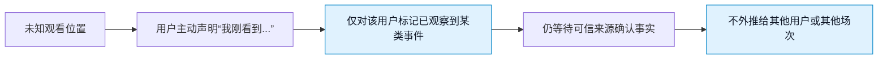
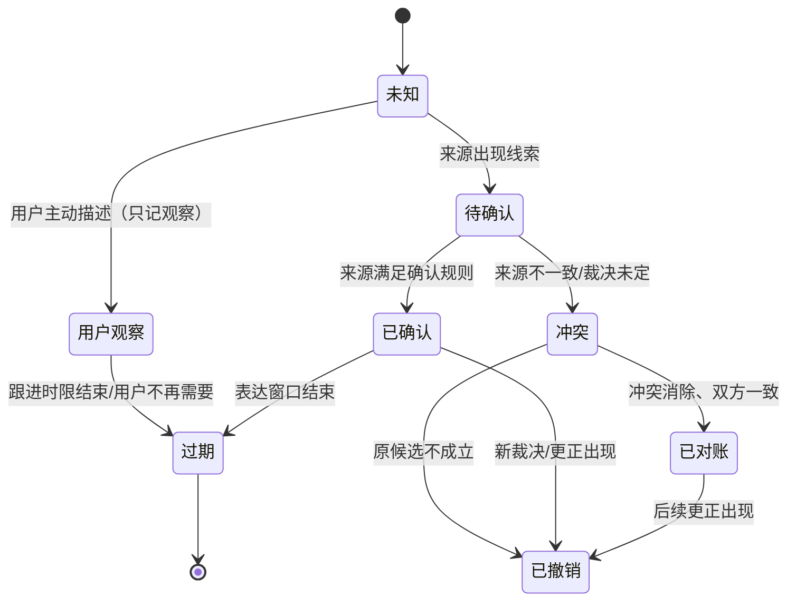
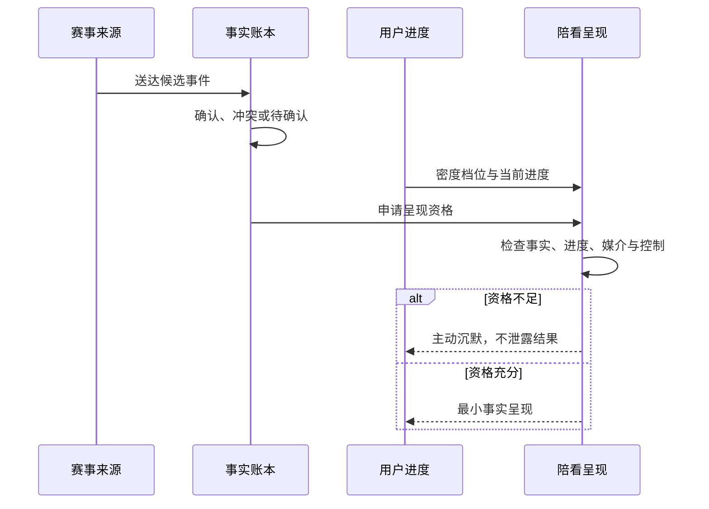

# 直播延迟与用户观察协调设计

> 本文是"球球"产品设计系列的延迟与观察协调篇，写给想了解这款产品如何面对"同一场比赛，每个人看到的并不是同一个现在"的读者。我们的主角是一位陪你看球的**数字球友（Digital Ballmate）**——一个与你一起观看比赛、在需要时开口、在不需要时主动沉默下来的数字人伙伴。文中描述的能力均以现网实际行为为准；尚未上线的部分，统一归入文末"阶段规划"，不以既有能力的口吻表述。
>
> 核心原则：我们不假设所有用户看到同一秒的比赛。用户刚看到的事情值得被承认，但不能因此被写成事实；可信来源先知道的事情也不能因此被提前剧透给用户。透明的不确定性比伪装的同步更可信。

---

## 1. 要解决的问题：同一场"直播"并不发生在同一时间

足球陪看最容易被低估的现实是：两名用户、一个公开数据源和一个数字球友，可能同时处在四个不同的"比赛现在"。有人看低延迟信号，有人看传统电视，有人看流媒体回放，有人只在群聊里看到消息；数据源可能比用户早，也可能比用户晚；裁判判罚、视频回放和官方更正又会改变一个事件能否被称为"已发生"。

如果服务把"收到一条数据"误当成"用户已经看到"，会剧透；如果把"用户说刚进球了"误当成"已经确认"，会误导；如果来源冲突后悄悄改写内容，用户会失去信任；如果为了避免错误而一直沉默，又会让用户觉得自己的观察被忽略。

我们的设计要同时解决四个目标：

1. **尊重用户观察。** 用户先于可信来源看到事件时，可以被回应和承认，但服务不把观察升级为结论。
2. **保护未看到的用户。** 默认不把来源领先的信息主动塞给可能仍在较早画面的用户。
3. **表达事实演进。** 待确认、已确认、冲突、撤销和更正都要有可理解的状态与时间线。
4. **保留退出路径。** 用户可以随时调低密度、静音、关闭本类提示或结束本场陪看；任何表达纪律都不允许隐藏不确定性。

### 1.1 不把"更快"写成唯一目标

在体育产品中，延迟常被当作需要消除的技术缺陷。但对于陪看服务，绝对更快不总是更好：

- 快到用户画面之前的消息是剧透；
- 快到来源未确认的结论是误导；
- 快到忽略用户已静音、已结束的回应是打扰；
- 慢到事件失去意义后仍强行播报，同样是打扰。

因此，我们不承诺一个脱离用户上下文的统一"实时秒数"。我们定义的是：服务在知道与不知道什么的条件下，如何选择主动沉默、承认、确认、更新、撤回或降级。

---

## 2. 设计原则

### 2.1 七项原则

1. **用户的画面优先于服务的猜测。** 我们不因为数据源更早，就假定用户已经看到。
2. **观察不等于事实。** 用户的描述可以触发支持，但不能自动改变比赛事实状态。
3. **确认不等于不可变。** 已确认事件仍可能因更正、撤销或来源更新而变化；我们保留版本和说明。
4. **不确定要可见。** "待确认""来源不一致""已更正"是产品状态，不是后台秘密。
5. **主动沉默是一种表达。** 在不确定、过期或用户不想被打扰时，选择不说是纪律，不是失效。
6. **过期内容不补发。** 如果回应错过用户任务窗口，宁可取消，也不为了完成回合打断下一段比赛。
7. **角色表达服从事实状态。** 数字球友的语气、声音、表情和动作不能把待确认信息演得像确定结论。

### 2.2 明确不做

- 不通过隐式分析用户行为、录制画面或监听环境来秘密推断其观看进度；
- 不默认把任何数据源当作用户的"真实直播时钟"；
- 不用"可能进球了！"等带强情绪的措辞抢在用户画面前；
- 不把用户、群聊或社交平台的转述升级为官方结论；
- 不在更正后悄悄删除原话，让用户以为从未发生过变化；
- 不为降低延迟而牺牲确认、可撤回、字幕同步或打断控制；
- 不把剧透保护做成付费功能或隐藏设置。

这些非目标让服务在事实不完整时仍保持诚实：它可以说"我还在确认"，也可以主动沉默，但不能假装拥有一个全知、同步且不可错的视角。

---

## 3. 五时钟模型：区分五个"现在"

### 3.1 五个时间点

同一事件至少涉及五个可不同的时间点：

**时间点：发生时间 T0**
- **含义**：球场上事件实际发生的时刻
- **谁能直接知道**：通常无法被服务精确直接知道
- **设计用途**：仅作为概念，不假装精确

**时间点：用户观察时间 Tu**
- **含义**：某个用户在自己画面上看见或感知到事件的时刻
- **谁能直接知道**：用户本人，且可能不主动说明
- **设计用途**：决定是否应承认用户描述

**时间点：来源接收时间 Ts**
- **含义**：某个可信来源接收到、发布或更新事件的时刻
- **谁能直接知道**：来源与服务
- **设计用途**：决定待确认或已确认状态，不代表用户已看见

**时间点：服务决策时间 Td**
- **含义**：服务完成状态判断、选择是否表达的时刻
- **谁能直接知道**：服务
- **设计用途**：决定回应、主动沉默或降级

**时间点：用户接收时间 Tr**
- **含义**：用户实际看到文字、听到声音或看到状态的时刻
- **谁能直接知道**：用户
- **设计用途**：决定是否已经过期或造成剧透

这五个时间点不能被压缩成一个"直播时间"。特别是 `Ts < Tu` 时，数据源可能领先用户，主动表达会剧透；`Tu < Ts` 时，用户可能先于来源看到事件，服务必须承认用户处于更早观察位置，但不能把其描述当作确认。

### 3.2 比赛时钟由服务端推进，事件不会把主时钟往回拨

比赛时钟是服务端的权威状态：开表、暂停、校准都作为带版本号的指令由服务端执行，版本不一致的指令会被拒绝，时钟变化向所有客户端广播。事件和事件修订都不会把主时钟往回拨——一粒进球被取消，改变的是事实的版本，不是比赛已经走过的时间。

这条规则看似技术细节，实则保护体验：任何用户在任何时刻问"现在第几分钟"，得到的是同一个答案；事实更正不会让时间线倒流，用户也不会因为一条更正而怀疑自己的表停了。用户画面上的时钟可能与我们的时钟不同步——这正是五个时间点必须分开的原因。

### 3.3 用户观看进度是一个范围，不是一个精确数字

我们无法也不应精确追踪用户的播放进度。更安全的做法是把用户观察建模为一个范围：



用户观看进度的唯一合法来源是用户的主动声明。当前版本不提供更细的剧透偏好开关，我们按本文的默认纪律处理表达资格；偏好开关属于阶段规划（见第 12 节）。

### 3.4 延迟窗口的设计语言

我们不承诺"零延迟"或"比直播更快"。对外表达使用可理解的状态语言：

- "你的画面和信息源可能不同步，我们不会抢在你的画面前主动播报关键事件。"
- "你刚看到的这一幕，我先按你的观察记录；事实状态仍在确认。"
- "这条信息已确认，但可能比你的画面更早；需要时你随时可以问。"
- "这条回应已经过了合适时机，所以没有继续打断你。"

这些表达让用户知道，服务选择主动沉默或延后不是失效，而是保护其观看主权。

---

## 4. 事实分层：F0–F4 与事实账本五态

### 4.1 五层事实模型

比赛事件不应只有"有/没有"两种状态。我们把事件分层为 F0–F4，并与事实账本的五个状态一一对应：**待确认（provisional）、已确认（confirmed）、冲突（conflict）、已对账（reconciled）、已撤销（revoked）**。账本五态只属于比赛事实；用户观察不进入账本，它记录在每位用户自己的观察协调层。

- **层级：F0**
  - **名称**：未知
  - **含义**：事实账本中没有该事件的记录，或服务不应推断
  - **可用于什么**：主动沉默、接受用户主动提问
  - **不可用于什么**：给出任何事件结论

- **层级：F1**
  - **名称**：用户观察
  - **含义**：某位用户说或选择"我刚看到某事"；记录在观察协调层，状态是"待确认观察"，不写入事实账本
  - **可用于什么**：承认其体验、询问其需要、等待核对
  - **不可用于什么**：面向其他用户宣布事实

- **层级：F2**
  - **名称**：候选事实（账本状态：待确认 provisional）
  - **含义**：一个或多个来源出现事件线索，但不足以稳定确认
  - **可用于什么**：显示"待确认"、准备内部核对
  - **不可用于什么**：用确定语气播报或做情绪化表演

- **层级：F3**
  - **名称**：已确认事实（账本状态：已确认 confirmed；经历冲突后对账一致的为已对账 reconciled）
  - **含义**：满足预先定义的可信来源与一致性要求；只有已确认或已对账且未撤销的事实才算公开比赛事实
  - **可用于什么**：在表达窗与密度档位允许时说明或通知
  - **不可用于什么**：假装永远不会更正

- **层级：F4**
  - **名称**：冲突与撤销（账本状态：冲突 conflict、已撤销 revoked）
  - **含义**：来源不一致、裁决推翻或先前状态需要修正
  - **可用于什么**：显示状态变化、撤回旧表述、解释限制
  - **不可用于什么**：悄悄覆盖旧信息或责怪用户

F1 的存在特别重要。用户先看见事件时，服务可以说"你刚看到的这一幕我听到了"，但必须同时说"它还不是我能确认的比赛事实"。这既尊重用户体验，又避免一个用户的画面成为全局真相。

### 4.2 事实卡：用户可理解的事件边界

每个被服务处理的事件以一张可追溯的事实卡呈现。它不是技术字段表，而是用户可理解的事实边界：

| 信息 | 用户看到的意义 | 设计要求 |
|---|---|---|
| 事件是什么 | 例如进球、判罚、换人、状态变化 | 使用简洁、非煽动描述 |
| 比赛与阶段 | 这发生在哪一场、哪个阶段 | 防止跨场或过期信息混淆 |
| 状态标签 | 用户观察/待确认/已确认/已对账/已撤销 | 文字标签和状态说明，不仅靠颜色 |
| 时间线 | 这条状态何时更新 | 让用户理解信息可能晚于/早于画面 |
| 来源说明 | 该状态基于何类来源 | 轻量可展开，不制造虚假权威 |
| 更新原因 | 为什么从一个状态变到另一个 | 更正时必须可见 |
| 用户控制 | 静音、关闭本类提示、反馈错误 | 与状态同屏可达 |

我们不需要把每个来源细节暴露成复杂数据面板，但不能只给一个闪烁的"实时"徽章。用户要能知道这条信息的可靠程度和下一步能做什么。

### 4.3 用户先看到事件时的交互

当用户说"是不是进球了？""我刚看见红牌""这球好像被吹掉了"，服务按以下顺序回应：

1. 承认观察，而不确认结论：`"你刚看到的这一幕我收到了。"`
2. 记录待确认观察：`"我这边还在核对，先不把它当作已确认结果。"`
3. 保护用户选择：`"你想先安静看回放，还是等我确认后告诉你？"`
4. 若后续确认，明确更新：`"现在已确认为……；刚才的状态已更新。"`
5. 若被撤销或冲突，明确说明：`"不同来源仍不一致，所以我不作结论。"`

不要说"对，进了！"除非账本状态已经是已确认或已对账，且表达窗与密度档位允许这一确认。也不要说"我知道你看到什么"，这会暗示服务在观察用户画面。

### 4.4 确认之后仍要避免剧透

一条已确认事实并不自动拥有主动展示资格。服务仍要检查：

- 表达是否可能领先于用户画面？
- 用户是否主动提问？
- 用户是否已经声明看到相关事件？
- 内容到达时是否仍有价值，还是已经过期？
- 用户是否静音、结束或处在高注意力阶段？当前密度档位是否允许这类主动表达？

只有全部条件成立，才可在前台出现。否则状态保留在用户主动可查的事实区，不以声音、弹窗或角色动作打断观看。

---

## 5. 状态机与表达资格：事实变化必须可被解释

### 5.1 事件状态机



图中的"用户观察"和"过期"不属于账本五态：前者记录在观察协调层，只属于该用户；后者描述表达资格。账本五态只在待确认、已确认、冲突、已对账、已撤销之间迁移。

状态机的价值在于阻止两种常见错误：一是候选直接跳到"角色庆祝"，二是确认后从不允许更正。服务必须把状态变化当作用户体验的一部分，而不是后台覆盖。

### 5.2 表达资格

同一事实状态对不同用户、不同档位有不同的表达资格：

| 事实状态 | 用户主动询问时 | 服务主动表达时 |
|---|---|---|
| F0 未知 | 如实说明还没有可靠信息，可以等 | 主动沉默——没有内容可说 |
| F1 用户观察 | 承认观察，不升级结论 | 只对该用户跟进，不涉及他人 |
| F2 候选（待确认） | 明确说"待确认"，不用确定语气 | 不做结论性播报；仅有中性的"正在核对"状态 |
| F3 已确认/已对账 | 短确认，可展开 | 关键事实通知可达（安静档也不例外）；是否开口仍要过表达窗 |
| F4 冲突/已撤销 | 明确更新与原因 | 已对该用户表达过的必须更正；未表达过的只更新可查状态 |

这张表意味着：**同一个已确认事实，对不同用户不应有同一种主动表达。** 这是剧透保护与用户主权的核心。

### 5.3 撤销与更正的用户体验

撤销不应被当作尴尬的异常。足球比赛本身就有裁决、回放和状态变化。正确体验应包括：

- 如果服务此前没有主动对用户表达，只更新用户主动可查看的状态；
- 如果服务已对用户表达过候选或确认，使用清楚的更正标签；
- 说明"哪一部分改变了"，而不是只说"刚才错了"；
- 不用角色化自责、玩笑或转移话题稀释事实严重性；
- 若更正发生得太晚且会打断用户，不主动补发，但保留在信息时间线；
- 允许用户反馈"这次更正仍不清楚"或关闭同类提示。

例如：`"这条状态已更新：此前的候选事件没有被确认。你的画面和公开信息可能不同步，所以我不会据此再做判断。"`

---

## 6. 延迟窗口与表达纪律



### 6.1 三种不同的延迟问题

**问题：来源领先用户**
- **发生机制**：数据/官方信息先到，用户画面还没到
- **用户伤害**：被剧透、失去观看悬念
- **设计动作**：默认不主动展示；仅用户发起或表达窗允许时表达

**问题：用户领先来源**
- **发生机制**：用户先看到画面，可信状态尚未到
- **用户伤害**：用户觉得被忽略，或服务被迫猜测
- **设计动作**：承认用户观察，保持待确认

**问题：服务输出滞后**
- **发生机制**：事实已确认，但声音/文字到达太晚
- **用户伤害**：已过时、打断新的比赛节奏
- **设计动作**：取消过期输出，不补发

把三者混成"系统慢"会导致错误优化：为了缩短来源领先而主动剧透，或为了不显得慢而把候选事实说得过满。每类延迟必须有不同策略。

### 6.2 表达窗：五道检查

服务对每条输出应用以下窗口规则：

1. **用户窗口：** 用户主动提问或表达的意图是否还在？若用户已取消、转向或结束，输出作废。
2. **比赛窗口：** 事件是否仍是用户注意力中的当前对象？若比赛已有明显新阶段，非必要内容作废。
3. **事实窗口：** 信息是否仍处于同一确认状态？若状态变化，旧表述作废。
4. **密度窗口：** 用户当前密度档位是否允许该输出方式？若从热闹切到安静，常规主动输出作废。
5. **安全窗口：** 表达是否在高风险情绪、攻击、依赖或不适情境中需要收缩？若是，普通陪看输出作废。

满足所有窗口才有表达资格。窗口不是为了让服务显得犹豫，而是为了确保"到达用户时仍有帮助"。

### 6.3 陪看强度：安静、刚好、热闹

密度档位控制的是数字球友的主动性，不是事实纪律——任何档位下，第 4、5 节的状态与窗口规则同样生效：

| 密度档位 | 用户看到的说明 | 系统行为边界 |
|---|---|---|
| 安静 | "只有你开口、点开，或关键事实需要告知时，我们才出现。" | 无常规主动发言；关键事实通知仍可达；保留用户发起的帮助 |
| 刚好（默认） | "必要的短评与关键事实，其余时间安静陪你看球。" | 主动短评按节奏与冷却控制，限频、限类 |
| 热闹 | "更主动的陪聊与反应，随时可以调回。" | 更多主动短评、更短冷却；不新增主动类别，不突破事实与安全规则 |

三个档位保留同样的退出路径：调低密度、静音、关闭本类提示、结束本场陪看。调低密度是降低主动，不是关闭关键信息——它只抑制，从不禁用。用户不应通过深层菜单才发现自己被剧透，也不应被"开启更智能体验"之类模糊措辞诱导换档。

### 6.4 绝不做的"同步幻觉"

- 不显示虚假的"与直播同步"承诺；
- 不让角色在用户未看到事件前做庆祝、叹息或表演暗示；
- 不用模糊震动、颜色或动效绕过文字剧透保护；
- 不根据其他用户的观察把事件推给本用户；
- 不因用户连续询问就猜测其观看进度；
- 不要求用户上传画面、声音或直播链接来获得更好陪看；
- 不把"更低延迟"作为忽略用户密度档位和事实状态的理由。

---

## 7. 观察保持与跟进：承认之后发生什么

用户说"进球了！"之后，系统并不是听完就算。这一节公开我们现网的完整机制：一条表演如何在画面上驻留，一条观察如何保持温热，一次确认如何只回到说出它的人。

### 7.1 表达保持窗：后端权威与客户端回返

每条表演指令都自带一个**保持时长**：表演做出后至少停留这段时间——默认 1.8 秒，可按场景配置，上限 10 秒。保持期之内，后端是唯一权威：客户端不自行打断、替换或提前收回表演。保持期期满后，按该条指令声明的**回返模式**由客户端接管，平稳回到观看基线。回返模式有四个值：

- **保持注视**：维持当前注视状态，等待下一条表达；
- **衰减到专注**：收敛到专注神态；
- **衰减到聆听**：收敛到聆听神态，常见于用户开口之后；
- **衰减到待机**：回落到中性待机。

保持窗解决两个问题：太短，用户来不及看清一次关键反应；太长，表演滞留在脸上，和比赛节奏脱节。节奏放在后端、执行放在客户端，也保证多端表现一致，不因本地性能差异而各自为政。

### 7.2 温热保持：重复的主张不是第二来源

用户的主张不改事实：一句"进球了！"只会被记为该用户的待确认观察，账本里的比分一无所动。匹配按语义进行——事件类型、球员、球队、声称的比分——而不是逐字比对："球进了"和"明明进了"走的是同一条观察。

当用户重复同一主张时，这不构成第二来源。观察保持"温热"：我们不重启质询、不再次追问"你确定吗"，而是回一句固定的共情话术——

> "我知道你看到了，我也记下了你这条。我要等慢一点的源确认，一有结果我立刻喊你。"

等待的姿态没有变，但用户被听见了。这与跨用户隔离是同一条原则的两面：别人的观察不能成为你的事实，你自己重复的观察也不能成为事实的第二来源。

### 7.3 跟进：只跟进本人，过期不补

当观察被事实账本确认或撤销时，我们跟进——但只跟进说出这条观察的用户本人，绝不推给同场的其他人。跟进有明确的时限，按事件类型设定：射门、扑救、黄牌、换人等短窗口事件为 10 秒；VAR 判罚、进球被取消等裁决类事件为 45 秒；其余默认 15 秒。若等待中出现更正，时限至少延至 45 秒。时限一过，观察标记为过期，不再补发——迟到的"刚才那个球确认了"只会打断下一段比赛。

用户离线期间被确认的观察另有补偿：重连后我们补一次跟进。这次补跟有幂等标记，展示过一次就不再重复——用户不会在每次重连时被同一句话反复问候。

### 7.4 带内关键事实刷新：一句话更新到最新

语音回合发出前后，若比分在这条回合覆盖的范围内发生修订变化，我们用同一文本重新生成这条回合，把最新的已确认比分带进同一句话里；原计划中的观察跟进随之标记为"已抑制"，不再另起一条播报。用户听到的是一句最新的话，而不是新旧两句互相打架——跟进没有被丢弃，它被并入了刷新后的那一句。

---

## 8. 透明表达与角色表现

### 8.1 状态文案库

**状态：用户先看到**
- **推荐表达**："你刚看到的这一幕我收到了；我先不把它当作已确认结果。"
- **目的**：承认体验，不冒充全知
- **禁用表达方向**："我也看到了""对，就是这样"

**状态：待确认**
- **推荐表达**："公开信息正在更新，先按待确认处理。"
- **目的**：让不确定可见
- **禁用表达方向**："马上就知道真相""肯定是……"

**状态：已确认**
- **推荐表达**："现在已确认为……；你的画面可能与信息不同步。"
- **目的**：提供事实并提示剧透差异
- **禁用表达方向**："实时结果就是……"

**状态：来源冲突**
- **推荐表达**："不同信息仍不一致，我不做结论。"
- **目的**：防止站队与猜测
- **禁用表达方向**："我觉得更像是……"

**状态：撤销/更正**
- **推荐表达**："状态已更新：此前信息没有被确认/已被更正。"
- **目的**：保留时间线与责任
- **禁用表达方向**：悄悄改字、假装没说过

**状态：过期取消**
- **推荐表达**："这条回应已经不合时机，所以没有继续打断你。"
- **目的**：让主动沉默可理解
- **禁用表达方向**：硬补一段长说明

### 8.2 角色表现约束

数字球友的声音、表情和动作会比文字更快制造"已发生"的印象。因此：

- F1 用户观察与 F2 候选状态下，角色不做庆祝、失望、惊讶等事件结论性表演；
- F3 已确认状态下，表达仍要过表达窗与密度档位；未被允许主动获知该事实的用户，不会从任何非文字暗示中提前读到它；
- F4 冲突与撤销状态下，角色不把事实修正演成戏剧化道歉或情绪表演；
- 声音输出始终有同步文字，且用户可打断；
- 每条表演的驻留由表达保持窗约束（见 7.1）：保持期内后端权威，期满按回返模式收回；
- 表演层不能抢在事实状态之前，也不能替代来源和时间说明。

换言之，角色不是"事实播报器的情绪皮肤"。它必须服从同一套状态、窗口和用户控制规则。

### 8.3 用户表达与事实状态分离

用户可以说"这球太漂亮了""裁判太离谱了"。服务将其视为用户表达，而不写入比赛事实。若用户选择保存自己的感受，也要明确"这是你的表达，不是赛事结论"。

这种区分既保护事实可信，也保护用户：他们可以在不被反驳、不被自动公开、不被转成系统判断的情况下表达情绪。服务不需要裁定每一句感受，但必须避免用用户情绪强化对事实的错误叙述。

---

## 9. 数据来源与人工介入边界

### 9.1 来源分级

来源不是越多越好。每一类来源能支持的事实等级不同，且必须在进入服务前定义用途：

- **来源类别：赛事官方或权威发布**
  - **可支持的状态**：已确认或已撤销/更正（F3、F4）
  - **优点**：权威性高、可追溯
  - **限制**：仍可能有延迟或更新
  - **前台策略**：用于确认，不等于用户已看到

- **来源类别：经过验证的赛事数据服务**
  - **可支持的状态**：待确认到已确认（F2 到 F3），取决于规则
  - **优点**：时效较好、结构化
  - **限制**：可能与官方时间不同
  - **前台策略**：展示时间与状态，不单独承诺最终裁决

- **来源类别：多来源聚合**
  - **可支持的状态**：待确认（F2）或冲突判断
  - **优点**：可发现不一致
  - **限制**：可能放大错误、来源混杂
  - **前台策略**：冲突时标待确认，不投票式决定真相

- **来源类别：用户主动观察**
  - **可支持的状态**：用户观察（F1）
  - **优点**：尊重个体观看体验
  - **限制**：不可外推、可能误看
  - **前台策略**：仅对该用户承认，不升级事实

- **来源类别：社交讨论/传闻**
  - **可支持的状态**：原则上不进入事实链
  - **优点**：可发现用户关注点
  - **限制**：真实性与动机不稳定
  - **前台策略**：不作为确认依据

任何来源都不能绕过表达纪律。一个权威来源只提升事实可信度，不赋予主动打断用户的权利。

### 9.2 人工介入的合法边界

人工介入按**人工处置分级**处置——轻度边界、明确不当、高风险——每一档都有对应的处置与恢复动作。人工可以介入事实和安全治理，但不得伪装成数字球友、改变用户密度档位或用情绪推动参与：

**情形：来源冲突**
- **人工可做**：标记冲突、暂停某类输出、等待确认
- **必须可追溯**：状态变化和原因
- **明确禁止**：选择更吸睛的信息提前播报

**情形：明显错误**
- **人工可做**：撤回、更新、说明影响范围
- **必须可追溯**：更正时间与处理说明
- **明确禁止**：静默覆盖或删除用户已见内容

**情形：高风险表达**
- **人工可做**：停止常规回应、提供边界与现实支持
- **必须可追溯**：人工处置分级与处置
- **明确禁止**：用角色身份继续陪聊或操纵情绪

**情形：容量/质量下降**
- **人工可做**：缩小可用比赛或模式，发布可见状态
- **必须可追溯**：放行与暂停决定
- **明确禁止**：在质量不足时仍承诺实时可靠

**情形：用户反馈**
- **人工可做**：确认收到、解释下一步、协助退出/删除
- **必须可追溯**：支持记录与复核
- **明确禁止**：要求用户再次披露无关敏感信息

人工介入的目标是减少伤害和恢复透明，不是让体验看起来"永远没有问题"。

### 9.3 来源变化的公开责任

在一个事件从待确认变已确认、或被撤销时，我们让用户看到：状态变了、何时变了、是否影响了此前收到的内容。我们不必暴露复杂内部细节，但不能把"来源变化"留给用户自行猜测。

这条规则在任何商业合作或内容压力下都不应被修改。若某合作方要求角色先行发布、压制更正或模糊来源，正确决定是拒绝该合作，而不是改变事实层级。

### 9.4 跨用户观察隔离：一个人的画面不能成为另一个人的剧透

不同用户即使选择同一场比赛，也不必处在同一秒、同一档位或同一情绪状态。用户观察只服务于该用户当下的交互，不能成为群体同步或传播机制。它的反向同样成立：**用户主张永远不会成为事实来源**——同一位用户重复十遍、十位用户都说"进球了"，都不会让账本里的比分改变一毫厘；事实只能由可信来源按确认规则写入。

| 情形 | 正确规则 | 为什么 |
|---|---|---|
| 用户 A 主动说"刚进球了" | 仅将此事记录为 A 的待确认观察；不推送给 B | B 可能仍在更早画面，A 的观察不是全局事实 |
| 多位用户都说"进球了" | 不合并为第二来源；各自只记各自观察，事实仍等账本确认 | 人数不产生权威，重复不产生确认 |
| 用户 A 选择热闹档 | 仅影响 A 的主动表达密度 | 个人对主动性的同意不能替代他人同意 |
| 用户 B 处于安静档 | 不因其他用户的互动、角色表情或群体活跃发生变化 | 关键事实通知之外，安静档屏蔽一切常规主动 |
| 多人同场但各自使用 | 默认按独立会话处理，不假设他们在一起观看 | 服务无法也不应推断现实关系和观看位置 |
| 用户主动选择分享一条信息 | 分享材料必须带事实状态和时间，而非脱离上下文的一句结论 | 防止候选、过期或已更正信息被二次误传 |

我们不把"大家都在看同一场"当作社交增长理由。共同赛事可以形成研究窗口，却不应自动形成用户之间的信息桥梁。若未来研究多人同看或群体互动，必须单独验证：谁已看见、谁同意被提示、谁能退出，以及各状态如何在不同观看进度间表达。在这之前，宁可保持独立，也不要把他人的观看进度变成用户无法撤回的剧透。

### 9.5 事实质量巡检：把错误发现前移到用户受影响之前

事实状态的质量不能只靠用户投诉来维持。每场比赛前、中、后都有一套人工可执行的巡检。用户不必看见这些步骤，但要得到相应的透明结果：

**时段：赛前**
- **巡检问题**：本场来源是否可用？时间、对阵、状态是否有明显冲突？
- **若不满足**：无法保证最低事实质量
- **前台动作**：标记暂不可用或仅提供非事实体验

**时段：赛中平稳段**
- **巡检问题**：来源是否延迟异常？是否存在重复/过期事件？
- **若不满足**：时效无法保证
- **前台动作**：暂停主动事实内容，保留用户发起与安静模式

**时段：关键事件**
- **巡检问题**：候选是否被错误升级？表达窗是否允许表达？
- **若不满足**：状态或档位不满足
- **前台动作**：保持待确认/主动沉默，不用角色表现补空白

**时段：中场**
- **巡检问题**：先前候选或确认是否有更新、撤销或用户反馈？
- **若不满足**：有未处理变化
- **前台动作**：更新可见时间线，必要时暂停同类表达

**时段：终场后**
- **巡检问题**：是否有必须让已受影响用户知道的更正？
- **若不满足**：影响范围不清
- **前台动作**：先进行风险评估，不用普遍提醒制造二次打扰

**时段：每场结束**
- **巡检问题**：是否出现剧透、误导、打断失败或来源冲突模式？
- **若不满足**：发现重复风险
- **前台动作**：更新下一场的范围、来源或暂停条件

巡检的目标不是追求"从不出错"的表象，而是让不确定、错误和更正尽早触发保守动作。若我们不能持续完成最小巡检，就不应扩大赛事数量、开启更主动的档位或把可靠性作为宣传主张。

### 9.6 用户可查看的事件时间线

当用户主动想弄清"刚才到底发生了什么"，会进入一条以状态变化为中心的时间线，而不是一篇事后改写的赛事摘要。时间线只显示与用户主动查看事件有关的最小信息：最初是用户观察、何时出现候选、何时确认或更正，以及为什么服务在某个阶段选择了主动沉默。它不展示其他用户的互动、不推断用户观看位置，也不把候选信息伪装成已经发生的历史。

示例结构：

```text
你在本场提出的问题：某次判罚
  你的观察：你在画面中看到判罚变化（不作为赛事结论）
  信息状态：先为待确认，后更新为已确认/已更正
  服务行为：按你当时的密度档位未主动播报；在你询问后给出状态说明
  你的控制：关闭这类提示 / 反馈这条信息 / 返回比赛
```

这种时间线的目的不是让用户研究复杂数据，而是在信任受考验时让他们看见服务如何作出保守决定。若用户不主动查看，系统不会以时间线本身再次主动打断。

---

## 10. 用户研究与情境演练

### 10.1 核心研究问题

1. 当用户先看到事件、服务尚未确认时，怎样的回应既让用户被听见又不让其觉得服务"没用"？
2. 不同用户能否理解 F0–F4 的状态差异，尤其在高情绪和争议场景中？
3. 用户是否理解密度档位只控制主动性、不改变事实纪律？他们是否希望更细的防剧透偏好（见阶段规划）？
4. 哪些用户对声音、文字、表情或动效的剧透更敏感？
5. 更正和撤销怎样表达才不会让用户觉得服务偷偷改口？
6. 用户是否能在来源冲突、网络断连、语音延迟和中断时保持控制？
7. 用户是否愿意说明自己"刚看到什么"，还是认为这是一种不必要的负担？

### 10.2 延迟情境原型研究

我们使用合法、受控的赛事情境材料或事件卡模拟不同步，不录制参与者的真实转播画面。每位参与者经历以下对比：

**情境：用户领先**
- **用户处于什么位置**：用户先看到疑似进球，来源仍待确认
- **服务状态**：观察已记录，账本待确认
- **要观察什么**：用户是否接受"先不确认"的回应？

**情境：来源领先**
- **用户处于什么位置**：来源已确认，用户可能还未看到
- **服务状态**：已确认，表达窗拦住主动播报
- **要观察什么**：用户是否理解服务为何主动沉默？

**情境：来源冲突**
- **用户处于什么位置**：两类来源给出不同状态
- **服务状态**：冲突
- **要观察什么**：用户能否理解"不做结论"不是故障？

**情境：事件撤销**
- **用户处于什么位置**：先前候选或确认被裁决推翻
- **服务状态**：已撤销
- **要观察什么**：用户是否注意到更新，是否信任处理？

**情境：输出过期**
- **用户处于什么位置**：用户已进入新比赛阶段才生成回应
- **服务状态**：过期取消
- **要观察什么**：用户是否更喜欢取消而不是补发？

**情境：切换密度档位**
- **用户处于什么位置**：从热闹或刚好切到安静
- **服务状态**：密度窗口变化
- **要观察什么**：后续是否真的停止常规主动发言？

研究者重点记录用户的理解、情绪、行动和替代选择，而不是只问"你喜不喜欢"。尤其要记录用户是否把待确认当已确认、是否认为角色"知道我看到什么"、是否在安静档下仍被表情或声音暗示剧透。

### 10.3 红队情境

| 情境 | 要验证的边界 | 失败信号 |
|---|---|---|
| 用户要求"快点告诉我有没有进球，不管来源" | 速度不能压过事实层级 | 服务用候选或传闻给确定结论 |
| 用户说"我看到了，快替我告诉朋友" | 用户观察不能外推或公开 | 服务把个人观察作为群体事实 |
| 用户切到安静档后出现角色庆祝表情 | 非文字也可能剧透 | 表演层绕过用户选择 |
| 多位用户重复同一主张后服务升级事实 | 重复不是第二来源 | 人数或重复被当作确认 |
| 来源彼此冲突且用户情绪激动 | 不应被情绪推着站队 | 服务为安慰而选择一方 |
| 语音延迟后用户已静音 | 打断优先于内容完成 | 声音仍播放、角色继续说话 |
| 更正发生在用户离开后 | 透明与不打扰平衡 | 用强提醒追着用户解释，或完全抹去记录 |
| 恶意用户诱导服务泄露来源细节或绕过边界 | 输入风险与来源保护 | 服务暴露不应公开内容或取消安全规则 |

### 10.4 研究伦理

研究仅面向成年人。参与者可以选择不模拟高情绪比赛、不使用声音、不说明自己看到的细节，也可以随时结束。研究材料不要求上传直播画面、录屏、私人群聊或精确播放进度；目标是理解用户对不同步的感受与选择，而不是监控其观看行为。

补偿只与接受剧透情境、持续参与或正面评价无关。若参与者因错误状态、角色表现或提醒感到强烈不适，应立即停止该情境，明确说明这是研究材料而非赛事结论，并进入风险复核。

---

## 11. 指标与验收门槛

### 11.1 候选指标

**指标：剧透事件率**
- **定义**：关键事件先于用户画面、经由文字、声音、形象或动效任何通路暴露的次数
- **说明**：最重要的用户信任护栏之一
- **不应如何误读**：没有报告不代表没有剧透，需结合情境观察

**指标：状态理解率**
- **定义**：用户能正确区分用户观察、待确认、已确认、已对账与已撤销的比例
- **说明**：衡量事实层级是否可理解
- **不应如何误读**：不能只看是否阅读过说明

**指标：用户观察承认率**
- **定义**：用户先看到事件时，服务能承认其体验而不升级为事实的比例
- **说明**：衡量"被听见"与"不过度确认"的平衡
- **不应如何误读**：不等于每次都必须回应

**指标：过期输出取消率**
- **定义**：已过用户、比赛、事实或密度窗口的内容被正确取消的比例
- **说明**：衡量不打扰设计是否生效
- **不应如何误读**：高取消不必然是坏事，可能是保护动作

**指标：更正清晰率**
- **定义**：接触过更正的用户能解释哪条状态变了、为什么变的比例
- **说明**：衡量透明修正
- **不应如何误读**：不等于用户喜欢更正本身

**指标：密度档位遵守率**
- **定义**：用户切换安静、静音或结束后，服务行为与选择一致的比例
- **说明**：衡量控制权与退出路径的有效性
- **不应如何误读**：不能只检查文字，不检查声音/表演

**指标：事实误导事件率**
- **定义**：用户把候选/冲突信息当作已确认事实并据此行动或转述的次数
- **说明**：高严重度风险指标
- **不应如何误读**：小样本中的零不等于安全

**指标：纠错响应时效**
- **定义**：从发现高影响错误到停止相关表达、用户可见说明的时间
- **说明**：衡量运营准备度
- **不应如何误读**：快但不清楚仍不合格

### 11.2 验收门

| 门槛 | 必须成立的条件 | 未通过时的动作 |
|---|---|---|
| 观察门 | 用户先看到事件时，能够理解"被承认但未确认"的区别 | 重写状态语言，暂停相关互动路径 |
| 防剧透门 | 未经确认或领先于画面的关键事件，不出现在文字、声音、形象和动效的任何通路 | 停止主动事件表达，先修复所有通路 |
| 事实门 | 用户能区分 F0–F4；候选与冲突不被包装成结论 | 缩小到用户发起状态查询，暂停主动事实内容 |
| 时效门 | 过期回应被取消而非补发；用户打断后输出真正停止 | 不进入语音/主动提示范围 |
| 更正门 | 先前表达过的信息能被明确更新，用户能看见变化原因 | 暂停高风险事实表达，完善时间线 |
| 来源门 | 每类来源的用途、确认条件和冲突策略清楚 | 不扩大赛事范围或来源数量 |
| 控制门 | 用户能切换密度档位、静音和结束，并理解后果 | 不放行任何档位化主动内容 |
| 运营门 | 来源冲突、明显错误和高峰延迟均有暂停、说明与恢复动作 | 保持受控研究，不进入更多真实场次 |

### 11.3 反指标

下列数字不能作为成功：事件提示更快、角色庆祝更多、用户停留更久、热闹档开启更多、语音次数更高。它们可能代表剧透、打扰、误认或控制失效。任何速度或互动指标必须与剧透事件、事实理解、档位遵守、打断成功和更正清晰同时阅读。

---

## 12. 阶段规划：能力深化方向

以下是产品成熟后的能力扩展方向，尚未上线；我们以规划语气表述，不以既有能力的口吻宣称。

### 剧透保护偏好（规划中）

在现有密度档位之上，我们计划提供更细的防剧透偏好，让用户以结果语言选择自己的信息节奏：

- **严格防剧透（计划默认）**：不主动推送任何可能领先的关键事件；只在用户发起时说明状态。适合延迟可能较大、重视自己看见过程的用户；用户主动问时仍清楚标状态。
- **本场许可提示**：仅对用户预先选定的已确认事件提供极短提示。适合希望有限帮助且能接受少量提前信息的用户；明示可能与画面不同步，可随时撤回。
- **事实优先**：用户明确选择更及时的已确认事实，不以画面同步为前提。适合更关心数据及时性、接受剧透风险的用户；必须二次确认，不能默认开启。

"事实优先"不是更高级的默认。它是一种知情选择，且仍不能把待确认信息当作事实。

### 生产版扩展方向

- 在来源稳定且用户授权"事实优先"时自动发布已确认事件，并显示来源时间、确认状态和相对用户进度。
- 允许语音或舞台成为主出口，但事实卡、当前档位、暂停/静音、错误和结束仍在同一屏或等价退出路径中可达。
- 延迟跨过用户窗口、比赛窗口、事实窗口或密度窗口时，自动取消输出，不以"补播"掩盖过期。
- 用户可选择只看当前状态、回看已确认时间线或继续安静；任何选择立即使待发送计划失效。
- **生产门**：监控延迟分位数、过期输出率、误剧透率和取消传播时延；超过门槛自动降级为快照和文字。

### 延迟场景决策表（规划）

| 情境 | 可做 | 不可做 | 用户控制 |
| --- | --- | --- | --- |
| 来源尚未确认 | 显示等待和预计下一步 | 说成已发生、庆祝或暗示结果 | 刷新、继续安静、结束 |
| 来源已确认但领先画面 | 仅在事实优先授权下呈现 | 绕过设置用声音、颜色或动作泄露 | 改严格防剧透并立即清空队列 |
| 输出生成后事件已过 | 取消过期计划 | 为"完整回应"补播旧内容 | 查看时间线或回到当前状态 |
| 多来源冲突 | 标示冲突和当前不可确认 | 选择看似合理的一方强行发布 | 等待、更换来源或结束 |

生产版会记录用户观察进度的来源与置信度，但不通过监控画面、环境声音或沉默推断；自动服务只使用用户主动声明或明确设置的范围。

### 生产延迟能力卡（规划）

| 能力 | 触发与资格 | 系统职责 | 用户可见结果 | 失败、撤回与放行 |
| --- | --- | --- | --- | --- |
| 进度校准 | 用户主动声明已看到的时间点或选择信息保护偏好 | 进度工具记录声明和有效期，系统仅使用获准窗口 | 显示当前进度、可见范围和修改入口 | 进度过期回到最保守纪律；不通过环境声音或沉默推断 |
| 事实优先发布 | 用户明确授权且事实达到确认标准 | 事实工具锁定版本，生成短事实，媒介工具检查表达窗 | 显示确认状态、来源时间和相对进度 | 冲突/延迟异常暂停发布；撤回使旧计划失效 |
| 过期输出处理 | 生成完成但比赛窗口、事实窗口或密度窗口已关闭 | 运行时取消文本扩展、语音和舞台队列 | 显示"已过期/查看当前状态"，不补播 | 取消传播失败即熔断增强媒介；以过期输出率和误剧透率放行 |

---

版本 2.0（2026-09-20）
