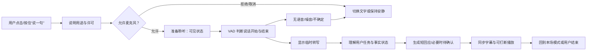
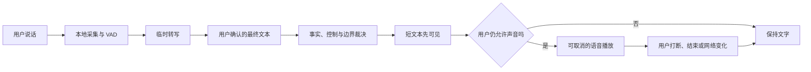
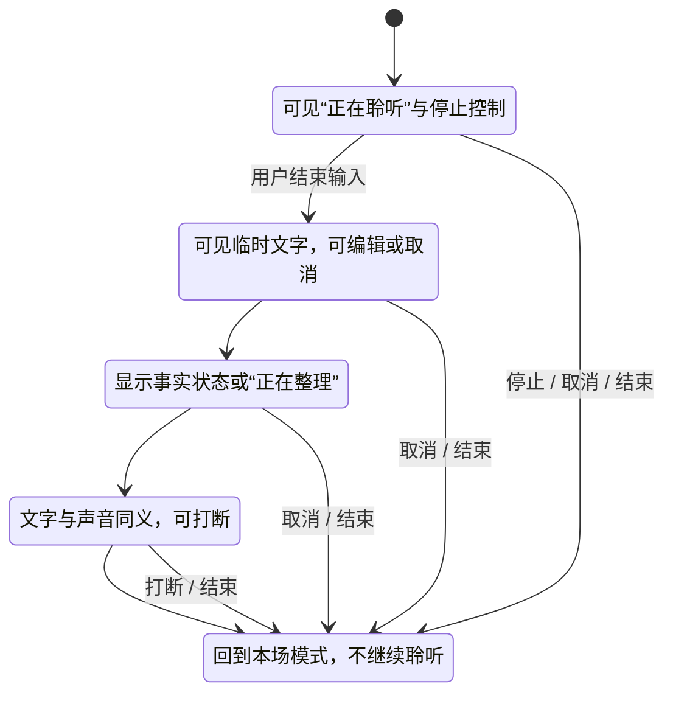
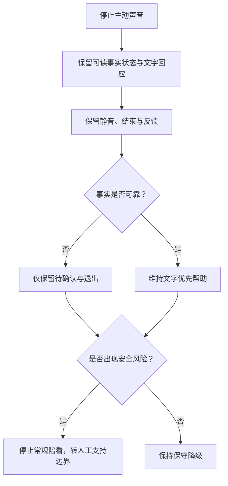

# 实时语音陪看体验设计

> 文档类型：0→1 实时语音交互、字幕、打断与隐私体验设计  
> 适用阶段：验证语音是否为比赛陪看的必要通路 → 在有限范围内建立可控语音回合  
> 版本：0.1（语音价值、时延和交互偏好均为待验证假设）  
> 研究信息截止：2026-01-28  
> 核心原则：语音的价值在于让用户在不方便输入、又确实想说一句时更容易表达和获得帮助；它不是默认监听、不是无限对话、更不是让数字角色显得更像真人的理由。

---

## 1. 语音交互目标：降低手部负担，不抢走比赛

比赛中用户的双手、眼睛和注意力大多属于比赛本身。输入一句问题、表达一次情绪、切换一次模式，可能比在普通聊天场景更有摩擦。语音有潜在价值：用户可以在不离开画面的情况下说一句“刚才为什么判了越位？”或“先安静一会儿”。

但语音也带来更高风险：突然出声会剧透或打断；错误识别会让用户觉得没被听见；持续录音会造成监视感；无法打断的长回应会让用户错过下一次进攻；自然音色和角色表演可能让用户误认真人陪伴。首轮设计必须先证明语音的**任务增量**，而不是把它当成数字人产品的默认装饰。

本设计的候选成果是：

> 用户在一场自己原本愿意观看的比赛中，可在明确同意后用极短语音发起一个回合，立即知道系统是否正在聆听、是否听懂、何时会回应；得到文字同步、可随时打断的短回应，并能在任何环节改用文字、静音或结束，而不失去核心帮助。

### 1.1 语音要解决的具体任务

**用户任务：快速确认比赛事实**
- **语音可能带来的价值**：不必切换输入法或离开画面
- **文字同样能完成什么**：以短文字提问
- **需要验证的假设**：说一句是否比打字更合拍、更少打断？

**用户任务：表达瞬间情绪**
- **语音可能带来的价值**：用户不必组织完整文字
- **文字同样能完成什么**：表情、短句、只记录不回应
- **需要验证的假设**：用户是否真的想听到回应，还是只需要出口？

**用户任务：切换本场控制**
- **语音可能带来的价值**：可说“安静”“停一下”
- **文字同样能完成什么**：点击静音/结束
- **需要验证的假设**：语音控制是否比按钮更快且不误触？

**用户任务：赛中短解释**
- **语音可能带来的价值**：可连续问一个简短追问
- **文字同样能完成什么**：文字可展开阅读
- **需要验证的假设**：语音是否提高理解，而非把比赛变成播客？

**用户任务：无障碍替代**
- **语音可能带来的价值**：对部分用户比小目标点击更方便
- **文字同样能完成什么**：文字、屏幕阅读、选择式表达
- **需要验证的假设**：语音是否是可选等效通路，而非新的门槛？

若研究发现文字、按钮或安静状态已经满足多数任务，语音应保持可选或被延后。更自然的语音不等于更有价值的陪看。

### 1.2 明确不做

- 不在用户未主动开启前持续聆听、唤醒或收集环境声音；
- 不以“保持对话感”为由自动接管麦克风；
- 不要求用户授予麦克风权限才能看比赛信息、使用文字帮助、静音或退出；
- 不把用户语音、背景声音或比赛音频默认保存为长期记忆；
- 不在高紧张事件、用户静音、严格防剧透或已结束会话时自动出声；
- 不让声音成为事实状态、错误、更正或退出控制的唯一表达方式；
- 不让角色用语音表达排他、恋爱化、内疚或“别走”的关系语言；
- 不把语音时长、连续对话轮数或用户不打断当作成功。

---

## 2. 语音设计原则

### 2.1 八项原则

1. **用户先发起。** 首轮只提供用户主动点击/按住后开启的一次语音回合，不采用后台唤醒和连续监听。
2. **状态必须可感知。** 用户任何时刻都能知道麦克风是否打开、语音是否在识别、回应是否在生成、声音是否在播放。
3. **可见文字与声音等价。** 用户说的话、服务的回应、事实状态和错误说明均有可读文字；关闭声音后核心任务仍可完成。
4. **打断优先于内容完成。** 用户一旦点击停止、开始新一轮表达或切到安静，正在播放的内容立即让位，不补说完。
5. **短回合优先。** 比赛中优先一句问题、一句回答或一个控制动作；复杂解释只在用户主动展开或中场/赛后提供。
6. **事实优先于表演。** 候选、冲突或待确认状态下，声音与表情都不能制造已确认的印象。
7. **许可按场景请求。** 用户点击语音入口后才解释并请求麦克风；拒绝后无惩罚地回到文字。
8. **沉默是合法结果。** 噪音、识别不确定、内容过期、用户取消或风险边界触发时，服务应明确停下或转文字，而非硬凑回应。

### 2.2 语音的控制契约

用户使用语音前，需要看到一个可在数秒内理解的契约：

```text
你点“说一句”后，我才会开始聆听。
你可以随时点停止、改用文字或结束本场。
我会把听到的话显示成文字；声音回应也会有字幕。
本场默认不保存你的语音或背景声音。
比赛事实仍会标注确认状态，声音不会替代状态说明。
```

契约不是一页长条款，而是用户之后可以在状态区反复看见的控制说明。若用户无法复述“什么时候在听、怎么停、有没有保存”，就不应进入语音回合。

---

## 3. 端到端语音回合：从许可到自然结束

### 3.1 主路径



主路径中没有“无限接管下一轮”的箭头。一次语音回合结束后，服务回到用户先前选择的本场模式：安静、只回应或有限提示。用户若想继续，必须再次主动发起，除非后续研究证明某种明确、可预测的连续回合对用户有净价值且不损害控制。

### 3.2 回合分解

> 信息卡：原宽表已改为纵向阅读，字段含义不变。

- **阶段：触发**
  - **用户意图**：“我现在想说一句”
  - **前台状态与文案**：显示语音入口，不自动开启
  - **服务责任**：保持麦克风关闭直到用户动作
  - **用户可做什么**：点击、按住、改用文字、离开

- **阶段：许可**
  - **用户意图**：“我知道为什么要开麦”
  - **前台状态与文案**：“只用于这次表达；也可用文字”
  - **服务责任**：解释用途、拒绝后果、保存默认
  - **用户可做什么**：允许、拒绝、取消、查看更多

- **阶段：准备**
  - **用户意图**：“它真的在听吗？”
  - **前台状态与文案**：明显“准备聆听”，但不把未开始当作录音
  - **服务责任**：连接与状态检查
  - **用户可做什么**：取消、切文字、结束本场

- **阶段：聆听**
  - **用户意图**：“我在说话”
  - **前台状态与文案**：持续可见“正在聆听”和停止控制
  - **服务责任**：只处理本次明确回合
  - **用户可做什么**：停止、继续、改用文字

- **阶段：转写**
  - **用户意图**：“它听到了什么？”
  - **前台状态与文案**：显示临时文字并标识可能有误
  - **服务责任**：将语音转为可查看文字
  - **用户可做什么**：编辑/重说/发送/取消

- **阶段：理解**
  - **用户意图**：“它在处理什么？”
  - **前台状态与文案**：简短状态，如“正在整理你的问题”或“正在核对比赛状态”
  - **服务责任**：区分用户表达、事实查询、风险内容
  - **用户可做什么**：取消、等待、改文字

- **阶段：回应**
  - **用户意图**：“我需要一句有用的话”
  - **前台状态与文案**：文字先出现或与声音同步；显示可打断
  - **服务责任**：输出短、符合模式与事实状态的回应
  - **用户可做什么**：打断、静音、展开文字、结束

- **阶段：收束**
  - **用户意图**：“我回到比赛”
  - **前台状态与文案**：恢复本场模式与静音/结束入口
  - **服务责任**：停止聆听，不保留未授权内容
  - **用户可做什么**：再说一句、继续安静、结束

每一阶段都必须允许用户离开。不能在“正在转写”或“正在回应”时把取消做成不可用，因为比赛中的用户不会等待服务完成自己的流程。

### 3.3 VAD 的用户体验定义

语音活动检测（VAD）是判断用户开始说话、暂停或说完的机制。它必须被设计成用户可理解的辅助，而不是不可见的裁决者。

**VAD 情况：尚未听到语音**
- **用户可能感受**：“它开了吗？”
- **设计回应**：显示准备状态和可取消入口
- **禁止行为**：静默收集环境声音、让用户猜测

**VAD 情况：检测到说话**
- **用户可能感受**：“它正在听我”
- **设计回应**：清楚显示聆听状态和动态文字
- **禁止行为**：用角色表情代替状态文字

**VAD 情况：暂停被误判为结束**
- **用户可能感受**：“我还没说完”
- **设计回应**：提供继续说、重说或编辑文字
- **禁止行为**：自动把半句话送去回应

**VAD 情况：背景噪音被当作语音**
- **用户可能感受**：“它听错了比赛/旁边人”
- **设计回应**：显示临时转写，允许取消
- **禁止行为**：把背景音当用户意图执行

**VAD 情况：用户说完**
- **用户可能感受**：“它什么时候开始回应？”
- **设计回应**：切换到转写/核对状态，保留取消
- **禁止行为**：长时间无状态地等待

**VAD 情况：长时间无语音**
- **用户可能感受**：“我不想说了”
- **设计回应**：温和结束本次聆听，回到文字/安静
- **禁止行为**：继续保持麦克风打开

首轮更偏向“按住说”或明确开始/停止的模型，因为它的用户意图最清楚，也最容易保护隐私。自动检测只用于缩短一次用户已发起的回合，不能扩大聆听范围。

### 3.4 语音回合的内容分流

用户的一句语音可能是不同任务，服务不能用同一种“陪聊”反应处理：

| 用户意图 | 示例 | 首轮回应规则 |
|---|---|---|
| 事实查询 | “刚才算越位吗？” | 先给确认状态；待确认时不下结论 |
| 规则/背景解释 | “为什么要补时？” | 给短解释，可选择展开文字 |
| 表达情绪 | “太可惜了” | 短、非排他回应，或允许只记录不回应 |
| 控制命令 | “安静”“停一下” | 优先执行控制并明确结果，不进入聊天 |
| 结束意图 | “我先走了” | 立刻中性结束，不挽留 |
| 攻击/歧视/博彩请求 | “帮我骂他们”“该怎么下注” | 拒绝相应内容，回到比赛边界或结束 |
| 危机/强依赖表达 | “我只有你了” | 停止常规陪看，明确能力边界并提供现实支持路径 |

控制和结束意图的优先级高于任何内容生成。用户说“停”时，服务不应先解释“我还想说完这一句”。

---

## 4. 许可、录音与隐私体验

### 4.1 分步许可路径

**时机：首次打开**
- **用户看到的说明**：“文字陪看不需要麦克风”
- **用户选择**：无需选择
- **拒绝后的结果**：可直接浏览、选择比赛和使用文字

**时机：第一次点击语音**
- **用户看到的说明**：“开启麦克风只用于你这次说的话；可以改用文字”
- **用户选择**：允许/文字/取消
- **拒绝后的结果**：回到文字入口，不影响本场模式

**时机：第一次获得转写**
- **用户看到的说明**：“这段文字会在本场用于回应；默认不保存到下一场”
- **用户选择**：继续/删除本段/改文字
- **拒绝后的结果**：删除后不作为后续内容依据

**时机：用户主动想保存**
- **用户看到的说明**：“你可以保存一条明确选择的内容；这不是默认动作”
- **用户选择**：保存/不保存
- **拒绝后的结果**：不保存不影响本场体验

**时机：用户预约提醒**
- **用户看到的说明**：“只提醒你选择的比赛；随时可关”
- **用户选择**：允许/不提醒
- **拒绝后的结果**：仍可自己查看赛程

用户必须先看到文字替代，再决定打开麦克风。将麦克风申请放在首次启动或用“不开麦就无法陪你”催促，都会把授权变成压力而非同意。

### 4.2 录音状态的可见性

只要麦克风处于聆听状态，界面必须有不依赖声音的明显提示：清晰文字、稳定状态图标和停止控制。用户不应通过猜测角色表情、手机系统指示或技术常识判断是否正在处理声音。

状态文案建议：

- “准备聆听：你可以开始说，也可以取消。”
- “正在聆听：点停止即可结束这次语音。”
- “正在把这句话显示成文字：你可以编辑、重说或取消。”
- “本场默认不保存语音或背景声音。”
- “声音已关，仍可用文字继续。”

不可使用“我一直在听你”“我听见了一切”一类语言。它们既夸大能力，也会造成不必要的监视感和关系化误解。

### 4.3 最小化与保留边界

首轮语音体验遵守以下限制：

- 只处理用户主动发起的一次短回合；
- 不把背景比赛声音、旁人声音或沉默当作用户输入；
- 默认不保存原始语音，不把语音内容自动变成跨场次记忆；
- 若显示临时转写，用户可在发送前取消、编辑或删除；
- 用户可明确选择保存某一条内容，但保存的对象、目的和撤回路径必须可见；
- 用户结束本场后，不应继续收音、主动出声或触发下一次语音；
- 不要求用户为了隐私控制而牺牲文字、事实、静音或退出能力。

这些规则不依赖用户“相信系统会这样做”，而应通过可见状态、任务验证和人工支持路径让用户能够理解与检查。

### 4.4 敏感内容与旁人声音

比赛环境可能包含朋友、家人、儿童、电视解说、背景音乐和私人谈话。语音体验不应假定所有声音都属于用户本人。若临时转写明显不是用户意图，界面要让用户一键取消，并避免基于其生成回应。

用户也可能不小心说出敏感身份、健康、家庭、财务、投注或他人信息。服务不应追问这些信息来维持对话；应提供删除本段、改用文字或结束的选项。任何需要人工处理的高风险内容，应以最小必要信息进入支持流程，并向用户说明边界。

---

## 5. 延迟预算：让用户知道服务正在做什么



### 5.1 体验延迟而非技术炫耀

用户感受的不是单一网络延迟，而是从“我说了”到“它明确听见、显示文字、给出有用回应、能被打断”的完整等待。首轮定义的是体验预算，不是对外承诺的固定数值：

**阶段：点击语音到可见状态**
- **用户需要的反馈**：立即知道尚未/已经开始聆听
- **候选体验预算**：接近即时，应在用户产生疑问前出现
- **超出时的设计动作**：显示准备失败或切文字，不静默等待

**阶段：说话结束到临时文字**
- **用户需要的反馈**：知道服务听到了什么
- **候选体验预算**：短等待，优先显示可编辑的部分结果
- **超出时的设计动作**：显示“仍在整理”，允许重说/取消

**阶段：临时文字到短回应**
- **用户需要的反馈**：知道是在理解、核对还是受限于事实状态
- **候选体验预算**：只在回应仍有时效时继续
- **超出时的设计动作**：过期、冲突或用户取消则停止，不硬补

**阶段：文字出现到声音开始**
- **用户需要的反馈**：让听觉和视觉不产生两套事实
- **候选体验预算**：尽可能紧密；文字可略先于声音
- **超出时的设计动作**：声音延迟时保留文字，允许静音

**阶段：用户打断到声音停止**
- **用户需要的反馈**：用户立刻重获注意力
- **候选体验预算**：优先级最高，必须接近即时
- **超出时的设计动作**：停止所有输出并显示状态，不等待句子完成

“候选体验预算”需在用户研究中被验证。不同用户、网络、设备、比赛紧张程度和语言长度都可能改变可接受等待。团队不应以平均值掩盖关键时刻的极端等待。

### 5.2 延迟处理策略

**延迟情形：识别稍慢**
- **用户体验风险**：用户以为没有听到，重复说话
- **正确策略**：显示临时状态，允许取消/重说
- **错误策略**：让麦克风继续开着但没有提示

**延迟情形：事实核对稍慢**
- **用户体验风险**：用户需要快速答案，可能已看完回放
- **正确策略**：明确“正在核对”；超过时效则只保留待确认
- **错误策略**：为赶速度给出猜测

**延迟情形：回应生成稍慢**
- **用户体验风险**：事件已经过去，回答成为打扰
- **正确策略**：丢弃过期回应，回到本场模式
- **错误策略**：为完成回合继续朗读

**延迟情形：声音播放卡顿**
- **用户体验风险**：用户错过比赛或误以为内容还在继续
- **正确策略**：切换文字、提供停止
- **错误策略**：反复自动重播、增加音量

**延迟情形：打断信号稍慢**
- **用户体验风险**：用户失去控制感
- **正确策略**：立即优先停止前台输出，随后处理剩余流程
- **错误策略**：让角色说完“最后一句”

**延迟情形：网络波动**
- **用户体验风险**：用户不知道是否发送成功、是否被记录
- **正确策略**：清楚说明连接状态与可选文字路径
- **错误策略**：静默重试并重复发送用户内容

### 5.3 过期回答的取消规则

一条语音回应只有在以下窗口都仍有效时才可播放：用户仍未打断或结束、用户模式仍允许声音、事实状态未变化、比赛仍处于相关时刻、内容未触发安全边界。任一条件失效，声音必须取消；文字可在用户主动展开的地方保留，但不能自动补发。

这是一个重要的体验立场：用户没有义务等服务“把话说完”。在比赛中，沉默或取消经常比迟到的准确回答更有价值。

---

## 6. 字幕、转写与状态表达

### 6.1 字幕不是附加功能

语音回应必须有同步文字，原因不仅是无障碍：文字让用户能快速扫过事实状态、确认服务是否听错、在吵闹环境中继续使用、在不想出声时查看回应，也为更正和事实时间线提供可见基础。

| 文本类型 | 用户看到什么 | 设计要求 |
|---|---|---|
| 用户临时转写 | “我听到的是：……” | 标为临时，允许编辑/取消，不当作事实 |
| 用户已发送内容 | 用户确认要表达的问题或情绪 | 与个人观察、事实状态分离 |
| 服务事实回应 | 确认/待确认标签、短文字 | 标签与时间优先于角色口吻 |
| 服务情绪回应 | 短、可选、不占主屏 | 不得覆盖事实文字或暗示确定性 |
| 声音播放字幕 | 与语音内容一致、可暂停阅读 | 不出现语音没有说出的隐藏内容 |
| 错误与降级 | 明确发生什么、可做什么 | 不只播放提示音或角色表情 |

### 6.2 用户转写的处理

语音识别不可能总是正确，尤其在嘈杂比赛环境、方言、球队/球员名称、情绪喊话和多人说话时。设计不把“识别出一句完整句子”当作唯一成功标准，而要让用户掌控转写：

- 显示为临时文字，不暗示它已被永久记录；
- 对关键事实查询允许用户改一个词、重说、改用文字或取消；
- 对控制命令如“停”“安静”，优先提供明显按钮，避免单靠识别；
- 当识别不确定时，直接说明“不确定听到的内容”，而不是编造回应；
- 不因用户纠正转写而要求其重复整段敏感内容；
- 不把背景解说、旁人声音或情绪喊声自动升级为对角色的指令。

### 6.3 声音、字幕与角色状态同步

用户应看到同一个回合的一个版本，而不是声音、文字和形象各说各话：



若声音不可用，文字仍然完整；若用户关闭动效，状态仍清楚；若角色没有表演，事实和控制仍能完成。任何一层不同步时，优先相信文字状态和用户的停止动作，而不是让表演层继续制造“正在回应”的错觉。

---

## 7. 打断与回合主权

### 7.1 打断优先级

| 触发 | 优先级 | 服务必须做什么 |
|---|---:|---|
| 用户点击停止/静音/结束 | 最高 | 立即停止声音与生成中的输出，更新状态 |
| 用户开始新的语音回合 | 高 | 先停止旧回应，再进入新回合；不混合两段内容 |
| 用户切换到严格防剧透或安静模式 | 高 | 取消所有尚未送达的主动/声音内容 |
| 事实状态被撤销或变为冲突 | 高 | 取消基于旧状态的回应，必要时显示更正 |
| 安全边界触发 | 高 | 停止常规陪看，转入边界说明或人工支持 |
| 网络或声音故障 | 中 | 停止声音，保留文字和结束路径 |
| 服务想补充说明 | 最低 | 只有用户仍主动需要时才允许 |

用户打断是成功的控制行为，不是负面反馈。系统不得因用户频繁打断就变得更难停止、降低文字替代，或让角色表达“我还没说完”。

### 7.2 三种打断方式

| 方式 | 适用情境 | 设计要求 |
|---|---|---|
| 明确按钮 | 所有用户、所有状态 | 始终可见、目标足够大、一次动作生效 |
| 语音命令 | 用户已在主动语音回合中 | 只能作为补充，不可替代按钮；识别不确定时仍需可点击停止 |
| 新用户动作 | 用户重新说话、发文字或切换模式 | 旧输出立即让位，清楚显示新状态 |

首轮不把“摇一摇”“长按很久”“复杂手势”当作核心打断方式。比赛中用户不应记住隐藏操作。

### 7.3 打断后的体验

打断发生后，用户需要看到明确结果：

- `“已停止本次回应。”`
- `“本场仍为安静模式；你需要时可以用文字问。”`
- `“声音已关，事实状态仍可查看。”`
- `“本场已结束，不会再主动出声。”`

若系统存在未完成转写或待播放内容，应取消而不是稍后恢复。用户可以在需要时再次主动发起；服务不能把旧内容当作“欠用户的一段话”。

---

## 8. 无障碍与替代通路

### 8.1 等效任务而非等效形式

语音可帮助一部分用户，但对另一些用户是障碍。无障碍目标不是让每个人都用声音，而是让每个人都能完成相同的核心任务：提问、表达、理解事实状态、静音、结束、反馈和退出。

| 需求 | 必须提供的等效通路 | 验收问题 |
|---|---|---|
| 不便听声音或处于嘈杂环境 | 完整同步字幕、文字回顾、静音后继续可用 | 关闭声音能否完成事实查询和结束？ |
| 不便说话或不愿暴露环境 | 文字、选择式表达、明显控制按钮 | 不开麦能否完成所有 MVP 任务？ |
| 视觉差异 | 语义状态、屏幕阅读标签、足够对比、不只靠波形/颜色 | 不看角色表情能否知道是否在聆听？ |
| 运动差异 | 大目标按钮、少动作路径、无需持续按住的替代选项 | 能否稳定开始与停止语音？ |
| 认知差异或语言压力 | 短句、逐步状态、可编辑文字、避免俚语 | 用户能否复述本次录音/保存状态？ |
| 容易受声音刺激 | 默认静音、可调音量、无突发音效、字幕优先 | 不听声音时体验是否完整？ |

### 8.2 声音不是情绪控制工具

数字角色的语调、音色和背景音很容易放大情绪。首轮不使用突然音效、哀伤挽留、庆祝尖叫、长停顿制造期待或用声音暗示用户应继续互动。任何语音表达应短、可预测、可关闭；用户不必为了获得事实或退出权而承受声音刺激。

---

## 9. 异常状态与故障降级

### 9.1 状态矩阵

> 信息卡：原宽表已改为纵向阅读，字段含义不变。

- **状态：未获许可**
  - **用户风险**：不知道是否能用语音
  - **界面说明**：“你可以用文字；需要说话时再开启麦克风”
  - **可选动作**：文字、取消、了解更多
  - **禁止行为**：首次启动反复弹窗

- **状态：准备失败**
  - **用户风险**：用户以为已在录音或服务坏了
  - **界面说明**：“暂时无法开始语音，本场可用文字”
  - **可选动作**：重试、文字、结束
  - **禁止行为**：静默等待或假装在听

- **状态：未检测到语音**
  - **用户风险**：用户未说或环境太安静
  - **界面说明**：“没有听到清楚语音；可重说或改文字”
  - **可选动作**：重说、文字、取消
  - **禁止行为**：持续监听背景

- **状态：转写不确定**
  - **用户风险**：用户担心被误解
  - **界面说明**：“这句话可能没有听清，请编辑、重说或取消”
  - **可选动作**：编辑、重说、文字
  - **禁止行为**：基于不确定转写执行敏感操作

- **状态：背景噪音干扰**
  - **用户风险**：比赛/旁人声音被误识别
  - **界面说明**：“听到了环境声音，尚未发送”
  - **可选动作**：取消、重说、文字
  - **禁止行为**：把环境音当用户命令

- **状态：事实仍待确认**
  - **用户风险**：用户想立刻知道答案
  - **界面说明**：“比赛状态仍在核对，先不作结论”
  - **可选动作**：安静、查看状态、结束
  - **禁止行为**：用角色语气猜测

- **状态：声音播放异常**
  - **用户风险**：用户被卡顿或重复打扰
  - **界面说明**：“声音已停止，可继续看文字”
  - **可选动作**：文字、静音、结束
  - **禁止行为**：自动重播旧回应

- **状态：用户打断**
  - **用户风险**：用户要夺回注意力
  - **界面说明**：“已停止本次回应”
  - **可选动作**：再问、安静、结束
  - **禁止行为**：稍后补说完

- **状态：网络不稳**
  - **用户风险**：用户不知是否发送/保存
  - **界面说明**：“连接不稳；本场不会继续主动出声”
  - **可选动作**：文字、稍后、结束
  - **禁止行为**：无提示重发敏感内容

- **状态：高风险表达**
  - **用户风险**：用户可能受伤害或越过边界
  - **界面说明**：明确能力限制与现实支持路径
  - **可选动作**：结束、获取支持、反馈
  - **禁止行为**：继续常规陪聊或说教

### 9.2 降级顺序

出现任何声音质量、连接或事实不确定问题时，降级顺序为：



降级不是服务失败的掩饰，而是对用户比赛注意力和信任的保护。服务宁可少做，也不能在不可控状态下继续扮演一个自然、可靠的语音伙伴。

---

## 10. 研究与原型验证计划

### 10.1 高风险研究问题

1. 用户是否觉得语音在比赛中比文字更省力、更合拍，还是更打扰？
2. 用户是否理解点击后才开始聆听，并能准确说明是否保存？
3. VAD 的开始、暂停、结束是否符合不同说话方式和背景噪音环境？
4. 用户能否在语音、字幕、文字、事实状态和角色表现之间保持同一理解？
5. 用户打断时是否真的感到立即获得控制？
6. 延迟、转写错误和声音故障出现时，用户更愿意等待、切文字还是结束？
7. 语音是否增加真人误认、关系依赖、隐私不安或剧透风险？
8. 不同感官、操作和语言需求的用户是否都能完成同一任务？

### 10.2 三轮研究

> 信息卡：原宽表已改为纵向阅读，字段含义不变。

- **轮次：V1 许可与状态走查**
  - **方法**：可点击原型、复述、反向任务
  - **参与者与情境**：不同观赛习惯的成年用户；首次点击语音、拒绝许可、结束
  - **主要学习**：是否理解何时在听、如何停、是否保存
  - **通过信号**：用户可不用提示说明状态和替代路径

- **轮次：V2 回合与打断演练**
  - **方法**：模拟噪音、暂停、误识别、事实待确认、声音卡顿
  - **参与者与情境**：独看用户、新手、无障碍偏好不同的用户
  - **主要学习**：VAD、字幕、打断、降级是否保留主权
  - **通过信号**：用户能快速改文字/结束，不因异常失控

- **轮次：V3 比赛情境日记**
  - **方法**：在两到三场原本计划观看的比赛中自选使用文字或语音
  - **参与者与情境**：明确同意的成年参与者；不收集转播画面
  - **主要学习**：语音是否产生真实任务价值与自主回访
  - **通过信号**：用户在需要时主动选择语音，而非被引导使用

### 10.3 关键任务

| 任务 | 成功表现 | 关键观察 |
|---|---|---|
| 第一次用语音问事实问题 | 用户理解许可、说完看到临时文字和事实状态 | 是否误以为服务已确认事件 |
| 说到一半停顿 | 用户能继续、编辑或重说，不被半句自动执行 | VAD 是否过早结束 |
| 背景有比赛/旁人声音 | 用户能取消误转写并改用文字 | 是否把环境音误做意图 |
| 回应正在播放时打断 | 一次动作停止声音与后续输出 | 是否仍有残留播放或补发 |
| 关闭声音后继续查询 | 完整用字幕/文字完成任务 | 是否因无声音丢失状态 |
| 拒绝麦克风 | 仍能完成同一个事实或表达任务 | 是否出现反复请求或功能惩罚 |
| 网络不稳时结束 | 用户知道本次状态、能停止且不担心继续录音 | 是否出现不透明重试 |
| 赛后拒绝保存 | 用户不保存语音/转写仍可离开 | 是否产生关系或数据压力 |

### 10.4 研究伦理

首轮只招募成年人。参与者可始终选择文字通路，不得因拒绝麦克风而失去补偿或核心研究资格。研究不收集转播画面、旁人声音、私人群聊或与任务无关的敏感资料；如需暂时处理用户主动说出的内容，应事先说明目的、最小范围和删除方式。

研究者不以“更像真人”“陪伴更深”为正向引导，也不鼓励参与者在强烈输赢情绪中长时间使用语音。出现真人误认、隐私不安、强依赖表达、攻击性言论或危机信号时，停止常规体验，明确边界并转入人工支持与风险复核。

---

## 11. 指标、风险与验收门

### 11.1 候选指标

**指标：语音任务完成率**
- **定义**：用户主动发起后，以语音或无惩罚文字替代完成预期任务的比例
- **用途**：语音入口是否可用
- **不能代表什么**：不代表用户必须使用语音

**指标：许可后果理解率**
- **定义**：用户能说明允许/拒绝后发生什么的比例
- **用途**：同意是否知情
- **不能代表什么**：授权率越高不等于更好

**指标：状态识别率**
- **定义**：用户能区分准备、聆听、转写、核对、播放、结束的比例
- **用途**：状态是否透明
- **不能代表什么**：不等于界面更热闹

**指标：转写可控率**
- **定义**：用户能编辑、重说或取消不正确临时文字的比例
- **用途**：识别错误是否可恢复
- **不能代表什么**：不等于识别永不出错

**指标：打断成功率**
- **定义**：用户触发停止后，声音和待输出内容真正停止的比例
- **用途**：用户主权
- **不能代表什么**：不等于用户从不打断

**指标：字幕等效率**
- **定义**：关闭声音后完成核心任务的表现与文字理解
- **用途**：无障碍和事实透明
- **不能代表什么**：不代表所有人都喜欢阅读

**指标：时效取消正确率**
- **定义**：已过窗口的语音回应被取消而非补发的比例
- **用途**：不打扰策略
- **不能代表什么**：高取消可能是保护成功

**指标：语音隐私理解率**
- **定义**：用户能说明何时在听、默认是否保存、如何删除的比例
- **用途**：监视感与控制风险
- **不能代表什么**：不能只看隐私说明阅读量

**指标：高风险事件率**
- **定义**：误认、剧透、依赖、隐私、打断失败等事件及严重度
- **用途**：是否可扩大范围
- **不能代表什么**：小样本零事件不等于无风险

### 11.2 主要风险

**风险：默认监听误解**
- **早期信号**：用户问“它是不是一直在听”
- **防护**：用户发起、可见状态、最小处理
- **触发后动作**：暂停相关流程，重写许可与状态

**风险：语音剧透**
- **早期信号**：角色先出声或表演，用户画面未到
- **防护**：严格防剧透、用户模式、事实层级
- **触发后动作**：停止主动声音，复核所有通路

**风险：VAD 误截断/误收音**
- **早期信号**：用户反复纠正、背景音被执行
- **防护**：临时文字、编辑/取消、按住说基线
- **触发后动作**：降级为更明确的开始/结束控制

**风险：声音不可打断**
- **早期信号**：用户多次停止仍听到输出
- **防护**：最高优先级取消、文字回退
- **触发后动作**：暂停声音播放，先修复控制

**风险：角色拟人误认**
- **早期信号**：用户以为真人在听/关心自己
- **防护**：明显 AI 标识、非排他语言、字幕
- **触发后动作**：收窄表现层，强化边界

**风险：隐私不安**
- **早期信号**：用户不知道是否保存、担心旁人声音
- **防护**：默认不保存、可见聆听、最小化
- **触发后动作**：停止收集，完善说明和删除

**风险：无障碍排除**
- **早期信号**：关闭声音/动效后任务失败
- **防护**：等效文字、语义状态、控制按钮
- **触发后动作**：阻止放行，重做通路

**风险：延迟打断比赛**
- **早期信号**：回应到达时事件已过、用户被打断
- **防护**：时效窗口、过期取消
- **触发后动作**：降低回复长度/模式，暂停主动性

### 11.3 验收门槛

| 门槛 | 必须成立的条件 | 未通过后的决定 |
|---|---|---|
| 许可门 | 用户可拒绝麦克风并完成核心文字任务，能解释录音边界 | 不开放语音，先修复许可 |
| 状态门 | 用户能说清是否在聆听、转写、核对或播放 | 重做状态表达，避免隐式 VAD |
| 事实门 | 语音不把待确认/冲突说成确定，字幕保留状态 | 暂停语音事实回应，先保留文字状态 |
| 打断门 | 停止、静音、结束优先级最高且一次生效 | 不进入任何连续/主动语音范围 |
| 字幕门 | 关闭声音后仍能完成同一事实、控制、退出任务 | 阻止放行，补齐等效通路 |
| 时效门 | 过期内容取消，不在新比赛阶段补发 | 缩短范围或降级为文字 |
| 隐私门 | 默认不保存、用户能取消临时内容并理解后果 | 停止语音研究，重做数据边界 |
| 安全门 | 不出现未处理的真人误认、依赖、攻击或危机误用路径 | 停止相关表达，复核角色与支持 |
| 无障碍门 | 不同感官/操作条件下核心任务保持可达 | 阻止更广范围，重做交互 |

### 11.4 反指标

语音分钟数、连续语音轮数、角色音色好感度、用户不打断率、麦克风授权率、声音播放完成率都不是成果指标。它们可能代表用户无法退出、被打断、被关系压力牵引或没有替代通路。任何语音使用数据必须与许可理解、字幕等效、打断成功、时效取消、事实状态理解和风险事件同时阅读。

### 11.5 文字基线优先规则

在任何语音版本中，文字不是降级后的残余能力，而是事实、控制和用户主权的基线。若用户拒绝麦克风、环境嘈杂、网络不稳、VAD 不确定、声音被打断、角色表现关闭或用户仅想安静阅读，服务必须立即回到一条完整的文字路径：看见事实状态、提出短问题、收到可读回应、静音、结束、反馈和拒绝保存。

如果某项语音创意只能在用户持续听、持续说或持续授权的条件下成立，它不属于首轮陪看能力。正确的设计顺序是先让文字路径可靠、可理解、可退出，再证明声音确实为某个任务带来不可替代的增量。

---

## 生产版本设计拓展｜能力深化知识

本节描述产品成熟后的能力扩展、体验深化和治理要求，作为后续版本规划与设计决策的参考。


- **主出口切换**：用户可把语音设为主要回应方式，仍能在同一回合查看字幕、事实状态、当前模式和结束入口；文字不是每次必须先出现，而是关键任务的等价路径。
- **主动语音资格**：仅在用户选择“声音方式：自动声音”、陪看密度允许、事实已确认且设备/环境可用时播放；公共场景或共享设备可自动收缩。
- **连续回合**：可由用户开启短时连续对话，限定本场、时间窗和最大回合数；无回应、打断或切换模式后立即结束连续窗口。
- **授权与资料**：麦克风采集、语音转写和保存分别授权；拒绝保存不影响当场回应，结束后原始音频和临时转写按生命周期清理。
- **评测与回滚**：监测首包延迟、误触发、打断成功、字幕一致和隐私撤回；任一硬门失败时切回点按播放或仅文字。

### 生产语音场景卡

- **开声**：用户选择自动声音后，系统先确认设备、输出音量、字幕和当前模式；未确认时保持点按播放。
- **主动播报**：只播已确认且在用户时间窗内的短事实；解释、情绪回应和商业信息不得与事实混成一句。
- **连续对话**：用户明确开启后，限定本场、最多回合和无回应超时；每回合结束回到既定陪看密度，不自动延长。
- **共享环境**：耳机拔出、系统音量变化、公共屏幕或身份不确定时，自动降为字幕/文字并说明原因。
- **撤回与保存**：用户可分别拒绝麦克风、转写保存和跨场引用；拒绝保存不影响当场回应，结束后临时音频按期限清理。
- **放行门**：以误播率、打断成功率、字幕事实一致率、取消后无迟到播放和隐私理解率决定是否扩大自动声音。
### 生产语音能力卡

| 能力 | 触发与资格 | Agent/工具职责 | 用户可见结果 | 失败、撤回与放行 |
| --- | --- | --- | --- | --- |
| 自动声音 | 用户选择自动声音；事实、密度、设备和安静时段均通过 | Agent 生成可播文本，TTS 工具校验版本和取消句柄 | 语音、字幕、事实状态和停止入口同步出现 | 任一资格失败降为点按播放；用户关闭后清空待播 |
| 连续对话 | 用户明确开启本场连续窗口并接受回合上限 | ASR 工具只处理窗口内输入，Agent 每回合重新读控制 | 显示剩余窗口、正在聆听和结束按钮 | 打断、无回应或切换模式即结束窗口；不自动续期 |
| 语音资料 | 用户分别同意采集、转写和保存 | 资料工具按用途写入并返回删除状态，Agent 不读取原始音频 | 用户能查看用途、保存范围和删除结果 | 拒绝保存不影响当场回答；删除请求先阻断读取再清理 |

放行以误播、打断、字幕一致、取消后迟到播放和隐私理解为硬门；失败时只保留文字和字幕。
