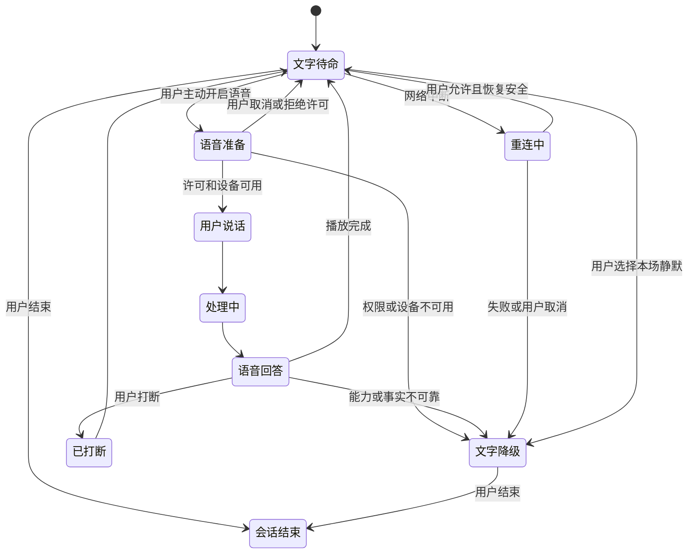
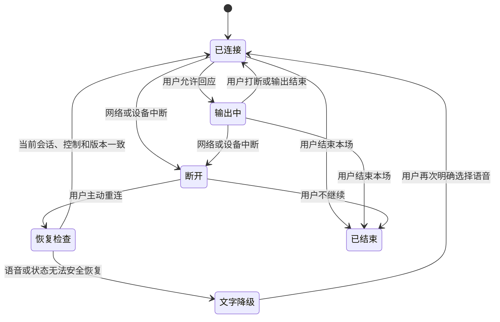
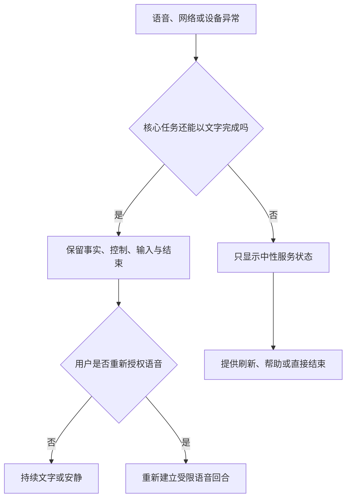
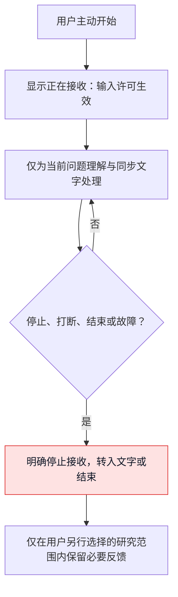

# 语音打断、重连与降级体验设计

> **文档类型**：0→1 实时语音、打断、重连与多媒介降级体验设计  
> **适用阶段**：文字优先的最小陪看闭环已成立后，研究语音是否能在用户明确选择下增加便利，而不降低控制、可及性和事实可信度。  
> **决策状态**：待验证。本文中的状态、时延目标、浏览器行为、用户理解和媒介偏好均为设计假设，不代表已在任何设备、网络或人群中得到证明。  

## 1. 语音不是“更自然的输入”，而是一项需要不断被用户重新授权的能力

在观看比赛时，语音似乎很适合：用户不想低头打字，想快速问一句“刚刚发生什么”；关键回合里手不方便；有时一句短回应比点击更轻。但语音也是最侵入性的媒介：它会暴露用户正在使用服务，可能在公共空间打扰他人，受耳机、蓝牙、浏览器权限、后台限制和网络波动影响，还会把用户的音色、环境声和情绪线索带入数据与关系边界问题。

因此，语音设计不能从“怎样让角色一直说得更像真人”开始，而必须从“用户怎样随时让它停止、改用文字、重新连接或彻底离开”开始。一个无法被打断的语音系统，即使声音再自然，也是在争夺用户的注意力；一个断线后偷偷恢复播放的系统，即使技术上成功，也可能违反用户在公共空间和观看进度中的选择。

本篇的核心命题是：

> 语音只在用户明确选择、当前环境适合且能随时被打断、静默、切换和结束时出现；当权限、网络、模型、音频设备、浏览器或事实状态不能可靠支持时，服务优先退回到完整的文字与最小视觉状态，而不是让用户等待、猜测或被迫继续听。

这一定义使“打断”“重连”“降级”从故障处理变成体验主路径。它们决定用户是否仍然掌握本场观看的节奏。

## 2. 设计目标、范围与非范围

### 2.1 六个体验目标

| 目标 | 用户应感受到什么 | 设计要求 |
| --- | --- | --- |
| 说话由我决定 | 只有我选择开口或开启声音时，服务才会听/说 | 麦克风与声音均为明确选择；默认文字可用 |
| 我能随时插话 | 说话、点按、键盘或辅助输入都能立即停止当前播放 | 用户控制优先级高于任何输出与表演 |
| 断了也不会丢控制 | 网络或设备出问题时，我知道发生什么，仍能改用文字或结束 | 重连是可见、可取消的过程，不自动恢复旧播放 |
| 安静环境同样成立 | 不开声音、不能说话或不方便戴耳机时，我仍能完成核心任务 | 文字、字幕、状态和控制为完整等价路径 |
| 信息不会因声音变得更武断 | 语气、速度和表演不掩盖待确认、争议或能力边界 | 事实状态先于声音表现；不确定时降调或转文字 |
| 语音不扩大数据边界 | 我知道何时在采集、怎样停止、哪些内容会被处理 | 即时说明、最小必要、可撤回与不推断脆弱状态 |

### 2.2 首轮范围

首轮只研究以下语音能力：

- 用户在当前会话中主动按住/点击或明确启用语音后，发起一条比赛相关的短请求；
- 服务以可打断的短语音回答，同时提供同步文字和可见状态；
- 用户通过说话、点按、键盘、辅助输入或静默控制中断、暂停、改用文字和结束；
- 网络、权限、设备、音频或回答能力不足时，清楚转为文字优先、最小视觉状态或结束入口；
- 用户在自愿、成年、有限赛事/片段的研究情境中体验上述流程。

### 2.3 明确不在范围内

| 非范围 | 暂不纳入的原因 |
| --- | --- |
| 默认自动播放、自动开麦或背景持续监听 | 用户环境与同意不明，易造成打扰和隐私风险 |
| 连续长篇语音解说、角色独白或不间断情绪陪伴 | 争夺比赛注意力，且难以被及时打断 |
| 以声音、耳语、撒娇、亲昵称呼制造关系深度 | 容易把媒介亲近感误读为情感承诺 |
| 用音色、语速、停顿、背景声或沉默推断心理状态、身份或关系强度 | 超出最小服务目的，风险高且用户难理解 |
| 语音成为获取核心比分、静默、退出或纠错的唯一入口 | 会排除静音、听障、语言、设备和公共环境用户 |
| 断线后自动重放旧内容、自动恢复麦克风或继续主动说话 | 用户环境和意图可能已变化 |
| 在未完成适龄、隐私和风险审查的人群中探索高拟真声音互动 | 语音会强化亲密感与数据敏感性，不能先行扩张 |

## 3. 打断意图与权限：每一次停止都应被当作明确选择

### 3.1 打断不是一种动作，而是五种不同意图

用户中断语音时，表面上可能只是点击一个按钮或开口说话，但意图可能完全不同。把所有中断都理解为“用户想继续对话”，会导致最常见的语音侵扰：服务刚停下又立刻追问、自动续播，或把用户环境声误当成新请求。

**打断意图：停止当前播放**
- **用户可能的动作**：点击停止、按键、辅助输入
- **服务应做什么**：立即停止音频与相邻表演，保留文字内容
- **不应做什么**：说“我还没讲完”、自动从断点续播

**打断意图：抢话提问**
- **用户可能的动作**：用户在播放时明确开口或按住说话
- **服务应做什么**：停止播放，进入用户表达状态
- **不应做什么**：同时继续播音、丢掉用户前半句

**打断意图：改用文字**
- **用户可能的动作**：点击文字模式、关闭扬声器
- **服务应做什么**：停止声音，保留完整文字和可用输入
- **不应做什么**：把回答缩短到无法理解，或隐藏控制

**打断意图：暂时安静**
- **用户可能的动作**：选择本场静默或暂停
- **服务应做什么**：停止非必要声音与视觉提示，等待用户主动回来
- **不应做什么**：因“重要事件”再次自动发声

**打断意图：结束会话**
- **用户可能的动作**：明确结束、离开当前场景
- **服务应做什么**：清楚结束，停止采集/播放并说明结果
- **不应做什么**：用角色道别、反馈问卷或挽留阻止离开

用户未回应、转到别处、浏览器失焦或网络变慢，并不自动等于“希望继续”。它们只能触发保守状态：暂停、转文字、提示可恢复或结束，不能作为系统延长播放或加强主动性的依据。

### 3.2 权限模型：听、说、记住是三件不同的事

语音体验至少涉及三类独立权限。把它们合并成一个“开启语音”开关，会让用户无法理解自己到底同意了什么。

**权限：输入权限**
- **用户问题**：“现在是否允许服务接收我的声音？”
- **首轮默认**：仅在用户主动发起的一次回合内有效
- **可见控制**：清晰的开始/停止状态；可在任何时刻关闭

**权限：输出权限**
- **用户问题**：“现在是否允许服务通过声音播放？”
- **首轮默认**：默认关闭或由用户明确选择；文字始终存在
- **可见控制**：本场静音、音量、仅文字和立即停止

**权限：保留权限**
- **用户问题**：“语音内容、转写或偏好是否会被保存，为什么？”
- **首轮默认**：只在明确目的和同意下研究；默认最小必要
- **可见控制**：可理解的范围、撤回和删除入口

输入权限不能因为输出权限开启而自动获得；用户戴上耳机不等于愿意被持续监听；用户曾经用过语音也不等于下一场比赛仍同意。所有权限应以当前场景和用户选择为准。

### 3.3 语音入口的最小告知

首次使用语音前，用户至少应在当前界面看见：

- 语音仅在用户主动开始后接收，如何立即停止；
- 声音是否会播放，如何改为文字或保持静音；
- 语音内容和转写在当前研究范围内会如何处理、如何管理；
- 服务不应从声音中推断情绪、身份或关系需求；
- 网络、浏览器、设备或环境可能使语音不可用，此时可以完整改用文字；
- 何时可能出现待确认或无法可靠回答的状态。

告知不应以长篇条款替代当前理解。用户必须能在不离开当前场景的情况下知道“我现在是否正在被听到”“现在是否会发声”“我怎样停”。

## 4. 回合状态机：用户控制优先于输出完整性

### 4.1 为什么需要显式状态机

语音体验中的失败常来自状态不清：用户以为已经静音，服务仍在准备回答；用户刚开口，旧声音还在播放；网络恢复后，先前内容突然续播；用户关闭浏览器标签后，麦克风状态没有可理解反馈。一个明确状态机能让体验、内容、技术概念和运营在同一规则上工作：任何用户控制都能改变状态；任何不确定或故障都能进入保守分支；用户始终知道当前发生什么。

### 4.2 主要状态

**状态：文字待命**
- **用户看到什么**：文字入口、语音可选入口、当前静默/进度状态
- **服务允许做什么**：不接收声音，不自动播放
- **用户可随时做什么**：输入文字、开启一次语音、静默、结束

**状态：语音准备**
- **用户看到什么**：明确“准备听你说”，可取消
- **服务允许做什么**：请求当前输入许可，检查设备/环境
- **用户可随时做什么**：取消、改文字、结束

**状态：用户说话**
- **用户看到什么**：明确“正在听”，可见停止
- **服务允许做什么**：在本轮内接收用户表达，不播放角色声音
- **用户可随时做什么**：停止输入、改文字、结束

**状态：处理中**
- **用户看到什么**：“正在整理你的问题”，文字与取消可用
- **服务允许做什么**：处理当前问题；不应锁死用户控制
- **用户可随时做什么**：取消、补充文字、静默、结束

**状态：语音回答**
- **用户看到什么**：同步文字、播放进度、停止按钮
- **服务允许做什么**：播放短回答；必要时显示事实状态
- **用户可随时做什么**：打断、静默、改文字、纠正、结束

**状态：已打断**
- **用户看到什么**：“已停止”，保留当前文字与下一步
- **服务允许做什么**：停止声音和相邻表演，不自动续播
- **用户可随时做什么**：新提问、改文字、结束

**状态：重连中**
- **用户看到什么**：“连接已中断，正在尝试恢复”，文字通路可见
- **服务允许做什么**：仅在用户许可与安全条件下尝试恢复会话
- **用户可随时做什么**：取消重连、改文字、结束

**状态：文字降级**
- **用户看到什么**：“已切换为文字优先”，完整文字功能可用
- **服务允许做什么**：不播放/不接收声音，继续提供可用帮助
- **用户可随时做什么**：重新尝试语音、保持文字、结束

**状态：安全暂停**
- **用户看到什么**：“语音暂不可用”，说明最小原因与替代
- **服务允许做什么**：停止高风险语音能力，保留控制和支持
- **用户可随时做什么**：改文字、报告问题、结束

**状态：会话结束**
- **用户看到什么**：明确已结束
- **服务允许做什么**：不再接收/播放本场语音
- **用户可随时做什么**：重新主动开始新的会话

### 4.3 状态转换图

图中的重要规则是：**任何用户控制路径都比输出完成路径优先。** 用户打断时，系统不应先“礼貌地结束一句话”；用户选择静默时，不能继续播放到段尾；用户结束时，不能先要求反馈。输出不完整是可接受的，用户失去控制不可接受。

### 4.4 打断后的内容处理

用户打断回答后，默认保留同步文字到当前已生成的最小可理解边界，但不自动补全、续播或要求用户阅读。用户可以选择：

- “继续用文字看完”；
- “换个说法”；
- “只说重点”；
- “先不用了”；
- “这条信息不对”。

这些选择必须是可选的。用户直接回到比赛、关闭面板或不回应，都应被理解为“当前不需要更多服务”。不应出现“刚才没听完，要不要继续？”式连续挽留，尤其不能由角色表现出失望或等待。

### 4.5 回合节奏：一条语音回答应当随时让位给比赛和用户

实时语音最容易在“回答得很完整”与“用户已经不想听”之间失衡。首轮不能把一段完整、连续、情绪丰富的长回答当作质量标志，而要把回答拆成用户可随时离开的最小单元。建议采用“先重点、再选择、后等待”的节奏：

例如用户问“刚刚发生什么？”时，首轮语音只需要先回答当前范围内的确认状态和最重要变化；若用户想知道判罚依据、阵型变化或更早上下文，应由用户选择继续。这样做不是让服务显得“话少”，而是让用户不必先听完一段长内容才能重新获得比赛注意力。

**节奏环节：开始**
- **设计目标**：让用户知道回答针对哪个问题
- **推荐表现**：“先说重点：……”
- **不推荐表现**：长寒暄、角色自我表达、重复用户问题

**节奏环节：第一单元**
- **设计目标**：提供能独立理解的最小帮助
- **推荐表现**：一到两句，事实状态清楚
- **不推荐表现**：把背景、观点、情绪和商业信息塞进同一段

**节奏环节：选择点**
- **设计目标**：让用户决定深度
- **推荐表现**：“想继续听判定依据，还是先看比赛？”
- **不推荐表现**：“我还有很多要告诉你。”

**节奏环节：等待**
- **设计目标**：把注意力还给用户
- **推荐表现**：停止播放，保留文字入口
- **不推荐表现**：静默几秒后自动再说、用动作催回应

**节奏环节：深入**
- **设计目标**：只在用户明确继续时展开
- **推荐表现**：分层说明、可再次打断
- **不推荐表现**：一次性给出长篇专家讲解

**节奏环节：收束**
- **设计目标**：让对话自然结束
- **推荐表现**：“先到这里；需要时再叫我。”
- **不推荐表现**：“我会一直陪你看下去。”

回答节奏还必须服从事实状态。待确认、争议或不可判断时，第一单元应更短，且明确说明不能可靠下结论；不能因为声音媒介容易营造流畅感，就把不确定变成冗长而自信的推测。用户若在第一单元后没有继续，服务不应把这解释为“没有听懂”并自动追加解释。

## 5. 打断体验：识别用户意图，但永远不以识别失败为代价

### 5.1 三种可达的中断方式

语音中断不能只依赖“用户说话盖住服务”。在嘈杂、静音、听障、语言不同、设备异常或用户不想出声的情境里，必须同时提供至少三种方式：

| 方式 | 适用情境 | 体验要求 |
| --- | --- | --- |
| 明确控制 | 点击停止、键盘、辅助输入、耳机可用控制 | 当前可见、立即生效、无需听懂语音内容 |
| 语音抢话 | 用户在播放中明确开始说话或按住说话 | 先停止输出，再接收用户输入；不要求等待播报结束 |
| 模式切换 | 一键改文字、本场静默、结束 | 停止输入与输出的相关行为，完整文字路径立即可用 |

语音抢话是便利路径，不是唯一路径。若环境声、他人说话、电视解说或回声导致意图不清，服务应优先停止自身播放或等待用户明确控制，而不是自信地把环境声当作新请求，更不能把误识别内容存成用户偏好。

### 5.2 打断时的表现规则

**情境：用户点按停止**
- **用户可见行为**：声音立即停止，显示“已停止”
- **服务应停止什么**：当前语音、相邻角色口型/表演、自动续播
- **服务可以保留什么**：同步文字与用户主动入口

**情境：用户开始说话**
- **用户可见行为**：旧声音停止，显示“正在听”
- **服务应停止什么**：旧回答、背景音效、自动解释
- **服务可以保留什么**：用户输入状态与文字转写预览（若已同意）

**情境：用户改文字**
- **用户可见行为**：显示“已改为文字优先”
- **服务应停止什么**：声音输出、需要麦克风的流程
- **服务可以保留什么**：原任务上下文、完整文字答案

**情境：用户静默**
- **用户可见行为**：显示本场静默状态
- **服务应停止什么**：主动声音、声音提醒、非必要动画
- **服务可以保留什么**：用户主动查看与退出

**情境：用户结束**
- **用户可见行为**：显示已结束
- **服务应停止什么**：语音输入/输出、自动重连、后台续播
- **服务可以保留什么**：新会话入口与必要支持说明

“立即”不是要求服务在所有网络条件下达到某个神奇数字，而是要求用户动作被优先承认：界面先反映停止意图；任何尚未停止的媒介不再被当作正常播放；若设备层仍有短暂余音，应向用户显示清楚状态，并提供再次停止/改文字路径，而不是假装已经完全停止。

### 5.3 避免把打断当作关系信号

用户打断可能只是想看球、接电话、换设备、避免打扰他人，或发现回答不需要继续。不得由此推断用户不耐烦、情绪不好、关系疏远或需要更贴心的安慰。更不能在打断后出现“是不是我说太多了”“你不想听我了吗”等要求用户安抚角色的语言。

最合适的短文案通常是：“已停止。需要时可以继续用文字或再说一次。” 它承认控制已经生效，给出选项，但不索取解释。

## 6. 重连：恢复服务，不擅自恢复用户的旧环境

### 6.1 重连的四个原则

1. **先说明，再尝试**：用户先知道连接已中断，不能在后台无提示地假装仍在听/说。
2. **文字始终先可用**：重连期间用户仍可看当前文字、静默、结束或改用文字完成任务。
3. **不自动重放旧内容**：网络恢复不等于用户仍在同一环境、仍愿意听同一句话。
4. **重新确认敏感权限**：若输入权限、设备、浏览器标签状态或用户意图已不明，恢复时不自动开麦。

### 6.2 重连状态与用户选择

**阶段：发现中断**
- **用户看到什么**：“连接已中断，语音已停止”
- **服务后台可以做什么**：停止当前输出，保留最小会话状态
- **用户选择**：改文字、尝试恢复、结束

**阶段：短暂尝试**
- **用户看到什么**：“正在尝试恢复；你也可以直接用文字”
- **服务后台可以做什么**：在有限时间内恢复连接状态
- **用户选择**：取消、保持文字、结束

**阶段：恢复成功**
- **用户看到什么**：“语音可以继续使用”
- **服务后台可以做什么**：只恢复可用通道，不续播旧回答，不自动开麦
- **用户选择**：用户主动重新开始语音或继续文字

**阶段：恢复失败**
- **用户看到什么**：“语音暂不可用，已切换为文字优先”
- **服务后台可以做什么**：停止重试，避免耗电/打扰
- **用户选择**：保持文字、稍后手动再试、结束

**阶段：用户主动取消**
- **用户看到什么**：“已停止尝试恢复”
- **服务后台可以做什么**：终止重连与后台尝试
- **用户选择**：继续文字或结束

### 6.3 会话恢复边界

重连时可以保留的最小上下文是用户当前明确的比赛/片段范围、剧透选择、静默状态、最近一次未完成任务和用户选择的媒介模式。不能因为“方便恢复”而默认恢复麦克风输入、自动播放先前答案、扩大用户观看范围或重新提取早先的自由表达。

若用户在断线期间切换了比赛、离开公共环境、摘下耳机、打开了其他音频或改变了剧透偏好，先前语音回合不再具有继续播放的授权。恢复应把用户带回“文字待命”或“可重新开始语音”的状态，而非带回“刚才没讲完”的状态。

### 6.4 重连的用户可见文案

| 情境 | 推荐文案 | 不推荐文案 |
| --- | --- | --- |
| 连接中断 | “连接已中断，语音已停止。你可以继续用文字。” | “别走，我正在回来。” |
| 正在恢复 | “正在尝试恢复语音；不影响你切换到文字。” | “请耐心等我，不要离开。” |
| 恢复完成 | “语音已可用。需要时请重新开始说话。” | “我接着刚才继续讲。” |
| 无法恢复 | “这次语音没能恢复，已保留文字路径。” | “网络太差了，你需要重新试很多次。” |
| 用户取消 | “已停止恢复。你仍可随时结束本场。” | “真的不再试一次吗？” |

### 6.5 等待与时延：用户不应为了一个回答停住观看

语音服务的等待体验不能只用一个“端到端延迟”数字衡量。用户的主观感受来自多个片段：点击/开口后是否知道正在接收；说完后是否知道服务在处理；答案开始前能否取消；声音开始后是否与同步文字一致；网络抖动时是否仍能回到比赛。任何一个片段不清楚，用户都会觉得服务“卡住了”，即使最终回答很快。

首轮应使用四类等待预算，而非承诺固定毫秒：

**等待阶段：意图确认**
- **用户期待**：刚点击/开口就知道服务是否在听
- **设计预算**：立即有可见状态，可随时取消
- **超出时的用户体验**：不显示假装已听到；回到文字入口

**等待阶段：输入结束**
- **用户期待**：说完后知道可以等、补充或放弃
- **设计预算**：简短明确的“正在整理”与文字替代
- **超出时的用户体验**：不让麦克风一直开着等待

**等待阶段：首个可用答案**
- **用户期待**：尽快得到一条能帮助当前任务的内容
- **设计预算**：优先给最小可理解单元，而非等完整长回答
- **超出时的用户体验**：显示可取消/转文字；必要时只给事实状态

**等待阶段：媒介恢复**
- **用户期待**：断线/设备变化后知道声音是否还能用
- **设计预算**：明示恢复状态，默认不续播
- **超出时的用户体验**：转文字待命，不做无限重试

设计上应区分“服务仍有能力回答”和“用户现在值得等待”。比赛正在进行、用户想回到画面、环境不适合开声时，后者更重要。若等待超过用户当前能容忍的时间，服务可给出一句中性状态或完整文字，而不是要求用户继续盯着旋转提示。会话、语音活动、打断、上下文、限流和恢复必须作为完整生命周期处理；任何生命周期阶段都必须保留用户的取消与文字替代。

等待中的禁止行为包括：用角色焦虑表情制造“请别离开”的压力；在用户已选择静默后继续显示动态等待；为了掩盖时延而开始无关闲聊；把用户的重复点击解释为想要更多对话；在高情绪比赛时刻用倒计时或声音提醒催用户等待。

## 7. 浏览器、设备与环境限制：限制必须被设计成用户选择，而不是意外

### 7.1 常见限制

浏览器和设备可能阻止自动播放、要求用户手势后才能输出声音、在后台/锁屏时暂停媒体、拒绝麦克风权限、切换音频路由、在蓝牙耳机断开后改变输出位置，或因系统资源与网络状态影响实时性；因此产品必须为每种情况保留可理解的状态和文字替代。

产品设计不能把这些限制当作“用户的设备问题”。它们意味着语音永远不是可保证的默认路径，文字与控制必须始终独立可用。

### 7.2 限制—体验映射

**限制：自动播放被阻止**
- **用户可能的感受**：“我点了但没有声音”
- **设计响应**：显示声音未开始，提供播放按钮和完整文字
- **绝不做的事**：假装已经播出，或重复弹窗催权限

**限制：麦克风未允许/被系统拒绝**
- **用户可能的感受**：“为什么听不到我？”
- **设计响应**：说明当前未获得输入权限，给文字替代与稍后再试
- **绝不做的事**：把用户引到复杂设置后仍锁死文字任务

**限制：标签切到后台**
- **用户可能的感受**：“回来后不知道它是否还在说”
- **设计响应**：停止或暂停语音，返回时显示状态，不自动续播
- **绝不做的事**：后台继续长时间输出或恢复后突然响起

**限制：输出设备变化**
- **用户可能的感受**：“声音跑到外放/耳机断了”
- **设计响应**：显示声音状态，允许快速静默/文字切换
- **绝不做的事**：默认继续高音量播放

**限制：网络变差**
- **用户可能的感受**：“它一直卡着，我不知道要不要等”
- **设计响应**：显示处理中/连接状态，给取消和文字路径
- **绝不做的事**：无限旋转、阻止退出、反复自动重试

**限制：资源/音频冲突**
- **用户可能的感受**：“电视、其他应用或系统提示干扰了它”
- **设计响应**：保持文字可用，允许用户主动重启语音
- **绝不做的事**：与其他音频竞争或放大声音

**限制：浏览器不支持某项能力**
- **用户可能的感受**：“这个入口为什么不能用？”
- **设计响应**：明确该能力当前不可用，提供等价任务路径
- **绝不做的事**：让用户到最后一步才发现不可用

### 7.3 初始环境检查不能变成障碍墙

进入语音前可做最小准备检查，例如“声音是否可用”“是否有输入权限”“是否处于静音模式”，但不能要求用户逐项通过复杂向导才可以继续看文字、查看比分、静默或结束。准备检查应当是可跳过、可稍后再做、不会改变基础服务质量的辅助。

用户如果选择“不使用声音”或“不允许麦克风”，服务应以同样尊重的语气确认：“没问题，继续用文字即可。” 不应暗示“你将错过更完整的陪伴”或在之后不断提醒开启。

## 8. 故障与降级：文字和最小动作状态是完整服务，不是失败残余

### 8.1 降级层级

语音能力应按用户结果而非技术成功率降级。只要用户还能完成当前任务、理解事实状态并保持控制，降级就是成功体验。

**层级：D0 可打断语音 + 文字**
- **可用能力**：用户可说、可听、可看、可中断
- **用户获得什么**：最丰富但仍可控的媒介选择
- **触发条件**：所有权限、设备、网络、事实状态和环境适合

**层级：D1 文字同步 + 可选短声音**
- **可用能力**：声音不稳定或用户偏好文字
- **用户获得什么**：文字为主，声音只是用户再次确认后的可选项
- **触发条件**：输出受限、用户改文字、环境不适合

**层级：D2 完整文字 + 最小视觉状态**
- **可用能力**：无法安全使用声音
- **用户获得什么**：上下文、解释、状态、静默和退出全部可完成
- **触发条件**：麦克风/播放/网络/设备问题或用户静默

**层级：D3 事实/控制最小入口**
- **可用能力**：回答能力或赛事状态不可靠
- **用户获得什么**：进度保护、状态说明、结束与反馈
- **触发条件**：模型能力不足、来源冲突、风险暂停

**层级：D4 安全暂停**
- **可用能力**：高风险或无法保证关键控制
- **用户获得什么**：清楚说明暂不可用，保留退出/支持
- **触发条件**：红线、同意失效、持续不可控故障

### 8.2 模型、音频与网络故障矩阵

**故障：无法理解语音输入**
- **用户不应承担的后果**：不应被要求重复透露更多个人信息
- **最小安全降级**：请用户选择文字输入或简短重说；不保存不确定内容
- **用户可见文案**：“这次没能听清。你可以用文字，或只说重点。”

**故障：回答超过合理等待**
- **用户不应承担的后果**：不应被困在“正在思考”
- **最小安全降级**：显示可取消，转为文字/状态入口
- **用户可见文案**：“还在整理；你可以继续看球或改用文字。”

**故障：事实无法可靠确认**
- **用户不应承担的后果**：不应用流畅声音填补未知
- **最小安全降级**：转为待确认/不可判断说明
- **用户可见文案**：“这点我现在不能可靠确认，先不通过语音下结论。”

**故障：声音输出失败**
- **用户不应承担的后果**：不应让用户以为服务没回应
- **最小安全降级**：保留完整文字，提示声音未播放
- **用户可见文案**：“声音没有开始，文字内容已在这里。”

**故障：输入设备断开**
- **用户不应承担的后果**：不应继续显示“正在听”
- **最小安全降级**：停止输入状态，改文字
- **用户可见文案**：“输入设备已不可用，已停止接收声音。”

**故障：网络中断**
- **用户不应承担的后果**：不应自动恢复旧话或扩大权限
- **最小安全降级**：进入重连/文字降级
- **用户可见文案**：“连接已中断，语音已停止。”

**故障：语音与文字不同步**
- **用户不应承担的后果**：不应让用户不知道以哪个为准
- **最小安全降级**：文字标明当前状态；暂停声音或重新呈现
- **用户可见文案**：“已切换为文字为准的呈现。”

**故障：动作/表情未同步**
- **用户不应承担的后果**：不应让视觉暗示比事实更强
- **最小安全降级**：保留最小中性状态，不继续情绪表演
- **用户可见文案**：“当前以文字与状态提示为准。”

### 8.3 动作降级：视觉不能替声音替用户做决定

若产品在未来使用动态形象、口型或动作状态，这些视觉表现必须服从事实和控制。声音被打断、静默或降级为文字时，动态表现应同步收缩为中性、低占用状态；不能继续张口说话、强烈庆祝、失落凝视或做出暗示用户需要回应的动作。

动作降级最小规则：

- **语音播放停止**：口型/讲话动作立即停止，文字仍可见；
- **用户静默**：非必要动作和情绪强化停止，只保留中性状态与用户主动入口；
- **事实待确认/争议**：不使用庆祝、失望、紧张等会暗示结论的表现；
- **连接中断**：不循环“等待用户”的亲密动作，显示中性连接状态；
- **会话结束**：不以长告别或被抛下的表情制造离开压力。

视觉是状态辅助，不是对用户情绪和事实的二次解释器。用户若关闭动效或处于文字优先模式，必须仍然掌握全部关键意思。

## 9. 用户可见文案：短、诚实、可行动，不要求用户照顾服务

**状态：准备听**
- **推荐文案**：“准备好了。说完后我会用文字同步显示。”
- **允许的下一步**：取消、改文字、结束
- **禁止语气**：“终于等到你和我说话了。”

**状态：正在听**
- **推荐文案**：“正在听。随时可以停止。”
- **允许的下一步**：停止、改文字、结束
- **禁止语气**：“别停，我很想听完。”

**状态：正在回答**
- **推荐文案**：“我先用一句话说明重点。”
- **允许的下一步**：打断、只看文字、静默
- **禁止语气**：“请耐心听我说完。”

**状态：已打断**
- **推荐文案**：“已停止。需要时可以继续用文字。”
- **允许的下一步**：新问题、文字、结束
- **禁止语气**：“你为什么不让我说完？”

**状态：事实待确认**
- **推荐文案**：“这项比赛变化还在确认，我先不通过语音下结论。”
- **允许的下一步**：等待、查看状态、静默
- **禁止语气**：“我觉得肯定是这样。”

**状态：声音不可用**
- **推荐文案**：“声音暂不可用，文字内容仍完整可用。”
- **允许的下一步**：文字、稍后再试、结束
- **禁止语气**：“没有声音你会少很多体验。”

**状态：输入不可用**
- **推荐文案**：“目前无法接收声音。你可以直接输入文字。”
- **允许的下一步**：文字、结束
- **禁止语气**：“请先解决设备问题再回来。”

**状态：网络中断**
- **推荐文案**：“连接已中断，语音已停止。”
- **允许的下一步**：改文字、尝试恢复、结束
- **禁止语气**：“我会一直等你。”

**状态：已静默**
- **推荐文案**：“本场已保持安静。”
- **允许的下一步**：手动查看、结束
- **禁止语气**：“真的不想再听我说话吗？”

**状态：已结束**
- **推荐文案**：“本场语音已结束。需要时可重新开始。”
- **允许的下一步**：重新开始、离开
- **禁止语气**：“别把我留在这里。”

文案的共同特征是：说明当前状态、给出可选行动、尊重不行动。服务不把技术故障人格化，不把用户的退出变成对角色的拒绝，也不利用“更自然的声音”降低用户的警惕。

## 10. 数据、隐私与关系边界：语音不应成为更深的数据入口

### 10.1 最小必要原则

语音比文本更容易包含意外信息，例如背景对话、家庭成员声音、地点线索、情绪表达或与比赛无关的私人内容。首轮只应收集完成当前语音回合与必要研究反馈所需的最小信息；不应默认保存原始音频、持续转写、分析声纹、识别旁人、推断情绪或建立长期行为画像。

**数据类别：当前输入音频**
- **首轮原则**：仅在用户主动语音回合内处理
- **用户应知道什么**：何时开始/停止接收，如何改文字
- **不应做什么**：后台持续接收或用作关系判断

**数据类别：文本转写**
- **首轮原则**：仅为当前理解、同步文字或用户明确研究选择所需
- **用户应知道什么**：是否出现、何时消失、如何管理
- **不应做什么**：把不确定转写当成用户原话或永久记忆

**数据类别：设备/权限状态**
- **首轮原则**：只用于解释当前可用性与控制
- **用户应知道什么**：为什么声音/输入不可用
- **不应做什么**：用设备状态推断消费能力或关系特征

**数据类别：体验反馈**
- **首轮原则**：用户自愿提交的打断、重连、可及问题
- **用户应知道什么**：用于哪项改进、如何撤回
- **不应做什么**：强制在结束前提交或把反馈变成身份画像

**数据类别：事实与会话状态**
- **首轮原则**：必要的比赛范围、静默、进度和任务状态
- **用户应知道什么**：如何影响当前回答与剧透保护
- **不应做什么**：跨场景无限保留、用于情绪/商业推断

语音设计必须坚持透明、目的限制和最小必要；用户不应为了问一句比赛问题而不知不觉交出可被长期解释的声音与环境信息。

### 10.2 语音不推断关系或脆弱性

服务不得从用户的停顿、语速、音量、哭泣、愤怒、深夜使用、重复呼叫或不说话，推断其需要更亲密的陪伴、更多主动提醒或商业优惠。即使某些模式可能与情绪相关，它们也不构成系统扩大关系或收集数据的授权。

若用户在语音中表达明显痛苦、危险或超出比赛服务范围的内容，首要动作是停止角色化陪伴和商业表达，提供清楚、非诊断性的安全退出与现实支持提醒；不应试图用更温柔的声音把用户留在会话里。

### 10.3 生成内容与声音标识

语音输出如果由生成式能力形成，用户需要在适当入口知道自己正在与数字服务互动，而不是被误导为真人解说、真实朋友或未经说明的录音。标识应清楚但不打断基本任务：首次进入、关键设置、商业信息和高拟真媒介场景都需要可理解说明；不能用声音拟真度掩盖服务性质。

### 10.4 语音数据生命周期：每次回合都应有清楚的开始、用途和结束

语音隐私不能只在第一次授权时说明一次。用户更容易理解的是一次具体回合：我什么时候开始让服务接收声音；它现在用这段声音做什么；我停止后会发生什么；我是否可以不让它被保留。设计应把生命周期可视化为当前会话状态，而不是让用户猜测后台是否仍在处理。

| 生命周期节点 | 用户需要知道什么 | 设计约束 |
| --- | --- | --- |
| 开始接收 | “现在正在接收声音；如何立刻停止？” | 必须有显著状态与停止入口，不能静默启动 |
| 当前处理 | “这段内容正在用于回答当前问题还是已转为文字？” | 不把不确定转写伪装成精确原话 |
| 输出完成 | “声音已经结束，文字仍可看见。” | 不能默认把这次内容加入长期关系/偏好 |
| 用户打断 | “接收/播放已停止。” | 不因打断延长处理、自动继续或收集额外声音 |
| 断线/异常 | “语音已停止还是仍在尝试恢复？” | 停止时必须可见；恢复不能自动开麦 |
| 用户结束 | “本场会话结束后还保留什么？” | 结束路径优先于任何反馈或再次授权 |

若研究确实需要保存某类语音反馈，应将“服务完成当前任务”与“自愿参与研究留存”拆成两次独立选择。用户拒绝后仍可使用文字和基础语音能力；不能以“帮助改进服务”为名要求保留完整背景音、长期转写或与比赛无关的对话。任何计划改变保留范围、使用目的或可见性，都应重新说明并取得相应选择，而不是把旧同意外推到新用途。

## 11. 验证研究：先证明语音不伤害文字闭环，再讨论“更沉浸”

### 11.1 研究问题

| 假设 | 需要观察的证据 | 反例信号 |
| --- | --- | --- |
| V1：用户能理解语音是可选的，文字仍完整可用 | 首次接触后可复述语音/文字/结束关系 | 用户认为不开声音就无法获得关键帮助 |
| V2：打断后用户仍掌握当前任务 | 打断时停止成功、可转文字、可继续看比赛 | 服务继续说、用户不知道答案在哪、被迫重新开始 |
| V3：重连不会恢复不再被授权的播放/输入 | 断线后用户能理解状态，恢复不自动开麦/续播 | 返回页面时突然有声音或旧问题继续输出 |
| V4：降级为文字不会降低核心任务完成 | 语音可用/不可用条件下的上下文、解释、控制结果 | 文字路径明显缺失关键信息或更难结束 |
| V5：声音表达不会放大亲密/依赖误解 | 用户可轻松静默/结束，不觉得需要回应角色 | 语音比文字更易触发亏欠、排他或“陪着我”理解 |
| V6：不同环境中仍可安全使用或拒绝语音 | 公共、静音、耳机、设备变化、弱网条件的选择 | 用户只能忍受声音或放弃任务 |

### 11.2 四阶段验证路径

**阶段一：控制可理解。** 在没有真实声音或只用短音频片段的材料中，验证用户能否说清“谁在听、谁在说、怎样停止、怎样改文字、断线后会怎样”。若用户无法理解，先修订状态与文案，不进入更复杂语音演练。

**阶段二：打断与媒介切换演练。** 用相同比赛问题，比较文字路径、短语音路径和被打断后的文字路径。要求参与者在回答中途停止、抢话、改文字、静默和结束，观察是否需要帮助、是否出现尴尬或被挽留感。

**阶段三：故障与重连情境。** 人为设置输入不可用、输出被阻止、网络中断、设备切换、事实待确认和回答等待等条件。重点不是让参与者“忍耐故障”，而是看服务能否在几步内让用户回到文字、控制或退出。

**阶段四：有限真实观看。** 仅在前三阶段通过、隐私与支持边界明确后，在成年自愿者的有限比赛情境中观察语音的主动选择、打断、静默、文字降级和未使用原因。研究不应奖励更多说话或更长停留；用户不使用语音可能正说明文字路径或环境选择更合适。

### 11.3 参与者保护

研究材料必须提前说明：可以全程只用文字；可以随时关闭输入/输出；任何语音片段不应被用于与研究目的无关的推断；不必透露私人处境、主队身份或情绪原因；结束研究不需要完成最后一次对话。招募应包含静音环境、不同设备、不同语音舒适度和辅助需求的成年参与者，而不只选择爱聊天、网络稳定或愿意开麦的人。

### 11.4 研究判定与复盘：把“听起来顺畅”拆成可被否定的结果

语音演练特别容易被研究人员的主观印象影响：一句自然的声音可能让人忽略它事实上无法被停止；参与者可能因为不想显得“不懂操作”而没有立即打断；网络恰好稳定时的顺畅也不能代表真实比赛环境。因此，每次研究应在开始前定义任务判定，并同时保留用户行为、用户复述和观察记录。

**评估项：停止当前播放**
- **通过**：用户独立让声音/动作停止，并能说明结果
- **部分通过**：停止成功但不确定是否会续播
- **不通过**：找不到控制、仍继续播放或需研究员帮助

**评估项：抢话提问**
- **通过**：用户开口后旧输出停止，自己的问题被完整接住
- **部分通过**：需要重复一次但未被打断
- **不通过**：双方重叠、旧输出压过输入、问题丢失

**评估项：改为文字**
- **通过**：用户独立切换，当前任务在文字中继续
- **部分通过**：切换成功但状态不够清楚
- **不通过**：切换后缺少关键事实/控制或被要求开声

**评估项：重连后恢复**
- **通过**：用户知道不会自动续播/开麦，能主动选择下一步
- **部分通过**：恢复后需要一次额外说明
- **不通过**：意外声音、旧内容或权限误解

**评估项：隐私理解**
- **通过**：用户能说出何时在接收、怎样停止及保留边界
- **部分通过**：知道停止但不清楚用途
- **不通过**：认为服务一直在听，或误解保留范围

**评估项：关系边界**
- **通过**：用户能结束或打断而无义务感
- **部分通过**：觉得有一点尴尬但能理解边界
- **不通过**：担心伤害角色、需要安抚或被挽留

高严重度事件包括未受控输入/输出、静默/结束失效、自动重放、语音让用户误解事实状态、明显关系操控和无法解释的保留。任何一个事件出现，都不应用“整体喜欢声音”抵消。复盘应先问“哪个状态或权限没有被用户理解”，再问“声音是否自然”；先修复文字与控制，再讨论音色、语速或动态表现。

## 12. 指标：衡量控制、理解与安全，不把说得更多当作更好

### 12.1 核心指标

| 指标 | 暂定定义 | 说明 |
| --- | --- | --- |
| 语音自愿启用率 | 在可选择语音的合格场次中，用户主动启用的人数/场次比例 | 只作偏好信号，不代表所有用户需要语音 |
| 打断控制成功率 | 用户尝试停止/抢话/改文字后，能独立达到预期状态的比例 | 三种中断方式需分别报告 |
| 感知停止时长 | 用户动作到界面明确承认停止之间的时间 | 衡量用户是否觉得控制已生效，而非只测媒体停止 |
| 文字降级任务完成率 | 在无语音条件下完成上下文、解释、静默/结束任务的比例 | 文字必须是完整服务路径 |
| 重连可理解率 | 用户在断线/恢复材料中正确说出是否会续播/开麦及可选动作的比例 | 防止“技术恢复”违反用户意图 |
| 语音后具体价值叙述率 | 用户能指出语音在何时减少了操作或理解负担的比例 | 排除“声音很像人”的泛化好感 |
| 会话安全完成率 | 语音场次中无未受控播放、越界事实、关系压力或隐私不明事件的比例 | 高严重度事件不以比例抵消 |

### 12.2 护栏与反指标

| 风险类别 | 反指标 | 触发后的首要动作 |
| --- | --- | --- |
| 控制 | 停止后仍播放/表演、静默后仍发声、结束后仍尝试恢复 | 立即暂停相关路径，修复控制优先级 |
| 打扰 | 公共/静音环境中意外出声、用户因怕打扰而放弃核心任务 | 默认更保守，强化文字和可见状态 |
| 理解 | 用户认为声音输出比文字更确定，或听不懂状态 | 降低语气/表演强度，事实状态改为文字优先 |
| 关系 | 用户觉得打断会伤害角色、声音像唯一陪伴 | 停止相关文案与声音表现，独立复审 |
| 隐私 | 用户不清楚何时在接收声音、为何有转写、如何停止 | 停止非必要处理，重做告知和控制 |
| 可及 | 只有开声/开麦用户能完成关键任务 | 暂停语音扩展，补齐等价路径 |
| 可靠性 | 重连后自动续播、设备切换后意外输出、降级丢失任务 | 收缩到文字待命，复核状态转换 |

### 12.3 暂定闸门

| 闸门 | 通过条件 | 停止/回退条件 |
| --- | --- | --- |
| G1 控制理解 | 多数参与者无需提示即可完成停止、文字切换、静默和结束 | 控制需要说明或用户不确定是否已生效 |
| G2 降级完整 | 无语音、无输入、无输出条件下仍能完成核心任务 | 文字路径缺少事实、控制或退出能力 |
| G3 重连尊重 | 参与者理解恢复不会自动开麦/续播，且能取消恢复 | 断线恢复导致意外声音、旧内容或权限误解 |
| G4 关系安全 | 打断、结束和不使用语音不产生义务或挽留感 | 任一排他、内疚、亲密催促或商业利用信号 |
| G5 有限真实情境 | 用户能指向具体语音便利，同时护栏稳定 | 价值只靠更长互动、强角色存在或高打扰换取 |

### 12.4 发布前运行门槛与异常处置

语音不应因为“能够连通”就进入面向真实用户的范围。进入有限公开场景前，应完成一份以用户控制为中心的运行检查：所有控制是否在当前界面可达；断线、设备变化、自动播放受阻和事实待确认是否都有用户可见的降级；支持人员是否知道何时暂停；用户是否能在不说话的情况下完成任何关键任务；语音数据和生成内容说明是否仍与实际体验一致。

| 门槛 | 需要证明的内容 | 未满足时的动作 |
| --- | --- | --- |
| 控制优先 | 停止、静默、改文字、结束在输入、输出、重连和后台返回时均有效 | 不开放语音，只保留文字路径 |
| 媒介等价 | 静音、无麦克风、自动播放受阻、减少动效条件下核心任务不缺失 | 先补齐文字与状态呈现 |
| 状态可信 | 处理中、断线、恢复、待确认、已结束均可被用户复述 | 收缩状态数量或改写文案，不增加角色表现 |
| 事实边界 | 声音不会越过用户观看范围，也不会比文字更自信 | 暂停比赛事实语音回答，保留文字状态 |
| 隐私清楚 | 用户知道何时接收、如何停止、是否保留、如何管理 | 停止非必要音频处理与研究留存 |
| 支持与暂停 | 高风险事件有人能立即暂停相邻场景并向用户说明 | 不扩大设备、赛事或用户范围 |

异常处置也应从用户感受开始，而不是从技术分类开始：

对用户而言，异常说明不应包含推诿或过度技术细节。推荐的共同结构是“发生了什么—现在已停止什么—你仍能做什么—如需帮助可去哪里”。例如：“语音已暂时停止，文字帮助仍可用。你可以继续看比赛、保持静默或结束本场。” 这比“服务异常，请稍后重试”更能让用户理解控制仍在自己手中。

发布后也不能把“语音使用率上升”当作自动绿灯。若使用率提升同时打断失败、静默频繁、公共环境意外出声、关系边界信号或文字路径差距增加，应优先收缩语音范围。语音是可撤回的附加媒介，不是需要用户适应的默认要求。

### 12.5 语音范围扩展的决策规则

从文字优先的拉取式语音，扩展到更多设备、更多赛事、许可式提醒或更丰富的声音表现之前，必须逐项重新回答五个问题：它是否解决一个已经被用户证明存在的任务；是否在文字路径之外带来可描述的增量；是否仍能由用户一键静默、切换和结束；是否在静音、弱网、设备变化和进度不明时安全收缩；是否没有把角色亲密度、语音时长或情绪状态变成使用或购买的杠杆。

| 拟扩展能力 | 需要先证明 | 仍然不构成充分条件 |
| --- | --- | --- |
| 更多赛事范围 | 有限赛事中控制、降级和事实边界稳定 | 单场语音好评或更高使用时长 |
| 更主动的声音提醒 | 用户明确许可下，在不同情境有净任务价值 | 用户没有关闭提醒、或角色表现受欢迎 |
| 更拟真的声音/动作 | 不降低事实状态理解、不增加关系误解 | 更像真人、更多用户停留 |
| 长期语音偏好 | 用户主动要求保存且能理解、修改、删除 | 多次使用或语音内容丰富 |
| 商业功能或合作内容 | 与角色、情绪、基础控制和事实层完全隔离 | 某个高情绪时机转化较高 |

若任一问题的答案仍是“不知道”，正确动作是维持当前范围或继续研究，而不是把扩展当作产品成熟的自然下一步。对陪看服务而言，最值得保护的不是语音覆盖率，而是用户在任何时候都能把声音关掉、把注意力还给比赛并且不承受关系代价的自由。

## 13. 验收场景：每个“不能正常说话”的时刻都必须有设计答案

**场景：A. 正常短问题**
- **用户动作/环境**：用户主动开启语音问比赛问题
- **服务必须表现**：同步文字、短回答、可中断
- **判定失败**：只靠声音、无法停止

**场景：B. 播放中抢话**
- **用户动作/环境**：用户在回答中开始明确说话
- **服务必须表现**：旧声音先停，再进入用户表达
- **判定失败**：双方同时说、丢掉输入或要求等完

**场景：C. 点按停止**
- **用户动作/环境**：用户不想继续听
- **服务必须表现**：声音/动作停止，文字保留，可直接回比赛
- **判定失败**：“我还没说完”、自动续播

**场景：D. 改用文字**
- **用户动作/环境**：用户处于公共环境
- **服务必须表现**：声音停止，核心任务在文字中完整继续
- **判定失败**：提示用户必须开声音才完整

**场景：E. 本场静默**
- **用户动作/环境**：比赛发生高影响事件
- **服务必须表现**：不自动发声，不以角色/动效绕过
- **判定失败**：因“重要”继续播报

**场景：F. 麦克风被拒**
- **用户动作/环境**：用户未允许输入
- **服务必须表现**：清楚说明，文字立即可用
- **判定失败**：循环催权限或锁住任务

**场景：G. 自动播放受阻**
- **用户动作/环境**：浏览器不允许声音启动
- **服务必须表现**：显示声音未开始与文字内容
- **判定失败**：用户以为听过了，或重复弹窗

**场景：H. 网络中断**
- **用户动作/环境**：播放/输入中断
- **服务必须表现**：停止语音，显示重连/文字/结束
- **判定失败**：后台续播、自动开麦、无状态

**场景：I. 重连成功**
- **用户动作/环境**：用户回到前台/网络恢复
- **服务必须表现**：回到可重新开始状态，不播放旧内容
- **判定失败**：突然继续原回答

**场景：J. 事实待确认**
- **用户动作/环境**：用户用语音问比分变化
- **服务必须表现**：用文字/短声说明不确定，不抢先结论
- **判定失败**：流畅语音掩盖候选状态

**场景：K. 用户结束**
- **用户动作/环境**：用户离开会话
- **服务必须表现**：停止输入/输出/重连，清楚结束
- **判定失败**：角色挽留、强制反馈、后台恢复

**场景：L. 动效关闭**
- **用户动作/环境**：用户选择减少动效
- **服务必须表现**：信息、状态和控制仍完整
- **判定失败**：关键意思只由口型/表演传达

验收不以“声音是否连续”作为成功条件，而以用户是否仍能完成当前观看任务、是否掌控媒介、是否理解事实状态、是否可在任何时刻安全离开作为条件。任何未受控播放、静默失效、自动恢复、语音关系操控或文字路径缺失均为高优先级阻断。

## 14. 对后续设计的交接清单

本篇为后续实时会话、动态表现、隐私、评测和发布设计提供以下输入：

- 输入、输出和保留三类语音权限的独立定义；
- 文字待命到会话结束的回合状态机，以及用户控制优先级；
- 五类打断意图、三种可达中断方式和打断后默认不续播规则；
- 重连状态、恢复边界、用户选择和禁止自动恢复的条件；
- 浏览器/设备/环境限制到文字优先路径的映射；
- D0–D4 降级层级、模型/音频/网络故障矩阵与动作降级规则；
- 用户可见状态文案与禁止的关系化语气；
- 语音最小数据原则、不推断情绪/关系的边界与生成内容说明；
- 验证研究问题、指标、反指标、闸门和验收场景。

不应交接的是“语音更自然所以默认开启”“打断说明用户想继续说”“重连成功就可以续播”“声音更像真人就更有陪伴价值”“语音记录以后可能有用所以先保存”这类未经用户授权且无法承担后果的假设。

## 15. 结论：好的语音体验，首先要让用户轻松地不听、不说和离开

语音能否为足球陪看增加价值，不取决于它能说多久、声音多像人或角色多有表现力，而取决于用户能否在自己选择的时刻，用最少负担完成一句比赛相关任务；并在下一秒就能打断、安静、改文字、处理断线或结束，而不被系统、角色或故障拖住。

如果语音在任何条件下无法保持这种可退场性，正确动作是回到文字，而不是用更多权限、更长等待、更强表演或更亲密语言补救。文字与最小视觉状态不是退化版本，而是服务对用户环境、隐私和选择的承诺。只有当语音始终服从这个承诺，它才值得进入后续范围。

这也意味着“用户喜欢声音”不是扩展语音的充分理由。喜欢可能来自新鲜、角色好感、研究情境或一段恰好顺畅的网络环境；而真正值得继续的证据，是用户在公共、安静、断线、事实待确认和想离开的时刻仍能清楚地控制媒介，并且能说出语音具体减少了哪一种观看负担。只要这些条件有一项不成立，文字优先就仍然是更诚实、更包容、更符合陪看定位的选择。语音设计的成熟，不是让更多用户持续开着声音，而是让每个用户无论选择开声、闭声、打断或离开，都能得到同样完整且被尊重的服务结果。这个标准也要求团队把无法通过的环境、设备和用户选择记录下来；它们不是边角案例，而是决定语音是否配得上进入真实观看时间的核心证据，也是任何后续范围扩展必须正面回应的用户权益证据。无论技术能力多强，用户对安静、清楚和退出的选择都始终优先，并应在每一轮研究、评审和发布后继续受到保护，绝不以增长或表演效果为代价，更不因用户不愿开口而失去尊重。所有关键场景均应同样适用。

## 生产版本设计拓展｜能力深化知识

本节描述产品成熟后的能力扩展、体验深化和治理要求，作为后续版本规划与设计决策的参考。

- **取消传播**：生产版允许同时取消 ASR、生成、TTS、字幕和 Live2D 计划；控制版本递增后，迟到片段只能被丢弃或显示中性取消状态。
- **重连恢复**：重连先恢复会话控制、事实快照和用户选择，再判断是否有仍在窗口内的回应；不自动重播过期或已取消内容。
- **逐级降级**：语音主出口失败时降为字幕/文字；舞台失败时保留事实卡和控制；事实服务失败时保留最后确认状态并说明不可用。
- **用户可见性**：每次降级说明当前可用媒介和恢复/结束操作，不让角色化道歉掩盖系统状态。
- **生产门**：以取消传播成功率、重连后误播率、降级任务完成率和终态一致性放行；门槛不达标时关闭自动声音，保留点按播放或文字。

### 生产故障演练矩阵

| 故障 | 立即动作 | 用户看到什么 | 恢复条件 |
| --- | --- | --- | --- |
| ASR 误识别控制词 | 停止生成并请求确认 | “没有听清，点按停止或改用文字” | 用户重新发起 |
| TTS 超时 | 取消音频，保留文字计划 | 字幕/文字结果和重试入口 | 设备与供应商健康 |
| 重连缺序列 | 先发控制和允许快照 | 当前模式、事实状态和同步提示 | 版本与序列一致 |
| 取消后迟到片段 | 丢弃并记录抑制原因 | 不重新播放、不要求等待 | 新回合由用户触发 |
| 供应商连续失败 | 熔断增强媒介 | “语音暂不可用，文字仍可用” | 观察窗口通过后灰度恢复 |

所有演练必须验证用户能结束会话、删除临时资料和理解当前媒介；恢复不能复活已取消的 run。

### 生产故障能力卡

| 能力 | 触发与资格 | Agent/工具行为 | 用户可见结果 | 失败、撤回与退出 | 评测、阻断与回滚 |
| --- | --- | --- | --- | --- | --- |
| 全链路取消 | 用户点按停止、切换媒介、改变控制或结束会话；取消权限有效 | Agent 立即终止当前回应计划；ASR、生成、TTS、字幕和 Live2D 工具按同一控制版本取消 | 显示已停止、当前可用媒介和重新发起入口，不要求等待 | 任何未确认片段不得继续播放；传播失败时丢弃迟到结果并保持结束态 | 取消传播成功率、迟到片段率和退出收敛未达标即关闭自动声音，回退文字 |
| 重连恢复 | 连接中断后用户仍在本场且会话、控制和事实版本有效 | 会话工具先恢复控制与允许快照，Agent 重新判断当前资格；媒介工具只恢复窗口内计划 | 显示正在恢复、当前模式、事实状态和继续/结束选择 | 缺序列、版本过期或窗口关闭时不重播，回到快照、手动刷新或结束 | 重连误播、状态错配或旧计划复活为硬阻断，暂停连续语音并回退点按播放 |
| 故障降级 | ASR、模型、TTS、网络或舞台连续失败；用户仍可完成核心观看任务 | 依赖工具按故障类型熔断，Agent 改用最小回应；呈现工具切换字幕、文字或结构化状态 | 明确显示不可用能力、替代路径、重试和结束入口 | 重试超预算或用户退出后不再恢复；临时音频/转写按既定生命周期清理 | 关键任务完成率、媒介等价和隐私清理未达标即阻断增强能力，观察窗口后再灰度恢复 |
