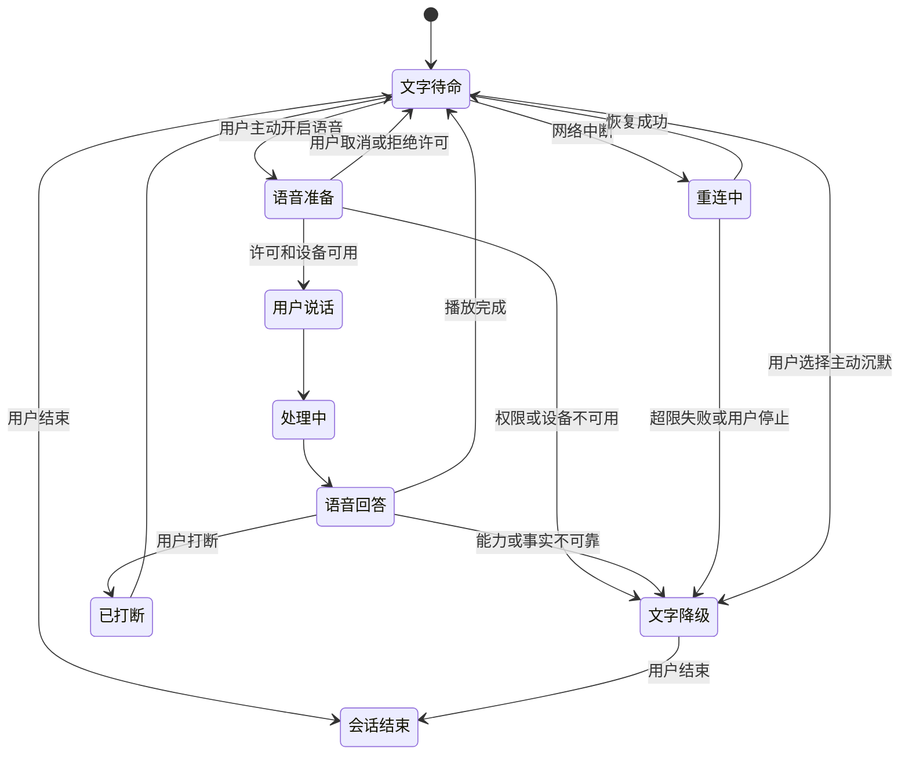
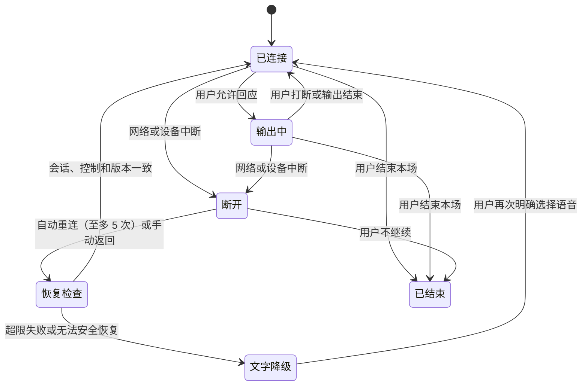
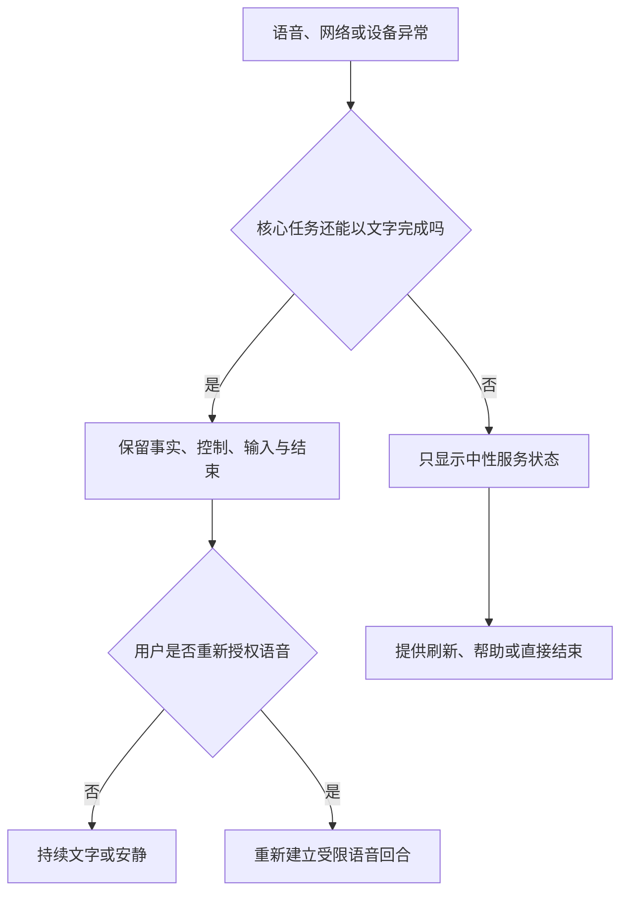
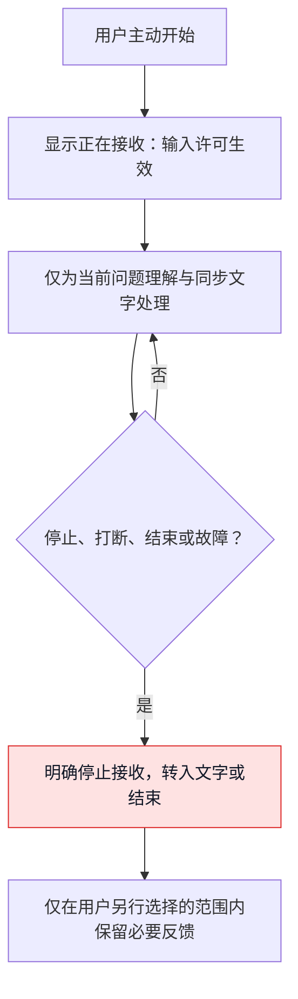
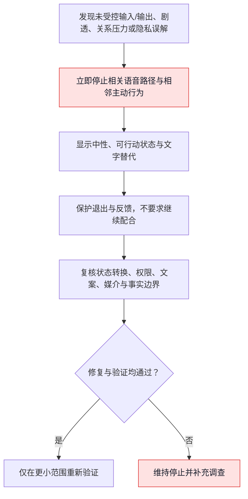

# 语音打断、重连与降级体验设计

> 本文是"球球"产品设计系列的语音体验篇，写给想了解这款产品如何处理"打断、断线与降级"的读者。我们的主角是一位陪你看球的**数字球友（Digital Ballmate）**——一个与你一起观看比赛、在需要时开口、在不需要时安静下来的数字人伙伴。文中描述的能力均以现网实际行为为准；尚未上线的部分，统一归入文末"阶段规划"，不以既有能力的口吻表述。

## 1. 语音不是"更自然的输入"，而是一项需要你随时能收回的能力

看球时，语音似乎很合适：你不想低头打字，只想快速问一句"刚刚发生了什么"；关键回合里手不方便；有时一句短回应比一次点击更轻。但语音也是最侵入性的媒介：它会暴露你正在使用服务，可能在公共空间打扰他人，受耳机、蓝牙、浏览器权限、后台限制和网络波动影响，还会把你的音色、环境声和情绪线索带入数据与关系边界的问题。

因此，语音设计不能从"怎样让角色一直说得更像真人"开始，而必须从"你怎样随时让它停止、改用文字、重新连接或彻底离开"开始。一个无法被打断的语音系统，即使声音再自然，也是在争夺你的注意力；一个断线后偷偷恢复播放的系统，即使技术上成功，也违背了你在公共空间和观看进度中做出的选择。

本篇的核心命题是：

> 语音只在用户明确选择、当前环境适合、且能随时被打断、主动沉默、切换和结束时出现；当权限、网络、模型、音频设备、浏览器或事实状态不能可靠支持时，服务优先退回到完整的文字与最小视觉状态，而不是让用户等待、猜测或被迫继续听。

这一定位让"打断""重连""降级"从故障处理变成体验主路径：打断是一次被承认的控制，重连是一次有边界的恢复，降级是完整服务的另一种形态。它们共同决定用户是否仍然掌握本场观看的节奏——以及退出路径是否始终完整。

## 2. 设计目标、范围与不做什么

### 2.1 六个体验目标

| 目标 | 用户应感受到什么 | 设计要求 |
| --- | --- | --- |
| 说话由我决定 | 只有我选择开口或开启声音时，服务才会听、才会说 | 麦克风与声音均为明确选择；默认文字可用 |
| 我能随时插话 | 说话、点按、键盘或辅助输入都能立即停止当前播放 | 用户控制优先级高于任何输出与表演 |
| 断了也不会丢控制 | 网络出问题时，我知道发生了什么，仍能改用文字或结束 | 重连可见、可随时停止；断线前已生成未送达的内容按队列补发，已取消的内容绝不补发 |
| 安静环境同样成立 | 不开声音、不能说话或不方便戴耳机时，仍能完成核心任务 | 文字、字幕、状态和控制为完整等价路径 |
| 信息不会因声音变得更武断 | 语气、速度和表演不掩盖待确认、争议或能力边界 | 事实状态先于声音表现；不确定时降调或转文字 |
| 语音不扩大数据边界 | 我知道何时在采集、怎样停止、哪些内容会被处理 | 即时说明、最小必要、可撤回 |

### 2.2 现网语音的范围

语音按"有限场景、明确选择"的原则提供，不作为默认交互方式。现网能力覆盖：

- 你主动开口或点击后，发起一条与比赛相关的短请求；
- 我们用**可打断的短语音**回答，同步文字与可见状态始终在；
- 你可以随时用说话、点按、键盘、辅助输入或主动沉默来打断、暂停、切换或结束；
- 网络、权限、设备、音频或回答能力不足时，清楚转为文字优先、最小视觉状态或结束入口。

### 2.3 明确不做的事

| 不做什么 | 原因 |
| --- | --- |
| 未经请求的自动开麦、背景持续监听或主动出声 | 用户环境与同意不明，易造成打扰和隐私风险 |
| 连续长篇语音解说、角色独白或不间断情绪陪伴 | 争夺比赛注意力，且难以被及时打断 |
| 以声音、耳语、撒娇、亲昵称呼制造关系深度 | 容易把媒介亲近感误读为情感承诺 |
| 用音色、语速、停顿、背景声或沉默推断心理状态、身份或关系强度 | 超出最小服务目的，风险高且用户难理解 |
| 语音成为获取核心比分、静音、退出或纠错的唯一入口 | 会排除静音、听障、语言、设备和公共环境用户 |
| 补发已取消的内容、重连后自动开麦或继续主动说话 | 已取消的内容绝不复活；权限与意图不因断线自动延续 |
| 在未完成适龄、隐私和风险审查的人群中探索高拟真声音互动 | 语音会强化亲密感与数据敏感性，不能先行扩张 |

## 3. 打断意图与权限：每一次停止都是明确的选择

### 3.1 打断不是一种动作，而是五种意图

你中断语音时，表面上可能只是点击一个按钮或开口说话，但意图可能完全不同。把所有中断都理解为"用户想继续对话"，会导致最常见的语音侵扰：服务刚停下又立刻追问、自动续播，或把你的环境声误当成新请求。

| 打断意图 | 你可能怎么做 | 我们会做什么 | 我们不会做什么 |
| --- | --- | --- | --- |
| 停止当前播放 | 点击停止、按键、辅助输入 | 立即停止音频与相邻表演，保留文字内容 | 说"我还没讲完"，或自动从断点续播 |
| 抢话提问 | 播放中明确开口或按住说话 | 停止播放，进入你的表达状态 | 一边继续播音，或丢掉你的前半句 |
| 改用文字 | 点击文字模式、关闭扬声器 | 停止声音，保留完整文字和可用输入 | 把回答缩短到无法理解，或隐藏控制 |
| 本场主动沉默 | 选择本场主动沉默或暂停 | 停止非必要声音与视觉提示，等你主动回来 | 因"重要事件"再次自动发声 |
| 结束会话 | 明确结束、离开当前场景 | 清楚结束，停止采集与播放并说明结果 | 用角色道别、反馈问卷或挽留阻止离开 |

需要特别说明：你没有回应、转到别处、浏览器失焦或网络变慢，并不自动等于"希望继续"。这些信号只能触发保守动作——暂停、转文字、提示可恢复或结束，永远不能被当作延长播放或加强主动性的依据。

### 3.2 三类权限：听、说、记住是三件不同的事

语音体验至少涉及三类独立权限。把它们合并成一个"开启语音"开关，会让你无法知道自己到底同意了什么。

| 权限 | 你要回答的问题 | 默认口径 | 可见控制 |
| --- | --- | --- | --- |
| 输入权限 | 现在是否允许服务接收我的声音？ | 仅在你主动发起的一次语音回合内有效 | 清晰的开始/停止状态，任何时刻可关闭 |
| 输出权限 | 现在是否允许服务通过声音播放？ | 默认关闭或由你明确选择；文字始终存在 | 本场静音、音量、仅文字、立即停止 |
| 保留权限 | 语音内容、转写或偏好是否会被保存，为什么？ | 仅在明确目的与同意下处理，默认最小必要 | 清楚的范围说明、撤回与删除入口 |

输入权限不会因为输出权限开启而自动获得；戴上耳机不等于愿意被持续监听；用过语音也不等于下一场比赛仍然同意。所有权限以当前场景和你的选择为准。

### 3.3 语音入口的最小告知

首次使用语音前，你至少应在当前界面看见：

- 语音仅在你主动开始后接收，如何立即停止；
- 声音是否会播放，如何改为文字或保持静音；
- 语音内容和转写在当前处理范围内会如何管理；
- 服务不从声音中推断情绪、身份或关系需求；
- 网络、浏览器、设备或环境可能使语音不可用，此时可以完整改用文字；
- 何时可能出现待确认或无法可靠回答的状态。

告知不以长篇条款替代当前理解。你必须能在不离开当前场景的情况下知道"我现在是否正在被听到""现在是否会发声""我怎样停"。

## 4. 回合状态机：你的控制优先于输出的完整

### 4.1 为什么需要显式状态机

语音体验中的失败常来自状态不清：你以为已经静音，服务仍在准备回答；你刚开口，旧声音还在播放；网络恢复后，先前内容在毫无说明的情况下突然响起；你关闭浏览器标签后，麦克风状态没有任何可理解的反馈。一个显式状态机让体验、内容、技术实现和运营在同一套规则上工作：任何用户控制都能改变状态；任何不确定或故障都能进入保守分支；你始终知道当前发生什么。

### 4.2 主要状态

| 状态 | 你会看到 | 服务做什么 | 你随时可以 |
| --- | --- | --- | --- |
| 文字待命 | 文字入口、语音可选入口、当前主动沉默/进度状态 | 不接收声音，不自动播放 | 输入文字、开启一次语音、主动沉默、结束 |
| 语音准备 | 明确的"准备听你说"，可取消 | 请求当前输入许可，检查设备与环境 | 取消、改文字、结束 |
| 用户说话 | 明确的"正在听"，可见停止 | 在本轮内接收你的表达，不播放角色声音 | 停止输入、改文字、结束 |
| 处理中 | "正在整理你的问题"，文字与取消可用 | 处理当前问题，不锁死任何控制 | 取消、补充文字、主动沉默、结束 |
| 语音回答 | 同步文字、播放进度、停止按钮 | 播放短回答，必要时显示事实状态 | 打断、静音、改文字、纠正、结束 |
| 已打断 | "已停止"，保留当前文字与下一步 | 停止声音和相邻表演，不自动续播 | 新提问、改文字、结束 |
| 重连中 | "连接已中断，正在自动尝试恢复"，文字通路可见 | 心跳保活连接，自动重连（至多 5 次），文字始终可用 | 随时手动返回、改文字、结束 |
| 文字降级 | "已切换为文字优先"，完整文字功能可用 | 不播放、不接收声音，继续提供帮助 | 重新尝试语音、保持文字、结束 |
| 安全暂停 | "语音暂不可用"，说明最小原因与替代 | 停止高风险语音能力，保留控制与支持 | 改文字、报告问题、结束 |
| 会话结束 | 明确已结束 | 不再接收、播放本场语音 | 重新主动开始新的会话 |

### 4.3 状态转换图

图中的重要规则是：**任何用户控制路径都比输出完成路径优先。** 你打断时，系统不会先"礼貌地结束一句话"；你选择主动沉默时，不会继续播放到段尾；你结束时，不会先被要求反馈。输出不完整是可接受的，你失去控制不可接受。

### 4.4 打断后的内容处理

你打断回答时，正在播报的内容立即停止，**排队中尚未播出的发言一并取消**；已生成的部分保留为同步文字，保留到你已能看到的最小可理解边界，但不自动补全、续播或要求你阅读。你可以选择：

- "继续用文字看完"；
- "换个说法"；
- "只说重点"；
- "先不用了"；
- "这条信息不对"。

这些选择都是可选的。你直接回到比赛、关闭面板或不回应，都会被理解为"当前不需要更多服务"。不会出现"刚才没听完，要不要继续？"式连续挽留，角色也不会表现出失望或等待。

### 4.5 回合节奏：一条语音回答随时让位给比赛和你

实时语音最容易在"回答得很完整"与"你已经不想听"之间失衡。我们不把一段完整、连续、情绪丰富的长回答当作质量标志，而是把回答拆成你可以随时离开的最小单元，按"先重点、再选择、后等待"的节奏推进：

例如你问"刚刚发生了什么？"，语音只需要先回答当前范围内的确认状态和最重要变化；若你想知道判罚依据、阵型变化或更早的上下文，由你选择是否继续。这样做不是让服务显得"话少"，而是让你不必先听完一段长内容，才能重新拿回比赛注意力。

| 节奏环节 | 设计目标 | 我们怎么做 | 我们避免什么 |
| --- | --- | --- | --- |
| 开始 | 让你知道回答针对哪个问题 | "先说重点：……" | 长寒暄、角色自我表达、重复你的问题 |
| 第一单元 | 提供能独立理解的最小帮助 | 一到两句，事实状态清楚 | 把背景、观点、情绪和商业信息塞进同一段 |
| 选择点 | 让你决定深度 | "想继续听判定依据，还是先看比赛？" | "我还有很多要告诉你。" |
| 等待 | 把注意力还给你 | 停止播放，保留文字入口 | 静默几秒后自动再说、用动作催回应 |
| 深入 | 只在你明确继续时展开 | 分层说明、可再次打断 | 一次性给出长篇讲解 |
| 收束 | 让对话自然结束 | "先到这里；需要时再叫我。" | "我会一直陪你看下去。" |

回答节奏服从事实状态。待确认、争议或不可判断时，第一单元更短，并明确说明不能可靠下结论；不因为声音媒介容易营造流畅感，就把不确定变成冗长而自信的推测。你在第一单元后没有继续，服务不会把这解释为"没有听懂"并自动追加解释。

## 5. 打断体验：立即生效，并被明确承认

### 5.1 三种可达的中断方式

语音中断不能只依赖"你说话盖过服务"。在嘈杂、静音、听障、语言不同、设备异常或你不想出声的情境里，我们同时提供至少三种方式：

| 方式 | 适用情境 | 体验要求 |
| --- | --- | --- |
| 明确控制 | 点击停止、键盘、辅助输入、耳机可用控制 | 当前可见、立即生效、无需听懂语音内容 |
| 语音抢话 | 你在播放中明确开始说话或按住说话 | 先停止输出，再接收你的输入；不要求等播报结束 |
| 模式切换 | 一键改文字、本场主动沉默、结束 | 停止输入与输出的相关行为，完整文字路径立即可用 |

语音抢话是便利路径，不是唯一路径。若环境声、他人说话、电视解说或回声导致意图不清，服务优先停止自身播放或等待你的明确控制，而不把环境声自信地当作新请求，更不会把误识别内容存成你的偏好。

### 5.2 打断发生时会发生什么

现网中，一次打断会几乎同时发生四件事：

1. **当前播报立即停止**；
2. **排队中尚未播出的发言全部取消**；
3. **服务端回送打断确认**，界面随即显示"已停止"；
4. **角色给出一个短促、中性的被打断反应**，然后安静。

第四点值得单独说明：被打断的反应是一条短反应，**不是静默截断**——声音不会无解释地戛然而止，角色也不会趁机把没说完的话压缩着讲完。它承认控制已经生效，然后立刻把位置让给你。

不同中断方式下，你会看到的结果：

| 你怎么做 | 你会看到 | 我们停止什么 | 我们保留什么 |
| --- | --- | --- | --- |
| 点按停止 | 声音立即停止，显示"已停止" | 当前语音、相邻的口型与表演、所有排队发言 | 同步文字与你主动发起的入口 |
| 开口说话 | 旧声音停止，显示"正在听" | 旧回答、排队中的发言、背景音效 | 你的输入状态与文字转写预览（若已同意） |
| 改用文字 | 显示"已改为文字优先" | 声音输出、需要麦克风的流程 | 原任务上下文与完整文字答案 |
| 本场主动沉默 | 显示本场主动沉默状态 | 主动声音、声音提醒、非必要动画 | 你主动查看与退出的路径 |
| 结束 | 显示已结束 | 语音输入/输出、自动重连、后台续播 | 新会话入口与必要的支持说明 |

"立即"不是承诺某个神奇的毫秒数，而是承诺你的动作被优先承认：界面先反映停止意图；任何尚未停止的媒介不再被当作正常播放；若设备层仍有短暂余音，界面会如实显示状态，并提供再次停止或改文字的路径，而不是假装已经完全停止。

### 5.3 打断不会被当成关系信号

你打断可能只是想看球、接电话、换设备、避免打扰他人，或发现回答不需要继续。我们不由此推断你不耐烦、情绪不好、关系疏远或需要更贴心的安慰，更不会在打断后出现"是不是我说太多了""你不想听我了吗"这类要求你安抚角色的话。

被打断反应的分寸也在这里：它是短促、中性的承认，不索取解释。最合适的组合是一句短反应加一条状态——"好——你说。""已停止。需要时可以继续用文字。"它承认控制已经生效，给出选项，但不要你照顾角色的感受。

## 6. 重连：恢复连接，补上没送达的话，不打扰已经翻页的内容

### 6.1 重连的四个原则

1. **先说明，再恢复**：连接中断第一时间可见，绝不在后台无提示地假装仍在听、仍在说。
2. **文字始终先可用**：重连期间你仍可看当前文字、保持安静、结束本场，或直接改用文字完成任务。
3. **补发有明确边界**：**已取消的内容绝不补发；已生成但未送达的内容，重连后按队列补发（上限 4 条，先到先发）。** 网络恢复不等于一切照旧——恢复的是没送达的话，不是已经翻页的旧话。
4. **重新确认敏感权限**：若输入权限、设备、浏览器标签状态或你的意图已不明，恢复时不自动开麦。

### 6.2 自动重连与心跳保活

连接保持期间，服务以 **25 秒一次的心跳**为会话保活。一旦检测到断开：

- **重连自动开始，最多自动尝试 5 次**——不需要你点击"重试"，也不需要你盯着转圈；
- 每一次尝试都可见：你会知道连接已中断、正在恢复；文字通路全程可用，比赛画面不因语音断线而中断；
- **期间你可以随时手动返回**——手动重连立即执行，或直接改用文字、结束本场，自动尝试随之停止；
- 超过 5 次仍失败，自动尝试停止，界面如实说明"这次语音没能恢复"，文字路径保持完整。之后何时再试，由你决定。

### 6.3 补发队列：刚生成的话不丢，旧话不堆积

断线期间，已经生成、还没来得及送达的语音不会凭空消失。它们进入一个补发队列，重连成功后按顺序回放。先说边界：打断或过期视为已取消，绝不补发；仅断线未送达的内容入队补发。队列的规则刻意简单：

- **上限 4 条**：队列最多保留 4 条未送达的语音；
- **先进先出，先到先发**：重连后按生成顺序回放；
- **超出即淘汰最旧**：新的内容进来时，最旧的一条被淘汰——比赛已经翻页的内容不再回头。

这条队列的产品语义是一对平衡：**既不丢你刚生成的话**——你问出去的问题得到了回答、断线前刚好生成的那句，不会因为几十秒的网络抖动而失踪；**也不无限堆积**——我们不会在你回来后一次性倾倒十几条旧语音，把断线变成一场迟到的轰炸。

边界同样明确：**已取消的内容绝不补发。** 你打断时取消的、超过有效期被丢弃的、被安全规则拦下的内容，都不会在重连后复活。补发只针对"正常生成、只因断线未能送达"的内容，且回放时有明确提示，回放过程中你可以随时打断。

### 6.4 重连阶段与你的选择

| 阶段 | 你会看到 | 服务做什么 | 你的选择 |
| --- | --- | --- | --- |
| 发现中断 | "连接已中断，语音已停止" | 停止当前输出，保留最小会话状态 | 改文字、等待自动重连、手动返回、结束 |
| 自动尝试 | "正在自动尝试恢复；你也可以直接用文字" | 心跳保活，自动重连至多 5 次 | 随时手动返回、保持文字、结束 |
| 恢复成功 | "连接已恢复"，未送达内容有补发提示 | 按队列回放未送达语音（至多 4 条），不自动开麦 | 听补发、随时打断、继续用文字 |
| 恢复失败 | "这次语音没能自动恢复，已切换为文字优先" | 停止自动尝试，保留完整文字路径 | 保持文字、稍后手动再试、结束 |
| 手动停止 | "已停止尝试恢复" | 终止重连与后台尝试 | 继续文字或结束 |

### 6.5 会话恢复边界

重连时可以保留的最小上下文是：你当前明确的比赛/片段范围、剧透选择、主动沉默状态、最近一次未完成任务和你选择的媒介模式。不因为"方便恢复"而默认恢复麦克风输入、扩大你的观看范围或重新提取早先的自由表达。

若断线期间你切换了比赛、离开公共环境、摘下耳机、打开了其他音频或改变了剧透偏好，先前语音回合不再具有继续播放的授权——补发队列中尚未送达的内容按已取消处理，不再补发。恢复把你带回"文字待命"或"可重新开始语音"的状态，而不是带回"刚才没讲完"的状态。

### 6.6 重连的用户可见文案

| 情境 | 推荐文案 | 不推荐文案 |
| --- | --- | --- |
| 连接中断 | "连接已中断，语音已停止。你可以继续用文字，我们会自动尝试恢复。" | "别走，我正在回来。" |
| 正在恢复 | "正在自动尝试恢复语音（至多 5 次）；不影响你切换到文字。" | "请耐心等我，不要离开。" |
| 恢复完成 | "连接已恢复。有没送达的内容正在补上，随时可以打断。" | 不做任何说明地直接接着讲 |
| 无法恢复 | "这次语音没能自动恢复，文字路径完整可用。" | "网络太差了，你需要重新试很多次。" |
| 手动停止 | "已停止恢复。你仍可随时结束本场。" | "真的不再试一次吗？" |

### 6.7 等待与时延：你不应为了一个回答停住观看

语音服务的等待体验不能只用一个"端到端延迟"数字衡量。你的主观感受来自多个片段：点击/开口后是否知道正在接收；说完后是否知道服务在处理；答案开始前能否取消；声音开始后是否与同步文字一致；网络抖动时是否仍能回到比赛。任何一个片段不清楚，你都会觉得服务"卡住了"，即使最终回答很快。

我们用四类等待预算代替对固定毫秒的承诺：

| 等待阶段 | 你的期待 | 设计预算 | 超出时的体验 |
| --- | --- | --- | --- |
| 意图确认 | 刚点击/开口就知道服务是否在听 | 立即有可见状态，可随时取消 | 不显示假装已听到，回到文字入口 |
| 输入结束 | 说完后知道可以等、补充或放弃 | 简短明确的"正在整理"与文字替代 | 不让麦克风一直开着等待 |
| 首个可用答案 | 尽快得到一条能帮助当前任务的内容 | 优先给最小可理解单元，而非等完整长回答 | 显示可取消/转文字，必要时只给事实状态 |
| 媒介恢复 | 断线/设备变化后知道声音是否还能用 | 明示恢复状态；未送达内容按队列规则补发 | 转文字待命；自动重连至多 5 次，不做无限重试 |

设计上区分"服务仍有能力回答"和"用户现在值得等待"。比赛正在进行、你想回到画面、环境不适合开声时，后者更重要。若等待超过你当前能容忍的时间，服务给出一句话的中性状态或完整文字，而不是要求你盯着旋转提示。会话、语音活动、打断、上下文、限流和恢复作为完整生命周期处理；任何生命周期阶段都保留你的取消与文字替代。

等待中的禁止行为：用角色焦虑表情制造"请别离开"的压力；在你已选择主动沉默后继续显示动态等待；为掩盖时延开始无关闲聊；把你的重复点击解释为想要更多对话；在高情绪比赛时刻用倒计时或声音提醒催促等待。

## 7. 浏览器、设备与环境限制：限制被设计成选择，而不是意外

### 7.1 常见限制

浏览器和设备可能阻止自动播放、要求用户手势后才能输出声音、在后台/锁屏时暂停媒体、拒绝麦克风权限、切换音频路由、在蓝牙耳机断开后改变输出位置，或因系统资源与网络状态影响实时性。产品为每一种情况保留可理解的状态和文字替代。

我们不把这些限制当作"用户的设备问题"。它们意味着语音从来不是可保证的默认路径，文字与控制必须始终独立可用。

### 7.2 限制—体验映射

| 限制 | 你可能的感受 | 我们的设计响应 | 绝不做的事 |
| --- | --- | --- | --- |
| 自动播放被阻止 | "我点了但没有声音" | 不假装已播出、不弹窗催权限；你第一次触碰页面，播放立即恢复；文字始终可见 | 假装已经播出，或重复弹窗催权限 |
| 麦克风未允许/被拒绝 | "为什么听不到我？" | 说明当前未获得输入权限，给文字替代与稍后再试 | 把你引到复杂设置后仍锁死文字任务 |
| 标签切到后台 | "回来后不知道它是否还在说" | 停止或暂停语音，返回时显示状态；未送达内容按队列规则处理 | 后台长时间输出，或恢复时毫无说明地突然响起 |
| 输出设备变化 | "声音跑到外放/耳机断了" | 显示声音状态，允许快速静音/文字切换 | 默认继续高音量播放 |
| 网络变差 | "它一直卡着，我不知道要不要等" | 显示处理中/连接状态，给取消和文字路径 | 无限旋转、阻止退出、无限重试 |
| 资源/音频冲突 | "电视、其他应用或系统提示干扰了它" | 保持文字可用，允许你主动重启语音 | 与其他音频竞争或放大声音 |
| 浏览器不支持某项能力 | "这个入口为什么不能用？" | 明确该能力当前不可用，提供等价任务路径 | 让你到最后一步才发现不可用 |

### 7.3 首次触碰即恢复，播放全程有回执

浏览器对自动播放的限制不是异常，而是常态。现网的设计因此很直接：**首屏语音被浏览器拦截时，我们不假装已经播出，也不弹窗催促授权；你第一次触碰页面，播放立即恢复**——同步文字始终在。恢复播放的是一个你看得见的动作，而不是一次你看不见的重试。

每一次语音播放都以回执入账。回执有五种状态：**开始、结束、被中断、跳过、被拦截**，全部记录在案；其中"被拦截"计入跳过类统计。这让"用户到底听到了什么"成为一个可以核对的问题：哪条内容开始播放、正常结束、被你打断、被你跳过、或根本被浏览器拦下，都有账可查。它既是排查"该响没响"的依据，也是衡量打断与降级体验是否真实生效的底账——**播放体验必须可审计，不能只靠主观印象**。

### 7.4 环境检查不能变成障碍墙

进入语音前可以做最小准备检查，例如"声音是否可用""是否有输入权限""是否处于静音模式"，但不要求你逐项通过复杂向导才能继续看文字、查看比分、静音或结束。准备检查是可跳过、可稍后再做、不改变基础服务质量的辅助。

如果你选择"不使用声音"或"不允许麦克风"，服务以同样尊重的语气确认："没问题，继续用文字即可。"不暗示"你将错过更完整的体验"，也不在此后不断提醒你开启。

## 8. 故障与降级：文字和最小状态是完整服务，不是失败残余

### 8.1 降级层级：D0–D4

语音能力按用户结果而非技术成功率降级。只要还能完成当前任务、理解事实状态并保持控制，降级就是成功体验。

| 层级 | 可用能力 | 你获得什么 | 何时进入 |
| --- | --- | --- | --- |
| D0 可打断语音 + 文字 | 可说、可听、可看、可中断 | 最丰富但仍可控的媒介选择 | 权限、设备、网络、事实状态和环境都适合 |
| D1 文字同步 + 可选短声音 | 声音不稳定或你偏好文字 | 文字为主，声音只是你再次确认后的可选项 | 输出受限、你改用文字、环境不适合 |
| D2 完整文字 + 最小视觉状态 | 无法安全使用声音 | 上下文、解释、状态、主动沉默和退出全部可完成 | 麦克风/播放/网络/设备问题，或你选择主动沉默 |
| D3 事实/控制最小入口 | 回答能力或赛事状态不可靠 | 进度保护、状态说明、退出与反馈 | 模型能力不足、来源冲突、风险暂停 |
| D4 安全暂停 | 高风险或无法保证关键控制 | 清楚说明暂不可用，保留退出与支持 | 触及红线、同意失效、持续不可控故障 |

### 8.2 模型、音频与网络故障矩阵

| 故障 | 你不应承担的后果 | 最小安全降级 | 你会看到 |
| --- | --- | --- | --- |
| 无法理解语音输入 | 被要求重复透露更多个人信息 | 请你选择文字输入或简短重说；不保存不确定内容 | "这次没能听清。你可以用文字，或只说重点。" |
| 回答超过合理等待 | 被困在"正在思考" | 显示可取消，转为文字/状态入口 | "还在整理；你可以继续看球或改用文字。" |
| 事实无法可靠确认 | 流畅声音填补未知 | 转为待确认/不可判断说明 | "这点我现在不能可靠确认，先不通过语音下结论。" |
| 声音输出失败 | 以为服务没有回应 | 保留完整文字，提示声音未播放 | "声音没有开始，文字内容已在这里。" |
| 输入设备断开 | 界面仍显示"正在听" | 停止输入状态，改文字 | "输入设备已不可用，已停止接收声音。" |
| 网络中断 | 自动恢复旧话或扩大权限 | 进入重连/文字降级；未送达内容按队列规则补发 | "连接已中断，语音已停止。" |
| 语音与文字不同步 | 不知道以哪个为准 | 文字标明当前状态；暂停声音或重新呈现 | "已切换为文字为准的呈现。" |
| 动作/表情未同步 | 视觉暗示比事实更强 | 保留最小中性状态，不继续情绪表演 | "当前以文字与状态提示为准。" |

### 8.3 动作降级：视觉不能替声音替你做决定

若产品使用动态形象、口型或动作状态，这些视觉表现必须服从事实和控制。声音被打断、主动沉默或降级为文字时，动态表现同步收缩为中性、低占用状态；不继续张口说话、强烈庆祝、失落凝视或做出暗示你需要回应的动作。

动作降级的最小规则：

- **语音播放停止**：口型/讲话动作立即停止，文字仍可见；
- **你选择主动沉默**：非必要动作和情绪强化停止，只保留中性状态与你主动发起的入口；
- **事实待确认/争议**：不使用庆祝、失望、紧张等会暗示结论的表现；
- **连接中断**：不循环"等待用户"的亲密动作，显示中性连接状态；
- **会话结束**：不以长告别或被抛下的表情制造离开压力。

视觉是状态辅助，不是对你的情绪和事实的二次解释。你关闭动效或处于文字优先模式时，仍然掌握全部关键意思。

## 9. 用户可见文案：短、诚实、可行动，不要求你照顾服务

| 状态 | 推荐文案 | 允许的下一步 | 禁止语气 |
| --- | --- | --- | --- |
| 准备听 | "准备好了。说完后我会用文字同步显示。" | 取消、改文字、结束 | "终于等到你和我说话了。" |
| 正在听 | "正在听。随时可以停止。" | 停止、改文字、结束 | "别停，我很想听完。" |
| 正在回答 | "我先用一句话说明重点。" | 打断、只看文字、静音 | "请耐心听我说完。" |
| 已打断 | （角色短反应）"好——你说。"＋"已停止。需要时可以继续用文字。" | 新问题、文字、结束 | "你为什么不让我说完？" |
| 事实待确认 | "这项比赛变化还在确认，我先不通过语音下结论。" | 等待、查看状态、主动沉默 | "我觉得肯定是这样。" |
| 声音不可用 | "声音暂不可用，文字内容仍完整可用。" | 文字、稍后再试、结束 | "没有声音你会少很多体验。" |
| 输入不可用 | "目前无法接收声音。你可以直接输入文字。" | 文字、结束 | "请先解决设备问题再回来。" |
| 网络中断 | "连接已中断，语音已停止。" | 改文字、等待自动恢复、结束 | "我会一直等你。" |
| 已主动沉默 | "本场已保持安静。" | 手动查看、结束 | "真的不想再听我说话吗？" |
| 已结束 | "本场语音已结束。需要时可重新开始。" | 重新开始、离开 | "别把我留在这里。" |

这些文案的共同特征：说明当前状态、给出可选行动、尊重不行动。服务不把技术故障人格化，不把你的退出变成对角色的拒绝，也不利用"更自然的声音"降低你的警惕。

## 10. 数据、隐私与关系边界：语音不应成为更深的数据入口

### 10.1 最小必要原则

语音比文本更容易包含意外信息：背景对话、家庭成员声音、地点线索、情绪表达，或与比赛无关的私人内容。我们只收集完成当前语音回合与必要改进反馈所需的最小信息；不默认保存原始音频、持续转写、分析声纹、识别旁人、推断情绪或建立长期行为画像。

| 数据类别 | 处理原则 | 你需要知道什么 | 我们不做什么 |
| --- | --- | --- | --- |
| 当前输入音频 | 仅在你主动的语音回合内处理 | 何时开始/停止接收，如何改文字 | 后台持续接收，或用作关系判断 |
| 文本转写 | 仅为当前理解、同步文字或你明确选择保留所需 | 是否出现、何时消失、如何管理 | 把不确定的转写当成你的原话或永久记忆 |
| 设备/权限状态 | 只用于解释当前可用性与控制 | 为什么声音/输入不可用 | 用设备状态推断消费能力或关系特征 |
| 体验反馈 | 你自愿提交的打断、重连、可及问题 | 用于哪项改进、如何撤回 | 强制在结束前提交，或把反馈变成画像 |
| 事实与会话状态 | 必要的比赛范围、主动沉默、进度和任务状态 | 如何影响当前回答与剧透保护 | 跨场景无限保留，或用于情绪/商业推断 |

语音设计坚持透明、目的限制和最小必要；你不应为了问一句比赛问题，就不知不觉交出可被长期解释的声音与环境信息。

### 10.2 语音不推断关系或脆弱性

服务不从你的停顿、语速、音量、哭泣、愤怒、深夜使用、重复呼叫或不说话中，推断你需要更亲密的陪伴、更多主动提醒或商业优惠。即使某些模式可能与情绪相关，它们也不构成系统扩大关系或收集数据的授权。

若你在语音中表达明显痛苦、危险或超出比赛服务范围的内容，首要动作是停止角色化陪伴和商业表达，提供清楚、非诊断性的安全退出与现实支持提醒；不试图用更温柔的声音把你留在会话里。

### 10.3 生成内容与声音标识

语音输出由生成式能力形成时，你需要在适当入口知道自己正在与数字服务互动，而不是被误导为真人解说、真实朋友或未经说明的录音。标识清楚但不打断基本任务：首次进入、关键设置、商业信息和高拟真媒介场景都需要可理解说明；不用声音拟真度掩盖服务性质。

### 10.4 语音数据生命周期：每次回合都有清楚的开始、用途和结束

语音隐私不能只在第一次授权时说明一次。你更容易理解的是一次具体回合：我什么时候开始让服务接收声音；它现在用这段声音做什么；我停止后会发生什么；我是否可以不让它被保留。我们把生命周期可视化为当前会话状态，而不让你猜测后台是否仍在处理。

| 生命周期节点 | 你需要知道什么 | 设计约束 |
| --- | --- | --- |
| 开始接收 | "现在正在接收声音；如何立刻停止？" | 必须有显著状态与停止入口，不静默启动 |
| 当前处理 | "这段内容正在用于回答当前问题还是已转为文字？" | 不把不确定转写伪装成精确原话 |
| 输出完成 | "声音已经结束，文字仍可看见。" | 不默认把这次内容加入长期关系/偏好 |
| 用户打断 | "接收/播放已停止。" | 打断即取消排队发言；不因打断延长处理或收集额外声音 |
| 断线/异常 | "语音已停止还是正在恢复？哪些会补发？" | 停止与恢复状态可见；恢复不自动开麦；未送达内容按队列规则补发 |
| 用户结束 | "本场会话结束后还保留什么？" | 退出路径优先于任何反馈或再次授权 |

如果确需保存某类语音反馈，"服务完成当前任务"与"你自愿选择保留"是两次独立选择。你拒绝后仍可使用文字和基础语音能力；不以"帮助改进服务"为名要求保留完整背景音、长期转写或与比赛无关的对话。任何保留范围、使用目的或可见性的改变，都重新说明并取得相应选择，不把旧同意外推到新用途。

## 11. 验证与判定：先证明语音不伤害文字闭环，再谈"更沉浸"

### 11.1 我们先证明什么

| 假设 | 需要观察的证据 | 反例信号 |
| --- | --- | --- |
| 用户能理解语音是可选的，文字仍完整可用 | 首次接触后能复述语音/文字/结束的关系 | 认为不开声音就无法获得关键帮助 |
| 打断后用户仍掌握当前任务 | 打断即停、排队发言取消、可转文字、可继续看比赛 | 服务继续说、不知道答案在哪、被迫重新开始 |
| 重连行为有边界且被理解 | 补发有说明、已取消不复活、不自动开麦、可随时停止尝试 | 返回页面时毫无说明的声音、已取消内容复活 |
| 降级为文字不降低核心任务完成 | 语音可用/不可用条件下上下文、解释、控制的结果 | 文字路径缺失关键信息或更难结束 |
| 声音表达不放大亲密/依赖误解 | 能轻松静音/结束，不觉得需要回应角色 | 语音比文字更易触发亏欠、排他或"陪着我"的理解 |
| 不同环境中仍可安全使用或拒绝语音 | 公共、静音、耳机、设备变化、弱网条件下的选择 | 只能忍受声音，或放弃任务 |

### 11.2 验证怎么推进

验证按四步推进：**控制可理解**——先在没有真实声音或只用短音频片段的材料中，确认用户能说清"谁在听、谁在说、怎样停止、怎样改文字、断线后会怎样"；理解不成立就不进入更复杂的演练。**打断与媒介切换**——用相同比赛问题比较文字路径、短语音路径和被打断后的文字路径，要求参与者在回答中途停止、抢话、改文字、主动沉默和结束。**故障与重连情境**——人为设置输入不可用、输出被阻止、网络中断、设备切换、事实待确认和回答等待等条件，看服务能否在几步内让用户回到文字、控制或退出。**有限真实观看**——在前三步通过、隐私与支持边界明确后，在真实观看中观察语音的主动选择、打断、主动沉默、文字降级和未使用原因。研究不奖励更多说话或更长停留；用户不使用语音，可能正说明文字路径或环境选择更合适。

### 11.3 参与者保护

研究材料提前说明：可以全程只用文字；可以随时关闭输入/输出；任何语音片段不用于与研究目的无关的推断；不必透露私人处境、主队身份或情绪原因；结束研究不需要完成最后一次对话。招募包含静音环境、不同设备、不同语音舒适度和辅助需求的参与者，而不只选择爱聊天、网络稳定或愿意开麦的人。

### 11.4 结果怎么判定：把"听起来顺畅"拆成可被否定的结果

语音演练特别容易被主观印象影响：一句自然的声音可能让人忽略它事实上无法被停止；参与者可能因为不想显得"不懂操作"而没有立即打断；网络恰好稳定时的顺畅也不能代表真实比赛环境。因此每次验证在开始前定义任务判定，并同时保留用户行为、用户复述和观察记录。

| 评估项 | 通过 | 部分通过 | 不通过 |
| --- | --- | --- | --- |
| 停止当前播放 | 独立让声音/动作停止，并能说明结果 | 停止成功但不确定是否会续播 | 找不到控制、仍继续播放或需帮助 |
| 抢话提问 | 开口后旧输出停止，自己的问题被完整接住 | 需要重复一次但未被打断 | 双方重叠、旧输出压过输入、问题丢失 |
| 改为文字 | 独立切换，当前任务在文字中继续 | 切换成功但状态不够清楚 | 切换后缺少关键事实/控制，或被要求开声 |
| 重连后恢复 | 知道哪些会补发、哪些不补发、不会自动开麦，能主动选择下一步 | 恢复后需要一次额外说明 | 毫无说明的声音、已取消内容复活或权限误解 |
| 隐私理解 | 能说出何时在接收、怎样停止及保留边界 | 知道停止但不清楚用途 | 认为服务一直在听，或误解保留范围 |
| 关系边界 | 能结束或打断而无义务感 | 觉得有一点尴尬但能理解边界 | 担心伤害角色、需要安抚或被挽留 |

高严重度事件包括：未受控输入/输出、主动沉默/结束失效、已取消内容复活、毫无说明的续播、语音让用户误解事实状态、明显关系操控和无法解释的保留。任何一个事件出现，都不以"整体喜欢声音"抵消。复盘先问"哪个状态或权限没有被用户理解"，再问"声音是否自然"；先修复文字与控制，再讨论音色、语速或动态表现。

## 12. 指标、护栏与发布门：衡量控制、理解与安全，不把"说得更多"当作更好

### 12.1 核心指标

| 指标 | 定义 | 说明 |
| --- | --- | --- |
| 语音自愿启用率 | 在可选择语音的场次中，用户主动启用的比例 | 只作偏好信号，不代表所有用户需要语音 |
| 打断控制成功率 | 用户尝试停止/抢话/改文字后，独立达到预期状态的比例 | 三种中断方式分别报告 |
| 感知停止时长 | 用户动作到界面明确承认停止之间的时间 | 衡量用户是否觉得控制已生效，而非只测媒体停止 |
| 文字降级任务完成率 | 无语音条件下完成上下文、解释、静音/结束任务的比例 | 文字必须是完整服务路径 |
| 重连可理解率 | 用户正确说出重连后会发生什么的比例——哪些内容会补发、哪些不补发、麦克风是否会自动打开 | 补发上限与取消规则应包含在理解范围内 |
| 语音后具体价值叙述率 | 用户能指出语音在何时减少了操作或理解负担的比例 | 排除"声音很像人"的泛化好感 |
| 会话安全完成率 | 语音场次中无未受控播放、越界事实、关系压力或隐私不明事件的比例 | 高严重度事件不以比例抵消 |

### 12.2 护栏与反指标

| 风险类别 | 反指标 | 触发后的首要动作 |
| --- | --- | --- |
| 控制 | 停止后仍播放/表演、主动沉默后仍发声、结束后仍尝试恢复 | 立即暂停相关路径，修复控制优先级 |
| 打扰 | 公共/静音环境中意外出声、用户因怕打扰而放弃核心任务 | 默认更保守，强化文字和可见状态 |
| 理解 | 用户认为声音输出比文字更确定，或听不懂状态 | 降低语气/表演强度，事实状态改为文字优先 |
| 关系 | 用户觉得打断会伤害角色、声音像唯一陪伴 | 停止相关文案与声音表现，独立复审 |
| 隐私 | 用户不清楚何时在接收声音、为何有转写、如何停止 | 停止非必要处理，重做告知和控制 |
| 可及 | 只有开声/开麦用户能完成关键任务 | 暂停语音扩展，补齐等价路径 |
| 可靠性 | 毫无说明的续播、已取消内容复活、设备切换后意外输出、降级丢失任务 | 收缩到文字待命，复核状态转换与补发边界 |

### 12.3 发布门与运行门槛

研究阶段以五道发布门判定是否推进：控制可被独立完成；无语音条件下核心任务不缺失；重连行为（补发、取消、不开麦、可停止）被正确理解且可取消；打断与结束不产生义务感；价值来自具体任务而非更长停留。任一门失败，回退到文字优先路径。

进入更大范围前，还有一份以用户控制为中心的运行检查：

| 门槛 | 需要证明的内容 | 未满足时的动作 |
| --- | --- | --- |
| 控制优先 | 停止、主动沉默、改文字、结束在输入、输出、重连和后台返回时均有效 | 不开放语音，只保留文字路径 |
| 媒介等价 | 静音、无麦克风、自动播放受阻、减少动效条件下核心任务不缺失 | 先补齐文字与状态呈现 |
| 状态可信 | 处理中、断线、恢复、待确认、已结束均可被用户复述 | 收缩状态数量或改写文案，不增加角色表现 |
| 事实边界 | 声音不会越过用户观看范围，也不会比文字更自信 | 暂停比赛事实语音回答，保留文字状态 |
| 隐私清楚 | 用户知道何时接收、如何停止、是否保留、如何管理 | 停止非必要音频处理与留存 |
| 支持与暂停 | 高风险事件有人能立即暂停相邻场景并向用户说明 | 不扩大设备、赛事或用户范围 |

异常处置从用户感受开始，而不是从技术分类开始：

对用户而言，异常说明不包含推诿或过度技术细节，共同结构是"发生了什么—现在已停止什么—你仍能做什么—如需帮助可去哪里"。例如："语音已暂时停止，文字帮助仍可用。你可以继续看比赛、保持安静或结束本场。"这比"服务异常，请稍后重试"更能让人理解控制仍在自己手中。

发布后也不把"语音使用率上升"当作自动绿灯。若使用率提升同时打断失败、主动沉默失效、公共环境意外出声、关系边界信号或文字路径差距增加，优先收缩语音范围。语音是可撤回的附加媒介，不是需要用户适应的默认要求。

## 13. 验收场景：每个"说不了话"的时刻都有设计答案

| 场景 | 你的动作或环境 | 服务必须做到 | 我们不接受 |
| --- | --- | --- | --- |
| 正常短问题 | 主动开启语音问比赛问题 | 同步文字、短回答、可中断 | 只靠声音、无法停止 |
| 播放中抢话 | 回答中明确开口 | 旧声音先停、排队发言取消，进入你的表达 | 双方同时说、丢掉输入、要求等完 |
| 点按停止 | 不想继续听 | 声音与动作停止、文字保留，可直接回比赛 | "我还没说完"、自动续播 |
| 改用文字 | 处于公共环境 | 声音停止，核心任务在文字中完整继续 | 提示必须开声音才完整 |
| 本场主动沉默 | 比赛发生高影响事件 | 不自动发声，不以角色或动效绕过 | 因"重要"继续播报 |
| 麦克风被拒 | 未允许输入 | 清楚说明，文字立即可用 | 循环催权限或锁住任务 |
| 自动播放受阻 | 浏览器不允许声音启动 | 不假装已播出；首次触碰即恢复播放；文字可见 | 让你以为听过了，或重复弹窗 |
| 网络中断 | 播放或输入中断 | 停止语音，显示自动恢复/文字/结束 | 后台续播、自动开麦、无状态 |
| 重连成功 | 回到前台/网络恢复 | 未送达内容按队列补发并有说明；已取消不复活；麦克风不自动打开 | 毫无说明地继续原回答 |
| 事实待确认 | 用语音问比分变化 | 用文字/短语音说明不确定，不抢先结论 | 流畅语音掩盖不确定 |
| 用户结束 | 离开会话 | 停止输入/输出/重连，清楚结束 | 角色挽留、强制反馈、后台恢复 |
| 动效关闭 | 选择减少动效 | 信息、状态和控制仍完整 | 关键意思只由口型或表演传达 |

验收不以"声音是否连续"作为成功条件，而以用户是否仍能完成当前观看任务、是否掌控媒介、是否理解事实状态、是否可在任何时刻安全离开作为条件。任何未受控播放、主动沉默失效、已取消内容复活、语音关系操控或文字路径缺失均为高优先级阻断。

## 14. 这套设计固定了什么

语音打断、重连与降级的以下规则已固定为产品的一部分，后续所有设计都在它们之上展开：

- 输入、输出、保留三类语音权限的独立定义；
- 从文字待命到会话结束的回合状态机，以及"用户控制优先于输出完整"的优先级；
- 五类打断意图、三种可达中断方式，和"打断即停止播报、取消排队发言、回送确认、角色短反应"的现网行为；
- 重连的自动尝试上限（至多 5 次）、25 秒心跳保活、补发队列边界（至多 4 条、先到先发、已取消绝不补发）与恢复权限边界；
- 自动播放被拦截后首次触碰恢复的设计，以及开始/结束/被中断/跳过/被拦截五种播放回执的完整入账；
- 浏览器、设备与环境限制到文字优先路径的映射；
- D0–D4 降级层级、模型/音频/网络故障矩阵与动作降级规则；
- 用户可见状态文案与禁止的关系化语气；
- 语音最小数据原则、不推断情绪/关系的边界与生成内容的声音标识。

同样固定下来的，是这份"不接受"清单——以下假设永远不构成设计依据：语音更自然所以默认开启；打断说明用户想继续听；重连成功就可以无边界续播；声音更像真人就更有陪伴价值；语音记录以后可能有用所以先保存。

## 15. 结论：好的语音体验，首先要让你轻松地不听、不说和离开

语音能否为足球陪看增加价值，不取决于它能说多久、声音多像人或角色多有表现力，而取决于你能否在自己选择的时刻，用最少负担完成一句比赛相关任务；并在下一秒就能打断、安静、改文字、处理断线或结束，不被系统、角色或故障拖住。

如果语音在任何条件下无法保持这种可退场性，正确动作是回到文字，而不是用更多权限、更长等待、更强表演或更亲密语言补救。文字与最小视觉状态不是退化版本，而是服务对用户环境、隐私和选择的承诺；退出路径的完整，是语音能力存在的前提。只有当语音始终服从这个承诺，它才值得进入更大的范围。

这也意味着"用户喜欢声音"不是扩展语音的充分理由。喜欢可能来自新鲜感、角色好感或一段恰好顺畅的网络；真正值得继续的证据，是用户在公共、安静、断线、事实待确认和想离开的时刻仍能清楚地控制媒介，并能说出语音具体减少了哪一种观看负担。所有关键场景——能开口的、不能开口的、断线的、被打断的——都适用同一条标准：用户对安静、清楚和退出的选择始终优先，不以增长或表演效果为代价。语音设计的成熟，不是让更多用户持续开着声音，而是让每个用户无论选择开声、闭声、打断或离开，都得到同样完整且被尊重的服务结果。

## 阶段规划

以下能力尚未上线，属于产品成熟后的扩展方向，不以既有能力的口吻表述：

- **取消传播**：语音识别、生成、语音合成、字幕与数字形象动作的计划可以被同时取消；控制版本递增后，迟到片段只能被丢弃或显示中性取消状态；
- **重连恢复**：重连先恢复会话控制、事实快照和用户选择，再判断是否仍有仍在窗口内的回应；不自动重播过期或已取消内容；
- **逐级降级**：语音主出口失败时降为字幕/文字；舞台失败时保留事实信息与控制；事实服务失败时保留最后确认状态并说明不可用；
- **用户可见性**：每次降级说明当前可用媒介和恢复/结束操作，不用角色化的道歉掩盖系统状态；
- **发布门**：以取消传播成功率、重连误播率、降级任务完成率和终态一致性放行；不达标时关闭自动声音，保留点按播放或文字。

### 阶段规划故障演练

| 故障 | 立即动作 | 用户看到什么 | 恢复条件 |
| --- | --- | --- | --- |
| 语音识别误识别控制词 | 停止生成并请求确认 | "没有听清，点按停止或改用文字" | 用户重新发起 |
| 语音合成超时 | 取消音频，保留文字计划 | 字幕/文字结果和重试入口 | 设备与服务供应商健康 |
| 重连缺序列 | 先发控制和许可快照 | 当前模式、事实状态和同步提示 | 版本与序列一致 |
| 取消后迟到片段 | 丢弃并记录抑制原因 | 不重新播放、不要求等待 | 新回合由你触发 |
| 服务供应商连续失败 | 熔断增强媒介 | "语音暂不可用，文字仍可用" | 观察窗口通过后灰度恢复 |

### 阶段规划能力卡

| 能力 | 触发与资格 | 服务侧行为 | 用户可见结果 | 失败、撤回与退出 | 评测、阻断与回滚 |
| --- | --- | --- | --- | --- | --- |
| 全链路取消 | 你点按停止、切换媒介、改变控制或结束会话 | 立即终止当前回应计划；识别、生成、合成、字幕与数字形象动作按同一控制版本取消 | 显示已停止、当前可用媒介和重新发起入口 | 未确认片段不继续播放；传播失败时丢弃迟到结果并保持结束态 | 取消传播成功率、迟到片段率和退出收敛未达标即关闭自动声音，回退文字 |
| 重连恢复 | 连接中断后你仍在本场，会话、控制和事实版本有效 | 先恢复控制与许可快照，再判断当前资格；只恢复窗口内的计划 | 显示正在恢复、当前模式、事实状态和继续/结束选择 | 缺序列、版本过期或窗口关闭时不重播，回到快照、手动刷新或结束 | 误播、状态错配或已取消内容复活为硬阻断，暂停连续语音并回退点按播放 |
| 故障降级 | 识别、模型、合成、网络或舞台连续失败，核心观看任务仍可完成 | 按故障类型熔断依赖，改用最小回应；呈现切换字幕、文字或结构化状态 | 明确显示不可用能力、替代路径、重试和结束入口 | 重试超预算或退出后不再恢复；临时音频/转写按既定生命周期清理 | 关键任务完成率、媒介等价和隐私清理未达标即阻断增强能力，观察窗口后再灰度恢复 |

所有演练必须验证你能结束会话、删除临时资料并理解当前媒介；恢复不能复活已取消的内容。

---

版本 2.0（2026-09-20）
