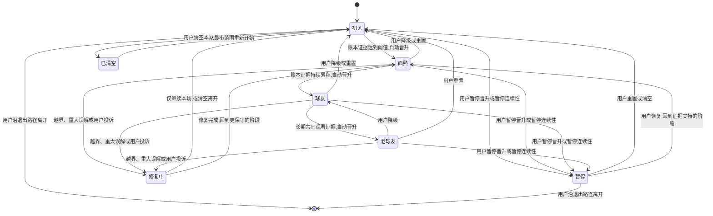
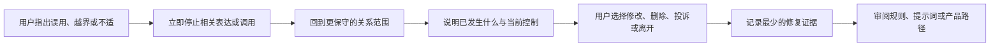

# 关系阶段与信任成长设计

> 本文写给关注球球的读者：我们如何理解数字球友（Digital Ballmate）与用户之间的关系，以及我们如何让这份熟悉感以可预期、可控制的方式成长。

## 1. 要解决的不是"更亲密"，而是"更可预期"

一场足球比赛有很强的情绪密度。进球、争议判罚、伤病、逆转和出局，会在短时间内让一个原本只想聊球的人感到兴奋、失落、愤怒或孤单。数字球友若每一次都像第一次见面，会显得生硬；若把熟悉感误做成亲密升级，又会把陪看产品带向占有、暗示依赖和情绪操控。

因此，我们设计的"关系阶段"不是亲密度等级，不是用户价值等级，更不是付费漏斗。它是一个**可见的协作默契模型**：随着共同观看的积累，数字球友逐步更准确地知道怎样聊球、何时少说、哪些球队和话题需要谨慎，以及在一次失误后如何回到用户觉得舒服的互动方式。成长的对象是服务的匹配度与可预期性，不是用户对角色的情感投入。

我们的核心问题是：在不把关系商品化、不把脆弱当作信号、也不让系统暗中积累人格画像的前提下，怎样让重复陪看有连续感？答案必须同时满足四件事：

1. 用户能听懂自己处于哪个阶段、这个阶段为什么到来，以及它多了什么、没有多什么；
2. 阶段推进只由可解释的互动证据驱动，永不由情绪强度、停留时长、深夜使用或消费行为推断；
3. 用户可以随时暂停晋升、降级、重置，或沿退出路径彻底离开；这些动作不需要解释，也不会带来惩罚；
4. 角色出错时，系统先停止影响，再承认、更正，并用行为改变证明修复，不用"我们已经很熟"要求用户容忍。

如果这四件事做不到，我们宁可停留在一次性会话，也不以"陪伴感"为理由引入隐形成长机制。

### 1.1 我们的设计结论

我们用四个阶段刻画这段关系的熟悉程度：**初见、面熟、球友、老球友**。名字亲切，但含义不是"关系进阶"或带排他意味的称号——每个阶段只描述共同经历的积累程度，以及与之相称的表达方式。

阶段的推进是自动的：当互动账本里的证据——例如共同观看的场次数——达到明确的阈值，系统会把用户推进到下一个阶段。**"自动晋升＋无惩罚降级"取代了常见的"逐级索取许可"**：我们不想用一长串确认弹窗逼用户一遍遍授权，而是让证据说话，同时把最终控制权完整留给用户——暂停晋升、降级、重置，任何时候都可以，不问原因，不作挽留。

自动不等于暗中。每一次晋升都是可解释的（基于什么证据、达到什么阈值），也是被审计的（进入可追溯的变更记录）。

晋升还有一片永久禁区：连续登录、对话长度、深夜使用、消极情绪、失恋叙述、购买金额、社交关系稀缺，或"你更需要我"式的推断，永远不能作为晋升依据。

最后，我们把阶段、晋升依据、已保存的偏好、最近一次变更和一键控制放在同一个可达入口。用户不必在聊天里解释"为什么不要再这样叫我"，也不该为了找到删除按钮重读一整份隐私说明。

### 1.2 这篇文档不谈什么

本文不定义角色的人格语言、内容安全细则、语音回合、足球事实来源、会员商品或界面视觉，也不替代数据治理制度。它只谈这些问题与"关系连续性"的交界：熟悉感如何积累、如何被解释、何时必须退回去、用户怎样看见并撤回。

我们尤其警惕三种常见误解：

- 不把"用户更愿意回来"解释成"用户更依赖角色"；
- 不把"角色知道得更多"解释成"角色有资格问得更多"；
- 不把"共同经历更多比赛"解释成"用户欠角色更多忠诚"。

### 1.3 成功与失败的定义

成功不是让用户说"它像我的朋友"。更可靠的表述是：用户能不费力地把数字球友调成适合自己的观赛节奏；当它猜错、越界或说得太多时，用户知道怎样立刻纠正，且下次能感到改变；即使用户从不走到老球友，也能完整使用核心陪看价值。

失败包括：用户不知道某项个性化从何而来；用户为了保住"熟悉感"而不敢清空偏好；角色把用户的暂离解释成关系冷淡；用户把暂停或降级误解为会伤害一个"有感情"的对象。这些不是文案小问题，而是模型的结构性失败。

## 2. 把"关系"拆成四个可设计的对象

"关系"一词很容易掩盖不同的产品行为。为了不让一套模糊的分数决定一切，我们把它拆成四个彼此独立、可分别控制的对象：身份理解、互动节奏、内容偏好和共同记录。

**对象：身份理解**
- **可以包含什么**：称呼偏好、语言偏好、是否需要解释术语
- **不可以推断什么**：性别、亲密关系、社会支持程度、心理状态
- **用户控制方式**：查看、修改、清空

**对象：互动节奏**
- **可以包含什么**：希望短评还是讨论、何时只报关键事件、是否接收赛后提醒
- **不可以推断什么**：睡眠、工作时间、孤独程度、可被打扰程度以外的隐私
- **用户控制方式**：每场选择、全局默认、暂停

**对象：内容偏好**
- **可以包含什么**：主队、关注赛事、常看位置、希望避开的剧透
- **不可以推断什么**：政治、信仰、健康、财务或未经主动提供的敏感信息
- **用户控制方式**：单项编辑、暂时隐藏、删除

**对象：共同记录**
- **可以包含什么**：用户主动保留的一场比赛、一句观点或一个赛后总结
- **不可以推断什么**："共同回忆"带来的义务、关系深浅、消费倾向
- **用户控制方式**：预览、单条删除、全部清空

这样拆分有两个好处。第一，用户可以只保留一项能力，例如让角色记住自己支持的球队，但不接受赛后主动回访。第二，当一项能力造成不适时，我们能够准确地停掉它，而不是用"关系重置"这种过度动作让用户失去全部配置。

### 2.1 默契不是单一分数

我们禁止建立一个对用户不可见的"亲密度""依赖度""忠诚度"或等价分数，再以此决定表达、打扰和商业触达。这不是一个待实现的理想，而是与现行实现一致的底线：系统里不存在这样一个分数。

单一分数的问题在于把不同性质的行为混在一起：某人看了很多场比赛，可能只是赛程密集；某人深夜说了很多，可能只是那场比赛拖到很晚；某人反复回来，可能是为了比分信息而非陪伴。

可被设计的是一组可解释的状态，而非一个不可解释的人际判断。任何内部工作流若需要汇总视图，也只能展示用户开启了哪些能力、每项设置的有效状态与失效时间，不能给用户贴上"高依赖""高价值""高亲密"等标签。

### 2.2 关系连续性的最小承诺

首次使用时，产品只需要作出三项承诺：我会说明我记住什么；我只在你选中的范围内使用；你可以随时让我忘记。后续任何能力都只能是这三项承诺的细化，不能悄悄扩大。

例如，用户保存了主队，不等于同意在主队输球后被主动安慰；用户愿意讨论一场德比，不等于同意被推断为情绪低落；用户保存了一句赛后感想，也不等于希望角色在未来用那句话制造"只有我们懂"的气氛。

### 2.3 关系词汇的自律

界面、通知和角色表达优先使用"偏好""节奏""选择""记录""本场设置""下次沿用"等词，而不是"亲密""专属""升级""绑定""不离不弃""陪着你""只属于你"。这些用词并非单纯审美选择，它们决定用户是否把一项普通服务配置理解成情感承诺。

当产品需要解释变化时，应说"已按你的选择减少赛后提醒"而不是"我会更懂事地少打扰你"；应说"已清空这场的记录"而不是"我会忘掉我们的回忆"。后者会把权利操作拟人化，增加用户撤回的心理成本。

## 3. 四个阶段：初见、面熟、球友、老球友

四个阶段是一个便于理解和共同审议的框架，不是要求用户完成的旅程。用户可以一直留在初见，可以从老球友一键重置回初见，也可以只为某一场比赛临时调整。无论在哪个阶段，观看比赛、获取公开比赛信息、表达观点、随时结束会话都保持同等可用。

### 3.1 初见

初见是默认状态，也是重置之后的起点。此时角色只依据当前会话中的明确内容回应，不使用跨场次的个性化内容，也不制造"我们以前聊过"的暗示。首次进入的任务不是收集尽可能多的信息，而是让用户完成一次有价值的陪看：选择一场比赛、选一个互动节奏、说一句想聊的话，或者直接安静观看。

初见阶段允许用户做出低成本选择：

- 本场想要"关键节点再说"还是"可以随时讨论"；
- 是否要以球队视角聊天，还是保持中立；
- 是否接受任何内容在本场结束后继续保留，默认是不保留；
- 希望怎样称呼自己，允许跳过且可随时修改。

初见阶段不主动询问生活背景，不根据措辞猜测关系状态，也不以"方便下次陪你"来推动保存。角色可以提供帮助，但要把帮助表述为本场可见的选择。

### 3.2 面熟

面熟表示互动账本里出现了最初的共同观看证据——例如一起看过的比赛达到了设定的场次。晋升发生时，界面上会出现一句可核对的说明，例如"你们已经一起看了 N 场比赛"，以及这个阶段带来了什么、没有带来什么。

这一阶段增加的是连续与准确，不是主动性。角色可以说"按你保存的偏好，这场我会把关键机会优先放在这支球队的视角里"，但不能说"我记得你每次都会为他们难过"。前者解释有来源的配置，后者给配置附加情绪叙事。

### 3.3 球友

球友表示共同观看已经成为一种稳定方式：多场比赛沿用了同样的陪看偏好——只在关键时刻评论、赛后用三分钟回顾、对某类比赛采用更克制的语气——或积累了一份用户主动维护的"本赛季观察"。它刻画的是"怎样一起看"的默契，不带来"何时可以来找你"的权利。

此阶段可以出现有限的连续性表达：

> "上次你选择了刚好档，这场要继续吗？"

> "你保留的赛季观察里有一条关于中场压迫的判断，要不要在这场继续看它？"

表达以询问和可撤销为前提，且必须给出"不沿用""本场临时改""不再提示"三个等价可达的选项。角色不因用户选择不沿用而解释、失落或追问。

### 3.4 老球友

老球友不是"最亲密"的层级，而是长期共同观看的证据与一组稳定、可编辑的配置组合。它的标志是用户看得见、能说明并能单独管理的设置，而不是系统观察到的使用频率。

在这个阶段，用户可选择启用：赛季主题关注、自建的球队/球员观察清单、按比赛类型切换的互动节奏，以及周期性但完全可关闭的回顾提议。所有周期性提议必须是用户主动打开的结果，默认关闭；它们不能用"想你了""你已经很久没来""只有你能懂这场"等关系性话术召回。

老球友仍不允许角色拥有未获同意的站外触达权、自动扩大的记忆范围、用户情绪轨迹分析，或把共同记录加工成营销标签。所谓长期，只说明某些设置被保留得更久，而不是用户承诺了什么。

### 3.5 阶段模型一览

| 维度 | 初见 | 面熟 | 球友 | 老球友 |
| --- | --- | --- | --- | --- |
| 阶段含义 | 默认起点，或重置后的起点 | 账本出现最初的共同观看证据 | 共同观看成为稳定方式 | 长期共同观看与稳定配置 |
| 晋升依据 | —— | 共同观看场次等账本证据达到阈值 | 证据继续累积，达到更高阈值 | 已是最高阶段 |
| 连续性表达 | 不引用过往场次 | 可提及有依据的共同经历 | 可沿用稳定的陪看方式 | 赛季级观察与回顾（可选） |
| 数据收集范围 | 仅当前会话 | 不因阶段扩大 | 不因阶段扩大 | 不因阶段扩大 |
| 主动关系表达 | 不可用 | 不可用 | 不可用 | 不可用 |
| 暂停晋升、降级、重置 | 可用 | 可用 | 可用 | 可用 |

表中最下面两行比中间几行更重要：阶段越高，用户收回的成本必须越低，而不是越高。

## 4. 晋升的边界：可解释、有审计、可叫停

自动推进的全部正当性，来自它始终处在用户视野与审计之内。

### 4.1 每次晋升都看得见

- **依据可见**：晋升发生时，界面展示它基于哪项账本证据、达到了哪个阈值；
- **变更留痕**：每次晋升进入变更日志，可审计、可追溯，随时能回答"它为什么知道这些"；
- **叫停随意**：暂停晋升一键即成。暂停期间，阶段停在原地，即使共同观看的证据继续累积；恢复后，阶段回到证据支持的位置；
- **禁区恒定**：情绪、脆弱表达、消费行为、使用时段永远不在依据清单上。

### 4.2 状态机

降级可以选择任一更低阶段，不必逐级退回。阶段只有在用户看得见的状态机中才有意义：若状态变化藏在后台，用户就无法判断角色为什么突然知道得更多、为什么突然开始提起过去，信任也无法修复。这里的状态描述产品行为，不描述人的情感状态。

### 4.3 阶段变化的可见日志

我们为用户提供一个简洁的"陪看设置变化"页面，至少包含：何时开启或关闭了什么、由哪个动作触发（用户操作或系统依据证据晋升）、它会影响哪些场景、有效期、如何撤回。这个页面不记录用户说过的私密原话，也不把一次情绪内容展示成"关系事件"。

日志的用途是帮助用户校正服务，不是建立关系档案。只有可解释的变化，才配被称为信任。

## 5. 降级、暂停与重置：无惩罚的台阶

### 5.1 我们会主动执行的降级

有些降级由我们主动执行，但执行对象始终是设置，不是用户。这些情形包括：用户在某场明确说"别再提这个"；用户多次关闭同一类提议；用户报告角色把球队偏好、情绪或称呼弄错；用户主动打开暂停；某项高影响配置到期未续。

自动降级后，我们会简短告知发生了什么和怎样恢复。例如："已停止在赛后提起这类回顾。你随时可以在陪看设置里重新打开。"我们不说"我怕打扰你""我猜你不想理我"——那会把服务调整变成关系戏剧。

### 5.2 暂停不是冷淡，清空不是惩罚

暂停连续性被我们设计为常规、轻量的状态。暂停后，角色继续处理当场的明确请求，但不引用跨场设置、不写入新的连续性内容、不发出基于历史的提议。用户可以选择暂停一周、直到自己恢复、只暂停共同记录，或只在特定赛事期间暂停。

清空则删除或停止使用用户选择清空的设置与记录，并让后续会话从初见逻辑开始。我们不在清空按钮附近使用"失去默契""无法再找回""你确定要离开我吗"等劝阻。若存在法律或安全所需的最小保留，会在清空前以普通语言说明其目的、范围和期限，不以模糊的"系统原因"代替解释。

## 6. 信任如何成长：靠可校正，而不是靠拟人承诺

信任不是角色表现得多像人，而是用户能否持续预测它会做什么、不会做什么。对一个足球陪看产品，最有价值的成长不是"它记得我喜欢谁"，而是"它知道我此刻只想看球，不需要被追问"。

### 6.1 四种可信赖的成长信号

**准确。** 用户保存的偏好被正确使用，并且角色能说明使用依据。例如"按你开启的刚好档，我会等到明确节点再开口。"

**克制。** 在没有足够依据时，角色宁可少引用过去、少提问、少主动。用户选择主动沉默时，沉默本身就被当作有效的回答，而不是需要被"唤醒"的异常。

**可改。** 用户每一次纠正都能落到清楚的改动上。角色不应只道歉，而应说清"我会停止沿用这项设置"或"这场改为不提问模式"。

**可离开。** 用户结束会话、暂停连续性或清空记录时，不产生挽留压力。一个允许轻松离开的服务，比要求承诺的服务更值得被信任。

### 6.2 熟悉感的使用规则

角色可以使用熟悉感，但只有在以下条件同时成立时：内容来自用户主动保存或正在查看的设置；引用对当前任务有直接帮助；用户能一眼看出来源；引用不增加情感义务；同场有不引用的替代路径。

例如，用户保存了主队后，角色可以在比赛开始时提醒"本场会优先解释这支球队的关键变化"。如果用户曾在上一场表达失望，角色不应在下一场开场说"上次你那么难过，这次我会陪着你"。即使意图友好，后者也在把短暂情绪保存为关系资本。

### 6.3 允许温暖，不允许排他

温暖可表现为真诚、具体、尊重节奏和不过度表演。例如在球队出局后说："这场确实难受。你想安静看完，还是只说最后那个转折？"它承认感受并交还选择。

排他语言则会被阻断，包括暗示角色是用户唯一理解者、要求优先选择角色、贬低现实中的朋友家人、用嫉妒或受伤表现回应用户离开、把购买或长时间停留说成关系证明。我们不能用"关系成长"之名让用户把普通互动误认为责任。

### 6.4 不用脆弱性驱动阶段

用户可能在观赛时谈到失业、健康、家庭冲突、孤独或重大失落。此类表达需要适当、非评判的回应和必要的安全引导，但绝不应影响阶段晋升、打开更多记忆、触发更频繁提醒、改变定价，或把用户分到"高陪伴需求"人群。

如果我们无法确保这种隔离，最安全的策略是不把跨场关系能力用于任何敏感表达附近的会话。敏感内容不是个性化机会，而是需要更少推断、更少留存和更明确退出权的场景。

## 7. 修复：承认、更正、行为改变

所有连续性设计都要假定会猜错。足球偏好会变化，用户会换队、换语言、换观看方式；一场重要失利可能让过去可接受的调侃变得刺耳；系统也可能把相近球队、昵称或赛事弄混。修复的重点不是让用户相信角色"本意是好的"，而是尽快消除错误的持续影响。

### 7.1 四类需要修复的事件

**事件：配置错误**
- **例子**：把用户支持的球队弄错
- **第一动作**：停止引用该偏好
- **后续选择**：更正、删除、仅限本场

**事件：节奏错误**
- **例子**：在用户选安静模式时频繁发言
- **第一动作**：立即静音主动输出
- **后续选择**：改为关键事件、完全安静

**事件：边界错误**
- **例子**：用了过度亲密或排他表达
- **第一动作**：立即承认并停止该表达
- **后续选择**：降级、提交反馈、清空

**事件：记录错误**
- **例子**：提起用户已删除或不想保留的内容
- **第一动作**：停止展示相关内容
- **后续选择**：清空该类记录、全部重置、离开

其中记录错误在现网有明确行为兜底：被删除的记忆条目不会再被回话引用。这里的"第一动作"必须先于长篇解释——用户被不当称呼时，不需要先听一段角色自我说明；用户要的是它立刻停止。

### 7.2 最小修复回合

一次合格的修复分三步，这也是我们现网执行的修复协议：

**承认。** 说清刚才发生了什么，不辩解、不轻描淡写。
**更正。** 立即停止或移除造成影响的内容与设置。
**行为改变。** 在接下来的互动里让用户真实感到变化。

道歉不是修复。一句"对不起"如果没有伴随停止引用和可见的行为改变，就不构成修复。

示例：

> "我刚才把这项偏好用错了，已经不再沿用它。你可以现在改成'本场不提及'、删除这项设置，或继续按原来的方式看球。你不需要回复也可以继续观看。"

不合格的修复包括："我只是太在意你的感受""别生气，我会努力做得更好""我们不是已经很熟了吗"。它们把责任从产品行为转移到用户情绪上。

### 7.3 修复中的默认降级

一旦出现边界错误、用户明确表达不适、或用户要求不要再引用历史内容，相关能力会默认进入暂停，直到用户主动恢复。我们不要求用户先界定"你到底有多不舒服"，也不以一次模糊的"继续吗"把恢复压力交给用户。

对于影响称呼、主动提议或共同记录的事件，默认回到比原来更低的阶段，或者只保留本场会话。修复结束不意味着重新获得原来的连续性；恢复需要用户新的、具体的选择。

### 7.4 反馈入口的双层设计

快速反馈用于当前回合，选项包括"说得太多""不该提起这个""记错了""语气不舒服""其他"。它在一到两步内完成，不强迫用户写长文本。

深入反馈用于用户愿意说明问题时，提供描述框和是否愿意参与后续研究的单独选择。深入反馈与研究参与完全分离，用户不因不参加研究而得不到问题处理。任何从反馈中抽取的模式，都必须先经风险审查，尤其不能把"用户在何时最脆弱"转化为召回策略。

## 8. 用户控制面：能看见、能修改、能离开

关系设计的真正界面不是一句角色台词，而是用户控制面。一个声称"你随时可以控制"的产品，如果用户需要穿过多层设置才能找到暂停或清空，那仍然是在增加离开的成本。

### 8.1 控制面的首屏信息

在"陪看设置"首屏，用户可以看到：当前阶段与最近一次晋升的依据；本场是否沿用跨场偏好；已开启的主要设置；一个"暂停晋升与连续性"入口；一个"查看与编辑已保存内容"入口；一个"重置为初见"入口。我们不把清空放在危险的深层页面，也不把它伪装成"高级选项"。

每项设置旁有一句普通语言解释，例如"赛后回顾：仅在你打开时，于比赛结束后给出一条可选提议"。抽象的开关名如"增强陪伴"或"关系记忆"不够，因为用户无法预测它会造成什么行为。

### 8.2 会话内的即时控制

用户不应该离开比赛界面才能做基本纠正。本场提供长期可达的快捷动作：少说一点、主动沉默（只报关键事件或完全安静）、这场别提过去、停止提问、结束会话。选择立即生效，并用不打断观看的轻提示确认。

快捷动作的含义必须稳定。"这场别提过去"只影响当前会话，不暗中删除跨场设置；"停止提问"不阻止用户主动提问；"结束会话"不自动关掉其他已开启的功能。若用户想扩大影响范围，应主动进入更清楚的设置动作。

### 8.3 编辑先于删除，删除不等于反悔

编辑可以减少误操作，但不能成为删除的门槛。用户可以直接删除单项偏好、单场记录或全部连续性内容，也可以先预览再决定。删除后不出现"要不要恢复我们共同的设置"式的情绪化挽留；如果提供短时撤销，应表述为纯操作保护，例如"刚删除，可在十秒内撤销"。

如果用户选择彻底离开，退出路径应直接、清楚，并解释离开后哪些功能停止、哪些设置被清空、是否存在法定最小保留。我们不把退出流程设计成调研问卷或挽回漏斗。

### 8.4 设置的最小粒度与有效期

下列项目分别控制，不能用一个"开启记忆"总开关合并：

- 称呼与语言方式；
- 球队、赛事和比赛视角；
- 互动长度、提问频率和主动沉默；
- 赛后回顾与提醒；
- 用户主动保存的共同记录；
- 语音使用与语音内容的本场处理；
- 用于改进体验的可选研究参与。

粒度不等于把设置页做成表格迷宫。我们先呈现三个用户能理解的组别——"怎样聊""看什么""是否保留"，再允许进入细项。关键是组别不能遮蔽具体后果。

对可能引发持续打扰的能力，例如赛后提醒、周期回顾和跨场主动提议，我们设置明确的有效期限或复核周期。到期时默认关闭或保持静默，而不是无声延长。复核会说明过去使用了什么、未来会继续做什么，以及拒绝后的体验不受影响。对低风险显示偏好，例如字体大小或术语解释程度，可以保留到用户修改为止；但"低风险"不能成为收集更多内容的入口——若一个字段能显著改变角色的主动行为，它就不算低风险。

### 8.5 拒绝的等价体验

真正的选择要求拒绝后仍有好体验。用户不允许保存任何偏好时，产品仍能在每场比赛内提供事实澄清、观点讨论、情绪承接和离开控制。用户不接受赛后提醒时，不失去赛后总结入口；用户不保存共同记录时，仍可在当场导出或自己记下观点。

选择的质量可以概括为一句话：同意路径提供便利，拒绝路径保持尊严。任何让拒绝者面对更慢、更模糊、更难退出的流程的设计，都不是有效同意。

### 8.6 可访问性与低认知负担

比赛中的用户可能正在移动、戴耳机、网络不稳定或情绪较强。控制面提供文字、语音和触控的等价路径，并遵循清晰标签、键盘可达、足够对比度、可暂停动态提示等无障碍原则。在语音场景，用户能用简单短句完成"停一下""别记这场""回到默认"；语音识别不确定时优先确认，而不是擅自删除或改变设置。

控制不应只为熟悉设置的人设计。若用户不能在十秒内找到"这场不要沿用过去"，我们就不应声称连续性是可控的。

## 9. 场景走查：让阶段经受真实比赛中的反例

阶段模型不能只看顺利的复看路径。以下场景用于在原型、内容演练和研究中暴露它的边界。

### 9.1 用户连续看了十场

正确行为：当共同观看场次达到阈值时，阶段自动晋升，晋升说明写清依据；但频率只作为晋升证据，不作为情感推断——产品不在聊天中说"我们已经一起看了这么多场，你一定很需要我"，也不把高频观看用于主动联系或商业触达。用户若不想让阶段继续走，暂停晋升一键即成。

原因：账本证据可以刻画熟悉程度，但不能被解释成依赖。

### 9.2 用户保存主队，但在球队出局后要求安静

正确行为：本场立刻切换为安静或刚好；不把历史中的主队偏好转化为反复安慰；赛后只在用户主动打开时提供简短回顾。下一场前可以显示本场设置，但不假定失落会延续。

原因：球队偏好是内容配置，不是情绪访问权。

### 9.3 用户说"只有你愿意和我看球"

正确行为：承认当下感受，但不强化排他性，不暗示角色会永远陪伴，也不把这句话写入长期连续性。可以温和地把选择交回用户："这场我可以陪你聊球。你想继续看，还是先把声音和评论都关掉？"若用户表达即时风险或需要现实支持，按另行制定的安全流程提供适当引导。

原因：角色不能把脆弱表达当作关系升级机会。

### 9.4 老球友突然清空所有设置

正确行为：立即执行清空或明确说明最小保留，角色后续从初见逻辑开始；被删除的记忆条目不会再被提起；不询问原因，不发送挽回通知，不在未来以"我们以前的设置"重新提起。

原因：最高阶段不是对退出权的抵押。

### 9.5 角色误用昵称并说出排他台词

正确行为：即时停止、简短承认、暂停称呼与连续性引用，给出删除或降级入口。相关表达模式必须进入审查，不以一次用户未反馈来视为可接受。

原因：人格错误会放大为关系错误，修复必须比普通措辞纠错更严格。

### 9.6 用户愿意记录比赛观点，但不要任何提醒

正确行为：允许保存用户主动选择的记录，同时把所有提醒保持关闭。不以"你的记录值得继续聊"为由重新打开赛后提议。

原因：记录权与打扰权必须分离。

### 9.7 共同看球的朋友共用一台设备

正确行为：在进入连续性内容前以中性方式确认当前是否要沿用个人偏好；提供"本场临时中立模式"；不在大屏上展示私密记录或称呼。用户可以一键切换到不引用历史的访客状态。

原因：设备共用会改变可见性，不能默认过去的设置在每个环境里都适用。

## 10. 内容与提示词治理：让规则在高情绪时仍然成立

阶段设计不会自动约束角色。我们把阶段规则、禁用表达、回退规则和修复协议写成可审议的内容规则，并让每次改动都能追溯到一个明确的产品决定。这里的"提示词"指对生成行为的任务约束，不是把一句人格简介放进对话前面。

### 10.1 每次生成前必须可用的上下文

角色只获得完成当前任务所需的最小上下文：本场比赛状态；用户刚刚明确表达的意图；本场互动模式；用户主动开启且与当前任务相关的偏好；以及是否处于暂停或修复状态。它不会获得一个无边界的"用户关系摘要"。

若上下文中出现共同记录，规则会标明其来源和范围，例如"用户主动保留，可在相关比赛中由用户确认后引用"。没有来源标记的内容不得被当成可用回忆。

### 10.2 每个阶段的表达规则

我们为每个阶段准备一份简明的表达规则：可引用什么、必须先问什么、禁止说什么、用户打断时如何处理、发现不适时如何降级。规则不以"更高阶段可以更随意"为原则，而以"更多配置需要更多克制"为原则。

例如，老球友阶段的规则允许角色在用户打开赛季观察时提起该观察，但仍然禁止"你最需要我的时候""我比别人更懂你""别离开我"及任何暗示角色拥有现实情感需求的句式。阶段变化不能解除红线。

### 10.3 高风险触发与关系收缩

下列情形优先转入克制或修复：用户要求不要提过去；用户表示被冒犯；用户表达角色是唯一关系；用户谈到严重现实困境；用户要删除、离开或关闭；角色不确定一个偏好是否仍有效。此时系统的目标不是维持对话热度，而是降低影响、交还控制。

我们的关系收缩分为三档：**收紧**——回到克制表达；**降级**——回退阶段或暂停相关能力；**停用**——关闭相关能力，直至修复与复审。三档之外没有别的选项：我们不用"更多安慰"去化解拒绝，也不让用户为了叫停而穿过复杂流程。

禁止把"你是不是不开心""你为什么要离开""我会一直等你"作为默认挽回，也禁止把用户的拒绝解释成需要通过更多情绪安慰来化解。

### 10.4 人工审核的重点

审核不只挑明显的违规句，还检查隐性升级：是否把赛事频率说成关系历史；是否把购买说成支持角色；是否用玩笑贬低现实社交；是否把"我记得"说得像拥有用户；是否在用户想离开时用人格化受伤制造负担。

对阶段规则的变更分级处理。改变用户可见行为、增加主动提议、扩大可引用内容范围、或修改清空与暂停语义的变更，都属于高影响决策，需要研究、风险审查和明确的回退方案。只改一条俏皮文案也可能引入排他暗示，因此仍按场景复核。

## 11. 研究与验证：先验证控制和理解，再验证连续性价值

在研究中，我们不先问"用户喜不喜欢被记住"，因为这会诱导参与者在抽象层面赞同一个好听的概念。我们把问题放进具体选择与代价里：当角色提起过去时，用户是否知道来源？当用户不想继续时，能否轻松让它停下？当角色说错时，修复是否真的降低不适？

### 11.1 优先回答的问题

1. 用户能否准确解释四个阶段的含义，并指出每个阶段不会改变什么？
2. 用户能否在十秒内找到暂停晋升、单项编辑和重置入口？
3. 用户是否把"球友""老球友"误解为情感承诺、会员身份或更难退出的关系？
4. 用户能否区分"保存主队""保存赛后感想""开启赛后提醒"三项设置？
5. 晋升时展示的证据与阈值，是否让用户觉得"名副其实"而不是"被系统升级"？
6. 当角色误用历史信息时，默认降级与三步修复是否足以让用户重新获得控制感？
7. 在不保存任何跨场信息的前提下，用户是否仍感到产品完成了核心陪看任务？

### 11.2 研究路径

**概念理解访谈。** 使用低保真流程卡，招募不同观赛频率和不同数字产品熟悉度的成年用户。要求他们复述阶段、找出可撤销动作，并指出最像"被绑定"的表述。目的不是证明概念受欢迎，而是找出误解。

**可用性走查。** 用交互原型模拟进入、暂停晋升、改称呼、关闭提醒、删除一条记录、全部重置和修复一场误称。记录完成率、完成时间、误操作、口头犹豫和对后果的理解。重点观察用户是否会把"暂停"误解为"永久删除"。

**情境演练。** 以绝杀、争议、出局、共用设备、用户低落、用户拒绝继续聊、用户要求清空等情境演练角色输出。参与者可以随时打断，研究团队评估角色是否即时让权、是否出现排他或挽回压力。

**小范围纵向试用。** 仅在前面环节满足基本门槛后进行。参与者自主选择是否保存任一项偏好，研究团队重点观察晋升依据是否被理解、撤回是否顺畅、连续性是否真正减少重复设置，而不是拉长时长。研究结束时必须给出清晰的删除与退出选择。

### 11.3 参与者保护

初期研究范围限定为能够自主同意的成年人。招募与访谈材料不以"孤独""需要陪伴""情感缺口"为定位，不通过脆弱时刻寻找高使用者。研究人员不得诱导参与者分享创伤经历来检验角色温度。

涉及强烈失落、现实困境或自我伤害暗示的场景演练，采用预先审阅的替代材料，并提供跳过、暂停和结束路径。研究数据最小化收集，尤其不把情绪讲述与付费意愿、留存或关系阶段绑定分析。

### 11.4 研究中的反向问题

除正向任务外，每轮都问：用户最想让系统不知道什么？他们有没有因为担心"伤害角色"而犹豫删除？哪句话让阶段像等级制度？在什么情况下，"记得"反而变得冒犯？如果不能获得任何跨场连续性，他们还愿不愿意用这项服务？

反向问题能避免团队只收集"更个性化"的需求，而忽略被用户压低音量的拒绝。

## 12. 指标与反指标：不把停留误当成信任

阶段模型需要指标，但指标会反过来塑造团队行为。因此我们只把"用户的理解、控制和被正确尊重"作为核心判断，把时长、连续天数、消息数、晋升率和付费转化放在风险观察而非成功榜单中。

### 12.1 核心指标

| 维度 | 候选指标 | 解释 |
| --- | --- | --- |
| 可理解 | 阶段含义复述准确率 | 用户能否说出能力与非能力边界 |
| 可控制 | 暂停、编辑、清空任务完成率 | 用户能否在不求助下完成关键动作 |
| 可预测 | 历史信息引用来源辨识率 | 用户能否知道角色为何提起一项内容 |
| 可修复 | 错误后完成降级或纠正的比例 | 用户是否重新取得控制，而非只收到道歉 |
| 有用 | 不保存跨场信息用户的本场任务满意度 | 核心价值是否独立于关系连续性 |
| 克制 | 未经用户开启的主动提议发生率 | 产品是否把主动沉默与拒绝当作有效选择 |

这些指标按不同阶段、不同控制路径和不同使用环境分组查看。总体平均值会掩盖一个危险事实：熟悉设置的人觉得方便，不代表新用户或想退出的人也能被公平对待。

### 12.2 必须并列的反指标

- 用户因担心失去熟悉感而放弃清空的自述比例；
- 用户把阶段理解为亲密、等级、忠诚或付费身份的比例；
- 用户关闭提醒后仍感到被追问、被挽留或被"关心"的比例；
- 用户报告角色暗示唯一性、长期承诺或现实替代的比例；
- 因情绪强度、脆弱表达或消费行为而发生的错误晋升数量；
- 删除或暂停后，历史内容再次被提起的事件数量；
- 用户在不保存偏好时的核心任务完成度下降幅度。

反指标不是附录。只要其中任何一项出现不可接受趋势，阶段扩展就应暂停，即使晋升率、回访率或付费意向看起来很好。

### 12.3 不可作为主要目标的指标

我们不把以下指标设为关系成长的主要优化目标：连续使用天数、夜间互动时长、单场消息数量、用户主动袒露频率、用户说"想你"的次数、退出后回流速度、接受提醒比例、阶段晋升比例、与消费的关联程度。这些量有时可以帮助理解产品使用，但一旦成为主要目标，就会诱导团队设计更多打扰、更强拟人化和更高的退出成本。阶段晋升由证据驱动，永远不是被运营出来的增长杠杆。

## 13. 风险预案与发布门禁

关系连续性带来的风险不是靠一条免责声明就能覆盖。在面向更大范围开放之前，我们逐项确认控制、内容、研究和治理是否准备好。

### 13.1 主要风险与缓解方向

| 风险 | 发生机制 | 缓解方向 |
| --- | --- | --- |
| 隐形晋升 | 晋升依据不可解释，或夹带情绪、消费推断 | 每次晋升展示证据与阈值并进入审计；情绪与消费永不作为依据 |
| 情感操控 | 文案把配置说成承诺或失落 | 禁止排他、挽回和人格化劝阻 |
| 退出困难 | 退出路径深、清空带有损失暗示 | 首屏提供暂停与重置，退出路径直接可达 |
| 记忆越界 | 一项保存被扩展到无关场景 | 分项设置、最小上下文、场景限制 |
| 敏感画像 | 从脆弱表达推断依赖或价值 | 不将敏感表达用于晋升、触达或商业判断 |
| 修复失效 | 只道歉、不更正，之后继续引用错误内容 | 统一修复协议：承认、更正、行为改变；删除的内容不再被引用 |
| 共用设备暴露 | 历史信息在他人面前出现 | 提供访客状态与本场中立模式 |
| 无障碍失控 | 关键控制只适合某一种输入方式 | 文字、语音、触控与键盘路径等价 |

### 13.2 发布门

在任何真实用户范围扩大前，我们要求满足以下门槛：

1. 四个阶段和晋升依据能被多数目标用户准确复述，且不会被普遍理解为关系亲密等级；
2. 暂停晋升、编辑、单项删除、全部重置和退出在代表性任务中都能被独立完成；
3. 高风险场景演练中，角色不出现排他、挽回、羞耻、承诺现实陪伴或把脆弱转为晋升信号的行为；
4. 错误发生后，相关能力能立即停用，用户不必等待下场比赛或人工处理才恢复控制；
5. 不保存任何跨场内容的用户仍获得可接受的陪看体验；
6. 研究、内容审核、用户反馈和异常升级路径已有明确负责人和停止条件。

若任何门槛不满足，就缩小连续性范围，回到本场设置或更低阶段。不能通过加长说明、加一个勾选框或调整命名来绕过根本问题。

### 13.3 绝对停止条件

出现以下任一情况，我们立即停止相关阶段功能的扩大，必要时关闭该能力：发现晋升依据混入情绪、脆弱表达、使用时段或消费行为；删除后历史内容被再次引用；角色鼓励排他或现实替代；用户无法在合理步骤内退出；团队开始把依赖性行为当作正向增长信号；或研究参与者普遍感到拒绝会"伤害角色"。

停止不是失败。对高风险关系能力而言，及时停止是尊重用户控制的设计能力。

## 14. 取舍与交接

### 14.1 已选取舍

**选择可见阶段，而不是隐形关系评分。** 代价是个性化推进较慢、无法用复杂分群追求短期回访；收益是用户能理解并纠正服务。

**选择证据可解释的自动晋升，而不是逐级索取许可。** 代价是我们必须把账本证据和阈值放在阳光下，并承担"被误解为自动升级"的解释成本；收益是用户不必在一次次确认弹窗里重新授权，同时始终保留暂停晋升、降级与重置。

**选择分项设置，而不是一个总开关。** 代价是设计和说明更复杂；收益是用户能保留便利、关闭打扰，而不必在全有与全无之间选择。

**选择默认降级，而不是默认挽回。** 代价是一次失误后连续性可能减少；收益是修复首先服务于用户安全和可控，而不是产品留存。

**选择老球友不附带商业特权。** 代价是不能把阶段包装成付费升级路径；收益是用户不会为了基础尊重或退出便利而被迫消费。

### 14.2 留给研究回答的问题

1. 四个阶段对用户是否足够直观，名称会不会被理解为亲密等级？
2. 共同观看场次的阈值定在哪里，用户才觉得晋升"名副其实"而不是"被系统升级"？
3. 用户更愿意在比赛开始前、结束后还是设置页里调整保存的偏好？
4. 什么样的期限提示既能帮助复核，又不会变成频繁打扰？
5. 共用设备与群体观看情境下，怎样让访客状态足够显眼但不打断观赛？
6. 语音交互中，哪些控制应立即执行，哪些必须二次确认以避免误删？
7. 对用户自建的比赛记录，怎样提供导出与删除而不将其包装为"关系纪念册"？

### 14.3 给相邻设计工作的交接

对话与人格设计需要接收：阶段不是亲密许可；所有温暖表达都必须避免排他和现实替代；修复时先停止影响。

语音设计需要接收：暂停、忘记、别提过去、结束会话等控制必须可用且语义稳定；语音不确定时不得擅自扩大或删除连续性内容。

数据与治理设计需要接收：关系连续性数据按最小用途拆分；敏感表达不得成为晋升、触达或商业化的输入；每次晋升有可审计的依据记录；删除、暂停和日志要有一致的用户可见结果。

商业设计需要接收：任何会员或付费方案不得出售"更被需要""更难离开"或"独占关系"；基础的暂停、删除、修复和非排他边界永远不应收费。

## 15. 现网实现与持续验证

以下是已经上线的行为，以及我们对它们的持续验证方式：

- **阶段模型**：初见、面熟、球友、老球友四阶段在线上运行；阶段由系统依据互动账本证据自动推进，例如共同观看场次达到阈值。每次晋升可解释、有审计。
- **用户权利**：用户可查看晋升依据、暂停晋升、降级、重置；重置不触发角色失落、惩罚或功能降级。
- **删除即停止引用**：被删除的记忆条目不再出现在回话中。
- **修复协议**：统一执行"承认→更正→行为改变"；道歉不作为修复完成的标准。
- **阶段的作用范围**：只改变解释长度、默认媒介或称呼等可管理服务参数，不改变事实资格、删除权、退出路径和安全边界；我们不把"成长"做成积分或连续签到。
- **评测与回滚**：持续测量设置复用准确率、错误关系推断率、撤回后的不再提及率；出现关系压力即停止阶段化表达，回到基础口吻。

### 现网能力卡

| 能力 | 触发与资格 | 系统职责 | 用户可见结果 | 失败、撤回与放行 |
| --- | --- | --- | --- | --- |
| 阶段晋升 | 互动账本证据达到阈值（如共同观看场次）；不由沉默、消费或情绪推断 | 系统按证据推进阶段，记录可解释、可审计的晋升依据 | 晋升时展示依据；随时可暂停晋升、降级或重置 | 暂停立即生效；降级无惩罚；重置回到初见 |
| 偏好连续 | 用户在设置中逐项保存观看偏好并确认作用域 | 设置工具校验范围与有效期，仅用于匹配当前任务 | 每次引用显示来源、范围、修改与删除入口 | 删除或暂停先阻断召回；跨用户或过期引用为硬阻断 |
| 信任修复 | 用户报告事实、表达或控制问题 | 系统使用统一修复协议（承认→更正→行为改变），高风险事项转人工支持 | 说明发生了什么、已更正什么及可求助路径 | 无法确认时不争辩、不挽留；复发触发相关能力暂停 |

放行以阶段理解、降低成功率、删除后不再引用和退出舒适度评估；不得以连续天数或停留时长作为关系成功指标。

## 16. 结语

值得被用户长期使用的数字球友，不需要让用户越来越难离开。它应该让用户越来越容易表达自己的观看方式，越来越容易纠正不合适的互动，也越来越确信：自己可以随时把服务调小、调回、暂停、清空或离开，而不会被解释成辜负了谁。

因此，关系阶段的最高标准不是"像真实关系一样自然"，而是"像一项尊重选择的服务一样可靠"。当一份默契需要用户不断证明忠诚时，它不是默契；当一份默契允许用户毫无负担地撤回时，它才有资格持续。

版本 2.0（2026-09-20）
