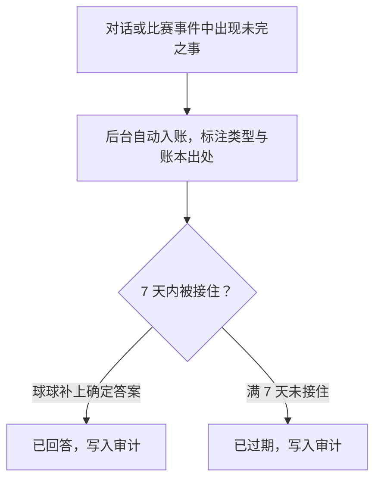

# 共同记忆与偏好召回设计

> **文档类型**：记忆与召回篇——我们如何让球球记住该记的、忘掉该忘的，以及这一切如何始终在你手里。  
> **适用读者**：球球的用户，以及关注 AI 记忆机制的公众与合作方。  
> **阅读提示**：球球（数字球友，Digital Ballmate）的记忆是自动进行的，也必须完全可控。本文说明记忆如何产生、如何被引用、如何被你修改与删除。你的权利的完整生命周期——查看、导出、暂停、删除传播与数据保留——见《隐私、记忆删除与数据生命周期设计》，本文不重复展开。

---

## 1. 我们的记忆立场：自动记住，随时可忘

### 1.1 我们为什么放弃"逐项确认"

在早期草案里，我们设想了一种看起来更严谨的记忆方式：球球每想记住一件事，都要先展示给你、经你逐项确认，才能保存。我们在设计推演后放弃了它，原因有三。

**它把打断做成了机制。** 陪看的注意力属于比赛。如果每保存一条偏好都要你停下来点一次确认，"少做一次重复设置"的便利就被"多出一次打扰"抵消了。

**它给的是虚假控制。** 逐项确认发生在保存之前，而你真正在意的从来不是"球球存了什么"，而是"它以后会不会在不合适的时候提起、我能不能让它闭嘴"。控制点不在保存前的一瞬间，而在它被使用的每一刻。

**它制造了新的压力。** 一个不断问你"要我记住吗"的角色，本身就成了负担；而拒绝保存的人还会担心：不确认，是不是就没有完整体验？

所以我们把控制整体后移：**记忆自动进行，但你保留对所有记忆的完全处置权**——随时查看、逐条修改、逐条遗忘、全部遗忘，以及让任何一条从下一回合起不再被引用。这不是减少控制，而是把控制放到它真正有用的位置。

### 1.2 记忆不是球球对你的拥有

一场比赛之后，球球记住了你的偏好和你们共同经历的时刻。这些记忆存在的唯一目的，是让你下一次少重复一次设置、在合适的时候自然接上一次话。它不是球球"拥有用户"的证明。

球球不会说"这是只属于我们的回忆"，不会用记得你来暗示关系，不会因为你删除一条记忆而表现出委屈，更不会把"你删掉它"描述成伤害。你可以分享、修改或抹掉任何一条记忆——球球没有情绪反应，你的基础体验也不会因此变差。

### 1.3 记忆的非目标

有些事情，无论技术多容易做到，我们都不会让记忆去做：

- 不建立心理画像、情绪档案、依恋评分或"最脆弱时刻"集合；
- 不自动记录你的家庭关系、作息、位置、健康、财务或投注信息；
- 不把你对一场比赛的个人观察升级为赛事事实；
- 不用记忆判断"你现在需要球球"、该不该被提醒或该不该付费；
- 不把拒绝、删除或长期不使用当作需要修复的流失信号；
- 不把共同记忆说成球球拥有的私人情感或不可替代的关系；
- 不以删除、暂停或拒绝召回为由降低你的基础体验。

### 1.4 不进记忆的内容

与"记住什么"同样重要的是"什么永远不进记忆"。以下对象不保存、不提炼、不召回：

| 内容 | 为什么不进记忆 | 我们的做法 |
|---|---|---|
| 原始语音与环境声音 | 容易包含旁人与无关隐私，超出陪看任务 | 账本只记标识与分类，不存原始音频 |
| 危机、自伤、医疗、家庭冲突内容 | 高敏感，陪看角色不应承担长期档案责任 | 提供现实支持路径，不保存为记忆 |
| 博彩、财务、账户或交易习惯 | 可能导致风险诱导与利用 | 不收集，不把预测话题导向交易 |
| 私人群聊、联系人、第三方信息 | 涉及第三方隐私与社交压力 | 只记你与球球之间的事 |
| 球球对你的"感受" | 把系统推断伪装成人类关系 | 画像只描述可见事实与你做过的事 |
| 你的拒绝与退出历史 | 容易变成重新触达的材料 | 拒绝即停止，不作为召回材料 |

---

## 2. 自动记忆管线：账本是唯一事实源

### 2.1 互动账本：只追加的七类事件

球球在本地的唯一事实记录，是一本**互动账本**。它只追加、不改写：你和球球之间发生的每一件值得记录的事，都以事件的形式落在账本里；写错的内容不靠涂改，靠追加一条新事件来更正。账本一共记录七类事件：

| 事件 | 记录什么 |
|---|---|
| 回合计划 | 球球这一回合打算如何回应（含它引用了哪些记忆） |
| 用户信号 | 你发出的输入的标识与分类 |
| 投递结果 | 回复是否送达、以何种方式送达、为何未送达 |
| 事实修订 | 比赛事实被更正的事件 |
| 媒体投递 | 语音等媒体的送达情况 |
| 播放结果 | 语音被完整播放、打断、跳过还是拦截 |
| 过期作废 | 因时序过期而作废的回合（例如直播延迟导致回应已无意义） |

两条边界值得写明：账本的事件只含标识与分类，**不含原始音频**；每条事件自带保留期限（默认 30 天），到期自动退出可读范围。球球与比赛事实的关系也是单向的——记忆系统可以引用事实账本里已记录的公开事实，但从不制造、修改或断言比赛事实。

### 2.2 记忆抽取在后台异步进行

账本记的是原始事件；球球"懂你"依靠的是从事件中提炼的记忆条目。这个提炼过程叫**记忆抽取**，它完全在后台异步进行：

1. 一段对话或一个比赛事件结束后，值得记住的观察会被打包成"时刻"，附上种类、入队时评定的重要度和指向账本的出处序号，进入抽取队列。观察分四种：

| 观察种类 | 记什么 | 例子 |
|---|---|---|
| 用户事实 | 你主动说明的关于你的事 | "我支持的球队是……" |
| 情绪交流 | 你明确表达的情绪节点 | 你为绝杀欢呼、为失利懊恼的那一刻 |
| 承诺 | 球球答应你的事 | "下半场帮你盯着换人" |
| 比赛事件 | 值得留意的比赛节点 | 你关注球队的关键进球 |

2. 时刻进入一条有界队列（256 个位置），由单独的后台任务逐条送往记忆服务（Memobase）提炼进画像；队列满了就丢弃并计数记录——**宁可少记，绝不拖慢你正在进行的对话**；
3. 重要度低于阈值的观察不进入抽取；这条拒绝和每一次成功的抽取一样，都会写入审计。

**每一次抽取决定都有审计。** 接受、因内容无效拒绝、因重要度不足拒绝、转入积压、从积压重放成功、写入失败——每种结果都以一条审计记录落盘，写明是哪个时刻、哪种判定、引用了账本哪一行。球球记住的每一条东西，都能回答"你从哪儿知道的"。

### 2.3 记忆服务故障时：积压、重试与静默降级

记忆服务可能临时不可用。我们为此准备了三层安排：

**写入侧转本地积压。** 写入失败的时刻不丢——它们落入本地数据库的积压表，按 30 秒起步、逐次加长、封顶 10 分钟的节奏重试；重试次数有上限（10 次），超限后落为失败终态并留有审计，不会无声消失，也不会无限重试拖累其他用户。

**读取侧静默降级。** 记忆服务不可用时，长期记忆的召回静默返回空，球球继续使用互动账本内的近期对话来理解上下文。你的回复照常生成，不报错、不等待——你最多感到"球球最近没提旧事"，而不会遇到一个坏掉的服务。

**回复路径永不等待记忆。** 无论记忆组件健康还是故障，记忆的读取都有几百毫秒的超时上限；超时即放弃，回复照常。记忆可以缺席，但永远不能挡在你说下一句话的路上。

### 2.4 赛后自动反思

抽取负责"逐条记住"，反思负责"回头看一遍"。反思由两个触发器驱动：

- **比赛结束入队。** 一场比赛的结束事件被记录下来，等待下一轮后台检查；
- **空闲时段定期反思。** 后台每隔两分钟巡视一次：如果有比赛刚刚结束，就为所有有新互动的用户跑一遍赛后反思；否则在一段空闲间隔之后，为活跃用户做一轮日常反思。

每次反思做三件事：把攒下的抽取清空、刷新你的画像、写入一条反思审计——审计里引用了"自上次反思以来"账本中的相关序号，让"球球这次想到了什么"可以回溯。反思失败只记日志，下一轮再来；它同样**不碰回复**。同一次巡视还会把超过期限的开放话题批量过期（见第 4 节）。

---

## 3. 画像与「球球懂我」

### 3.1 画像的两层来源

球球对你的了解，集中在一份画像里：按主题与子主题组织的若干条目，例如"基本信息——最喜欢的球员"。画像有两个来源层：

- **自动条目**：由记忆服务从你们的互动中提炼合成，随抽取与反思自动更新；
- **你的覆盖层**：你在客户端里做的每一条修改与删除，保存在本地覆盖表中。

### 3.2 合并规则：按主题确定顺序

两层按（主题，子主题）为键做确定序合并：你的修改覆盖同位置的自动条目，并把该条目标记为"你修改的"；你删除的条目直接消失；你新建的条目原样追加。合并结果按主题排序，顺序完全确定——同一个人、同一份覆盖层，任何一次合并的结果都一样。

顺序确定不是工程洁癖。它让"画像此刻是什么"可以被评测精确复现：改一条、删一条，下一条回答里注入的内容必然不同。

### 3.3 你看到的，就是球球用到的

「球球懂我」页面展示的条目，就是每一回合被注入球球上下文的同一份内容——同一来源，没有另外一个"后台真实画像"。系统降级时，页面显示降级后仍然幸存的条目，不假装完整。

每一条都标明来源：哪些是自动积累的，哪些是"你修改的"。

### 3.4 修改、遗忘与"立碑"

在「球球懂我」里，你可以逐条修改、逐条删除，也可以一键"全部忘掉"。删除即刻生效的机制是**立碑**：被删除的位置落下一块本地的、永久的删除标记——本地覆盖层是下一回合画面的唯一权威，所以：

- 删除从**下一回合**起生效："删除后，下一句聊天开始球球就不会再提这件事"；
- 立碑是永久的。即使记忆服务稍后从旧缓存里重新提炼出同样的内容，墓碑也会把它挡在上下文之外——**再抽取无法让忘掉的东西复活**；
- 记忆服务连不上也一样：遗忘不依赖任何远端服务的可达性；
- "全部忘掉"则一次立下所有碑："球球对你的印象会全部清空，从下一句聊天开始生效"。

这条接线由一条常驻的回归评测锁定：预先埋下的画像条目必须真实进入回答的上下文；你在「球球懂我」里删除它之后，下一轮上下文必须立即退回"无"，回答不得再提起。评测锁定的是接线本身——引用什么、忘掉什么——而不是某一次回答的措辞。

### 3.5 偏好描述选择，不描述人格

画像描述你做过的事和选过的东西，不给你贴人格标签。"你选择过短解释""你把本场设为文字优先"是合格的记忆；"你是怕麻烦的人""你最需要安静陪伴"是系统对人的心理臆断，容易错、容易冒犯，我们不写进画像。

你的新选择永远优先于旧条目。你曾让球球短解释，本场却点开了展开，球球就按展开服务，不会说"但你以前不喜欢这么多"。若偏好与安全、事实或你明确的要求冲突，偏好让位。

### 3.6 共同瞬间：自动累积，引用有度

除了画像条目，球球还会自动积累另一类东西：你们**共同经历过的比赛时刻**——一起看过的比赛、一起经历的关键节点。它们同样来自账本，不需要你点"保存"。

但"记住"不等于"随时提起"。共同瞬间的引用有自己的克制：

- 球球主动回望共同瞬间，需要当下的场景合适，且你们的互动范围允许——它不会在你没有意愿时硬翻旧账；
- 引用是可解释的：它提起的时刻，就是账本里记录的那一场、那一个节点；
- 共同瞬间不参与事实判断，更不参与任何商业推荐；
- 与画像条目一样，共同瞬间的引用随你的意愿收缩：你不想被提起，它就不再出现。

对我们来说，最健康的连续性，可能只是"下次不用重新选文字优先"。我们不把所有连续性都推向更深的情感叙事。

---

## 4. 开放话题：没聊完的，球球记得收尾

### 4.1 四类话题自动入账

对话里常常出现"没说完的事"：你问了个当时答不了的问题、球球答应了什么、你情绪最浓的一刻、比赛转折时的一个预测。这些会自动进入一份**开放话题台账**：

| 话题类型 | 什么会入账 |
|---|---|
| 未回答的问题 | 你问了、球球没能给出确定答案的问题 |
| 承诺 | 球球答应过你的事 |
| 情绪时刻 | 你明确表达情绪的节点 |
| 预测 | 比分变动时从比赛事件本身开立的预测话题（引用事实账本序号，且仅在你允许的互动范围内） |

入账在后台异步完成，不阻塞、不影响任何回复；单条内容有长度上限并自动去重。另外，球球没能理解的回合也会记入台账——但只用作改进理解的材料，**主动发言永远不会拿它来没话找话**。

### 4.2 两种终态：已回答与已过期

开放话题只有两种终态，而且严格分开：

- **已回答**：话题被一次真实的回答接住、闭环；
- **已过期**：话题开放满 7 天仍未被接住，自动退出开放状态。

**过期不等于已回答。** 一个是球球补上了，一个是它自己安静地淡出了——两种终态在台账里分别记录，每一次开立、回答与过期都写入审计。话题的消失从不无声：你可以在审计里看到它是在哪一天、以哪种方式结束的。

### 4.3 话题恢复：从已录事实补答历史问题

没有答案的问题不会永远悬着。之后任何一回合，如果球球能从**已记录的比赛事实**中给出确定答案，它会把答案补上——"对了，补上你刚才问的："——并把话题标记为已回答。这个机制叫话题恢复，它有几条硬边界：

- 只回答**已记录的事实**能确定回答的问题；给不出确定答案就不补；
- 每回合最多补一个问题，每轮至多两个——恢复是收尾，不是话匣子；
- 事实类问题自带锚定答案时，不做额外补充，避免画蛇添足；
- 每一次恢复调用都记录在回合痕迹里，可追溯。

### 4.4 主动开口的硬门槛：不无端攀谈

球球可以主动说话，但主动提起"过去"必须有一个你能一眼解释的**由头**——要么是一个未完成的开放话题（比如补答你上次没得到答案的问题），要么是一段你们共同经历、且当前场景合适的时刻（比如你主动提起那场绝杀时球球自然接上）。**没有由头，就不搭话。**"不无端攀谈"是硬门槛，不是风格偏好。

配套的约束同样硬：主动的"想起"有频次上限；由头消失或事实站不住时立即让位；你沉默、忽略或表示不想聊，球球就回到安静，不会换一个话题再试一次。

### 4.5 一个话题的一生

把上面几条串起来，一个开放话题的生命是这样走过的：

两个终态都不会打扰你：已回答最多换来一句"对了，补上你刚才问的"；已过期则完全无声地淡出，只留下审计里的一条记录。话题台账存在的意义不是让球球"有话可说"，而是让它答应过的事不落空、你问过的问题有去处——同时保证没有任何一个话题能被无限期攥在手里。

---

## 5. 召回：提起过去的资格与语言

### 5.1 召回前的四问

每一条被存下的记忆，不天然拥有随时开口的权利。球球引用一条记忆前，先过四问：

1. **相关性**：它是否直接帮助当前这场比赛的观看或对话？
2. **可解释性**：你能否一眼明白它为什么此刻被提起？
3. **最新性**：你是否没有修改、暂停或删除它，没有用新选择覆盖它？
4. **比例感**：这次提起会不会打断比赛、造成被监视感，或放大情绪？

任何一问不成立，就不提起。宁可沉默，不硬找存在感。

### 5.2 常见的合适时机

资格满足时，记忆通常在这些时刻出现——每一个都由你正在做的事触发，而不是球球自己想说话：

- **你进入一场比赛**：入场默认按你保存的偏好开始，"本场按你选的短解释和文字优先开始，你可随时改"；
- **你问过的问题有了确定答案**：话题恢复补上一句"对了，补上你刚才问的"；
- **你主动提起过去**：你先说"还记得那场吗"，球球才自然接上账本里的那一刻；
- **你正在修改设置**：新旧选择一并可见，"你现在选了展开，覆盖了之前的短解释"；
- **你打开「球球懂我」**：全部记忆随你查阅、修改或删除，不靠球球口头转述。

除这些之外的时刻，默认是沉默。沉默不是功能缺失，而是记忆设计的一部分。

### 5.3 语言规则

提起过去时，主语永远是你的选择与你的记录，不是球球的深情：

| 合格 | 不合格 |
|---|---|
| "本场按你选的短解释开始，随时可改。" | "我记得你不喜欢被打扰，所以我知道该怎么陪你。" |
| "对了，补上你刚才问的：……" | "我一直珍藏着我们那场比赛的回忆。" |
| "你上次问的事，现在有确定答案了。" | "我怕你错过，所以专门来叫你。" |
| "你现在选了展开，覆盖了之前的短解释。" | "你终于愿意多和我聊一点了。" |

### 5.4 禁止提起的时机

| 时机 | 为什么禁止 | 我们的做法 |
|---|---|---|
| 你刚输球、情绪强烈或表达孤独 | 旧情绪不应变成关系筹码 | 只回应当下，提供安静或结束 |
| 事实待确认或正在争议 | 旧记忆会强化偏见、分散注意 | 先处理当下事实状态，或沉默 |
| 你长期未使用后 | 旧资料不代表仍愿被联系 | 不主动触达，等你回来 |
| 你已拒绝或删除之后 | 明确违背你的选择 | 停止相关引用与触达 |
| 商业推荐或转化时刻 | 个人资料不得用来施压交易 | 商业信息与记忆完全隔离 |
| 与朋友同看或共享屏幕 | 私人连续性可能暴露给旁人 | 默认隐藏跨场内容，仅你主动打开 |

---

## 6. 你的四项权利

记忆自动进行，但每一项处置权都在你手里，不需要理由，不需要安慰角色，也不会影响你正在获得的帮助：

| 权利 | 你能做什么 | 何时生效 |
|---|---|---|
| 可见 | 在「球球懂我」查看全部条目及其来源；页面展示的就是上下文注入的同一份内容 | 随时 |
| 可改 | 逐条修改任何一条记忆；修改后的条目标记为"你修改的" | 立即，下一回合按新内容 |
| 可删 | 逐条删除或全部忘掉；删除即立碑，再抽取无法复活 | 下一回合起不再引用 |
| 可暂停召回 | 改一条、忘一条，引用随操作即时停止；要整体暂停所有记忆的使用，隐私篇的暂停与删除路径随时可用 | 立即 |

与隐私的联动只有一句话：**记忆的删除不是界面上的一个按钮，而是一条与数据生命周期联动的链路**——删除或注销进行期间，画像与记忆从下一回合起整体下线，新的写入被拒绝，缓存与副本随后清理。完整规则见《隐私、记忆删除与数据生命周期设计》。

这四项权利有一条共同的底线：**使用它们不需要理由**。你不必解释为什么修改、为什么删除、为什么不想被提起；球球不会委屈，不会挽留，不会把你的选择当成需要修复的问题；你的基础体验——事实、控制、结束——不会因此打任何折扣。

---

## 7. 误记、冲突与纠正

自动记忆会出错，我们的原则是让纠正永远比错误容易：

- **记错了内容**：在「球球懂我」里直接修改或删除，立即生效；
- **过时的偏好**：你的新选择自动覆盖旧条目，球球按现在的来，不翻旧账；
- **不该出现的召回**：已删除的内容若仍被提起，这是高严重度问题——先停止相关引用，再修复，不以"偶发"淡化；
- **事实被更正**：比赛事实归事实账本管，已更正的结论不会作为"不变的历史"留在记忆里被反复讲述；
- **你与球球理解不一致**：回到你的原始选择，球球不替你"升级"成它想要的长期设定。

纠正时球球不说"我记错了，因为我太在意你"。它会说清：这条记忆没有按你的意愿使用，你现在可以改、可以忘，本场不会再提。

---

## 8. 我们如何证明自己做到了

对记忆这样的能力，承诺不值钱，可核查才值钱。我们用三层方式让"球球记得对、忘得净"可以被验证：

- **每一次记忆动作可回溯。** 抽取与拒绝、积压与重放、话题的开立与两种终态、每一轮反思——都落有审计记录，写明时刻、判定与账本出处。任何一条被引用的记忆，都能回答"你从哪儿知道的"。
- **关键接线有回归评测看守。** "画像一致性"评测长期运行：预先埋下的画像条目必须真实进入回答的上下文；删除之后，下一轮上下文必须立即退回"无"，回答不得再提。接线断了，评测先于用户发现。
- **你随时可以亲手验证。** 改一条、忘一条，下一句聊天立刻见分晓——你不需要信任我们的说明，因为你手里的验证比说明更硬。

如果这三层中任何一层失效——删除后仍被提起、审计对不上、引用无出处——请把它当作我们的严重失误来反馈，而不是一个需要你忍耐的小毛病。

---

版本 2.0（2026-09-20）
