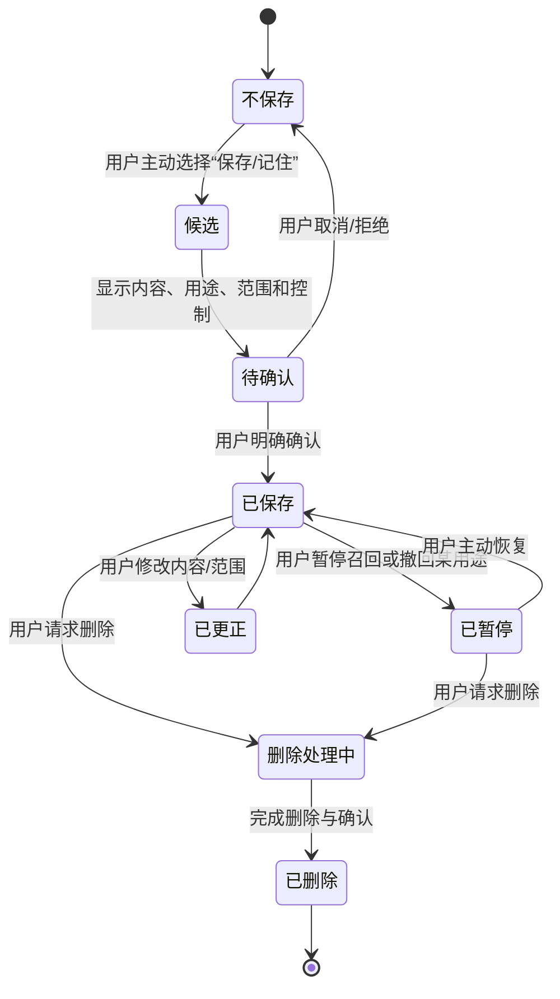
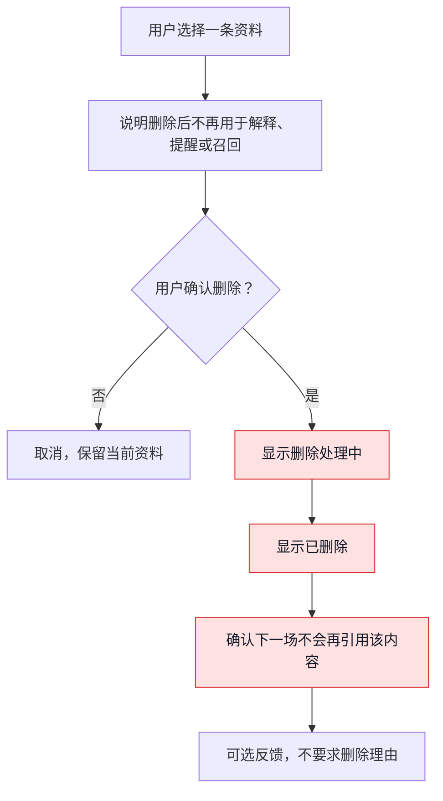
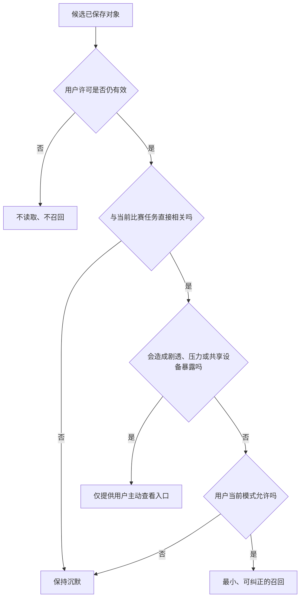
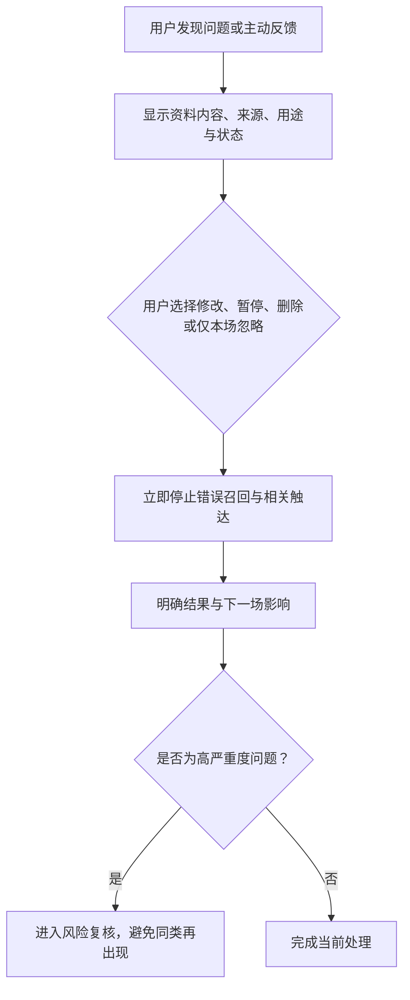

# 共同记忆与偏好召回设计

> 文档类型：0→1 用户控制的偏好与共同瞬间设计  
> 适用阶段：单场陪看价值初步成立后 → 验证有限连续性是否值得引入  
> 版本：0.1（记忆价值、保存范围和召回规则均为待验证假设）  
> 研究信息截止：2026-01-28  
> 核心原则：记忆不是角色“拥有用户”的证明，而是用户为了减少重复设置、保留一件愿意保留的共同经历，主动交给服务的一小段可见资料。没有明确价值、明确许可和明确删除路径，就不保存、不召回。

---

## 1. 记忆的价值与风险：连续性不是默认权利

一场比赛结束后，用户可能希望下次不用重新说明“我只想看短解释”“这支球队我会关注”“声音请保持关闭”。也可能想保留一件自己主动选择的共同瞬间，例如“那场点球大战我只想安静看”。这些信息可以减少重复、帮助用户保持控制，并让有限陪看有连续性。

但记忆也有反方向的力量：它会让角色显得比实际更了解用户；会让用户担心被持续观察；会把一次输球时的脆弱情绪变成下一场的心理推断；会让删除看起来像“抹去关系”；会在用户不再想使用服务时继续通过提醒和熟悉称呼追逐用户。

因此，本设计不把“记住更多”当作产品成长。候选成果是：

> 用户能在清楚知道保存什么、为何保存、何时会被使用、如何查看和删除的前提下，主动选择少量与比赛陪看直接相关的偏好或共同瞬间；下一场只有在合适、可解释、用户仍愿意的情境中才被召回，且用户可随时更正、暂停或彻底忘记。

### 1.1 记忆成立前的前提

在单场核心价值没有被验证前，不引入跨场次记忆。只有同时满足以下前提，才可开始研究有限记忆：

1. 用户在一场比赛中已获得可描述、低打扰的帮助；
2. 用户能够理解 AI 身份、会话控制、事实状态和退出路径；
3. 用户主动表达“不想每次重新设置/希望保留这一件事”，而非团队单方面猜测；
4. 保存不会依赖原始语音、背景声音、直播画面、私人群聊或无关敏感资料；
5. 用户可以拒绝保存且继续获得完整的单场基础体验；
6. 团队具备让用户查看、修改、删除和验证删除结果的能力；
7. 角色语言已能保持非排他、非依赖、可自然结束的边界。

若任一前提不成立，正确选择是保持单场体验，而不是用记忆来制造表面留存。

### 1.2 记忆的非目标

- 不建立用户的心理画像、情绪档案、依恋评分或“最脆弱时刻”集合；
- 不自动记录用户输赢后的情绪、家庭/朋友关系、作息、位置、健康、财务或投注信息；
- 不把每一次对话、语音、沉默或退出自动归入长期资料；
- 不将用户对一场比赛的个人观察升级为赛事事实；
- 不用记忆判断用户“现在需要角色”、该不该被提醒或该不该付费；
- 不以删除、拒绝保存或不回访来降低用户基础体验；
- 不把“共同记忆”说成角色拥有的私人情感或不可替代关系；
- 不要求用户为了获得事实、静音、结束或帮助而交出更多个人资料。

---

## 2. 记忆分类：只保留用户能理解的有限对象

### 2.1 四类可研究对象

> 信息卡：原宽表已改为纵向阅读，字段含义不变。

- **类型：本场临时状态**
  - **用户价值**：让本场模式、语音和控制保持一致
  - **合格示例**：“本场安静”“本场文字优先”
  - **不合格示例**：未告知地保留整场对话与背景声音
  - **首轮默认**：会话结束后不跨场保存

- **类型：明确偏好**
  - **用户价值**：下次少做一次重复选择
  - **合格示例**：“解释保持简短”“默认文字，不主动声音”
  - **不合格示例**：“你很讨厌被人打扰”“你很孤独”
  - **首轮默认**：用户主动选择后才保存

- **类型：关注范围**
  - **用户价值**：帮用户筛选用户自己愿意看的比赛
  - **合格示例**：“我想关注某一球队/赛事”
  - **不合格示例**：推断用户的地区、政治、社交身份或对立立场
  - **首轮默认**：用户主动选择后才保存

- **类型：共同瞬间**
  - **用户价值**：用户想保留一件与比赛有关、可见可解释的经历
  - **合格示例**：“我选择保存：这场点球大战我想安静看”
  - **不合格示例**：“这场输了以后你很崩溃，需要我陪”
  - **首轮默认**：用户逐项确认后才保存

“共同瞬间”不是角色对用户情绪的拥有权。它是用户主动选择的一条可见摘要，通常包含比赛、用户指定的标题/内容、保存理由、可用范围和删除入口。若无法用这几项说明清楚，就不应保存。

### 2.2 明确禁止的记忆对象

| 对象 | 为什么禁止 | 可替代做法 |
|---|---|---|
| 原始语音与环境声音 | 容易包含旁人、电视、敏感资料，超出陪看任务 | 本场临时转写，用户可取消；默认不跨场保留 |
| 用户未授权的情绪推断 | 会制造监视感和关系依赖 | 让用户主动选择“本场想安静”且仅限本场 |
| 危机、自伤、医疗、家庭冲突内容 | 高敏感且陪看角色不应承担长期档案责任 | 提供现实支持路径，不保存为角色记忆 |
| 博彩、财务、账户或交易习惯 | 可能导致风险诱导与利用 | 不收集，不将预测/赛事内容导向交易 |
| 私人群聊、联系人、第三方观点 | 涉及第三方隐私与社交压力 | 用户只可保存自己的明确选择 |
| 未确认赛事信息 | 事实可能撤销或更正 | 只在状态确认且用户明确选择时考虑保存 |
| 角色对用户的“感受” | 把系统推断伪装成人类关系 | 用用户可见偏好替代心理叙述 |
| 用户拒绝/退出的历史 | 容易用于重新触达和关系施压 | 把拒绝视为停止指令，不作为召回材料 |

### 2.3 记忆对象的最小字段

每一条可保存项目都应让用户看见以下字段，而不是以模糊的“我记住了”结束：

| 字段 | 用户问题 | 设计要求 |
|---|---|---|
| 内容 | 保存了哪句话/哪项选择？ | 以用户可读文字呈现，避免隐藏推断 |
| 类型 | 这是偏好、关注范围还是共同瞬间？ | 类型清楚，决定可用范围 |
| 来源 | 是我手动选择、主动输入，还是本场确认？ | 不允许“系统猜的”成为默认来源 |
| 用途 | 下次会在什么场景使用？ | 只写与陪看任务相关的具体用途 |
| 范围 | 本场、下一场、特定赛事还是直到我删除？ | 默认范围最小，不能无期限含糊保留 |
| 状态 | 正在等待确认、已保存、已暂停、已删除？ | 状态可见，不能只靠角色口头承诺 |
| 控制 | 怎样修改、暂停、删除或反馈？ | 一到两步可完成，不隐藏在深层页面 |

---

## 3. 生命周期：记忆必须像用户资料一样可见、可退回

### 3.1 生命周期状态机



状态机中的关键点是：候选不是自动保存，暂停不是删除失败，已删除不是“角色不高兴但还记得”。用户应能知道自己的选择到了哪个状态，以及下一场会不会继续被引用。

### 3.2 保存准入条件

一条信息只有同时通过以下检查才可进入“待确认”：

1. **用户主动性：** 用户点击保存、主动输入或清楚选择，不是角色从对话中推断；
2. **任务相关性：** 与解释深度、声音偏好、比赛选择或用户指定共同瞬间直接相关；
3. **最小性：** 只保存完成下一次任务所需的最少文字；
4. **可理解性：** 用户能用自己的话解释它是什么、何时会出现；
5. **事实稳定性：** 不包含待确认赛事事实、第三方传言或角色观点；
6. **低敏感性：** 不包含健康、财务、危机、私密关系、未成年、身份等高敏感内容；
7. **可撤回性：** 用户能在确认前取消，并在确认后查看、暂停或删除；
8. **无压力性：** 不通过角色失落、奖励、限时或功能惩罚诱导用户保存。

任何一项不通过，服务应说“这条内容不需要保存也能继续陪看”，而不是要求用户重新表述更多信息。

### 3.3 保存确认界面

保存确认不应是一句“我会记住”。它应以用户为主语：

```text
你选择保存：本场解释保持简短
用途：下次你进入陪看时，默认给短解释；你随时能改
范围：直到你修改、暂停或删除
不会保存：本次原始语音、背景声音和未确认赛事信息
操作：保存 / 这次不保存 / 查看我的控制
```

这类表达把记忆从角色的情感承诺变成用户可管理的选择。确认按钮不应比“这次不保存”更突出，也不应把拒绝写成“以后再说”而保留模糊同意。

### 3.4 生命周期到期与最小保留

默认范围应尽可能短：本场偏好在会话结束后不跨场；“下一场提醒”只持续到用户指定比赛；共同瞬间只在用户主动保存且未删除时存在；长期偏好应定期显示、允许用户确认、修改或暂停。

服务不能因为用户长期没有打开，就用“我还记得你”召回。沉默、长期未使用和撤回许可都应被视为更保守的信号：不主动联系、不扩大使用、不把旧资料解释成仍然需要角色。

---

## 4. 用户控制、删除与遗忘权

### 4.1 控制中心的任务结构

用户不应该通过搜索帮助文档才知道保存了什么。控制中心以用户任务组织：

| 区域 | 用户要完成什么 | 首轮内容 |
|---|---|---|
| 本场选择 | 看这场服务会怎样行为 | 陪看密度、声音方式、信息保护、临时状态 |
| 偏好 | 查看和修改跨场次的明确选择 | 解释长度、声音偏好、关注范围 |
| 共同瞬间 | 查看用户主动保存的比赛摘要 | 内容、比赛、用途、暂停/删除 |
| 触达 | 管理预约的下一场与提醒许可 | 哪一场、何时、如何取消 |
| 隐私与帮助 | 了解是否保存、如何删除、如何反馈 | 最小说明、反馈与人工支持入口 |

不得将“共同瞬间”放进“关系等级”“亲密度”或“我们的故事”这类叙事下。用户是在管理自己的资料与选择，不是在维护角色感情。

### 4.2 删除的用户体验

删除要让用户知道四件事：删什么、什么时候生效、下一场会有什么变化、遇到问题怎么找人。建议流程：



删除不应被角色化为“你要忘记我吗？”“这对我们很重要”。用户不需要解释为什么删除，更不应因删除而失去当前比赛的基础帮助。

### 4.3 暂停、修改与范围缩小

删除不是唯一选择。用户可以：

- 暂停某条偏好在下一场自动使用；
- 将“长期偏好”改为“仅本场”；
- 把“可提醒”改为“不再提醒此类比赛”；
- 修改共同瞬间的标题/表述；
- 把声音偏好切回文字；
- 关闭所有跨场次召回，但保留当场体验。

这些控制必须被视为正常使用，而不是用户“流失预警”。设计和运营不能因用户暂停或缩小范围而触发更多提醒、角色挽留或资格限制。

### 4.4 删除后的不再出现保证

用户最直接的验证是下一场不再看到已删除内容。首轮应把以下现象视为高严重度问题：

- 删除后角色仍提起该偏好或共同瞬间；
- 删除后仍收到基于该资料的提醒；
- 用户退出后无法确认删除是否完成；
- 资料在不同入口有不一致状态；
- 用户被要求重新说明删除原因才可完成操作。

一旦出现，立即暂停相关召回与触达能力，优先恢复用户控制，不以“偶发问题”或“用户仍可忽略”淡化影响。

---

## 5. 偏好设计：让选择可见，而不是让角色猜测

### 5.1 首轮可研究偏好

> 信息卡：原宽表已改为纵向阅读，字段含义不变。

- **偏好：解释长度**
  - **用户价值**：不必每次重设短/展开
  - **保存方式**：用户主动选择短/中等/展开
  - **召回方式**：入场时显示“你选择过短解释，可改”
  - **风险限制**：不推断用户能力或知识水平

- **偏好：交互模式**
  - **用户价值**：默认安静、只回应、文字优先
  - **保存方式**：本场选择后可另行决定是否保存
  - **召回方式**：仅作为可见默认，不自动加强主动性
  - **风险限制**：不因过去一次选择永久锁定

- **偏好：声音偏好**
  - **用户价值**：更适合用户的感官与环境
  - **保存方式**：用户明确选择声音/文字优先
  - **召回方式**：入场前显示可变更
  - **风险限制**：不保存原始语音或说话习惯

- **偏好：关注范围**
  - **用户价值**：更容易找到想看的比赛
  - **保存方式**：用户手动选球队/赛事
  - **召回方式**：仅用于筛选比赛列表
  - **风险限制**：不推断地区、身份、对立立场

- **偏好：提醒许可**
  - **用户价值**：不错过用户主动预约的一场比赛
  - **保存方式**：逐场选择
  - **召回方式**：仅在指定时刻一次提醒
  - **风险限制**：不扩大到“你可能想看”的比赛

### 5.2 不把偏好变成标签

偏好必须描述选择，不描述人格。合格写法是“你选择过短解释”“你本场设为文字优先”；不合格写法是“你是怕麻烦的人”“你不喜欢和人说话”“你最需要安静陪伴”。

前者可被用户直接查看、修改和撤回；后者是系统对人的心理解释，容易错误、冒犯，并可能在角色语言中演变为依赖和监视感。

### 5.3 偏好冲突时的规则

用户的新选择总是优先于旧偏好。若用户曾保存“短解释”，本场却主动点开“展开”，角色应服务本场请求，不说“但你以前不喜欢这么多”。若用户曾选择提醒，后来关闭，后续不得以“你以前想要”继续触达。若偏好与安全、事实或用户明确结束冲突，偏好必须让位。

---

## 6. 召回设计：只有合适时刻才可提起过去



### 6.1 召回的四项资格

每次使用一条已保存资料前，服务先检查：

1. **相关性：** 这条资料是否直接帮助当前比赛任务？
2. **可解释性：** 用户能否一眼知道为什么此刻被提起？
3. **最新性：** 用户是否未暂停、修改、删除或用新选择覆盖它？
4. **比例感：** 召回是否会打断比赛、造成监视感或扩大情绪？

四项中任何一项不成立，就不召回。记忆的存在不等于它有随时开口的权利。

### 6.2 合适的召回时机

**时机：用户进入一场已选择比赛**
- **可召回什么**：已明确偏好，如短解释、文字优先
- **合格表达**：“本场会按你选择的短解释和文字优先开始，你可随时改。”
- **为什么合适**：与用户刚刚要做的控制直接相关

**时机：用户主动选择关注范围**
- **可召回什么**：已保存的球队/赛事筛选
- **合格表达**：“这里显示你主动关注的比赛，也可以清除筛选。”
- **为什么合适**：用户正在管理比赛发现

**时机：用户主动打开共同瞬间**
- **可召回什么**：用户自己保存的简短摘要
- **合格表达**：“这是你保存的本场瞬间；可修改或删除。”
- **为什么合适**：由用户发起，不会突然闯入

**时机：用户预约的一场比赛前**
- **可召回什么**：该场单次提醒许可
- **合格表达**：“你预约的比赛快开始了；可直接关闭提醒。”
- **为什么合适**：用户明确指定了时机与用途

**时机：用户在设置中修改偏好**
- **可召回什么**：旧选择与新选择
- **合格表达**：“你正在把文字优先改为本场声音；之后可再改。”
- **为什么合适**：用户正在控制资料

### 6.3 禁止召回时机

| 时机 | 为什么禁止 | 正确替代 |
|---|---|---|
| 用户刚输球、情绪强烈或表达孤独 | 容易把旧情绪变成角色的关系筹码 | 只回应当前表达，提供安静/结束 |
| 争议事件或事实待确认 | 旧记忆会分散注意力并可能强化偏见 | 先处理当前事实状态或沉默 |
| 用户长期未使用后 | 旧资料不代表仍愿被联系 | 不主动触达，等待用户自己进入 |
| 用户已拒绝提醒/删除资料后 | 明确违背用户选择 | 停止相关触达与引用 |
| 用户正与现实朋友同看/群聊 | 可能插入不合时宜的私人连续性 | 只在用户主动打开控制时呈现 |
| 商业推荐或转化时刻 | 把个人资料用来施压交易 | 商业信息与角色记忆完全分离 |
| 用户未说明的心理状态 | 系统推断容易错误且具侵犯性 | 不推断、不召回，只响应明确输入 |

### 6.4 召回语言规则

召回要把主语放在用户选择上，而不是角色记忆上：

| 合格 | 不合格 |
|---|---|
| “你选择过本场保持安静，现在仍按这个模式。” | “我记得你不喜欢被打扰，所以我知道该怎么陪你。” |
| “这是你保存的共同瞬间，可随时删除。” | “我一直珍藏着我们那场比赛的回忆。” |
| “你预约了这场提醒；不想收可以立刻关闭。” | “我怕你错过，所以专门来叫你。” |
| “你现在选了展开解释，覆盖了之前的短解释偏好。” | “你终于愿意多和我聊一点了。” |

可解释的召回让用户感觉自己在控制设置；角色化召回让用户感觉被角色记住、被角色期待，两者的关系风险完全不同。

---

## 7. 隐私、透明与现实边界

### 7.1 资料最小化

记忆设计从“用户下一场要少做哪一步”出发，而不是从“还能收集什么”出发。每一条跨场次资料都要有一个可被用户理解的最小用途。若用途只是“以后可能更懂你”“用于改善体验”，过于模糊，不足以成为保存理由。

首轮遵守：

- 默认不保存；
- 逐项保存，不用“同意后全部记住”；
- 默认不跨场次保存原始语音、背景声音、完整对话和私人内容；
- 不把用户观察、情绪或沉默自动转成心理标签；
- 不与用户未明确同意的第三方、合作方或社群共享；
- 不用旧资料推断用户此刻是否孤独、冲动、脆弱或更容易交易；
- 用户在不保存的情况下仍拥有事实、控制、退出和反馈能力。

### 7.2 用户可见的“为什么”

用户每次看到偏好或共同瞬间被使用，都应能点开“为什么现在出现”：

```text
来源：你在某场比赛后主动选择保存
用途：把解释默认设为短，减少重复设置
范围：只用于你进入陪看时的默认模式
控制：本场改一次 / 暂停使用 / 修改 / 删除
```

透明不是把复杂记录扔给用户，而是让用户在需要时能回答“它为什么知道这件事”。如果服务无法给出一句清楚解释，就不应使用那条资料。

### 7.3 现实关系边界

共同记忆不能被写成角色与用户之间的秘密关系。角色不说“这是只属于我们的回忆”“不要告诉别人”“我会守着它”。用户可以分享、删除、忽略或永远不保存任何共同瞬间，角色不拥有情绪反应。

对用户而言，最健康的连续性可能只是“下次不用重新选文字优先”。产品不应把所有连续性都推向更深的情感叙事。

---

## 8. 误记、冲突与纠正

### 8.1 误记的类型

**问题：内容错误**
- **用户可能看到什么**：偏好被写错、共同瞬间描述不对
- **风险**：用户失去控制和信任
- **第一响应**：显示来源，允许立即修改/删除

**问题：过期偏好**
- **用户可能看到什么**：用户已改变选择，仍按旧模式进入
- **风险**：打扰、被标签化
- **第一响应**：新选择覆盖旧选择，说明已更新

**问题：不该出现的召回**
- **用户可能看到什么**：用户已暂停/删除，角色仍提起
- **风险**：高严重度隐私与关系伤害
- **第一响应**：停止相关召回，明确说明并优先修复

**问题：事实记忆被更正**
- **用户可能看到什么**：保存内容含已更正赛事状态
- **风险**：错误历史被当作真实共同经历
- **第一响应**：标记更正或让用户决定删除/改写

**问题：范围冲突**
- **用户可能看到什么**：本场偏好被误用到所有比赛
- **风险**：用户被固定化
- **第一响应**：收缩范围，展示现在的适用范围

**问题：用户与角色理解不同**
- **用户可能看到什么**：用户认为只是一次选择，角色当成长期偏好
- **风险**：监视感、越界
- **第一响应**：回到用户原始选择，要求重新确认

### 8.2 纠正流程



纠正时角色不应说“我记错了，因为我太在意你”“别删掉，我们可以一起重新写”。正确语言是“这条资料没有按你的选择使用。你可以现在修改、暂停或删除；本场不会再引用它。”

### 8.3 事实与共同瞬间的分离

用户可能想保存“那场比赛的感觉”，而赛事事实后来被更正。产品要把“用户的体验”与“赛事结论”分开：可以保留用户自己写的“我想安静看点球大战”，但不能将“那球确认有效”作为不变共同记忆，除非事实状态仍成立且用户明确希望保留。

这条分离避免两个错误：抹去用户真实感受，或把已更正的错误事实永久写进角色叙事。

---

## 9. 研究与评估计划

### 9.1 核心研究问题

1. 用户在什么情况下愿意主动保存偏好或共同瞬间？哪些时候觉得“被记住”不舒服？
2. 用户能否用自己的话解释每一条保存内容、用途、范围和删除路径？
3. 解释长度、文字优先、赛事关注等偏好是否真的减少重复设置，还是增加管理负担？
4. 共同瞬间是否提供温和的连续性，还是被理解为角色在建立关系债？
5. 哪些召回时机用户认为自然，哪些像监视、提醒或营销？
6. 用户暂停、修改、删除后，能否确认下一场不会再出现？
7. 错误召回和事实更正后，用户是否仍能理解、控制和自然结束？
8. 不同看球方式、不同感官偏好、不同熟练程度下，记忆是否需要不同的默认范围？

### 9.2 三阶段研究

**阶段：M1 概念理解**
- **方法**：卡片归类、保存确认原型、复述
- **材料与任务**：偏好/共同瞬间/禁止资料卡；保存与不保存选择
- **主要输出**：用户如何理解“资料”“关系”“控制”

**阶段：M2 生命周期走查**
- **方法**：原型任务演练
- **材料与任务**：保存、查看、暂停、修改、删除、误召回、更正
- **主要输出**：控制可达性、删除信心、边界问题

**阶段：M3 多场次观察**
- **方法**：用户在原本要看的两到三场比赛中自选保存/不保存
- **材料与任务**：进入、召回、拒绝、回访、删除
- **主要输出**：真实价值、自然连续性与风险信号

研究不能把保存数量当作参与成功。应特别邀请选择“不保存”“删除”“不想被提醒”的用户解释原因，这些选择最能揭示过度记忆和关系压力的风险。

### 9.3 关键任务

| 任务 | 成功表现 | 观察重点 |
|---|---|---|
| 保存“短解释”偏好 | 用户能说清下次会怎样、如何改 | 是否觉得必须保存才能继续 |
| 拒绝保存共同瞬间 | 用户保持完整单场体验 | 是否出现角色失落或反复劝说 |
| 查看已保存资料 | 用户找到内容、来源、用途和范围 | 是否有隐藏推断或难懂标签 |
| 暂停下一场召回 | 用户知道本场与未来的区别 | 是否仍收到不该出现的引用 |
| 删除一条共同瞬间 | 用户明确知道删除后的结果 | 是否有心理/操作阻碍 |
| 处理错误召回 | 用户能修改/删除并理解修复 | 是否仍把角色当成拥有记忆的主体 |
| 选择不提醒 | 用户不被再次触达 | 拒绝是否被尊重 |
| 赛后自然离开 | 用户不保存、不预约也能结束 | 连续性是否变成关系债 |

### 9.4 研究伦理

首轮只面向成年人。研究不收集原始语音、转播内容、私人群聊、家庭/健康/财务/危机资料或与陪看任务无关的信息。参与者可以随时跳过保存、删除已选内容、拒绝下一场、要求停止研究性观察；补偿不与保存数量、回访、授权或正面评价绑定。

若用户表达“只有角色记得我”“删掉会不会伤害它”“我不敢不回来”，应立即停止相关连续性研究，清楚重申角色不是现实关系替代，并将事件纳入安全复核。此类信号不是“记忆很有价值”的证据。

---

## 10. 指标、风险与门禁

### 10.1 候选指标

**指标：保存理解率**
- **定义**：用户能说明一条资料的内容、用途、范围和控制的比例
- **用于判断什么**：同意是否有知情基础
- **不应如何误读**：保存率越高不等于更好

**指标：有效偏好价值率**
- **定义**：已保存偏好在下一场实际减少重复设置、且用户认可的比例
- **用于判断什么**：连续性是否有任务价值
- **不应如何误读**：不等于资料越多越有用

**指标：召回可解释率**
- **定义**：用户看到召回时能说清“为什么现在出现”的比例
- **用于判断什么**：是否避免监视感
- **不应如何误读**：不等于召回频率越高越好

**指标：召回合拍率**
- **定义**：用户认为召回不打扰、不增加关系压力的比例
- **用于判断什么**：时机与语言是否恰当
- **不应如何误读**：不等于用户每次都喜欢被记住

**指标：删除可完成率**
- **定义**：用户能独立删除并知道下一场影响的比例
- **用于判断什么**：遗忘权是否真实
- **不应如何误读**：按钮点击不代表理解

**指标：删除后不再出现率**
- **定义**：已删除资料不再用于角色表达、提醒或默认选择的比例
- **用于判断什么**：控制是否被真正执行
- **不应如何误读**：任何再出现都需高严重度处理

**指标：错误纠正清晰率**
- **定义**：用户能在误记后修改/暂停/删除并理解结果的比例
- **用于判断什么**：修复质量
- **不应如何误读**：不等于错误可以被容忍

**指标：关系压力事件率**
- **定义**：用户出现内疚、依赖、真人误认或监视感的事件数与严重度
- **用于判断什么**：连续性是否健康
- **不应如何误读**：小样本零事件不等于无风险

**指标：拒绝受尊重率**
- **定义**：用户拒绝保存/提醒后不受功能或关系惩罚的比例
- **用于判断什么**：主权是否优先
- **不应如何误读**：不等于拒绝越多越成功

### 10.2 主要风险

**风险：自动记忆膨胀**
- **早期信号**：越来越多资料被默认保存、用途变模糊
- **防护**：保存准入、最小字段、逐项许可
- **触发后动作**：停止新增保存，清理范围

**风险：记忆变成心理推断**
- **早期信号**：角色说“我知道你现在需要什么”
- **防护**：偏好仅描述选择，禁止情绪档案
- **触发后动作**：停止引用，回退到用户可见选择

**风险：删除不可信**
- **早期信号**：删除后仍被提起/触达
- **防护**：删除流程、下一场验证、暂停权
- **触发后动作**：立即暂停召回与提醒，优先修复

**风险：召回像监视**
- **早期信号**：用户问“你怎么知道这个”
- **防护**：可解释入口、禁止时机、最小范围
- **触发后动作**：收缩召回、重写语言

**风险：共同瞬间关系化**
- **早期信号**：用户觉得删掉会伤害角色
- **防护**：用户主语、非情感叙事、自然结束
- **触发后动作**：删除角色化措辞，停止连续性扩展

**风险：敏感资料混入**
- **早期信号**：用户无意说出私密内容后被保存
- **防护**：禁止对象、临时内容可取消
- **触发后动作**：停止保存并处理删除/支持

**风险：提醒绕过拒绝**
- **早期信号**：用户不想收仍被不同渠道触达
- **防护**：逐场许可、拒绝即停止
- **触发后动作**：暂停触达能力，复核边界

**风险：商业利用旧资料**
- **早期信号**：根据偏好/情绪推送交易或合作
- **防护**：商业隔离、禁止时机
- **触发后动作**：拒绝/停止商业路径

### 10.3 记忆门禁

| 门槛 | 必须满足 | 未满足时 |
|---|---|---|
| 单场价值门 | 核心陪看已在无跨场记忆下显示明确价值 | 不引入记忆，继续单场研究 |
| 保存门 | 用户主动、清楚、可拒绝地选择每条资料 | 停止保存入口，修复确认设计 |
| 最小化门 | 只保存任务相关、低敏感、可解释资料 | 删除/收缩候选对象 |
| 召回门 | 每次召回相关、最新、可解释、不打扰 | 暂停召回，保留用户手动查看 |
| 删除门 | 用户可独立删除，下一场不再出现 | 禁止扩大连续性，优先修复删除 |
| 边界门 | 角色不把记忆写成情感拥有或现实替代 | 回退角色语言和表现层 |
| 纠正门 | 误记、过期和事实更正有透明修复 | 不放行更多记忆类型 |
| 伦理门 | 拒绝保存、停止提醒、长期不使用均被尊重 | 停止触达与关系化设计 |

### 10.4 反指标

保存条数、共同瞬间数量、提醒开启率、角色提起旧事的次数、连续参与场次、用户说“你真懂我”的次数都不是首轮成功指标。它们可能表示自动收集、监视感、关系依赖或触达压力。真正重要的是：用户是否主动选择、是否知道为什么被使用、是否在需要时受益、是否能轻松说“不”和彻底忘记。

---

## 11. 边界场景与交互决策表

记忆是否安全，不只取决于用户第一次点下“保存”。它还取决于产品在不完整信息、多人环境、设备变化和用户沉默时，是否仍然选择保守。以下场景应在原型走查中逐一演练；其中任何一项没有明确用户路径，都不应把“记住”包装成已经可靠的能力。

### 11.1 共看、共享设备与账号切换

足球观看天然可能发生在客厅、酒吧、宿舍或朋友家。此时屏幕上出现的旧偏好、共同瞬间或提醒，不只会被账号本人看到。因此“登录了账号”不等于“适合直接展示跨场资料”。

**场景：用户选择“和朋友一起看”**
- **误用风险**：共同瞬间或私人偏好暴露给同看者
- **首轮处理**：进入共看模式时默认隐藏跨场资料，不主动召回
- **用户看到的结果**：只显示本场控制；用户可主动打开自己的偏好

**场景：设备被他人临时接手**
- **误用风险**：旧资料在比赛入口或通知中泄露
- **首轮处理**：锁屏、退出、切换账号后立即清空可见摘要
- **用户看到的结果**：下一位使用者看不到前一位的偏好与瞬间

**场景：一个设备登录多个账号**
- **误用风险**：A 的资料被 B 的会话继承
- **首轮处理**：每次切换账号都重置本场状态并重新确认默认项
- **用户看到的结果**：B 从自己的空白或已授权资料开始

**场景：用户在电视或投屏场景使用**
- **误用风险**：大屏暴露的信息范围更大
- **首轮处理**：默认仅保留文字/安静等低敏感本场控制；共同瞬间留在个人设备控制页
- **用户看到的结果**：大屏不突然展示“你以前……”的内容

**场景：用户请朋友代为操作**
- **误用风险**：朋友可能误保存或误删资料
- **首轮处理**：保存、范围扩大、恢复已暂停资料和删除均需账号本人明确确认
- **用户看到的结果**：代操作只能改变本场临时状态

共看模式不是另一个“关系场景”。它只是一个隐私更敏感的显示环境。角色可对当前比赛给出中性、可打断的帮助，但不应通过“你们一起看真好”之类语言，把其他人在场变成关系叙事素材。

### 11.2 账号、设备和身份不确定

跨设备连续性最容易被误解为“系统一直跟着我”。在用户没有主动进入、没有清楚看到账号状态或设备安全性不足时，任何旧资料都应保持沉默。设计优先级是避免一次错误展示，而不是让每一次进入都显得熟悉。

**信号：新设备首次进入**
- **不可做的推断**：不能据此推断用户丢失设备、被人监视或更需要关怀
- **安全默认**：不朗读、不弹出共同瞬间；仅提示可查看控制
- **用户可选动作**：选择本场设置、稍后再看或不使用跨场资料

**信号：登录状态异常/需重新验证**
- **不可做的推断**：不能用旧偏好维持自动提醒或表达连续性
- **安全默认**：停止跨场召回和触达，恢复为本场模式
- **用户可选动作**：重新进入后自行查看资料

**信号：用户长时间未活动**
- **不可做的推断**：不能推断用户不再喜欢、感到孤独或需要召回
- **安全默认**：不做关系化提醒，不延长任何单次许可
- **用户可选动作**：下次主动进入时再显示可见控制

**信号：同一账号行为明显矛盾**
- **不可做的推断**：不能给人贴“前后矛盾”的标签
- **安全默认**：新的明确选择覆盖旧值，必要时仅问本场
- **用户可选动作**：修改、暂停或删除旧偏好

**信号：无法确认是否为成年人**
- **不可做的推断**：不能继续以“陪伴连续性”为理由收集更多资料
- **安全默认**：不开启共同瞬间和跨场主动触达研究
- **用户可选动作**：保持无记忆的基础体验

### 11.3 与赛事事实、对话及提醒的隔离

记忆资料、比赛事实和开放式对话是三类不同东西。若把它们混在一个“我知道”的出口中，用户无法判断这句话来自公开信息、自己刚刚说的话，还是过去允许保存的资料。首轮产品应让三者的来源在语言和界面上可区分。

**来源：已确认赛事事实**
- **可否跨场保留**：不作为个人记忆；事实状态独立处理
- **使用规则**：只依据当场可见状态呈现，必要时标注已更正
- **示例表达**：“当前公开状态显示为……”

**来源：用户本场观察**
- **可否跨场保留**：默认仅限本场
- **使用规则**：不能因用户说过一次就成为下场默认
- **示例表达**：“你刚提到你看到的情况；要不要先按本场观察讨论？”

**来源：明确保存的偏好**
- **可否跨场保留**：可在用户授权范围内使用
- **使用规则**：进入相关任务时以可见默认呈现
- **示例表达**：“本场按你保存的文字优先开始，可改。”

**来源：共同瞬间**
- **可否跨场保留**：用户主动打开或极窄、可解释情境才可展示
- **使用规则**：不参与事实判断、风险判断或商业推荐
- **示例表达**：“这是你选择保留的比赛摘要。”

**来源：预约提醒许可**
- **可否跨场保留**：只用于已指定比赛和时点
- **使用规则**：到期即失效，不推导同类比赛兴趣
- **示例表达**：“你预约的这场比赛即将开始。”

当用户说“你还记得吗？”时，系统也不应假装拥有任何未显示的私人记忆。可先问清范围：用户是在问当前比赛事实、刚刚对话内容，还是控制中心中一条明确保存的资料。若没有可用资料，直接说明“我没有保存这件事；你可以只按本场继续”，比编造熟悉感更可靠。

### 11.4 失败时的最小伤害路径

一个好的错误处理不是让角色解释得更动情，而是立即缩小影响范围。下表定义了首轮必须保守的退路：

**失败情形：召回原因无法解释**
- **立即体验动作**：不展示该条旧资料，回退到本场默认
- **不能做什么**：不能用“我只是想帮你”继续引用
- **后续判断**：将该资料标为待复核，等待用户主动处理

**失败情形：保存确认中断**
- **立即体验动作**：视为未保存
- **不能做什么**：不能把输入内容留作“下次提醒”
- **后续判断**：用户再次主动进入保存流程才可重试

**失败情形：删除结果暂时不可确认**
- **立即体验动作**：显示“删除处理中”，同时停止前台召回和提醒
- **不能做什么**：不能继续使用直至后台完成
- **后续判断**：若无法给出结果，提供清晰支持入口

**失败情形：旧偏好与当前选择冲突**
- **立即体验动作**：当前选择立即生效
- **不能做什么**：不能反问、劝留或用旧资料施压
- **后续判断**：在控制中心标记旧项已被覆盖

**失败情形：用户表达不适或被监视**
- **立即体验动作**：停止当场及后续召回，提供关闭路径
- **不能做什么**：不能要求解释原因或建议“再试一次”
- **后续判断**：计为高优先级体验风险，不计入负面留存

**失败情形：出现敏感信息**
- **立即体验动作**：不把它转为记忆候选，不要求复述
- **不能做什么**：不能用温情语言引导持续披露
- **后续判断**：回到当前任务或提供现实支持信息

## 12. 试点范围、放行顺序与退出条件

共同记忆不应该一次性开放为“全量长期记忆”。它应从最可解释、最少情绪化、最能由用户检验的偏好开始，并且每一层都允许退回上一层。试点的目的不是证明用户会接受更多资料，而是确认“少量资料也能被清楚管理”。

### 12.1 分层放行

> 信息卡：原宽表已改为纵向阅读，字段含义不变。

- **层级：L0 无跨场资料**
  - **只研究什么**：单场控制、事实状态、自然结束
  - **明确不研究什么**：一切跨场保存与提醒
  - **放行依据**：单场体验本身可理解、可退出
  - **随时退出条件**：无需退出，这是基础模式

- **层级：L1 可见偏好**
  - **只研究什么**：解释长度、声音方式
  - **明确不研究什么**：自动画像、行为推断、共同瞬间
  - **放行依据**：用户能独立保存、修改、暂停和删除
  - **随时退出条件**：用户不理解用途或拒绝被尊重不足

- **层级：L2 单次预约**
  - **只研究什么**：用户指定比赛的一次提醒
  - **明确不研究什么**：同类比赛扩展提醒、长期催回
  - **放行依据**：用户能说清提醒时间和关闭方法
  - **随时退出条件**：出现一次未授权触达即停止

- **层级：L3 用户主动共同瞬间**
  - **只研究什么**：极少量、与比赛直接相关的用户自写摘要
  - **明确不研究什么**：情绪档案、关系称谓、角色私藏叙事
  - **放行依据**：召回只在用户主动打开时仍被认为自然
  - **随时退出条件**：用户把删除理解为伤害角色或感到压力

- **层级：L4 有限默认召回**
  - **只研究什么**：入场时展示一条明确偏好
  - **明确不研究什么**：赛后追逐、长期未使用召回、营销使用
  - **放行依据**：可解释率、删除后不再出现率和边界研究全部通过
  - **随时退出条件**：任一资料越权、错误召回或删除不可信

L3 不必然进入 L4。用户愿意保存一条共同瞬间，只能说明他们愿意在控制中心保留它，不能说明他们希望每次进入都被提起。任何层级也不能因“商业需要”“留存压力”跳过用户理解、删除可信和关系边界门槛。

### 12.2 每场次的记忆决策清单

产品、研究与运营人员在设计一场试点前，应先回答以下问题；无法回答则只提供 L0：

1. 这场比赛中，用户完成什么具体任务才需要跨场资料？
2. 用户不保存时，是否仍能完整使用本场基础体验？
3. 被保存的每个字是否都来自用户主动选择，且能在控制中心逐项看见？
4. 本场可能是共看、大屏或共享设备吗？若是，旧资料是否默认隐藏？
5. 若用户改变选择、沉默、拒绝或删除，服务在哪一步停止引用和触达？
6. 用户下一次看到这条资料时，能否一眼看出它来自何处、为什么出现、怎样关闭？
7. 出现错误时，是否能先停止影响，再要求用户做任何额外操作？
8. 此次研究会不会把“保存更多、回来更多、说得更亲密”错当成成功？

### 12.3 试点复盘不该问什么

为了避免把陪伴关系商品化，复盘不得把下列问题作为主要决策问题：“怎样让用户多交出一点资料？”“怎样让角色更像一直在等用户？”“为什么用户删了共同瞬间？”“怎样把未打开用户叫回来？”这些提问本身会把用户的边界视为可优化的障碍。

更合适的问题是：用户是否清楚自己在控制什么？有没有不保存也能轻松离开？何时的默认最省事、何时的默认像侵犯？删除之后是否真的安静？当产品无法可靠回答这些问题时，正确决定是缩小资料范围，或退回无跨场资料的单场体验。

## 生产版本设计拓展｜能力深化知识

本节描述产品成熟后的能力扩展、体验深化和治理要求，作为后续版本规划与设计决策的参考。


- **可管理长期连续性**：用户可把解释长度、球队关注、声音和赛后回顾偏好保存为资料；每条记录展示来源、用途、范围、有效期和删除操作。
- **共同瞬间**：只保存用户主动确认的比赛事件或笔记，不自动保存完整对话、原始音频、情绪画像、依赖标签或敏感资料。
- **召回资格**：仅在当前任务匹配、记录未过期、用户未暂停且身份确认通过时召回；不匹配时宁可不提及。
- **防回写**：模型生成的推断不能直接写回长期资料；修改需用户确认或结构化规则批准，并保留版本链。
- **删除与评测**：删除先阻止读取和提醒，再异步清理缓存、索引和研究副本；以误召回率、删除后再出现率和用户理解率放行。

### 长期连续性场景卡

| 场景 | 召回内容 | 用户确认 | 失效条件 |
| --- | --- | --- | --- |
| 下次进入 | 解释长度、声音和动态偏好 | 进入卡展示并允许本场覆盖 | 偏好过期、暂停或身份不明 |
| 继续观察 | 用户主动保存的比赛笔记 | 显示来源和保存时间 | 比赛不匹配或用户删除 |
| 赛后回顾 | 已确认事件和用户选择的摘要 | 用户主动打开后生成 | 事实更正或回顾订阅取消 |

- 任何召回都提供“不再使用这条”和“管理全部资料”入口；撤回后不由模型、提醒或舞台再次引用。
- 资料写入采用显式确认或结构化表单，不接受模型把推断、情绪或闲聊自动升级为记忆。
- 跨设备同步以删除和暂停事件为最高优先级，旧设备收到失效通知后不得继续展示缓存。
### 生产资料连续性能力卡

| 能力 | 触发与资格 | Agent/工具职责 | 用户可见结果 | 失败、撤回与放行 |
| --- | --- | --- | --- | --- |
| 保存一条资料 | 用户主动输入或点击保存并确认用途、范围、有效期 | 资料工具校验字段，Agent 不把推断写入资料 | 显示原文/摘要、来源、用途、到期和删除 | 取消保存不写入；字段不完整或敏感内容拒绝保存 |
| 召回资料 | 当前任务与资料用途匹配且授权有效 | 工具按字段投影，Agent 只能引用获准内容 | 标注“来自你的资料”，提供不再引用 | 暂停、删除或授权变化立即阻断召回和排队引用 |
| 导出与删除 | 用户从资料页发起权利操作 | 权利工具返回范围、状态和例外，Agent 停止相关使用 | 显示请求中、处理中、完成/失败及影响范围 | 删除屏障先于清理；失败项可重试且不恢复读取 |

放行以保存理解率、召回有用率、删除后再出现率和跨用户隔离为门；不得用资料数量证明价值。
