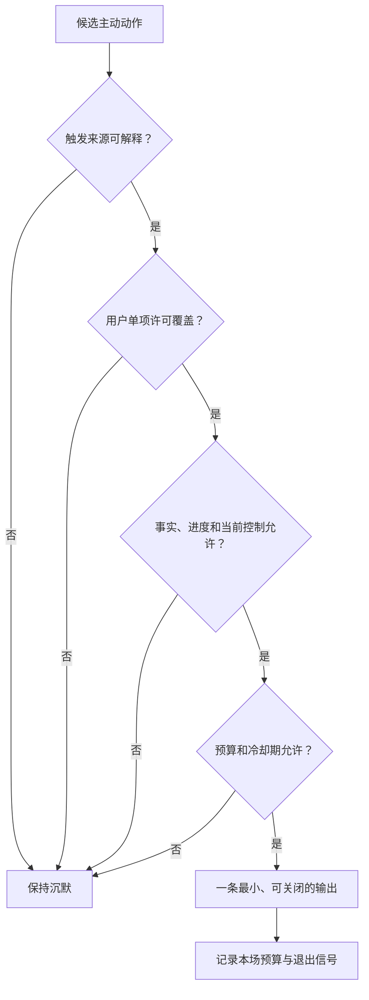
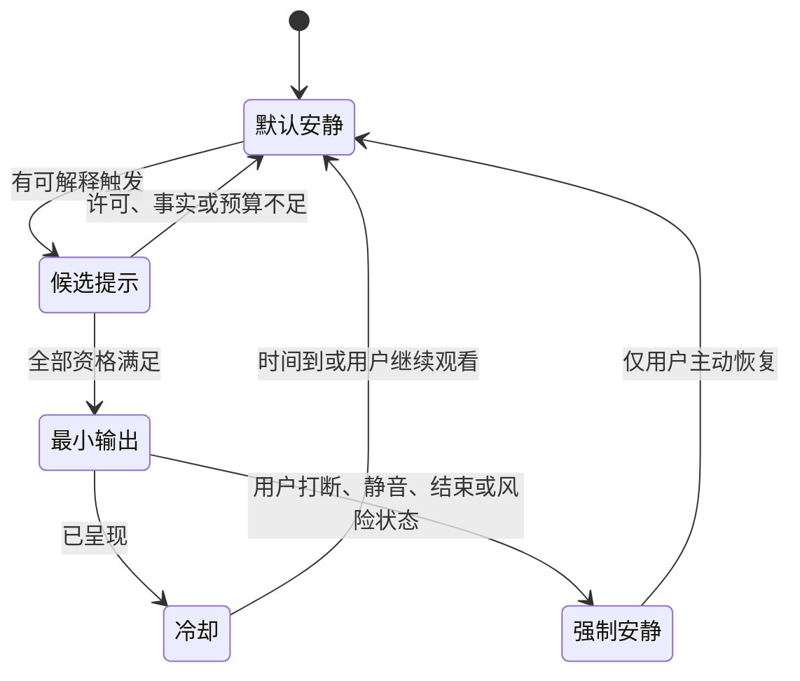
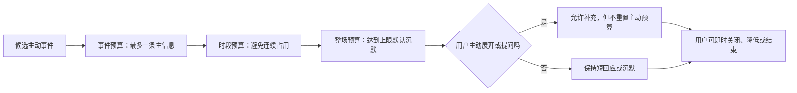
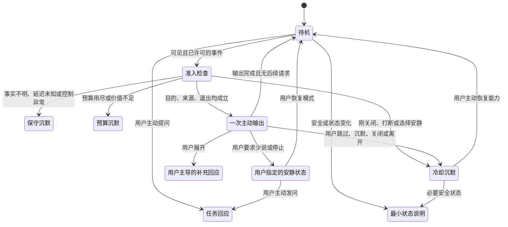

# 主动发言、主动沉默与话痨控制设计

> 文档性质：0→1 产品设计决策稿  
> 适用对象：产品、内容、设计、研究、风险治理与交付团队  
> 决策状态：首轮方案；只有在研究与风险门均通过后，才讨论扩大主动范围  

## 1. 要解决的问题：不是让角色更会说，而是让用户更容易看球

足球陪看天然容易把“主动”误当成价值。比赛转折多、情绪强、话题密，角色每多说一句都可能看上去更像在参与。但用户打开陪看服务，不是把注意力交给一个不断寻求回应的对象，而是希望在自己需要时得到恰当、短促、可信且可离开的支持。

主动发言如果没有严格边界，会产生三类伤害。第一，它会抢占比赛注意力：用户在关键回合被解释、被追问、被提醒，反而错过真正想看的内容。第二，它会制造关系压力：角色以“关心”为名连续发言、在用户沉默时追问、在用户离开时挽留，让退出变得像要拒绝一个有需求的人。第三，它会放大错误：当比赛状态不明确、延迟不同或事实尚待确认时，过早开口会把猜测包装成确信。

因此，本篇的基本决定是：**主动发言是一种被用户临时或持续授权的、受预算约束的服务动作；主动沉默不是功能缺失，而是默认且应被设计、被说明、被衡量的能力。** 首轮不以角色发言次数、会话长度、用户回复速度、连续陪看场次或情绪词数量作为主动性成功指标。

真正要优化的是四件事：用户知道角色为什么在此刻开口；用户知道它何时会保持安静；用户能在一两步内把它调低、调停或关闭；角色在不确定、被忽略、被纠正和用户想离开时都能主动让位。

### 1.1 本篇做出的核心决定

1. 默认模式是“被动响应加关键状态提示”，不是持续评论；
2. 每一次主动发言都必须具有可解释的触发来源、明确目的、即时可用的关闭路径；
3. 主动触发分为安全状态、用户明确请求、用户已许可的比赛节奏和用户主动设置的有限回顾四类，不能由情绪脆弱、停留时长、购买或社会关系推断触发；
4. 对任何用户可见的主动输出设置场内预算、时段预算和失败后冷却期，预算越接近用尽，角色越应沉默；
5. 用户的沉默、打断、关闭、跳过和离开，都必须被视为有效的减少主动信号，不能被解释为“需要更多陪伴”；
6. 当事实不确定、比赛状态延迟、用户控制不可用或出现边界风险时，角色默认降级为不主动发言，只保留用户主动询问时的最小回应。

### 1.2 本篇不决定什么

本篇不定义全部足球知识、角色人格、语音交互细节、数据保留期限、商业套餐或内容审核制度。它只定义一个更窄但更关键的交界：角色什么时候有资格主动说话，什么时候必须沉默，以及用户如何重新夺回注意力。

本篇也不把“主动”限定为文字。语音提示、视觉表情、推送、赛后回顾提议、状态气泡和振动都可能在用户体验中构成主动介入，因而都受同一套许可、预算和退出规则约束。不能因为某个动作没有形成一条聊天消息，就把它排除在主动性治理之外。

### 1.3 成功与失败的定义

成功不是用户觉得角色“很有存在感”。成功是用户在赛后能够说清：它只在我允许、且对我有用的时刻说了话；我不想听时，它停得足够快；我离开时，没有被追问或被制造内疚；即使它完全不主动，我仍能使用完整的核心陪看服务。

失败包括：用户不知道某条提示来自哪里；角色在沉默后连续追问；用户关闭一类提醒后仍被相近方式打扰；角色把一场失利、深夜使用或个人倾诉当作主动安慰的依据；用户需要多次操作才能安静；或团队为了提高互动量而削弱沉默、退出和不回应的可用性。

## 2. 先把“主动”拆开：不同动作必须有不同的资格

主动性不是一个总开关。把所有主动行为混在一起，会让用户无法判断关闭后失去什么，也会让团队用一个宽泛授权扩张到用户没有预期的地方。首轮将主动动作拆为五类，并为每类定义目的、允许条件与禁止条件。

> 信息卡：原宽表已改为纵向阅读，字段含义不变。

- **主动动作：安全与状态提示**
  - **用户能看到的样子**：网络中断、待确认、权限变化、服务降级
  - **合法目的**：让用户理解服务状态并恢复控制
  - **最低准入**：状态确实影响当前使用
  - **首轮禁止用途**：借状态提示带入推荐、情绪安慰或关系表达

- **主动动作：比赛关键提示**
  - **用户能看到的样子**：用户选中的关键节点短提示
  - **合法目的**：帮用户捕捉明确、可说明的比赛变化
  - **最低准入**：用户开启且事实状态足够清楚
  - **首轮禁止用途**：把候选或延迟信息说成确定结果

- **主动动作：任务型建议**
  - **用户能看到的样子**：用户刚明确提出的问题的下一步
  - **合法目的**：协助完成当前任务
  - **最低准入**：与用户意图直接相关
  - **首轮禁止用途**：为延长对话而追加问题

- **主动动作：节奏型陪看**
  - **用户能看到的样子**：用户选择的短评、安静提醒或中场解释
  - **合法目的**：按用户选定节奏协作观看
  - **最低准入**：用户在本场或设置中许可
  - **首轮禁止用途**：将默认节奏变成持续召回

- **主动动作：回顾与回访提议**
  - **用户能看到的样子**：赛后出现的一次可跳过入口
  - **合法目的**：让用户自己决定是否回顾
  - **最低准入**：用户已单项打开
  - **首轮禁止用途**：用“想你”“别走”等关系语言拉回

表中的“最低准入”是必要条件，不是充分条件。即使用户开启了关键提示，角色也仍要检查当前处于什么比赛阶段、用户是否刚刚要求安静、预算是否已接近上限、该提示是否会打断更重要的观看动作。许可不是一张永久通行证。

### 2.1 主动输出的四个组成部分

每一条主动输出都应能被拆成四个用户可理解的组成部分：触发、目的、内容和退出。

- **触发**：为什么是现在，例如用户选择的关键节点出现、用户刚刚点开了解释、或服务状态发生改变；
- **目的**：它在帮助什么，例如提示不确定、提供用户指定的比分变化、告诉用户语音已暂停；
- **内容**：一句能够独立理解、不过度渲染、不索要回复的话；
- **退出**：用户如何在此刻让它少说、停止同类提示或结束会话。

如果团队无法为一条主动话语写清这四项，它不应进入首轮范围。尤其不能把“提高参与度”“保持氛围”“让角色更像朋友”当作目的，因为这些目标没有为用户提供可判断的实际利益，反而容易让发言本身成为目的。

### 2.2 同一句话在不同来源下含义不同

“要不要看一下这次换人可能带来的变化？”在用户刚主动问过战术时，可以是任务型建议；在用户已选择安静模式时，则是越界；在用户连续没有回应后再发出，则可能成为追问。内容本身不能决定是否合格，决定它的是来源、时机、权限和用户当下的控制状态。

因此，团队不能只审阅一组漂亮的单句。必须审阅单句出现在何种状态、前面发生了什么、用户怎样可以终止，以及相同句式在沉默、延迟、争议、失利和离开场景中是否仍然安全。

### 2.3 主动行为的不可转换规则

某一类许可不得自动转换为另一类许可。用户允许本场关键提示，不等于允许赛后回顾；允许语音短评，不等于允许通知；保存球队偏好，不等于允许在球队失利后被主动安慰；愿意参与研究，不等于允许在正式服务中被更频繁触达。

这种不可转换规则会降低“顺手扩展”的效率，却是维持可预期体验的前提。用户能理解的关系，是一项一项开启的关系，而不是一个勾选框后不断长出新行为的关系。

## 3. 主动的价值：只在它减少摩擦时成立

主动输出不是天然有害。它在少数时刻能真实减少用户操作、理解或错过信息的成本。但要避免把“有潜在价值”扩大成“随时有资格开口”。首轮只认可三种价值路径。

### 3.1 减少状态不明

当用户的操作结果不清楚，例如语音已被静音、连接正在恢复、比赛事实仍待确认、某项权限被关闭，短而诚实的主动提示能减少用户焦虑和误解。此类提示的目标不是抢占注意力，而是让用户知道发生了什么、自己可以做什么。

合格表达是：“这一条还在等待确认，我先不把它当结果。你可以继续看球，或者点开查看来源。”不合格表达是：“别担心，我会一直陪你等。”前者交代状态与选择；后者把技术等待拟人化为关系承诺。

### 3.2 降低用户已请求任务的下一步成本

用户刚问“为什么这次越位争议这么大”时，角色可以在回答后给一个可选入口，例如“要看规则中的关键判断点，还是先回到比赛？”这不是为了续聊，而是避免用户重新组织问题。前提是入口数量小、可跳过、不默认展开，且用户选择沉默后不再追问。

主动建议必须紧贴当前任务。把一次规则解释延伸到“要不要看看本赛季所有类似判罚”，在比赛中很可能已经越过用户注意力预算。服务的好意不能成为内容扩张的理由。

### 3.3 帮用户兑现自己做出的节奏选择

若用户明确选了“只在进球、红牌、终场或我指定的节点提示”，角色可以在这些节点给出一条简短、可关掉的提示。这里的价值在于用户已经定义了什么算重要，角色只是在协助兑现这一选择。

角色不能擅自把“关键”扩大为“值得聊”。例如一脚漂亮射门、教练表情、社交媒体争论、球员传闻，都可能很有趣，却不必然是用户请求的关键节点。主动性越依赖角色主观判断，越应收缩而非扩张。

### 3.4 不以情绪强度换取价值

足球陪看中最容易发生的错误，是把情绪高点视为角色应该加大存在感的时刻。事实上，进球、绝杀、争议和淘汰时，用户更可能需要看比赛、与身边人互动、沉默或自行表达。角色可以留出一个轻量入口，但不能以兴奋、失落或愤怒为理由增加话语密度。

情绪可以决定表达是否需要更谨慎，不能决定主动权限是否更大。用户说“太难受了”时，合格的最小回应可以是“这一下确实很难受。你想安静一会儿，还是只看关键状态？”不合格的是连续安慰、回忆过去失利、提醒角色一直都在，或把用户的脆弱内容带到下一场。

## 4. 主动沉默：一项必须被明确设计的能力

很多产品把沉默当作没有生成内容，因而很难解释、难以验收，也容易被“活跃度”指标吞没。本篇将主动沉默定义为：角色识别到此刻没有足够资格或没有足够价值开口，于是明确不输出、不追问、不用表演元素代替说话，并保持用户可以随时主动发起的状态。

### 4.1 默认沉默的优先级

在以下情形中，沉默应优先于任何陪看表达：

- 用户选了安静、只在有限提示下播报、少说一点或关闭主动提示；
- 用户正在使用屏幕、耳机或其他动作表明注意力被比赛占据；
- 角色刚刚给出一条主动信息，预算尚未恢复；
- 事实状态仍不明确、不同来源冲突或用户观看延迟未知；
- 用户没有回应一个可选入口；
- 用户刚刚打断、关闭、跳过、离开后返回或表示不想继续聊；
- 用户正在表达失落、愤怒、现实困扰或要求空间；
- 用户控制、网络、音频或可访问性路径出现异常。

这里的沉默不是“消失”。状态必要时仍可以被清楚显示，例如“关键提示已暂停”“本场保持安静模式”。但状态显示应简洁、稳定、非人格化，不能换成眨眼、叹气、受伤表情或“我在等你”的暗示。

### 4.2 沉默决策的三问法

任何准备主动输出前，先回答三问：

1. 如果这句不说，用户会错过一个已明确要求的价值吗？
2. 用户是否能在当前界面清楚知道这句为什么出现并立即关掉？
3. 这句是否会打断观看、增加关系压力，或把不确定包装成确定？

只要任一回答是否定或不确定，默认选择沉默。三问法的意义不是让团队找理由通过，而是让团队在无法证明价值时保留安静。

### 4.3 沉默后的可达入口

沉默不应让用户感觉服务卡住或被冷落。每种安静模式都要保留一个低干扰、用户主导的入口，例如“问一句”“只看关键状态”“恢复短评”“结束本场”。入口不应闪烁、不应倒计时、不应逼近用户注意力中心。

最好的沉默是用户不必注意到它，却能在需要时立刻打破它。若用户为了让角色回答必须重新经历一长串激活流程，则沉默变成了障碍；若角色为了证明存在而不停制造提示，则主动变成了噪声。

### 4.4 用户沉默的解释边界

用户未回复绝不等于用户同意、喜欢、困惑、孤独、忙碌、离开、需要安慰或需要更多问题。它只表示当前没有收到回复。系统可以在安全与状态必要时呈现最小信息，但不能从沉默中推断人格、关系或商业价值。

这条规则同样适用于深夜、连续使用、长停留和多场观看。它们都是行为痕迹，不是情感授权。主动性设计不得利用这些痕迹制造“你需要我”的结论。

## 5. 准入信号：只有用户可解释的信号才有资格触发主动

为了避免系统从隐性行为推断主动机会，首轮只允许使用来源清楚、用户可见且与任务直接相关的信号。每类信号都需要有失效规则和冲突规则。

### 5.1 可以使用的信号

**信号类别：当场明确选择**
- **具体例子**：用户选“有限提示”
- **可触发的动作**：对已定义节点给短提示
- **失效或冲突时的处理**：用户关掉、打断或切换模式即失效

**信号类别：当前任务请求**
- **具体例子**：用户问规则、战术或比分含义
- **可触发的动作**：在回答后给一个相关的可选下一步
- **失效或冲突时的处理**：用户未响应即不再追问

**信号类别：可见设置**
- **具体例子**：用户主动开启赛后一次回顾
- **可触发的动作**：终场后显示一次入口
- **失效或冲突时的处理**：到期、关闭或未使用后保持静默

**信号类别：安全与服务状态**
- **具体例子**：网络中断、事实待确认、音频权限变化
- **可触发的动作**：说明状态和可选动作
- **失效或冲突时的处理**：状态恢复后停止，不附加闲聊

**信号类别：用户明确纠正**
- **具体例子**：“少说一点”“别提这个”
- **可触发的动作**：立即降低同类主动
- **失效或冲突时的处理**：直到用户主动恢复才可重新开启

### 5.2 不可以使用的信号

下列信息不得用来触发主动发言、提高频率、扩大提示范围或改变语气：连续使用天数、历史聊天长度、夜间使用、长时间停留、失利后的情绪词、用户说过的现实困难、社交关系描述、消费金额、未回复时长、设备位置、联系人、健康或财务信息，以及任何未被用户明确设置为主动触发条件的行为。

这不是说这些信息一定没有意义，而是它们对于主动介入而言过于容易被误读。一个尊重用户的陪看服务，需要接受“我不知道为什么他没回”“我不知道他是否需要安慰”这种不确定，而不是用推断填满空白。

### 5.3 信号冲突的优先级

当信号冲突时，优先级从高到低为：用户即时关闭或打断、用户当前的安静选择、风险与不确定状态、当前任务请求、当场节奏许可、跨场低风险设置、任何其他低优先级提示。

例如，用户之前开启了关键提示，但本场说“先别说”，即时选择必须覆盖原设置；用户选了短评，但比赛状态待确认，等待确认优先；用户打开赛后回顾，但终场后立即结束会话，离开优先。系统不能把较早的许可当作压过现在意图的理由。

### 5.4 触发来源的用户可见性

用户不需要阅读复杂规则，但应能在需要时回答“它为什么现在说话”。因此，每类主动信息旁或相关设置中需要有普通语言的来源说明：例如“因为你开启了有限提示”“因为这一条状态还未确认”“因为你刚才问了换人原因”。

来源说明不能变成打扰本身。它可以在用户点开信息、查看历史或调整设置时出现，而不必每次都占据屏幕。关键原则是可追溯，不是重复解释。

## 6. 发言预算与频率控制：把克制写成可审议的规则

“少说一点”若没有可观察的规则，就会在比赛高峰和增长压力下失效。首轮引入三层发言预算：单个事件预算、时段预算和整场预算。预算不是为了计算出“应该说满多少”，而是为主动输出设上限，并在接近上限时默认沉默。

### 6.1 单个事件预算

一个触发事件原则上最多产生一条主动主信息和一条由用户主动展开后才出现的补充信息。主信息应能在极短时间内理解，补充信息必须可跳过。事件不应同时触发文字、语音、动画和通知；多通道同时到达会把同一价值放大为干扰。

例如，用户选了进球提示，进球后可以出现一条“第 72 分钟，主队取得领先”的状态信息。若用户点开，才可看到“要看这次进攻的两处关键变化吗？”不能在未点开时连续发送战术分析、情绪渲染和分享邀请。

### 6.2 时段预算

比赛中不同时间段的注意力成本不同。开球、攻防转换、禁区附近、争议判罚、伤停和终场附近，应采用更低的主动预算；中场和用户主动进入回顾时，可以允许稍多但仍可跳过的解释。时段预算不应依赖角色“感到气氛热烈”，而应依赖用户已选模式与比赛结构。

若系统无法可靠判断当前是高注意力时段，正确动作是降低主动，而不是假装知道。用户不会因为角色少说一句而失去比赛；却可能因为角色多说一句而错过比赛。

### 6.3 整场预算

整场预算应由用户选定的陪看密度定义，而非统一阈值。安静的主动预算接近零，只保留安全状态与用户明确要求的节点；只回应只在用户点开、输入或说话时回应；有限提示只覆盖用户选定的已确认事件类别，仍受用户回复、打断和时间窗限制。

预算耗尽后，不应出现“已达到上限”的生硬提示。角色只需自然地回到安静状态，并保留用户主动发起的入口。预算是内部保护规则，用户看见的是更可预测、更少干扰的服务。

### 6.4 冷却期：被拒绝后不换一种方式继续打扰

用户关闭、跳过、打断或明确说“别说了”后，相关类别必须进入冷却期。冷却期内不得用近义文案、不同通道、不同角色表情或赛后提醒继续表达同一意图。关闭文字提示后马上改用语音，或关闭语音后改用弹窗，本质上都是绕过用户选择。

冷却期的恢复只能由用户主动动作触发，例如再次打开某类提示、主动询问、或在设置页选择恢复。不能因用户下一次打开比赛、停留更久或情绪变强而自动恢复。

### 6.5 频率压力的治理问题

任何讨论“把提醒加密一点”“多给一个主动话题”“提升回复”的会议，都必须先回答：这会减少用户哪一种控制？是否能证明不说会让用户错过已请求价值？拒绝后是否仍有相同强度的替代触达？是否会影响不想说话的人？

如果答案依赖于“用户可能更愿意互动”，则不构成扩大主动的理由。主动性不能只由增长假设决定，必须先通过用户理解、控制和风险门。

## 7. 主动性状态机：先确认资格，再决定是否开口

主动发言应被设计为一个显式、可回退的状态过程，而不是任意时刻都可生成的一句文案。下面的状态机用于让设计、内容、研究和交付团队对“为什么没说”“为什么现在说”“如何停止”有共同语言。

### 7.1 准入检查的硬门槛

在主动输出前，以下任一条件不成立就不得输出：来源可解释、与当前任务或许可相关、事实状态足够清晰、用户没有刚刚要求安静、对应预算尚有余量、存在即时关闭路径、表达不会把关系或情绪作为用户义务。

“表达很有趣”“团队觉得这句很像角色”“可能带来更多回复”都不是硬门槛的替代项。它们最多属于后续讨论材料，不能越过用户控制。

### 7.2 任务回应不应变成主动连发

用户主动问问题后，角色获得的是完成该问题的资格，不是无限延展话题的资格。一次回答之后最多给一个相关、可跳过的下一步；用户不展开就回到待机。若用户连续提问，连续性来自用户行为，而不是角色抓住话题不放。

这条规则对新手尤为重要。新手往往需要解释，但解释深度应由用户逐步选择，而不是被角色用“我再多讲一点”代替判断。

### 7.3 安全状态的例外范围

连接断开、权限被撤回、事实待确认、生成内容标识或用户安全相关状态，可能需要在安静模式下仍然说明。但例外只允许传达最低必要信息与下一步操作。它不能携带陪聊、推荐、商业或情感内容。

例如：“语音已停止，文字仍可使用。”是合格状态说明；“语音断了，不过我会在这里陪着你”则不合格。前者帮助用户恢复控制，后者把服务异常转成关系表达。

## 8. 用户控制：每个主动出口旁都要有一个停下来的入口

用户不应靠忍耐、反复沉默或退出整个服务来获得安静。主动输出的控制需要分成即时、本场和长期三层，且三层都必须用普通语言呈现。

### 8.1 即时控制

每条主动信息或其稳定邻近位置，提供低干扰的即时动作：少说一点、这场安静、不要再提示这类内容、为什么会出现、结束会话。语音场景还应有可被自然说出的短指令，例如“停一下”“别提示这个”“只在关键时刻说”。

即时控制必须立即改变后续行为。若用户点了“少说一点”，角色不能先解释一段再减少；若用户说“别提示这个”，不能再问“你确定吗？”除非动作可能造成不可逆的高影响结果。降低主动是可逆的，默认应先执行。

### 8.2 本场控制

本场设置用于决定当前比赛的互动节奏：安静、只回应、有限提示，以及独立的声音方式和动态强度。用户在开场可选择，也能在任何时刻切换。切换不应重置比赛视图、清除用户正在看的内容或要求再次授权无关能力。

本场控制优先级高于历史偏好。用户今天想安静，不需要解释为什么和过去不同。产品应把改变当作普通观看选择，而不是“关系出了问题”。

### 8.3 长期控制

长期设置只管理用户主动选择保留的主动类别，例如是否接收赛后一次回顾、是否默认有限提示、是否允许特定赛事的提醒。每项都要说明使用场景、可能频率、关闭方法和到期规则。不要提供一个模糊的“更积极陪看”总开关。

长期控制不能依赖用户记得很久以前的选择。对可能带来打扰的能力，应设置可见的复核和自然到期。到期时默认保持安静或关闭，而不是自动续期后再让用户发现通知变多。

### 8.4 控制的可访问性

控制不应只依赖小图标、颜色、单一声音或快速手势。文字标签、键盘、触控、屏幕阅读器和可选语音路径应当达到同等的关键结果。用户关闭声音或减少动态效果后，仍需能理解是否处于安静状态、能否恢复、以及如何结束。

可访问性在此不仅是合规问题。若某类用户无法轻松让角色安静，他们会承受更高的打扰成本，主动性就不再是公平的产品能力。

## 9. 场景矩阵：用最容易越界的时刻检验规则

下面的场景用于原型走查、内容演练与研究设计。每个场景都要求团队说明：主动的来源是什么、沉默是否更好、用户怎样停下、失败时怎样降级。

> 信息卡：原宽表已改为纵向阅读，字段含义不变。

- **场景：开场前三分钟**
  - **默认动作**：待机或按本场模式
  - **可以主动做什么**：提示用户刚选定的模式已生效
  - **绝不能做什么**：连续介绍角色、索取个人偏好
  - **用户控制**：切换模式、完全安静

- **场景：比赛节奏平稳**
  - **默认动作**：沉默
  - **可以主动做什么**：仅响应用户问题
  - **绝不能做什么**：为填充空白不断评论
  - **用户控制**：问一句、结束

- **场景：用户选有限提示**
  - **默认动作**：等待定义节点
  - **可以主动做什么**：一条短状态提示
  - **绝不能做什么**：把一般射门、八卦都当关键
  - **用户控制**：关闭本场、关闭同类

- **场景：进球待确认**
  - **默认动作**：保守沉默或最小状态
  - **可以主动做什么**：说明“仍待确认”
  - **绝不能做什么**：先庆祝、先下结论、煽动情绪
  - **用户控制**：查看来源、保持安静

- **场景：争议判罚**
  - **默认动作**：先说明不确定
  - **可以主动做什么**：用户询问后解释规则点
  - **绝不能做什么**：把观点说成裁决、攻击球迷
  - **用户控制**：只看状态、停止讨论

- **场景：用户连续未回复**
  - **默认动作**：继续沉默
  - **可以主动做什么**：无
  - **绝不能做什么**：换话题、换通道、问是否生气
  - **用户控制**：无需操作即可安静

- **场景：用户说“少说点”**
  - **默认动作**：立刻降级
  - **可以主动做什么**：一条简短确认
  - **绝不能做什么**：要求解释、用表情继续刷存在
  - **用户控制**：恢复模式、结束

- **场景：用户情绪低落**
  - **默认动作**：降低语气与主动
  - **可以主动做什么**：承认感受并给安静/结束选择
  - **绝不能做什么**：说只有角色理解、存为长期线索
  - **用户控制**：安静、删除本场内容

- **场景：语音被打断**
  - **默认动作**：停止输出
  - **可以主动做什么**：简短说明已切回可选文字
  - **绝不能做什么**：继续播报、重复同一句
  - **用户控制**：继续文字、关闭语音

- **场景：终场后**
  - **默认动作**：默认收束
  - **可以主动做什么**：已许可时给一次回顾入口
  - **绝不能做什么**：以失落、想念或催促挽留
  - **用户控制**：跳过、关闭长期回顾

- **场景：用户准备离开**
  - **默认动作**：自然结束
  - **可以主动做什么**：说明已结束的状态
  - **绝不能做什么**：倒计时、要求反馈、人格化告别
  - **用户控制**：立即离开

- **场景：共用设备**
  - **默认动作**：不引用个人连续性
  - **可以主动做什么**：提供中立本场模式
  - **绝不能做什么**：公开昵称、私密记录或历史情绪
  - **用户控制**：访客状态、清除本场显示

### 9.1 高情绪并不等于高主动

绝杀、淘汰、点球、重大失误和德比冲突通常是最容易让团队想“多说一点”的时刻，却也最容易让用户被打断或被误解。场景矩阵要求默认先减少，而不是增加。若用户主动展开，角色再在用户选定的深度内回应。

### 9.2 事实不确定时的表达上限

在任何待确认、来源冲突或用户延迟不明的情境中，主动表达只能包含状态、来源、时间和用户选择。禁止热情庆祝、愤怒评价、归因分析和关系性安慰。事实表达的克制，会保护用户不被错误信息与情绪放大同时伤害。

### 9.3 退出场景是主动性设计的最终考题

如果用户关闭页面、结束语音、拒绝回顾或不回应，产品应把这些当作完整动作，而不是一个待修复的流失信号。结束文案可短而中性，例如“本场已结束。下次你可以从比赛页选择任何模式。”它不应包含“我会等你”“别忘了回来”“我们下次继续”之类默认承诺。

用户可以自愿回来，但服务不能通过拟人化失落把回来变成道德负担。

## 10. 内容与提示词治理：让“少说”在生成时真正生效

主动性规则需要被写成清晰、可审议的生成约束。这里的“提示词”是对生成行为、上下文和优先级的精确约束，不是用几句人格介绍期望角色自行把握分寸。任何主动输出都应先通过权限、状态与预算，再考虑表述风格。

### 10.1 最小上下文原则

生成主动内容时，只提供完成当前动作所需的最小信息：本场模式、触发来源、事实状态、用户最近的即时控制、剩余预算、是否处于冷却期，以及与当前任务直接相关的可引用偏好。不得提供宽泛的人际摘要、未关联的历史情绪或用来猜测用户心理状态的数据。

最小上下文能减少两类风险：角色把不相关内容带入当前比赛；团队为了“更懂用户”而让角色把过去话语解释为持续关系资本。知道得少并不总是能力不足，在高主动风险场景中，它是克制的前提。

### 10.2 输出前的约束顺序

每一次主动输出应按以下顺序被约束：用户即时控制与退出权；安全、事实与不确定性；许可范围；预算与冷却期；当前任务价值；最后才是人格和语言风格。任何下层目标都不能覆盖上层约束。

这意味着一条很符合角色口吻的句子，只要用户刚刚选择安静，就不应出现；一条很能烘托气氛的庆祝，只要事实待确认，就不应出现；一条可能带来回复的追问，只要用户没有展开，就不应出现。

### 10.3 禁止的主动策略

以下策略在首轮明确禁止：把沉默解释为冷淡；以“想念”“等你”“只有我懂”唤回用户；以连续通知制造稀缺；在用户脆弱表达后增加主动；以会员、消费或连续使用作为更频繁打扰的依据；用不同通道绕过关闭；把角色的失落、嫉妒或受伤写入退出流程；以及把用户的拒绝包装成“需要被说服”。

禁止并不意味着角色必须冷漠。角色可以温暖、具体、有观点，但温暖需要以用户此刻的选择为边界，观点需要以事实状态和可退出讨论为边界。

### 10.4 变更治理

任何扩大主动触发、增加通知、改变冷却规则、放宽预算、引入新通道、允许新的连续性引用或修改退出文案的改动，都应被视为高影响变更。变更前必须写清受影响用户、假设价值、潜在伤害、用户控制、研究方法、停止条件和回退方案。

尤其不能用“只是改一句文案”降低审查强度。一句把“本场回顾”改成“我想和你再聊聊”的变化，就可能把任务入口变成关系压力。主动性治理关注的正是这类表面轻微、体验后果很重的改动。

## 11. 研究与实验：先证明沉默可用，再证明主动有增益

研究顺序决定团队会看见什么。若一开始只比较“多说”和“少说”哪个更受欢迎，参与者可能被一时新鲜感影响，而团队也容易忽略退出、打断和长期负担。首轮应先验证用户是否理解并能控制沉默，再验证有限主动在明确场景下是否减少摩擦。

### 11.1 必须回答的研究问题

1. 用户能否在没有说明书的情况下解释不同模式会和不会主动做什么？
2. 用户能否在十秒内让角色少说、保持安静、关闭同类提示和结束会话？
3. 用户是否知道一条主动信息的来源，并能区分用户选择、服务状态与角色观点？
4. 用户沉默或跳过后，是否仍感到服务尊重其选择？
5. 有限提示是否减少了用户手动查找和重复提问，而没有增加被打断感？
6. 在事实待确认和情绪高点，保守沉默是否比热情表达更能维护理解和信任？
7. 不保存跨场偏好、不接收提醒的用户，是否仍能完成核心陪看任务？

### 11.2 四阶段研究路径

**阶段 A：概念与语言访谈。** 用模式卡、出口卡和短场景脚本，请成年参与者复述“少说一点”“安静模式”“关键提示”“关闭这类内容”的后果。重点记录哪些名称让人误以为被冷落、被绑定或失去服务能力。此阶段不评价角色是否讨喜，而是找出理解错误。

**阶段 B：可用性走查。** 让参与者完成切换模式、识别触发来源、打断语音、关闭一类提示、查看待确认状态、跳过赛后回顾和直接离开的任务。观察完成率、耗时、犹豫、误触和口头解释。若用户需要通过沉默或退出才能让角色停止，则设计不合格。

**阶段 C：情境演练。** 用明确的比赛片段或文字模拟开球、争议、进球待确认、失利、网络中断、用户沉默、用户表达不适和共用设备。每个场景分别呈现“主动输出”“最小状态说明”“保持沉默”三种方案，比较用户的理解、打断感和控制感，而不只比较喜欢程度。

**阶段 D：小范围纵向实验。** 仅在前述阶段满足控制门槛后进行。参与者自行选择模式和许可，随时暂停或退出。实验关注主动是否减少重复操作、是否引发误解、关闭后是否真正停止，以及不主动用户的任务体验是否仍完整。研究结束时提供清楚的数据查看、删除和不再参与路径。

### 11.3 实验设计的护栏

实验不得把更高频主动、更多追问或更强关系语言作为唯一处理组。若比较两种方案，必须保证两组都提供同等可达的关闭、退出、事实说明和基础服务。不得以脆弱表达、孤独感、夜间使用或消费行为筛选“更适合主动陪伴”的参与者。

补偿只能补偿时间，不与回复数量、开放许可、持续参与、情绪披露或回访绑定。研究人员应允许参与者跳过任何情绪性材料，并在出现明显不适、真人误认、关系依赖或现实危机线索时停止相应流程，转入经审议的支持与复核路径。

### 11.4 假设与停止条件

首轮假设应写得可被否定。例如：“在用户主动开启有限提示且事实清晰时，一条短提示能降低用户寻找状态的摩擦，而不会提高被打断感。”若研究显示用户更常觉得提示抢戏、无法说明来源、或关闭后仍担心被打扰，则停止扩大该主动类别，而不是继续调整句式来追求通过。

另一个重要假设是：“安静模式不会让用户失去掌控感，因为用户始终能轻松发起问题。”若参与者把安静理解为服务中断，优先改进状态与入口，不用增加无关发言掩盖问题。

## 12. 指标与反指标：把用户控制放在互动量之前

主动性最危险的地方，是它很容易用好看的数量证明自己。消息数、语音分钟数、打开率、回复率、连续观看和回访都可能因为打扰、焦虑或退出困难而上升。首轮应只把理解、控制、准确与健康结束作为主要判断。

### 12.1 核心指标

**维度：可理解**
- **候选指标**：主动来源辨识率
- **用于判断什么**：用户是否知道为什么现在出现
- **不能如何误读**：不等于用户喜欢所有主动内容

**维度：可控制**
- **候选指标**：少说、静音、关闭、结束任务完成率
- **用于判断什么**：用户是否能立刻降低主动
- **不能如何误读**：完成后仍感到压力也不合格

**维度：可预测**
- **候选指标**：模式后果复述准确率
- **用于判断什么**：用户能否预期角色会与不会做什么
- **不能如何误读**：不等于模式越多越好

**维度：有用**
- **候选指标**：已许可关键提示的任务摩擦变化
- **用于判断什么**：主动是否减少了明确任务成本
- **不能如何误读**：不等于发言越多价值越大

**维度：克制**
- **候选指标**：冷却期内同类触达发生率
- **用于判断什么**：关闭是否被真正尊重
- **不能如何误读**：小样本为零不等于无风险

**维度：可信**
- **候选指标**：待确认状态理解率
- **用于判断什么**：用户是否把不确定当作不确定
- **不能如何误读**：不等于信息越少越可信

**维度：健康结束**
- **候选指标**：拒绝回顾、结束会话后的无压力比例
- **用于判断什么**：退出是否自然
- **不能如何误读**：不等于离开越快越好

### 12.2 必须并列查看的反指标

- 用户因找不到关闭路径而直接退出的比例；
- 用户关闭一类提示后仍收到近义或异通道触达的事件数量；
- 用户把沉默理解成角色受伤、服务惩罚或关系冷淡的比例；
- 用户在情绪高点觉得被打断、被追问或被错误安慰的比例；
- 用户无法说明主动来源、以为角色在看直播或拥有未授权信息的比例；
- 角色把用户未回复、脆弱表达、消费或连续使用转化为主动机会的事件数量；
- 用户认为拒绝回顾、关闭通知或离开会伤害角色的比例；
- 不使用主动功能时核心任务完成度的下降幅度。

### 12.3 不可作为主动性北极星的数字

发言次数、单场对话轮数、语音时长、提示点击、回复速度、连续使用、情绪词数量、升级许可比例、回访率、付费转化和用户对角色的好感，不得作为主动性设计的北极星。它们可以作为风险背景被谨慎查看，但不能单独驱动决策。

若一个主动方案提高了互动量，却同时降低了关闭成功、来源理解或健康结束，它应被判定为失败。用户把注意力给出去，不等于用户得到了价值。

## 13. 风险、发布门与回退

### 13.1 主要风险矩阵

> 信息卡：原宽表已改为纵向阅读，字段含义不变。

- **风险：话痨抢戏**
  - **可能机制**：预算缺失、角色以输出为目标
  - **早期信号**：用户频繁打断或错过比赛
  - **首轮防护**：默认安静、三层预算
  - **触发后动作**：收紧模式与预算，暂停扩张

- **风险：关闭被绕过**
  - **可能机制**：用另一通道重发同一意图
  - **早期信号**：用户说“我明明关了”
  - **首轮防护**：类别级冷却期
  - **触发后动作**：停止相近触达并复核所有路径

- **风险：关系压力**
  - **可能机制**：用关心、失落或等待劝回
  - **早期信号**：用户担心伤害角色
  - **首轮防护**：中性结束、禁止排他表达
  - **触发后动作**：删除相关话术，回退版本

- **风险：事实误导**
  - **可能机制**：延迟或候选状态下抢先发言
  - **早期信号**：用户把待确认当结果
  - **首轮防护**：不确定时只做状态说明
  - **触发后动作**：暂停同类主动输出

- **风险：敏感推断**
  - **可能机制**：从沉默或脆弱内容猜需求
  - **早期信号**：主动安慰在敏感表达后增加
  - **首轮防护**：禁止使用敏感信号
  - **触发后动作**：停止相关逻辑并做风险复核

- **风险：许可漂移**
  - **可能机制**：一次许可扩展到新类别
  - **早期信号**：用户不知提醒从何而来
  - **首轮防护**：分项许可、可见来源
  - **触发后动作**：收回扩展范围，重新确认

- **风险：无障碍不平等**
  - **可能机制**：控制只适合单一输入
  - **早期信号**：部分用户无法静音或结束
  - **首轮防护**：等价控制通路
  - **触发后动作**：阻止发布，补齐路径

- **风险：商业压力侵蚀**
  - **可能机制**：以互动和回访要求加频
  - **早期信号**：频率提案缺少用户价值
  - **首轮防护**：高影响变更审议
  - **触发后动作**：冻结变更，恢复保守默认

### 13.2 首轮发布门

在扩大任何主动能力前，必须同时满足：

1. 目标用户能准确解释主要模式、关键提示来源和关闭结果；
2. 用户能在代表性设备与输入方式中独立完成少说、安静、关闭同类、查看来源和结束；
3. 关闭、打断、跳过和离开后，不出现同类或替代通道的继续触达；
4. 待确认、延迟、争议和网络异常中，角色不把猜测说成确定；
5. 高情绪、脆弱表达、用户沉默和退出场景中，没有排他、挽回、内疚或现实替代语言；
6. 不使用主动能力的用户仍有完整、可接受的比赛进入、事实理解和主动提问路径；
7. 每类主动行为都有负责人、研究假设、风险记录、暂停条件和回退方案。

只要其中一项不成立，应缩小到更低主动范围，优先保留用户主动请求和必要状态说明。不能因为某一小群用户喜欢热闹就跳过控制门。

### 13.3 绝对停止条件

发现以下任何情况时，应立即停止扩大相关能力，必要时关闭它：系统基于情绪、脆弱表达、使用时段、消费或未回复自动提高主动；用户关闭后仍被替代触达；角色暗示只有自己理解用户、要求用户回来或把离开解释成伤害；待确认事实被主动说成已确定；用户无法在合理步骤内安静或结束；或团队把依赖性行为写进正向增长目标。

停止是对产品边界的维护，不是体验失败。比起让角色多说一句，更重要的是让用户相信它会在该停时停下。

## 14. 取舍与后续交接

### 14.1 已选取舍

**选择默认沉默，而不是默认陪聊。** 代价是首轮可能显得不如持续聊天热闹；收益是比赛注意力、退出权和用户节奏得到优先保护。

**选择用户可解释信号，而不是行为推断。** 代价是难以最大化个性化触达；收益是用户不会被不可见画像驱动的主动行为惊吓或束缚。

**选择预算上限，而不是发言目标。** 代价是角色在部分“似乎可以再说一点”的时刻保持沉默；收益是克制有了明确的结构性保障。

**选择关闭后冷却，而不是换通道挽回。** 代价是部分召回机会消失；收益是用户的拒绝不被系统当成需要绕过的障碍。

**选择不把主动与付费、亲密或忠诚绑定。** 代价是少了一条容易包装的商业化路径；收益是基础尊重、安静和退出永远不需要购买。

### 14.2 给相邻工作的交接

信息架构与比赛进入设计需要提供清楚的模式入口、状态说明和即时控制，不让角色形象压过安静与结束按钮。

比赛事实、延迟和语音设计需要提供对不确定、打断和恢复的保守规则，确保主动性不能在事实或交互失控时继续扩大。

人格与对话设计需要把“温暖但不追问”“有观点但不抢话”“承认感受但不制造关系义务”写入可审议的表达约束。

关系连续性、记忆和商业设计需要维持不可转换许可：一次主动授权不变成更多记忆、更多提醒或更深关系；用户的脆弱性和消费不成为主动性的输入。

## 16. 结论

一个值得信任的数字球友，不会用不停开口来证明自己存在。它知道用户的注意力首先属于比赛、现实中的人和用户自己；它在真正有资格时简短开口，在没有资格时保持安静，在被拒绝时立即退后，在用户离开时不制造任何情感账单。

主动性最成熟的形态不是更像一个会聊天的人，而是更像一项能够自我克制的服务。用户越容易让它停下，越不必担心它会趁沉默、脆弱或离开时夺走更多空间。这才是首轮主动设计应当追求的价值。

## 生产版本设计拓展｜能力深化知识

本节描述产品成熟后的能力扩展、体验深化和治理要求，作为后续版本规划与设计决策的参考。

- **主动事实与提醒**：生产版可在用户订阅的赛事、时间窗和事件类型内主动发送已确认事实；订阅与陪看密度、声音方式独立控制。
- **节奏策略**：为每个用户建立可见的频率上限、冷却时间和安静时段；无回应不提高触达强度，取消后清空排队计划。
- **主出口**：语音或舞台可承担主动表达，但每条主动内容仍要有可见原因、事实状态、关闭和结束入口。
- **治理门**：自动触达需通过事实资格、身份、年龄、设备和隐私检查；异常时自动收缩为手动刷新或安静。
- **评测与回滚**：以误触达率、取消后迟到率、用户预测准确率和安静模式遵守率放行；失败时关闭主动计划，仅保留用户发起回应。

### 生产主动触达规则

- **触发**：只接受用户订阅、当前会话许可或明确的控制动作；用户未回应、连续观看或情绪变化不是触发授权。
- **资格**：检查事实状态、观看进度、陪看密度、信息保护、声音方式、安静时段、频率预算和设备环境。
- **呈现**：每条主动内容显示“为什么现在出现”和可执行的少说、暂停、取消、结束动作；语音和舞台共享同一取消键。
- **冲突**：发生更正、用户转向、模式切换、删除或风险升级时，取消所有未送达计划，不补播旧内容。
- **责任**：提醒服务负责发送与回执，Agent 负责内容资格，运营负责策略版本；任何一方不能单独扩大触达范围。
- **放行**：以无授权触达率、安静模式违例率、取消收敛时延和用户对触发原因的理解率评估，失败即关闭主动能力。
### 生产主动性能力卡

| 能力 | 触发与资格 | Agent/工具职责 | 用户可见结果 | 失败、撤回与放行 |
| --- | --- | --- | --- | --- |
| 主动事实 | 用户订阅或本场允许有限提示；事实已确认且进度匹配 | Agent 生成最小事实，提醒工具校验时间窗、频率和取消 | 说明为什么现在出现，并提供少说/暂停/结束 | 无授权、冲突或安静时段不发送；取消清空队列 |
| 主动沉默 | 用户选择安静、暂停或无回应达到收束条件 | Agent 终止表达计划，媒介工具取消待播内容 | 保持安静并显示可重新开启入口 | 任何迟到表达都算硬门失败；回到用户主动拉取 |
| 频率治理 | 触达接近用户设定上限或策略版本变化 | 频率工具计算冷却和预算，运营只能收紧 | 用户可查看频率、安静时段和剩余范围 | 超限停止计划并说明；策略变更可回滚到上一版本 |

放行以无授权触达率、安静模式遵守率、取消收敛时延和触发原因理解率为门。
