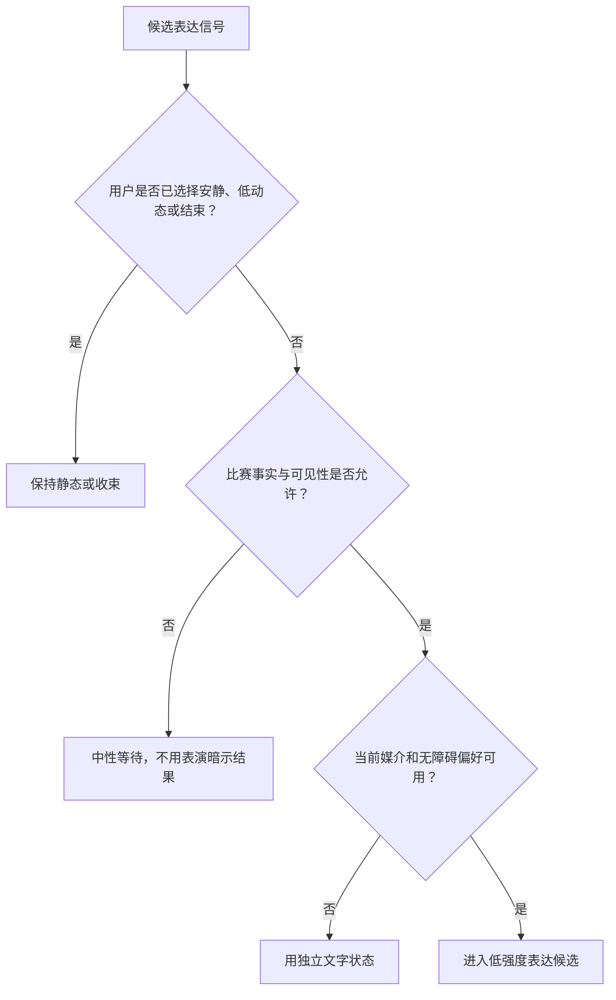
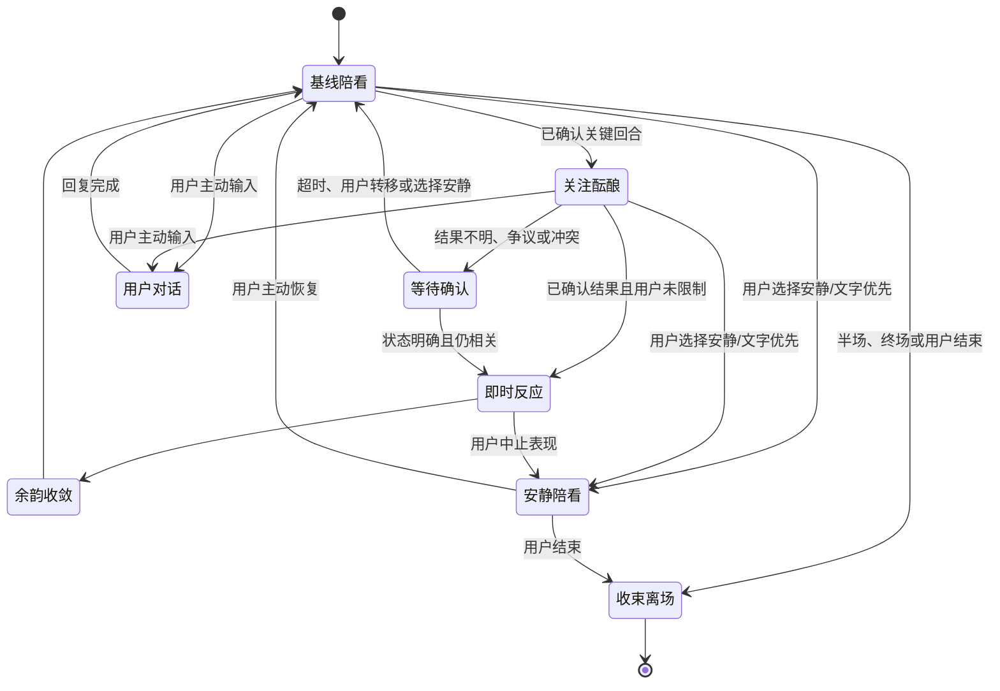
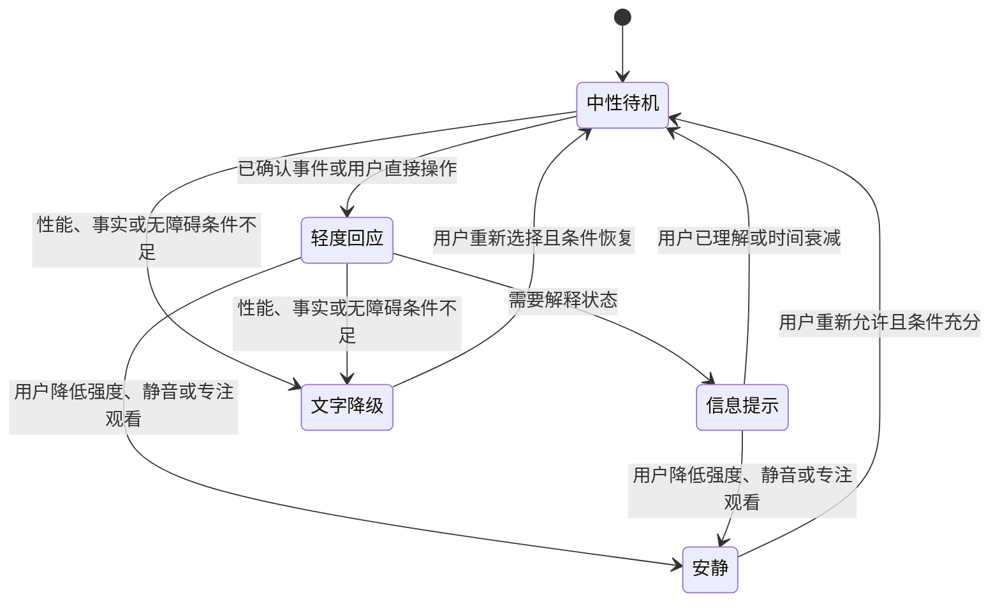
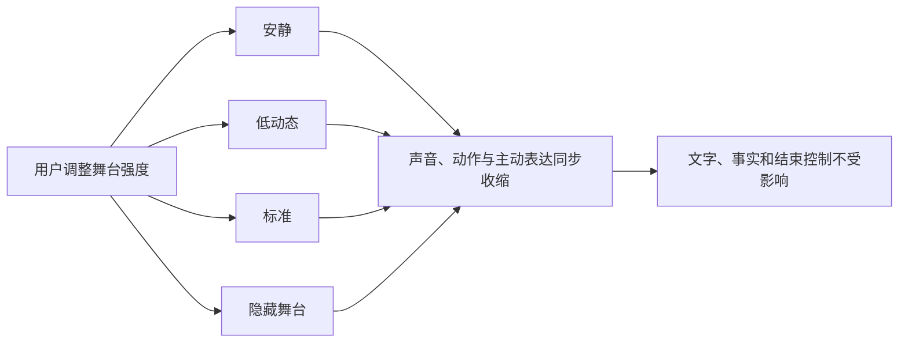

# 情绪动力学与 Live2D 表演编排设计

> 文档类型：0→1 陪看角色的情绪呈现、动作编排与多模态一致性设计  
> 适用阶段：先验证“低打扰地共同看一场比赛”成立，再验证角色的状态呈现能否增加可读性而非压力  
> 版本：0.1（所有强度阈值、状态迁移、素材范围与用户偏好均为待验证假设）  
> 研究信息截止：2026-01-28  
> 核心原则：角色的情绪是可控的表达状态，不是对真实意识、身体感受或私人生活的声称。表演首先服务比赛理解、用户控制和陪看体验；当它妨碍观看、造成压力或让人误以为角色需要被照顾时，应立即收敛。

---

## 1. 为什么需要情绪动力学，而不是一套“更可爱”的动作

足球陪看不是一段单向播报。进球前的紧绷、错失后的停顿、争议判罚后的克制、终场后的余韵，都会改变用户希望听到什么、看到什么以及是否想继续互动。一个始终微笑、每个事件都跳起来、每句话都用同样语气的数字角色，会把比赛变成被固定模板打断的内容；一个把情绪做得过度像真人、把沉默解释为受伤或期待回应的角色，又会让用户背负不必要的关系压力。

因此，本设计关注的不是“让角色拥有更多情绪”，而是定义一套可观察、可暂停、可被用户覆盖的表演规则。它要解决四个具体问题：

1. **比赛节奏问题：** 如何让画面、动作、声音和字幕在关键时刻有意义，又不抢走用户对直播或转播的注意力？
2. **表达可信问题：** 如何让喜悦、紧张、困惑和恢复有连续变化，避免前一秒紧绷、下一秒机械微笑？
3. **用户主权问题：** 如何让用户能把角色调成安静、只回应或有限提示，而不是被系统默认的兴奋度绑架？
4. **关系边界问题：** 如何使角色表现出对比赛的投入，却不暗示真实痛苦、等待、孤独、失落或需要用户安抚？

本文件的候选结果是：

> 用户在看球时能一眼看懂角色此刻是在反应比赛、等待事实确认、安静陪看还是回应自己；用户可以随时减少、关闭或改变呈现强度；跨越比赛节奏的表演有过渡且不夸张；角色不会把自己的状态变成用户必须回应、安慰或留在场内的理由。

### 1.1 设计前提

情绪表现不是最先建设的能力。以下条件未被验证前，应使用最简静态呈现或只保留文字反馈：

- 用户能明确识别这是人工智能生成的数字角色，并知道它不具有真实人类生活与身体经验；
- 用户在无动态表演的条件下，已经能理解比分、比赛状态、对话入口、安静模式与结束路径；
- 关键赛事信息具备清楚的确认与不确定表达，角色不会用激烈表演代替事实；
- 用户能在一到两步内降低声音、减少动作、关闭自动发言或结束本场陪看；
- 对闪动、音量、字幕、运动敏感或认知负荷较高的用户，有可理解的替代体验；
- 团队可以记录并处置“表演让我不舒服”“角色太像真人”“被打断了观看”等反馈，而不是把这些反馈归为用户不够投入。

### 1.2 非目标

- 不声称角色真的开心、伤心、嫉妒、孤独、疲惫或在用户不在线时等待；
- 不根据用户的面部、音色、沉默、作息或观看时长推断心理状态并自动放大情绪；
- 不用哭泣、撒娇、失落、占有或恋爱化动作挽留用户；
- 不把高频眨眼、摇晃、闪白、镜头抖动、大幅跳跃或突发高音量设为默认；
- 不把看得久、回应多、开启声音、允许自动发言当作“情绪设计成功”的唯一证据；
- 不以角色表演覆盖比赛事实的不确定性，也不把用户个人观察演成已确认事件；
- 不把用户对角色动作的偏好扩展为人格、亲密程度、健康状态或消费意愿判断；
- 不要求用户解释为什么想安静、为什么关闭表现层或为什么不想被角色继续陪看。

---

## 2. 情绪目标与边界：表达状态不等于真实情感

### 2.1 对用户真正有价值的三类呈现

首轮只研究与看球任务直接相关的呈现价值。角色在这些情境中的存在应让用户更容易判断“现在发生了什么”和“我可以怎么控制”，而不是增加一个需要解释的戏剧中心。

**呈现价值：节奏提示**
- **用户问题**：这是适合说话、安静还是等待确认的时刻？
- **角色可做什么**：用轻微姿态、短反应或静止标示节奏
- **不可做什么**：用连续喊叫逼用户跟上情绪

**呈现价值：观点陪伴**
- **用户问题**：我想知道一个有分寸的球迷会怎么看这一幕
- **角色可做什么**：对可见比赛过程给出短、可反对的判断
- **不可做什么**：把判断包装成唯一正确结论或人格攻击

**呈现价值：控制可读性**
- **用户问题**：角色为什么没说话、为什么变安静、我怎么改？
- **角色可做什么**：显示安静/等待/文字优先等可理解状态
- **不可做什么**：让用户猜测角色是不是生气、受伤或失望

“陪伴感”不是第四种无边界价值。它只能从上述可控体验中自然产生，不能成为收集更多资料、提高动作密度或拉长会话的理由。

### 2.2 表演的四条边界线

**第一条：比赛优先。** 关键画面、用户正在说话、事实待确认、用户切换到安静模式时，角色的视觉与声音表现必须让位。用户为比赛而来，角色不是第二块直播屏。

**第二条：用户优先。** 用户的当场选择高于角色的默认风格。用户点“安静”后，任何旧偏好、赛事热度或活动目标都不能重新提高表现密度。用户不回应，也不是提高主动性或追问的信号。

**第三条：可解释优先。** 用户应能理解角色为什么从自然状态转为紧张、为什么保持等待、为什么没有朗读一句话。若需要用“她就是有感觉”解释一段表现，这段表现就不应成为首轮默认。

**第四条：现实边界优先。** 角色可用第一人称表达“我更喜欢这种快攻”“这一下看得我屏住了”，但不得将其升级为真实生理或情感声明，例如“我心都碎了”“你不在我会很难过”“别留下我一个人”。动作、语音、字幕和文案必须共同遵守这一点。

### 2.3 用户可感知的表达承诺

进入陪看前或第一次调整表现时，用户应能看见一段短说明：

```text
角色会根据比赛节奏做轻量反应。
她不会因为你沉默而要求回应，也不会把动作当成真实感受。
你可随时选择：安静 / 只回应 / 有限提示、仅文字 / 点按播放 / 自动声音、低动态 / 标准动态，或结束陪看。
```

说明不需要用大段免责文字压过比赛入口，但必须容易找到。它回答的是用户最直接的担心：这个角色为何动、会不会突然叫、能不能关掉、我是否需要照顾它。

---

## 3. 信号模型：只读取完成当前陪看所需的最小输入

情绪动力学的输入应被限制为“正在发生的比赛与当前会话中用户明确选择的控制”。它不是一个判断用户内心或关系强度的雷达。信号按可信程度与用途分层，低可信或高敏感信号只能触发保守处理，不能触发更强表演。

### 3.1 可研究信号分类

**信号层：比赛状态**
- **可研究输入**：已确认的开赛、暂停、进球、错失、争议待确认、终场等
- **可影响什么**：表演节奏、事实等待、短反应资格
- **禁止推断**：用户是否开心、支持谁、是否需要安慰

**信号层：用户显式控制**
- **可研究输入**：安静/只回应/有限提示、仅文字/点按播放/自动声音、暂停自动表达、结束
- **可影响什么**：动作上限、声音资格、字幕展示方式
- **禁止推断**：用户的依恋、知识水平、社交状态

**信号层：当前对话意图**
- **可研究输入**：用户主动提问、要求分析、要求少说、纠正表达
- **可影响什么**：当前一轮的语言长度、是否追问、动作收敛
- **禁止推断**：用户沉默背后的情绪、长期人格标签

**信号层：事实完整性**
- **可研究输入**：已确认、等待确认、冲突或已更正
- **可影响什么**：是否可使用高确信反应、是否应进入等待
- **禁止推断**：以角色魅力弥补信息缺口

**信号层：呈现可用性**
- **可研究输入**：音频被关闭、字幕开启、低动态偏好、网络不稳等
- **可影响什么**：改用文字、静态或延后呈现
- **禁止推断**：用户不想要服务、用户有何种健康状况

### 3.2 明确不作为情绪输入的资料

以下信息即使在技术上可能被取得，也不应成为驱动角色强度的来源：用户的原始环境声音、说话速度、呼吸、摄像头画面、表情、地理位置、好友列表、其他应用内容、消费记录、夜间使用习惯、长时间不回应、输赢后的未授权情绪推断，以及与比赛任务无关的历史对话。它们或涉及高敏感资料，或极易把“更懂你”误做成监视与操控。

当用户主动说“今天不太想听声音”时，产品只需要把本场设为文字优先，不需要追问原因，更不需要将其写成“今天情绪低落”。最少输入通常也是最尊重用户的输入。

### 3.3 信号优先级与冲突处理



同一时间可能出现“比赛进球”“用户正在讲话”“声音关闭”“事实仍待确认”等相互冲突的信号。处理顺序应固定，避免不同表现层各自做决定：

1. 用户明确结束、安静、静音、减少动态等控制；
2. 事实完整性与安全限制；
3. 用户当前正在讲话或正在阅读的交互占用；
4. 已确认比赛事件及其时间敏感度；
5. 用户主动提出的分析或互动请求；
6. 角色默认风格与可选陪看密度。

例如，用户刚选择安静时出现进球，界面可以用不闪烁的状态变化或一行可忽略文字反映“事件待你查看”，但不能突然提高音量、跳跃或要求用户回应。若用户正在说话，角色可保存本场的轻量反应资格，待用户说完且仍相关时再选择是否以短文字呈现；错过就错过，不补一段迟到的夸张表演。

---

## 4. 状态体系：连续维度与离散舞台状态共同工作

只用“开心/难过”两个表情无法覆盖看球过程，也容易把角色写成人类情绪投影。首轮采用“连续表达维度 + 可见舞台状态”的双层模型：连续维度保证变化不是硬切；舞台状态让用户、设计和研究人员能说明此刻为什么表现收敛或放大。

### 4.1 五个连续表达维度

> 信息卡：原宽表已改为纵向阅读，字段含义不变。

- **维度：愉快度**
  - **含义**：对比赛过程的正负向呈现倾向
  - **低值表现**：平静、克制、轻微保留
  - **高值表现**：轻快、认可、短暂庆祝
  - **不能代表什么**：角色真实幸福或痛苦

- **维度：激活度**
  - **含义**：外显速度、幅度与能量
  - **低值表现**：慢、少动作、短停顿
  - **高值表现**：反应更快、动作更明显
  - **不能代表什么**：角色的生理兴奋或用户应跟随的情绪

- **维度：紧张度**
  - **含义**：未决结果、关键对抗和争议带来的收敛程度
  - **低值表现**：姿态放松、说明更完整
  - **高值表现**：视线集中、语言更短、等待更多
  - **不能代表什么**：恐惧、焦虑诊断或危机信号

- **维度：确信度**
  - **含义**：当前表达可否明确落在已确认事实之上
  - **低值表现**：使用“还要等一下”“先别定”
  - **高值表现**：可给出直接的短判断
  - **不能代表什么**：对未来、裁判动机或用户感受的确定性

- **维度：投入度**
  - **含义**：当前是否适合做陪看反应
  - **低值表现**：更多留白、降低存在感
  - **高值表现**：在用户明确需要时给出短陪伴动作
  - **不能代表什么**：对用户关系的依赖程度

维度的命名应只在设计和研究层使用，用户不必面对一组抽象滑杆。用户面对的是可理解的控制：“少动一点”“少说一点”“只要字幕”“这场安静”。任何内部维度都不得绕过这些控制。

### 4.2 七个舞台状态

> 信息卡：原宽表已改为纵向阅读，字段含义不变。

- **状态：基线陪看**
  - **进入条件**：无高优先级事件，用户未要求安静
  - **可见呈现**：低幅度呼吸式待机、少量视线变化
  - **退出条件**：关键事件、用户输入或用户切换模式
  - **重要限制**：不用持续招手、盯视或催促对话

- **状态：关注酝酿**
  - **进入条件**：比赛进入明显推进或关键回合，但尚无结果
  - **可见呈现**：轻微前倾、动作变少、字幕保持简短
  - **退出条件**：结果出现、回合结束或事实不明
  - **重要限制**：不能用高频镜头、尖锐提示音制造紧张

- **状态：即时反应**
  - **进入条件**：已确认且适合反应的比赛结果，或用户主动提出观点
  - **可见呈现**：一次短动作、一句短话或一行字幕
  - **退出条件**：极短时间后进入余韵或基线
  - **重要限制**：只允许一次主反应，避免重复庆祝

- **状态：等待确认**
  - **进入条件**：争议、延迟、相互矛盾或用户观察尚未确认
  - **可见呈现**：稳定、收敛、可选短文字“先等等”
  - **退出条件**：信息明确、用户转移话题或超时回退
  - **重要限制**：不做胜负结论式表演，不渲染猜测

- **状态：用户对话**
  - **进入条件**：用户主动发言、提问、纠正或要求分析
  - **可见呈现**：降低无关动作，口型/字幕围绕当前回应
  - **退出条件**：回复结束或用户切回观看
  - **重要限制**：不在用户说话时插入比赛式喊叫

- **状态：安静陪看**
  - **进入条件**：用户明确选择安静、文字优先或暂停自动表达
  - **可见呈现**：静态/低动态、无自动声音、保留必要控制
  - **退出条件**：用户主动恢复或结束
  - **重要限制**：不把沉默解释为疏离，不主动“破冰”

- **状态：收束离场**
  - **进入条件**：半场、终场或用户选择结束
  - **可见呈现**：低能量总结、清楚的退出确认或完全安静
  - **退出条件**：新场次由用户主动开启
  - **重要限制**：不使用挽留、舍不得、等你回来等表达

### 4.3 状态机



状态机不是为了使角色看起来“有心情”，而是为每次可见变化提供可复核理由。特别是“等待确认”与“安静陪看”必须是真实状态，而不是后台仍在累积、稍后集中爆发的缓冲区。

---

## 5. 衰减、转场与节奏：避免情绪像开关一样跳变



### 5.1 衰减原则

每个比赛事件都可能改变表达状态，但不应把全部维度重置。进球可以短暂提高愉快度和激活度；争议判罚可以提高紧张度、降低确信度；终场可以让激活度逐步回落，而不是立刻回到固定微笑。衰减是“逐步减少视觉与声音强度”的规则，不应被理解为模仿真实的心理恢复曲线。

首轮可研究以下方向：

**触发类型：已确认进球**
- **初始变化假设**：激活度一次性上升，愉快度依支持立场保持克制
- **衰减方式假设**：主反应后迅速回落，转为短余韵
- **需要避免的错误**：同一进球连续庆祝、重复说比分、遮住重播

**触发类型：错失良机**
- **初始变化假设**：紧张度短升，愉快度轻降或保持中性
- **衰减方式假设**：回合结束后回到关注或基线
- **需要避免的错误**：用夸张沮丧要求用户安慰，贬低球员

**触发类型：争议判罚**
- **初始变化假设**：紧张度升、确信度降
- **衰减方式假设**：等待状态保持稳定，直到事实清楚
- **需要避免的错误**：抢先暴怒、断言黑哨、把猜测说成结论

**触发类型：长时间胶着**
- **初始变化假设**：以低强度关注替代持续高能
- **衰减方式假设**：按比赛自然节奏逐段放松
- **需要避免的错误**：不因“怕无聊”强行制造事件与话题

**触发类型：用户指出说多了**
- **初始变化假设**：立即降低投入度外显、收敛语言和动作
- **衰减方式假设**：本场保持保守，等待用户主动恢复
- **需要避免的错误**：道歉后又在下一分钟用更大动作补偿

**触发类型：终场**
- **初始变化假设**：激活与紧张逐步下降，可保留一条简短收束
- **衰减方式假设**：用户未选择复盘则自然结束
- **需要避免的错误**：演出离别感、反复问用户是否要留下

### 5.2 转场最小单元

一个可理解的转场包含四个最小单元，缺失时宁可减少表现：

1. **触发可说明：** 来自确认赛事状态、用户当前请求或用户操作；
2. **主反应唯一：** 在视觉、声音、字幕中选择一个主层，其他层配合而非抢戏；
3. **余韵有限：** 主反应结束后有短暂停留，给用户看直播、读字幕或继续说话；
4. **回归可预测：** 逐步回到基线或进入等待，不能无理由切换到亲密、卖萌或兴奋状态。

例如，用户选择有限提示、已确认进球且没有正在讲话时，可以采用“短暂抬头/轻微庆祝动作 + 一句不超过一行的反应 + 很快回到看屏幕姿态”。它不需要同时震动、闪光、长语音、全屏字幕和连续动画。多层叠加会把“有反应”变成“强迫注意”。

### 5.3 冷却与重复抑制

任何高能动作、相似句式、相同音效和夸张表情都应有冷却时间。冷却不按用户停留时长解除，而按比赛节奏、用户明确开启和素材多样性解除。一个用户可以连续遇到三个关键事件，角色也不应该以同样的大幅跳跃、同一种尖叫和同一句“这也行”重复三次。

首轮关注的不是找出“最能刺激注意”的冷却时长，而是找出用户何时开始感到表演公式化、吵闹或不可信。若研究参与者能预判下一次动作而觉得被打断，优先收缩动作库和主动资格，而非仅替换台词。

---

## 6. 声音、字幕、动作的一致性：同一决策，多个可替代出口

多模态并不意味着每一种媒介都必须同时开启。对看球场景来说，用户的注意力有限，声音可能被直播占用，字幕可能更容易快速扫读，动画可能适合无声提示。因此先做“一份表达决策”，再根据用户选择和环境条件选择呈现出口。

### 6.1 表达决策卡

每次角色准备呈现时，先形成一张用户不可见但可解释的决策卡：

| 字段 | 示例 | 目的 |
|---|---|---|
| 触发 | 已确认的关键射门/用户主动提问/用户选择安静 | 防止凭空主动 |
| 事实状态 | 已确认 / 等待确认 / 不适用 | 限制能否使用确定语言 |
| 舞台状态 | 即时反应 / 等待确认 / 用户对话 | 保证多层一致 |
| 表达目标 | 短反应 / 短分析 / 保持安静 / 提醒控制 | 明确这次服务用户什么 |
| 强度上限 | 低 / 中 / 禁止高刺激 | 受用户偏好与场景限制 |
| 主层 | 字幕 / 动作 / 语音中的一个 | 避免三层争夺注意力 |
| 退出条件 | 动作完成、用户打断、事实更正、用户静音 | 保证可中止 |

决策卡不需要对用户展示复杂字段，但用户应能从可见结果判断它的关键部分：这句话是否有事实依据、为什么没有说话、为什么是文字、怎样让它停止。

### 6.2 一致性规则

> 信息卡：原宽表已改为纵向阅读，字段含义不变。

- **情境：用户选择文字优先**
  - **声音**：默认不自动播放
  - **字幕**：显示短句，可关闭
  - **动作**：低幅度或无动作
  - **一致性要求**：字幕不能写成需要朗读才完整的长段

- **情境：用户选择安静**
  - **声音**：无自动声音
  - **字幕**：仅必要状态文字
  - **动作**：基线静态或极低动态
  - **一致性要求**：不能用大动作替代被关闭的声音

- **情境：已确认进球**
  - **声音**：有资格播放极短声音，但受音量与用户选择限制
  - **字幕**：一行短反应或用户点开后显示
  - **动作**：一个主反应动作
  - **一致性要求**：三层只表达同一个已确认结果，不重复灌输

- **情境：争议待确认**
  - **声音**：不使用喊叫、胜负宣告或庆祝音效
  - **字幕**：“先等等，状态还没明确”或保持空白
  - **动作**：收敛姿态
  - **一致性要求**：视觉的激烈程度不能比语言更肯定

- **情境：用户提问事实**
  - **声音**：若用户主动使用声音可朗读简短答复
  - **字幕**：同步可读文字
  - **动作**：动作收敛，避免插话感
  - **一致性要求**：语音、字幕内容完全一致，不添额外暗示

- **情境：用户要求少说**
  - **声音**：立即停止待播自动声音
  - **字幕**：可保留控制提示
  - **动作**：动作降至低幅度
  - **一致性要求**：不能只把声音关掉却继续用夸张口型或弹窗

### 6.3 字幕的独立可用性

字幕不是语音的附属品。它应在静音、嘈杂环境、听觉障碍、用户不愿打断同看者或网络不稳定时独立成立。首轮要求：

- 关键反应能在一眼扫读内理解，不依赖听到语气；
- 不用纯颜色、纯表情或音效名称传递唯一意义；
- 事实不确定时，字幕必须保留不确定性，不因动画看起来兴奋就省略；
- 用户能调节字号、对比度、显示时长或关闭非必要字幕；
- 语音被中止时，不留下半句无法理解的字幕残片；
- 角色状态可用简短文字呈现，例如“安静模式”“等待确认”，而不是让用户从表情猜测。

### 6.4 打断优先

用户发言、切换安静、关闭声音、离开页面或选择结束时，应优先中止未完成的表现。中止后的体验不需要像舞台谢幕一样完整：声音可以淡出或停止，动作可以平稳回到静态，字幕可以保留一条完整短句或直接消失。最重要的是用户不必等待角色把话说完才能行使控制。

---

## 7. 强刺激限制：把“令人注意”与“令人不适”分开

看球场景中，进球、争议和终场本身已是高刺激内容。角色若再叠加快速运动、强光、震动、尖锐音效和大段语音，可能对光敏、前庭敏感、注意力易过载、容易惊吓或只是想安静看球的用户造成直接不适。强刺激限制是默认质量要求，不是一个藏在设置深处的附加项。

### 7.1 默认限制

**类别：闪烁与亮度**
- **默认规则**：不使用快速闪烁、强烈全屏闪白或反复颜色跳变
- **用户可选范围**：可选择更低动态主题
- **一律不做**：以进球为由制造频闪

**类别：屏幕运动**
- **默认规则**：角色动作保持局部、可预测、短时
- **用户可选范围**：可选择静态呈现
- **一律不做**：镜头猛推、持续抖动、全屏旋转

**类别：声音**
- **默认规则**：首次自动声音克制且可被用户明确允许
- **用户可选范围**：音量、自动播放、仅文字
- **一律不做**：突然高声尖叫、压过直播的持续音频

**类别：动作幅度**
- **默认规则**：以姿态、表情和短位移为主
- **用户可选范围**：标准动态，或在有限提示下增加一次短反应，但仍有上限
- **一律不做**：不受控跳跃、哭倒、追着用户视线移动

**类别：文案密度**
- **默认规则**：一次只给一个可忽略的反应
- **用户可选范围**：用户主动请求后可展开
- **一律不做**：连续感叹号、倒计时式催促、情绪轰炸

### 7.2 高风险比赛时刻的处理

| 时刻 | 可能的误用 | 保守处理 |
|---|---|---|
| 点球、绝杀、淘汰赛关键球 | 用连续放大动作制造共同亢奋 | 用户选择有限提示且允许标准动态时才允许一次短反应；其余以收敛关注或文字为主 |
| 伤病、冲突、疑似严重事件 | 戏剧化悲伤、惊叫或渲染伤害 | 降低动作与声音，避免诊断和细节猜测，给用户静音/离开选择 |
| 裁判争议、延迟确认 | 先表演愤怒再补充“还没确认” | 直接进入等待确认，任何观点保持克制 |
| 用户支持球队失利 | 用哭泣、失落或“我们输了”绑定关系 | 如用户主动表达可给短、非占有式回应；否则让比赛留白 |
| 用户连续拒绝互动 | 提高可爱动作尝试召回 | 降到安静陪看或完全静态，不把沉默当问题 |

### 7.3 风险提示与恢复

用户选择标准动态时，界面应在选择附近说明“仍不会使用快速闪烁或突发高音量；可随时切回低动态或安静”。不应使用恐吓式弹窗，也不应把用户的感官偏好写入心理标签。若用户报告眩晕、惊吓、压力或不适，产品的第一反应是立即降低呈现并提供退出，不是推荐更小的音量然后继续高动态动作。

---

## 8. 可访问性与多样化观看环境

可访问性不是在视觉方案定稿后补一层字幕。陪看角色同时涉及视频、动画、声音、实时文本、控制时机与比赛注意力，因此应从每一个情绪目标反推“在看不到、听不到、不想听、对运动敏感或需要更多处理时间时，用户还能否理解和控制”。

### 8.1 首轮体验要求

| 用户情境 | 必须保留的能力 | 设计方式 |
|---|---|---|
| 听不到或不想听声音 | 知道角色是否回应、比赛状态是否待确认、如何停止 | 独立字幕、可见状态标签、无声控制反馈 |
| 看不清小字或细动作 | 读取关键反应和当前模式 | 可调字体与对比度、不能只靠细微表情传意 |
| 对运动或闪烁敏感 | 安静看比赛并保留基础帮助 | 低动态默认、关闭非必要动画、绝不以色闪作为唯一提示 |
| 正与他人同看 | 避免突然发声、避免暴露个人资料 | 默认文字优先、音频由用户主动开启、跨场资料保守隐藏 |
| 网络或设备能力有限 | 不因缺失动画而错过控制与事实 | 文字和控制独立于高质量角色呈现，降级不改变边界 |
| 认知负荷较高或刚接触足球 | 不被术语、动作和多重提示淹没 | 短句、一次一项、用户主动点开解释 |
| 使用辅助输入方式 | 能完成安静、暂停、恢复、结束等关键动作 | 焦点顺序清楚、控件有文字名称、无时间压力 |

### 8.2 不只用颜色和动作表达状态

“等待确认”不能仅用灰色表情，“安静模式”不能仅让角色低头，“有新信息”不能仅靠一个跳动红点。每个对用户有行为影响的状态都要至少有两种可感知线索，其中一种应是可读文字或可操作控件。色彩、表情与动作可以增加气氛，但不能成为唯一说明。

### 8.3 用户偏好不等于永久标签

用户本场关闭动作，可能是因为正在上班、和朋友同看、耳机没电、今天不想受打扰，或者单纯不喜欢。设计只需要尊重这一次选择，除非用户主动要求保存。即使用户保存了“文字优先”，下一场也应让其轻松改为声音，不以“你以前不喜欢声音”为由阻止变化。

---

## 9. 表演资产与编排概念：少而可控，先于丰富

首轮不应从“做多少套可爱动作”开始，而应从“每一类动作有什么用户可见的资格和退出方式”开始。资产是可复用的表达单元，编排是把这些单元放入比赛节奏和用户控制之中的规则。没有编排约束的丰富资产只会增加随机性和打扰。

### 9.1 表达原子

建议将资产按可组合但可独立中止的原子拆分：

**原子类别：基线姿态**
- **候选内容**：放松注视、看向比赛、轻微呼吸感
- **适用状态**：基线陪看、安静陪看
- **强度限制**：低幅度，不造成被盯视感

**原子类别：注意姿态**
- **候选内容**：轻微前倾、视线收束、暂停闲置动作
- **适用状态**：关注酝酿、等待确认
- **强度限制**：不用抖动、急促眨眼或恐慌姿态

**原子类别：短反应**
- **候选内容**：点头、短暂停顿、轻微扬眉、克制笑意
- **适用状态**：即时反应、用户对话
- **强度限制**：一次完成，不循环播放

**原子类别：修复姿态**
- **候选内容**：动作收敛、视线自然回避、回到中性
- **适用状态**：用户要求少说、角色表达不当后
- **强度限制**：不卖萌、不过度低头、不演示受伤

**原子类别：收束姿态**
- **候选内容**：逐步回到中性、轻微确认或无动作
- **适用状态**：半场、终场、用户结束
- **强度限制**：不挥手挽留、不制造道别高潮

**原子类别：状态标识**
- **候选内容**：安静、文字优先、等待确认等非角色化标签
- **适用状态**：任意需要说明控制的情境
- **强度限制**：应独立于角色动画可见

角色的脸部表情、身体姿态、视线、口型和声音节奏应被视为不同原子。它们可以一起出现，但不应强绑定为“进球必大笑 + 跳跃 + 喊叫”。拆开后才能在用户关闭声音、需要低动态或事实不明时保留合适的部分。

### 9.2 编排层级

| 层级 | 回答的问题 | 示例 |
|---|---|---|
| 场景层 | 此刻是在赛前、进行中、暂停、终场还是用户设置页？ | 终场优先收束，不突然开启高能互动 |
| 状态层 | 角色应处于基线、关注、反应、等待、对话还是安静？ | 争议判罚进入等待确认 |
| 意图层 | 这次呈现是提示、短反应、分析、修复还是不呈现？ | 用户说“别说了”只做收敛与控制确认 |
| 原子层 | 哪个最小动作、字幕或声音可以实现意图？ | 选择轻微前倾而不是全身跳跃 |
| 呈现层 | 在当前设备、偏好与环境下采用文字、声音、动作中的哪些？ | 同看环境优先字幕、禁自动声音 |

层级越向下，越不能改变上层边界。比如呈现层不能因为某个动画效果“更好看”就越过等待确认状态；原子层不能因为动作本身受欢迎就无视用户的安静选择。

### 9.3 资产命名与内容审查原则

资产名称、描述与预览不应把角色状态写成真实伤害或关系债。避免“想你了”“被冷落”“求安慰”“委屈哭”“离不开”等概念，改用可解释的“收敛”“等待”“短反应”“自然结束”。每一个候选资产在进入研究前应回答：

1. 它服务哪一种比赛或用户任务？
2. 在什么明确条件下允许出现？
3. 用户如何立即看见、听见或关闭它？
4. 它是否可能被误解为真实痛苦、恋爱暗示、占有或对用户的要求？
5. 若没有声音、没有动画或没有稳定网络，信息是否仍可理解？
6. 它是否会遮挡直播、刺激感官或在多人环境中暴露私人内容？

任一问题回答不清，资产不进入首轮范围。资产数量不是能力指标；可解释率、可中止率和不适事件率才是。

---

## 10. 用户控制：强度是一项本场选择，不是角色性格的命令

### 10.1 面向用户的控制结构

**控制项：陪看密度**
- **用户能决定什么**：安静 / 只回应 / 有限提示
- **默认建议**：安静，但首次清楚告知可改
- **即时效果**：改变自动语言与动作的上限

**控制项：声音方式**
- **用户能决定什么**：自动声音 / 点按播放 / 仅文字
- **默认建议**：首次优先点按或文字，视环境研究调整
- **即时效果**：停止或允许语音输出

**控制项：动态程度**
- **用户能决定什么**：低动态 / 标准动态
- **默认建议**：低动态可随时一键启用
- **即时效果**：收敛或恢复非必要动作

**控制项：字幕**
- **用户能决定什么**：开启、字号、对比度、显示时长
- **默认建议**：可见且容易调整
- **即时效果**：改变文本可读性，不影响事实完整性

**控制项：本场暂停**
- **用户能决定什么**：暂停自动表达直到用户恢复
- **默认建议**：随时可用
- **即时效果**：不再因赛事事件自行开口

**控制项：结束陪看**
- **用户能决定什么**：立刻关闭本场角色呈现
- **默认建议**：一步完成
- **即时效果**：停止声音、动作和后续本场主动表达

“有限提示”不是无上限模式。即使用户主动选择，它仍受强刺激限制、事实状态、用户正在说话、同看环境和自然结束规则约束。相反，“安静”不是降低服务质量，用户仍可主动提问、读取字幕、查看确认状态和恢复任意呈现。

### 10.2 控制反馈文案



系统反馈应描述用户选择，而不是把角色塑造成被用户改变心情的主体：

| 用户动作 | 合格反馈 | 不合格反馈 |
|---|---|---|
| 选择安静 | “本场保持安静；你主动提问时仍可回应。” | “我会乖一点，不打扰你。” |
| 关闭声音 | “自动声音已关闭，内容会以文字显示。” | “我不说话了，你别嫌我烦。” |
| 降低动态 | “非必要动作已减少。” | “我会忍住不激动。” |
| 恢复只回应模式 | “本场已恢复只回应，可随时再改。” | “谢谢你又愿意让我陪。” |
| 结束陪看 | “本场陪看已结束。” | “别走，我还想和你一起看完。” |

这类细节决定用户是在管理一种服务，还是在照顾一个看似有情感需求的对象。

---

## 11. 研究与评估计划：先证明不打扰，再讨论更丰富

### 11.1 核心研究问题

1. 用户能否区分“角色在反应比赛”与“角色在向我索取回应”？
2. 用户是否理解安静、文字优先、等待确认和结束陪看的控制，并能不依赖帮助独立完成？
3. 哪些动作和声音被认为能帮助理解节奏，哪些被认为遮挡、吵闹、公式化或像监视？
4. 争议、延迟与事实不完整时，收敛呈现是否比热闹表演更可信、更不造成误导？
5. 字幕、动作、声音是否传达同一层级的确信与强度？用户关闭一种媒介后能否仍理解？
6. 不同观看环境下，低动态、静音、同看与辅助输入用户是否拥有完整的基础体验？
7. 用户在角色表达失当后，能否迅速让其停止，并确认本场不再重复类似行为？
8. 用户是否将角色的收束、停顿或自然结束误读为受伤、失落或等待自己？若会，哪种表演要被删除而非润色？

### 11.2 分阶段研究

> 信息卡：原宽表已改为纵向阅读，字段含义不变。

- **阶段：P1 概念理解**
  - **目标**：确认用户理解角色状态与现实边界
  - **方法**：卡片归类、低保真故事板、复述
  - **任务材料**：七种舞台状态、合格与越界文案
  - **关键观察**：用户是否把“等待”“安静”理解成人类受伤

- **阶段：P2 单事件走查**
  - **目标**：确认一次反应不打断观看
  - **方法**：可交互原型、短片段、字幕/声音/动作对比
  - **任务材料**：进球、错失、争议、用户发言、静音切换
  - **关键观察**：注意力被抢走的时刻、可中止性与事实理解

- **阶段：P3 多事件节奏**
  - **目标**：确认衰减、冷却和转场自然
  - **方法**：模拟半场流程与用户自选模式
  - **任务材料**：连续进攻、重复机会、延迟确认、终场
  - **关键观察**：是否感到重复、是否能预测并轻易关闭

- **阶段：P4 真实观看情境**
  - **目标**：检验日常环境的差异
  - **方法**：用户在本来要看的比赛中自选使用
  - **任务材料**：独看、同看、无声、低动态、短暂停留
  - **关键观察**：用户主权、自然离开、环境兼容与不适信号

研究样本应主动包含不愿开声音、偏好低动态、与他人同看、刚接触足球、只想快速获取状态以及经常选择安静的用户。只研究愿意长时间与角色互动的人，会把产品最容易越界的群体排除在外。

### 11.3 关键任务与成功表现

| 任务 | 用户成功表现 | 研究者应追问 |
|---|---|---|
| 看到争议事件 | 能说清角色为何没有庆祝或定论 | “你认为它在等什么？你是否觉得它故意吊你胃口？” |
| 连续出现两次关键机会 | 认得反应有节奏变化且不觉得重复 | “哪一次开始打断你？为什么？” |
| 从自然改为安静 | 在一到两步内完成，并知道将发生什么 | “你觉得它会生气、失落或继续叫你吗？” |
| 关闭声音但保留字幕 | 仍能理解角色反应与比赛状态 | “是否有只能靠声音才能懂的信息？” |
| 用户讲话时发生关键事件 | 知道角色不会抢话，之后可主动回看 | “你是否觉得它尊重了你的注意力？” |
| 终场后直接离开 | 不被追问、挽留或角色化道别阻碍 | “离开时有没有觉得需要解释或安慰它？” |
| 感到不适 | 能立即降低动态、关闭声音或结束 | “你是否知道在哪儿停止？停止后是否真的安静？” |

### 11.4 研究伦理与停止条件

首轮仅面向成年人。研究不收集、保存或分析原始环境音、摄像头画面、面部表情、健康信息、私人群聊或与当前任务无关的个人资料。补偿不与打开声音、选择有限提示、停留时长、正面评价或再次使用绑定。

当参与者出现“她是不是因为我不说话而难过”“我怕关掉她会伤心”“它一直看着我让我不舒服”“我以为她真的知道我今天很糟”等信号时，研究人员应立即暂停对应素材，清楚说明角色并无真实感受或需求，并记录为高优先级边界风险。这不是“角色更有生命力”的正向证据。

---

## 12. 指标、风险与验收门槛

### 12.1 候选指标

**指标：状态可解释率**
- **定义**：用户能说明当前呈现为何发生、可如何改变的比例
- **用来判断什么**：状态体系是否可理解
- **不能怎样解读**：不能以动作被注意到代替理解

**指标：控制独立完成率**
- **定义**：用户无需协助完成安静、静音、低动态、结束的比例
- **用来判断什么**：主权是否真实可达
- **不能怎样解读**：点击过按钮不等于知道它持续多久

**指标：媒介一致理解率**
- **定义**：关闭任一媒介后仍能正确理解关键含义的比例
- **用来判断什么**：字幕、声音、动作是否一致
- **不能怎样解读**：不等于三种媒介越多越好

**指标：观看打断感**
- **定义**：用户报告或观察到的遮挡、抢话、噪声、重复干扰
- **用来判断什么**：是否尊重比赛优先
- **不能怎样解读**：不可用停留长短掩盖干扰

**指标：等待可信度**
- **定义**：事实未明时用户认为角色没有误导、没有故弄玄虚的比例
- **用来判断什么**：不确定性表达是否可靠
- **不能怎样解读**：不等于角色越沉默越好

**指标：低动态可用性**
- **定义**：低动态或无声条件下完成基础任务的比例
- **用来判断什么**：可访问性是否成立
- **不能怎样解读**：不等于所有人都必须选低动态

**指标：自然结束率**
- **定义**：用户结束或离开时未遇到挽留压力的比例
- **用来判断什么**：关系边界是否稳固
- **不能怎样解读**：不是让用户更快离开的指标

**指标：关系压力事件率**
- **定义**：用户感到角色受伤、等待、索取回应、过像真人的事件数与严重度
- **用来判断什么**：是否出现依赖或操控风险
- **不能怎样解读**：小样本无事件不表示不存在风险

**指标：强刺激不适事件率**
- **定义**：眩晕、惊吓、过载、突然音量等反馈的事件数与严重度
- **用来判断什么**：刺激限制是否有效
- **不能怎样解读**：不能将“不适是个人偏好”轻描淡写

### 12.2 核心风险表

**风险：表演抢走比赛**
- **早期信号**：用户频繁错过画面、要求关闭、说太吵
- **预防设计**：比赛优先、单主层、冷却与低动态默认
- **触发后的动作**：立即收缩动作/声音资格，回到文字或静态

**风险：情绪被拟人化**
- **早期信号**：用户担心角色难过、需要安慰
- **预防设计**：表达状态说明、非关系化文案、自然结束
- **触发后的动作**：移除相关姿态和语句，重新研究理解方式

**风险：事实不明仍高调反应**
- **早期信号**：用户把动作当成结果已确认
- **预防设计**：等待确认状态、多层一致规则
- **触发后的动作**：停止相关事件的强反应，优先修复事实提示

**风险：用户控制被绕过**
- **早期信号**：安静后仍发声或大动作
- **预防设计**：用户控制优先、中止规则
- **触发后的动作**：视为高严重度问题，暂停自动呈现路径

**风险：感官负担**
- **早期信号**：闪烁、抖动、声音突发、用户不适
- **预防设计**：默认限制、低动态入口、可访问性走查
- **触发后的动作**：下调上限，提供安全替代并复核全部高刺激素材

**风险：素材机械重复**
- **早期信号**：用户预测动作、觉得像表演程序
- **预防设计**：冷却、少量原子、以留白为正常输出
- **触发后的动作**：删除重复资产而非继续堆叠新动作

**风险：商业目标污染表达**
- **早期信号**：角色在关键情绪时推转化或催停留
- **预防设计**：情绪呈现与商业信息隔离
- **触发后的动作**：停止该路径，不把用户情绪作触达依据

**风险：忽视多人环境**
- **早期信号**：大屏或同看时突然出声、露出资料
- **预防设计**：文字优先、共享环境保守默认
- **触发后的动作**：回退为本场无私人资料呈现，修正入口

### 12.3 放行门槛

| 门槛 | 必须证明的事 | 未满足时的决定 |
|---|---|---|
| 身份门 | 用户知道角色是人工智能呈现，不需被照顾 | 不扩展情绪与关系表达，仅保留中性界面 |
| 控制门 | 安静、静音、低动态、结束均易找到且立即生效 | 停止自动表演，先修复控制可达性 |
| 事实门 | 不确定或冲突时，所有媒介均不把猜测演成事实 | 禁止比赛事件的高强度呈现 |
| 可访问门 | 无声、低动态和辅助输入下仍可完成核心陪看任务 | 不增加新资产，先补齐替代路径 |
| 节奏门 | 多事件后用户仍认为呈现不遮挡、不重复 | 收缩动作库、延长留白而非增加花样 |
| 边界门 | 用户不把关闭、离开或沉默理解为伤害角色 | 移除引发压力的文案、动作与道别设计 |
| 风险门 | 强刺激不适、控制失效、事实误导有清晰处置和复核 | 停止扩大试点，优先降低默认强度 |

### 12.4 反指标

自动声音播放次数、平均动作数量、表情丰富度、角色被注视时长、用户回复频率、连续使用天数、用户说“像真人”、用户舍不得结束、用户主动安慰角色，都不应作为首轮成功指标。它们可能反映注意力抢占、刺激依赖、现实边界模糊或关系压力。首轮真正需要确认的是：用户是否愿意并能轻松选择强度，角色是否在关键时刻恰当地留白，事实不明时是否克制，用户是否从不需要照顾角色的状态。

---

## 生产版本设计拓展｜能力深化知识

本节描述产品成熟后的能力扩展、体验深化和治理要求，作为后续版本规划与设计决策的参考。


- **动态进行时**：生产版可让情绪从紧张、克制、释然到回归观看连续过渡，并同步动作、语音、字幕和比赛状态；状态来自当前事件与用户选择，不来自虚构私人生活。
- **表达风格**：同一事实可有克制、热烈或轻松的表达版本，用户可调低动态、关闭角色或切换文字，改变后未完成表演立即取消。
- **媒介主导**：舞台可以成为主要体验出口，但事实、当前模式、错误、暂停、静音、退出和生成内容标识必须有同场或等价可达路径。
- **失败收缩**：动作资源缺失、同步漂移、供应商故障或风险升高时，退回中性状态卡，不用夸张表演掩盖不确定性。
- **评测与回滚**：测量状态理解、表达一致、动态舒适度和收敛时延；出现强拟人化、误导或无法停止时回滚到低动态模板。

### 动态进行时的生产编排

| 比赛状态 | 表达状态 | 可用动作 | 收束条件 |
| --- | --- | --- | --- |
| 关键事件前 | 专注、克制 | 低幅度注意动作 | 用户静音、严格防剧透或事件未确认 |
| 已确认转折 | 短暂兴奋或紧张 | 与事实版本绑定的表情和字幕 | 事实更正、用户切换低动态或事件窗口结束 |
| 争议/冲突 | 保留、等待 | 中性等待状态 | 来源确认、用户追问或结束 |
| 终场/离开 | 收束、回归中性 | 简短结束动作 | 用户离开、删除或关闭舞台 |

- 表演状态只描述当前观看情境，不推断用户人格、真实情绪或角色私生活。
- 动作、语音、字幕和事实卡使用同一事件版本；版本失效时同时取消，不能只撤文字而保留暗示性表情。
- 生产评测加入光敏、前庭敏感、读屏、低性能和共享设备场景；任一场景无法停止则回滚动作集。
### 生产表演能力卡

| 能力 | 触发与资格 | Agent/工具职责 | 用户可见结果 | 失败、撤回与放行 |
| --- | --- | --- | --- | --- |
| 状态表演 | 已确认比赛状态、用户允许动态且风险门通过 | Agent 选择表达状态，编排工具将状态映射为动作/字幕，不新增事实 | 用户看到与事实状态一致的节奏和动作 | 事实冲突、低动态或暂停时收缩为静态/无动作 |
| 动态进行时 | 事件状态连续变化且冷却、频率和媒介预算允许 | 编排工具管理衰减、冷却和取消；Agent 不读取环境或脆弱推断 | 情绪从紧张到释然连续过渡，可随时降低强度 | 用户控制、结束或更正立即取消整条表演链 |
| 多媒介同步 | 文字、字幕、声音和舞台共享同一回应计划 | 媒介适配器按控制版本执行，不改变事实内容 | 关闭任一媒介仍理解状态和控制 | 同步失败保留文字/结构化状态；旧动作不得残留 |

放行以低动态任务完成、状态理解、取消收敛和刺激风险为门；表演自然度不得覆盖控制失败。
