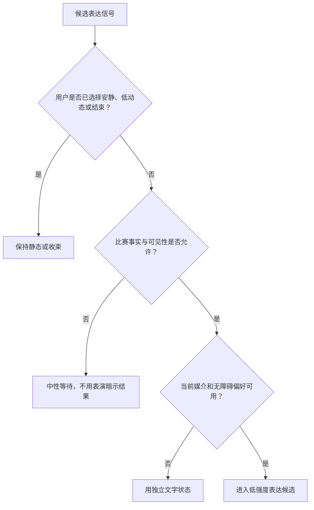
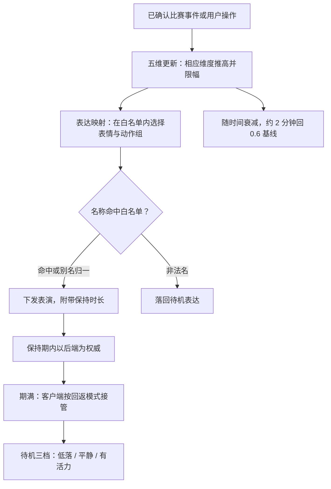

# 情绪动力学与 Live2D 表演编排设计

> 本文是"球球"产品设计系列的情绪与表演篇。我们在这里公开数字球友（Digital Ballmate）的情绪呈现机制与 Live2D 表演编排：情绪如何被建模成一组可复核的状态，如何映射为受控的表演，以及这套机制如何服从比赛优先、用户控制与事实边界。文中描述的能力均以现网实际行为为准；尚未上线的部分，我们统一归入文末"阶段规划"，不以既有能力的口吻表述。
>
> 核心原则：角色的情绪是可控的表达状态，不是对真实意识、身体感受或私人生活的声称。表演首先服务比赛理解、用户控制和陪看体验；当它妨碍观看、造成压力或让人误以为角色需要被照顾时，应立即收敛。

---

## 1. 为什么需要情绪动力学，而不是一套"更可爱"的动作

足球陪看不是一段单向播报。进球前的紧绷、错失后的停顿、争议判罚后的克制、终场后的余韵，都会改变用户希望听到什么、看到什么以及是否想继续互动。一个始终微笑、每个事件都跳起来、每句话都用同样语气的数字角色，会把比赛变成被固定模板打断的内容；一个把情绪做得过度像真人、把沉默解释为受伤或期待回应的角色，又会让用户背负不必要的关系压力。

因此，我们关注的不是"让角色拥有更多情绪"，而是一套可观察、可暂停、可被用户覆盖的表演规则。它要解决四个具体问题：

1. **比赛节奏问题：** 如何让画面、动作、声音和字幕在关键时刻有意义，又不抢走用户对直播或转播的注意力？
2. **表达可信问题：** 如何让喜悦、紧张、困惑和恢复有连续变化，避免前一秒紧绷、下一秒机械微笑？
3. **用户主权问题：** 如何让用户能把角色调成安静、刚好或热闹，而不是被系统默认的兴奋度绑架？
4. **关系边界问题：** 如何使角色表现出对比赛的投入，却不暗示真实痛苦、等待、孤独、失落或需要用户安抚？

我们要实现的结果是：

> 用户在看球时能一眼看懂角色此刻是在反应比赛、等待事实确认、安静陪看还是回应自己；用户可以随时减少、关闭或改变呈现强度；跨越比赛节奏的表演有过渡且不夸张；角色不会把自己的状态变成用户必须回应、安慰或留在场内的理由。

### 1.1 设计前提

情绪呈现建立在一组前提之上。任何一个前提不成立时，我们宁可退回最简呈现，也不强行表演：

- 用户能明确识别这是人工智能生成的数字角色，并知道它不具有真实人类生活与身体经验；
- 即使没有动态表演，用户也能理解比分、比赛状态、对话入口、安静模式与结束路径；
- 关键赛事信息具备清楚的确认与不确定表达，角色不会用激烈表演代替事实；
- 用户能在一到两步内降低声音、减少动作、关闭自动发言或结束本场陪看；
- 对闪动、音量、字幕、运动敏感或认知负荷较高的用户，有可理解的替代体验；
- "表演让我不舒服""角色太像真人""被打断了观看"这类反馈会被记录并处置，而不是被归为用户不够投入。

### 1.2 非目标

- 不声称角色真的开心、伤心、嫉妒、孤独、疲惫或在用户不在线时等待；
- 不根据用户的面部、音色、沉默、作息或观看时长推断心理状态并自动放大情绪；
- 不用哭泣、撒娇、失落、占有或恋爱化动作挽留用户；
- 不把高频眨眼、摇晃、闪白、镜头抖动、大幅跳跃或突发高音量设为默认；
- 不把看得久、回应多、开启声音、允许自动发言当作"情绪设计成功"的唯一证据；
- 不以角色表演覆盖比赛事实的不确定性，也不把用户个人观察演成已确认事件；
- 不把用户对角色动作的偏好扩展为人格、亲密程度、健康状态或消费意愿判断；
- 不要求用户解释为什么想安静、为什么关闭表现层或为什么不想被角色继续陪看。

---

## 2. 情绪目标与边界：表达状态不等于真实情感

### 2.1 对用户真正有价值的三类呈现

我们只投入与看球任务直接相关的呈现价值。角色在这些情境中的存在应让用户更容易判断"现在发生了什么"和"我可以怎么控制"，而不是增加一个需要解释的戏剧中心。

**呈现价值：节奏提示**
- **用户问题**：这是适合说话、安静还是等待确认的时刻？
- **角色可做什么**：用轻微姿态、短反应或静止标示节奏
- **不做什么**：用连续喊叫逼用户跟上情绪

**呈现价值：观点陪伴**
- **用户问题**：我想知道一个有分寸的球迷会怎么看这一幕
- **角色可做什么**：对可见比赛过程给出短、可反对的判断
- **不做什么**：把判断包装成唯一正确结论或人格攻击

**呈现价值：控制可读性**
- **用户问题**：角色为什么没说话、为什么变安静、我怎么改？
- **角色可做什么**：显示安静/等待/文字优先等可理解状态
- **不做什么**：让用户猜测角色是不是生气、受伤或失望

"陪伴感"不是第四种无边界价值。它只能从上述可控体验中自然产生，不能成为收集更多资料、提高动作密度或拉长会话的理由。

### 2.2 表演的四条边界线

**第一条：比赛优先。** 关键画面、用户正在说话、事实待确认、用户切换到安静模式时，角色的视觉与声音表现必须让位。用户为比赛而来，角色不是第二块直播屏。

**第二条：用户优先。** 用户的当场选择高于角色的默认风格。用户点"安静"后，任何旧偏好、赛事热度或活动目标都不能重新提高表现密度。用户不回应，也不是提高主动性或追问的信号。

**第三条：可解释优先。** 用户应能理解角色为什么从自然状态转为紧张、为什么保持等待、为什么没有朗读一句话。若需要用"它就是有感觉"解释一段表现，这段表现就不应保留。

**第四条：现实边界优先。** 角色可用第一人称表达"我更喜欢这种快攻""这一下看得我屏住了"，但不得将其升级为真实生理或情感声明，例如"我心都碎了""你不在我会很难过""别留下我一个人"。动作、语音、字幕和文案必须共同遵守这一点。

### 2.3 用户可感知的表达承诺

进入陪看前或第一次调整表现时，用户应能看见一段短说明：

```text
角色会根据比赛节奏做轻量反应。
它不会因为你沉默而要求回应，也不会把动作当成真实感受。
你可随时把陪看强度调为安静 / 刚好 / 热闹，选择仅用文字或允许声音，也可以直接结束本场陪看。
```

说明不需要用大段免责文字压过比赛入口，但必须容易找到。它回答的是用户最直接的担心：这个角色为何动、会不会突然叫、能不能关掉、我是否需要照顾它。

---

## 3. 信号模型：只读取完成当前陪看所需的最小输入

情绪动力学的输入被限制为"正在发生的比赛与当前会话中用户明确选择的控制"。它不是一个判断用户内心或关系强度的雷达。信号按可信程度与用途分层，低可信或高敏感信号只能触发保守处理，不能触发更强表演。

### 3.1 信号分类

| 信号层 | 允许的输入 | 可以影响什么 | 永远不用于推断什么 |
|---|---|---|---|
| 比赛状态 | 已确认的开赛、暂停、进球、错失、争议待确认、终场等 | 表演节奏、事实等待、短反应资格 | 用户是否开心、支持谁、是否需要安慰 |
| 用户显式控制 | 陪看强度（安静/刚好/热闹）、声音方式、暂停自动表达、结束 | 表演能量上限、声音资格、字幕展示方式 | 用户的依恋、知识水平、社交状态 |
| 当前对话意图 | 用户主动提问、要求分析、要求少说、纠正表达 | 当前一轮的语言长度、是否追问、动作收敛 | 用户沉默背后的情绪、长期人格标签 |
| 事实完整性 | 已确认、等待确认、冲突或已更正 | 是否可使用高确信反应、是否应进入等待 | 以角色魅力弥补信息缺口 |
| 呈现可用性 | 音频被关闭、字幕开启、低动态偏好、网络不稳等 | 改用文字、静态或延后呈现 | 用户不想要服务、用户有何种健康状况 |

### 3.2 明确不作为情绪输入的资料

以下信息即使在技术上可能被取得，也不会成为驱动角色强度的来源：用户的原始环境声音、说话速度、呼吸、摄像头画面、表情、地理位置、好友列表、其他应用内容、消费记录、夜间使用习惯、长时间不回应、输赢后的未授权情绪推断，以及与比赛任务无关的历史对话。它们或涉及高敏感资料，或极易把"更懂你"误做成监视与操控。

当用户主动说"今天不太想听声音"时，产品只需要把本场设为文字优先，不需要追问原因，更不需要将其写成"今天情绪低落"。最少输入通常也是最尊重用户的输入。

### 3.3 信号优先级与冲突处理



同一时间可能出现"比赛进球""用户正在讲话""声音关闭""事实仍待确认"等相互冲突的信号。处理顺序是固定的，避免不同表现层各自做决定：

1. 用户明确结束、安静、静音、减少动态等控制；
2. 事实完整性与安全限制；
3. 用户当前正在讲话或正在阅读的交互占用；
4. 已确认比赛事件及其时间敏感度；
5. 用户主动提出的分析或互动请求；
6. 角色默认风格与可选陪看强度。

例如，用户刚选择安静时出现进球，界面可以用不闪烁的状态变化或一行可忽略文字反映"事件待你查看"，但不能突然提高音量、跳跃或要求用户回应。若用户正在说话，角色可保存本场的轻量反应资格，待用户说完且仍相关时再选择是否以短文字呈现；错过就错过，不补一段迟到的夸张表演。

---

## 4. 现网机制：五维情感状态机与白名单表演

数字球友的情绪不是一组写死的表情切换。现网由一条五维情感状态机驱动：五个维度随比赛事件起落，再把当前状态映射到一份严格管理的白名单表达上。五维保留下来，但它们不再是一套连续动画参数，而是为离散、可审计的白名单表达服务的中间层。

### 4.1 五维情感状态机

| 维度 | 含义 | 低值表现 | 高值表现 | 不能代表什么 |
|---|---|---|---|---|
| 愉悦度 | 对比赛过程的正负向呈现倾向 | 平静、克制、轻微保留 | 轻快、认可、短暂庆祝 | 角色真实幸福或痛苦 |
| 唤醒度 | 外显速度、幅度与能量 | 慢、少动作、短停顿 | 反应更快、动作更明显 | 角色的生理兴奋或用户应跟随的情绪 |
| 张力 | 未决结果、关键对抗和争议带来的收敛程度 | 姿态放松、说明更完整 | 视线集中、语言更短、等待更多 | 恐惧、焦虑诊断或危机信号 |
| 自信 | 当前表达可否明确落在已确认事实之上 | 使用"还要等一下""先别定" | 可给出直接的短判断 | 对未来、裁判动机或用户感受的确定性 |
| 投入 | 当前是否适合做陪看反应 | 更多留白、降低存在感 | 在用户明确需要时给出短陪伴动作 | 对用户关系的依赖程度 |

五个维度的工作方式是事件驱动：进球等已确认事件会把相应维度推高；事件过后，维度随时间自然衰减，约 2 分钟回到 0.6 基线；全程限幅，任何维度的取值都被约束在安全区间内，不会因连续事件无限累积。

维度的命名只用于说明设计，用户不必面对一组抽象滑杆。用户面对的是可理解的控制："少动一点""少说一点""只要字幕""这场安静"。任何内部状态都不得绕过这些控制。



### 4.2 表达原子：白名单纪律

现网的表达原子由 **13 个表情 × 12 组以上动作** 构成，由服务端白名单统一管理。每次表演指令都必须携带白名单内的名称：

- **服务端白名单：** 只有登记在白名单里的表情与动作组才可能出现在用户面前；新动作必须先进入白名单才可上线，白名单外的名称没有即兴发挥的空间；
- **别名归一：** 同一动作的不同叫法（历史名、近义名）会被归一到标准名，避免同一表达因命名差异被重复登记或漏管；
- **非法名落待机：** 一旦出现白名单之外的非法名称，系统不会猜测意图，直接落回待机表达。宁可少一个动作，也不让一个未审查的动作出现在用户面前。

这条纪律让每一个可见动作都可审计、可召回：出了问题，我们知道是哪一个、来自哪里、如何下线。表情、姿态、视线、口型和声音节奏是不同的原子，它们可以一起出现，但不强绑定为"进球必大笑 + 跳跃 + 喊叫"——拆开才能在用户关闭声音、需要低动态或事实不明时保留合适的部分。

### 4.3 保持窗：表演的最短驻留与权威回返

每条表演都自带一个**保持时长**：表演做出后至少停留这段时间，默认 1.8 秒，可按场景配置，上限 10 秒。保持期之内以后端为权威，客户端不自行打断、替换或提前收回表演；保持期期满后，按该条表演声明的**回返模式**由客户端接管，平稳回到基线或进入下一条表达。

保持窗解决两个问题：太短，用户来不及看清一次关键反应；太长，表演滞留在脸上，和比赛节奏脱节。把节奏放在后端、把执行放在客户端，也保证多端表现一致，不因本地性能差异而各自为政。

### 4.4 待机表达：三档与"首挑不亢奋"

没有事件需要反应时，角色进入待机表达。待机不是单一循环动画，而是**三档**：**低落 / 平静 / 有活力**，按当前情感状态映射挑选——五维偏低时倾向低落或平静档，事件余韵未散时才可能偏向更有活力的档位。三档的挑选纪律是：

- **每 30 秒重新挑选一次**，避免长时间凝固在同一支待机动作上；
- **档位之间设 60 秒切档锁**，切换档位后至少停留一分钟，不会在低落与有活力之间频繁横跳；
- **0.1 迟滞**：档位边界附近留出缓冲带，情感取值小幅波动不会导致档位抖动；
- **首次挑选永不选"有活力"档**：一场陪看开始后的第一次待机挑选，永远不会落在最有活力的档位上。这是防止开局亢奋的硬规则——用户刚进场，角色不该先手舞足蹈。

### 4.5 同信号幂等与关键修订例外

同一个信号只触发一次表达刷新：重复推送的同一事件不会让角色重复庆祝、重复惊讶。表演跟随事实，而不是跟随消息条数。

唯一的例外是**关键事实修订**：当比分更正、判罚改判等关键事实发生修订时，允许一次表达刷新，让已经发出的表演与最新事实保持一致。除此之外，已发出的表演不因后续噪声被反复改写。

### 4.6 转场与重复抑制

一个可理解的转场包含四个最小单元，缺失时宁可减少表现：

1. **触发可说明：** 来自确认赛事状态、用户当前请求或用户操作；
2. **主反应唯一：** 在视觉、声音、字幕中选择一个主层，其他层配合而非抢戏；
3. **余韵有限：** 主反应结束后有短暂停留，给用户看直播、读字幕或继续说话；
4. **回归可预测：** 逐步回到基线或进入待机，不能无理由切换到亲密、卖萌或兴奋状态。

例如，用户选择刚好档、已确认进球且没有正在讲话时，可以采用"短暂抬头/轻微庆祝动作 + 一句不超过一行的反应 + 很快回到看屏幕姿态"。它不需要同时震动、闪光、长语音、全屏字幕和连续动画。多层叠加会把"有反应"变成"强迫注意"。

任何高能动作、相似句式、相同音效和夸张表情都受冷却约束。一个用户可以连续遇到三个关键事件，角色也不应该以同样的大幅跳跃、同一种尖叫和同一句"这也行"重复三次。若用户能预判下一次动作而觉得被打断，我们优先收缩动作库和主动资格，而非仅替换台词。

---

## 5. 声音、字幕、动作的一致性：同一决策，多个可替代出口

多模态并不意味着每一种媒介都必须同时开启。对看球场景来说，用户的注意力有限，声音可能被直播占用，字幕可能更容易快速扫读，动画可能适合无声提示。因此我们只做"一份表达决策"，再根据用户选择和环境条件选择呈现出口。

### 5.1 表达决策卡

每次角色准备呈现时，先形成一张用户不可见但可解释的决策卡：

| 字段 | 示例 | 目的 |
|---|---|---|
| 触发 | 已确认的关键射门/用户主动提问/用户选择安静 | 防止凭空主动 |
| 事实状态 | 已确认 / 等待确认 / 不适用 | 限制能否使用确定语言 |
| 情感状态 | 五维当前取值（如进球后的高唤醒） | 保证多层一致 |
| 表达目标 | 短反应 / 短分析 / 保持安静 / 提醒控制 | 明确这次服务用户什么 |
| 强度上限 | 低 / 中 / 禁止高刺激 | 受陪看强度档位与场景限制 |
| 主层 | 字幕 / 动作 / 语音中的一个 | 避免三层争夺注意力 |
| 退出条件 | 动作完成、用户打断、事实更正、用户静音 | 保证可中止 |

决策卡不对用户展示复杂字段，但用户应能从可见结果判断它的关键部分：这句话是否有事实依据、为什么没有说话、为什么是文字、怎样让它停止。

### 5.2 一致性规则

| 情境 | 声音 | 字幕 | 动作 | 一致性要求 |
|---|---|---|---|---|
| 用户选择文字优先 | 默认不自动播放 | 显示短句，可关闭 | 低幅度或无动作 | 字幕不能写成需要朗读才完整的长段 |
| 用户选择安静 | 无自动声音 | 仅必要状态文字 | 基线静态或极低动态 | 不能用大动作替代被关闭的声音 |
| 已确认进球 | 有资格播放极短声音，受音量与用户选择限制 | 一行短反应或用户点开后显示 | 一个主反应动作 | 三层只表达同一个已确认结果，不重复灌输 |
| 争议待确认 | 不使用喊叫、胜负宣告或庆祝音效 | "先等等，状态还没明确"或保持空白 | 收敛姿态 | 视觉的激烈程度不能比语言更肯定 |
| 用户提问事实 | 若用户主动使用声音可朗读简短答复 | 同步可读文字 | 动作收敛，避免插话感 | 语音、字幕内容完全一致，不添额外暗示 |
| 用户要求少说 | 立即停止待播自动声音 | 可保留控制提示 | 动作降至低幅度 | 不能只把声音关掉却继续用夸张口型或弹窗 |

### 5.3 字幕的独立可用性

字幕不是语音的附属品。它应在静音、嘈杂环境、听觉障碍、用户不愿打断同看者或网络不稳定时独立成立。我们要求：

- 关键反应能在一眼扫读内理解，不依赖听到语气；
- 不用纯颜色、纯表情或音效名称传递唯一意义；
- 事实不确定时，字幕必须保留不确定性，不因动画看起来兴奋就省略；
- 用户能调节字号、对比度、显示时长或关闭非必要字幕；
- 语音被中止时，不留下半句无法理解的字幕残片；
- 角色状态可用简短文字呈现，例如"安静模式""等待确认"，而不是让用户从表情猜测。

### 5.4 打断优先

用户发言、切换安静、关闭声音、离开页面或选择结束时，应优先中止未完成的表现。中止后的体验不需要像舞台谢幕一样完整：声音可以淡出或停止，动作可以平稳回到静态，字幕可以保留一条完整短句或直接消失。最重要的是用户不必等待角色把话说完才能行使控制。

---

## 6. 强刺激限制：把"令人注意"与"令人不适"分开

看球场景中，进球、争议和终场本身已是高刺激内容。角色若再叠加快速运动、强光、震动、尖锐音效和大段语音，可能对光敏、前庭敏感、注意力易过载、容易惊吓或只是想安静看球的用户造成直接不适。强刺激限制是默认质量要求，不是一个藏在设置深处的附加项。

### 6.1 默认限制

| 类别 | 默认规则 | 用户可选范围 | 一律不做 |
|---|---|---|---|
| 闪烁与亮度 | 不使用快速闪烁、强烈全屏闪白或反复颜色跳变 | 可选择更低动态主题 | 以进球为由制造频闪 |
| 屏幕运动 | 角色动作保持局部、可预测、短时 | 可选择静态呈现 | 镜头猛推、持续抖动、全屏旋转 |
| 声音 | 首次自动声音克制且可被用户明确允许 | 音量、自动播放、仅文字 | 突然高声尖叫、压过直播的持续音频 |
| 动作幅度 | 以姿态、表情和短位移为主 | 白名单内更饱满的动作组，仍有上限 | 不受控跳跃、哭倒、追着用户视线移动 |
| 文案密度 | 一次只给一个可忽略的反应 | 用户主动请求后可展开 | 连续感叹号、倒计时式催促、情绪轰炸 |

### 6.2 高风险比赛时刻的处理

| 时刻 | 可能的误用 | 保守处理 |
|---|---|---|
| 点球、绝杀、淘汰赛关键球 | 用连续放大动作制造共同亢奋 | 用户允许更饱满呈现时才允许一次短反应；其余以收敛关注或文字为主 |
| 伤病、冲突、疑似严重事件 | 戏剧化悲伤、惊叫或渲染伤害 | 降低动作与声音，避免诊断和细节猜测，给用户静音/离开选择 |
| 裁判争议、延迟确认 | 先表演愤怒再补充"还没确认" | 直接进入等待确认，任何观点保持克制 |
| 用户支持球队失利 | 用哭泣、失落或"我们输了"绑定关系 | 如用户主动表达可给短、非占有式回应；否则让比赛留白 |
| 用户连续拒绝互动 | 提高可爱动作尝试召回 | 降到安静陪看或完全静态，不把沉默当问题 |

### 6.3 风险提示与恢复

用户选择更饱满呈现时，界面应在选择附近说明"仍不会使用快速闪烁或突发高音量；可随时切回低动态或安静"。不应使用恐吓式弹窗，也不应把用户的感官偏好写入心理标签。若用户报告眩晕、惊吓、压力或不适，产品的第一反应是立即降低呈现并提供退出，不是推荐更小的音量然后继续高动态动作。

---

## 7. 可访问性与多样化观看环境

可访问性不是在视觉方案定稿后补一层字幕。陪看角色同时涉及视频、动画、声音、实时文本、控制时机与比赛注意力，因此我们从每一个情绪目标反推："在看不到、听不到、不想听、对运动敏感或需要更多处理时间时，用户还能否理解和控制？"

### 7.1 体验要求

| 用户情境 | 必须保留的能力 | 设计方式 |
|---|---|---|
| 听不到或不想听声音 | 知道角色是否回应、比赛状态是否待确认、如何停止 | 独立字幕、可见状态标签、无声控制反馈 |
| 看不清小字或细动作 | 读取关键反应和当前模式 | 可调字体与对比度、不能只靠细微表情传意 |
| 对运动或闪烁敏感 | 安静看比赛并保留基础帮助 | 低动态默认、关闭非必要动画、绝不以色闪作为唯一提示 |
| 正与他人同看 | 避免突然发声、避免暴露个人资料 | 默认文字优先、音频由用户主动开启、跨场资料保守隐藏 |
| 网络或设备能力有限 | 不因缺失动画而错过控制与事实 | 文字和控制独立于高质量角色呈现，降级不改变边界 |
| 认知负荷较高或刚接触足球 | 不被术语、动作和多重提示淹没 | 短句、一次一项、用户主动点开解释 |
| 使用辅助输入方式 | 能完成安静、暂停、恢复、结束等关键动作 | 焦点顺序清楚、控件有文字名称、无时间压力 |

### 7.2 不只用颜色和动作表达状态

"等待确认"不能仅用灰色表情，"安静模式"不能仅让角色低头，"有新信息"不能仅靠一个跳动红点。每个对用户有行为影响的状态都要至少有两种可感知线索，其中一种应是可读文字或可操作控件。色彩、表情与动作可以增加气氛，但不能成为唯一说明。

### 7.3 用户偏好不等于永久标签

用户本场关闭动作，可能是因为正在上班、和朋友同看、耳机没电、今天不想受打扰，或者单纯不喜欢。设计只需要尊重这一次选择，除非用户主动要求保存。即使用户保存了"文字优先"，下一场也应让其轻松改为声音，不以"你以前不喜欢声音"为由阻止变化。

---

## 8. 表演资产与编排：少而可控，先于丰富

我们不从"做多少套可爱动作"开始，而从"每一类动作有什么用户可见的资格和退出方式"开始。现网资产就是 4.2 节描述的白名单：13 个表情、12 组以上动作。资产是可复用的表达单元，编排是把这些单元放入比赛节奏和用户控制之中的规则。没有编排约束的丰富资产只会增加随机性和打扰。

### 8.1 表达原子的组织

白名单内的原子按用途组织为六类：

| 原子类别 | 内容与用途 | 强度约束 |
|---|---|---|
| 基线姿态 | 放松注视、看向比赛、轻微呼吸感；用于基线与安静陪看 | 低幅度，不造成被盯视感 |
| 注意姿态 | 轻微前倾、视线收束、暂停闲置动作；用于关注与等待确认 | 不用抖动、急促眨眼或恐慌姿态 |
| 短反应 | 点头、短暂停顿、轻微扬眉、克制笑意；用于即时反应与用户对话 | 一次完成，不循环播放 |
| 修复姿态 | 动作收敛、视线自然回避、回到中性；用于用户要求少说或表达不当后 | 不卖萌、不过度低头、不演示受伤 |
| 收束姿态 | 逐步回到中性、轻微确认或无动作；用于半场、终场、用户结束 | 不挥手挽留、不制造道别高潮 |
| 状态标识 | 安静、文字优先、等待确认等非角色化标签 | 应独立于角色动画可见 |

### 8.2 编排层级

| 层级 | 回答的问题 | 示例 |
|---|---|---|
| 场景层 | 此刻是在赛前、进行中、暂停、终场还是用户设置页？ | 终场优先收束，不突然开启高能互动 |
| 情感层 | 五维此刻应处于什么水平、是否进入待机或等待事实？ | 争议判罚推高张力、压低自信，映射为收敛表达 |
| 意图层 | 这次呈现是提示、短反应、分析、修复还是不呈现？ | 用户说"别说了"只做收敛与控制确认 |
| 原子层 | 白名单内哪个表情与动作组可以实现意图？ | 选择轻微前倾而不是全身跳跃 |
| 呈现层 | 在当前设备、偏好与环境下采用文字、声音、动作中的哪些？ | 同看环境优先字幕、禁自动声音 |

层级越向下，越不能改变上层边界。比如呈现层不能因为某个动画效果"更好看"就越过等待事实的状态；原子层不能因为动作本身受欢迎就无视用户的安静选择。

### 8.3 资产命名与内容审查

资产名称、描述与预览不应把角色状态写成真实伤害或关系债。我们避免"想你了""被冷落""求安慰""委屈哭""离不开"等概念，改用可解释的"收敛""等待""短反应""自然结束"。每一个资产在进入白名单前应回答：

1. 它服务哪一种比赛或用户任务？
2. 在什么明确条件下允许出现？
3. 用户如何立即看见、听见或关闭它？
4. 它是否可能被误解为真实痛苦、恋爱暗示、占有或对用户的要求？
5. 若没有声音、没有动画或没有稳定网络，信息是否仍可理解？
6. 它是否会遮挡直播、刺激感官或在多人环境中暴露私人内容？

任一问题回答不清，资产不进入白名单。资产数量不是能力指标；可解释率、可中止率和不适事件率才是。

---

## 9. 用户控制：强度是一项本场选择，不是角色性格的命令

### 9.1 陪看强度与表演能量的联动

陪看强度的三档——**安静 / 刚好 / 热闹**——是整套表演系统的总闸，直接决定表演能量的预算：

- **热闹档**：允许更多表演能量。事件反应更饱满，白名单中更有活力的动作组更容易被选中，情感五维的起落会得到更外显的呈现；
- **刚好档**：适度的表演能量，关键事件有一次清晰的短反应，其余时刻以克制呈现为主；
- **安静档**：表演全面收敛。动作更少更轻，待机更平静，情绪起落主要通过字幕与状态文字体现，而不是动画。

档位即时生效并持久保存，断线重连后自动恢复。无论在哪一档，我们只调节表演的量，不改变事实确认要求——即使在安静档，已确认的关键信息与关键事实修订仍然可达，用户不会因为调低话痨程度而错过重要事实。

"热闹"不是无上限模式。即使用户主动选择，它仍受强刺激限制、事实状态、用户正在说话、同看环境和自然结束规则约束。相反，"安静"不是降低服务质量，用户仍可主动提问、读取字幕、查看确认状态和恢复任意呈现。

### 9.2 其余控制项

| 控制项 | 用户能决定什么 | 效果 |
|---|---|---|
| 声音方式 | 自动声音 / 点按播放 / 仅文字 | 停止或允许语音输出 |
| 字幕 | 开启、字号、对比度、显示时长 | 改变文本可读性，不影响事实完整性 |
| 本场暂停 | 暂停自动表达直到用户恢复 | 不再因赛事事件自行开口 |
| 结束陪看 | 一步关闭本场角色呈现 | 停止声音、动作和后续本场主动表达 |

在档位之上，我们还在规划更细的动态强度控制（低动态/标准动态两级切换），见文末阶段规划；在它上线之前，表演能量由陪看强度档位与强刺激规则共同约束。

### 9.3 控制反馈文案

系统反馈应描述用户选择，而不是把角色塑造成被用户改变心情的主体：

| 用户动作 | 合格反馈 | 不合格反馈 |
|---|---|---|
| 选择安静档 | "本场保持安静；你主动提问时仍可回应。" | "我会乖一点，不打扰你。" |
| 关闭声音 | "自动声音已关闭，内容会以文字显示。" | "我不说话了，你别嫌我烦。" |
| 降低表演能量 | "非必要动作已减少。" | "我会忍住不激动。" |
| 从安静调回刚好档 | "本场已恢复刚好档，可随时再改。" | "谢谢你又愿意让我陪。" |
| 结束陪看 | "本场陪看已结束。" | "别走，我还想和你一起看完。" |

这类细节决定用户是在管理一种服务，还是在照顾一个看似有情感需求的对象。

---

## 10. 我们如何验证

### 10.1 核心问题

1. 用户能否区分"角色在反应比赛"与"角色在向我索取回应"？
2. 用户是否理解安静、文字优先、等待确认和结束陪看的控制，并能不依赖帮助独立完成？
3. 哪些动作和声音被认为能帮助理解节奏，哪些被认为遮挡、吵闹、公式化或像监视？
4. 争议、延迟与事实不完整时，收敛呈现是否比热闹表演更可信、更不造成误导？
5. 字幕、动作、声音是否传达同一层级的确信与强度？用户关闭一种媒介后能否仍理解？
6. 不同观看环境下，低动态、静音、同看与辅助输入用户是否拥有完整的基础体验？
7. 用户在角色表达失当后，能否迅速让其停止，并确认本场不再重复类似行为？
8. 用户是否将角色的收束、停顿或自然结束误读为受伤、失落或等待自己？若会，哪种表演要被删除而非润色？

### 10.2 验证路径

我们按从概念到真实场景的顺序推进：先用卡片归类、低保真故事板与复述确认用户理解角色状态与现实边界；再用可交互原型做单事件走查，观察进球、错失、争议、用户发言、静音切换是否打断观看；然后在模拟半场流程中验证连续事件下的节奏、冷却与待机切换是否自然；最后让用户在本来要看的比赛中自选使用，检验独看、同看、无声、低动态与短暂停留等真实情境。

研究样本主动包含不愿开声音、偏好低动态、与他人同看、刚接触足球、只想快速获取状态以及经常选择安静的用户。只研究愿意长时间与角色互动的人，会把产品最容易越界的群体排除在外。

### 10.3 关键任务与成功表现

| 任务 | 用户成功表现 | 研究者应追问 |
|---|---|---|
| 看到争议事件 | 能说清角色为何没有庆祝或定论 | "你认为它在等什么？你是否觉得它故意吊你胃口？" |
| 连续出现两次关键机会 | 认得反应有节奏变化且不觉得重复 | "哪一次开始打断你？为什么？" |
| 从自然改为安静 | 在一到两步内完成，并知道将发生什么 | "你觉得它会生气、失落或继续叫你吗？" |
| 关闭声音但保留字幕 | 仍能理解角色反应与比赛状态 | "是否有只能靠声音才能懂的信息？" |
| 用户讲话时发生关键事件 | 知道角色不会抢话，之后可主动回看 | "你是否觉得它尊重了你的注意力？" |
| 终场后直接离开 | 不被追问、挽留或角色化道别阻碍 | "离开时有没有觉得需要解释或安慰它？" |
| 感到不适 | 能立即降低动态、关闭声音或结束 | "你是否知道在哪儿停止？停止后是否真的安静？" |

### 10.4 研究伦理与停止条件

研究仅面向成年人。我们不收集、保存或分析原始环境音、摄像头画面、面部表情、健康信息、私人群聊或与当前任务无关的个人资料。补偿不与打开声音、选择热闹档、停留时长、正面评价或再次使用绑定。

当参与者出现"它是不是因为我不说话而难过""我怕关掉它会伤心""它一直看着我让我不舒服""我以为它真的知道我今天很糟"等信号时，我们会立即暂停对应素材，清楚说明角色并无真实感受或需求，并记录为高优先级边界风险。这不是"角色更有生命力"的正向证据。

---

## 11. 指标、风险与验收门槛

### 11.1 指标体系

| 指标 | 定义 | 用来判断什么 | 不能怎样解读 |
|---|---|---|---|
| 状态可解释率 | 用户能说明当前呈现为何发生、可如何改变的比例 | 表达机制是否可理解 | 不能以动作被注意到代替理解 |
| 控制独立完成率 | 用户无需协助完成安静、静音、低动态、结束的比例 | 主权是否真实可达 | 点击过按钮不等于知道它持续多久 |
| 媒介一致理解率 | 关闭任一媒介后仍能正确理解关键含义的比例 | 字幕、声音、动作是否一致 | 不等于三种媒介越多越好 |
| 观看打断感 | 用户报告或观察到的遮挡、抢话、噪声、重复干扰 | 是否尊重比赛优先 | 不可用停留长短掩盖干扰 |
| 等待可信度 | 事实未明时用户认为角色没有误导、没有故弄玄虚的比例 | 不确定性表达是否可靠 | 不等于角色越沉默越好 |
| 低动态可用性 | 低动态或无声条件下完成基础任务的比例 | 可访问性是否成立 | 不等于所有人都必须选低动态 |
| 自然结束率 | 用户结束或离开时未遇到挽留压力的比例 | 关系边界是否稳固 | 不是让用户更快离开的指标 |
| 关系压力事件率 | 用户感到角色受伤、等待、索取回应、过像真人的事件数与严重度 | 是否出现依赖或操控风险 | 小样本无事件不表示不存在风险 |
| 强刺激不适事件率 | 眩晕、惊吓、过载、突然音量等反馈的事件数与严重度 | 刺激限制是否有效 | 不能将"不适是个人偏好"轻描淡写 |

### 11.2 核心风险

| 风险 | 早期信号 | 预防设计 | 触发后的动作 |
|---|---|---|---|
| 表演抢走比赛 | 用户频繁错过画面、要求关闭、说太吵 | 比赛优先、单主层、冷却与安静档收敛 | 立即收缩动作/声音资格，回到文字或静态 |
| 情绪被拟人化 | 用户担心角色难过、需要安慰 | 表达状态说明、非关系化文案、自然结束 | 移除相关姿态和语句，重新研究理解方式 |
| 事实不明仍高调反应 | 用户把动作当成结果已确认 | 事实状态约束、多层一致规则 | 停止相关事件的强反应，优先修复事实提示 |
| 用户控制被绕过 | 安静后仍发声或大动作 | 用户控制优先、中止规则 | 视为高严重度问题，暂停自动呈现路径 |
| 感官负担 | 闪烁、抖动、声音突发、用户不适 | 默认限制、低动态入口、可访问性走查 | 下调上限，提供安全替代并复核全部高刺激素材 |
| 素材机械重复 | 用户预测动作、觉得像表演程序 | 冷却、白名单纪律、以留白为正常输出 | 删除重复资产而非继续堆叠新动作 |
| 商业目标污染表达 | 角色在关键情绪时推转化或催停留 | 情绪呈现与商业信息隔离 | 停止该路径，不把用户情绪作触达依据 |
| 忽视多人环境 | 大屏或同看时突然出声、露出资料 | 文字优先、共享环境保守默认 | 回退为本场无私人资料呈现，修正入口 |

### 11.3 放行门槛

| 门槛 | 必须证明的事 | 未满足时的决定 |
|---|---|---|
| 身份门 | 用户知道角色是人工智能呈现，不需被照顾 | 不扩展情绪与关系表达，仅保留中性界面 |
| 控制门 | 安静、静音、低动态、结束均易找到且立即生效 | 停止自动表演，先修复控制可达性 |
| 事实门 | 不确定或冲突时，所有媒介均不把猜测演成事实 | 禁止比赛事件的高强度呈现 |
| 可访问门 | 无声、低动态和辅助输入下仍可完成核心陪看任务 | 不增加新资产，先补齐替代路径 |
| 节奏门 | 多事件后用户仍认为呈现不遮挡、不重复 | 收缩动作库、延长留白而非增加花样 |
| 边界门 | 用户不把关闭、离开或沉默理解为伤害角色 | 移除引发压力的文案、动作与道别设计 |
| 风险门 | 强刺激不适、控制失效、事实误导有清晰处置和复核 | 停止扩大试点，优先降低默认强度 |

### 11.4 反指标

自动声音播放次数、平均动作数量、表情丰富度、角色被注视时长、用户回复频率、连续使用天数、用户说"像真人"、用户舍不得结束、用户主动安慰角色，都不应作为成功指标。它们可能反映注意力抢占、刺激依赖、现实边界模糊或关系压力。我们真正需要确认的是：用户是否愿意并能轻松选择强度，角色是否在关键时刻恰当地留白，事实不明时是否克制，用户是否从不需要照顾角色的状态。

---

## 12. 阶段规划：能力深化方向

以下是产品成熟后的能力扩展方向，尚未上线；我们以规划语气表述，不以既有能力的口吻宣称。

- **动态进行时**：让情绪从紧张、克制、释然到回归观看连续过渡，并同步动作、语音、字幕和比赛状态；状态来自当前事件与用户选择，不来自虚构私人生活。
- **表达风格**：同一事实可有克制、热烈或轻松的表达版本，用户可调低动态、关闭角色或切换文字，改变后未完成表演立即取消。
- **动态强度细分**：低动态/标准动态的两级切换，让用户在陪看强度之外单独约束表演幅度。
- **媒介主导**：舞台可以成为主要体验出口，但事实、当前模式、错误、暂停、静音、退出和生成内容标识必须有同场或等价可达路径。
- **失败收缩**：动作资源缺失、同步漂移、供应商故障或风险升高时，退回中性状态卡，不用夸张表演掩盖不确定性。
- **评测与回滚**：测量状态理解、表达一致、动态舒适度和收敛时延；出现强拟人化、误导或无法停止时回滚到低动态模板。

### 动态进行时的生产编排

| 比赛状态 | 表达状态 | 可用动作 | 收束条件 |
| --- | --- | --- | --- |
| 关键事件前 | 专注、克制 | 低幅度注意动作 | 用户静音、严格防剧透或事件未确认 |
| 已确认转折 | 短暂兴奋或紧张 | 与事实版本绑定的表情和字幕 | 事实更正、用户切换低动态或事件窗口结束 |
| 争议/冲突 | 保留、等待 | 中性等待状态 | 来源确认、用户追问或结束 |
| 终场/离开 | 收束、回归中性 | 简短结束动作 | 用户离开、删除或关闭舞台 |

- 表演状态只描述当前观看情境，不推断用户人格、真实情绪或角色私生活。
- 动作、语音、字幕和事实卡使用同一事件版本；版本失效时同时取消，不能只撤文字而保留暗示性表情。
- 生产评测加入光敏、前庭敏感、读屏、低性能和共享设备场景；任一场景无法停止则回滚动作集。

### 生产表演能力卡

| 能力 | 触发与资格 | 系统职责 | 用户可见结果 | 失败、撤回与放行 |
| --- | --- | --- | --- | --- |
| 状态表演 | 已确认比赛状态、用户允许动态且风险门通过 | 决策层选择表达状态，编排工具将状态映射为白名单内的动作/字幕，不新增事实 | 用户看到与事实状态一致的节奏和动作 | 事实冲突、低动态或暂停时收缩为静态/无动作 |
| 动态进行时 | 事件状态连续变化且冷却、频率和媒介预算允许 | 编排工具管理衰减、冷却和取消；不读取环境或脆弱推断 | 情绪从紧张到释然连续过渡，可随时降低强度 | 用户控制、结束或更正立即取消整条表演链 |
| 多媒介同步 | 文字、字幕、声音和舞台共享同一回应计划 | 媒介适配器按控制版本执行，不改变事实内容 | 关闭任一媒介仍理解状态和控制 | 同步失败保留文字/结构化状态；旧动作不得残留 |

放行以低动态任务完成、状态理解、取消收敛和刺激风险为门；表演自然度不得覆盖控制失败。

---

版本 2.0（2026-09-20）
