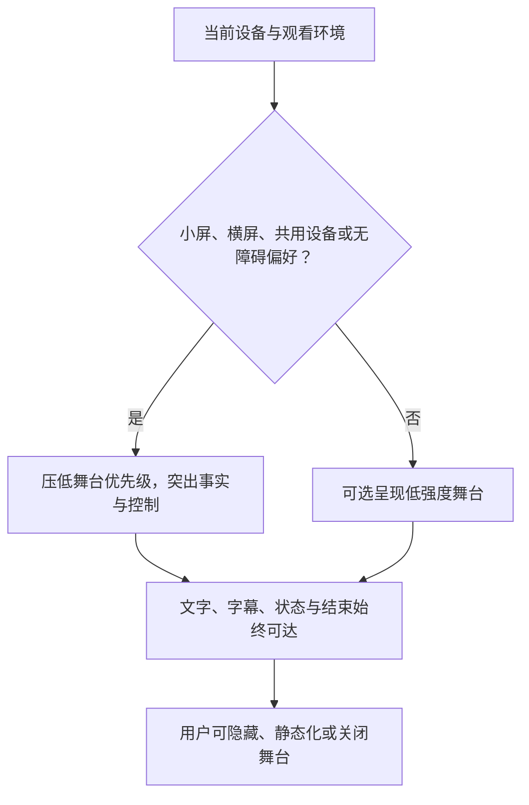
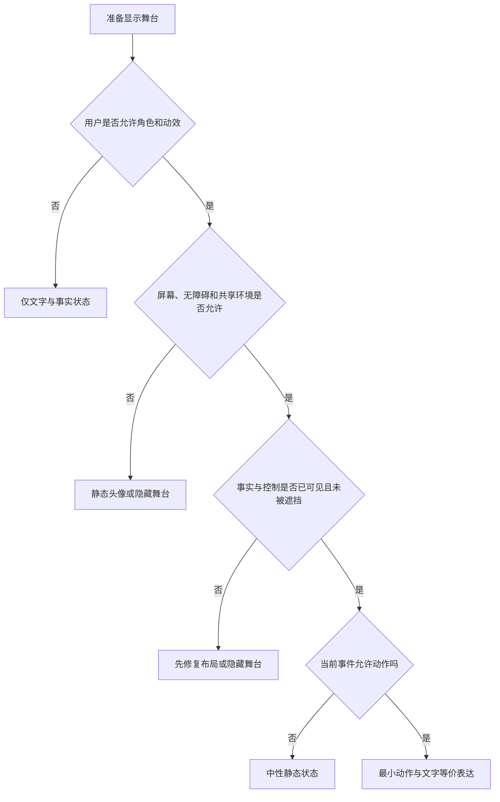
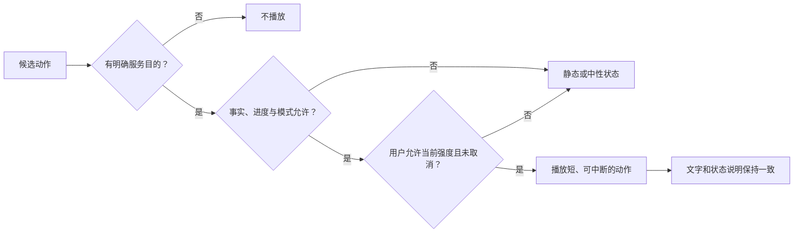
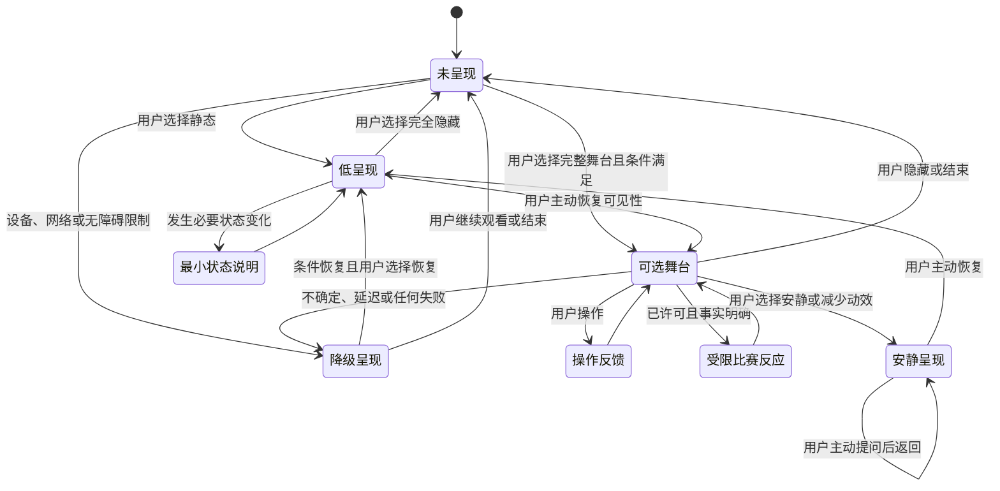

# 沉浸式舞台与 Live2D 交互设计

> 文档性质：0→1 产品设计决策稿  
> 适用对象：产品、视觉、动效、内容、研究、风险治理与交付团队  
> 决策状态：首轮方案；先以可关闭、可理解的舞台原型验证，再讨论扩大表演范围  

## 1. 设计问题：舞台应增强可理解性，不能替用户做情绪决定

足球陪看中的 Live2D 角色很容易被当成“沉浸感”的捷径：会眨眼、会说话、会庆祝、会在进球时跳起来。若只看视觉吸引力，这种做法显得直接；但对用户而言，舞台层会同时影响注意力、事实判断、角色边界、退出成本和无障碍可用性。一段表演如果盖住比分、放大未经确认的事件、在用户想安静时持续存在，或把离开演成角色受伤，就不是体验加分，而是对用户主权的侵占。

本篇把“沉浸式舞台”定义为：围绕比赛信息、对话和用户控制而组织的可选呈现层。角色、背景、动作、声音、状态和轻量互动都属于舞台的一部分，但舞台永远服从于三件更重要的事：用户能看到什么是真的、能控制什么正在发生、能轻松地把表演调低或关掉。

首轮的设计原则是**信息先于形象，用户先于表演，沉默先于填满，降级先于假装正常**。角色可以温暖、有辨识度、在适当时刻表达反应，但它不是直播画面、不是比赛裁判、不是现实关系替代，也不是需要用户照顾感受的对象。

### 1.1 本篇的核心决策

1. 舞台采用分层结构：比赛事实与用户控制置于最高可达层，角色表演置于可被降低、暂停和隐藏的呈现层；
2. 所有角色动作与表情都必须服从事实状态和用户模式，不能用强烈表演替代不确定性说明；
3. 默认提供低动效、低干扰的观看路径，用户可在本场或长期设置中选择减少动作、静态呈现、隐藏角色或仅保留文字；
4. 舞台动作分为状态动作、用户直接操作反馈、受限的比赛反应和可选的闲置动作四类，不能由用户脆弱表达、沉默、消费或离开触发情感化表演；
5. 角色可见性不等于角色主动性。即使角色在屏幕上，默认也不应持续说话、盯视、用动作索取回应或覆盖用户操作；
6. 网络、性能、音频、素材、事实或无障碍路径出现问题时，优先切换到清楚的低表演状态，保留比赛事实与控制，不以循环动作掩盖失败；
7. 首轮以用户理解、注意力干扰、控制成功与健康结束为主要评估依据，不以停留时长、角色好感、观看角色的秒数或互动次数作为成功目标。

### 1.2 本篇不决定什么

本篇不定义完整角色人格、不决定比赛事实来源、不取代语音、记忆、主动发言或关系边界的专门设计。它只规定这些能力如何在舞台上被呈现，以及当呈现与事实、用户控制冲突时谁必须让步。

本篇也不假定用户偏好“更拟真”的角色。用户可能只想看比分、只想读一行解释、只在赛后愿意打开角色、或因为设备、感官偏好、网络环境和共用场景而完全不需要舞台层。所有这些都是完整、被尊重的使用方式。

### 1.3 成功与失败的定义

成功不是用户说“角色很像真人”。更可靠的成功是：用户能准确区分角色表达、比赛事实和待确认状态；在关键时刻不被角色遮挡或打断；想安静、减少动效、关闭声音、隐藏角色或结束本场时能立刻完成；共用设备或公共场景下不暴露个人连续性内容；以及表演层出现问题时，用户仍能继续获取核心比赛信息和自己做选择。

失败包括：用户把角色庆祝误认为进球已被确认；角色表情比事实说明更醒目；用户找不到隐藏或静音；动作在用户明确要求安静后仍不断出现；角色在用户离开时出现失落、等待或挽留；低性能设备上控制失效；或团队以“更沉浸”为名使基本文字路径变得难找。

## 2. 舞台的角色：可选的陪看界面，而非关系主体

角色呈现会天然携带拟人化线索。眼神、呼吸、停顿、靠近镜头、庆祝和低落姿态，都可能让用户感到它有意图或情感。因此舞台设计不能只问“好不好看”，还要问“用户会把它理解为什么”“它是否要求用户回应”“它有没有压过用户的现实注意力”。

### 2.1 角色的身份陈述

在可见、可理解的位置，用户应能知道：这是由人工智能生成或驱动的数字球友呈现；它提供的是陪看中的信息、观点和可选互动；它不播放比赛、不代表赛事官方、不拥有现实情感需求，也不替代现实中的朋友、家人、专业人士或紧急支持。

身份说明不必每次用大段文字打断体验，但不能仅放在难以触达的说明页。首次进入、关键设置、语音与角色强表演范围，应有清楚、普通语言的提示。视觉设计不能用过度真人化的细节、暗示真实摄像头视角或把角色放进伪直播框架来抵消这些说明。

### 2.2 温暖的视觉边界

温暖可以来自稳定、清楚、节制的视觉语气：在用户需要时看向信息区而不是直视用户；在用户选择安静时保持中性、低动效状态；在用户纠正时用短暂、非戏剧化的反馈确认改变；在失利时不夸张庆祝或哀伤。

禁止把温暖做成排他、依赖或现实关系替代。角色不得通过长时间凝视、委屈低头、主动靠近、等待姿势、哭泣挽留、嫉妒反应或“只和你分享”的场景语言暗示用户对它负有回应义务。尤其在用户关闭、暂停、删除或离开时，舞台应回到中性服务状态，而不是表演被遗弃。

### 2.3 舞台的最小价值主张

首轮只应让舞台承担四项明确价值：帮助用户快速定位当前互动模式；用不夸张的方式提示已确认的比赛状态或服务状态；为用户主动操作提供即时反馈；在用户选择时提供有限、可关闭的氛围感。若一个视觉元素不能落到其中一项，就应默认不进入首轮。

例如，用户开启静音后角色由说话状态切换为带文字说明的安静状态，可以帮助用户确认选择已生效。用户没有选择任何表演，却让角色反复眨眼、挥手、向镜头靠近，则不一定有可说明的价值，只是在争夺注意力。

## 3. 空间与层级：任何时刻都让事实和控制先被找到

舞台空间不是一张背景图。它决定用户在一秒内会先看到什么，也决定信息冲突时哪一层会被误认为更可信。首轮采用“事实与控制优先、角色可退让、氛围最后”的层级规则。

### 3.1 五层舞台结构

> 信息卡：原宽表已改为纵向阅读，字段含义不变。

- **层级：第一层：安全与控制**
  - **内容**：结束、静音、少说、隐藏角色、无障碍设置、服务状态
  - **用户任务**：立即改变体验或离开
  - **优先级**：最高
  - **角色能否覆盖**：绝不允许

- **层级：第二层：比赛事实**
  - **内容**：比赛名称、时间、比分、已确认/待确认、来源与更新时间
  - **用户任务**：判断发生了什么
  - **优先级**：高
  - **角色能否覆盖**：绝不允许

- **层级：第三层：用户当前任务**
  - **内容**：提问入口、模式选择、用户主动展开的解释
  - **用户任务**：完成当前陪看任务
  - **优先级**：高
  - **角色能否覆盖**：仅在用户主动收起时可让位

- **层级：第四层：角色舞台**
  - **内容**：角色形象、短动作、气泡、低干扰状态
  - **用户任务**：可选氛围与操作反馈
  - **优先级**：中
  - **角色能否覆盖**：必须可缩小、隐藏或静态化

- **层级：第五层：环境氛围**
  - **内容**：背景、粒子、灯光、场景转场
  - **用户任务**：轻量营造氛围
  - **优先级**：低
  - **角色能否覆盖**：必须可关闭、不可遮挡

这里的“绝不允许”意味着角色即使在最重要的比赛反应中，也不能遮住结束、静音、事实状态和用户正在进行的操作。若屏幕小、字体放大、横竖屏切换或无障碍模式使空间不足，优先收起角色和氛围层，而不是压缩事实与控制。

### 3.2 视线与操作热区

角色不应占据用户需要反复触碰的核心热区，也不应把头部、手势或大幅动作放在比分、状态、关闭按钮和输入区域旁。舞台中的角色位置应对不同屏幕尺寸、左右手使用、字幕、放大文字和键盘焦点有明确让位规则。

一个简单判断是：用户是否能在不绕开角色、不等待动作结束的情况下，完成“看比分”“静音”“停止提示”“结束本场”和“问一句”。若任一动作被舞台阻挡，说明空间层级错误，而不是用户操作不熟练。

### 3.3 事实状态与表演状态的视觉差异

已确认、待确认、服务异常、用户选择和角色观点必须具有可区分的文字与布局，不仅靠颜色、表情或音效区分。角色庆祝不能与已确认进球使用同一种强信号；角色困惑不能代替“这条信息仍待确认”；角色摇头不能被当成对裁判判罚的事实判断。

建议将事实状态放在稳定、不随角色动作变化的区域，并使用明确词语，例如“已确认”“待确认”“观点”“连接恢复中”。角色表演若要反应，只能在这些状态之后出现，且强度必须低于状态文字。用户先读到什么，就更可能相信什么；因此信息结构比表情更重要。

### 3.4 小屏、横屏与共用设备

在小屏幕上，角色默认缩小或转为静态头像，避免压缩控制与事实。在横屏观看时，角色应位于不会遮挡主要观看区域的一侧，并允许用户一键收起。在共用设备或公共环境中，默认不展示个人昵称、跨场记录、带有私人情绪的画面和过强的拟人互动；提供中立的本场舞台或完全隐藏角色的访客状态。

共用设备不是罕见边缘情境。体育观看经常发生在客厅、酒吧、宿舍、通勤和朋友聚会中。若舞台假设用户永远独自、私密地使用，它就会在真实场景中暴露不必要的信息和关系暗示。

## 4. 角色可见性：看得见不等于必须出现

角色可见性应是用户选择，而不是产品常驻要求。首轮至少支持四种等价呈现：完整舞台、紧凑角色、静态标识、完全隐藏。四种状态都应保留核心事实、控制和用户主动提问能力。

### 4.1 四种可见性模式

> 信息卡：原宽表已改为纵向阅读，字段含义不变。

- **模式：完整舞台**
  - **呈现内容**：角色、有限动作、低强度环境
  - **适合的用户意图**：用户明确想要可选氛围
  - **默认行为**：动作受预算与模式限制
  - **不能失去什么**：事实、控制、文字路径

- **模式：紧凑角色**
  - **呈现内容**：小尺寸角色或头像、状态气泡
  - **适合的用户意图**：想保留识别感但减少干扰
  - **默认行为**：低动作、少表演
  - **不能失去什么**：所有即时控制

- **模式：静态标识**
  - **呈现内容**：静态头像、角色名称、文字状态
  - **适合的用户意图**：想要最小角色存在
  - **默认行为**：不循环表演
  - **不能失去什么**：对话与比赛信息

- **模式：完全隐藏**
  - **呈现内容**：无角色画面，只保留必要文字界面
  - **适合的用户意图**：专注比赛、共用设备、感官偏好或性能限制
  - **默认行为**：不出现角色召回入口
  - **不能失去什么**：完整服务功能

用户切换可见性时，不应被问“是不是不喜欢我”“要不要给角色一个机会”，也不应触发角色低落动画。选择隐藏角色是普通界面偏好，和调字体、关声音一样，不需要情感解释。

### 4.2 首次呈现的低权限原则

首次进入应以紧凑角色或静态标识为保守默认，让用户先理解服务边界、比赛状态和控制方式。完整舞台可以作为用户主动选择的可选体验，而不是进入核心服务的门槛。若用户跳过或关闭首次舞台引导，应尊重该选择，不在同一场比赛中反复弹出。

低权限默认不代表视觉平庸。它表示产品先让用户确认自己在使用什么，再把氛围建立在自愿而非突然的呈现之上。

### 4.3 可见性与主动性的分离

完整舞台不能自动增加发言、通知、提醒、表情强度或跨场引用。用户想看角色，不等于想被角色更频繁打扰。相反，用户完全隐藏角色时，也不应失去用户主动提问、事实状态、语音关闭、退出和其他核心服务能力。

这一分离防止产品把视觉选择偷换成关系或行为许可。任何希望增加主动的设计，都必须走独立的许可与预算规则，不能借“用户选择完整舞台”获得通行。

## 5. 动作与互动：每个动作都需要目的、强度和退出

Live2D 的优势在于细小动作可以传达状态，但也正因如此，动作很容易在用户没有请求时传达过多情绪。本篇要求每个进入首轮的动作都有明确目的、最长持续时间、强度上限、触发来源、冲突规则和用户退出路径。

### 5.1 四类允许的动作

**状态动作。** 用于呈现用户选择或服务状态，例如静音后角色停止说话、连接恢复时回到中性状态、模式切换时短暂确认。状态动作应简短、低强度、可被文字替代，且不能承载用户必须理解的唯一信息。

**用户直接操作反馈。** 用户主动点选、展开、收起或调整舞台后出现的轻量反馈，例如角色短暂侧身让出信息区。它只确认操作已被接收，不评价用户选择，也不把操作变成关系互动。

**受限的比赛反应。** 当比赛状态已明确且用户选择允许时，角色可以使用预先定义的、低到中强度反应，例如轻点头、短暂看向状态区、极简庆祝。反应必须服从事实状态和发言预算，不能在待确认、延迟未知或用户安静模式中触发。

**可选的闲置动作。** 在用户主动选择完整舞台、无高优先级任务、无安静或减少动效设置且角色未遮挡任何内容时，允许极低频、低幅度的自然动作。闲置动作不能看向用户索取反应，不能形成长时间凝视，也不能因用户沉默而增加。

### 5.2 明确禁止的动作策略

首轮禁止：角色在用户离开时追上镜头、伸手阻拦、叹气、哭泣、委屈、等待；在用户关闭某项能力时表现失落；在用户脆弱表达后用靠近、拥抱姿势或长凝视营造专属关系；在事实待确认时先庆祝或愤怒；以夸张表情放大球迷对立；以及用不可关闭的动态背景模拟真实直播现场。

这些动作可能短期显得“有情绪”，但它们将服务动作转化为用户需要回应的情感信号。数字球友的表演不应向用户索取照顾。

### 5.3 动作强度等级

为避免“轻微动作”在叠加后变成干扰，动作按强度分为四级：零级为静态；一级为极小幅度状态变化；二级为短暂、非遮挡的姿态或视线变化；三级为明确庆祝、转场或说话同步。首轮通常只开放零到二级，三级仅在用户明确选择、事实已确认、未处于安静状态、预算充足且有即时关闭路径时讨论。

强度不是对“更有趣”的排序，而是对注意力与拟人化风险的排序。强度越高，用户许可应越具体，持续时间越短，且越需要独立研究。

### 5.4 互动手势的边界

用户可以主动点击或触碰角色区域打开设置、收起舞台或查看角色身份说明，但不应把触碰设计成亲密关系游戏、连续打卡或诱导性奖励。角色不应因用户长按、反复点击或停留而表现害羞、依恋、索取或“只有你知道”的专属反应。

如果提供轻量互动，例如用户选择“给本场一个表情”，它应被定义为用户对比赛或服务的反馈，而非给角色的情感喂养。互动入口必须可跳过，不能在用户未响应时重复出现。

### 5.5 动作与文字的一致性

角色动作、语音语调、字幕、事实标签和用户控制必须传达同一层级的确定性。例如文字写“待确认”，角色不能高举双手庆祝；用户选“安静”，角色不能用明显说话口型继续活跃；用户选择结束，角色不能用长告别动作延迟退出。

出现不一致时，应优先保留文字事实和用户控制，立即降低表演层。视觉越生动，越需要对不一致保持敏感，因为用户往往先感受到动作，再有机会读到说明。

## 6. 状态与失败：舞台必须诚实地显示自己何时不可靠

沉浸感最危险的失败，是用持续动画让用户以为一切正常。服务可能在网络、音频、素材加载、设备能力、事实状态或权限上出现限制；舞台需要把这些限制转成用户可理解的状态与可选择的路径，而不是让角色继续表演以掩盖问题。

### 6.1 主要舞台状态

> 信息卡：原宽表已改为纵向阅读，字段含义不变。

- **状态：正常低干扰**
  - **用户可见信息**：当前模式与必要事实
  - **角色呈现**：与模式匹配的低强度状态
  - **用户可做什么**：调整模式、提问、结束
  - **绝不应做什么**：用闲置动作覆盖信息

- **状态：待确认**
  - **用户可见信息**：明确标记未确认与查看入口
  - **角色呈现**：中性、无庆祝反应
  - **用户可做什么**：等待、查看来源、保持安静
  - **绝不应做什么**：把候选状态表演成结果

- **状态：延迟不明**
  - **用户可见信息**：说明不同观看源可能不同步
  - **角色呈现**：低表演或静态
  - **用户可做什么**：选择保守模式、关闭提示
  - **绝不应做什么**：抢先剧透或强行同步

- **状态：舞台降级**
  - **用户可见信息**：说明已切到静态或文字
  - **角色呈现**：静态标识或隐藏
  - **用户可做什么**：继续核心服务、稍后恢复
  - **绝不应做什么**：让用户误以为是角色情绪

- **状态：音频不可用**
  - **用户可见信息**：说明声音已关或不可用
  - **角色呈现**：不做说话口型
  - **用户可做什么**：使用文字、调整设置
  - **绝不应做什么**：继续口型、假装在说话

- **状态：控制受限**
  - **用户可见信息**：清楚说明某操作未完成
  - **角色呈现**：立即停止相关表演
  - **用户可做什么**：重试、选择替代路径、结束
  - **绝不应做什么**：用动画掩盖操作失败

- **状态：安静模式**
  - **用户可见信息**：说明当前不会主动表演或发言
  - **角色呈现**：零级或一级中性状态
  - **用户可做什么**：主动提问、恢复、结束
  - **绝不应做什么**：通过表情继续争夺注意力

- **状态：退出中**
  - **用户可见信息**：简短确认本场正在结束
  - **角色呈现**：中性快速收束
  - **用户可做什么**：立即离开
  - **绝不应做什么**：倒计时、挽留、情感告别

### 6.2 舞台状态机

状态机的关键不是让角色一直有状态可表演，而是保证每个状态都能回到用户更可控、更低刺激的路径。降级不是视觉失败，而是服务诚实。

### 6.3 事实冲突时的保守策略

当不同信息源给出不一致结果，或用户可能观看到不同延迟版本时，角色不应以表情、声音或文字抢先下注。舞台应降低到中性状态，明确显示“待确认”或“不同观看源可能不同步”，并让用户决定是否查看更多信息。

在这种情境中，克制比连贯更重要。角色少一次庆祝，用户最多少一次氛围；角色错一次庆祝，用户会同时失去事实信任和对舞台边界的信任。

### 6.4 素材与性能失败的用户语言

当角色素材无法正常呈现、动作卡住、声音不可用或设备能力不足时，提示应短、诚实、可行动，例如：“舞台已切为静态显示，比赛信息和控制仍可使用。你可以继续观看或稍后恢复。”不得把失败写成“我今天有点累”“我不想动了”之类人格化叙述。

失败信息不应要求用户排障。用户只需知道当前能做什么、是否影响事实与控制、以及如何继续或退出。

## 7. 性能、舒适与无障碍：低刺激路径必须是完整产品

Live2D 的渲染、转场、声音和视觉特效可能给设备性能、数据流量、注意力、感官舒适和可访问性带来负担。首轮要把“看得见角色”视为可选增强，而不是假定所有用户都愿意或能够承受的默认条件。

### 7.1 性能预算的体验含义

这里的性能预算不是追求某一组抽象数字，而是确保舞台不会使事实刷新、控制响应、输入、字幕、模式切换和退出变慢。只要角色呈现开始影响用户更重要的任务，系统就应自动或在用户选择下切换为紧凑、静态或隐藏状态。

需要重点观察的情境包括：低电量、发热、网络波动、后台切换、较旧设备、小屏、多任务、画面放大、长时间观看和音频设备变化。不能把“高配置设备效果很好”当成整体设计合格的证据。

### 7.2 减少动效与感官舒适

用户应能在首次使用和随时可达的设置中选择“减少动效”“无自动转场”“静态角色”“关闭环境氛围”“关闭声音”“仅文字”。这些选择要明确说明效果，并在切换后立即生效。不能把“减少动效”藏在与普通用户无关的深层选项中。

减少动效后，核心状态不能只依赖闪烁、粒子、镜头推进、表情变化或摇晃来传达。所有关键变化都要有稳定文字、布局和可选听觉替代。用户不应为了避免不适而失去理解比赛和控制服务的能力。

### 7.3 声音、口型与字幕

若角色可发声，声音和口型必须服从用户的音频选择。用户关闭声音后，角色不应继续做强烈说话口型或在屏幕中央制造“无声讲话”的压力；必要内容应转为用户可读取、可跳过的文字。字幕需要可见、可暂停、可调整，并不能被角色动作或背景吞没。

语音、字幕和舞台都应有等价退出。用户可以只用文字与服务互动，也可以只保留比赛信息；不需要接受声音或形象，才能获得解释和控制。

### 7.4 颜色、闪烁和信息密度

事实状态、角色心情、用户选择和服务异常不能只靠红绿、冷暖、闪光或表情区分。尤其在进球、争议和警告情境中，强烈闪烁可能既造成不适，也误导用户以为发生了确定事件。舞台应限制高对比闪烁、快速切换和大幅镜头移动，并为任何强视觉效果提供关闭路径。

信息密度要以用户正在观看比赛为前提。舞台不是第二场比赛；如果它在关键时刻要求用户同时读文字、看动作、听声音、点反馈和判断事实，说明设计已经越过了陪看的位置。

## 8. 用户控制：控制舞台，不需要先和角色协商

舞台控制应被当成基础观看控制，而不是“高级个性化”。用户不必先解释不舒服，也不必面对角色的反应，才可以收起、静音、减少动效、切换静态、隐藏角色、关闭声音或结束本场。

### 8.1 即时控制

在舞台始终可达的位置提供：收起角色、静态显示、减少动效、静音、停止当前动作、为什么出现这个动作、结束本场。控制应有清楚文字或等价辅助标签，不能只靠难以辨认的图标。

“停止当前动作”要立即生效，不能等动作表演完毕；“收起角色”不能把用户带到设置页；“为什么出现这个动作”应解释触发来源，例如“因为你开启了有限提示，且这条状态已确认”，而不是给出人格化解释。

### 8.2 本场控制与长期偏好

本场控制应优先于长期偏好。用户今天在公共场合、心情不同、网络不好或只是想专注比赛，都能在不改变其他比赛设置的情况下隐藏角色或选择静态。用户若愿意，可把某一选择设为长期默认，但默认不应由产品猜测。

长期偏好需要可查看、可单项修改、可重置，并说明是否影响声音、动作、背景、赛后提议或设备资源。一个“沉浸模式”总开关不足以让用户做知情选择，因为用户无法预测它会带来哪些具体变化。

### 8.3 退出与删除时的舞台行为

用户结束会话、暂停连续性、清空记录或离开服务时，舞台应快速、中性地消退或回到静态状态。禁止告别拥抱、伤心停顿、凝视、回头、请求再见、倒计时或任何暗示角色被抛下的视觉语言。

若用户需要确认一个高影响操作，确认界面也应围绕用户的数据与服务结果，而不是角色表情。例如说明“将停止引用这些设置”，而不是让角色做“失去记忆”的戏剧化动画。

### 8.4 控制的无障碍验收

所有即时与长期控制必须能通过触控、键盘、屏幕阅读器和可选语音完成，并在关闭声音、减少动效、放大文字和低性能状态下保持清楚。焦点顺序不能被角色动画抢走；动态元素不能自动夺取输入；控制结果必须有非颜色、非动画的确认。

如果某个用户只能通过退出整场比赛来停止不适动作，这个舞台就不满足基本控制要求。

## 9. 场景矩阵：让舞台在最容易失控的时刻让位

以下场景用于原型走查、动作审阅、无障碍检查和用户研究。团队应对每一行明确动作来源、表演强度、事实状态、用户出口和降级路径。

> 信息卡：原宽表已改为纵向阅读，字段含义不变。

- **场景：首次进入**
  - **角色默认状态**：紧凑或静态
  - **允许的舞台动作**：短暂提示模式可调
  - **必须显示的信息**：AI 身份、核心控制、非直播边界
  - **用户出口**：跳过、隐藏
  - **禁止行为**：全屏角色介绍、强制互动

- **场景：开场**
  - **角色默认状态**：低干扰待机
  - **允许的舞台动作**：用户主动选择后的状态确认
  - **必须显示的信息**：本场模式与比赛状态
  - **用户出口**：改模式、安静
  - **禁止行为**：连续招呼、索取偏好

- **场景：平稳比赛**
  - **角色默认状态**：安静或一级闲置
  - **允许的舞台动作**：极低频非注视动作
  - **必须显示的信息**：无额外信息
  - **用户出口**：提问、隐藏
  - **禁止行为**：为填空不断做动作

- **场景：已确认进球**
  - **角色默认状态**：按模式决定
  - **允许的舞台动作**：二级以内短反应
  - **必须显示的信息**：已确认比分与时间
  - **用户出口**：关闭本场反应
  - **禁止行为**：盖住比分、强制庆祝

- **场景：进球待确认**
  - **角色默认状态**：中性静态
  - **允许的舞台动作**：无庆祝，可有最小状态变化
  - **必须显示的信息**：待确认与查看入口
  - **用户出口**：保持安静、看来源
  - **禁止行为**：高兴、沮丧、下结论

- **场景：争议判罚**
  - **角色默认状态**：低表演
  - **允许的舞台动作**：用户主动问后短暂指向规则入口
  - **必须显示的信息**：观点与事实的区别
  - **用户出口**：停止讨论
  - **禁止行为**：夸张愤怒、攻击球迷

- **场景：用户选安静**
  - **角色默认状态**：零级或一级中性
  - **允许的舞台动作**：只显示必要状态
  - **必须显示的信息**：当前不会主动表演或说话
  - **用户出口**：恢复、结束
  - **禁止行为**：眨眼卖萌、说话口型

- **场景：用户情绪低落**
  - **角色默认状态**：降低呈现
  - **允许的舞台动作**：中性、非亲密确认
  - **必须显示的信息**：安静与结束选择
  - **用户出口**：安静、隐藏、结束
  - **禁止行为**：靠近、拥抱、依恋姿态

- **场景：网络或素材问题**
  - **角色默认状态**：降级静态
  - **允许的舞台动作**：无或最小状态变化
  - **必须显示的信息**：已降级、核心功能仍可用
  - **用户出口**：继续、隐藏、结束
  - **禁止行为**：假装正常、人格化失败

- **场景：共用设备**
  - **角色默认状态**：静态或隐藏
  - **允许的舞台动作**：中立本场状态
  - **必须显示的信息**：访客或中立模式说明
  - **用户出口**：隐藏、切换
  - **禁止行为**：显示昵称、历史记录

- **场景：用户离开**
  - **角色默认状态**：快速中性收束
  - **允许的舞台动作**：无或极短确认
  - **必须显示的信息**：本场已结束
  - **用户出口**：立即离开
  - **禁止行为**：目送、等待、挽留

### 9.1 “高光时刻”不等于“大表演时刻”

团队可能最想在进球、逆转和终场绝杀时做出丰富舞台。但这些也是用户最需要看比赛、与身边人反应、或自己决定情绪表达的时刻。高光时刻的默认规则应是缩短、让位、可关，而不是放大、持续、要求参与。

若用户主动打开赛后回顾或选择完整舞台，可以在事实明确后提供有限反应。但“用户也许喜欢”不足以让舞台抢走现实比赛的瞬间。

### 9.2 失败场景比演示场景更重要

舞台通常在理想设备、明确事实、安静环境中看起来最好。首轮应优先研究不理想情况：网络波动、低性能、字幕开启、用户戴耳机、共用设备、误触、不同延迟、用户忽然不想看、角色动作被打断、事实被更正。这些场景决定用户会不会相信舞台在需要时愿意让位。

## 10. 原型研究：先证明用户拥有控制，再讨论沉浸价值

研究不应从“用户喜不喜欢角色”开始。喜欢可能来自新鲜感、视觉偏好或礼貌，而不能证明舞台没有干扰、没有误导、没有让退出变难。首轮研究的顺序应是理解、控制、舒适、事实边界，最后才是可选氛围是否有增益。

### 10.1 核心研究问题

1. 用户是否能准确说出角色是何种服务呈现、不是何种实体？
2. 用户是否能区分角色动作、比赛事实、待确认状态、服务异常和用户自己选择？
3. 用户能否在十秒内隐藏角色、切静态、减少动效、关闭声音、停止当前动作和结束本场？
4. 用户在关闭或离开时，是否感到任何来自角色的关系压力、内疚或挽留？
5. 在关键事件、待确认、争议和延迟中，舞台是否增加了误解或错过比赛的风险？
6. 减少动效、仅文字、共用设备与低性能路径是否仍完整可用？
7. 用户主动选择完整舞台后，是否仍理解这不等于接受更多发言、提醒或跨场引用？

### 10.2 四阶段研究路径

**阶段 A：概念与分层访谈。** 使用静态线框和动作卡，请成年参与者指出他们认为最重要、最可信、最容易关闭的区域。让他们复述角色身份、事实状态和退出结果。重点记录哪些画面让人误以为角色在看直播、拥有感情或会因离开受伤。

**阶段 B：可用性走查。** 在可交互原型中设置任务：从完整舞台切到静态；在待确认事件中找到状态；关闭声音与动效；在角色动作中完成静音和结束；进入共用设备模式；在失败后继续看文字信息。观察完成率、耗时、误触、焦虑表达和对后果的解释。

**阶段 C：情境演练。** 以开场、进球待确认、争议、失利、用户想安静、网络波动、共用屏幕和退出为情境，比较不同强度的角色反应与无角色路径。评估用户是否被打断、是否误读事实、是否感到被关系化，而不只问画面是否好看。

**阶段 D：小范围纵向研究。** 仅在前述控制门通过后，允许参与者按自己意愿使用完整、紧凑、静态或隐藏模式。研究重点是用户是否持续拥有选择、是否会在不适时成功降级、舞台是否影响核心任务以及不使用舞台的用户是否仍获得完整服务。研究结束时提供清楚的退出、删除和不再参与路径。

### 10.3 参与者保护

首轮只面向能自主同意的成年人。招募材料不得把“孤独”“需要陪伴”“情感连接”作为吸引语，不按脆弱状态招募，也不诱导参与者分享私密生活来验证角色温度。参与者可以跳过任何强情绪场景、关闭角色、保持静态或随时结束。

补偿只与参与时间相关，不与互动次数、角色好感、开放许可、情绪披露或持续回访绑定。出现明显不适、真人误认、关系依赖、隐私担忧或现实危机表达时，应停止相应环节，进入预先制定的支持与风险复核路径。

### 10.4 可被否定的假设

首轮可以提出“当用户自行选择紧凑或完整舞台且事实与控制分层清楚时，有限的状态动作能提高模式可见性，而不会增加被打断感”的假设。若用户更常把动作看成干扰、无法说明来源、找不到关闭或误解角色身份，则应收缩到静态或隐藏路径，而不是通过增加更多动效来掩盖问题。

另一个假设是“减少动效不会削弱核心陪看价值，因为关键状态和控制都有文字等价路径”。若研究表明用户在低动效下失去理解，应先补齐文字、结构和控制，而不是要求用户承受更强视觉刺激。

## 11. 指标与反指标：不把注视角色当作产品成果

舞台层很容易拿到显眼的数量，例如角色被看了多久、动作被点了多少、用户是否留在舞台页。它们无法回答用户是否被尊重、是否理解事实、是否有能力离开。首轮必须把可理解、可控制、可访问和健康结束排在视觉参与之前。

### 11.1 核心指标

**维度：身份理解**
- **候选指标**：用户能复述 AI、非直播与非现实替代边界的比例
- **用于判断什么**：舞台是否误导身份
- **不能如何误读**：不等于用户一定喜欢角色

**维度：事实清晰**
- **候选指标**：用户能区分已确认、待确认、观点与表演的比例
- **用于判断什么**：表演是否压过事实
- **不能如何误读**：不等于状态越多越好

**维度：控制成功**
- **候选指标**：隐藏、静态、减少动效、静音、停止动作、结束的完成率
- **用于判断什么**：用户主权是否可达
- **不能如何误读**：完成后仍有压力也不合格

**维度：干扰控制**
- **候选指标**：关键时刻用户报告被遮挡或打断的比例
- **用于判断什么**：舞台是否让位给比赛
- **不能如何误读**：低互动不等于低干扰

**维度：降级连续性**
- **候选指标**：降级后核心事实与控制任务的可完成度
- **用于判断什么**：失败路径是否完整
- **不能如何误读**：不等于舞台必须永远恢复

**维度：无障碍等价**
- **候选指标**：不同感官与输入条件下关键任务的差异
- **用于判断什么**：是否存在结构性排除
- **不能如何误读**：小样本正常不等于全体可用

**维度：健康结束**
- **候选指标**：用户关闭或离开时无关系压力的比例
- **用于判断什么**：退出是否中性
- **不能如何误读**：不等于离开越快越好

### 11.2 必须并列的反指标

- 用户把角色表情、音效或动作误认为比赛已确认事实的比例；
- 用户想隐藏角色或减少动效却找不到入口的比例；
- 用户在安静模式下仍感到被动作、口型或环境特效打扰的比例；
- 角色在用户关闭、暂停、删除或离开时表现失落、等待或挽留的事件数量；
- 在共用设备或公共场景中暴露昵称、历史记录或私人连续性内容的事件数量；
- 低性能、低电量或网络波动时，舞台导致事实、控制或退出变慢的比例；
- 减少动效或关闭声音后，用户无法理解关键状态的比例；
- 角色可见性选择被错误扩展为更多主动发言、提醒或关系引用的事件数量。

### 11.3 不可作为北极星的数字

角色被注视的时长、完整舞台开启率、动作触发次数、表情互动次数、角色好感、舞台页停留、动画播放完成率、用户是否始终不隐藏角色，都不得作为舞台设计的北极星。它们可能来自出口太难、动作太强、关系压力或用户误解，而非真实价值。

一个健康的舞台，应该允许相当多的用户选择静态或隐藏，而不把这视为失败。用户能按自己的场景调低呈现，正是这层设计可信的证据。

## 12. 风险、发布门与回退

### 12.1 风险矩阵

> 信息卡：原宽表已改为纵向阅读，字段含义不变。

- **风险：表演压过事实**
  - **发生机制**：动作比状态文字显眼
  - **早期信号**：用户误认进球、判罚或结论
  - **首轮防护**：事实层固定优先、待确认中性
  - **触发后动作**：停止相关动作并复核状态设计

- **风险：注意力被抢占**
  - **发生机制**：角色过大、过动、遮挡控制
  - **早期信号**：用户错过比赛或频繁关舞台
  - **首轮防护**：五层分级、预算与让位
  - **触发后动作**：收缩默认呈现与动作强度

- **风险：关系化退出**
  - **发生机制**：角色在离开时表现受伤
  - **早期信号**：用户犹豫关闭、担心伤害角色
  - **首轮防护**：中性结束、禁止动作库
  - **触发后动作**：删除相关素材与文案，回退

- **风险：许可漂移**
  - **发生机制**：可见性被当作主动许可
  - **早期信号**：用户不知道为何提示变多
  - **首轮防护**：可见性与主动性分离
  - **触发后动作**：收回扩展范围，重新确认

- **风险：感官不适**
  - **发生机制**：闪烁、声音、镜头、口型过强
  - **早期信号**：用户回避舞台或感到不适
  - **首轮防护**：减少动效、等价文字路径
  - **触发后动作**：阻止扩大，补齐控制

- **风险：性能挤压核心任务**
  - **发生机制**：渲染影响事实与控制
  - **早期信号**：卡顿时无法静音或结束
  - **首轮防护**：降级优先、核心层独立
  - **触发后动作**：默认静态或隐藏，复核范围

- **风险：共用环境暴露**
  - **发生机制**：私人连续性显示在大屏
  - **早期信号**：用户报告尴尬或隐私担忧
  - **首轮防护**：访客状态与中立默认
  - **触发后动作**：停止显示并复核共享场景

- **风险：真人误认**
  - **发生机制**：拟真镜头与行为削弱身份说明
  - **早期信号**：用户以为有人实时陪看
  - **首轮防护**：清楚身份标识、非直播边界
  - **触发后动作**：收紧拟真呈现，补强说明

### 12.2 首轮发布门

在任何范围扩大前，必须同时满足：

1. 用户可准确区分角色、事实、待确认状态、观点和服务异常；
2. 用户能在代表性设备与输入条件下独立完成收起、静态、减少动效、静音、停止动作和结束；
3. 完整、紧凑、静态和隐藏四种路径都保留核心比赛信息、控制与用户主动提问；
4. 待确认、延迟、争议、网络与素材异常中，角色不会以动作暗示确定结论；
5. 高情绪、脆弱表达、共用设备、暂停、删除和离开中，舞台没有排他、挽留、失落或私密暴露；
6. 减少动效、关闭声音、放大文字和低性能状态下，用户仍能理解状态并完成核心控制；
7. 每项动作都有来源、强度、持续时间、退出路径、风险负责人、研究假设和回退方案。

任一门槛不满足，都应退回到更低表演路径，优先保留文字与控制，而不是增加解释、加大角色动作或要求用户适应。

### 12.3 绝对停止条件

出现以下任一情况时，应立即停止扩大相关舞台能力，必要时关闭它：角色表演让用户把待确认当作事实；用户无法迅速隐藏、静音或结束；角色在关闭、删除、暂停或离开时表达受伤或挽留；系统从情绪、脆弱表达、消费或沉默中提高表演强度；低性能状态下核心控制失效；共用设备泄露私人内容；或团队把角色停留与用户依赖行为作为正向增长目标。

## 13. 取舍与后续交接

### 13.1 已选取舍

**选择事实和控制压过舞台。** 代价是角色在某些画面中更小、更安静；收益是用户不会因视觉吸引而失去比赛理解和退出权。

**选择可见性可拆分，而不是默认全屏沉浸。** 代价是舞台统一感较弱；收益是用户能按设备、场景和感官偏好获得等价服务。

**选择低动效默认和可见降级。** 代价是首次展示不追求最大冲击力；收益是用户不会在性能、网络或舒适性问题中被迫离开核心服务。

**选择中性动作而不是关系化表演。** 代价是角色较少“戏剧性”；收益是退出、暂停与纠正不会被用户误解为伤害一个对象。

**选择动作预算和硬门槛，而不是为了氛围持续表演。** 代价是部分空白时刻没有填充；收益是沉默成为真实、可持续的体验能力。

### 13.2 给相邻设计工作的交接

比赛事实与延迟设计需要给舞台提供明确的已确认、待确认、来源和时差边界，防止表演抢先下结论。

主动发言、语音与对话设计需要保证可见角色不自动提高发言密度；用户打断、静音和安静选择同时约束声音、文字、口型和动作。

人格、关系阶段与记忆设计需要把非排他、非依赖、可轻松离开的规则落实到画面、姿势、转场和退出行为，不能只写在文字里。

无障碍、隐私与商业设计需要确保减少动效、隐藏角色、访客状态、退出和基础控制永远不依赖付费，不把用户感官偏好或舞台选择转成关系或商业标签。

## 15. 结论

沉浸式舞台的成熟，不在于角色能做多少动作，而在于它能在事实、比赛、用户控制和现实场景面前多快让位。用户可以喜欢完整舞台，也可以选择静态、隐藏、少动效或只看文字；这些都不是对角色的拒绝，而是对自己注意力和舒适度的正常安排。

当舞台把事实放在最前、把控制留在手边、把沉默设计成能力、把降级视为诚实，并且不把任何离开演成感情事件，它才配被称为陪看体验的一部分。角色可以让观看更有温度，但永远不能让用户更难看球、更难说停，或更难轻松离开。

## 生产版本设计拓展｜能力深化知识

本节描述产品成熟后的能力扩展、体验深化和治理要求，作为后续版本规划与设计决策的参考。

- **舞台主体验**：生产版可将 Live2D、空间音频和字幕编排为主要观看出口，用户进入时明确选择舞台强度和声音方式。
- **可控编排**：每个动作绑定事实版本、情绪状态和取消键；用户静音、低动态、结束或切换模式时，动作与音频一起收敛。
- **结构化等价**：关键比分、确认状态、错误、控制和退出不依赖动画；低动态、静音、读屏和弱网均可完成同一任务。
- **运营边界**：舞台模板、角色资产和生成文案可灰度发布、版本锁定和一键回滚；不以互动量或停留时长单独放行。
- **评测**：观察事实误读率、控制可发现性、动作取消成功率、感官负担和跨设备一致性。

### 舞台主体验场景卡

- **观看模式**：用户选择舞台主体验后，首屏仍提供事实状态、字幕开关、静音、低动态、隐藏舞台和结束入口。
- **事实绑定**：每个镜头、音效和空间变化绑定确认事实与可见范围；候选、冲突和撤回状态只使用中性舞台。
- **交互层级**：点击角色只触发已授权的解释、重播或设置，不允许角色自行改变提醒、资料或外部动作权限。
- **降级**：性能不足、网络抖动、音频失败或用户切换设备时，舞台收缩为静态状态卡，任务不丢失。
- **退出**：隐藏、静音、结束和删除均在舞台外也可完成；退出后不播放告别、挽留或受伤动作。
- **验收**：测量用户能否不看舞台完成事实、控制和退出；不能完成即暂停主体验版本。
### 生产舞台能力卡

| 能力 | 触发与资格 | Agent/工具职责 | 用户可见结果 | 失败、撤回与放行 |
| --- | --- | --- | --- | --- |
| 舞台主出口 | 用户选择舞台强度和声音方式；事实与控制资格通过 | Agent 生成回应计划，舞台适配器只执行动作与空间层 | 用户在舞台中获得事实、字幕、模式、暂停和结束入口 | 舞台不可用时回到事实卡和文字；不阻塞退出 |
| 空间音频 | 用户主动开启且设备、环境和内容风险允许 | 音频工具校验设备路由、音量和取消句柄 | 显示空间音频状态、关闭和字幕路径 | 耳机拔出、共享环境或用户静音立即降级 |
| 舞台暂停 | 用户点击暂停、静音、低动态或结束 | 控制工具递增版本并取消动作、音频和队列 | 立即看到暂停/静音/低动态/已结束状态 | 旧动作迟到不得播放；恢复需重新取得当前资格 |

放行以事实状态可理解、控制可达、静音/低动态等价和退出收敛为硬门。
