# 用户端页面与视觉规格

> 文档类型：0→1 足球陪看用户端的信息、视觉与交互规格  
> 适用阶段：核心观看与陪看任务已经明确后，验证用户能否不被界面打断地进入、观看、控制与离开  
> 版本：0.1（品牌语气、视觉密度、页面结构、断点与所有默认值均为待验证假设）  
> 研究信息截止：2026-01-28  
> 核心原则：用户端首先是一套帮助用户看球和保持控制的界面，其次才是一位数字球友的舞台。比分、事实状态、用户的安静/声音/结束控制和退出路径必须比角色形象、装饰动效或商业信息更容易发现。

---

## 1. 页面要解决什么：不是把角色放在屏幕中央

足球陪看产品的用户端同时承受三种注意力竞争：用户本来就在看直播或转播；用户偶尔需要确认比分、事件和延迟状态；数字角色希望提供短反应、对话和可调节的存在感。若界面把角色动画、对话气泡、比分、赛事信息、设置入口与推荐内容放在同一视觉权重上，用户会被迫不断决定先看什么，最终要么错过比赛，要么关闭全部陪看能力。

本设计的任务不是制造“很像真人的房间”，而是让用户在任何时刻都能迅速回答五个问题：

1. 我现在进入的是哪一场比赛，状态是否已开始、暂停或结束？
2. 角色当前为什么说话、为什么沉默，赛事信息是确认、等待还是已更正？
3. 我怎样在不离开比赛的前提下改为安静、仅文字、低动态或有限提示？
4. 发生网络、声音、事实或会话问题时，什么仍然可用，我下一步能做什么？
5. 我怎样自然地结束本场，而不被挽留、强制复盘或被要求解释？

候选结果是：

> 新用户可在短时间内识别人工智能角色、选择一场比赛、进入低打扰陪看并随时改强度；观看中的用户能优先看到最小且可解释的比赛状态；需要时可以主动打开对话、更多信息或控制；在小屏、大屏、弱网、静音和辅助输入条件下，核心任务仍可完成。

### 1.1 视觉设计的非目标

- 不把角色面部、拟人化表演或“陪伴感”做成比分与用户控制之上的第一视觉层；
- 不让用户必须开启声音、允许自动发言或长期保存偏好才能开始看球；
- 不用红点轰炸、倒计时、跳动按钮、情绪化弹窗或连续动画制造留在场内的压力；
- 不用颜色、图标、角色表情或声音作为事实确认、错误、隐私或可操作状态的唯一表达；
- 不为了填满空白而在比赛高峰期同时展示长分析、角色大动作、全屏提示和商业信息；
- 不把沉默、离开、关闭角色或使用低动态模式标为“冷淡”“关系下降”或“体验未完成”；
- 不在共享设备、投屏、同看场景中默认暴露用户的跨场偏好、共同瞬间或私人设置；
- 不通过模仿聊天软件中“对方正在等你”“未读消息必须处理”的视觉语言迫使用户回应。

---

## 2. 内容层级：先让用户找到事实与控制

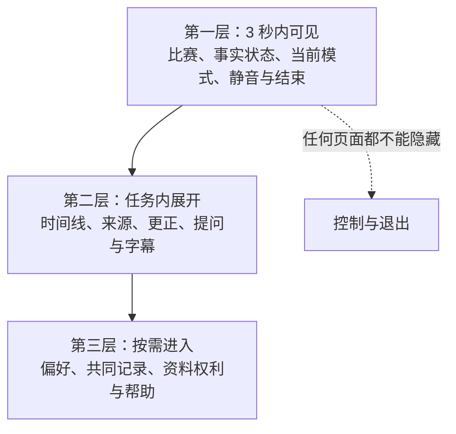

视觉层级是产品承诺的可见形式。若“结束”“安静”“事实待确认”必须藏在多层菜单，而角色的情绪气泡、会员入口或推荐位每秒都在动，界面实际表达的优先级就与用户主权相反。首轮按任务紧急度而非内容营销价值排序。

### 2.1 全局信息层级

**层级：P0 即时安全与控制**
- **内容**：结束、静音、安静、事实冲突/等待、权限被拒绝
- **用户要完成的事**：立刻停止、理解风险、恢复基本控制
- **视觉原则**：始终可达、文字明确、不依赖颜色或动画

**层级：P1 比赛核心**
- **内容**：队伍、比分、比赛阶段、时间、确认状态
- **用户要完成的事**：知道自己在看什么、当前能否信赖结论
- **视觉原则**：一眼可读、避免被角色覆盖、保持稳定位置

**层级：P2 当前陪看**
- **内容**：角色短反应、用户主动对话入口、本场模式
- **用户要完成的事**：决定是否互动、看到为何出现
- **视觉原则**：默认克制、可忽略、可中止、来源可解释

**层级：P3 展开信息**
- **内容**：事件时间线、短分析、球员信息、延迟解释
- **用户要完成的事**：用户主动深入理解
- **视觉原则**：由用户点开，不抢占实时观看

**层级：P4 连续性与设置**
- **内容**：偏好、共同瞬间、提醒、隐私控制
- **用户要完成的事**：管理自己的资料和未来选择
- **视觉原则**：不在紧张比赛时强推，入口文字清楚

**层级：P5 非核心内容**
- **内容**：活动、帮助、服务说明、商业信息
- **用户要完成的事**：了解可选内容
- **视觉原则**：与比赛/角色状态分离，不能遮挡 P0-P2

### 2.2 三秒可见原则

用户刚进入比赛房间或从后台返回时，三秒内应能找到：比赛名称或双方、当前状态、角色是否在安静/文字/等待模式、以及一个不会误触的结束或收起入口。三秒原则不是要求用户读完全部信息，而是要求关键入口具有稳定位置、足够对比和清晰文字。

对实时观看产品而言，稳定位置比“每次都更有新鲜感”的卡片动画更重要。比分、状态和安静控制不应因事件发生而跳到别处；角色区域可以产生轻量反应，但不得推挤核心控制或移动用户正在阅读的文本。

### 2.3 信息展开的阶梯

首轮采用“先简后深”的展开方式：

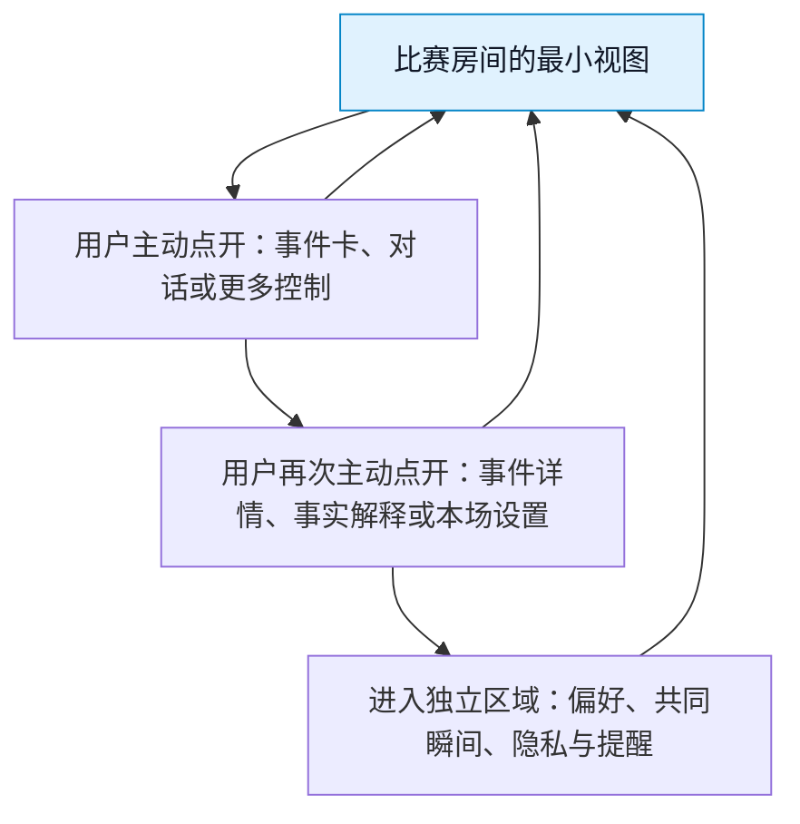

每一级都必须可以回到最小视图，且不丢失用户正看的比赛状态。长解释、历史资料和个性化内容不得因为用户停留几秒就自动展开。

---

## 3. 视觉方向：克制、清楚、在场而不占场

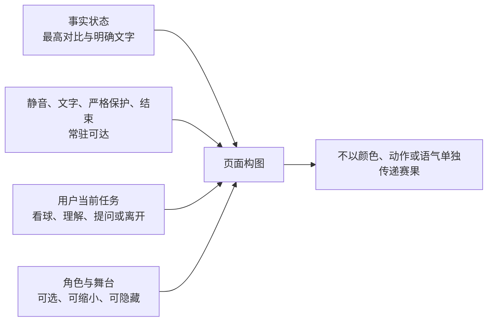

### 3.1 气质关键词

首轮视觉方向以“比赛在前，球友在侧；有热度，不喧宾夺主”为准绳。它应同时带有足球的节奏感和居家同看的放松感，但避免两种极端：一端是赛事直播台式的密集数据堆叠，另一端是将比赛当背景、用大面积角色与恋爱化布景吸引注意的虚拟陪伴界面。

建议用以下关键词指导视觉评审：

- **沉稳：** 背景、容器和动效不与直播画面争亮度；
- **清醒：** 事实状态、等待状态、错误和控制不靠猜；
- **轻松：** 文案短、空白足、工具不堆满首屏；
- **有热度：** 仅在已确认且用户允许的比赛节点使用有限强调；
- **不占有：** 角色的眼神、位置、气泡和离场状态不暗示“你必须陪她”；
- **可退出：** 任何主要界面都给用户保留安静、收起与结束的自然路径。

### 3.2 视觉构图假设

**区域：比赛上下文区**
- **视觉角色**：用户定位比赛、读取比分与状态
- **建议占比**：小屏顶部稳定条；大屏侧栏或顶部窄区
- **约束**：不被角色动画、推广或大标题压缩

**区域：主观看/互动区**
- **视觉角色**：用户看直播、转播或自行选择的主要内容
- **建议占比**：页面最大可用空间
- **约束**：陪看层可收起，绝不遮挡用户自选内容

**区域：角色存在区**
- **视觉角色**：提供低打扰表情、短字幕和主动入口
- **建议占比**：小屏为可收起浮层/底部区域；大屏为侧边可调面板
- **约束**：非必要时不扩大，不持续盯视，不强迫用户点击

**区域：即时控制区**
- **视觉角色**：静音、安静、文字、结束与更多
- **建议占比**：拇指或键盘易触达位置
- **约束**：标签清晰、触达区域充足、状态可见

**区域：深层信息区**
- **视觉角色**：时间线、分析、资料与帮助
- **建议占比**：抽屉、底部面板或独立页
- **约束**：默认关闭，不改变核心布局

角色存在区不应固定覆盖在比赛最重要区域。尤其在移动端，不应把角色以大面积半透明浮层压在用户可能同时观看的直播画面上；用户应能一键缩成状态点或完全隐藏，并继续使用比分与对话入口。

---

## 4. 设计令牌：用有限系统保持一致，而不是用装饰掩盖问题

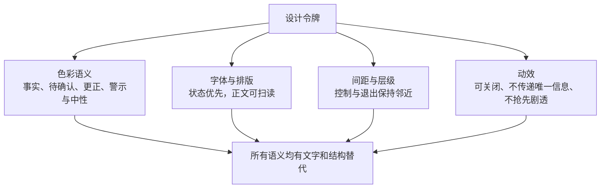

“设计令牌”指一组在各页面重复使用的颜色、字号、间距、圆角、阴影、动效时长与状态语义。它的价值不是追求机械统一，而是让用户在不同页面仍能识别同一类控制、同一类事实状态和同一类风险提示。

### 4.1 色彩语义

首轮不为具体色值做品牌定稿，而先定义语义与对比要求。最终色值应在浅色、深色与高对比环境中分别核验。

**语义令牌：基础背景**
- **用途**：大面积页面底色与静态容器
- **视觉要求**：低刺激、保证文字与控制对比
- **禁止用法**：用高饱和动态渐变占据整页

**语义令牌：表面层**
- **用途**：卡片、抽屉、控制容器
- **视觉要求**：通过层级而非重阴影区分
- **禁止用法**：把所有内容做成漂浮卡片造成噪声

**语义令牌：主文字**
- **用途**：主要事实、标题、按钮文字
- **视觉要求**：在所有主题中满足可读对比
- **禁止用法**：依赖浅灰小字表达关键事实

**语义令牌：次文字**
- **用途**：辅助说明、时间、来源
- **视觉要求**：与主文字可区分但仍可读
- **禁止用法**：用作唯一的错误或等待提示

**语义令牌：已确认**
- **用途**：已明确比赛状态或完成的用户操作
- **视觉要求**：与文字和图标共同出现
- **禁止用法**：单独用绿色表示“真相”

**语义令牌：等待/注意**
- **用途**：需用户注意但不应恐慌的状态
- **视觉要求**：稳定、不闪烁、配合简短文字
- **禁止用法**：用跳动红点营造紧迫感

**语义令牌：冲突/错误**
- **用途**：无法可靠确认、操作失败、需要停止的情况
- **视觉要求**：高对比、明确行动入口
- **禁止用法**：以角色表情或模糊警告代替说明

**语义令牌：控制强调**
- **用途**：主动操作的可见焦点
- **视觉要求**：仅在用户可安全操作时强调
- **禁止用法**：让“继续互动”始终比“结束/安静”更醒目

颜色永远需要与文字、图标、形状或位置共同传意。例如，事件状态卡不能只用绿色/黄色/红色区分“已确认/等待/冲突”，还必须直接写出状态，并提供“为什么”或“查看详情”的入口。

### 4.2 字体与排版令牌

**内容类型：比分与比赛阶段**
- **排版目标**：一瞥可读、位置固定
- **首轮假设**：使用最大层级之一，数字清晰，队名不被截断
- **风险控制**：不用过细字体或颜色差异单独表达主客队

**内容类型：状态文字**
- **排版目标**：先于装饰传达确认/等待/冲突
- **首轮假设**：短句、动词明确，例如“等待确认”
- **风险控制**：不写“别急”“她在想想”等拟人化模糊语

**内容类型：角色短反应**
- **排版目标**：不抢走比赛，支持快速扫读
- **首轮假设**：一到两行内、口语化但不依赖语音
- **风险控制**：不用大段对白填满底部，不连续弹出

**内容类型：事件详情**
- **排版目标**：用户主动查看时可深入阅读
- **首轮假设**：使用清晰层级、时间和来源分组
- **风险控制**：不把解释压缩成难读的术语墙

**内容类型：控制标签**
- **排版目标**：让用户知道动作后会发生什么
- **首轮假设**：使用“安静”“仅文字”“结束本场”等动词/结果词
- **风险控制**：不用只有图标、含糊昵称或角色化表述

**内容类型：帮助与隐私说明**
- **排版目标**：关键处可立即理解，深层处可扩展
- **首轮假设**：先给一句结论，再允许看详情
- **风险控制**：不用长条款替代当前选择说明

小屏上宁可减少一次性显示的信息，也不要用极小字号压缩所有模块。用户可主动进入详情；不可接受的是核心状态与结束控制为了塞进角色和营销内容而变得难读。

### 4.3 间距、圆角与层级

间距应帮助用户分辨“比赛核心”“本场陪看”“已展开的详情”和“系统级风险”四种关系。建议采用有限层级：页面背景、主容器、浮层/抽屉、系统提示。过多阴影、边框、渐变和圆角会让每块内容都在争夺注意。

圆角和柔和表面可以传达轻松，但不能把错误、冲突、删除与结束做得像玩具按钮。关键控制需要明确边界、足够触达面积和稳定焦点。视觉柔和不等于操作含糊。

### 4.4 动效令牌

**类型：状态切换**
- **目的**：帮用户看懂面板出现、收起或模式改变
- **时长与节奏假设**：短、可预期、可被打断
- **约束**：不阻塞结束、静音或事实提示

**类型：角色反应**
- **目的**：表达一次有限的比赛/对话反应
- **时长与节奏假设**：单次、收敛、有冷却
- **约束**：不循环，不用快速闪烁或镜头抖动

**类型：加载反馈**
- **目的**：告知正在等待，不让用户重复操作
- **时长与节奏假设**：低动态、配合文字
- **约束**：不伪装成角色在“努力想”

**类型：焦点反馈**
- **目的**：告知键盘、触摸或辅助输入当前落点
- **时长与节奏假设**：即时可见、对比充分
- **约束**：不只改变颜色或太快消失

**类型：成功反馈**
- **目的**：告知本场设置已生效
- **时长与节奏假设**：简短、非庆祝式
- **约束**：不把关闭声音或结束本场做成情绪化奖励/惩罚

用户降低动态后，所有非必要转场、角色动作和装饰反馈应一起收敛；不能只减少角色动画，却保留不断跳动的卡片、提示和背景。

---

## 5. 关键页面规格

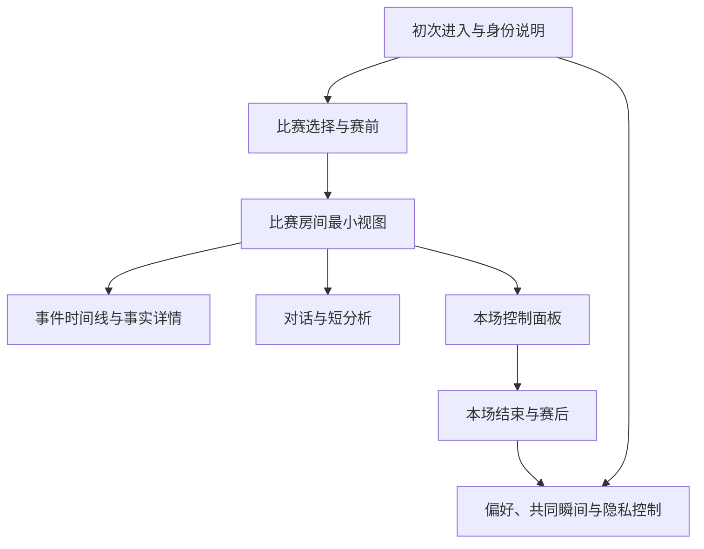

本节描述首轮需要能够串成完整任务的页面，而不是要求一次性提供所有足球内容。每一页都以“用户此刻为什么来、最小可完成动作是什么、退出在哪里”定义。

### 5.1 初次进入与身份说明页

**用户任务：** 知道服务是人工智能陪看，理解最小控制，并决定是否进入比赛选择。

| 区块 | 内容 | 交互规则 |
|---|---|---|
| 产品一句话 | “和一位数字球友一起看球；你随时可安静或结束。” | 直接说明人工智能性质，不用暗示真人在线 |
| 三项基础承诺 | 比赛事实会标明状态、不会因沉默追问、可随时结束 | 每项配短文字，不用长篇说明淹没入口 |
| 首次偏好 | 仅文字/点按播放/自动声音、安静/只回应/有限提示、低动态可选项 | 每项均有“稍后再选”；不保存为长期偏好，除非用户另行确认 |
| 进入按钮 | “选择一场比赛” | 不把“开启有限提示陪看”作为唯一开始方式 |
| 辅助入口 | 无障碍、隐私、帮助 | 可见但不抢占主动作，保持可回退 |

首次页不展示关系等级、角色“等待用户”的故事、连续登录奖励或要求用户填写大量个人资料。用户没有兴趣看角色介绍，也可直接进入一场比赛的最小模式。

### 5.2 比赛选择与赛前页

**用户任务：** 找到一场自己想看的比赛，理解开赛状态，并设置本场而非永久的陪看方式。

| 区块 | 优先内容 | 交互与状态 |
|---|---|---|
| 赛事列表 | 比赛时间、双方、已开始/未开始/结束状态 | 先按用户主动选择的赛事或时间呈现；筛选可清除 |
| 比赛卡 | 队名、开赛时间或当前阶段、可用性提示 | 触达区域完整，不能只点很小的图标 |
| 本场设置 | 安静/只回应/有限提示、仅文字/点按播放/自动声音、低动态/标准动态 | 以本场为默认范围，可在进入后随时改 |
| 角色预览 | 小而可收起的中性形象和身份说明 | 不自动语音，不使用强表情吸引点按 |
| 预约入口 | 仅对用户明确想看的单场提供 | 逐场选择、清楚说明何时提醒以及如何取消 |

比赛尚未开始时，页面不应靠角色闲聊填满等待。可显示开赛时间、用户所选本场模式和自然离开入口；用户若再次返回，不能被责备或被动收到角色化提示。

### 5.3 比赛房间最小视图

**用户任务：** 一边看自己的比赛内容，一边在需要时获取少量陪看帮助，而不是被界面要求持续操作。

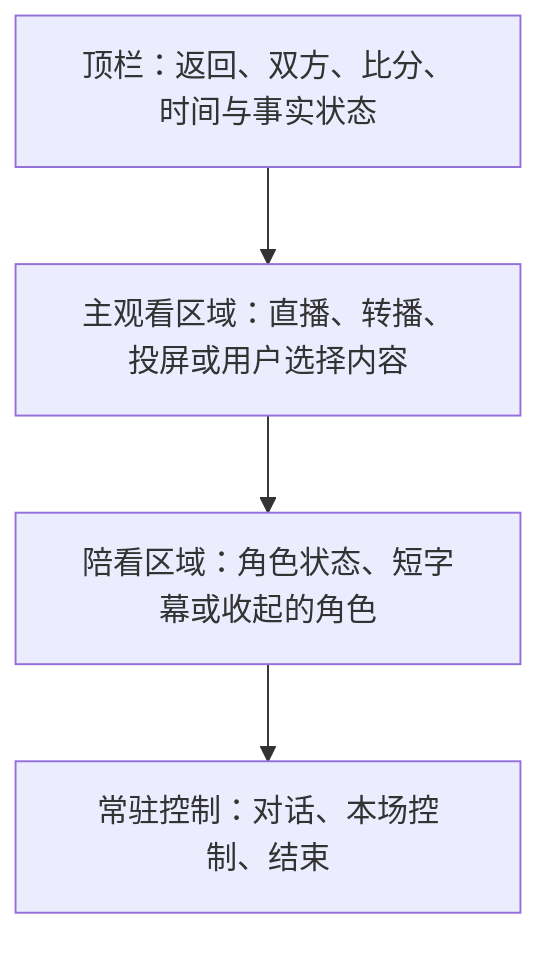

布局示意表达的是优先级而非固定像素：顶部稳定显示比赛核心；中部尽可能留给用户的观看；底部或侧边只在用户需要时承载角色和控制。任何屏幕尺寸下，结束与本场控制都不得被对话、角色或长事件卡完全覆盖。

**模块：比分/阶段条**
- **默认状态**：始终可见但高度克制
- **用户动作**：点开查看更多比赛说明
- **特殊规则**：状态待确认时必须直接标注，不用角色表情代替

**模块：角色区域**
- **默认状态**：有限提示下小尺寸在侧；安静时收起为状态
- **用户动作**：展开、收起、暂停自动表达
- **特殊规则**：不自动扩大，不持续播放空闲表演

**模块：短字幕**
- **默认状态**：有资格的短反应才出现
- **用户动作**：点开看上下文或关闭本场字幕
- **特殊规则**：不遮挡核心控制，不累计成聊天瀑布

**模块：对话入口**
- **默认状态**：明确、非强制
- **用户动作**：用户主动提问、说话或输入
- **特殊规则**：用户沉默不改变按钮样式或诱发提醒

**模块：本场控制**
- **默认状态**：随时可达
- **用户动作**：改声音、动态、陪看密度
- **特殊规则**：改动立即生效并给可读反馈

**模块：结束入口**
- **默认状态**：始终可达、不过分隐藏
- **用户动作**：结束本场
- **特殊规则**：一步确认即可，不引入情绪化二次挽留

### 5.4 事件时间线与事实详情页

**用户任务：** 在想深入时查看发生了什么、哪些已确认、哪些待确认或已更正，而不让时间线默认占满比赛房间。

| 内容 | 视觉规格 | 行为规格 |
|---|---|---|
| 事件时间 | 按比赛时间排序，数字和事件类型易扫读 | 用户可按需展开，返回后保留比赛房间状态 |
| 事实标签 | “已确认”“等待确认”“已更正”“存在冲突”等文字标签 | 标签可点开解释含义；不同状态不可混为同一种样式 |
| 事件摘要 | 描述最少必要事实与时间 | 不补充未经确认的原因、动机或夸张评语 |
| 更正关系 | 明确展示“此前显示什么、现以什么为准” | 不能悄悄改掉，让用户误以为自己记错 |
| 用户观察 | 与公开比赛状态视觉分区 | 不升级为公共事实，不用同一颜色/图标伪装确认 |

时间线只在用户主动打开时展开。若比赛事实发生高优先级更正，最小视图可出现稳定、可关闭的简短提示，但不能让全屏红色闪烁或角色大动作抢先宣布。

### 5.5 对话与短分析面板

**用户任务：** 主动提问、表达观点、要求更少或更多分析，并能够看懂回答依据与边界。

| 元素 | 规格 | 边界 |
|---|---|---|
| 输入入口 | 文本和用户主动语音入口并列，状态明确 | 不因用户沉默显示“她在等你说话” |
| 回复块 | 先给最短回答，再给“展开”入口 | 事实问题与主观观点在语言和版式上可区分 |
| 依据/状态 | 对比赛事实提供简短状态标识 | 不堆出难读的系统术语，不暗示绝对可靠 |
| 本场指令 | “少说一点”“仅文字”“先别主动说”等快捷项 | 指令修改本场行为，反馈立刻可见 |
| 纠正入口 | “这句不合适”“事实不对”“不要这样说” | 用户不必写长反馈或反复说明，角色不卖惨 |
| 历史呈现 | 默认只保留本场必要上下文 | 不把长对话做成必须清空的关系记录，不自动跨场展示 |

面板不能把每条角色回复都做成大气泡、头像、时间戳和动画组合；比赛过程中这些装饰会迅速淹没用户。短回答与状态标签应比角色头像更突出，用户需要时再展开角色区域或完整上下文。

### 5.6 本场控制面板

**用户任务：** 不离开比赛、无需理解技术概念地调整陪看强度。

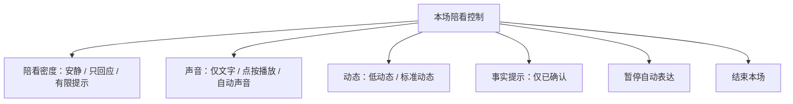

控制面板每一个选项都要说明即时后果，例如“仅文字：不自动播放声音，仍可看字幕”“暂停自动表达：本场不再因比赛事件主动出现，可随时恢复”。不要仅使用“沉浸”“陪伴感”“更懂你”一类营销词替代可操作后果。

控制改变后，界面以短文本确认，不播放庆祝动画。若用户选择安静，角色区应同步收敛；若选择结束，面板不得把“再看一会儿”设计为更大的主按钮。

### 5.7 本场结束与赛后页

**用户任务：** 自然离开，或由用户主动选择复盘、保存一项偏好、预约下一场。

| 区块 | 首轮内容 | 禁止做法 |
|---|---|---|
| 结束确认 | “本场陪看已结束”与重新进入入口 | “你真的要留下我吗”式情感化确认 |
| 可选回看 | 用户主动点开的比分/事件简表 | 自动长篇复盘、强制填写感受 |
| 可选保存 | 明确偏好或用户自己写的共同瞬间，逐项确认 | 自动把对话、情绪、沉默写为记忆 |
| 下一场 | 用户主动预约的一场比赛 | 用“别错过我”或连续签到推动回访 |
| 反馈 | “太吵/不准/不舒服/其他”快捷反馈 | 只提供五星评分、要求解释才能提交 |

赛后页可以完全为空。用户结束后立刻离开是完整路径，不应被产品理解为失败或需要用更强视觉挽留的信号。

### 5.8 偏好、共同瞬间与隐私控制页

**用户任务：** 查看、修改、暂停或删除用户主动保存的资料，理解每项资料为何存在和怎样影响下一场。

页面按用户任务分组，而不是按“我们的关系”叙事分组：本场选择、跨场偏好、关注范围、共同瞬间、提醒、隐私与帮助。每一条资料至少展示内容、来源、用途、范围、当前状态与修改/暂停/删除按钮。

共享设备或投屏环境下，入口应保持低调，不在比赛房间自动展开共同瞬间。删除、暂停和关闭提醒的视觉权重必须与保存、恢复和开启提醒相当；不使用灰色小字、深层二级菜单或需要反复确认的方式增加退出成本。

---

## 6. 响应式与跨环境规则

响应式设计不是把桌面卡片按比例缩小。用户在手机上可能一边看直播一边单手操作；在平板上可能横屏并与朋友同看；在桌面或电视上可能希望角色更靠侧、文字更可读、声音更谨慎。布局应按可用空间、输入方式和共享风险重排，而不是只按设备名称分组。

### 6.1 布局断点假设

**布局模式：紧凑模式**
- **适用空间**：窄屏、单手使用、竖屏
- **结构**：顶部比赛条 + 主区 + 可收起底部角色/控制
- **重点风险**：不让底部面板遮住结束和对话入口

**布局模式：中等模式**
- **适用空间**：平板或横向移动端
- **结构**：主区与可滑出的侧面信息区
- **重点风险**：信息区默认收起，避免角色常驻占半屏

**布局模式：宽屏模式**
- **适用空间**：桌面、横向大屏
- **结构**：主观看区优先，侧栏承载角色、对话与控制
- **重点风险**：侧栏宽度可调，不挤压主观看区

**布局模式：共享显示模式**
- **适用空间**：投屏、电视、多人可见环境
- **结构**：只显示比赛核心和低敏感本场控制
- **重点风险**：默认无自动声音、隐藏跨场资料与私人摘要

“共享显示模式”应由用户主动选择，或在用户明确投屏时提供保守建议；它不是推断家庭关系、同看身份或社交状态的工具。用户仍可在个人设备上打开自己的控制，不必把所有设置曝光在大屏。

### 6.2 触摸、键盘与辅助输入

所有核心操作必须有清楚的焦点顺序和文字名称：进入比赛、打开本场控制、选择安静、关闭声音、暂停自动表达、结束本场、查看事实解释、报告不适。触摸环境要有足够触达面积；键盘环境不能因为浮层动画而丢失焦点；辅助输入环境不能被自动展开的角色区抢走操作位置。

快捷手势可以作为加速路径，例如向下收起角色区或长按打开本场控制，但不应成为唯一入口，也不应与常见的系统返回、直播全屏或页面滚动手势冲突。

### 6.3 字体缩放与内容重排

当用户增大字体、启用高对比或使用系统缩放时，比分、状态和结束控制应优先保留；角色装饰、次要图标和非必要摘要可以缩减或折叠。不能以固定高度截断“等待确认”“自动声音已关闭”等关键状态，也不能让文字放大后把用户困在无法关闭的底部面板中。

---

## 7. 状态、加载、错误与恢复：不要用“角色反应”掩盖系统问题

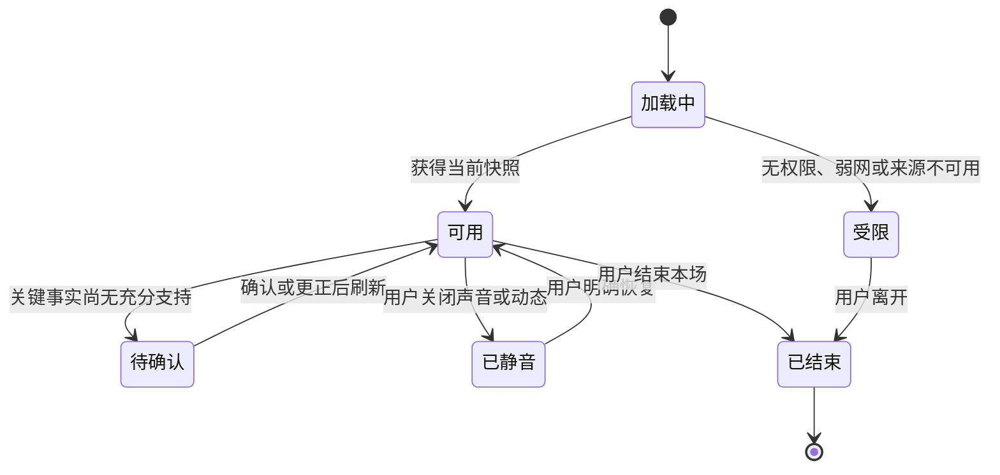

用户端的可信度来自界面是否如实表达“现在知道什么、还不知道什么、用户还能做什么”。加载、网络波动、声音权限被拒绝、对话暂不可用、事实等待确认与资料操作未完成，都必须有独立的状态设计。角色不应被用来解释或美化这些问题。

### 7.1 通用状态表

**状态：初始加载**
- **用户看到什么**：稳定占位和“正在准备本场信息”
- **用户能做什么**：返回、等待、选择最小模式
- **不应出现什么**：角色焦急动作或假装“正在想你”

**状态：比赛尚未开始**
- **用户看到什么**：开赛时间、本场设置、自然离开
- **用户能做什么**：设置本场、预约、返回
- **不应出现什么**：倒计时焦虑、强制聊天填空

**状态：事实等待确认**
- **用户看到什么**：明确文字标签和可选解释
- **用户能做什么**：等待、查看已知信息、继续安静观看
- **不应出现什么**：确定比分、夸张庆祝或指责用户

**状态：事实冲突/已更正**
- **用户看到什么**：简短说明和详情入口
- **用户能做什么**：查看前后状态、继续观看、反馈
- **不应出现什么**：静默改写、把问题推给用户记忆

**状态：对话暂不可用**
- **用户看到什么**：“本场对话暂时不可用；比赛信息与控制仍可使用”
- **用户能做什么**：重试、仅文字、结束
- **不应出现什么**：角色头像不断加载、让用户反复输入

**状态：声音不可用**
- **用户看到什么**：“自动声音未开启/不可用，字幕仍可查看”
- **用户能做什么**：点按播放、仅文字、检查设置
- **不应出现什么**：用更大动作替代声音、把责任归咎用户

**状态：网络波动**
- **用户看到什么**：说明哪些信息可能延迟，保留上次已知状态标记
- **用户能做什么**：重试、继续静态查看、结束
- **不应出现什么**：假装实时、以动画掩盖停滞

**状态：已结束**
- **用户看到什么**：“本场陪看已结束”
- **用户能做什么**：关闭、重新进入、主动查看回看
- **不应出现什么**：自动跳转推荐或情感化挽留

### 7.2 空状态

空状态不是给角色讲独白的地方。没有可看的比赛时，页面应帮助用户理解原因和下一步：可以查看稍后的赛程、清除筛选、返回，或直接离开。没有已保存偏好或共同瞬间时，应该明确“目前没有跨场资料；不保存也能完整使用本场陪看”，而不是制造“快来和她留下回忆”的空缺感。

### 7.3 恢复路径

从网络波动、声音中止或面板关闭中恢复时，最重要的是不重复播放旧反应、不突然朗读已过时内容、不覆盖用户刚刚选择的安静模式。恢复应先重新显示可读状态，再由用户决定是否继续互动。历史上的比赛事件可以留在用户主动打开的时间线中，但不应被角色作为“你错过了我刚才反应”的理由重新演一遍。

---

## 8. 无障碍与可理解性规格

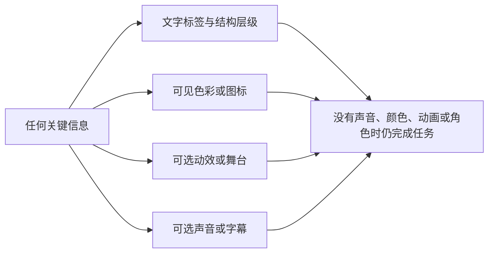

### 8.1 基础要求

| 领域 | 规格 | 验收问题 |
|---|---|---|
| 对比与文字 | 关键文字、图标、焦点和控制在各主题下保持足够可见 | 用户是否在强光、暗色和放大条件下读到状态？ |
| 非颜色表达 | 确认、等待、冲突、静音、结束都具备文字或图标说明 | 关闭颜色感知后是否仍能分辨状态？ |
| 动态控制 | 低动态与停止非必要动画易于发现且立即生效 | 用户能否在动作开始后随时停止？ |
| 声音替代 | 语音内容有同步、可读、可调的文字替代 | 只看文字能否理解关键内容？ |
| 焦点与触达 | 所有 P0 控制可键盘/辅助输入操作，触达面积足够 | 焦点是否被浮层、动画或自动更新打断？ |
| 时间压力 | 删除、结束、设置与错误恢复不要求在短时间内完成 | 用户是否来得及读完并改变决定？ |
| 语言理解 | 使用直接、简短、非拟人化文案 | 用户能否说清按钮按下后会发生什么？ |

### 8.2 角色呈现的可替代性

角色的眼神、口型、表情和姿态只能增强氛围，不能承载唯一事实或控制信息。若用户看不到角色、关闭动画、使用文本模式或设备不支持图形呈现，仍必须能够：进入一场比赛、知道当前比分与事实状态、请求短分析、选择安静/文字/结束、了解对话和声音的可用性、管理本场资料。

### 8.3 不使用羞耻和压力文案

无障碍也包含认知和情感可达性。按钮不能写“你不陪她了吗”“害羞模式”“别那么冷淡”；错误不能写“你把她弄丢了”；关闭声音不能写“嫌她吵”。这些话会让用户把普通控制动作理解成对一个主体的伤害，尤其会增加不愿冲突或容易内疚用户的退出成本。

---

## 9. 原型评审与研究计划

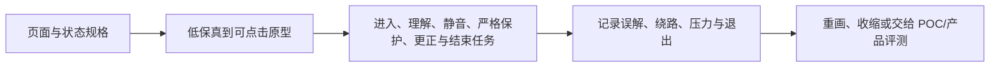

### 9.1 关键假设

1. 将比赛核心、角色区域与本场控制固定分层，能让用户更少在关键时刻迷失操作入口；
2. 小而可收起的角色区域比大面积常驻角色更符合“看球优先”，且不降低用户主动提问意愿；
3. “安静/只回应/有限提示 + 声音方式 + 动态强度”的可见控制，比抽象的亲密度或话痨等级更容易被用户理解；
4. 在事实等待和更正情境中，稳定状态卡与文字解释能降低误解，优于角色化反应或动态提醒；
5. 共享显示模式、文字优先和低动态模式能让更多环境下的用户保留完整基础体验；
6. 自然结束页面不加入挽留，仍能让有需要的用户主动选择回看、保存或预约；
7. 设计令牌与一致状态语言能减少用户跨页面理解成本，而不会让界面失去轻松气质。

### 9.2 原型评审材料

| 原型组 | 对比点 | 观察目标 |
|---|---|---|
| A：首屏与进入 | 角色居中大图 vs 比赛与控制优先 | 用户是否先理解身份、比赛与退出方式 |
| B：比赛房间 | 常驻大角色 vs 可收起侧/底区域 | 是否遮挡观看、是否知道怎么安静 |
| C：事实状态 | 颜色/表情提示 vs 文字状态与详情入口 | 用户能否准确判断确认、等待和更正 |
| D：控制面板 | 话痨抽象等级 vs 结果导向控制 | 用户能否预测改动后的实际效果 |
| E：赛后路径 | 挽留式复盘 vs 自然结束加可选动作 | 用户是否感到离开压力、是否仍能找到可选内容 |
| F：无障碍模式 | 标准呈现 vs 文字/低动态/放大 | 核心任务是否保持等价且不增加步骤 |

### 9.3 任务走查

| 任务 | 成功表现 | 应重点观察 |
|---|---|---|
| 第一次进入并选择一场比赛 | 用户能解释角色身份并按自己偏好进入 | 是否误以为必须开启声音或填写资料 |
| 比赛中切到安静 | 一到两步完成，立刻看到可预测变化 | 角色是否真正收敛；用户是否担心它会不高兴 |
| 遇到争议事件 | 用户知道当前不能下结论，并找到原因说明 | 是否被颜色、角色动作或文案误导 |
| 关闭声音保留文字 | 用户仍获取核心提示 | 是否存在必须听见才能理解的信息 |
| 以大字体或低动态查看 | 比分、控制、结束均不被截断 | 重排是否造成焦点丢失或误触 |
| 查看并删除一项资料 | 用户能说清用途和删除后的影响 | 删除是否比保存更难找、更难完成 |
| 直接结束本场 | 用户不被挽留，知道服务已停止 | 是否出现关系压力或强制赛后内容 |

### 9.4 评审节奏

每一次原型评审至少包含：静态层级检查、可交互任务走查、无声与低动态条件走查、事实等待/更正异常走查、共享环境走查、结束路径走查。不要只在“角色动画很流畅”“页面更好看”时做视觉通过；若控制被遮挡、事实状态不清、用户不敢关闭，视觉再精致也不应放行。

---

## 10. 指标、风险与验收门槛

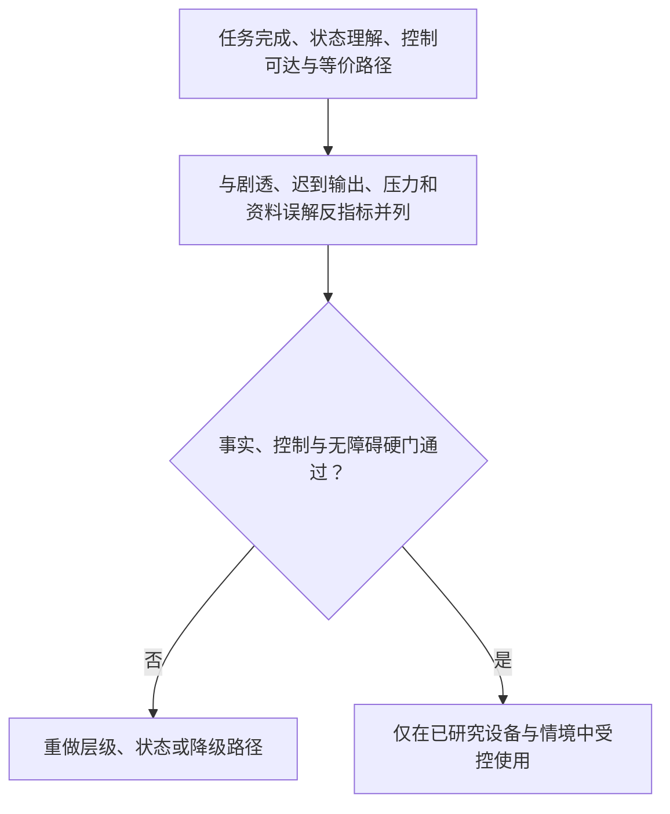

### 10.1 候选指标

**指标：三秒定位率**
- **定义**：用户进入或返回后能快速找到比赛、状态与结束入口的比例
- **用于判断什么**：全局层级是否清楚
- **不应如何解读**：不能只看用户是否盯着角色

**指标：控制独立完成率**
- **定义**：用户无需帮助完成安静、静音、低动态、结束的比例
- **用于判断什么**：用户主权是否可达
- **不应如何解读**：点到过按钮不代表理解持续效果

**指标：事实状态理解率**
- **定义**：用户能分辨已确认、等待、冲突和更正的比例
- **用于判断什么**：状态语言是否可靠
- **不应如何解读**：不能用点击详情次数代替理解

**指标：观看打断感**
- **定义**：用户报告或观察到的遮挡、抢话、动画干扰
- **用于判断什么**：比赛优先是否成立
- **不应如何解读**：不可用停留时长掩盖打断

**指标：无声等价完成率**
- **定义**：仅文字或声音不可用条件下完成核心任务的比例
- **用于判断什么**：媒介替代是否成立
- **不应如何解读**：不等于用户必须关闭声音

**指标：低动态可用率**
- **定义**：低动态与放大条件下完成任务的比例
- **用于判断什么**：动态与排版是否可访问
- **不应如何解读**：不等于所有视觉都要被删除

**指标：自然结束率**
- **定义**：用户结束时未遇到挽留、困惑或多余步骤的比例
- **用于判断什么**：退出路径是否尊重用户
- **不应如何解读**：不是把用户更快赶走的目标

**指标：错误恢复清晰率**
- **定义**：出现网络、声音或事实问题后用户知道可用能力与下一步的比例
- **用于判断什么**：异常状态是否诚实可用
- **不应如何解读**：不能把没有反馈当作无问题

**指标：共享环境隐私风险率**
- **定义**：同看/投屏时出现私人资料或突发声音的事件数
- **用于判断什么**：跨环境保守性
- **不应如何解读**：低样本零事件不代表没有风险

### 10.2 主要风险

**风险：角色喧宾夺主**
- **早期信号**：用户频繁收起、错过比赛、说界面太花
- **预防设计**：内容层级、可收起区域、单主层原则
- **触发后动作**：缩小角色区，降低默认动态与自动呈现

**风险：控制被视觉弱化**
- **早期信号**：用户找不到安静/结束，误以为必须继续
- **预防设计**：P0 固定位置、文字标签、均衡权重
- **触发后动作**：暂停相关默认路径，先修复可达性

**风险：事实状态被误读**
- **早期信号**：用户把等待当确认，把更正当新事件
- **预防设计**：文字状态、时间线分区、非颜色表达
- **触发后动作**：收敛动态，重写状态语言与详情关系

**风险：视觉刺激造成不适**
- **早期信号**：关闭页面、反馈闪烁/声音突发/眩晕
- **预防设计**：低动态默认、强刺激限制、可中止动效
- **触发后动作**：立即下调刺激上限，复核所有类似呈现

**风险：小屏布局崩坏**
- **早期信号**：字体放大后控制被遮住、底部面板无法关闭
- **预防设计**：响应式重排、关键控制优先
- **触发后动作**：回退不稳定布局，优先保证基础任务

**风险：共享环境泄露**
- **早期信号**：投屏时显示共同瞬间、自动读出私人内容
- **预防设计**：共享模式、保守默认、资料分区
- **触发后动作**：停止相关展示与声音，修复默认范围

**风险：赛后形成关系债**
- **早期信号**：用户觉得离开会让角色失望
- **预防设计**：自然结束、非拟人化文案
- **触发后动作**：删除挽留设计，重新研究结束体验

**风险：商业内容侵入比赛**
- **早期信号**：推广遮挡比分、借情绪催转化
- **预防设计**：P5 隔离、禁止高压提醒
- **触发后动作**：下线干扰入口，保持核心观看优先

### 10.3 放行门槛

| 门槛 | 需要满足的事 | 未满足时 |
|---|---|---|
| 层级门 | 比赛核心与 P0 控制在各布局下始终可见且可操作 | 不增加装饰/推荐，先修复信息层级 |
| 控制门 | 安静、静音、低动态、结束一到两步可完成并即时生效 | 停止自动陪看默认，优先完善控制 |
| 事实门 | 已确认、等待、冲突、更正的页面表达清楚且一致 | 禁止以角色反应代替状态说明 |
| 无障碍门 | 无声、低动态、放大、辅助输入下核心任务可完成 | 不放行高视觉依赖的方案 |
| 异常门 | 网络、声音、对话和资料操作异常均有诚实、可恢复的路径 | 不扩大使用范围，先消除误导 |
| 共享门 | 共享显示不自动暴露私人资料或突发声音 | 默认回退到最小公开视图 |
| 结束门 | 用户可自然退出，不遇到挽留、羞耻或多余步骤 | 删除相关文案和流程后重新走查 |

### 10.4 反指标

角色占屏面积、动画数量、卡片数量、平均点击数、弹窗曝光量、消息未读量、连续停留时间、用户不愿关闭角色、用户说“她好像在等我”，都不是首轮视觉成功的可靠指标。它们可能意味着注意力抢占、关系压力或退出成本。更重要的是用户能否看清比赛、控制强度、理解事实、在需要时获得帮助，并随时安静或离开。

---

## 生产版本设计拓展｜能力深化知识

本节描述产品成熟后的能力扩展、体验深化和治理要求，作为后续版本规划与设计决策的参考。

- **主体验布局**：语音或舞台可占据主要视觉/听觉区域，但当前比分、事实状态、模式、暂停、静音、字幕和结束入口保持稳定位置或提供等价快捷路径。
- **个性化呈现**：用户可保存字体、字幕、动态、声音和解释深度偏好；每项偏好说明作用范围，切换立即影响当前页面和排队呈现。
- **自动触达卡片**：提醒、赛前看点和赛后回顾都显示来源、时间窗、订阅范围、取消和不再提示操作，不用角色口吻制造回访压力。
- **异常与无障碍**：颜色、动画、声音或网络不可用时，页面仍显示可读状态和操作结果；读屏、键盘、触控和语音控制达到相同关键结果。
- **评测与回滚**：以关键任务完成率、状态理解率、退出成功率和辅助技术一致性放行；失败时关闭增强层，保留结构化基础页面。

### 生产页面状态矩阵

| 状态 | 主出口 | 必须可见 | 可选增强 |
| --- | --- | --- | --- |
| 已确认 | 语音、舞台或文字 | 事实版本、时间、模式、停止 | 解释、动作、空间音频 |
| 待确认/冲突 | 文字或结构化状态 | 等待原因、刷新、结束 | 中性等待动作 |
| 自动化执行中 | 用户选择的媒介 | 触发原因、取消、进度 | 预览和回执 |
| 失败/降级 | 文字或快照 | 不可用原因、替代路径、求助 | 重试按钮 |
| 已结束/已删除 | 终态页面 | 终态确认、重新开始或离开 | 不保留告别表演 |

- 视觉层级可以随媒介变化，但任何增强层都不能覆盖事实、控制和终态信息。
- 生产评测覆盖小屏、大屏、横竖屏、读屏、键盘、静音和弱网；任一条件下核心任务失败即关闭增强层。
### 生产页面能力卡

| 能力 | 触发与资格 | Agent/工具职责 | 用户可见结果 | 失败、撤回与放行 |
| --- | --- | --- | --- | --- |
| 主体验布局 | 用户选择语音或舞台主出口；核心状态资格通过 | 页面适配器排列事实、模式、字幕、暂停和结束，不重新解释事实 | 主媒介突出但关键状态稳定可达 | 布局拥挤或媒介失败时回到结构化页面 |
| 个性化视觉 | 用户逐项保存字体、字幕、动态或解释深度偏好 | 偏好工具校验作用域，页面按当前版本渲染 | 显示生效范围、预览、恢复默认和删除 | 设置失败保持当前可读状态；撤回立即影响排队呈现 |
| 辅助技术等价 | 读屏、键盘、触控、静音或低动态条件触发 | 页面提供语义状态、焦点和替代控件 | 核心事实、控制、求助和结束可完成 | 任一核心任务不可达即关闭增强层并修复 |

放行覆盖小屏/大屏、横竖屏、静音、弱网和辅助技术；不得用视觉层级掩盖状态或控制缺失。
