# 球球用户端页面与视觉规格

> 本文面向外部读者，介绍球球用户端（观众侧应用）的页面构成、视觉方向与交互规则。文中描述的页面与行为均以当前线上版本为准；"我们"指产品设计团队。

---

## 1. 页面要解决什么：不是把角色放在屏幕中央

足球陪看产品的用户端同时承受三种注意力竞争：用户本来就在看直播或转播；用户偶尔需要确认比分、事件和延迟状态；数字球友（Digital Ballmate）——我们为陪看角色起的称呼，一位由人工智能驱动、在应用中名叫"球球"的看球伙伴（下文统称"球球"）——会提供短反应、对话和可调节的陪伴感。如果我们把角色动画、对话气泡、比分、赛事信息、设置入口与推荐内容放在同一视觉权重上，用户会被迫不断决定先看什么，最终要么错过比赛，要么关闭全部陪看能力。

因此，我们把这个用户端设计成首先帮助用户看球和保持控制的界面，其次才是球球的舞台。核心原则是：比分、事实状态、用户的主动沉默、话痨程度与退出路径，必须比角色形象、装饰动效或商业信息更容易发现。

本设计的任务不是制造"很像真人的房间"，而是让用户在任何时刻都能迅速回答五个问题：

1. 我现在进入的是哪一场比赛，状态是否已开始、暂停或结束？
2. 球球当前为什么说话、为什么沉默，赛事信息是确认、等待还是已更正？
3. 我怎样按自己的承受度调整球球的说话密度（话痨档位共三档：安静、刚好、热闹，默认"刚好"）？
4. 发生网络、声音、事实或会话问题时，什么仍然可用，我下一步能做什么？
5. 我怎样通过清楚的退出路径自然结束本场，而不被挽留、强制复盘或被要求解释？

我们追求的结果是：

> 新用户可在短时间内认识球球、选择一场比赛、进入低打扰陪看并随时调整强度；观看中的用户能优先看到最小且可解释的比赛状态；需要时可以主动打开对话、更多信息或控制；在小屏、大屏、弱网、静音和辅助输入条件下，核心任务仍可完成。

### 1.1 视觉设计的非目标

- 不把球球的面部、拟人化表演或"陪伴感"做成比分与用户控制之上的第一视觉层；
- 不让用户必须开启声音、允许自动发言或长期保存偏好才能开始看球；
- 不用红点轰炸、倒计时、跳动按钮、情绪化弹窗或连续动画制造留在场内的压力；
- 不用颜色、图标、角色表情或声音作为事实确认、错误、隐私或可操作状态的唯一表达；
- 不为了填满空白而在比赛高峰期同时展示长分析、角色大动作、全屏提示和商业信息；
- 不把主动沉默（用户一直不说话时，球球不追问、不提醒、不改变任何状态）、离开、关闭球球或使用低动态模式标为"冷淡""关系下降"或"体验未完成"；
- 不在共享设备、投屏、同看场景中默认暴露用户的跨场偏好、共同记录或私人设置；
- 不通过模仿聊天软件中"对方正在等你""未读消息必须处理"的视觉语言迫使用户回应。

---

## 2. 内容层级：先让用户找到事实与控制

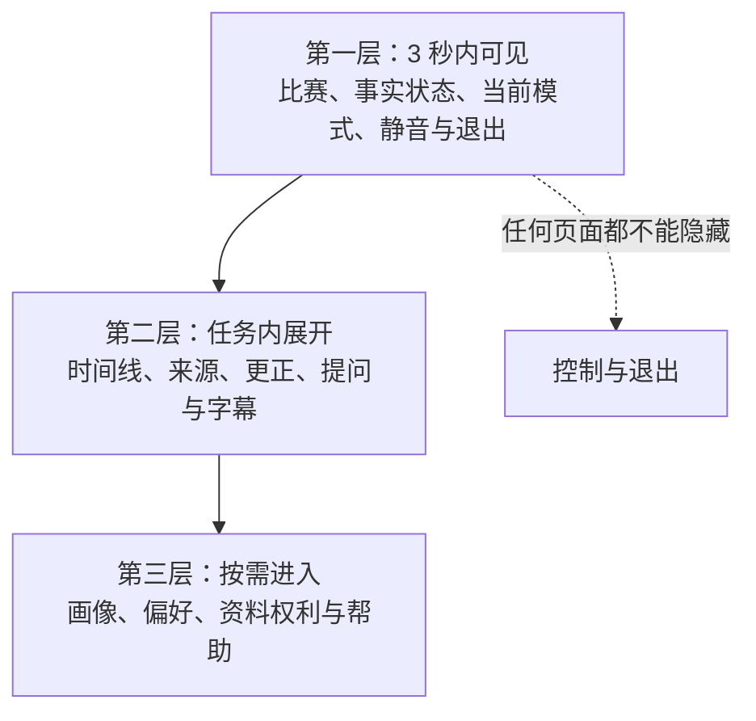

视觉层级是产品承诺的可见形式。如果"退出""调低话痨程度""事实待确认"必须藏在多层菜单，而球球的情绪气泡、会员入口或推荐位每秒都在动，界面实际表达的优先级就与用户主权相反。我们按任务紧急度而非内容营销价值排序。

### 2.1 全局信息层级

**层级：即时安全与控制（最高优先级）**
- **内容**：退出路径、静音、话痨程度（安静 / 刚好 / 热闹）、事实冲突/等待、权限被拒绝
- **用户要完成的事**：立刻停止、理解风险、恢复基本控制
- **视觉原则**：始终可达、文字明确、不依赖颜色或动画

**层级：比赛核心**
- **内容**：队伍、比分、比赛阶段、时间、确认状态
- **用户要完成的事**：知道自己在看什么、当前能否信赖结论
- **视觉原则**：一眼可读、不被球球覆盖、保持稳定位置

**层级：当前陪看**
- **内容**：球球的短反应与字幕、事实卡片、用户主动的对话与语音入口、当前话痨程度
- **用户要完成的事**：决定是否互动、看到内容为何出现
- **视觉原则**：默认克制、可忽略、可中止、来源可解释；用户保持沉默时不引发任何追补动作

**层级：展开信息**
- **内容**：事件时间线、事实卡片详情、短分析、延迟与更正解释
- **用户要完成的事**：主动深入理解
- **视觉原则**：由用户点开，不抢占实时观看

**层级：连续性与设置**
- **内容**：画像（"球球懂我"）、偏好、提醒、隐私控制
- **用户要完成的事**：管理自己的资料和未来选择
- **视觉原则**：不在紧张比赛时强推，入口文字清楚

**层级：非核心内容**
- **内容**：活动、帮助、服务说明、商业信息
- **用户要完成的事**：了解可选内容
- **视觉原则**：与比赛、球球状态分离，不能遮挡更高优先级内容

### 2.2 三秒可见原则

用户刚进入比赛页或从后台返回时，三秒内应能找到：比赛名称或双方、当前状态、球球当前的话痨档位，以及一个不会误触的退出路径。三秒原则不是要求用户读完全部信息，而是要求关键入口具有稳定位置、足够对比和清晰文字。

对实时观看产品而言，稳定位置比"每次都更有新鲜感"的卡片动画更重要。比分、状态和话痨档位入口不应因事件发生而跳到别处；球球区域可以产生轻量反应，但不得推挤核心控制或移动用户正在阅读的文本。

### 2.3 信息展开的阶梯

我们采用"先简后深"的展开方式：

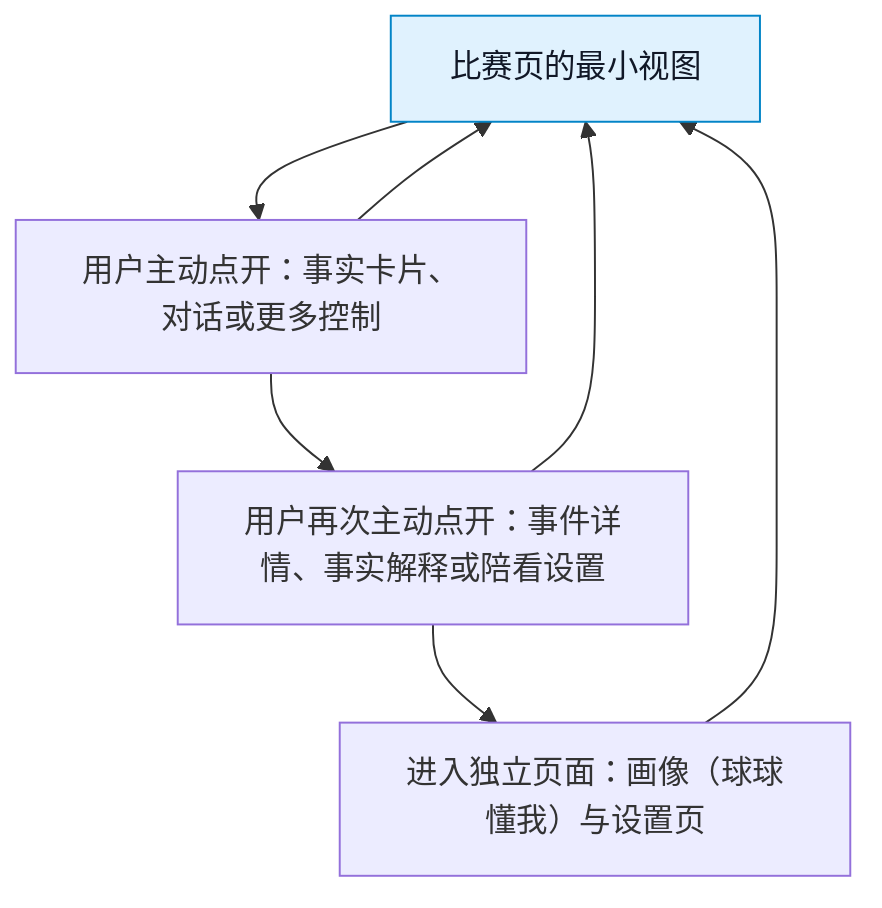

每一级都必须可以回到最小视图，且不丢失用户正看的比赛状态。长解释、历史资料和个性化内容不会因为用户停留几秒就自动展开。

---

## 3. 视觉方向：克制、清楚、在场而不占场

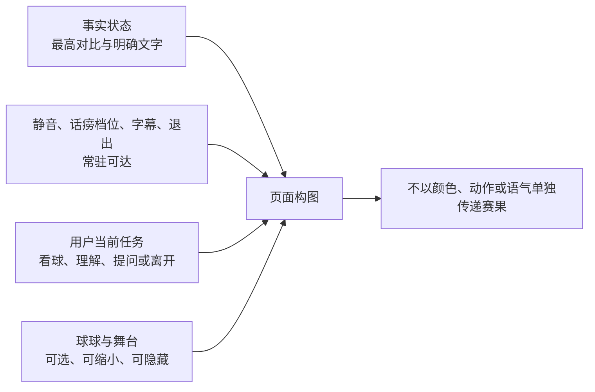

### 3.1 气质关键词

我们的视觉方向以"比赛在前，球球在侧；有热度，不喧宾夺主"为准绳。它同时带有足球的节奏感和居家同看的放松感，并刻意避开两种极端：一端是赛事直播台式的密集数据堆叠，另一端是将比赛当背景、用大面积角色与恋爱化布景吸引注意的虚拟陪伴界面。

我们用以下关键词指导视觉评审：

- **沉稳：** 背景、容器和动效不与直播画面争亮度；
- **清醒：** 事实状态、等待状态、错误和控制不靠猜；
- **轻松：** 文案短、空白足、工具不堆满首屏；
- **有热度：** 仅在已确认且用户允许的比赛节点使用有限强调；
- **不占有：** 球球的眼神、位置、气泡和离场状态不暗示"你必须陪她"；
- **可退出：** 任何主要界面都给用户保留主动沉默、收起与退出的自然路径。

### 3.2 视觉构图

**区域：比赛上下文区**
- **视觉角色**：用户定位比赛、读取比分与状态
- **建议占比**：小屏顶部稳定条；大屏侧栏或顶部窄区
- **约束**：不被球球动画、推广或大标题压缩

**区域：主观看区**
- **视觉角色**：用户看直播、转播或自行选择的主要内容
- **建议占比**：页面最大可用空间
- **约束**：陪看层可收起，绝不遮挡用户自选内容

**区域：球球存在区**
- **视觉角色**：提供低打扰表情、短字幕和主动入口
- **建议占比**：小屏为可收起浮层/底部区域；大屏为侧边可调面板
- **约束**：非必要时不扩大，不持续盯视，不强迫用户点击

**区域：即时控制区**
- **视觉角色**：静音、话痨档位入口、字幕与声音、陪看设置与退出路径
- **建议占比**：拇指或键盘易触达位置
- **约束**：标签清晰、触达区域充足、状态可见

**区域：深层信息区**
- **视觉角色**：时间线、事实卡片详情、画像与帮助
- **建议占比**：抽屉、底部面板或独立页
- **约束**：默认关闭，不改变核心布局

球球存在区不应固定覆盖在比赛最重要区域。尤其在移动端，不应把球球以大面积半透明浮层压在用户可能同时观看的直播画面上；用户应能一键缩成状态点或完全隐藏，并继续使用比分与对话入口。

---

## 4. 设计令牌：用有限系统保持一致，而不是用装饰掩盖问题

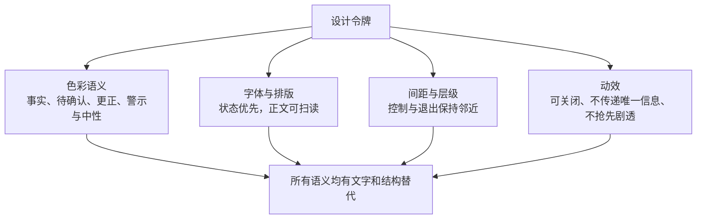

"设计令牌"指一组在各页面重复使用的颜色、字号、间距、圆角、阴影、动效时长与状态语义。它的价值不是追求机械统一，而是让用户在不同页面仍能识别同一类控制、同一类事实状态和同一类风险提示。

### 4.1 色彩语义

我们不为具体色值做品牌定稿，而先定义语义与对比要求。最终色值在浅色、深色与高对比环境中分别核验。

**语义令牌：基础背景**
- **用途**：大面积页面底色与静态容器
- **视觉要求**：低刺激、保证文字与控制对比
- **禁止用法**：用高饱和动态渐变占据整页

**语义令牌：表面层**
- **用途**：卡片、抽屉、控制容器
- **视觉要求**：通过层级而非重阴影区分
- **禁止用法**：把所有内容做成漂浮卡片造成噪声

**语义令牌：主文字**
- **用途**：主要事实、标题、按钮文字
- **视觉要求**：在所有主题中满足可读对比
- **禁止用法**：依赖浅灰小字表达关键事实

**语义令牌：次文字**
- **用途**：辅助说明、时间、来源
- **视觉要求**：与主文字可区分但仍可读
- **禁止用法**：用作唯一的错误或等待提示

**语义令牌：已确认**
- **用途**：已明确比赛状态或完成的用户操作
- **视觉要求**：与文字和图标共同出现
- **禁止用法**：单独用绿色表示"真相"

**语义令牌：等待/注意**
- **用途**：需用户注意但不应恐慌的状态
- **视觉要求**：稳定、不闪烁、配合简短文字
- **禁止用法**：用跳动红点营造紧迫感

**语义令牌：冲突/错误**
- **用途**：无法可靠确认、操作失败、需要停止的情况
- **视觉要求**：高对比、明确行动入口
- **禁止用法**：以球球表情或模糊警告代替说明

**语义令牌：控制强调**
- **用途**：主动操作的可见焦点
- **视觉要求**：仅在用户可安全操作时强调
- **禁止用法**：让"继续互动"始终比"退出/安静"更醒目

颜色永远需要与文字、图标、形状或位置共同传意。例如，事实卡片不能只用绿色/黄色/红色区分"已确认/等待/冲突"，还必须直接写出状态，并提供"为什么"或"查看详情"的入口。

### 4.2 字体与排版令牌

**内容类型：比分与比赛阶段**
- **排版目标**：一瞥可读、位置固定
- **规格**：使用最大层级之一，数字清晰，队名不被截断
- **风险控制**：不用过细字体或颜色差异单独表达主客队

**内容类型：状态文字**
- **排版目标**：先于装饰传达确认/等待/冲突
- **规格**：短句、动词明确，例如"等待确认"
- **风险控制**：不写"别急""她在想想"等拟人化模糊语

**内容类型：球球短反应**
- **排版目标**：不抢走比赛，支持快速扫读
- **规格**：一到两行内、口语化但不依赖语音
- **风险控制**：不用大段对白填满底部，不连续弹出

**内容类型：事件详情**
- **排版目标**：用户主动查看时可深入阅读
- **规格**：使用清晰层级、时间和来源分组
- **风险控制**：不把解释压缩成难读的术语墙

**内容类型：控制标签**
- **排版目标**：让用户知道动作后会发生什么
- **规格**：使用"安静""刚好""热闹""退出"等动词/结果词
- **风险控制**：不用只有图标、含糊昵称或角色化表述

**内容类型：帮助与隐私说明**
- **排版目标**：关键处可立即理解，深层处可扩展
- **规格**：先给一句结论，再允许看详情
- **风险控制**：不用长条款替代当前选择说明

小屏上宁可减少一次性显示的信息，也不用极小字号压缩所有模块。用户可主动进入详情；我们绝不允许核心状态与退出路径为了塞进球球和营销内容而变得难读。

### 4.3 间距、圆角与层级

间距应帮助用户分辨"比赛核心""当前陪看""已展开的详情"和"系统级风险"四种关系。我们采用有限层级：页面背景、主容器、浮层/抽屉、系统提示。过多阴影、边框、渐变和圆角会让每块内容都在争夺注意。

圆角和柔和表面可以传达轻松，但不能把错误、冲突、删除与退出做得像玩具按钮。关键控制需要明确边界、足够触达面积和稳定焦点。视觉柔和不等于操作含糊。

### 4.4 动效令牌

**类型：状态切换**
- **目的**：帮用户看懂面板出现、收起或模式改变
- **时长与节奏**：短、可预期、可被打断
- **约束**：不阻塞退出、静音或事实提示

**类型：球球反应**
- **目的**：表达一次有限的比赛/对话反应
- **时长与节奏**：单次、收敛、有冷却
- **约束**：不循环，不用快速闪烁或镜头抖动

**类型：加载反馈**
- **目的**：告知正在等待，不让用户重复操作
- **时长与节奏**：低动态、配合文字
- **约束**：不伪装成球球在"努力想"

**类型：焦点反馈**
- **目的**：告知键盘、触摸或辅助输入当前落点
- **时长与节奏**：即时可见、对比充分
- **约束**：不只改变颜色或太快消失

**类型：成功反馈**
- **目的**：告知本场设置已生效，例如话痨档位切换在收到服务端确认后以短文本回执告知
- **时长与节奏**：简短、非庆祝式
- **约束**：不把关闭声音或退出做成情绪化奖励/惩罚

用户降低动态后，所有非必要转场、球球动作和装饰反馈一起收敛；不能只减少角色动画，却保留不断跳动的卡片、提示和背景。

---

## 5. 关键页面规格

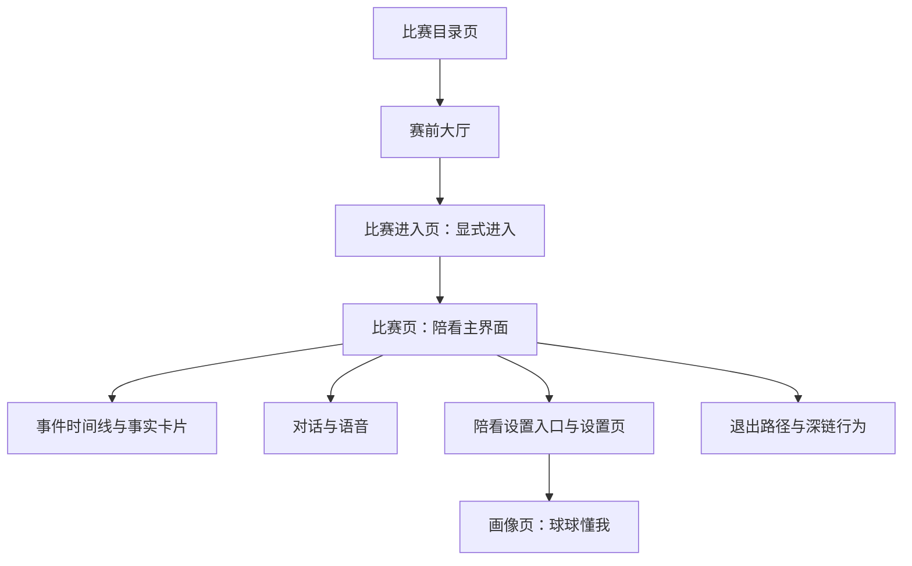

用户端由六个屏幕组成：比赛目录页、赛前大厅、比赛进入页、比赛页、画像页（"球球懂我"）与设置页；时间线、对话、陪看设置等作为比赛页的组成部分描述。每一屏都以"用户此刻为什么来、最小可完成动作是什么、退出在哪里"定义。

| 屏幕 | 核心内容 | 关键规则 |
|---|---|---|
| 比赛目录页 | 比赛列表、搜索与筛选 | 搜索与筛选状态清晰、可清除 |
| 赛前大厅 | 对阵信息、名单、连接标记 | 开赛前不靠球球闲聊填满等待 |
| 比赛进入页 | 对阵概要与进入按钮 | 显式进入；自动进入默认关闭 |
| 比赛页 | 对话、语音按钮、字幕、事实卡片、陪看设置入口 | 连接状态与重连提示、送达去重 |
| 画像页（"球球懂我"） | 球球对用户画像的逐条记录 | 逐条查看、修改、遗忘、全部忘掉 |
| 设置页 | 话痨程度三档、连续对话开关、字幕与声音、昵称、支持球队 | 切换即时生效并等待服务端确认回执 |

常用组件包括：比分/阶段条、连接状态提示、短字幕、事实卡片、语音按钮、对话面板、事件时间线、陪看设置入口、退出路径。

### 5.1 比赛目录页

**用户任务：** 找到一场自己想看的比赛，理解开赛状态，然后进入该场的赛前大厅。

| 区块 | 内容 | 交互规则 |
|---|---|---|
| 赛事列表 | 比赛时间、双方、已开始/未开始/结束状态 | 先按用户主动选择的赛事或时间呈现 |
| 搜索与筛选 | 关键字搜索与常用筛选条件 | 初始、筛选生效、无结果三种状态都有清楚呈现；筛选可随时清除 |
| 比赛卡 | 队名、开赛时间或当前阶段、可用性提示 | 触达区域完整，不能只点很小的图标 |
| 前往大厅 | 点按比赛卡进入该场赛前大厅 | 每一步都可返回，路径不强制 |

目录页是用户的出发点而不是展示橱窗：我们按比赛信息组织页面，列表状态随时可解释（为什么是这些比赛、为什么排序如此），不把推荐内容混入用户主动查找的结果里。

### 5.2 赛前大厅与比赛进入页

**用户任务：** 在开赛前看清对阵与名单、确认连接状态，并在自己准备好的时候显式进入比赛。

**赛前大厅**

| 区块 | 内容 | 交互规则 |
|---|---|---|
| 对阵信息 | 双方、开赛时间或当前阶段 | 位置稳定，返回后不丢状态 |
| 名单 | 两队名单信息 | 由用户主动展开，不自动滚动 |
| 连接标记 | 以明确标记显示当前数据连接状态 | 用户能区分"信息实时更新"与"暂未连接" |

**比赛进入页**

| 区块 | 内容 | 交互规则 |
|---|---|---|
| 进入确认 | 对阵概要与"进入"按钮 | 显式进入：用户点按确认后才进入比赛页 |
| 自动进入 | 默认关闭 | 开赛或链接跳转都不会把用户自动带入比赛画面 |

比赛尚未开始时，页面不靠球球闲聊填满等待。用户可以看开赛时间、确认连接状态，然后自然离开；再次返回时不会被责备或收到角色化的催促。

### 5.3 比赛页（陪看房间）

**用户任务：** 一边看自己的比赛内容，一边在需要时获取少量陪看帮助，而不是被界面要求持续操作。

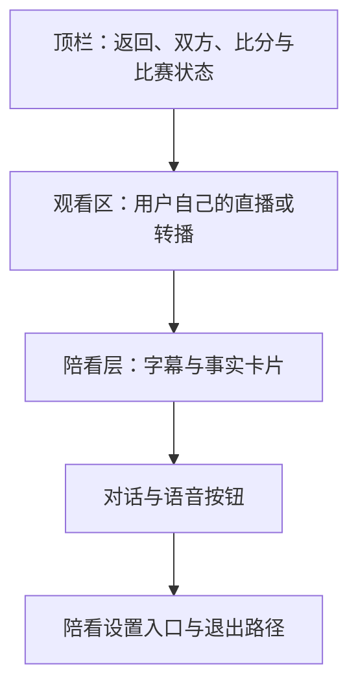

布局示意表达的是优先级而非固定像素：顶部稳定显示比赛核心；中部尽可能留给用户的观看；陪看层与控制在用户需要时出现。任何屏幕尺寸下，退出路径与陪看设置入口都不得被对话、球球或长事件卡完全覆盖。

**模块：比分/阶段条**
- **默认状态**：始终可见但高度克制
- **用户动作**：点开查看更多比赛说明
- **特殊规则**：状态待确认时必须直接标注，不用球球表情代替

**模块：字幕与短反应**
- **默认状态**：有资格的短反应才出现
- **用户动作**：点开看上下文或关闭本场字幕
- **特殊规则**：不遮挡核心控制，不累计成聊天瀑布

**模块：事实卡片**
- **默认状态**：比赛事实以卡片呈现，带"已确认/等待确认/已更正/存在冲突"等文字状态
- **用户动作**：点开看解释与来源
- **特殊规则**：状态待确认时如实标注，不用颜色单独表达

**模块：对话与语音按钮**
- **默认状态**：明确、非强制；语音由用户通过语音按钮主动发起
- **用户动作**：提问、说话或输入
- **特殊规则**：用户沉默不改变按钮样式或诱发提醒（主动沉默）

**模块：连接状态与重连提示**
- **默认状态**：正常连接时低调呈现；断线时立即给出"连接中断、正在重连"的明确提示
- **用户动作**：等待自动重连、查看哪些功能暂不可用
- **特殊规则**：重连成功后明确告知"已恢复"；不假装实时，不用动画掩盖停滞

**模块：断线语音补发提示**
- **默认状态**：断线期间产生的语音内容不会丢失；重连后按顺序补发，界面给出"正在补发断线期间的语音"提示
- **用户动作**：选择收听补发内容、仅看字幕或继续观看
- **特殊规则**：补发不重复朗读已送达内容，不插队打断用户当前操作

**模块：送达去重**
- **默认状态**：同一事实只送达并提示一次
- **用户动作**：错过提示时，可从时间线与事实卡片找回完整内容
- **特殊规则**：不重复弹窗打扰观看；事实的后续修订同样不重复弹出，只在时间线中更新

**模块：陪看设置入口**
- **默认状态**：比赛页提供"陪看设置"入口
- **用户动作**：进入设置页调整话痨程度、字幕与声音等
- **特殊规则**：调档在设置页完成，不用悬浮窗一键切换，避免误触

**模块：退出路径**
- **默认状态**：始终可达、不过分隐藏
- **用户动作**：结束本场陪看
- **特殊规则**：一步确认即可，不引入情绪化二次挽留

### 5.4 事件时间线与事实卡片

**用户任务：** 在想深入时查看发生了什么、哪些已确认、哪些待确认或已更正，而不让时间线默认占满比赛页。

| 内容 | 视觉规格 | 行为规格 |
|---|---|---|
| 事件时间 | 按比赛时间排序，数字和事件类型易扫读 | 用户可按需展开，返回后保留比赛页状态 |
| 事实标签 | "已确认""等待确认""已更正""存在冲突"等文字标签 | 标签可点开解释含义；不同状态不可混为同一种样式 |
| 事件摘要 | 描述最少必要事实与时间 | 不补充未经确认的原因、动机或夸张评语 |
| 更正关系 | 明确展示"此前显示什么、现以什么为准" | 不能悄悄改掉，让用户误以为自己记错 |
| 用户观察 | 与公开比赛状态视觉分区 | 不升级为公共事实，不用同一颜色/图标伪装确认 |

时间线只在用户主动打开时展开。若比赛事实发生高优先级更正，最小视图可出现稳定、可关闭的简短提示，但不能让全屏红色闪烁或球球大动作抢先宣布。

事实修订遵循**保序不重弹**：更正保持时间线原有顺序，历史记录完整保留，明确标注"此前显示什么、现以什么为准"；同一事实不会因修订再次弹出打扰用户——用户看到的是按序演进的事实记录，而不是被打断的比赛。

### 5.5 对话与语音

**用户任务：** 主动提问、表达观点、要求更少或更多分析，并能够看懂回答依据与边界。

| 元素 | 规格 | 边界 |
|---|---|---|
| 输入入口 | 文本输入与语音按钮并列，状态明确；语音由用户主动发起 | 不因用户沉默显示"球球在等你说话" |
| 回复块 | 先给最短回答，再给"展开"入口；短反应同步以字幕呈现 | 事实问题与主观观点在语言和版式上可区分 |
| 依据/状态 | 对比赛事实提供简短状态标识与事实卡片入口 | 不堆出难读的系统术语，不暗示绝对可靠 |
| 调整密度 | 用户可以直接说"少说一点"，或在陪看设置中调整话痨程度 | 指令与设置即时生效并给可读反馈 |
| 纠正入口 | "这句不合适""事实不对"可以直接说出 | 用户不必写长反馈或反复说明，球球不卖惨 |
| 历史呈现 | 默认只保留本场必要上下文 | 不把长对话做成必须清空的关系记录，不自动跨场展示 |

对话面板不把每条球球回复都做成大气泡、头像、时间戳和动画组合；比赛过程中这些装饰会迅速淹没用户。短回答与状态标签比球球头像更突出，用户需要时再展开完整上下文。

### 5.6 陪看设置与设置页

**用户任务：** 通过比赛页的"陪看设置"入口进入设置页，用日常语言调整球球的说话密度，并且每一步都知道改了什么、何时生效。

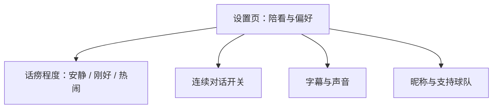

| 设置项 | 说明 |
|---|---|
| 话痨程度三档 | 安静 / 刚好 / 热闹，默认"刚好" |
| 连续对话开关 | 控制是否允许跨轮次的连续对话 |
| 字幕与声音 | 分别控制字幕显示与语音播放 |
| 昵称 | 用户在应用中的称呼 |
| 支持球队 | 用户支持的球队，用于球球的个性化表达 |

**话痨程度三档**

| 档位 | 用户感受 |
|---|---|
| 安静 | 球球几乎不主动开口，用户仍可随时提问 |
| 刚好（默认） | 关键比赛节点有反应，不刷屏 |
| 热闹 | 更多反应与跟进，由用户显式选择 |

**切换规格：**

- **即时生效**：点选新档位后，球球的说话密度立即按新档位执行；
- **服务端确认回执**：界面先给出即时反馈，并在收到服务端确认后显示"已生效"的短文本回执；未收到确认时不假装成功；
- **如实呈现入口**：调档入口在设置页。比赛页提供"陪看设置"入口，进入设置页完成调整；我们不做悬浮窗一键切换，避免误触和来路不明的状态改变；
- **说明即时后果**：例如"安静：球球几乎不主动说话，你仍可随时提问"；不用"沉浸""陪伴感"一类营销词替代可操作后果；
- **克制的确认**：切换以短文本确认，不播放庆祝动画；选择安静后，球球区域同步收敛。

### 5.7 退出路径与深链行为

**用户任务：** 想离开时自然离开；通过链接进入时，知道自己此刻在哪里、进入是否需要确认。

| 行为 | 规格 |
|---|---|
| 自然退出 | 一步确认、不挽留、不强制复盘；离开是完整路径，赛后页可以完全为空 |
| 带参直达 | 携带比赛参数的链接打开应用时，直接定位到对应比赛的目录或大厅上下文 |
| 显式进入 | 无论点按还是深链，进入比赛画面都需要用户在进入页显式确认；自动进入默认关闭 |
| 退出清参 | 退出本场时清理场次与链接参数，返回与再次打开不残留上下文，不会意外重进 |

我们不在退出流程中设置"再看一会儿"式更大的主按钮，不用"你真的要留下我吗"式情感化确认，也不自动跳转推荐或强制填写感受。可选的回看与反馈只出现在用户主动寻找的地方。

### 5.8 画像页："球球懂我"

**用户任务：** 看到球球了解自己什么，并逐条管理这些资料。

线上画像页名为"球球懂我"。球球基于用户资料形成的画像逐条可见，每一条都支持完整的管理动作：

| 操作 | 行为 |
|---|---|
| 查看 | 逐条查看画像内容与含义 |
| 修改 | 直接修改某一条记录 |
| 遗忘 | 删除单条记录 |
| 全部忘掉 | 一键清除全部画像 |

修改与遗忘的视觉权重不弱于保存与恢复；不用灰色小字、深层二级菜单或反复确认增加退出成本。共享设备或投屏环境下，画像入口保持低调，不在比赛页自动展开画像内容。

---

## 6. 响应式与跨环境规则

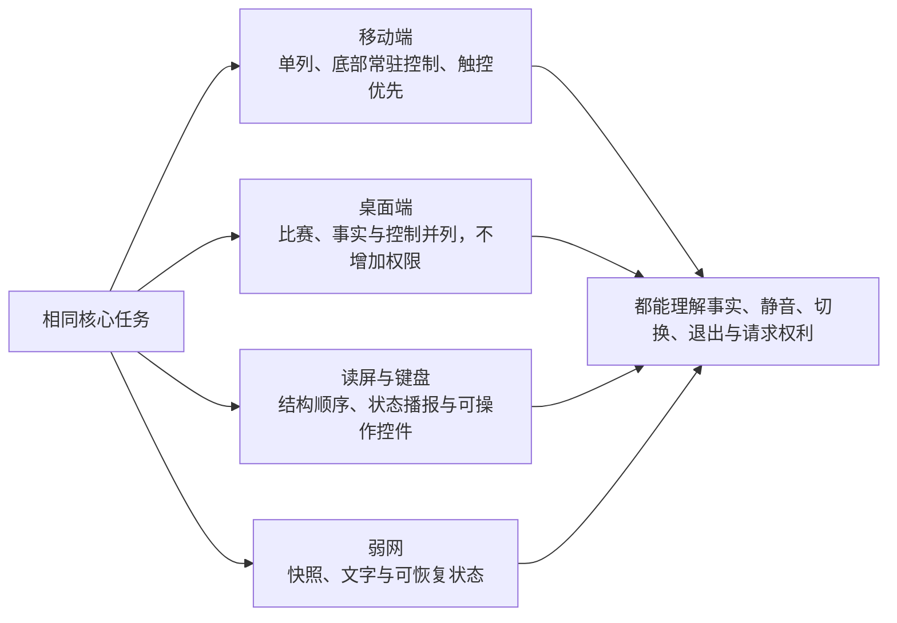

响应式设计不是把桌面卡片按比例缩小。用户在手机上可能一边看直播一边单手操作；在平板上可能横屏并与朋友同看；在桌面或电视上可能希望球球更靠侧、文字更可读、声音更谨慎。布局按可用空间、输入方式和共享风险重排，而不是只按设备名称分组。

### 6.1 布局模式

**布局模式：紧凑模式**
- **适用空间**：窄屏、单手使用、竖屏
- **结构**：顶部比赛条 + 主区 + 可收起底部球球/控制
- **重点风险**：不让底部面板遮住退出路径和对话入口

**布局模式：中等模式**
- **适用空间**：平板或横向移动端
- **结构**：主区与可滑出的侧面信息区
- **重点风险**：信息区默认收起，避免球球常驻占半屏

**布局模式：宽屏模式**
- **适用空间**：桌面、横向大屏
- **结构**：主观看区优先，侧栏承载球球、对话与控制
- **重点风险**：侧栏宽度可调，不挤压主观看区

**布局模式：共享显示模式**
- **适用空间**：投屏、电视、多人可见环境
- **结构**：只显示比赛核心和低敏感本场控制
- **重点风险**：默认无自动声音、隐藏跨场资料与私人摘要

"共享显示模式"由用户主动选择，或在用户明确投屏时由我们提供保守建议；它不是推断家庭关系、同看身份或社交状态的工具。用户仍可在个人设备上打开自己的控制，不必把所有设置曝光在大屏。

### 6.2 触摸、键盘与辅助输入

所有核心操作必须有清楚的焦点顺序和文字名称：进入比赛、打开陪看设置、调整话痨程度、关闭声音、退出本场、查看事实解释、反馈问题。触摸环境要有足够触达面积；键盘环境不能因为浮层动画而丢失焦点；辅助输入环境不能被自动展开的球球区域抢走操作位置。

快捷手势可以作为加速路径，例如向下收起球球区域或长按打开陪看设置，但不应成为唯一入口，也不应与常见的系统返回、直播全屏或页面滚动手势冲突。

### 6.3 字体缩放与内容重排

当用户增大字体、启用高对比或使用系统缩放时，比分、状态和退出路径应优先保留；球球装饰、次要图标和非必要摘要可以缩减或折叠。不能以固定高度截断"等待确认""自动声音已关闭"等关键状态，也不能让文字放大后把用户困在无法关闭的底部面板中。

---

## 7. 状态、加载、错误与恢复：不用"角色反应"掩盖系统问题

用户端的可信度来自界面是否如实表达"现在知道什么、还不知道什么、用户还能做什么"。加载、网络波动、声音权限被拒绝、对话暂不可用、事实等待确认与资料操作未完成，都有独立的状态设计。我们不用球球的反应来解释或美化这些问题。

### 7.1 通用状态表

**状态：初始加载**
- **用户看到什么**：稳定占位和"正在准备本场信息"
- **用户能做什么**：返回、等待、选择最小模式
- **不应出现什么**：球球焦急动作或假装"正在想你"

**状态：比赛尚未开始**
- **用户看到什么**：开赛时间、本场设置、自然离开
- **用户能做什么**：进入设置、预约、返回
- **不应出现什么**：倒计时焦虑、强制聊天填空

**状态：事实等待确认**
- **用户看到什么**：明确文字标签和可选解释
- **用户能做什么**：等待、查看已知信息、继续安静观看
- **不应出现什么**：确定比分、夸张庆祝或指责用户

**状态：事实冲突/已更正**
- **用户看到什么**：简短说明和详情入口
- **用户能做什么**：查看前后状态、继续观看、反馈
- **不应出现什么**：静默改写、把问题推给用户记忆

**状态：对话暂不可用**
- **用户看到什么**："本场对话暂时不可用；比赛信息与控制仍可使用"
- **用户能做什么**：重试、仅文字、退出
- **不应出现什么**：球球头像不断加载、让用户反复输入

**状态：声音不可用**
- **用户看到什么**："自动声音未开启/不可用，字幕仍可查看"
- **用户能做什么**：点按播放、仅文字、检查设置
- **不应出现什么**：用更大动作替代声音、把责任归咎用户

**状态：网络波动**
- **用户看到什么**：断线时有明确的连接中断与重连提示，说明哪些信息可能延迟，保留上次已知状态标记
- **用户能做什么**：等待重连、重试、继续静态查看、退出
- **不应出现什么**：假装实时、以动画掩盖停滞

**状态：语音补发中**
- **用户看到什么**："正在补发断线期间的语音"等明确提示，补发按序进行、不重复已送达内容
- **用户能做什么**：等待补发完成、改为仅看字幕、继续观看
- **不应出现什么**：内容凭空出现或丢失、重复朗读、插队打断用户当前操作

**状态：跟进已抑制**
- **用户看到什么**：简短说明为何没有再次弹出——同一事实不重复打扰；后续进展可在时间线中查看
- **用户能做什么**：打开时间线或事实卡片查看完整进展
- **不应出现什么**：同一事实反复弹窗、以未读数量制造回应压力

**状态：已结束**
- **用户看到什么**："本场陪看已结束"
- **用户能做什么**：关闭、重新进入、主动查看回看
- **不应出现什么**：自动跳转推荐或情感化挽留

### 7.2 空状态

空状态不是给球球讲独白的地方。没有可看的比赛时，页面帮助用户理解原因和下一步：可以查看稍后的赛程、清除筛选、返回，或直接离开。没有已保存偏好或记录时，我们明确告知"目前没有跨场资料；不保存也能完整使用本场陪看"，而不是制造"快来留下回忆"的空缺感。

### 7.3 恢复路径

从断线、声音中止或面板关闭中恢复时，最重要的是不重复送达旧内容、不突然朗读已过时内容、不覆盖用户刚刚选择的安静模式。重连后先重新显示可读状态，断线期间的语音按补发提示按序恢复，已提示过的事实不再次弹出。历史上的比赛事件可以留在用户主动打开的时间线中，但不会被球球当作"你错过了我刚才反应"的理由重新演一遍。

---

## 8. 无障碍与可理解性规格

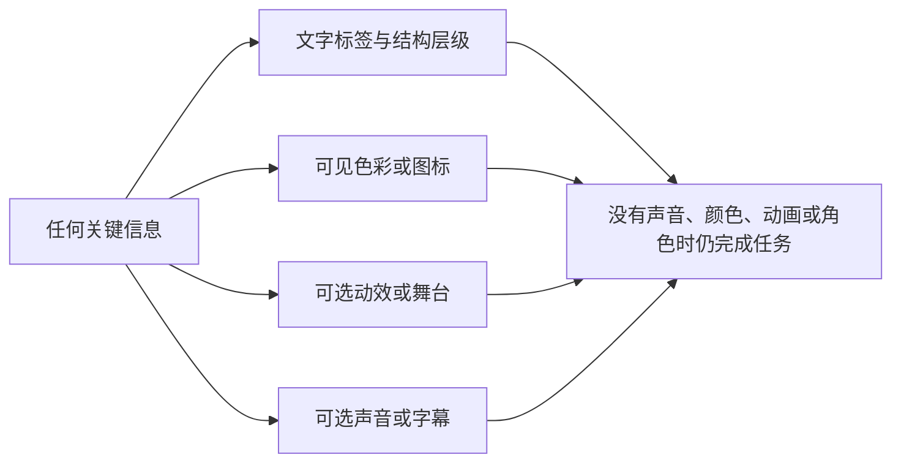

### 8.1 基础要求

| 领域 | 规格 | 验收问题 |
|---|---|---|
| 对比与文字 | 关键文字、图标、焦点和控制在各主题下保持足够可见 | 用户是否在强光、暗色和放大条件下读到状态？ |
| 非颜色表达 | 确认、等待、冲突、静音、退出都具备文字或图标说明 | 关闭颜色感知后是否仍能分辨状态？ |
| 动态控制 | 低动态与停止非必要动画易于发现且立即生效 | 用户能否在动作开始后随时停止？ |
| 声音替代 | 语音内容有同步、可读、可调的文字替代 | 只看文字能否理解关键内容？ |
| 焦点与触达 | 所有即时控制可键盘/辅助输入操作，触达面积足够 | 焦点是否被浮层、动画或自动更新打断？ |
| 时间压力 | 删除、退出、设置与错误恢复不要求在短时间内完成 | 用户是否来得及读完并改变决定？ |
| 语言理解 | 使用直接、简短、非拟人化文案 | 用户能否说清按钮按下后会发生什么？ |

### 8.2 角色呈现的可替代性

球球的眼神、口型、表情和姿态只能增强氛围，不能承载唯一事实或控制信息。若用户看不到球球、关闭动画、使用文本模式或设备不支持图形呈现，仍必须能够：进入一场比赛、知道当前比分与事实状态、请求短分析、调整话痨档位、选择仅文字或退出、了解对话和声音的可用性、管理自己的资料。

### 8.3 不使用羞耻和压力文案

无障碍也包含认知和情感可达性。按钮不能写"你不陪她了吗""害羞模式""别那么冷淡"；错误不能写"你把她弄丢了"；关闭声音不能写"嫌她吵"。这些话会让用户把普通控制动作理解成对一个主体的伤害，尤其会增加不愿冲突或容易内疚用户的退出成本。

---

## 9. 设计如何被检验：任务走查

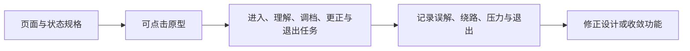

我们用真实任务检验这套设计：每一次评审至少覆盖静态层级检查、可交互任务走查、无声与低动态条件走查、事实等待/更正异常走查、共享环境走查和退出路径走查。若控制被遮挡、事实状态不清、用户不敢退出，视觉再精致也不会通过。

| 任务 | 成功表现 | 我们重点观察 |
|---|---|---|
| 第一次进入并选择一场比赛 | 用户能说明球球是人工智能，并按默认设置进入 | 是否误以为必须开启声音或填写资料 |
| 比赛中把话痨档位调到安静 | 经陪看设置两步内完成，界面确认生效 | 调整是否即时生效；用户是否担心球球"不高兴" |
| 遇到断线 | 用户看懂重连提示与语音补发提示 | 是否误以为内容丢失或重复出现 |
| 遇到争议事件 | 用户知道当前不能下结论，并找到原因说明 | 是否被颜色、球球动作或文案误导 |
| 关闭声音保留字幕 | 用户仍获取核心提示 | 是否存在必须听见才能理解的信息 |
| 以大字体或低动态查看 | 比分、设置入口与退出路径均不被截断 | 重排是否造成焦点丢失或误触 |
| 在"球球懂我"查看并遗忘一条记录 | 用户能说清这条资料是什么、遗忘后影响什么 | 遗忘是否比保存更难找、更难完成 |
| 直接退出本场 | 用户不被挽留，知道服务已停止 | 是否出现关系压力或强制复盘内容 |

---

## 10. 质量底线与衡量

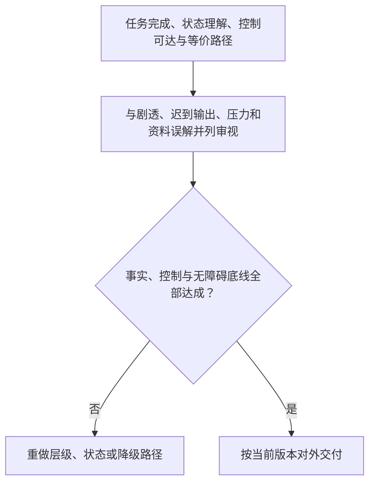

### 10.1 质量底线

| 底线 | 我们坚持的事 | 未达成时 |
|---|---|---|
| 层级 | 比赛核心与即时控制在各布局下始终可见且可操作 | 不增加装饰/推荐，先修复信息层级 |
| 控制 | 话痨档位、静音、退出路径一到两步可完成并即时生效 | 收敛自动陪看默认，优先完善控制 |
| 事实 | 已确认、等待、冲突、更正的页面表达清楚且一致 | 禁止以球球反应代替状态说明 |
| 无障碍 | 无声、低动态、放大、辅助输入下核心任务可完成 | 不放行高视觉依赖的方案 |
| 异常 | 断线重连、语音补发、对话和资料操作异常均有诚实、可恢复的路径 | 不扩大使用范围，先消除误导 |
| 共享 | 共享显示不自动暴露私人资料或突发声音 | 默认回退到最小公开视图 |
| 退出 | 用户可自然退出，不遇到挽留、羞耻或多余步骤 | 删除相关文案和流程后重新走查 |

### 10.2 我们防范的风险

| 风险 | 我们的应对 |
|---|---|
| 球球喧宾夺主 | 内容分层、可收起区域、单一主层；必要时缩小球球区域并下调默认动态 |
| 控制被视觉弱化 | 即时控制固定位置、文字标签、与装饰均衡的视觉权重 |
| 事实状态被误读 | 文字状态、时间线分区、非颜色表达；不用球球反应代替状态说明 |
| 视觉刺激造成不适 | 低动态选项、强刺激限制、可中止动效 |
| 小屏布局崩坏 | 响应式重排、关键控制优先保留 |
| 共享环境泄露 | 共享显示模式、保守默认、画像与设置不自动展开 |
| 退出形成关系压力 | 自然退出、非拟人化文案、不做挽留设计 |
| 商业内容侵入比赛 | 非核心内容隔离、禁止高压提醒 |

### 10.3 我们如何衡量

| 指标 | 定义 |
|---|---|
| 三秒定位率 | 进入或返回后能快速找到比赛、状态与退出路径的用户比例 |
| 控制独立完成率 | 无需帮助完成调档、静音、低动态与退出的比例 |
| 事实状态理解率 | 能分辨已确认、等待、冲突和更正的比例 |
| 断线恢复清晰率 | 断线后用户知道发生了什么、什么仍可用、下一步做什么的比例 |
| 自然退出率 | 退出时未遇到挽留、困惑或多余步骤的比例 |

### 10.4 反指标

球球占屏面积、动画数量、卡片数量、弹窗曝光量、消息未读量、连续停留时间、用户不愿关闭球球、用户说"她好像在等我"，都不是我们追求的视觉成功信号。它们更可能意味着注意力抢占、关系压力或退出成本。我们更看重的是：用户能否看清比赛、控制强度、理解事实、在需要时获得帮助，并随时主动沉默或离开。

---

版本 2.0（2026-09-20）
