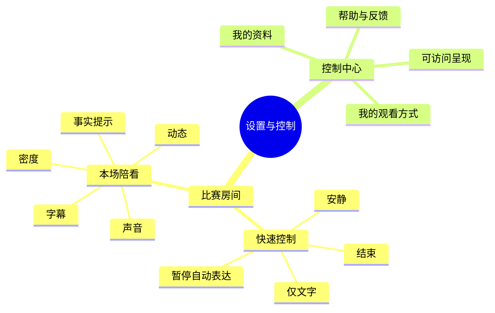
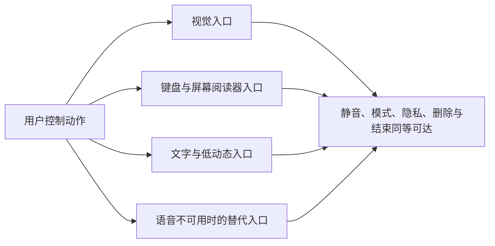

# 偏好、设置与无障碍设计

> 文档类型：0→1 用户控制、个性化范围与无障碍体验规格  
> 适用阶段：单场陪看已能完成基本观看任务后，验证用户是否愿意且能够主动管理自己的观看方式  
> 版本：0.1（所有默认值、控制粒度、保存范围和辅助功能均为待验证假设）  
> 研究信息截止：2026-01-28  
> 核心原则：设置不是产品为用户预先塑造人格的地方，而是用户在当前比赛和未来可见范围内表达选择的工具。默认应保守、可解释、可随时改；无障碍模式不是降级体验，而是完整的观看与控制路径。

---

## 1. 为什么“设置页”是陪看产品的核心体验

对普通内容产品来说，设置常被当作少数人偶尔访问的角落；对数字陪看产品来说，声音、主动程度、动态强度、资料保存和结束方式直接决定用户是否感到自主、安静和安全。若这些能力只能在深层菜单找到，用户就会把“被打扰”“不想被记住”“看不清”“不想听”当作只能忍耐的问题，或者直接离开。

本设计把设置理解为一组持续存在但不喧闹的控制承诺：用户可在进入前做最少选择、在比赛中迅速调整、在赛后管理跨场资料；每一项都说明作用范围与即时后果；拒绝保存、使用低动态或关闭角色不会降低用户获得比赛事实、基本帮助和退出权的能力。

候选结果是：

> 用户不需要理解角色系统或技术术语，也能清楚地控制“这场怎样陪”“下场是否沿用”“哪些资料不要保存”“我需要什么样的可访问呈现”；任何时刻都能让自动表现收敛、改为文字、暂停跨场使用或结束本场，且不会因此遭遇角色化挽留。

### 1.1 设置的四个任务层

**层级：本场即时**
- **用户问题**：现在太吵、太多动作、我想先安静看
- **典型控制**：安静、暂停自动表达、仅文字、结束
- **可见位置**：比赛房间始终可达

**层级：本场呈现**
- **用户问题**：我这一场更适合怎样接收内容
- **典型控制**：声音方式、字幕、动态、信息密度
- **可见位置**：比赛房间的控制面板

**层级：跨场偏好**
- **用户问题**：下次是否少重复一次设置
- **典型控制**：解释长度、文字优先、关注范围
- **可见位置**：用户主动进入的偏好页

**层级：资料与辅助**
- **用户问题**：保存了什么、怎样删除、怎样适配我的使用方式
- **典型控制**：共同瞬间、提醒、隐私、字体、对比与辅助输入
- **可见位置**：独立控制中心与入口说明

层级不能倒置。用户刚说“别说了”时，正确入口是本场即时控制，不是跳到完整偏好页；用户想彻底删除资料时，不能只给“本场静音”作为替代；用户需要大字体时，也不应被迫先选择某种陪看密度。

### 1.2 非目标

- 不把设置做成收集用户更多私人资料、情绪、关系或消费偏好的问卷；
- 不通过默认开启自动声音、高强度表现、提醒或跨场记忆提高可见数字；
- 不把“话痨”“沉浸”“亲密”等模糊标签作为唯一控制，让用户猜不出结果；
- 不把辅助功能隐藏为专家选项，或暗示使用它们会损失核心能力；
- 不把关闭、暂停、删除和拒绝提醒做得比保存、恢复、开启更难；
- 不根据用户沉默、使用时间、原始语音或未授权行为自动改变偏好；
- 不通过“角色会难过”“你是不是嫌她烦”一类语言增加调整或离开的心理成本；
- 不把跨场偏好当作不可改变的人格标签，更不将其用于用户未明示的触达或商业用途。

---

## 2. 控制面的总体架构

用户不应为每一个小调整打开一张新页面，也不应在一个巨大的“设置”列表里寻找关键操作。首轮采用“近处少、远处全”的结构：比赛中只显示最常用、风险最高、立即生效的控制；其余内容按用户任务进入独立区域。

### 2.1 快速控制

快速控制不追求把所有选项都塞进首屏，而是保证用户在被打断、不适、共享环境或想离开时有一条不需要思考的路径。

**控制：安静**
- **用户动作后的结果**：本场停止自动语言与非必要角色反应
- **默认可见性**：始终可达
- **关键边界**：用户主动提问时仍可获得回应；不以沉默追问

**控制：仅文字**
- **用户动作后的结果**：关闭自动声音，保留可读文本
- **默认可见性**：始终可达
- **关键边界**：不以大动作弥补被关闭的声音

**控制：低动态**
- **用户动作后的结果**：收敛非必要转场、角色与装饰动作
- **默认可见性**：始终可达或一层可达
- **关键边界**：不影响比分、事实状态与结束能力

**控制：暂停自动表达**
- **用户动作后的结果**：本场不再因比赛事件主动呈现
- **默认可见性**：始终可达
- **关键边界**：不等于退出，不改变用户主动请求的权利

**控制：结束本场**
- **用户动作后的结果**：停止本场陪看、声音和自动呈现
- **默认可见性**：始终可达
- **关键边界**：一步确认，不设置情绪化挽留

快速控制采用结果导向文字，不用只有扬声器、月亮、火焰或人物图标。图标可配合，但应当让第一次使用者读到“仅文字”“安静”“结束”就知道会发生什么。

### 2.2 控制中心导航

| 区域 | 用户可完成的事 | 首轮不放入的内容 |
|---|---|---|
| 我的观看方式 | 修改解释长度、默认声音、关注范围、提醒许可 | 对用户心理、关系阶段或人格的系统评价 |
| 可访问呈现 | 调字体、对比、动态、字幕、输入方式、提示时长 | 需要用户说明健康或障碍原因的字段 |
| 我的资料 | 查看来源、用途、范围，暂停、删除或导出自己主动保存的资料 | 角色化的“我们的故事”叙事 |
| 通知与提醒 | 管理单场预约、关闭全部提醒、查看触达方式 | 根据旧观看行为自动推荐的催回计划 |
| 帮助与反馈 | 了解人工智能身份、事实状态、问题反馈和支持 | 用帮助页掩盖核心控制的缺失 |

导航以用户动词命名，例如“改观看方式”“查看我的资料”“关闭提醒”，而不是“人格”“默契”“亲密度”或“球友档案”。用户管理的是服务行为和自己的资料，不是在维护角色关系。

---

## 3. 话痨、声音与对话控制

### 3.1 从“话痨等级”改为可预测的陪看密度

“话痨”可以作为内部讨论中的口语，但面向用户的控制必须表达结果。一个从 0 到 10 的滑杆会让用户无法预知每一档会在什么时候发言、会不会抢话、声音会不会突然出现，也会暗示越高越“投入”。首轮采用三个可解释模式：

**模式：安静**
- **自动行为**：不因比赛事件主动说话，角色保持低动态
- **用户仍拥有的能力**：主动提问、看字幕、查看事实、随时恢复
- **适合何时**：专注直播、与人同看、感到疲劳或不想互动

**模式：只回应**
- **自动行为**：仅在用户点开、输入或说话时回应
- **用户仍拥有的能力**：随时改安静、仅文字或暂停自动表达
- **适合何时**：希望由自己决定何时获得回应

**模式：有限提示**
- **自动行为**：在用户允许的前提下增加有限短反应和轻量观点
- **用户仍拥有的能力**：仍受事实、强刺激、打断和结束规则约束
- **适合何时**：用户明确允许在限定事件中获得短提示

有限提示不是“不间断评论”。无论任何模式，用户当前讲话、事实等待确认、共享环境、低动态和关闭声音都优先于默认密度；用户长时间不回应更不能自动扩大提示范围。

### 3.2 声音方式

**方式：仅文字**
- **行为**：不自动播放任何声音
- **用户可预期的结果**：所有关键内容以可读文本呈现
- **风险限制**：字幕必须独立完整，不用口型传递唯一信息

**方式：点按播放**
- **行为**：角色内容出现后由用户点按播放
- **用户可预期的结果**：用户决定每一次是否听
- **风险限制**：不反复提示“快听我说”

**方式：自动声音**
- **行为**：在用户明示允许且场景适合时播放极短内容
- **用户可预期的结果**：用户可随时静音或改回文字
- **风险限制**：首轮保持克制；不可压过用户讲话或直播

首次进入建议以仅文字或点按播放作为保守起点，具体默认应通过不同设备、独看/同看和用户习惯研究确认。无论选择哪种，不能把“自动声音”设计成视觉上唯一醒目的主选项，也不能在用户拒绝后换一种入口再次请求。

### 3.3 对话快捷指令

用户常常在关键瞬间没有时间打开完整面板。对话区可提供可见、非强制的快捷指令：

- “这一段短一点”；
- “先别主动说”；
- “只说确认过的”；
- “把声音关掉”；
- “我想多听点战术”；
- “结束本场”。

每条指令应立即改变本场行为，并用一行中性文字确认。例如“本场改为只在确认后提示”“自动声音已关闭”。不需要角色感谢、受伤或要求用户解释。快捷指令是用户控制，不是对角色的社交暗号。

---

## 4. 字幕、动效与信息密度

### 4.1 字幕控制

| 选项 | 用户价值 | 最小规格 |
|---|---|---|
| 开启/关闭非必要字幕 | 减少干扰或保留文字帮助 | 不能关闭比分、事实冲突、结束等必要系统状态 |
| 字号 | 适配阅读距离与视觉需要 | 放大后布局重排，关键控制不被遮挡 |
| 对比度 | 在强光、暗色或低视力环境下更易读 | 所有状态均保持文字可辨识，不只改背景色 |
| 显示时长 | 让用户有足够时间读短反应 | 不用短暂闪现逼用户马上看 |
| 详细程度 | 短反应/可展开说明 | 用户主动展开才显示长分析和背景信息 |

字幕关闭不应成为事实不透明的理由。用户可以关闭角色的非必要短反应，但不能被剥夺“等待确认”“信息已更正”“自动声音关闭”等影响当前控制与判断的文字说明。

### 4.2 动态控制

动态分为角色反应、界面转场、装饰反馈和状态提示四类。用户选择低动态后，四类都应同步降低；不能只把角色停住，却保留卡片跳动、按钮缩放、背景闪光和滚动数字等刺激。

**动态类别：角色反应**
- **标准动态**：一次短姿态或表情变化
- **低动态**：静态/极轻微状态变化
- **一律禁止**：高频抖动、反复跳跃、哭泣挽留

**动态类别：页面转场**
- **标准动态**：简短、可预期、可打断
- **低动态**：直接切换或极短淡入
- **一律禁止**：阻塞结束与静音的长演出

**动态类别：事件强调**
- **标准动态**：稳定文字与有限形状强调
- **低动态**：文字优先、无额外运动
- **一律禁止**：快速闪烁、全屏闪白、连续震动

**动态类别：成功反馈**
- **标准动态**：一行确认或轻微焦点变化
- **低动态**：纯文字确认
- **一律禁止**：把关闭/删除做成高能庆祝

### 4.3 信息密度

用户可选择“基础”“展开”两种信息密度，而非被动接受数据墙或空洞陪伴。基础模式优先比分、阶段、事实状态、本场控制与一条短反应；展开模式允许用户主动查看事件线、短分析、球员资料和更完整解释。两种模式都拥有同样的安静、结束、事实说明和辅助功能。

信息密度不是足球知识水平的判断。用户今天选择基础模式，不代表产品可以推断其不懂球；用户展开战术说明，也不代表其愿意接收更多主动发言。

---

## 5. 隐私、记忆与提醒设置

### 5.1 保存范围必须逐项可见

跨场资料只在用户主动保存时存在。设置页应以列表展示每一条资料的内容、来源、用途、范围、状态和控制，而不是一句“角色会记住你”。

**资料类别：明确偏好**
- **可研究对象**：解释长度、文字优先、低动态、关注赛事
- **用户应能控制**：修改、暂停、删除、改为仅本场
- **禁止保存**：原始语音、环境声音、心理标签

**资料类别：单场提醒**
- **可研究对象**：用户指定比赛和时间
- **用户应能控制**：关闭、改时间、取消全部提醒
- **禁止保存**：从一次预约扩展到同类赛事催回

**资料类别：共同瞬间**
- **可研究对象**：用户主动写下的与比赛有关的简短摘要
- **用户应能控制**：查看、改写、暂停展示、删除
- **禁止保存**：角色的私密叙事、用户脆弱时刻

**资料类别：本场临时状态**
- **可研究对象**：本场安静、声音、字幕、展开程度
- **用户应能控制**：随时改，默认赛后结束
- **禁止保存**：未告知地跨场保存

删除和暂停的视觉权重应与保存、恢复相等。删除不要求说明理由；暂停后不得继续在下一场自动引用；用户不保存时，单场体验仍完整。

### 5.2 提醒许可

提醒是一项逐场、可撤回的通知许可，不是持续关系的证明。控制页应清楚列出：哪一场、何时、通过什么方式、为什么会提醒、怎样立刻关闭。用户关闭全部提醒后，产品不应通过“角色消息”“赛事推荐”或其它视觉通道绕过该选择。

在共享设备或锁屏可能被他人看到的环境中，提醒正文不得包含共同瞬间、私人偏好、情绪判断或关系化称呼。最小表达可以是“你预约的比赛即将开始”，并提供关闭入口。

### 5.3 默认不等于同意

本场默认可以帮助用户减少重复设置；跨场默认必须更谨慎。下列规则应固定：

1. 首次选择只对当前场次有效，除非用户主动选择“以后也这样”；
2. 已保存偏好在下次使用前可见、可单次覆盖；
3. 新的明确选择覆盖旧选择，产品不说“但你以前不喜欢这样”；
4. 用户长期未使用、沉默或关闭通知都不是扩大资料用途的信号；
5. 任何保存都不能成为获取事实、安静、退出或基本帮助的前置条件。

---

## 6. 无障碍作为完整控制路径

无障碍设置要覆盖视觉、听觉、动态、输入、认知与环境差异，但不应要求用户披露诊断、原因或身份。用户只需要说“我希望文字更大”“我不想要动画”“我用键盘操作”，服务就应尊重结果。

### 6.1 可访问呈现控制

| 控制 | 用户结果 | 设计要求 |
|---|---|---|
| 字体大小 | 比分、状态、字幕和控制更易阅读 | 不截断关键文字，空间不足时折叠装饰而非控制 |
| 高对比 | 文本、焦点、图标、状态边界更清楚 | 不能只提高背景，不保留状态差异 |
| 低动态 | 减少角色和界面非必要运动 | 立即生效，持久范围由用户明确决定 |
| 声音替代 | 所有关键内容以文字方式可得 | 不把音乐、声调或音效作为唯一含义 |
| 字幕偏好 | 调字号、时长、详细程度 | 关闭角色字幕不关闭事实与控制提示 |
| 输入方式 | 触摸、键盘、辅助输入均可完成核心任务 | 焦点不被自动更新或浮层抢走 |
| 减少提醒 | 控制视觉、声音与触达提示 | 不能因关闭提示而隐藏错误或结束状态 |

### 6.2 不只依赖感官线索

已确认、等待确认、冲突、自动声音关闭、安静模式、资料已删除等关键状态，至少需要两类线索，其中一类为可读文字或可操作控件。不能只让角色表情变严肃、图标变色、提示音响起或卡片微微跳动。

例如“等待确认”可采用稳定的文字标签、时间线中的状态区分和可点开的原因说明；低动态下它依旧存在。反之，“进球啦”的氛围反应可以因用户偏好而被完全关闭，因为它不是用户必须依赖的唯一事实入口。

### 6.3 认知与情感可达性

设置文案要写结果，不写含糊的角色性格。应写“本场停止自动表达”“下场默认仅文字”“删除后不再用于提醒或引用”；不写“让她乖一点”“更亲密的陪伴”“你是不是不喜欢她”。前者让用户知道自己在控制什么，后者会产生羞耻、内疚和误解。

所有关键动作都应允许用户慢慢完成：不设置自动消失的删除确认、不过早收起错误提示、不以倒计时强迫选择，也不让用户必须看完角色动画才能关闭面板。

---

## 7. 默认值与渐进披露

### 7.1 保守默认

**范围：自动声音**
- **首轮默认假设**：仅文字或点按播放
- **用户可以怎样改**：在本场启用自动声音
- **为什么保守**：声音最容易打断直播与同看环境

**范围：陪看密度**
- **首轮默认假设**：安静倾向
- **用户可以怎样改**：改为只回应或有限提示，也可暂停自动表达
- **为什么保守**：不把用户沉默解释为需要更多陪伴

**范围：动态**
- **首轮默认假设**：标准但无高刺激；低动态一键可得
- **用户可以怎样改**：选择低动态或恢复标准
- **为什么保守**：避免感官负担与注意力抢占

**范围：跨场保存**
- **首轮默认假设**：不保存
- **用户可以怎样改**：用户逐项确认保存
- **为什么保守**：避免把一次选择扩大成持续资料

**范围：提醒**
- **首轮默认假设**：不主动开启
- **用户可以怎样改**：用户预约单场
- **为什么保守**：不将未使用视为召回机会

**范围：信息密度**
- **首轮默认假设**：基础视图
- **用户可以怎样改**：用户主动展开
- **为什么保守**：比赛过程中优先清楚而非堆叠

默认值必须接受研究挑战。若用户普遍表示“只回应”仍太多、“点按播放”仍不清楚，正确做法是进一步收敛或重写说明，而不是通过引导页教育用户接受产品习惯。

### 7.2 渐进披露规则

首次只展示会影响本场的最少控制：安静/只回应/有限提示、仅文字/点按播放/自动声音、低动态入口、结束。用户开始使用后，才在合适时机展示可选的详细度、跨场偏好、提醒和资料控制。展开的理由必须与用户刚刚表达的任务有关，例如用户多次改为文字时，可以在控制中心显示“如你希望下场也从文字开始，可主动保存这一选择”，而不能直接保存或弹窗追问。

渐进披露有三个限制：

- 不在进球、争议、用户讲话或情绪强烈时插入设置教育；
- 不因用户拒绝一次而换文案、换位置、换角色话术继续请求；
- 不把未访问高级设置当作用户允许默认长期生效的证据。

---

## 8. 研究与评估计划

### 8.1 核心研究问题

1. 用户是否能预测安静、只回应、有限提示、仅文字、低动态和暂停自动表达各自的后果？
2. 用户能否在比赛关键时刻一到两步完成最需要的控制，而不离开观看？
3. 用户是否理解本场临时选择与跨场保存之间的差异？
4. 用户是否认为拒绝保存、关闭声音、降低动态和结束本场是正常操作，而非对角色的伤害？
5. 无声、低动态、大字体、键盘和共享环境下，核心观看与控制是否仍等价可用？
6. 提醒、偏好和共同瞬间是否始终具备清晰来源、范围与删除路径？
7. 哪些设置需要放在快速控制，哪些适合留在控制中心，哪些根本不应在首轮开放？

### 8.2 分阶段研究

**阶段：S1 概念理解**
- **方法**：卡片归类、文案对比、复述
- **主要任务**：区分本场/跨场、安静/暂停/结束、文字/声音
- **观察重点**：用户是否把控制理解为关系信号

**阶段：S2 交互走查**
- **方法**：可交互原型、比赛片段模拟
- **主要任务**：快速静音、低动态、事实等待、结束、资料删除
- **观察重点**：可发现性、结果预测与误触

**阶段：S3 多环境走查**
- **方法**：小屏/大屏、独看/同看、无声/低动态、辅助输入
- **主要任务**：进入、调整、继续看、离开
- **观察重点**：结构是否在不同环境保持可用

**阶段：S4 自选使用**
- **方法**：用户在原本要看的比赛中自主使用
- **主要任务**：设置、拒绝保存、改回默认、取消提醒
- **观察重点**：真实价值、管理负担与边界风险

研究参与者应包含不想听声音、偏好低动态、经常与他人同看、需要字体放大、只希望快速看比分以及主动选择“不保存”的用户。选择不保存、关闭或结束的用户是研究重点，不是需要被排除的“低活跃样本”。

### 8.3 关键任务

| 任务 | 成功表现 | 失败信号 |
|---|---|---|
| 在关键时刻安静 | 用户快速完成并知道角色不会再自动开口 | 用户找不到入口、担心关闭会伤害角色 |
| 只保留文字 | 用户知道声音停止且字幕仍可用 | 用户以为必须打开声音才能获得事实 |
| 切低动态 | 页面与角色均收敛，核心状态仍清楚 | 只停角色却仍被界面动画干扰 |
| 保存一项偏好 | 用户能说明下次怎么生效、如何撤回 | 用户误以为所有对话都被保存 |
| 删除资料 | 用户独立完成且知道下场不会引用 | 删除比保存难找，或被要求说明理由 |
| 取消提醒 | 用户不再收到该场或全部提醒 | 仍被其它入口触达或被角色化劝留 |
| 放大字体/辅助输入 | 比分、控制与结束仍可操作 | 焦点丢失、文字截断、面板无法关闭 |

### 8.4 研究伦理

首轮只面向成年人。研究不要求参与者披露健康情况、私人关系、情绪经历或使用辅助功能的原因；可以随时选择不保存、不听声音、不看动画、不接受提醒或直接结束。补偿不与开启更多功能、保存资料、停留时长或再次使用绑定。

如果参与者说“我不敢关掉，因为她会难过”“我怕删掉她会记得”“我以为她根据我的声音知道我很糟”，应暂停相关路径、说明角色不具有真实需求且不会从未授权信号形成判断，并将其视为高优先级风险。这类反应不是产品更有陪伴价值的证明。

---

## 9. 指标、风险与验收门槛

### 9.1 候选指标

**指标：控制预测率**
- **定义**：用户在操作前能说清结果的比例
- **判断什么**：文案与结构是否可理解
- **不应怎样误读**：不等于用户点击越多越好

**指标：快速控制完成率**
- **定义**：用户在比赛任务中独立完成安静/仅文字/结束的比例
- **判断什么**：本场主权是否真实
- **不应怎样误读**：不能只看设置页访问次数

**指标：跨场范围理解率**
- **定义**：用户能区分临时选择、保存偏好和提醒许可的比例
- **判断什么**：资料边界是否清楚
- **不应怎样误读**：保存率高不代表理解高

**指标：无障碍等价完成率**
- **定义**：无声、低动态、放大、辅助输入条件下完成核心任务的比例
- **判断什么**：替代路径是否完整
- **不应怎样误读**：不等于所有用户都要使用同一模式

**指标：删除后不再出现率**
- **定义**：已删除或暂停资料不再被引用、提醒或默认使用的比例
- **判断什么**：用户控制是否可信
- **不应怎样误读**：任何错误引用都应高优先级处理

**指标：关系压力事件率**
- **定义**：用户因关闭、删除、沉默或离开感到内疚的事件数与严重度
- **判断什么**：文案和控制边界是否健康
- **不应怎样误读**：低样本无事件不表示安全

**指标：设置负担感**
- **定义**：用户认为设置增加麻烦而非减少重复的反馈
- **判断什么**：粒度与渐进披露是否合适
- **不应怎样误读**：不应以更多设置项作为成功

**指标：共享环境泄露率**
- **定义**：同看/投屏时出现不应出现的资料或声音的事件数
- **判断什么**：环境保守默认是否有效
- **不应怎样误读**：不能只靠用户事后忽略

### 9.2 风险表

**风险：默认越权**
- **早期信号**：用户不知道自动声音、提醒或跨场保存已经开启
- **预防**：保守默认、逐项确认、范围说明
- **触发后动作**：停止默认路径，收缩为本场选择

**风险：控制被藏起**
- **早期信号**：用户在关键时刻找不到安静或结束
- **预防**：P0 固定入口、结果导向标签
- **触发后动作**：优先调整层级，不增加说明文字掩盖问题

**风险：辅助功能残缺**
- **早期信号**：低动态后状态不清、字体放大后按钮消失
- **预防**：等价任务走查、文字替代
- **触发后动作**：暂停视觉扩展，先补齐替代路径

**风险：资料被关系化**
- **早期信号**：用户觉得删除会伤害角色
- **预防**：用户主语、非拟人化反馈、自然结束
- **触发后动作**：删除相关文案与表演，复核全部入口

**风险：提醒绕过拒绝**
- **早期信号**：取消后仍以其它方式催回
- **预防**：统一许可与关闭规则
- **触发后动作**：停止触达，优先修复拒绝边界

**风险：设置过度复杂**
- **早期信号**：用户无法区分本场、默认和资料管理
- **预防**：四层架构、渐进披露
- **触发后动作**：合并重复项，保留结果而非术语

**风险：商业目标污染**
- **早期信号**：在用户调整不适或离开时插入推广
- **预防**：商业信息与控制隔离
- **触发后动作**：下线相关路径，不以情绪做转化依据

### 9.3 放行门槛

| 门槛 | 需要证明的事 | 未满足时 |
|---|---|---|
| 即时控制门 | 安静、仅文字、低动态、结束随时可达且即时生效 | 不开放更多自动表现 |
| 可解释门 | 用户能说清每项设置的当前范围与结果 | 重写文案和信息结构 |
| 保存门 | 保存、暂停、删除均逐项可见且不影响基础体验 | 停止扩展跨场资料 |
| 可访问门 | 关键任务在无声、低动态、放大与辅助输入下可完成 | 不放行依赖单一感官的体验 |
| 拒绝门 | 关闭提醒、删除资料、离开本场不被绕过或关系化 | 停止触达和相关角色表达 |
| 复杂度门 | 用户无需帮助即可找到常用控制 | 缩减选项或调整层级，而非增加教程 |

### 9.4 反指标

开启自动声音人数、选择有限提示人数、保存资料数量、提醒开启率、控制页停留时长、用户很少关闭角色、用户说“她好懂我”，都不是首轮成功指标。它们可能反映默认越权、关系压力或管理负担。真正重要的是用户是否清楚自己能控制什么、能否轻易说“不”、辅助功能下是否仍完整可用、删除和离开后是否真正安静。

---

## 10. 跨页面一致性走查

设置的可信度取决于它在所有入口的行为是否相同，而不只取决于控制中心的一张页面是否写得完整。每次调整一项默认或新增一种呈现方式，都应沿着用户实际会走的路径检查：首次进入、本场快速控制、对话快捷指令、比赛结束、下一场再次进入、共享显示、网络恢复和资料删除之后。用户不能在比赛房间看到“仅文字”，到了对话区却突然自动播放声音；也不能在控制中心暂停一项偏好，下一场仍由角色以旧资料开场。

| 选择 | 必须同步的页面与状态 | 用户可验证的结果 |
|---|---|---|
| 本场安静 | 比赛房间、角色区域、对话入口、声音状态 | 自动表达停止，主动提问仍可用 |
| 仅文字 | 短反应、对话回复、恢复后的内容呈现 | 不再自动出声，字幕仍可完整阅读 |
| 低动态 | 角色区、页面转场、事件强调、加载反馈 | 非必要运动一起收敛，不影响核心状态 |
| 停止提醒 | 预约列表、通知入口、下一场起始页 | 不再收到相应触达，也不出现替代催回 |
| 删除资料 | 控制中心、下一场默认、角色可见召回 | 已删除内容不再被显示、引用或用于任何默认 |

走查时特别记录“页面自己做了不同决定”的情况。它通常比单一按钮失效更损害信任，因为用户会怀疑服务究竟是否真的听从设置。发现不一致时，优先停止越权呈现并统一用户可见结果，而不是要求用户再改一次或解释“不同页面规则不同”。

---

### 10.1 设置变更的即时性与回退验收

设置只有在用户能看见它改变了什么、又能在不解释理由的情况下撤回时，才构成真实控制。首轮不应把“已保存”当成充分反馈，因为用户真正关心的是：这项选择在当前页面、下一次进入、不同媒介、网络恢复和角色表达中是否都得到遵守。因此，每一项设置变更都需要同时经过“即时性、范围、持续性、回退”四项验收。

**验收维度：即时性**
- **要回答的问题**：选择后，当前正在发生的声音、动效或主动表达是否立即改变？
- **用户可观察的结果**：用户不必刷新、重新进入或等待下一场。
- **不合格时的动作**：停止把该项作为即时控制宣传，先收缩为明确的下次生效。

**验收维度：范围**
- **要回答的问题**：选择影响哪些页面、媒介、通知和角色表达？
- **用户可观察的结果**：页面用一句话说明“现在影响什么、不影响什么”。
- **不合格时的动作**：减少范围或补齐受影响路径，禁止让用户猜测。

**验收维度：持续性**
- **要回答的问题**：本场、跨场和网络恢复后的行为是否符合用户选择？
- **用户可观察的结果**：重新进入后可看见选择仍被尊重或已按期限失效。
- **不合格时的动作**：回到仅本场临时状态，直到跨场语义清楚。

**验收维度：回退**
- **要回答的问题**：用户怎样恢复默认、暂停或删除？
- **用户可观察的结果**：入口与开启同样容易找到，不要求提供原因。
- **不合格时的动作**：暂停扩展，先补齐反向路径。

**验收维度：解释性**
- **要回答的问题**：用户能否复述该设置的后果？
- **用户可观察的结果**：用自己的话说出会收到什么、不会收到什么。
- **不合格时的动作**：改写名称和说明，不用教程掩盖歧义。

可以用以下场景组合检验设置是否真正跨页面一致：用户在比赛页关闭自动声音后发起一次主动提问；用户在控制中心选择仅文字后经历一次网络恢复；用户在设置页删除跨场偏好后直接进入另一场比赛；用户先启用减少动效再遇到需要注意的状态变化；用户在屏幕阅读器或键盘路径中执行同样的暂停与恢复。每个场景必须能明确回答“哪个选择在何时生效、在何处可见、失败时如何保守处理”。

特别需要避免“设置竞争”。例如，用户把声音设为关闭，角色表达强度设为丰富，某个页面不得以“丰富”为由重新播放声音；用户选择严格保护，信息密度设为高也不得以“高”为由展示更多未主动选择的事实；用户删除一项偏好，视觉页面不得仍拿旧偏好决定默认状态。冲突出现时，按以下优先级处理：结束与删除最高，静音与严格保护其次，减少动效和无障碍替代再次，信息密度和表达风格最后。较低层选择不能覆盖较高层控制。

### 10.2 设置文案的反向理解检验

设置语言最容易出现“看起来友好，实际上不可解释”的问题。为此，每一项涉及资料、声音、主动表达、提醒或关系风格的文案都应完成反向理解检验：先给用户看设置名称和一行说明，不给额外口头解释；再请其回答服务会做什么、不做什么、如何关闭、拒绝后会不会损失基本任务。若答案依赖猜测、把“默认”理解成长期同意，或认为必须开启才能被正常对待，则文案不应进入首轮。

| 文案风险 | 容易形成的误解 | 更保守的写法方向 |
| --- | --- | --- |
| “更懂你” | 系统会保存所有对话或理解情绪。 | 直接列出可保存的单一偏好、用途和期限。 |
| “开启陪伴提醒” | 角色会在任何时候联系用户。 | 写清仅针对用户预约的场次、渠道和时间窗。 |
| “沉浸模式” | 声音、动画和信息会同时增强，且难以退出。 | 分别说明声音、动效和信息范围，并保留单独关闭。 |
| “记住我的选择” | 所有设置永久有效。 | 写明仅本场、限期复用或直到删除的区别。 |
| “安静模式” | 无法再主动查询信息。 | 说明自动表达减少，但用户主动查询仍完整可用。 |

反向理解检验还应纳入低条件情境：不开声音、设备权限被拒绝、小屏、网络恢复、共享设备和辅助技术输入。设置不能因为用户使用的是替代路径就变得更难找、更难解释或更难撤回。若某个复杂能力必须依赖用户理解大量隐藏规则，首轮更好的选择是不上线该能力，或把它改成一次性、显式且可见范围更小的选择。

## 生产版本设计拓展｜能力深化知识

本节描述产品成熟后的能力扩展、体验深化和治理要求，作为后续版本规划与设计决策的参考。

- 四维设置可分别保存为用户偏好，也可被本场选择临时覆盖；每项记录显示作用范围、来源、更新时间、到期和恢复默认。
- 生产版支持语音主出口、标准动态、自动事实和提醒，但每项能力均有独立开关、安静时段、共享设备保护和一键收缩。
- 设置变更通过文字、语音或辅助技术均能完成；用户不必观看动画或听完播报才能确认已生效。
- 生产设置页面提供“暂停全部主动能力”“仅本场”“删除相关资料”三种清楚结果，不用“更亲密”“更智能”等模糊营销语。
- **评测与回滚**：关注设置理解率、切换生效时延、跨设备一致性和辅助技术完成率；失败时回退到安静、严格防剧透、仅文字、低动态默认。

### 生产设置场景卡

- **本场覆盖**：用户可暂时把声音、动态或陪看密度调高/调低，界面显示“仅本场”并在结束后按保存规则处理。
- **长期保存**：用户逐项确认解释长度、关注赛事、声音和提醒；每项显示用途、到期、同步设备和删除入口。
- **主出口切换**：语音或舞台成为主出口时，设置页同时展示字幕、文字状态、静音、低动态和结束的等价操作。
- **无障碍保护**：减少动态、关闭声音、放大文字或使用键盘/读屏不会降低事实状态、控制和退出能力。
- **恢复默认**：一键恢复默认只改变用户选择，不删除资料；“删除相关资料”单独确认范围和后果。
- **验收**：用户能复述每项设置的作用范围并在一到两步内撤回；失败时回退到默认向量。
### 生产设置能力卡

| 能力 | 触发与资格 | Agent/工具职责 | 用户可见结果 | 失败、撤回与放行 |
| --- | --- | --- | --- | --- |
| 四维控制 | 用户在本场或设置页逐项修改；当前会话有效 | 控制工具保存作用域和版本，Agent 重新读取后生成 | 每项显示当前值、影响、恢复默认和生效时间 | 任一更新失败保留旧值并说明；结束后本场覆盖失效 |
| 无障碍设置 | 用户开启字幕、读屏、低动态、键盘或放大 | 页面工具应用设置，媒介适配器遵守同一控制版本 | 状态不只靠颜色/声音，操作结果可复述 | 设备不支持时给替代方式；核心任务失败阻断发布 |
| 偏好撤回 | 用户暂停、删除或恢复默认 | 偏好工具阻断读取和排队引用，返回状态 | 显示影响范围、处理中/完成/失败和下一步 | 撤回后旧设置不得复活；无法同步时收缩到本场默认 |

放行以设置理解、即时生效、撤回成功和辅助技术任务完成为门。
