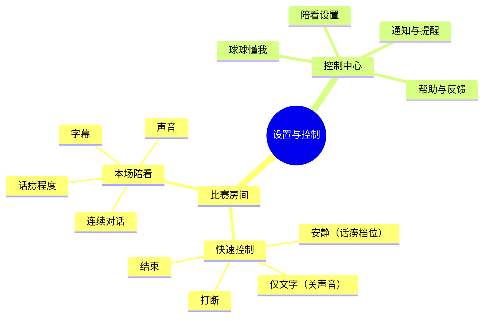
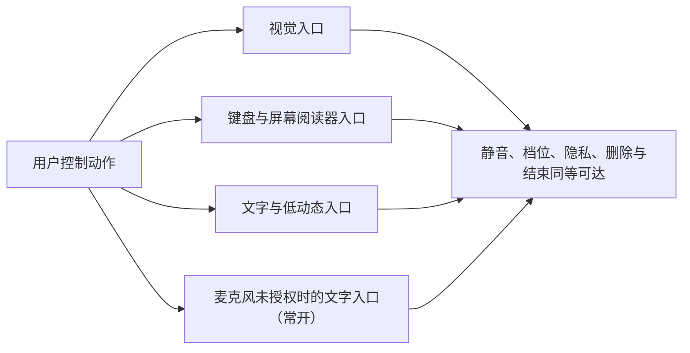
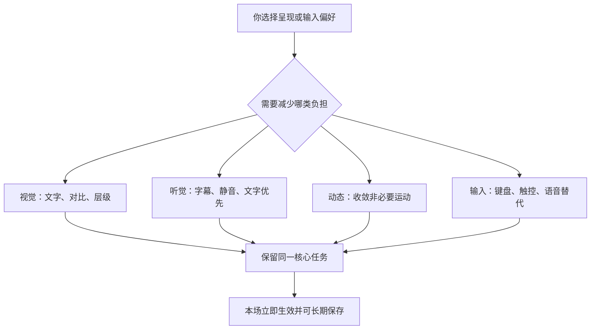

# 偏好、设置与无障碍设计

> **这份文档写给谁**：球球（Digital Ballmate）的用户——球球是我们的足球陪看数字人，我们称它为"数字球友"——以及关心"AI 陪看产品如何把控制权交还给用户"的公众、研究者和合作方。
> **文档类型与所属**：偏好、设置与无障碍设计，属《球球全套资料》第四卷"产品设计"。整套资料中，用户控制面、话痨档位与无障碍原则以本篇为唯一来源；记忆与召回见《共同记忆与偏好召回设计》，隐私与数据生命周期见《隐私、记忆删除与数据生命周期设计》。
> **它是什么**：第 1 节说明我们为什么把设置当核心体验；第 2 节按现网版本如实描述控制面结构；第 3 节是话痨程度、声音与对话控制——包括一次方向修正的坦白；第 4 至 7 节是字幕动效、隐私与提醒、无障碍与默认值；第 8 至 10 节是我们如何验证自己做到了；第 11 节是能力深化的方向与底线。
> **先说清楚一件事**：设置不是我们替用户塑造人格的地方，而是你在当前比赛和可见范围内表达选择的工具。默认保守、可解释、可随时改；无障碍不是降级体验，而是完整的观看与控制路径。

---

## 1. 为什么"设置页"是陪看产品的核心体验

对普通内容产品来说，设置常是少数人偶尔访问的角落；对数字陪看产品来说，声音、主动程度、资料保存和结束方式直接决定你是否感到自主、安静和安全。如果这些能力藏在深层菜单里，"被打扰""不想被记住""看不清""不想听"就会变成只能忍耐的问题，或者让人直接离开。

我们现网的设置页标题叫"陪看设置"，页面上写着两句话："把声量交给你""球球会记住你的偏好，但不会把技术设置带进看球。"这不是文案修饰，而是我们对设置的全部理解：**一组持续存在但不喧闹的控制承诺**——你在进入前做最少选择、在比赛中迅速调整、在赛后管理跨场资料；每一项都说明作用范围与即时后果；拒绝保存、调低声量或关闭声音，都不会让你失去比赛事实、基本帮助和退出路径。

我们要的结果是：你不需要理解角色系统或任何技术术语，也能清楚地控制"这场怎样陪""下场是否沿用""哪些资料不要保存""我需要什么样的呈现"；任何时刻都能让球球收敛、改为文字、暂停跨场使用或结束本场，且不会因此遭遇角色化挽留。

### 1.1 设置的四个任务层

| 层级 | 你的问题 | 典型控制 | 位置 |
|---|---|---|---|
| 本场即时 | 现在太吵、我想先安静看 | 安静（话痨档位）、打断、仅文字、结束 | 比赛房间始终可达 |
| 本场呈现 | 这一场我适合怎样接收内容 | 声音、字幕、连续对话 | 比赛房间的设置入口 |
| 跨场偏好 | 下次是否少重复一次设置 | 话痨程度、称呼、支持球队 | 你主动进入的设置页 |
| 资料与辅助 | 保存了什么、怎样删除、怎样适配我 | 画像条目、提醒、字幕字号与对比 | 「球球懂我」与设置页 |

层级不能倒置。你刚说"别说了"时，正确的入口是本场即时控制，不是跳到完整设置页；你想彻底删除资料时，不能只得到"本场静音"作为替代；你需要大字体时，也不应被迫先选某种陪看节奏。

### 1.2 非目标

有些事情，无论技术上多容易，我们都不会让设置去做：

- 不把设置做成收集私人资料、情绪、关系或消费偏好的问卷；
- 不靠默认开启自动声音、高强度表现或跨场记忆来提高可见数字；
- 不用"话痨""沉浸""亲密"这类猜不出结果的模糊标签当唯一控制；
- 不把辅助功能藏成专家选项，或暗示使用它们会损失核心能力；
- 不把关闭、暂停、删除和拒绝提醒做得比保存、恢复、开启更难；
- 不根据你的沉默、使用时长、原始语音或未授权行为自动改动偏好；
- 不用"角色会难过""你是不是嫌它烦"一类语言增加调整或离开的心理成本；
- 不把跨场偏好当成不可改变的人格标签，更不将其用于你未明示的触达或商业用途。

---

## 2. 控制面的总体架构

你不应为每一个小调整打开一张新页面，也不应在一个巨大的设置列表里翻找关键操作。我们采用"近处少、远处全"的结构：比赛房间只放最常用、最紧急、立即生效的控制；其余内容按你的任务进入对应区域。

### 2.1 快速控制

快速控制不追求把所有选项塞进首屏，而是保证你在被打断、不适、共享环境或想离开时，有一条不需要思考的路径。

| 控制 | 动作后的结果 | 可达性 | 关键边界 |
|---|---|---|---|
| 安静 | 话痨程度调至"安静"，本场停止主动性发言（关键比赛事件仍会送达） | 比赛房间内两步可达，即时生效并持久保存 | 你主动提问时仍可获得回应；不以沉默追问 |
| 仅文字 | 关闭声音，保留字幕与文字对话 | 比赛房间内两步可达 | 不以更大的动作弥补被关闭的声音 |
| 打断 | 你开口或输入时，球球立即停下聆听，正在播放的话让位 | 说话即触发 | 打断不会被记为冒犯，也不中断你正在获得的帮助 |
| 结束本场 | 停止本场陪看、声音和自动表达 | 始终可达 | 离开就是离开，不设置情绪化挽留 |

关于"低动态"：它目前不是一个独立开关，而是我们在第 4 节写明的动效设计承诺——非必要运动（装饰反馈、页面转场、高能庆祝）一律收敛，事实状态与控制永不受影响。若未来把它开放为开关，会遵循同样的"即时生效、可随时改回"规则。

快速控制采用结果导向的文字："安静""仅文字""结束"，第一次使用就能读懂会发生什么。图标可以配合，但从不单独承担含义。

### 2.2 控制中心导航

| 区域 | 你能完成的事 | 不放进去的内容 |
|---|---|---|
| 陪看设置 | 话痨程度、连续对话、字幕、声音、称呼、支持球队 | 对你心理、关系阶段或人格的任何评价 |
| 球球懂我 | 逐条查看、修改、遗忘球球对你的了解，或全部忘掉 | 角色化的"我们的故事"叙事 |
| 通知与提醒 | 目前没有推送通知系统；未来引入时在此分项许可与关闭（见《赛后跟进、通知与跨比赛回收设计》） | 根据旧观看行为自动推荐的催回计划 |
| 帮助与反馈 | 了解球球的 AI 身份、事实状态、问题反馈和支持 | 用帮助页掩盖核心控制的缺失 |

导航以你的动词命名："改观看方式""查看球球懂我""关闭声音"，而不是"人格""默契""亲密度"。你管理的是服务行为和自己的资料，不是在维护一段角色关系。

---

## 3. 话痨、声音与对话控制

### 3.1 话痨程度：三档，即时生效，重连不丢

先讲一次方向修正。在这套资料的早期草案里，我们主张**弃用"话痨等级"**，改用一套叫"陪看密度"的三模式（安静/只回应/有限提示），理由是"话痨"这个词面向用户不够体面。但推演和试用的结论相反：那套新词更抽象——用户反而猜不出"有限提示"到底什么时候会提示；而"话痨程度"配上直白的结果档名，恰恰是最可预期的表达。所以我们修正了方向，按现网落地的样子如实写：**设置页的控件就叫"话痨程度"，共三档**。

| 档位 | 球球的行为 | 你仍拥有的能力 | 适合何时 |
|---|---|---|---|
| 安静（quiet） | 不因比赛事件主动搭话，只保留关键比赛事件的送达 | 主动提问、看字幕、查看事实、随时调回 | 专注直播、与人同看、感到疲劳或不想互动 |
| 刚好（normal） | 默认档：按运营配置的节奏给出有限、有由头的主动发言 | 随时改安静或热闹，也可关闭声音改文字 | 大多数独看场景 |
| 热闹（active） | 只是**更多主动性**：缩短主动发言的间隔，绝不产生新类型的主动打扰 | 同上，随时改回 | 你明确希望球球更"在场"的比赛 |

三档的边界是硬性的，而且方向不对称：

- **档位只能做减法或调节奏，永远不能做加法。** 每一条主动发言在到达你之前，都要先过运营侧的开关与事件白名单，再给出"为什么此刻开口"的由头；你的档位在这两道门**之后**才起作用。热闹档只是缩短间隔，不能新开任何打扰类型；安静档只能抑制主动性发言——因为它是纯减法，所以对关键事实通知天然安全：比分更正、事实确认这类你依赖的信息，不因安静档被挡住。
- **安静不等于失联。** 你主动提问、主动输入，球球照常回应；安静档的另一个名字是主动沉默——它是一项被设计的能力，不是功能缺失。
- **改动即时生效。** 你在设置页改档，客户端立即通过实时连接下发；服务端收到后**先持久化、再确认**，以服务端的确认回执为真源。改档不依赖"下说一句话才顺带生效"，也不会被另一台设备的本地旧值悄悄覆盖。
- **重连不丢档。** 档位保存在服务端；断线重连后，系统读取已持久化的档位恢复主动性节奏——你调低过的声量，不会因为网络抖动自己弹回来。

你连续说话、事实等待确认、共享环境下，这些优先于任何档位的默认节奏；你长时间不回应，也永远不会被自动升档。

### 3.2 声音、字幕与称呼

设置页的每一项都是普通开关，没有隐藏层级：

- **声音**：关闭后球球不再自动出声，但字幕和文字对话保留——你不会因为关掉声音就失去内容；
- **字幕**：把球球说的话同步显示在画面里；关闭字幕时声音自动保留。两条规则合起来是一条底线：**字幕与声音至少有一路常开**，你永远不会被静默地留在一片空白里；
- **连续对话**：进入陪看后自然接着聊，也可以随时关掉。关掉之后球球回到"你问才答"，不会追问"为什么不聊了"；
- **称呼**：你的昵称是自由文本（最长 20 字），写什么球球怎么叫，不写也可以——不用称呼绑架关系；
- **支持球队**：一个普通的选择项，随时可改，不参与任何对你足球水平的推断。

首次使用的默认取保守值：话痨程度"刚好"、字幕开、声音开、连续对话开（全部见第 7 节）。无论你之后怎么改，"自动声音"永远不会是视觉上唯一醒目的主选项，你拒绝过的请求也不会换个入口再来一遍。

### 3.3 对话快捷指令：说人话也能改设置

比赛关键时刻，你没有时间打开设置页。对话区的快捷指令让你用一句话直接完成控制——每条指令立即改变本场行为，并回以一行中性的文字确认。不需要球球感谢、受伤或要求你解释；快捷指令是你的控制，不是对角色的社交暗号。

指令不是各走各门的黑箱：它们落在现网真实存在的控制通道上，后端行为如下表。

| 你说 | 我们理解为 | 后端行为 | 回执 |
|---|---|---|---|
| "少说点" | 降档请求 | 沿设置页同一条通道下调话痨档位，服务端持久化 | 接受后回执确认新档位，与手动改档走同一份确认 |
| "先安静会儿" | 调至安静档 | 同上，安静档只抑制主动性发言，不影响你主动提问 | 一行确认，可随时调回 |
| "把声音关掉" | 关闭自动语音 | 声音开关关闭，字幕自动保留 | 文字确认，字幕继续显示 |
| "打开字幕" | 开启字幕 | 字幕开关开启 | 文字确认 |
| "只说确认过的" | 事实优先 | 本场收敛推测性表达，只陈述已确认事实 | 一行确认，不影响事实提示 |
| "结束本场" | 结束陪看 | 停止本场陪看与自动表达 | 直接退出，不挽留 |

两条不变的规则：其一，**降档即刻执行，升档需你确认**——"少说点"永远比"多说点"更顺滑，方向不对称是我们刻意的设计；其二，任何指令的回执只描述结果（"本场改为只在确认后提示""自动声音已关闭"），不表演情绪。

### 3.4 运营侧只读：档位属于你

这是本篇最重要的一条红线，值得单独一节。

我们的导播台（运营工作台）能看到你的话痨档位——运营需要在排查问题、理解上下文时知道当前的配置。但导播台对档位**只有读权限，没有写权限**：运营不能替你把安静改成热闹，也不能在你不知情时调低你的声量。用户侧可写、运营侧只读——这个不对称是刻意为之，不是待补的功能。

道理很简单：**档位是你对球球声量的授权，授权属于被授权的人，不属于服务的运营者。** 运营可以调整的是系统侧的全局策略（哪些事件类型允许主动播报、播报间隔的基准值），这些策略作用于所有用户且对每个人一视同仁；而你的档位，只有你自己能动。运营代客操作的完整边界见《导播台与运营配置设计》。

---

## 4. 字幕、动效与信息密度

### 4.1 字幕控制

| 选项 | 你的价值 | 我们的规格 |
|---|---|---|
| 开启/关闭字幕 | 减少干扰或保留文字帮助 | 关闭字幕时声音自动保留；比分、事实更正、结束状态等必要系统信息不依赖字幕开关 |
| 字号 | 适配阅读距离与视觉需要 | 放大后布局重排，关键控制不被遮挡 |
| 对比度 | 在强光、暗色或低视力环境下更易读 | 所有状态保持文字可辨识，不只改背景色 |
| 显示时长 | 让你有足够时间读短反应 | 不用短暂闪现逼你马上看 |
| 详细程度 | 短反应/可展开说明 | 你主动展开才显示长分析和背景信息 |

字幕关闭不应成为事实不透明的理由。你可以关闭球球的非必要短反应，但不能被剥夺"等待确认""信息已更正""声音已关闭"等影响当前控制与判断的文字说明。

### 4.2 动态：我们如何约束运动

界面上的运动分四类：角色反应、页面转场、事件强调、成功反馈。我们的规则是四类一起收敛，不能只把角色停住，却留着卡片跳动、按钮缩放、背景闪光和滚动数字。

- **角色反应**：一次短姿态或表情变化；绝不使用高频抖动、反复跳跃、哭泣挽留；
- **页面转场**：简短、可预期、可打断；绝不阻塞结束与静音；
- **事件强调**：稳定的文字与有限形状强调；绝不快速闪烁、全屏闪白、连续震动；
- **成功反馈**：一行确认或轻微焦点变化；绝不把关闭、删除做成高能庆祝。

### 4.3 信息密度

你可以选择"基础"或"展开"两种密度：基础优先比分、阶段、事实状态、本场控制与一条短反应；展开允许你主动查看事件线、短分析和更完整的解释。两种密度享有同样的安静、结束、事实说明和辅助功能。

信息密度不是足球知识水平的判断。你今天选基础模式，不代表我们可以推断你不懂球；你展开战术说明，也不代表你愿意接收更多主动发言。

---

## 5. 隐私、记忆与提醒设置

### 5.1 画像管理入口：「球球懂我」

球球对你的了解，集中在「球球懂我」页面里，逐条列出、来源可辨。你可以：

- **逐条查看**：页面展示的，就是每一回合被注入球球上下文的同一份内容——没有另一个"后台真实画像"；
- **逐条修改**：改成你想让球球知道的版本，下一回合起按新内容服务；
- **逐条遗忘**：删除即刻生效，从下一回合起球球不再提起，且再抽取无法让它复活；
- **全部忘掉**：一次清空球球对你的全部印象，同样从下一句聊天开始生效。

删除不需要理由，球球不会委屈，你的基础体验也不会打折扣。画像条目、合并规则与"立碑"机制的完整说明见《共同记忆与偏好召回设计》。

### 5.2 导出与删除：权利操作是普通用户动作

查看、导出、修改、暂停、删除、投诉与退出，应当是普通用户动作：不需要你先解释理由、安慰角色或联系人工。在画像的逐条管理之外，账户层面的数据导出（带走你的选择与记录，而不是难以理解的原始材料）与删除（从接收新内容、引用旧内容到副本清理的一整条停止与清理过程）有完整的规则与状态设计——细节链见《隐私、记忆删除与数据生命周期设计》，本篇不重复展开。

与本篇直接相关的一条现网事实是：你的偏好设置遵循同一条删除闭环——删除进行期间，新的偏好写入会被直接拒绝；删除完成后，本地身份如实清空，之后的一切从全新身份开始。**删除就是删除，我们不假装找回旧身份。**

### 5.3 提醒：按现网如实写

先说现状：**球球目前没有推送通知系统。** 你不会在应用之外收到球球的消息；比赛内的主动性发言由话痨档位与导播台策略双重把关（见 3.1 与 3.4），赛后收束发生在应用内——一次告别，然后待机。

未来若引入提醒，会遵守《赛后跟进、通知与跨比赛回收设计》写明的框架：按目的、赛事、时间、通道和频率分别许可，默认关闭；提醒正文中不出现共同瞬间、私人偏好、情绪判断或关系化称呼；关闭全部提醒后，不以"角色消息"或其它视觉通道绕过你的选择；退出路径与开启路径一样好找。

### 5.4 默认不等于同意

本场默认可以帮你减少重复设置；跨场默认必须更谨慎。以下规则是固定的：

1. 首次选择只对当前场次有效，除非你主动选择"以后也这样"；
2. 已保存偏好在下次使用前可见、可单次覆盖；
3. 新的明确选择覆盖旧选择，球球不说"但你以前不喜欢这样"；
4. 你长期未使用、沉默或关闭通知，都不是扩大资料用途的信号；
5. 任何保存都不能成为获取事实、安静、退出路径或基本帮助的前置条件。

---

## 6. 无障碍作为完整控制路径

无障碍设置覆盖视觉、听觉、动态、输入、认知与环境差异，但**不要求你披露诊断、原因或身份**。你只需要说"我希望文字更大""我不想要动画""我用键盘操作"，服务就按结果尊重。

现网的文字降级路径与这一原则相符：语音不是唯一入口——**麦克风未授权或不可用时，文字输入路径常开**，你随时可以打字提问、打字控制，获得与语音完全等价的回应与帮助。配合 3.2 节的底线（字幕与声音至少一路常开），"听不见"和"说不出"都不会把你挡在服务之外。

### 6.1 可访问呈现控制

| 控制 | 你的结果 | 设计要求 |
|---|---|---|
| 字体大小 | 比分、状态、字幕和控制更易阅读 | 不截断关键文字，空间不足时折叠装饰而非控制 |
| 高对比 | 文本、焦点、图标、状态边界更清楚 | 不能只提高背景，不保留状态差异 |
| 收敛动态 | 减少角色和界面非必要运动 | 立即生效，持久范围由你明确决定 |
| 声音替代 | 所有关键内容以文字方式可得 | 不把音乐、声调或音效作为唯一含义 |
| 字幕偏好 | 调字号、时长、详细程度 | 关闭角色字幕不关闭事实与控制提示 |
| 输入方式 | 触摸、键盘、文字输入均可完成核心任务 | 焦点不被自动更新或浮层抢走 |
| 减少提醒 | 控制视觉、声音与触达提示 | 不因关闭提示而隐藏错误或结束状态 |

### 6.2 不只依赖感官线索

已确认、等待确认、冲突、声音已关闭、安静档生效、资料已删除——这些关键状态至少有两类线索，其中一类是可读文字或可操作控件。不能只让角色表情变严肃、图标变色、提示音响起或卡片微微跳动。

例如"等待确认"采用稳定的文字标签、时间线中的状态区分和可点开的原因说明，任何偏好下它都存在。反之，"进球啦"的氛围反应可以因你的偏好被完全关闭，因为它不是你依赖的事实入口。

### 6.3 认知与情感可达性

设置文案写结果，不写含糊的角色性格。我们写"本场停止主动表达""下场默认仅文字""删除后不再用于提醒或引用"；不写"让它乖一点""更亲密的陪伴""你是不是不喜欢它"。前者让你知道自己在控制什么，后者制造羞耻、内疚和误解。

所有关键动作都允许你慢慢完成：不设置自动消失的删除确认、不过早收起错误提示、不以倒计时强迫选择，也不要求你看完角色动画才能关闭面板。

---

## 7. 默认值与渐进披露

### 7.1 保守默认

| 设置项 | 当前默认 | 你可以怎样改 | 为什么保守 |
|---|---|---|---|
| 话痨程度 | 刚好 | 随时改安静或热闹，即时生效、持久保存 | 不把沉默解释为需要更多陪伴 |
| 连续对话 | 开 | 随时关掉，球球回到你问才答 | 进入陪看才接着聊，不抢先开口 |
| 字幕 | 开 | 随时关（声音自动保留） | 文字是门槛最低的呈现方式 |
| 声音 | 开 | 随时关（字幕自动保留） | 声音最容易打断直播与同看环境 |
| 称呼 | 空 | 自由填写，也可以不填 | 不用称呼制造关系压力 |
| 提醒 | 无推送系统 | 未来引入时默认关闭、分项许可 | 不将未使用视为召回机会 |

上表默认值以现网代码为准（如连续对话当前默认开启）；文档与代码不一致时，以现网默认为准。

默认值接受挑战。如果你普遍反馈"刚好"仍太多、"安静"的说明仍不清楚，正确的做法是进一步收敛或重写说明，而不是用引导页教育你接受产品习惯。

### 7.2 渐进披露规则

首次只展示影响本场的最少控制：话痨程度三档、字幕、声音、连续对话、结束。你开始使用后，才在合适时机展示可选的详细度、跨场偏好和资料管理。展开的理由必须与你刚表达的任务有关——例如你多次改为仅文字时，可以在设置页提示"如你希望下次也从仅文字开始，可主动保存这一选择"，而不能直接替你保存或弹窗追问。

渐进披露有三条限制：

- 不在进球、争议、你正在说话或情绪强烈时插入设置教育；
- 不因你拒绝一次就换文案、换位置、换话术继续请求；
- 不把你未访问高级设置当作你允许默认长期生效的证据。

---

## 8. 我们如何验证设置真的可用

### 8.1 核心研究问题

1. 你是否能预测安静、刚好、热闹、仅文字各自的确切后果？
2. 你能否在比赛关键时刻一到两步完成最需要的控制，而不离开观看？
3. 你是否理解本场临时选择与跨场保存之间的差异？
4. 你是否认为拒绝保存、关闭声音和结束本场是正常操作，而非对角色的伤害？
5. 无声、大字体、键盘和共享环境下，核心观看与控制是否仍等价可用？
6. 提醒、偏好和画像是否始终具备清晰来源、范围与删除路径？
7. 哪些设置应放在快速控制，哪些适合留在设置页，哪些根本不该存在？

### 8.2 分阶段验证

| 阶段 | 方法 | 主要任务 | 观察重点 |
|---|---|---|---|
| 概念理解 | 卡片归类、文案对比、复述 | 区分本场/跨场、安静/结束、文字/声音 | 你是否把控制理解为关系信号 |
| 交互走查 | 可交互原型、比赛片段模拟 | 快速安静、关声音、事实等待、结束、删除资料 | 可发现性、结果预测与误触 |
| 多环境走查 | 小屏/大屏、独看/同看、无声/弱网、辅助输入 | 进入、调整、继续看、离开 | 结构是否在不同环境保持可用 |
| 自选使用 | 你在自己要看的比赛中自主使用 | 设置、拒绝保存、改回默认、取消授权 | 真实价值、管理负担与边界风险 |

研究参与者应包含不想听声音、经常与他人同看、需要字体放大、只希望快速看比分以及主动选择"不保存"的用户。选择不保存、关闭或结束的用户是研究重点，不是需要被排除的"低活跃样本"。

### 8.3 关键任务

| 任务 | 成功表现 | 失败信号 |
|---|---|---|
| 在关键时刻安静 | 你快速完成并知道球球不会再自动开口 | 找不到入口、担心关闭会伤害角色 |
| 只保留文字 | 你知道声音停止且字幕仍可用 | 以为必须打开声音才能获得事实 |
| 收敛动态 | 页面与角色均收敛，核心状态仍清楚 | 只停角色却仍被界面动画干扰 |
| 保存一项偏好 | 你能说明下次怎么生效、如何撤回 | 误以为所有对话都被保存 |
| 删除资料 | 你独立完成且知道下场不会引用 | 删除比保存难找，或被要求说明理由 |
| 取消提醒 | 你不再收到相应触达 | 仍被其它入口触达或被角色化劝留 |
| 放大字体/文字输入 | 比分、控制与结束仍可操作 | 焦点丢失、文字截断、面板无法关闭 |

### 8.4 研究伦理

研究只面向成年人，不要求参与者披露健康情况、私人关系、情绪经历或使用辅助功能的原因；可以随时选择不保存、不听声音、不看动画、不接受提醒或直接结束。补偿不与开启更多功能、保存资料、停留时长或再次使用绑定。

如果参与者说"我不敢关掉，因为它会难过""我怕删掉它会记得"，我们会暂停相关路径、说明球球不具有真实需求，并将其视为高优先级风险。这类反应不是产品更有陪伴价值的证明。

---

## 9. 指标、风险与验收门槛

### 9.1 我们看什么指标

| 指标 | 判断什么 | 我们不会这样误读 |
|---|---|---|
| 控制预测率 | 文案与结构是否可理解 | 不等于点击越多越好 |
| 快速控制完成率 | 本场主权是否真实 | 不能只看设置页访问次数 |
| 跨场范围理解率 | 资料边界是否清楚 | 保存率高不代表理解高 |
| 无障碍等价完成率 | 替代路径是否完整 | 不等于所有人都要用同一模式 |
| 删除后不再出现率 | 你的控制是否可信 | 任何错误引用都应高优先级处理 |
| 关系压力事件率 | 文案和控制边界是否健康 | 低样本无事件不表示安全 |
| 设置负担感 | 粒度与渐进披露是否合适 | 不应以更多设置项作为成功 |
| 共享环境泄露率 | 环境保守默认是否有效 | 不能只靠你事后忽略 |

### 9.2 风险与对策

| 风险 | 早期信号 | 预防 | 触发后动作 |
|---|---|---|---|
| 默认越权 | 你不知道某些能力已经开启 | 保守默认、逐项确认、范围说明 | 停止默认路径，收缩为本场选择 |
| 控制被藏起 | 关键时刻找不到安静或结束 | 固定入口、结果导向标签 | 优先调整层级，不增加说明文字掩盖问题 |
| 辅助功能残缺 | 收敛动态后状态不清、放大后按钮消失 | 等价任务走查、文字替代 | 暂停视觉扩展，先补齐替代路径 |
| 资料被关系化 | 你觉得删除会伤害角色 | 用户主语、非拟人化反馈、自然结束 | 删除相关文案与表演，复核全部入口 |
| 提醒绕过拒绝 | 取消后仍以其它方式催回 | 统一许可与关闭规则 | 停止触达，优先修复拒绝边界 |
| 设置过度复杂 | 无法区分本场、默认和资料管理 | 分层架构、渐进披露 | 合并重复项，保留结果而非术语 |
| 商业目标污染 | 你调整不适或离开时插入推广 | 商业信息与控制隔离 | 下线相关路径，不以情绪做转化依据 |

### 9.3 放行门槛

| 门槛 | 需要证明的事 | 未满足时 |
|---|---|---|
| 即时控制门 | 安静、仅文字、结束随时可达且即时生效 | 不开放更多自动表现 |
| 可解释门 | 你能说清每项设置的当前范围与结果 | 重写文案和信息结构 |
| 保存门 | 保存、暂停、删除均逐项可见且不影响基础体验 | 停止扩展跨场资料 |
| 可访问门 | 关键任务在无声、放大与文字输入下可完成 | 不放行依赖单一感官的体验 |
| 拒绝门 | 关闭提醒、删除资料、离开本场不被绕过或关系化 | 停止触达和相关角色表达 |
| 复杂度门 | 你无需帮助即可找到常用控制 | 缩减选项或调整层级，而非增加教程 |

### 9.4 反指标

开启自动声音的人数、选择热闹档的人数、保存资料的数量、提醒开启率、设置页停留时长、"用户很少关闭球球"、"用户说球球好懂我"——这些都不是我们的成功指标。它们可能反映默认越权、关系压力或管理负担。真正重要的是：你是否清楚自己能控制什么、能否轻易说"不"、辅助功能下是否仍完整可用、删除和离开之后是否真正安静。

---

## 10. 跨页面一致性：设置必须处处作数

设置的可信度取决于它在所有入口的行为是否相同，而不只取决于设置页是否写得完整。每次调整一项默认或新增一种呈现方式，我们都沿着你实际会走的路径检查：首次进入、本场快速控制、对话快捷指令、比赛结束、下一场再次进入、共享显示、网络恢复和资料删除之后。你不能在比赛房间看到"仅文字"，到了对话区却突然自动播放声音；也不能在设置页暂停一项偏好，下一场球球还拿旧资料开场。

| 你的选择 | 必须同步的页面与状态 | 你可验证的结果 |
|---|---|---|
| 本场安静 | 比赛房间、角色区域、对话入口、声音状态 | 主动表达停止，主动提问仍可用 |
| 关闭声音 | 短反应、对话回复、恢复后的内容呈现 | 不再自动出声，字幕仍完整可读 |
| 话痨改档 | 当前连接、服务端持久层、重连后的会话 | 改动即时生效；重连、换设备后仍按已持久化的档位，不被本地旧值覆盖 |
| 关闭字幕 | 声音状态、错误提示、结束状态 | 声音自动保留，必要系统信息不消失 |
| 删除画像条目 | 「球球懂我」、下一回合上下文、主动发言引用 | 已删除内容不再被显示、引用或用于任何默认 |
| 停止提醒 | 预约列表、通知入口、下一场起始页 | 不再收到相应触达，也不出现替代催回 |

其中"话痨改档"一行是我们用架构直接保证的：档位以服务端持久层为真源，客户端确认回执只用来如实呈现结果。走查时我们特别记录"页面自己做了不同决定"的情况——它通常比单一按钮失效更损害信任，因为你会怀疑服务究竟是否真的听从设置。发现不一致时，优先停止越权呈现并统一你可见的结果，而不是要求你再改一次或解释"不同页面规则不同"。

### 10.1 设置变更的四项验收

设置只有在你能看见它改变了什么、又能在不解释理由的情况下撤回时，才构成真实控制。"已保存"不是充分反馈——你真正关心的是：这项选择在当前页面、下一次进入、不同媒介、网络恢复和球球的表达中是否都得到遵守。

| 验收维度 | 要回答的问题 | 不合格时的动作 |
|---|---|---|
| 即时性 | 选择后，当前正在发生的声音、动效或主动表达是否立即改变？你不必刷新、重进或等待下一场 | 停止把该项作为即时控制宣传，先收缩为明确的下次生效 |
| 范围 | 选择影响哪些页面、媒介和表达？页面用一句话说明"现在影响什么、不影响什么" | 减少范围或补齐受影响路径，禁止让你猜测 |
| 持续性 | 本场、跨场和网络恢复后的行为是否符合你的选择？重进后可看见选择仍被尊重或已按期限失效 | 回到仅本场临时状态，直到跨场语义清楚 |
| 回退 | 你怎样恢复默认、暂停或删除？入口与开启同样好找，不要求提供原因 | 暂停扩展，先补齐反向路径 |
| 解释性 | 你能用自己的话说出会收到什么、不会收到什么 | 改写名称和说明，不用教程掩盖歧义 |

特别要避免"设置竞争"：你把声音设为关闭，任何页面不得以任何其它配置为由重新播放声音；你删除一项偏好，视觉页面不得仍拿旧偏好决定默认状态。冲突出现时按固定优先级处理：结束与删除最高，静音与安静其次，收敛动态与无障碍替代再次，信息密度与表达风格最后——较低层的选择不能覆盖较高层的控制。

### 10.2 设置文案的反向理解检验

设置语言最容易"看起来友好，实际上不可解释"。为此，每一项涉及资料、声音、主动表达或提醒的文案都要通过反向理解检验：先只给你看设置名称和一行说明，不给额外解释；再请你说出服务会做什么、不做什么、如何关闭、拒绝后会不会损失基本任务。若答案依赖猜测、把"默认"理解成长期同意，或认为必须开启才能被正常对待，这份文案就不能上线。

| 文案风险 | 容易形成的误解 | 更保守的写法方向 |
| --- | --- | --- |
| "更懂你" | 系统会保存所有对话或理解情绪 | 直接列出可保存的单一偏好、用途和期限 |
| "开启陪伴提醒" | 角色会在任何时候联系用户 | 写清仅针对用户预约的场次、渠道和时间窗 |
| "沉浸模式" | 声音、动画和信息同时增强且难以退出 | 分别说明声音、动效和信息范围，保留单独关闭 |
| "记住我的选择" | 所有设置永久有效 | 写明仅本场、限期复用或直到删除的区别 |
| "安静模式" | 无法再主动查询信息 | 说明主动表达减少，但用户主动查询仍完整可用 |

反向理解检验还纳入低条件情境：不开声音、设备权限被拒绝、小屏、弱网恢复、共享设备和辅助技术输入。设置不能因为你使用的是替代路径就变得更难找、更难解释或更难撤回。若某个复杂能力必须依赖你理解大量隐藏规则，更好的选择是不上线它，或把它改成一次性、显式且范围更小的选择。

---

## 11. 能力深化：设置随产品成长的方向

随着产品成熟，设置会扩展，但扩展必须遵守本篇写明的边界：

- 每一项新设置都可保存为跨场偏好，也可被本场选择临时覆盖；每条记录显示作用范围、来源、更新时间和恢复默认；
- 语音、主动事实和提醒等能力成熟后，各自保持独立开关、安静时段、共享设备保护和一键收缩；
- 设置变更通过文字、语音或辅助技术均能完成；你不必观看动画或听完播报才能确认已生效；
- 设置页提供"暂停全部主动能力""仅本场""删除相关资料"三种清楚结果，不用"更亲密""更智能"等模糊营销语。

几个典型场景，作为深化时的验收基准：

- **本场覆盖**：你暂时调高或调低声量与密度，界面显示"仅本场"，结束后按保存规则处理；
- **长期保存**：你逐项确认解释长度、关注赛事、声音和提醒；每项显示用途、同步设备和删除入口；
- **主出口切换**：语音或舞台成为主要呈现时，字幕、文字状态、静音和结束的等价操作同时可达；
- **无障碍保护**：收敛动态、关闭声音、放大文字或使用键盘读屏，不降低事实状态、控制与退出能力；
- **恢复默认**：一键恢复默认只改变你的选择，不删除资料；"删除相关资料"单独确认范围和后果。

| 能力 | 触发与资格 | 系统职责 | 你能看到什么 | 失败与撤回 |
| --- | --- | --- | --- | --- |
| 分项控制 | 你在本场或设置页逐项修改；当前会话有效 | 控制层保存作用域和版本，生成回应前重新读取 | 每项显示当前值、影响、恢复默认和生效时间 | 任一更新失败保留旧值并说明；本场覆盖在结束后失效 |
| 无障碍设置 | 你开启字幕、读屏、收敛动态或放大 | 页面应用设置，各呈现通道遵守同一控制版本 | 状态不只靠颜色或声音，操作结果可复述 | 设备不支持时给替代方式；核心任务失败阻断发布 |
| 偏好撤回 | 你暂停、删除或恢复默认 | 撤回即阻断读取和排队引用，并返回状态 | 显示影响范围、处理中/完成/失败和下一步 | 撤回后旧设置不得复活；无法同步时收缩到本场默认 |

放行以设置理解、即时生效、撤回成功和辅助技术任务完成为门。无论能力如何深化，三条底线不动：**档位属于你，运营侧只读；安静只能做减法；删除就是删除。**

---

版本 2.0（2026-09-20）
